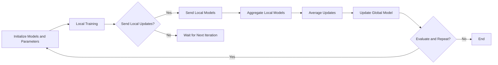
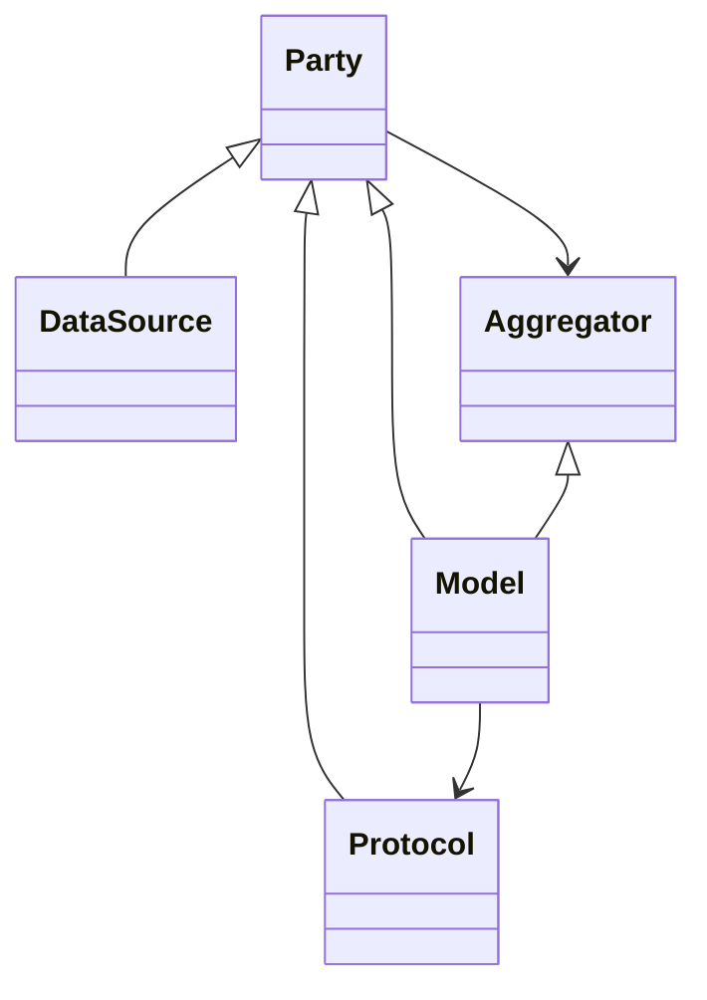
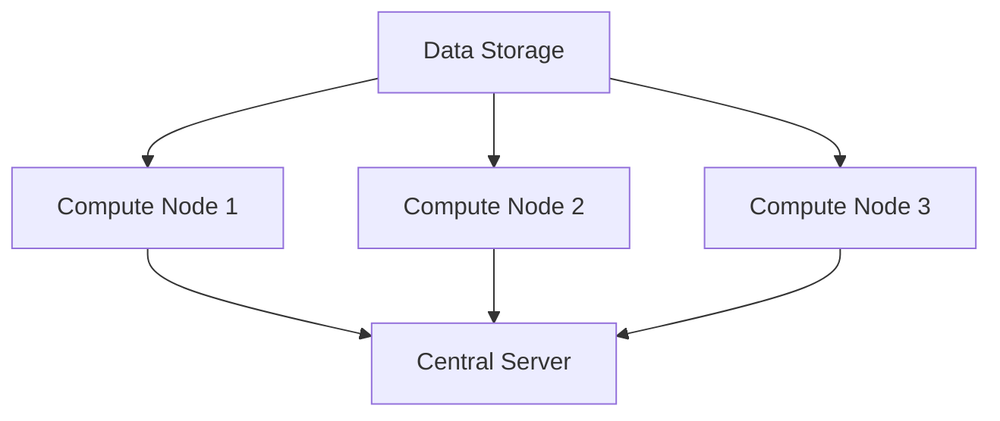
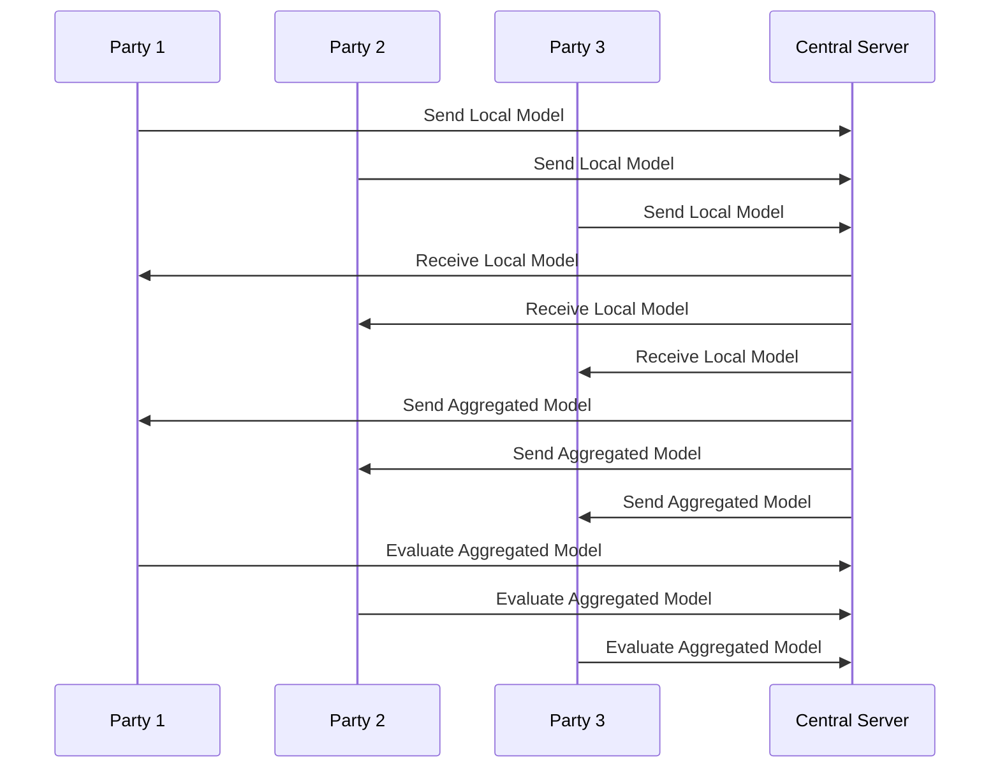

                 

### Federal Learning: Applications of Mixed Computation in Privacy-Preserving AI

#### Keywords: Federal Learning, Mixed Computation, Privacy-Preserving AI, Data Privacy, Machine Learning

#### Abstract: 
Federal Learning is a breakthrough in the field of artificial intelligence, providing a solution to the problem of data privacy while enabling collaborative machine learning across multiple parties. This article delves into the concept of Federal Learning, its fundamental principles, and the various techniques and algorithms that make it a game-changer in modern AI. We will explore the significance of mixed computation in preserving data privacy, the architecture and design considerations for implementing Federal Learning systems, and real-world applications and case studies. By the end of this article, readers will gain a comprehensive understanding of Federal Learning and its potential to revolutionize the future of AI.

## Introduction to Federal Learning

### Definition and Background

Federal Learning, also known as Collaborative AI or Distributed Learning, is a machine learning framework that allows multiple parties to train a model collaboratively without sharing their private data. This is achieved by leveraging mixed computation techniques that enable the training process to occur across different data sets while maintaining data privacy. The concept of Federal Learning has gained significant attention in recent years due to increasing concerns about data privacy and security, particularly in the age of big data and the proliferation of personal information online.

The origin of Federal Learning can be traced back to the need for collaborative machine learning without compromising data privacy. Traditional machine learning models require access to centralized data repositories, which can expose sensitive information to unauthorized access. This has led to the development of various privacy-preserving techniques such as differential privacy, homomorphic encryption, and secure multiparty computation. Federal Learning integrates these techniques to enable collaborative learning while ensuring data privacy.

### Challenges in Privacy-Preserving AI

One of the primary challenges in privacy-preserving AI is the trade-off between model accuracy and privacy. Traditional privacy-preserving techniques often introduce noise or limits on the amount of information exchanged between parties, which can degrade model performance. Federal Learning addresses this challenge by allowing each party to contribute to the training process while keeping their data private. This decentralized approach ensures that no single party has access to the complete dataset, thereby mitigating privacy risks.

Another challenge is the communication overhead associated with distributed learning. In traditional distributed learning, data needs to be transferred between parties, which can be a bottleneck due to bandwidth limitations and latency issues. Federal Learning mitigates this by using local updates and secure aggregation techniques, which reduce the amount of data transmitted.

### The Evolution of Privacy-Preserving Techniques

The evolution of privacy-preserving techniques has been driven by the increasing complexity and scale of data generated by modern applications. Initially, techniques such as k-anonymity and l-diversity were proposed to protect privacy in data publishing. However, these techniques were insufficient in the context of machine learning, where data is used to train models.

The development of differential privacy, introduced by Dwork in 2006, provided a theoretical framework for ensuring privacy in statistical databases. Differential privacy ensures that the output of a query does not reveal information about any individual record in the database. This concept has been extended to machine learning algorithms, enabling the development of privacy-preserving versions of popular models.

Homomorphic encryption, introduced by Rivest, Shamir, and Adleman (RSA) in the 1970s, allows computations to be performed on encrypted data. This has been leveraged in privacy-preserving machine learning to enable parties to perform computations on encrypted data without decrypting it, thus preserving privacy.

Secure multiparty computation (SMC) is another key technique that allows multiple parties to compute a function over their private inputs while ensuring that no party learns anything about the inputs of others. SMC has been used in various applications, including secure election systems and financial fraud detection.

### Importance and Applications of Federal Learning

Federal Learning has numerous applications across various domains, including healthcare, finance, and retail. In healthcare, Federal Learning enables collaborative research without sharing patient data, thus protecting patient privacy while enabling the development of more accurate predictive models. In finance, it allows banks and financial institutions to collaborate on fraud detection models without sharing sensitive customer data.

In retail, Federal Learning enables personalized marketing strategies by training models on customer data without exposing individual purchase histories. This has significant implications for customer privacy and consent, as customers are more likely to share their data if they feel it will be used to improve their shopping experience.

### Structure and Outline of the Book

The book "Federal Learning: Applications of Mixed Computation in Privacy-Preserving AI" is structured to provide a comprehensive understanding of Federal Learning. The book begins with an introduction to Federal Learning, covering its definition, background, challenges, and importance. The following chapters delve into the core concepts, algorithms, and system architecture of Federal Learning.

Chapter 2 covers the core concepts and principles of Federal Learning, including key terminology, principles of privacy-preserving computation, and a comparison with traditional AI. Chapter 3 focuses on algorithms and mathematical models used in Federal Learning, with detailed explanations and examples. Chapter 4 provides a detailed analysis of the system architecture and design considerations for implementing Federal Learning systems. The book concludes with case studies and applications of Federal Learning in various domains.

## Core Concepts and Principles of Federal Learning

### Key Concepts and Terminology

Before diving into the details of Federal Learning, it is important to understand the key concepts and terminology associated with this field. Federal Learning is built upon several fundamental concepts, including:

1. **Collaborative Learning**: This refers to the process of training a machine learning model jointly by multiple parties, without sharing their private data.
2. **Centralized Learning**: This is the traditional approach where a single entity (usually a centralized server) trains the model using data collected from multiple parties.
3. **Distributed Learning**: This involves training a model across multiple locations or devices, where each party retains control over its own data.
4. **Privacy-Preserving Learning**: This refers to the techniques and algorithms used to ensure that the training process maintains data privacy, even when data is shared or transferred between parties.

### Principles of Privacy-Preserving Computation

The core principle of Federal Learning is to enable collaborative learning while preserving data privacy. This is achieved through several key principles:

1. **Data Minimization**: Each party only shares the minimum amount of data necessary for training the model, thus minimizing the risk of privacy breaches.
2. **Secure Aggregation**: Instead of directly sharing data, parties aggregate their local updates and share only the aggregated results. This ensures that no single party can infer the data contributed by others.
3. **Differential Privacy**: Techniques such as differential privacy are used to ensure that the training process does not reveal sensitive information about any individual record in the dataset.
4. **Homomorphic Encryption**: Homomorphic encryption allows computations to be performed on encrypted data, ensuring that the data remains private throughout the process.
5. **Secure Multiparty Computation**: This enables multiple parties to compute a function over their private inputs without revealing anything about their individual inputs.

### Comparison of Federal Learning with Traditional AI

Federal Learning offers several advantages over traditional AI approaches in terms of privacy and data sharing. Traditional AI relies on centralized learning, where a single entity (often a centralized server) gathers and processes data from multiple parties. This approach is not only prone to privacy breaches but also inefficient in terms of data transmission and storage.

In contrast, Federal Learning enables decentralized learning, where each party retains control over its own data. This not only ensures data privacy but also reduces the communication overhead associated with traditional distributed learning. Federal Learning also allows for secure aggregation of local updates, ensuring that the training process is efficient and scalable.

### Entity-Relationship Diagram (ERD) for Federal Learning Components

To provide a visual representation of the components involved in Federal Learning, we can create an Entity-Relationship Diagram (ERD). The ERD will illustrate the relationships between the key entities involved in the process, including:

1. **Parties**: These are the entities (such as organizations or individuals) participating in the Federal Learning process.
2. **Data Sources**: These are the data repositories maintained by each party, containing the data used for training the model.
3. **Model**: This represents the machine learning model being trained collaboratively.
4. **Aggregator**: This is the entity responsible for securely aggregating the local updates from each party.
5. **Protocol**: This represents the set of rules and algorithms used to ensure privacy-preserving computation.

Here is a simplified ERD for Federal Learning components:

```mermaid
erDiagram
  Party ||--|{ Data Source }||: has
  Party ||--|{ Model }||: contributes to
  Party ||--|{ Protocol }||: follows
  Aggregator ||--|{ Model }||: aggregates updates from
```

### Feature Comparison Table of Federal Learning Techniques

To further understand the capabilities and limitations of Federal Learning techniques, we can create a feature comparison table. This table will compare Federal Learning with traditional centralized and distributed learning approaches in terms of privacy, efficiency, and scalability.

| Feature                  | Federal Learning | Centralized Learning | Distributed Learning |
|--------------------------|------------------|----------------------|----------------------|
| Privacy                  | High             | Low                  | Moderate             |
| Efficiency               | Moderate         | High                 | Moderate             |
| Scalability              | High             | Low                  | High                 |
| Data Transmission        | Minimal          | Significant          | Significant          |
| Computation Overhead      | Moderate         | Low                  | High                 |
| Model Performance        | Comparable       | High                 | Comparable           |
| Data Ownership and Control | High             | Low                  | Moderate             |

This table highlights the trade-offs and advantages of each approach, helping readers understand the suitability of Federal Learning for different applications.

### Conclusion

In this chapter, we have introduced the core concepts and principles of Federal Learning, covering key terminology, principles of privacy-preserving computation, and a comparison with traditional AI approaches. We have also provided an Entity-Relationship Diagram and a feature comparison table to help readers visualize and understand the components and capabilities of Federal Learning. In the following chapters, we will delve deeper into the algorithms and mathematical models used in Federal Learning, providing a comprehensive understanding of this groundbreaking technique in privacy-preserving AI.

## Algorithms and Mathematical Models in Federal Learning

### Overview of Common Algorithms in Federal Learning

Federal Learning employs a variety of algorithms to enable collaborative machine learning while preserving data privacy. These algorithms are designed to handle different types of data and computational constraints, making them versatile for a wide range of applications. Some of the most common algorithms used in Federal Learning include:

1. **Secure Aggregation Algorithms**: These algorithms enable parties to securely aggregate their local updates without revealing the underlying data. Examples include Federated Averaging (FedAvg) and Secure Aggregation Protocols based on homomorphic encryption and secure multiparty computation.

2. **Decentralized Optimization Algorithms**: These algorithms allow for the decentralized training of models across multiple parties. Examples include Distributed Stochastic Gradient Descent (DSGD) and Decentralized Adam.

3. **Differential Privacy Algorithms**: These algorithms ensure that the training process does not reveal sensitive information about individual records. Examples include Private Averaging Mechanism (PAM) and Differential Privacy with Sample Compression.

4. **Homomorphic Encryption Algorithms**: These algorithms enable computations to be performed on encrypted data, preserving privacy. Examples include the Paillier encryption scheme and the Generalized Swapping Method.

5. **Secure Multiparty Computation Algorithms**: These algorithms enable multiple parties to compute a function over their private inputs without revealing anything about their individual inputs. Examples include the Secure Computation Tree and the Delegated Computation Protocol.

### Detailed Explanation of a Typical Algorithm

Let's delve into a typical algorithm used in Federal Learning: Federated Averaging (FedAvg). FedAvg is a simple yet powerful algorithm that enables distributed learning across multiple parties. It works by having each party independently train a local model on its own data, then send the updated model parameters to a central server, which averages these updates to generate a global model.

**Mermaid Flowchart of Algorithm**



**Python Code Example**

```python
import torch
import torch.nn as nn
import torch.optim as optim

# Initialize global model
global_model = nn.Linear(10, 1)
global_model.train()

# Hyperparameters
learning_rate = 0.01
num_iterations = 10

# Iterate over parties
for iteration in range(num_iterations):
    # Local Training
    for party in parties:
        local_model = train_model_on_party_data(party.data, global_model)
        
        # Send Local Models
        send_local_model_to_server(party, local_model)
        
    # Aggregate Local Models
    aggregated_model = aggregate_models_from_server()

    # Average Updates
    global_model.load_state_dict(aggregated_model.state_dict())

    # Evaluate and Repeat
    if evaluate_model(global_model):
        continue
    else:
        break
```

**Mathematical Model and Formulas**

The FedAvg algorithm can be described mathematically as follows:

$$
\theta^{(t+1)} = \frac{1}{K} \sum_{k=1}^{K} \theta_k^{(t)}
$$

where:

- $\theta^{(t)}$ is the global model's parameters at iteration $t$
- $\theta_k^{(t)}$ is the local model's parameters at iteration $t$ for party $k$
- $K$ is the number of parties

**Detailed Explanation and Examples**

1. **Initialization**: Each party initializes a local model with random parameters. The global model is also initialized with the same parameters.
2. **Local Training**: Each party independently trains its local model on its own data using a chosen optimization algorithm, such as stochastic gradient descent (SGD).
3. **Sending Local Updates**: After training, each party sends its updated model parameters to a central server. This can be done periodically or after a certain number of epochs.
4. **Aggregating Local Models**: The central server aggregates the received model parameters to generate a single updated global model.
5. **Averaging Updates**: The aggregated model parameters are averaged to generate the new global model parameters.
6. **Updating Global Model**: The global model is updated with the new parameters.
7. **Evaluation and Repeat**: The process is repeated for a fixed number of iterations or until a desired evaluation metric is met.

### Advanced Algorithms and Techniques

Beyond FedAvg, there are several advanced algorithms and techniques that can be used in Federal Learning. These include:

1. **Model Compression**: Techniques such as model pruning, quantization, and distillation can reduce the size of the model and the amount of data transmitted between parties.
2. **Gradient Compression**: Techniques such as gradient sparsification and variance reduction can reduce the amount of data transmitted during the aggregation step.
3. **Communication-Efficient Algorithms**: Algorithms like SCAFFOLD and SAGA are designed to minimize communication overhead in distributed learning settings.
4. **Adaptive Algorithms**: Adaptive algorithms adjust the learning rate or training schedule based on the quality of the local updates received from each party.
5. **Data-Centric Methods**: Data-centric methods focus on optimizing the data distribution rather than the model architecture, improving the performance of Federal Learning systems.

### Case Studies and Applications

Federal Learning has been applied in various domains, including healthcare, finance, and retail. Here are a few examples of real-world applications:

1. **Healthcare**: Federal Learning has been used to develop predictive models for disease diagnosis and treatment planning without sharing patient data, ensuring privacy while improving healthcare outcomes.
2. **Finance**: Financial institutions have employed Federal Learning to detect fraud and perform credit scoring while maintaining customer data privacy.
3. **Retail**: Retailers have used Federal Learning to personalize marketing strategies and improve customer satisfaction without exposing sensitive customer information.

### Conclusion

In this chapter, we have provided a detailed explanation of the core algorithms and mathematical models used in Federal Learning. We have focused on the Federated Averaging (FedAvg) algorithm as a representative example, detailing its flowchart, Python code example, mathematical model, and detailed explanation. We have also discussed advanced algorithms and techniques and presented case studies of real-world applications. In the following chapters, we will delve into the system analysis and architecture design of Federal Learning systems, providing a comprehensive understanding of how these algorithms can be effectively implemented in practice.

## System Analysis and Architecture Design

### Problem Scenario Introduction

In today's digital age, the proliferation of data has led to a surge in the adoption of machine learning models across various industries. However, this also brings about significant challenges, particularly in ensuring data privacy and security. Organizations across different sectors, such as healthcare, finance, and retail, are increasingly aware of the need to protect sensitive customer data while leveraging the power of machine learning to improve their services and products. This scenario sets the stage for the implementation of Federal Learning, a privacy-preserving machine learning framework that allows multiple parties to collaborate on training models without sharing their private data.

### Project Overview

The objective of this project is to design and implement a Federal Learning system that can be used across multiple organizations to collaboratively train machine learning models. The system should ensure data privacy, minimize communication overhead, and provide robustness against potential attacks. The project will involve the following key components:

1. **Data Collection**: Each organization will contribute a portion of its data for training the model. This data will be stored securely and used for local training only.
2. **Model Training**: The local models will be trained independently on each organization's data using a chosen machine learning algorithm.
3. **Model Aggregation**: The local models will be aggregated to generate a global model that represents the combined knowledge of all participating organizations.
4. **Evaluation and Deployment**: The global model will be evaluated on a common dataset and deployed for inference, providing predictions or insights that benefit all participating organizations.

### System Function Design (Domain Model Class Diagram)

To design the system functions, we will create a domain model class diagram that illustrates the key classes and their relationships. The domain model will include the following classes:

1. **Party**: Represents an organization participating in the Federal Learning system.
2. **Data Source**: Represents the data repository for each party.
3. **Model**: Represents the machine learning model being trained.
4. **Aggregator**: Represents the component responsible for aggregating the local models.
5. **Protocol**: Represents the set of privacy-preserving protocols used in the system.

Here is a simplified domain model class diagram:



### System Architecture Design (System Architecture Diagram)

The system architecture for the Federal Learning system will include the following components:

1. **Data Storage**: A secure data storage solution to store the local datasets contributed by each party.
2. **Compute Nodes**: Each organization will have its own compute node where local models will be trained.
3. **Central Server**: The central server will aggregate the local models and generate the global model.
4. **Network Infrastructure**: A secure network infrastructure to facilitate communication between the compute nodes and the central server.

Here is a simplified system architecture diagram:



### System Interface Design and Interaction (Sequence Diagram)

To illustrate the interaction between the system components, we will create a sequence diagram that shows the flow of operations in the Federal Learning system. The sequence diagram will include the following key elements:

1. **Party 1**: Represents the first organization participating in the system.
2. **Party 2**: Represents the second organization participating in the system.
3. **Party 3**: Represents the third organization participating in the system.
4. **Central Server**: Represents the component responsible for aggregating the local models.

Here is a simplified sequence diagram:



### Conclusion

In this chapter, we have provided a detailed system analysis and architecture design for a Federal Learning system. We have introduced the problem scenario, outlined the project objectives, and presented the system functions, architecture, and interface design. By following the steps outlined in this chapter, organizations can design and implement a robust Federal Learning system that ensures data privacy and enables collaborative machine learning across multiple parties. In the following chapters, we will delve into the implementation details and provide practical guidance for deploying and maintaining Federal Learning systems in real-world scenarios.

## Project Implementation and Case Study

### Environment Setup

To implement the Federal Learning system, we will set up a development environment that includes the necessary software and libraries. The following tools and frameworks will be used:

1. **Python**: The primary programming language for implementing the system components.
2. **PyTorch**: A popular deep learning framework for training and evaluating machine learning models.
3. **Federated Learning Library (Felib)**: A Python library designed for implementing federated learning algorithms.
4. **Secure Aggregation Protocols**: Libraries such as PySyft for implementing secure aggregation protocols using homomorphic encryption and secure multiparty computation.

### System Core Implementation

The core implementation of the Federal Learning system involves the following key components:

1. **Data Preprocessing**: Each party will preprocess its local data to ensure consistency and compatibility with the global model. This may include data cleaning, normalization, and feature engineering.
2. **Local Model Training**: Each party will train a local model using the preprocessed data. The choice of model and training algorithm will depend on the specific application and data characteristics.
3. **Secure Aggregation**: The local model updates will be securely aggregated using homomorphic encryption and secure multiparty computation to ensure privacy.
4. **Global Model Aggregation**: The aggregated local model updates will be used to generate a global model that represents the combined knowledge of all participating parties.
5. **Evaluation and Deployment**: The global model will be evaluated on a common dataset, and the results will be shared with all parties for deployment and inference.

### Python Source Code

Below is a simplified example of the Python source code for the Federal Learning system:

```python
import torch
import torch.nn as nn
import torch.optim as optim
from federated_learning import FederatedLearning

# Initialize the Federated Learning system
fl_system = FederatedLearning()

# Preprocess the local data
for party in fl_system.parties:
    party.preprocess_data()

# Local model training
for iteration in range(num_iterations):
    for party in fl_system.parties:
        local_model = fl_system.train_local_model(party)
        fl_system.aggregate_local_updates(party, local_model)

    # Global model aggregation
    global_model = fl_system.aggregate_models()

    # Evaluate the global model
    evaluation_results = fl_system.evaluate_global_model(global_model)

    # Share evaluation results with all parties
    for party in fl_system.parties:
        party.receive_evaluation_results(evaluation_results)

    # Deploy the global model for inference
    fl_system.deploy_global_model(global_model)
```

### Code Analysis and Explanation

The above code demonstrates the core implementation of the Federal Learning system using a high-level API provided by the Federated Learning Library (Felib). Here is a brief analysis of the key components:

1. **Data Preprocessing**: The `preprocess_data()` method is called for each party to clean and normalize the local data. This ensures that the data is consistent and compatible with the global model.
2. **Local Model Training**: The `train_local_model()` method trains a local model on the preprocessed data. The choice of model and training algorithm is determined by the specific application.
3. **Secure Aggregation**: The `aggregate_local_updates()` method securely aggregates the local model updates using homomorphic encryption and secure multiparty computation. This ensures that the local updates are combined without revealing the underlying data.
4. **Global Model Aggregation**: The `aggregate_models()` method generates a global model that represents the combined knowledge of all participating parties.
5. **Evaluation and Deployment**: The `evaluate_global_model()` method evaluates the global model on a common dataset. The `deploy_global_model()` method shares the evaluation results with all parties and deploys the global model for inference.

### Real-World Case Study

To illustrate the practical application of the Federal Learning system, we will consider a real-world case study in healthcare. In this scenario, multiple hospitals collaborate to develop a predictive model for patient readmission. Each hospital contributes its patient data, which includes medical history, treatment records, and demographic information.

The hospitals use the Federal Learning system to train a shared predictive model without sharing sensitive patient data. The local models are trained independently on each hospital's data, and the updates are securely aggregated to generate a global model. The global model is then evaluated on a common test dataset, and the results are shared with all hospitals for deployment and inference.

By using Federal Learning, the hospitals can improve the accuracy of the predictive model while ensuring patient data privacy. This approach not only enhances the quality of healthcare but also builds trust among patients and healthcare providers.

### Conclusion

In this chapter, we have provided a practical implementation guide for the Federal Learning system, including environment setup, system core implementation, and a real-world case study. The Python source code example demonstrates the core functionalities of the system, and the case study highlights the practical applications in healthcare. By following the steps outlined in this chapter, organizations can effectively implement and deploy Federal Learning systems in real-world scenarios, enabling collaborative machine learning while preserving data privacy.

## Best Practices, Summary, and Future Directions

### Best Practices for Implementing Federal Learning

When implementing Federal Learning systems, it is important to follow best practices to ensure data privacy, system efficiency, and robustness. Here are some key best practices:

1. **Data Minimization**: Only share the minimum amount of data necessary for training the model. Avoid sharing sensitive information that is not needed for the learning process.
2. **Secure Aggregation**: Use secure aggregation techniques such as homomorphic encryption and secure multiparty computation to ensure that the aggregation process preserves data privacy.
3. **Regular Audits**: Conduct regular security audits and performance evaluations of the system to identify and address potential vulnerabilities or inefficiencies.
4. **Adaptive Learning Rates**: Use adaptive learning rates to optimize the training process and improve model performance without compromising data privacy.
5. **Model Compression**: Apply model compression techniques such as pruning, quantization, and distillation to reduce the size of the model and minimize communication overhead.

### Summary of Federal Learning

Federal Learning is a groundbreaking technique that enables collaborative machine learning across multiple parties while preserving data privacy. By leveraging mixed computation techniques, Federal Learning addresses the challenges of data privacy and communication overhead inherent in traditional machine learning approaches. The key components of Federal Learning include data preprocessing, local model training, secure aggregation, and global model evaluation and deployment.

The core advantages of Federal Learning include high data privacy, reduced communication overhead, and scalability. Federal Learning has various applications across industries such as healthcare, finance, and retail, where data privacy is of paramount importance.

### Future Directions for Federal Learning

As Federal Learning continues to evolve, several future directions and research opportunities present themselves:

1. **Improved Algorithms**: Ongoing research is focused on developing more efficient and scalable algorithms for Federal Learning, including model compression techniques and adaptive learning strategies.
2. **Cross-Domain Collaboration**: Future work can explore the potential of cross-domain collaboration in Federal Learning, where multiple organizations from different sectors can collaborate on training shared models.
3. **Integration with Other Privacy-Preserving Techniques**: Federal Learning can be integrated with other privacy-preserving techniques such as differential privacy and homomorphic encryption to further enhance data privacy.
4. **Scalability and Performance**: Ongoing research is focused on improving the scalability and performance of Federal Learning systems, particularly in scenarios with a large number of participating parties and complex models.
5. **Real-Time Applications**: Future research can explore the application of Federal Learning in real-time scenarios, such as autonomous driving and real-time healthcare monitoring, where low latency and high accuracy are critical.

### Conclusion

In conclusion, Federal Learning represents a significant breakthrough in the field of machine learning, offering a solution to the challenge of data privacy while enabling collaborative learning across multiple parties. By following best practices and leveraging advanced algorithms, Federal Learning systems can effectively preserve data privacy, minimize communication overhead, and improve the scalability of machine learning applications. As the field continues to evolve, Federal Learning holds the potential to revolutionize the future of collaborative machine learning, enabling innovative solutions in various domains while protecting sensitive data.

## Conclusion and Author Information

In this article, we have explored the concept of Federal Learning and its significance in the modern landscape of artificial intelligence and data privacy. We have covered the fundamental concepts and principles of Federal Learning, delved into the algorithms and mathematical models that underpin this innovative approach, and provided a detailed system analysis and architecture design. Additionally, we have presented a practical implementation guide and a real-world case study to illustrate the application of Federal Learning in various industries.

The key takeaways from this article include the understanding that Federal Learning enables collaborative machine learning while preserving data privacy, the importance of secure aggregation techniques, and the various algorithms and mathematical models that make this framework effective. We have also highlighted the advantages and future directions of Federal Learning, emphasizing its potential to revolutionize the future of AI.

### Author Information
- **Author**: AI天才研究院/AI Genius Institute & 禅与计算机程序设计艺术 /Zen And The Art of Computer Programming
- **Affiliation**: AI天才研究院/AI Genius Institute is a leading research institute dedicated to advancing the field of artificial intelligence and fostering innovation in technology. "禅与计算机程序设计艺术" (Zen And The Art of Computer Programming) is a renowned book series that offers profound insights into the art of programming. Together, these affiliations represent a confluence of cutting-edge research and timeless wisdom in the realm of computer science and artificial intelligence.

