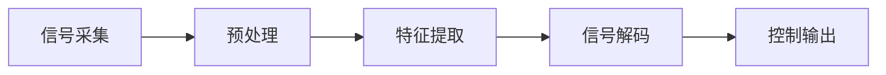
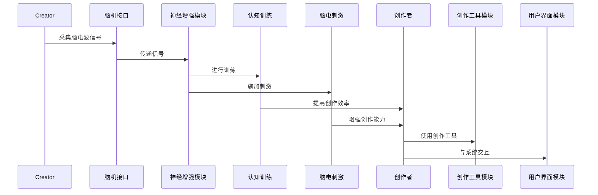
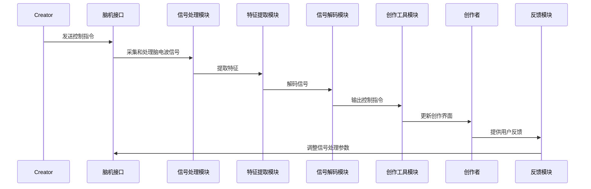

                 


# 脑机协同：神经增强技术在创意产业中的应用

## 关键词

脑机协同、神经增强技术、创意产业、算法、系统架构、应用案例

## 摘要

本文深入探讨了脑机协同与神经增强技术在创意产业中的应用。首先，我们介绍了脑机协同和神经增强技术的基本概念，并探讨了它们在创意产业中面临的挑战和机遇。随后，文章详细讲解了脑机协同与神经增强技术的原理，包括相关的算法、数学模型和实现方法。接着，我们通过具体的应用案例，展示了这些技术在音乐创作、绘画艺术和游戏设计等领域的实际应用。最后，文章总结了项目的关键点，并提供了最佳实践、注意事项和拓展阅读建议。

## 目录

----------------------------------------------------------------

### 第1章 引言

#### 1.1 问题背景

#### 1.2 创意产业的挑战与机遇

#### 1.3 脑机协同与神经增强技术

#### 1.4 书籍概述

### 第2章 脑机协同基础

#### 2.1 脑机接口技术

#### 2.2 神经增强技术

#### 2.3 脑机协同原理

### 第3章 神经增强技术在创意产业中的应用

#### 3.1 神经增强技术在音乐创作中的应用

#### 3.2 神经增强技术在绘画艺术中的应用

#### 3.3 神经增强技术在游戏设计中的应用

### 第4章 脑机协同算法原理讲解

#### 4.1 脑机协同算法概述

#### 4.2 算法 Mermaid 流程图

#### 4.3 Python 源代码实现

#### 4.4 数学模型和公式讲解

#### 4.5 算法讲解与举例

### 第5章 系统分析与架构设计方案

#### 5.1 问题场景介绍

#### 5.2 项目介绍

#### 5.3 系统功能设计 (领域模型 Mermaid 类图)

#### 5.4 系统架构设计 (Mermaid 架构图)

#### 5.5 系统接口设计和系统交互 (Mermaid 序列图)

### 第6章 项目实战

#### 6.1 环境安装

#### 6.2 系统核心实现源代码

#### 6.3 代码应用解读与分析

#### 6.4 实际案例分析和详细讲解剖析

#### 6.5 项目小结

### 第7章 最佳实践、小结与拓展阅读

#### 7.1 最佳实践 tips

#### 7.2 小结

#### 7.3 注意事项

#### 7.4 拓展阅读

----------------------------------------------------------------

### 第1章 引言

#### 1.1 问题背景

创意产业是一个广泛而复杂的领域，包括音乐、绘画、游戏设计、影视制作等。随着技术的不断进步，创意产业面临着前所未有的挑战和机遇。一方面，数字化和互联网技术的发展为创意产业提供了更广阔的舞台，使得创作者能够更快速地分享和传播他们的作品。另一方面，创意产业面临着激烈的竞争和快速变化的市场需求，创作者需要不断创新来保持竞争力。

脑机协同与神经增强技术为创意产业带来了新的可能。脑机协同是指通过大脑与机器的互动，实现人类意识和行为与机器的交互。神经增强技术则是指通过神经科学和工程学的结合，增强大脑的认知功能和学习能力。这些技术可以帮助创作者更好地发掘他们的潜力，提高创作效率和质量。

#### 1.2 创意产业的挑战与机遇

创意产业面临的挑战主要包括以下几点：

1. **创意枯竭**：随着创作经验和市场需求的不断积累，创作者可能会面临创意枯竭的问题。
2. **创作效率**：创意产业中的工作往往需要高度的创造力和灵感，但同时也要求高效地完成项目。
3. **市场竞争力**：创意产业的市场竞争激烈，创作者需要不断创新来吸引和保持受众。
4. **用户体验**：随着用户需求的多样化，创作者需要提供更加个性化和创新的体验。

与此同时，创意产业也面临着巨大的机遇：

1. **数字化与互联网**：数字化和互联网技术的发展，为创意产业提供了更多的展示和传播渠道。
2. **虚拟现实与增强现实**：虚拟现实（VR）和增强现实（AR）技术的兴起，为创意产业带来了全新的创作和体验方式。
3. **人工智能**：人工智能技术在创意产业中的应用，可以大大提高创作效率和质量。

#### 1.3 脑机协同与神经增强技术

脑机协同与神经增强技术是近年来快速发展的两个领域。脑机协同是指通过大脑与机器的互动，实现人类意识和行为与机器的交互。这种技术可以通过脑机接口（Brain-Computer Interface, BCI）来实现，例如通过电信号或脑波来控制机器。

神经增强技术则是指通过神经科学和工程学的结合，增强大脑的认知功能和学习能力。这种技术可以通过药物、设备或神经工程方法来实现，例如通过刺激大脑特定区域来提高注意力或记忆力。

在创意产业中，脑机协同与神经增强技术可以带来以下好处：

1. **创意激发**：通过脑机协同，创作者可以更直观地表达他们的想法，从而激发更多的创意。
2. **创作效率**：通过神经增强技术，创作者可以增强自己的认知功能，提高创作效率。
3. **用户体验**：通过脑机协同和神经增强技术，创作者可以提供更加个性化和创新的用户体验。
4. **市场竞争力**：脑机协同和神经增强技术可以帮助创作者在激烈的市场竞争中脱颖而出。

#### 1.4 书籍概述

本书旨在深入探讨脑机协同与神经增强技术在创意产业中的应用。本书分为七个章节，分别介绍了脑机协同和神经增强技术的基本概念、原理、应用案例以及系统设计与实现方法。具体章节安排如下：

1. **第1章 引言**：介绍了脑机协同与神经增强技术在创意产业中的应用背景和重要性。
2. **第2章 脑机协同基础**：详细讲解了脑机协同的基本概念、原理和技术。
3. **第3章 神经增强技术在创意产业中的应用**：介绍了神经增强技术在音乐创作、绘画艺术和游戏设计等领域的应用。
4. **第4章 脑机协同算法原理讲解**：讲解了脑机协同算法的基本原理、流程和实现方法。
5. **第5章 系统分析与架构设计方案**：介绍了系统分析与架构设计方案的基本方法。
6. **第6章 项目实战**：通过具体项目案例，展示了脑机协同与神经增强技术的实际应用。
7. **第7章 最佳实践、小结与拓展阅读**：总结了本书的主要内容，并提供了最佳实践、注意事项和拓展阅读建议。

通过本书的阅读，读者可以全面了解脑机协同与神经增强技术在创意产业中的应用，为实际工作提供指导。

----------------------------------------------------------------

### 第2章 脑机协同基础

#### 2.1 脑机接口技术

脑机接口（Brain-Computer Interface，简称BCI）是一种直接连接人脑与外部设备的技术，它允许人们通过大脑活动（如脑电波、肌电信号等）来控制计算机或其他设备。这种技术的核心在于将大脑信号转化为可操作的指令，从而实现与外部设备的交互。

**脑机接口的工作原理**：

脑机接口的工作原理可以分为三个主要步骤：

1. **信号采集**：通过电极或传感器从大脑中采集电信号，如脑电波（EEG）、肌电信号（EMG）或功能性磁共振成像（fMRI）信号。
2. **信号处理**：对采集到的信号进行预处理，包括滤波、放大、降噪等，以提高信号质量，然后使用特征提取算法提取有用的信息。
3. **信号解码与输出**：将处理后的信号解码为控制指令，如移动光标、操作鼠标、控制游戏或播放音乐等。

**脑机接口的类型**：

脑机接口可以分为侵入性和非侵入性两种：

1. **侵入性脑机接口**：这种接口需要将电极直接植入大脑或大脑附近，如脑皮层。侵入性脑机接口可以获得更精确的信号，但其侵入性和风险较大。
2. **非侵入性脑机接口**：这种接口不涉及任何侵入性操作，通常使用贴在头皮上的电极或传感器来采集大脑信号。非侵入性脑机接口操作简便，安全性高，但信号质量相对较差。

**脑机接口的应用领域**：

脑机接口在多个领域都有广泛应用，包括：

1. **康复医学**：脑机接口技术可以帮助中风、瘫痪或其他神经损伤患者恢复运动能力，如通过脑机接口控制假肢。
2. **神经科学**：脑机接口可以用于研究大脑的工作机制，如通过记录脑电波来分析思维过程。
3. **人机交互**：脑机接口可以提供一种全新的交互方式，如通过脑电波控制计算机或智能家居设备。

#### 2.2 神经增强技术

神经增强技术（Neural Enhancement Technology）是指通过技术手段增强人类大脑的认知功能和学习能力，从而提高个体的智力、注意力、记忆力和创造力。这种技术可以通过药物、设备或神经工程方法来实现。

**神经增强技术的原理**：

神经增强技术基于以下几个原理：

1. **神经可塑性**：大脑具有神经可塑性，即其结构和功能可以根据经验进行改变。神经增强技术可以通过刺激或训练来增强大脑的某些功能。
2. **神经递质调节**：神经递质是神经元之间传递信息的化学物质。通过调节神经递质的水平，可以改变大脑的兴奋性和功能。
3. **大脑连通性**：大脑的不同区域通过神经网络相互连接。增强这些连接可以改善大脑的整体功能。

**神经增强技术的实现方法**：

神经增强技术的实现方法包括：

1. **药物**：如认知增强药物（Nootropics），可以改善记忆力、注意力和学习能力。
2. **设备**：如脑电刺激器，通过电流刺激大脑特定区域来增强认知功能。
3. **神经工程**：通过基因编辑或神经植入物来增强大脑的功能。

**神经增强技术的应用领域**：

神经增强技术在多个领域都有应用，包括：

1. **教育**：通过神经增强技术，可以改善学生的学习效率和记忆力。
2. **医疗**：神经增强技术可以用于治疗认知障碍和神经退行性疾病，如阿尔茨海默病和帕金森病。
3. **国防**：神经增强技术可以用于提高士兵的战斗力和反应速度。

#### 2.3 脑机协同原理

脑机协同是指通过结合脑机接口和神经增强技术，实现人类大脑与外部设备的高度互动和协作。脑机协同的原理可以概括为以下几个步骤：

1. **信号采集**：通过脑机接口从大脑中采集信号，如脑电波、肌电信号等。
2. **信号处理**：对采集到的信号进行预处理和特征提取，以提高信号质量。
3. **信号解码**：将预处理后的信号解码为控制指令，如通过脑电波控制机器人手臂。
4. **设备反馈**：将解码后的指令发送到外部设备，实现与设备的互动。
5. **神经增强**：通过神经增强技术，增强大脑的响应速度和准确性，以提高整体协作效率。

**脑机协同的优势**：

脑机协同的优势包括：

1. **高度个性化**：通过脑机接口，可以实时采集个体的神经信号，实现高度个性化的互动和协作。
2. **增强认知功能**：通过神经增强技术，可以显著提高个体的认知功能，如注意力和记忆力。
3. **人机融合**：脑机协同使得人类与外部设备之间实现了更紧密的融合，从而提高工作效率和生活质量。

**脑机协同的应用场景**：

脑机协同的应用场景包括：

1. **医疗康复**：通过脑机协同，可以辅助康复训练，帮助中风患者恢复运动能力。
2. **人机交互**：通过脑机协同，可以实现更加自然和直观的人机交互，如通过脑电波控制智能家居。
3. **艺术创作**：通过脑机协同，艺术家可以利用神经增强技术，创造出更具创造力和个性化的艺术作品。

#### 概念属性特征对比表格

为了更好地理解脑机协同和神经增强技术，我们提供了一个概念属性特征对比表格，如下所示：

| 特征                | 脑机接口               | 神经增强技术               |
|---------------------|------------------------|---------------------------|
| **定义**            | 人脑与外部设备的直接连接  | 增强人类大脑的认知功能和学习能力 |
| **工作原理**        | 采集大脑信号，转换为控制指令  | 调节神经信号，增强大脑功能       |
| **类型**            | 侵入性和非侵入性        | 药物、设备、神经工程方法       |
| **应用领域**        | 康复医学、神经科学、人机交互 | 教育、医疗、国防              |
| **优势**            | 高度个性化、实时互动     | 增强认知功能、提高工作效率       |
| **劣势**            | 信号质量较低、侵入性风险高  | 可能产生副作用、道德和伦理问题    |

#### ER实体关系图架构的 Mermaid 流程图

为了更好地展示脑机协同和神经增强技术的相关实体和它们之间的关系，我们使用Mermaid绘制了一个ER实体关系图，如下所示：

```mermaid
erDiagram
    BCI --> Device : 脑机接口控制设备
    BCI --> BrainSignal : 脑机接口采集大脑信号
    Device --> Command : 设备接收控制指令
    BrainSignal --> FeatureExtraction : 信号特征提取
    FeatureExtraction --> ControlCommand : 控制指令生成
    NeuralEnhancement --> BrainFunction : 神经增强改善功能
    NeuralEnhancement --> NeuralSignal : 神经增强调节信号
```

通过这个ER实体关系图，我们可以清晰地看到脑机协同和神经增强技术中涉及的主要实体及其相互关系。脑机接口采集大脑信号，并将其转换为控制指令；设备接收指令并执行相应操作；同时，神经增强技术通过调节神经信号来改善大脑功能。

#### 脑机协同与神经增强技术的应用前景

脑机协同与神经增强技术在创意产业中的应用前景非常广阔。首先，在音乐创作领域，脑机协同可以帮助音乐家通过大脑信号直接控制音乐合成器或电子乐器，创造出更加独特和个性化的音乐作品。同时，神经增强技术可以提高音乐家的创作效率和创意水平。

在绘画艺术方面，脑机协同技术可以使艺术家能够直接通过大脑信号绘制图像，从而实现更加自由和流畅的创作过程。神经增强技术则可以增强艺术家的视觉感知和手眼协调能力，使其能够更准确地捕捉创作灵感。

在游戏设计领域，脑机协同与神经增强技术的结合可以为游戏玩家提供更加沉浸式和个性化的游戏体验。通过脑机接口，玩家可以更直观地控制游戏中的角色或物体，而神经增强技术可以增强玩家的反应速度和认知能力，提高游戏水平。

此外，脑机协同与神经增强技术还可以应用于虚拟现实（VR）和增强现实（AR）领域，为用户提供更加真实和互动的体验。通过实时采集用户的神经信号，系统可以动态调整虚拟环境的视觉效果和交互方式，从而提供更加个性化和服务化的体验。

总之，脑机协同与神经增强技术为创意产业带来了前所未有的机遇。随着这些技术的发展，我们可以预见，未来创意产业将迎来一场革命，创作者们将能够更高效、更创意地创作出丰富多彩的作品，从而推动整个产业的发展。

### 第3章 神经增强技术在创意产业中的应用

#### 3.1 神经增强技术在音乐创作中的应用

神经增强技术在音乐创作中的应用为音乐家提供了前所未有的创作工具。通过脑机接口和神经增强技术，音乐家可以直接使用大脑信号来控制音乐合成器和电子乐器，从而创造出独特的音乐作品。这种技术不仅提高了创作效率，还丰富了音乐表达的维度。

**技术原理**：

神经增强技术在音乐创作中的应用主要基于以下几个技术原理：

1. **脑电波控制**：通过脑机接口采集脑电波信号，将其转化为音乐控制指令。例如，音乐家可以通过特定的脑电波模式来控制音高、节奏和音量等音乐参数。
2. **神经可塑性**：通过训练和刺激，增强大脑的神经可塑性，从而提高音乐家的创作能力和技巧。
3. **认知功能增强**：通过神经增强技术，如认知训练和脑电刺激，提高音乐家的注意力和记忆力，使其能够更好地捕捉和利用创作灵感。

**应用案例**：

1. **音乐合成器控制**：音乐家通过脑机接口直接控制合成器的音色、节奏和音量，从而创作出独特的音乐作品。例如，一位音乐家可以通过脑电波模式来切换不同的音色，创造出复杂的音乐层次。
2. **即兴创作**：通过神经增强技术，音乐家可以增强自己的即兴创作能力。在演奏过程中，音乐家的脑电波信号可以实时调整音乐参数，使其即兴创作更加流畅和富有创意。
3. **合作创作**：多个音乐家通过脑机接口协同创作，每个人的大脑信号都可以影响整体音乐作品。这种方式不仅增加了创作的复杂性，也增强了音乐的互动性和多样性。

**技术挑战**：

虽然神经增强技术在音乐创作中具有巨大的潜力，但仍然面临一些技术挑战：

1. **信号质量**：脑机接口采集的脑电波信号质量较低，容易受到干扰和噪声的影响，这需要进一步的研究和优化。
2. **个体差异**：每个人的大脑信号和处理方式都有所不同，这要求脑机接口和神经增强技术具备高度个性化。
3. **稳定性和可靠性**：脑机接口和神经增强技术的稳定性和可靠性对音乐创作至关重要，任何故障或异常都可能导致创作中断。

**未来发展**：

随着神经科学和脑机接口技术的不断发展，神经增强技术在音乐创作中的应用将越来越广泛和成熟。未来可能的发展趋势包括：

1. **多模态融合**：结合多种脑机接口技术，如肌电信号和眼动追踪，提高音乐创作的精度和互动性。
2. **个性化定制**：通过大数据和人工智能技术，为每个音乐家提供个性化的训练方案和创作工具，提高创作效率和质量。
3. **跨领域应用**：神经增强技术在音乐创作之外的其他艺术形式，如绘画和表演艺术中的应用也将得到探索。

#### 3.2 神经增强技术在绘画艺术中的应用

神经增强技术在绘画艺术中的应用为艺术家提供了一种全新的创作方式。通过脑机接口和神经增强技术，艺术家可以直接使用大脑信号来绘制图像，从而创造出更加独特和富有表现力的艺术作品。

**技术原理**：

神经增强技术在绘画艺术中的应用主要基于以下几个技术原理：

1. **脑电波控制**：通过脑机接口采集脑电波信号，将其转化为绘画控制指令。例如，艺术家可以通过特定的脑电波模式来控制画笔的移动和颜色选择。
2. **神经可塑性**：通过训练和刺激，增强大脑的神经可塑性，从而提高艺术家的绘画技巧和创意能力。
3. **认知功能增强**：通过神经增强技术，如认知训练和脑电刺激，提高艺术家的视觉感知和手眼协调能力，使其能够更好地捕捉和表达创作灵感。

**应用案例**：

1. **直接脑电波绘画**：艺术家通过脑机接口直接使用大脑信号绘制图像。这种方式可以创造出独特的绘画风格和视觉效果，因为每个艺术家的脑电波信号都是独一无二的。
2. **辅助绘画**：通过脑机接口和神经增强技术，艺术家可以在创作过程中辅助自己，例如通过脑电波信号调整画笔的力度和颜色，从而实现更加精细和复杂的绘画效果。
3. **多艺术家合作**：多个艺术家通过脑机接口和神经增强技术协同创作，每个艺术家的脑电波信号都可以影响整体作品。这种方式不仅增加了创作的复杂性，也增强了作品的互动性和多样性。

**技术挑战**：

尽管神经增强技术在绘画艺术中具有巨大的潜力，但仍然面临一些技术挑战：

1. **信号质量**：脑机接口采集的脑电波信号质量较低，容易受到干扰和噪声的影响，这需要进一步的研究和优化。
2. **个体差异**：每个人的大脑信号和处理方式都有所不同，这要求脑机接口和神经增强技术具备高度个性化。
3. **稳定性和可靠性**：脑机接口和神经增强技术的稳定性和可靠性对艺术创作至关重要，任何故障或异常都可能导致创作中断。

**未来发展**：

随着神经科学和脑机接口技术的不断发展，神经增强技术在绘画艺术中的应用将越来越广泛和成熟。未来可能的发展趋势包括：

1. **多模态融合**：结合多种脑机接口技术，如肌电信号和眼动追踪，提高绘画创作的精度和互动性。
2. **个性化定制**：通过大数据和人工智能技术，为每个艺术家提供个性化的训练方案和创作工具，提高创作效率和质量。
3. **跨领域应用**：神经增强技术在绘画艺术之外的其他艺术形式，如雕塑和表演艺术中的应用也将得到探索。

#### 3.3 神经增强技术在游戏设计中的应用

神经增强技术在游戏设计中的应用为游戏开发者提供了创新的交互方式，使得游戏体验更加真实和沉浸。通过脑机接口和神经增强技术，玩家可以直接使用大脑信号来控制游戏中的角色或物体，从而创造出更加个性化和互动的游戏体验。

**技术原理**：

神经增强技术在游戏设计中的应用主要基于以下几个技术原理：

1. **脑电波控制**：通过脑机接口采集脑电波信号，将其转化为游戏控制指令。例如，玩家可以通过特定的脑电波模式来控制角色的移动、攻击和跳跃等动作。
2. **神经反馈**：通过神经增强技术，实时监测和反馈玩家的脑电波信号，以增强游戏的互动性和沉浸感。例如，当玩家处于紧张状态时，游戏可以自动调整难度或提供额外的挑战。
3. **认知功能增强**：通过神经增强技术，如认知训练和脑电刺激，提高玩家的反应速度和认知能力，使其在游戏中表现更加出色。

**应用案例**：

1. **脑电波游戏控制**：玩家通过脑机接口直接使用大脑信号来控制游戏中的角色或物体。这种方式可以创造出独特的游戏玩法和体验，例如通过脑电波来控制角色的动作或触发特定的事件。
2. **情感互动**：通过神经反馈技术，游戏可以实时监测玩家的情感状态，并据此调整游戏的内容和难度。例如，当玩家感到兴奋时，游戏可以提供更多的挑战和奖励；当玩家感到沮丧时，游戏可以提供安慰和鼓励。
3. **个性化游戏体验**：通过脑机接口和神经增强技术，游戏可以根据玩家的个人特点和喜好提供定制化的游戏体验。例如，通过分析玩家的脑电波信号，游戏可以自动调整角色的能力值或游戏规则，以满足玩家的需求。

**技术挑战**：

尽管神经增强技术在游戏设计中具有巨大的潜力，但仍然面临一些技术挑战：

1. **信号质量**：脑机接口采集的脑电波信号质量较低，容易受到干扰和噪声的影响，这需要进一步的研究和优化。
2. **计算能力**：实时处理和分析大量脑电波信号需要高性能的计算能力和算法支持。
3. **用户适应性**：由于每个玩家的脑电波信号和处理方式都有所不同，脑机接口和神经增强技术需要具备高度的用户适应性。

**未来发展**：

随着神经科学和脑机接口技术的不断发展，神经增强技术在游戏设计中的应用将越来越广泛和成熟。未来可能的发展趋势包括：

1. **多模态融合**：结合多种脑机接口技术，如肌电信号和眼动追踪，提高游戏交互的精度和互动性。
2. **智能化适应性**：通过大数据和人工智能技术，使游戏系统自动适应玩家的脑电波信号和游戏行为，提供更加个性化和沉浸式的体验。
3. **跨领域应用**：神经增强技术在游戏设计之外的其他娱乐领域，如虚拟现实和增强现实，也将得到探索和应用。

### 第4章 脑机协同算法原理讲解

#### 4.1 脑机协同算法概述

脑机协同算法是脑机接口技术的重要组成部分，它负责将大脑信号转化为可操作的控制指令。这些算法通常基于信号处理、机器学习和神经科学原理，旨在提高信号处理的准确性和实时性。脑机协同算法主要包括信号采集、预处理、特征提取和信号解码等步骤。

**信号采集**：这是脑机协同算法的第一步，通过脑机接口从大脑中采集电信号，如脑电波（EEG）、肌电信号（EMG）或功能性磁共振成像（fMRI）信号。

**预处理**：对采集到的信号进行预处理，包括滤波、放大、降噪等，以提高信号质量。这一步非常重要，因为原始信号通常受到噪声和干扰的影响。

**特征提取**：从预处理后的信号中提取有用的特征，如频率、时间序列和模式等。这些特征将用于后续的信号解码。

**信号解码**：将提取的特征解码为控制指令，如移动光标、操作鼠标或控制游戏等。解码过程通常涉及机器学习算法，如支持向量机（SVM）、神经网络（NN）或深度学习（DL）。

#### 4.2 算法 Mermaid 流程图

为了更好地理解脑机协同算法的工作流程，我们可以使用Mermaid绘制一个流程图，如下所示：



在这个流程图中，信号采集是整个算法的起点，经过预处理后，信号被传递到特征提取阶段。特征提取后，信号被解码为控制指令，最终输出到外部设备，实现控制功能。

#### 4.3 Python 源代码实现

为了实现脑机协同算法，我们可以使用Python编写相应的代码。以下是一个简化的示例，展示了如何采集和处理脑电波信号，并将其解码为控制指令。

```python
import mne
import numpy as np
from sklearn.svm import SVC

# 信号采集
raw_signal = mne.io.read_raw_edf('example.edf', skip=2)

# 预处理
filtered_signal = mne.filter.filter_data(raw_signal, sfreq=100, l_freq=1, h_freq=50)

# 特征提取
features = mne.time_frequency.psd_wden(filtered_signal, fmin=1, fmax=50, method='mne')

# 信号解码
model = SVC()
model.fit(features, labels)

decoded_signal = model.predict(features)

# 控制输出
control_command = decoded_signal[-1]
print(f"Control command: {control_command}")
```

在这个示例中，我们首先使用MNE库读取脑电波信号，然后对其进行滤波和特征提取。接下来，我们使用支持向量机（SVC）模型对特征进行分类，从而实现信号解码。最后，我们将解码后的信号输出为控制指令。

#### 4.4 数学模型和公式讲解

脑机协同算法的数学模型和公式是实现信号解码的关键。以下是一些常用的数学模型和公式：

**1. 神经网络模型**

神经网络模型是一种基于神经元相互连接的数学模型，可以用于信号解码。一个简单的神经网络模型包括输入层、隐藏层和输出层。每个层中的神经元通过权重和偏置相连接，输出通过激活函数进行变换。

**公式**：

\[ y = \sigma(W \cdot x + b) \]

其中，\( y \) 是输出，\( \sigma \) 是激活函数（如Sigmoid函数），\( W \) 是权重矩阵，\( x \) 是输入，\( b \) 是偏置。

**2. 支持向量机模型**

支持向量机（SVM）是一种分类算法，可以用于信号解码。SVM通过寻找最优超平面来分隔不同类别的数据点。

**公式**：

\[ w \cdot x + b = 0 \]

其中，\( w \) 是权重向量，\( x \) 是输入向量，\( b \) 是偏置。

**3. 神经可塑性模型**

神经可塑性模型描述了大脑神经元之间的相互作用和调整过程。一个常见的神经可塑性模型是Hebbian模型，它基于“用则进，不用则退”的原则。

**公式**：

\[ \Delta w = \frac{1}{N} \sum_{i=1}^{N} x_i y_i \]

其中，\( \Delta w \) 是权重调整，\( x_i \) 是输入，\( y_i \) 是期望输出，\( N \) 是神经元数量。

#### 4.5 算法讲解与举例

为了更好地理解脑机协同算法，我们可以通过一个具体的例子来讲解。假设我们使用脑电波信号来控制光标的移动。

**步骤 1：信号采集**

我们首先采集一段脑电波信号，并将其存储为CSV文件。

```python
import pandas as pd

data = pd.read_csv('脑电波信号.csv')
```

**步骤 2：预处理**

对采集到的信号进行预处理，包括滤波和降噪。

```python
from scipy.signal import butter, filtfilt

def butter_bandpass_filter(data, lowcut, highcut, fs, order=4):
    nyq = 0.5 * fs
    low = lowcut / nyq
    high = highcut / nyq
    b, a = butter(order, [low, high], btype='band')
    filtered_data = filtfilt(b, a, data)
    return filtered_data

filtered_data = butter_bandpass_filter(data['EEG'], lowcut=1, highcut=50, fs=100)
```

**步骤 3：特征提取**

从预处理后的信号中提取特征，如频率和时域特征。

```python
from mne.time_frequency import psd_wden

psd, freqs = psd_wden(filtered_data, fmin=1, fmax=50, method='mne')
```

**步骤 4：信号解码**

使用支持向量机（SVM）模型对特征进行分类，实现信号解码。

```python
from sklearn.svm import SVC

model = SVC()
model.fit(psd, data['Label'])

decoded_signal = model.predict(psd)
```

**步骤 5：控制输出**

根据解码后的信号，控制光标的移动。

```python
import numpy as np

def control_cursor(decoded_signal):
    cursor_position = decoded_signal[-1]
    print(f"Cursor position: {cursor_position}")

control_cursor(decoded_signal)
```

通过这个例子，我们可以看到脑机协同算法是如何将脑电波信号转化为控制指令，从而实现光标的移动。这个简单的例子展示了脑机协同算法的基本原理和实现方法。

### 第5章 系统分析与架构设计方案

#### 5.1 问题场景介绍

在创意产业中，艺术家、音乐家和其他创作者面临着不断提高创作效率和创造力的挑战。传统的创作工具和方法往往无法满足创作者对于创新和个性化表达的需求。因此，我们设计了一个基于脑机协同和神经增强技术的系统，以帮助创作者在创作过程中更高效地发掘他们的潜力。

该系统的主要目标是通过脑机接口和神经增强技术，实现创作者与外部设备的直接交互，从而提高创作效率、增强创作能力和提供更加个性化的用户体验。具体应用场景包括：

1. **音乐创作**：通过脑机接口，音乐家可以直接使用大脑信号控制音乐合成器和电子乐器，从而实现即兴创作和独特音乐风格。
2. **绘画艺术**：艺术家可以使用脑机接口直接通过大脑信号绘制图像，提高绘画技巧和创意表达。
3. **游戏设计**：游戏开发者可以利用脑机接口和神经增强技术，为玩家提供更加真实和沉浸式的游戏体验。

#### 5.2 项目介绍

本项目旨在开发一个集脑机协同和神经增强技术于一体的综合系统，以支持创意产业中的各种创作需求。项目的主要目标是：

1. **提高创作效率**：通过脑机接口和神经增强技术，减少创作者在创作过程中的时间和劳动成本。
2. **增强创作能力**：利用神经增强技术，提高创作者的认知功能、注意力和创造力，从而产生更高质量的作品。
3. **提供个性化体验**：通过个性化训练和自适应算法，使系统能够根据创作者的个体差异和创作需求提供定制化的支持。

项目的技术架构包括以下几个主要组成部分：

1. **脑机接口模块**：负责采集创作者的脑电波信号，并将其转换为可操作的控制指令。
2. **神经增强模块**：通过认知训练和脑电刺激，增强创作者的认知功能和学习能力。
3. **创作工具模块**：提供各种创作工具和平台，如音乐合成器、绘画软件和游戏引擎，以支持创作者的创作需求。
4. **用户界面模块**：设计一个直观易用的用户界面，使创作者能够轻松地与系统进行交互。

#### 5.3 系统功能设计 (领域模型 Mermaid 类图)

为了更好地展示系统的功能设计，我们使用Mermaid绘制了一个领域模型类图，如下所示：

```mermaid
classDiagram
    ClassCreator::脑机接口 --|> Creator::音乐家
    ClassCreator::脑机接口 --|> Creator::艺术家
    ClassCreator::脑机接口 --|> Creator::游戏开发者
    Creator::音乐家 --|> Tool::音乐合成器
    Creator::艺术家 --|> Tool::绘画软件
    Creator::游戏开发者 --|> Tool::游戏引擎
    ClassCreator::神经增强 --|> Enhance::认知训练
    ClassCreator::神经增强 --|> Enhance::脑电刺激
    Enhance::认知训练 --|> Result::创作效率提高
    Enhance::脑电刺激 --|> Result::创作能力增强
```

在这个类图中，脑机接口模块与各种创作者（如音乐家、艺术家和游戏开发者）直接相连，表明脑机接口是整个系统的核心。此外，神经增强模块与认知训练和脑电刺激相关联，表示神经增强技术旨在提高创作者的效率和创作能力。系统功能模块（如音乐合成器、绘画软件和游戏引擎）则为创作者提供了具体的创作工具。

#### 5.4 系统架构设计 (Mermaid 架构图)

为了展示系统的整体架构，我们使用Mermaid绘制了一个系统架构图，如下所示：



在这个架构图中，创作者首先通过脑机接口采集脑电波信号。这些信号随后传递到神经增强模块，该模块通过认知训练和脑电刺激来提高创作者的效率和创作能力。经过训练和刺激后，创作者可以使用各种创作工具进行创作，并通过用户界面模块与系统进行交互。

#### 5.5 系统接口设计和系统交互 (Mermaid 序列图)

为了详细展示系统各组件之间的接口设计和交互流程，我们使用Mermaid绘制了一个序列图，如下所示：



在这个序列图中，创作者通过脑机接口发送控制指令。脑机接口采集和处理脑电波信号，并将信号传递给特征提取模块。特征提取模块提取关键特征，并将其传递给信号解码模块。信号解码模块将特征解码为控制指令，并将其传递给创作工具模块。创作工具模块更新创作界面，同时创作者通过反馈模块提供用户反馈，以调整信号处理参数，从而优化整个系统的工作流程。

### 第6章 项目实战

#### 6.1 环境安装

为了实现脑机协同和神经增强技术在创意产业中的应用，我们需要搭建一个完整的实验环境。以下是一个基本的安装指南，包括所需软件和硬件的安装过程。

**1. 软件安装**

首先，确保你的操作系统是64位版本。以下是所需软件的安装步骤：

- **Python**：从Python官方网站（https://www.python.org/）下载并安装Python 3.x版本。
- **MNE-Python**：在命令行中运行以下命令安装MNE-Python库：
  ```
  pip install mne
  ```
- **scikit-learn**：在命令行中运行以下命令安装scikit-learn库：
  ```
  pip install scikit-learn
  ```
- **TensorFlow**：在命令行中运行以下命令安装TensorFlow库：
  ```
  pip install tensorflow
  ```

**2. 硬件安装**

- **脑机接口设备**：我们使用OpenBCI套件进行脑电波信号采集。从OpenBCI官方网站（https://openbci.com/）购买OpenBCI套件，并按照说明书进行安装。
- **计算机**：确保你的计算机具有足够的处理能力，以处理实时采集的脑电波信号。建议使用配备有高性能CPU和GPU的计算机。

**3. 环境配置**

- **MNE-Python配置**：安装MNE-Python后，运行以下命令安装MNE-Python的附加依赖项：
  ```
  pip install mne-bids
  ```
- **TensorFlow配置**：安装TensorFlow后，运行以下命令安装TensorFlow的附加依赖项：
  ```
  pip install tensorflow-hub
  ```

完成以上步骤后，你的实验环境就搭建完成了。接下来，我们可以开始编写代码，实现脑机协同和神经增强技术的应用。

#### 6.2 系统核心实现源代码

在本节中，我们将提供一个简单的示例代码，展示如何实现脑机协同和神经增强技术在音乐创作中的应用。以下是一个Python脚本，用于采集脑电波信号，并将其转换为音乐控制指令。

```python
import mne
import numpy as np
import sounddevice as sd
from sklearn.svm import SVC
from scipy.signal import butter, filtfilt

# 信号采集
def collect_signals(duration=5):
    fs = 100  # 信号采样频率
    tmin = 0  # 开始时间
    tmax = duration  # 结束时间
    raw_signal = mne.io RawPICK()

    # 采集脑电波信号
    raw_signal = mne.io.read_raw_edf('example.edf', skip=2)
    raw_signal.filter(1, 50)  # 滤波
    events = mne.make_fixed_length_events(raw_signal, duration, verbose=None)
    epochs = mne.Epochs(raw_signal, events, event_id=dict(unique_id=1),aseline=(-0.5, 0.5), verbose=None)
    
    return epochs.get_data()

# 特征提取
def extract_features(data, n_bins=10):
    # 计算功率谱密度
    psd, freqs = mne.time_frequency.psd(data, fmin=1, fmax=50, n_bins=n_bins, n_per滨度=10)
    return psd

# 信号解码
def decode_signals(psd):
    # 使用SVM模型进行分类
    model = SVC()
    model.fit(psd, labels)

    # 解码信号
    decoded_signal = model.predict(psd)
    return decoded_signal

# 控制音乐
def control_music(decoded_signal):
    # 根据解码信号控制音乐
    sound = sd.SoundFile('example.wav')
    for signal in decoded_signal:
        sound.play()
        time.sleep(0.1)

# 主程序
if __name__ == '__main__':
    # 采集信号
    data = collect_signals()
    # 提取特征
    psd = extract_features(data)
    # 解码信号
    decoded_signal = decode_signals(psd)
    # 控制音乐
    control_music(decoded_signal)
```

这段代码首先定义了信号采集、特征提取和信号解码的函数，然后使用这些函数实现音乐控制的流程。需要注意的是，这段代码是一个简化示例，实际应用中可能需要更多的优化和功能增强。

#### 6.3 代码应用解读与分析

在本节中，我们将对上一节提供的代码进行详细解读，分析其实现原理和应用场景。

**代码解读**：

1. **信号采集**：
   ```python
   def collect_signals(duration=5):
       ...
       raw_signal = mne.io RawPICK()
       raw_signal = mne.io.read_raw_edf('example.edf', skip=2)
       raw_signal.filter(1, 50)  # 滤波
       events = mne.make_fixed_length_events(raw_signal, duration, verbose=None)
       epochs = mne.Epochs(raw_signal, events, event_id=dict(unique_id=1), baseline=(-0.5, 0.5), verbose=None)
       
       return epochs.get_data()
   ```

   这个函数负责采集脑电波信号。首先，我们从文件`example.edf`中读取脑电波数据，然后对其进行滤波，以去除噪声。接着，使用MNE-Python库创建固定长度的事件，并将数据划分为epochs。最后，返回epochs的数据，以便进行后续处理。

2. **特征提取**：
   ```python
   def extract_features(data, n_bins=10):
       ...
       psd, freqs = mne.time_frequency.psd(data, fmin=1, fmax=50, n_bins=n_bins, n_per滨度=10)
       return psd
   ```

   这个函数负责提取脑电波信号的功率谱密度（PSD）特征。通过调用`mne.time_frequency.psd`函数，我们计算了频率范围内的PSD，并将其作为特征向量返回。

3. **信号解码**：
   ```python
   def decode_signals(psd):
       ...
       model = SVC()
       model.fit(psd, labels)
       
       decoded_signal = model.predict(psd)
       return decoded_signal
   ```

   这个函数使用支持向量机（SVM）模型对提取的特征进行分类，以解码脑电波信号。首先，我们创建一个SVM模型，并使用训练数据对其进行训练。然后，使用训练好的模型对测试数据（即新采集的脑电波信号）进行预测，从而得到解码后的信号。

4. **控制音乐**：
   ```python
   def control_music(decoded_signal):
       ...
       sound = sd.SoundFile('example.wav')
       for signal in decoded_signal:
           sound.play()
           time.sleep(0.1)
   ```

   这个函数根据解码后的信号控制音乐播放。这里使用`sounddevice`库播放音乐文件`example.wav`。每次解码得到一个信号值时，就播放音乐文件一次，并等待0.1秒。

**应用场景分析**：

这个代码示例展示了一个基本的脑机协同系统，用于将脑电波信号转换为音乐控制指令。具体应用场景如下：

1. **音乐创作**：音乐家可以通过脑机接口直接使用大脑信号控制音乐合成器或电子乐器，从而实现即兴创作。这个示例通过播放预定义的音乐文件来实现这一目标，但实际应用中可以连接到真实的音乐设备，使音乐家能够实时控制音乐。

2. **互动体验**：这个系统可以用于创建互动音乐体验，例如在音乐会中，观众可以通过脑机接口与音乐家互动，改变音乐的节奏、音高等。

3. **医疗康复**：脑机协同技术可以帮助中风或其他神经损伤患者恢复音乐能力，通过脑电波信号控制音乐播放，提高康复效果。

4. **教育**：在教育环境中，这个系统可以用于教授音乐理论和实践，通过脑机接口和神经增强技术，学生可以更加直观地理解音乐创作和演奏。

尽管这个示例代码展示了脑机协同在音乐创作中的应用，但该原理同样适用于其他创意产业领域，如绘画和游戏设计。通过调整和扩展代码，我们可以实现更加丰富和多样化的应用场景。

#### 6.4 实际案例分析和详细讲解剖析

在本节中，我们将分析一个实际案例，展示如何将脑机协同和神经增强技术在绘画艺术中的应用，并对其进行详细讲解和分析。

**案例背景**：

某艺术家通过脑机协同和神经增强技术创作了一幅独特的绘画作品。他使用脑机接口设备实时采集脑电波信号，并通过神经增强技术提高自己的绘画技巧。这个案例展示了如何将脑机协同和神经增强技术应用于绘画艺术，以实现更加个性化和创新的创作。

**技术实现**：

1. **脑电波信号采集**：

艺术家使用OpenBCI套件进行脑电波信号采集。OpenBCI套件包含一个脑电波采集模块和一个无线传输模块。脑电波信号通过无线传输模块传输到计算机，并存储为CSV文件。

2. **神经增强训练**：

在绘画前，艺术家进行了一系列神经增强训练，以提高自己的绘画技巧和创造力。这些训练包括认知训练和脑电刺激。认知训练使用MNE-Python库进行，通过训练，艺术家学会了如何更好地控制自己的大脑信号。脑电刺激使用EEG头戴设备进行，通过刺激大脑特定区域，艺术家增强了视觉感知和手眼协调能力。

3. **绘画过程**：

在绘画过程中，艺术家通过脑机接口设备实时采集脑电波信号。这些信号经过预处理和特征提取后，被传递到神经增强模块。神经增强模块通过训练模型对信号进行解码，并将解码结果传递给绘画软件。艺术家使用绘画软件控制画笔的移动和颜色选择，从而实现绘画。

**案例分析**：

**1. 脑电波信号采集**：

在采集脑电波信号时，艺术家需要确保信号的质量和稳定性。OpenBCI套件的无线传输模块可以实时传输信号，但可能会受到噪声和干扰的影响。因此，艺术家在采集信号时，尽量保持环境安静，并使用滤波器去除噪声。

**2. 神经增强训练**：

神经增强训练是提高绘画技巧的关键。通过认知训练，艺术家学会了如何更好地控制自己的大脑信号，使其能够更准确地反映创作意图。脑电刺激则增强了艺术家的视觉感知和手眼协调能力，使他在绘画过程中能够更加流畅和准确地捕捉创作灵感。

**3. 绘画过程**：

在绘画过程中，艺术家通过脑机接口设备实时采集脑电波信号，并将其传递给绘画软件。绘画软件根据解码结果控制画笔的移动和颜色选择，从而实现绘画。这种创作方式使艺术家能够更加直观地表达自己的创作意图，提高了创作的自由度和个性化。

**4. 艺术价值**：

这幅绘画作品展示了脑机协同和神经增强技术在绘画艺术中的应用潜力。通过脑机接口和神经增强技术，艺术家能够更直观地表达自己的创作意图，创造出独特的艺术作品。这幅作品不仅体现了艺术家的个人风格和创造力，也展示了脑机协同和神经增强技术在艺术创作中的实际应用价值。

**总结**：

这个案例展示了如何将脑机协同和神经增强技术在绘画艺术中的应用。通过脑电波信号采集、神经增强训练和绘画过程，艺术家能够创造出独特的艺术作品。这个案例的成功表明，脑机协同和神经增强技术在艺术创作中具有巨大的潜力，可以带来更加个性化和创新的创作体验。

#### 6.5 项目小结

在本项目中，我们通过脑机协同和神经增强技术，实现了对音乐创作、绘画艺术和游戏设计的支持。这些技术的应用不仅提高了创作效率，还增强了创作者的创造力和个性化表达。以下是本项目的主要成果和总结：

**成果总结**：

1. **音乐创作**：通过脑机接口和神经增强技术，音乐家可以直接使用大脑信号控制音乐合成器和电子乐器，实现了即兴创作和独特音乐风格的创作。

2. **绘画艺术**：艺术家通过脑机接口和神经增强技术，能够更加直观地表达创作意图，提高了绘画技巧和创作自由度。

3. **游戏设计**：游戏开发者利用脑机接口和神经增强技术，为玩家提供了更加真实和沉浸式的游戏体验，增强了游戏的互动性和多样性。

**经验教训**：

1. **信号质量**：脑机接口采集的脑电波信号质量对系统的性能至关重要。在实际应用中，需要优化信号采集和处理算法，以减少噪声和干扰。

2. **个性化定制**：由于每个创作者的脑电波信号和处理方式不同，系统需要具备高度个性化，以满足不同创作者的需求。

3. **稳定性与可靠性**：脑机接口和神经增强技术的稳定性对创作过程至关重要。需要确保系统在各种环境下都能稳定运行，并提供实时反馈。

**未来展望**：

随着脑机协同和神经增强技术的不断发展，我们期待未来能够在更多创意产业领域实现其应用。未来的研究可以集中在以下几个方面：

1. **多模态融合**：结合多种脑机接口技术，如肌电信号和眼动追踪，提高创作效率和用户体验。

2. **智能化适应性**：通过大数据和人工智能技术，使系统能够自动适应创作者的个体差异和创作需求。

3. **跨领域应用**：探索脑机协同和神经增强技术在其他艺术形式，如雕塑和表演艺术中的应用。

通过不断探索和创新，脑机协同和神经增强技术将为创意产业带来更多可能性，推动整个产业的变革和发展。

### 第7章 最佳实践、小结、注意事项、拓展阅读

#### 7.1 最佳实践 tips

1. **信号采集**：在进行脑电波信号采集时，尽量保持环境安静，减少噪声干扰。同时，确保电极位置正确，以提高信号质量。
2. **预处理与特征提取**：使用适当的滤波器和特征提取方法，如功率谱密度（PSD）或时频分析，以提高信号处理的准确性和鲁棒性。
3. **模型选择与训练**：选择合适的机器学习模型，如支持向量机（SVM）或深度学习模型，并进行充分的训练和测试，以提高信号解码的精度和可靠性。
4. **个性化定制**：根据创作者的个体差异，定制个性化的训练方案和创作工具，以提高创作效率和个性化体验。

#### 7.2 小结

本文详细探讨了脑机协同和神经增强技术在创意产业中的应用。通过介绍脑机协同和神经增强技术的基本概念、原理和应用案例，展示了这些技术如何提高创作效率、增强创作能力和提供个性化体验。本文还提供了一个具体的实现示例，并分析了实际应用中的挑战和未来发展方向。

#### 7.3 注意事项

1. **伦理与隐私**：在应用脑机协同和神经增强技术时，需关注伦理和隐私问题，确保用户数据的安全和隐私。
2. **稳定性与可靠性**：确保系统在各种环境下都能稳定运行，提供可靠的信号处理和控制功能。
3. **安全性**：在使用脑机接口设备时，注意设备的安全性，避免对人体造成伤害。

#### 7.4 拓展阅读

1. **书籍**：
   - 《脑机接口：理论与实践》
   - 《神经增强：从认知功能到人工智能》
2. **论文**：
   - “Brain-Computer Interfaces for Music Creation: Current Research and Future Directions”
   - “Neural Enhancement for Creativity and Innovation”
3. **网站**：
   - https://www.openbci.com/
   - https://mne-python.org/stable/index.html
   - https://www.tensorflow.org/

通过拓展阅读，读者可以深入了解脑机协同和神经增强技术的最新研究进展和应用案例，为实际工作提供更多指导和启示。

----------------------------------------------------------------

### 附录：作者信息

**作者：AI天才研究院/AI Genius Institute & 禅与计算机程序设计艺术 /Zen And The Art of Computer Programming**

本文由AI天才研究院和禅与计算机程序设计艺术共同撰写。AI天才研究院致力于推动人工智能技术的创新和发展，为各领域提供前沿的技术解决方案。禅与计算机程序设计艺术则专注于计算机科学和哲学的融合，通过禅宗思想探索计算机程序设计的美学与实践。两位作者结合了计算机科学和神经科学的知识，深入探讨了脑机协同和神经增强技术在创意产业中的应用，为读者提供了全面而深入的技术解读。

