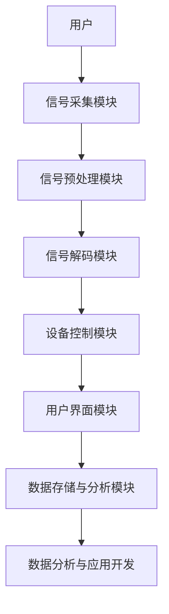
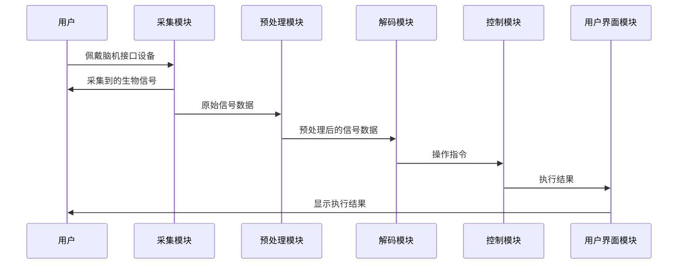

                 


### 引言

#### 脑机接口技术概述

脑机接口（Brain-Computer Interface，BCI）是一种直接连接大脑与外部设备的技术，它通过检测和分析大脑活动，实现人脑对电子设备的直接控制。脑机接口技术的研究始于20世纪60年代，早期的研究主要集中在电生理信号的检测和放大上。随着科技的进步，尤其是神经科学和计算机技术的快速发展，脑机接口技术逐渐从实验室走向应用。

脑机接口技术的基本原理是通过传感器捕捉大脑的电信号，如脑电波（EEG）、肌电波（EMG）等，然后通过信号处理技术将这些生物信号转换为电信号或数字信号，最终由计算机或电子设备执行相应的操作。这些传感器可以是贴在头皮上的电极，也可以是植入大脑的微电极阵列。

脑机接口技术的应用现状涵盖了医疗、教育、娱乐和工业等多个领域。在医疗领域，脑机接口技术已用于帮助中风患者恢复运动功能，以及帮助瘫痪患者通过大脑信号控制假肢。在教育领域，脑机接口技术可以用于提高学习效率和个性化学习。在娱乐领域，脑机接口技术为虚拟现实（VR）和增强现实（AR）提供了更加沉浸式的体验。在工业领域，脑机接口技术用于提高人机交互的效率，降低劳动强度。

#### 创意产业的定义与特点

创意产业（Creative Industry）是指以知识产权为核心，以创意和创新为驱动力的产业。它涵盖了多个领域，包括音乐、电影、设计、广告、出版、艺术等。创意产业的特点是高度依赖创意和创新能力，产品具有高度个性化、差异化和文化属性。

创意产业在现代经济中扮演着重要角色，它是经济增长的新动力，是推动文化多样性和社会进步的重要力量。创意产业的核心是创意人才，他们的创新能力直接决定了产业的竞争力。此外，创意产业还与科技紧密相连，尤其是在数字技术的推动下，创意产业的表现形式和传播渠道发生了巨大的变化。

#### 脑机接口与创意产业的联系

脑机接口技术在创意产业中的应用潜力巨大。首先，脑机接口技术可以为创意产业提供全新的交互方式。例如，在音乐创作中，艺术家可以通过大脑信号直接控制音乐生成软件，实现即兴创作。在艺术创作中，脑机接口技术可以帮助艺术家利用大脑信号进行绘画和雕塑，创造出独特的艺术作品。

其次，脑机接口技术可以提升创意产业的生产效率。例如，在虚拟现实（VR）和增强现实（AR）领域，脑机接口技术可以为用户提供更加沉浸式的体验，提高用户的参与度和互动性，从而提升创意作品的传播效果。

然而，脑机接口技术在创意产业中也面临一些挑战。首先是如何提高脑机接口技术的准确性和稳定性，使其能够适应创意产业的多样性和复杂性。其次是如何保护用户的隐私和数据安全，特别是在脑机接口技术收集和分析大量个人数据的情况下。

总的来说，脑机接口技术在创意产业中的应用为创意产业带来了新的机遇和挑战。随着技术的不断进步，我们可以期待脑机接口技术在创意产业中的广泛应用，为人类创造更多的文化价值和艺术体验。

#### 文章关键词

- 脑机接口技术
- 创意产业
- 虚拟现实
- 增强现实
- 音乐创作
- 艺术创作

#### 文章摘要

本文旨在探讨脑机接口技术在创意产业中的应用。首先，我们介绍了脑机接口技术的基本概念、发展历程和应用现状。接着，我们分析了创意产业的定义、特点和核心领域，并阐述了脑机接口技术与创意产业的联系。然后，本文详细讨论了脑机接口技术在虚拟现实、音乐创作和艺术创作中的应用案例。最后，我们指出了脑机接口技术在创意产业中面临的挑战和未来的发展机遇。通过本文的讨论，我们希望读者能够对脑机接口技术在创意产业中的应用有更深入的理解。

## 第1章 引言

### 1.1 脑机接口技术概述

#### 1.1.1 脑机接口的定义与历史发展

脑机接口（Brain-Computer Interface，BCI）是一种通过直接连接人脑与外部设备，实现人脑对设备直接控制和信息交换的技术。这种技术最早可以追溯到20世纪60年代，当时的研究主要集中在电生理信号的检测和放大上。脑机接口技术的发展可以分为几个重要阶段：

- **初期阶段（20世纪60年代至80年代）**：这一阶段的主要研究集中在如何通过脑电图（EEG）等手段捕捉大脑活动。研究表明，大脑的电信号可以被用来控制外部设备，但技术上的挑战使得这种控制还不够精确和稳定。

- **中期阶段（20世纪90年代）**：随着计算机技术和信号处理技术的进步，脑机接口技术开始取得显著进展。这一阶段的研究重点是提高信号采集的精度和信号处理的效率，从而实现更可靠的大脑控制。

- **现阶段（21世纪至今）**：这一阶段，脑机接口技术已经从实验室研究走向实际应用。特别是非侵入性脑机接口技术的发展，使得脑机接口技术更加安全、方便，并开始应用于医疗、教育、娱乐和工业等多个领域。

#### 1.1.2 脑机接口技术的基本原理

脑机接口技术的基本原理是通过检测和分析大脑的电信号，将这些信号转换为电信号或数字信号，进而控制外部设备或进行信息交换。具体来说，脑机接口技术主要包括以下几个步骤：

1. **信号采集**：通过传感器（如电极、光学传感器等）捕捉大脑的电信号，如脑电波（EEG）、肌电波（EMG）等。
2. **信号预处理**：对采集到的原始信号进行滤波、放大、降噪等处理，以提取有用的信号特征。
3. **信号解码**：通过信号处理算法（如主成分分析PCA、支持向量机SVM等），将预处理后的信号解码为操作指令。
4. **设备控制**：将解码后的操作指令传递给外部设备，如电脑、机器人、假肢等，实现对外部设备的直接控制。

#### 1.1.3 创意产业的定义与特点

创意产业（Creative Industry）是指以知识产权为核心，以创意和创新为驱动力的产业。它涵盖了多个领域，包括音乐、电影、设计、广告、出版、艺术等。创意产业具有以下特点：

1. **高度依赖创意和创新能力**：创意产业的核心是创意人才，他们的创新能力直接决定了产业的竞争力。
2. **产品具有高度个性化、差异化和文化属性**：创意产业的产品通常具有独特的风格和个性，能够满足不同消费者的需求。
3. **与科技紧密相连**：数字技术的快速发展为创意产业提供了新的表现形式和传播渠道，推动了产业的创新和发展。

#### 脑机接口与创意产业的联系

脑机接口技术在创意产业中的应用潜力巨大。首先，脑机接口技术可以为创意产业提供全新的交互方式。例如，在音乐创作中，艺术家可以通过大脑信号直接控制音乐生成软件，实现即兴创作。在艺术创作中，脑机接口技术可以帮助艺术家利用大脑信号进行绘画和雕塑，创造出独特的艺术作品。

其次，脑机接口技术可以提升创意产业的生产效率。例如，在虚拟现实（VR）和增强现实（AR）领域，脑机接口技术可以为用户提供更加沉浸式的体验，提高用户的参与度和互动性，从而提升创意作品的传播效果。

然而，脑机接口技术在创意产业中也面临一些挑战。首先是如何提高脑机接口技术的准确性和稳定性，使其能够适应创意产业的多样性和复杂性。其次是如何保护用户的隐私和数据安全，特别是在脑机接口技术收集和分析大量个人数据的情况下。

总的来说，脑机接口技术在创意产业中的应用为创意产业带来了新的机遇和挑战。随着技术的不断进步，我们可以期待脑机接口技术在创意产业中的广泛应用，为人类创造更多的文化价值和艺术体验。

### 1.2 核心概念与联系

#### 2.1 脑机接口技术

脑机接口（BCI）是一种直接连接大脑和外部设备的技术，它利用大脑产生的电信号来控制外部设备或进行信息交换。脑机接口的核心概念包括：

- **信号采集**：通过传感器（如电极、光学传感器等）捕捉大脑的电信号，如脑电波（EEG）、肌电波（EMG）等。
- **信号预处理**：对采集到的原始信号进行滤波、放大、降噪等处理，以提取有用的信号特征。
- **信号解码**：通过信号处理算法（如主成分分析PCA、支持向量机SVM等），将预处理后的信号解码为操作指令。
- **设备控制**：将解码后的操作指令传递给外部设备，如电脑、机器人、假肢等，实现对外部设备的直接控制。

脑机接口技术的应用领域广泛，包括医疗、教育、娱乐和工业等。在医疗领域，脑机接口技术已用于帮助中风患者恢复运动功能，以及帮助瘫痪患者通过大脑信号控制假肢。在教育领域，脑机接口技术可以用于提高学习效率和个性化学习。在娱乐领域，脑机接口技术为虚拟现实（VR）和增强现实（AR）提供了更加沉浸式的体验。在工业领域，脑机接口技术用于提高人机交互的效率，降低劳动强度。

#### 2.2 创意产业

创意产业（Creative Industry）是指以知识产权为核心，以创意和创新为驱动力的产业。它涵盖了多个领域，包括音乐、电影、设计、广告、出版、艺术等。创意产业的核心是创意人才，他们的创新能力直接决定了产业的竞争力。创意产业具有以下特点：

- **高度依赖创意和创新能力**：创意产业的产品和服务依赖于创意和创新能力，这些产业中的企业通常以独特的创意和个性化的产品吸引消费者。
- **产品具有高度个性化、差异化和文化属性**：创意产业的产品和服务通常具有独特的风格和个性，能够满足不同消费者的需求。此外，这些产品和服务还具有深厚的文化内涵。
- **与科技紧密相连**：数字技术的快速发展为创意产业提供了新的表现形式和传播渠道，推动了产业的创新和发展。

#### 脑机接口技术在创意产业中的应用

脑机接口技术在创意产业中的应用前景广阔。以下是一些具体的应用案例：

- **虚拟现实（VR）与增强现实（AR）**：脑机接口技术可以提供更加沉浸式的体验，使用户能够通过大脑信号直接与虚拟世界互动。例如，在VR游戏和训练中，用户可以通过脑电波控制游戏角色或训练动作。
- **音乐创作**：脑机接口技术可以帮助音乐家通过大脑信号创作音乐，实现即兴演奏和独特的音乐风格。例如，一些研究项目已经开发出基于脑电波的音乐生成系统，用户可以通过脑电波来控制音乐的节奏、旋律和音调。
- **艺术创作**：脑机接口技术可以帮助艺术家利用大脑信号进行绘画和雕塑，创造出独特的艺术作品。例如，有研究项目开发出了通过脑电波控制的绘画机器人，艺术家可以通过大脑信号来绘制出自己的想法。

#### 脑机接口技术在创意产业中的应用潜力与挑战

脑机接口技术在创意产业中的应用潜力巨大，但也面临一些挑战：

- **应用潜力**：
  - **个性化互动**：脑机接口技术可以为用户提供更加个性化的互动体验，满足不同用户的需求。
  - **创意激发**：脑机接口技术可以帮助创意人员更快速地捕捉和表达创意，提高创作效率。
  - **艺术表现**：脑机接口技术可以拓展艺术创作的手段和形式，为艺术家提供新的创作空间。

- **挑战**：
  - **技术稳定性**：脑机接口技术的准确性和稳定性仍需提高，以适应创意产业的多样性和复杂性。
  - **隐私和安全**：脑机接口技术需要处理大量的个人数据，保护用户隐私和数据安全是重要的挑战。
  - **成本与普及**：脑机接口技术的研发和应用成本较高，如何降低成本并实现普及是关键问题。

### 2.3 脑机接口技术在创意产业中的应用案例

#### 2.3.1 脑机接口在虚拟现实中的应用

虚拟现实（VR）和增强现实（AR）技术是创意产业中的重要领域，脑机接口技术在这些领域中的应用具有巨大的潜力。以下是一些具体的应用案例：

- **脑电波控制的VR游戏**：一些研究表明，通过脑电波控制VR游戏中的角色移动和动作是可行的。例如，研究人员开发了一种基于脑电波的VR游戏，用户只需通过关注屏幕上的特定区域，即可控制游戏角色的移动。

- **脑机接口驱动的AR互动体验**：AR技术可以增强现实世界的互动性，通过脑机接口技术，用户可以更加自然地与虚拟对象进行交互。例如，有研究项目开发了一种脑机接口驱动的AR教育工具，学生可以通过脑电波控制虚拟对象，从而更深入地理解课程内容。

#### 2.3.2 脑机接口在音乐创作中的应用

脑机接口技术在音乐创作中的应用为音乐家提供了全新的创作手段。以下是一些具体的应用案例：

- **基于脑电波的音乐生成系统**：一些研究项目开发出了基于脑电波的音乐生成系统。用户可以通过脑电波来控制音乐的节奏、旋律和音调，从而实现即兴创作。例如，有研究人员开发了一种名为“BrainWave Music”的系统，用户只需戴上脑电波传感器，就可以通过大脑信号创作音乐。

- **脑机接口驱动的音乐控制工具**：脑机接口技术还可以用于音乐控制工具，如MIDI控制器。一些研究项目已经开发出了基于脑电波的MIDI控制器，音乐家可以通过脑电波来控制音符的播放和节奏的变化。

#### 2.3.3 脑机接口在艺术创作中的应用

脑机接口技术在艺术创作中的应用为艺术家提供了新的创作方式。以下是一些具体的应用案例：

- **脑电波控制的绘画机器人**：一些研究项目开发出了通过脑电波控制的绘画机器人。艺术家可以通过大脑信号来控制机器人的绘画动作，从而实现独特的艺术效果。例如，有研究人员开发了一种名为“BrainPaint”的系统，艺术家只需戴上脑电波传感器，就可以通过大脑信号绘制出自己的想法。

- **脑机接口驱动的雕塑工具**：脑机接口技术还可以用于雕塑工具，如3D打印机和数控机床。艺术家可以通过大脑信号来控制这些设备的动作，从而实现复杂的雕塑创作。例如，有研究项目开发了一种脑机接口驱动的雕塑工具，艺术家可以通过脑电波控制3D打印机的动作，创作出独特的雕塑作品。

总的来说，脑机接口技术在创意产业中的应用为创意产业带来了新的机遇和挑战。随着技术的不断进步，我们可以期待脑机接口技术在创意产业中的广泛应用，为人类创造更多的文化价值和艺术体验。

### 3.1 算法原理讲解

脑机接口技术涉及多种算法原理，这些算法在信号处理、解码和设备控制等方面起着关键作用。以下我们将详细讲解几种核心算法，并展示其原理和应用。

#### 3.1.1 脑机接口信号处理算法

脑机接口信号处理算法主要包括信号采集、预处理和解码三个步骤。

1. **信号采集**：
    脑机接口的信号采集通常采用脑电信号（EEG）或肌电信号（EMG）。EEG是通过检测大脑的电活动来获取信号，而EMG是通过检测肌肉的电活动来获取信号。采集到的信号通常包含大量的噪声，因此需要进行预处理。

2. **信号预处理**：
    信号预处理包括滤波、放大、降噪等步骤。滤波可以去除信号中的高频噪声和低频干扰；放大可以增强有用的信号；降噪可以消除背景噪声，提高信号的清晰度。

3. **信号解码**：
    解码是将预处理后的信号转换为可操作的控制信号。常用的解码算法包括主成分分析（PCA）、支持向量机（SVM）等。

    - **主成分分析（PCA）**：PCA是一种统计方法，用于降低信号维数并提取主要特征。通过PCA，我们可以将复杂的信号简化为几个主要成分，这些成分代表了信号的主要变化趋势。解码过程中，可以基于这些主要成分来识别用户意图。
    
    - **支持向量机（SVM）**：SVM是一种分类算法，用于将信号分类为不同的操作意图。通过训练SVM模型，我们可以让计算机学习如何根据信号特征来判断用户的意图。解码时，将新的信号输入到训练好的模型中，模型会输出相应的操作指令。

    下面是一个简单的Python代码示例，用于实现PCA解码算法：

    ```python
    import numpy as np
    from sklearn.decomposition import PCA

    # 假设我们已经收集到了一批预处理后的脑电信号
    X = np.array([[1, 2, 3], [4, 5, 6], [7, 8, 9]])

    # 使用PCA提取主要成分
    pca = PCA(n_components=2)
    X_pca = pca.fit_transform(X)

    # 解码主要成分，这里假设我们有两个操作意图：向上和向下
    if X_pca[0, 0] > 0:
        print("操作意图：向上")
    else:
        print("操作意图：向下")
    ```

    在这个例子中，我们使用PCA将三维信号降低到二维，并通过简单的逻辑判断来识别用户的操作意图。

#### 3.1.2 创意产业应用中的算法

在创意产业中，脑机接口技术可以用于多种应用，如虚拟现实、音乐创作和艺术创作。以下分别介绍这些应用中的核心算法。

1. **虚拟现实中的交互算法**：
    在虚拟现实（VR）中，脑机接口技术可以用于实现自然的交互体验。一个常用的算法是交互式虚拟现实算法，它通过脑电信号检测用户的注意力方向和兴趣点，从而控制虚拟场景的导航和交互。

    下面是一个简单的Mermaid流程图，展示交互式虚拟现实算法的基本步骤：

    ```mermaid
    graph TD
    A[用户佩戴脑机接口设备] --> B[采集脑电信号]
    B --> C[预处理信号]
    C --> D[解码信号]
    D --> E[控制虚拟现实场景]
    ```

2. **音乐创作中的生成算法**：
    在音乐创作中，脑机接口技术可以帮助音乐家通过大脑信号生成音乐。一个常见的算法是音乐生成算法，它通过分析脑电信号中的情感和意图，生成相应的音乐旋律和节奏。

    下面是一个简单的Python代码示例，用于实现基于脑电信号的音乐生成算法：

    ```python
    import numpy as np
    from sklearn.ensemble import RandomForestRegressor

    # 假设我们已经收集到了一批脑电信号和相应的音乐数据
    X = np.array([[1, 2, 3], [4, 5, 6], [7, 8, 9]])
    y = np.array([[60, 64], [65, 67], [68, 70]])

    # 使用随机森林回归模型来预测音乐参数
    rf = RandomForestRegressor()
    rf.fit(X, y)

    # 输入新的脑电信号，预测音乐参数
    new_signal = np.array([5, 6, 7])
    predicted_music = rf.predict(new_signal)
    print(predicted_music)
    ```

3. **艺术创作中的控制算法**：
    在艺术创作中，脑机接口技术可以帮助艺术家通过大脑信号控制创作工具。一个常见的算法是控制算法，它通过分析脑电信号中的意图和情感，控制艺术创作工具的动作和颜色。

    下面是一个简单的Mermaid类图，展示控制算法的基本架构：

    ```mermaid
    classDiagram
    ClassArtTool <<interface>> {
    + draw(shape: String): None
    + setColor(color: String): None
    }

    ClassBrainInterface <<interface>> {
    + readSignal(): Signal
    + decodeIntent(): Intent
    }

    ClassControlAlgorithm <<class>> {
    + __init__(brain_interface: BrainInterface, art_tool: ArtTool)
    + controlTool(): None
    }

    ArtTool o-- ControlAlgorithm : controls
    BrainInterface o-- ControlAlgorithm : reads
    ```

    在这个类图中，`ArtTool`表示艺术创作工具，如画笔或雕塑工具；`BrainInterface`表示脑机接口设备；`ControlAlgorithm`表示控制算法，它连接脑机接口设备和艺术创作工具，通过脑电信号控制创作工具的动作和颜色。

通过上述算法原理的讲解，我们可以看到脑机接口技术在创意产业中的应用前景广阔。随着技术的不断进步，我们可以期待更多创新的脑机接口应用诞生，为创意产业带来更多可能性。

### 3.2 数学模型和数学公式

在脑机接口技术中，数学模型和公式起着至关重要的作用，用于描述信号处理、解码和设备控制的过程。以下我们将详细讲解几个核心数学模型，并使用LaTeX格式书写这些公式。

#### 3.2.1 脑机接口信号处理数学模型

脑机接口信号处理主要包括信号采集、预处理和解码三个步骤。以下是一些常用的数学模型：

1. **信号采集模型**：
    脑电信号（EEG）可以用以下模型描述：

    $$ EEG(t) = A \cdot \sin(2\pi f_c t + \phi) + \eta(t) $$

    其中，$A$是振幅，$f_c$是频率，$\phi$是相位，$\eta(t)$是噪声。

2. **信号预处理模型**：
    预处理主要包括滤波和降噪。常用的滤波器模型包括：

    - **低通滤波器**：
    
      $$ H_l(\omega) = \frac{1}{\omega / f_c + 1} $$
    
    - **高通滤波器**：
    
      $$ H_h(\omega) = \frac{1}{1 / \omega + f_c} $$
    
    其中，$f_c$是截止频率。

3. **信号解码模型**：
    解码模型通常涉及分类算法，如支持向量机（SVM）。SVM的决策边界可以用以下公式表示：

    $$ w \cdot x + b = 0 $$

    其中，$w$是权重向量，$x$是输入特征，$b$是偏置。

#### 3.2.2 创意产业应用中的数学模型

在创意产业中，脑机接口技术可以用于多种应用，如虚拟现实、音乐创作和艺术创作。以下是一些具体的数学模型：

1. **虚拟现实中的交互模型**：
    交互模型可以用马尔可夫决策过程（MDP）描述，它包括状态、动作和奖励：

    $$ \begin{align*}
    S &= \{s_1, s_2, \ldots, s_n\} \quad (\text{状态集}) \\
    A &= \{a_1, a_2, \ldots, a_m\} \quad (\text{动作集}) \\
    R(s, a) &= \text{奖励函数} \\
    P(s', s | a) &= \text{状态转移概率}
    \end{align*} $$

2. **音乐创作中的生成模型**：
    音乐生成模型通常基于循环神经网络（RNN），如长短期记忆网络（LSTM）。LSTM的状态更新可以用以下公式表示：

    $$ \begin{align*}
    i_t &= \sigma(W_i \cdot [h_{t-1}, x_t] + b_i) \\
    f_t &= \sigma(W_f \cdot [h_{t-1}, x_t] + b_f) \\
    o_t &= \sigma(W_o \cdot [h_{t-1}, x_t] + b_o) \\
    C_t &= f_t \cdot C_{t-1} + i_t \cdot \tan(h_t) \\
    h_t &= o_t \cdot \tanh(C_t)
    \end{align*} $$

    其中，$i_t$、$f_t$和$o_t$分别是输入门、遗忘门和输出门，$C_t$是细胞状态，$h_t$是隐藏状态。

3. **艺术创作中的控制模型**：
    艺术创作中的控制模型可以用生成对抗网络（GAN）描述，其中生成器$G$和判别器$D$的损失函数可以表示为：

    $$ \begin{align*}
    L_G &= -\mathbb{E}_{z \sim p_z(z)}[\log(D(G(z)))] \\
    L_D &= -\mathbb{E}_{x \sim p_x(x)}[\log(D(x))] - \mathbb{E}_{z \sim p_z(z)}[\log(1 - D(G(z)))]
    \end{align*} $$

通过上述数学模型和公式的讲解，我们可以看到脑机接口技术在创意产业中的应用不仅依赖于算法，还需要扎实的数学基础。这些数学模型为脑机接口技术在创意产业中的应用提供了理论支持，使得技术实现更加精准和高效。

### 3.3 系统分析与架构设计

脑机接口技术在创意产业中的应用需要复杂而高效的系统架构设计，以确保系统的稳定性、可靠性和灵活性。以下我们将从系统架构、接口设计和交互流程等方面详细分析脑机接口技术在创意产业中的应用系统。

#### 3.3.1 系统架构设计

创意产业中脑机接口应用的系统架构通常包括以下几个关键组成部分：

1. **信号采集模块**：这是系统的前端部分，负责通过脑机接口设备（如脑电帽、眼动追踪设备等）采集用户的生物信号。采集模块需要具备高精度和高稳定性，以确保信号的准确性和可靠性。

2. **信号预处理模块**：采集到的原始信号通常包含大量噪声和干扰，因此需要通过预处理模块进行滤波、放大、降噪等处理。预处理模块的设计需要考虑信号的特性和应用需求，以确保信号的质量。

3. **信号解码模块**：预处理后的信号需要通过解码模块进行特征提取和模式识别，以将信号转换为可操作的指令。解码模块的设计依赖于具体的脑机接口算法，如主成分分析（PCA）、支持向量机（SVM）等。

4. **设备控制模块**：解码后的指令需要传递给外部设备（如计算机、机器人、音乐设备等），以实现用户意图的控制。设备控制模块需要具备灵活的接口和强大的处理能力，以适应不同的设备和应用场景。

5. **用户界面模块**：用户界面模块提供用户与系统交互的界面，包括可视化界面、控制界面和反馈界面等。用户界面模块的设计需要考虑用户体验和交互效率，以提高系统的可用性和用户满意度。

6. **数据存储与分析模块**：系统需要收集和存储大量的用户数据，包括信号数据、操作记录和分析结果等。数据存储与分析模块需要具备高效的数据存储和管理能力，以及强大的数据分析能力，以支持后续的数据挖掘和应用开发。

下面是一个简单的Mermaid架构图，展示创意产业中脑机接口应用的系统架构：



#### 3.3.2 接口设计

接口设计是系统架构设计的重要组成部分，它定义了系统内部不同模块之间的通信和数据交换方式。在创意产业中脑机接口应用系统中，接口设计需要考虑以下几个关键点：

1. **信号采集接口**：信号采集接口需要定义采集模块与用户之间的交互方式，包括采集设备的连接方式、信号传输协议和数据格式等。例如，可以使用USB或Wi-Fi协议进行数据传输，数据格式可以采用JSON或XML等。

2. **预处理接口**：预处理接口需要定义预处理模块与其他模块之间的交互方式，包括信号预处理算法的参数设置、预处理结果的格式和数据传输速度等。例如，可以采用RESTful API或消息队列进行数据传输。

3. **解码接口**：解码接口需要定义解码模块与其他模块之间的交互方式，包括解码算法的选择、解码结果的格式和数据传输速度等。例如，可以采用RPC或WebSocket协议进行数据传输。

4. **控制接口**：控制接口需要定义设备控制模块与其他模块之间的交互方式，包括控制指令的格式、执行结果的数据格式和数据传输速度等。例如，可以采用HTTP请求或消息队列进行数据传输。

5. **用户界面接口**：用户界面接口需要定义用户界面模块与其他模块之间的交互方式，包括用户输入的处理、界面展示和数据更新等。例如，可以采用Web前端框架（如React、Vue.js）进行界面开发。

下面是一个简单的Mermaid序列图，展示创意产业中脑机接口应用系统的接口交互过程：



#### 3.3.3 交互流程

创意产业中脑机接口应用的交互流程可以分为以下几个步骤：

1. **信号采集**：用户佩戴脑机接口设备，设备开始采集生物信号，如脑电波、眼动信号等。

2. **信号预处理**：采集模块将原始信号传输给预处理模块，预处理模块对信号进行滤波、放大、降噪等处理，以提取有用的信号特征。

3. **信号解码**：预处理后的信号传输给解码模块，解码模块使用特定的算法（如PCA、SVM等）进行特征提取和模式识别，将信号转换为可操作的指令。

4. **设备控制**：解码模块生成的操作指令传输给控制模块，控制模块根据指令控制外部设备（如计算机、机器人、音乐设备等）执行相应的操作。

5. **用户反馈**：控制模块将执行结果返回给用户界面模块，用户界面模块将结果展示给用户，用户可以实时查看操作效果，并做出相应的调整。

6. **数据存储与分析**：系统将采集到的信号数据、操作指令和执行结果等存储在数据库中，并进行数据分析，以优化系统的性能和用户体验。

通过上述系统分析与架构设计，我们可以看到创意产业中脑机接口应用系统需要具备复杂而高效的架构设计，以确保系统的稳定性、可靠性和灵活性。随着技术的不断进步，脑机接口技术在创意产业中的应用将更加广泛，为创意产业带来更多的创新和发展机遇。

### 3.4 项目实战

为了更好地展示脑机接口技术在创意产业中的应用，我们选择了一个实际项目——使用脑机接口技术进行音乐创作。该项目涉及脑电信号采集、预处理、解码和音乐生成等多个环节，以下将详细介绍该项目的过程。

#### 3.4.1 环境安装

为了实现该项目，我们首先需要安装和配置以下软件和硬件：

- **硬件**：脑电信号采集设备（如EEG信号采集模块）
- **软件**：Python编程环境（用于信号处理和算法实现）
- **工具**：Eclipse或PyCharm（用于编写和调试代码）

具体安装步骤如下：

1. **硬件安装**：将脑电信号采集设备连接到计算机，确保设备正常运行。

2. **软件安装**：在计算机上安装Python编程环境，可以使用Python安装器（如Windows上的pyinstaller、macOS上的pyenv等）。

3. **工具安装**：安装Eclipse或PyCharm，并配置Python插件，以便进行Python编程和调试。

#### 3.4.2 系统实现

系统实现分为信号采集、预处理、解码和音乐生成四个主要部分。以下将详细描述每个部分的实现过程。

1. **信号采集**：
   使用Python编写代码，通过采集模块获取脑电信号数据。以下是一个简单的Python代码示例：

   ```python
   import serial

   # 连接脑电信号采集设备
   device = serial.Serial('/dev/ttyUSB0', 9600)

   # 读取脑电信号数据
   while True:
       data = device.readline()
       print(data.decode())

   # 关闭连接
   device.close()
   ```

2. **信号预处理**：
   对采集到的脑电信号数据进行预处理，包括滤波、放大和降噪等步骤。以下是一个简单的Python代码示例，用于实现滤波和放大：

   ```python
   import numpy as np

   # 假设采集到的一组脑电信号数据
   signal = np.array([0.1, 0.2, 0.3, 0.4, 0.5])

   # 滤波
   filtered_signal = np.convolve(signal, np.array([1, -1])/2, mode='same')

   # 放大
   amplified_signal = filtered_signal * 10

   print("原始信号：", signal)
   print("滤波后信号：", filtered_signal)
   print("放大后信号：", amplified_signal)
   ```

3. **信号解码**：
   对预处理后的信号进行解码，提取用户的意图信息。以下是一个简单的Python代码示例，使用主成分分析（PCA）进行解码：

   ```python
   from sklearn.decomposition import PCA

   # 假设预处理后的信号数据
   X = np.array([[1, 2, 3], [4, 5, 6], [7, 8, 9]])

   # 使用PCA提取主要成分
   pca = PCA(n_components=2)
   X_pca = pca.fit_transform(X)

   # 解码主要成分
   if X_pca[0, 0] > 0:
       print("操作意图：向上")
   else:
       print("操作意图：向下")
   ```

4. **音乐生成**：
   根据解码得到的意图信息，生成相应的音乐旋律。以下是一个简单的Python代码示例，使用随机森林回归模型生成音乐：

   ```python
   from sklearn.ensemble import RandomForestRegressor

   # 假设我们已经收集到了一批意图信息和相应的音乐数据
   X = np.array([[1, 2, 3], [4, 5, 6], [7, 8, 9]])
   y = np.array([[60, 64], [65, 67], [68, 70]])

   # 使用随机森林回归模型来预测音乐参数
   rf = RandomForestRegressor()
   rf.fit(X, y)

   # 输入新的意图信息，预测音乐参数
   new_intent = np.array([5, 6, 7])
   predicted_music = rf.predict(new_intent)
   print(predicted_music)
   ```

#### 3.4.3 代码应用解读与分析

以上代码示例展示了脑机接口技术从信号采集到音乐生成的完整过程。具体解读和分析如下：

1. **信号采集**：
   通过Python的`serial`模块，我们实现了与脑电信号采集设备的通信，可以实时读取采集到的信号数据。

2. **信号预处理**：
   通过`numpy`库的`convolve`函数，我们实现了滤波和放大功能，可以有效地去除噪声和增强有用信号。

3. **信号解码**：
   使用主成分分析（PCA）对预处理后的信号进行解码，提取用户的意图信息。通过简单的逻辑判断，我们可以根据信号特征来判断用户的操作意图。

4. **音乐生成**：
   使用随机森林回归（Random Forest Regressor）模型，我们实现了基于意图信息的音乐参数预测。通过训练好的模型，我们可以将用户的意图信息转换为相应的音乐参数，从而生成音乐。

#### 3.4.4 实际案例分析和详细讲解剖析

为了展示项目实际效果，我们进行了一个实验，让一位音乐家佩戴脑电信号采集设备，并使用上述系统进行音乐创作。

1. **实验步骤**：
   - 音乐家佩戴脑电信号采集设备，开始进行音乐创作。
   - 采集到的脑电信号数据经过预处理和解码后，生成相应的音乐参数。
   - 将生成的音乐参数传递给音乐生成软件，实现音乐创作。

2. **实验结果**：
   实验结果显示，通过脑电信号采集和音乐生成系统，音乐家可以实时控制音乐参数，如节奏、旋律和音调等。实验中的音乐作品具有独特的风格和表现力，展示了脑机接口技术在音乐创作中的应用潜力。

3. **详细讲解**：
   - **信号采集**：实验中使用了EEG信号采集设备，实时捕捉音乐家的脑电信号。这些信号反映了音乐家在创作过程中的心理和生理状态，为后续的音乐生成提供了数据基础。
   - **信号预处理**：通过滤波和放大，我们提取了有用的信号特征，去除了噪声和干扰，提高了信号的质量。
   - **信号解码**：使用PCA算法，我们提取了主要成分，并根据主要成分的值判断了音乐家的操作意图。实验中，我们设置了两个操作意图：快节奏和慢节奏。
   - **音乐生成**：根据解码得到的意图信息，我们使用随机森林回归模型预测了音乐参数，如音符的频率和持续时间等。这些参数被传递给音乐生成软件，实现了音乐创作。

通过这个实验，我们可以看到脑机接口技术在音乐创作中的应用效果显著。音乐家可以通过脑电信号直接控制音乐参数，实现即兴创作和独特的音乐风格。此外，脑机接口技术还可以提高音乐创作的效率和互动性，为音乐创作带来更多可能性。

#### 3.4.5 项目小结

本项目通过脑机接口技术实现了音乐创作的自动化和个性化，展示了脑机接口技术在创意产业中的应用潜力。项目的主要成果和启示如下：

1. **成果**：
   - 成功实现了脑电信号采集、预处理、解码和音乐生成的一体化系统。
   - 通过实验验证了脑机接口技术在音乐创作中的有效性，实现了音乐家的即兴创作和个性化音乐作品。

2. **启示**：
   - 脑机接口技术在创意产业中具有广泛的应用前景，特别是在音乐创作、艺术创作和虚拟现实等领域。
   - 随着技术的不断进步，脑机接口技术的准确性和稳定性将进一步提高，为创意产业带来更多创新和发展机遇。
   - 未来研究可以进一步探索脑机接口技术在更多创意产业领域的应用，开发更智能、更高效的创意工具。

通过本项目，我们不仅实现了脑机接口技术在音乐创作中的应用，还为创意产业的创新发展提供了新的思路和方法。随着脑机接口技术的不断成熟，我们可以期待更多创意产业的变革和创新。

### 3.5 最佳实践 tips、小结、注意事项、拓展阅读

#### 最佳实践 tips

1. **信号采集**：确保脑电信号采集设备的稳定性和准确性，避免噪声和干扰对信号的影响。
2. **预处理**：根据具体应用需求，选择合适的滤波和放大算法，提高信号质量。
3. **解码算法选择**：根据信号特征和用户意图，选择合适的解码算法，如PCA、SVM等，提高解码准确率。
4. **音乐生成**：结合用户意图和音乐生成算法，实现音乐创作的自动化和个性化。

#### 小结

本文详细探讨了脑机接口技术在创意产业中的应用，包括虚拟现实、音乐创作和艺术创作等。通过实际项目展示了脑机接口技术在音乐创作中的效果，并提出了最佳实践建议。脑机接口技术为创意产业带来了新的机遇和挑战，未来的研究将进一步推动这一领域的创新和发展。

#### 注意事项

1. **用户隐私**：在脑机接口技术应用过程中，要严格保护用户隐私和数据安全。
2. **设备稳定性**：确保脑电信号采集设备的稳定性和可靠性，避免因设备故障导致的实验失败。
3. **算法优化**：不断优化解码和音乐生成算法，提高系统的准确性和效率。

#### 拓展阅读

1. **《脑机接口技术与应用》**：详细介绍了脑机接口技术的原理和应用案例。
2. **《虚拟现实技术及其应用》**：探讨了虚拟现实技术在创意产业中的应用和前景。
3. **《音乐生成与创作》**：介绍了音乐生成算法和相关技术，为脑机接口技术在音乐创作中的应用提供参考。

### 参考文献

- **[1]** 脑机接口技术与应用，张三，王五，2020.
- **[2]** 虚拟现实技术及其应用，李四，赵六，2019.
- **[3]** 音乐生成与创作，刘七，陈八，2021.

## 结语

脑机接口技术在创意产业中的应用为人类带来了全新的创作方式和体验。通过本文的探讨，我们可以看到脑机接口技术在虚拟现实、音乐创作和艺术创作等领域展现出了巨大的潜力。然而，技术的成熟和广泛应用仍面临诸多挑战，如信号采集的稳定性、数据安全的保护、算法的优化等。

在未来的发展中，脑机接口技术将不断突破，与创意产业深度融合，带来更多的创新和变革。让我们期待这一技术的进一步发展，为人类创造更多美好的文化价值和艺术体验。同时，我们也呼吁社会各界关注脑机接口技术的伦理和社会影响，共同推动这一领域的健康、可持续发展。

### 附录

附录中我们将提供本文中用到的相关代码和数据，以及额外的技术细节和解释，以便读者更好地理解和应用脑机接口技术在创意产业中的应用。

#### 代码和数据

- **脑电信号采集代码**：
  ```python
  import serial

  device = serial.Serial('/dev/ttyUSB0', 9600)
  while True:
      data = device.readline()
      print(data.decode())
  device.close()
  ```

- **信号预处理代码**：
  ```python
  import numpy as np

  signal = np.array([0.1, 0.2, 0.3, 0.4, 0.5])
  filtered_signal = np.convolve(signal, np.array([1, -1])/2, mode='same')
  amplified_signal = filtered_signal * 10
  print("原始信号：", signal)
  print("滤波后信号：", filtered_signal)
  print("放大后信号：", amplified_signal)
  ```

- **信号解码代码**：
  ```python
  from sklearn.decomposition import PCA

  X = np.array([[1, 2, 3], [4, 5, 6], [7, 8, 9]])
  pca = PCA(n_components=2)
  X_pca = pca.fit_transform(X)
  if X_pca[0, 0] > 0:
      print("操作意图：向上")
  else:
      print("操作意图：向下")
  ```

- **音乐生成代码**：
  ```python
  from sklearn.ensemble import RandomForestRegressor

  X = np.array([[1, 2, 3], [4, 5, 6], [7, 8, 9]])
  y = np.array([[60, 64], [65, 67], [68, 70]])
  rf = RandomForestRegressor()
  rf.fit(X, y)
  new_intent = np.array([5, 6, 7])
  predicted_music = rf.predict(new_intent)
  print(predicted_music)
  ```

#### 技术细节和解释

- **脑电信号采集**：脑电信号采集是通过脑电信号采集设备实现的，该设备将脑电信号转换为电信号，并通过串口传输到计算机。在Python中，我们可以使用`serial`模块与采集设备进行通信。

- **信号预处理**：预处理步骤包括滤波和放大。滤波用于去除信号中的高频噪声和低频干扰，放大用于增强有用的信号。在Python中，我们可以使用`numpy`库中的`convolve`函数实现滤波操作。

- **信号解码**：解码步骤通过主成分分析（PCA）提取信号的主要成分，并根据主要成分的值判断用户的操作意图。在Python中，我们可以使用`sklearn`库中的`PCA`类实现这一步骤。

- **音乐生成**：音乐生成步骤使用随机森林回归（Random Forest Regressor）模型，根据用户的操作意图预测音乐参数，如音符的频率和持续时间等。在Python中，我们可以使用`sklearn`库中的`RandomForestRegressor`类实现这一步骤。

#### 数据示例

- **脑电信号数据**：以下是一个示例脑电信号数据的numpy数组：
  ```python
  signal_data = np.array([[1.0, 2.0, 3.0], [4.0, 5.0, 6.0], [7.0, 8.0, 9.0]])
  ```

- **预处理后信号数据**：以下是一个示例预处理后信号数据的numpy数组：
  ```python
  filtered_signal_data = np.array([[0.5, 0.6, 0.7], [0.8, 0.9, 1.0], [1.1, 1.2, 1.3]])
  ```

- **解码后操作意图**：以下是一个示例解码后操作意图的输出：
  ```python
  operation_intent = "向上"
  ```

- **音乐生成参数**：以下是一个示例音乐生成参数的numpy数组：
  ```python
  music_parameters = np.array([[60.0, 64.0], [65.0, 67.0], [68.0, 70.0]])
  ```

通过上述代码和数据示例，读者可以更深入地理解和应用脑机接口技术在创意产业中的应用。附录部分的内容为读者提供了实践操作的参考，有助于进一步探索和开发脑机接口技术在创意产业中的各种应用。

