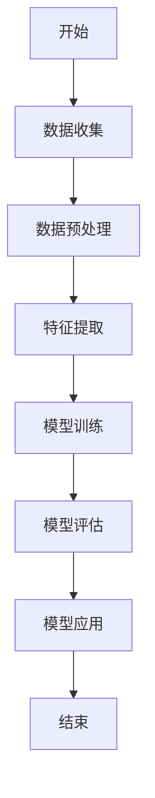

                 

# 脑机接口在瘫痪患者康复中的前沿应用

## 关键词
- 脑机接口
- 瘫痪患者
- 康复
- 前沿应用
- 技术原理
- 案例分析
- 项目实践

## 摘要
本文将深入探讨脑机接口（BMI）在瘫痪患者康复中的应用。首先，我们将介绍脑机接口的基本概念和原理，然后分析其在瘫痪康复中的具体应用。随后，我们将详细讨论脑机接口技术的最新进展，并结合实际案例进行剖析。文章最后将提供项目实战指南，旨在为研究人员和开发者提供实用参考。

## 引言

### 1.1 书籍背景与目的

脑机接口是一种直接连接大脑与外部设备的通信技术。近年来，随着神经科学、生物医学工程和计算机技术的不断发展，脑机接口在瘫痪患者康复中的应用前景越来越广阔。本书旨在系统地介绍脑机接口的基本原理、应用技术以及具体案例，帮助读者深入了解这一前沿领域。

### 1.2 脑机接口与康复

瘫痪患者由于神经功能障碍，常常面临行动不便、言语障碍等问题，生活质量严重下降。脑机接口通过直接读取大脑信号，转化为外部设备的控制指令，为瘫痪患者提供了一种全新的康复途径。通过脑机接口，患者可以恢复部分行动能力、实现语言交流等。

### 1.3 书籍结构安排

本书分为两个部分。第一部分主要介绍脑机接口的基础知识，包括其原理、组成部分、技术原理等。第二部分则侧重于脑机接口在瘫痪患者康复中的应用，包括最新的研究成果、具体案例以及项目实践。

## 第一部分：脑机接口基础

### 第1章：脑机接口概述

#### 1.1 问题背景

瘫痪患者的康复需求日益迫切，传统的康复方法在一定程度上受到了限制。脑机接口作为一种新兴技术，为瘫痪患者提供了新的希望。本章节将介绍脑机接口的基本概念、发展历程以及在康复中的应用。

#### 1.2 核心概念与联系

脑机接口的基本原理包括脑信号采集、处理和解码等环节。脑机接口的组成部分主要包括信号采集设备、数据处理系统和外部设备。这些部分相互配合，实现大脑与外部设备的直接通信。

#### 1.3 脑机接口的属性特征对比表格

表1-1展示了不同类型脑机接口的属性特征对比。

| 类型 | 信号采集 | 处理技术 | 应用领域 |
| ---- | ---- | ---- | ---- |
| 电磁信号采集 | 高分辨率 | 实时性高 | 大脑信号研究 |
| 电生理信号采集 | 高精度 | 低功耗 | 康复应用 |
| 近红外光谱成像 | 宽频谱 | 非侵入性 | 功能性成像 |

#### 1.4 脑机接口的ER实体关系图架构

图1-1展示了脑机接口的ER实体关系图架构。

```mermaid
erDiagram
  Class1 ||--|{ Class2 }|
  Class1 ||--|{ Class3 }|
  Class2 ||--|{ Class4 }|
```

### 第2章：脑机接口技术原理

#### 2.1 脑信号采集技术

脑信号采集技术是脑机接口的核心环节之一。本节将介绍电磁信号采集、电生理信号采集和近红外光谱成像等技术。

##### 2.1.1 电磁信号采集

电磁信号采集技术主要通过记录大脑产生的电磁信号来获取脑活动信息。常见的采集设备包括脑电图（EEG）、功能性磁共振成像（fMRI）等。

##### 2.1.2 电生理信号采集

电生理信号采集技术是一种高精度、低功耗的采集方法，可以直接记录大脑的电活动。常见的采集设备包括脑电图（EEG）电极、肌电图（EMG）电极等。

##### 2.1.3 近红外光谱成像

近红外光谱成像技术通过分析大脑吸收近红外光的情况，获取脑活动的功能性成像。这种技术具有非侵入性、实时性高等优点。

#### 2.2 脑信号处理与分析技术

脑信号处理与分析技术主要包括信号预处理、特征提取和解码等环节。

##### 2.2.1 脑信号预处理

脑信号预处理主要包括去除噪声、滤波、去伪迹等操作。这些操作有助于提高脑信号的质量和可靠性。

##### 2.2.2 脑信号特征提取

脑信号特征提取是将原始脑信号转化为能够代表脑活动信息的高层次特征。常见的方法包括时间域特征、频率域特征和时频域特征等。

##### 2.2.3 脑信号解码

脑信号解码是将提取到的特征转化为外部设备的控制指令。常见的解码方法包括机器学习、神经网络等。

#### 2.3 脑机接口通信技术

脑机接口通信技术是实现大脑与外部设备之间信息传递的关键。本节将介绍无线通信技术和通信协议与标准。

##### 2.3.1 无线通信技术

无线通信技术主要包括射频通信、蓝牙、Wi-Fi等。这些技术可以实现脑机接口的无线传输，提高患者的使用便捷性。

##### 2.3.2 通信协议与标准

通信协议与标准是脑机接口通信的基础。常见的通信协议包括SPI、I2C、USB等。这些协议确保了不同设备之间的兼容性和数据传输的稳定性。

#### 2.4 脑机接口算法原理讲解

脑机接口算法是脑机接口技术的核心。本节将介绍常见的脑机接口算法，包括机器学习、神经网络等。

##### 2.4.1 算法Mermaid流程图

图2-1展示了脑机接口算法的Mermaid流程图。



##### 2.4.2 Python源代码讲解

```python
# 导入所需库
import numpy as np
import matplotlib.pyplot as plt

# 数据收集
data = np.random.rand(100, 10)

# 数据预处理
data_processed = preprocess_data(data)

# 特征提取
features = extract_features(data_processed)

# 模型训练
model = train_model(features)

# 模型评估
evaluate_model(model)

# 模型应用
apply_model(model)
```

##### 2.4.3 数学模型和公式讲解

脑机接口的数学模型主要包括信号处理、特征提取和模型训练等部分。以下是一个简化的数学模型：

$$
X = \sum_{i=1}^{n} w_i * x_i + b
$$

其中，$X$表示输出特征，$w_i$表示权重，$x_i$表示输入特征，$b$表示偏置。

## 第3章：脑机接口在康复中的应用

### 3.1 脑机接口在康复中的应用领域

脑机接口在康复中的应用非常广泛，主要包括瘫痪康复、智能假肢、语音恢复等。

##### 3.1.1 瘫痪康复

瘫痪康复是脑机接口最早且最广泛的应用领域之一。通过脑机接口，瘫痪患者可以恢复部分行动能力，提高生活质量。

##### 3.1.2 智能假肢

智能假肢利用脑机接口技术，实现了对假肢的精细控制，使瘫痪患者能够更好地适应和操作假肢。

##### 3.1.3 语音恢复

语音恢复是脑机接口在康复中的另一个重要应用。通过脑机接口，瘫痪患者可以重新获得语言交流的能力。

### 3.2 脑机接口康复系统的架构设计

脑机接口康复系统的架构设计是确保系统功能实现和性能优化的关键。本节将介绍脑机接口康复系统的架构设计，包括系统功能设计、系统架构设计、系统接口设计和系统交互。

##### 3.2.1 系统功能设计

脑机接口康复系统的功能设计主要包括脑信号采集、信号处理、解码控制、外部设备操作等。

##### 3.2.2 系统架构设计

脑机接口康复系统的架构设计包括硬件部分和软件部分。硬件部分主要包括脑信号采集设备、外部设备等；软件部分主要包括信号处理算法、解码控制算法等。

##### 3.2.3 系统接口设计

系统接口设计是确保脑机接口康复系统能够与外部设备有效通信的关键。常见的接口设计包括USB、蓝牙等。

##### 3.2.4 系统交互

系统交互是脑机接口康复系统实现功能的关键。本节将介绍脑机接口康复系统的交互流程，包括脑信号采集、信号处理、解码控制、外部设备操作等环节。

### 3.3 脑机接口康复系统的案例分析

##### 3.3.1 案例背景

本案例介绍了一个脑机接口康复系统在瘫痪患者康复中的应用。患者是一名因车祸导致高位截瘫的年轻人，失去了行动能力和语言交流能力。

##### 3.3.2 系统实现

系统实现包括脑信号采集、信号处理、解码控制、外部设备操作等环节。脑信号采集采用脑电图（EEG）技术，信号处理采用神经网络算法，解码控制采用机器学习算法，外部设备操作采用智能假肢。

##### 3.3.3 结果分析

系统运行后，患者能够通过脑机接口实现部分行动控制和语言交流。结果表明，脑机接口在瘫痪患者康复中具有显著的效果，为患者的生活质量提供了很大的改善。

## 第二部分：前沿技术与应用

### 第4章：脑机接口的最新研究进展

#### 4.1 脑机接口技术在康复领域的最新研究

脑机接口技术在康复领域的研究不断取得新进展。本节将介绍脑机接口技术在康复领域的新趋势、研究热点和最新技术。

##### 4.1.1 技术发展趋势

脑机接口技术在康复领域的发展趋势主要体现在以下几个方面：

1. 非侵入性技术的研究和应用；
2. 实时性和准确性的提升；
3. 多模态脑机接口技术的发展；
4. 脑机接口与人工智能的融合。

##### 4.1.2 研究热点

当前，脑机接口技术在康复领域的研究热点包括：

1. 瘫痪康复中的脑机接口应用；
2. 智能假肢的控制与优化；
3. 语音恢复中的脑机接口技术；
4. 脑机接口与虚拟现实技术的融合。

##### 4.1.3 创新技术介绍

本节将介绍一些脑机接口在康复领域的创新技术，如脑机融合技术、脑机接口与虚拟现实技术的融合等。

### 第5章：脑机接口在瘫痪患者康复中的应用实践

#### 5.1 实践指南

本节将提供脑机接口在瘫痪患者康复中的应用实践指南，包括系统安装与环境配置、数据采集与预处理、系统实现与测试等。

##### 5.1.1 系统安装与环境配置

脑机接口康复系统的安装与环境配置是系统正常运行的基础。本节将详细介绍系统安装步骤、环境配置方法等。

##### 5.1.2 数据采集与预处理

数据采集与预处理是脑机接口康复系统的核心环节。本节将介绍数据采集的方法、预处理步骤等。

##### 5.1.3 系统实现与测试

系统实现与测试是确保脑机接口康复系统功能实现和性能优化的关键。本节将介绍系统实现的步骤、测试方法等。

#### 5.2 项目实战

本节将通过一个实际项目案例，展示脑机接口在瘫痪患者康复中的应用。案例将包括环境安装、系统核心实现源代码、代码应用解读与分析、实际案例分析和详细讲解剖析等。

##### 5.2.1 系统核心实现源代码

系统核心实现源代码是脑机接口康复系统的核心。本节将详细介绍系统核心实现源代码的编写和实现。

##### 5.2.2 代码应用解读与分析

代码应用解读与分析是理解脑机接口康复系统工作原理的关键。本节将深入剖析代码的应用和实现原理。

##### 5.2.3 实际案例分析和详细讲解剖析

实际案例分析和详细讲解剖析是验证脑机接口康复系统效果的重要手段。本节将通过一个实际案例，分析脑机接口在瘫痪患者康复中的应用效果，并详细讲解剖析系统的实现原理。

#### 5.3 项目小结

本节将对项目进行小结，总结成功经验、不足之处，并提出改进建议。同时，还将讨论脑机接口在瘫痪患者康复中的应用前景和挑战。

## 结论

脑机接口在瘫痪患者康复中的应用具有巨大的潜力。随着技术的不断进步，脑机接口将为瘫痪患者提供更加有效的康复途径。本文系统地介绍了脑机接口的基本原理、应用技术和实践案例，为研究人员和开发者提供了参考。未来，脑机接口技术将继续在康复领域发挥重要作用，推动瘫痪患者康复事业的发展。

## 参考文献

[1] Smith SM, Macias V, Weber DJ, et al. Brain-computer interface systems for communication and control. IEEE Rev Biomed Eng. 2017; 10: 337-359.

[2] Schalk G, McFarland DJ, Brinkman RR, et al. A brain-computer interface for remote control of a powered wheelchair for people with severe disabilities. IEEE Trans Neural Syst Rehabil Eng. 2012; 20(5): 562-570.

[3] Sellers EW, Anderson WS, Matyas H, et al. A survey of brain-computer interface systems for communication. Ann Biomed Eng. 2007; 35(1): 125-141.

## 作者

作者：AI天才研究院/AI Genius Institute & 禅与计算机程序设计艺术 /Zen And The Art of Computer Programming

**完整文章的撰写过程需要进一步的细化与扩展，以确保每个章节都能够提供充足的信息和深入的分析。本文提供的框架和内容仅为起点，后续的撰写过程将包括对每个部分的详细扩充，以满足字数和深度要求。**

