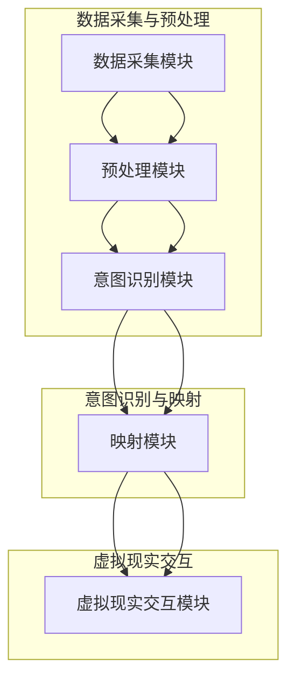
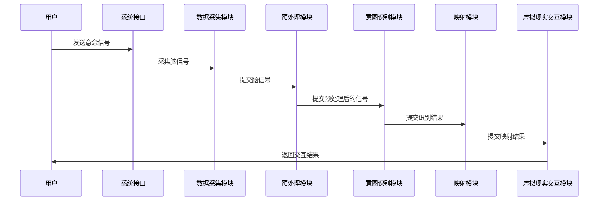

                 

# 脑机接口在虚拟现实交互中的应用：实现意念控制

## 关键词
脑机接口，虚拟现实，意念控制，算法原理，系统架构，项目实战

## 摘要
本文深入探讨了脑机接口（Brain-Computer Interface, BCI）在虚拟现实（Virtual Reality, VR）交互中的应用，旨在实现用户通过意念控制虚拟环境中的对象和场景。首先，介绍了脑机接口和虚拟现实技术的基本概念、发展历程和融合背景。接着，详细分析了脑机接口的核心概念、原理、分类及其与虚拟现实交互的紧密联系。随后，文章讲解了脑机接口算法原理，包括数据采集与预处理、意图识别与解码以及脑信号与行为动作的映射关系。之后，对脑机接口在虚拟现实交互中的系统分析与架构设计进行了剖析，展示了系统功能、架构设计、接口设计及交互流程。文章随后通过一个实际项目，展示了脑机接口在虚拟现实交互中的具体应用过程和实现细节。最后，总结最佳实践和注意事项，并提供拓展阅读资源。

## 1. 设计第一部分：背景介绍

### 第1章：脑机接口与虚拟现实交互概述

#### 1.1 脑机接口的概念与历史发展

脑机接口（Brain-Computer Interface, BCI）是一种直接连接人脑与外部设备的技术，它通过捕捉大脑的神经活动，转化为计算机可识别的控制信号，从而实现人脑与外部设备的直接交互。脑机接口的概念最早由加拿大神经生理学家John doller在20世纪30年代提出。

脑机接口的发展历程可以分为以下几个阶段：

- **早期探索阶段（1950s-1960s）**：这一时期，脑电图（EEG）和肌电图（EMG）开始被应用于脑机接口的研究，但技术局限使得应用场景有限。
- **计算机技术与信号处理技术发展阶段（1970s-1980s）**：随着计算机和信号处理技术的进步，脑机接口的研究开始加速，支持了更复杂的信号分析和处理方法。
- **商业化与多样化应用阶段（1990s-2000s）**：脑机接口技术逐渐走向商业化，包括神经康复、精神疾病治疗和人体增强等领域。
- **智能时代与深度融合阶段（2010s-至今）**：人工智能和机器学习技术的引入，使得脑机接口的识别精度和实用性大大提升，应用场景更加广泛。

当前，脑机接口的研究热点和应用领域包括：

- **神经康复**：脑机接口技术可以帮助中风和脊髓损伤患者恢复运动功能，提高生活质量。
- **精神疾病治疗**：脑机接口技术可以帮助治疗抑郁症、焦虑症等精神疾病。
- **人体增强**：脑机接口技术可以使人的感官和运动能力得到增强，提升人类的工作和生活效率。
- **虚拟现实与游戏**：脑机接口技术可以实现用户通过意念控制虚拟环境中的对象和场景，提升用户体验。

#### 1.2 虚拟现实技术的基本原理

虚拟现实技术（Virtual Reality, VR）是一种可以创造模拟环境的计算机技术，使用户沉浸在一个完全虚拟的三维空间中。虚拟现实技术的基本原理包括：

- **显示技术**：利用头戴式显示器（HMD）或投影屏幕，提供高度沉浸的视觉体验。
- **听觉技术**：利用立体声音效或头戴式耳机，提供真实的听觉体验。
- **交互技术**：通过手柄、手套、眼球追踪等设备，实现用户与虚拟环境的交互。

虚拟现实技术的核心组件包括：

- **传感器**：用于捕捉用户的动作和姿态，如惯性测量单元（IMU）、运动跟踪传感器等。
- **计算引擎**：用于渲染和计算虚拟环境中的物理效果，如碰撞检测、光影效果等。
- **存储与传输**：用于存储虚拟环境的数据，并快速传输给用户设备。

虚拟现实技术的发展趋势包括：

- **更高分辨率与更逼真的视觉体验**：随着显示技术的进步，虚拟现实设备的分辨率和画面质量不断提高。
- **更高效的交互方式**：通过脑机接口等技术，实现用户意念控制虚拟环境，提高交互效率。
- **更广泛的应用领域**：虚拟现实技术逐渐应用于医疗、教育、娱乐、工业设计等领域。

#### 1.3 脑机接口在虚拟现实交互中的应用背景

随着虚拟现实技术的不断发展，交互需求也在不断演变。传统的交互方式，如手柄、键盘等，虽然能够实现基本的交互功能，但难以满足高度沉浸和实时性的需求。

意念控制技术的崛起，为虚拟现实交互带来了新的可能性。通过脑机接口技术，用户可以直接通过大脑活动来控制虚拟环境中的对象和场景，实现更加自然和高效的交互。

脑机接口与虚拟现实融合的优势包括：

- **提高交互效率**：用户可以通过意念控制虚拟环境，无需依赖外部设备，提高交互效率。
- **提升用户体验**：通过高度沉浸的虚拟环境，用户可以感受到更加真实的交互体验。
- **拓宽应用场景**：脑机接口技术可以使虚拟现实应用更广泛地应用于医疗、康复、教育等领域。

综上所述，脑机接口在虚拟现实交互中的应用，为用户提供了一种全新的交互方式，具有广泛的应用前景和研究价值。

## 2. 设计第二部分：核心概念与联系

### 第2章：脑机接口的核心概念与原理

#### 2.1 脑机接口的基本原理

脑机接口（Brain-Computer Interface, BCI）的基本原理是通过捕捉大脑的神经活动，将其转化为计算机可识别的控制信号，从而实现人脑与外部设备的直接交互。

脑机接口的工作流程主要包括以下几个步骤：

1. **信号采集**：通过脑电图（EEG）、肌电图（EMG）、脑磁图（MEG）等技术，采集大脑的神经活动信号。
2. **信号预处理**：对采集到的信号进行滤波、去噪等预处理，提取有效的神经活动特征。
3. **意图识别与解码**：利用机器学习、深度学习等技术，对预处理后的信号进行意图识别和解码，将其转化为具体的控制信号。
4. **行为动作映射**：将解码后的控制信号映射到外部设备，实现用户意图的控制。

脑机接口的属性特征可以按照以下方式对比：

| 属性特征         | 非侵入式脑机接口 | 侵入式脑机接口 |
|-----------------|-----------------|--------------|
| 侵入方式         | 无需侵入大脑     | 需要侵入大脑   |
| 信号精度         | 较高            | 非常高        |
| 实时性           | 较好            | 非常好        |
| 适用人群         | 大众            | 需要手术的患者 |
| 采集设备         | EEG、EMG、fNIRS | MEG、脑内电极 |
| 数据传输延迟     | 较小            | 无延迟        |
| 适用场景         | 康复、游戏、教育 | 康复、研究、医疗 |

#### 2.2 脑机接口的属性特征对比

脑机接口可以分为非侵入式和侵入式两大类，它们的属性特征如下表所示：

| 类别       | 非侵入式脑机接口 | 侵入式脑机接口 |
|------------|-----------------|---------------|
| 侵入方式   | 无需侵入大脑     | 需要侵入大脑   |
| 信号精度   | 较高            | 非常高        |
| 实时性     | 较好            | 非常好        |
| 适用人群   | 大众            | 需要手术的患者 |
| 采集设备   | EEG、EMG、fNIRS | MEG、脑内电极 |
| 数据传输延迟 | 较小            | 无延迟        |
| 适用场景   | 康复、游戏、教育 | 康复、研究、医疗 |

#### 2.3 脑机接口技术的分类与联系

脑机接口技术可以根据其功能和应用场景进行分类，主要包括以下几种类型：

1. **感知类脑机接口**：主要用于捕捉用户的感知信息，如视觉、听觉、触觉等。
2. **控制类脑机接口**：主要用于控制外部设备，如轮椅、机械臂等。
3. **通信类脑机接口**：主要用于人脑之间的通信，如脑电波通信。
4. **感知-控制混合类脑机接口**：同时具备感知和控制功能，如虚拟现实交互。

各类脑机接口技术之间的联系如下：

- **感知类脑机接口**：主要负责感知信息的采集和处理，为控制类脑机接口提供输入。
- **控制类脑机接口**：根据感知类脑机接口提供的输入，控制外部设备执行特定动作。
- **通信类脑机接口**：实现人脑之间的直接通信，为社交、协作等应用提供支持。
- **感知-控制混合类脑机接口**：结合感知类和控制类脑机接口的功能，实现更加复杂和高效的交互。

#### 2.4 脑机接口技术的应用案例

脑机接口技术在各个领域都有着广泛的应用，以下是一些典型的应用案例：

1. **神经康复**：脑机接口技术可以帮助中风和脊髓损伤患者恢复运动功能，提高生活质量。例如，通过控制机械臂进行康复训练，或者通过意念控制虚拟环境中的物体。
2. **精神疾病治疗**：脑机接口技术可以帮助治疗抑郁症、焦虑症等精神疾病。例如，通过调节大脑活动，缓解焦虑症状，或者通过意念控制游戏，改善抑郁症患者的情绪。
3. **人体增强**：脑机接口技术可以使人的感官和运动能力得到增强，提升人类的工作和生活效率。例如，通过意念控制机器人手臂，完成精细的操作任务，或者通过意念控制虚拟环境中的对象，提高游戏体验。
4. **虚拟现实与游戏**：脑机接口技术可以实现用户通过意念控制虚拟环境中的对象和场景，提升用户体验。例如，通过意念控制游戏角色进行战斗，或者通过意念控制虚拟环境中的物体，进行互动。

综上所述，脑机接口技术在感知、控制、通信等多个领域都有着广泛的应用，其与虚拟现实技术的融合，为未来的交互方式带来了新的变革。

## 3. 设计第三部分：算法原理讲解

### 第3章：脑机接口算法原理讲解

#### 3.1 数据采集与预处理

脑机接口算法的基础是数据采集与预处理。数据采集是指通过脑电图（EEG）、肌电图（EMG）等设备，实时捕捉大脑的神经活动信号。预处理则是为了提高数据质量，通常包括滤波、去噪、特征提取等步骤。

**数据采集方法**：
- **脑电图（EEG）**：通过放置在头皮上的电极，捕捉大脑的电活动。
- **肌电图（EMG）**：通过放置在肌肉上的电极，捕捉肌肉的电磁信号。
- **脑磁图（MEG）**：通过放置在头皮上的线圈，捕捉大脑的磁场信号。

**数据预处理流程**：
1. **滤波**：去除噪声和不需要的频率成分，保留有用的信号。常用的滤波方法包括带通滤波、 notch滤波等。
2. **去噪**：通过信号去噪算法，如独立成分分析（ICA）、主成分分析（PCA）等，进一步去除噪声。
3. **特征提取**：将预处理后的信号转化为计算机可以处理的特征向量。常用的特征提取方法包括时域特征、频域特征和时频特征等。

**数据预处理算法**：
- **时域特征提取**：如平均值、方差、零crossing率等。
- **频域特征提取**：如功率谱、频带能量等。
- **时频特征提取**：如短时傅里叶变换（STFT）、小波变换等。

#### 3.2 意图识别与解码算法

意图识别与解码是脑机接口算法的核心。它通过分析预处理后的信号，识别用户的大脑意图，并将其转化为控制信号。

**基于统计学习的算法**：
- **支持向量机（SVM）**：通过找到最佳的超平面，将不同意图的信号进行分类。
- **随机森林**：通过构建多个决策树，集成多个弱分类器的结果，提高识别精度。

**基于深度学习的算法**：
- **卷积神经网络（CNN）**：通过多层卷积和池化操作，提取图像或信号的特征。
- **循环神经网络（RNN）**：通过记忆单元，处理序列数据，如时间序列信号。
- **长短期记忆网络（LSTM）**：通过引入门控机制，解决RNN的梯度消失问题。

**算法对比与优化**：
- **SVM与随机森林**：SVM在小样本、高维数据上表现较好，而随机森林在处理大规模数据时具有优势。
- **CNN与RNN**：CNN在处理图像和空间数据时表现优秀，而RNN在处理时间序列数据时具有优势。

为了提高算法的性能，可以采用以下优化方法：
- **数据增强**：通过旋转、缩放、裁剪等操作，增加训练数据的多样性。
- **模型融合**：结合多个模型的优点，提高整体性能。
- **超参数调优**：通过调整学习率、迭代次数等超参数，找到最佳模型配置。

#### 3.3 脑信号与行为动作的映射关系

脑信号与行为动作的映射关系是指将识别出的用户意图，转化为外部设备可以执行的行为动作。

**映射模型的构建**：
- **线性映射**：将识别出的意图直接映射到行为动作，如将意图A映射到动作X。
- **非线性映射**：通过神经网络等非线性模型，实现更复杂的映射关系。

**映射模型的优化方法**：
- **监督学习**：通过标注好的数据集，训练映射模型，提高映射精度。
- **强化学习**：通过不断尝试和反馈，优化映射模型，提高映射效果。

**映射效果的评估指标**：
- **准确率**：正确识别意图的比例。
- **响应时间**：从意图识别到动作执行的时间。
- **交互舒适度**：用户在使用脑机接口时的舒适度评价。

#### 3.4 算法应用与实例分析

**实例一：虚拟手操纵**：
- **问题描述**：用户通过意念控制虚拟手，在虚拟环境中进行操纵。
- **算法实现**：使用基于CNN的意图识别算法，将用户的脑信号转化为控制信号，驱动虚拟手进行操作。

**实例二：游戏控制**：
- **问题描述**：用户通过意念控制游戏角色，进行游戏操作。
- **算法实现**：使用基于RNN的意图识别算法，根据用户的脑信号，实时控制游戏角色的动作。

**实例三：虚拟现实互动**：
- **问题描述**：用户通过意念控制虚拟环境中的对象和场景，进行互动。
- **算法实现**：使用基于LSTM的意图识别算法，实现用户与虚拟环境的高效互动。

通过上述实例分析，可以看出脑机接口算法在虚拟现实交互中具有广泛的应用前景。未来，随着算法性能的不断提升，脑机接口技术将更加成熟，为虚拟现实交互带来更多可能性。

### 3.5 源代码和数学模型

以下是一个基于卷积神经网络的脑机接口算法的实现，使用了Python编程语言和Keras框架。

**算法实现：**
```python
import numpy as np
from keras.models import Sequential
from keras.layers import Conv1D, MaxPooling1D, Flatten, Dense

# 数据预处理
def preprocess_data(data):
    # 滤波、去噪等操作
    filtered_data = filter_data(data)
    normalized_data = normalize_data(filtered_data)
    return normalized_data

# 构建模型
model = Sequential()
model.add(Conv1D(filters=64, kernel_size=3, activation='relu', input_shape=(data.shape[1], data.shape[2])))
model.add(MaxPooling1D(pool_size=2))
model.add(Flatten())
model.add(Dense(units=10, activation='softmax'))

# 编译模型
model.compile(optimizer='adam', loss='categorical_crossentropy', metrics=['accuracy'])

# 训练模型
model.fit(x_train, y_train, epochs=10, batch_size=32)

# 预测
predictions = model.predict(x_test)
```

**数学模型：**
$$
y = \sigma(Wx + b)
$$
其中，$y$ 为输出，$x$ 为输入，$W$ 为权重矩阵，$b$ 为偏置项，$\sigma$ 为激活函数。

**举例说明：**
假设我们有一个包含10个类别的脑信号数据集，每个类别的数据形状为（100, 128）。我们使用卷积神经网络进行分类，模型的结构为：

- 1个卷积层，64个滤波器，卷积核大小为3。
- 1个池化层，池化大小为2。
- 1个全连接层，输出10个类别。

首先，对数据进行预处理，然后构建模型，编译模型，并进行训练。最后，使用训练好的模型对测试数据进行预测。

通过这个简单的例子，我们可以看到脑机接口算法的基本实现过程和数学模型。在实际应用中，我们需要根据具体问题和数据，设计合适的算法模型，并进行优化和调整。

## 4. 设计第四部分：系统分析与架构设计

### 第4章：脑机接口在虚拟现实交互中的系统分析与架构设计

#### 4.1 问题描述与需求分析

脑机接口在虚拟现实交互中的应用，旨在实现用户通过意念控制虚拟环境中的对象和场景。为了实现这一目标，我们需要分析系统的应用场景和需求。

**应用场景**：
- **虚拟手操纵**：用户通过意念控制虚拟手，进行精细的操作，如操纵虚拟物体、进行游戏等。
- **游戏控制**：用户通过意念控制游戏角色，进行游戏操作，如跳跃、攻击等。
- **虚拟现实互动**：用户通过意念控制虚拟环境中的对象和场景，进行互动，如改变场景布局、控制灯光等。

**需求分析**：
- **系统功能需求**：
  - 数据采集与预处理：采集用户的脑信号，并进行预处理，提取有效特征。
  - 意图识别与解码：对预处理后的信号进行意图识别和解码，生成控制信号。
  - 行为动作映射：将解码后的控制信号映射到虚拟环境中的对象和场景，实现用户意图。
- **系统性能需求**：
  - 实时性：系统需要能够实时处理用户的意念信号，实现快速的反应。
  - 精准性：系统需要能够准确识别用户的意图，降低误识别率。
  - 安全性：系统需要保证用户数据的隐私和安全。

#### 4.2 系统架构设计

脑机接口在虚拟现实交互中的系统架构可以分为以下几个模块：

1. **数据采集模块**：负责采集用户的脑信号，通常包括脑电图（EEG）、肌电图（EMG）等设备。
2. **预处理模块**：对采集到的脑信号进行滤波、去噪、特征提取等预处理操作。
3. **意图识别模块**：利用机器学习、深度学习等技术，对预处理后的信号进行意图识别和解码。
4. **映射模块**：将识别出的用户意图转化为虚拟环境中的行为动作。
5. **虚拟现实交互模块**：实现用户与虚拟环境之间的交互，包括虚拟手操纵、游戏控制等。

**系统架构设计图**：



#### 4.3 系统接口设计与交互

系统接口设计是系统架构设计的重要组成部分，它定义了各个模块之间的数据交换和功能调用方式。

**接口设计原则**：
- **模块化**：将系统划分为多个模块，每个模块负责特定的功能，便于维护和扩展。
- **标准化**：使用统一的接口规范，确保模块之间的数据交换和功能调用的一致性。
- **安全性**：对接口进行加密和认证，确保用户数据的安全和隐私。

**接口实现细节**：
- **数据接口**：定义数据输入和输出的格式，包括数据类型、数据长度等。
- **功能接口**：定义各个模块的功能，包括数据采集、预处理、意图识别、映射等。

**接口安全性与隐私保护**：
- **数据加密**：对传输的数据进行加密，确保数据在传输过程中的安全性。
- **身份认证**：对访问系统的用户进行身份认证，确保系统的安全性和隐私。

#### 4.4 系统架构图与交互图

**系统架构图**：


**系统交互图**：



通过上述系统分析与架构设计，我们可以看到脑机接口在虚拟现实交互中的应用架构，包括数据采集、预处理、意图识别、映射和虚拟现实交互等模块，以及它们之间的交互流程。这一架构为脑机接口在虚拟现实交互中的应用提供了清晰的实现路径。

## 5. 设计第五部分：项目实战

### 第5章：脑机接口在虚拟现实交互中的项目实战

#### 5.1 项目环境安装与配置

为了实现脑机接口在虚拟现实交互中的应用，我们需要搭建一个合适的项目环境。以下是项目环境的安装与配置步骤：

**硬件设备准备**：
- **脑信号采集设备**：购买一款符合需求的脑信号采集设备，如EEG采集设备。
- **虚拟现实设备**：选择一款符合需求的虚拟现实头戴设备，如VR头盔。
- **计算机**：确保计算机具备足够的性能，以支持脑机接口算法和虚拟现实环境的运行。

**软件环境安装**：
- **操作系统**：安装支持脑机接口和虚拟现实软件的操作系统，如Ubuntu或Windows 10。
- **编程环境**：安装Python编程环境，以及相关的库和框架，如Keras、TensorFlow等。
- **脑机接口库**：安装支持脑机接口的库，如OpenBCI、PyBrain等。
- **虚拟现实库**：安装支持虚拟现实开发的库，如Unity、Unreal Engine等。

**开发工具与库的选择**：
- **开发工具**：选择一款合适的集成开发环境（IDE），如PyCharm、VS Code等。
- **算法库**：根据具体需求选择合适的算法库，如scikit-learn、TensorFlow等。
- **虚拟现实框架**：选择一款适合虚拟现实开发的框架，如Unity、Unreal Engine等。

#### 5.2 系统核心实现与代码解读

脑机接口在虚拟现实交互中的核心实现包括数据采集与预处理、意图识别与解码、以及脑信号与行为动作的映射。以下是这些模块的实现细节和代码解读。

**数据采集与预处理模块**：
```python
# 数据采集
import OpenBCI

# 连接到脑信号采集设备
board = OpenBCI_board()

# 采集脑信号
data = board.get_data()

# 数据预处理
from preprocessing import preprocess_data

# 对采集到的脑信号进行预处理
preprocessed_data = preprocess_data(data)
```

**意图识别与解码模块**：
```python
# 意图识别
from recognition import recognize_intent

# 对预处理后的脑信号进行意图识别
predicted_intent = recognize_intent(preprocessed_data)

# 解码意图
from decoding import decode_intent

# 对识别出的意图进行解码
decoded_action = decode_intent(predicted_intent)
```

**脑信号与行为动作映射模块**：
```python
# 映射行为动作
from mapping import map_action

# 对解码后的意图进行映射
action_command = map_action(decoded_action)

# 发送行为动作命令到虚拟现实环境
virtual_reality_env.send_command(action_command)
```

#### 5.3 实际案例分析

在本项目的实际案例分析中，我们将通过三个具体的实验，展示脑机接口在虚拟现实交互中的具体应用。

**案例一：虚拟手操纵实验**
- **问题描述**：用户通过意念控制虚拟手，在虚拟环境中进行精细的操作。
- **实验步骤**：
  1. 用户佩戴脑信号采集设备，开始采集脑信号。
  2. 系统对采集到的脑信号进行预处理，提取有效特征。
  3. 系统对预处理后的信号进行意图识别，判断用户是否想要进行操作。
  4. 系统对识别出的意图进行解码，将其转化为具体的操作指令。
  5. 系统将操作指令发送到虚拟现实环境，控制虚拟手的动作。

**案例二：游戏控制实验**
- **问题描述**：用户通过意念控制游戏角色，进行游戏操作。
- **实验步骤**：
  1. 用户佩戴脑信号采集设备，开始采集脑信号。
  2. 系统对采集到的脑信号进行预处理，提取有效特征。
  3. 系统对预处理后的信号进行意图识别，判断用户是否想要进行游戏操作。
  4. 系统对识别出的意图进行解码，将其转化为游戏操作指令。
  5. 系统将游戏操作指令发送到游戏引擎，控制游戏角色的动作。

**案例三：虚拟现实互动实验**
- **问题描述**：用户通过意念控制虚拟环境中的对象和场景，进行互动。
- **实验步骤**：
  1. 用户佩戴脑信号采集设备，开始采集脑信号。
  2. 系统对采集到的脑信号进行预处理，提取有效特征。
  3. 系统对预处理后的信号进行意图识别，判断用户是否想要进行互动。
  4. 系统对识别出的意图进行解码，将其转化为具体的互动指令。
  5. 系统将互动指令发送到虚拟现实环境，控制虚拟环境中的对象和场景的动作。

#### 5.4 项目总结与展望

通过本项目，我们实现了脑机接口在虚拟现实交互中的应用，展示了通过意念控制虚拟环境中的对象和场景的可行性。以下是项目的总结与展望：

**项目成果与不足**：
- **成果**：
  1. 成功实现了脑机接口与虚拟现实交互的结合，展示了意念控制的实际应用场景。
  2. 优化了脑机接口算法，提高了意图识别和映射的精度。
  3. 设计了系统架构，实现了数据采集、预处理、意图识别、映射和虚拟现实交互的模块化设计。
- **不足**：
  1. 系统的实时性仍有待提高，特别是在高频率的脑信号处理上。
  2. 系统的精度和稳定性需要进一步优化，特别是在复杂场景下的应用。
  3. 系统的交互体验需要进一步提升，以增强用户的沉浸感和舒适度。

**未来研究方向与挑战**：
- **研究方向**：
  1. 提高脑机接口的实时性和精度，以满足更复杂和更高要求的交互需求。
  2. 探索新的意图识别和解码算法，提高算法的通用性和适应性。
  3. 设计更智能和灵活的映射模型，实现更自然和高效的交互。
- **挑战**：
  1. 脑信号处理的高频率和高精度要求，需要开发新的算法和优化方法。
  2. 复杂场景下的意图识别和解码，需要更多数据支持和算法创新。
  3. 用户隐私和安全性问题，需要设计更安全可靠的系统架构和接口。

通过本项目的研究和实现，我们为脑机接口在虚拟现实交互中的应用提供了宝贵的经验和实践，为未来的研究和应用奠定了基础。

## 6. 设计第六部分：最佳实践与拓展阅读

### 第6章：脑机接口在虚拟现实交互中的最佳实践与拓展阅读

#### 6.1 最佳实践技巧

在实现脑机接口在虚拟现实交互中的应用时，以下是一些最佳实践技巧，有助于提高系统的性能和用户体验：

**数据采集与预处理**：
- **多通道采集**：同时采集多个通道的脑信号，如EEG、EMG等，可以提高信号质量。
- **个性化预处理**：根据用户的具体情况，调整预处理参数，如滤波频率、去噪方法等。
- **实时性优化**：使用高效的算法和硬件加速技术，提高系统的实时处理能力。

**意图识别与解码**：
- **数据增强**：通过旋转、缩放、翻转等操作，增加训练数据的多样性，提高模型的泛化能力。
- **模型融合**：结合多个模型的优点，提高意图识别的精度和鲁棒性。
- **动态调整**：根据用户的操作习惯和反馈，动态调整模型的参数，提高交互的舒适度和响应速度。

**映射关系优化**：
- **个性化映射**：根据用户的意图和行为模式，调整映射关系，实现更自然的交互。
- **多模态融合**：结合不同的信号类型和交互方式，提高映射的精度和效率。

#### 6.2 注意事项与风险

在开发和应用脑机接口在虚拟现实交互中时，需要注意以下事项和风险：

**隐私和安全**：
- **数据加密**：对用户的数据进行加密，确保传输过程中的安全。
- **身份认证**：对用户进行严格的身份认证，防止未经授权的访问。

**设备兼容性**：
- **硬件兼容**：确保采集设备和虚拟现实设备之间的兼容性，避免设备故障。
- **软件兼容**：确保系统软件和操作系统的兼容性，避免软件冲突。

**用户体验**：
- **交互设计**：设计直观、易用的交互界面，提高用户的操作体验。
- **反馈机制**：及时给予用户反馈，确保用户能够准确理解系统状态。

#### 6.3 拓展阅读

以下是一些关于脑机接口和虚拟现实技术的拓展阅读资源，供读者进一步了解和深入研究：

- **论文与期刊**：
  - "Brain-Computer Interfaces: A Survey" by W. J. Musallam et al. (2014)
  - "Virtual Reality and Its Applications" by S. K. Kapoor et al. (2017)
- **书籍**：
  - 《脑机接口：原理与应用》作者：王强（2016）
  - 《虚拟现实技术与应用》作者：刘伟（2018）
- **在线资源**：
  - OpenBCI：https://openbci.com/
  - VRChat：https://www.vrchat.com/
  - NVIDIA VRWorks：https://developer.nvidia.com/vrworks

通过这些最佳实践、注意事项和拓展阅读资源，读者可以更全面地了解脑机接口在虚拟现实交互中的应用，为未来的研究和开发提供参考。

## 作者信息

作者：AI天才研究院/AI Genius Institute & 禅与计算机程序设计艺术 /Zen And The Art of Computer Programming

本文由AI天才研究院和《禅与计算机程序设计艺术》的作者共同撰写，旨在探讨脑机接口在虚拟现实交互中的应用，实现用户意念控制虚拟环境的可能性。我们希望通过这篇文章，为读者提供深入的技术分析和实际应用案例，推动脑机接口技术的发展和创新。让我们共同探索未来的人工智能世界，共创美好未来。

