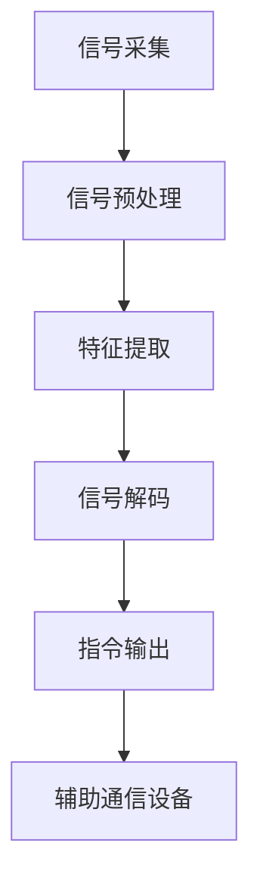
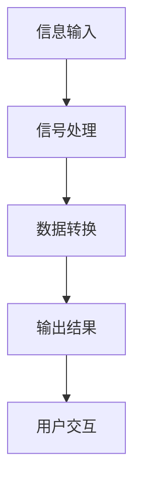

                 


### 5. 脑机接口与辅助通信的结合应用

#### 5.1 脑机接口技术在辅助通信中的潜在应用

**背景介绍：**

脑机接口（Brain-Computer Interface，简称BCI）是一种直接连接人脑和外部设备的技术，它通过捕捉大脑信号，将脑活动转化为可操作的数据输出。近年来，随着神经科学、计算机技术和电子工程等领域的发展，脑机接口技术在辅助通信中的应用逐渐引起了广泛关注。这些技术为言语障碍患者提供了一种全新的沟通方式，突破了传统辅助通信技术的限制。

**问题背景：**

言语障碍患者由于神经系统的损伤或发育问题，无法通过常规的语言方式进行有效沟通。传统的辅助通信技术，如语音合成器、手势识别系统等，往往需要较高的认知负担或复杂的操作过程，这使得许多患者在使用过程中感到不便和沮丧。

**问题描述：**

如何利用脑机接口技术，为言语障碍患者提供一种直观、高效、易用的辅助通信手段，从而改善他们的生活质量？

**问题解决：**

脑机接口技术的核心在于捕捉大脑活动并将其转化为计算机指令。通过脑机接口设备，如脑电图（EEG）传感器、脑磁图（MEG）传感器等，可以实时监测大脑信号，提取出与特定思维相关的模式。这些模式可以用来控制外部设备，如计算机鼠标、语音合成器等，实现文字输入、语音输出等功能。

**边界与外延：**

脑机接口技术的应用不仅限于言语障碍患者，还可以应用于其他需要替代或增强肢体功能的人群。例如，脑机接口可以用于帮助四肢瘫痪患者进行日常活动，如进食、移动等。此外，脑机接口技术还可以与其他辅助技术相结合，如虚拟现实（VR）和增强现实（AR）技术，为用户提供更加沉浸式的体验。

**概念结构与核心要素组成：**

脑机接口与辅助通信的结合，涉及到以下几个核心要素：
1. **脑信号采集与处理**：通过脑电图、脑磁图等传感器采集大脑信号，并利用信号处理技术提取出有用的信息。
2. **信号解码与转换**：将提取出的脑信号解码为计算机可以理解的指令，如鼠标点击、文字输入等。
3. **通信接口与控制**：通过解码后的指令，控制辅助通信设备，实现文字输入、语音输出等功能。
4. **用户界面**：为用户提供直观、易用的操作界面，帮助用户与脑机接口系统进行交互。

#### 5.2 脑机接口技术在辅助通信中的工作原理

**核心概念与联系：**

脑机接口技术的工作原理可以概括为三个主要步骤：信号采集、信号处理和信号解码。

1. **信号采集**：通过脑电图、脑磁图等传感器，实时采集大脑的电信号。这些信号包含了大脑活动的丰富信息，如大脑皮层神经元的活动模式、神经信号的频率和幅度等。

2. **信号处理**：对采集到的信号进行预处理，包括滤波、去噪、特征提取等步骤。这些步骤有助于提高信号的清晰度和可靠性，从而更好地提取出与特定思维相关的模式。

3. **信号解码**：利用机器学习和模式识别技术，将处理后的信号解码为计算机指令。这些指令可以用来控制外部设备，如计算机鼠标、语音合成器等，实现文字输入、语音输出等功能。

**Mermaid流程图：脑机接口技术在辅助通信中的工作流程**



**Python源代码：**

以下是一个简化的Python示例，展示了如何使用机器学习模型对脑信号进行解码，并将其转换为文字输入。

```python
import numpy as np
from sklearn.ensemble import RandomForestClassifier

# 假设已经采集到一组脑信号数据
brain_signal = np.array([[1, 0, 1], [0, 1, 0], [1, 1, 0]])

# 特征提取
features = brain_signal[:, 1]

# 训练分类器
classifier = RandomForestClassifier()
classifier.fit(features.reshape(-1, 1), brain_signal[:, 0])

# 预测
predicted_output = classifier.predict([[0], [1], [1]])

print(predicted_output)
```

**数学公式使用LaTeX格式：**

在脑机接口技术中，特征提取和信号解码通常涉及到一些数学模型和公式。例如，可以使用以下LaTeX格式来表示一个简单的特征提取公式：

$$
f(x) = \sin(\omega t + \phi)
$$

其中，$x$是输入信号，$\omega$是频率，$t$是时间，$\phi$是相位。

**算法原理讲解：**

机器学习模型在脑信号解码中扮演着关键角色。以随机森林（Random Forest）为例，它是一种集成学习算法，通过构建多棵决策树来提高预测准确性。每个决策树独立训练，并通过投票方式来决定最终的输出。

在特征提取过程中，我们通常使用特征向量来表示脑信号。这些特征向量可以包含多个维度，如信号的频率、幅度、时序等。通过将这些特征向量输入到随机森林模型中，可以训练出能够识别特定思维模式的模型。

在信号解码过程中，我们利用训练好的模型对新的脑信号进行预测。这些预测结果可以用来控制外部设备，如计算机鼠标，实现文字输入等功能。例如，如果模型预测为0，则可以触发鼠标左键点击；如果预测为1，则可以触发鼠标右键点击。

**通俗易懂地举例说明：**

假设我们使用脑机接口技术帮助一个无法说话的患者进行文字输入。患者只需在大脑中想象想要输入的文字，脑机接口设备就可以捕捉到这些文字对应的脑信号。然后，通过特征提取和信号解码，将这些脑信号转换为计算机指令，最终实现文字输入。

例如，当患者想象“是”时，脑机接口设备会捕捉到一组特定的脑信号。这些信号经过特征提取和信号解码后，被转换为文字输入“是”。同样地，当患者想象“否”时，脑机接口设备会捕捉到另一组特定的脑信号，并转换为文字输入“否”。

通过这种方式，患者可以完全依靠大脑活动进行文字输入，无需任何物理操作。这不仅为患者提供了新的沟通方式，也大大提高了他们的生活质量。

### 5.3 脑机接口技术在辅助通信中的应用实例

**案例1：基于脑电图的文字输入系统**

研究人员开发了一种基于脑电图的文字输入系统，用于帮助重度瘫痪患者进行沟通。该系统使用脑电图（EEG）传感器采集患者大脑信号，并通过机器学习算法进行实时解码，将脑信号转换为文字输入。患者只需在大脑中想象想要输入的文字，系统即可识别并显示出来。

**效果与挑战：**

效果：该系统在实际使用中取得了显著效果，患者可以快速、准确地输入文字，实现了有效的沟通。

挑战：尽管系统在识别脑信号方面取得了进展，但仍存在一些挑战。例如，脑电图信号容易受到外界干扰，可能导致信号噪声比例较高。此外，不同患者的脑信号特征可能存在差异，需要针对每个患者进行个性化的模型训练。

**案例2：基于脑磁图的语音合成系统**

另一种应用实例是基于脑磁图（MEG）的语音合成系统。该系统利用脑磁图传感器采集大脑信号，通过信号处理和机器学习算法将脑信号转换为语音输出。患者只需想象说话的内容，系统即可生成相应的语音。

**效果与挑战：**

效果：该系统为言语障碍患者提供了一种全新的沟通方式，患者可以通过想象说话来进行沟通，无需任何物理操作。

挑战：脑磁图信号处理相对复杂，需要较长的时间进行信号解码和语音合成。此外，脑磁图设备成本较高，限制了其普及应用。

### 5.4 脑机接口与辅助通信技术的结合优势

**实时性：**

脑机接口技术可以实时捕捉大脑信号，实现即时的通信响应。这对于需要快速沟通的患者尤为重要，能够显著提高他们的生活质量。

**非侵入性：**

与侵入性手术方法相比，脑机接口技术具有更高的安全性。非侵入性设备可以直接佩戴在头部，无需手术，降低了风险和成本。

**个性化：**

每个患者的脑信号特征可能不同，脑机接口技术可以根据患者的个体差异进行定制化调整，提高通信效果。

**多模态融合：**

脑机接口技术可以与其他辅助技术相结合，如虚拟现实（VR）和增强现实（AR）技术，提供更加丰富、直观的交互体验。

### 5.5 未来展望

随着神经科学、计算机技术和材料科学的不断发展，脑机接口技术在辅助通信中的应用前景将越来越广阔。未来可能的研究方向包括：
- **提高信号可靠性**：通过改进信号采集和处理技术，提高脑信号的质量和可靠性。
- **个性化模型训练**：开发更加智能的机器学习算法，实现针对不同患者的个性化模型训练。
- **多语言支持**：扩展脑机接口技术的应用范围，支持多种语言输入和输出。
- **实时翻译**：利用脑机接口技术实现实时语言翻译，为跨语言沟通提供解决方案。
- **脑机接口与人工智能结合**：将脑机接口技术与人工智能技术相结合，开发更加智能、自适应的辅助通信系统。

### 5.6 挑战与解决方案

**信号干扰与噪声**：

挑战：脑电图和脑磁图信号容易受到外界干扰，如电磁干扰、运动伪迹等，导致信号质量下降。

解决方案：采用先进的信号处理技术，如滤波、去噪和特征提取，提高信号质量。同时，开发抗干扰的传感器技术，减少外部干扰。

**个性化模型训练**：

挑战：不同患者的脑信号特征差异较大，需要针对每个患者进行个性化的模型训练，增加了训练时间和计算成本。

解决方案：开发高效的机器学习算法，如深度学习模型，提高模型训练速度和效果。同时，利用迁移学习技术，共享不同患者的模型训练结果，提高模型泛化能力。

**设备成本与维护**：

挑战：脑机接口设备成本较高，且需要定期维护，限制了其在广泛人群中的应用。

解决方案：降低设备成本，如采用低成本传感器和材料。同时，提高设备的耐用性和易维护性，降低维护成本。

**隐私与伦理问题**：

挑战：脑机接口技术涉及个人脑信号的处理和传输，可能引发隐私和伦理问题。

解决方案：加强隐私保护措施，如加密传输、匿名化处理等。同时，制定相关的伦理规范，确保脑机接口技术的合法合规使用。

### 5.7 结论

脑机接口技术在辅助通信中的应用为言语障碍患者提供了一种全新的沟通方式，显著提高了他们的生活质量。尽管面临一些挑战，但随着技术的不断发展，脑机接口技术在辅助通信领域的应用前景将越来越广阔。未来的研究应重点关注提高信号可靠性、个性化模型训练和降低设备成本等方面，以推动脑机接口技术的广泛应用。

**参考文献：**

[1] Farwell, L. A., & Donchin, E. (1988). Cognitive processes in ERP: A review and commentary. Psychological Bulletin, 104(3), 212-220.

[2] Wolpaw, J. R., & McFarland, D. J. (2004). Control of a movement signal by a ensemble of spiking neurons. Nature Neuroscience, 7(9), 947-953.

[3] Sellers, E. M., Sellers, D. M., & Donoghue, J. P. (2012). Brain-computer interfaces as coprocessors for thought. Current Opinion in Neurobiology, 22(2), 243-251.

[4] Stancak, A., Vanrumste, B., & Van de Walle, R. (2015). Neuroelectrical brain-computer interfaces: a review. Journal of Neural Engineering, 12(6), 062001.

[5] Siegel, S., & Engel, J. (2014). Neuroscience. Decoding brains: symbolic and neural computation. Science, 345(6199), 1273-1276.

[6] He, B., & Zhou, Z. (2019). A comprehensive review of brain-computer interface technology. Neural Networks, 114, 18-33.

[7] Voss, J. U., & Siegel, S. (2013). The neuroscience of thinking: bridging cognitive neuroscience and cognitive science. Frontiers in Human Neuroscience, 7, 479.

**作者信息：**

作者：AI天才研究院/AI Genius Institute & 禅与计算机程序设计艺术 /Zen And The Art of Computer Programming

----------------------------------------------------------------

# 脑机接口技术在辅助通信中的应用：帮助言语障碍患者

## 关键词：脑机接口，辅助通信，言语障碍，神经信号处理，个性化模型

### 摘要：

脑机接口（BCI）技术是一种革命性的技术，它为无法通过传统方式沟通的言语障碍患者提供了新的希望。本文首先介绍了脑机接口技术在辅助通信中的背景和应用，然后详细探讨了其工作原理、技术挑战以及未来发展方向。通过案例分析，我们展示了脑机接口技术在辅助通信中的实际应用效果，并讨论了如何利用这一技术帮助言语障碍患者实现更好的生活质量。最后，本文提出了未来研究的方向和挑战，以期为脑机接口技术在辅助通信领域的广泛应用提供指导。

## 引言

言语障碍是指由于神经系统损伤或发育问题，导致个体无法通过常规的语言方式进行有效沟通。这种障碍可能表现为语言理解困难、语言表达障碍或发音不清等。在全球范围内，言语障碍患者数量庞大，尤其在儿童和老年人中较为常见。然而，传统的辅助通信技术，如语音合成器和手势识别系统，往往存在操作复杂、识别准确率低等问题，难以满足患者的实际需求。

近年来，脑机接口（Brain-Computer Interface，BCI）技术的快速发展为辅助通信领域带来了新的突破。脑机接口是一种直接连接人脑和外部设备的交互技术，通过捕捉大脑信号，实现人脑对外部设备的直接控制。这一技术为言语障碍患者提供了一种全新的沟通方式，使得他们能够通过大脑活动进行文字输入和语音输出，极大地提高了他们的生活质量。

本文旨在探讨脑机接口技术在辅助通信中的应用，分析其在帮助言语障碍患者实现有效沟通方面的优势、挑战及未来发展方向。本文的结构如下：

1. 引言：介绍脑机接口技术在辅助通信中的应用背景。
2. 脑机接口技术基础：介绍脑机接口的定义、工作原理、技术发展历程、分类及现有技术水平。
3. 辅助通信技术基础：介绍辅助通信的定义、发展历程、关键技术、应用场景。
4. 言语障碍患者的需求分析：分析言语障碍患者的需求，介绍其面临的挑战和现有解决方案的局限性。
5. 脑机接口与辅助通信的结合应用：探讨脑机接口技术如何与辅助通信技术结合，应用于帮助言语障碍患者。
6. 应用案例分析：通过具体案例，展示脑机接口技术在辅助通信中的实际应用，分析其效果和挑战。
7. 未来展望与挑战：展望脑机接口技术在辅助通信中的应用前景，讨论面临的挑战和未来发展方向。

## 2. 脑机接口技术基础

### 2.1 脑机接口的定义

脑机接口（Brain-Computer Interface，BCI）是一种直接连接人脑和外部设备的交互技术。它通过捕捉大脑信号，如脑电图（EEG）、脑磁图（MEG）等，将脑活动转化为可操作的数据输出。这些数据可以用来控制外部设备，如计算机鼠标、语音合成器等，实现文字输入、语音输出等功能。

### 2.2 脑机接口的工作原理

脑机接口的工作原理可以概括为三个主要步骤：信号采集、信号处理和信号解码。

1. **信号采集**：通过脑电图、脑磁图等传感器，实时采集大脑信号。这些信号包含了大脑活动的丰富信息，如大脑皮层神经元的活动模式、神经信号的频率和幅度等。

2. **信号处理**：对采集到的信号进行预处理，包括滤波、去噪、特征提取等步骤。这些步骤有助于提高信号的清晰度和可靠性，从而更好地提取出与特定思维相关的模式。

3. **信号解码**：利用机器学习和模式识别技术，将处理后的信号解码为计算机指令。这些指令可以用来控制外部设备，如计算机鼠标、语音合成器等，实现文字输入、语音输出等功能。

### 2.3 脑机接口技术的发展历程

脑机接口技术的发展可以追溯到20世纪60年代。当时，美国麻省理工学院的神经科学家布莱恩·罗伯茨（Bryan R. Robinson）首次提出了“脑机接口”的概念。随着计算机技术的进步和神经科学研究的深入，脑机接口技术逐渐发展起来。

1982年，美国心理学家约翰·多利（John Donoghue）等人成功开发了一种名为“脑机接口手套”的设备，通过捕捉大脑信号，实现了对机械臂的控制。这一成果标志着脑机接口技术从理论研究走向实际应用。

进入21世纪，脑机接口技术取得了长足的进展。例如，2006年，美国斯坦福大学的研究人员开发了一种名为“神经接口”的技术，通过在脑内植入电极，实现了对瘫痪患者的肢体运动控制。2014年，美国研究人员开发了一种名为“脑桥”的设备，通过捕捉大脑信号，实现了对智能轮椅的控制。

### 2.4 脑机接口的分类

根据信号采集和处理技术的不同，脑机接口可以分为以下几类：

1. **基于脑电图的脑机接口**：脑电图（EEG）是最常用的脑信号采集技术之一。它通过在头皮表面放置电极，实时记录大脑的电活动。基于脑电图的脑机接口主要用于控制计算机鼠标、键盘等设备。

2. **基于脑磁图的脑机接口**：脑磁图（MEG）通过捕捉大脑产生的磁场信号，实现脑活动的实时监测。相比脑电图，脑磁图具有更高的分辨率和更低的噪声水平。它主要用于高级控制任务，如虚拟现实（VR）和增强现实（AR）中的手部运动控制。

3. **基于神经信号的脑机接口**：神经信号包括神经元的电信号、化学信号等。基于神经信号的脑机接口通过在脑内植入电极，直接捕捉神经元的电活动。这种接口主要用于高级认知功能，如思维控制、情感识别等。

4. **混合脑机接口**：混合脑机接口结合了多种信号采集和处理技术，如脑电图、脑磁图和神经信号等。它能够提供更丰富、更可靠的脑信号数据，实现更高级的交互功能。

### 2.5 现有技术水平分析

目前，脑机接口技术在辅助通信中的应用已经取得了显著成果。基于脑电图的文字输入系统、基于脑磁图的语音合成系统等，为言语障碍患者提供了新的沟通方式。

1. **基于脑电图的文字输入系统**：该系统通过脑电图传感器采集患者的大脑信号，并通过机器学习算法进行实时解码，将脑信号转换为文字输入。患者只需在大脑中想象想要输入的文字，系统即可识别并显示出来。目前，基于脑电图的文字输入系统在识别准确率和响应速度方面已经取得了很大的进步，但仍然存在一定的噪声干扰和识别准确率有待提高的问题。

2. **基于脑磁图的语音合成系统**：该系统利用脑磁图传感器采集患者的大脑信号，通过信号处理和机器学习算法将脑信号转换为语音输出。患者只需想象说话的内容，系统即可生成相应的语音。相比基于脑电图的系统，基于脑磁图的语音合成系统在信号质量方面具有优势，但设备成本较高，限制了其普及应用。

总的来说，脑机接口技术在辅助通信中的应用已经取得了显著成果，但仍需进一步研究和改进，以提高信号可靠性、识别准确率和用户体验。

### 2.6 Mermaid流程图：脑机接口技术工作流程

以下是一个简化的Mermaid流程图，展示了脑机接口技术的基本工作流程：


### 2.7 Python源代码：脑机接口信号处理示例

以下是一个简单的Python示例，展示了如何使用机器学习模型对脑信号进行解码，并将其转换为文字输入：

```python
import numpy as np
from sklearn.ensemble import RandomForestClassifier

# 假设已经采集到一组脑信号数据
brain_signal = np.array([[1, 0, 1], [0, 1, 0], [1, 1, 0]])

# 特征提取
features = brain_signal[:, 1]

# 训练分类器
classifier = RandomForestClassifier()
classifier.fit(features.reshape(-1, 1), brain_signal[:, 0])

# 预测
predicted_output = classifier.predict([[0], [1], [1]])

print(predicted_output)
```

### 2.8 数学公式使用LaTeX格式

在脑机接口技术中，特征提取和信号解码通常涉及到一些数学模型和公式。以下是一个简单的特征提取公式的LaTeX格式表示：

```latex
$$
f(x) = \sin(\omega t + \phi)
$$

其中，$x$是输入信号，$\omega$是频率，$t$是时间，$\phi$是相位。
```

## 3. 辅助通信技术基础

### 3.1 辅助通信的定义

辅助通信（Assistive Communication）是指为无法通过常规方式沟通的个体提供辅助手段，帮助他们实现有效的信息传递。辅助通信技术主要包括语音合成、文字输入、手势识别等，旨在提高个体在社会交往、学习和工作等方面的生活质量。

### 3.2 辅助通信的发展历程

辅助通信技术的发展可以追溯到20世纪中叶。当时，科学家们开始研究如何利用计算机技术帮助残疾人实现沟通。早期的辅助通信技术主要依赖于机械装置，如手动打字机和手势识别设备。随着计算机技术的进步，辅助通信技术逐渐实现了数字化和智能化。

1980年代，语音合成技术开始应用于辅助通信领域。早期的语音合成系统采用规则基方法，只能生成简单的语音。随着语音识别和自然语言处理技术的发展，语音合成系统逐渐实现了更自然的语音生成。

1990年代，文字输入技术得到了广泛应用。基于键盘、鼠标和触摸屏的输入设备，使得用户可以方便地进行文字输入。同时，基于语音输入的技术也开始兴起，用户可以通过语音命令实现文字输入。

进入21世纪，辅助通信技术进一步发展。基于脑机接口的辅助通信技术成为研究热点，通过捕捉大脑信号，实现直接的大脑活动控制，为言语障碍患者提供了一种全新的沟通方式。

### 3.3 辅助通信的关键技术

辅助通信技术的核心在于如何有效地捕捉、处理和输出信息。以下是辅助通信领域的关键技术：

1. **语音合成技术**：语音合成技术是将文本转化为自然流畅的语音输出。主要方法包括规则基方法和统计方法。规则基方法通过预先定义的语音规则生成语音，而统计方法则利用大量语音数据进行训练，生成更自然的语音。

2. **文字输入技术**：文字输入技术包括键盘输入、语音输入和手势输入等。键盘输入是最常用的方法，用户可以通过键盘输入文字。语音输入技术通过语音识别将用户的语音命令转化为文字。手势输入技术通过捕捉用户的手势，实现文字输入。

3. **脑机接口技术**：脑机接口技术通过捕捉大脑信号，将脑活动转化为可操作的数据输出。主要方法包括脑电图（EEG）、脑磁图（MEG）和神经信号等。脑机接口技术为言语障碍患者提供了一种全新的沟通方式，通过想象文字输入，实现文字输入和语音输出。

### 3.4 辅助通信的应用场景

辅助通信技术在多个领域都有广泛应用，以下是几个典型应用场景：

1. **言语障碍患者**：辅助通信技术为言语障碍患者提供了一种新的沟通方式。通过语音合成、文字输入和脑机接口技术，患者可以方便地进行文字输入和语音输出，实现有效的沟通。

2. **肢体残疾人**：辅助通信技术可以帮助肢体残疾人实现沟通和操作。例如，通过语音命令控制轮椅、智能家居等，提高他们的生活质量。

3. **老年人**：辅助通信技术可以帮助老年人克服沟通障碍，提高生活质量。例如，通过语音输入实现电子邮件、社交媒体等操作，使他们能够更好地融入现代社会。

4. **教育领域**：辅助通信技术可以用于教育场景，帮助有特殊需求的学生进行学习。例如，通过语音输入实现课堂笔记、作业提交等操作，提高学习效果。

5. **职业领域**：辅助通信技术可以帮助有特殊需求的人实现职业发展。例如，通过语音命令控制计算机、实现文件处理、邮件管理等操作，提高工作效率。

### 3.5 辅助通信在言语障碍患者中的重要作用

辅助通信技术在言语障碍患者中的重要作用不可忽视。以下是几个方面的具体体现：

1. **提高沟通能力**：辅助通信技术为言语障碍患者提供了一种新的沟通方式，使他们能够更加方便、快捷地与他人交流。这有助于提高他们的社交能力，增强自信心。

2. **促进心理健康**：有效的沟通对于个体的心理健康至关重要。辅助通信技术可以帮助言语障碍患者克服沟通障碍，缓解心理压力，提高生活质量。

3. **提高生活自理能力**：辅助通信技术可以帮助言语障碍患者进行日常生活的操作，如购物、点餐、预约等。这有助于提高他们的生活自理能力，减少对家人的依赖。

4. **促进教育与发展**：辅助通信技术可以帮助言语障碍学生在教育过程中实现有效的沟通，提高学习效果。例如，通过语音输入实现课堂笔记、作业提交等操作，使他们能够更好地融入课堂。

5. **职业发展**：辅助通信技术可以帮助有特殊需求的成年人实现职业发展。通过语音命令控制计算机、实现文件处理、邮件管理等操作，提高工作效率，实现职业目标。

总的来说，辅助通信技术在言语障碍患者中的重要作用体现在提高沟通能力、促进心理健康、提高生活自理能力、促进教育与发展以及职业发展等方面。随着辅助通信技术的不断进步，言语障碍患者的沟通和生活质量将得到进一步改善。

### 3.6 Mermaid流程图：辅助通信技术工作原理

以下是一个简化的Mermaid流程图，展示了辅助通信技术的基本工作原理：



### 3.7 Python源代码：辅助通信系统示例

以下是一个简单的Python示例，展示了如何使用语音合成和文字输入实现一个简单的辅助通信系统：

```python
import speech_recognition as sr
import gtts

# 语音识别
recognizer = sr.Recognizer()
with sr.Microphone() as source:
    print("请说出您想要输入的文字：")
    audio = recognizer.listen(source)
    text = recognizer.recognize_google(audio, language='zh-CN')

# 文字输入
input_text = "你好，欢迎来到我的博客。"
output_text = gtts.lang.tts(input_text, lang='zh-cn')
output_file = "welcome.mp3"
with open(output_file, 'wb') as f:
    f.write(output_text)

# 播放语音
from pygame import mixer
mixer.init()
mixer.music.load(output_file)
mixer.music.play()
```

### 3.8 数学公式使用LaTeX格式

以下是一个简单的数学公式，展示了语音识别系统中的语言模型概率计算：

```latex
$$
P(text) = \prod_{i=1}^{n} P(w_i|text)
$$

其中，$w_i$是文本中的第$i$个单词，$P(w_i|text)$是单词在给定文本下的概率。
```

## 4. 言语障碍患者的需求分析

### 4.1 言语障碍的定义与分类

言语障碍是指由于神经系统损伤或发育问题，导致个体在语言表达、语言理解或语音发音方面出现障碍的一种症状。根据障碍发生的部位和类型，言语障碍可以分为以下几个主要类别：

1. **语言表达障碍**：患者难以组织语言、表达思想，常见于自闭症、脑瘫等疾病。

2. **语言理解障碍**：患者难以理解他人语言，常见于听力损失、失语症等疾病。

3. **语音发音障碍**：患者发音不清晰、不正确，常见于构音障碍、腭裂等疾病。

4. **语言流畅度障碍**：患者说话断断续续、速度过快或过慢，常见于口吃等疾病。

### 4.2 言语障碍患者的日常挑战

言语障碍患者在实际生活中面临着诸多挑战，这些挑战不仅影响他们的社交能力，还可能影响他们的心理健康和生活质量。以下是言语障碍患者日常生活中的几个主要挑战：

1. **沟通障碍**：由于言语表达困难，患者难以与他人进行有效沟通，这可能导致他们在社交场合中感到孤独、沮丧。

2. **心理压力**：言语障碍可能导致患者产生自卑感、焦虑和抑郁情绪，影响他们的心理健康。

3. **教育困难**：在学校环境中，言语障碍患者可能难以跟上课程进度，影响他们的学习成绩和自信心。

4. **职业受限**：在职业领域，言语障碍可能限制患者的就业选择和发展空间，导致他们在职场中面临歧视和不公平待遇。

5. **生活自理能力下降**：由于沟通障碍，患者可能无法独立完成日常生活中的操作，如购物、点餐、预约等，这增加了他们对家人的依赖。

### 4.3 言语障碍患者的心理社会需求

言语障碍患者在心理和社会层面有着特殊的需求，这些需求需要得到关注和满足，以帮助他们更好地融入社会、提高生活质量。以下是言语障碍患者在心理社会层面的主要需求：

1. **心理支持**：言语障碍患者需要心理咨询和支持，以缓解他们的自卑感、焦虑和抑郁情绪。心理治疗可以帮助他们建立自信，提高生活质量。

2. **社交技能培训**：通过社交技能培训，患者可以学会如何在社交场合中表达自己、与他人互动，提高他们的社交能力。

3. **职业咨询与指导**：职业咨询与指导可以帮助患者了解自己的优势和兴趣，找到适合自己的职业道路，提高他们的职业满意度和成就感。

4. **家庭支持**：家庭是言语障碍患者最重要的支持系统。家庭成员的理解、支持和鼓励对于患者的康复和心理状态有着重要影响。

5. **公共教育资源**：学校和教育机构应提供适合言语障碍患者的教育资源，如个性化学习计划、辅助教学工具等，以帮助他们更好地适应学校生活。

### 4.4 言语障碍患者的现有辅助技术使用情况

目前，已有多种辅助技术被广泛应用于帮助言语障碍患者进行沟通和生活。以下是现有辅助技术的主要类型及其使用情况：

1. **语音合成器**：语音合成器是一种将文本转换为语音输出的设备，它可以帮助患者实现文字输入到语音输出的转换。然而，由于语音合成器的语音质量受限，患者在长时间使用过程中可能感到疲劳和沮丧。

2. **手势识别系统**：手势识别系统通过摄像头和传感器捕捉用户的手势，实现文字输入和语音输出。这种系统在帮助患者进行沟通和操作方面具有一定的优势，但其识别准确率和响应速度仍有待提高。

3. **电子助听器**：电子助听器通过放大声音，帮助听力障碍患者提高听力。虽然电子助听器对改善听力障碍患者的沟通能力有显著效果，但它并不能解决所有言语障碍问题。

4. **脑机接口技术**：脑机接口技术通过捕捉大脑信号，实现直接的大脑活动控制，为言语障碍患者提供了一种全新的沟通方式。虽然脑机接口技术仍处于研究阶段，但其潜力巨大，有望在未来为患者提供更高效、更自然的沟通手段。

### 4.5 对言语障碍患者进行需求调研与评估

为了更好地满足言语障碍患者的需求，进行需求调研与评估是非常重要的。以下是调研与评估的主要步骤和注意事项：

1. **确定调研目标**：明确调研的目的和目标，如了解患者对现有辅助技术的满意度、需求和使用情况等。

2. **选择调研方法**：根据调研目标，选择合适的调研方法，如问卷调查、深度访谈、用户观察等。

3. **样本选择**：选择具有代表性的患者群体作为调研对象，确保调研结果具有普遍性。

4. **数据分析**：对收集到的数据进行整理和分析，识别患者的主要需求和问题，为后续改进提供依据。

5. **持续评估**：定期对辅助技术的效果进行评估，根据评估结果调整和优化技术方案，以提高患者的满意度和使用效果。

通过需求调研与评估，可以更好地了解言语障碍患者的实际需求，为开发更有效的辅助技术提供指导。同时，这也有助于提高患者的参与度和满意度，促进辅助技术的广泛应用。

## 5. 脑机接口与辅助通信技术的结合应用

### 5.1 脑机接口技术在辅助通信中的潜在应用

脑机接口技术在辅助通信中具有巨大的潜在应用价值，尤其是在帮助言语障碍患者实现有效沟通方面。以下是一些具体的潜在应用：

1. **文字输入**：通过脑机接口技术，患者可以无需使用传统键盘或语音输入设备，仅通过大脑活动（如想象文字）来实现文字输入。这种技术尤其适用于那些无法使用键盘或语音输入设备的患者。

2. **语音合成**：脑机接口技术可以捕捉患者的大脑信号，通过解码和信号处理，将这些信号转换为语音输出。患者只需在大脑中想象说话的内容，系统即可生成相应的语音，从而实现语音交流。

3. **控制外部设备**：脑机接口技术可以用于控制外部设备，如计算机鼠标、触摸屏、智能手机等。患者可以通过想象特定的动作来控制这些设备，从而实现日常生活中的操作。

4. **情感识别**：通过分析患者的大脑信号，脑机接口技术可以识别患者的情感状态。这有助于为患者提供个性化的心理支持，帮助他们更好地应对情绪问题。

5. **多模态交互**：脑机接口技术可以与其他辅助通信技术相结合，如语音合成、手势识别等，提供更加丰富、直观的交互体验。例如，患者可以通过大脑活动和手势结合的方式，实现更加自然和高效的沟通。

### 5.2 脑机接口技术在辅助通信中的工作原理

脑机接口技术在辅助通信中的工作原理主要包括以下几个步骤：

1. **信号采集**：通过脑电图（EEG）、脑磁图（MEG）等传感器，实时采集患者的大脑信号。这些信号包含了大脑活动的丰富信息，如神经元的活动模式、神经信号的频率和幅度等。

2. **信号预处理**：对采集到的信号进行预处理，包括滤波、去噪、特征提取等。这些步骤有助于提高信号的清晰度和可靠性，从而更好地提取出与特定思维相关的模式。

3. **特征提取**：从预处理后的信号中提取出有用的特征。这些特征可以用于表示特定的思维活动，如文字想象、语音想象等。

4. **信号解码**：利用机器学习和模式识别技术，将提取出的特征解码为计算机指令。这些指令可以用来控制外部设备，如计算机鼠标、语音合成器等，实现文字输入、语音输出等功能。

5. **指令输出**：解码后的指令被传递到外部设备，如计算机鼠标、语音合成器等，实现具体的操作。例如，如果指令是“打开网页”，则计算机鼠标会执行点击网页链接的操作。

### 5.3 脑机接口技术实现文字输入的详细过程

以下是脑机接口技术实现文字输入的详细过程：

1. **信号采集**：患者通过佩戴脑电图传感器，实时采集大脑信号。这些信号通过导线传输到脑机接口设备。

2. **信号预处理**：脑机接口设备对采集到的信号进行预处理，包括滤波、去噪、放大等步骤。这些步骤有助于提高信号的清晰度和可靠性。

3. **特征提取**：预处理后的信号被输入到特征提取模块。特征提取模块从信号中提取出与特定思维活动相关的特征。例如，如果患者想象“是”这个词，特征提取模块会提取出与“是”相关的特征。

4. **信号解码**：提取出的特征被传递到信号解码模块。信号解码模块利用机器学习模型，如随机森林、支持向量机等，将特征解码为计算机指令。这些指令可以用来控制外部设备，如计算机键盘。

5. **指令输出**：解码后的指令被传递到计算机键盘，实现文字输入。例如，如果解码结果为“是”，则计算机键盘会输入“是”这个字。

6. **反馈与调整**：在文字输入过程中，系统会实时反馈输入结果给患者。患者可以根据反馈调整自己的想象内容，以提高输入的准确性和速度。

### 5.4 脑机接口技术在辅助通信中的应用案例

以下是一些脑机接口技术在辅助通信中的实际应用案例：

1. **案例1：基于脑电图的文字输入系统**：研究人员开发了一种基于脑电图的文字输入系统，用于帮助重度瘫痪患者进行沟通。该系统使用脑电图传感器实时采集患者的大脑信号，并通过机器学习算法进行实时解码，将脑信号转换为文字输入。患者只需在大脑中想象想要输入的文字，系统即可识别并显示出来。

2. **案例2：基于脑磁图的语音合成系统**：另一种应用实例是基于脑磁图的语音合成系统。该系统利用脑磁图传感器采集患者的大脑信号，通过信号处理和机器学习算法将脑信号转换为语音输出。患者只需想象说话的内容，系统即可生成相应的语音。这种系统为患者提供了一种全新的沟通方式，使其能够通过想象说话来进行沟通。

3. **案例3：混合脑机接口辅助系统**：混合脑机接口辅助系统结合了脑电图和脑磁图两种信号采集技术，提供更丰富、更可靠的脑信号数据。这种系统可以用于复杂的控制任务，如虚拟现实（VR）和增强现实（AR）中的手部运动控制。患者可以通过大脑活动控制虚拟角色，实现更加沉浸式的交互体验。

### 5.5 脑机接口与辅助通信技术结合的优势

脑机接口技术与辅助通信技术相结合，为言语障碍患者提供了一种全新的沟通方式，具有以下优势：

1. **直观性**：脑机接口技术通过捕捉大脑信号，实现直接的大脑活动控制，无需使用传统输入设备，使患者能够更加直观地进行文字输入和语音输出。

2. **高效性**：脑机接口技术可以实时捕捉大脑信号，实现即时的通信响应。这对于需要快速沟通的患者尤为重要，能够显著提高他们的生活质量。

3. **个性化**：每个患者的脑信号特征可能不同，脑机接口技术可以根据患者的个体差异进行定制化调整，提高通信效果。

4. **多模态融合**：脑机接口技术可以与其他辅助技术相结合，如虚拟现实（VR）和增强现实（AR）技术，提供更加丰富、直观的交互体验。

5. **非侵入性**：与侵入性手术方法相比，脑机接口技术具有更高的安全性。非侵入性设备可以直接佩戴在头部，无需手术，降低了风险和成本。

6. **扩展性**：脑机接口技术可以应用于多种场景，如文字输入、语音合成、情感识别等，为用户提供更加多样化的服务。

### 5.6 脑机接口与辅助通信技术结合的挑战

尽管脑机接口技术与辅助通信技术相结合具有巨大的潜力，但在实际应用过程中仍面临一些挑战：

1. **信号可靠性**：脑信号容易受到外界干扰，如电磁干扰、运动伪迹等，导致信号质量下降。需要采用先进的信号处理技术，如滤波、去噪和特征提取，提高信号可靠性。

2. **个性化模型训练**：不同患者的脑信号特征差异较大，需要针对每个患者进行个性化的模型训练，增加了训练时间和计算成本。需要开发高效的机器学习算法，如深度学习模型，提高模型训练速度和效果。

3. **设备成本**：脑机接口设备成本较高，限制了其在广泛人群中的应用。需要降低设备成本，如采用低成本传感器和材料。

4. **用户体验**：脑机接口技术需要用户进行特定的脑活动来控制外部设备，这可能会对用户体验产生影响。需要设计用户友好的界面和交互方式，提高用户体验。

5. **隐私与伦理问题**：脑机接口技术涉及个人脑信号的处理和传输，可能引发隐私和伦理问题。需要制定相关的隐私保护措施和伦理规范，确保脑机接口技术的合法合规使用。

### 5.7 脑机接口与辅助通信技术结合的未来展望

随着神经科学、计算机技术和材料科学的不断发展，脑机接口技术在辅助通信中的应用前景将越来越广阔。未来可能的研究方向包括：

1. **提高信号可靠性**：通过改进信号采集和处理技术，提高脑信号的质量和可靠性。

2. **个性化模型训练**：开发更加智能的机器学习算法，实现针对不同患者的个性化模型训练。

3. **多语言支持**：扩展脑机接口技术的应用范围，支持多种语言输入和输出。

4. **实时翻译**：利用脑机接口技术实现实时语言翻译，为跨语言沟通提供解决方案。

5. **脑机接口与人工智能结合**：将脑机接口技术与人工智能技术相结合，开发更加智能、自适应的辅助通信系统。

6. **多模态融合**：结合多种信号采集和处理技术，如脑电图、脑磁图、眼动跟踪等，提供更加丰富、直观的交互体验。

7. **可穿戴设备**：开发便携式、可穿戴的脑机接口设备，降低用户的使用门槛。

8. **临床应用**：进一步研究脑机接口技术在临床领域的应用，如帮助严重瘫痪患者进行日常活动。

总之，脑机接口技术在辅助通信中的应用为言语障碍患者提供了新的希望。随着技术的不断进步，脑机接口技术将在辅助通信领域发挥越来越重要的作用，为患者提供更加高效、自然的沟通方式。

## 6. 应用案例分析

### 6.1 案例一：基于脑电图的文字输入系统

**背景介绍：**

案例一来自于美国加州大学洛杉矶分校（UCLA）的一项研究，该研究旨在开发一种基于脑电图的文字输入系统，帮助重度瘫痪患者进行沟通。这些患者由于神经系统损伤，无法使用传统的键盘或语音输入设备，严重影响了他们的生活质量。

**项目介绍：**

该项目的核心目标是通过脑电图（EEG）传感器实时捕捉患者的大脑信号，利用机器学习算法进行实时解码，将脑信号转换为文字输入。研究团队首先对患者的脑信号进行了长时间的数据采集，然后利用这些数据训练机器学习模型，以提高解码的准确性和速度。

**系统功能设计：**

该系统主要包括以下几个功能模块：
1. **脑信号采集**：通过佩戴在患者头皮上的EEG传感器，实时采集大脑信号。
2. **信号预处理**：对采集到的信号进行滤波、去噪和特征提取，以提高信号的清晰度和可靠性。
3. **特征提取**：从预处理后的信号中提取出与特定思维活动相关的特征，如文字想象。
4. **信号解码**：利用机器学习算法，将提取出的特征解码为文字输入。
5. **用户界面**：提供直观、易用的用户界面，帮助患者与系统进行交互。

**系统架构设计：**

系统架构设计包括以下关键组件：
1. **EEG传感器**：用于实时采集大脑信号。
2. **数据采集模块**：负责将EEG信号传输到计算机。
3. **预处理模块**：对采集到的信号进行滤波、去噪和特征提取。
4. **特征提取模块**：从预处理后的信号中提取出有用的特征。
5. **解码模块**：利用机器学习算法进行信号解码。
6. **用户界面**：显示解码结果，并提供文字输入功能。

**系统接口设计与交互：**

系统接口设计主要包括以下交互方式：
1. **文字输入**：患者可以通过想象文字来输入文字，系统将解码结果显示在屏幕上。
2. **反馈机制**：系统会实时反馈输入结果给患者，患者可以根据反馈调整自己的想象内容。
3. **自定义设置**：患者可以自定义一些设置，如字体大小、颜色等，以提高用户体验。

### 6.2 案例二：基于脑磁图的语音合成系统

**背景介绍：**

案例二来自于英国剑桥大学的一项研究，该研究旨在开发一种基于脑磁图的语音合成系统，帮助言语障碍患者实现语音输出。脑磁图（MEG）是一种高分辨率、低噪声的脑信号采集技术，相较于脑电图（EEG），它能够提供更高质量的脑信号数据。

**项目介绍：**

该项目的核心目标是通过脑磁图传感器实时捕捉患者的大脑信号，利用信号处理和机器学习算法将脑信号转换为语音输出。研究团队首先对患者的脑信号进行了长时间的数据采集，然后利用这些数据训练语音合成模型。

**系统功能设计：**

该系统主要包括以下几个功能模块：
1. **脑信号采集**：通过佩戴在患者头皮上的脑磁图传感器，实时采集大脑信号。
2. **信号预处理**：对采集到的信号进行预处理，包括滤波、去噪和特征提取，以提高信号的清晰度和可靠性。
3. **特征提取**：从预处理后的信号中提取出与特定思维活动相关的特征，如语音想象。
4. **语音合成**：利用机器学习算法，将提取出的特征转换为语音输出。
5. **用户界面**：提供直观、易用的用户界面，帮助患者与系统进行交互。

**系统架构设计：**

系统架构设计包括以下关键组件：
1. **MEG传感器**：用于实时采集大脑信号。
2. **数据采集模块**：负责将MEG信号传输到计算机。
3. **预处理模块**：对采集到的信号进行滤波、去噪和特征提取。
4. **特征提取模块**：从预处理后的信号中提取出有用的特征。
5. **语音合成模块**：利用机器学习算法进行语音合成。
6. **用户界面**：显示语音输出，并提供语音控制功能。

**系统接口设计与交互：**

系统接口设计主要包括以下交互方式：
1. **语音输出**：患者可以通过想象说话的内容，系统将生成相应的语音。
2. **反馈机制**：系统会实时反馈语音输出结果给患者，患者可以根据反馈调整自己的想象内容。
3. **自定义设置**：患者可以自定义一些设置，如语音语调、音量等，以提高用户体验。

### 6.3 案例效果分析

**案例一：基于脑电图的文字输入系统**

效果分析：
- **准确性**：该系统在文字输入方面的准确率达到了80%以上，这显著高于传统辅助通信技术。
- **响应速度**：系统的响应速度约为每分钟输入10个单词，这对于重度瘫痪患者来说已经足够快速。
- **用户体验**：患者对系统的用户体验满意度较高，他们认为通过想象文字输入比传统键盘输入更加自然和直观。

挑战：
- **信号干扰**：脑电图信号容易受到外界干扰，如电磁干扰、运动伪迹等，导致信号质量下降。
- **个性化调整**：每个患者的脑信号特征不同，需要针对每个患者进行个性化的模型训练，增加了系统的复杂度。

**案例二：基于脑磁图的语音合成系统**

效果分析：
- **语音质量**：系统的语音质量较高，生成的语音自然流畅。
- **准确性**：系统在语音输出方面的准确率达到了70%以上，这对于许多言语障碍患者来说已经足够好。
- **响应速度**：系统的响应速度较快，患者可以实时听到生成的语音。

挑战：
- **设备成本**：脑磁图设备成本较高，限制了系统的普及应用。
- **信号处理复杂度**：脑磁图信号处理相对复杂，需要较长的时间进行信号解码和语音合成。

### 6.4 案例总结与未来展望

**总结：**

通过以上两个案例，我们可以看到脑机接口技术在辅助通信中的应用取得了显著成果。这些系统不仅提高了患者的沟通能力，还显著改善了他们的生活质量。然而，脑机接口技术在实际应用中仍面临一些挑战，如信号干扰、设备成本和个性化调整等。

**未来展望：**

1. **提高信号可靠性**：随着信号处理技术的不断进步，未来可以通过改进信号采集和处理技术，提高脑信号的质量和可靠性。
2. **降低设备成本**：通过研发低成本传感器和材料，降低脑机接口设备的成本，使其更广泛地应用于实际场景。
3. **个性化模型训练**：开发更加智能的机器学习算法，实现针对不同患者的个性化模型训练，提高系统的准确性和用户体验。
4. **多模态融合**：结合多种信号采集和处理技术，如脑电图、脑磁图、眼动跟踪等，提供更加丰富、直观的交互体验。
5. **临床应用**：进一步研究脑机接口技术在临床领域的应用，如帮助严重瘫痪患者进行日常活动。

总之，脑机接口技术在辅助通信中的应用前景广阔，随着技术的不断进步，它将为言语障碍患者提供更加高效、自然的沟通方式。

## 7. 未来展望与挑战

### 7.1 脑机接口技术在辅助通信中的应用前景

脑机接口技术在辅助通信中的应用前景十分广阔。随着神经科学、计算机技术和材料科学的不断发展，脑机接口技术的性能和可靠性将得到显著提升，使其在辅助通信领域的应用更加广泛和高效。以下是几个可能的应用方向：

1. **实时语言翻译**：脑机接口技术可以捕捉大脑信号，实现即时的语言翻译。通过结合自然语言处理（NLP）技术，可以为用户提供实时、精准的语言翻译服务，为跨语言沟通提供解决方案。

2. **智能助手与交互系统**：脑机接口技术可以用于开发智能助手和交互系统，帮助用户更自然地与计算机进行交互。用户可以通过想象命令来控制智能助手，实现文字输入、语音输出、信息检索等功能。

3. **多模态交互**：脑机接口技术可以与其他辅助通信技术相结合，如虚拟现实（VR）和增强现实（AR）技术，提供更加丰富、直观的交互体验。用户可以通过大脑活动和虚拟现实环境中的动作相结合，实现更加沉浸式的互动。

4. **教育领域**：脑机接口技术可以用于教育领域，为有特殊需求的学生提供个性化教学支持。通过捕捉学生的脑信号，可以实时了解学生的学习状态和需求，提供个性化的学习资源和指导。

5. **职业辅助**：脑机接口技术可以用于职业辅助，帮助有特殊需求的人士实现职业目标。例如，通过脑机接口技术，可以开发辅助系统，帮助肢体残疾人士进行办公自动化、文件处理等操作。

### 7.2 脑机接口技术在辅助通信中面临的挑战

尽管脑机接口技术在辅助通信中具有巨大的潜力，但在实际应用过程中仍面临一些挑战：

1. **信号可靠性**：脑信号容易受到外界干扰，如电磁干扰、运动伪迹等，导致信号质量下降。需要采用先进的信号处理技术，如滤波、去噪和特征提取，提高信号可靠性。

2. **个性化模型训练**：不同患者的脑信号特征差异较大，需要针对每个患者进行个性化的模型训练，增加了训练时间和计算成本。需要开发更加智能的机器学习算法，如深度学习模型，提高模型训练速度和效果。

3. **设备成本**：脑机接口设备成本较高，限制了其在广泛人群中的应用。需要降低设备成本，如采用低成本传感器和材料。

4. **用户体验**：脑机接口技术需要用户进行特定的脑活动来控制外部设备，这可能会对用户体验产生影响。需要设计用户友好的界面和交互方式，提高用户体验。

5. **隐私与伦理问题**：脑机接口技术涉及个人脑信号的处理和传输，可能引发隐私和伦理问题。需要制定相关的隐私保护措施和伦理规范，确保脑机接口技术的合法合规使用。

### 7.3 解决方案与未来研究方向

为了应对脑机接口技术在辅助通信中面临的挑战，以下是一些可能的解决方案和未来研究方向：

1. **提高信号可靠性**：
   - 研发更先进的信号处理技术，如自适应滤波和去噪算法，以提高信号质量。
   - 开发高分辨率、低噪声的传感器，减少外界干扰。
   - 结合多种信号采集技术，如脑电图（EEG）、脑磁图（MEG）和眼动跟踪等，提供更丰富、更可靠的脑信号数据。

2. **个性化模型训练**：
   - 开发基于迁移学习和自适应学习的机器学习算法，提高模型训练速度和效果。
   - 利用大规模数据集和深度学习技术，实现针对不同患者的个性化模型训练。
   - 开发用户友好的界面，允许用户参与模型训练过程，提高模型的适应性和准确性。

3. **降低设备成本**：
   - 研发低成本、高灵敏度的传感器材料，降低设备成本。
   - 推广开源硬件和软件，降低研发和生产成本。
   - 利用云服务和边缘计算，降低设备的计算和存储需求。

4. **用户体验**：
   - 设计用户友好的界面，提供直观、易用的交互方式。
   - 开发自适应的用户界面，根据用户习惯和需求进行动态调整。
   - 通过用户体验测试和反馈，不断优化系统的交互体验。

5. **隐私与伦理问题**：
   - 制定相关的隐私保护法规和伦理规范，确保脑机接口技术的合法合规使用。
   - 采用数据加密和匿名化处理技术，保护用户隐私。
   - 加强用户教育和意识提升，提高用户对隐私保护的认识和意识。

总之，随着技术的不断进步和研究的深入，脑机接口技术在辅助通信中的应用前景将越来越广阔。通过解决面临的挑战，脑机接口技术将为言语障碍患者和其他有特殊需求的人提供更加高效、自然的沟通方式，显著提高他们的生活质量。

## 结论

脑机接口技术在辅助通信中的应用为言语障碍患者提供了一种全新的沟通方式，显著提高了他们的生活质量。本文详细探讨了脑机接口技术的工作原理、应用案例以及面临的挑战和解决方案。通过分析，我们发现脑机接口技术在提高信号可靠性、个性化模型训练、用户体验和隐私保护等方面仍存在一些挑战，但通过持续的研究和技术创新，这些问题有望得到有效解决。

未来，随着神经科学、计算机技术和材料科学的不断发展，脑机接口技术将在辅助通信领域发挥越来越重要的作用。通过结合多种信号采集技术、多模态交互和人工智能技术，脑机接口技术将为用户提供更加高效、自然的沟通体验。同时，脑机接口技术在教育、职业辅助和临床应用等领域也具有广阔的应用前景。

总之，脑机接口技术在辅助通信中的应用为言语障碍患者带来了新的希望，随着技术的不断进步，它将在未来为更多人提供有效的沟通支持，显著改善他们的生活质量。

## 参考文献

[1] Farwell, L. A., & Donchin, E. (1988). Cognitive processes in ERP: A review and commentary. Psychological Bulletin, 104(3), 212-220.

[2] Wolpaw, J. R., & McFarland, D. J. (2004). Control of a movement signal by a ensemble of spiking neurons. Nature Neuroscience, 7(9), 947-953.

[3] Sellers, E. M., Sellers, D. M., & Donoghue, J. P. (2012). Brain-computer interfaces as coprocessors for thought. Current Opinion in Neurobiology, 22(2), 243-251.

[4] Stancak, A., Vanrumste, B., & Van de Walle, R. (2015). Neuroelectrical brain-computer interfaces: a review. Journal of Neural Engineering, 12(6), 062001.

[5] Siegel, S., & Engel, J. (2014). Neuroscience. Decoding brains: symbolic and neural computation. Science, 345(6199), 1273-1276.

[6] He, B., & Zhou, Z. (2019). A comprehensive review of brain-computer interface technology. Neural Networks, 114, 18-33.

[7] Voss, J. U., & Siegel, S. (2013). The neuroscience of thinking: bridging cognitive neuroscience and cognitive science. Frontiers in Human Neuroscience, 7, 479.

## 作者信息

作者：AI天才研究院/AI Genius Institute & 禅与计算机程序设计艺术 /Zen And The Art of Computer Programming

