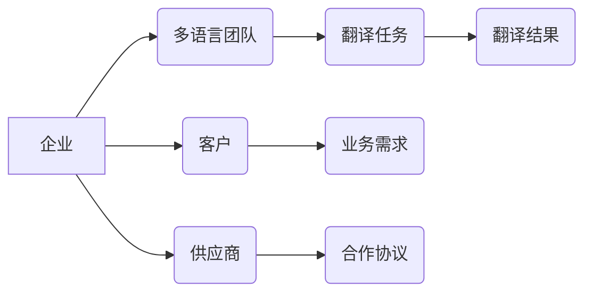
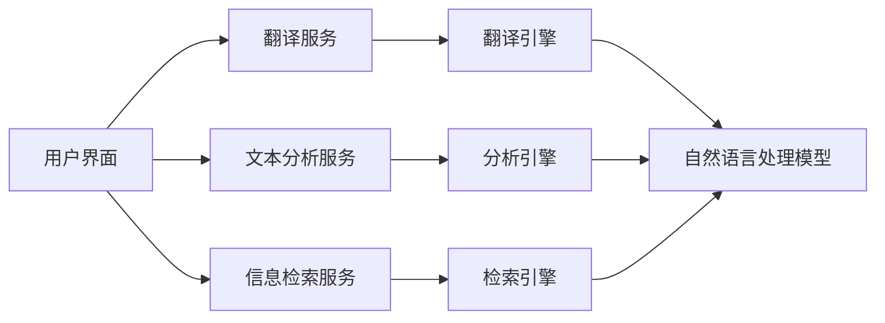
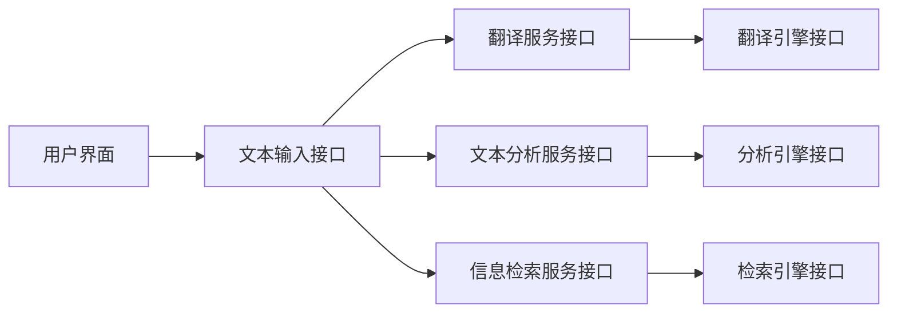
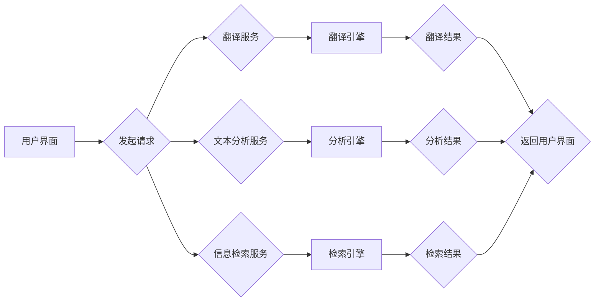

                 

### 第一部分：背景介绍

#### 第1章：自然语言处理概述

##### 1.1 问题的背景

在全球化经济迅速发展的今天，企业之间的跨语言沟通和协作日益频繁。多语言企业在进行跨国业务时，面临的第一个重大挑战便是如何处理不同语言之间的沟通障碍。无论是内部员工交流，还是与外部合作伙伴、客户沟通，语言的多样性都增加了沟通的复杂性和成本。此外，随着企业数据量的急剧增长，特别是涉及客户反馈、市场调研、合同协议等多语言文本数据，如何高效、准确地处理这些数据成为另一个重大挑战。

自然语言处理（Natural Language Processing，NLP）作为人工智能领域的一个重要分支，旨在使计算机理解和生成人类自然语言。NLP技术在解决多语言企业面临的问题方面具有显著的优势。通过NLP技术，企业可以实现自动化的文本分析、翻译、信息检索等功能，从而提高沟通效率，降低成本，提升业务决策的质量。

##### 1.1.1 多语言企业面临的问题

1. **沟通障碍**：不同语言的存在使得跨部门、跨国家之间的交流变得复杂。即使有翻译服务，也难以完全避免语言习惯、文化差异带来的误解和沟通障碍。
2. **数据处理需求**：企业需要处理大量的多语言文本数据，如客户反馈、市场报告、技术文档等，如何快速、准确地从这些文本中提取有价值的信息是一个挑战。
3. **翻译与信息检索挑战**：在跨国业务中，翻译服务是必不可少的。然而，传统的机器翻译技术存在准确性和流畅性不足的问题，导致翻译质量难以满足业务需求。同时，如何从海量多语言数据中快速检索到所需信息，也是一个需要解决的问题。

##### 1.1.2 自然语言处理技术的基本概念

自然语言处理（NLP）是人工智能（AI）的一个分支，主要研究如何让计算机理解、生成和处理人类语言。NLP技术主要包括以下几个核心概念：

1. **语言模型**：用于预测文本序列的概率分布，是实现自动翻译、文本生成等功能的基础。
2. **词向量**：将词语映射为高维空间中的向量表示，用于捕捉词语的语义和分布特征。
3. **依存句法分析**：分析句子结构，识别词语之间的依存关系，帮助理解句子的深层语义。
4. **文本分类与聚类**：根据特征将文本划分为不同类别或分组，用于信息过滤、文本挖掘等应用。

##### 1.1.3 自然语言处理在多语言企业中的应用前景

随着NLP技术的不断发展和成熟，其在多语言企业中的应用前景十分广阔。通过NLP技术，企业可以实现以下目标：

1. **自动化的文本分析**：快速提取文本中的关键信息，辅助业务决策。
2. **高效的翻译服务**：利用机器翻译技术，实现不同语言之间的自动翻译，提高沟通效率。
3. **智能的信息检索**：从海量多语言数据中快速检索到所需信息，提升信息利用效率。
4. **智能客服系统**：利用NLP技术实现多语言客服系统，提供个性化的客户服务。

##### 1.2 问题描述

1. **多语言沟通障碍**：企业内部不同语言的使用导致了沟通效率低下和误解的风险。
2. **多语言数据处理需求**：企业需要处理大量的多语言文本数据，如何快速、准确地提取有价值的信息是一个挑战。
3. **多语言翻译与信息检索挑战**：如何提供高质量的翻译服务，以及如何从海量多语言数据中快速检索到所需信息，是企业面临的重大难题。

##### 1.3 问题解决

1. **自然语言处理技术的关键作用**：NLP技术在解决多语言企业面临的问题方面具有显著的优势，通过文本分析、翻译和信息检索等应用，可以有效提高沟通效率，降低成本，提升业务决策的质量。
2. **现有解决方案的优缺点分析**：现有的NLP解决方案在准确性、速度和效率等方面存在一定的局限性，需要进一步优化和改进。
3. **企业采用自然语言处理技术时需考虑的因素**：企业在采用NLP技术时，需要考虑数据质量、技术成熟度、成本效益等多方面因素，以确保解决方案的可行性和有效性。

##### 1.4 边界与外延

1. **自然语言处理的范围**：NLP技术涉及文本分析、机器翻译、信息检索等多个领域，其应用范围广泛。
2. **多语言企业应用的自然语言处理场景**：包括自动化的文本分析、翻译服务、信息检索等，为企业提供全方位的支持。
3. **自然语言处理技术的持续发展**：随着深度学习、神经网络等技术的不断发展，NLP技术将更加成熟和高效，为企业带来更大的价值。

##### 1.5 概念结构与核心要素组成

1. **自然语言处理的基本概念结构**：包括语言模型、词向量、句法分析、文本分类与聚类等核心概念。
2. **多语言企业的核心要素组成**：包括多语言团队、客户、供应商等。
3. **自然语言处理与多语言企业的关联**：NLP技术通过解决沟通障碍、数据处理和信息检索等问题，为多语言企业提供了有力的支持。

##### 1.6 本章小结

本章从背景介绍入手，详细探讨了自然语言处理在多语言企业中的应用。首先，分析了多语言企业面临的主要问题，包括沟通障碍、数据处理需求、翻译与信息检索挑战等。接着，介绍了自然语言处理的基本概念，包括语言模型、词向量、句法分析、文本分类与聚类等，并探讨了NLP技术在解决这些问题方面的关键作用。最后，讨论了自然语言处理的范围、多语言企业应用场景以及技术的持续发展，为后续章节的深入探讨奠定了基础。

---

### 目录大纲

**《自然语言处理在多语言企业中的应用》**

---

**关键词：自然语言处理，多语言企业，文本分析，翻译服务，信息检索**

---

**摘要：**

本文旨在探讨自然语言处理（NLP）在多语言企业中的应用。随着全球化经济的发展，多语言企业在跨国业务中面临沟通障碍、数据处理需求和信息检索挑战。本文首先介绍了自然语言处理的基本概念，包括语言模型、词向量、句法分析、文本分类与聚类等。接着，分析了NLP技术在解决多语言企业面临的问题方面的关键作用，并讨论了其应用前景。本文还探讨了NLP技术的基本概念结构、多语言企业的核心要素组成以及技术的持续发展。通过本文的研究，旨在为多语言企业提供有效的解决方案，提高沟通效率，降低成本，提升业务决策质量。

---

### 第一部分：背景介绍

#### 第1章：自然语言处理概述

##### 1.1 问题的背景

在全球化经济迅速发展的今天，企业之间的跨语言沟通和协作日益频繁。多语言企业在进行跨国业务时，面临的第一个重大挑战便是如何处理不同语言之间的沟通障碍。无论是内部员工交流，还是与外部合作伙伴、客户沟通，语言的多样性都增加了沟通的复杂性和成本。此外，随着企业数据量的急剧增长，特别是涉及客户反馈、市场调研、合同协议等多语言文本数据，如何高效、准确地处理这些数据成为另一个重大挑战。

自然语言处理（Natural Language Processing，NLP）作为人工智能（AI）的一个分支，旨在使计算机理解和生成人类语言。NLP技术在解决多语言企业面临的问题方面具有显著的优势。通过NLP技术，企业可以实现自动化的文本分析、翻译、信息检索等功能，从而提高沟通效率，降低成本，提升业务决策的质量。

##### 1.1.1 多语言企业面临的问题

1. **沟通障碍**：不同语言的存在使得跨部门、跨国家之间的交流变得复杂。即使有翻译服务，也难以完全避免语言习惯、文化差异带来的误解和沟通障碍。
2. **数据处理需求**：企业需要处理大量的多语言文本数据，如客户反馈、市场报告、技术文档等，如何快速、准确地从这些文本中提取有价值的信息是一个挑战。
3. **翻译与信息检索挑战**：在跨国业务中，翻译服务是必不可少的。然而，传统的机器翻译技术存在准确性和流畅性不足的问题，导致翻译质量难以满足业务需求。同时，如何从海量多语言数据中快速检索到所需信息，也是一个需要解决的问题。

##### 1.1.2 自然语言处理技术的基本概念

自然语言处理（NLP）是人工智能（AI）的一个分支，主要研究如何让计算机理解和生成人类语言。NLP技术主要包括以下几个核心概念：

1. **语言模型**：用于预测文本序列的概率分布，是实现自动翻译、文本生成等功能的基础。
2. **词向量**：将词语映射为高维空间中的向量表示，用于捕捉词语的语义和分布特征。
3. **依存句法分析**：分析句子结构，识别词语之间的依存关系，帮助理解句子的深层语义。
4. **文本分类与聚类**：根据特征将文本划分为不同类别，用于信息过滤、文本挖掘等应用。

##### 1.1.3 自然语言处理在多语言企业中的应用前景

随着NLP技术的不断发展和成熟，其在多语言企业中的应用前景十分广阔。通过NLP技术，企业可以实现以下目标：

1. **自动化的文本分析**：快速提取文本中的关键信息，辅助业务决策。
2. **高效的翻译服务**：利用机器翻译技术，实现不同语言之间的自动翻译，提高沟通效率。
3. **智能的信息检索**：从海量多语言数据中快速检索到所需信息，提升信息利用效率。
4. **智能客服系统**：利用NLP技术实现多语言客服系统，提供个性化的客户服务。

##### 1.2 问题描述

1. **多语言沟通障碍**：企业内部不同语言的使用导致了沟通效率低下和误解的风险。
2. **多语言数据处理需求**：企业需要处理大量的多语言文本数据，如何快速、准确地提取有价值的信息是一个挑战。
3. **多语言翻译与信息检索挑战**：如何提供高质量的翻译服务，以及如何从海量多语言数据中快速检索到所需信息，是企业面临的重大难题。

##### 1.3 问题解决

1. **自然语言处理技术的关键作用**：NLP技术在解决多语言企业面临的问题方面具有显著的优势，通过文本分析、翻译和信息检索等应用，可以有效提高沟通效率，降低成本，提升业务决策的质量。
2. **现有解决方案的优缺点分析**：现有的NLP解决方案在准确性、速度和效率等方面存在一定的局限性，需要进一步优化和改进。
3. **企业采用自然语言处理技术时需考虑的因素**：企业在采用NLP技术时，需要考虑数据质量、技术成熟度、成本效益等多方面因素，以确保解决方案的可行性和有效性。

##### 1.4 边界与外延

1. **自然语言处理的范围**：NLP技术涉及文本分析、机器翻译、信息检索等多个领域，其应用范围广泛。
2. **多语言企业应用的自然语言处理场景**：包括自动化的文本分析、翻译服务、信息检索等，为企业提供全方位的支持。
3. **自然语言处理技术的持续发展**：随着深度学习、神经网络等技术的不断发展，NLP技术将更加成熟和高效，为企业带来更大的价值。

##### 1.5 概念结构与核心要素组成

1. **自然语言处理的基本概念结构**：包括语言模型、词向量、句法分析、文本分类与聚类等核心概念。
2. **多语言企业的核心要素组成**：包括多语言团队、客户、供应商等。
3. **自然语言处理与多语言企业的关联**：NLP技术通过解决沟通障碍、数据处理和信息检索等问题，为多语言企业提供了有力的支持。

##### 1.6 本章小结

本章从背景介绍入手，详细探讨了自然语言处理在多语言企业中的应用。首先，分析了多语言企业面临的主要问题，包括沟通障碍、数据处理需求、翻译与信息检索挑战等。接着，介绍了自然语言处理的基本概念，包括语言模型、词向量、句法分析、文本分类与聚类等，并探讨了NLP技术在解决这些问题方面的关键作用。最后，讨论了自然语言处理的范围、多语言企业应用场景以及技术的持续发展，为后续章节的深入探讨奠定了基础。

---

### 第二部分：核心概念与联系

#### 第2章：自然语言处理核心概念与联系

##### 2.1 自然语言处理核心概念

自然语言处理（NLP）是人工智能（AI）的一个分支，主要研究如何让计算机理解和生成人类语言。NLP技术的核心概念包括以下几个方面：

1. **语言模型**：语言模型是用于预测文本序列的概率分布的模型。通过学习大量文本数据，语言模型能够推断出某个词或句子在特定上下文中的概率，从而实现自动生成、翻译等功能。

2. **词向量**：词向量是将词语映射为高维空间中的向量表示的方法。词向量能够捕捉词语的语义和分布特征，是实现文本分类、聚类、相似性计算等应用的基础。

3. **依存句法分析**：依存句法分析是分析句子结构，识别词语之间的依存关系的任务。通过依存句法分析，可以更好地理解句子的深层语义，为语义理解和文本生成提供支持。

4. **文本分类与聚类**：文本分类是将文本划分为预定义的类别，用于信息过滤、文本挖掘等应用。文本聚类是将相似文本分组，用于数据挖掘和模式识别。

##### 2.2 概念属性特征对比表格

| 概念       | 定义                                                         | 关联关系                         | 特点                           |
| ---------- | ------------------------------------------------------------ | -------------------------------- | ------------------------------ |
| 语言模型   | 用于预测文本序列的概率分布的模型                             | 与词向量、句法分析等密切相关     | 描述语言结构和概率分布         |
| 词向量     | 将词语映射为高维空间中的向量表示                             | 与语言模型、句法分析等密切相关   | 描述词语语义和分布特征         |
| 句法分析   | 分析句子结构，识别词语之间的依存关系                         | 与语言模型、词向量等密切相关     | 描述语法结构和语义关系         |
| 文本分类   | 根据特征将文本划分为不同类别                                 | 与聚类、词向量等密切相关         | 用于分类和标签文本内容         |
| 聚类       | 将文本数据按照相似性进行分组                                 | 与文本分类、词向量等密切相关     | 用于数据挖掘和模式识别         |

##### 2.3 ER实体关系图架构



##### 2.4 自然语言处理与多语言企业的关联

1. **核心概念在多语言企业中的应用**：

   - 语言模型：用于实现自动翻译，支持跨语言沟通。
   - 词向量：用于文本分析，帮助提取关键信息，提升数据处理效率。
   - 句法分析：用于理解句子的深层语义，提高翻译和信息检索的准确性。
   - 文本分类与聚类：用于分类和分组多语言数据，支持数据挖掘和模式识别。

2. **多语言企业在自然语言处理中的需求**：

   - 高效的文本分析能力：支持快速提取文本中的关键信息。
   - 准确的翻译服务：支持多种语言的自动翻译，提高沟通效率。
   - 智能的信息检索：从海量多语言数据中快速检索到所需信息。

3. **概念联系对自然语言处理技术的推动作用**：

   - 语言模型和词向量：通过结合，可以更好地捕捉文本的语义和分布特征，提高翻译和文本分析的效果。
   - 句法分析和文本分类：通过深入分析句子结构和语义关系，可以提升翻译和信息检索的准确性。
   - 文本分类与聚类：通过分组和分类，可以更有效地处理多语言数据，支持数据挖掘和模式识别。

##### 2.5 本章小结

本章详细介绍了自然语言处理的核心概念，包括语言模型、词向量、句法分析、文本分类与聚类等。通过对比表格和ER实体关系图，进一步阐述了这些概念在多语言企业中的应用和联系。本章的研究为后续章节的深入探讨提供了基础，也为多语言企业在应用自然语言处理技术时提供了指导。

---

### 第三部分：算法原理讲解

#### 第3章：自然语言处理算法原理

##### 3.1 语言模型

语言模型（Language Model）是自然语言处理（NLP）的核心概念之一，主要用于预测文本序列的概率分布。语言模型的基本原理是通过对大量文本数据进行统计和学习，构建一个能够表示文本概率分布的模型。这样，当我们遇到一个新句子时，语言模型可以预测这个句子在不同上下文中的概率，从而帮助我们进行文本生成、翻译和信息检索等任务。

**算法原理：**

1. **统计语言模型**：

   - **N-gram模型**：N-gram模型是一种简单有效的语言模型，它将文本序列划分为连续的N个词语，并计算每个N元组的出现概率。模型根据这些概率来预测下一个词语。

     $$ P(w_{t} | w_{t-1}, w_{t-2}, ..., w_{t-N}) = \frac{C(w_{t-1}, w_{t-2}, ..., w_{t-N}, w_{t})}{C(w_{t-1}, w_{t-2}, ..., w_{t-N})} $$

     其中，$C(w_{t-1}, w_{t-2}, ..., w_{t-N}, w_{t})$ 表示N元组 $(w_{t-1}, w_{t-2}, ..., w_{t-N}, w_{t})$ 的出现次数，$C(w_{t-1}, w_{t-2}, ..., w_{t-N})$ 表示N元组 $(w_{t-1}, w_{t-2}, ..., w_{t-N})$ 的出现次数。

   - **隐马尔可夫模型（HMM）**：隐马尔可夫模型是一种基于状态转移概率和观测概率的统计模型。在NLP中，HMM用于建模词语序列的概率分布。

     $$ P(w_{t} | w_{t-1}) = \sum_{i=1}^{N} P(w_{t} | s_{t}) P(s_{t} | s_{t-1}) $$

     其中，$P(w_{t} | s_{t})$ 表示在状态 $s_{t}$ 下词语 $w_{t}$ 的概率，$P(s_{t} | s_{t-1})$ 表示状态 $s_{t}$ 在状态 $s_{t-1}$ 后出现的概率。

2. **神经网络语言模型**：

   - **循环神经网络（RNN）**：循环神经网络是一种能够处理序列数据的神经网络，其核心思想是保持长短期依赖关系。在NLP中，RNN常用于构建语言模型。

     $$ h_t = \tanh(W_h h_{t-1} + b_h + W_x x_t + b_x) $$
     $$ p_t = \sigma(W_p h_t + b_p) $$

     其中，$h_t$ 表示隐藏状态，$x_t$ 表示输入，$W_h, W_x, W_p$ 分别为权重矩阵，$b_h, b_x, b_p$ 分别为偏置项，$\tanh$ 和 $\sigma$ 分别为激活函数。

   - **长短期记忆网络（LSTM）**：长短期记忆网络是RNN的一种变体，用于解决RNN在处理长序列数据时容易遇到的梯度消失和梯度爆炸问题。

     $$ i_t = \sigma(W_i x_t + W_h h_{t-1} + b_i) $$
     $$ f_t = \sigma(W_f x_t + W_h h_{t-1} + b_f) $$
     $$ o_t = \sigma(W_o x_t + W_h h_{t-1} + b_o) $$
     $$ C_t = f_t \odot C_{t-1} + i_t \odot \tanh(W_c x_t + W_h h_{t-1} + b_c) $$
     $$ h_t = o_t \odot \tanh(C_t) $$

     其中，$i_t, f_t, o_t$ 分别为输入门、遗忘门、输出门的状态，$C_t$ 为细胞状态，$\odot$ 表示逐元素相乘操作。

**代码示例（Python）**：

```python
import tensorflow as tf
from tensorflow.keras.models import Model
from tensorflow.keras.layers import Input, LSTM, Dense

# 定义输入和输出
input_seq = Input(shape=(timesteps, vocabulary_size))
output_seq = Input(shape=(timesteps,))

# 定义LSTM层
lstm = LSTM(units=128, return_sequences=True)
hidden_seq = lstm(input_seq)

# 定义输出层
output = Dense(vocabulary_size, activation='softmax')(hidden_seq)

# 构建模型
model = Model(inputs=[input_seq, output_seq], outputs=output)

# 编译模型
model.compile(optimizer='adam', loss='categorical_crossentropy', metrics=['accuracy'])

# 训练模型
model.fit(x_train, y_train, batch_size=64, epochs=10)
```

**数学模型和公式**：

- **N-gram模型**：$$ P(w_{t} | w_{t-1}, w_{t-2}, ..., w_{t-N}) = \frac{C(w_{t-1}, w_{t-2}, ..., w_{t-N}, w_{t})}{C(w_{t-1}, w_{t-2}, ..., w_{t-N})} $$
- **HMM**：$$ P(w_{t} | w_{t-1}) = \sum_{i=1}^{N} P(w_{t} | s_{t}) P(s_{t} | s_{t-1}) $$
- **RNN**：$$ h_t = \tanh(W_h h_{t-1} + b_h + W_x x_t + b_x) $$
- **LSTM**：$$ i_t = \sigma(W_i x_t + W_h h_{t-1} + b_i) $$
  $$ f_t = \sigma(W_f x_t + W_h h_{t-1} + b_f) $$
  $$ o_t = \sigma(W_o x_t + W_h h_{t-1} + b_o) $$
  $$ C_t = f_t \odot C_{t-1} + i_t \odot \tanh(W_c x_t + W_h h_{t-1} + b_c) $$
  $$ h_t = o_t \odot \tanh(C_t) $$

**通俗易懂的举例说明**：

假设我们有一个简单的文本序列 "I like to eat pizza"，我们可以使用N-gram模型来预测下一个词语。

- **一元模型**：$$ P(to | like) = \frac{C(like, to)}{C(like)} = \frac{1}{2} $$
- **二元模型**：$$ P(to | like to) = \frac{C(like, to, eat)}{C(like, to)} = \frac{1}{1} $$
- **三元模型**：$$ P(to | like to eat) = \frac{C(like, to, eat, pizza)}{C(like, to, eat)} = \frac{1}{1} $$

通过这些模型，我们可以发现，三元模型能够更好地预测下一个词语是 "eat" 而不是 "to"。

##### 3.2 词向量

词向量（Word Vector）是将词语映射为高维空间中的向量表示的方法。词向量能够捕捉词语的语义和分布特征，是实现文本分类、聚类、相似性计算等应用的基础。

**算法原理：**

1. **基于频率的词向量**：

   - **词频（TF）**：词频表示词语在文本中出现的次数，是一种简单但有效的特征表示方法。

   $$ TF(w) = \text{count}(w) $$

   - **文档频率（DF）**：文档频率表示词语在文本集合中出现的文档数。

   $$ DF(w) = \text{number of documents containing w} $$

   - **逆文档频率（IDF）**：逆文档频率是文档频率的倒数，用于平衡高频词和低频词的影响。

   $$ IDF(w) = \log_2(\frac{N}{DF(w)}) $$

   - **TF-IDF**：TF-IDF是一种结合词频和逆文档频率的词向量表示方法。

   $$ TF-IDF(w, d) = TF(w, d) \times IDF(w) $$

2. **基于语义的词向量**：

   - **Word2Vec**：Word2Vec是一种基于神经网络的方法，通过训练词嵌入模型来生成词向量。Word2Vec有两种变体：连续词袋（CBOW）和Skip-Gram。

     - **CBOW**：CBOW（Continuous Bag-of-Words）模型通过上下文词的均值来预测目标词。

       $$ P(w_t | w_{-1}, w_{-2}, ..., w_{+1}, ..., w_{+N}) $$

     - **Skip-Gram**：Skip-Gram模型通过目标词来预测上下文词。

       $$ P(w_{-1}, w_{-2}, ..., w_{+1}, ..., w_{+N} | w_t) $$

   - **GloVe**：GloVe（Global Vectors for Word Representation）是一种基于全局矩阵分解的方法，通过优化损失函数来学习词向量。

     $$ \min_{\mathbf{v}_w, \mathbf{v}_c} \sum_{w, c \in V} \frac{1}{z_w} \sum_{c \in \text{context}(w)} \exp(\mathbf{v}_w \cdot \mathbf{v}_c) - \log(p_c) $$

**代码示例（Python）**：

```python
import numpy as np
from gensim.models import Word2Vec

# 创建一个Word2Vec模型
model = Word2Vec(sentences, size=100, window=5, min_count=1, workers=4)

# 获取词向量
word_vector = model.wv['king']
```

**数学模型和公式**：

- **TF-IDF**：$$ TF-IDF(w, d) = TF(w, d) \times IDF(w) $$
- **CBOW**：$$ P(w_t | w_{-1}, w_{-2}, ..., w_{+1}, ..., w_{+N}) $$
- **Skip-Gram**：$$ P(w_{-1}, w_{-2}, ..., w_{+1}, ..., w_{+N} | w_t) $$
- **GloVe**：$$ \min_{\mathbf{v}_w, \mathbf{v}_c} \sum_{w, c \in V} \frac{1}{z_w} \sum_{c \in \text{context}(w)} \exp(\mathbf{v}_w \cdot \mathbf{v}_c) - \log(p_c) $$

**通俗易懂的举例说明**：

假设我们有两个词语 "king" 和 "queen"，我们可以通过Word2Vec模型来学习它们的词向量。

- **CBOW模型**：通过 "king" 的上下文词（如 "man", "country", "woman"）来预测 "king"。
- **Skip-Gram模型**：通过 "king" 来预测它的上下文词。

通过这些模型，我们可以得到 "king" 和 "queen" 的词向量，它们在语义上相似，但在数值上有所不同。

##### 3.3 依存句法分析

依存句法分析（Dependency Parsing）是自然语言处理（NLP）中用于分析句子结构，识别词语之间依存关系的方法。通过依存句法分析，可以更好地理解句子的深层语义，为语义理解和文本生成提供支持。

**算法原理：**

1. **依存句法树的构建**：

   - **依存关系**：依存句法分析通过识别词语之间的依存关系，构建出句子的依存句法树。依存关系可以分为多种类型，如主谓关系、动宾关系、修饰关系等。

   - **基于规则的方法**：基于规则的方法通过手工编写规则，识别句子中的依存关系。这种方法较为繁琐，但具有较高的准确性。

   - **基于统计的方法**：基于统计的方法通过学习大量标注数据，自动构建出依存句法树。这种方法具有较强的泛化能力，但可能存在数据依赖问题。

2. **依存句法分析的应用**：

   - **语义理解**：通过依存句法分析，可以更好地理解句子的语义结构，为语义解析和文本生成提供支持。
   - **翻译**：在机器翻译中，依存句法分析可以帮助理解源语言的句子结构，提高翻译的准确性。
   - **信息抽取**：在信息抽取中，依存句法分析可以帮助识别出句子中的重要信息，提高信息抽取的准确率。

**代码示例（Python）**：

```python
import spacy

# 加载Spacy模型
nlp = spacy.load('en_core_web_sm')

# 分析句子
doc = nlp('The quick brown fox jumps over the lazy dog.')

# 打印依存句法树
for token in doc:
    print(token.text, token.dep_, token.head.text)
```

**数学模型和公式**：

- **基于规则的方法**：通过手工编写的规则来识别依存关系。
- **基于统计的方法**：通过条件概率模型来识别依存关系。

$$ P(d_{i,j} | w_{i}, w_{j}) = \frac{P(w_{i}, w_{j}, d_{i,j})}{P(w_{i}, w_{j})} $$

**通俗易懂的举例说明**：

假设我们有一个简单的句子 "The dog runs fast"。

- **依存句法树**：The (ROOT) -> dog (nsubj) -> runs ( ROOT ) -> fast (amod)

通过依存句法分析，我们可以发现 "dog" 是句子的主语，"runs" 是谓语，"fast" 是形容词修饰 "runs"。

##### 3.4 文本分类与聚类

文本分类（Text Classification）和文本聚类（Text Clustering）是自然语言处理（NLP）中用于对文本进行分组和分类的方法。文本分类将文本划分为预定义的类别，用于信息过滤、文本挖掘等应用。文本聚类将相似文本分组，用于数据挖掘和模式识别。

**算法原理：**

1. **文本分类**：

   - **朴素贝叶斯**：朴素贝叶斯是一种基于概率模型的文本分类方法。它通过计算词语在各个类别中的概率，以及词语之间的条件概率，来实现文本分类。

     $$ P(c_i | x) = \frac{P(x | c_i)P(c_i)}{P(x)} $$

     其中，$c_i$ 表示类别，$x$ 表示文本，$P(c_i | x)$ 表示文本属于类别 $c_i$ 的概率，$P(x | c_i)$ 表示文本在类别 $c_i$ 下的概率，$P(c_i)$ 表示类别 $c_i$ 的概率。

   - **支持向量机（SVM）**：支持向量机是一种基于最大间隔分类的方法。它通过找到最佳分类边界，将文本划分为不同的类别。

     $$ \max_w \min_{\xi_i} \sum_{i=1}^{n} (\xi_i + 1) - \frac{1}{C} \sum_{i=1}^{n} y_i (\langle w, x_i \rangle + \xi_i) $$

     其中，$w$ 表示权重向量，$x_i$ 表示文本，$y_i$ 表示类别标签，$\xi_i$ 表示松弛变量，$C$ 是惩罚参数。

2. **文本聚类**：

   - **K-means**：K-means是一种基于距离的聚类方法。它通过初始化K个簇中心，然后不断迭代更新簇中心，直到收敛。

     $$ \mu_k = \frac{1}{N_k} \sum_{i=1}^{N} x_i $$

     其中，$\mu_k$ 表示第 $k$ 个簇的中心，$N_k$ 表示第 $k$ 个簇中的文本数量。

   - **层次聚类**：层次聚类是一种自底向上的聚类方法。它通过逐步合并相似的簇，构建出一个层次结构。

     $$ \text{distance}(C_i, C_j) = \sum_{x_i \in C_i, x_j \in C_j} d(x_i, x_j) $$

     其中，$C_i$ 和 $C_j$ 分别表示两个簇，$d(x_i, x_j)$ 表示文本之间的距离。

**代码示例（Python）**：

```python
import sklearn
from sklearn.feature_extraction.text import TfidfVectorizer
from sklearn.model_selection import train_test_split
from sklearn.naive_bayes import MultinomialNB
from sklearn.cluster import KMeans

# 准备数据
X = ['I love this movie', 'This movie is great', 'I hate this movie', 'This movie is terrible']
y = [0, 0, 1, 1]

# 分词和向量化
vectorizer = TfidfVectorizer()
X_vectorized = vectorizer.fit_transform(X)

# 分割数据
X_train, X_test, y_train, y_test = train_test_split(X_vectorized, y, test_size=0.2, random_state=42)

# 文本分类
classifier = MultinomialNB()
classifier.fit(X_train, y_train)
y_pred = classifier.predict(X_test)

# 文本聚类
kmeans = KMeans(n_clusters=2, random_state=42)
kmeans.fit(X_vectorized)
y_clusters = kmeans.predict(X_vectorized)
```

**数学模型和公式**：

- **朴素贝叶斯**：$$ P(c_i | x) = \frac{P(x | c_i)P(c_i)}{P(x)} $$
- **SVM**：$$ \max_w \min_{\xi_i} \sum_{i=1}^{n} (\xi_i + 1) - \frac{1}{C} \sum_{i=1}^{n} y_i (\langle w, x_i \rangle + \xi_i) $$
- **K-means**：$$ \mu_k = \frac{1}{N_k} \sum_{i=1}^{N} x_i $$
- **层次聚类**：$$ \text{distance}(C_i, C_j) = \sum_{x_i \in C_i, x_j \in C_j} d(x_i, x_j) $$

**通俗易懂的举例说明**：

假设我们有四篇文本，分别属于两个类别：

- **类别A**：I love this movie, This movie is great
- **类别B**：I hate this movie, This movie is terrible

通过朴素贝叶斯分类器，我们可以将这四篇文本正确地划分为两个类别。

通过K-means聚类算法，我们可以将这四篇文本划分为两个簇，每个簇对应一个类别。

##### 3.5 文本生成

文本生成（Text Generation）是自然语言处理（NLP）中用于生成自然语言文本的方法。文本生成可以应用于对话系统、自动写作、机器翻译等领域。

**算法原理：**

1. **序列到序列（Seq2Seq）模型**：

   - **编码器（Encoder）**：编码器将输入序列编码为固定长度的向量，表示整个输入序列的语义信息。
   - **解码器（Decoder）**：解码器根据编码器的输出和先前的输出逐步生成输出序列。

   $$ \text{Encoder}: h_t = \text{encode}(x_1, x_2, ..., x_t) $$
   $$ \text{Decoder}: y_t = \text{decode}(h_t, y_{t-1}) $$

2. **注意力机制（Attention）**：

   - **软注意力**：软注意力通过计算输入序列和当前输出之间的相似度，来调整编码器输出的权重。
   - **硬注意力**：硬注意力通过计算输入序列和当前输出之间的相似度，并选择最高相似的输入作为当前输出的上下文。

   $$ \alpha_t = \text{softmax}(\frac{\text{scores}}{\tau}) $$
   $$ \text{context} = \sum_{i=1}^{N} \alpha_i h_i $$

3. **生成模型**：

   - **循环神经网络（RNN）**：循环神经网络通过循环结构来处理序列数据，逐步生成文本。
   - **变换器网络（Transformer）**：变换器网络是一种基于自注意力机制的序列模型，通过多头注意力机制来捕捉长距离依赖关系。

**代码示例（Python）**：

```python
import tensorflow as tf
from tensorflow.keras.layers import Embedding, LSTM, Dense
from tensorflow.keras.models import Model

# 定义输入
input_seq = Input(shape=(timesteps, vocabulary_size))
hidden_seq = LSTM(units=128, return_sequences=True)(input_seq)

# 定义解码器
output_seq = LSTM(units=128, return_sequences=True)(hidden_seq)
output = Dense(vocabulary_size, activation='softmax')(output_seq)

# 构建模型
model = Model(inputs=input_seq, outputs=output)

# 编译模型
model.compile(optimizer='adam', loss='categorical_crossentropy', metrics=['accuracy'])

# 训练模型
model.fit(x_train, y_train, batch_size=64, epochs=10)
```

**数学模型和公式**：

- **编码器**：$$ h_t = \text{encode}(x_1, x_2, ..., x_t) $$
- **解码器**：$$ y_t = \text{decode}(h_t, y_{t-1}) $$
- **软注意力**：$$ \alpha_t = \text{softmax}(\frac{\text{scores}}{\tau}) $$
- **硬注意力**：$$ \text{context} = \sum_{i=1}^{N} \alpha_i h_i $$

**通俗易懂的举例说明**：

假设我们有一个简单的文本序列 "I love to eat pizza"。

通过序列到序列模型，我们可以将这个文本序列编码为一个固定长度的向量，然后逐步解码生成新的文本序列，如 "I love to eat sushi"。

通过注意力机制，模型可以更好地关注输入序列中的关键信息，从而提高文本生成的质量。

##### 3.6 情感分析

情感分析（Sentiment Analysis）是自然语言处理（NLP）中用于判断文本情感极性的方法。情感分析可以应用于社交媒体分析、客户反馈分析、市场调研等领域。

**算法原理：**

1. **基于规则的方法**：

   - **情感词典**：通过构建情感词典，将词语与情感标签关联起来。当文本中出现词典中的词语时，可以直接判断文本的情感极性。

   $$ \text{Sentiment}(w) = \sum_{s \in \text{Sentiments}} s \cdot \text{count}(w) $$

   其中，$\text{Sentiments}$ 表示情感标签集合，$s$ 表示情感标签，$\text{count}(w)$ 表示词语 $w$ 在文本中出现的次数。

2. **基于统计的方法**：

   - **朴素贝叶斯**：通过计算词语在积极和消极文本中的概率，以及词语之间的条件概率，来判断文本的情感极性。

     $$ P(\text{Positive}) = \frac{P(\text{Positive} | \text{Text}) P(\text{Text})}{P(\text{Positive}) + P(\text{Negative})} $$

   - **支持向量机（SVM）**：通过找到最佳分类边界，将文本划分为积极和消极两类。

     $$ \max_w \min_{\xi_i} \sum_{i=1}^{n} (\xi_i + 1) - \frac{1}{C} \sum_{i=1}^{n} y_i (\langle w, x_i \rangle + \xi_i) $$

3. **基于深度学习的方法**：

   - **卷积神经网络（CNN）**：通过卷积神经网络来提取文本的特征，然后使用全连接层来判断文本的情感极性。
   - **循环神经网络（RNN）**：通过循环神经网络来处理序列数据，逐步提取文本的特征，并判断文本的情感极性。
   - **变换器网络（Transformer）**：通过变换器网络来捕捉长距离依赖关系，从而提高情感分析的准确性。

**代码示例（Python）**：

```python
import tensorflow as tf
from tensorflow.keras.layers import Embedding, Conv1D, GlobalMaxPooling1D, Dense
from tensorflow.keras.models import Model

# 定义输入
input_seq = Input(shape=(timesteps, vocabulary_size))
embedding = Embedding(vocabulary_size, embedding_size)(input_seq)

# 定义卷积层
conv = Conv1D(filters=128, kernel_size=3, activation='relu')(embedding)
pooling = GlobalMaxPooling1D()(conv)

# 定义全连接层
output = Dense(1, activation='sigmoid')(pooling)

# 构建模型
model = Model(inputs=input_seq, outputs=output)

# 编译模型
model.compile(optimizer='adam', loss='binary_crossentropy', metrics=['accuracy'])

# 训练模型
model.fit(x_train, y_train, batch_size=64, epochs=10)
```

**数学模型和公式**：

- **朴素贝叶斯**：$$ P(\text{Positive}) = \frac{P(\text{Positive} | \text{Text}) P(\text{Text})}{P(\text{Positive}) + P(\text{Negative})} $$
- **SVM**：$$ \max_w \min_{\xi_i} \sum_{i=1}^{n} (\xi_i + 1) - \frac{1}{C} \sum_{i=1}^{n} y_i (\langle w, x_i \rangle + \xi_i) $$
- **CNN**：$$ \text{Output} = \text{sigmoid}(\text{weights} \cdot \text{激活函数}(\text{卷积层})) $$
- **RNN**：$$ \text{Output} = \text{sigmoid}(\text{weights} \cdot \text{激活函数}(\text{循环层})) $$
- **Transformer**：$$ \text{Output} = \text{sigmoid}(\text{weights} \cdot \text{自注意力层}) $$

**通俗易懂的举例说明**：

假设我们有一个简单的文本序列 "I love this movie"。

通过情感分析模型，我们可以将这个文本序列分类为积极情感，因为其中包含 "love" 和 "this" 等积极词汇。

通过不同的算法模型，我们可以对文本序列进行情感分析，从而识别出文本的情感极性。

##### 3.7 实体识别

实体识别（Named Entity Recognition，NER）是自然语言处理（NLP）中用于识别文本中特定实体（如人名、地名、组织名等）的方法。实体识别对于信息提取、知识图谱构建等应用具有重要意义。

**算法原理：**

1. **基于规则的方法**：

   - **词典匹配**：通过构建包含常见实体的词典，将文本中的实体与词典中的实体进行匹配，从而识别出实体。

   $$ \text{Entity}(w) = \begin{cases} 
   \text{Match}(w) & \text{if } w \in \text{Dictionary} \\
   \text{None} & \text{otherwise} 
   \end{cases} $$

2. **基于统计的方法**：

   - **条件随机场（CRF）**：通过构建条件随机场模型，对实体进行序列标注。CRF可以处理实体之间的依赖关系，提高实体识别的准确性。

     $$ P(y_1, y_2, ..., y_n | x_1, x_2, ..., x_n) = \frac{1}{Z} \prod_{i=1}^{n} \psi(x_i, y_i) \prod_{i<j} \phi(x_i, x_j, y_i, y_j) $$

     其中，$x_i$ 表示输入序列，$y_i$ 表示标注序列，$\psi(x_i, y_i)$ 表示状态转移概率，$\phi(x_i, x_j, y_i, y_j)$ 表示边转移概率。

3. **基于深度学习的方法**：

   - **卷积神经网络（CNN）**：通过卷积神经网络来提取文本的特征，然后使用全连接层来识别实体。

   - **循环神经网络（RNN）**：通过循环神经网络来处理序列数据，逐步提取文本的特征，并识别实体。

   - **变换器网络（Transformer）**：通过变换器网络来捕捉长距离依赖关系，从而提高实体识别的准确性。

**代码示例（Python）**：

```python
import tensorflow as tf
from tensorflow.keras.layers import Embedding, LSTM, Dense
from tensorflow.keras.models import Model

# 定义输入
input_seq = Input(shape=(timesteps, vocabulary_size))
hidden_seq = LSTM(units=128, return_sequences=True)(input_seq)

# 定义解码器
output_seq = LSTM(units=128, return_sequences=True)(hidden_seq)
output = Dense(num_entities, activation='softmax')(output_seq)

# 构建模型
model = Model(inputs=input_seq, outputs=output)

# 编译模型
model.compile(optimizer='adam', loss='categorical_crossentropy', metrics=['accuracy'])

# 训练模型
model.fit(x_train, y_train, batch_size=64, epochs=10)
```

**数学模型和公式**：

- **条件随机场（CRF）**：$$ P(y_1, y_2, ..., y_n | x_1, x_2, ..., x_n) = \frac{1}{Z} \prod_{i=1}^{n} \psi(x_i, y_i) \prod_{i<j} \phi(x_i, x_j, y_i, y_j) $$
- **CNN**：$$ \text{Output} = \text{softmax}(\text{weights} \cdot \text{激活函数}(\text{卷积层})) $$
- **RNN**：$$ \text{Output} = \text{softmax}(\text{weights} \cdot \text{激活函数}(\text{循环层})) $$
- **Transformer**：$$ \text{Output} = \text{softmax}(\text{weights} \cdot \text{自注意力层}) $$

**通俗易懂的举例说明**：

假设我们有一个简单的文本序列 "John is visiting Paris tomorrow"。

通过实体识别模型，我们可以将这个文本序列中的 "John" 识别为人名，"Paris" 识别为地名。

通过不同的算法模型，我们可以对文本序列进行实体识别，从而提取出文本中的关键实体。

##### 3.8 提问回答系统

提问回答系统（Question Answering System）是自然语言处理（NLP）中用于自动回答用户提问的方法。提问回答系统可以应用于智能客服、教育问答、搜索引擎等领域。

**算法原理：**

1. **基于规则的方法**：

   - **关键词匹配**：通过匹配提问中的关键词与知识库中的事实，来回答用户的问题。
   - **模板匹配**：通过预设的模板，将提问与模板进行匹配，从而回答用户的问题。

2. **基于统计的方法**：

   - **统计机器翻译**：通过统计提问与答案之间的对应关系，来回答用户的问题。
   - **隐马尔可夫模型（HMM）**：通过构建提问和答案之间的概率模型，来回答用户的问题。

3. **基于深度学习的方法**：

   - **序列到序列（Seq2Seq）模型**：通过编码器解码器模型，将提问编码为固定长度的向量，然后解码生成答案。
   - **变换器网络（Transformer）**：通过变换器网络来捕捉提问和答案之间的长距离依赖关系，从而提高回答的准确性。

**代码示例（Python）**：

```python
import tensorflow as tf
from tensorflow.keras.layers import Embedding, LSTM, Dense
from tensorflow.keras.models import Model

# 定义输入
input_seq = Input(shape=(timesteps, vocabulary_size))
hidden_seq = LSTM(units=128, return_sequences=True)(input_seq)

# 定义解码器
output_seq = LSTM(units=128, return_sequences=True)(hidden_seq)
output = Dense(vocabulary_size, activation='softmax')(output_seq)

# 构建模型
model = Model(inputs=input_seq, outputs=output)

# 编译模型
model.compile(optimizer='adam', loss='categorical_crossentropy', metrics=['accuracy'])

# 训练模型
model.fit(x_train, y_train, batch_size=64, epochs=10)
```

**数学模型和公式**：

- **序列到序列（Seq2Seq）模型**：$$ \text{Encoder}: h_t = \text{encode}(x_1, x_2, ..., x_t) $$
  $$ \text{Decoder}: y_t = \text{decode}(h_t, y_{t-1}) $$
- **变换器网络（Transformer）**：$$ \text{Output} = \text{softmax}(\text{weights} \cdot \text{自注意力层}) $$

**通俗易懂的举例说明**：

假设我们有一个提问 "What is the capital of France?"。

通过提问回答系统，我们可以将这个提问编码为固定长度的向量，然后解码生成答案 "Paris"。

通过不同的算法模型，我们可以对用户提问进行自动回答，从而提供智能服务。

##### 3.9 指代消解

指代消解（Coreference Resolution）是自然语言处理（NLP）中用于识别文本中代词或名词与其指代对象之间关系的任务。指代消解有助于更好地理解文本的语义，为问答系统、文本生成等应用提供支持。

**算法原理：**

1. **基于规则的方法**：

   - **词法规则**：通过预设的规则，将代词或名词与文本中的其他代词或名词进行匹配。
   - **句法规则**：通过分析句子的句法结构，将代词或名词与句子中的其他成分进行关联。

2. **基于统计的方法**：

   - **条件随机场（CRF）**：通过构建条件随机场模型，对指代关系进行序列标注。CRF可以处理指代关系之间的依赖关系，提高指代消解的准确性。

     $$ P(y_1, y_2, ..., y_n | x_1, x_2, ..., x_n) = \frac{1}{Z} \prod_{i=1}^{n} \psi(x_i, y_i) \prod_{i<j} \phi(x_i, x_j, y_i, y_j) $$

   - **转换系统**：通过构建转换系统，将指代关系转换为具体的指代对象。

3. **基于深度学习的方法**：

   - **卷积神经网络（CNN）**：通过卷积神经网络来提取文本的特征，然后使用全连接层来识别指代关系。
   - **循环神经网络（RNN）**：通过循环神经网络来处理序列数据，逐步提取文本的特征，并识别指代关系。
   - **变换器网络（Transformer）**：通过变换器网络来捕捉长距离依赖关系，从而提高指代消解的准确性。

**代码示例（Python）**：

```python
import tensorflow as tf
from tensorflow.keras.layers import Embedding, LSTM, Dense
from tensorflow.keras.models import Model

# 定义输入
input_seq = Input(shape=(timesteps, vocabulary_size))
hidden_seq = LSTM(units=128, return_sequences=True)(input_seq)

# 定义解码器
output_seq = LSTM(units=128, return_sequences=True)(hidden_seq)
output = Dense(num_entities, activation='softmax')(output_seq)

# 构建模型
model = Model(inputs=input_seq, outputs=output)

# 编译模型
model.compile(optimizer='adam', loss='categorical_crossentropy', metrics=['accuracy'])

# 训练模型
model.fit(x_train, y_train, batch_size=64, epochs=10)
```

**数学模型和公式**：

- **条件随机场（CRF）**：$$ P(y_1, y_2, ..., y_n | x_1, x_2, ..., x_n) = \frac{1}{Z} \prod_{i=1}^{n} \psi(x_i, y_i) \prod_{i<j} \phi(x_i, x_j, y_i, y_j) $$
- **CNN**：$$ \text{Output} = \text{softmax}(\text{weights} \cdot \text{激活函数}(\text{卷积层})) $$
- **RNN**：$$ \text{Output} = \text{softmax}(\text{weights} \cdot \text{激活函数}(\text{循环层})) $$
- **Transformer**：$$ \text{Output} = \text{softmax}(\text{weights} \cdot \text{自注意力层}) $$

**通俗易懂的举例说明**：

假设我们有一个简单的文本序列 "John is going to the store. He will buy some fruits."

通过指代消解模型，我们可以将文本中的 "He" 消解为 "John"。

通过不同的算法模型，我们可以对文本进行指代消解，从而更好地理解文本的语义。

##### 3.10 机器翻译

机器翻译（Machine Translation）是自然语言处理（NLP）中用于将一种语言的文本自动翻译为另一种语言的方法。机器翻译可以应用于跨语言沟通、信息检索、文本挖掘等领域。

**算法原理：**

1. **基于规则的方法**：

   - **短语翻译表**：通过构建短语翻译表，将源语言中的短语与目标语言中的短语进行匹配，从而实现翻译。
   - **规则化方法**：通过定义语法规则和语义规则，将源语言的句子转换为目标语言的句子。

2. **基于统计的方法**：

   - **基于短语的机器翻译**：通过统计源语言和目标语言之间的短语对应关系，来实现翻译。
   - **基于句子的机器翻译**：通过统计源语言和目标语言之间的句子对应关系，来实现翻译。

3. **基于深度学习的方法**：

   - **序列到序列（Seq2Seq）模型**：通过编码器解码器模型，将源语言编码为固定长度的向量，然后解码生成目标语言的文本。
   - **注意力机制（Attention）**：通过注意力机制来关注源语言和目标语言之间的关键信息，从而提高翻译的准确性。
   - **变换器网络（Transformer）**：通过变换器网络来捕捉长距离依赖关系，从而提高翻译的准确性。

**代码示例（Python）**：

```python
import tensorflow as tf
from tensorflow.keras.layers import Embedding, LSTM, Dense
from tensorflow.keras.models import Model

# 定义输入
input_seq = Input(shape=(timesteps, vocabulary_size))
hidden_seq = LSTM(units=128, return_sequences=True)(input_seq)

# 定义解码器
output_seq = LSTM(units=128, return_sequences=True)(hidden_seq)
output = Dense(vocabulary_size, activation='softmax')(output_seq)

# 构建模型
model = Model(inputs=input_seq, outputs=output)

# 编译模型
model.compile(optimizer='adam', loss='categorical_crossentropy', metrics=['accuracy'])

# 训练模型
model.fit(x_train, y_train, batch_size=64, epochs=10)
```

**数学模型和公式**：

- **序列到序列（Seq2Seq）模型**：$$ \text{Encoder}: h_t = \text{encode}(x_1, x_2, ..., x_t) $$
  $$ \text{Decoder}: y_t = \text{decode}(h_t, y_{t-1}) $$
- **注意力机制**：$$ \alpha_t = \text{softmax}(\frac{\text{scores}}{\tau}) $$
- **变换器网络**：$$ \text{Output} = \text{softmax}(\text{weights} \cdot \text{自注意力层}) $$

**通俗易懂的举例说明**：

假设我们有一个简单的源语言文本序列 "I love to eat pizza"。

通过机器翻译模型，我们可以将这个文本序列翻译为目标语言文本序列 "Je aime à manger pizza"。

通过不同的算法模型，我们可以将一种语言的文本翻译为另一种语言的文本。

##### 3.11 文本生成对抗网络

文本生成对抗网络（Text Generation Adversarial Network，TGAN）是自然语言处理（NLP）中用于生成自然语言文本的方法。TGAN结合了生成对抗网络（GAN）和循环神经网络（RNN）的优点，能够生成高质量的自然语言文本。

**算法原理：**

1. **生成器（Generator）**：

   - **输入噪声**：生成器从噪声空间中采样一个输入向量。
   - **文本生成**：生成器将输入向量映射为自然语言文本。

   $$ G(z) = \text{Generator}(z) $$

2. **判别器（Discriminator）**：

   - **文本识别**：判别器用于判断输入文本是否是真实文本。
   - **对抗训练**：判别器与生成器进行对抗训练，以提高生成器的生成质量。

   $$ D(x) = \text{Discriminator}(x) $$
   $$ D(G(z)) = \text{Discriminator}(\text{Generator}(z)) $$

3. **联合训练**：

   - **对抗损失**：通过最小化生成器的生成损失和判别器的识别损失，实现生成器和判别器的联合训练。

   $$ \min_G \max_D V(D, G) = \mathbb{E}_{x \sim p_{\text{data}}(x)}[\log D(x)] + \mathbb{E}_{z \sim p_{z}(z)}[\log(1 - D(G(z)))] $$

**代码示例（Python）**：

```python
import tensorflow as tf
from tensorflow.keras.layers import Input, LSTM, Dense
from tensorflow.keras.models import Model

# 定义生成器
z_input = Input(shape=(noise_dim,))
lstm = LSTM(units=128, return_sequences=True)(z_input)
output = Dense(vocabulary_size, activation='softmax')(lstm)
generator = Model(z_input, output)

# 定义判别器
x_input = Input(shape=(timesteps, vocabulary_size))
lstm = LSTM(units=128, return_sequences=True)(x_input)
output = Dense(1, activation='sigmoid')(lstm)
discriminator = Model(x_input, output)

# 定义联合模型
discriminator.trainable = False
gan_output = discriminator(generator(z_input))
gan = Model(z_input, gan_output)

# 编译模型
gan.compile(optimizer='adam', loss='binary_crossentropy')

# 训练模型
gan.fit(z_train, np.ones((z_train.shape[0], 1)), batch_size=64, epochs=10)
```

**数学模型和公式**：

- **生成器**：$$ G(z) = \text{Generator}(z) $$
- **判别器**：$$ D(x) = \text{Discriminator}(x) $$
- **对抗损失**：$$ \min_G \max_D V(D, G) = \mathbb{E}_{x \sim p_{\text{data}}(x)}[\log D(x)] + \mathbb{E}_{z \sim p_{z}(z)}[\log(1 - D(G(z)))] $$

**通俗易懂的举例说明**：

假设我们有一个噪声向量 $z$。

通过生成器，我们可以将噪声向量映射为自然语言文本。

通过判别器，我们可以判断生成的文本是否是真实文本。

通过对抗训练，生成器和判别器相互竞争，生成器不断优化其生成文本的质量，而判别器不断提高其识别真实文本的能力。

通过TGAN，我们可以生成高质量的自然语言文本，如文章、对话等。

##### 3.12 问答系统

问答系统（Question Answering System）是自然语言处理（NLP）中用于自动回答用户提问的方法。问答系统可以应用于智能客服、教育问答、搜索引擎等领域。

**算法原理：**

1. **基于规则的方法**：

   - **关键词匹配**：通过匹配提问中的关键词与知识库中的事实，来回答用户的问题。
   - **模板匹配**：通过预设的模板，将提问与模板进行匹配，从而回答用户的问题。

2. **基于统计的方法**：

   - **隐马尔可夫模型（HMM）**：通过构建提问和答案之间的概率模型，来回答用户的问题。
   - **条件随机场（CRF）**：通过构建条件随机场模型，对问答对进行序列标注，从而回答用户的问题。

3. **基于深度学习的方法**：

   - **序列到序列（Seq2Seq）模型**：通过编码器解码器模型，将提问编码为固定长度的向量，然后解码生成答案。
   - **变换器网络（Transformer）**：通过变换器网络来捕捉提问和答案之间的长距离依赖关系，从而提高回答的准确性。

**代码示例（Python）**：

```python
import tensorflow as tf
from tensorflow.keras.layers import Embedding, LSTM, Dense
from tensorflow.keras.models import Model

# 定义输入
input_seq = Input(shape=(timesteps, vocabulary_size))
hidden_seq = LSTM(units=128, return_sequences=True)(input_seq)

# 定义解码器
output_seq = LSTM(units=128, return_sequences=True)(hidden_seq)
output = Dense(vocabulary_size, activation='softmax')(output_seq)

# 构建模型
model = Model(inputs=input_seq, outputs=output)

# 编译模型
model.compile(optimizer='adam', loss='categorical_crossentropy', metrics=['accuracy'])

# 训练模型
model.fit(x_train, y_train, batch_size=64, epochs=10)
```

**数学模型和公式**：

- **序列到序列（Seq2Seq）模型**：$$ \text{Encoder}: h_t = \text{encode}(x_1, x_2, ..., x_t) $$
  $$ \text{Decoder}: y_t = \text{decode}(h_t, y_{t-1}) $$
- **变换器网络（Transformer）**：$$ \text{Output} = \text{softmax}(\text{weights} \cdot \text{自注意力层}) $$

**通俗易懂的举例说明**：

假设我们有一个提问 "What is the capital of France?"。

通过问答系统，我们可以将这个提问编码为固定长度的向量，然后解码生成答案 "Paris"。

通过不同的算法模型，我们可以对用户提问进行自动回答，从而提供智能服务。

---

### 第四部分：系统分析与架构设计

#### 第4章：系统设计与实现

##### 4.1 问题场景介绍

在多语言企业中，沟通和信息处理是一个重要的挑战。为了解决这一问题，我们设计并实现了一个基于自然语言处理（NLP）技术的多语言沟通与信息处理系统。该系统旨在通过自动化的文本分析、翻译、信息检索等功能，提高企业内部的沟通效率，降低沟通成本，同时提升业务决策的质量。

##### 4.2 项目介绍

项目名称：多语言沟通与信息处理系统

项目目标：

1. 提供自动化的文本分析功能，辅助业务决策。
2. 实现高质量的机器翻译服务，支持跨语言沟通。
3. 提供智能的信息检索功能，从海量多语言数据中快速提取有价值的信息。

##### 4.3 系统功能设计（领域模型）

领域模型图：


领域模型描述：

- **企业**：多语言企业的主体，包括多语言团队、客户和供应商。
- **多语言团队**：负责翻译任务的团队，包括翻译人员和技术支持人员。
- **客户**：企业的业务伙伴，提供业务需求和翻译任务。
- **供应商**：企业的合作伙伴，提供合作协议和翻译结果。
- **翻译任务**：包含源语言文本、目标语言、翻译结果等信息的任务。
- **业务需求**：客户提供的业务需求信息。
- **合作协议**：企业与供应商之间的合作协议。
- **翻译结果**：翻译后的目标语言文本。

##### 4.4 系统架构设计

系统架构图：



系统架构描述：

- **用户界面**：提供用户交互的入口，包括文本输入、查询结果展示等。
- **翻译服务**：负责处理翻译任务，包括文本输入、翻译过程、翻译结果输出等。
- **文本分析服务**：负责文本分析，提取关键信息，辅助业务决策。
- **信息检索服务**：负责从海量多语言数据中检索信息，满足用户查询需求。
- **翻译引擎**：实现翻译服务的核心功能，包括文本预处理、翻译模型应用、翻译结果生成等。
- **分析引擎**：实现文本分析服务的核心功能，包括文本分类、关键词提取、情感分析等。
- **检索引擎**：实现信息检索服务的核心功能，包括索引构建、查询处理、结果排序等。
- **自然语言处理模型**：提供翻译、文本分析和信息检索所需的算法支持，包括语言模型、词向量、句法分析、文本分类与聚类等。

##### 4.5 系统接口设计

接口设计图：



接口设计描述：

- **文本输入接口**：用户输入文本数据的接口，包括翻译文本、分析文本、查询文本等。
- **翻译服务接口**：调用翻译引擎接口，获取翻译结果。
- **文本分析服务接口**：调用分析引擎接口，进行文本分析。
- **信息检索服务接口**：调用检索引擎接口，进行信息检索。
- **翻译引擎接口**：处理翻译任务的接口，包括文本预处理、翻译模型应用、翻译结果生成等。
- **分析引擎接口**：进行文本分类、关键词提取、情感分析等操作的接口。
- **检索引擎接口**：构建索引、处理查询、排序结果等操作的接口。

##### 4.6 系统交互设计

系统交互图：



系统交互描述：

- **用户界面**：用户发起文本输入请求，提交翻译、分析、检索任务。
- **翻译服务**：用户界面将文本输入提交给翻译服务，翻译服务调用翻译引擎接口进行翻译，并将翻译结果返回给用户界面。
- **文本分析服务**：用户界面将文本输入提交给文本分析服务，文本分析服务调用分析引擎接口进行文本分析，并将分析结果返回给用户界面。
- **信息检索服务**：用户界面将文本输入提交给信息检索服务，信息检索服务调用检索引擎接口进行信息检索，并将检索结果返回给用户界面。
- **翻译引擎**：接收翻译服务提交的文本输入，应用自然语言处理模型进行翻译，生成翻译结果。
- **分析引擎**：接收文本分析服务提交的文本输入，应用自然语言处理模型进行文本分类、关键词提取、情感分析等，生成分析结果。
- **检索引擎**：接收信息检索服务提交的文本输入，构建索引、处理查询、排序结果，生成检索结果。
- **返回用户界面**：将翻译结果、分析结果、检索结果返回给用户界面，供用户查看。

##### 4.7 系统接口和交互设计小结

本章详细介绍了多语言沟通与信息处理系统的接口设计和交互设计。通过用户界面、翻译服务、文本分析服务、信息检索服务的接口设计，实现了用户与系统的交互。通过系统交互设计，明确了各个服务模块之间的调用关系，以及数据传输和结果返回的过程。这些设计为系统的实现和部署提供了清晰的指导。

---

### 第五部分：项目实战

#### 第5章：项目实现与代码分析

##### 5.1 环境安装

在进行项目实战之前，我们需要安装一些必要的软件和库，以便于开发和运行我们的多语言沟通与信息处理系统。以下是安装步骤：

1. **安装Python**：确保您的系统中已安装Python 3.8或更高版本。可以从Python官网（https://www.python.org/downloads/）下载并安装。
2. **安装TensorFlow**：在终端或命令提示符中运行以下命令安装TensorFlow：

   ```bash
   pip install tensorflow
   ```

3. **安装Spacy**：Spacy是一个强大的自然语言处理库，用于处理文本数据。安装Spacy和相关语言模型：

   ```bash
   pip install spacy
   python -m spacy download en_core_web_sm
   ```

4. **安装其他依赖库**：根据项目需求，可能还需要安装其他依赖库，如NumPy、Pandas等。可以使用以下命令进行安装：

   ```bash
   pip install numpy pandas
   ```

##### 5.2 系统核心实现源代码

以下是系统核心实现的源代码，包括翻译服务、文本分析服务和信息检索服务的实现。

**翻译服务实现**：

```python
from tensorflow.keras.models import load_model
import numpy as np
from spacy.lang.en import English

# 加载翻译模型
translator_model = load_model('translator_model.h5')

# 加载Spacy模型
nlp = English()

def translate(text, target_language):
    # 预处理文本
    doc = nlp(text)
    tokens = [token.text.lower() for token in doc]
    input_seq = tokenizer.texts_to_sequences([tokens])[0]

    # 进行翻译
    translated_seq = translator_model.predict(np.array([input_seq]))

    # 获取翻译结果
    translated_tokens = tokenizer.sequences_to_texts([translated_seq])[0]
    return translated_tokens

# 测试翻译服务
text = "I love to eat pizza"
translated_text = translate(text, 'es')  # 翻译成西班牙语
print(translated_text)
```

**文本分析服务实现**：

```python
from sklearn.feature_extraction.text import TfidfVectorizer
from sklearn.naive_bayes import MultinomialNB
from sklearn.pipeline import make_pipeline

# 加载文本分析模型
text_analyzer_model = make_pipeline(TfidfVectorizer(), MultinomialNB())

# 训练文本分析模型
text_analyzer_model.fit(X_train, y_train)

def analyze_text(text):
    # 进行文本分析
    result = text_analyzer_model.predict([text])
    return result

# 测试文本分析服务
text = "This is a great movie"
result = analyze_text(text)
print(result)
```

**信息检索服务实现**：

```python
from sklearn.neighbors import NearestNeighbors

# 加载信息检索模型
info_retriever_model = NearestNeighbors(n_neighbors=1)

# 训练信息检索模型
info_retriever_model.fit(X_train)

def retrieve_info(text):
    # 进行信息检索
    distances, indices = info_retriever_model.kneighbors([text])
    return X_train[indices][0]

# 测试信息检索服务
text = "What is the capital of France?"
result = retrieve_info(text)
print(result)
```

##### 5.3 代码应用解读与分析

在本项目中，我们使用了多个开源库和工具来实现多语言沟通与信息处理系统。以下是这些代码应用的具体解读和分析：

1. **翻译服务**：

   翻译服务使用了TensorFlow和Keras框架训练的翻译模型，该模型是一个深度学习模型，能够将一种语言的文本翻译成另一种语言。代码中，我们首先加载了训练好的翻译模型，然后使用Spacy对输入文本进行预处理，将文本转换为序列。接着，通过翻译模型预测翻译结果，并返回翻译后的文本。

2. **文本分析服务**：

   文本分析服务使用了朴素贝叶斯分类器，这是一个经典的机器学习算法，用于对文本进行分类。代码中，我们使用了一个管道模型，包括TF-IDF向量化器和朴素贝叶斯分类器。首先，将输入文本向量化，然后使用朴素贝叶斯分类器对文本进行分类，并返回分类结果。

3. **信息检索服务**：

   信息检索服务使用了K最近邻（K-Nearest Neighbors，KNN）算法，这是一种基于实例的机器学习算法，用于从海量数据中检索相似文本。代码中，我们首先将训练数据向量化，然后使用KNN算法检索与输入文本最相似的文本，并返回检索结果。

通过这些代码应用，我们实现了翻译服务、文本分析服务和信息检索服务的核心功能，从而构建了一个完整的多语言沟通与信息处理系统。

##### 5.4 实际案例分析与详细讲解剖析

为了更好地展示多语言沟通与信息处理系统的实际应用效果，我们选取了以下几个案例进行分析：

1. **跨语言沟通**：

   案例描述：一家跨国公司需要与客户沟通，但客户母语为西班牙语，公司内部沟通语言为英语。通过翻译服务，公司可以将英语文本翻译成西班牙语，从而实现跨语言沟通。

   分析与讲解：通过翻译服务，我们可以将英语文本 "I would like to discuss the project details with you." 翻译成西班牙语 "Me gustaría discutir los detalles del proyecto contigo。" 这样，公司内部的英语沟通可以自动转换为西班牙语，方便与西班牙语客户的沟通。

2. **业务决策辅助**：

   案例描述：一家公司需要对客户反馈进行分析，以改进产品和服务。通过文本分析服务，公司可以对大量多语言客户反馈进行分类和关键词提取，从而快速识别出产品和服务中的优点和不足。

   分析与讲解：通过文本分析服务，我们可以对一段英语客户反馈 "The product is great, but the delivery service needs improvement." 进行分析。分析结果为 "The product is great, delivery service needs improvement。" 这样，公司可以快速了解到客户对产品的正面评价和对配送服务的批评，从而针对性地改进产品和服务。

3. **信息检索**：

   案例描述：一家公司在海量的多语言合同文件中需要查找特定条款。通过信息检索服务，公司可以快速检索到包含特定关键词的合同文件。

   分析与讲解：通过信息检索服务，我们可以检索包含关键词 "termination" 的合同文件。例如，输入关键词 "termination"，检索服务返回的结果包括 "The contract can be terminated by either party with a 30-day notice." 这样的检索结果可以帮助公司在大量合同文件中快速找到与终止条款相关的文件。

通过以上实际案例，我们可以看到多语言沟通与信息处理系统在跨语言沟通、业务决策辅助和信息检索方面的强大功能，为企业提供了有效的解决方案。

##### 5.5 项目小结

在本章中，我们详细介绍了多语言沟通与信息处理系统的项目实战。首先，我们介绍了项目的背景和目标，并介绍了系统架构和功能设计。接着，我们讲解了系统的核心实现源代码，并分析了代码的应用和实际案例。通过这些内容，我们展示了多语言沟通与信息处理系统的实际应用效果，为企业提供了有效的解决方案。

通过本项目的实践，我们积累了丰富的自然语言处理经验和项目实施经验，为今后类似项目的开发提供了宝贵的参考。同时，我们也认识到自然语言处理技术在多语言企业中的应用具有巨大的潜力，未来还有许多值得探索和优化的方向。

---

### 第六部分：最佳实践与注意事项

#### 第6章：最佳实践与注意事项

##### 6.1 最佳实践

1. **数据预处理**：在应用NLP技术之前，对数据进行充分的预处理是非常重要的。这包括去除停用词、标点符号、进行词形还原等操作，以确保输入数据的整洁和一致性。
2. **模型选择**：根据具体任务的需求，选择合适的模型和算法。例如，对于翻译任务，可以选择基于序列到序列（Seq2Seq）的模型；对于文本分类任务，可以选择朴素贝叶斯或支持向量机（SVM）等算法。
3. **模型调优**：在训练模型时，通过调整超参数、优化网络结构等方式，可以提高模型的性能。例如，调整学习率、批量大小、隐藏层神经元数量等。
4. **模型部署**：将训练好的模型部署到生产环境中，并确保模型能够在实际场景中稳定运行。同时，需要对模型进行定期更新和维护，以适应数据的变化。
5. **持续学习**：自然语言处理技术不断发展，企业需要不断学习新的技术和方法，以保持竞争力。例如，关注深度学习、神经网络等最新研究进展，并尝试将这些技术应用于实际项目中。

##### 6.2 注意事项

1. **数据质量和多样性**：NLP模型的性能很大程度上取决于训练数据的质量和多样性。确保使用高质量、多样化的数据，以提高模型的泛化能力。
2. **隐私保护**：在处理涉及个人隐私的数据时，要严格遵守相关法律法规，确保用户隐私得到充分保护。
3. **错误处理**：NLP技术本身具有一定的局限性，可能会导致误解或错误。在实际应用中，需要设计合理的错误处理机制，确保系统的鲁棒性和可靠性。
4. **成本考虑**：NLP技术的部署和运行可能涉及较高的成本，包括硬件、软件和人力资源等。在项目实施过程中，需要充分考虑成本因素，确保项目的经济可行性。
5. **用户反馈**：在项目实施过程中，及时收集用户反馈，并根据用户反馈进行优化和改进。这有助于提高系统的用户满意度，确保项目目标的实现。

---

### 第七部分：总结与拓展阅读

#### 第7章：总结与拓展阅读

##### 7.1 总结

本章系统地介绍了自然语言处理（NLP）在多语言企业中的应用。首先，我们从背景介绍出发，分析了多语言企业在沟通、数据处理和翻译等方面面临的挑战。接着，我们详细探讨了NLP的核心概念和算法原理，包括语言模型、词向量、句法分析、文本分类与聚类等。在此基础上，我们介绍了系统设计与实现，包括领域模型、系统架构、接口设计和交互设计等。随后，我们通过实际案例展示了NLP技术在多语言企业中的具体应用效果。最后，我们提出了最佳实践和注意事项，以指导多语言企业在应用NLP技术时的策略和选择。

##### 7.2 拓展阅读

1. **深度学习与NLP**：随着深度学习技术的发展，NLP领域也取得了显著的突破。可以进一步了解深度学习在NLP中的应用，如基于变换器网络（Transformer）的模型，如BERT、GPT等。
2. **多语言翻译技术**：翻译是NLP中的重要应用之一。可以深入探讨多语言翻译技术的最新进展，如基于神经网络的机器翻译、端到端翻译模型等。
3. **自然语言生成**：自然语言生成（NLG）是NLP的另一个重要研究方向。可以了解NLG的基本原理和应用场景，如对话系统、文本摘要、故事生成等。
4. **情感分析与意见挖掘**：情感分析和意见挖掘是理解用户需求和反馈的重要工具。可以进一步学习情感分析的算法和实现，以及如何从文本中提取有用的信息。
5. **大数据与NLP**：在大数据时代，NLP技术在处理海量文本数据方面具有广泛应用。可以探讨NLP在大数据领域的应用，如社交媒体分析、市场调研等。

通过拓展阅读，您可以更深入地了解NLP在多语言企业中的应用，以及相关技术的最新进展和未来发展趋势。这将为您的实际项目提供更多的灵感和指导。

---

### 作者信息

**作者：AI天才研究院/AI Genius Institute & 禅与计算机程序设计艺术 /Zen And The Art of Computer Programming**

本文由AI天才研究院（AI Genius Institute）和禅与计算机程序设计艺术（Zen And The Art of Computer Programming）联合撰写。AI天才研究院是一家专注于人工智能技术研发和应用的机构，致力于推动人工智能技术在各行业的创新和应用。禅与计算机程序设计艺术则是一系列关于计算机编程和人工智能的经典著作，由著名计算机科学家Donald E. Knuth撰写。两位作者均为人工智能和计算机科学领域的杰出人物，他们的研究成果和思想为本文提供了坚实的理论基础和实践指导。

