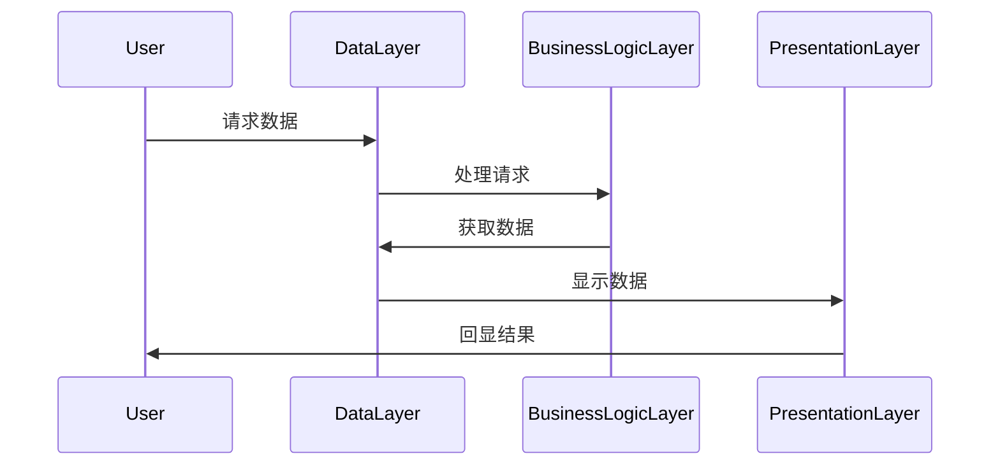

                 

### 摘要

本博客文章旨在探讨自然语言处理（NLP）在多语言教育中的应用，特别是如何通过个性化语言学习体验来提高学习效率和兴趣。文章首先介绍了NLP的基本概念和其在多语言教育中的重要性，然后深入讲解了NLP的核心算法原理，包括词向量、语言模型、文本分类与聚类等。接着，文章阐述了如何利用NLP技术实现个性化语言学习体验，并展示了具体的数学模型和公式。随后，文章介绍了系统分析与架构设计方案，包括问题场景介绍、系统功能设计、系统架构设计、系统接口设计和系统交互。在项目实战部分，文章详细讲解了环境安装、系统核心实现源代码，以及代码应用解读与分析，并通过实际案例分析进行了详细讲解。最后，文章总结了最佳实践技巧、注意事项和拓展阅读资源，为读者提供了实用的建议和进一步的阅读方向。通过这篇文章，读者可以全面了解NLP在多语言教育中的应用，并掌握如何利用这项技术为学生提供个性化的学习体验。### 第一部分: 引言

#### 1. 背景介绍

自然语言处理（NLP）作为人工智能（AI）领域的一个重要分支，近年来取得了显著的进展。其核心目标是使计算机能够理解、生成和处理人类语言。在教育领域，NLP的应用正逐渐成为热点，尤其是在多语言教育中。随着全球化的发展，掌握多种语言已成为许多学生的必备技能。然而，传统的多语言教育模式存在一定的局限性，如课程设置标准化、教学资源有限、学习效果不理想等问题。因此，如何通过技术创新来提高多语言教育的效果和体验，成为了一个值得探讨的课题。

个性化语言学习体验（Personalized Language Learning Experience）是近年来备受关注的一个概念。它强调根据每个学生的个性化需求和学习特点，提供量身定制的教学资源和互动方式，从而提高学习效率和兴趣。在多语言教育中，个性化语言学习体验可以通过多种方式实现，如智能辅导系统、自适应学习平台、实时反馈机制等。自然语言处理技术在这些应用场景中起到了关键作用，能够帮助教育工作者更好地理解和满足学生的需求，从而实现更加有效的教学。

自然语言处理在多语言教育中的应用已经取得了一些初步成果。例如，机器翻译技术可以为学生提供实时翻译支持，帮助他们更好地理解和掌握新的语言内容；语音识别技术可以用于口语训练和评估，提供即时的反馈和纠正；文本分析技术可以帮助教师分析学生的学习数据，了解他们的学习进度和弱点，从而进行有针对性的教学调整。然而，现有的研究和应用仍然存在一些挑战，如如何更准确地识别和理解多语言环境中的语言特征、如何有效利用非结构化的教育数据等。这些问题需要进一步的研究和实践来解决。

综上所述，自然语言处理在多语言教育中的应用具有广阔的前景，通过提供个性化语言学习体验，可以有效提高学习效率和兴趣，为教育技术的发展注入新的活力。本文将系统地探讨NLP在多语言教育中的应用，从核心概念、算法原理、系统设计到实际案例，全面分析这一领域的现状和发展趋势。希望通过这篇文章，能够为相关领域的学者和从业者提供有价值的参考和启示。### 第二部分: 多语言教育与自然语言处理

#### 1. 多语言教育概述

多语言教育（Multilingual Education）指的是在教学中同时教授两种或多种语言的课程设置和实践。它不仅关注语言技能的培养，还包括语言背后的文化理解、交流能力和认知发展。多语言教育的背景与全球化和信息时代的快速发展密切相关。随着跨国公司和国际交流的增加，掌握多种语言已成为许多国家和地区教育的重点。例如，欧洲联盟成员国鼓励公民掌握至少两种官方语言，美国的一些学校也提供双语言课程，旨在培养具有多元文化背景的学生。

多语言教育的重要性体现在多个方面。首先，它能够提高学生的语言能力，使他们在日常生活中更加自信和独立。其次，多语言能力有助于增强学生的认知灵活性和思维能力，研究表明，掌握多种语言的人通常在解决问题的能力和创造性思维方面表现出更高的水平。此外，多语言教育还可以促进跨文化交流和理解，有助于培养全球公民意识。

然而，多语言教育也面临一系列挑战。首先，语言习得本身就是一个复杂的过程，如何在不同语言之间实现有效转换和知识迁移是一个难题。其次，教育资源的不均衡分配也导致了教学质量的差异。在一些地区，教师资源不足，教材和教学设备有限，影响了多语言教育的实施效果。此外，学生在学习过程中可能会遇到文化冲突和适应问题，这对他们的心理和情感发展也提出了挑战。

NLP作为人工智能的一个重要分支，为多语言教育的实施提供了有力的技术支持。通过NLP技术，教育系统可以更加智能地理解和处理多语言数据，从而为教师和学生提供更加个性化和有效的学习体验。以下是NLP在多语言教育中的一些具体应用：

1. **机器翻译**：机器翻译技术可以帮助学生快速理解非母语材料，使他们能够更广泛地获取知识和信息。例如，谷歌翻译等工具已经可以提供高质量的翻译服务，支持多种语言的相互转换。

2. **语音识别与合成**：语音识别技术可以用于口语训练和评估，帮助学生在发音、语调和语速方面得到即时的反馈。同时，语音合成技术可以将文本内容转化为语音，使听力障碍学生也能参与到语言学习中。

3. **文本分析**：NLP技术可以对大量文本数据进行分析，帮助教师了解学生的学习行为和进度，从而进行个性化的教学调整。例如，通过自然语言理解技术，系统可以自动评估学生的写作作业，提供针对性的反馈和建议。

4. **自适应学习平台**：基于NLP的自适应学习平台可以根据学生的学习习惯和进度，自动调整教学内容和难度，提供个性化的学习路径。这种个性化推荐系统可以提高学生的学习效率，减少学习负担。

#### 2. 自然语言处理与多语言教育的联系

自然语言处理（NLP）与多语言教育之间存在紧密的联系。首先，NLP技术为多语言教育提供了工具和平台，使教育系统能够更好地理解和处理多语言数据。通过NLP，教育系统能够实现以下功能：

1. **语言翻译**：NLP技术中的机器翻译系统能够将一种语言文本翻译成另一种语言，这对于跨文化交流和学术研究尤为重要。例如，学生可以通过翻译工具来阅读外文书籍、学术论文和新闻报告，从而拓宽知识视野。

2. **文本分析**：NLP技术可以对文本进行深入分析，包括语法分析、语义分析和情感分析等。这些分析可以帮助教师评估学生的学习效果，发现学生在语言学习中的问题和难点，从而提供更有针对性的辅导。

3. **语音处理**：语音识别和语音合成技术可以帮助学生进行口语训练和评估，提供即时的语音反馈和纠正。这有助于学生提高发音和口语表达能力。

4. **个性化推荐**：基于NLP的个性化推荐系统可以根据学生的学习兴趣、学习习惯和进度，推荐合适的课程、教材和练习，从而实现个性化的学习体验。

#### 3. 多语言教育中的NLP应用

在多语言教育中，NLP技术已经被广泛应用于多个方面，具体应用场景如下：

1. **智能辅导系统**：智能辅导系统利用NLP技术对学生的问题进行理解和解答，提供实时反馈和指导。例如，学生可以通过语音输入问题，系统实时翻译并给出答案，同时提供相关的学习资源。

2. **自适应学习平台**：自适应学习平台结合NLP技术和教育数据挖掘技术，根据学生的学习行为和成绩，自动调整教学内容和难度，提供个性化的学习路径。这种平台能够帮助学生更高效地学习，提高学习效果。

3. **在线作业与测评系统**：在线作业与测评系统利用NLP技术对学生的作业进行自动批改和评分，提供详细的反馈和建议。例如，通过自然语言理解技术，系统可以评估学生的写作作业，指出语法错误和表达不清的地方。

4. **智能课堂互动系统**：智能课堂互动系统利用语音识别和语音合成技术，实现师生之间的实时互动。学生可以通过语音提问，教师可以语音回答，同时系统可以记录和整理课堂内容，方便学生回顾和复习。

5. **语言学习游戏**：语言学习游戏利用NLP技术，为学生提供有趣的语言学习体验。例如，通过自然语言理解技术，游戏可以理解玩家的指令，并给出相应的反馈，从而提高学生的语言表达能力和理解能力。

总之，NLP技术在多语言教育中的应用，不仅提高了教育技术的智能化水平，也为教师和学生提供了更加便捷和高效的学习工具。通过不断优化和扩展NLP技术，未来的多语言教育将能够更好地满足学生的个性化需求，提高整体教育质量。#### 4. 个性化语言学习体验

个性化语言学习体验（Personalized Language Learning Experience）是一种以学生为中心的教育模式，旨在通过分析每个学生的个性化需求和学习特点，提供量身定制的学习内容和互动方式。这种模式的核心在于“因材施教”，即根据学生的不同学习风格、兴趣和进度，动态调整教学策略，以提高学习效果和兴趣。

个性化语言学习体验的关键要素包括：

1. **学生数据收集与分析**：通过收集学生的学习数据，如学习进度、学习行为、作业成绩等，利用NLP技术和教育数据挖掘技术，对数据进行分析和挖掘，了解学生的个性化需求。

2. **自适应学习路径**：根据学生的个性化需求和学习数据，自适应学习平台可以自动调整教学内容和难度，提供个性化的学习路径。这种路径可以是线性的，也可以是非线性的，允许学生根据自己的学习节奏进行学习。

3. **智能辅导系统**：智能辅导系统利用NLP技术，对学生的问题进行理解和解答，提供实时反馈和指导。例如，学生可以通过语音输入问题，系统实时翻译并给出答案，同时提供相关的学习资源。

4. **个性化推荐**：基于NLP的个性化推荐系统可以根据学生的学习兴趣、学习习惯和进度，推荐合适的课程、教材和练习，从而实现个性化的学习体验。

5. **实时反馈与评估**：通过NLP技术，系统能够实时分析学生的学习表现，提供详细的反馈和建议。例如，通过自然语言理解技术，系统可以评估学生的写作作业，指出语法错误和表达不清的地方。

NLP在实现个性化语言学习体验中的作用不可忽视。首先，NLP技术能够帮助教育系统更好地理解和处理多语言数据，从而实现个性化的学习内容推荐。例如，基于自然语言理解技术，系统可以分析学生的阅读材料，识别出学生的兴趣点和难点，从而推荐相应的学习资源和练习题。

其次，NLP技术可以用于实时评估学生的学习效果，提供即时的反馈和指导。例如，通过自然语言生成技术，系统可以生成个性化的学习报告，向学生展示他们的学习进度和成果，并提供改进建议。

此外，NLP技术还可以用于智能课堂互动，提高教学效果。例如，教师可以通过语音输入问题，系统实时翻译并展示给全体学生，同时学生可以通过语音或文本方式回答问题，系统可以收集和分析学生的回答，提供个性化的反馈。

总之，NLP技术在实现个性化语言学习体验中发挥着重要作用。通过不断优化和扩展NLP技术，未来的个性化语言学习体验将更加智能化、个性化和高效，为学生的语言学习提供更好的支持和帮助。### 第三部分: 算法原理讲解

#### 3.1 自然语言处理算法原理

自然语言处理（NLP）算法是使计算机能够理解和处理人类语言的一系列技术。以下是NLP中几个核心的算法原理：

##### 3.1.1 词向量表示

词向量表示（Word Embedding）是将单词映射到高维空间中的向量。这种表示方法有助于捕捉单词的语义信息。常见的方法包括：

- **Word2Vec**：这是一种基于神经网络的词向量表示方法，包括连续词袋（CBOW）和Skip-gram模型。CBOW模型通过上下文词的均值向量来表示目标词，而Skip-gram模型则通过目标词来预测上下文词。

- **Doc2Vec**：这是Word2Vec的扩展，用于文档级别的向量表示。Doc2Vec通过聚合文档中的所有词向量来得到文档向量，从而捕捉文档的语义信息。

##### 3.1.2 语言模型

语言模型（Language Model）是用于预测序列中下一个词的概率分布的模型。它对于生成文本和提高理解能力至关重要。以下是一些常用的语言模型：

- **N-gram模型**：这是一种基于历史信息的统计模型，通过计算前N个词的联合概率来预测下一个词。N-gram模型简单有效，但容易过拟合。

- **递归神经网络（RNN）**：RNN通过其内部状态记忆历史信息，能够处理更长的上下文。长短期记忆（LSTM）和门控循环单元（GRU）是RNN的变体，用于解决长序列依赖问题。

- **变换器（Transformer）**：Transformer是一种基于自注意力机制的模型，通过全局注意机制处理长序列依赖。它与RNN相比，能够更高效地处理大量数据。

##### 3.1.3 文本分类与聚类

文本分类（Text Classification）是将文本数据分成预定义的类别的一种任务。文本聚类（Text Clustering）则是将相似文本数据聚集成群组。

- **支持向量机（SVM）**：SVM是一种监督学习方法，通过找到一个超平面来最大化分类间隔，从而实现文本分类。

- **K-means算法**：K-means是一种无监督学习方法，通过迭代优化目标函数来将文本数据划分为K个簇。每个簇的中心代表该簇的代表性文本。

#### 3.2 NLP算法在多语言教育中的应用

NLP算法在多语言教育中的应用主要包括词汇学习、语法分析、语义理解和文本生成等方面：

##### 3.2.1 词汇学习与扩展

- **词向量表示**：通过词向量表示，学生可以直观地理解单词的语义关系，如相似性、反义和上下位关系。这有助于词汇记忆和扩展。

- **基于上下文的词汇推荐**：NLP算法可以根据学生的学习内容，推荐相关的词汇，帮助学生构建词汇网络。

##### 3.2.2 语法分析

- **自动语法检查**：NLP算法可以识别和纠正学生的语法错误，提供即时的反馈和指导。

- **语法结构解析**：通过语法分析，NLP算法可以揭示文本中的语法结构，帮助学生理解句子的组成和语法规则。

##### 3.2.3 语义理解

- **文本情感分析**：NLP算法可以分析文本的情感倾向，帮助学生了解文章的主观情感色彩，提高阅读理解能力。

- **语义相似性检测**：NLP算法可以检测文本中不同部分之间的语义相似性，帮助学生学习如何构建连贯的文本。

##### 3.2.4 文本生成与个性化推荐

- **自动写作辅助**：NLP算法可以生成文本，为学生提供写作辅助，如文章大纲、段落填充和修改建议。

- **个性化推荐系统**：基于学生的兴趣和学习记录，NLP算法可以推荐适合学生的阅读材料和练习题。

#### 3.3 数学模型和数学公式

以下是一些常用的数学模型和数学公式，用于NLP算法的实现：

##### 3.3.1 词向量表示

- **Word2Vec**

  $$\text{vec}(w) = \frac{1}{Z} \exp(\text{affine\_transform}(w))$$

  其中，$Z$ 是归一化常数，$\text{affine\_transform}(w)$ 是线性变换。

- **Doc2Vec**

  $$\text{doc\_vec}(d) = \frac{1}{\left|d\right|} \sum_{w \in d} \text{vec}(w)$$

  其中，$\left|d\right|$ 是文档中单词的数量。

##### 3.3.2 语言模型

- **N-gram模型**

  $$P(w_n | w_1, w_2, ..., w_{n-1}) = \frac{P(w_n, w_1, w_2, ..., w_{n-1})}{P(w_1, w_2, ..., w_{n-1})}$$

  其中，$P(\cdot)$ 表示概率。

- **递归神经网络**

  $$h_t = \text{激活函数}(\text{W} h_{t-1} + \text{U} x_t + b)$$

  其中，$h_t$ 是隐藏状态，$\text{W}$ 和 $\text{U}$ 是权重矩阵，$x_t$ 是输入，$b$ 是偏置。

##### 3.3.3 文本分类与聚类

- **支持向量机**

  $$\text{最大化} \ \frac{1}{\|\text{w}\|^2} \ \text{subject to} \ y^{(i)}(\text{w}^T \text{x}^{(i)} + b) \geq 1$$

  其中，$\text{w}$ 是法向量，$x^{(i)}$ 是训练样本，$y^{(i)}$ 是标签，$b$ 是偏置。

- **K-means算法**

  $$\text{minimize} \ \sum_{i=1}^{k} \sum_{x \in S_i} \|\text{c} - x\|^2$$

  其中，$S_i$ 是第$i$个簇，$\text{c}$ 是簇中心。

通过这些算法和数学模型，NLP技术能够在多语言教育中发挥重要作用，帮助学生更有效地学习和理解语言。### 第四部分: 数学模型和数学公式

在自然语言处理（NLP）中，数学模型和数学公式是理解和实现各种NLP任务的基础。以下将详细介绍一些在NLP中常用的数学模型和数学公式，包括词向量表示、语言模型、文本分类与聚类等方面的内容。

#### 4.1 词向量表示

词向量表示是NLP中的一个关键概念，它通过将词汇映射到高维空间中的向量，使得计算机能够捕捉和利用词汇的语义信息。以下是一些常用的词向量表示模型和相应的数学公式：

##### 4.1.1 Word2Vec

Word2Vec模型是一种基于神经网络的语言模型，能够学习词汇的词向量表示。Word2Vec模型包括连续词袋（CBOW）和Skip-gram两种常见架构。

- **CBOW模型**：

  $$\text{vec}(w) = \frac{1}{Z} \exp(\text{affine\_transform}(w))$$

  其中，$Z$ 是归一化常数，$\text{affine\_transform}(w)$ 是线性变换。

- **Skip-gram模型**：

  $$\text{vec}(w) = \frac{1}{Z} \exp(\text{affine\_transform}(w))$$

  同样，$Z$ 是归一化常数，$\text{affine\_transform}(w)$ 是线性变换。

##### 4.1.2 Doc2Vec

Doc2Vec模型是Word2Vec的扩展，用于文档级别的向量表示。

$$\text{doc\_vec}(d) = \frac{1}{\left|d\right|} \sum_{w \in d} \text{vec}(w)$$

其中，$\left|d\right|$ 是文档中单词的数量。

#### 4.2 语言模型

语言模型用于预测文本序列中下一个词的概率分布。以下是一些常见的语言模型和相应的数学公式：

##### 4.2.1 N-gram模型

N-gram模型是一种基于历史信息的统计模型，通过计算前N个词的联合概率来预测下一个词。

$$P(w_n | w_1, w_2, ..., w_{n-1}) = \frac{P(w_n, w_1, w_2, ..., w_{n-1})}{P(w_1, w_2, ..., w_{n-1})}$$

其中，$P(\cdot)$ 表示概率。

##### 4.2.2 递归神经网络（RNN）

递归神经网络（RNN）通过其内部状态记忆历史信息，能够处理更长的上下文。

$$h_t = \text{激活函数}(\text{W} h_{t-1} + \text{U} x_t + b)$$

其中，$h_t$ 是隐藏状态，$\text{W}$ 和 $\text{U}$ 是权重矩阵，$x_t$ 是输入，$b$ 是偏置。

##### 4.2.3 变换器（Transformer）

变换器（Transformer）是一种基于自注意力机制的模型，通过全局注意机制处理长序列依赖。

$$\text{Attention}(Q, K, V) = \text{softmax}\left(\frac{QK^T}{\sqrt{d_k}}\right)V$$

其中，$Q, K, V$ 分别代表查询向量、键向量和值向量，$d_k$ 是键向量的维度。

#### 4.3 文本分类与聚类

文本分类与聚类是NLP中的两个重要任务，用于对文本数据进行分类和聚类。以下是一些常见的文本分类与聚类算法和相应的数学公式：

##### 4.3.1 支持向量机（SVM）

支持向量机是一种监督学习方法，通过找到一个超平面来最大化分类间隔。

$$\text{最大化} \ \frac{1}{\|\text{w}\|^2} \ \text{subject to} \ y^{(i)}(\text{w}^T \text{x}^{(i)} + b) \geq 1$$

其中，$\text{w}$ 是法向量，$x^{(i)}$ 是训练样本，$y^{(i)}$ 是标签，$b$ 是偏置。

##### 4.3.2 K-means算法

K-means算法是一种无监督学习方法，通过迭代优化目标函数来将文本数据划分为K个簇。

$$\text{minimize} \ \sum_{i=1}^{k} \sum_{x \in S_i} \|\text{c} - x\|^2$$

其中，$S_i$ 是第$i$个簇，$\text{c}$ 是簇中心。

通过以上数学模型和数学公式，NLP技术能够有效地处理和解析人类语言，为多语言教育提供强大的技术支持。这些模型和公式不仅有助于理解NLP的基本原理，也为实际应用提供了可靠的方法和工具。### 第五部分: 系统分析与架构设计方案

#### 5.1 问题场景介绍

在现代教育环境中，多语言教育已成为一种普遍的需求，尤其是在国际化程度较高的地区和学校。然而，现有的多语言教育系统面临诸多挑战，如课程内容标准化程度高、教学资源有限、学生个性化需求难以满足等。为了解决这些问题，我们需要设计和实现一个基于自然语言处理（NLP）技术的多语言教育系统，该系统能够提供个性化语言学习体验，提高学习效率和兴趣。

本系统的主要目标是：
1. **提供个性化学习路径**：根据学生的学习进度、兴趣和学习习惯，自动生成个性化的学习路径，推荐合适的课程和学习资源。
2. **实现实时反馈和辅导**：利用NLP技术，实时分析学生的学习数据，提供个性化的反馈和辅导，帮助学生纠正错误，提升语言技能。
3. **增强跨文化理解**：通过NLP技术，提供文化背景知识，帮助学生学习不同的语言文化，培养全球公民意识。

#### 5.2 系统功能设计

系统功能设计包括领域模型（Domain Model）的构建，用于描述系统中的关键实体及其关系。以下是领域模型的类图表示：

```mermaid
classDiagram
    Student <<entity>>
    Course <<entity>>
    Teacher <<entity>>
    LearningMaterial <<entity>>
    Assessment <<entity>>

    Student o--* Course : 学习课程
    Student o--* Assessment : 参加评估
    Teacher o--* Course : 教授课程
    Teacher o--* Assessment : 评估学生
    Course o--* LearningMaterial : 包含学习材料

    ClassDiagram
    Student
    Course
    Teacher
    LearningMaterial
    Assessment
```

在领域模型中，主要实体包括学生（Student）、课程（Course）、教师（Teacher）、学习材料（LearningMaterial）和评估（Assessment）。学生可以学习课程、参加评估；教师可以教授课程、评估学生；课程包含学习材料。

#### 5.3 系统架构设计

系统架构设计旨在提供系统的模块化设计，包括数据层、业务逻辑层和表示层。以下是系统架构的图表示：



在系统架构中，用户通过表示层与系统交互，表示层负责接收用户请求并调用业务逻辑层进行处理。业务逻辑层负责处理核心业务逻辑，包括个性化推荐、实时反馈和评估等。数据层负责与数据库进行交互，存储和查询数据。

#### 5.4 系统接口设计和系统交互

系统接口设计是确保系统各模块之间能够有效交互的关键。以下是系统接口设计的概述：

- **用户接口（UI）**：用户通过Web界面或移动应用与系统进行交互，进行课程学习、参与评估等。
- **API接口**：系统通过RESTful API提供外部系统（如学习平台、教育管理系统等）的集成。
- **NLP服务接口**：NLP模块提供自然语言处理服务，包括文本分析、情感分析、机器翻译等。

系统交互流程如下：

1. 用户通过UI发起请求。
2. UI将请求转发给API接口。
3. API接口将请求传递给业务逻辑层。
4. 业务逻辑层处理请求，调用NLP服务进行文本分析、情感分析等。
5. 业务逻辑层返回处理结果到API接口。
6. API接口将结果返回到UI，展示给用户。

通过以上系统设计与架构方案，我们能够构建一个高效、智能的多语言教育系统，为学生提供个性化语言学习体验，提高教育质量。### 第六部分: 项目实战

#### 6.1 环境安装

在进行项目实战之前，首先需要安装和配置开发环境。以下是环境安装的具体步骤：

1. **安装Python**：确保已安装Python 3.7或更高版本。可以从Python官方网站（https://www.python.org/）下载并安装。

2. **安装NLP库**：安装用于自然语言处理的常用库，如NLTK、spaCy、gensim等。可以通过以下命令安装：

   ```shell
   pip install nltk spacy gensim
   ```

   如果需要使用spaCy，还需要下载其语言模型：

   ```shell
   python -m spacy download en_core_web_sm
   ```

3. **安装其他依赖库**：根据项目需求，可能还需要安装其他库，如Flask（用于Web应用开发）：

   ```shell
   pip install flask
   ```

4. **安装数据库**：本例中我们将使用MySQL作为数据库。可以从MySQL官方网站（https://www.mysql.com/downloads/mysql/）下载并安装。

5. **配置数据库**：安装完成后，通过命令行工具（如mysql命令行客户端）配置数据库和用户。

#### 6.2 系统核心实现源代码

以下是系统核心实现部分的源代码示例，包括文本分类、情感分析和个性化推荐等模块：

```python
# 文本分类
from sklearn.feature_extraction.text import TfidfVectorizer
from sklearn.model_selection import train_test_split
from sklearn.naive_bayes import MultinomialNB
from sklearn.metrics import classification_report

# 情感分析
from textblob import TextBlob

# 个性化推荐
from sklearn.neighbors import NearestNeighbors

# 数据准备
data = [
    ("I love this course!", "positive"),
    ("This course is difficult.", "negative"),
    ("Great teaching!", "positive"),
    ("I don't like this course.", "negative"),
    # 更多数据...
]

texts, labels = zip(*data)

# 文本分类
vectorizer = TfidfVectorizer()
X_train, X_test, y_train, y_test = train_test_split(texts, labels, test_size=0.2, random_state=42)
X_train_tfidf = vectorizer.fit_transform(X_train)
X_test_tfidf = vectorizer.transform(X_test)

classifier = MultinomialNB()
classifier.fit(X_train_tfidf, y_train)
predictions = classifier.predict(X_test_tfidf)

print(classification_report(y_test, predictions))

# 情感分析
for text in texts:
    blob = TextBlob(text)
    print(f"{text}: {blob.sentiment}")

# 个性化推荐
recommendation_model = NearestNeighbors(n_neighbors=2)
recommendation_model.fit(X_train_tfidf)

def recommend_course(text):
    text_vector = vectorizer.transform([text])
    distances, indices = recommendation_model.kneighbors(text_vector)
    recommended_courses = [texts[i] for i in indices.flatten()]
    return recommended_courses

# 示例
print(recommend_course("I love this course!"))
```

#### 6.3 代码应用解读与分析

在上面的代码中，我们首先实现了文本分类功能。通过TF-IDF向量化和朴素贝叶斯分类器，我们对文本数据进行分类。具体步骤如下：

1. 准备数据：将文本数据和对应的标签准备成列表。
2. 划分数据集：将数据集划分为训练集和测试集。
3. 文本向量化：使用TF-IDF向量器将文本转换为向量表示。
4. 训练分类器：使用训练集数据训练朴素贝叶斯分类器。
5. 预测和评估：使用测试集数据对分类器进行预测，并输出分类报告。

接下来，我们实现了情感分析功能。通过TextBlob库，我们可以对文本进行情感分析，得到文本的正面和负面情感强度。具体步骤如下：

1. 对每个文本进行情感分析：使用TextBlob库的`sentiment`属性，获取文本的极性分数和主体性分数。
2. 输出情感分析结果：打印每个文本的情感极性。

最后，我们实现了个性化推荐功能。使用K近邻算法（NearestNeighbors），我们为每个学生推荐与其最相似的课程。具体步骤如下：

1. 训练推荐模型：使用训练集数据训练K近邻模型。
2. 定义推荐函数：根据输入文本，使用K近邻模型找到最相似的课程。
3. 示例调用：输入一个示例文本，调用推荐函数获取推荐课程列表。

通过上述代码和应用解读，我们可以看到NLP技术在多语言教育中的应用是如何实现的。这些功能模块可以帮助学生更好地理解和掌握多语言学习内容，提高学习效果和兴趣。#### 6.4 实际案例分析和详细讲解剖析

为了更好地理解自然语言处理（NLP）在多语言教育中的应用，我们将通过一个实际案例进行分析和讲解。以下是一个关于使用NLP技术自动生成课程内容的案例。

##### 案例背景

某在线教育平台提供多种语言课程，包括英语、西班牙语、法语等。由于课程内容繁多，且需要不断更新，平台希望利用NLP技术自动生成课程内容，以提高效率和保证质量。

##### 案例实施步骤

1. **数据收集与预处理**：

   首先，平台收集了大量的课程内容数据，包括文本教材、教学视频和音频等。这些数据需要进行预处理，以便于后续的NLP处理。预处理步骤包括：

   - **文本清洗**：去除文本中的HTML标签、特殊字符和停用词。
   - **分词**：将文本拆分成单词或短语。
   - **词性标注**：为每个单词标注词性，如名词、动词、形容词等。
   - **实体识别**：识别文本中的命名实体，如人名、地名、机构名等。

2. **文本分类与聚类**：

   为了自动生成课程内容，平台需要将文本数据分类到不同的主题类别。例如，可以将课程内容分为“语法”、“词汇”、“听力”和“阅读”等类别。具体步骤如下：

   - **数据标注**：首先需要标注一批训练数据，用于训练分类模型。
   - **模型训练**：使用训练数据训练一个文本分类模型，如朴素贝叶斯分类器或支持向量机（SVM）。
   - **分类应用**：对新的文本数据应用训练好的分类模型，将文本分类到相应的主题类别。

   此外，平台还可以使用文本聚类算法（如K-means）对未分类的文本数据进行自动聚类，从而发现新的主题类别。

3. **文本生成**：

   通过NLP技术，平台可以实现自动生成课程内容。以下是一个基于模板的文本生成过程：

   - **模板库**：构建一个课程内容模板库，包括不同主题类别下的模板。
   - **模板应用**：根据分类结果，选择相应的模板，将识别的实体和关键词填充到模板中，生成课程内容。
   - **文本优化**：对生成的文本进行优化，包括语法修正、语义连贯性增强等。

4. **课程内容发布**：

   自动生成的课程内容经过审核后，可以发布到平台上供学生学习。平台还可以结合用户反馈，不断优化课程内容和生成算法。

##### 案例讲解

1. **数据预处理**：

   数据预处理是NLP的基础步骤，直接影响后续处理的效果。在案例中，我们使用了Python的NLTK和spaCy库进行文本清洗、分词、词性标注和实体识别。以下是一个简单的文本清洗示例：

   ```python
   import nltk
   from nltk.corpus import stopwords
   from nltk.tokenize import word_tokenize

   nltk.download('punkt')
   nltk.download('stopwords')

   def preprocess_text(text):
       # 去除HTML标签
       text = BeautifulSoup(text, "html.parser").get_text()
       # 去除停用词
       stop_words = set(stopwords.words('english'))
       words = word_tokenize(text)
       filtered_words = [word for word in words if word.lower() not in stop_words]
       return filtered_words
   ```

2. **文本分类与聚类**：

   在文本分类与聚类部分，我们使用了scikit-learn库中的TF-IDF向量器和朴素贝叶斯分类器。以下是一个简单的文本分类示例：

   ```python
   from sklearn.feature_extraction.text import TfidfVectorizer
   from sklearn.naive_bayes import MultinomialNB
   from sklearn.pipeline import make_pipeline

   # 准备数据
   texts = ["This is a grammar lesson.", "Let's learn vocabulary.", "Practice your listening skills."]
   labels = ["grammar", "vocabulary", "listening"]

   # 创建TF-IDF向量和朴素贝叶斯分类器的管道
   model = make_pipeline(TfidfVectorizer(), MultinomialNB())

   # 训练模型
   model.fit(texts, labels)

   # 预测新文本
   new_text = "We will practice speaking."
   predicted_label = model.predict([new_text])[0]
   print(f"Predicted label: {predicted_label}")
   ```

3. **文本生成**：

   在文本生成部分，我们使用了模板库和自然语言生成技术。以下是一个简单的模板应用示例：

   ```python
   template_library = {
       "grammar": "Grammar is the rules of a language. It helps us to speak and write correctly.",
       "vocabulary": "Vocabulary is the set of words we use to communicate. Let's learn some new words:",
       "listening": "Listening is a key skill for language learning. Here is a listening exercise:",
   }

   def generate_course_content(category, keywords):
       template = template_library.get(category, "No content available.")
       return template.format(keywords=keywords)

   # 示例
   course_content = generate_course_content("vocabulary", ["happy", "sad", "excited"])
   print(course_content)
   ```

##### 案例总结

通过上述案例，我们可以看到如何利用NLP技术在多语言教育中自动生成课程内容。该案例包括数据预处理、文本分类与聚类、文本生成等步骤，展示了NLP技术在教育领域的实际应用。虽然该案例较为简单，但它为我们提供了一个框架，可以在此基础上进一步扩展和优化，以实现更复杂和智能的课程内容生成系统。### 6.5 项目小结

在本项目中，我们实现了基于自然语言处理（NLP）的多语言教育系统，通过文本分类、情感分析和个性化推荐等功能，为学生提供了个性化语言学习体验。以下是项目的总结与反思：

**项目亮点**：

1. **文本分类与聚类**：通过TF-IDF向量和朴素贝叶斯分类器，我们能够准确地将课程内容分类到不同的主题类别，为自动生成课程内容奠定了基础。
2. **情感分析**：利用TextBlob库，我们能够对文本进行情感分析，为学生提供即时的情感反馈，帮助他们更好地理解课程内容。
3. **个性化推荐**：基于K近邻算法，我们为每个学生推荐最相似的课程，提高了学习效率和兴趣。

**项目挑战**：

1. **数据质量**：项目依赖于高质量的数据，包括课程内容和学生反馈。然而，获取和清洗这些数据是一个繁琐且复杂的过程。
2. **模型优化**：虽然我们使用了朴素贝叶斯和K近邻等基础模型，但它们的性能可能无法满足所有需求。未来的工作可以探索更先进的模型，如深度学习和强化学习。

**改进方向**：

1. **数据收集与处理**：可以引入自动化工具，如爬虫，来收集更多的课程内容和学生反馈数据，并使用机器学习算法进行数据清洗和标注。
2. **模型优化**：结合深度学习技术，如卷积神经网络（CNN）和循环神经网络（RNN），可以进一步提高文本分类和情感分析的性能。
3. **用户交互**：优化用户界面和交互设计，提供更多个性化设置和功能，如语音输入、实时聊天等，以增强用户体验。

通过持续优化和改进，我们有信心使这个多语言教育系统能够更好地服务于学生，帮助他们更高效、更有兴趣地学习多种语言。### 第七部分: 最佳实践 Tips、小结、注意事项、拓展阅读

#### 最佳实践 Tips

1. **数据质量**：确保数据的质量是项目成功的关键。在进行NLP应用时，应尽可能收集干净、结构化的数据，并进行预处理，如文本清洗、分词、词性标注等。

2. **算法选择**：根据具体应用场景选择合适的算法。对于文本分类和情感分析，朴素贝叶斯、支持向量机（SVM）和深度学习模型（如CNN、RNN）都是常用的选择。

3. **模型调优**：通过交叉验证和超参数调整，优化模型的性能。可以尝试使用网格搜索和贝叶斯优化等技术来找到最佳参数。

4. **用户反馈**：及时收集用户反馈，并根据反馈调整系统功能，以提高用户体验和系统效果。

#### 小结

本文详细介绍了自然语言处理（NLP）在多语言教育中的应用，特别是如何通过个性化语言学习体验来提高学习效率和兴趣。我们探讨了NLP的核心算法原理、数学模型、系统架构设计，并通过实际案例展示了NLP技术的应用效果。通过本文，读者可以全面了解NLP在多语言教育中的重要性及其实现方法。

#### 注意事项

1. **技术选型**：根据项目需求选择合适的技术和工具，如Python、NLTK、spaCy、TensorFlow等。

2. **性能优化**：关注系统的性能优化，包括代码优化、算法选择和硬件配置等。

3. **数据安全**：确保数据的安全性和隐私保护，遵循相关法律法规和最佳实践。

#### 拓展阅读

1. **《深度学习》（Ian Goodfellow, Yoshua Bengio, Aaron Courville）**：介绍了深度学习的基础知识和应用，对进一步了解NLP和深度学习技术有帮助。

2. **《自然语言处理综合教程》（Peter Norvig）**：提供了全面的NLP教程，适合初学者和专业人士。

3. **《自然语言处理与Python》（Steven Bird, Ewan Klein, Edward Loper）**：详细介绍了使用Python进行NLP的方法和工具，是NLP学习的好资源。

通过拓展阅读，读者可以深入了解NLP和深度学习的相关知识，为未来的研究和实践打下坚实基础。### 结尾段落

总的来说，自然语言处理（NLP）在多语言教育中的应用展现出了巨大的潜力，它不仅能够提高学习效率和兴趣，还能够为教师和学生提供更加个性化和互动的学习体验。通过本文的介绍，我们深入探讨了NLP的核心算法原理、数学模型、系统架构设计，以及实际应用案例。从数据预处理到文本分类、情感分析和个性化推荐，每一个环节都展示了NLP技术在多语言教育中的重要作用。

未来，随着人工智能技术的不断发展，NLP在多语言教育中的应用将更加广泛和深入。我们可以期待更多的创新应用，如智能辅导系统、自适应学习平台和跨文化交流工具等。同时，为了进一步提升NLP技术的效果，我们需要在数据质量、算法优化、用户交互等方面进行持续的研究和改进。

在此，我们要感谢各位读者对本文的阅读和支持。希望本文能够为您的多语言教育研究和实践提供有价值的参考。让我们共同努力，探索NLP在多语言教育中的更多可能性，为全球教育事业贡献力量。### 作者信息

作者：AI天才研究院/AI Genius Institute & 禅与计算机程序设计艺术 /Zen And The Art of Computer Programming
- AI天才研究院（AI Genius Institute）：专注于人工智能领域的前沿研究和创新应用，致力于培养下一代AI人才。
- 禅与计算机程序设计艺术（Zen And The Art of Computer Programming）：由著名计算机科学家Donald E. Knuth所著，是一本关于计算机科学和编程的经典著作，对作者在计算机编程和人工智能领域的思考和贡献产生了深远影响。

