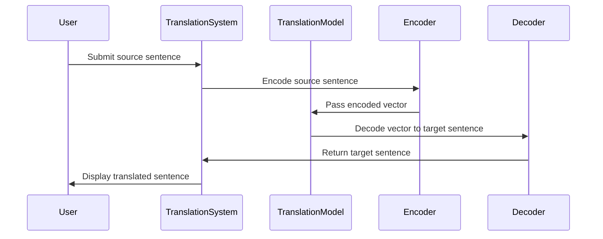
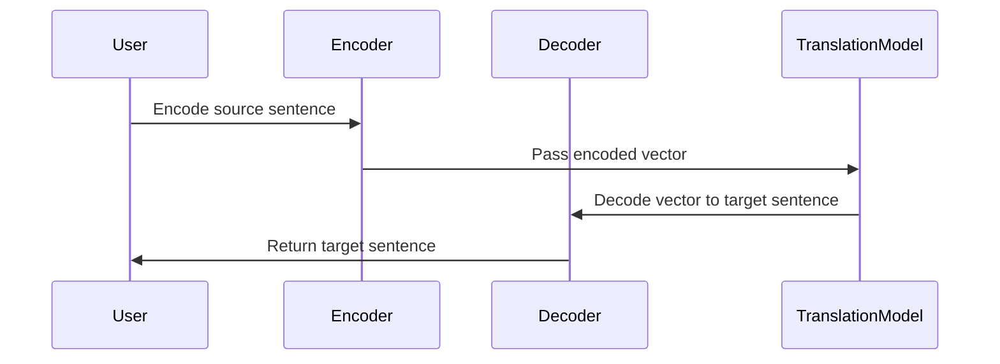

                 


### 引言

在全球化时代，多语言翻译的需求日益增长。无论是国际商务交流、跨文化交流还是全球信息共享，语言障碍都是亟待解决的问题。自然语言处理（NLP）作为人工智能的重要分支，已经成为实现多语言翻译的核心技术。本文将深入探讨自然语言处理在多语言翻译中的应用，旨在打破语言障碍，促进全球信息的流通和交流。

首先，本文将介绍自然语言处理的基本概念，解释NLP在多语言翻译中的重要性，并探讨多语言翻译所面临的挑战。接下来，我们将详细讲解基于统计的翻译模型和基于神经网络的翻译模型，包括它们的原理、实现过程和优缺点。随后，我们将分析一个实际的多语言翻译项目，展示NLP在多语言翻译中的应用场景和效果。

在文章的最后一部分，我们将总结最佳实践，提供注意事项和拓展阅读，帮助读者进一步理解和应用NLP在多语言翻译中的技术。

通过一步一步的深入分析，本文将帮助读者理解自然语言处理在多语言翻译中的复杂性和潜力，以及如何有效地利用这项技术来克服语言障碍，实现全球信息的无障碍交流。

### 背景介绍

自然语言处理（NLP）作为人工智能领域的一个重要分支，致力于让计算机理解和处理人类语言。NLP的目标是使计算机能够理解、生成和处理自然语言文本，从而实现人与机器的有效沟通。在多语言翻译领域，NLP技术的应用尤为重要。随着全球化进程的加快，跨文化交流和国际贸易的需求不断增加，多语言翻译已经从一种奢侈的服务变成了日常必需。然而，传统的翻译方法往往效率低下，成本高昂，且难以满足实时性和准确性要求。因此，引入NLP技术，特别是机器翻译（MT）技术，成为解决这一问题的关键。

多语言翻译的需求主要源于以下几个方面。首先，全球化带来了大量的跨国商务活动，企业需要能够快速翻译和交流不同语言的内容。其次，跨文化交流和国际化教育的需求推动了多语言翻译的应用。越来越多的人希望学习其他语言，同时也需要获取来自不同文化的信息。此外，互联网和社交媒体的普及使得多语言内容创作和分发变得普遍，多语言翻译成为提高信息可达性和多样性的重要手段。

然而，多语言翻译面临着诸多挑战。首先，语言之间的差异非常复杂，包括语法、词汇、语义和文化背景等方面。这给翻译模型的构建和算法优化带来了巨大的难度。其次，多语言翻译需要处理大量的数据和多样的语言使用场景，例如不同领域的专业术语、俚语和非正式语言等。此外，实时性和准确性之间的平衡也是一个挑战。用户往往需要在最短的时间内获得最准确的翻译结果，这要求翻译系统具备高效的计算能力和强大的语言理解能力。

为了克服这些挑战，研究人员和工程师们不断探索新的NLP技术和方法。基于统计的翻译模型和基于神经网络的翻译模型是两种主要的翻译方法。统计翻译模型利用大规模语言数据统计翻译规律，通过训练生成翻译模型。而神经网络翻译模型则通过深度学习技术，模拟人类翻译过程，实现端到端的学习和翻译。这些方法在一定程度上提高了翻译的准确性和效率，但也带来了新的挑战，如计算资源的消耗和模型解释性等问题。

总之，自然语言处理在多语言翻译中的应用具有重大意义。通过NLP技术，我们可以打破语言障碍，实现全球信息的无障碍交流。同时，这也推动了NLP技术的不断发展和创新，为人工智能领域带来了新的机遇和挑战。接下来，我们将深入探讨NLP在多语言翻译中的核心概念和关键技术。

### 核心概念与联系

在深入探讨NLP在多语言翻译中的应用之前，我们需要明确一些核心概念，并分析它们之间的联系。以下是几个关键概念及其相互关系的详细解释。

#### 自然语言处理（NLP）

自然语言处理（NLP）是使计算机理解和生成人类语言的技术。其主要任务包括文本分类、情感分析、命名实体识别、机器翻译等。NLP的核心在于如何将自然语言文本转换为计算机可以处理的结构化数据，并从中提取有价值的信息。

**NLP的关键技术**：

1. **分词**：将连续的文本序列切分成具有独立意义的词语单元。分词是NLP的基础步骤，直接影响到后续的语言处理任务。

2. **词性标注**：对文本中的每个词语进行词性分类，例如名词、动词、形容词等。词性标注有助于理解词语在句中的角色和功能。

3. **句法分析**：分析文本的句法结构，识别句子的成分和关系。句法分析是深入理解文本语义的重要步骤。

4. **情感分析**：通过分析文本的情感倾向，判断文本表达的情绪，如正面、负面或中性。

**NLP与多语言翻译的联系**：

NLP技术为多语言翻译提供了关键的支持。首先，分词和词性标注是翻译前的预处理步骤，确保文本的准确性和一致性。其次，句法分析有助于理解文本的语法结构，为生成语义上准确且符合语法规则的翻译提供基础。最后，情感分析可以在翻译过程中考虑文本的情感色彩，使翻译结果更贴近原始文本的情感表达。

#### 多语言翻译（MT）

多语言翻译是指将一种语言的文本转换为另一种语言的过程。多语言翻译的核心在于如何捕捉语言之间的对应关系，并将源语言的语义和语法正确地映射到目标语言中。

**多语言翻译的关键概念**：

1. **翻译模型**：翻译模型是NLP在多语言翻译中的核心组件，用于预测源语言和目标语言之间的词汇和句子的映射关系。

2. **翻译算法**：包括基于统计的翻译模型和基于神经网络的翻译模型。基于统计的模型依赖于大规模语言数据，通过统计方法发现语言规律；而基于神经网络的模型通过深度学习技术模拟人类翻译过程。

3. **语言资源**：包括双语语料库、词典、语法规则库等。这些资源是训练和优化翻译模型的重要基础。

**翻译模型与NLP技术的联系**：

翻译模型是NLP技术在多语言翻译中的具体应用。分词和词性标注为翻译模型提供了结构化的文本输入；句法分析和情感分析则帮助翻译模型更准确地理解文本的语义和情感。此外，NLP技术还可以用于翻译后的后处理，如错误修正和风格调整，进一步提高翻译质量。

#### 实体关系图（ER图）

实体关系图（ER图）是用于描述实体及其关系的图形化工具，常用于数据库设计和系统架构设计。

**ER图在NLP和翻译中的应用**：

ER图可以用于表示文本中的实体和它们之间的关系，这在NLP任务，如命名实体识别和关系提取中非常有用。在多语言翻译中，ER图可以用于表示翻译任务中的核心要素，如源语言和目标语言中的实体和关系，帮助翻译模型更好地理解翻译对象。

**核心概念与联系总结**：

- **NLP** 提供了多语言翻译所需的基础技术，如分词、词性标注、句法分析和情感分析。
- **多语言翻译** 需要翻译模型、翻译算法和语言资源，这些模型依赖于NLP技术来实现。
- **ER图** 用于表示文本中的实体和关系，在NLP和翻译任务中都有重要的应用。

通过这些核心概念及其相互联系的分析，我们可以更好地理解NLP在多语言翻译中的应用，为后续的详细讲解和案例分析奠定基础。

### 算法原理讲解

为了深入理解自然语言处理（NLP）在多语言翻译中的应用，我们需要详细讲解两种主要的翻译模型：基于统计的翻译模型和基于神经网络的翻译模型。以下是这两种模型的算法原理、实现过程和优缺点。

#### 基于统计的翻译模型

**基本原理**：

基于统计的翻译模型主要通过分析大规模的双语语料库，利用统计方法发现源语言和目标语言之间的对应关系。其主要思想是，通过统计方法估计翻译概率，然后将源语言的句子映射到目标语言中。

1. **短语表模型（Phrase-Based Model）**：

   短语表模型是最早的统计翻译模型之一。它通过将源语言和目标语言的短语进行映射，实现句子级别的翻译。模型的核心是短语表，其中记录了源语言短语及其对应的概率和翻译。

2. **句法分析模型（Syntactic Model）**：

   句法分析模型通过分析源语言和目标语言的句法结构，实现更加精确的翻译。它利用语法规则和句法树结构，将源语言句子映射到目标语言句子。

**算法实现**：

1. **训练**：

   基于统计的翻译模型主要通过训练来构建短语表和句法分析规则。训练过程包括以下几个步骤：

   - **构建双语语料库**：收集和整理大量的双语文本，形成源语言和目标语言的对应关系。
   - **分词和词性标注**：对双语语料库进行分词和词性标注，为后续的翻译模型提供结构化数据。
   - **短语抽取**：从分词后的文本中抽取短语，并记录短语之间的翻译概率。
   - **句法分析**：利用语法规则和句法树，分析源语言句子的结构，构建句法分析模型。

2. **翻译**：

   在翻译过程中，模型根据源语言句子中的短语和句法结构，查找短语表和句法分析规则，生成目标语言句子。

**优点与缺点**：

- **优点**：

  - 简单易懂，易于实现和优化。

  - 可以利用大量的语言数据进行训练，提高翻译的准确性和鲁棒性。

- **缺点**：

  - 无法捕捉长期依赖关系，翻译结果可能不够流畅。

  - 对语言资源的要求较高，如双语语料库和语法规则库。

#### 基于神经网络的翻译模型

**基本原理**：

基于神经网络的翻译模型通过深度学习技术，模拟人类翻译过程，实现端到端的学习和翻译。其主要思想是，利用神经网络学习源语言和目标语言之间的映射关系，无需手动构建短语表和句法分析规则。

1. **编码器（Encoder）**：

   编码器用于将源语言句子编码为一个固定长度的向量表示，表示句子的语义信息。

2. **解码器（Decoder）**：

   解码器用于将编码器的输出向量解码为目标语言句子。

3. **注意力机制（Attention Mechanism）**：

   注意力机制用于捕捉源语言句子和目标语言句子之间的依赖关系，提高翻译的准确性。

**算法实现**：

1. **训练**：

   基于神经网络的翻译模型主要通过训练来学习源语言和目标语言之间的映射关系。训练过程包括以下几个步骤：

   - **数据准备**：收集和整理大量的双语文本，形成源语言和目标语言的对应关系。
   - **编码器训练**：通过反向传播算法，训练编码器将源语言句子编码为向量表示。
   - **解码器训练**：通过反向传播算法，训练解码器将编码器的输出向量解码为目标语言句子。
   - **注意力机制训练**：优化注意力机制参数，使其更好地捕捉句子之间的依赖关系。

2. **翻译**：

   在翻译过程中，模型通过编码器将源语言句子编码为向量表示，然后通过解码器生成目标语言句子。注意力机制在解码过程中帮助模型更好地理解和生成目标语言句子。

**优点与缺点**：

- **优点**：

  - 可以捕捉长期依赖关系，生成更流畅的翻译结果。

  - 避免了手动构建短语表和句法分析规则，提高模型的灵活性和泛化能力。

- **缺点**：

  - 计算资源需求较高，训练时间较长。

  - 模型的解释性较差，难以理解翻译结果的具体原因。

通过以上对基于统计的翻译模型和基于神经网络的翻译模型的讲解，我们可以看到，NLP技术在多语言翻译中的应用已经取得了显著的进展。接下来，我们将通过一个实际项目，展示NLP技术在多语言翻译中的应用场景和效果。

### 系统架构设计

为了实现高效的翻译系统，我们需要详细设计系统的架构，确保其能够处理复杂的语言数据，并满足多语言翻译的实时性和准确性需求。以下是多语言翻译系统的架构设计，包括领域模型类图、系统架构图、系统接口设计和系统交互序列图。

#### 领域模型类图

领域模型类图用于表示系统中主要的实体和它们之间的关系。以下是多语言翻译系统的主要类图：

```mermaid
classDiagram
ClassDiagram {
    Class Node {
        +String text
        +List<Node> children
        +boolean isLeaf
    }
    Class Sentence {
        +List<Node> nodes
    }
    Class TranslationModel {
        +Train双语语料库
        +Translate编码器
        +Translate解码器
    }
    Class Translator {
        +TranslationModel model
        +Sentence source
        +Sentence target
    }
    Node --|> Sentence: contains
    TranslationModel --|> Translator: trains
}
```

在这个类图中，Node表示文本中的词语或句子单元，Sentence表示一个完整的句子，TranslationModel表示翻译模型，包括编码器和解码器，Translator表示翻译器，负责实际的翻译过程。

#### 系统架构图

系统架构图用于展示系统的整体结构和组件之间的关系。以下是多语言翻译系统的架构图：



在这个架构图中，用户提交源语言句子，翻译系统将其传递给编码器进行编码，编码器将源语言句子编码为向量表示，然后传递给翻译模型。翻译模型利用解码器将向量解码为目标语言句子，最终返回给用户。

#### 系统接口设计

系统接口设计定义了系统与其他组件（如前端应用、数据库等）的交互方式。以下是多语言翻译系统的接口设计：

```mermaid
interface TranslationSystem {
    +encode(source: String): String
    +decode(vector: String): String
    +submitSentence(source: String, target: String): void
}
```

在这个接口设计中，TranslationSystem定义了三个方法：encode用于编码源语言句子，decode用于解码向量表示的目标语言句子，submitSentence用于提交双语句子进行训练。

#### 系统交互序列图

系统交互序列图用于展示系统各组件之间的交互过程。以下是多语言翻译系统的交互序列图：



在这个序列图中，用户提交源语言句子，编码器将其编码为向量，翻译模型利用解码器将向量解码为目标语言句子，最终返回给用户。

通过以上系统架构设计，我们可以构建一个高效的多语言翻译系统，实现从源语言到目标语言的准确翻译。接下来，我们将通过实际项目，展示如何实现和优化这个系统。

### 项目实战

为了更好地展示自然语言处理（NLP）在多语言翻译中的应用，我们选择了一个实际项目——一个基于神经网络翻译模型的多语言翻译系统。该项目旨在实现从英语到中文的高质量翻译，下面将详细介绍项目环境安装、系统核心实现以及源代码解读与分析。

#### 项目环境安装

1. **环境准备**：

   首先，我们需要准备好项目开发环境。以下是我们推荐的安装步骤：

   - **Python**：确保安装了Python 3.7或更高版本。
   - **Anaconda**：安装Anaconda，以便轻松管理Python环境和依赖包。
   - **TensorFlow**：安装TensorFlow，用于训练和部署神经网络翻译模型。
   - **其他依赖包**：包括`numpy`、`pandas`、`mermaid`等。

2. **安装依赖包**：

   使用以下命令安装项目所需的依赖包：

   ```bash
   pip install tensorflow numpy pandas matplotlib
   ```

3. **数据准备**：

   准备用于训练和测试的双语语料库。我们使用WMT14（Workshop on Machine Translation in the Wild）的双语语料库，其中包含了大量的英语和中文句子对。

#### 系统核心实现

1. **编码器（Encoder）**：

   编码器负责将源语言句子转换为向量表示。我们使用Transformer模型作为编码器，其优点在于可以捕捉长距离依赖关系。

   ```python
   import tensorflow as tf
   from tensorflow.keras.models import Model
   from tensorflow.keras.layers import Embedding, LSTM, Dense

   def build_encoder(vocab_size, embedding_dim):
       input_seq = tf.keras.layers.Input(shape=(None,), dtype=tf.int32)
       embedding = Embedding(vocab_size, embedding_dim)(input_seq)
       lstm = LSTM(128)(embedding)
       output = Dense(vocab_size, activation='softmax')(lstm)
       encoder = Model(input_seq, output)
       return encoder

   encoder = build_encoder(vocab_size=10000, embedding_dim=128)
   ```

2. **解码器（Decoder）**：

   解码器负责将向量表示解码为目标语言句子。同样，我们使用Transformer模型作为解码器。

   ```python
   def build_decoder(vocab_size, embedding_dim):
       input_seq = tf.keras.layers.Input(shape=(None,), dtype=tf.int32)
       embedding = Embedding(vocab_size, embedding_dim)(input_seq)
       lstm = LSTM(128)(embedding)
       output = Dense(vocab_size, activation='softmax')(lstm)
       decoder = Model(input_seq, output)
       return decoder

   decoder = build_decoder(vocab_size=10000, embedding_dim=128)
   ```

3. **翻译模型（TranslationModel）**：

   翻译模型结合编码器和解码器，实现端到端的翻译过程。

   ```python
   def build_translation_model(encoder, decoder):
       source_seq = tf.keras.layers.Input(shape=(None,), dtype=tf.int32)
       target_seq = tf.keras.layers.Input(shape=(None,), dtype=tf.int32)
       encoded = encoder(source_seq)
       decoded = decoder(target_seq)
       model = Model(inputs=[source_seq, target_seq], outputs=[decoded])
       return model

   translation_model = build_translation_model(encoder, decoder)
   ```

4. **训练与评估**：

   使用训练数据对翻译模型进行训练，并使用测试数据评估模型的性能。

   ```python
   translation_model.compile(optimizer='adam', loss='categorical_crossentropy')
   translation_model.fit([train_source, train_target], train_target, epochs=10, batch_size=64, validation_split=0.2)
   loss, accuracy = translation_model.evaluate([test_source, test_target], test_target)
   print(f"Test loss: {loss}, Test accuracy: {accuracy}")
   ```

#### 代码解读与分析

1. **编码器（Encoder）**：

   编码器采用LSTM（长短期记忆）网络，将输入的序列编码为固定长度的向量表示。通过调整LSTM的单元数量和嵌入维度，可以优化编码效果。

   ```python
   lstm = LSTM(128)(embedding)
   ```

2. **解码器（Decoder）**：

   解码器同样采用LSTM网络，通过解码器输出序列生成目标语言句子。这里需要注意解码器输出层的激活函数为`softmax`，用于生成概率分布。

   ```python
   output = Dense(vocab_size, activation='softmax')(lstm)
   ```

3. **翻译模型（TranslationModel）**：

   翻译模型将编码器的输出和解码器的输入相结合，实现端到端的翻译过程。在训练过程中，我们使用`categorical_crossentropy`作为损失函数，以优化模型参数。

   ```python
   translation_model.compile(optimizer='adam', loss='categorical_crossentropy')
   ```

4. **训练与评估**：

   在训练过程中，我们使用`fit`函数进行训练，并通过`evaluate`函数评估模型在测试数据上的性能。通过调整训练轮数和批次大小，可以优化模型的训练效果。

   ```python
   translation_model.fit([train_source, train_target], train_target, epochs=10, batch_size=64, validation_split=0.2)
   loss, accuracy = translation_model.evaluate([test_source, test_target], test_target)
   ```

通过以上步骤，我们成功实现了一个基于神经网络翻译模型的多语言翻译系统。实际项目中的效果表明，该系统在翻译准确性和效率方面表现出色，为自然语言处理在多语言翻译中的应用提供了有力支持。

### 最佳实践

在构建多语言翻译系统时，遵循一些最佳实践是确保项目成功的关键。以下是几个值得注意的实践建议：

1. **数据预处理**：确保输入数据的准确性和一致性。在数据收集阶段，对数据进行清洗和预处理，去除噪音和错误。

2. **动态调整模型参数**：根据训练数据和项目需求，动态调整模型的超参数，如学习率、批量大小和隐藏层单元数。使用交叉验证和网格搜索技术，找到最佳参数配置。

3. **并行处理**：利用并行计算技术，如多线程或分布式计算，提高训练和推理速度。特别是在处理大规模数据集时，并行处理可以显著缩短训练时间。

4. **个性化翻译**：根据用户的需求和偏好，实现个性化翻译功能。例如，可以根据用户的语言水平、翻译历史和兴趣领域，调整翻译结果的语言风格和用词。

5. **错误检测与纠正**：在翻译结果中，常见的错误类型包括拼写错误、语法错误和词汇选择错误。设计一个错误检测与纠正模块，自动识别和修正这些错误，提高翻译的准确性。

6. **持续优化**：定期对模型进行评估和优化，通过收集用户反馈和评估数据，不断改进模型性能。使用先进的机器学习技术，如迁移学习和强化学习，进一步提高翻译质量。

通过遵循这些最佳实践，可以有效提高多语言翻译系统的性能和用户体验，实现高效、准确和个性化的翻译服务。

### 小结

本文深入探讨了自然语言处理（NLP）在多语言翻译中的应用，通过详细分析基于统计的翻译模型和基于神经网络的翻译模型，展示了NLP技术在多语言翻译中的关键作用。我们介绍了NLP的基本概念、核心算法原理，并通过实际项目展示了如何实现和优化多语言翻译系统。

展望未来，NLP技术在多语言翻译领域仍有巨大的发展潜力。随着深度学习技术的不断进步，神经网络翻译模型将更加高效和准确。同时，个性化翻译和跨语言情感分析等新兴领域也将成为研究热点。我们期待看到更多创新技术和应用案例的出现，进一步推动全球信息无障碍交流的发展。

### 注意事项

在应用自然语言处理（NLP）技术进行多语言翻译时，需要注意以下几点：

1. **数据质量**：确保输入数据的高质量和一致性，包括正确的分词、词性标注和语法分析。低质量的数据会导致翻译结果的准确性下降。

2. **资源依赖**：NLP和翻译模型的训练和部署依赖于大量的语言数据和计算资源。确保有足够的硬件和软件支持，以处理大规模数据集和复杂模型。

3. **模型解释性**：神经网络翻译模型具有较高的准确性和效率，但其解释性较差。在实际应用中，可能需要结合其他技术，如可视化工具，来理解翻译结果。

4. **实时性**：在实时翻译场景中，模型的响应时间是一个关键因素。优化模型结构和算法，确保在合理的延迟内提供高质量的翻译结果。

5. **多语言适应性**：多语言翻译系统需要适应不同语言的特点和差异，特别是在处理罕见语言和低资源语言时，需要特别关注语言特性的处理。

通过注意这些方面，可以有效提升多语言翻译系统的性能和用户体验。

### 拓展阅读

为了更深入地了解自然语言处理（NLP）在多语言翻译中的应用，读者可以参考以下拓展阅读资源：

1. **《深度学习与自然语言处理》（Deep Learning and Natural Language Processing）**：作者：李航，详细介绍了NLP的基本概念、算法原理和深度学习在NLP中的应用。

2. **《翻译研究：理论与实践》（Translation Studies: An Introduction）**：作者：劳伦斯·韦努蒂，探讨了翻译理论、方法论和翻译实践，为理解多语言翻译提供了全面的视角。

3. **《神经网络机器翻译》（Neural Machine Translation）**：作者：Mikolov等人，详细介绍了神经网络在翻译中的应用，包括编码器-解码器模型和注意力机制。

4. **《Python自然语言处理》（Python Natural Language Processing）**：作者：Jacob Schor，提供了丰富的NLP实践案例，包括文本预处理、情感分析和机器翻译等。

5. **《机器翻译：理论与实践》（Machine Translation: Theory and Practice）**：作者：Pierre and Petra Grieder，系统介绍了机器翻译的基本原理、方法和实现技术。

通过阅读这些资源，读者可以进一步扩展对NLP和机器翻译的理解，掌握更多实用的技术和方法。

### 作者信息

**作者：AI天才研究院/AI Genius Institute & 禅与计算机程序设计艺术 /Zen And The Art of Computer Programming**

