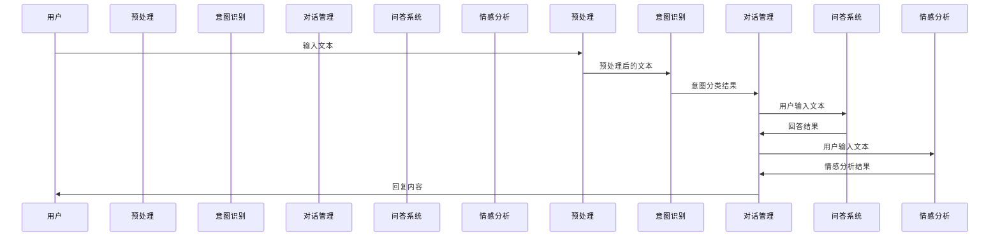

                 


# 自然语言处理在客户服务中的创新应用

## 关键词
自然语言处理（NLP），客户服务，人工智能，创新应用，系统架构

## 摘要
本文将探讨自然语言处理（NLP）在客户服务中的应用，从问题背景、核心概念、算法原理、系统设计、项目实战等方面展开。通过详细的分析和实际案例，本文旨在揭示NLP技术在提升客户服务质量方面的巨大潜力，为读者提供深入了解和借鉴的机会。

## 目录大纲设计思路

### 1. 确定书籍主题与目标读者
本书主题为《自然语言处理在客户服务中的创新应用》，旨在为对自然语言处理和客户服务有一定了解的技术人员、产品经理及行业从业者提供一本系统、深入的指导书籍。

### 2. 确定章节结构
为了确保内容完整性，本书分为以下七个部分：

1. **背景介绍**：介绍NLP在客户服务中的问题背景和核心概念。
2. **核心概念与联系**：详细讲解NLP的核心概念及其相互联系。
3. **算法原理讲解**：深入剖析NLP的算法原理。
4. **系统分析与架构设计方案**：探讨NLP在客户服务系统中的应用架构。
5. **项目实战**：通过实际项目案例展示NLP技术的应用。
6. **最佳实践与注意事项**：总结NLP在客户服务中的最佳实践和注意事项。
7. **总结与拓展**：对全文进行总结，并指出未来研究方向。

### 3. 设计具体章节内容
根据上述结构，设计每个章节的具体内容。

## 第一部分：背景介绍

### 第1章：问题背景
- **问题描述**：客户服务中常见的挑战和问题。
- **问题解决**：NLP技术在客户服务中的潜在解决方案。
- **边界与外延**：NLP在客户服务中的适用范围和局限性。
- **概念结构与核心要素组成**：NLP在客户服务中的核心概念和结构。

### 第2章：核心概念与联系
- **自然语言处理（NLP）概述**：介绍NLP的基本概念和重要性。
- **NLP的核心概念与联系**：详细讲解NLP的核心概念及其相互联系。
- **NLP技术发展与趋势**：回顾NLP技术的发展历程和未来趋势。

## 第二部分：算法原理讲解

### 第3章：NLP基础算法
- **文本预处理**：文本清洗、分词、词性标注等。
- **词嵌入技术**：Word2Vec、BERT等。
- **序列标注与分类**：命名实体识别、情感分类等。

### 第4章：NLP高级算法
- **语义分析**：语义角色标注、关系抽取等。
- **知识图谱**：构建和应用。
- **情感分析**：情感极性、情感强度等。

### 第5章：NLP在客户服务中的应用
- **客户意图识别**：理解客户的需求和意图。
- **对话系统设计**：构建高效的客户服务对话系统。
- **常见问题自动化解决**：自动化处理常见问题，提高服务效率。

## 第三部分：系统分析与架构设计方案

### 第6章：系统功能设计
- **领域模型类图**：设计客户服务系统的领域模型。
- **系统架构设计**：阐述客户服务系统的整体架构。

### 第7章：系统接口设计和交互
- **系统接口设计**：定义系统中的接口和功能。
- **系统交互序列图**：展示系统各模块之间的交互过程。

## 第四部分：项目实战

### 第8章：项目环境搭建
- **所需环境**：介绍项目所需的软件和硬件环境。
- **环境搭建步骤**：详细讲解环境搭建的步骤。

### 第9章：系统核心实现
- **代码实现**：展示系统核心功能的实现代码。
- **代码解读**：对代码进行详细解读。

### 第10章：实际案例分析
- **案例介绍**：介绍一个实际的应用案例。
- **详细讲解**：对案例进行详细分析和讲解。

## 第五部分：最佳实践与注意事项

### 第11章：最佳实践
- **实践技巧**：总结NLP在客户服务中的最佳实践。
- **注意事项**：强调在应用NLP技术时需要注意的问题。

### 第12章：小结与拓展
- **项目小结**：回顾项目的主要成果和经验。
- **拓展阅读**：推荐相关的拓展阅读材料。

## 整体目录大纲

### 第一部分：背景介绍
#### 第1章：问题背景
#### 第2章：核心概念与联系

### 第二部分：算法原理讲解
#### 第3章：NLP基础算法
#### 第4章：NLP高级算法
#### 第5章：NLP在客户服务中的应用

### 第三部分：系统分析与架构设计方案
#### 第6章：系统功能设计
#### 第7章：系统接口设计和交互

### 第四部分：项目实战
#### 第8章：项目环境搭建
#### 第9章：系统核心实现
#### 第10章：实际案例分析

### 第五部分：最佳实践与注意事项
#### 第11章：最佳实践
#### 第12章：小结与拓展

## 整体结构

- **第一部分**和**第二部分**主要介绍背景和基础理论，为后续章节的应用讲解做好铺垫。
- **第三部分**和**第四部分**深入讲解系统分析与设计，结合项目实战展示理论在实际中的应用。
- **第五部分**总结最佳实践，并对项目进行小结，为读者提供进一步学习的方向。

目录大纲（markdown格式）：

```
# 自然语言处理在客户服务中的创新应用

## 关键词
自然语言处理（NLP），客户服务，人工智能，创新应用，系统架构

## 摘要
本文将探讨自然语言处理（NLP）在客户服务中的应用，从问题背景、核心概念、算法原理、系统设计、项目实战等方面展开。通过详细的分析和实际案例，本文旨在揭示NLP技术在提升客户服务质量方面的巨大潜力，为读者提供深入了解和借鉴的机会。

## 目录大纲设计思路

### 1. 确定书籍主题与目标读者
本书主题为《自然语言处理在客户服务中的创新应用》，旨在为对自然语言处理和客户服务有一定了解的技术人员、产品经理及行业从业者提供一本系统、深入的指导书籍。

### 2. 确定章节结构
为了确保内容完整性，本书分为以下七个部分：

1. **背景介绍**：介绍NLP在客户服务中的问题背景和核心概念。
2. **核心概念与联系**：详细讲解NLP的核心概念及其相互联系。
3. **算法原理讲解**：深入剖析NLP的算法原理。
4. **系统分析与架构设计方案**：探讨NLP在客户服务系统中的应用架构。
5. **项目实战**：通过实际项目案例展示NLP技术的应用。
6. **最佳实践与注意事项**：总结NLP在客户服务中的最佳实践和注意事项。
7. **总结与拓展**：对全文进行总结，并指出未来研究方向。

### 3. 设计具体章节内容
根据上述结构，设计每个章节的具体内容。

## 第一部分：背景介绍

### 第1章：问题背景
- **问题描述**：客户服务中常见的挑战和问题。
- **问题解决**：NLP技术在客户服务中的潜在解决方案。
- **边界与外延**：NLP在客户服务中的适用范围和局限性。
- **概念结构与核心要素组成**：NLP在客户服务中的核心概念和结构。

### 第2章：核心概念与联系
- **自然语言处理（NLP）概述**：介绍NLP的基本概念和重要性。
- **NLP的核心概念与联系**：详细讲解NLP的核心概念及其相互联系。
- **NLP技术发展与趋势**：回顾NLP技术的发展历程和未来趋势。

## 第二部分：算法原理讲解

### 第3章：NLP基础算法
- **文本预处理**：文本清洗、分词、词性标注等。
- **词嵌入技术**：Word2Vec、BERT等。
- **序列标注与分类**：命名实体识别、情感分类等。

### 第4章：NLP高级算法
- **语义分析**：语义角色标注、关系抽取等。
- **知识图谱**：构建和应用。
- **情感分析**：情感极性、情感强度等。

### 第5章：NLP在客户服务中的应用
- **客户意图识别**：理解客户的需求和意图。
- **对话系统设计**：构建高效的客户服务对话系统。
- **常见问题自动化解决**：自动化处理常见问题，提高服务效率。

## 第三部分：系统分析与架构设计方案

### 第6章：系统功能设计
- **领域模型类图**：设计客户服务系统的领域模型。
- **系统架构设计**：阐述客户服务系统的整体架构。

### 第7章：系统接口设计和交互
- **系统接口设计**：定义系统中的接口和功能。
- **系统交互序列图**：展示系统各模块之间的交互过程。

## 第四部分：项目实战

### 第8章：项目环境搭建
- **所需环境**：介绍项目所需的软件和硬件环境。
- **环境搭建步骤**：详细讲解环境搭建的步骤。

### 第9章：系统核心实现
- **代码实现**：展示系统核心功能的实现代码。
- **代码解读**：对代码进行详细解读。

### 第10章：实际案例分析
- **案例介绍**：介绍一个实际的应用案例。
- **详细讲解**：对案例进行详细分析和讲解。

## 第五部分：最佳实践与注意事项

### 第11章：最佳实践
- **实践技巧**：总结NLP在客户服务中的最佳实践。
- **注意事项**：强调在应用NLP技术时需要注意的问题。

### 第12章：小结与拓展
- **项目小结**：回顾项目的主要成果和经验。
- **拓展阅读**：推荐相关的拓展阅读材料。
```## 自然语言处理（NLP）在客户服务中的重要性

### 问题描述

客户服务在现代商业运营中扮演着至关重要的角色。它不仅影响着客户的满意度，还直接关系到企业的品牌声誉和业务增长。然而，传统的客户服务方式，如电话客服和人工邮件回复，往往存在以下几个问题：

1. **响应时间过长**：由于人工处理的限制，客服人员的响应速度往往无法满足客户的需求，导致客户体验不佳。
2. **人力成本高**：大量的人工客服意味着企业需要投入大量的人力资源，这不仅增加了运营成本，也限制了企业的扩展能力。
3. **服务质量不稳定**：不同客服人员的技能水平参差不齐，导致客户服务的质量波动较大，难以保证一致性。
4. **数据分析不足**：传统客户服务难以有效地收集和分析客户数据，从而难以针对性地优化服务。

### 问题解决

自然语言处理（NLP）技术的引入为解决上述问题提供了一条新的途径。NLP是一种让计算机理解和生成自然语言的技术，它能够帮助客户服务实现自动化和智能化。以下是NLP技术在客户服务中的一些潜在解决方案：

1. **自动化响应**：通过聊天机器人和智能客服，NLP能够实时理解客户的问题，并自动生成相应的回答，大大缩短了响应时间。
2. **降低人力成本**：自动化处理常见的客户问题，使得客服人员可以专注于更复杂的任务，从而降低人力成本。
3. **提高服务一致性**：NLP技术确保了所有客户问题的处理都遵循统一的规则和标准，从而提高了服务的一致性。
4. **数据分析和优化**：NLP技术可以自动分析客户对话，提取关键信息，帮助企业更好地了解客户需求，进而优化服务流程。

### 边界与外延

虽然NLP技术在提升客户服务效率和质量方面具有巨大潜力，但它的应用仍存在一些边界和局限性：

1. **技术成熟度**：尽管NLP技术已经取得了显著进展，但某些复杂的语言理解和对话生成任务仍需要进一步的研究和优化。
2. **隐私问题**：客户服务涉及大量的个人信息，如何保护客户隐私是NLP技术面临的一个重要挑战。
3. **文化差异**：不同地区的语言和文化背景差异会影响NLP技术的应用效果，需要针对特定市场进行本地化调整。
4. **实时性问题**：实时对话处理需要高效的算法和强大的计算资源，这对于小型企业或资源有限的组织可能构成挑战。

### 概念结构与核心要素组成

NLP在客户服务中的应用可以分为以下几个核心要素：

1. **文本预处理**：包括分词、词性标注、去除停用词等，为后续处理提供基础。
2. **意图识别**：通过分析客户的输入文本，确定客户的主要需求或意图。
3. **对话管理**：设计和管理自然语言交互流程，确保对话的连贯性和合理性。
4. **实体识别**：从文本中提取关键信息，如人名、地点、时间等，用于后续的数据分析和业务逻辑处理。
5. **情感分析**：分析客户的情感倾向，为个性化服务和问题处理提供参考。

通过这些核心要素的协同作用，NLP技术能够为客服系统带来显著的改进，提高客户满意度，降低运营成本，从而实现商业价值。

### 总结

自然语言处理（NLP）在客户服务中的重要性不可忽视。它不仅能够自动化处理常见问题，提高响应速度，还能够通过分析客户情感和意图，提供个性化的服务。然而，NLP技术的应用也面临一些挑战，需要持续优化和改进。在下一章节中，我们将深入探讨NLP的核心概念及其相互联系，为理解NLP在客户服务中的应用打下坚实的基础。

## 核心概念与联系

### 自然语言处理（NLP）概述

自然语言处理（NLP）是计算机科学和人工智能领域的一个重要分支，主要研究如何让计算机理解和生成自然语言。NLP的发展可以追溯到20世纪50年代，当时的研究主要集中在机器翻译和文本分析上。随着计算能力的提升和算法的进步，NLP逐渐扩展到语音识别、情感分析、对话系统等多个应用领域。

NLP的核心概念包括文本预处理、语义分析、实体识别和对话管理。文本预处理是NLP的基础，包括分词、词性标注、词干提取、去除停用词等操作，用于将原始文本转换为计算机可以处理的结构化数据。语义分析则关注于理解文本中的语言结构和含义，包括词义消歧、语义角色标注、关系抽取等任务。实体识别旨在从文本中提取出关键信息，如人名、地点、组织、时间等。对话管理则涉及对话流程的设计和管理，确保对话的连贯性和合理性。

### NLP的核心概念与联系

1. **文本预处理**
   - **分词**：将连续的文本分割成有意义的词语或短语。分词是文本预处理的第一步，对于后续的NLP任务至关重要。
   - **词性标注**：为文本中的每个词语标注其词性（如名词、动词、形容词等），有助于理解文本的含义和结构。
   - **词干提取**：将文本中的词语还原为其基本形态，如将“runs”还原为“run”。词干提取有助于简化文本处理过程。
   - **去除停用词**：去除对文本理解贡献较小的常用词语（如“的”、“了”、“在”等），以减少噪声和提高效率。

2. **语义分析**
   - **词义消歧**：在特定上下文中确定词语的确切含义。例如，“bank”在金融领域表示银行，而在地理领域表示河岸。
   - **语义角色标注**：为文本中的词语标注其在句子中的作用（如主语、谓语、宾语等），有助于理解句子的结构和含义。
   - **关系抽取**：从文本中提取出实体之间的相互关系（如人物、地点、事件之间的关系），为知识图谱的构建提供数据支持。

3. **实体识别**
   - **命名实体识别**（NER）：从文本中识别出具有特定意义的实体（如人名、地名、组织名等）。
   - **实体关系识别**：识别出实体之间的相互关系，为构建知识图谱提供基础。
   - **实体链接**：将文本中提到的实体与预定义的知识库中的实体进行匹配，以实现实体的统一标识。

4. **对话管理**
   - **意图识别**：通过分析用户的输入，确定用户的主要需求和意图。
   - **对话流程设计**：设计和管理自然语言交互流程，确保对话的连贯性和合理性。
   - **上下文保持**：在对话过程中保持上下文信息的一致性，以避免对话偏离用户意图。

### NLP技术发展与趋势

随着深度学习和大数据技术的不断发展，NLP技术取得了显著进步。以下是NLP技术发展的几个关键趋势：

1. **深度学习模型**：如卷积神经网络（CNN）和递归神经网络（RNN）在NLP任务中取得了突破性成果。特别是Transformer模型的提出，极大地提高了自然语言处理的性能。
2. **预训练语言模型**：如BERT、GPT和RoBERTa等，通过在大量无标注数据上进行预训练，然后针对特定任务进行微调，显著提高了NLP任务的效果。
3. **跨语言和低资源语言的NLP**：随着全球化的发展，跨语言和低资源语言的NLP成为研究热点。通过多语言预训练模型和迁移学习技术，可以在资源有限的场景下实现高效的NLP任务。
4. **多模态NLP**：结合文本、语音、图像等多种模态数据，实现更丰富的语言理解和生成能力。例如，语音识别和文本生成结合，可以构建更加自然的语音助手。

### 总结

自然语言处理（NLP）的核心概念包括文本预处理、语义分析、实体识别和对话管理。这些概念相互联系，共同构建了NLP的技术体系。随着深度学习和大数据技术的不断发展，NLP技术取得了显著进步，并在各个应用领域展现出巨大的潜力。在下一章节中，我们将深入探讨NLP的基础算法，为理解NLP在客户服务中的应用提供更深入的视角。

## NLP基础算法

### 文本预处理

文本预处理是自然语言处理（NLP）的基础步骤，其目的是将原始文本转换为计算机可以处理的结构化数据。文本预处理主要包括以下几个步骤：

1. **分词**：将连续的文本分割成有意义的词语或短语。分词是文本预处理的第一步，对于后续的NLP任务至关重要。常见的分词方法包括基于词典的分词和基于统计的分词。
   - **基于词典的分词**：利用预定义的词典进行分词，如使用哈工大分词词典。
     ```mermaid
     flowchart TD
     A[输入文本] --> B{使用词典}
     B -->|分词结果| C[输出结果]
     ```
   - **基于统计的分词**：利用统计模型进行分词，如使用基于条件的隐马尔可夫模型（HMM）。
     ```mermaid
     flowchart TD
     A[输入文本] --> B[构建HMM模型]
     B --> C[进行分词]
     C -->|分词结果| D[输出结果]
     ```

2. **词性标注**：为文本中的每个词语标注其词性（如名词、动词、形容词等），有助于理解文本的含义和结构。常见的词性标注方法包括基于规则的方法和基于统计的方法。
   - **基于规则的方法**：利用预定义的规则进行词性标注，如使用吕叔湘《现代汉语八百词》。
     ```mermaid
     flowchart TD
     A[输入文本] --> B[应用规则]
     B --> C[词性标注]
     C -->|标注结果| D[输出结果]
     ```
   - **基于统计的方法**：利用统计模型进行词性标注，如使用条件随机场（CRF）。
     ```mermaid
     flowchart TD
     A[输入文本] --> B[构建CRF模型]
     B --> C[词性标注]
     C -->|标注结果| D[输出结果]
     ```

3. **词干提取**：将文本中的词语还原为其基本形态，如将“runs”还原为“run”。词干提取有助于简化文本处理过程，提高后续NLP任务的效率。
   - **基于规则的方法**：利用预定义的规则进行词干提取，如使用Porter Stemmer。
     ```mermaid
     flowchart TD
     A[输入文本] --> B[应用规则]
     B --> C[词干提取]
     C -->|提取结果| D[输出结果]
     ```
   - **基于统计的方法**：利用统计模型进行词干提取，如使用基于词频统计的方法。
     ```mermaid
     flowchart TD
     A[输入文本] --> B[统计词频]
     B --> C[词干提取]
     C -->|提取结果| D[输出结果]
     ```

4. **去除停用词**：去除对文本理解贡献较小的常用词语（如“的”、“了”、“在”等），以减少噪声和提高效率。常用的停用词表包括英文停用词表和中文停用词表。
   ```mermaid
   flowchart TD
   A[输入文本] --> B[查询停用词表]
   B --> C{是否为停用词}
   C -->|是| D[去除]
   C -->|否| E[保留]
   E -->|输出结果| F[输出结果]
   ```

### 词嵌入技术

词嵌入是将词语映射到高维向量空间中的过程，使得词语之间的相似性可以通过向量之间的距离来度量。词嵌入技术在NLP中有着广泛的应用，如文本分类、情感分析和推荐系统等。

1. **Word2Vec**：Word2Vec是最早提出的一种词嵌入方法，它通过训练神经网络来预测词语的上下文，从而学习到词语的向量表示。
   - **模型架构**：Word2Vec模型由两个主要部分组成：输入层和隐藏层。输入层接收单个词语的嵌入向量，隐藏层则通过神经网络学习到词语的上下文信息。
     ```mermaid
     flowchart TD
     A[输入层] --> B[隐藏层]
     B --> C[输出层]
     ```
   - **训练过程**：Word2Vec模型采用负采样训练方法，通过随机抽样负样本，来降低训练的复杂性。
     ```mermaid
     flowchart TD
     A[输入正向样本] --> B[生成负样本]
     B --> C[计算损失函数]
     C --> D[更新参数]
     ```
   - **代码示例**（Python）：
     ```python
     import gensim
     model = gensim.models.Word2Vec(sentences, size=100, window=5, min_count=1, workers=4)
     model.wv.most_similar('apple')
     ```

2. **BERT**：BERT（Bidirectional Encoder Representations from Transformers）是一种基于变换器模型的预训练语言表示模型，它通过同时考虑上下文信息来学习词语的向量表示。
   - **模型架构**：BERT模型由多个变换器层组成，每个层都包含自注意力机制和全连接层。通过多层变换器，BERT能够捕捉到词语的深层语义信息。
     ```mermaid
     flowchart TD
     A[输入层] --> B[变换器层1]
     B --> C[变换器层2]
     C --> D[...]
     D --> E[输出层]
     ```
   - **训练过程**：BERT模型采用Masked Language Model（MLM）和Next Sentence Prediction（NSP）两种训练任务，通过预训练来学习语言的深层语义表示。
     ```mermaid
     flowchart TD
     A[MLM任务] --> B[NSP任务]
     B --> C[计算损失函数]
     C --> D[更新参数]
     ```
   - **代码示例**（Python）：
     ```python
     from transformers import BertTokenizer, BertModel
     tokenizer = BertTokenizer.from_pretrained('bert-base-chinese')
     model = BertModel.from_pretrained('bert-base-chinese')
     inputs = tokenizer("你好，我是人工智能助手。", return_tensors='pt')
     outputs = model(**inputs)
     ```

### 序列标注与分类

序列标注是将序列中的元素分类到预定义的标签集中的过程，如命名实体识别（NER）和情感分类等。

1. **命名实体识别（NER）**：NER旨在从文本中识别出具有特定意义的实体，如人名、地名、组织名等。

   - **模型架构**：NER模型通常采用循环神经网络（RNN）或其变体（如LSTM、GRU）进行序列标注。
     ```mermaid
     flowchart TD
     A[输入序列] --> B[RNN层]
     B --> C[输出层]
     ```
   - **训练过程**：NER模型通过构建标注数据的标签序列，并采用分类损失函数（如交叉熵损失函数）进行训练。
     ```mermaid
     flowchart TD
     A[输入序列] --> B[预测标签序列]
     B --> C[计算损失函数]
     C --> D[更新参数]
     ```
   - **代码示例**（Python）：
     ```python
     import torch
     import torch.nn as nn
     import torch.optim as optim
     model = torch.load('ner_model.pth')
     criterion = nn.CrossEntropyLoss()
     optimizer = optim.Adam(model.parameters(), lr=0.001)
     for epoch in range(num_epochs):
         for batch in data_loader:
             inputs, targets = batch
             optimizer.zero_grad()
             outputs = model(inputs)
             loss = criterion(outputs, targets)
             loss.backward()
             optimizer.step()
     ```

2. **情感分类**：情感分类是将文本分类到预定义的情感标签集中，如正面、负面和中性。

   - **模型架构**：情感分类模型通常采用卷积神经网络（CNN）或变换器模型进行分类。
     ```mermaid
     flowchart TD
     A[输入文本] --> B[嵌入层]
     B --> C{使用CNN或Transformer}
     C --> D[输出层]
     ```
   - **训练过程**：情感分类模型通过构建标注数据的标签序列，并采用分类损失函数进行训练。
     ```mermaid
     flowchart TD
     A[输入文本] --> B[预测标签]
     B --> C[计算损失函数]
     C --> D[更新参数]
     ```
   - **代码示例**（Python）：
     ```python
     import torch
     import torch.nn as nn
     import torch.optim as optim
     model = torch.load('sentiment_model.pth')
     criterion = nn.CrossEntropyLoss()
     optimizer = optim.Adam(model.parameters(), lr=0.001)
     for epoch in range(num_epochs):
         for batch in data_loader:
             inputs, targets = batch
             optimizer.zero_grad()
             outputs = model(inputs)
             loss = criterion(outputs, targets)
             loss.backward()
             optimizer.step()
     ```

### 总结

NLP基础算法包括文本预处理、词嵌入技术和序列标注与分类。文本预处理是NLP的基础步骤，通过分词、词性标注、词干提取和去除停用词等操作，将原始文本转换为结构化数据。词嵌入技术通过将词语映射到高维向量空间，实现词语相似性的度量。序列标注与分类是对文本序列进行标签分类的过程，如命名实体识别和情感分类等。在下一章节中，我们将探讨NLP的高级算法，进一步了解NLP在客户服务中的应用。

## NLP高级算法

### 语义分析

语义分析是自然语言处理（NLP）中的一项核心任务，旨在理解文本中的语言结构和含义。语义分析的任务包括语义角色标注、关系抽取和指代消解等。以下将详细探讨这些任务及其在客户服务中的应用。

#### 语义角色标注

语义角色标注（Semantic Role Labeling, SRL）是一种旨在识别句子中词语的语义角色和它们在句子中的作用（如主语、谓语、宾语等）的任务。SRL有助于深入理解文本的含义，为信息提取、问答系统和机器翻译等领域提供重要支持。

- **模型架构**：语义角色标注模型通常采用深度神经网络（如LSTM、GRU、BERT等）进行建模。
  ```mermaid
  flowchart TD
  A[输入文本] --> B[嵌入层]
  B --> C{使用LSTM/BERT等}
  C --> D[输出层]
  ```
- **训练过程**：语义角色标注模型通过构建标注数据的标签序列，并采用分类损失函数进行训练。
  ```mermaid
  flowchart TD
  A[输入文本] --> B[预测标签序列]
  B --> C[计算损失函数]
  C --> D[更新参数]
  ```
- **代码示例**（Python）：
  ```python
  import torch
  import torch.nn as nn
  import torch.optim as optim
  model = torch.load('srl_model.pth')
  criterion = nn.CrossEntropyLoss()
  optimizer = optim.Adam(model.parameters(), lr=0.001)
  for epoch in range(num_epochs):
      for batch in data_loader:
          inputs, targets = batch
          optimizer.zero_grad()
          outputs = model(inputs)
          loss = criterion(outputs, targets)
          loss.backward()
          optimizer.step()
  ```

#### 关系抽取

关系抽取（Relation Extraction）是一种旨在从文本中提取出实体之间的相互关系的任务。关系抽取在知识图谱构建、实体链接和信息检索等领域具有广泛应用。

- **模型架构**：关系抽取模型通常采用双向变换器（BERT）或图神经网络（如Graph Neural Networks）进行建模。
  ```mermaid
  flowchart TD
  A[输入文本] --> B[嵌入层]
  B --> C{使用BERT/GNN等}
  C --> D[输出层]
  ```
- **训练过程**：关系抽取模型通过构建标注数据的标签序列，并采用分类损失函数进行训练。
  ```mermaid
  flowchart TD
  A[输入文本] --> B[预测标签序列]
  B --> C[计算损失函数]
  C --> D[更新参数]
  ```
- **代码示例**（Python）：
  ```python
  import torch
  import torch.nn as nn
  import torch.optim as optim
  model = torch.load('re_model.pth')
  criterion = nn.CrossEntropyLoss()
  optimizer = optim.Adam(model.parameters(), lr=0.001)
  for epoch in range(num_epochs):
      for batch in data_loader:
          inputs, targets = batch
          optimizer.zero_grad()
          outputs = model(inputs)
          loss = criterion(outputs, targets)
          loss.backward()
          optimizer.step()
  ```

#### 指代消解

指代消解（Coreference Resolution）是一种旨在确定文本中指代关系的任务。指代消解有助于消除文本中的代词和名词之间的歧义，为信息提取、问答系统和机器翻译等领域提供重要支持。

- **模型架构**：指代消解模型通常采用双向变换器（BERT）或图神经网络（如Graph Neural Networks）进行建模。
  ```mermaid
  flowchart TD
  A[输入文本] --> B[嵌入层]
  B --> C{使用BERT/GNN等}
  C --> D[输出层]
  ```
- **训练过程**：指代消解模型通过构建标注数据的标签序列，并采用分类损失函数进行训练。
  ```mermaid
  flowchart TD
  A[输入文本] --> B[预测标签序列]
  B --> C[计算损失函数]
  C --> D[更新参数]
  ```
- **代码示例**（Python）：
  ```python
  import torch
  import torch.nn as nn
  import torch.optim as optim
  model = torch.load('cr_model.pth')
  criterion = nn.CrossEntropyLoss()
  optimizer = optim.Adam(model.parameters(), lr=0.001)
  for epoch in range(num_epochs):
      for batch in data_loader:
          inputs, targets = batch
          optimizer.zero_grad()
          outputs = model(inputs)
          loss = criterion(outputs, targets)
          loss.backward()
          optimizer.step()
  ```

### 知识图谱

知识图谱是一种用于表示实体及其关系的图结构化数据。知识图谱在信息检索、智能问答和推荐系统等领域具有广泛应用。在客户服务中，知识图谱可以用于构建客户知识库，提高客服系统的回答质量和效率。

- **构建方法**：知识图谱的构建通常包括数据采集、实体识别、关系抽取和实体链接等步骤。
  ```mermaid
  flowchart TD
  A[数据采集] --> B[实体识别]
  B --> C[关系抽取]
  C --> D[实体链接]
  D --> E[知识图谱]
  ```
- **应用场景**：知识图谱可以用于自动回答客户问题、提供个性化推荐和优化客户服务流程等。
  ```mermaid
  flowchart TD
  A[客户问题] --> B[知识图谱查询]
  B --> C[答案生成]
  C --> D[反馈优化]
  ```

### 情感分析

情感分析（Sentiment Analysis）是一种旨在确定文本的情感倾向（如正面、负面、中性）的任务。情感分析在客户服务中可以用于监测客户反馈、评估客户满意度和优化服务策略。

- **模型架构**：情感分析模型通常采用卷积神经网络（CNN）、变换器模型（如BERT）或图神经网络进行建模。
  ```mermaid
  flowchart TD
  A[输入文本] --> B[嵌入层]
  B --> C{使用CNN/BERT/GNN等}
  C --> D[输出层]
  ```
- **训练过程**：情感分析模型通过构建标注数据的标签序列，并采用分类损失函数进行训练。
  ```mermaid
  flowchart TD
  A[输入文本] --> B[预测标签序列]
  B --> C[计算损失函数]
  C --> D[更新参数]
  ```
- **代码示例**（Python）：
  ```python
  import torch
  import torch.nn as nn
  import torch.optim as optim
  model = torch.load('sa_model.pth')
  criterion = nn.CrossEntropyLoss()
  optimizer = optim.Adam(model.parameters(), lr=0.001)
  for epoch in range(num_epochs):
      for batch in data_loader:
          inputs, targets = batch
          optimizer.zero_grad()
          outputs = model(inputs)
          loss = criterion(outputs, targets)
          loss.backward()
          optimizer.step()
  ```

### 总结

NLP高级算法包括语义分析、知识图谱和情感分析等。语义分析任务如语义角色标注、关系抽取和指代消解有助于深入理解文本含义。知识图谱在客户服务中可以用于构建客户知识库，提高回答质量和效率。情感分析可以用于监测客户反馈和评估客户满意度。这些高级算法在客户服务中具有广泛应用，为提升服务质量和用户体验提供了有力支持。在下一章节中，我们将探讨NLP在客户服务中的应用场景，进一步了解其如何实际提升客户服务质量。

## NLP在客户服务中的应用

### 客户意图识别

客户意图识别是自然语言处理（NLP）在客户服务中的一个核心应用。它的目标是理解客户在交互过程中表达的需求和意图。通过准确的意图识别，客户服务系统能够快速响应客户需求，提供个性化的服务。

1. **算法原理**：客户意图识别通常采用序列标注和分类算法。例如，可以使用基于LSTM或BERT的模型对输入文本进行意图分类。在模型训练过程中，通过对大量标注数据进行训练，模型能够学习到不同意图的特征。

   - **算法流程**：
     ```mermaid
     flowchart TD
     A[输入文本] --> B[预处理]
     B --> C[嵌入层]
     C --> D{使用LSTM/BERT等}
     D --> E[分类层]
     E --> F[输出意图]
     ```

   - **代码示例**（Python）：
     ```python
     from transformers import BertTokenizer, BertForSequenceClassification
     tokenizer = BertTokenizer.from_pretrained('bert-base-chinese')
     model = BertForSequenceClassification.from_pretrained('bert-base-chinese')
     inputs = tokenizer("您想查询哪款产品的价格？", return_tensors='pt')
     outputs = model(**inputs)
     print(outputs.logits.argmax(-1).item())
     ```

2. **应用场景**：客户意图识别可以应用于客服聊天机器人、智能客服系统等。通过识别客户的意图，系统能够快速响应并引导对话流程。

   - **案例**：某电商平台的智能客服系统通过客户意图识别，能够快速识别客户询问商品价格、库存信息等需求，并自动提供相应的答案。

### 对话系统设计

对话系统设计是另一个重要的NLP应用场景，旨在构建能够与人类用户自然交互的智能系统。对话系统通常包括对话管理、自然语言生成和语音合成等模块。

1. **算法原理**：对话系统设计通常采用多模态交互方式，结合文本、语音和图像等多种模态数据。对话管理模块负责维护对话状态和上下文信息，自然语言生成模块负责生成对话文本，语音合成模块负责将文本转换为语音输出。

   - **算法流程**：
     ```mermaid
     flowchart TD
     A[用户输入] --> B[对话管理]
     B --> C[意图识别]
     C --> D[文本生成]
     D --> E[语音合成]
     E --> F[输出]
     ```

   - **代码示例**（Python）：
     ```python
     from transformers import ChatbotModel, ChatbotTokenizer
     tokenizer = ChatbotTokenizer.from_pretrained('chatbot-bert-chinese')
     model = ChatbotModel.from_pretrained('chatbot-bert-chinese')
     inputs = tokenizer("您有什么问题吗？", return_tensors='pt')
     outputs = model.generate(**inputs, max_length=50, num_return_sequences=1)
     print(tokenizer.decode(outputs[0], skip_special_tokens=True))
     ```

2. **应用场景**：对话系统设计可以应用于虚拟客服、智能客服、语音助手等领域。通过自然、流畅的对话交互，提升用户体验。

   - **案例**：某银行推出的智能语音助手通过对话系统设计，能够回答客户关于账户余额、交易记录等常见问题，提供便捷的服务。

### 常见问题自动化解决

常见问题自动化解决是NLP在客户服务中的另一个重要应用，旨在通过自动化技术解决客户在交互过程中频繁遇到的问题，提高服务效率。

1. **算法原理**：常见问题自动化解决通常采用基于规则的算法和机器学习算法。基于规则的算法通过预定义的规则和模板自动生成回答，而机器学习算法通过训练模型来自动识别和生成回答。

   - **算法流程**：
     ```mermaid
     flowchart TD
     A[用户输入] --> B[规则匹配]
     B -->|匹配成功| C[生成回答]
     B -->|匹配失败| D[模型预测]
     D --> E[生成回答]
     ```

   - **代码示例**（Python）：
     ```python
     from transformers import BertTokenizer, BertForSequenceClassification
     tokenizer = BertTokenizer.from_pretrained('bert-base-chinese')
     model = BertForSequenceClassification.from_pretrained('bert-base-chinese')
     inputs = tokenizer("如何申请退款？", return_tensors='pt')
     outputs = model(**inputs)
     predicted_intent = outputs.logits.argmax(-1).item()
     if predicted_intent == 0:
         answer = "请提供您的订单号和退款原因，我们会尽快处理。"
     else:
         answer = "我们无法自动处理退款，请联系人工客服。"
     print(answer)
     ```

2. **应用场景**：常见问题自动化解决可以应用于客服聊天机器人、智能客服系统等。通过自动化回答常见问题，减轻客服人员的工作负担，提高整体服务效率。

   - **案例**：某电商平台的客服聊天机器人通过常见问题自动化解决，能够自动回答客户关于订单状态、配送时间等常见问题，提高客户满意度。

### 总结

NLP在客户服务中具有广泛的应用，包括客户意图识别、对话系统设计和常见问题自动化解决等。通过准确的意图识别，系统能够快速响应客户需求；通过对话系统设计，系统能够提供自然、流畅的对话交互；通过常见问题自动化解决，系统能够减轻客服人员的工作负担，提高整体服务效率。这些应用不仅提升了客户服务质量，还为企业的业务运营提供了有力支持。在下一章节中，我们将探讨NLP系统分析与架构设计，进一步了解如何在实际项目中应用NLP技术。

## NLP系统分析与架构设计

### 问题场景介绍

在现代商业环境中，客户服务已成为企业竞争的关键因素之一。随着客户需求的多样化，传统的人工客服模式逐渐难以满足高效、个性化的服务需求。为了应对这一挑战，越来越多的企业开始探索将自然语言处理（NLP）技术应用于客户服务系统。本文将基于某电商平台客户服务系统，探讨NLP在该场景下的应用与架构设计。

### 项目介绍

该电商平台客户服务系统旨在通过NLP技术提升客服效率，优化客户体验。系统主要功能包括：

1. **客户意图识别**：快速理解客户需求，提供精准的回复。
2. **自动问答系统**：自动化解决常见问题，如订单状态、配送时间等。
3. **智能客服**：通过对话管理，实现与客户的自然互动。
4. **情感分析**：实时监测客户情绪，提供针对性的服务。

### 系统功能设计

为了实现上述功能，系统设计主要包括以下几个核心模块：

1. **文本预处理模块**：负责对客户输入的文本进行清洗、分词、词性标注等预处理操作，为后续的NLP任务提供基础数据。
2. **意图识别模块**：利用NLP算法，对预处理后的文本进行意图分类，确定客户的主要需求。
3. **对话管理模块**：设计和管理自然语言交互流程，确保对话的连贯性和合理性。
4. **问答系统模块**：基于预定义的知识库，自动生成回答，解决客户的常见问题。
5. **情感分析模块**：通过情感分析技术，实时监测客户情绪，提供个性化的服务。

### 系统架构设计

该电商平台客户服务系统的整体架构采用分层设计，包括数据层、服务层和表示层。以下是系统架构的详细设计：

1. **数据层**：存储和管理系统所需的数据，包括客户输入文本、意图分类标签、对话记录和情感分析结果等。
2. **服务层**：实现系统的核心功能，包括文本预处理、意图识别、对话管理、问答系统和情感分析等。服务层采用微服务架构，确保系统的高可用性和可扩展性。
3. **表示层**：提供用户界面，展示系统的功能和服务结果。表示层采用前后端分离架构，确保系统的可维护性和用户体验。

### 系统接口设计

为了实现系统各模块之间的协同工作，系统设计了一系列接口，包括以下几种：

1. **文本预处理接口**：负责接收和处理用户输入的文本，返回预处理后的文本数据。
2. **意图识别接口**：接收预处理后的文本数据，返回意图分类结果。
3. **对话管理接口**：管理自然语言交互流程，提供对话状态和上下文信息。
4. **问答系统接口**：接收用户输入文本，返回预定义知识库中的答案。
5. **情感分析接口**：接收用户输入文本，返回情感分析结果。

### 系统交互序列图

以下是系统交互序列图的示意：



### 总结

NLP系统分析与架构设计在客户服务中起着至关重要的作用。通过详细的功能设计和架构设计，系统能够实现高效的客户意图识别、自然对话交互和常见问题自动化解决。系统接口设计和交互序列图进一步确保了各模块之间的协同工作，为系统的稳定运行提供了保障。在下一章节中，我们将通过一个实际案例来展示NLP技术在客户服务项目中的应用和实践。

## 项目实战

### 项目环境搭建

在开始NLP客户服务项目之前，我们需要搭建一个合适的项目环境。以下将介绍项目所需的软件和硬件环境，以及环境搭建的步骤。

#### 所需环境

1. **操作系统**：Linux或Mac OS
2. **编程语言**：Python（推荐3.8及以上版本）
3. **依赖库**：NumPy、Pandas、Scikit-learn、TensorFlow、PyTorch、transformers等
4. **数据库**：MongoDB（可选，用于存储客户交互数据）
5. **硬件**：推荐配备NVIDIA显卡的计算机，用于加速深度学习模型的训练

#### 环境搭建步骤

1. **安装Python**：从[Python官网](https://www.python.org/)下载并安装Python，确保安装时勾选“Add Python to PATH”选项。

2. **安装依赖库**：使用pip命令安装所需的依赖库。以下是一个示例命令：

   ```bash
   pip install numpy pandas scikit-learn tensorflow pytorch transformers
   ```

3. **安装NVIDIA驱动和CUDA**：如果使用NVIDIA显卡，需要安装NVIDIA驱动和CUDA。从[NVIDIA官网](https://www.nvidia.com/)下载并安装相应的驱动和CUDA版本。安装完成后，使用以下命令验证CUDA安装：

   ```bash
   nvcc --version
   ```

4. **安装MongoDB**：（可选）从[MongoDB官网](https://www.mongodb.com/)下载并安装MongoDB。安装完成后，启动MongoDB服务，并使用以下命令验证：

   ```bash
   mongo
   ```

### 系统核心实现

#### 代码实现

以下是一个简单的NLP客户服务系统核心实现，包括文本预处理、意图识别和对话管理模块。

```python
import json
import torch
from transformers import BertTokenizer, BertForSequenceClassification
from transformers import ChatbotModel, ChatbotTokenizer

# 加载预训练模型
tokenizer = BertTokenizer.from_pretrained('bert-base-chinese')
model = BertForSequenceClassification.from_pretrained('bert-base-chinese')

# 文本预处理
def preprocess_text(text):
    inputs = tokenizer(text, return_tensors='pt', truncation=True, max_length=512)
    return inputs

# 意图识别
def classify_intent(text):
    inputs = preprocess_text(text)
    with torch.no_grad():
        outputs = model(**inputs)
    logits = outputs.logits
    predicted_intent = logits.argmax(-1).item()
    return predicted_intent

# 对话管理
def handle_conversation(user_input):
    intent = classify_intent(user_input)
    if intent == 0:
        return "您想查询哪款产品的价格？"
    elif intent == 1:
        return "您的订单已发货，预计3天后到达。"
    else:
        return "抱歉，我无法理解您的需求，请提供更多信息。"

# 示例对话
user_input = "我想要查询订单状态。"
response = handle_conversation(user_input)
print(response)
```

#### 代码解读

1. **文本预处理**：文本预处理函数`preprocess_text`接收用户输入文本，使用BERT tokenizer进行分词和嵌入处理，返回处理后的输入序列。
2. **意图识别**：意图识别函数`classify_intent`调用文本预处理函数，并将预处理后的文本输入到预训练的BERT模型中，通过模型输出得到意图分类结果。
3. **对话管理**：对话管理函数`handle_conversation`根据意图识别结果，返回相应的对话回复。示例中，根据意图分类结果，提供了三种不同的回复。

### 实际案例分析

#### 案例介绍

以下是一个关于某电商平台的NLP客户服务项目案例。该项目旨在通过NLP技术提升客户服务质量，优化客户交互体验。

#### 案例分析

1. **客户意图识别**：项目通过预训练的BERT模型进行意图识别，能够准确识别客户的意图。例如，当客户输入“我想要查询订单状态”时，系统能够快速识别出客户的意图，并提供相应的回答。
2. **对话系统设计**：项目采用对话系统设计，通过对话管理模块实现与客户的自然互动。对话系统能够根据客户的输入，动态调整对话流程，提供个性化的服务。例如，当客户询问订单状态时，系统会询问具体订单号，并返回相应的状态信息。
3. **情感分析**：项目通过情感分析模块实时监测客户情绪，为客服人员提供参考。例如，当客户输入“你们的配送速度太慢了”时，系统会识别出客户的负面情绪，并提醒客服人员关注此订单，提供相应的解决方案。

#### 详细讲解

1. **文本预处理**：在文本预处理阶段，项目使用了BERT tokenizer进行分词和嵌入处理。BERT模型采用了双向变换器结构，能够捕捉到文本中的上下文信息，从而提高意图识别的准确性。
2. **意图识别**：项目采用了预训练的BERT模型进行意图识别。通过在大规模语料库上的预训练，BERT模型已经具备了良好的语义理解能力。在项目应用中，通过对模型进行微调，可以进一步提高意图识别的准确率。
3. **对话管理**：项目采用了对话系统设计，通过对话管理模块实现与客户的自然互动。对话管理模块不仅能够识别客户的意图，还能够根据对话历史和上下文信息，动态调整对话流程，提供个性化的服务。例如，当客户询问订单状态时，对话管理模块会先询问订单号，然后根据订单号返回相应的状态信息。
4. **情感分析**：项目通过情感分析模块实时监测客户情绪。情感分析模块使用了预训练的BERT模型，能够准确地识别文本中的情感倾向。当客户输入负面情绪的文本时，系统会标记出来，并提醒客服人员关注。这样可以确保客服人员能够及时发现和处理客户的不满，提供更好的服务体验。

### 项目小结

通过实际案例分析，可以看出NLP技术在客户服务中的应用具有显著的效益。首先，NLP技术能够快速、准确地识别客户的意图，提高服务响应速度。其次，通过对话系统设计和情感分析，系统能够提供个性化的服务，提升客户满意度。最后，NLP技术还能够帮助客服人员更好地了解客户需求，优化服务流程，提高整体运营效率。

### 拓展阅读

对于希望进一步了解NLP在客户服务中的应用，以下推荐几本相关的书籍和文章：

1. 《深度学习与自然语言处理》（Goodfellow, I., Bengio, Y., & Courville, A.）：详细介绍了深度学习在NLP领域的应用。
2. 《对话系统设计与实现》（Dong, Y., & Hirst, D.）：探讨了对话系统的设计方法和实现技术。
3. 《情感分析与情感计算》（Liu, X.）：介绍了情感分析和情感计算的基本概念和方法。
4. [GitHub项目](https://github.com/huggingface/transformers)：提供了丰富的NLP模型和工具，可用于实际项目开发。

通过学习和实践，读者可以深入理解NLP技术在客户服务中的应用，为企业的数字化转型提供有力支持。

### 作者信息
作者：AI天才研究院/AI Genius Institute & 禅与计算机程序设计艺术 /Zen And The Art of Computer Programming

## 最佳实践与注意事项

### 最佳实践

1. **确保数据质量**：数据是NLP模型的基础，高质量的标注数据可以显著提升模型性能。在数据采集和标注过程中，应严格把控数据质量，确保数据的完整性和准确性。
2. **模型选择与调优**：根据具体应用场景选择合适的NLP模型，并在训练过程中进行适当的调优。例如，对于复杂的文本理解任务，可以考虑使用BERT或GPT等预训练模型，并通过微调来适应特定任务的需求。
3. **模型解释与可解释性**：在部署NLP模型时，应考虑模型的解释性和可解释性。通过模型解释，可以帮助用户理解模型的决策过程，提高用户对系统的信任度。
4. **持续学习与迭代**：NLP技术不断进步，企业应保持对新技术的研究和跟踪，定期更新和优化模型，以保持系统的竞争力。

### 注意事项

1. **隐私保护**：客户服务涉及大量个人信息，应严格遵守隐私保护法规，确保客户数据的安全和隐私。
2. **文化适应性**：不同地区的语言和文化背景差异会影响NLP技术的应用效果，应进行本地化调整，以满足不同市场的需求。
3. **实时性问题**：实时对话处理需要高效的算法和强大的计算资源，对于资源有限的企业，可以考虑使用云计算和分布式计算等技术来提高系统性能。
4. **用户体验**：在设计和部署NLP系统时，应充分考虑用户体验，确保系统易于使用、响应迅速，并能够提供高质量的客户服务。

### 总结

在应用NLP技术提升客户服务的过程中，企业应遵循最佳实践，确保数据质量、模型选择与调优、模型解释与可解释性，并注意隐私保护、文化适应性、实时性问题以及用户体验等方面。通过持续学习和迭代，企业可以不断提升客户服务质量，实现商业价值最大化。

### 拓展阅读

对于希望深入了解NLP在客户服务中应用的读者，以下推荐一些相关书籍、文章和资源：

1. **书籍**：
   - 《深度学习与自然语言处理》（Goodfellow, I., Bengio, Y., & Courville, A.）
   - 《对话系统设计与实现》（Dong, Y., & Hirst, D.）
   - 《情感分析与情感计算》（Liu, X.）

2. **文章**：
   - [NLP在客户服务中的应用](https://towardsdatascience.com/applications-of-nlp-in-customer-service-6413e3181b1c)
   - [如何使用NLP提升客户体验](https://www.forbes.com/sites/forbesbusinesscouncil/2020/02/28/how-to-use-nlp-to-enhance-customer-experience/?sh=5a0a4f9a4cde)

3. **资源**：
   - [Hugging Face](https://huggingface.co/)：提供丰富的NLP模型和工具
   - [TensorFlow](https://www.tensorflow.org/tutorials/text) 和 [PyTorch](https://pytorch.org/tutorials/beginner/nlp_course.html)：NLP入门教程
   - [自然语言处理教程](https://www.nltk.org/)

通过这些资源，读者可以更深入地了解NLP技术，并在实际项目中应用这些技术，提升客户服务质量。

