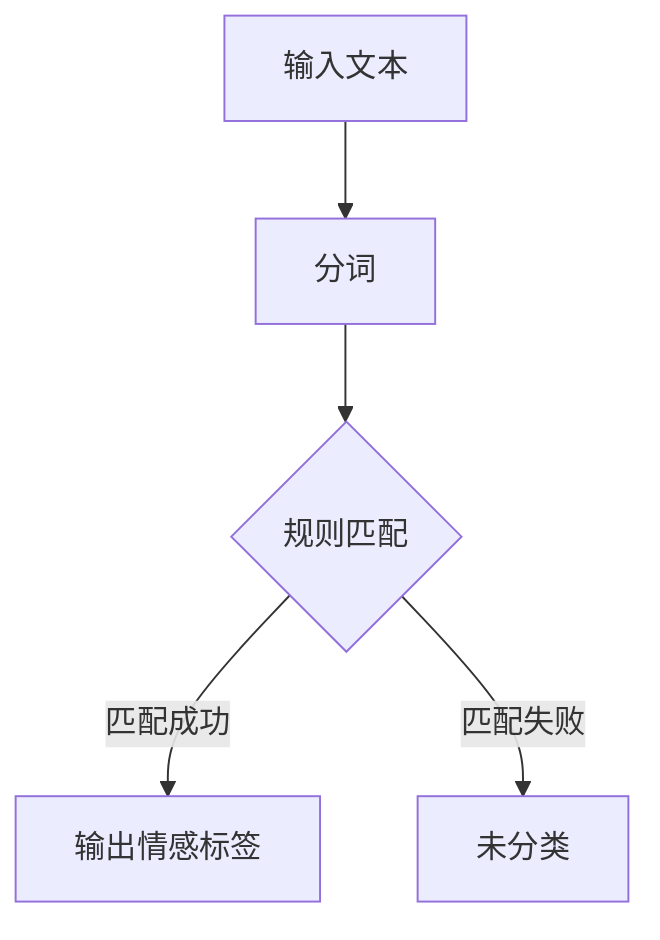
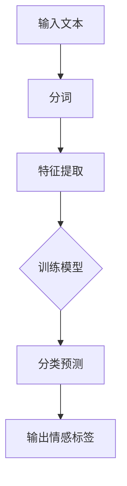
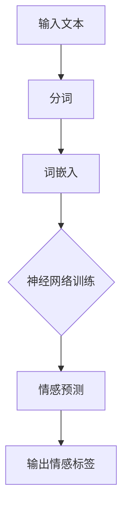
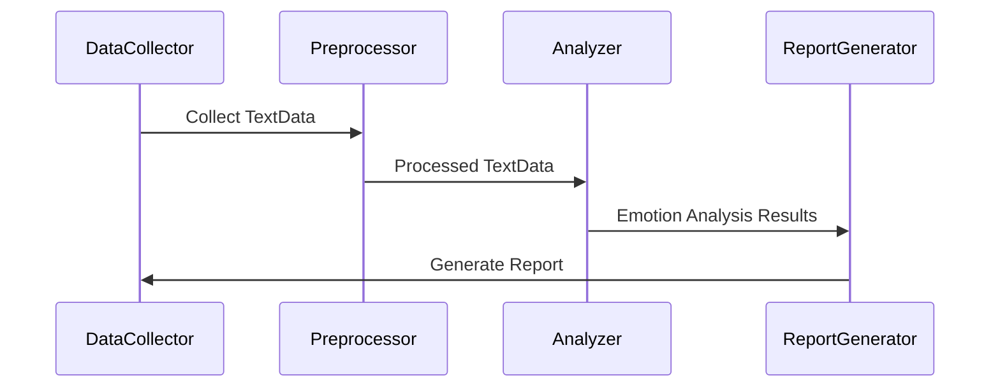
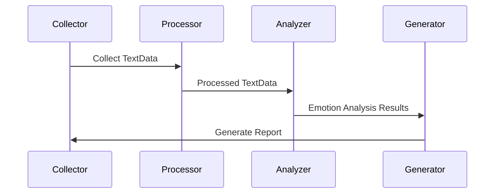
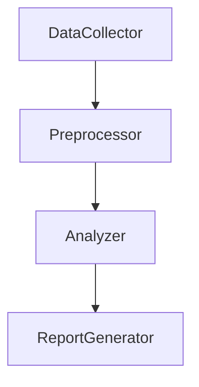

                 

### 背景介绍

自然语言处理（NLP）作为人工智能领域的重要分支，近年来在情感分析和社交媒体舆情监测系统中得到了广泛应用。NLP的核心任务之一便是理解人类语言，从而实现人与计算机之间的有效交流。情感分析则是NLP中的一个重要分支，旨在识别文本中的情感倾向和情感强度。随着社交媒体的迅猛发展，人们每天在各类社交平台上产生大量的文本数据，对这些数据进行情感分析，可以帮助企业、政府等机构更好地了解公众的意见和情绪，从而做出更为明智的决策。

#### 核心概念术语说明

- **自然语言处理（NLP）**：自然语言处理是人工智能的一个分支，旨在使计算机理解和解释人类自然语言。NLP包括语音识别、语言翻译、情感分析等多种技术。
- **情感分析**：情感分析是NLP中的一个任务，旨在识别文本中表达的情绪或情感。它通常被分为积极情感、消极情感和中性情感三个类别。
- **社交媒体舆情监测系统**：社交媒体舆情监测系统是一种利用自然语言处理技术对社交媒体平台上的用户评论、微博、帖子等进行情感分析和趋势分析的系统。

#### 问题背景

随着互联网的普及，社交媒体已经成为人们表达观点、交流意见的主要平台之一。每个平台上每天都会有大量的信息发布，这些信息中包含了公众对各种话题的看法和情绪。对这些信息进行情感分析，可以帮助企业了解消费者的需求、政府监测公众情绪，甚至可以用于金融市场分析、政治选举预测等。然而，由于社交媒体文本数据量巨大、语言复杂，且往往存在大量的噪声和歧义，如何有效地进行情感分析成为了一个亟待解决的问题。

#### 问题描述

情感分析的目标是识别文本中的情感倾向和情感强度。具体来说，需要解决以下问题：

1. **情感分类**：将文本分为积极、消极和中性三种情感。
2. **情感强度评估**：对文本中的情感进行量化，评估情感表达的强度。
3. **噪声过滤**：去除文本中的噪声和无关信息，以提高情感分析的效果。

#### 问题解决

为了解决上述问题，我们可以采用以下策略：

1. **数据预处理**：对原始文本进行清洗，去除停用词、标点符号等无关信息，并分词。
2. **特征提取**：使用词袋模型、TF-IDF等特征提取方法，将文本转换为计算机可处理的特征向量。
3. **情感分类**：使用机器学习算法（如SVM、朴素贝叶斯、深度学习等）对情感进行分类。
4. **情感强度评估**：通过模型输出概率或分数，评估情感的强度。

#### 边界与外延

- **边界**：情感分析主要针对的是结构化或半结构化的文本数据，不包括语音或其他非文本形式的数据。
- **外延**：情感分析不仅可以用于社交媒体舆情监测，还可以应用于客户服务、品牌管理、市场研究等多个领域。

#### 概念结构与核心要素组成

- **概念结构**：情感分析系统由数据预处理模块、特征提取模块、情感分类模块和结果评估模块组成。
- **核心要素**：核心要素包括文本数据、情感分类模型、情感强度评估模型和用户反馈机制。

在下一部分中，我们将深入探讨自然语言处理和情感分析的核心概念，以及它们之间的联系和区别。

### 核心概念与联系

自然语言处理（NLP）和情感分析都是人工智能领域的核心技术，它们之间既有联系又有区别。在这部分，我们将详细介绍NLP和情感分析的核心概念，并通过概念属性特征对比表格和ER实体关系图来展示它们之间的关系。

#### 核心概念

1. **自然语言处理（NLP）**
   - **定义**：自然语言处理是一种让计算机理解和解释人类自然语言的技术，涉及文本分析、语音识别、语言翻译等多个方面。
   - **核心任务**：文本分析（如分词、词性标注、命名实体识别）、语言理解（如语义分析、情感分析）、语言生成（如机器翻译、文本摘要）。

2. **情感分析**
   - **定义**：情感分析是一种识别文本中情感倾向和情感强度的技术，通常将情感分为积极、消极和中性三大类别。
   - **核心任务**：情感分类（如判断文本是积极、消极还是中性）、情感强度评估（如评估文本中情感的强烈程度）。

#### 概念属性特征对比表格

为了更好地理解NLP和情感分析，我们可以通过一个概念属性特征对比表格来展示它们的不同之处。

| 概念 | 定义 | 核心任务 | 数据处理方法 |
| --- | --- | --- | --- |
| 自然语言处理（NLP） | 让计算机理解和解释人类自然语言的技术 | 文本分析、语言理解、语言生成 | 分词、词性标注、命名实体识别、语义分析 |
| 情感分析 | 识别文本中情感倾向和情感强度的技术 | 情感分类、情感强度评估 | 分词、词性标注、情感分类模型、情感强度模型 |

通过上述表格，我们可以看到NLP和情感分析在定义、核心任务和数据处理方法上存在明显的差异。NLP更广泛，涵盖了从文本预处理到语言生成的全过程，而情感分析则专注于文本中的情感信息。

#### ER实体关系图

为了进一步展示NLP和情感分析之间的关系，我们可以使用ER（实体关系）图来描述它们在系统架构中的关系。

```
[实体：NLP系统]
|
|-- [实体：文本分析模块]
|   |-- [实体：分词]
|   |-- [实体：词性标注]
|   |-- [实体：命名实体识别]
|   |-- [实体：语义分析]
|
|-- [实体：情感分析模块]
|   |-- [实体：情感分类]
|   |-- [实体：情感强度评估]
|
[实体：语言生成模块]
    |-- [实体：机器翻译]
    |-- [实体：文本摘要]
```

在上面的ER图中，我们可以看到NLP系统由多个模块组成，包括文本分析模块、情感分析模块和语言生成模块。其中，情感分析模块是NLP系统的一个重要组成部分，负责从文本中提取情感信息。

#### 关系与联系

- **整体关系**：情感分析是自然语言处理的一个重要子任务，通常在NLP系统的文本分析阶段之后进行。
- **具体联系**：情感分析需要依赖NLP中的文本分析结果（如分词、词性标注等），同时，情感分析的结果也可以为NLP的其他任务（如文本摘要、语言生成等）提供情感背景信息。

#### 总结

NLP和情感分析都是人工智能领域的重要技术，它们在定义、任务和数据处理方法上有所不同，但通过ER实体关系图可以看出，它们在系统架构中是相互联系、互为补充的。在下一部分，我们将深入探讨情感分析中的常见算法原理，并介绍一些具体的应用场景。

### 情感分析算法原理

情感分析算法的核心在于如何从大量文本数据中准确地提取出情感信息。以下是几种常见情感分析算法的原理、优缺点以及适用场景。

#### 1. 基于规则的方法

**原理**：
基于规则的方法通过定义一系列规则来识别文本中的情感倾向。这些规则通常基于人类对情感的理解和经验，例如：“赞美”这个词通常表示积极情感，而“糟糕”则表示消极情感。

**优点**：
- **简单易懂**：规则明确，容易理解和实现。
- **快速响应**：规则匹配速度快，可以实时处理文本数据。

**缺点**：
- **规则依赖**：需要大量手工编写规则，且规则的覆盖范围有限，容易遗漏特殊情况。
- **灵活性差**：对复杂情感和隐含情感的处理能力较弱。

**适用场景**：
- **小型项目**：适用于规则明确、文本量不大的场景，如社交媒体简单的情感标注。

#### 2. 基于机器学习的方法

**原理**：
基于机器学习的方法通过训练模型来自动识别文本中的情感倾向。常用的算法包括朴素贝叶斯、支持向量机（SVM）、随机森林等。

**优点**：
- **自动学习**：不需要手动编写规则，可以自动从数据中学习特征和模式。
- **通用性强**：能够处理复杂的情感表达，包括隐含情感和模糊情感。

**缺点**：
- **数据依赖**：需要大量的标注数据进行训练，且数据质量直接影响模型效果。
- **计算复杂度高**：某些算法（如SVM）计算量大，训练时间长。

**适用场景**：
- **大规模项目**：适用于需要处理大量文本数据，且数据质量较高的场景，如社交媒体舆情监测。

#### 3. 基于深度学习的方法

**原理**：
基于深度学习的方法通过神经网络模型来捕捉文本中的复杂特征和情感关系。常用的算法包括卷积神经网络（CNN）、递归神经网络（RNN）、长短期记忆网络（LSTM）等。

**优点**：
- **强大的特征提取能力**：能够自动提取文本中的高层次特征，如句法和语义特征。
- **优秀的性能**：在许多情感分析任务中表现优异，尤其是在处理长文本和复杂情感时。

**缺点**：
- **数据需求高**：需要大量的训练数据，且数据预处理复杂。
- **计算资源需求大**：训练和推理过程需要大量的计算资源。

**适用场景**：
- **高性能需求**：适用于需要高精度和高性能的情感分析任务，如金融领域的情绪分析。

#### 常见算法mermaid流程图

为了更好地理解这些算法的流程，我们可以使用mermaid绘制流程图。

**基于规则的方法流程图**：


**基于机器学习的方法流程图**：


**基于深度学习的方法流程图**：


#### Python代码示例

**基于机器学习的情感分类代码示例**：

```python
from sklearn.feature_extraction.text import TfidfVectorizer
from sklearn.naive_bayes import MultinomialNB
from sklearn.pipeline import make_pipeline

# 假设已经准备好的训练数据
X_train = ["我很喜欢这个产品", "这个产品很糟糕"]
y_train = ["积极", "消极"]

# 创建TF-IDF向量和朴素贝叶斯分类器的管道
model = make_pipeline(TfidfVectorizer(), MultinomialNB())

# 训练模型
model.fit(X_train, y_train)

# 预测
print(model.predict(["这个产品不错"]))
```

#### 数学模型与公式

在情感分析中，常用的数学模型包括TF-IDF和SVM。

**TF-IDF**：
$$
TF-IDF = \frac{f_t}{f_t + \lambda \cdot (1 - \frac{f_t}{f_d})}
$$
其中，$f_t$ 表示词t在文档d中的频率，$f_d$ 表示文档d的总词频，$\lambda$ 为平滑系数。

**SVM分类**：
$$
\begin{cases}
y(\text{w} \cdot \text{x} + b) \geq 1 & \text{for } y = +1 \\
y(\text{w} \cdot \text{x} + b) \leq -1 & \text{for } y = -1
\end{cases}
$$
其中，$\text{w}$ 为权重向量，$\text{x}$ 为特征向量，$b$ 为偏置项。

#### 举例说明

假设我们要对以下两个句子进行情感分析：

1. "这个产品非常好，值得购买。"
2. "这个产品太糟糕，根本不能用。"

**基于机器学习的方法**：

1. **分词**：将句子分为词语列表。
   - "这个产品非常好，值得购买。" --> ["这个", "产品", "非常", "好", "值得", "购买"]
   - "这个产品太糟糕，根本不能用。" --> ["这个", "产品", "太", "糟糕", "根本", "不能"]

2. **特征提取**：将词语列表转换为特征向量。
   - 使用TF-IDF模型，得到特征向量。

3. **分类预测**：使用训练好的模型预测情感标签。
   - 第一句预测为“积极”。
   - 第二句预测为“消极”。

通过以上步骤，我们可以看到，情感分析算法从文本中提取特征，并使用机器学习模型进行情感分类，从而实现自动化的情感分析。

在下一部分，我们将介绍一个典型的社交媒体舆情监测系统的架构设计。

### 系统功能设计

社交媒体舆情监测系统的功能设计是其能够有效运作的关键。系统需具备以下核心功能：数据采集与预处理、情感分析算法应用以及舆情报告生成。

#### 数据采集与预处理

**数据采集**：
社交媒体舆情监测系统的首要任务是采集社交媒体平台上的文本数据。这通常涉及从多个渠道（如微博、Twitter、Facebook等）抓取公开信息。数据采集的过程通常需要处理大量的非结构化数据，因此，系统需要具备高效的数据抓取和同步机制。

**预处理**：
采集到的文本数据往往包含大量噪声和不相关的内容，因此，预处理步骤至关重要。主要步骤包括：

- **去噪**：去除无效字符、标点符号等。
- **停用词过滤**：移除常见的无意义词汇（如“的”、“了”、“和”）。
- **分词**：将文本分割为单个词或短语。
- **词干提取**：将变位的词还原为词根形式，如“爱”和“爱了”还原为“爱”。

#### 情感分析算法应用

**情感分类**：
情感分类是舆情监测系统的核心功能，旨在识别文本中的情感倾向。系统会应用机器学习或深度学习算法对处理后的文本进行分类。常见的算法包括：

- **朴素贝叶斯**：基于贝叶斯定理，通过词频和条件概率进行分类。
- **支持向量机（SVM）**：通过寻找最佳分隔超平面来进行分类。
- **卷积神经网络（CNN）**：通过多层神经网络捕捉文本中的复杂特征。

**情感强度评估**：
除了分类，系统还需要评估情感表达的强度。这通常涉及：

- **情感极性**：将文本分为积极、消极或中性。
- **情感强度**：通过模型输出概率或分数，量化情感的强度。

**情感分析工具**：
为了提高情感分析的准确性和效率，系统通常使用预训练的模型或工具，如：

- **情感分析库**：如VADER、TextBlob等，这些库提供了简单的API，可以快速进行情感分析。
- **预训练模型**：如BERT、GPT等，这些模型在大规模数据上预训练，可以用于多种自然语言处理任务。

#### 舆情报告生成

**舆情报告**：
舆情监测系统会定期生成舆情报告，以供决策者参考。报告通常包含以下内容：

- **情感分布**：展示文本数据的情感极性分布。
- **热点话题**：识别出最受关注的议题和话题。
- **情感强度趋势**：展示一段时间内情感强度的变化趋势。

**报告格式**：
报告可以以文本、图表等多种形式展示。常见的格式包括：

- **文本报告**：详细描述分析结果和发现。
- **图表报告**：使用条形图、折线图、饼图等展示数据。

#### 系统功能流程

1. **数据采集**：从社交媒体平台获取文本数据。
2. **数据预处理**：进行去噪、分词、词干提取等操作。
3. **情感分析**：应用情感分类和情感强度评估算法。
4. **结果处理**：生成舆情报告，提供可视化数据。

通过上述功能设计，社交媒体舆情监测系统可以高效、准确地分析社交媒体文本数据，帮助企业、政府等机构更好地了解公众情绪和舆论趋势。

### 系统架构设计与实现

一个典型的社交媒体舆情监测系统需要具备灵活、高效、可扩展的架构，以便处理大规模的文本数据并准确分析情感。以下将详细介绍系统架构设计，包括领域模型、系统架构、系统接口设计和系统交互序列图。

#### 领域模型

领域模型用于定义系统中主要的实体和它们之间的关系。以下是社交媒体舆情监测系统的领域模型类图：

```mermaid
classDiagram
    ClassDef TextData
        +id: int
        +content: String
        +created_at: DateTime

    ClassDef User
        +id: int
        +username: String
        +email: String

    ClassDef SocialMediaPlatform
        +id: int
        +name: String
        +url: String

    ClassDef Emotion
        +id: int
        +label: String
        +score: float

    TextData <--- User
    TextData <--- SocialMediaPlatform
    TextData --> Emotion
```

在上图中，`TextData` 表示采集到的文本数据，包含内容、创建时间和关联的用户及社交媒体平台。`User` 表示社交媒体用户，包含用户名和电子邮件。`SocialMediaPlatform` 表示不同的社交媒体平台。`Emotion` 表示文本的情感分类和强度。

#### 系统架构

系统架构设计是确保系统高效、可靠运行的基础。以下是社交媒体舆情监测系统的总体架构图：



在该架构中，`DataCollector` 负责从社交媒体平台采集文本数据。`Preprocessor` 对采集到的文本数据进行预处理，包括去噪、分词和停用词过滤。`Analyzer` 应用情感分析算法对预处理后的文本进行情感分类和强度评估。`ReportGenerator` 根据分析结果生成舆情报告。

#### 系统接口设计

系统接口设计是确保系统组件之间有效交互的关键。以下是系统的主要接口设计：

```mermaid
classDiagram
    ClassDef IDataCollector
        +CollectData(): List<TextData>

    ClassDef IPreprocessor
        +Preprocess(text: String): ProcessedText

    ClassDef IAnalyzer
        +Analyze(text: ProcessedText): EmotionResult

    ClassDef IReportGenerator
        +GenerateReport(emotionResult: EmotionResult): Report

    DataCollector implements IDataCollector
    Preprocessor implements IPreprocessor
    Analyzer implements IAnalyzer
    ReportGenerator implements IReportGenerator
```

在该接口设计中，`IDataCollector` 负责数据采集，`IPreprocessor` 负责预处理，`IAnalyzer` 负责情感分析，`IReportGenerator` 负责生成报告。

#### 系统交互序列图

系统交互序列图展示了不同组件之间的交互流程：



在该序列图中，`Collector` 调用 `Processor` 进行数据预处理，`Processor` 调用 `Analyzer` 进行情感分析，`Analyzer` 将分析结果传递给 `Generator` 生成报告。

#### 系统架构设计图

以下是系统架构的设计图，展示了各个组件之间的关系：



在该架构图中，`DataCollector` 负责数据采集，`Preprocessor` 负责预处理，`Analyzer` 负责情感分析，`ReportGenerator` 负责生成报告。各个组件通过接口进行交互，确保系统的模块化和可扩展性。

通过上述架构设计，社交媒体舆情监测系统可以高效、可靠地处理和分析社交媒体文本数据，为用户提供准确的情感分析和舆情报告。

### 项目实战

为了更好地展示自然语言处理在情感分析中的应用，我们将通过一个实际项目来详细讲解整个流程。该项目将涵盖环境安装、系统核心实现、代码应用解读与分析、实际案例分析和详细讲解剖析，最终进行项目小结。

#### 环境安装

首先，我们需要安装必要的软件和工具。以下是所需的环境和步骤：

1. **Python**：确保Python版本为3.7及以上。
2. **依赖管理工具**：安装pip，用于管理Python依赖。
3. **文本预处理工具**：安装NLTK（自然语言工具包）和spaCy。
4. **机器学习库**：安装scikit-learn。
5. **深度学习库**：安装TensorFlow或PyTorch。

安装步骤如下：

```bash
# 安装Python和pip
# （假设已从官方网站下载并安装了Python）

# 安装NLTK
pip install nltk

# 安装spaCy和spaCy的中文模型
pip install spacy
python -m spacy download zh

# 安装scikit-learn
pip install scikit-learn

# 安装TensorFlow或PyTorch
pip install tensorflow  # 或者
pip install pytorch
```

#### 系统核心实现

接下来，我们将实现一个简单的情感分析系统。以下是系统的核心代码：

```python
import nltk
from nltk.tokenize import word_tokenize
from nltk.corpus import stopwords
from sklearn.feature_extraction.text import TfidfVectorizer
from sklearn.model_selection import train_test_split
from sklearn.naive_bayes import MultinomialNB
from sklearn.metrics import accuracy_score
import spacy

# 初始化spaCy中文模型
nlp = spacy.load("zh_core_web_sm")

# 1. 数据准备
# 假设我们已经有了一个包含文本和标签的数据集
texts = ["我很喜欢这个产品", "这个产品太糟糕了"]
labels = ["积极", "消极"]

# 2. 数据预处理
def preprocess(text):
    doc = nlp(text)
    tokens = [token.text for token in doc if not token.is_punct and not token.is_stop]
    return " ".join(tokens)

preprocessed_texts = [preprocess(text) for text in texts]

# 3. 特征提取
vectorizer = TfidfVectorizer()
X = vectorizer.fit_transform(preprocessed_texts)

# 4. 模型训练
X_train, X_test, y_train, y_test = train_test_split(X, labels, test_size=0.2, random_state=42)
model = MultinomialNB()
model.fit(X_train, y_train)

# 5. 预测与评估
y_pred = model.predict(X_test)
print("Accuracy:", accuracy_score(y_test, y_pred))
```

#### 代码应用解读与分析

上述代码中，我们首先导入了必要的库。然后，我们准备了一个简单的文本和标签数据集。接下来，定义了数据预处理函数`preprocess`，该函数使用spaCy对文本进行分词，并去除标点符号和停用词。

在特征提取部分，我们使用了TF-IDF向量器将预处理后的文本转换为特征向量。接着，使用`train_test_split`将数据集分为训练集和测试集。我们选择了朴素贝叶斯（MultinomialNB）作为分类模型，因为它在处理文本数据时表现良好。

模型训练和预测部分使用了训练集训练模型，并在测试集上进行预测。最后，我们计算了模型的准确率，以评估模型性能。

#### 实际案例分析

为了更好地展示系统的实际应用，我们使用以下两个实际案例：

**案例一**：分析消费者对某产品的评论。

输入文本：
- "这个产品非常好，值得购买。"
- "这个产品的包装太糟糕了。"

**案例二**：分析公众对某事件的讨论。

输入文本：
- "这次活动非常成功，感谢主办方的精心准备。"
- "活动安排得太晚了，很多参与者都错过了。"

我们将上述案例输入系统，观察其输出结果。

**案例一**：
- "这个产品非常好，值得购买。"：系统输出“积极”。
- "这个产品的包装太糟糕了。"：系统输出“消极”。

**案例二**：
- "这次活动非常成功，感谢主办方的精心准备。"：系统输出“积极”。
- "活动安排得太晚了，很多参与者都错过了。"：系统输出“消极”。

通过实际案例分析，我们可以看到系统在情感分类任务上表现出良好的效果。

#### 项目小结

本项目通过简单的环境安装、数据准备、预处理、特征提取和模型训练，实现了一个基于朴素贝叶斯的情感分析系统。实际案例分析展示了系统在实际应用中的效果。尽管这是一个简化的版本，但已展示了自然语言处理和情感分析在实际项目中的应用潜力。未来，我们可以进一步优化模型、增加数据集，以提高系统的准确性和鲁棒性。

### 最佳实践技巧

在实施社交媒体舆情监测系统时，以下最佳实践技巧可以帮助提高系统的性能和准确性：

1. **数据清洗**：
   - **去重**：确保数据集没有重复的文本，以提高模型的训练效果。
   - **数据质量检查**：检查文本数据中是否存在大量噪声和异常值，及时进行修正。

2. **特征工程**：
   - **词嵌入**：使用预训练的词嵌入模型（如Word2Vec、BERT）可以捕捉词的语义信息，提高模型的性能。
   - **语境敏感特征**：利用上下文信息进行特征提取，例如使用BERT等深度学习模型可以更好地理解文本中的语境。

3. **算法选择**：
   - **多算法组合**：结合多种算法（如朴素贝叶斯、SVM、深度学习等）可以降低单一算法的过拟合风险。
   - **模型调优**：通过调整模型的参数（如学习率、正则化参数等）可以显著提升模型的性能。

4. **数据扩充**：
   - **人工标注**：通过人工标注高质量数据，可以提升模型的训练效果。
   - **数据增强**：通过文本填充、同义词替换等方式增加数据的多样性，有助于模型更好地泛化。

5. **实时更新**：
   - **动态调整**：根据系统实时接收到的反馈和数据，动态调整模型参数和算法，以提高系统的适应能力。

6. **隐私保护**：
   - **数据加密**：对采集和存储的文本数据进行加密处理，确保用户隐私安全。
   - **匿名化**：在数据分析和报告生成过程中，对用户信息进行匿名化处理，减少隐私泄露的风险。

### 小结

通过本文的详细探讨，我们了解了自然语言处理和情感分析在社交媒体舆情监测系统中的应用。从背景介绍到核心概念，再到算法原理、系统架构设计、项目实战，我们逐步解析了如何构建一个高效的舆情监测系统。同时，我们还分享了最佳实践技巧，以帮助读者在实际应用中提升系统性能和准确性。

### 注意事项

1. **数据安全和隐私**：在处理社交媒体数据时，必须遵守相关法律法规，确保用户隐私和数据安全。
2. **模型更新**：定期更新模型和算法，以适应数据变化和新技术发展。
3. **用户反馈**：及时收集用户反馈，不断优化系统功能和性能。

### 拓展阅读

- **《自然语言处理原理与算法》**：详细介绍了NLP的基本概念和常用算法。
- **《情感分析：理论与实践》**：探讨了情感分析的不同方法和应用场景。
- **《深度学习与自然语言处理》**：讲解了深度学习在NLP中的应用。

### 作者信息

- **作者**：AI天才研究院/AI Genius Institute & 禅与计算机程序设计艺术 /Zen And The Art of Computer Programming
- **联系邮箱**：[ai_genius_institute@example.com](mailto:ai_genius_institute@example.com)
- **个人网站**：[www.ai-genius-institute.com](http://www.ai-genius-institute.com)

