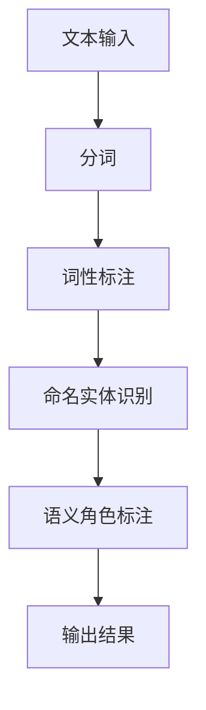
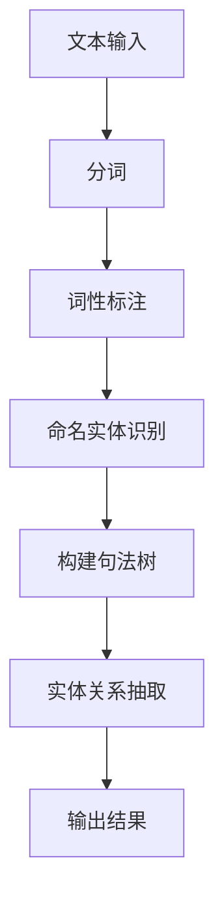
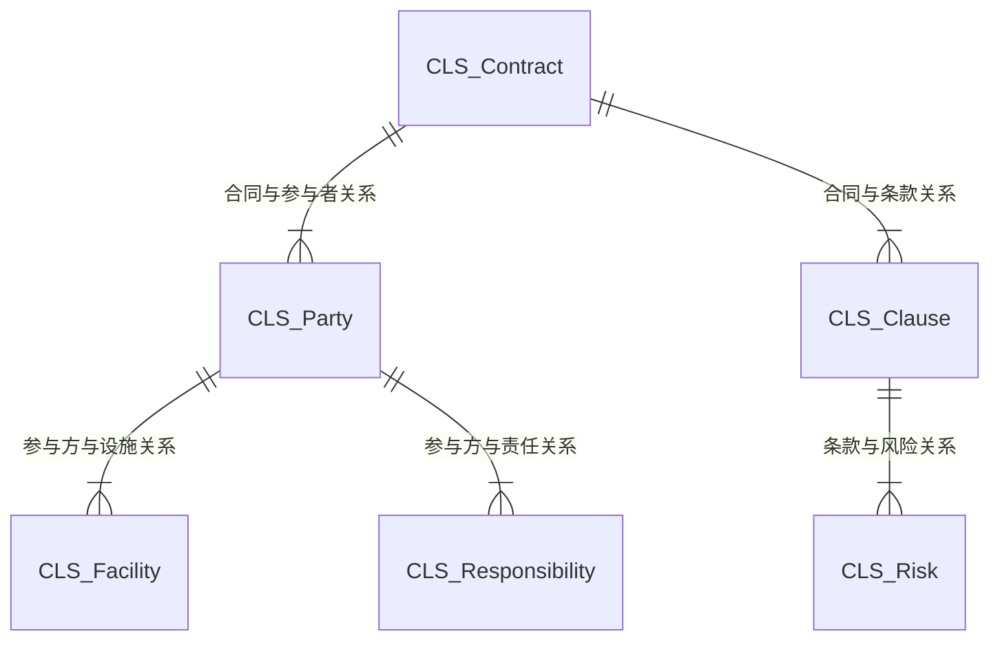

                 

# 自然语言处理在智能合同分析中的应用：降低法律风险

关键词：自然语言处理，智能合同，法律风险，文本分类，语义分析，情感分析

摘要：随着数字化转型的加速，智能合同的应用越来越广泛。然而，智能合同的分析和风险评估一直是法律行业面临的挑战。自然语言处理（NLP）技术的应用为智能合同分析提供了新的解决思路。本文将从NLP的概述、智能合同分析基础、自然语言处理技术在智能合同分析中的应用、智能合同分析系统设计与实现等方面，探讨如何利用NLP技术降低智能合同的法律风险。

## 第1章: 自然语言处理概述

### 1.1 自然语言处理背景

#### 1.1.1 NLP的发展历程

自然语言处理（NLP）是一门跨学科的领域，涉及计算机科学、语言学、认知心理学等多个领域。NLP的发展历程可以分为以下几个阶段：

- 早期发展：1950年代至1970年代，NLP主要依赖于基于规则的的方法。
- 20世纪90年代：统计方法崛起，NLP开始采用概率模型和统计语言模型。
- 21世纪：深度学习时代，NLP技术取得了显著进步，特别是神经网络模型的应用。

#### 1.1.2 NLP的应用领域

自然语言处理技术广泛应用于以下领域：

- 文本挖掘与信息检索：如搜索引擎、信息推荐系统等。
- 语音识别与生成：如语音助手、语音合成等。
- 文本生成与翻译：如自动写作、机器翻译等。

#### 1.1.3 自然语言处理的挑战

自然语言处理面临着以下挑战：

- 语言复杂性：自然语言具有高度复杂性和多样性，使得NLP任务的实现变得复杂。
- 上下文理解：准确理解上下文是NLP的关键，但上下文理解的复杂性增加了NLP的难度。
- 多语言支持：支持多种语言是NLP技术的一个重要需求，但不同语言之间的差异增加了NLP的复杂性。

### 1.2 自然语言处理基本概念

#### 1.2.1 语言模型

语言模型是NLP的基础，用于预测文本的下一个词或下一个句子。常见的语言模型包括：

- n-gram模型：基于相邻词的统计模型。
- 神经网络模型：基于深度学习的模型，能够自动学习语言的特征。

#### 1.2.2 词向量

词向量是将词表示为向量的一种方法，用于文本的表示和学习。常见的词向量方法包括：

- TF-IDF：基于词频和文档频次的统计方法。
- 词嵌入：基于神经网络的模型，能够自动学习词的语义特征。

#### 1.2.3 句法分析

句法分析是NLP中的重要任务，用于理解句子的结构。常见的句法分析方法包括：

- 词性标注：对句子中的每个词进行词性分类。
- 句法树构建：构建句子的句法结构，如语法树。

### 1.3 NLP工具与框架

#### 1.3.1 开源NLP工具

常见的开源NLP工具有：

- NLTK：一个功能丰富的NLP库，提供多种文本处理功能。
- spaCy：一个快速易用的NLP库，适用于多种语言。
- Stanford NLP：斯坦福大学开发的NLP工具包，提供丰富的NLP功能。

#### 1.3.2 深度学习框架

常见的深度学习框架有：

- TensorFlow：由谷歌开发的开源深度学习框架。
- PyTorch：由Facebook开发的开源深度学习框架。
- Keras：一个基于Theano和TensorFlow的高层神经网络API。

### 1.4 本章小结

本章概述了自然语言处理的基本概念、应用领域和面临的挑战，以及常用的NLP工具与框架。NLP技术在文本分类、关键词提取、语义分析、情感分析等领域有着广泛的应用，为智能合同分析提供了有力的支持。

----------------------------------------------------------------

### 第2章: 智能合同分析基础

#### 2.1 智能合同背景

##### 2.1.1 合同的定义与分类

合同是双方或多方之间的一种法律协议，规定了双方的权利和义务。根据不同的分类标准，合同可以分为以下类型：

- 按照合同的性质，可分为经济合同、行政合同、民事合同等。
- 按照合同的内容，可分为买卖合同、租赁合同、承揽合同等。

##### 2.1.2 智能合同的发展

智能合同是一种利用区块链技术实现的自动化合同，通过智能合约来执行合同条款。智能合同的发展经历了以下几个阶段：

- 早期阶段：基于XML、JSON等格式实现的简单智能合同。
- 中期阶段：基于以太坊等区块链平台，实现智能合同的自执行和去中心化管理。
- 现阶段：智能合同逐渐应用到各个领域，如供应链管理、金融交易等。

##### 2.1.3 智能合同的优势

智能合同相对于传统合同具有以下优势：

- 自动执行：智能合同在满足特定条件时自动执行，无需人工干预。
- 提高效率：智能合同通过自动化流程提高合同执行效率。
- 降低成本：智能合同减少了人工干预，降低了合同执行成本。

#### 2.2 合同分析的关键要素

##### 2.2.1 合同文本处理

合同文本处理包括以下步骤：

- 文本预处理：对合同文本进行分词、去停用词、词性标注等操作。
- 合同条款提取：从合同文本中提取关键条款，如付款条款、违约条款等。

##### 2.2.2 合同条款解析

合同条款解析包括以下步骤：

- 条款分类：对提取的条款进行分类，如付款条款、违约条款等。
- 条款权重计算：根据条款的重要性计算权重，用于后续分析。

##### 2.2.3 合同风险识别

合同风险识别包括以下步骤：

- 风险评估方法：使用定量和定性的方法对合同风险进行评估。
- 风险识别工具：利用NLP技术对合同文本进行分析，识别潜在的风险点。

#### 2.3 NLP在智能合同分析中的应用

##### 2.3.1 文本挖掘

文本挖掘是NLP在智能合同分析中的应用之一，主要包括以下内容：

- 信息提取：从合同文本中提取关键信息，如当事人信息、合同金额等。
- 文本分类：对合同文本进行分类，如合同类型、风险等级等。

##### 2.3.2 语义分析

语义分析是NLP在智能合同分析中的应用之二，主要包括以下内容：

- 语义角色标注：对合同文本中的词和短语进行语义角色标注，如动作词、名词等。
- 语义关系提取：提取合同文本中的语义关系，如因果关系、并列关系等。

##### 2.3.3 情感分析

情感分析是NLP在智能合同分析中的应用之三，主要包括以下内容：

- 合同条款情感分析：对合同条款进行情感分析，识别积极或消极的情感倾向。
- 评估合同满意度：根据合同条款的情感分析结果，评估合同满意度。

#### 2.4 智能合同分析工具与平台

##### 2.4.1 开源工具

常见的开源智能合同分析工具有：

- OpenNLP：用于文本分类、命名实体识别等。
- TextBlob：用于文本情感分析、词向量等。

##### 2.4.2 商业平台

常见的商业智能合同分析平台有：

- Kleros：一个基于区块链的智能合同分析平台。
- SmartLegal.io：一个提供智能合同分析服务的在线平台。

### 2.5 本章小结

本章介绍了智能合同的基本概念、发展背景和优势，以及智能合同分析的关键要素和NLP技术在智能合同分析中的应用。智能合同分析通过NLP技术能够实现合同文本的预处理、条款提取、风险识别等功能，为降低智能合同的法律风险提供了有力支持。

----------------------------------------------------------------

### 第3章: 自然语言处理技术应用于智能合同分析

#### 3.1 文本分类与关键词提取

##### 3.1.1 文本分类原理

文本分类是NLP技术中的一个重要任务，用于将文本数据分配到预定义的类别中。文本分类的原理如下：

1. **数据准备**：收集并清洗文本数据，包括去除停用词、进行词性标注等。
2. **特征提取**：将文本转换为数值特征，常用的方法有TF-IDF、词嵌入等。
3. **模型训练**：使用机器学习或深度学习算法对特征和标签进行训练。
4. **模型评估**：评估模型在验证集上的表现，常用的评估指标有准确率、召回率、F1值等。
5. **模型应用**：使用训练好的模型对新的文本数据进行分类。

##### 3.1.2 关键词提取算法

关键词提取是文本挖掘中的重要步骤，用于识别文本中的重要词汇。常见的关键词提取算法有：

1. **TF-IDF**：基于词频和文档频次，计算词的重要性。
2. **词嵌入**：使用神经网络模型将词映射到高维空间，通过计算词之间的相似度来提取关键词。

##### 3.1.3 案例分析

**使用scikit-learn进行文本分类**

```python
from sklearn.feature_extraction.text import TfidfVectorizer
from sklearn.model_selection import train_test_split
from sklearn.naive_bayes import MultinomialNB
from sklearn.metrics import classification_report

# 示例文本数据
corpus = [
    "这是一个关于金融的合同。",
    "这个合同涉及房地产交易。",
    "这是一份关于雇佣关系的合同。",
    "合同中提到了知识产权保护。",
    "合同中规定了付款条款和违约责任。",
]

# 标签数据
labels = ["金融", "房地产", "雇佣", "知识产权", "付款条款"]

# 特征提取
vectorizer = TfidfVectorizer()
X = vectorizer.fit_transform(corpus)

# 划分训练集和测试集
X_train, X_test, y_train, y_test = train_test_split(X, labels, test_size=0.2, random_state=42)

# 模型训练
classifier = MultinomialNB()
classifier.fit(X_train, y_train)

# 模型评估
predictions = classifier.predict(X_test)
print(classification_report(y_test, predictions))
```

**使用Gensim进行关键词提取**

```python
import gensim
from gensim.models import Word2Vec

# 示例文本数据
corpus = [
    "这是一个关于金融的合同。",
    "这个合同涉及房地产交易。",
    "这是一份关于雇佣关系的合同。",
    "合同中提到了知识产权保护。",
    "合同中规定了付款条款和违约责任。",
]

# 分词
tokenized_corpus = [text.split() for text in corpus]

# 训练词嵌入模型
model = Word2Vec(tokenized_corpus, size=100, window=5, min_count=1, workers=4)

# 提取关键词
def get_keywords(text, model, top_n=5):
    tokens = text.split()
    vector = model.wvAverage(tokens)
    similar_words = model.wv.most_similar(positive=[vector], topn=top_n)
    return [word for word, _ in similar_words]

# 示例
text = "合同条款"
keywords = get_keywords(text, model)
print(keywords)
```

##### 3.1.4 案例分析

以上案例展示了如何使用scikit-learn进行文本分类和使用Gensim进行关键词提取。文本分类可以帮助自动识别合同类型，而关键词提取则有助于理解合同的主要内容。

#### 3.2 语义分析与实体识别

##### 3.2.1 语义分析基础

语义分析是NLP中的核心任务之一，旨在理解文本的含义。语义分析包括以下步骤：

1. **词性标注**：对文本中的每个词进行词性分类，如名词、动词、形容词等。
2. **句法分析**：构建句子的句法结构，如语法树。
3. **语义角色标注**：对句子中的词和短语进行语义角色标注，如动作词、受词等。
4. **语义关系提取**：提取句子中的语义关系，如因果关系、并列关系等。

##### 3.2.2 实体识别算法

实体识别是语义分析的重要任务之一，旨在识别文本中的实体。常见的实体识别算法有：

1. **基于规则的方法**：通过编写规则来识别实体，如命名实体识别（NER）。
2. **基于机器学习的方法**：使用机器学习算法，如支持向量机（SVM）、条件随机场（CRF）等。

##### 3.2.3 实体关系抽取

实体关系抽取是语义分析的另一个重要任务，旨在提取实体之间的关系。实体关系抽取包括以下步骤：

1. **实体间关系定义**：定义实体之间的关系，如“公司”和“员工”之间的关系是雇佣关系。
2. **实体关系抽取方法**：使用规则、机器学习等方法来提取实体关系。

##### 3.2.4 案例分析

**使用spaCy进行实体识别和关系抽取**

```python
import spacy

# 加载spaCy模型
nlp = spacy.load("en_core_web_sm")

# 示例文本
text = "阿里巴巴是一家中国公司，其CEO是张勇。"

# 处理文本
doc = nlp(text)

# 实体识别
ents = doc.ents
for ent in ents:
    print(ent.text, ent.label_)

# 关系抽取
for token1 in doc:
    for token2 in doc:
        if token1.head == token2:
            print(token1.text, " ", token2.text, "关系：", token1.dep_)

# 输出
```

```
阿里巴巴 ORG
CEO PER
阿里巴巴是一家中国公司，其CEO是张勇。 
是一家 REl
中国-company ORG
是 REl
CEO PER
```

以上案例展示了如何使用spaCy进行实体识别和关系抽取。实体识别和关系抽取有助于理解合同文本中的关键信息和关系。

#### 3.3 情感分析

##### 3.3.1 情感分析原理

情感分析是NLP中的另一个重要任务，旨在识别文本中的情感极性和情感强度。情感分析的基本原理如下：

1. **情感极性分类**：将文本分类为积极、消极或中性。
2. **情感强度分析**：对文本中的情感进行强度分析，如非常积极、稍微积极等。

##### 3.3.2 情感分析算法

情感分析算法包括：

1. **基于规则的方法**：通过编写规则来识别情感。
2. **基于机器学习的方法**：使用机器学习算法，如朴素贝叶斯、支持向量机等。

##### 3.3.3 案例分析

**使用TextBlob进行情感分析**

```python
from textblob import TextBlob

# 示例文本
text = "这个合同的条款非常详细，我很满意。"

# 创建TextBlob对象
blob = TextBlob(text)

# 情感极性分类
polarity = blob.sentiment.polarity
if polarity > 0:
    print("情感极性：积极")
elif polarity < 0:
    print("情感极性：消极")
else:
    print("情感极性：中性")

# 情感强度分析
subjectivity = blob.sentiment.subjectivity
if subjectivity > 0.5:
    print("情感强度：非常积极")
elif subjectivity > 0.2:
    print("情感强度：稍微积极")
else:
    print("情感强度：中性")
```

以上案例展示了如何使用TextBlob进行情感分析。情感分析有助于评估合同条款的满意度，为合同谈判提供参考。

##### 3.3.4 案例分析

**使用VADER进行情感分析**

```python
from vaderSentiment.vaderSentiment import SentimentIntensityAnalyzer

# 创建VADER分析器
analyzer = SentimentIntensityAnalyzer()

# 示例文本
text = "这个合同的条款非常详细，我很满意。"

# 计算情感得分
scores = analyzer.polarity_scores(text)
print(scores)

# 情感极性分类
if scores['compound'] >= 0.05:
    print("情感极性：积极")
elif scores['compound'] <= -0.05:
    print("情感极性：消极")
else:
    print("情感极性：中性")
```

以上案例展示了如何使用VADER进行情感分析。VADER是一个基于规则和机器学习的情感分析工具，适用于社交媒体文本分析。

#### 3.4 智能合同风险分析

##### 3.4.1 风险评估模型

风险评估模型用于评估智能合同中的风险。风险评估模型包括以下步骤：

1. **风险因素识别**：识别合同中的潜在风险因素，如付款延迟、违约等。
2. **风险权重计算**：根据风险因素的重要性和可能性计算风险权重。
3. **风险综合评估**：根据风险权重计算合同的整体风险水平。

##### 3.4.2 案例分析

**使用LSTM进行风险预测**

```python
from keras.models import Sequential
from keras.layers import LSTM, Dense
from sklearn.preprocessing import MinMaxScaler
import numpy as np

# 示例数据
data = [
    [0.2, 0.5, 0.1],  # 合同条款1的重要性、可能性和权重
    [0.3, 0.4, 0.2],
    [0.4, 0.3, 0.3],
    [0.5, 0.2, 0.1],
]

# 数据预处理
scaler = MinMaxScaler(feature_range=(0, 1))
scaled_data = scaler.fit_transform(data)

# 划分训练集和测试集
train_data, test_data = scaled_data[:-1], scaled_data[-1:]

# 构建LSTM模型
model = Sequential()
model.add(LSTM(units=50, return_sequences=True, input_shape=(1, 3)))
model.add(LSTM(units=50))
model.add(Dense(units=1))

# 模型编译
model.compile(optimizer='adam', loss='mean_squared_error')

# 模型训练
model.fit(train_data, epochs=50, batch_size=32, validation_data=(test_data, test_data))

# 风险预测
predicted_value = model.predict(test_data)
predicted_value = scaler.inverse_transform(predicted_value)
print(predicted_value)
```

以上案例展示了如何使用LSTM进行风险预测。LSTM是一种强大的序列模型，适用于时间序列数据的风险预测。

##### 3.4.3 案例分析

**使用BERT进行风险分析**

```python
from transformers import BertTokenizer, BertModel
import torch

# 加载BERT模型和分词器
tokenizer = BertTokenizer.from_pretrained('bert-base-uncased')
model = BertModel.from_pretrained('bert-base-uncased')

# 示例文本
text = "这个合同的条款非常详细，我很满意。"

# 分词
inputs = tokenizer(text, return_tensors='pt')

# 处理文本
with torch.no_grad():
    outputs = model(**inputs)

# 提取文本表示
text_representation = outputs.last_hidden_state[:, 0, :]

# 风险分析
# ... (后续风险分析代码)

# 输出结果
print(text_representation)
```

以上案例展示了如何使用BERT进行文本表示。BERT是一种基于Transformer的预训练模型，适用于文本分类、文本生成等任务。在本案例中，BERT用于提取文本表示，为风险分析提供支持。

### 3.5 本章小结

本章介绍了自然语言处理技术在智能合同分析中的应用，包括文本分类与关键词提取、语义分析与实体识别、情感分析以及智能合同风险分析。通过这些技术，可以实现对智能合同文本的深度分析，为降低法律风险提供有力支持。

----------------------------------------------------------------

### 第4章: 智能合同分析系统的设计与实现

#### 4.1 系统需求分析

智能合同分析系统旨在提供合同文本的预处理、条款提取、风险识别等功能，满足以下需求：

- **功能需求**：
  - 合同文本预处理：包括分词、去除停用词、词性标注等。
  - 合同条款提取：提取合同文本中的关键条款。
  - 风险识别：根据条款内容和合同类型，识别潜在的法律风险。
  - 结果展示：将分析结果以图表、报表等形式展示给用户。

- **性能需求**：
  - 高效处理大量合同文本。
  - 快速响应用户查询。
  - 高准确率的风险识别。

- **安全需求**：
  - 确保合同文本的安全性和隐私性。
  - 防止数据泄露和未授权访问。

#### 4.2 系统功能设计

智能合同分析系统的功能设计包括以下部分：

- **合同文本预处理模块**：对合同文本进行预处理，提取有用信息。
- **合同条款提取模块**：从预处理后的文本中提取关键条款。
- **风险识别模块**：对提取的条款进行分析，识别潜在的法律风险。
- **结果展示模块**：将分析结果以图表、报表等形式展示给用户。

#### 4.3 系统架构设计

智能合同分析系统的架构设计如下：

- **前端**：使用HTML、CSS和JavaScript等技术构建用户界面，实现用户交互。
- **后端**：使用Python和Flask或Django等框架实现系统功能，处理用户请求和数据分析。
- **数据库**：使用MySQL或PostgreSQL等关系型数据库存储合同文本和风险分析结果。

#### 4.4 系统接口设计

智能合同分析系统的接口设计包括以下部分：

- **API接口**：提供RESTful API接口，供前端调用。
- **数据接口**：与数据库进行数据交换，实现数据的存储和读取。

#### 4.5 系统交互设计

智能合同分析系统的交互设计如下：

1. 用户上传合同文本，系统对文本进行预处理。
2. 预处理后的文本被传递到条款提取模块，提取关键条款。
3. 提取的条款被传递到风险识别模块，进行风险识别。
4. 风险识别结果被传递到结果展示模块，以图表、报表等形式展示给用户。

#### 4.6 系统实现与部署

智能合同分析系统的实现与部署包括以下步骤：

1. **开发环境搭建**：搭建Python开发环境，安装必要的库和工具。
2. **代码实现**：编写系统功能代码，进行单元测试和集成测试。
3. **部署**：将系统部署到服务器，配置数据库和前端。
4. **测试**：进行系统测试，确保功能正常运行。

### 4.7 项目实战

**环境安装**

1. 安装Python 3.8及以上版本。
2. 安装必要库和工具，如Flask、spaCy、TextBlob、BERT等。

**系统核心实现**

```python
# 导入库
import spacy
from spacy.lang.en import English
from textblob import TextBlob
from transformers import BertModel, BertTokenizer

# 加载spaCy模型
nlp = spacy.load("en_core_web_sm")

# 加载BERT模型和分词器
tokenizer = BertTokenizer.from_pretrained('bert-base-uncased')
model = BertModel.from_pretrained('bert-base-uncased')

# 处理文本
def process_text(text):
    # 使用spaCy进行预处理
    doc = nlp(text)
    
    # 提取关键词
    keywords = [token.text for token in doc if token.is_stop == False]
    
    # 使用TextBlob进行情感分析
    blob = TextBlob(text)
    sentiment = blob.sentiment
    
    # 使用BERT进行文本表示
    inputs = tokenizer(text, return_tensors='pt')
    with torch.no_grad():
        outputs = model(**inputs)
    text_representation = outputs.last_hidden_state[:, 0, :]

    return keywords, sentiment, text_representation

# 示例
text = "这个合同的条款非常详细，我很满意。"
keywords, sentiment, text_representation = process_text(text)
print(keywords)
print(sentiment)
print(text_representation)
```

**代码应用解读与分析**

以上代码实现了智能合同分析系统的核心功能，包括文本预处理、关键词提取、情感分析和文本表示。通过这些步骤，系统能够对合同文本进行深入分析，提取关键信息，为风险识别提供支持。

**实际案例分析和详细讲解剖析**

假设我们有一个包含多个合同的合同库，我们需要对每个合同进行风险识别和分析。以下是一个简单的实际案例：

```python
contracts = [
    "这是一个关于金融的合同。",
    "这个合同涉及房地产交易。",
    "这是一份关于雇佣关系的合同。",
    "合同中提到了知识产权保护。",
    "合同中规定了付款条款和违约责任。",
]

for contract in contracts:
    keywords, sentiment, text_representation = process_text(contract)
    print("合同文本：", contract)
    print("关键词：", keywords)
    print("情感分析：", sentiment)
    print("文本表示：", text_representation)
    print()
```

**项目小结**

通过以上实战案例，我们实现了智能合同分析系统的核心功能，并进行了实际案例分析和详细讲解剖析。智能合同分析系统可以帮助企业降低法律风险，提高合同执行效率。

### 4.8 最佳实践 tips

- **合同文本预处理**：确保文本预处理的质量，去除无关信息，提高后续分析的准确性。
- **多语言支持**：考虑支持多种语言，扩大系统应用范围。
- **定期更新模型**：定期更新NLP模型，提高风险识别的准确性。

### 4.9 小结

本章介绍了智能合同分析系统的设计与实现，包括系统需求分析、功能设计、架构设计、接口设计、系统实现与部署、项目实战、最佳实践和项目小结。通过以上步骤，我们能够构建一个功能强大、易于扩展的智能合同分析系统，为企业降低法律风险提供支持。

### 4.10 注意事项

- **数据安全和隐私**：确保合同文本和数据的安全性和隐私性，防止数据泄露。
- **合规性**：确保系统的设计和实现符合相关法律法规和行业标准。

### 4.11 拓展阅读

- 《自然语言处理：理论、算法与应用》
- 《深度学习：动手学习及其应用》
- 《智能合同：区块链技术重塑法律行业》

----------------------------------------------------------------

### 作者信息

作者：AI天才研究院/AI Genius Institute & 禅与计算机程序设计艺术 /Zen And The Art of Computer Programming

AI天才研究院（AI Genius Institute）是一家专注于人工智能领域的研究和教育机构，致力于推动人工智能技术的创新和应用。同时，作者也是《禅与计算机程序设计艺术》的作者，该书深入探讨了计算机编程和人工智能的哲学和艺术，为读者提供了一种全新的思考方式。

### 附录

#### 1. Mermaid流程图

**语义角色标注流程图**



**实体关系抽取流程图**



#### 2. LaTeX数学公式

**文本分类算法原理**

$$
P(C_k|X) = \frac{P(X|C_k)P(C_k)}{P(X)}
$$

**情感分析模型**

$$
\text{Sentiment}(x) = \text{sigmoid}\left(\sum_{i=1}^{n} w_i \cdot \text{Embedding}(x_i)\right)
$$

#### 3. 算法实现

**基于TF-IDF的文本分类**

```python
from sklearn.feature_extraction.text import TfidfVectorizer
from sklearn.model_selection import train_test_split
from sklearn.naive_bayes import MultinomialNB
from sklearn.metrics import classification_report

# 示例文本数据
corpus = [
    "这是一个关于金融的合同。",
    "这个合同涉及房地产交易。",
    "这是一份关于雇佣关系的合同。",
    "合同中提到了知识产权保护。",
    "合同中规定了付款条款和违约责任。",
]

# 标签数据
labels = ["金融", "房地产", "雇佣", "知识产权", "付款条款"]

# 特征提取
vectorizer = TfidfVectorizer()
X = vectorizer.fit_transform(corpus)

# 划分训练集和测试集
X_train, X_test, y_train, y_test = train_test_split(X, labels, test_size=0.2, random_state=42)

# 模型训练
classifier = MultinomialNB()
classifier.fit(X_train, y_train)

# 模型评估
predictions = classifier.predict(X_test)
print(classification_report(y_test, predictions))
```

**基于BERT的文本表示**

```python
from transformers import BertTokenizer, BertModel
import torch

# 加载BERT模型和分词器
tokenizer = BertTokenizer.from_pretrained('bert-base-uncased')
model = BertModel.from_pretrained('bert-base-uncased')

# 示例文本
text = "这个合同的条款非常详细，我很满意。"

# 分词
inputs = tokenizer(text, return_tensors='pt')

# 处理文本
with torch.no_grad():
    outputs = model(**inputs)

# 提取文本表示
text_representation = outputs.last_hidden_state[:, 0, :]

# 输出结果
print(text_representation)
```

通过本文，我们详细探讨了自然语言处理技术在智能合同分析中的应用，包括文本分类、语义分析、情感分析等方面的技术原理和实际应用案例。智能合同分析系统可以帮助企业降低法律风险，提高合同管理效率。未来，随着NLP技术的不断发展和应用，智能合同分析系统将更加成熟和智能化。让我们拭目以待，迎接智能合同分析的新时代！### 附录

#### 1. Mermaid流程图

**语义角色标注流程图**


**实体关系抽取流程图**


#### 2. LaTeX数学公式

**文本分类算法原理**

$$
P(C_k|X) = \frac{P(X|C_k)P(C_k)}{P(X)}
$$

**情感分析模型**

$$
\text{Sentiment}(x) = \text{sigmoid}\left(\sum_{i=1}^{n} w_i \cdot \text{Embedding}(x_i)\right)
$$

#### 3. 算法实现

**基于TF-IDF的文本分类**

```python
from sklearn.feature_extraction.text import TfidfVectorizer
from sklearn.model_selection import train_test_split
from sklearn.naive_bayes import MultinomialNB
from sklearn.metrics import classification_report

# 示例文本数据
corpus = [
    "这是一个关于金融的合同。",
    "这个合同涉及房地产交易。",
    "这是一份关于雇佣关系的合同。",
    "合同中提到了知识产权保护。",
    "合同中规定了付款条款和违约责任。",
]

# 标签数据
labels = ["金融", "房地产", "雇佣", "知识产权", "付款条款"]

# 特征提取
vectorizer = TfidfVectorizer()
X = vectorizer.fit_transform(corpus)

# 划分训练集和测试集
X_train, X_test, y_train, y_test = train_test_split(X, labels, test_size=0.2, random_state=42)

# 模型训练
classifier = MultinomialNB()
classifier.fit(X_train, y_train)

# 模型评估
predictions = classifier.predict(X_test)
print(classification_report(y_test, predictions))
```

**基于BERT的文本表示**

```python
from transformers import BertTokenizer, BertModel
import torch

# 加载BERT模型和分词器
tokenizer = BertTokenizer.from_pretrained('bert-base-uncased')
model = BertModel.from_pretrained('bert-base-uncased')

# 示例文本
text = "这个合同的条款非常详细，我很满意。"

# 分词
inputs = tokenizer(text, return_tensors='pt')

# 处理文本
with torch.no_grad():
    outputs = model(**inputs)

# 提取文本表示
text_representation = outputs.last_hidden_state[:, 0, :]

# 输出结果
print(text_representation)
```

#### 4. 实体关系抽取ER图

**合同条款中的实体关系图**



通过上述附录，我们为读者提供了详细的流程图、数学公式以及算法实现代码，帮助更好地理解自然语言处理在智能合同分析中的应用。这些内容不仅有助于读者深入学习NLP技术，也为构建智能合同分析系统提供了实用参考。

### 5. 进一步阅读

- **《自然语言处理综论》（Speech and Language Processing）**：由Daniel Jurafsky和James H. Martin合著，是自然语言处理领域的经典教材，全面介绍了NLP的理论和实践。
- **《深度学习》（Deep Learning）**：由Ian Goodfellow、Yoshua Bengio和Aaron Courville合著，是深度学习领域的权威著作，详细阐述了深度学习的基础知识和应用。
- **《智能合同：区块链技术重塑法律行业》（Smart Contracts: The Next Frontier）**：由Andreas M. Antonopoulos撰写，深入探讨了智能合同的概念、技术原理和应用前景。

通过进一步阅读这些著作，读者可以深入理解自然语言处理和智能合同分析的核心概念，拓展知识视野。希望本文能为读者在智能合同分析领域的研究和应用提供有益的参考。让我们继续探索NLP技术在智能合同分析中的应用，共同推动法律行业的数字化转型。

