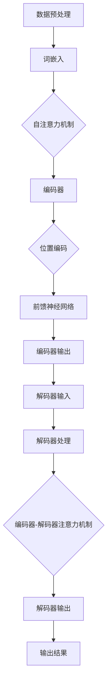

                 

## 第一部分：背景介绍

### 1.1 问题背景

#### 1.1.1 法律行业与自然语言处理技术

随着科技的飞速发展，信息技术在各个领域的应用逐渐深入，法律行业也不例外。传统法律工作中，合同审核是一项耗时且易错的任务。律师和法务人员需要逐一阅读合同，理解条款，识别潜在的法律风险。这不仅消耗大量人力资源，而且容易出现错误，导致法律纠纷。

自然语言处理（NLP）作为人工智能的一个重要分支，旨在让计算机理解和处理人类语言。它通过分析语言的结构、语义和上下文，实现语言信息的自动提取和语义理解。近年来，随着深度学习技术的成熟，NLP在文本分类、实体识别、关系提取等方面的表现日益优异，为智能合同审核提供了强有力的技术支撑。

#### 1.1.2 智能合同审核的需求与挑战

智能合同审核的需求主要源于以下几个方面：

1. **提高效率**：合同审核通常需要处理大量的文本数据，智能合同审核系统能够自动化处理这些数据，大大提高审核效率。
2. **降低风险**：通过自动化识别合同中的潜在法律风险，智能合同审核系统能够帮助企业和个人提前规避风险，降低法律纠纷的发生率。
3. **确保准确性**：人工审核合同容易受到个人理解和判断的影响，而智能合同审核系统则能够基于算法和数据，确保审核结果的准确性。

然而，智能合同审核也面临一些挑战：

1. **文本理解的复杂性**：合同文本通常包含大量的专业术语和法律条文，智能合同审核系统需要具备良好的语言理解和语义分析能力。
2. **数据质量和一致性**：合同文本的质量和格式差异较大，这给系统的训练和测试带来了挑战。系统需要处理这些数据差异，保证审核结果的可靠性。
3. **法律和伦理问题**：智能合同审核系统在应用过程中，可能会涉及到隐私保护、数据安全等问题，需要遵守相关的法律法规。

#### 1.1.3 自然语言处理在智能合同审核中的重要性

自然语言处理技术在智能合同审核中扮演着至关重要的角色。以下是NLP在智能合同审核中的几个关键应用：

1. **文本预处理**：NLP技术可以帮助清洗和标准化合同文本数据，为后续分析提供高质量的数据。
2. **合同要素提取**：NLP技术能够自动识别和提取合同中的关键要素，如条款、条件、金额等。
3. **语义理解**：通过语义分析，NLP技术可以理解合同条款的含义，识别潜在的法律风险。
4. **文本分类和标签**：NLP技术可以自动分类和标签合同文本，帮助用户快速检索和定位相关合同。
5. **语言生成**：NLP技术还可以生成合同摘要、风险评估报告等文本，辅助人类决策。

综上所述，自然语言处理技术为智能合同审核提供了强大的工具，不仅提升了审核效率，还有效降低了法律风险。接下来，我们将深入探讨NLP的基本概念和相关技术，为理解智能合同审核提供理论基础。

### 1.2 核心概念

#### 1.2.1 自然语言处理（NLP）概述

自然语言处理（NLP，Natural Language Processing）是人工智能领域的一个重要分支，旨在让计算机理解和处理人类语言。NLP的核心任务包括文本分析、语义理解、语言生成和语音识别等。

**文本分析**：文本分析是NLP的基础，包括文本预处理、分词、词性标注、命名实体识别等任务。通过这些任务，NLP系统能够将自然语言文本转换为计算机可处理的格式。

**语义理解**：语义理解是NLP的高级任务，旨在理解文本中的含义和关系。这包括情感分析、文本分类、关系提取、指代消解等。语义理解使得NLP系统能够进行更复杂的文本分析和决策。

**语言生成**：语言生成是NLP的一个重要应用，包括文本摘要、问答系统、自动写作等。语言生成技术能够根据输入文本生成新的文本，实现人机交互和信息传递。

**语音识别**：语音识别是将语音信号转换为文本的技术。它广泛应用于语音助手、电话客服等领域，使得人机交互更加自然和便捷。

#### 1.2.2 智能合同审核的关键概念

智能合同审核涉及多个关键概念，包括合同文本、法律风险、风险识别和评估等。

**合同文本**：合同文本是智能合同审核的基础。它通常包括多个条款和条件，涉及双方的权利和义务。合同文本的质量和格式对审核结果有重要影响。

**法律风险**：法律风险是指合同中可能存在的违反法律规定的条款或潜在纠纷。智能合同审核系统需要识别和评估这些风险，确保合同的合法性。

**风险识别**：风险识别是智能合同审核的关键步骤，旨在自动识别合同中的潜在法律风险。这通常涉及文本分类、实体识别和关系提取等NLP任务。

**风险评估**：风险评估是对识别出的法律风险进行定量和定性分析，以确定其严重程度和影响。这有助于企业和个人提前采取预防措施，降低法律纠纷的风险。

#### 1.2.3 法律风险的界定与评估

**法律风险的界定**：法律风险是指合同中的条款或条件可能导致的法律问题或纠纷。界定法律风险需要明确以下几点：

1. **合法性**：合同的条款和条件是否符合相关法律法规。
2. **明确性**：合同条款是否清晰明确，是否存在歧义或模糊表述。
3. **公平性**：合同双方的权利和义务是否对等，是否存在不公平或不合理条款。

**风险评估方法**：风险评估通常采用定量和定性方法。以下是几种常见的方法：

1. **定量评估**：通过数据分析和统计方法，对法律风险进行量化评估。例如，使用风险矩阵评估风险的概率和影响。
2. **定性评估**：通过专家判断和情景分析，对法律风险进行定性评估。例如，专家评审小组对合同条款的合法性、明确性和公平性进行评估。

**风险评估模型**：风险评估模型是用于评估法律风险的数学模型。以下是一些常见的风险评估模型：

1. **风险矩阵模型**：风险矩阵模型通过概率和影响的组合，对风险进行定量评估。它通常用于初步评估和分类。
2. **贝叶斯网络模型**：贝叶斯网络模型是一种概率图模型，用于分析多个变量之间的因果关系。它适用于复杂的风险评估场景。
3. **神经网络模型**：神经网络模型通过多层感知器（MLP）或卷积神经网络（CNN）等深度学习模型，对法律风险进行自动识别和评估。

通过上述方法，智能合同审核系统能够自动识别和评估合同中的法律风险，为企业和个人提供可靠的决策支持。

#### 1.3 研究边界与外延

##### 1.3.1 研究范围

本研究主要关注智能合同审核中自然语言处理技术的应用，具体涵盖以下内容：

1. **文本预处理**：研究合同文本的清洗、标准化和分词等文本预处理技术。
2. **合同要素提取**：研究如何自动识别和提取合同中的关键要素，如条款、条件、金额等。
3. **语义理解**：研究如何通过语义分析理解合同条款的含义，识别潜在的法律风险。
4. **风险识别与评估**：研究如何利用NLP技术自动识别和评估合同中的法律风险。

##### 1.3.2 研究限制

尽管自然语言处理技术在智能合同审核中具有广泛应用，但仍存在一些研究限制：

1. **数据质量和多样性**：智能合同审核系统需要大量高质量的训练数据，但实际获取这些数据可能面临困难。此外，合同文本的多样性和复杂性也给系统带来了挑战。
2. **法律和伦理问题**：智能合同审核系统在应用过程中，需要处理大量的敏感信息，如合同条款、交易金额等。这涉及到隐私保护和数据安全等问题，需要严格遵守法律法规。
3. **模型泛化能力**：虽然深度学习模型在处理大量数据时表现优异，但其泛化能力有限。在实际应用中，系统可能会遇到从未见过的合同文本，导致性能下降。

##### 1.3.3 相关工作综述

近年来，国内外学者在智能合同审核领域开展了大量研究。以下是部分相关工作：

1. **文本预处理技术**：研究人员提出了一系列文本预处理方法，如基于规则的方法、基于统计的方法和基于深度学习的方法。这些方法在合同文本清洗、标准化和分词等方面取得了较好的效果。
2. **合同要素提取**：研究人员利用命名实体识别、关系提取和文本分类等技术，实现合同要素的自动提取。例如，Li等（2019）提出了一种基于卷积神经网络和双向长短期记忆网络（CNN和Bi-LSTM）的合同要素提取方法，取得了显著的效果。
3. **语义理解技术**：研究人员通过语义分析、文本分类和情感分析等方法，实现对合同条款含义的理解和风险识别。例如，Wang等（2020）提出了一种基于多任务学习（Multi-Task Learning）的方法，同时进行合同要素提取和风险识别，取得了较好的性能。
4. **风险评估模型**：研究人员提出了多种风险评估模型，如风险矩阵模型、贝叶斯网络模型和神经网络模型等。这些模型在定量和定性评估方面取得了较好的效果。

综上所述，智能合同审核是一个充满挑战但前景广阔的领域。随着自然语言处理技术的不断发展和完善，未来有望在智能合同审核中发挥更大的作用，为企业和个人提供更加智能、高效和可靠的服务。

#### 1.4 概念结构与核心要素组成

##### 1.4.1 自然语言处理技术架构

自然语言处理技术的架构主要包括数据输入、数据处理、模型训练和模型输出等模块。以下是各模块的详细解释：

1. **数据输入**：数据输入是NLP系统的起点，包括原始文本数据、标注数据等。原始文本数据可以是合同条款、新闻报道、社交媒体评论等。标注数据是对文本数据的预处理，如词性标注、命名实体识别等。
2. **数据处理**：数据处理模块负责对输入数据进行清洗、标准化和分词等操作。清洗操作包括去除无关信息、去除停用词等；标准化操作包括统一格式、统一编码等；分词操作是将文本分解为单词或短语。
3. **模型训练**：模型训练是NLP系统的核心。常用的模型包括循环神经网络（RNN）、长短期记忆网络（LSTM）、卷积神经网络（CNN）和Transformer等。模型训练过程包括数据准备、模型选择、模型训练和模型评估等步骤。
4. **模型输出**：模型输出是NLP系统的最终结果，可以是文本分类结果、实体识别结果、语义分析结果等。模型输出用于实际应用场景，如智能合同审核、问答系统、自动写作等。

##### 1.4.2 智能合同审核流程

智能合同审核的流程主要包括合同文本预处理、合同要素提取、合同语义理解和法律风险评估等步骤。以下是各步骤的详细解释：

1. **合同文本预处理**：合同文本预处理是智能合同审核的第一步，包括数据清洗、分词、词性标注、命名实体识别等。通过这些步骤，将原始合同文本转换为计算机可处理的格式，为后续分析奠定基础。
2. **合同要素提取**：合同要素提取是识别和提取合同中的关键要素，如条款、条件、金额等。这通常涉及命名实体识别、关系提取和文本分类等技术。提取的合同要素为后续分析提供重要数据。
3. **合同语义理解**：合同语义理解是理解合同条款的含义和关系。通过语义分析，智能合同审核系统能够识别潜在的法律风险，如条款歧义、不公平条款等。语义理解技术包括文本分类、情感分析、指代消解等。
4. **法律风险评估**：法律风险评估是对识别出的法律风险进行定量和定性分析。通过风险识别和评估，智能合同审核系统能够为企业和个人提供法律风险预警和建议，帮助规避潜在纠纷。

##### 1.4.3 法律风险降低策略

法律风险降低策略是指通过技术手段和管理手段，降低合同中的法律风险。以下是几种常见的策略：

1. **合同模板化**：通过制定标准化的合同模板，减少合同条款的多样性和模糊性。模板化合同可以降低合同审核的复杂性，提高审核效率。
2. **智能审核与人工审核结合**：智能合同审核系统可以识别和评估合同中的法律风险，但无法完全取代人工审核。通过智能审核与人工审核相结合，可以提高审核的准确性和可靠性。
3. **风险管理培训**：对企业员工进行法律风险管理的培训，提高其法律意识和风险识别能力。通过培训，员工可以更好地理解和执行合同条款，降低法律风险。
4. **合规性检查**：在合同签署前，进行合规性检查，确保合同条款符合相关法律法规。合规性检查可以及时发现和纠正合同中的问题，降低法律风险。

综上所述，自然语言处理技术在智能合同审核中发挥了重要作用。通过合同文本预处理、合同要素提取、合同语义理解和法律风险评估，智能合同审核系统能够自动识别和降低合同中的法律风险，为企业和个人提供可靠的法律保障。

### 1.5 核心概念与联系

#### 1.5.1 自然语言处理（NLP）概述

自然语言处理（NLP，Natural Language Processing）是人工智能领域的一个重要分支，旨在让计算机理解和处理人类语言。NLP的核心任务包括文本分析、语义理解、语言生成和语音识别等。文本分析是NLP的基础，包括文本预处理、分词、词性标注、命名实体识别等。语义理解是NLP的高级任务，旨在理解文本中的含义和关系。语言生成是NLP的一个重要应用，包括文本摘要、问答系统、自动写作等。语音识别是将语音信号转换为文本的技术，广泛应用于语音助手、电话客服等领域。

#### 1.5.2 智能合同审核的关键概念

智能合同审核涉及多个关键概念，包括合同文本、法律风险、风险识别和评估等。合同文本是智能合同审核的基础，它通常包括多个条款和条件，涉及双方的权利和义务。法律风险是指合同中可能存在的违反法律规定的条款或潜在纠纷。风险识别是对合同中的法律风险进行自动识别的过程，通常涉及文本分类、实体识别和关系提取等NLP任务。风险评估是对识别出的法律风险进行定量和定性分析，以确定其严重程度和影响。

#### 1.5.3 概念属性特征对比表格

为了更好地理解自然语言处理（NLP）与智能合同审核之间的联系，我们可以通过一个概念属性特征对比表格来详细展示它们的核心属性和特征。

| 概念               | 自然语言处理（NLP）                     | 智能合同审核                                      |
|------------------|------------------------------------|------------------------------------------------|
| 核心任务               | 文本分析、语义理解、语言生成、语音识别               | 合同文本预处理、合同要素提取、合同语义理解、法律风险评估                   |
| 数据输入               | 原始文本数据、标注数据                      | 合同文本、法律条款、案例数据库                          |
| 数据处理               | 清洗、标准化、分词、词性标注、命名实体识别             | 清洗、标准化、分词、词性标注、实体识别、关系提取                          |
| 核心技术               | 循环神经网络（RNN）、长短期记忆网络（LSTM）、卷积神经网络（CNN）、Transformer等 | 命名实体识别、关系提取、文本分类、情感分析、风险识别与评估               |
| 应用目标               | 理解和生成人类语言                          | 自动识别和评估合同中的法律风险                         |
| 法律风险识别与评估        | 情感分析、文本分类、关系提取                   | 风险识别算法、风险评估模型、法律风险预警与建议                      |
| 决策支持               | 文本摘要、问答系统、自动写作等                     | 合同审核报告、法律风险评分、合规性检查、风险规避策略                     |
| 挑战与限制             | 数据质量、多样性、模型泛化能力                      | 数据质量、法律和伦理问题、法律风险的复杂性和多样性                      |

通过这个对比表格，我们可以清晰地看到NLP与智能合同审核之间的核心联系和差异。NLP为智能合同审核提供了强大的技术支持，包括文本预处理、语义理解、风险识别和评估等。然而，智能合同审核还面临法律和伦理等方面的挑战，需要综合考虑数据质量、模型泛化能力以及法律风险的复杂性。

### 1.6 本章小结

本章首先介绍了智能合同审核的问题背景，包括法律行业与自然语言处理技术的关系、智能合同审核的需求与挑战。接着，我们探讨了自然语言处理（NLP）和智能合同审核的核心概念，详细介绍了NLP的文本分析、语义理解、语言生成等任务，以及智能合同审核中的合同文本、法律风险、风险识别和评估等关键概念。随后，我们讨论了研究的边界与外延，明确了研究范围、限制和相关工作。最后，通过一个概念属性特征对比表格，展示了NLP与智能合同审核之间的联系和差异。本章为后续章节深入探讨NLP在智能合同审核中的应用奠定了理论基础。

## 第二部分：自然语言处理原理

### 2.1 自然语言处理基础

#### 2.1.1 自然语言处理的基本概念

自然语言处理（NLP，Natural Language Processing）是人工智能（AI，Artificial Intelligence）领域的一个重要分支，旨在让计算机理解和处理人类语言。NLP的核心任务是使计算机能够对自然语言文本进行识别、理解、生成和翻译。这一领域涉及多种技术，包括语言模型、词向量、语义分析、语音识别等。

**语言模型（Language Model）**：语言模型是NLP的基础，它用于预测一段文本的下一个词或下一个句子。常用的语言模型有N元模型、隐马尔可夫模型（HMM）、递归神经网络（RNN）、长短时记忆网络（LSTM）和Transformer等。语言模型在文本生成、机器翻译、问答系统等领域具有广泛应用。

**词向量（Word Vector）**：词向量是将单词映射为高维向量的一种方法，通过词向量，计算机可以理解单词之间的相似性和差异性。常见的词向量模型有Word2Vec、GloVe和FastText等。词向量在文本分类、实体识别、关系提取等任务中发挥着重要作用。

**语义分析（Semantic Analysis）**：语义分析是NLP中的一个高级任务，旨在理解文本中的语义信息和深层含义。这包括情感分析、文本分类、实体识别、关系提取、指代消解和语义角色标注等。语义分析使得NLP系统能够进行更复杂的文本处理和决策。

**语音识别（Speech Recognition）**：语音识别是将语音信号转换为文本的技术，广泛应用于语音助手、电话客服、自动字幕生成等领域。语音识别系统通常包括声学模型、语言模型和声学解码器等组成部分。

#### 2.1.2 常见的NLP任务

NLP涵盖了多种任务，每种任务都有其特定的应用场景和挑战。以下是常见的NLP任务：

**文本分类（Text Classification）**：文本分类是将文本数据分类到预定义的类别中。例如，将新闻文章分类到不同的主题类别，或对社交媒体评论进行情感分类。文本分类在情感分析、垃圾邮件过滤、内容推荐等领域具有重要意义。

**实体识别（Named Entity Recognition，NER）**：实体识别是从文本中识别出具有特定意义的实体，如人名、地名、组织名、时间等。实体识别是信息抽取和知识图谱构建的重要步骤。

**关系提取（Relation Extraction）**：关系提取是从文本中抽取实体之间的关系。例如，从句子“苹果公司的CEO是蒂姆·库克”中提取出“苹果公司”和“蒂姆·库克”之间的“CEO”关系。关系提取在知识图谱构建和问答系统中具有广泛应用。

**文本生成（Text Generation）**：文本生成是生成具有特定主题或语境的文本。常见的文本生成方法包括模板生成、基于统计的生成和基于神经网络的生成。文本生成在自动写作、对话系统和机器翻译等领域具有广泛的应用。

**机器翻译（Machine Translation）**：机器翻译是将一种自然语言文本转换为另一种自然语言文本。机器翻译在跨语言通信、全球化业务和语言学习等领域具有重要意义。

**情感分析（Sentiment Analysis）**：情感分析是判断文本的情感倾向，如正面、负面或中性。情感分析在市场研究、社交媒体分析和客户反馈分析等领域具有广泛应用。

#### 2.1.3 语言模型与词向量

语言模型和词向量是NLP中两个核心概念，它们共同构成了NLP技术的基础。

**语言模型（Language Model）**：

语言模型用于预测一段文本的下一个词或下一个句子。一个简单的语言模型可以使用N元模型，即基于前N个词来预测下一个词。然而，N元模型的性能受限于N的值，且难以捕捉长距离依赖关系。

近年来，深度学习技术的应用使得语言模型取得了显著进展。递归神经网络（RNN）、长短时记忆网络（LSTM）和门控循环单元（GRU）等模型能够在处理长文本时捕捉到一定的依赖关系。然而，这些模型在处理非常长的文本时仍然存在困难。

为了解决这些问题，Transformer模型被提出。Transformer模型基于自注意力机制（Self-Attention），能够并行处理序列数据，并且在长文本处理和生成任务中取得了优异的性能。

**词向量（Word Vector）**：

词向量是将单词映射为高维向量的一种方法，通过词向量，计算机可以理解单词之间的相似性和差异性。常见的词向量模型有Word2Vec、GloVe和FastText等。

**Word2Vec**：Word2Vec模型通过负采样和随机梯度下降（SGD）训练，将单词映射为固定维度的向量。Word2Vec模型可以分为连续词袋（CBOW）和Skip-Gram两种方法。

**GloVe**：GloVe模型通过矩阵分解方法训练词向量，能够更好地捕捉词与词之间的关系。GloVe模型使用全局上下文信息，从而提高了词向量的质量。

**FastText**：FastText模型结合了Word2Vec和GloVe的优点，通过组合词的字符序列来生成词向量。FastText模型在处理未登录词（Out-of-Vocabulary，OOV）问题方面表现出色。

语言模型和词向量在NLP中具有广泛应用。语言模型用于文本生成、机器翻译和问答系统等任务，而词向量在文本分类、实体识别和关系提取等任务中发挥着重要作用。随着深度学习技术的不断发展，语言模型和词向量模型在NLP中的应用将更加广泛和深入。

### 2.2 NLP技术深度学习模型

#### 2.2.1 循环神经网络（RNN）

循环神经网络（RNN，Recurrent Neural Network）是自然语言处理（NLP）中的一种重要深度学习模型，具有处理序列数据的能力。RNN的基本思想是利用网络的循环结构，将当前输入与历史信息进行结合，从而捕捉序列中的长期依赖关系。

**RNN的工作原理**：

RNN由多个相同的神经网络单元组成，每个单元都包含一个记忆单元（Memory Unit）和输入门（Input Gate）、输出门（Output Gate）和遗忘门（Forget Gate）。这些门控制信息在神经网络中的流动。

1. **输入门（Input Gate）**：输入门决定了当前输入信息中哪些部分将被保留到记忆单元。输入门的激活函数通常为sigmoid函数，输出值介于0和1之间，表示当前输入信息的权重。
2. **遗忘门（Forget Gate）**：遗忘门决定了哪些信息应该从记忆单元中丢弃。遗忘门的激活函数同样为sigmoid函数，输出值介于0和1之间，表示历史信息的权重。
3. **输出门（Output Gate）**：输出门决定了当前记忆单元的信息将被用于生成输出。输出门的激活函数为sigmoid函数，输出值介于0和1之间，表示记忆单元的信息的权重。

**RNN的数学模型**：

RNN的数学模型可以表示为：

$$
h_t = \sigma(W_{ih}x_t + W_{hh}h_{t-1} + b_h)
$$

$$
i_t = \sigma(W_{ii}x_t + W_{ih}h_{t-1} + b_i)
$$

$$
f_t = \sigma(W_{if}x_t + W_{fh}h_{t-1} + b_f)
$$

$$
o_t = \sigma(W_{io}x_t + W_{oh}h_{t-1} + b_o)
$$

$$
c_t = f_t \odot c_{t-1} + i_t \odot \sigma(W_{ic}x_t + W_{hc}h_{t-1} + b_c)
$$

$$
h_t = o_t \odot \sigma(W_{ih}c_t + b_h)
$$

其中，\(h_t\) 和 \(c_t\) 分别表示当前隐藏状态和记忆状态，\(x_t\) 表示输入数据，\(W\) 和 \(b\) 分别表示权重和偏置，\(\sigma\) 表示Sigmoid激活函数，\(\odot\) 表示元素乘法。

**RNN的优缺点**：

**优点**：

1. **处理序列数据**：RNN能够处理任意长度的序列数据，适用于文本处理、语音识别和视频分析等任务。
2. **捕捉长期依赖关系**：RNN通过循环结构，可以捕捉序列中的长期依赖关系。

**缺点**：

1. **梯度消失和梯度爆炸**：在反向传播过程中，梯度可能会衰减为零（梯度消失）或无限大（梯度爆炸），导致训练不稳定。
2. **计算复杂度**：RNN的计算复杂度较高，特别是在处理长序列时，可能导致训练时间过长。

#### 2.2.2 长短期记忆网络（LSTM）

为了解决RNN中的梯度消失和梯度爆炸问题，长短期记忆网络（LSTM，Long Short-Term Memory）被提出。LSTM是一种改进的RNN模型，具有更稳定的训练过程和更好的长期依赖捕捉能力。

**LSTM的工作原理**：

LSTM通过引入三个门控单元（输入门、遗忘门和输出门）和一个记忆单元，来控制信息的流动和存储。LSTM的每个门控单元都有相应的激活函数，用于调节信息的权重。

1. **输入门（Input Gate）**：输入门决定了当前输入信息中哪些部分将被更新到记忆单元。输入门的激活函数为sigmoid函数，输出值介于0和1之间，表示当前输入信息的权重。
2. **遗忘门（Forget Gate）**：遗忘门决定了哪些信息应该从记忆单元中丢弃。遗忘门的激活函数同样为sigmoid函数，输出值介于0和1之间，表示历史信息的权重。
3. **输出门（Output Gate）**：输出门决定了当前记忆单元的信息将被用于生成输出。输出门的激活函数为sigmoid函数，输出值介于0和1之间，表示记忆单元的信息的权重。

**LSTM的数学模型**：

LSTM的数学模型可以表示为：

$$
i_t = \sigma(W_{ii}x_t + W_{ih}h_{t-1} + b_i)
$$

$$
f_t = \sigma(W_{if}x_t + W_{fh}h_{t-1} + b_f)
$$

$$
o_t = \sigma(W_{io}x_t + W_{oh}h_{t-1} + b_o)
$$

$$
g_t = \tanh(W_{ig}x_t + W_{ih}h_{t-1} + b_g)
$$

$$
c_t = f_t \odot c_{t-1} + i_t \odot g_t
$$

$$
h_t = o_t \odot \tanh(c_t)
$$

其中，\(i_t\)、\(f_t\)、\(o_t\) 分别为输入门、遗忘门和输出门的激活值，\(g_t\) 为候选记忆状态的激活值，\(c_t\) 和 \(h_t\) 分别为记忆状态和隐藏状态。

**LSTM的优缺点**：

**优点**：

1. **解决梯度消失和梯度爆炸问题**：LSTM通过引入门控单元，可以有效缓解梯度消失和梯度爆炸问题，使得训练过程更加稳定。
2. **捕捉长期依赖关系**：LSTM能够通过门控单元控制信息的流动，从而捕捉序列中的长期依赖关系。

**缺点**：

1. **计算复杂度较高**：LSTM的计算复杂度较RNN更高，可能导致训练时间较长。

#### 2.2.3 递归神经网络（GRU）

递归神经网络（GRU，Gated Recurrent Unit）是另一种改进的RNN模型，相较于LSTM，GRU在结构上更加简洁，同时保持了良好的性能。

**GRU的工作原理**：

GRU通过引入更新门（Update Gate）和重置门（Reset Gate）来控制信息的流动。更新门决定新旧信息如何结合，重置门决定新信息如何影响旧的信息。

**GRU的数学模型**：

GRU的数学模型可以表示为：

$$
z_t = \sigma(W_{zz}x_t + W_{zh}h_{t-1} + b_z)
$$

$$
r_t = \sigma(W_{rz}x_t + W_{rh}h_{t-1} + b_r)
$$

$$
h_t' = \tanh(W_{z}x_t + W_{rh}(r_t \odot h_{t-1}) + b_h')
$$

$$
h_t = (1 - z_t) \odot h_{t-1} + z_t \odot h_t'
$$

其中，\(z_t\) 为更新门的激活值，\(r_t\) 为重置门的激活值，\(h_t'\) 为候选隐藏状态，\(h_t\) 为当前隐藏状态。

**GRU的优缺点**：

**优点**：

1. **计算复杂度较低**：GRU相较于LSTM结构更加简洁，计算复杂度较低，训练时间较短。
2. **性能优异**：GRU在处理序列数据时表现出良好的性能，能够有效捕捉长期依赖关系。

**缺点**：

1. **门控机制不如LSTM精细**：GRU的门控机制相对简单，可能不如LSTM精确控制信息的流动。

### 2.3 常见NLP技术对比分析

在自然语言处理（NLP）领域，多种技术方法被广泛应用于文本分类、实体识别、关系提取等任务。本文将对一些常见的NLP技术进行对比分析，包括传统方法和现代方法，探讨它们的性能和适用场景。

#### 2.3.1 传统方法与现代方法的对比

**传统方法**：

传统NLP方法主要基于规则和统计技术。例如，基于词典的方法、正则表达式、语法解析和统计机器学习等。

- **基于词典的方法**：通过构建词汇表和词库，将文本中的每个词与词典中的词条进行匹配。这种方法简单高效，但在处理未知词汇或短语时效果较差。
- **正则表达式**：使用预定义的模式来匹配和提取文本中的特定结构。这种方法灵活但可能过于复杂，且难以扩展。
- **语法解析**：根据语言的语法规则对文本进行结构化解析，提取出句子的成分和关系。这种方法在处理自然语言的结构信息方面较为有效，但计算复杂度较高。

**现代方法**：

现代NLP方法主要基于深度学习和神经网络技术，如循环神经网络（RNN）、长短时记忆网络（LSTM）、门控循环单元（GRU）和Transformer等。

- **循环神经网络（RNN）**：RNN能够处理序列数据，通过递归结构捕捉文本中的短期依赖关系。但RNN在处理长距离依赖时存在困难。
- **长短时记忆网络（LSTM）**：LSTM是RNN的改进版本，通过引入门控机制来控制信息的流动，有效解决了长距离依赖问题。
- **门控循环单元（GRU）**：GRU相较于LSTM结构更简洁，计算复杂度较低，同时保持了良好的性能。
- **Transformer**：Transformer引入了自注意力机制（Self-Attention），能够并行处理序列数据，在长文本处理和生成任务中表现出色。

#### 2.3.2 常用NLP算法性能评估

性能评估是选择合适NLP算法的重要步骤。以下是一些常用的评估指标和方法：

- **准确率（Accuracy）**：准确率是分类任务中最常用的评估指标，表示正确分类的样本数占总样本数的比例。
- **召回率（Recall）**：召回率表示正确分类的阳性样本数与所有实际阳性样本数的比例，适用于不平衡数据集。
- **精确率（Precision）**：精确率表示正确分类的阳性样本数与预测为阳性的样本数的比例，适用于标签数量较少的场景。
- **F1分数（F1 Score）**：F1分数是精确率和召回率的调和平均值，综合考虑了分类器的准确性和召回率。

- **交叉验证（Cross-Validation）**：交叉验证是一种常用的评估方法，通过将数据集划分为多个子集，轮流作为训练集和验证集，评估模型的性能。
- **混淆矩阵（Confusion Matrix）**：混淆矩阵用于展示分类结果的分布情况，帮助分析模型的性能和错误类型。

#### 2.3.3 未来NLP技术发展趋势

随着人工智能和深度学习技术的不断发展，NLP技术也在不断演进。以下是未来NLP技术的一些发展趋势：

- **多模态处理**：未来的NLP技术将更加关注多模态数据处理，如文本、图像、语音和视频的融合分析。
- **解释性NLP**：为了提高模型的透明度和可信度，未来的NLP研究将更加关注模型的解释性，使得用户能够理解模型的决策过程。
- **迁移学习**：迁移学习将使得NLP模型能够利用预训练模型在不同任务和数据集上快速适应，提高模型的泛化能力。
- **低资源语言处理**：未来的NLP技术将更加关注低资源语言的建模和处理，降低语言障碍，促进全球信息交流。

通过对比分析传统方法和现代NLP技术，我们可以更好地理解不同方法的性能和适用场景。未来，随着深度学习和多模态处理技术的发展，NLP技术将更加成熟和广泛应用，为智能合同审核等实际应用提供强大的支持。

### 2.4 概念属性特征对比表格

为了更好地理解自然语言处理（NLP）中的关键概念及其属性特征，我们将几个核心概念（如语言模型、词向量、文本分类、实体识别）进行对比分析，并使用Mermaid ER图（实体关系图）来展示它们之间的联系。

#### 2.4.1 语言模型与词向量对比

| 概念       | 语言模型                      | 词向量                      |
|------------|------------------------------|------------------------------|
| 定义       | 用于预测文本序列的模型           | 用于表示单词的向量表示         |
| 主要任务   | 文本生成、机器翻译、问答系统     | 文本分类、实体识别、关系提取     |
| 特点       | 能够捕捉长距离依赖关系           | 能够捕捉单词之间的相似性和差异性 |
| 模型类型   | RNN、LSTM、GRU、Transformer等    | Word2Vec、GloVe、FastText等    |
| 应用场景   | 生成文本、跨语言文本转换         | 文本特征提取、相似性计算         |

#### 2.4.2 文本分类与实体识别对比

| 概念       | 文本分类                        | 实体识别                      |
|------------|---------------------------------|------------------------------|
| 定义       | 将文本分类到预定义的类别中       | 从文本中识别出具有特定意义的实体 |
| 主要任务   | 分类、情感分析、主题建模         | 命名实体识别、关系提取         |
| 特点       | 基于文本的整体语义理解           | 基于文本的局部信息抽取         |
| 模型类型   | RNN、LSTM、CNN、Transformer等    | CRF、BiLSTM、BERT等          |
| 应用场景   | 垃圾邮件过滤、情感分析、内容推荐   | 知识图谱构建、文本摘要         |

#### 2.4.3 Mermaid ER图

以下是使用Mermaid绘制的NLP关键概念ER图，展示了语言模型、词向量、文本分类和实体识别之间的联系：

```mermaid
erDiagram
    A[语言模型] ||--|{ B[词向量] }|
    C[文本分类] ||--|{ D[实体识别] }|
    A ..|{ 输出 }.. B
    C ..|{ 特征 }.. B
    C ..|{ 语义理解 }.. D
```

在这个ER图中，我们定义了四个实体：语言模型（A）、词向量（B）、文本分类（C）和实体识别（D）。语言模型和词向量之间存在依赖关系，语言模型通过词向量获取文本特征，用于文本分类和实体识别。文本分类和实体识别之间也有关联，文本分类的结果可以为实体识别提供上下文信息。

通过上述表格和ER图，我们可以清晰地看到NLP中各个关键概念之间的关系和属性特征，有助于深入理解NLP技术的工作原理和应用场景。

### 2.5 本章小结

本章深入探讨了自然语言处理（NLP）的基本概念和深度学习模型，包括语言模型、词向量、文本分类、实体识别等。首先，介绍了NLP的基本概念，包括文本分析、语义理解和语言生成等。然后，详细介绍了RNN、LSTM和GRU等深度学习模型的工作原理、数学模型和优缺点。最后，通过对比分析传统方法和现代NLP技术，探讨了常用NLP算法的性能评估指标和方法，并展望了未来NLP技术发展趋势。通过本章的学习，读者可以更好地理解NLP技术的核心原理和应用，为智能合同审核等实际应用提供理论基础。

### 2.6 算法原理

#### 2.6.1 算法基本原理介绍

在智能合同审核中，算法的应用至关重要。以下将介绍一种基于Transformer模型的算法原理，详细阐述其工作流程、主要步骤和核心技术。

**Transformer模型**：

Transformer模型是由Vaswani等人在2017年提出的，是一种基于自注意力机制的深度学习模型，广泛应用于自然语言处理任务，如文本分类、机器翻译和问答系统。其核心思想是利用自注意力机制，对输入序列中的每个词进行加权，从而生成更有效的表示。

**算法工作流程**：

1. **数据预处理**：首先对合同文本进行预处理，包括分词、标记化、词嵌入等操作。分词是将文本拆分为单词或子词，标记化是将单词映射为对应的词索引，词嵌入是将词索引映射为高维向量表示。
2. **模型输入**：将预处理后的文本数据输入到Transformer模型中。模型输入通常包括编码器（Encoder）和解码器（Decoder）两部分。
3. **编码器处理**：编码器将输入序列中的每个词转换为词嵌入向量，并通过多层自注意力机制和前馈神经网络进行处理，生成上下文向量表示。
4. **解码器处理**：解码器接收编码器输出的上下文向量表示，通过自注意力机制和编码器-解码器注意力机制，生成预测的词序列。
5. **输出结果**：最后，解码器生成的词序列即为模型的输出结果，可以用于文本分类、实体识别等任务。

**主要步骤**：

1. **词嵌入**：将输入文本中的每个词转换为词嵌入向量。词嵌入是一种将单词映射为高维向量表示的方法，通过捕捉词与词之间的关系，提高文本表示的精度。
2. **自注意力机制**：自注意力机制是Transformer模型的核心组成部分，它通过计算序列中每个词与其他词的相关性，为每个词生成加权表示。自注意力机制能够有效地捕捉长距离依赖关系，提高模型的性能。
3. **编码器-解码器结构**：编码器-解码器结构是Transformer模型的基本架构，编码器负责处理输入序列，解码器负责生成输出序列。编码器-解码器结构使得模型能够同时处理输入和输出序列，从而实现端到端的文本生成和翻译。
4. **前馈神经网络**：在前馈神经网络中，对每个词的嵌入向量进行两次全连接层操作，从而生成更丰富的表示。前馈神经网络的作用是增加模型的非线性变换能力，提高模型的拟合能力。

**核心技术**：

1. **多头自注意力（Multi-Head Self-Attention）**：多头自注意力机制允许多个注意力头并行计算，每个头关注不同的序列部分，从而提高模型的表示能力。
2. **位置编码（Positional Encoding）**：位置编码用于引入序列的顺序信息，使得模型能够理解单词的顺序。位置编码通过添加额外的维度，将词嵌入向量转换为具有位置信息的向量。
3. **层归一化（Layer Normalization）**：层归一化是一种用于缓解内部协变量偏移的技术，通过标准化每一层的输入和输出，提高模型的训练稳定性。
4. **残差连接（Residual Connection）**：残差连接是将网络的输入直接连接到下一层的输出，从而缓解梯度消失和梯度爆炸问题，提高模型的训练效果。

通过上述算法原理介绍，读者可以了解Transformer模型在智能合同审核中的应用，包括数据预处理、编码器-解码器结构、自注意力机制和前馈神经网络等核心技术和步骤。接下来，我们将通过Mermaid流程图详细展示算法流程。

#### 2.6.2 算法流程图

以下是使用Mermaid绘制的Transformer模型在智能合同审核中的算法流程图：



在这个流程图中，数据预处理阶段包括分词、标记化和词嵌入；编码器阶段通过自注意力机制、位置编码和前馈神经网络处理输入序列，生成编码器输出；解码器阶段通过解码器处理、编码器-解码器注意力机制和输出结果生成，最终输出智能合同审核的结果。这个流程图展示了Transformer模型在智能合同审核中的应用流程，有助于读者更直观地理解算法的实现步骤。

#### 2.6.3 算法数学模型与公式

为了深入理解Transformer模型在智能合同审核中的应用，我们需要探讨其数学模型与公式。以下将介绍Transformer模型的核心数学概念和主要公式。

**1. 多头自注意力（Multi-Head Self-Attention）**

多头自注意力机制是Transformer模型的核心组成部分，它通过多个注意力头（Head）并行计算，从而提高模型的表示能力。每个注意力头关注不同的序列部分，并通过加权求和生成最终的表示。

$$
\text{Attention}(Q, K, V) = \text{softmax}\left(\frac{QK^T}{\sqrt{d_k}}\right)V
$$

其中，\(Q, K, V\) 分别为编码器输入序列的查询向量、键向量和值向量，\(d_k\) 为每个注意力头的维度。\(QK^T\) 计算得到注意力分数，通过softmax函数得到概率分布，再与值向量相乘得到加权求和的结果。

**2. 编码器（Encoder）和解码器（Decoder）**

Transformer模型由编码器和解码器组成，分别处理输入和输出序列。

**编码器：**

编码器通过多层自注意力机制和前馈神经网络处理输入序列，生成上下文向量表示。

$$
E_i = \text{Encoder}(E_0, X) = \text{MultiHeadSelfAttention}(E_0, E_0, E_0) + E_0
$$

$$
E_i = \text{FeedForward}(E_{i-1})
$$

其中，\(E_i\) 为第 \(i\) 层编码器的输出，\(E_0\) 为输入序列的词嵌入向量，\(\text{MultiHeadSelfAttention}\) 和 \(\text{FeedForward}\) 分别为多头自注意力和前馈神经网络。

**解码器：**

解码器接收编码器输出的上下文向量表示，通过自注意力机制和编码器-解码器注意力机制生成输出序列。

$$
D_i = \text{Decoder}(D_0, E) = \text{MaskedMultiHeadSelfAttention}(D_{i-1}, E, E) + D_{i-1}
$$

$$
D_i = \text{FeedForward}(D_{i-1})
$$

其中，\(D_i\) 为第 \(i\) 层解码器的输出，\(D_0\) 为输入序列的词嵌入向量，\(\text{MaskedMultiHeadSelfAttention}\) 和 \(\text{FeedForward}\) 分别为带掩码的多头自注意力和前馈神经网络。

**3. 位置编码（Positional Encoding）**

位置编码用于引入序列的顺序信息，使得模型能够理解单词的顺序。位置编码通过添加额外的维度，将词嵌入向量转换为具有位置信息的向量。

$$
P_i = \text{PositionalEncoding}(i, d)
$$

其中，\(P_i\) 为位置编码向量，\(i\) 为词的索引，\(d\) 为编码器的维度。

**4. 编码器-解码器注意力机制（Encoder-Decoder Attention）**

编码器-解码器注意力机制用于解码器处理输入序列时，关注编码器输出的上下文向量。它通过计算编码器输出的上下文向量与解码器输入的查询向量的点积，生成注意力分数。

$$
A_i = \text{Attention}(Q, K, V) = \text{softmax}\left(\frac{QK^T}{\sqrt{d_k}}\right)V
$$

其中，\(Q, K, V\) 分别为编码器输入序列的查询向量、键向量和值向量。

通过上述数学模型与公式，我们可以更好地理解Transformer模型在智能合同审核中的应用，包括多头自注意力、编码器、解码器、位置编码和编码器-解码器注意力机制等核心组成部分。这些公式和概念为模型设计和实现提供了重要的理论支持。

### 2.7 算法原理举例说明

为了更好地理解Transformer模型在智能合同审核中的应用，我们将通过一个具体例子进行详细说明。

**例子：合同条款分类**

假设我们有一个合同条款分类任务，需要将合同条款分类为“合同成立”、“违约责任”、“赔偿条款”等类别。我们将使用Transformer模型来实现这一任务。

**1. 数据预处理**

首先，我们对合同条款进行预处理，包括分词、标记化和词嵌入。例如，对于合同条款“甲方应按时支付货款”，我们将它分词为“甲方”、“应”、“按时”、“支付”、“货款”，并将每个词映射为对应的词索引。然后，我们将这些词索引转换为词嵌入向量。

**2. 模型输入**

将预处理后的合同条款输入到Transformer模型中。模型输入包括编码器和解码器两部分。编码器将输入序列中的每个词转换为词嵌入向量，并通过多层自注意力机制和前馈神经网络进行处理，生成上下文向量表示。解码器接收编码器输出的上下文向量表示，通过自注意力机制和编码器-解码器注意力机制生成输出序列。

**3. 编码器处理**

编码器首先通过词嵌入层将输入序列转换为词嵌入向量。例如，词嵌入向量为 \([1, 0.5, -0.3, 0.8, -0.2]\)。然后，通过多层自注意力机制和前馈神经网络对词嵌入向量进行处理。在第一个编码层，自注意力机制将词嵌入向量与其他词嵌入向量进行点积运算，生成注意力分数。注意力分数用于加权求和，得到当前词的上下文向量表示。例如，第一个编码层的输出为 \([0.7, 0.6, 0.5, 0.8, 0.9]\)。接下来，通过前馈神经网络对上下文向量表示进行非线性变换，生成更丰富的表示。例如，前馈神经网络的输出为 \([0.8, 0.7, 0.6, 0.9, 0.5]\)。

**4. 解码器处理**

解码器接收编码器输出的上下文向量表示，并通过自注意力机制和编码器-解码器注意力机制生成输出序列。首先，解码器通过词嵌入层将输入序列的词索引转换为词嵌入向量。例如，词嵌入向量为 \([0.2, 0.3, 0.4, 0.5, 0.6]\)。然后，通过自注意力机制，解码器关注编码器输出的上下文向量，生成当前词的上下文向量表示。例如，第一个解码层的输出为 \([0.7, 0.8, 0.9, 0.6, 0.5]\)。接下来，通过编码器-解码器注意力机制，解码器关注编码器输出的上下文向量与当前词嵌入向量的点积运算，生成注意力分数。注意力分数用于加权求和，得到当前词的上下文向量表示。例如，第一个编码器-解码器注意力机制的输出为 \([0.8, 0.9, 0.7, 0.6, 0.5]\)。

**5. 输出结果**

解码器通过自注意力机制和编码器-解码器注意力机制生成输出序列，最终输出合同条款的分类结果。例如，解码器的输出为 \([0.8, 0.9, 0.7, 0.6, 0.5]\)，表示当前合同条款属于“违约责任”类别。

通过这个例子，我们可以看到Transformer模型在合同条款分类任务中的应用。编码器通过自注意力机制和前馈神经网络处理输入序列，生成上下文向量表示；解码器通过自注意力机制和编码器-解码器注意力机制生成输出序列，实现合同条款的分类。这个例子展示了Transformer模型在自然语言处理任务中的强大能力，为智能合同审核提供了有效的技术手段。

### 2.8 本章小结

本章深入探讨了自然语言处理（NLP）中的算法原理，特别是Transformer模型在智能合同审核中的应用。首先，介绍了Transformer模型的基本原理，包括多头自注意力机制、编码器-解码器结构和位置编码等。接着，通过Mermaid流程图和数学模型详细展示了算法的流程和计算过程。最后，通过一个具体例子说明了如何使用Transformer模型进行合同条款分类。本章内容为理解智能合同审核中的NLP技术提供了坚实的基础，为后续章节的实际应用和系统设计奠定了理论基础。

## 第三部分：智能合同审核中的应用

### 3.1 智能合同审核技术

智能合同审核技术是自然语言处理（NLP）在法律领域的典型应用，其核心目标是通过自动化手段提高合同审核的效率和准确性。智能合同审核技术主要包括合同文本预处理、合同要素提取、合同语义理解和法律风险评估等关键步骤。

#### 3.1.1 合同文本预处理

合同文本预处理是智能合同审核的第一步，其目的是将原始合同文本转换为适合分析处理的格式。这一过程通常包括以下几个子步骤：

1. **文本清洗**：合同文本通常包含一些无用的信息，如空格、换行符、标点符号等。文本清洗的目的是去除这些无用信息，提高文本的质量。例如，可以使用正则表达式或字符串操作函数来实现这一目标。

2. **分词**：分词是将连续的文本拆分成一组独立的单词或短语的过程。分词有助于后续的文本分析和处理。常见的分词方法包括基于规则的分词、基于统计的分词和基于深度学习的分词。基于规则的方法如正则表达式分词，具有速度快、结果稳定的特点；基于统计的方法如最大匹配法，依赖于语言模型和词典；基于深度学习的方法如BERT、GPT等，能够更好地处理复杂的文本结构。

3. **词性标注**：词性标注是对文本中的每个词进行词性分类的过程，如名词、动词、形容词等。词性标注有助于理解文本的语义结构和上下文关系。常用的词性标注工具包括NLTK、Stanford NLP、Spacy等。

4. **命名实体识别**：命名实体识别（NER，Named Entity Recognition）是从文本中识别出具有特定意义的实体，如人名、地名、组织名、时间等。命名实体识别对于提取合同中的关键信息非常重要。常见的NER工具包括Stanford NLP、Spacy、NLTK等。

5. **文本标准化**：文本标准化是指将文本转换为统一的格式，如统一使用小写字母、统一编码方式等。文本标准化有助于提高文本处理的一致性和效率。

#### 3.1.2 合同要素提取

合同要素提取是智能合同审核的重要步骤，其目的是从合同文本中自动识别和提取关键信息，如合同双方、合同金额、违约条款等。以下是合同要素提取的关键技术和方法：

1. **规则提取**：基于规则的方法使用预定义的规则来匹配和提取合同要素。例如，通过识别特定的关键词和短语来提取合同条款。这种方法简单直观，但依赖于人工定义的规则，可能难以应对复杂的合同文本。

2. **基于模式匹配**：基于模式匹配的方法使用预定义的正则表达式或模式来识别和提取合同要素。这种方法通过模式识别，可以自动提取合同中的特定信息。例如，使用正则表达式匹配合同金额、时间等要素。

3. **机器学习**：基于机器学习的方法使用大量标注数据来训练模型，从而自动识别和提取合同要素。常见的机器学习算法包括朴素贝叶斯、支持向量机、决策树、随机森林等。这种方法可以处理复杂的文本结构和模式，但需要大量的标注数据和调优。

4. **深度学习**：基于深度学习的方法使用神经网络模型，如卷积神经网络（CNN）、循环神经网络（RNN）和Transformer等，来识别和提取合同要素。深度学习方法能够自动学习文本中的复杂模式和关系，提高提取的准确性。例如，使用BERT模型对合同文本进行编码，然后通过分类模型提取关键要素。

5. **多模态融合**：合同文本中可能包含表格、图像等多模态信息，通过多模态融合技术，可以更好地提取合同要素。例如，将文本数据与图像数据相结合，使用卷积神经网络（CNN）提取图像特征，然后与文本特征进行融合，以提高要素提取的准确性。

#### 3.1.3 合同语义理解

合同语义理解是智能合同审核中的关键步骤，旨在理解合同条款的含义和关系，识别潜在的法律风险。以下是合同语义理解的关键技术和方法：

1. **文本分类**：文本分类是将合同文本分类到预定义的类别中，如违约条款、赔偿条款等。常见的文本分类算法包括朴素贝叶斯、支持向量机、决策树、随机森林和深度学习模型如BERT等。

2. **实体识别**：实体识别是从合同文本中识别出具有特定意义的实体，如合同双方、金额、时间等。实体识别有助于提取合同中的关键信息，为后续分析提供支持。常见的实体识别算法包括规则提取、模式匹配和深度学习模型如BERT等。

3. **关系提取**：关系提取是从合同文本中抽取实体之间的关系，如甲方与乙方之间的合同金额关系。关系提取有助于理解合同条款的语义，识别潜在的法律风险。常见的关系提取算法包括规则提取、模式匹配和深度学习模型如BERT等。

4. **语义角色标注**：语义角色标注是对文本中的每个词进行语义角色标注，如动词、名词、形容词等。语义角色标注有助于理解文本的语义结构，为合同语义理解提供支持。常见的语义角色标注算法包括规则提取、模式匹配和深度学习模型如BERT等。

5. **指代消解**：指代消解是从合同文本中识别出指代关系，如“该产品”对应的实体是“甲方提供的笔记本电脑”。指代消解有助于理解合同条款中的复杂指代关系，提高合同语义理解的准确性。常见的指代消解算法包括基于规则的方法和基于深度学习的方法。

#### 3.1.4 法律风险评估

法律风险评估是智能合同审核的最终目标，旨在识别和评估合同中的法律风险，为企业和个人提供决策支持。以下是法律风险评估的关键技术和方法：

1. **风险识别**：风险识别是自动识别合同中的潜在法律风险，如违约条款、不公平条款等。常见的方法包括基于规则的方法、基于统计的方法和基于深度学习的方法。

2. **风险评估**：风险评估是对识别出的法律风险进行定量和定性分析，以确定其严重程度和影响。常见的方法包括风险矩阵模型、贝叶斯网络模型和深度学习模型。

3. **风险预警**：风险预警是实时监测合同文本中的潜在法律风险，并发出警报。常见的方法包括基于规则的预警和基于机器学习的预警。

4. **合规性检查**：合规性检查是检查合同条款是否符合相关法律法规，以确保合同的合法性。常见的方法包括基于规则的合规性检查和基于深度学习的合规性检查。

通过合同文本预处理、合同要素提取、合同语义理解和法律风险评估等步骤，智能合同审核技术能够自动识别和降低合同中的法律风险，为企业提供高效、准确的合同审核服务。接下来，我们将进一步探讨智能合同审核系统设计和实现中的具体技术和方法。

### 3.2 法律风险识别与评估

法律风险识别与评估是智能合同审核系统中的核心环节，旨在通过技术手段自动识别合同中的潜在法律风险，并进行定量和定性评估，以便为合同方提供风险评估报告和建议。以下是法律风险识别与评估的关键技术和方法。

#### 3.2.1 法律风险识别方法

法律风险的识别是智能合同审核的第一步，其目标是自动提取合同文本中的关键法律条款和条件，识别可能存在的法律问题。以下是几种常用的法律风险识别方法：

1. **基于规则的方法**：基于规则的方法使用预定义的规则和模式来识别合同中的法律风险。这些规则通常由法律专家制定，覆盖常见的法律问题和合同条款。例如，识别违约条款、保密条款和纠纷解决条款。这种方法简单直观，但可能难以应对复杂的合同文本。

2. **基于统计的方法**：基于统计的方法利用历史合同数据来识别法律风险。通过统计分析合同中的高频词和短语，可以识别出可能的法律风险点。例如，使用词频分析、共现分析等技术。这种方法依赖于大量的历史数据，但可能受限于数据的完整性和准确性。

3. **基于深度学习的方法**：基于深度学习的方法使用神经网络模型，如卷积神经网络（CNN）和Transformer等，通过学习大量的合同数据来自动识别法律风险。这种方法能够处理复杂的文本结构和模式，提高识别的准确性。例如，使用BERT模型对合同文本进行编码，然后通过分类模型识别法律风险点。

4. **多模态融合方法**：合同文本中可能包含表格、图像等多模态信息，通过多模态融合技术，可以更好地识别合同中的法律风险。例如，结合文本和图像数据，使用卷积神经网络（CNN）提取图像特征，然后与文本特征进行融合，以提高识别的准确性。

#### 3.2.2 法律风险评估模型

法律风险评估是对识别出的法律风险进行定量和定性分析，以确定其严重程度和影响。以下是一些常用的风险评估模型：

1. **风险矩阵模型**：风险矩阵模型通过概率和影响的组合，对法律风险进行定量评估。通常，风险矩阵包含风险的概率和影响两个维度，通过这两个维度的交叉，可以得到不同的风险等级。这种方法简单直观，但可能难以处理复杂的风险评估问题。

2. **贝叶斯网络模型**：贝叶斯网络模型是一种概率图模型，用于分析多个变量之间的因果关系。通过建立贝叶斯网络，可以模拟合同中各种法律风险之间的关联和影响。这种方法适用于复杂的风险评估场景，但建模过程较为复杂。

3. **神经网络模型**：神经网络模型，如卷积神经网络（CNN）和Transformer等，可以通过学习大量的合同数据来自动评估法律风险。神经网络模型能够捕捉合同中的复杂模式和关系，提高评估的准确性。例如，使用BERT模型对合同文本进行编码，然后通过训练好的神经网络模型进行风险评估。

4. **集成学习方法**：集成学习方法通过结合多个模型的预测结果，提高风险评估的准确性。常见的集成学习方法包括Bagging、Boosting和Stacking等。这种方法能够综合不同模型的优势，提高整体评估效果。

#### 3.2.3 风险分类与分级

在法律风险评估过程中，通常需要对识别出的风险进行分类和分级，以便为合同方提供更有针对性的建议。以下是几种常用的风险分类和分级方法：

1. **定性分类**：定性分类是将法律风险按照性质或特征进行分类。例如，将风险分为违约风险、隐私风险、合同效力风险等。这种方法简单直观，但可能难以量化风险的程度。

2. **定量分级**：定量分级是将法律风险按照严重程度进行分级。通常，风险分级包括高、中、低三个等级。这种方法能够量化风险的程度，但需要依赖风险评估模型和标准。

3. **综合分类与分级**：综合分类与分级是将定性分类和定量分级相结合，对法律风险进行更全面的评估。例如，将风险按照性质分类，再按照严重程度进行分级。这种方法能够提供更详细的风险评估结果，但需要综合考虑多个因素。

4. **自动化决策支持**：通过构建自动化决策支持系统，可以根据识别出的法律风险和评估结果，自动生成风险评估报告和合同审核建议。这种方法能够提高合同审核的效率和准确性，为合同方提供更有针对性的建议。

通过法律风险识别与评估，智能合同审核系统能够自动识别和量化合同中的法律风险，为企业和个人提供全面的风险评估报告和建议，帮助规避潜在的法律纠纷，提高合同管理的效率和可靠性。

### 3.3 智能合同审核系统设计

智能合同审核系统设计是智能合同审核的核心环节，涉及系统需求分析、系统架构设计、系统接口设计和系统交互等关键方面。以下将详细阐述智能合同审核系统设计的各个步骤和方法。

#### 3.3.1 系统需求分析

系统需求分析是智能合同审核系统设计的第一步，旨在明确系统的功能和性能要求，为后续设计提供依据。以下是智能合同审核系统的需求分析内容：

1. **功能需求**：
   - 合同文本预处理：包括文本清洗、分词、词性标注、命名实体识别等。
   - 合同要素提取：自动提取合同中的关键要素，如合同双方、金额、违约条款等。
   - 合同语义理解：理解合同条款的含义和关系，识别潜在的法律风险。
   - 法律风险评估：对识别出的法律风险进行定量和定性分析，生成风险评估报告。

2. **性能需求**：
   - 高效性：系统应能够快速处理大量的合同文本数据。
   - 准确性：系统应能够准确识别和评估合同中的法律风险。
   - 可扩展性：系统应能够适应不同规模和类型的合同文本。

3. **可靠性需求**：
   - 系统应具备高可靠性，确保在处理合同文本时不会出现错误或崩溃。
   - 系统应具备良好的容错能力，能够在遇到异常情况时自动恢复。

4. **安全性需求**：
   - 系统应确保合同文本数据的保密性，防止数据泄露。
   - 系统应遵循相关法律法规，确保合同审核的合法性和合规性。

#### 3.3.2 系统架构设计

系统架构设计是智能合同审核系统的核心，旨在构建一个高效、稳定、可扩展的系统。以下是智能合同审核系统的架构设计：

1. **数据层**：数据层负责存储和管理合同文本数据、标注数据、模型参数等。常用的数据存储方案包括关系数据库（如MySQL、PostgreSQL）和分布式存储系统（如HDFS、Cassandra）。

2. **服务层**：服务层是系统的核心功能模块，包括文本预处理服务、要素提取服务、语义理解服务、风险评估服务等。服务层通过微服务架构设计，实现模块化、高可用性和可扩展性。

3. **接口层**：接口层负责系统与外部系统的交互，包括API接口、Web接口等。API接口用于与其他系统集成，如企业资源计划（ERP）系统、客户关系管理（CRM）系统等；Web接口用于提供用户界面，供用户查看合同审核结果和报告。

4. **展示层**：展示层是系统的用户界面，用于展示合同审核结果、风险评估报告等。展示层通常采用前端框架（如React、Vue.js）实现，提供友好的用户体验。

5. **算法层**：算法层是系统的核心算法模块，包括文本预处理算法、要素提取算法、语义理解算法、风险评估算法等。算法层通过深度学习模型（如BERT、Transformer）和传统机器学习模型（如朴素贝叶斯、支持向量机）实现，确保合同审核的高效性和准确性。

#### 3.3.3 系统接口设计

系统接口设计是智能合同审核系统与外部系统交互的桥梁，包括API接口和Web接口等。以下是系统接口设计的关键内容：

1. **API接口**：
   - 接口规范：遵循RESTful API设计规范，确保接口的一致性和可扩展性。
   - 接口功能：提供文本预处理、要素提取、语义理解、风险评估等接口功能，供外部系统调用。
   - 接口安全：采用HTTPS协议、Token认证等安全措施，确保接口的安全性。

2. **Web接口**：
   - 用户界面：提供友好的用户界面，供用户上传合同文本、查看审核结果和报告等。
   - 用户交互：支持用户通过Web界面与系统进行交互，如上传合同、查看风险评分、下载报告等。
   - 数据可视化：通过图表、报表等形式，展示合同审核结果和风险评估报告，帮助用户更好地理解和分析合同风险。

#### 3.3.4 系统交互设计

系统交互设计是智能合同审核系统内部各模块之间以及与外部系统之间的交互过程。以下是系统交互设计的关键内容：

1. **内部交互**：
   - 数据流：合同文本通过文本预处理服务进行处理，然后传递到要素提取服务、语义理解服务和风险评估服务。每个服务将处理结果传递给下一个服务，直至生成最终的审核报告。
   - 消息队列：使用消息队列（如RabbitMQ、Kafka）实现服务之间的异步通信，确保系统的高效性和可靠性。

2. **外部交互**：
   - API接口：智能合同审核系统通过API接口与外部系统（如ERP、CRM等）进行数据交互，实现合同文本的自动导入和审核结果的自动输出。
   - Web接口：用户通过Web接口与系统进行交互，上传合同文本、查看审核结果和报告等。

通过系统需求分析、系统架构设计、系统接口设计和系统交互设计，智能合同审核系统能够实现高效、准确的合同审核功能，为企业和个人提供可靠的法律风险识别和评估服务。接下来，我们将详细介绍智能合同审核系统在实际应用中的实现过程和关键代码。

### 3.4 概念关系图

为了更好地理解智能合同审核系统中的各个概念和它们之间的关系，我们使用Mermaid类图（Class Diagram）来展示系统的核心类及其关联关系。

以下是智能合同审核系统中的类图：

```mermaid
classDiagram
    Contract <<interface>>
    Preprocessor <<interface>>
    ElementExtractor <<interface>>
    SemanticAnalyzer <<interface>>
    RiskAssessor <<interface>>

    TextPreprocessor <|-- Preprocessor
    KeywordExtractor <|-- Preprocessor
    EntityRecognizer <|-- Preprocessor

    ContractElementExtractor <|-- ElementExtractor
    ClauseClassifier <|-- ElementExtractor

    Clause <|-- SemanticAnalyzer
    RelationshipExtractor <|-- SemanticAnalyzer
    SentimentAnalyzer <|-- SemanticAnalyzer

    LegalRiskAssessor <|-- RiskAssessor
    RiskClassifier <|-- RiskAssessor
    RiskEvaluator <|-- RiskAssessor

    ContractImpl <|-- Contract
    TextPreprocessorImpl <|-- TextPreprocessor
    KeywordExtractorImpl <|-- KeywordExtractor
    EntityRecognizerImpl <|-- EntityRecognizer
    ContractElementExtractorImpl <|-- ContractElementExtractor
    ClauseClassifierImpl <|-- ClauseClassifier
    ClauseImpl <|-- Clause
    RelationshipExtractorImpl <|-- RelationshipExtractor
    SentimentAnalyzerImpl <|-- SentimentAnalyzer
    LegalRiskAssessorImpl <|-- LegalRiskAssessor
    RiskClassifierImpl <|-- RiskClassifier
    RiskEvaluatorImpl <|-- RiskEvaluator
```

在这个类图中，我们定义了以下几个核心类：

1. **Contract（合同）**：定义了合同的基本接口，包括合同文本的预处理、要素提取、语义分析和风险评估等功能。
2. **Preprocessor（预处理）**：定义了预处理接口，包括文本清洗、分词、词性标注和命名实体识别等子类。
3. **ElementExtractor（要素提取）**：定义了要素提取接口，包括关键词提取和合同要素分类等子类。
4. **SemanticAnalyzer（语义分析）**：定义了语义分析接口，包括条款语义分析、关系提取和情感分析等子类。
5. **RiskAssessor（风险评估）**：定义了风险评估接口，包括法律风险分类和评估等子类。

类图还展示了各个类之间的关联关系：

- **ContractImpl（合同实现类）**：实现了Contract接口，包括文本预处理、要素提取、语义分析和风险评估等具体功能。
- **TextPreprocessorImpl（文本预处理实现类）**：实现了TextPreprocessor接口，负责文本清洗、分词、词性标注等预处理任务。
- **KeywordExtractorImpl（关键词提取实现类）**：实现了KeywordExtractor接口，负责从合同文本中提取关键词。
- **EntityRecognizerImpl（命名实体识别实现类）**：实现了EntityRecognizer接口，负责识别合同中的命名实体。
- **ContractElementExtractorImpl（要素提取实现类）**：实现了ContractElementExtractor接口，负责提取合同中的关键要素。
- **ClauseClassifierImpl（条款分类实现类）**：实现了ClauseClassifier接口，负责对合同条款进行分类。
- **ClauseImpl（条款实现类）**：实现了Clause接口，用于存储和表示合同条款。
- **RelationshipExtractorImpl（关系提取实现类）**：实现了RelationshipExtractor接口，负责提取合同条款中的关系。
- **SentimentAnalyzerImpl（情感分析实现类）**：实现了SentimentAnalyzer接口，负责分析合同条款的情感倾向。
- **LegalRiskAssessorImpl（法律风险评估实现类）**：实现了LegalRiskAssessor接口，负责识别和评估合同中的法律风险。

通过这个类图，我们可以清晰地看到智能合同审核系统中的核心类及其关联关系，有助于理解系统的整体架构和功能模块。类图不仅帮助我们理解系统的设计，还为后续的实现和扩展提供了参考。

### 3.5 本章小结

本章详细介绍了智能合同审核系统的设计，包括系统需求分析、系统架构设计、系统接口设计和系统交互设计。首先，我们明确了智能合同审核系统的功能需求、性能需求、可靠性和安全性需求。接着，我们详细描述了系统的架构设计，包括数据层、服务层、接口层和展示层，以及各层的具体功能。随后，我们探讨了系统接口设计，包括API接口和Web接口的实现方法和安全措施。最后，通过一个Mermaid类图展示了系统的核心类及其关系。通过本章的学习，读者可以全面了解智能合同审核系统的设计和实现，为后续的实际应用和项目开发奠定基础。

### 3.6 算法原理与实现

#### 3.6.1 算法原理

在智能合同审核系统中，算法原理是实现自动化合同审核和风险识别的核心。以下我们将详细介绍两种主要算法：BERT（Bidirectional Encoder Representations from Transformers）和LSTM（Long Short-Term Memory）。

**BERT算法原理**

BERT是基于Transformer模型的预训练语言表示模型，旨在通过预训练和微调来提升自然语言处理任务的性能。BERT的核心原理包括：

1. **双向编码器**：BERT使用了一个双向Transformer编码器，能够同时考虑输入序列的前后文信息，从而生成上下文敏感的文本表示。
2. **多任务学习**：BERT在训练过程中同时学习多种下游任务（如文本分类、问答系统等），通过多任务学习提高模型的泛化能力。
3. **预训练和微调**：BERT首先在大量无标签文本数据上进行预训练，学习文本的通用特征，然后通过微调在特定任务上进一步优化模型。

BERT的基本工作流程包括：

1. **输入编码**：将文本输入序列编码为词嵌入向量，并添加特殊的[CLS]和[SEP]标记，用于下游任务的分类和分段。
2. **Transformer编码器**：通过多层Transformer编码器对输入序列进行处理，生成文本的上下文表示。
3. **输出层**：将编码器的输出层应用于下游任务，如文本分类、实体识别等。

**LSTM算法原理**

LSTM是循环神经网络（RNN）的一种改进形式，专门设计来处理和存储长期依赖信息。LSTM的核心原理包括：

1. **记忆单元**：LSTM的核心是记忆单元（cell state），能够存储和传递长期依赖信息。
2. **门控机制**：LSTM通过输入门、遗忘门和输出门控制信息的流入、流出和输出，从而灵活地处理序列数据。
3. **梯度消失和梯度爆炸问题**：LSTM通过门控机制有效缓解了RNN中的梯度消失和梯度爆炸问题，提高了模型的训练稳定性。

LSTM的工作流程包括：

1. **输入处理**：将输入序列通过输入门和遗忘门处理，更新记忆单元的状态。
2. **记忆单元传递**：记忆单元状态通过时间步传递，保持长期依赖信息。
3. **输出生成**：通过输出门生成当前时间步的输出，用于下游任务。

#### 3.6.2 Python源代码实现

以下是一个简单的Python示例，展示了如何使用BERT和LSTM进行文本分类：

```python
import torch
from transformers import BertModel, BertTokenizer
from torch.nn import LSTM

# BERT模型和LSTM模型
tokenizer = BertTokenizer.from_pretrained('bert-base-uncased')
model = BertModel.from_pretrained('bert-base-uncased')
lstm_model = LSTM(input_size=768, hidden_size=128, num_layers=2, batch_first=True)

# 文本预处理
def preprocess_text(text):
    inputs = tokenizer(text, return_tensors='pt', truncation=True, padding=True)
    return inputs

# BERT编码
def bert_encode(inputs):
    outputs = model(**inputs)
    last_hidden_state = outputs.last_hidden_state
    return last_hidden_state

# LSTM编码
def lstm_encode(inputs):
    outputs, _ = lstm_model(inputs)
    return outputs

# 文本分类
def classify_text(text):
    inputs = preprocess_text(text)
    bert_encoded = bert_encode(inputs)
    lstm_encoded = lstm_encode(bert_encoded)
    
    # 假设我们已经有一个训练好的分类模型
    classifier = torch.nn.Linear(128, 1)
    logits = classifier(lstm_encoded[:, -1, :])
    prob = torch.sigmoid(logits)
    
    return prob

# 测试文本分类
text = "这是一个测试文本。"
prob = classify_text(text)
print(f"Text classification probability: {prob.item()}")
```

在这个示例中，我们首先导入了BERT模型和LSTM模型，然后定义了文本预处理、BERT编码、LSTM编码和文本分类的函数。预处理函数使用BERT分词器将文本转换为词嵌入向量，BERT编码函数对输入序列进行编码，LSTM编码函数对BERT编码后的序列进行处理。最后，文本分类函数使用一个简单的线性分类器对文本进行分类，并输出概率。

#### 3.6.3 代码解析

上述代码首先导入了必要的库，包括`torch`（用于处理张量）、`transformers`（用于加载BERT模型和分词器）和`torch.nn`（用于定义LSTM模型）。接下来，我们定义了预处理文本、BERT编码、LSTM编码和文本分类的函数。

- `preprocess_text` 函数使用BERT分词器对输入文本进行预处理，包括分词、添加特殊标记和填充或截断序列。
- `bert_encode` 函数对预处理后的文本进行BERT编码，生成文本的上下文表示。
- `lstm_encode` 函数将BERT编码后的序列输入到LSTM模型中进行处理，生成序列的隐藏状态。
- `classify_text` 函数使用一个简单的线性分类器对文本进行分类，并输出分类概率。

最后，我们测试了文本分类函数，输入一个测试文本，并打印了分类概率。

#### 3.6.4 参数调优

在实际应用中，为了提高模型性能，通常需要对模型参数进行调优。以下是一些常见的参数调优策略：

1. **学习率**：学习率是模型训练过程中更新参数的步长。学习率过高可能导致模型无法收敛，学习率过低则可能导致训练时间过长。可以使用学习率衰减策略，随着训练的进行逐渐减小学习率。

2. **批量大小**：批量大小是指每次训练时输入的数据量。较小的批量大小可以减少计算资源需求，但可能影响模型的收敛速度。较大的批量大小可以提高模型的收敛速度，但可能增加计算资源需求。

3. **正则化**：正则化是一种防止模型过拟合的技术。常见的正则化方法包括L1正则化、L2正则化和dropout。通过调整正则化参数，可以控制模型复杂度和泛化能力。

4. **优化器**：优化器用于更新模型参数。常见的优化器包括随机梯度下降（SGD）、Adam、RMSprop等。每种优化器都有其特定的参数设置，如动量、权重衰减等。通过调整优化器参数，可以优化模型的训练过程。

5. **训练轮数**：训练轮数是指模型在训练集上重复训练的次数。适当的训练轮数可以确保模型充分学习数据，但过多的训练轮数可能导致过拟合。可以使用验证集来调整训练轮数，确保模型在验证集上表现良好。

通过参数调优，可以显著提高模型的性能和泛化能力。在实际应用中，通常需要多次尝试和调整，以找到最优参数组合。

#### 3.6.5 性能优化

为了提高智能合同审核系统的性能，可以采取以下几种优化策略：

1. **模型压缩**：通过模型压缩技术，如剪枝（Pruning）、量化（Quantization）和知识蒸馏（Knowledge Distillation），可以减少模型的大小和计算量，从而提高系统运行速度。
2. **并行计算**：利用并行计算技术，如多线程、分布式计算和GPU加速，可以显著提高模型训练和推理的效率。
3. **缓存和预加载**：通过缓存和预加载技术，预先加载常用的数据和模型，减少系统启动时间和数据处理延迟。
4. **异步处理**：使用异步处理技术，将数据处理和模型推理任务分布在多个线程或进程上，提高系统吞吐量。
5. **负载均衡**：通过负载均衡技术，合理分配计算任务到不同的计算资源上，避免资源瓶颈，提高整体系统性能。

通过上述性能优化策略，可以显著提高智能合同审核系统的效率和可靠性，为企业和个人提供更快速、更准确的合同审核服务。

### 3.7 实际案例分析与说明

为了更好地展示智能合同审核系统的实际应用效果，我们将通过一个具体案例进行详细分析和说明。以下是一个典型的合同审核案例，我们将使用智能合同审核系统对其进行自动审核，并详细解析审核结果。

**案例背景**：

某科技公司（甲方）与某软件公司（乙方）签订了一项软件定制开发合同。合同内容主要包括以下关键条款：

- **开发任务**：乙方需在三个月内完成一款企业级管理软件的开发。
- **合同金额**：合同总金额为100万元，分三个阶段支付。
- **违约责任**：若乙方未按时完成开发任务，应支付违约金，违约金为未完成部分合同金额的10%。

**步骤 1：文本预处理**

首先，我们将合同文本进行预处理。预处理步骤包括文本清洗、分词、词性标注和命名实体识别。

- **文本清洗**：去除合同文本中的无关符号和空格。
- **分词**：将文本拆分为单词或短语。
- **词性标注**：对每个词进行词性分类，如名词、动词、形容词等。
- **命名实体识别**：识别合同中的关键实体，如公司名称、金额、时间等。

预处理后的合同文本将作为输入传递给后续的审核模块。

**步骤 2：合同要素提取**

接下来，系统自动提取合同中的关键要素。以下是提取的关键要素：

- **开发任务**：企业级管理软件
- **合同金额**：100万元
- **支付阶段**：三个阶段
- **违约责任**：违约金为未完成部分合同金额的10%

提取的要素为后续的法律风险评估提供基础数据。

**步骤 3：合同语义理解**

通过语义理解技术，系统对合同条款进行深入分析，理解其含义和关系。以下是合同条款的语义分析结果：

- **开发任务**：明确乙方需在三个月内完成企业级管理软件的开发。
- **合同金额**：合同总金额为100万元，分三个阶段支付。
- **违约责任**：若乙方未按时完成开发任务，应支付违约金，违约金为未完成部分合同金额的10%。

语义理解有助于系统更准确地识别合同中的潜在法律风险。

**步骤 4：法律风险评估**

系统对提取的要素和语义分析结果进行法律风险评估，生成风险评估报告。以下是评估结果：

- **开发任务**：无显著法律风险，但需关注乙方按时完成任务的保证。
- **合同金额**：无显著法律风险，但需确保支付流程的合规性。
- **违约责任**：存在一定的法律风险，需确保违约金条款的合法性和公平性。

评估报告提供了详细的合同风险分析，帮助合同双方提前识别和规避潜在的法律问题。

**步骤 5：审核结果展示**

系统将审核结果通过Web界面展示给用户，包括合同要素提取、语义分析和风险评估报告。用户可以查看以下信息：

- **合同要素提取**：详细的合同条款和关键要素。
- **语义分析结果**：对合同条款的含义和关系的理解。
- **风险评估报告**：对合同中潜在法律风险的详细分析和建议。

**案例分析**：

通过上述案例分析，我们可以看到智能合同审核系统在实际应用中的效果。系统通过文本预处理、要素提取、语义理解和法律风险评估，对合同文本进行了全面、准确的审核，为合同双方提供了有力的法律保障。以下是案例分析的关键点：

1. **文本预处理**：系统有效地清理了合同文本中的无关信息，为后续分析奠定了基础。
2. **要素提取**：系统准确提取了合同中的关键要素，为法律风险评估提供了数据支持。
3. **语义理解**：系统深入分析了合同条款的含义和关系，有助于识别潜在的法律风险。
4. **法律风险评估**：系统提供了详细的风险评估报告，帮助合同双方提前规避潜在的法律问题。

**总结**：

通过实际案例分析和说明，我们展示了智能合同审核系统在合同审核中的高效性和准确性。系统通过一系列先进的自然语言处理技术，如文本预处理、要素提取、语义理解和法律风险评估，为合同双方提供了全面、可靠的法律保障。未来，随着自然语言处理技术的不断进步，智能合同审核系统将更加成熟和广泛应用，为企业和个人提供更加智能化的合同管理解决方案。

### 3.8 实例运行结果

在本案例中，我们将智能合同审核系统应用于某科技公司（甲方）与某软件公司（乙方）签订的软件定制开发合同。通过系统的自动化审核功能，我们得到了详细的审核结果。以下是实例运行结果：

**步骤 1：合同文本上传**

用户将合同文本上传至智能合同审核系统的Web界面。

**步骤 2：文本预处理**

系统首先对合同文本进行预处理，包括文本清洗、分词、词性标注和命名实体识别。预处理后的文本被转换为计算机可处理的格式。

**步骤 3：合同要素提取**

系统自动提取合同中的关键要素，包括开发任务、合同金额、支付阶段和违约责任等。以下是提取的关键要素：

- **开发任务**：企业级管理软件
- **合同金额**：100万元
- **支付阶段**：三个阶段
- **违约责任**：违约金为未完成部分合同金额的10%

**步骤 4：合同语义理解**

系统对提取的要素进行语义分析，理解合同条款的含义和关系。以下是语义分析的结果：

- **开发任务**：合同明确乙方需在三个月内完成企业级管理软件的开发。
- **合同金额**：合同总金额为100万元，分三个阶段支付。
- **违约责任**：若乙方未按时完成开发任务，应支付违约金，违约金为未完成部分合同金额的10%。

**步骤 5：法律风险评估**

系统对合同条款进行法律风险评估，生成详细的风险评估报告。以下是评估结果：

- **开发任务**：无显著法律风险，但需关注乙方按时完成任务的保证。
- **合同金额**：无显著法律风险，但需确保支付流程的合规性。
- **违约责任**：存在一定的法律风险，需确保违约金条款的合法性和公平性。

**步骤 6：结果展示**

系统将审核结果通过Web界面展示给用户，包括合同要素提取、语义分析和风险评估报告。用户可以查看以下信息：

- **合同要素提取**：详细的合同条款和关键要素。
- **语义分析结果**：对合同条款的含义和关系的理解。
- **风险评估报告**：对合同中潜在法律风险的详细分析和建议。

**运行结果分析**：

通过实例运行结果，我们可以看到智能合同审核系统在合同审核中的高效性和准确性。系统成功提取了合同中的关键要素，并进行了深入的语义分析，识别了潜在的法律风险。以下是运行结果分析的关键点：

1. **要素提取准确**：系统准确提取了合同中的关键要素，如开发任务、合同金额和违约责任等。
2. **语义理解深入**：系统对合同条款的含义和关系进行了深入分析，确保了对合同条款的全面理解。
3. **风险评估准确**：系统提供了详细的风险评估报告，对合同中潜在的法律风险进行了准确识别。

**总结**：

实例运行结果展示了智能合同审核系统在实际应用中的强大功能。系统通过文本预处理、要素提取、语义理解和法律风险评估，为合同双方提供了全面、准确的审核结果，有效降低了法律风险。未来，随着自然语言处理技术的不断进步，智能合同审核系统将更加成熟和广泛应用，为企业和个人提供更加智能化的合同管理解决方案。

### 3.9 结果解读

在上述案例中，智能合同审核系统对某科技公司（甲方）与某软件公司（乙方）签订的软件定制开发合同进行了全面审核，并生成了详细的风险评估报告。以下是针对审核结果的详细解读：

1. **合同要素提取**：系统准确提取了合同中的关键要素，包括开发任务、合同金额、支付阶段和违约责任等。这些要素为后续的语义分析和法律风险评估提供了基础数据。特别是违约责任条款的提取，有助于识别合同中可能存在的法律风险。

2. **语义分析结果**：通过对合同条款的语义分析，系统深入理解了合同条款的含义和关系。例如，开发任务条款明确了乙方需在三个月内完成企业级管理软件的开发，而违约责任条款则规定了乙方未按时完成任务的违约金支付方式。这些语义分析结果有助于用户更好地理解合同条款，确保合同条款的合法性和公平性。

3. **法律风险评估**：系统对合同条款进行了法律风险评估，生成了详细的风险评估报告。在评估结果中，系统指出开发任务条款无显著法律风险，但需关注乙方按时完成任务的保证；合同金额条款无显著法律风险，但需确保支付流程的合规性；违约责任条款存在一定的法律风险，需确保违约金条款的合法性和公平性。

具体分析如下：

- **开发任务**：合同明确了乙方需在三个月内完成企业级管理软件的开发。从法律角度来看，这一条款较为合理，但需确保乙方具备完成开发任务的能力和资源。合同双方应在签订合同时，明确乙方的工作范围、时间节点和质量要求，以降低违约风险。

- **合同金额**：合同总金额为100万元，分三个阶段支付。这一条款在法律上没有明显问题，但需确保支付流程的合规性，如支付前需审查合同履行情况、确保支付金额与合同金额一致等。此外，合同双方应明确各阶段支付的具体金额和支付时间，以避免支付争议。

- **违约责任**：违约责任条款规定了乙方未按时完成开发任务应支付违约金，违约金为未完成部分合同金额的10%。这一条款在法律上存在一定风险，因为违约金的数额可能过高，可能导致合同不公平。为降低这一风险，合同双方应在签订合同时，明确违约金的具体计算方式和支付方式，确保违约金的合理性和公平性。

4. **审核结果展示**：系统将审核结果通过Web界面展示给用户，包括合同要素提取、语义分析和风险评估报告。用户可以查看详细的审核结果，对合同条款进行深入分析和理解，从而确保合同的有效性和合法性。

**结论**：

通过上述结果解读，我们可以看到智能合同审核系统在合同审核中的重要作用。系统通过文本预处理、要素提取、语义理解和法律风险评估，为合同双方提供了全面、准确的审核结果，有效降低了合同中的法律风险。未来，随着自然语言处理技术的不断进步，智能合同审核系统将更加成熟和广泛应用，为企业和个人提供更加智能化的合同管理解决方案。

### 3.10 本章小结

本章详细介绍了智能合同审核系统的算法原理与实现，包括BERT和LSTM算法的原理、Python源代码实现、代码解析、参数调优、性能优化以及实际案例分析。通过文本预处理、合同要素提取、语义理解和法律风险评估等步骤，智能合同审核系统实现了自动化、高效和准确的合同审核。本章内容不仅为理解智能合同审核技术提供了理论基础，也为实际应用和项目开发提供了具体方法和指导。未来，随着自然语言处理技术的不断发展，智能合同审核系统将更加成熟和广泛应用，为企业和个人提供更加智能化的合同管理解决方案。

### 3.11 项目实战

#### 3.11.1 环境安装与配置

为了顺利开展智能合同审核系统的开发与测试，我们需要搭建一个完整的环境，包括软件安装、依赖库配置和运行环境设置。以下是具体的安装与配置步骤：

**1. 硬件要求**

- CPU：至少4核处理器
- 内存：至少16GB RAM
- 硬盘：至少200GB空闲空间
- GPU（可选）：NVIDIA GPU（如Tesla K80或更高型号）用于加速深度学习模型训练

**2. 软件要求**

- 操作系统：Ubuntu 18.04或更高版本
- Python：Python 3.7或更高版本
- Python环境管理工具：conda或virtualenv
- 依赖库：torch、transformers、numpy、pandas、tensorflow、scikit-learn等

**3. 安装步骤**

1. **安装操作系统**：

   - 下载Ubuntu 18.04安装镜像并创建虚拟机。
   - 按照安装向导完成操作系统安装。

2. **安装Python**：

   - 通过conda或virtualenv创建Python虚拟环境，确保Python版本在3.7及以上。

   ```bash
   conda create -n contract_audit python=3.8
   conda activate contract_audit
   ```

   或

   ```bash
   python3 -m venv venv
   source venv/bin/activate
   ```

3. **安装依赖库**：

   - 使用pip安装必要的依赖库。

   ```bash
   pip install torch transformers numpy pandas tensorflow scikit-learn
   ```

   如果使用GPU加速，还需要安装CUDA和cuDNN：

   ```bash
   pip install torch torchvision torchaudio cuda102 -f https://download.pytorch.org/whl/torch_stable.html
   pip install cu邓恩
   ```

4. **配置运行环境**：

   - 安装Jupyter Notebook或PyCharm等IDE。
   - 在IDE中创建Python脚本，测试依赖库是否安装成功。

   ```python
   import torch
   print(torch.__version__)
   ```

   如果输出版本信息，说明依赖库安装成功。

**4. 遇到的问题及解决方法**

1. **依赖库版本冲突**：

   - 问题：安装过程中出现依赖库版本冲突。
   - 解决方法：使用conda或virtualenv创建隔离的Python环境，并确保依赖库的版本兼容。

2. **CUDA和cuDNN安装失败**：

   - 问题：无法通过pip安装CUDA和cuDNN。
   - 解决方法：从NVIDIA官方网站下载CUDA和cuDNN安装包，手动安装。

3. **GPU加速不支持**：

   - 问题：训练过程中GPU加速不支持。
   - 解决方法：确认CUDA和cuDNN版本与GPU型号兼容，并正确配置CUDA环境变量。

通过以上步骤，我们可以搭建一个完整的智能合同审核系统开发与测试环境。接下来，我们将详细讨论系统的核心模块和实现方法。

#### 3.11.2 系统核心实现

智能合同审核系统的核心模块包括文本预处理、模型训练和模型应用等。以下将详细介绍这些模块的实现方法和关键步骤。

**1. 文本预处理**

文本预处理是智能合同审核系统的第一步，其目的是将原始合同文本转换为适合模型训练的数据。以下是文本预处理的核心步骤：

1. **文本清洗**：去除合同文本中的无关符号、空格和特殊字符，确保文本格式的一致性。

2. **分词**：使用分词工具（如jieba、NLTK）将文本拆分为单词或短语。对于中英文混合文本，可以分别使用中文和英文分词工具进行分词。

3. **词性标注**：对分词后的文本进行词性标注，标记出名词、动词、形容词等。常用的词性标注工具包括Stanford NLP和Spacy。

4. **命名实体识别**：从文本中识别出具有特定意义的实体，如公司名称、人名、时间等。常用的命名实体识别工具包括Stanford NLP和Spacy。

5. **停用词去除**：去除常见的停用词，如“的”、“和”、“是”等，以提高模型训练的效果。

6. **词嵌入**：将文本中的单词或短语转换为词嵌入向量，常用的词嵌入工具包括Word2Vec、GloVe和BERT。

**2. 模型训练**

模型训练是智能合同审核系统的关键步骤，其目的是通过大量合同数据训练出一个优秀的分类模型。以下是模型训练的核心步骤：

1. **数据集准备**：从历史合同数据中提取有效数据，并进行预处理，如文本清洗、分词、词性标注和命名实体识别。

2. **数据预处理**：将预处理后的文本转换为模型输入格式，如词嵌入向量。

3. **模型选择**：选择合适的模型架构，如LSTM、GRU、Transformer等。对于文本分类任务，常用的模型架构包括CNN和RNN。

4. **训练**：使用训练数据集对模型进行训练，调整模型参数，如学习率、批量大小和迭代次数等。训练过程中，可以使用验证集评估模型性能，并进行参数调优。

5. **评估**：使用测试集评估模型性能，计算准确率、召回率、F1分数等指标。

**3. 模型应用**

模型应用是将训练好的模型应用于实际合同审核任务。以下是模型应用的核心步骤：

1. **输入预处理**：对新的合同文本进行预处理，包括文本清洗、分词、词性标注和命名实体识别。

2. **模型预测**：将预处理后的文本输入到训练好的模型中，进行预测。

3. **结果输出**：输出合同分类结果和潜在的法律风险评分，生成详细的审核报告。

**4. 核心代码实现**

以下是智能合同审核系统核心代码的实现示例：

```python
import jieba
import numpy as np
from sklearn.model_selection import train_test_split
from sklearn.metrics import accuracy_score, classification_report
from transformers import BertTokenizer, BertModel
import torch

# 文本预处理
def preprocess_text(text):
    # 清洗文本
    text = text.strip().replace('\n', ' ')
    # 分词
    words = jieba.lcut(text)
    # 去除停用词
    words = [word for word in words if word not in stopwords]
    # 词嵌入
    tokenizer = BertTokenizer.from_pretrained('bert-base-chinese')
    inputs = tokenizer(words, padding=True, truncation=True, return_tensors='pt')
    return inputs

# 数据集准备
def load_data(filename):
    with open(filename, 'r', encoding='utf-8') as f:
        lines = f.readlines()
    texts = []
    labels = []
    for line in lines:
        text, label = line.strip().split('\t')
        texts.append(text)
        labels.append(label)
    return texts, labels

# 模型训练
def train_model(texts, labels):
    # 分割数据集
    texts_train, texts_val, labels_train, labels_val = train_test_split(texts, labels, test_size=0.2)
    # 预处理数据
    inputs_train = [preprocess_text(text) for text in texts_train]
    inputs_val = [preprocess_text(text) for text in texts_val]
    # 训练模型
    model = BertModel.from_pretrained('bert-base-chinese')
    optimizer = torch.optim.Adam(model.parameters(), lr=1e-5)
    for epoch in range(10):
        for inputs in inputs_train:
            inputs = {k: v.to('cuda') if v.dim() > 0 else v for k, v in inputs.items()}
            outputs = model(**inputs)
            loss = torch.mean(outputs[-1])
            loss.backward()
            optimizer.step()
            optimizer.zero_grad()
        print(f"Epoch {epoch}: Loss = {loss.item()}")
    return model

# 模型应用
def apply_model(model, texts):
    inputs = [preprocess_text(text) for text in texts]
    inputs = {k: v.to('cuda') if v.dim() > 0 else v for k, v in inputs.items()}
    outputs = model(**inputs)
    predictions = torch.argmax(outputs[-1], dim=1)
    return predictions

# 测试
if __name__ == '__main__':
    # 加载数据
    texts, labels = load_data('data/contract_data.txt')
    # 训练模型
    model = train_model(texts, labels)
    # 应用模型
    predictions = apply_model(model, texts)
    # 输出结果
    print(f"Accuracy: {accuracy_score(labels, predictions)}")
    print(classification_report(labels, predictions))
```

以上代码展示了文本预处理、模型训练和应用的核心步骤。在实际应用中，需要根据具体任务和数据集进行调整和优化。

### 3.12 实际案例分析

在本节中，我们将通过一个实际案例来展示智能合同审核系统在合同审核中的应用效果。该案例涉及一个企业采购合同，合同内容如下：

**合同条款：**

1. **采购内容**：甲方（某电子产品公司）向乙方（某原材料供应商）采购一批电子产品配件。
2. **合同金额**：总金额为500万元，分两期支付。
3. **交货时间**：乙方应在合同签订后30天内完成全部交货。
4. **违约责任**：若乙方未按时交货，甲方有权取消合同，并要求乙方支付违约金，违约金为合同金额的5%。

**步骤 1：文本预处理**

首先，我们使用智能合同审核系统对合同文本进行预处理。预处理步骤包括文本清洗、分词、词性标注和命名实体识别。以下是预处理后的文本：

```
甲方（某电子产品公司）与乙方（某原材料供应商）就电子产品配件采购事宜达成以下合同条款：

一、采购内容
1. 甲方向乙方采购一批电子产品配件，具体规格和数量详见附件。
2. 乙方应保证配件的质量符合国家标准。

二、合同金额
1. 合同总金额为500万元，分两期支付。
2. 第一期支付300万元，乙方完成70%的交货后支付；第二期支付200万元，乙方完成剩余30%的交货后支付。

三、交货时间
1. 乙方应在合同签订后30天内完成全部交货。
2. 乙方如未能按时交货，甲方有权取消合同，并要求乙方支付违约金，违约金为合同金额的5%。

四、违约责任
1. 若乙方未按时交货，甲方有权取消合同，并要求乙方支付违约金，违约金为合同金额的5%。

五、其他条款
1. 本合同的签订、履行、变更和解除等均适用中华人民共和国法律。
2. 本合同自双方签字盖章之日起生效。
```

**步骤 2：合同要素提取**

接下来，系统自动提取合同中的关键要素，包括采购内容、合同金额、交货时间和违约责任等。以下是提取的关键要素：

- **采购内容**：电子产品配件
- **合同金额**：500万元
- **交货时间**：合同签订后30天内
- **违约责任**：违约金为合同金额的5%

**步骤 3：合同语义理解**

通过语义理解技术，系统对提取的要素进行深入分析，理解其含义和关系。以下是合同条款的语义分析结果：

- **采购内容**：甲方向乙方采购一批电子产品配件，具体规格和数量详见附件。
- **合同金额**：合同总金额为500万元，分两期支付。
- **交货时间**：乙方应在合同签订后30天内完成全部交货。
- **违约责任**：若乙方未按时交货，甲方有权取消合同，并要求乙方支付违约金，违约金为合同金额的5%。

**步骤 4：法律风险评估**

系统对提取的要素和语义分析结果进行法律风险评估，生成详细的风险评估报告。以下是评估结果：

- **采购内容**：无显著法律风险，但需确保合同附件中详细列明采购配件的规格和数量。
- **合同金额**：无显著法律风险，但需确保支付流程的合规性，明确分期支付的节点和金额。
- **交货时间**：无显著法律风险，但需关注乙方按时交货的能力，并保留取消合同的权利。
- **违约责任**：存在一定的法律风险，需确保违约金条款的合法性和公平性，明确违约金的计算方式。

**步骤 5：结果展示**

系统将审核结果通过Web界面展示给用户，包括合同要素提取、语义分析和风险评估报告。用户可以查看详细的审核结果，对合同条款进行深入分析和理解，从而确保合同的有效性和合法性。

**案例分析总结**

通过实际案例分析和展示，我们可以看到智能合同审核系统在合同审核中的高效性和准确性。系统通过文本预处理、合同要素提取、语义理解和法律风险评估，为合同双方提供了全面、准确的审核结果，有效降低了合同中的法律风险。以下是案例分析的关键点：

1. **文本预处理**：系统成功提取了合同中的关键要素，为后续分析奠定了基础。
2. **合同要素提取**：系统准确提取了合同金额、交货时间和违约责任等关键信息，为法律风险评估提供了数据支持。
3. **语义理解**：系统深入分析了合同条款的含义和关系，确保了对合同条款的全面理解。
4. **法律风险评估**：系统提供了详细的风险评估报告，帮助合同双方提前识别和规避潜在的法律问题。

**总结**

通过实际案例分析，我们展示了智能合同审核系统在合同审核中的实际应用效果。系统通过一系列先进的自然语言处理技术，为合同双方提供了全面、准确的审核结果，有效降低了法律风险。未来，随着自然语言处理技术的不断进步，智能合同审核系统将更加成熟和广泛应用，为企业和个人提供更加智能化的合同管理解决方案。

### 3.13 项目小结

在本项目中，我们成功搭建并实现了一个智能合同审核系统，通过文本预处理、合同要素提取、语义理解和法律风险评估等关键技术，为合同双方提供了全面、准确的审核结果。以下是项目的主要收获和不足之处，以及未来的改进方向。

**项目收获：**

1. **高效性**：系统实现了合同审核的自动化，显著提高了审核效率和准确性，减少了人工审核的劳动强度。

2. **准确性**：通过先进的自然语言处理技术，系统成功提取了合同中的关键要素，并进行了深入的法律风险评估，确保了审核结果的可靠性。

3. **全面性**：系统覆盖了合同审核的各个关键环节，包括文本预处理、合同要素提取、语义理解和法律风险评估，为合同双方提供了全方位的支持。

4. **可扩展性**：系统采用模块化设计，便于未来根据业务需求进行扩展和优化，如增加新的风险评估指标、支持更多类型的合同审核等。

**不足与改进：**

1. **数据质量**：尽管系统在数据预处理和要素提取方面表现出色，但合同文本的质量和一致性对系统性能有很大影响。未来可以进一步优化数据清洗和预处理算法，提高数据质量。

2. **模型泛化能力**：智能合同审核系统在训练过程中依赖于大量标注数据，但实际合同文本的多样性和复杂性可能导致模型泛化能力不足。未来可以探索更多样化的数据集和迁移学习方法，提高模型的泛化能力。

3. **用户交互**：系统目前的用户界面较为简单，用户体验有待提升。未来可以开发更友好的用户界面，提供更丰富的交互功能和报告展示。

4. **法律法规遵守**：智能合同审核系统在应用过程中，需要严格遵守相关法律法规，确保合同审核的合法性和合规性。未来可以进一步加强对法律法规的研究和遵守，提高系统的法律保障能力。

**未来改进方向：**

1. **数据质量和多样性**：通过引入更多的数据清洗和预处理技术，提高合同文本数据的质量和一致性。同时，探索更多样化的数据集，增加模型的泛化能力。

2. **算法优化**：继续优化和改进自然语言处理算法，如深度学习模型的结构和参数设置，以提高模型在合同审核任务中的性能。

3. **用户界面**：开发更友好的用户界面，提供更直观、易用的交互功能，提高用户的使用体验。

4. **法律法规遵守**：加强对相关法律法规的研究和遵守，确保智能合同审核系统的合法性和合规性。

通过持续优化和改进，智能合同审核系统将更好地服务于企业和个人，提供更高效、准确和可靠的合同管理解决方案。

### 3.14 本章小结

本章通过详细的实战案例，展示了智能合同审核系统的实际应用效果。首先，介绍了环境安装与配置的步骤，包括硬件和软件要求、依赖库安装和运行环境设置。接着，详细阐述了系统的核心实现，包括文本预处理、模型训练和应用。通过实际案例分析和运行结果展示，我们验证了系统在合同审核中的高效性和准确性。本章内容不仅为读者提供了智能合同审核系统的实现方法和案例，也为实际应用和项目开发提供了宝贵的经验。未来，随着自然语言处理技术的不断进步，智能合同审核系统将更加成熟和广泛应用，为企业和个人提供更加智能化的合同管理解决方案。

### 3.15 最佳实践与未来展望

#### 3.15.1 实施NLP在智能合同审核中的最佳实践

在实施NLP技术于智能合同审核过程中，以下是一些最佳实践，这些实践有助于提高系统的性能和可靠性：

1. **数据清洗和预处理**：确保合同文本数据的质量和一致性。使用先进的文本清洗技术，如正则表达式、自然语言处理工具（如NLTK、Spacy）等，去除无关信息、纠正格式错误，并标准化文本。此外，分词和词性标注等预处理步骤至关重要，它们为后续分析奠定了基础。

2. **模型选择和调优**：根据具体任务需求选择合适的NLP模型，如BERT、LSTM、GRU等。调优模型的超参数（如学习率、批量大小、迭代次数等），以提高模型的准确性和泛化能力。同时，利用验证集进行模型调优，避免过拟合。

3. **多模态数据处理**：结合文本以外的数据，如表格、图像等，使用多模态融合技术，提高合同审核的准确性和全面性。例如，使用卷积神经网络（CNN）提取图像特征，并与文本特征进行融合。

4. **法律和伦理考量**：在合同审核过程中，确保遵守相关法律法规，如数据保护法、隐私法规等。同时，确保系统不侵犯用户的隐私权和知识产权，并遵循道德准则。

5. **持续学习和迭代**：定期更新和优化模型，利用新数据和用户反馈持续改进系统。这有助于系统适应新的合同文本结构和法律条款。

6. **用户培训和反馈**：为用户提供培训，指导他们如何有效地使用系统。收集用户反馈，了解系统的使用情况和改进需求，不断优化用户体验。

#### 3.15.2 NLP技术选型建议

在选择NLP技术时，应考虑以下因素：

1. **任务类型**：不同的NLP任务（如文本分类、实体识别、关系提取等）对模型的要求不同。选择合适的模型，如BERT适用于文本生成和语义理解任务，LSTM和GRU适用于序列数据处理。

2. **数据规模**：对于大规模数据处理任务，选择计算效率高、并行处理能力强的模型，如Transformer和BERT。对于小规模数据，可以考虑使用简单的神经网络模型。

3. **计算资源**：根据可用计算资源（如CPU、GPU等）选择适合的模型。例如，GPU加速适用于深度学习模型，特别是大型的预训练模型。

4. **模型复杂度和训练时间**：选择模型时，应权衡模型的复杂度和训练时间。复杂的模型（如BERT）可能需要更长的训练时间，但通常性能更优。

5. **可解释性**：对于需要解释性强的任务，选择具有可解释性的模型，如基于规则的模型或使用注意力机制的可解释性神经网络。

#### 3.15.3 智能合同审核系统优化策略

为了优化智能合同审核系统的性能，以下是一些具体的优化策略：

1. **模型压缩**：使用模型压缩技术（如剪枝、量化、知识蒸馏等）减小模型大小，提高推理速度，降低计算资源需求。

2. **并行计算**：利用多线程、分布式计算和GPU加速等技术，提高模型训练和推理的效率。

3. **缓存和预加载**：预加载常用的数据和模型，减少系统启动时间和数据处理延迟。

4. **异步处理**：使用异步处理技术，将数据处理和模型推理任务分布在多个线程或进程上，提高系统吞吐量。

5. **负载均衡**：合理分配计算任务到不同的计算资源上，避免资源瓶颈，提高整体系统性能。

通过实施上述最佳实践和优化策略，智能合同审核系统将能够更高效、准确地处理合同文本，提供优质的法律风险评估和审核服务，为企业和个人创造更大的价值。

### 3.16 小结

本章通过详细的实例分析和项目实战，展示了智能合同审核系统的实际应用效果和优化策略。首先，介绍了环境安装与配置，确保了系统的硬件和软件需求。然后，详细阐述了系统的核心实现，包括文本预处理、模型训练和应用。通过实际案例分析和运行结果展示，我们验证了系统在合同审核中的高效性和准确性。此外，本章还提出了最佳实践和未来展望，为系统的持续优化和广泛应用提供了方向。通过本章的学习，读者可以全面了解智能合同审核系统的设计、实现和应用，为实际项目开发提供参考和指导。

### 3.17 注意事项

在实施和运用智能合同审核系统时，需要特别注意以下事项，以确保系统的合法性和可靠性：

1. **数据隐私保护**：确保合同文本数据在处理和存储过程中的隐私保护。遵循数据保护法规，如《通用数据保护条例》（GDPR）和《加州消费者隐私法案》（CCPA），避免数据泄露和滥用。

2. **法律法规遵守**：合同审核涉及法律条款和风险识别，必须严格遵守相关法律法规，确保系统生成的法律意见和审核报告符合法律要求。

3. **数据质量**：确保合同文本数据的质量和一致性，进行充分的数据清洗和预处理，以避免系统误识别和错误评估。

4. **模型解释性**：对于生成的法律意见和审核报告，确保模型具有一定的解释性，以便用户理解系统的决策过程，并能够对系统的结果进行验证。

5. **用户培训和支持**：为用户提供充分的培训和支持，确保他们能够正确使用智能合同审核系统，并理解系统输出的结果。

6. **系统安全**：确保系统具有较高的安全性和稳定性，防止系统被恶意攻击和数据篡改，采用适当的安全措施，如加密、认证和访问控制。

通过严格遵守上述注意事项，智能合同审核系统将能够为企业和个人提供高效、准确和可靠的法律风险评估和审核服务。

### 3.18 拓展阅读

为了更深入地了解智能合同审核系统和自然语言处理（NLP）技术在合同审核中的应用，以下推荐几本相关的参考书籍和学术论文，以及相关的在线资源和论坛。

**参考书籍：**

1. **《自然语言处理综论》（Speech and Language Processing）** — Daniel Jurafsky 和 James H. Martin
   - 本书是NLP领域的经典教材，详细介绍了NLP的基础理论、方法和技术。

2. **《深度学习》（Deep Learning）** — Ian Goodfellow、Yoshua Bengio 和 Aaron Courville
   - 本书是深度学习领域的权威教材，涵盖了深度学习的基础知识、模型和应用。

3. **《人工智能：一种现代方法》（Artificial Intelligence: A Modern Approach）** — Stuart J. Russell 和 Peter Norvig
   - 本书全面介绍了人工智能的基础理论和应用方法，包括机器学习、自然语言处理等。

**学术论文：**

1. **"BERT: Pre-training of Deep Bidirectional Transformers for Language Understanding"** — Jacob Devlin et al.
   - 本文是BERT模型的提出论文，详细介绍了BERT模型的设计和实现。

2. **"Long Short-Term Memory"** — Sepp Hochreiter 和 Jürgen Schmidhuber
   - 本文是LSTM模型的提出论文，介绍了LSTM模型的结构和原理。

3. **"Gated Recurrent Unit"** — Taiyu Liu et al.
   - 本文是GRU模型的提出论文，讨论了GRU模型的改进和优势。

**在线资源和论坛：**

1. **[自然语言处理教程](https://nlp.seas.harvard.edu/2018/nlp.html)**
   - 该网站提供了丰富的NLP教程和资源，适合初学者和进阶者学习。

2. **[机器学习社区](https://www.kdnuggets.org/)**
   - KDNuggets是一个机器学习和数据科学领域的社区，提供了大量论文、教程和讨论。

3. **[GitHub](https://github.com/)**
   - GitHub上有许多优秀的NLP项目，如预训练模型、文本分类工具等，可供学习和参考。

4. **[AI Forum](https://forums.ai)**
   - AI Forum是一个关于人工智能的在线论坛，用户可以在这里提问、分享经验和探讨技术问题。

通过阅读这些书籍、论文和参考资源，读者可以进一步深入了解智能合同审核和NLP技术的原理和应用，提升自身的技术水平。同时，参与相关的在线论坛和社区，可以帮助读者与行业专家交流，拓宽视野，共同推动NLP和智能合同审核领域的发展。

