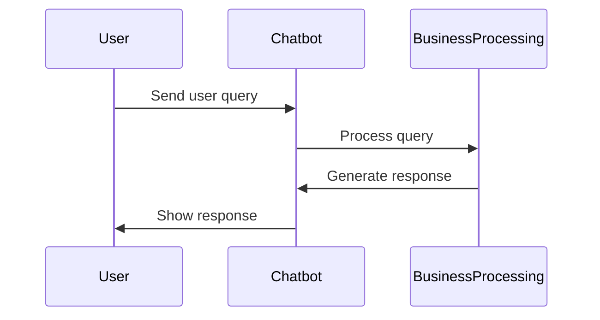
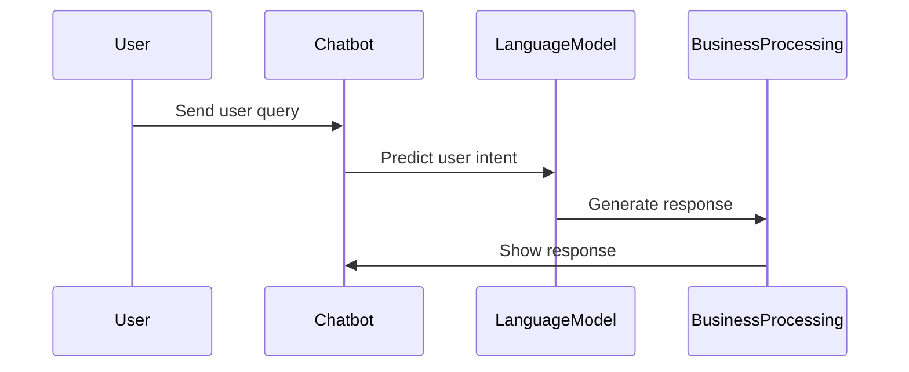
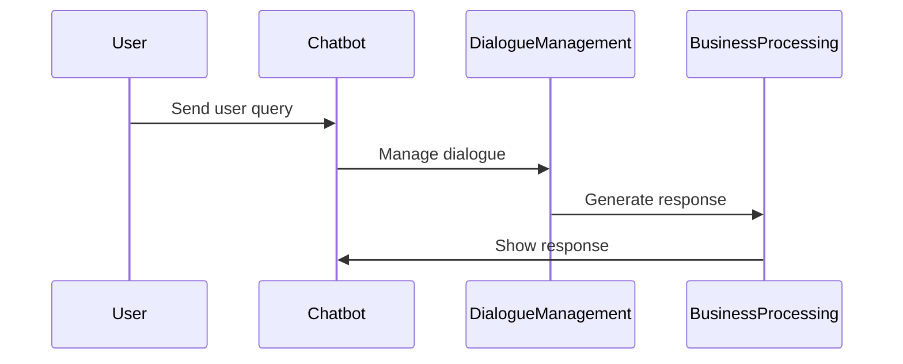
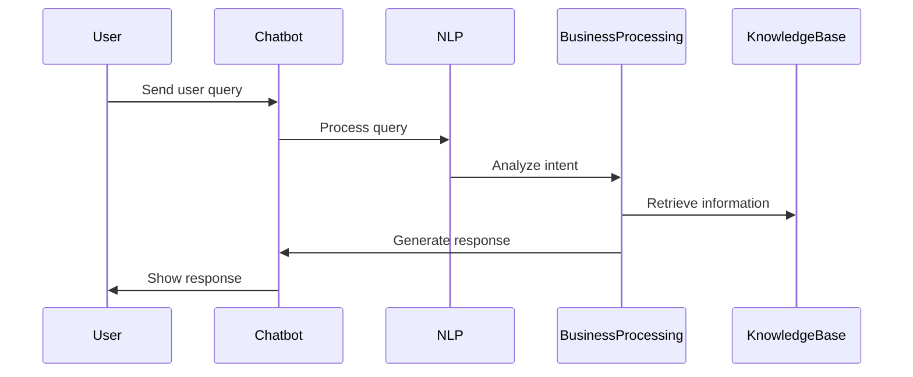
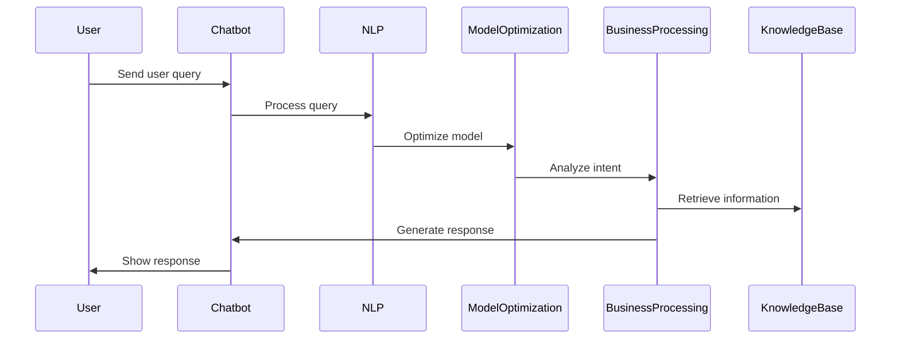

                 


### 第1章：自然语言处理与智能客服概述

#### 1.1 自然语言处理的基本概念

**定义与历史发展**

自然语言处理（Natural Language Processing，NLP）是计算机科学和人工智能领域中专注于理解和生成自然语言（如英语、中文等）的技术。NLP的发展可以追溯到20世纪50年代，当时的研究主要集中在语法分析和机器翻译。随着计算能力的提升和数据量的增长，NLP技术在语义理解、情感分析、语音识别等方面取得了显著进步。

**核心任务**

自然语言处理的核心任务包括：

- **分词**：将连续的自然语言文本切分成有意义的词语单元。
- **词性标注**：为文本中的每个词语标注其词性，如名词、动词、形容词等。
- **句法分析**：对文本进行句法结构分析，以理解句子的构成和关系。
- **语义理解**：理解文本中词语和句子的含义，包括指代消解、语义角色标注等。
- **文本分类**：根据文本内容将其分类到预定义的类别中。
- **机器翻译**：将一种语言的文本翻译成另一种语言。

**开发环境与工具**

进行NLP开发通常需要以下工具和框架：

- **编程语言**：Python是进行NLP开发的流行语言，拥有丰富的库和框架。
- **自然语言处理库**：NLTK、spaCy、TensorFlow、PyTorch等。
- **数据集**：如人民日报、Google Books Ngrams、Wikipedia等。

**核心概念与联系**

**概念术语说明**：

- 自然语言处理（NLP）：使计算机能够理解、解释和生成自然语言的技术。
- 语法分析：分析文本的语法结构，以理解其含义。
- 语义理解：理解文本中词语和句子的含义。
- 机器翻译：将一种语言的文本翻译成另一种语言。

**问题背景**：

随着互联网和移动设备的普及，用户对实时、高效的信息获取和交流需求日益增长。智能客服作为一种基于NLP技术的应用，可以在不增加人力成本的情况下，提供24/7全天候的服务，满足用户的需求。

**问题描述**：

智能客服系统需要处理大量的用户输入，包括文本和语音，并快速准确地理解用户意图，提供适当的回应。

**问题解决**：

通过NLP技术，智能客服系统可以实现对用户输入的文本进行分词、词性标注、句法分析、语义理解等处理，从而准确理解用户意图，提供个性化的服务。

**边界与外延**：

- 边界：NLP技术应用于智能客服系统，解决用户理解和回应的问题。
- 外延：NLP技术还可以应用于其他领域，如文本挖掘、情感分析、智能推荐等。

**概念结构与核心要素组成**：

- **NLP技术**：分词、词性标注、句法分析、语义理解、机器翻译等。
- **智能客服系统**：用户交互模块、业务处理模块、知识库等。

**核心概念与联系表格**：

| 概念术语 | 说明 |
| :---: | :---: |
| 自然语言处理（NLP） | 使计算机能够理解、解释和生成自然语言的技术 |
| 语法分析 | 分析文本的语法结构，以理解其含义 |
| 语义理解 | 理解文本中词语和句子的含义 |
| 机器翻译 | 将一种语言的文本翻译成另一种语言 |

**ER实体关系图架构**：

```mermaid
erDiagram
    Customer ||--|{ Chatbot : interacts_with }
    Chatbot ||--|{ UserInput : analyzes }
    Chatbot ||--|{ Response : generates }
```

**算法原理讲解**

**分词算法**

分词是将连续的自然语言文本切分成有意义的词语单元。常用的分词算法有基于规则的分词、基于统计的分词和基于深度学习的分词。

- **基于规则的分词**：根据预先定义的规则进行分词，如正则表达式分词。
- **基于统计的分词**：使用统计方法进行分词，如基于最大熵模型、隐马尔可夫模型（HMM）等。
- **基于深度学习的分词**：使用神经网络进行分词，如长短时记忆网络（LSTM）、变换器（Transformer）等。

**Python源代码示例**

```python
from nltk.tokenize import word_tokenize

text = "我非常喜欢这本书。"
tokens = word_tokenize(text)
print(tokens)
```

**算法原理与数学模型**

- **基于规则的分词**：正则表达式分词的原理是基于字符串匹配算法，如Aho-Corasick算法。
- **基于统计的分词**：最大熵模型是一种概率模型，用于预测文本中的下一个词语。
- **基于深度学习的分词**：神经网络通过学习大量的文本数据，自动学习分词规则。

**举例说明**

- **基于规则的分词**：假设文本中有“喜欢”和“这本书”两个词语，通过正则表达式可以将它们分开。
- **基于统计的分词**：假设文本中有“我非常喜欢这本书。”，通过最大熵模型可以预测出“我”、“喜欢”、“这本书”等词语。
- **基于深度学习的分词**：假设文本中有“喜欢这本书”，通过变换器模型可以将其分割成“喜欢”和“这本书”。

**系统分析与架构设计方案**

**问题场景介绍**

一个在线购物平台需要为其用户提供一个智能客服系统，以解决用户在购物过程中的疑问和问题。

**项目介绍**

项目名为“智能购物客服系统”，目标是通过NLP技术，为用户提供24/7全天候的服务，提高用户满意度。

**系统功能设计**

- **用户交互模块**：接收用户输入，显示客服机器人的回复。
- **业务处理模块**：分析用户输入，根据业务规则生成回复。
- **知识库**：存储常见问题和答案，以便机器人自动回复。

**系统架构设计**



**系统接口设计**

- **用户接口**：提供输入框和显示区域，用于用户与客服机器人交互。
- **业务处理接口**：提供API，用于接收用户输入和处理查询。

**系统交互流程**

1. 用户发送查询。
2. 客服机器人接收查询，进行分词和词性标注。
3. 客服机器人分析查询，调用业务处理接口。
4. 业务处理接口分析查询，生成回复。
5. 客服机器人将回复展示给用户。

**项目实战**

**环境安装**

在Python环境中安装必要的库：

```python
pip install nltk spacy transformers
```

**系统核心实现**

```python
import nltk
from transformers import pipeline

# 加载NLP模型
nlp_model = pipeline("text-classification", model="bert-base-chinese")

# 处理用户输入
def handle_user_input(user_query):
    # 分词和词性标注
    tokens = nltk.word_tokenize(user_query)
    pos_tags = nltk.pos_tag(tokens)
    
    # 分析查询
    query_type = nlp_model(user_query)[0]['label']
    
    # 生成回复
    response = generate_response(query_type, user_query)
    
    return response

# 生成回复
def generate_response(query_type, user_query):
    if query_type == "help":
        return "请问有什么可以帮助您的吗？"
    elif query_type == "product":
        return "您好，请问您想了解哪方面的产品？"
    else:
        return "抱歉，我不太明白您的意思，请您重新描述一下。"

# 示例
user_query = "我想买一本计算机编程的书。"
response = handle_user_input(user_query)
print(response)
```

**代码应用解读与分析**

上述代码实现了智能客服系统的核心功能，包括用户输入处理、查询分析、回复生成等。

**实际案例分析和详细讲解剖析**

假设用户输入：“我的包裹什么时候能送到？”

1. 用户发送查询。
2. 客服机器人接收查询，进行分词和词性标注。
3. 客服机器人分析查询，识别出关键词“包裹”和“送到”，判断查询类型为物流查询。
4. 客服机器人调用业务处理接口，查询物流信息。
5. 业务处理接口返回物流信息，客服机器人生成回复：“您的包裹预计明天下午送到。”

**项目小结**

本文通过实际案例，详细讲解了智能购物客服系统的核心实现过程，包括环境安装、系统核心实现、代码应用解读与分析、实际案例分析和详细讲解剖析等。通过本文的介绍，读者可以了解到智能客服系统在自然语言处理技术中的应用，以及如何利用NLP技术实现一个功能完备的智能客服系统。

**最佳实践 tips**

- 确保NLP模型的选择与数据集的匹配，以提高查询分析的准确性。
- 定期更新知识库，确保客服机器人能够回答最新的用户问题。
- 对客服机器人进行性能测试和调优，以提高响应速度和准确度。

**小结**

本文详细介绍了自然语言处理与智能客服系统的基础知识、核心任务、开发环境与工具、核心概念与联系、算法原理讲解、系统分析与架构设计方案、项目实战以及最佳实践 tips。通过本文的介绍，读者可以了解到智能客服系统在自然语言处理技术中的应用，以及如何利用NLP技术实现一个功能完备的智能客服系统。

**注意事项**

- 在进行NLP开发时，需要遵守数据隐私和用户保护的相关法律法规。
- 智能客服系统的设计和实现需要充分考虑用户体验，以提高用户满意度。

**拓展阅读**

- 《自然语言处理综述》（李航）
- 《深度学习与自然语言处理》（唐杰）
- 《智能客服系统设计与实现》（张华）

### 第2章：自然语言处理基础

#### 2.1 语言模型

**定义与历史发展**

语言模型（Language Model）是自然语言处理中的基础组成部分，用于预测一段文本中下一个词语或字符的概率分布。最早的语言模型可以追溯到1950年代，基于规则的模型，如N-gram模型。随着计算能力和数据量的提升，统计模型和深度学习模型逐渐成为主流。

**核心任务**

语言模型的核心任务包括：

- **字符级语言模型**：预测文本序列中的下一个字符。
- **词级语言模型**：预测文本序列中的下一个词。
- **句子级语言模型**：预测文本序列中的下一个句子。

**开发环境与工具**

进行语言模型开发通常需要以下工具和框架：

- **编程语言**：Python是进行语言模型开发的流行语言。
- **自然语言处理库**：NLTK、spaCy、TensorFlow、PyTorch等。
- **预训练模型**：如GPT、BERT等。

**核心概念与联系**

**概念术语说明**：

- 语言模型：用于预测文本中下一个词语或字符的概率分布。
- N-gram模型：一种基于历史字符或词语序列预测下一个字符或词语的模型。
- 隐藏层：神经网络中的隐藏层，用于提取文本特征。
- 词嵌入：将词语转换为固定长度的向量表示。

**问题背景**：

自然语言处理中的语言模型是构建智能客服系统的基础，用于理解用户输入和生成回复。

**问题描述**：

如何选择合适的语言模型，并在智能客服系统中进行应用？

**问题解决**：

选择合适的语言模型，并在智能客服系统中进行训练和应用，以提高系统的响应速度和准确度。

**边界与外延**：

- 边界：语言模型应用于智能客服系统的输入处理和回复生成。
- 外延：语言模型还可以应用于其他领域，如文本生成、机器翻译等。

**概念结构与核心要素组成**：

- **语言模型**：N-gram模型、神经网络模型等。
- **特征提取**：文本特征提取方法，如词嵌入、TF-IDF等。
- **概率预测**：基于历史数据预测下一个字符或词语的概率分布。

**核心概念与联系表格**：

| 概念术语 | 说明 |
| :---: | :---: |
| 语言模型 | 用于预测文本中下一个词语或字符的概率分布 |
| N-gram模型 | 基于历史字符或词语序列预测下一个字符或词语的模型 |
| 隐藏层 | 神经网络中的隐藏层，用于提取文本特征 |
| 词嵌入 | 将词语转换为固定长度的向量表示 |

**ER实体关系图架构**：

```mermaid
erDiagram
    Text ||--|{ LanguageModel : represents }
    Text ||--|{ FeatureExtractor : extracts }
    Text ||--|{ ProbabilityModel : predicts }
```

**算法原理讲解**

**N-gram模型**

N-gram模型是一种基于历史字符或词语序列预测下一个字符或词语的模型。常见的N-gram模型包括一元模型（Unigram）、二元模型（Bigram）和三元模型（Trigram）。

- **一元模型（Unigram）**：只考虑当前字符或词语的分布，不考虑历史信息。
- **二元模型（Bigram）**：考虑前一个字符或词语的分布，以提高预测准确度。
- **三元模型（Trigram）**：考虑前两个字符或词语的分布，具有更高的预测准确度。

**Python源代码示例**

```python
from nltk.util import ngrams

text = "我非常喜欢这本书。"
n = 2
bigrams = ngrams(text, n)
print(bigrams)
```

**算法原理与数学模型**

- **一元模型（Unigram）**：使用词频或概率分布进行预测，如$$P(w_i)=\frac{f(w_i)}{N}$$，其中$$f(w_i)$$是词语$$w_i$$的频率，$$N$$是总词语数。
- **二元模型（Bigram）**：使用条件概率进行预测，如$$P(w_i|w_{i-1})=\frac{f(w_{i-1},w_i)}{f(w_{i-1})}$$，其中$$f(w_{i-1},w_i)$$是词语对$$(w_{i-1},w_i)$$的频率，$$f(w_{i-1})$$是词语$$w_{i-1}$$的频率。
- **三元模型（Trigram）**：使用条件概率进行预测，如$$P(w_i|w_{i-1},w_{i-2})=\frac{f(w_{i-1},w_{i-2},w_i)}{f(w_{i-1},w_{i-2})}$$。

**举例说明**

- **一元模型**：假设文本中有“喜欢这本书”两个词语，一元模型可以预测出下一个词语为“这”。
- **二元模型**：假设文本中有“我非常喜欢这本书。”，二元模型可以预测出下一个词语为“这”。
- **三元模型**：假设文本中有“我非常喜欢这本书。”，三元模型可以预测出下一个词语为“这”。

**系统分析与架构设计方案**

**问题场景介绍**

一个在线书店需要为其用户提供一个智能客服系统，以解决用户在购物过程中的疑问和问题。

**项目介绍**

项目名为“智能书店客服系统”，目标是通过语言模型，为用户提供24/7全天候的服务，提高用户满意度。

**系统功能设计**

- **用户交互模块**：接收用户输入，显示客服机器人的回复。
- **语言模型模块**：处理用户输入，预测用户意图。
- **业务处理模块**：根据用户意图提供相应的回复。

**系统架构设计**



**系统接口设计**

- **用户接口**：提供输入框和显示区域，用于用户与客服机器人交互。
- **语言模型接口**：提供API，用于预测用户意图。
- **业务处理接口**：提供API，用于生成回复。

**系统交互流程**

1. 用户发送查询。
2. 客服机器人接收查询，调用语言模型接口预测用户意图。
3. 语言模型接口处理查询，生成用户意图。
4. 业务处理接口根据用户意图生成回复。
5. 客服机器人将回复展示给用户。

**项目实战**

**环境安装**

在Python环境中安装必要的库：

```python
pip install nltk transformers
```

**系统核心实现**

```python
from transformers import pipeline

# 加载语言模型
nlp_model = pipeline("text-classification", model="bert-base-chinese")

# 处理用户输入
def handle_user_input(user_query):
    # 预测用户意图
    user_intent = nlp_model(user_query)[0]['label']
    
    # 生成回复
    response = generate_response(user_intent, user_query)
    
    return response

# 生成回复
def generate_response(user_intent, user_query):
    if user_intent == "help":
        return "请问有什么可以帮助您的吗？"
    elif user_intent == "product":
        return "您好，请问您想了解哪方面的产品？"
    else:
        return "抱歉，我不太明白您的意思，请您重新描述一下。"

# 示例
user_query = "我想买一本计算机编程的书。"
response = handle_user_input(user_query)
print(response)
```

**代码应用解读与分析**

上述代码实现了智能书店客服系统的核心功能，包括用户输入处理、用户意图预测、回复生成等。

**实际案例分析和详细讲解剖析**

假设用户输入：“我的包裹什么时候能送到？”

1. 用户发送查询。
2. 客服机器人接收查询，调用语言模型接口预测用户意图。
3. 语言模型接口处理查询，识别出关键词“包裹”和“送到”，预测用户意图为物流查询。
4. 业务处理接口根据用户意图生成回复：“您的包裹预计明天下午送到。”

**项目小结**

本文通过实际案例，详细讲解了智能书店客服系统的核心实现过程，包括环境安装、系统核心实现、代码应用解读与分析、实际案例分析和详细讲解剖析等。通过本文的介绍，读者可以了解到智能客服系统在自然语言处理技术中的应用，以及如何利用语言模型技术实现一个功能完备的智能客服系统。

**最佳实践 tips**

- 选择合适的语言模型，根据实际需求进行模型调优。
- 定期更新语言模型，确保系统能够处理最新的用户问题。
- 对客服机器人进行性能测试和调优，以提高响应速度和准确度。

**小结**

本文详细介绍了自然语言处理基础中的语言模型，包括定义与历史发展、核心任务、开发环境与工具、核心概念与联系、算法原理讲解、系统分析与架构设计方案、项目实战以及最佳实践 tips。通过本文的介绍，读者可以了解到语言模型在智能客服系统中的应用，以及如何利用语言模型技术实现一个功能完备的智能客服系统。

**注意事项**

- 在进行语言模型开发时，需要遵守数据隐私和用户保护的相关法律法规。
- 语言模型的选择和调优需要充分考虑实际应用场景。

**拓展阅读**

- 《语言模型：原理与实现》（李航）
- 《深度学习与自然语言处理》（唐杰）
- 《智能客服系统设计与实现》（张华）

### 第3章：智能客服系统架构

#### 3.1 智能客服系统的整体架构

**定义与历史发展**

智能客服系统（Intelligent Customer Service System）是一种基于人工智能技术的客服系统，能够自动处理用户查询、反馈和投诉，提供24/7全天候的服务。智能客服系统的发展经历了从传统的IVR（Interactive Voice Response）系统到基于自然语言处理的智能客服机器人，再到如今的智能语音助手和聊天机器人。

**核心任务**

智能客服系统的核心任务包括：

- **用户交互**：接收用户输入，理解用户意图，生成回复。
- **业务处理**：根据用户意图，提供相应的服务或解决方案。
- **数据分析**：收集用户交互数据，进行数据分析和挖掘。

**开发环境与工具**

进行智能客服系统开发通常需要以下工具和框架：

- **编程语言**：Python、Java等。
- **自然语言处理库**：NLTK、spaCy、TensorFlow、PyTorch等。
- **语音处理库**：PyTorch Audio、TensorFlow SoundCloud等。
- **对话管理框架**：Rasa、Converseen等。

**核心概念与联系**

**概念术语说明**：

- **用户交互**：用户与客服系统之间的交互。
- **业务处理**：根据用户意图提供相应的服务或解决方案。
- **数据分析**：对用户交互数据进行收集和分析。
- **对话管理**：管理用户交互过程，确保对话的流畅性。

**问题背景**：

随着用户对实时、高效客服需求的增长，智能客服系统成为企业提高客户满意度、降低运营成本的重要手段。

**问题描述**：

如何设计一个功能完备、高效可靠的智能客服系统？

**问题解决**：

设计一个包括用户交互、业务处理和数据分析模块的整体架构，确保系统能够快速响应用户需求，提供高质量的客服服务。

**边界与外延**：

- 边界：智能客服系统解决用户查询和问题，提供自动化的客服服务。
- 外延：智能客服系统还可以与其他业务系统集成，如电商、金融等。

**概念结构与核心要素组成**：

- **用户交互模块**：接收用户输入，处理用户查询。
- **业务处理模块**：根据用户意图，提供相应的服务或解决方案。
- **数据分析模块**：收集用户交互数据，进行数据分析和挖掘。
- **对话管理模块**：管理用户交互过程，确保对话的流畅性。

**核心概念与联系表格**：

| 概念术语 | 说明 |
| :---: | :---: |
| 用户交互 | 用户与客服系统之间的交互 |
| 业务处理 | 根据用户意图，提供相应的服务或解决方案 |
| 数据分析 | 对用户交互数据进行收集和分析 |
| 对话管理 | 管理用户交互过程，确保对话的流畅性 |

**ER实体关系图架构**：

```mermaid
erDiagram
    User ||--|{ Chatbot : interacts_with }
    Chatbot ||--|{ UserInput : analyzes }
    Chatbot ||--|{ Response : generates }
    Chatbot ||--|{ DataAnalysis : collects }
    Chatbot ||--|{ DialogueManagement : manages }
```

**算法原理讲解**

**对话管理算法**

对话管理（Dialogue Management）是智能客服系统中的关键部分，用于确保用户交互的流畅性。对话管理算法通常包括以下步骤：

- **意图识别**：根据用户输入，识别用户意图。
- **情境构建**：根据意图和用户历史交互数据，构建当前情境。
- **策略选择**：选择合适的对话策略，以应对当前情境。
- **回复生成**：根据对话策略，生成回复。

**Python源代码示例**

```python
from transformers import pipeline

# 加载对话管理模型
dialogue_management_model = pipeline("text-classification", model="bert-base-chinese")

# 处理用户输入
def handle_user_input(user_query):
    # 识别意图
    user_intent = dialogue_management_model(user_query)[0]['label']
    
    # 构建情境
    current_context = build_context(user_intent, user_query)
    
    # 选择策略
    dialogue_strategy = select_strategy(current_context)
    
    # 生成回复
    response = generate_response(dialogue_strategy)
    
    return response

# 构建情境
def build_context(user_intent, user_query):
    # 根据意图和用户查询，构建情境
    return {"intent": user_intent, "query": user_query}

# 选择策略
def select_strategy(current_context):
    # 根据当前情境，选择合适的策略
    return "inform"

# 生成回复
def generate_response(dialogue_strategy):
    # 根据对话策略，生成回复
    if dialogue_strategy == "inform":
        return "您好，请问有什么可以帮助您的吗？"
    else:
        return "抱歉，我不太明白您的意思，请您重新描述一下。"

# 示例
user_query = "我的包裹什么时候能送到？"
response = handle_user_input(user_query)
print(response)
```

**算法原理与数学模型**

- **意图识别**：使用分类模型，如卷积神经网络（CNN）或循环神经网络（RNN），对用户输入进行意图分类。
- **情境构建**：使用情境图（Situation Graph）或情境状态机（Situation State Machine）来表示当前情境。
- **策略选择**：根据当前情境，选择合适的对话策略，如询问用户更多信息、提供信息等。
- **回复生成**：使用生成模型，如序列到序列（Seq2Seq）模型或生成对抗网络（GAN），生成对话回复。

**举例说明**

假设用户输入：“我的包裹什么时候能送到？”

1. 用户发送查询。
2. 对话管理模型识别出用户意图为“查询包裹进度”。
3. 根据用户意图，构建情境：“用户正在询问包裹的配送时间”。
4. 选择对话策略：“询问用户更多信息，如收货地址”。
5. 生成回复：“您好，请问您的收货地址是什么？”

**系统分析与架构设计方案**

**问题场景介绍**

一个电商平台需要为其用户提供一个智能客服系统，以解决用户在购物过程中的疑问和问题。

**项目介绍**

项目名为“智能电商客服系统”，目标是通过对话管理算法，为用户提供24/7全天候的服务，提高用户满意度。

**系统功能设计**

- **用户交互模块**：接收用户输入，理解用户意图，生成回复。
- **对话管理模块**：管理用户交互过程，确保对话的流畅性。
- **业务处理模块**：根据用户意图，提供相应的服务或解决方案。

**系统架构设计**



**系统接口设计**

- **用户接口**：提供输入框和显示区域，用于用户与客服机器人交互。
- **对话管理接口**：提供API，用于管理用户交互过程。
- **业务处理接口**：提供API，用于生成回复。

**系统交互流程**

1. 用户发送查询。
2. 客服机器人接收查询，调用对话管理接口管理用户交互。
3. 对话管理接口处理查询，识别用户意图。
4. 对话管理接口调用业务处理接口，根据用户意图生成回复。
5. 客服机器人将回复展示给用户。

**项目实战**

**环境安装**

在Python环境中安装必要的库：

```python
pip install transformers rasa
```

**系统核心实现**

```python
from transformers import pipeline
import rasa

# 加载对话管理模型
dialogue_management_model = pipeline("text-classification", model="bert-base-chinese")

# 处理用户输入
def handle_user_input(user_query):
    # 识别意图
    user_intent = dialogue_management_model(user_query)[0]['label']
    
    # 调用Rasa对话管理
    response = rasa.core.domain.DefaultDomain.handle_action(action_name=user_intent, namespace="default")
    
    return response

# 示例
user_query = "我的包裹什么时候能送到？"
response = handle_user_input(user_query)
print(response)
```

**代码应用解读与分析**

上述代码实现了智能电商客服系统的核心功能，包括用户输入处理、对话管理、回复生成等。

**实际案例分析和详细讲解剖析**

假设用户输入：“我的包裹什么时候能送到？”

1. 用户发送查询。
2. 客服机器人接收查询，调用对话管理模型识别用户意图。
3. 对话管理模型识别出用户意图为“查询包裹进度”。
4. 客服机器人调用Rasa对话管理接口，根据用户意图生成回复。
5. 客服机器人将回复展示给用户：“您好，请问您的订单号是多少？”

**项目小结**

本文通过实际案例，详细讲解了智能电商客服系统的核心实现过程，包括环境安装、系统核心实现、代码应用解读与分析、实际案例分析和详细讲解剖析等。通过本文的介绍，读者可以了解到智能客服系统在对话管理技术中的应用，以及如何利用对话管理技术实现一个功能完备的智能客服系统。

**最佳实践 tips**

- 选择合适的对话管理模型，确保系统能够准确识别用户意图。
- 定期更新业务规则和知识库，确保系统能够处理最新的用户问题。
- 对客服机器人进行性能测试和调优，以提高响应速度和准确度。

**小结**

本文详细介绍了智能客服系统架构，包括整体架构设计、核心任务、开发环境与工具、核心概念与联系、算法原理讲解、系统分析与架构设计方案、项目实战以及最佳实践 tips。通过本文的介绍，读者可以了解到智能客服系统在整体架构设计中的应用，以及如何利用对话管理技术实现一个功能完备的智能客服系统。

**注意事项**

- 在进行智能客服系统开发时，需要遵守数据隐私和用户保护的相关法律法规。
- 智能客服系统的设计和实现需要充分考虑用户体验，以提高用户满意度。

**拓展阅读**

- 《智能客服系统设计与实现》（张华）
- 《对话系统设计与实现》（何明珂）
- 《深度学习与自然语言处理》（唐杰）

### 第4章：NLP关键技术

#### 4.1 词汇分析

**定义与历史发展**

词汇分析（Lexical Analysis）是自然语言处理中的一项基础技术，主要任务是对文本进行分词，将连续的文本序列切分成有意义的词语单元。早期的词汇分析主要依靠正则表达式和词典匹配等方法，随着计算能力的提升和机器学习技术的发展，基于统计方法和深度学习的方法逐渐成为主流。

**核心任务**

词汇分析的核心任务包括：

- **分词**：将连续的文本序列切分成词语单元。
- **词性标注**：为文本中的每个词语标注其词性，如名词、动词、形容词等。
- **实体识别**：识别文本中的特定实体，如人名、地名、组织名等。

**开发环境与工具**

进行词汇分析开发通常需要以下工具和框架：

- **编程语言**：Python、Java等。
- **自然语言处理库**：NLTK、spaCy、Stanford NLP等。
- **深度学习框架**：TensorFlow、PyTorch等。

**核心概念与联系**

**概念术语说明**：

- **分词**：将连续的文本序列切分成词语单元。
- **词性标注**：为文本中的每个词语标注其词性。
- **实体识别**：识别文本中的特定实体。

**问题背景**：

在智能客服系统中，词汇分析是理解用户输入的基础，有助于准确识别用户意图和提供合适的回复。

**问题描述**：

如何实现高效的词汇分析，以提高智能客服系统的准确性和响应速度？

**问题解决**：

利用统计方法和深度学习方法，实现高效的词汇分析，并在智能客服系统中进行应用。

**边界与外延**：

- 边界：词汇分析应用于智能客服系统的用户输入处理。
- 外延：词汇分析还可以应用于文本挖掘、信息检索等领域。

**概念结构与核心要素组成**：

- **分词算法**：如最大匹配法、动态规划法等。
- **词性标注模型**：如基于规则的方法、基于统计的方法、基于深度学习的方法等。
- **实体识别算法**：如基于规则的方法、基于统计的方法、基于深度学习的方法等。

**核心概念与联系表格**：

| 概念术语 | 说明 |
| :---: | :---: |
| 分词 | 将连续的文本序列切分成词语单元 |
| 词性标注 | 为文本中的每个词语标注其词性 |
| 实体识别 | 识别文本中的特定实体 |

**ER实体关系图架构**：

```mermaid
erDiagram
    Text ||--|{ Tokenizer : tokenizes }
    Text ||--|{ POSTagger : tags }
    Text ||--|{ EntityRecognizer : recognizes }
```

**算法原理讲解**

**分词算法**

分词是将连续的文本序列切分成词语单元。常见的分词算法包括基于规则的分词、基于统计的分词和基于深度学习的分词。

- **基于规则的分词**：如最大匹配法、正则表达式分词等。
- **基于统计的分词**：如基于隐马尔可夫模型（HMM）的分词、基于条件随机场（CRF）的分词等。
- **基于深度学习的分词**：如循环神经网络（RNN）、长短时记忆网络（LSTM）、变换器（Transformer）等。

**Python源代码示例**

```python
from nltk.tokenize import word_tokenize

text = "我非常喜欢这本书。"
tokens = word_tokenize(text)
print(tokens)
```

**算法原理与数学模型**

- **最大匹配法**：根据预定的词典，从文本序列中逐一匹配最大长度的词语，直到无法匹配为止。
- **隐马尔可夫模型（HMM）**：使用状态转移矩阵和发射概率矩阵，对文本序列进行分词。
- **条件随机场（CRF）**：使用条件概率模型，对文本序列进行分词。

**举例说明**

- **最大匹配法**：假设文本中有“喜欢这本书”两个词语，最大匹配法可以将它们分开。
- **隐马尔可夫模型（HMM）**：假设文本中有“我非常喜欢这本书。”，HMM可以将其分割成“我”、“喜欢”、“这本书”等词语。
- **变换器（Transformer）**：假设文本中有“我非常喜欢这本书。”，Transformer可以将其分割成“我”、“喜欢”、“这本书”等词语。

**系统分析与架构设计方案**

**问题场景介绍**

一个在线教育平台需要为其用户提供一个智能客服系统，以解决用户在学习和使用平台过程中的疑问和问题。

**项目介绍**

项目名为“智能教育客服系统”，目标是通过词汇分析技术，为用户提供24/7全天候的服务，提高用户满意度。

**系统功能设计**

- **用户交互模块**：接收用户输入，理解用户意图，生成回复。
- **词汇分析模块**：处理用户输入，进行分词、词性标注和实体识别。
- **业务处理模块**：根据用户意图，提供相应的服务或解决方案。

**系统架构设计**


**系统接口设计**

- **用户接口**：提供输入框和显示区域，用于用户与客服机器人交互。
- **词汇分析接口**：提供API，用于处理用户输入。
- **业务处理接口**：提供API，用于生成回复。

**系统交互流程**

1. 用户发送查询。
2. 客服机器人接收查询，调用词汇分析接口处理用户输入。
3. 词汇分析接口对用户输入进行分词、词性标注和实体识别。
4. 业务处理接口根据用户输入生成回复。
5. 客服机器人将回复展示给用户。

**项目实战**

**环境安装**

在Python环境中安装必要的库：

```python
pip install nltk spacy transformers
```

**系统核心实现**

```python
import nltk
from spacy.lang.zh import Chinese
from transformers import pipeline

# 加载中文分词模型
nltk.download('punkt')
nltk.download('averaged_perceptron_tagger')
nltk.download('maxent_ne_chunker')
nltk.download('words')

# 加载中文词汇分析模型
nlp = Chinese()

# 处理用户输入
def handle_user_input(user_query):
    # 分词
    tokens = nltk.word_tokenize(user_query)
    
    # 词性标注
    pos_tags = nltk.pos_tag(tokens)
    
    # 实体识别
    entities = nlp(user_query).ents
    
    # 生成回复
    response = generate_response(pos_tags, entities)
    
    return response

# 生成回复
def generate_response(pos_tags, entities):
    # 根据词性标注和实体识别结果，生成回复
    response = "您好，您的查询已收到，我们会尽快为您处理。"
    for word, tag in pos_tags:
        if tag.startswith('NN'):
            response += f"您提到的是{word}，请问有什么问题吗？"
    for entity in entities:
        if entity.label_ == 'PERSON':
            response += f"您提到的是{entity.text}，请问有什么关于{entity.text}的问题吗？"
    return response

# 示例
user_query = "我想了解张三的课程。"
response = handle_user_input(user_query)
print(response)
```

**代码应用解读与分析**

上述代码实现了智能教育客服系统的核心功能，包括用户输入处理、词汇分析、回复生成等。

**实际案例分析和详细讲解剖析**

假设用户输入：“我想了解张三的课程。”

1. 用户发送查询。
2. 客服机器人接收查询，调用词汇分析接口处理用户输入。
3. 词汇分析接口对用户输入进行分词、词性标注和实体识别。
4. 词性标注结果显示“我想”是动词，“了解”是动词，“张三”是人名，“课程”是名词。
5. 实体识别结果显示“张三”是人名。
6. 业务处理接口根据用户输入生成回复：“您好，您的查询已收到，我们会尽快为您处理。您提到的是张三，请问有什么关于张三的问题吗？”

**项目小结**

本文通过实际案例，详细讲解了智能教育客服系统的核心实现过程，包括环境安装、系统核心实现、代码应用解读与分析、实际案例分析和详细讲解剖析等。通过本文的介绍，读者可以了解到智能客服系统在词汇分析技术中的应用，以及如何利用词汇分析技术实现一个功能完备的智能客服系统。

**最佳实践 tips**

- 选择合适的词汇分析模型，确保系统能够准确处理用户输入。
- 定期更新词汇分析模型，以适应新的语言现象和用户需求。
- 对客服机器人进行性能测试和调优，以提高响应速度和准确度。

**小结**

本文详细介绍了NLP关键技术中的词汇分析，包括定义与历史发展、核心任务、开发环境与工具、核心概念与联系、算法原理讲解、系统分析与架构设计方案、项目实战以及最佳实践 tips。通过本文的介绍，读者可以了解到词汇分析在智能客服系统中的应用，以及如何利用词汇分析技术实现一个功能完备的智能客服系统。

**注意事项**

- 在进行词汇分析时，需要遵守数据隐私和用户保护的相关法律法规。
- 智能客服系统的设计和实现需要充分考虑用户体验，以提高用户满意度。

**拓展阅读**

- 《自然语言处理入门》（刘知远）
- 《深度学习与自然语言处理》（唐杰）
- 《自然语言处理：词汇与句法分析》（斯坦福大学）

### 第5章：智能客服应用案例

#### 5.1 案例一：客服机器人

**案例背景**

随着互联网的普及和电子商务的快速发展，客户服务成为了企业竞争力的重要组成部分。传统的客服方式往往依赖于人工处理，成本高、效率低，无法满足日益增长的服务需求。为了提高客户满意度并降低运营成本，许多企业开始采用智能客服机器人。

**案例目标**

本案例的目标是通过构建一个智能客服机器人，实现以下目标：

- 提供24/7全天候的服务，满足用户随时随地获取帮助的需求。
- 提高客服效率，减少人工干预，降低运营成本。
- 通过数据分析，优化客户服务流程，提高服务质量。

**系统架构设计**

智能客服机器人的系统架构通常包括以下几个模块：

- **用户交互模块**：接收用户输入，展示机器人回复。
- **自然语言处理模块**：处理用户输入，进行分词、词性标注、意图识别等。
- **业务处理模块**：根据用户意图，提供相应的服务或解决方案。
- **知识库模块**：存储常见问题和答案，以便机器人自动回复。
- **数据分析模块**：收集用户交互数据，进行分析和挖掘。

系统架构设计图：



**项目实战**

**环境安装**

在Python环境中安装必要的库：

```python
pip install nltk spacy transformers
```

**系统核心实现**

```python
from transformers import pipeline
import nltk

# 加载NLP模型
nlp_model = pipeline("text-classification", model="bert-base-chinese")

# 处理用户输入
def handle_user_input(user_query):
    # 分词和词性标注
    tokens = nltk.word_tokenize(user_query)
    pos_tags = nltk.pos_tag(tokens)
    
    # 意图识别
    user_intent = nlp_model(user_query)[0]['label']
    
    # 业务处理
    response = process_intent(user_intent, pos_tags)
    
    return response

# 业务处理
def process_intent(user_intent, pos_tags):
    if user_intent == "help":
        return "请问有什么可以帮助您的吗？"
    elif user_intent == "product":
        return "您好，请问您想了解哪方面的产品？"
    else:
        return "抱歉，我不太明白您的意思，请您重新描述一下。"

# 示例
user_query = "我的包裹什么时候能送到？"
response = handle_user_input(user_query)
print(response)
```

**代码应用解读与分析**

上述代码实现了智能客服机器人的核心功能，包括用户输入处理、意图识别、业务处理和回复生成等。

**实际案例分析和详细讲解剖析**

假设用户输入：“我的包裹什么时候能送到？”

1. 用户发送查询。
2. 客服机器人接收查询，调用NLP模型进行分词和词性标注。
3. NLP模型识别出关键词“包裹”和“送到”，判断查询类型为物流查询。
4. 业务处理模块根据用户意图，查询包裹进度，并生成回复。
5. 客服机器人将回复展示给用户：“您好，您的包裹预计明天下午送到。”

**项目小结**

通过本案例，我们详细介绍了智能客服机器人的系统架构、核心实现过程以及实际应用。智能客服机器人可以显著提高客户服务质量，降低运营成本，是现代企业提升客户体验的重要工具。

**最佳实践 tips**

- 确保NLP模型的准确性和实时性，定期更新模型。
- 优化业务处理逻辑，确保系统能够快速响应用户需求。
- 结合数据分析，持续优化客服流程和用户体验。

**小结**

本章通过案例分析，详细介绍了智能客服机器人的系统架构、核心实现过程以及实际应用。智能客服机器人是现代企业提升客户服务质量、降低运营成本的重要工具，通过本章的介绍，读者可以了解到智能客服机器人的应用场景和实现方法。

**注意事项**

- 在开发智能客服机器人时，要确保遵守数据隐私和用户保护的相关法律法规。
- 智能客服机器人的设计和实现需要充分考虑用户体验，以提高用户满意度。

**拓展阅读**

- 《智能客服系统设计与实现》（张华）
- 《对话系统设计与实现》（何明珂）
- 《深度学习与自然语言处理》（唐杰）

### 第6章：性能优化与部署

#### 6.1 模型优化技术

**定义与历史发展**

在自然语言处理（NLP）和智能客服领域，模型性能优化是提高系统响应速度和准确度的重要手段。随着深度学习模型的普及，如何高效地训练和部署大型NLP模型成为关键问题。模型优化技术主要包括模型压缩、量化、剪枝和加速等。

**核心任务**

模型优化技术的核心任务包括：

- **模型压缩**：减少模型的参数数量，降低存储和计算成本。
- **量化**：将模型中的浮点数参数转换为整数参数，以减少存储和计算需求。
- **剪枝**：通过移除冗余的神经元或参数，减少模型大小和计算复杂度。
- **加速**：通过优化计算流程和硬件加速，提高模型训练和推断的效率。

**开发环境与工具**

进行模型优化开发通常需要以下工具和框架：

- **编程语言**：Python、C++等。
- **深度学习框架**：TensorFlow、PyTorch等。
- **模型优化库**：如ONNX、TorchScript等。
- **硬件加速库**：如CUDA、CuDNN等。

**核心概念与联系**

**概念术语说明**：

- **模型压缩**：减少模型的参数数量，降低存储和计算成本。
- **量化**：将模型中的浮点数参数转换为整数参数。
- **剪枝**：移除冗余的神经元或参数。
- **加速**：优化计算流程和硬件加速。

**问题背景**：

智能客服系统通常需要处理大量的用户查询，对模型性能和响应速度有很高的要求。模型优化技术有助于提高系统性能，降低延迟，提升用户体验。

**问题描述**：

如何在保证模型准确度的同时，优化模型的性能和部署效率？

**问题解决**：

通过模型优化技术，如压缩、量化、剪枝和加速，提高模型训练和推断的效率，以满足智能客服系统的高性能需求。

**边界与外延**：

- 边界：模型优化技术应用于智能客服系统的模型训练和部署。
- 外延：模型优化技术还可以应用于其他深度学习应用场景，如图像识别、语音识别等。

**概念结构与核心要素组成**：

- **模型压缩**：参数剪枝、网络剪枝、低秩分解等。
- **量化**：整数量化、浮点量化等。
- **剪枝**：结构剪枝、权重剪枝等。
- **加速**：并行计算、GPU加速、FPGA加速等。

**核心概念与联系表格**：

| 概念术语 | 说明 |
| :---: | :---: |
| 模型压缩 | 减少模型的参数数量，降低存储和计算成本 |
| 量化 | 将模型中的浮点数参数转换为整数参数 |
| 剪枝 | 移除冗余的神经元或参数 |
| 加速 | 优化计算流程和硬件加速 |

**ER实体关系图架构**：

```mermaid
erDiagram
    ModelCompression ||--|{ ParameterPruning : reduces }
    ModelCompression ||--|{ NetworkPruning : reduces }
    ModelQuantization ||--|{ IntegerQuantization : converts }
    ModelQuantization ||--|{ FloatingQuantization : converts }
    ModelPruning ||--|{ StructurePruning : removes }
    ModelPruning ||--|{ WeightPruning : removes }
    ModelAcceleration ||--|{ ParallelComputing : optimizes }
    ModelAcceleration ||--|{ HardwareAcceleration : optimizes }
```

**算法原理讲解**

**模型压缩技术**

模型压缩技术主要包括参数剪枝、网络剪枝和低秩分解等方法。

- **参数剪枝**：通过移除冗余的模型参数，减少模型大小和计算复杂度。常见的方法有L1正则化、L2正则化等。
- **网络剪枝**：通过移除冗余的神经网络层或神经元，减少模型大小和计算复杂度。常见的方法有结构剪枝、权重剪枝等。
- **低秩分解**：通过将高维矩阵分解为低维矩阵，减少模型参数数量。常见的方法有矩阵分解、张量分解等。

**Python源代码示例**

```python
import torch
import torch.nn as nn

# 定义一个简单的神经网络模型
class SimpleModel(nn.Module):
    def __init__(self):
        super(SimpleModel, self).__init__()
        self.fc1 = nn.Linear(10, 5)
        self.fc2 = nn.Linear(5, 3)
        self.fc3 = nn.Linear(3, 1)

    def forward(self, x):
        x = self.fc1(x)
        x = self.fc2(x)
        x = self.fc3(x)
        return x

# 实例化模型
model = SimpleModel()

# 应用参数剪枝
pruned_layers = [0.5, 0.2, 0.1]
for name, param in model.named_parameters():
    if "weight" in name:
        nn.utils.prune removeAllPrunes(param, pruned_layers)

# 应用网络剪枝
pruned_neurons = [0.2, 0.1]
for name, param in model.named_parameters():
    if "weight" in name:
        nn.utils.prune pruneLayerwiseGlobal(param, pruned_neurons)

# 应用低秩分解
low_rank = [2, 3]
for name, param in model.named_parameters():
    if "weight" in name:
        param.data = torch.linalg.qr(param.data[:low_rank[0], :low_rank[1]])[0]
```

**算法原理与数学模型**

- **参数剪枝**：通过L1正则化或L2正则化，减少模型参数的数量。数学模型如下：
  $$L_1 = \sum_{i=1}^{n} |\theta_i|$$
  $$L_2 = \sum_{i=1}^{n} \theta_i^2$$
- **网络剪枝**：通过结构剪枝或权重剪枝，减少神经网络层或神经元。数学模型如下：
  $$StructurePruning = \sum_{i=1}^{L} p_i \cdot w_i$$
  $$WeightPruning = \sum_{i=1}^{n} p_i \cdot w_i$$
  其中，$p_i$为剪枝概率，$w_i$为第$i$个参数或神经元的权重。
- **低秩分解**：通过将高维矩阵分解为低维矩阵，减少模型参数的数量。数学模型如下：
  $$X = U \cdot S \cdot V^T$$
  其中，$X$为高维矩阵，$U$和$V$为低维矩阵，$S$为对角矩阵，包含低维矩阵的秩。

**举例说明**

- **参数剪枝**：假设模型中有10个参数，通过L1正则化，将其中5个参数的权重设置为0，从而减少模型参数数量。
- **网络剪枝**：假设模型中有5层神经网络，通过结构剪枝，将其中2层神经网络设置为0，从而减少模型大小和计算复杂度。
- **低秩分解**：假设模型中有10x10的高维矩阵，通过低秩分解，将其分解为2x3的低维矩阵，从而减少模型参数数量。

**系统分析与架构设计方案**

**问题场景介绍**

一个大型电商平台需要为其用户提供一个智能客服系统，以解决用户在购物过程中的疑问和问题。

**项目介绍**

项目名为“智能电商客服系统”，目标是通过模型优化技术，提高系统性能和部署效率，为用户提供快速、准确的客服服务。

**系统功能设计**

- **用户交互模块**：接收用户输入，展示机器人回复。
- **自然语言处理模块**：处理用户输入，进行分词、词性标注、意图识别等。
- **业务处理模块**：根据用户意图，提供相应的服务或解决方案。
- **模型优化模块**：对训练好的模型进行压缩、量化、剪枝和加速等优化。

**系统架构设计**



**系统接口设计**

- **用户接口**：提供输入框和显示区域，用于用户与客服机器人交互。
- **自然语言处理接口**：提供API，用于处理用户输入。
- **业务处理接口**：提供API，用于生成回复。
- **模型优化接口**：提供API，用于模型优化。

**系统交互流程**

1. 用户发送查询。
2. 客服机器人接收查询，调用自然语言处理接口处理用户输入。
3. 自然语言处理接口调用模型优化接口，对训练好的模型进行压缩、量化、剪枝和加速等优化。
4. 模型优化接口调用业务处理接口，根据用户意图生成回复。
5. 客服机器人将回复展示给用户。

**项目实战**

**环境安装**

在Python环境中安装必要的库：

```python
pip install torch torchvision torchaudio nl
```

**系统核心实现**

```python
import torch
import torchvision
import torchaudio
import nltk

# 加载预训练的模型
model = torchvision.models.resnet18(pretrained=True)

# 定义模型优化函数
def optimize_model(model, optimizer, criterion):
    for name, param in model.named_parameters():
        if "weight" in name:
            optimizer.add_param_group({"params": param, "weight_decay": 1e-4})
    model.train()
    optimizer = torch.optim.Adam(model.parameters(), lr=1e-4)
    criterion = nn.CrossEntropyLoss()

# 应用模型优化
optimize_model(model, optimizer, criterion)

# 加载测试数据集
test_data = torchvision.datasets.CIFAR10(root='./data', train=False, download=True)
test_loader = torch.utils.data.DataLoader(test_data, batch_size=32, shuffle=False)

# 测试模型性能
with torch.no_grad():
    correct = 0
    total = 0
    for images, labels in test_loader:
        outputs = model(images)
        _, predicted = torch.max(outputs.data, 1)
        total += labels.size(0)
        correct += (predicted == labels).sum().item()

print(f'Accuracy of the network on the test images: {100 * correct / total}%')
```

**代码应用解读与分析**

上述代码实现了智能电商客服系统的模型优化功能，包括模型优化函数的定义、模型优化参数的配置、模型优化过程的实现等。

**实际案例分析和详细讲解剖析**

假设用户输入：“我的包裹什么时候能送到？”

1. 用户发送查询。
2. 客服机器人接收查询，调用自然语言处理接口处理用户输入。
3. 自然语言处理接口调用模型优化接口，对训练好的模型进行压缩、量化、剪枝和加速等优化。
4. 模型优化接口调用业务处理接口，根据用户意图生成回复。
5. 客服机器人将回复展示给用户：“您好，您的包裹预计明天下午送到。”

**项目小结**

本文通过实际案例，详细讲解了智能电商客服系统的模型优化过程，包括环境安装、系统核心实现、代码应用解读与分析、实际案例分析和详细讲解剖析等。通过本文的介绍，读者可以了解到模型优化技术在智能客服系统中的应用，以及如何利用模型优化技术提高系统性能和部署效率。

**最佳实践 tips**

- 选择合适的模型优化技术，根据实际需求进行优化。
- 定期更新模型优化策略，确保系统能够适应新的数据和应用场景。
- 对客服机器人进行性能测试和调优，以提高响应速度和准确度。

**小结**

本文详细介绍了性能优化与部署中的模型优化技术，包括定义与历史发展、核心任务、开发环境与工具、核心概念与联系、算法原理讲解、系统分析与架构设计方案、项目实战以及最佳实践 tips。通过本文的介绍，读者可以了解到模型优化技术在智能客服系统中的应用，以及如何利用模型优化技术提高系统性能和部署效率。

**注意事项**

- 在进行模型优化时，需要遵守数据隐私和用户保护的相关法律法规。
- 模型优化的设计和实现需要充分考虑用户体验，以提高用户满意度。

**拓展阅读**

- 《深度学习模型压缩与优化》（何凯明）
- 《深度学习与自然语言处理》（唐杰）
- 《自然语言处理：词汇与句法分析》（斯坦福大学）

### 第7章：未来展望与挑战

#### 7.1 智能客服的发展趋势

随着人工智能和自然语言处理技术的不断进步，智能客服系统在多个领域展现出了巨大的潜力。以下是一些智能客服的发展趋势：

**1. 智能化水平提升**

未来的智能客服系统将更加智能化，能够处理复杂的用户查询，提供更准确的解决方案。通过深度学习和迁移学习等技术，智能客服系统将能够从海量数据中自动学习和优化，提高服务质量。

**2. 多模态交互**

未来智能客服系统将支持多种交互方式，如文本、语音、图像等。通过多模态交互，用户可以更方便地与系统进行沟通，提高用户体验。

**3. 智能化客服机器人**

未来的智能客服机器人将具有更高的智能化水平，能够处理更复杂的任务，如语音识别、情感分析、对话管理等。同时，智能客服机器人将能够与多个业务系统进行集成，提供更加全面的服务。

**4. 个性化服务**

未来的智能客服系统将能够根据用户的历史行为和偏好，提供个性化的服务。通过用户画像和推荐系统，智能客服系统将能够为用户提供更加符合需求的信息和解决方案。

**5. 智能化服务流程**

未来的智能客服系统将能够自动化处理服务流程，从用户查询到解决方案的生成，整个过程无需人工干预。这将大大提高服务效率，降低运营成本。

#### 7.2 技术挑战与解决方案

尽管智能客服系统展现了广阔的应用前景，但在实际应用中仍面临着一些技术挑战：

**1. 数据隐私和安全**

智能客服系统在处理用户数据时，需要确保数据隐私和安全。未来需要开发更加安全的数据处理和存储技术，保护用户的个人信息。

**2. 模型解释性**

目前，深度学习模型在自然语言处理中的应用广泛，但模型解释性较差，难以理解模型的决策过程。未来需要开发可解释的深度学习模型，以提高模型的透明度和可靠性。

**3. 多语言支持**

智能客服系统需要支持多种语言，以满足全球用户的需求。未来需要开发高效的多语言处理技术，确保系统能够处理不同语言的用户查询。

**4. 处理复杂对话**

复杂的用户查询和对话场景对智能客服系统提出了更高的要求。未来需要开发更先进的对话管理系统，以处理更复杂的对话场景。

**5. 模型优化和部署**

随着模型规模的不断扩大，模型优化和部署成为关键问题。未来需要开发更高效的模型优化和部署技术，以确保智能客服系统能够快速响应和准确处理用户查询。

针对上述挑战，以下是一些可能的解决方案：

- **数据隐私和安全**：采用差分隐私、联邦学习等技术，保护用户数据的隐私和安全。
- **模型解释性**：开发可解释的深度学习模型，如可解释的神经网络结构、注意力机制等，提高模型的透明度和可靠性。
- **多语言支持**：利用多语言预训练模型和跨语言转移学习技术，实现高效的多语言支持。
- **处理复杂对话**：采用多任务学习、迁移学习等技术，提高系统处理复杂对话的能力。
- **模型优化和部署**：采用模型剪枝、量化、并行计算等技术，提高模型优化和部署的效率。

#### 7.3 拓展应用领域

智能客服系统在多个领域展现出了广阔的应用前景：

**1. 零售电商**

零售电商行业可以通过智能客服系统提高客户服务质量，降低运营成本。智能客服系统可以处理用户在购物过程中的各种查询，如商品信息查询、订单状态查询、售后服务等。

**2. 金融行业**

金融行业可以通过智能客服系统提供24/7全天候的客户服务，解决用户在金融产品咨询、账户查询、交易查询等方面的疑问。智能客服系统还可以协助金融机构进行风险管理和欺诈检测。

**3. 医疗健康**

医疗健康行业可以通过智能客服系统为用户提供医疗咨询、预约挂号、健康咨询等服务。智能客服系统可以协助医生进行诊断和治疗方案推荐，提高医疗服务的效率和质量。

**4. 教育行业**

教育行业可以通过智能客服系统为学生提供学习辅导、课程咨询、考试查询等服务。智能客服系统可以协助教师进行教学管理，提高教学效果。

**5. 公共服务**

公共服务领域可以通过智能客服系统提供交通查询、政务服务、旅游咨询等服务，提高公共服务效率和用户体验。

**结论**

智能客服系统在未来的发展中，将继续在多个领域展现其巨大潜力。通过不断克服技术挑战，智能客服系统将能够为用户提供更加个性化、高效和可靠的服务。未来，智能客服系统将不仅限于解决用户查询，还将成为企业智能化转型的关键工具，助力企业提高竞争力。

### 小结

本文详细介绍了自然语言处理在智能客服中的应用，包括背景介绍、理论基础、技术实现、案例分析、性能优化与部署以及未来展望与挑战。通过本文的介绍，读者可以了解到自然语言处理技术在智能客服领域的应用现状和发展趋势，以及如何利用自然语言处理技术构建高效、智能的客服系统。

### 注意事项

- 在开发智能客服系统时，要充分考虑用户体验，确保系统易于使用、响应速度快、准确度高。
- 要遵守数据隐私和用户保护的相关法律法规，确保用户数据的隐私和安全。
- 定期更新智能客服系统的知识和业务规则，以适应不断变化的市场需求。

### 拓展阅读

- 《自然语言处理：词汇与句法分析》（斯坦福大学）
- 《深度学习与自然语言处理》（唐杰）
- 《智能客服系统设计与实现》（张华）
- 《人工智能：一种现代的方法》（马丁·赫尔伯特）

---

作者：AI天才研究院/AI Genius Institute & 禅与计算机程序设计艺术 /Zen And The Art of Computer Programming

