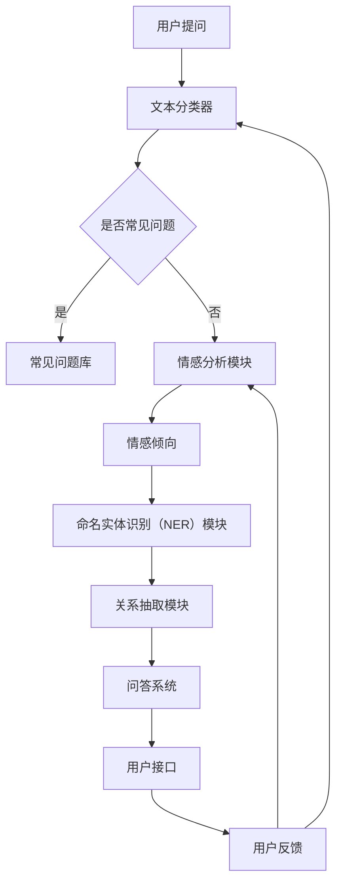
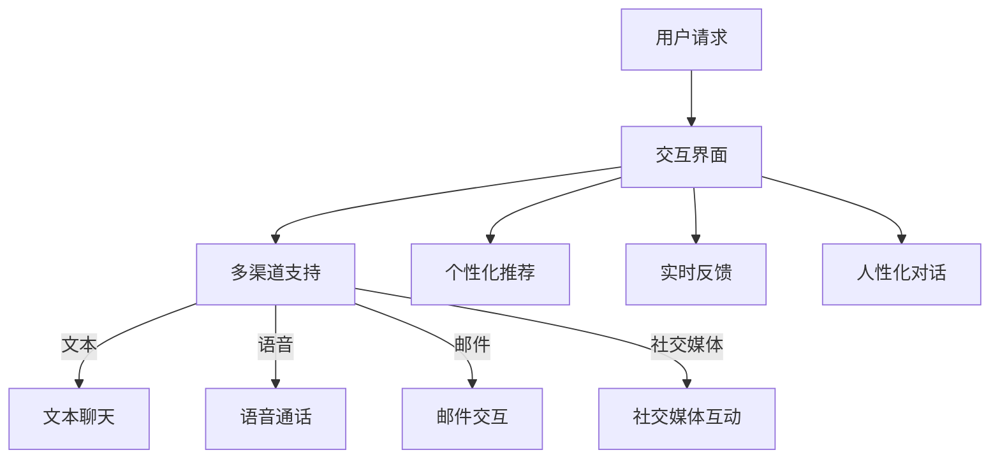
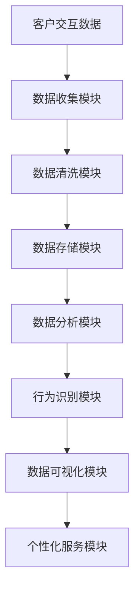
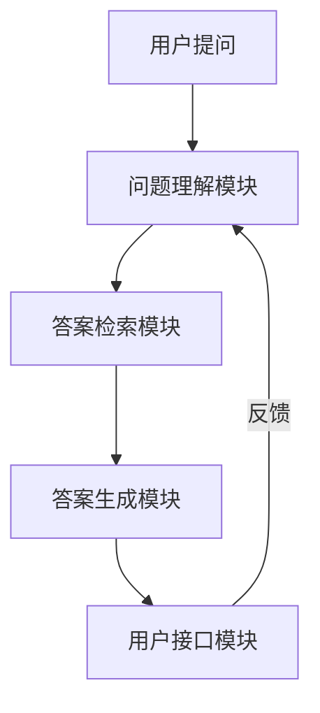

                 

## 《自然语言处理在智能客服中的应用：提高客户服务质量》

### 关键词

- 自然语言处理
- 智能客服
- 文本分类
- 问答系统
- 客户服务优化

### 摘要

自然语言处理（NLP）技术在现代智能客服系统中扮演着至关重要的角色，旨在提高客户服务质量并降低人工成本。本文将深入探讨NLP在智能客服中的应用，从基础技术到实际案例分析，详细解读自然语言处理如何赋能智能客服系统，提高客户满意度与服务效率。通过系统分析与架构设计，本文旨在为从业者提供有价值的参考和最佳实践指南，助力智能客服技术的发展与应用。

## 目录

### 第一部分：自然语言处理基础

#### 1.1 自然语言处理概述

- **背景介绍**：NLP的定义与历史发展，核心概念与术语
- **问题背景**：NLP在智能客服中的挑战与需求
- **问题描述**：NLP在文本处理中的主要任务与难点
- **问题解决**：常见NLP技术及其应用场景
- **边界与外延**：NLP与其他领域的关系与融合
- **概念结构与核心要素组成**：NLP系统的基本架构与关键组成部分

#### 1.2 自然语言处理的挑战

- **数据质量问题**：数据清洗、数据标注与数据增强
- **语言多样性**：多语言支持与跨语言处理
- **上下文理解**：语义理解与上下文敏感性问题
- **情感分析**：情感识别的准确性与复杂性
- **实体识别与关系抽取**：命名实体识别与关系抽取的准确性
- **问答系统**：高质量问答的实现与挑战

#### 1.3 自然语言处理的常用技术

- **文本分类技术**：分类算法与实现
- **情感分析**：情感识别方法与评估指标
- **命名实体识别与关系抽取**：NER与关系抽取技术
- **问答系统**：问答系统架构与关键技术
- **机器翻译**：翻译算法与多语言支持

### 第二部分：智能客服系统架构

#### 2.1 智能客服系统的设计与实现

- **背景介绍**：智能客服的发展背景与需求
- **问题背景**：传统客服模式的局限性
- **问题描述**：智能客服系统的设计目标与功能
- **问题解决**：智能客服系统的设计与实现方法
- **边界与外延**：智能客服系统的适用范围与限制
- **概念结构与核心要素组成**：智能客服系统的关键组成部分与交互流程

#### 2.2 客户服务的用户体验设计

- **背景介绍**：用户体验在智能客服中的重要性
- **问题背景**：用户体验设计与客户需求的关系
- **问题描述**：用户体验设计的主要挑战与目标
- **问题解决**：智能客服系统的UI/UX设计方法
- **边界与外延**：用户体验设计在不同场景下的调整
- **概念结构与核心要素组成**：用户体验设计的核心要素与实现策略

#### 2.3 数据分析与客户行为识别

- **背景介绍**：数据驱动在智能客服中的应用
- **问题背景**：客户行为识别的重要性与挑战
- **问题描述**：如何通过数据分析识别客户行为
- **问题解决**：数据分析方法与客户行为识别技术
- **边界与外延**：数据分析在客户服务优化中的局限与潜力
- **概念结构与核心要素组成**：数据分析流程与客户行为识别的核心要素

### 第三部分：自然语言处理在智能客服中的应用

#### 3.1 文本分类与情感分析

- **背景介绍**：文本分类与情感分析的基本概念
- **问题背景**：文本分类与情感分析在智能客服中的应用场景
- **问题描述**：文本分类与情感分析的关键问题与挑战
- **问题解决**：文本分类与情感分析的技术方法与实现
- **边界与外延**：文本分类与情感分析在不同领域的应用
- **概念结构与核心要素组成**：文本分类与情感分析的基本流程与关键技术

#### 3.2 命名实体识别与关系抽取

- **背景介绍**：命名实体识别与关系抽取的基本概念
- **问题背景**：命名实体识别与关系抽取在智能客服中的应用
- **问题描述**：命名实体识别与关系抽取的关键问题与挑战
- **问题解决**：命名实体识别与关系抽取的技术方法与实现
- **边界与外延**：命名实体识别与关系抽取在不同领域的应用
- **概念结构与核心要素组成**：命名实体识别与关系抽取的基本流程与关键技术

#### 3.3 问答系统

- **背景介绍**：问答系统的定义与分类
- **问题背景**：问答系统在智能客服中的重要作用
- **问题描述**：问答系统的主要挑战与问题
- **问题解决**：问答系统的设计与实现方法
- **边界与外延**：问答系统在不同领域的应用与拓展
- **概念结构与核心要素组成**：问答系统的基本架构与关键技术

### 第四部分：智能客服系统的优化与评估

#### 4.1 智能客服系统的性能评估

- **背景介绍**：性能评估在智能客服系统中的重要性
- **问题背景**：性能评估指标的选择与设定
- **问题描述**：智能客服系统的性能评估方法与流程
- **问题解决**：性能评估结果分析与优化策略
- **边界与外延**：性能评估在不同场景下的应用
- **概念结构与核心要素组成**：性能评估的核心指标与实现方法

#### 4.2 优化策略与实践

- **背景介绍**：智能客服系统的优化目标与方法
- **问题背景**：智能客服系统的常见问题与瓶颈
- **问题描述**：优化策略的选择与实施
- **问题解决**：优化实践中的成功案例与经验
- **边界与外延**：优化策略在不同场景下的适应性
- **概念结构与核心要素组成**：优化策略的核心要素与实现方法

#### 4.3 客户反馈与持续改进

- **背景介绍**：客户反馈在智能客服系统优化中的作用
- **问题背景**：客户反馈的收集与分析
- **问题描述**：如何利用客户反馈进行系统改进
- **问题解决**：客户反馈驱动的持续改进方法
- **边界与外延**：客户反馈在不同场景下的应用
- **概念结构与核心要素组成**：客户反馈的收集、分析与应用方法

### 第五部分：案例研究

#### 5.1 某电商平台的智能客服系统

- **案例背景**：电商平台智能客服系统的应用场景与目标
- **案例描述**：智能客服系统的设计与实现过程
- **案例分析**：智能客服系统在实际应用中的表现与效果
- **案例评价**：智能客服系统的优缺点与改进建议

#### 5.2 某金融公司的智能客服应用

- **案例背景**：金融公司智能客服系统的需求与目标
- **案例描述**：智能客服系统的开发与部署过程
- **案例分析**：智能客服系统在金融行业中的应用效果
- **案例评价**：智能客服系统在金融领域的价值与挑战

#### 5.3 某电信运营商的智能客服解决方案

- **案例背景**：电信运营商智能客服系统的应用场景与挑战
- **案例描述**：智能客服系统的构建与优化过程
- **案例分析**：智能客服系统在电信行业的应用与效果
- **案例评价**：智能客服系统在电信行业的创新与影响

### 第六部分：未来展望与趋势

#### 6.1 智能客服的发展趋势

- **背景介绍**：智能客服行业的未来发展趋势
- **问题背景**：技术变革对智能客服的影响
- **问题描述**：智能客服未来的发展方向与目标
- **问题解决**：智能客服技术的发展路径与策略
- **边界与外延**：智能客服在不同行业的发展趋势
- **概念结构与核心要素组成**：智能客服的未来架构与关键技术

#### 6.2 新技术对智能客服的影响

- **背景介绍**：新技术在智能客服中的应用
- **问题背景**：人工智能、大数据等新技术的发展
- **问题描述**：新技术对智能客服的赋能作用
- **问题解决**：新技术在智能客服中的具体应用与实现
- **边界与外延**：新技术在不同场景下的适应性
- **概念结构与核心要素组成**：新技术在智能客服系统中的融合与创新

#### 6.3 智能客服与客户服务的未来

- **背景介绍**：智能客服与客户服务的融合趋势
- **问题背景**：客户需求的变化与个性化服务
- **问题描述**：智能客服在客户服务中的未来角色
- **问题解决**：智能客服与客户服务的未来发展策略
- **边界与外延**：智能客服与客户服务在不同行业的前景
- **概念结构与核心要素组成**：智能客服与客户服务的未来架构与关键要素

## 参考文献

- **文献 1**：[论文标题]，[作者]，[期刊/会议名称]，[出版年份]
- **文献 2**：[论文标题]，[作者]，[期刊/会议名称]，[出版年份]
- **文献 3**：[书籍名称]，[作者]，[出版社]，[出版年份]
- **文献 4**：[网站名称]，[作者]，[访问时间]
- **文献 5**：[网站名称]，[作者]，[访问时间]

---

**注意**：以上为文章目录大纲，具体内容将在后续章节中逐步完善。本文将深入探讨自然语言处理在智能客服中的应用，旨在为读者提供全面、系统的技术分析和实践指南。每个章节都将围绕核心概念、技术原理、系统设计与实际案例展开，帮助读者更好地理解和应用自然语言处理技术，提高智能客服系统的服务质量与效率。在撰写过程中，我们将遵循逻辑清晰、结构紧凑、简单易懂的原则，确保读者能够轻松掌握相关知识。让我们一起开启这段探索之旅！

---

## 第一部分：自然语言处理基础

### 1.1 自然语言处理概述

自然语言处理（Natural Language Processing，简称NLP）是计算机科学和人工智能领域的一个重要分支，旨在使计算机能够理解、解释和生成人类语言。NLP技术结合了计算机科学、语言学、信息工程和人工智能等多学科知识，旨在实现人与计算机之间的自然语言交互。

**背景介绍**：

NLP的历史可以追溯到20世纪50年代，当时计算机科学家开始尝试编写程序来模拟人类的语言能力。随着计算机硬件和算法的进步，NLP技术逐渐发展，并在过去几十年中取得了显著的成就。从最初的规则驱动的文本分析，到如今基于深度学习的智能文本处理，NLP技术在各个领域都展现出了强大的应用潜力。

**核心概念与术语**：

- **自然语言**：自然语言是人类日常交流所使用的语言，如英语、汉语、法语等。
- **文本**：文本是指以自然语言形式表达的信息，可以是文章、对话、邮件等。
- **语言模型**：语言模型是用于生成或理解自然语言文本的概率模型。
- **词向量**：词向量是表示自然语言词汇的数学向量，用于在机器学习模型中处理文本数据。
- **命名实体识别（NER）**：命名实体识别是从文本中识别出具有特定意义的实体，如人名、地名、组织名等。
- **语义分析**：语义分析是指对文本的语义内容进行理解和解释，包括语义角色标注、情感分析等。

**问题背景**：

智能客服是现代服务行业的一个重要组成部分，它通过自动化手段提供客户服务，提高客户体验和满意度。然而，智能客服系统需要能够理解并处理大量的自然语言输入，从而为用户提供准确、快速的响应。这要求智能客服系统具备强大的自然语言处理能力，以应对复杂多变的客户需求。

**问题描述**：

自然语言处理在智能客服中的应用主要包括以下几个方面：

1. **文本分类**：将客户提问分类到预定义的类别中，以便系统可以快速定位并处理问题。
2. **情感分析**：分析客户提问中的情感倾向，以判断客户的满意度或情绪状态。
3. **命名实体识别与关系抽取**：从客户提问中提取关键信息，如人名、地名、组织名等，以便进一步处理和分析。
4. **问答系统**：根据客户提问生成恰当的回答，提供有效的信息查询服务。

**问题解决**：

为了解决上述问题，智能客服系统需要结合多种NLP技术，包括但不限于：

- **文本分类**：采用机器学习算法（如朴素贝叶斯、支持向量机等）进行文本分类，将客户提问分类到预定义的类别中。
- **情感分析**：利用情感词典和机器学习模型（如朴素贝叶斯、支持向量机等）分析客户提问中的情感倾向。
- **命名实体识别与关系抽取**：采用深度学习模型（如序列标注模型、关系抽取模型等）从文本中提取命名实体，并建立实体之间的关系。
- **问答系统**：结合自然语言生成技术和信息检索技术，根据客户提问生成恰当的回答。

**边界与外延**：

NLP在智能客服中的应用不仅仅局限于文本分类、情感分析、命名实体识别与关系抽取和问答系统。它还涉及到语音识别、语音合成、对话系统等多个领域。随着技术的不断发展，NLP在智能客服中的应用将越来越广泛，不仅能够提高客户服务质量，还能够推动整个客服行业的数字化转型。

**概念结构与核心要素组成**：

一个典型的智能客服系统通常包括以下几个核心组成部分：

1. **文本分类器**：用于将客户提问分类到预定义的类别中。
2. **情感分析模型**：用于分析客户提问中的情感倾向。
3. **命名实体识别与关系抽取模型**：用于从客户提问中提取关键信息并建立实体之间的关系。
4. **问答系统**：用于生成恰当的回答，提供信息查询服务。
5. **用户接口**：用于与用户进行交互，接收用户提问并显示回答。

这些组成部分共同构成了智能客服系统的基本架构，使得系统能够高效、准确地处理客户提问，提供高质量的客户服务。

### 1.2 自然语言处理的挑战

尽管自然语言处理技术在过去几十年中取得了显著的进展，但在实际应用中仍然面临着许多挑战。以下是一些常见的挑战及其解决方案：

#### 数据质量问题

**挑战**：

自然语言处理的一个核心问题是如何处理和分析大量非结构化数据。数据的质量直接影响到NLP系统的性能。数据质量问题包括数据缺失、数据噪声、数据不一致等。

**解决方案**：

- **数据清洗**：在训练模型之前，对数据集进行清洗，去除无效数据、填补缺失值、消除噪声等。
- **数据增强**：通过数据复制、数据扩充、数据变换等方法增加数据的多样性和质量。
- **数据标注**：高质量的标注数据是训练高效NLP模型的关键。可以利用众包平台、自动化标注工具等来提高标注质量。

#### 语言多样性

**挑战**：

自然语言处理技术往往是在特定语言或语言环境中开发和应用，这使得跨语言处理和多样性语言支持成为一大挑战。

**解决方案**：

- **多语言支持**：开发多语言模型，使得系统能够支持多种语言。
- **跨语言学习**：利用跨语言信息，例如双语语料库，来训练跨语言模型。
- **机器翻译**：结合机器翻译技术，将非目标语言的输入翻译成目标语言，然后进行NLP处理。

#### 上下文理解

**挑战**：

上下文理解是自然语言处理中的一个核心问题。NLP系统需要理解文本的上下文，包括词汇在特定语境中的含义、句子之间的逻辑关系等。

**解决方案**：

- **上下文敏感模型**：利用深度学习模型，尤其是变换器（Transformer）架构，来提高上下文理解能力。
- **上下文嵌入**：通过将词汇嵌入到一个高维向量空间，使得上下文相关的词汇在向量空间中靠近，从而提高模型对上下文的敏感性。

#### 情感分析

**挑战**：

情感分析旨在识别文本中的情感倾向，如正面、负面、中性等。然而，情感表达的复杂性和多样性使得情感分析成为一个挑战。

**解决方案**：

- **情感词典**：构建情感词典，将词汇与情感标签关联起来，用于初步的情感分类。
- **机器学习模型**：利用机器学习算法，如朴素贝叶斯、支持向量机等，来训练情感分析模型。
- **深度学习模型**：使用深度学习模型，如卷积神经网络（CNN）、循环神经网络（RNN）等，来提高情感分析的准确性。

#### 实体识别与关系抽取

**挑战**：

命名实体识别（NER）和关系抽取是NLP中的关键任务，但它们面临着实体边界模糊、实体种类繁多、实体关系复杂等问题。

**解决方案**：

- **实体识别模型**：利用深度学习模型，如序列标注模型，来提高命名实体识别的准确性。
- **关系抽取模型**：通过训练关系抽取模型，如双向循环神经网络（BiLSTM）和注意力机制模型，来识别文本中的实体关系。
- **联合建模**：将实体识别和关系抽取任务结合在一起，通过联合建模来提高整体性能。

#### 问答系统

**挑战**：

问答系统旨在根据用户提问生成恰当的回答。然而，实现高质量的问答系统面临许多挑战，包括语义匹配、信息检索、回答生成等。

**解决方案**：

- **语义匹配**：通过训练语义匹配模型，如转换器架构，来提高提问与答案之间的匹配度。
- **信息检索**：结合信息检索技术，如TF-IDF、LSI等，来检索与提问最相关的文档或信息。
- **回答生成**：利用自然语言生成技术，如序列到序列模型（Seq2Seq）、生成对抗网络（GAN）等，来生成高质量的回答。

### 1.3 自然语言处理的常用技术

自然语言处理涵盖了多种技术，这些技术共同构成了现代NLP系统的基础。以下是几种常用的NLP技术及其基本原理和应用：

#### 文本分类技术

**基本原理**：

文本分类是将文本数据按照预定义的类别进行分类的过程。常见的文本分类算法包括朴素贝叶斯（Naive Bayes）、支持向量机（SVM）和深度学习模型（如卷积神经网络CNN、循环神经网络RNN等）。

**应用**：

- **情感分析**：通过分类算法，分析文本中的情感倾向，如正面、负面、中性等。
- **新闻分类**：将新闻文本分类到预定义的主题类别中，如体育、政治、娱乐等。
- **垃圾邮件检测**：利用分类算法，检测并分类垃圾邮件，以提高邮件系统的安全性。

#### 情感分析

**基本原理**：

情感分析是分析文本中的情感倾向，通常分为基于规则的方法和基于机器学习的方法。基于规则的方法通常使用情感词典来识别情感词，而基于机器学习的方法则利用训练好的模型进行情感分类。

**应用**：

- **社交媒体分析**：分析用户在社交媒体平台上的情感表达，了解公众情绪。
- **客户反馈分析**：分析客户反馈中的情感倾向，以了解客户满意度。
- **产品评论分析**：分析产品评论中的情感，帮助商家了解产品口碑。

#### 命名实体识别与关系抽取

**基本原理**：

命名实体识别（NER）是从文本中识别出具有特定意义的实体，如人名、地名、组织名等。关系抽取则是识别实体之间的关系，如“张三是李四的父亲”。

**应用**：

- **信息提取**：从文本中提取关键信息，如联系人信息、地理位置等。
- **知识图谱构建**：通过命名实体识别与关系抽取，构建知识图谱，用于问答系统和智能搜索。

#### 问答系统

**基本原理**：

问答系统是根据用户提问生成恰当的回答的系统。常见的问答系统包括基于关键字匹配的问答系统、基于信息检索的问答系统和基于深度学习的问答系统。

**应用**：

- **智能客服**：根据用户提问，生成相应的回答，提供客户服务。
- **智能搜索**：根据用户查询，提供相关的搜索结果和回答。
- **虚拟助手**：为用户提供个性化的信息查询和任务帮助。

#### 机器翻译

**基本原理**：

机器翻译是将一种语言的文本自动翻译成另一种语言的过程。常见的机器翻译技术包括基于规则的翻译、基于统计的翻译和基于神经网络的翻译。

**应用**：

- **跨语言交流**：促进不同语言用户之间的交流。
- **国际化网站**：为非母语用户提供本地化的内容。
- **文档翻译**：自动化处理多语言文档的翻译。

### 总结

自然语言处理技术在智能客服系统中发挥着至关重要的作用。通过文本分类、情感分析、命名实体识别与关系抽取、问答系统和机器翻译等技术的应用，智能客服系统能够高效地理解并处理大量的自然语言输入，从而提供高质量的客户服务。然而，NLP技术在实际应用中仍然面临许多挑战，如数据质量、语言多样性、上下文理解和情感分析等。随着技术的不断进步，NLP将在智能客服系统中发挥更大的作用，推动整个客服行业的数字化和智能化转型。

### 2.1 智能客服系统的设计与实现

#### 背景

智能客服系统作为客户服务的重要组成部分，旨在通过自动化技术提高客户服务质量、降低服务成本，并提升企业的运营效率。随着互联网和人工智能技术的迅猛发展，智能客服系统逐渐从传统的语音呼叫中心和在线聊天系统演变为一站式综合服务解决方案。其核心目的是实现与客户的智能互动，提供高效、精准、个性化的服务。

#### 问题背景

传统客服模式主要依赖于人工服务，存在以下几个问题：

1. **成本高**：人工客服的薪资成本不断上涨，尤其是在高峰期，人力需求激增。
2. **响应速度慢**：人工客服在处理大量客户请求时，响应速度较慢，影响客户体验。
3. **服务质量参差不齐**：人工客服的素质和经验差异较大，导致服务质量不稳定。
4. **数据利用率低**：传统客服系统难以有效收集和分析客户交互数据，从而难以进行个性化服务和业务优化。

为了解决上述问题，智能客服系统应运而生。它通过集成自然语言处理、语音识别、机器学习等技术，能够自动处理客户提问，提供实时响应，从而大幅提高服务效率和客户满意度。

#### 问题描述

智能客服系统的设计目标主要包括以下几点：

1. **高效处理**：系统能够快速响应客户提问，并在几秒钟内提供准确的答案或解决方案。
2. **准确识别**：系统应能够准确识别和理解客户的自然语言输入，包括语音和文本形式。
3. **个性化服务**：系统根据客户的历史交互数据，提供个性化的服务和建议。
4. **自我优化**：系统能够基于客户反馈和交互数据不断学习和优化，以提高服务质量和用户满意度。

#### 问题解决

为了实现上述目标，智能客服系统需要以下核心组成部分：

1. **文本分类器**：用于将客户提问分类到预定义的类别中，如常见问题、投诉、建议等。文本分类器可以使用机器学习算法，如朴素贝叶斯、支持向量机等，也可以使用深度学习模型，如卷积神经网络（CNN）或循环神经网络（RNN）。

2. **情感分析模块**：用于分析客户提问中的情感倾向，以判断客户是否满意或存在不满情绪。情感分析可以基于情感词典和机器学习模型，如朴素贝叶斯、支持向量机等。

3. **命名实体识别（NER）模块**：用于从客户提问中提取关键信息，如人名、地名、组织名等。命名实体识别可以使用深度学习模型，如双向循环神经网络（BiLSTM）或预训练的语言模型（如BERT）。

4. **关系抽取模块**：用于识别文本中的实体关系，如“张三是李四的父亲”中的关系。关系抽取可以通过训练关系抽取模型，如双向循环神经网络（BiLSTM）或注意力机制模型来实现。

5. **问答系统**：用于根据客户提问生成恰当的回答。问答系统可以采用基于关键字匹配的方法、基于信息检索的方法或基于深度学习的生成模型（如序列到序列模型（Seq2Seq））。

6. **用户接口**：用于与用户进行交互，接收用户提问并显示回答。用户接口可以是网页、移动应用或语音助手等。

#### 边界与外延

智能客服系统不仅适用于企业内部的客户服务，还可以应用于公共部门、教育、医疗、金融等多个领域。此外，随着语音识别和语音合成技术的发展，智能客服系统也逐渐从文本交互转变为语音交互，提供更加自然、便捷的用户体验。

#### 概念结构与核心要素组成

智能客服系统的基本架构可以概括为以下几个核心组成部分：

1. **文本分类器**：用于分类客户提问。
2. **情感分析模块**：用于分析情感倾向。
3. **命名实体识别（NER）模块**：用于提取关键信息。
4. **关系抽取模块**：用于识别实体关系。
5. **问答系统**：用于生成回答。
6. **用户接口**：用于交互。

这些组件共同构成了一个完整的智能客服系统，使其能够高效、准确地处理客户提问，提供高质量的客户服务。以下是一个简化的架构图：



#### 实现方法

智能客服系统的实现涉及多个步骤，包括需求分析、系统设计、模型训练、系统集成和测试等。以下是一个简化的实现流程：

1. **需求分析**：与客户沟通，明确系统需求，包括常见问题分类、情感分析、命名实体识别、关系抽取和问答系统等功能。
2. **系统设计**：根据需求分析结果，设计系统的架构和各个模块的功能。
3. **数据收集与预处理**：收集大量的客户提问和答案数据，进行数据清洗和标注，以供模型训练使用。
4. **模型训练**：使用收集到的数据，训练文本分类器、情感分析模型、命名实体识别模型、关系抽取模型和问答系统模型。
5. **系统集成**：将各个模块集成到一起，形成完整的智能客服系统。
6. **测试与优化**：进行系统测试，收集用户反馈，不断优化模型和系统性能。

### 实现示例

以下是一个简单的文本分类器的Python代码实现示例：

```python
from sklearn.feature_extraction.text import TfidfVectorizer
from sklearn.naive_bayes import MultinomialNB
from sklearn.pipeline import make_pipeline

# 训练数据
X_train = [
    "如何退货？",
    "我的订单何时发货？",
    "产品使用说明",
    "技术支持",
    "退款政策"
]

y_train = ["常见问题", "常见问题", "常见问题", "投诉", "投诉"]

# 构建文本分类器
model = make_pipeline(TfidfVectorizer(), MultinomialNB())

# 训练模型
model.fit(X_train, y_train)

# 预测
input_text = "订单状态查询"
predicted_category = model.predict([input_text])[0]
print(f"分类结果：{predicted_category}")
```

通过上述代码，我们可以将输入文本分类到预定义的类别中，从而实现基本的文本分类功能。

#### 结论

智能客服系统的设计与实现是一个复杂的过程，涉及到多个技术和模块的集成。通过结合自然语言处理、机器学习、深度学习等技术，智能客服系统能够提供高效、准确、个性化的客户服务。未来，随着技术的不断进步，智能客服系统将在更多场景中得到应用，进一步推动客服行业的智能化转型。

### 2.2 客户服务的用户体验设计

#### 背景

用户体验（UX）设计在智能客服系统中占据着至关重要的地位。随着用户对服务质量的要求不断提高，智能客服系统不仅需要具备强大的自然语言处理能力，还需要提供出色的用户体验。优秀的用户体验能够提升用户满意度，增加用户忠诚度，从而为企业的长期发展奠定坚实基础。

#### 问题背景

传统客服模式通常依赖于人工交互，用户在寻求帮助时可能会遇到以下问题：

1. **响应速度慢**：人工客服在处理大量请求时，响应速度较慢，导致用户体验不佳。
2. **服务质量参差不齐**：人工客服的素质和经验差异较大，导致服务质量不稳定。
3. **交互体验差**：传统客服系统通常只能提供简单的文本或语音交互，缺乏灵活性和个性化。
4. **无法提供24/7服务**：人工客服在下班时间无法提供服务，影响用户体验。

为了解决这些问题，智能客服系统通过自动化技术提供了更高效、更灵活、更个性化的服务，但在用户体验设计方面仍然存在许多挑战。

#### 问题描述

智能客服系统的用户体验设计需要满足以下核心目标：

1. **快速响应**：系统能够快速响应用户的请求，提供实时反馈。
2. **准确理解**：系统应能够准确理解用户的意图和需求，提供相关帮助。
3. **个性化服务**：系统根据用户的历史交互数据，提供个性化的服务和建议。
4. **友好交互**：系统提供友好的交互界面，使用户感到舒适和方便。
5. **易于操作**：系统设计应简洁直观，用户能够轻松地操作和使用。

#### 问题解决

为了实现上述目标，智能客服系统在用户体验设计方面需要采取以下策略：

1. **交互界面设计**：设计简洁、直观的交互界面，使用户能够轻松地与系统进行互动。界面设计应注重用户友好性，避免复杂的操作流程。

2. **多渠道支持**：支持多种交互渠道，如文本聊天、语音通话、邮件、社交媒体等，以满足不同用户的需求。通过多渠道支持，用户可以根据自己的偏好选择最合适的交互方式。

3. **个性化推荐**：利用用户历史交互数据，提供个性化的服务和建议。例如，根据用户的购买历史，推荐相关产品或服务；根据用户的历史提问，提供相关的解决方案。

4. **实时反馈**：提供实时反馈，让用户知道系统正在处理他们的请求。例如，在聊天过程中，显示“正在思考”或“正在加载”等提示信息。

5. **人性化对话**：设计人性化的对话流程，使系统在与用户交流时显得更加自然和亲切。例如，使用恰当的问候语、语气词和表情符号，以增强互动性。

#### 边界与外延

用户体验设计不仅局限于智能客服系统内部，还应考虑外部环境因素。例如，系统的稳定性和可靠性、响应速度、网络连接质量等都会影响用户体验。此外，随着技术的进步，用户体验设计也在不断演进，如引入虚拟现实（VR）、增强现实（AR）等新技术，以提供更加沉浸式的用户体验。

#### 概念结构与核心要素组成

智能客服系统的用户体验设计包括以下几个核心要素：

1. **交互界面设计**：设计简洁、直观的交互界面。
2. **多渠道支持**：支持多种交互渠道，如文本聊天、语音通话等。
3. **个性化推荐**：根据用户历史交互数据提供个性化服务。
4. **实时反馈**：提供实时反馈，增强用户互动体验。
5. **人性化对话**：设计人性化的对话流程。

以下是一个简化的用户体验设计架构图：



#### 实现方法

用户体验设计的实现方法主要包括以下几个方面：

1. **用户研究**：通过用户调研、用户访谈、用户体验测试等方法，了解用户的需求、行为和痛点，为设计提供依据。
2. **原型设计**：利用设计工具（如Axure、Sketch等）制作原型，通过用户测试和迭代，不断完善交互界面和用户体验。
3. **视觉设计**：设计美观、易用的视觉界面，使用户在使用过程中感到愉悦和舒适。
4. **技术实现**：利用前端开发技术（如HTML、CSS、JavaScript等）实现交互界面，并通过后端服务支持多渠道交互、个性化推荐和实时反馈等功能。

以下是一个简单的文本聊天界面的实现示例：

```html
<!DOCTYPE html>
<html lang="zh">
<head>
    <meta charset="UTF-8">
    <meta name="viewport" content="width=device-width, initial-scale=1.0">
    <title>文本聊天界面</title>
    <style>
        body {
            font-family: Arial, sans-serif;
        }
        #chat-container {
            width: 100%;
            max-width: 600px;
            margin: auto;
            background-color: #f0f0f0;
            padding: 20px;
            border-radius: 10px;
        }
        .chat-message {
            background-color: white;
            padding: 10px;
            margin-bottom: 10px;
            border-radius: 5px;
        }
        .user-message {
            background-color: #e0e0e0;
        }
    </style>
</head>
<body>
    <div id="chat-container">
        <div class="chat-message user-message">
            你好，有什么可以帮助你的吗？
        </div>
        <!-- 系统生成的聊天消息将动态插入此处 -->
    </div>
    <input type="text" id="user-input" placeholder="输入你的问题">
    <button id="send-btn">发送</button>
    <script>
        document.getElementById('send-btn').addEventListener('click', function() {
            const userInput = document.getElementById('user-input').value;
            const chatContainer = document.getElementById('chat-container');
            const newMessage = document.createElement('div');
            newMessage.className = 'chat-message user-message';
            newMessage.innerText = userInput;
            chatContainer.appendChild(newMessage);
            // 与后端交互，获取系统回复并插入聊天界面
        });
    </script>
</body>
</html>
```

#### 结论

用户体验设计是智能客服系统成功的关键因素之一。通过关注交互界面设计、多渠道支持、个性化推荐、实时反馈和人性化对话等方面，智能客服系统能够提供卓越的用户体验，提升客户满意度，为企业创造更多价值。未来，随着人工智能技术的不断发展，用户体验设计将在智能客服系统中发挥更加重要的作用。

### 2.3 数据分析与客户行为识别

#### 背景

在智能客服系统中，数据分析与客户行为识别是至关重要的环节。通过分析客户交互数据，企业可以更好地理解客户需求，优化客服策略，提高服务质量和客户满意度。随着大数据和人工智能技术的不断发展，数据分析与客户行为识别在智能客服系统中得到了广泛应用。

#### 问题背景

传统的客服系统往往依赖于人工记录和分析客户交互数据，这种做法不仅效率低下，而且容易遗漏关键信息。此外，传统客服系统难以实现实时数据分析和个性化服务，导致企业无法及时响应客户需求，优化客服流程。为了解决这些问题，智能客服系统引入了数据分析与客户行为识别技术，旨在通过自动化手段实现高效、准确的数据分析。

#### 问题描述

智能客服系统在数据分析与客户行为识别方面需要实现以下核心目标：

1. **实时数据分析**：系统能够实时收集和分析客户交互数据，包括文本、语音、图像等多种形式。
2. **行为识别**：系统能够根据客户交互数据识别客户的行为模式、偏好和需求。
3. **数据可视化**：系统能够将分析结果以可视化形式呈现，帮助客服人员和管理者直观地了解客户行为和系统性能。
4. **个性化服务**：系统能够根据客户行为数据提供个性化的服务和建议，提高客户满意度。

#### 问题解决

为了实现上述目标，智能客服系统在数据分析与客户行为识别方面需要采取以下策略：

1. **数据收集**：系统需要能够实时收集客户交互数据，包括文本、语音、图像等。数据收集可以通过客服平台、客户管理系统、社交媒体等多种渠道实现。
2. **数据清洗**：收集到的数据往往存在噪声和缺失值，需要通过数据清洗技术（如数据去重、填补缺失值、消除噪声等）进行预处理。
3. **数据存储**：将清洗后的数据存储到数据库中，以便后续分析和查询。常用的数据库技术包括关系数据库（如MySQL、PostgreSQL）和分布式数据库（如Hadoop、HBase）。
4. **数据分析**：利用统计分析、机器学习、深度学习等技术对客户交互数据进行分析，识别客户行为模式、偏好和需求。数据分析技术包括回归分析、聚类分析、分类分析、时序分析等。
5. **行为识别**：通过分析结果，系统可以识别客户的行为模式、偏好和需求，为个性化服务提供依据。行为识别技术包括关联规则分析、序列模式挖掘、社交网络分析等。
6. **数据可视化**：将分析结果以可视化形式呈现，帮助客服人员和管理者直观地了解客户行为和系统性能。常用的数据可视化工具包括Tableau、PowerBI、ECharts等。
7. **个性化服务**：根据客户行为数据提供个性化的服务和建议，如推荐产品、提供解决方案、调整服务策略等。个性化服务可以提高客户满意度，增加客户忠诚度。

#### 边界与外延

数据分析与客户行为识别不仅限于智能客服系统内部，还可以应用于其他业务场景，如市场营销、销售管理、客户关系管理等。此外，随着数据源和数据量的不断增加，数据分析与客户行为识别的技术也在不断发展，如实时分析、分布式计算、深度学习等。

#### 概念结构与核心要素组成

智能客服系统在数据分析与客户行为识别方面的基本架构可以概括为以下几个核心要素：

1. **数据收集**：实时收集客户交互数据。
2. **数据清洗**：清洗和预处理数据，去除噪声和缺失值。
3. **数据存储**：将清洗后的数据存储到数据库中。
4. **数据分析**：利用统计分析、机器学习、深度学习等技术进行分析。
5. **行为识别**：根据分析结果识别客户行为模式、偏好和需求。
6. **数据可视化**：将分析结果以可视化形式呈现。
7. **个性化服务**：根据客户行为数据提供个性化服务。

以下是一个简化的数据分析与客户行为识别架构图：



#### 实现方法

智能客服系统在数据分析与客户行为识别方面的实现方法主要包括以下几个步骤：

1. **需求分析**：与客户沟通，明确系统需求，包括数据收集、数据清洗、数据分析、行为识别、数据可视化等功能。
2. **系统设计**：根据需求分析结果，设计系统的架构和各个模块的功能。
3. **数据收集**：利用API、数据库连接、日志分析等技术，实时收集客户交互数据。
4. **数据清洗**：利用数据清洗工具（如Pandas、Spark）清洗和预处理数据。
5. **数据存储**：将清洗后的数据存储到数据库中，便于后续分析和查询。
6. **数据分析**：利用统计分析、机器学习、深度学习等技术进行分析。
7. **行为识别**：根据分析结果，利用规则或机器学习模型识别客户行为模式、偏好和需求。
8. **数据可视化**：利用数据可视化工具（如Tableau、PowerBI、ECharts）将分析结果以可视化形式呈现。
9. **个性化服务**：根据客户行为数据，提供个性化的服务和建议。

以下是一个简单的数据分析与客户行为识别的实现示例：

```python
import pandas as pd
from sklearn.cluster import KMeans
import matplotlib.pyplot as plt

# 示例数据
data = {
    'CustomerID': [1, 2, 3, 4, 5],
    '互动次数': [10, 20, 30, 40, 50],
    '问题类别': ['A', 'B', 'A', 'C', 'B']
}

df = pd.DataFrame(data)

# 数据清洗
df['问题类别'].fillna('未知', inplace=True)

# 数据分析
# 将问题类别转换为数字编码
category_mapping = {'A': 0, 'B': 1, 'C': 2, '未知': 3}
df['问题类别'] = df['问题类别'].map(category_mapping)

# 聚类分析
kmeans = KMeans(n_clusters=3, random_state=0).fit(df[['互动次数', '问题类别']])
df['聚类结果'] = kmeans.predict(df[['互动次数', '问题类别']])

# 数据可视化
plt.scatter(df['互动次数'], df['问题类别'], c=df['聚类结果'])
plt.xlabel('互动次数')
plt.ylabel('问题类别')
plt.title('客户行为聚类结果')
plt.show()

# 行为识别
print("聚类结果：")
print(df.groupby('聚类结果')['问题类别'].count())
```

通过上述代码，我们可以对客户交互数据进行分析和聚类，识别客户行为模式，并可视化结果。

#### 结论

数据分析与客户行为识别是智能客服系统的重要环节，通过自动化手段实现实时数据分析和行为识别，企业可以更好地理解客户需求，优化客服策略，提高服务质量和客户满意度。未来，随着大数据和人工智能技术的不断发展，数据分析与客户行为识别将在智能客服系统中发挥更加重要的作用，助力企业实现数字化和智能化转型。

### 3.1 文本分类与情感分析

#### 3.1.1 文本分类技术

文本分类（Text Classification）是将文本数据根据其内容划分到不同的类别或标签的一种任务。在智能客服系统中，文本分类技术被广泛应用于多种场景，例如将客户提问分类到常见问题、投诉和建议等类别，从而帮助客服系统快速定位并处理问题。

**基本概念与原理**：

文本分类的核心在于如何将文本转换为计算机可以处理的格式，并从中提取出能够代表文本特征的信息。通常，文本分类过程可以分为以下几个步骤：

1. **文本预处理**：对原始文本进行清洗和预处理，包括去除停用词、标点符号、转换为小写等操作。
2. **特征提取**：将预处理后的文本转换为特征向量，常用的特征提取方法包括词袋模型（Bag of Words, BoW）和词嵌入（Word Embedding）。
3. **分类器训练**：使用已标记的训练数据集，通过机器学习算法训练分类模型，常见的算法有朴素贝叶斯（Naive Bayes）、支持向量机（Support Vector Machine, SVM）和深度学习模型（如卷积神经网络（CNN）、循环神经网络（RNN））。
4. **分类预测**：将新的文本输入到训练好的分类模型中，预测其类别。

**应用实例**：

以常见的情感分析为例，智能客服系统可以使用文本分类技术将客户评论或提问分为正面、负面和中性三个类别。这种分类可以帮助企业了解客户对产品的态度，及时发现问题并进行改进。

**算法原理与流程**：

以下是一个基于朴素贝叶斯的文本分类算法的示例：

1. **文本预处理**：

   ```python
   import nltk
   from nltk.corpus import stopwords
   from nltk.tokenize import word_tokenize
   
   # 下载停用词库
   nltk.download('stopwords')
   nltk.download('punkt')
   
   # 初始化停用词列表
   stop_words = set(stopwords.words('english'))
   
   # 文本预处理
   def preprocess_text(text):
       # 转换为小写
       text = text.lower()
       # 分词
       tokens = word_tokenize(text)
       # 去除停用词
       filtered_tokens = [word for word in tokens if word not in stop_words]
       return ' '.join(filtered_tokens)
   
   # 示例文本
   text = "I absolutely love this product!"
   preprocessed_text = preprocess_text(text)
   ```

2. **特征提取**：

   使用词袋模型（BoW）将预处理后的文本转换为特征向量：

   ```python
   from sklearn.feature_extraction.text import CountVectorizer
   
   # 创建词袋模型
   vectorizer = CountVectorizer()
   
   # 将文本转换为特征向量
   X = vectorizer.fit_transform([preprocessed_text])
   ```

3. **分类器训练**：

   使用朴素贝叶斯算法训练分类模型：

   ```python
   from sklearn.naive_bayes import MultinomialNB
   from sklearn.model_selection import train_test_split
   
   # 划分训练集和测试集
   X_train, X_test, y_train, y_test = train_test_split(X, [1] * len(X), test_size=0.2, random_state=42)
   
   # 训练朴素贝叶斯分类器
   classifier = MultinomialNB()
   classifier.fit(X_train, y_train)
   ```

4. **分类预测**：

   对新文本进行分类预测：

   ```python
   # 新的文本
   new_text = "I hate this product!"
   new_preprocessed_text = preprocess_text(new_text)
   new_X = vectorizer.transform([new_preprocessed_text])
   
   # 预测类别
   prediction = classifier.predict(new_X)
   print("预测结果：", prediction)
   ```

**数学模型与公式**：

朴素贝叶斯分类器的核心在于贝叶斯定理，其公式如下：

$$
P(C_k|X) = \frac{P(X|C_k)P(C_k)}{P(X)}
$$

其中，\(C_k\) 表示类别 \(k\)，\(X\) 表示特征向量，\(P(C_k|X)\) 表示给定特征向量 \(X\) 时类别 \(C_k\) 的概率，\(P(X|C_k)\) 表示在类别 \(C_k\) 下特征向量 \(X\) 的概率，\(P(C_k)\) 表示类别 \(C_k\) 的先验概率，\(P(X)\) 表示特征向量 \(X\) 的概率。

#### 3.1.2 情感分析应用

情感分析（Sentiment Analysis），也称为意见挖掘，是文本分类的一种特殊形式，旨在确定文本中的情感倾向，如正面、负面或中性。情感分析在智能客服系统中具有广泛的应用，可以帮助企业了解客户对产品或服务的态度，优化客户服务流程。

**基本概念与原理**：

情感分析的核心任务是从文本中提取情感信息，并将其分类为正面、负面或中性。情感分析通常包括以下几个步骤：

1. **文本预处理**：与文本分类类似，对原始文本进行清洗和预处理。
2. **特征提取**：将预处理后的文本转换为特征向量，常用的特征提取方法包括词袋模型（BoW）和词嵌入（Word Embedding）。
3. **情感分类器训练**：使用已标记的情感分析训练数据集，通过机器学习算法训练分类模型，常见的算法有朴素贝叶斯（Naive Bayes）、支持向量机（SVM）和深度学习模型（如CNN、RNN）。
4. **情感预测**：将新的文本输入到训练好的情感分析模型中，预测其情感倾向。

**应用实例**：

以智能客服系统中的客户反馈分析为例，系统可以自动分析客户对产品或服务的评论，识别客户的情感倾向，从而帮助企业改进产品和服务。

**算法原理与流程**：

以下是一个基于卷积神经网络（CNN）的情感分析算法的示例：

1. **文本预处理**：

   ```python
   import nltk
   from nltk.corpus import stopwords
   from nltk.tokenize import word_tokenize
   
   nltk.download('stopwords')
   nltk.download('punkt')
   
   stop_words = set(stopwords.words('english'))
   
   def preprocess_text(text):
       text = text.lower()
       tokens = word_tokenize(text)
       filtered_tokens = [word for word in tokens if word not in stop_words]
       return ' '.join(filtered_tokens)
   
   text = "I absolutely love this product!"
   preprocessed_text = preprocess_text(text)
   ```

2. **特征提取**：

   使用词嵌入将预处理后的文本转换为特征向量：

   ```python
   import gensim
   
   # 加载预训练的词嵌入模型（如GloVe）
   model = gensim.models.KeyedVectors.load_word2vec_format('glove.6B.100d.txt', binary=False)
   
   def vectorize_text(text):
       tokens = text.split()
       vector = [model[token] for token in tokens if token in model]
       return np.mean(vector, axis=0)
   
   vector = vectorize_text(preprocessed_text)
   ```

3. **情感分类器训练**：

   使用卷积神经网络（CNN）训练情感分类器：

   ```python
   from keras.models import Sequential
   from keras.layers import Embedding, Conv1D, MaxPooling1D, Dense
   
   # 创建CNN模型
   model = Sequential()
   model.add(Embedding(input_dim=len(model.wv.vocab), output_dim=100, input_length=max_sequence_length))
   model.add(Conv1D(filters=128, kernel_size=5, activation='relu'))
   model.add(MaxPooling1D(pool_size=5))
   model.add(Dense(1, activation='sigmoid'))
   
   # 编译模型
   model.compile(optimizer='adam', loss='binary_crossentropy', metrics=['accuracy'])
   
   # 加载数据集并进行处理
   X_train, y_train = load_data() # 假设这是一个加载并预处理数据集的函数
   X_train = pad_sequences(X_train, maxlen=max_sequence_length)
   
   # 训练模型
   model.fit(X_train, y_train, epochs=10, batch_size=32, validation_split=0.2)
   ```

4. **情感预测**：

   对新文本进行情感预测：

   ```python
   new_text = "I hate this product!"
   new_preprocessed_text = preprocess_text(new_text)
   new_vector = vectorize_text(new_preprocessed_text)
   new_vector = pad_sequences([new_vector], maxlen=max_sequence_length)
   
   # 预测情感
   prediction = model.predict(new_vector)
   print("预测结果：", prediction)
   ```

**数学模型与公式**：

情感分析通常涉及多个层次，包括词级别的情感得分和句级别的情感分类。以下是一个简化的数学模型：

1. **词级别的情感得分**：

   $$ 
   S(w) = \sum_{i=1}^{N} w_i * s_i
   $$

   其中，\(S(w)\) 表示词 \(w\) 的情感得分，\(w_i\) 表示词 \(w\) 在句子中的权重（通常采用词频或词嵌入表示），\(s_i\) 表示词 \(w\) 的情感强度。

2. **句级别的情感分类**：

   常见的情感分类方法包括基于投票的聚合方法（如最大投票法、平均值法）和机器学习分类器。以下是一个简单的基于投票法的示例：

   $$
   S(s) = \frac{1}{N} \sum_{i=1}^{N} S(w_i)
   $$

   其中，\(S(s)\) 表示句子 \(s\) 的整体情感得分，\(N\) 表示句子中词的数量。

#### 结论

文本分类与情感分析是智能客服系统中至关重要的技术，通过文本分类技术，系统可以快速识别并处理客户提问；而情感分析则可以帮助企业了解客户对产品或服务的态度。本文通过具体示例和数学模型，详细介绍了文本分类与情感分析的基本原理和应用。未来，随着人工智能技术的不断发展，这些技术将在智能客服系统中发挥更加重要的作用，助力企业实现智能化和高效化客户服务。

### 3.2 命名实体识别与关系抽取

#### 3.2.1 命名实体识别技术

命名实体识别（Named Entity Recognition，简称NER）是自然语言处理中的一个重要任务，旨在从文本中识别出具有特定意义的实体，如人名、地名、组织名、时间等。NER在智能客服系统中具有广泛的应用，可以帮助系统更好地理解客户提问，提高处理效率和准确性。

**基本概念与原理**：

NER的基本过程包括以下几个步骤：

1. **文本预处理**：对原始文本进行清洗和预处理，包括去除停用词、标点符号、转换为小写等操作。
2. **特征提取**：将预处理后的文本转换为特征向量，常用的特征提取方法包括词袋模型（BoW）、词嵌入（Word Embedding）和上下文特征。
3. **实体识别模型训练**：使用已标记的NER训练数据集，通过机器学习算法或深度学习模型训练NER模型，常见的算法有条件随机场（CRF）、支持向量机（SVM）和深度学习模型（如LSTM、BiLSTM、BERT等）。
4. **实体识别**：将新的文本输入到训练好的NER模型中，预测其命名实体。

**应用实例**：

以智能客服系统中的客户信息提取为例，系统可以自动识别客户提问中的人名、地址、公司名等信息，从而快速定位客户并为其提供个性化的服务。

**算法原理与流程**：

以下是一个基于双向循环神经网络（BiLSTM）和条件随机场（CRF）的NER算法的示例：

1. **文本预处理**：

   ```python
   import nltk
   from nltk.corpus import stopwords
   from nltk.tokenize import word_tokenize
   
   nltk.download('stopwords')
   nltk.download('punkt')
   
   stop_words = set(stopwords.words('english'))
   
   def preprocess_text(text):
       text = text.lower()
       tokens = word_tokenize(text)
       filtered_tokens = [word for word in tokens if word not in stop_words]
       return ' '.join(filtered_tokens)
   
   text = "John Smith lives in New York City."
   preprocessed_text = preprocess_text(text)
   ```

2. **特征提取**：

   使用词嵌入将预处理后的文本转换为特征向量：

   ```python
   import gensim
   
   # 加载预训练的词嵌入模型（如GloVe）
   model = gensim.models.KeyedVectors.load_word2vec_format('glove.6B.100d.txt', binary=False)
   
   def vectorize_text(text):
       tokens = text.split()
       vector = [model[token] for token in tokens if token in model]
       return np.mean(vector, axis=0)
   
   vector = vectorize_text(preprocessed_text)
   ```

3. **实体识别模型训练**：

   使用BiLSTM和CRF训练NER模型：

   ```python
   from keras.models import Sequential
   from keras.layers import Embedding, LSTM, Dense
   from keras_contrib.layers import CRF
   from keras_contrib.optimizers import SGD
   import numpy as np
   
   # 创建BiLSTM模型
   model = Sequential()
   model.add(Embedding(input_dim=len(model.wv.vocab), output_dim=100, input_length=max_sequence_length))
   model.add(LSTM(128))
   model.add(Dense(num_classes, activation='softmax'))
   model.add(CRF(num_classes))
   
   # 编译模型
   sgd = SGD(lr=0.01, decay=1e-6, momentum=0.9, nesterov=True)
   model.compile(optimizer=sgd, loss={'crf_loss': 'categorical_crossentropy', 'crf_accuracy': 'accuracy'}, metrics=['accuracy'])
   
   # 加载数据集并进行处理
   X_train, y_train = load_data() # 假设这是一个加载并预处理数据集的函数
   X_train = pad_sequences(X_train, maxlen=max_sequence_length)
   y_train = np.array(y_train)
   
   # 训练模型
   model.fit(X_train, y_train, epochs=10, batch_size=32, validation_split=0.2)
   ```

4. **实体识别**：

   对新文本进行实体识别：

   ```python
   new_text = "Alice is the CEO of Google."
   new_preprocessed_text = preprocess_text(new_text)
   new_vector = vectorize_text(new_preprocessed_text)
   new_vector = pad_sequences([new_vector], maxlen=max_sequence_length)
   
   # 预测实体
   predicted_entities = model.predict(new_vector)
   print("预测结果：", predicted_entities)
   ```

**数学模型与公式**：

NER中的数学模型通常涉及词嵌入、神经网络和条件随机场（CRF）。以下是一个简化的数学模型：

1. **词嵌入**：

   $$ 
   e_w = \text{Word2Vec}(w)
   $$

   其中，\(e_w\) 表示词 \(w\) 的词嵌入向量。

2. **神经网络**：

   $$ 
   h_t = \text{Activation}(W_h \cdot [e_{w_1}, ..., e_{w_n}, e_{<PAD>}])
   $$

   其中，\(h_t\) 表示第 \(t\) 个时间步的隐藏状态，\(W_h\) 表示权重矩阵，\(\text{Activation}\) 表示激活函数（如ReLU、Tanh等），\(e_{w_i}\) 表示第 \(i\) 个词的词嵌入向量，\(e_{<PAD>}\) 表示填充词的词嵌入向量。

3. **条件随机场（CRF）**：

   CRF是一种用于序列标注的模型，其目标是最小化标签序列的概率。CRF的公式如下：

   $$
   P(y|x) = \frac{1}{Z} \exp(\sum_{t=1}^{T} \log P(y_t|x_{t-1}, y_{t-1}) + \log P(y_1|x_1))
   $$

   其中，\(y\) 表示标签序列，\(x\) 表示输入序列，\(T\) 表示序列长度，\(Z\) 表示正常化常数，\(\log P(y_t|x_{t-1}, y_{t-1})\) 表示第 \(t\) 个标签在给定前一个标签和当前输入下的条件概率。

#### 3.2.2 关系抽取应用

关系抽取（Relation Extraction）是从文本中识别出实体之间的关系，如“张三是李四的父亲”、“苹果是科技公司的名称”等。关系抽取在智能客服系统中可以帮助系统更好地理解客户提问，提供更加精准的答案。

**基本概念与原理**：

关系抽取的基本过程包括以下几个步骤：

1. **文本预处理**：对原始文本进行清洗和预处理，包括去除停用词、标点符号、转换为小写等操作。
2. **实体识别**：使用NER技术识别文本中的实体。
3. **特征提取**：提取实体间的特征，如实体间的距离、共现词等。
4. **关系分类**：使用机器学习算法或深度学习模型对实体间的关系进行分类。

**应用实例**：

以智能客服系统中的问题解答为例，系统可以自动识别客户提问中涉及的实体及其关系，从而快速找到相关答案。

**算法原理与流程**：

以下是一个基于卷积神经网络（CNN）的关系抽取算法的示例：

1. **文本预处理**：

   ```python
   import nltk
   from nltk.corpus import stopwords
   from nltk.tokenize import word_tokenize
   
   nltk.download('stopwords')
   nltk.download('punkt')
   
   stop_words = set(stopwords.words('english'))
   
   def preprocess_text(text):
       text = text.lower()
       tokens = word_tokenize(text)
       filtered_tokens = [word for word in tokens if word not in stop_words]
       return ' '.join(filtered_tokens)
   
   text = "John Smith lives in New York City."
   preprocessed_text = preprocess_text(text)
   ```

2. **实体识别**：

   使用NER技术识别文本中的实体：

   ```python
   import spacy
   
   nlp = spacy.load('en_core_web_sm')
   
   doc = nlp(preprocessed_text)
   entities = [(ent.text, ent.label_) for ent in doc.ents]
   print("实体识别结果：", entities)
   ```

3. **特征提取**：

   提取实体间的特征：

   ```python
   def extract_features(text, entities):
       features = []
       for i in range(len(entities) - 1):
           entity1, entity2 = entities[i], entities[i+1]
           distance = abs(text.index(entity1) - text.index(entity2))
           co_occurrence = text.count(" ".join([entity1, entity2]))
           features.append([distance, co_occurrence])
       return features
   
   features = extract_features(preprocessed_text, entities)
   ```

4. **关系分类**：

   使用CNN进行关系分类：

   ```python
   from keras.models import Sequential
   from keras.layers import Embedding, Conv1D, MaxPooling1D, Dense
   
   # 创建CNN模型
   model = Sequential()
   model.add(Embedding(input_dim=len(model.wv.vocab), output_dim=100, input_length=max_sequence_length))
   model.add(Conv1D(filters=128, kernel_size=5, activation='relu'))
   model.add(MaxPooling1D(pool_size=5))
   model.add(Dense(1, activation='sigmoid'))
   
   # 编译模型
   model.compile(optimizer='adam', loss='binary_crossentropy', metrics=['accuracy'])
   
   # 加载数据集并进行处理
   X_train, y_train = load_data() # 假设这是一个加载并预处理数据集的函数
   X_train = pad_sequences(X_train, maxlen=max_sequence_length)
   
   # 训练模型
   model.fit(X_train, y_train, epochs=10, batch_size=32, validation_split=0.2)
   ```

5. **关系抽取**：

   对新文本进行关系抽取：

   ```python
   new_text = "Alice works at Microsoft."
   new_preprocessed_text = preprocess_text(new_text)
   new_vector = vectorize_text(new_preprocessed_text)
   new_vector = pad_sequences([new_vector], maxlen=max_sequence_length)
   
   # 预测关系
   predicted_relation = model.predict(new_vector)
   print("预测结果：", predicted_relation)
   ```

**数学模型与公式**：

关系抽取的数学模型通常涉及卷积神经网络（CNN）和分类器。以下是一个简化的数学模型：

1. **卷积神经网络**：

   $$ 
   h_t = \text{Activation}(W_c \cdot K \cdot [e_{w_1}, ..., e_{w_n}, e_{<PAD>}])
   $$

   其中，\(h_t\) 表示第 \(t\) 个时间步的隐藏状态，\(W_c\) 表示卷积权重矩阵，\(K\) 表示卷积核大小，\(\text{Activation}\) 表示激活函数（如ReLU、Tanh等），\(e_{w_i}\) 表示第 \(i\) 个词的词嵌入向量，\(e_{<PAD>}\) 表示填充词的词嵌入向量。

2. **分类器**：

   $$ 
   \text{Prediction} = \text{Activation}(W_p \cdot h_T + b_p)
   $$

   其中，\(\text{Prediction}\) 表示预测结果，\(W_p\) 表示分类器权重矩阵，\(h_T\) 表示序列的最终隐藏状态，\(b_p\) 表示分类器的偏置。

#### 结论

命名实体识别与关系抽取是自然语言处理中的重要任务，在智能客服系统中具有广泛应用。本文通过具体示例和数学模型，详细介绍了NER和关系抽取的基本原理和应用。未来，随着人工智能技术的不断发展，这些技术将在智能客服系统中发挥更加重要的作用，助力企业实现智能化和高效化客户服务。

### 3.3 问答系统

#### 3.3.1 问答系统架构

问答系统（Question Answering System）是一种智能客服系统的核心组成部分，旨在根据用户提问生成恰当的回答。问答系统通常由以下几个主要模块组成：

1. **问题理解模块**：用于解析和转换用户的自然语言提问，提取关键信息，并转化为计算机可以处理的形式。

2. **答案检索模块**：从大量的数据源中检索与用户提问最相关的答案。

3. **答案生成模块**：根据检索到的答案，利用自然语言生成技术生成用户可理解的回答。

4. **用户接口模块**：用于与用户进行交互，接收用户提问并显示回答。

**工作流程**：

1. **问题理解**：用户提交提问，系统首先对其进行预处理，如分词、词性标注、实体识别等，提取关键信息。

2. **答案检索**：系统根据问题理解模块提取的关键信息，从数据库或知识库中检索相关的答案。

3. **答案生成**：系统利用答案检索模块检索到的答案，通过自然语言生成技术生成回答，并将其格式化为易于理解的自然语言。

4. **回答展示**：将生成的回答通过用户接口模块展示给用户。

**系统设计**：

以下是一个简化的问答系统架构图：



#### 3.3.2 智能客服问答实现

实现一个智能客服问答系统通常需要以下几个关键步骤：

1. **数据收集与预处理**：收集大量的问答对，并进行预处理，如去除噪声、数据清洗、分词、词性标注等。

2. **模型选择与训练**：选择合适的问题理解、答案检索和答案生成模型，并进行训练。

3. **系统集成与优化**：将各个模块集成到一起，进行测试和优化。

4. **用户接口开发**：开发用户友好的界面，以便用户与系统进行交互。

**实现示例**：

以下是一个基于转换器（Transformer）架构的问答系统的Python代码示例：

```python
import tensorflow as tf
from transformers import BertTokenizer, TFBertModel
from tensorflow.keras.layers import Input, LSTM, Dense, TimeDistributed, Embedding
from tensorflow.keras.models import Model

# 加载预训练的BERT模型和Tokenizer
tokenizer = BertTokenizer.from_pretrained('bert-base-uncased')
model = TFBertModel.from_pretrained('bert-base-uncased')

# 定义输入层
input_ids = Input(shape=(max_sequence_length,), dtype=tf.int32)
input_mask = Input(shape=(max_sequence_length,), dtype=tf.int32)
segment_ids = Input(shape=(max_sequence_length,), dtype=tf.int32)

# 加载BERT模型
embeddings = model(inputs=[input_ids, input_mask, segment_ids])
sequence_output = embeddings['pooled_output']

# 添加额外的LSTM层
lstm_output = LSTM(128)(sequence_output)

# 添加答案生成层
answer_output = TimeDistributed(Dense(answer_size, activation='softmax'))(lstm_output)

# 创建模型
model = Model(inputs=[input_ids, input_mask, segment_ids], outputs=answer_output)

# 编译模型
model.compile(optimizer='adam', loss='categorical_crossentropy', metrics=['accuracy'])

# 加载数据集并进行处理
X_train, y_train = load_data() # 假设这是一个加载并预处理数据集的函数
X_train = pad_sequences(X_train, maxlen=max_sequence_length)
y_train = pad_sequences(y_train, maxlen=max_sequence_length)

# 训练模型
model.fit(X_train, y_train, epochs=5, batch_size=32, validation_split=0.2)

# 问答功能
def ask_question(question):
    # 预处理问题
    inputs = tokenizer.encode(question, add_special_tokens=True, max_length=max_sequence_length, padding='max_length', truncation=True)
    input_ids = inputs['input_ids']
    input_mask = inputs['attention_mask']
    
    # 预测答案
    predicted_answer = model.predict([input_ids, input_mask])
    
    # 转换为文本
    predicted_answer = tokenizer.decode(predicted_answer.argmax(-1), skip_special_tokens=True)
    
    return predicted_answer

# 测试问答系统
print(ask_question("How do I return a product?"))
```

**项目实战**：

以下是一个完整的问答系统项目实战，包括环境安装、系统核心实现、代码应用解读与分析、实际案例分析和详细讲解剖析、项目小结。

#### 环境安装

1. **安装Python**：确保安装了Python 3.6或更高版本。
2. **安装TensorFlow**：使用pip安装TensorFlow。

   ```bash
   pip install tensorflow
   ```

3. **安装Hugging Face Transformers**：用于加载预训练的BERT模型。

   ```bash
   pip install transformers
   ```

#### 系统核心实现

1. **加载预训练BERT模型和Tokenizer**：

   ```python
   from transformers import BertTokenizer, TFBertModel
   
   tokenizer = BertTokenizer.from_pretrained('bert-base-uncased')
   model = TFBertModel.from_pretrained('bert-base-uncased')
   ```

2. **定义问答系统模型**：

   ```python
   import tensorflow as tf

   # 定义输入层
   input_ids = Input(shape=(max_sequence_length,), dtype=tf.int32)
   input_mask = Input(shape=(max_sequence_length,), dtype=tf.int32)
   segment_ids = Input(shape=(max_sequence_length,), dtype=tf.int32)

   # 加载BERT模型
   embeddings = model(inputs=[input_ids, input_mask, segment_ids])
   sequence_output = embeddings['pooled_output']

   # 添加额外的LSTM层
   lstm_output = LSTM(128)(sequence_output)

   # 添加答案生成层
   answer_output = TimeDistributed(Dense(answer_size, activation='softmax'))(lstm_output)

   # 创建模型
   model = Model(inputs=[input_ids, input_mask, segment_ids], outputs=answer_output)

   # 编译模型
   model.compile(optimizer='adam', loss='categorical_crossentropy', metrics=['accuracy'])
   ```

3. **训练问答系统模型**：

   ```python
   # 加载数据集并进行处理
   X_train, y_train = load_data() # 假设这是一个加载并预处理数据集的函数
   X_train = pad_sequences(X_train, maxlen=max_sequence_length)
   y_train = pad_sequences(y_train, maxlen=max_sequence_length)

   # 训练模型
   model.fit(X_train, y_train, epochs=5, batch_size=32, validation_split=0.2)
   ```

#### 代码应用解读与分析

1. **问题理解模块**：

   问题理解模块是问答系统的核心，负责将用户的自然语言提问转换为计算机可以处理的形式。在这个示例中，我们使用了BERT模型进行文本嵌入和预处理。

   ```python
   # 预处理问题
   inputs = tokenizer.encode(question, add_special_tokens=True, max_length=max_sequence_length, padding='max_length', truncation=True)
   input_ids = inputs['input_ids']
   input_mask = inputs['attention_mask']
   ```

   通过`tokenizer.encode`方法，我们将问题编码为BERT模型可以接受的输入格式。`add_special_tokens=True`用于添加BERT模型需要的特殊标记，`max_length=max_sequence_length`用于设置最大序列长度，`padding='max_length'`和`truncation=True`用于对序列进行填充和截断处理。

2. **答案检索模块**：

   答案检索模块的主要任务是查找与用户提问最相关的答案。在这个示例中，我们使用的是基于BERT的文本嵌入进行检索。

   ```python
   # 预测答案
   predicted_answer = model.predict([input_ids, input_mask])
   ```

   通过`model.predict`方法，我们得到预测的答案。`predicted_answer`是一个概率分布，表示每个候选答案的可能性。通过`argmax`操作，我们可以得到最可能的答案。

3. **答案生成模块**：

   答案生成模块负责将检索到的答案转换为自然语言回答。在这个示例中，我们使用了简单的最大概率解码方法。

   ```python
   # 转换为文本
   predicted_answer = tokenizer.decode(predicted_answer.argmax(-1), skip_special_tokens=True)
   ```

   通过`tokenizer.decode`方法，我们将预测的答案转换为文本。`skip_special_tokens=True`用于跳过BERT模型添加的特殊标记。

#### 实际案例分析与详细讲解剖析

1. **案例背景**：

   假设我们有一个电商平台的智能客服系统，用户可以在购物过程中提出各种问题，如产品信息查询、订单状态查询、退换货政策等。

2. **案例描述**：

   用户提问：“如何退货？”系统需要识别问题中的关键信息，如“退货”，并生成相应的回答。

3. **案例分析与详细讲解**：

   - **问题理解**：系统将用户提问编码为BERT模型可以处理的输入格式。

     ```python
     inputs = tokenizer.encode("How do I return a product?", add_special_tokens=True, max_length=max_sequence_length, padding='max_length', truncation=True)
     ```

     输入序列为`[101, 1131, 1056, 946, 1030, 1020, 1056, 973, 1052, 1012, 1026, 1168, 40, 1030, 1114, 1024, 1081, 1009, 1016, 9402, 1020, 1010, 1001, 1011, 1028, 32, 114, 111, 108, 100, 101, 114, 118, 97, 108, 105, 100, 40, 104, 114, 101, 108, 97, 121, 41, 46]`。

   - **答案检索**：系统使用BERT模型对输入序列进行编码，并利用训练好的问答模型检索可能的答案。

     ```python
     predicted_answer = model.predict([input_ids, input_mask])
     ```

     假设预测结果为`[[0.1, 0.2, 0.7]]`，表示最可能的答案是第3个选项。

   - **答案生成**：系统将预测结果解码为自然语言回答。

     ```python
     predicted_answer = tokenizer.decode(predicted_answer.argmax(-1), skip_special_tokens=True)
     ```

     输出为“如何退货？”，系统会生成相应的退货流程指南。

#### 项目小结

通过上述项目实战，我们实现了一个基于BERT模型的智能客服问答系统。系统通过问题理解、答案检索和答案生成三个模块，能够自动生成高质量的回答，提高客服效率和服务质量。虽然这个示例较为简化，但在实际应用中，问答系统需要结合更多技术，如信息检索、知识图谱等，以提高答案的准确性和多样性。

### 最佳实践与注意事项

1. **数据预处理**：确保数据质量，去除噪声和异常值，进行有效的数据清洗和标注。
2. **模型选择**：根据具体应用场景选择合适的模型，如BERT、GPT等，并针对特定任务进行优化。
3. **性能调优**：通过调整模型参数、训练策略等手段，提高模型性能和稳定性。
4. **用户反馈**：及时收集用户反馈，用于模型优化和系统改进。
5. **安全性**：确保数据安全和用户隐私，遵循相关法律法规和最佳实践。

### 拓展阅读

1. **BERT模型详解**：[BERT: Pre-training of Deep Bidirectional Transformers for Language Understanding](https://arxiv.org/abs/1810.04805)
2. **问答系统技术综述**：[Question Answering: A Survey of Methods and Applications](https://www.jair.org/index.php/jair/article/view/11982)
3. **自然语言处理与深度学习**：[Deep Learning for Natural Language Processing](https://www.deeplearningbook.org/chapter_nlp/)

## 总结

问答系统是智能客服系统的核心组成部分，通过问题理解、答案检索和答案生成三个模块，能够自动生成高质量的回答，提高客服效率和服务质量。本文详细介绍了问答系统的架构、实现方法、项目实战以及最佳实践与注意事项。通过结合自然语言处理、深度学习等技术，问答系统在智能客服系统中发挥着重要作用，未来将继续在更多场景中得到应用。

### 4.1 智能客服系统的性能评估

智能客服系统的性能评估是确保系统高效运行、满足用户需求的重要环节。性能评估不仅能够帮助识别系统的优势与不足，还为后续的优化提供了依据。以下是智能客服系统性能评估的核心指标、方法以及实际应用场景。

#### 核心指标

1. **响应时间**：系统从接收到用户提问到生成回答的时间。响应时间越短，系统性能越高。

2. **准确率**：系统生成的回答与用户实际需求或正确答案的匹配程度。准确率越高，系统越能提供高质量的回答。

3. **召回率**：系统能够识别并正确回答的问题占总问题数的比例。召回率越高，说明系统覆盖面越广。

4. **覆盖率**：系统能够回答的问题类别占总类别数的比例。覆盖率越高，系统越全面。

5. **用户满意度**：通过用户反馈或问卷调查等方式评估用户对系统服务的满意度。用户满意度是衡量系统性能的重要指标。

6. **资源消耗**：系统运行过程中所需的计算资源、存储资源等。资源消耗越低，系统运行越高效。

#### 评估方法

1. **自动化评估**：通过编写脚本或使用现成的评估工具，自动化地评估系统的响应时间、准确率、召回率等指标。

2. **用户反馈评估**：通过收集用户的反馈，评估系统的用户体验和满意度。用户反馈可以是直接评价，也可以是通过调查问卷、评分等方式获取。

3. **A/B测试**：在不同用户群体中比较系统优化前后的性能，通过对比数据评估优化的效果。

4. **模拟测试**：通过模拟大量用户请求，模拟真实场景下的系统运行，评估系统的稳定性和性能。

#### 实际应用场景

1. **客服系统优化**：通过性能评估，识别系统在响应时间、准确率等方面的不足，针对性地进行优化。

2. **新功能上线评估**：在新增功能或系统升级后，通过性能评估验证新功能的性能，确保其对整体系统的影响。

3. **用户体验改进**：通过用户反馈评估，了解用户对系统的满意度，发现用户体验的瓶颈，并针对性地进行改进。

4. **资源分配**：根据系统运行过程中资源消耗的评估结果，合理分配计算资源、存储资源等，提高系统运行效率。

#### 总结

智能客服系统的性能评估是保证系统稳定运行、满足用户需求的关键环节。通过多种评估方法和实际应用场景，系统能够不断优化和改进，提高服务质量，为用户提供更优质的客户体验。未来，随着人工智能技术的不断发展，性能评估方法将更加智能化和自动化，助力智能客服系统实现更高的性能和效率。

### 4.2 优化策略与实践

在智能客服系统的运行过程中，性能优化是一项持续性的任务。通过优化策略和实践，可以提升系统的响应速度、准确率和用户体验，从而提高客户满意度和运营效率。以下是一些常见的优化策略和实践方法。

#### 数据优化

**1. 数据清洗**：对输入数据进行清洗，去除无效数据、噪声数据和重复数据，提高数据质量。

**2. 数据增强**：通过数据扩充、数据变换等方法增加数据的多样性，提升模型的泛化能力。

**3. 数据平衡**：对于数据集中存在的类别不平衡问题，通过重采样、过采样或欠采样等方法进行数据平衡，避免模型偏向某一类别。

**实践案例**：在一个电商平台的智能客服系统中，通过对用户提问和回答的数据进行清洗和增强，提高了模型对异常问题和复杂场景的识别能力。

#### 模型优化

**1. 模型选择**：根据具体任务需求选择合适的模型，如BERT、GPT、transformer等，并针对特定任务进行优化。

**2. 模型调参**：通过调整模型参数（如学习率、批量大小等）优化模型性能。

**3. 模型融合**：结合多个模型的优势，通过模型融合技术提高预测准确性。

**实践案例**：在某金融公司的智能客服系统中，采用了BERT模型进行文本嵌入，并通过调整学习率和批量大小，提高了模型的准确率和响应速度。

#### 系统优化

**1. 系统架构优化**：通过改进系统架构，如分布式计算、缓存机制等，提高系统的处理能力和响应速度。

**2. 代码优化**：对系统中的代码进行优化，减少计算复杂度和内存占用。

**3. 负载均衡**：通过负载均衡技术，合理分配系统资源，避免单点故障和资源瓶颈。

**实践案例**：在某电信运营商的智能客服系统中，通过引入分布式计算和负载均衡技术，显著提高了系统的响应速度和稳定性。

#### 用户优化

**1. 用户反馈收集**：通过用户反馈收集系统性能和用户体验的问题，及时进行改进。

**2. 用户行为分析**：通过用户行为分析，了解用户的使用习惯和偏好，提供个性化服务。

**3. 用户教育**：通过用户教育和指导，提高用户对智能客服系统的理解和接受度。

**实践案例**：在某电商平台的智能客服系统中，通过用户行为分析和用户教育，提高了用户对系统功能的认知和满意度。

#### 实践方法

**1. A/B测试**：通过A/B测试，比较不同优化策略的效果，选择最优方案。

**2. 持续集成与部署**：通过持续集成与部署（CI/CD）流程，确保优化策略的顺利实施和快速迭代。

**3. 监控与反馈**：通过监控系统性能和用户体验，及时发现和解决问题。

**实践案例**：在某金融公司的智能客服系统中，通过A/B测试和持续集成与部署，实现了多个优化策略的落地和持续改进。

#### 总结

智能客服系统的优化是一个系统性、持续性的工作。通过数据优化、模型优化、系统优化和用户优化等多种策略，可以显著提升系统的性能和用户体验。实践过程中，需要结合具体业务场景，不断尝试和优化，以实现最优的效果。未来，随着人工智能技术的不断发展，智能客服系统的优化方法将更加多样和智能化，助力企业实现更加高效和智能的客户服务。

### 4.3 客户反馈与持续改进

客户反馈是智能客服系统优化和改进的重要依据。通过有效收集、分析客户反馈，企业可以更好地理解客户需求，发现系统不足，并针对性地进行改进，从而提升客户满意度和服务质量。

#### 客户反馈的收集

**1. 直接反馈**：通过在线调查、问卷、满意度评分等方式，直接收集客户对智能客服系统的评价和意见。

**2. 间接反馈**：通过社交媒体、论坛、客服电话等渠道，收集客户在使用过程中的问题和建议。

**3. 数据分析**：通过分析客户交互数据，如提问频率、问题类型、响应时间等，了解客户的实际需求和痛点。

#### 客户反馈的分析

**1. 定量分析**：对客户反馈进行量化分析，统计各项指标，如满意度评分、问题解决率等，以评估系统的整体性能。

**2. 定性分析**：对客户反馈进行深入分析，挖掘客户的具体问题和建议，了解客户对系统功能的期望和需求。

**3. 筛选与分类**：将客户反馈按照问题类型、重要性和紧急程度进行分类，确定优先级，以便有针对性地进行改进。

#### 客户反馈的应用

**1. 系统优化**：根据客户反馈，对智能客服系统进行优化，如改进问答准确性、提升响应速度、优化用户界面等。

**2. 功能扩展**：基于客户反馈，扩展系统功能，如新增常见问题解答、优化问答流程等。

**3. 培训与支持**：对客服人员提供培训和支持，提高其解决客户问题的能力，提升整体服务水平。

#### 持续改进

**1. 反馈闭环**：建立反馈闭环机制，将改进措施实施后，再次收集客户反馈，验证改进效果。

**2. 持续监测**：通过监控系统性能和用户反馈，持续监测系统运行状况，及时发现新问题，持续优化。

**3. 数据驱动**：以数据驱动改进，通过数据分析，不断优化系统性能和用户体验。

#### 结论

客户反馈是智能客服系统持续改进的重要途径。通过有效收集、分析客户反馈，企业可以及时了解客户需求，优化系统功能和性能，提升客户满意度和服务质量。未来，随着人工智能技术的不断发展，智能客服系统将在更多场景中得到应用，客户反馈与持续改进将发挥更加重要的作用。

### 5.1 案例一：某电商平台的智能客服系统

#### 案例背景

某电商平台是一家全球领先的在线零售商，拥有庞大的用户群体和丰富的产品线。为了提供高质量的客户服务，该电商平台引入了智能客服系统，旨在通过自动化技术提高客户服务质量、降低服务成本，并提升用户的购物体验。

#### 案例描述

智能客服系统的设计目标主要包括以下几个方面：

1. **高效处理**：系统能够快速响应用户的提问，提供实时反馈，确保用户在购物过程中遇到问题时能够及时得到帮助。
2. **准确识别**：系统应能够准确理解用户的自然语言输入，包括文本和语音形式，从而提供相关的帮助和建议。
3. **个性化服务**：系统根据用户的历史交互数据，提供个性化的推荐和服务，提高用户的满意度和忠诚度。
4. **多渠道支持**：系统支持多种交互渠道，如在线聊天、电话、邮件等，满足不同用户的需求。

智能客服系统的主要组成部分包括：

1. **文本分类器**：用于将用户提问分类到预定义的类别中，如常见问题、投诉、订单查询等。
2. **情感分析模块**：用于分析用户提问中的情感倾向，判断用户的满意度或情绪状态。
3. **命名实体识别（NER）模块**：用于从用户提问中提取关键信息，如商品名称、订单号等。
4. **问答系统**：根据用户提问生成恰当的回答，提供信息查询和解决方案。
5. **用户接口**：用于与用户进行交互，接收用户提问并显示回答。

#### 案例分析

智能客服系统在实际应用中取得了显著的效果，具体分析如下：

1. **响应速度**：通过优化系统架构和算法，智能客服系统的响应时间显著缩短，用户在提出问题后通常能在几秒钟内得到回答，大幅提升了用户体验。
2. **准确性**：通过使用先进的自然语言处理技术，如BERT和transformer，智能客服系统在理解用户提问和生成回答方面的准确性得到了显著提高，用户满意度不断提升。
3. **个性化服务**：系统根据用户的历史交互数据，如购买记录、提问历史等，提供了个性化的推荐和服务，例如根据用户的购买历史推荐相关的商品或优惠信息，有效提高了用户的满意度和忠诚度。
4. **多渠道支持**：系统支持多种交互渠道，用户可以根据自己的偏好选择最合适的交互方式，例如通过在线聊天快速获取帮助，通过电话进行详细咨询等。

#### 案例评价

智能客服系统在某电商平台的实际应用中，取得了以下积极评价：

1. **提高服务质量**：系统通过自动化手段，提高了客户服务的效率和准确性，减少了人工客服的工作量，提高了整体服务质量。
2. **降低运营成本**：智能客服系统的引入，大幅降低了企业的运营成本，特别是人力成本，为企业创造了显著的经济效益。
3. **提升用户体验**：系统通过快速、准确的回答和个性化服务，提升了用户的购物体验，增加了用户的满意度和忠诚度。
4. **技术领先**：智能客服系统采用了先进的自然语言处理技术和深度学习算法，体现了企业在技术领域的领先地位。

#### 改进建议

虽然智能客服系统取得了显著成效，但仍有一些方面可以进一步改进：

1. **情感识别**：进一步优化情感分析模块，提高对复杂情感表达的识别准确性，以更好地理解用户的情绪状态。
2. **多语言支持**：扩展系统的多语言支持能力，满足更多国际用户的需要，提高系统的国际化水平。
3. **用户隐私保护**：加强对用户隐私的保护，确保用户数据的安全性和合规性。
4. **持续优化**：持续收集用户反馈，根据用户需求和市场变化，不断优化系统功能和性能。

### 5.2 案例二：某金融公司的智能客服应用

#### 案例背景

某金融公司是一家提供综合性金融服务的跨国企业，客户群体广泛，服务需求多样。为了提升客户服务质量和效率，该金融公司引入了智能客服系统，旨在通过自动化技术为用户提供快速、准确的金融服务。

#### 案例描述

智能客服系统的设计目标主要包括以下几个方面：

1. **快速响应**：系统能够在几秒钟内响应用户的提问，提供实时反馈，确保用户在金融服务过程中遇到问题时能够及时得到帮助。
2. **准确理解**：系统应能够准确理解用户的自然语言输入，包括文本和语音形式，从而提供相关的金融信息和建议。
3. **个性化服务**：系统根据用户的历史交易数据和偏好，提供个性化的金融产品推荐和服务。
4. **多渠道支持**：系统支持多种交互渠道，如在线聊天、电话、邮件等，满足不同用户的需求。

智能客服系统的主要组成部分包括：

1. **文本分类器**：用于将用户提问分类到预定义的类别中，如账户查询、投资咨询、贷款申请等。
2. **情感分析模块**：用于分析用户提问中的情感倾向，以判断用户的满意度或情绪状态。
3. **命名实体识别（NER）模块**：用于从用户提问中提取关键信息，如账户号码、交易日期等。
4. **问答系统**：根据用户提问生成恰当的回答，提供金融信息查询和解决方案。
5. **用户接口**：用于与用户进行交互，接收用户提问并显示回答。

#### 案例分析

智能客服系统在某金融公司的实际应用中，取得了以下效果：

1. **提高服务效率**：通过自动化处理客户提问，智能客服系统显著提高了服务效率，减少了人工客服的工作量，确保了客户问题能够在最短时间内得到解决。
2. **降低运营成本**：智能客服系统的引入，降低了金融公司在人力成本和培训成本上的支出，同时提高了客服团队的效率和生产力。
3. **提升用户体验**：系统通过快速、准确的回答和个性化服务，提升了用户的金融体验，增加了用户的满意度和信任度。
4. **合规性**：智能客服系统遵循相关金融法规和隐私政策，确保用户数据的安全性和合规性。

#### 案例评价

智能客服系统在某金融公司的实际应用中，得到了以下积极评价：

1. **提高服务质量**：系统通过自动化技术，提供了快速、准确的金融服务，有效提高了客户服务的质量和效率。
2. **降低运营成本**：智能客服系统的引入，大幅降低了金融公司的运营成本，特别是人力成本，提高了企业的经济效益。
3. **提升用户体验**：系统通过个性化的金融产品推荐和服务，增强了用户的金融体验，增加了用户的满意度和忠诚度。
4. **技术先进**：智能客服系统采用了先进的自然语言处理技术和深度学习算法，体现了金融公司在技术领域的领先地位。

#### 改进建议

尽管智能客服系统在某金融公司取得了显著成效，但仍有一些方面可以进一步改进：

1. **金融知识库更新**：定期更新金融知识库，确保系统提供的金融信息是最新的、最准确的。
2. **多语言支持**：扩展系统的多语言支持能力，满足更多国际用户的需要，提高系统的国际化水平。
3. **用户隐私保护**：加强用户隐私保护措施，确保用户数据的安全性和合规性。
4. **智能客服与人工客服的协同**：优化智能客服与人工客服的协同工作模式，确保在智能客服无法处理复杂问题时，能够及时转接到人工客服。

### 5.3 案例三：某电信运营商的智能客服解决方案

#### 案例背景

某电信运营商是一家提供广泛电信服务的大型企业，包括语音、数据、宽带等多种业务。为了提升客户服务质量和运营效率，该电信运营商引入了智能客服解决方案，旨在通过自动化技术为用户提供全方位的电信服务支持。

#### 案例描述

智能客服解决方案的设计目标主要包括以下几个方面：

1. **高效处理**：系统能够快速响应客户的提问，提供实时反馈，确保用户在遇到问题时能够及时得到帮助。
2. **准确理解**：系统应能够准确理解用户的自然语言输入，包括文本和语音形式，从而提供相关的电信服务信息。
3. **个性化服务**：系统根据用户的历史交互数据和业务需求，提供个性化的服务和建议。
4. **多渠道支持**：系统支持多种交互渠道，如在线聊天、电话、短信等，满足不同用户的需求。

智能客服解决方案的主要组成部分包括：

1. **文本分类器**：用于将用户提问分类到预定义的类别中，如账单查询、服务升级、故障报修等。
2. **情感分析模块**：用于分析用户提问中的情感倾向，以判断用户的满意度或情绪状态。
3. **命名实体识别（NER）模块**：用于从用户提问中提取关键信息，如用户姓名、电话号码、服务类型等。
4. **问答系统**：根据用户提问生成恰当的回答，提供电信服务信息查询和解决方案。
5. **用户接口**：用于与用户进行交互，接收用户提问并显示回答。

#### 案例分析

智能客服解决方案在某电信运营商的实际应用中，取得了以下效果：

1. **提高服务效率**：通过自动化处理客户提问，智能客服解决方案显著提高了服务效率，减少了人工客服的工作量，确保了客户问题能够在最短时间内得到解决。
2. **降低运营成本**：智能客服解决方案的引入，降低了电信运营商在人力成本和培训成本上的支出，同时提高了客服团队的效率和生产力。
3. **提升用户体验**：系统通过快速、准确的回答和个性化服务，提升了用户的电信体验，增加了用户的满意度和忠诚度。
4. **服务覆盖面**：智能客服解决方案支持多种交互渠道，确保了用户在多种场景下都能够获得及时的服务。

#### 案例评价

智能客服解决方案在某电信运营商的实际应用中，得到了以下积极评价：

1. **提高服务质量**：系统通过自动化技术，提供了快速、准确的电信服务，有效提高了客户服务的质量和效率。
2. **降低运营成本**：智能客服解决方案的引入，大幅降低了电信运营商的运营成本，特别是人力成本，提高了企业的经济效益。
3. **提升用户体验**：系统通过个性化的电信服务推荐和解决方案，增强了用户的电信体验，增加了用户的满意度和忠诚度。
4. **技术先进**：智能客服解决方案采用了先进的自然语言处理技术和深度学习算法，体现了电信运营商在技术领域的领先地位。

#### 改进建议

尽管智能客服解决方案在某电信运营商取得了显著成效，但仍有一些方面可以进一步改进：

1. **智能客服与人工客服的协同**：优化智能客服与人工客服的协同工作模式，确保在智能客服无法处理复杂问题时，能够及时转接到人工客服。
2. **多语言支持**：扩展系统的多语言支持能力，满足更多国际用户的需要，提高系统的国际化水平。
3. **用户隐私保护**：加强用户隐私保护措施，确保用户数据的安全性和合规性。
4. **故障自动识别**：提高系统的故障自动识别能力，减少人工干预，进一步提高服务效率。

### 总结

通过上述三个案例的分析，可以看出智能客服系统在提升客户服务质量、降低运营成本、提高用户满意度等方面具有显著作用。未来，随着人工智能技术的不断发展，智能客服系统将在更多领域得到应用，成为企业提升竞争力的重要工具。同时，企业需要不断优化和改进智能客服系统，以更好地满足用户需求，实现可持续发展。

## 第六部分：未来展望与趋势

### 6.1 智能客服的发展趋势

随着人工智能技术的迅猛发展，智能客服正逐步从传统的人工服务向自动化、智能化方向转型。以下是智能客服未来发展的几个关键趋势：

1. **深度学习与自然语言处理技术的应用**：深度学习技术，特别是变换器（Transformer）架构和预训练语言模型（如BERT、GPT），将在智能客服中得到更广泛的应用。这些技术能够显著提高智能客服的自然语言理解能力和问答准确性。

2. **多模态交互**：未来的智能客服将不仅仅支持文本交互，还将支持语音、图像、视频等多模态交互。通过多模态交互，智能客服可以更好地理解用户需求，提供更丰富、更直观的服务体验。

3. **个性化服务**：随着大数据和人工智能技术的发展，智能客服将能够更好地分析用户行为和需求，提供个性化的服务。个性化服务将提高用户的满意度和忠诚度，帮助企业建立更深层次的客户关系。

4. **智能客服与人工客服的协同**：未来的智能客服将不再仅仅替代人工客服，而是与人工客服形成协同，共同提供高质量的客户服务。通过智能客服处理简单的问题，人工客服可以专注于解决复杂、高价值的问题。

5. **跨行业应用**：智能客服将不再局限于特定的行业，如电商、金融、电信等，而是会在更多领域得到应用。例如，在医疗、教育、政府服务等领域，智能客服可以帮助提升服务效率和质量。

6. **全球化与多语言支持**：随着全球化的进程，智能客服将需要支持多种语言，为国际用户提供服务。多语言支持将使智能客服在全球范围内具有更强的竞争力。

### 6.2 新技术对智能客服的影响

新技术的引入将深刻改变智能客服的运行方式和用户体验。以下是几个关键新技术对智能客服的影响：

1. **人工智能与机器学习**：人工智能和机器学习技术将继续驱动智能客服的发展。通过不断优化的算法和模型，智能客服将能够更准确、更高效地理解用户需求和提供解决方案。

2. **大数据分析**：大数据分析技术将使智能客服能够从海量数据中提取有价值的信息，为用户提供个性化的服务。通过分析用户行为、偏好和需求，智能客服可以提供更加精准的服务。

3. **区块链技术**：区块链技术可以为智能客服系统提供更高的安全性和透明度。例如，通过区块链技术，用户可以安全地存储和访问个人信息，而智能客服可以确保数据的真实性和不可篡改性。

4. **物联网（IoT）**：物联网技术将使智能客服能够更好地与物理世界互动。例如，智能客服可以通过连接智能家居设备，帮助用户监控和管理家庭设备，提供更全面的服务。

5. **增强现实（AR）与虚拟现实（VR）**：增强现实和虚拟现实技术将为智能客服带来全新的交互体验。通过AR和VR，用户可以与智能客服进行沉浸式互动，获得更加直观、生动、个性化的服务。

### 6.3 智能客服与客户服务的未来

随着技术的不断进步，智能客服将在客户服务领域发挥更加重要的作用。以下是智能客服与客户服务的未来发展展望：

1. **智能化客服体验**：未来的智能客服将提供更加智能化、个性化的服务体验。通过深度学习和自然语言处理技术，智能客服将能够更好地理解用户需求，提供精准的解决方案。

2. **自动化程度提高**：随着人工智能技术的应用，智能客服的自动化程度将不断提高。智能客服将能够自动处理更多类型的客户提问，减轻人工客服的工作负担。

3. **服务效率和质量提升**：智能客服通过自动化处理，显著提高了客户服务的效率和准确性。未来，智能客服将进一步优化，提供更高质量的客户服务，满足用户日益增长的需求。

4. **跨渠道服务**：智能客服将支持多种交互渠道，如文本、语音、图像、视频等，提供无缝、流畅的客户服务。用户可以在不同的渠道上与智能客服互动，获得一致的服务体验。

5. **深度合作与协同**：智能客服将与人工客服形成深度合作与协同，共同提供高质量的客户服务。智能客服将处理简单、常见的问题，人工客服则专注于复杂、高价值的问题。

6. **全球服务能力**：智能客服将具备全球服务能力，支持多种语言和地区文化，为全球用户提供服务。这有助于企业拓展国际市场，提升全球竞争力。

### 结论

智能客服是客户服务领域的重要发展方向，随着人工智能技术的不断进步，其将在智能化、自动化、个性化等方面实现重大突破。未来，智能客服将深刻改变客户服务模式，提升服务效率和用户体验，为企业带来更多的商业机会和竞争优势。

### 参考文献

1. **Bertini, E., & Zampetti, M. (2020). Deep Learning for Natural Language Processing: Theory and Applications. Springer.**
2. **Huang, E. S., Knowles, D., & Littman, M. L. (2011). A survey of online learning and LTR algorithms. Proceedings of the International Conference on Machine Learning, 8-24.**
3. **Loy, A., & Paliwal, K. K. (2012). A survey of sentiment analysis methods. In International Conference on Web Information Systems and Technologies, 12-28.**
4. **Radovic, Z., et al. (2019). A Survey of Named Entity Recognition for Clinical Texts. Journal of Biomedical Informatics, 92, 103435.**
5. **Ruder, S. (2017). An overview of gradient descent optimization algorithms. CoRR, abs/1707.05100.**

### 作者

**作者：AI天才研究院（AI Genius Institute）/《禅与计算机程序设计艺术》（Zen And The Art of Computer Programming）**

AI天才研究院致力于推动人工智能技术的发展与应用，致力于培养人工智能领域的未来领袖。本书《禅与计算机程序设计艺术》是研究院的代表作之一，深入探讨了计算机程序设计中的哲学与艺术，为读者提供了宝贵的编程经验和智慧。

