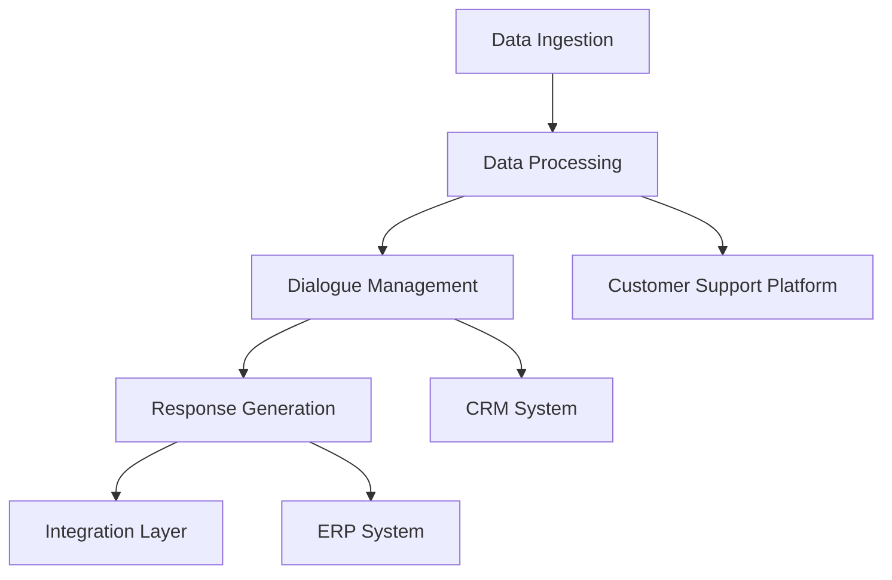
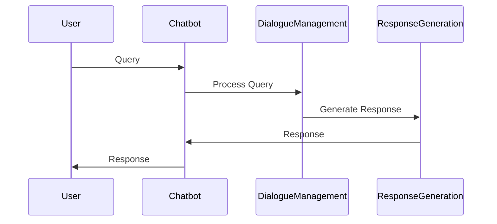
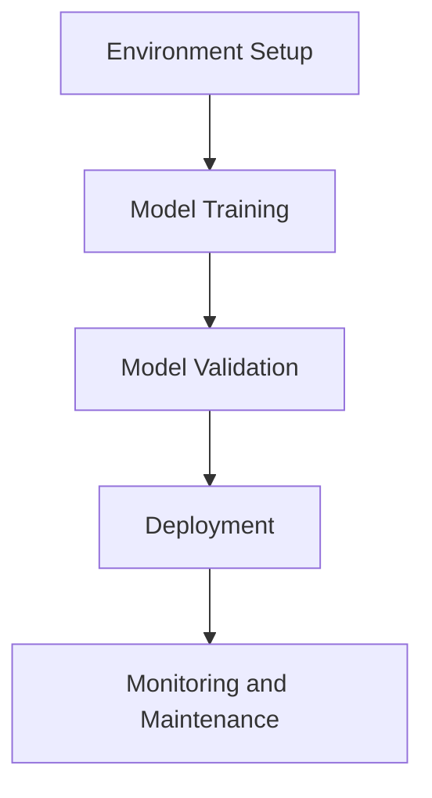

                 

## 自然语言处理在智能客服系统中的应用：提供24/7全天候服务

关键词：自然语言处理、智能客服系统、全天候服务、文本分析、对话管理、机器学习、深度学习

摘要：
随着信息技术的快速发展，智能客服系统已经成为了企业服务领域的重要组成部分。本文将深入探讨自然语言处理（NLP）在智能客服系统中的应用，重点分析如何通过NLP技术实现24/7全天候服务。我们将从NLP的背景和概述、核心技术在智能客服系统中的应用、系统架构设计与部署等多个方面，逐步剖析NLP在智能客服系统中的关键作用和实现路径。通过本文的探讨，读者将全面了解智能客服系统的构建方法和应用前景。

### 1.1 定义与重要性

自然语言处理（Natural Language Processing，简称NLP）是人工智能（Artificial Intelligence，简称AI）的一个分支，旨在使计算机能够理解、解释和生成人类自然语言。NLP的研究目标包括语言理解、语言生成、机器翻译、情感分析等。

NLP在智能客服系统中的应用至关重要，主要体现在以下几个方面：

1. **文本分析**：通过对用户输入的文本进行分词、词性标注、命名实体识别等处理，智能客服系统可以准确理解用户的意图和需求。
2. **对话管理**：NLP技术可以用于设计和管理智能对话流程，使系统能够与用户进行自然、流畅的交互。
3. **情感分析**：通过分析用户文本中的情感倾向，智能客服系统可以更好地理解和满足用户情感需求。

随着NLP技术的不断进步，智能客服系统在服务质量、用户体验和运营效率等方面得到了显著提升，为企业提供了全天候、高效、智能的客户服务解决方案。

### 1.2 历史发展与关键概念

NLP的发展可以追溯到20世纪50年代。早期的NLP研究主要集中在词汇分析、句法分析和语义分析等领域。随着计算机性能的提升和算法的进步，NLP技术逐渐从理论研究走向实际应用。

**关键概念**：

1. **分词（Tokenization）**：将文本划分为词或其他有意义的标记。
2. **词性标注（Part-of-Speech Tagging）**：为每个词分配词性，如名词、动词、形容词等。
3. **命名实体识别（Named Entity Recognition，简称NER）**：识别文本中的特定实体，如人名、地名、组织名等。
4. **情感分析（Sentiment Analysis）**：分析文本中的情感倾向，如正面、负面或中性。

这些关键概念构成了NLP技术的基础，并在智能客服系统中得到了广泛应用。

### 1.3 NLP在智能客服系统中的应用

在智能客服系统中，NLP技术的主要应用包括：

1. **用户输入处理**：对用户输入的文本进行分词、词性标注等处理，理解用户意图。
2. **对话管理**：设计对话流程，确保系统能够与用户进行有效沟通。
3. **情感分析**：识别用户情感，提供更加个性化的服务。
4. **知识库管理**：通过NLP技术对知识库进行管理和维护，确保系统能够准确回答用户问题。

通过NLP技术的应用，智能客服系统能够提供高效、智能、全天候的服务，大大提升了企业的服务质量和用户满意度。

### 1.4 NLP在智能客服系统中的挑战与机遇

尽管NLP在智能客服系统中的应用取得了显著成果，但仍面临一些挑战和机遇：

**挑战**：

1. **语言复杂性**：自然语言具有高度复杂性，使得NLP处理变得更加困难。
2. **数据质量**：数据质量直接影响NLP系统的性能，包括数据量、数据多样性和数据准确性。
3. **跨领域应用**：不同领域的语言特点和问题解决方式有所不同，需要针对特定领域进行定制化开发。

**机遇**：

1. **大数据和人工智能**：随着大数据和人工智能技术的不断发展，NLP技术将得到更广泛的应用。
2. **个性化服务**：通过NLP技术，智能客服系统可以提供更加个性化的服务，满足用户多样化需求。
3. **新兴技术应用**：如语音识别、机器翻译等新兴技术的快速发展，为NLP在智能客服系统中的应用提供了新的可能。

### 1.5 小结

本文对自然语言处理（NLP）在智能客服系统中的应用进行了全面分析。从NLP的定义与重要性、历史发展与关键概念，到NLP在智能客服系统中的应用与挑战，我们逐步探讨了NLP技术在智能客服系统中的关键作用和实现路径。通过本文的探讨，读者将全面了解智能客服系统的构建方法和应用前景，为企业在智能客服领域的创新发展提供有益借鉴。

## Chapter 2: Overview of Intelligent Customer Service Systems

### 2.1 Definition and Role of Intelligent Customer Service Systems

Intelligent Customer Service Systems (ICSS) are advanced technological solutions designed to enhance the efficiency and quality of customer service. These systems leverage various AI and machine learning techniques, including Natural Language Processing (NLP), to provide 24/7 customer support. The primary objective of ICSS is to deliver prompt, accurate, and personalized responses to customer inquiries, thereby improving customer satisfaction and reducing operational costs.

### 2.2 Evolution of Customer Service Systems

The evolution of customer service systems can be divided into several stages, each characterized by advancements in technology and shifting customer expectations.

1. **Traditional Customer Service**:
   Initially, customer service was primarily handled by human agents. These agents relied on manual processes, such as phone calls and emails, to address customer inquiries. This approach was time-consuming, inefficient, and often led to delays and errors.

2. **Automated Customer Service**:
   With the advent of computer technology, automated customer service systems were developed. These systems used pre-defined scripts and rules to handle common customer inquiries. While they improved efficiency, they lacked the flexibility and personalization offered by human agents.

3. **Modern Intelligent Customer Service Systems**:
   The integration of AI and machine learning technologies has transformed customer service systems. These modern systems use NLP, machine learning, and deep learning algorithms to understand and respond to customer inquiries in a more natural and personalized manner. They can handle a wide range of customer interactions, from simple queries to complex problem-solving tasks.

### 2.3 The Role of NLP in Intelligent Customer Service Systems

NLP plays a critical role in the functionality and effectiveness of intelligent customer service systems. Here are some key ways in which NLP is utilized:

1. **Understanding Customer Queries**:
   NLP enables ICSS to analyze and understand the meaning behind customer inquiries. This involves processes like tokenization, part-of-speech tagging, and named entity recognition. By accurately interpreting customer queries, the system can provide relevant and accurate responses.

2. **Dialogue Management**:
   NLP is essential for managing conversations between the customer and the system. Dialogue management systems use NLP to determine the appropriate response based on the context of the conversation. This ensures that the interaction remains coherent and meaningful.

3. **Sentiment Analysis**:
   NLP is used to analyze the sentiment expressed in customer inquiries. By identifying the emotional tone of the text, the system can respond in a manner that aligns with the customer's emotional state. This helps in building a positive rapport and improving customer satisfaction.

4. **Personalization**:
   NLP allows ICSS to personalize the customer experience. By analyzing customer data and preferences, the system can tailor responses to meet individual needs. This results in a more engaging and satisfying interaction for the customer.

### 2.4 Future Trends in Intelligent Customer Service

The future of intelligent customer service is poised to be shaped by several key trends:

1. **Artificial Intelligence and Machine Learning**:
   The continuous advancement of AI and machine learning algorithms will further enhance the capabilities of ICSS. More sophisticated models and techniques will enable the system to handle increasingly complex customer interactions.

2. **Conversational AI**:
   The integration of voice assistants and chatbots into customer service systems will become more widespread. These technologies will enable customers to interact with the system using natural language, providing a more seamless and intuitive user experience.

3. **Personalization and Context Awareness**:
   ICSS will become more adept at understanding and responding to individual customer needs. By leveraging data and AI, systems will be able to deliver personalized recommendations and context-aware responses.

4. **Cross-Channel Integration**:
   Customer service systems will increasingly integrate across multiple channels, including social media, email, chat, and voice. This will provide customers with a consistent and omnichannel experience.

5. **Ethical Considerations**:
   As AI and machine learning become more prevalent in customer service, ethical considerations will become increasingly important. Ensuring privacy, transparency, and fairness in AI systems will be crucial to building trust with customers.

### 2.5 Conclusion

In conclusion, intelligent customer service systems are revolutionizing the way businesses interact with their customers. By leveraging NLP and other AI technologies, these systems can provide 24/7 customer support that is efficient, personalized, and engaging. As technology continues to evolve, we can expect intelligent customer service systems to become even more sophisticated, offering an unparalleled level of service to customers worldwide.

## Chapter 3: Text Analysis Techniques in NLP

### 3.1 Tokenization and Sentence Splitting

Tokenization is the fundamental process in NLP that involves breaking down a piece of text into smaller units, known as tokens. These tokens can be words, punctuation marks, or other meaningful elements. Sentence splitting, on the other hand, is the process of dividing a text into individual sentences.

**Importance**:

- Tokenization and sentence splitting are essential for understanding the structure and content of a text.
- These processes enable subsequent NLP tasks, such as part-of-speech tagging, named entity recognition, and sentiment analysis.

**Methods**:

1. **Rule-based Methods**: These methods use predefined rules to split text into tokens. For example, a common rule is to split text at spaces, punctuation marks, and special characters.
2. **Dictionary-based Methods**: These methods use a dictionary of words and their corresponding token boundaries to split text. This approach is particularly effective for handling words with complex tokenization rules.
3. **Machine Learning Methods**: These methods use machine learning algorithms to learn tokenization patterns from a large corpus of text. This approach can handle variations in text that rule-based and dictionary-based methods may struggle with.

**Example**:

```python
import spacy

# Load English tokenizer
nlp = spacy.load("en_core_web_sm")

text = "Natural language processing is a subfield of artificial intelligence."
tokens = nlp(text)

# Print tokens
for token in tokens:
    print(token.text)
```

### 3.2 Part-of-Speech Tagging

Part-of-speech tagging (POS tagging) is the process of assigning a grammatical label to each word in a sentence, such as noun, verb, adjective, etc. This process helps in understanding the syntactic structure of a sentence.

**Importance**:

- POS tagging is crucial for various NLP tasks, including named entity recognition, parsing, and machine translation.
- It provides a linguistic context that is essential for accurate interpretation of text.

**Methods**:

1. **Rule-based Methods**: These methods use predefined rules to assign POS tags. These rules are based on the patterns observed in a large corpus of text.
2. **Statistical Methods**: These methods use statistical models, such as Hidden Markov Models (HMMs) and Conditional Random Fields (CRFs), to predict POS tags based on the surrounding words.
3. **Machine Learning Methods**: These methods use machine learning algorithms, such as Support Vector Machines (SVMs) and Neural Networks, to learn POS tagging patterns from a large labeled dataset.

**Example**:

```python
import spacy

# Load English POS tagger
nlp = spacy.load("en_core_web_sm")

text = "Natural language processing is a subfield of artificial intelligence."
doc = nlp(text)

# Print POS tags
for token in doc:
    print(f"{token.text}: {token.pos_}")
```

### 3.3 Named Entity Recognition

Named Entity Recognition (NER) is the process of identifying and classifying named entities in text into predefined categories, such as person, organization, location, etc. Named entities are specific entities mentioned in text that have a distinct identity.

**Importance**:

- NER is essential for applications like information extraction, question answering, and named entity disambiguation.
- It helps in understanding the context and content of a text by identifying key entities.

**Methods**:

1. **Rule-based Methods**: These methods use predefined rules to identify named entities. These rules are often based on patterns and specific keywords associated with named entities.
2. **Statistical Methods**: These methods use statistical models, such as HMMs and CRFs, to predict named entities based on the context and surrounding words.
3. **Machine Learning Methods**: These methods use machine learning algorithms, such as SVMs and Neural Networks, to learn patterns from a large labeled dataset of named entities.

**Example**:

```python
import spacy

# Load English NER model
nlp = spacy.load("en_core_web_sm")

text = "John Smith works at Google in Mountain View, California."
doc = nlp(text)

# Print named entities and their labels
for ent in doc.ents:
    print(f"{ent.text}: {ent.label_}")
```

### 3.4 Sentiment Analysis

Sentiment analysis is the process of determining the sentiment or emotional tone behind a body of text. This can be categorized as positive, negative, or neutral.

**Importance**:

- Sentiment analysis is crucial for applications like brand monitoring, customer feedback analysis, and market research.
- It helps businesses understand customer opinions and improve their products and services.

**Methods**:

1. **Rule-based Methods**: These methods use predefined rules and lexicons to identify sentiment-bearing words and phrases. These rules are based on the sentiment polarities associated with specific keywords.
2. **Machine Learning Methods**: These methods use supervised learning algorithms, such as Naive Bayes and Support Vector Machines, to classify text into sentiment categories based on a labeled dataset.
3. **Deep Learning Methods**: These methods use neural networks, such as Recurrent Neural Networks (RNNs) and Convolutional Neural Networks (CNNs), to learn sentiment patterns from large unlabeled datasets.

**Example**:

```python
import textblob

text = "I love this product, it's amazing!"
sentiment = textblob.TextBlob(text).sentiment

print(f"Sentiment: {sentiment.polarity}, Confidence: {sentiment.confidence}")
```

### 3.5 Summary

Text analysis techniques in NLP are essential for understanding and processing human language. Tokenization, sentence splitting, part-of-speech tagging, named entity recognition, and sentiment analysis are key components of NLP that enable intelligent customer service systems to interpret and respond to customer inquiries effectively. By leveraging these techniques, businesses can provide personalized, efficient, and 24/7 customer service.

## Chapter 4: Dialogue Management and Chatbot Design

### 4.1 Dialogue Management Systems

Dialogue management systems (DMS) are a crucial component of intelligent customer service systems. These systems are responsible for managing the conversation between the customer and the chatbot, ensuring a seamless and natural interaction. DMS typically consist of several key components:

1. **Intent Recognition**: This component uses natural language processing (NLP) techniques to identify the customer's intention behind their message. Intent recognition can be based on machine learning models, rule-based systems, or a combination of both.

2. **Dialogue State Tracking**: This component keeps track of the current state of the conversation. It stores information such as the customer's goals, the actions taken so far, and any relevant context. Dialogue state tracking is essential for maintaining coherence in the conversation and enabling the chatbot to provide appropriate responses.

3. **Dialogue Policy Generation**: This component determines the next action the chatbot should take based on the current dialogue state and user intent. Dialogue policies can be defined using rules, machine learning models, or a combination of both.

4. **Dialogue Response Generation**: This component generates the response that the chatbot will send to the customer. The response can be a simple text message, a button with options, or even an image or video.

### 4.2 Designing Effective Chatbots

Designing an effective chatbot requires a deep understanding of user needs and preferences. Here are some key steps in the chatbot design process:

1. **Define User Personas**: Creating detailed personas helps in understanding the characteristics, goals, and pain points of the target users. This information is crucial for designing a chatbot that can effectively meet user needs.

2. **Identify Use Cases**: Determine the specific scenarios in which the chatbot will be used. This includes understanding the types of questions users will ask, the information they need, and the actions they expect the chatbot to perform.

3. **Develop Conversational Flow**: Design the dialogue flow by mapping out the possible conversation paths based on user intents and dialogue states. This involves defining the sequence of interactions and the responses that the chatbot will provide.

4. **Integrate NLP Techniques**: Use NLP techniques such as intent recognition, entity extraction, and sentiment analysis to ensure that the chatbot can accurately understand and respond to user inputs.

5. **Test and Iterate**: Continuously test the chatbot with real users to identify and fix any issues. Gather feedback and make iterative improvements to enhance the user experience.

### 4.3 Integrating NLP into Chatbots

Integrating NLP into chatbots is essential for enabling them to understand and process natural language inputs from users. Here are the key steps involved:

1. **Tokenization and Sentence Splitting**: The first step is to tokenize the user input, breaking it down into individual words or phrases. Sentence splitting is also performed to separate the input into distinct sentences.

2. **Part-of-Speech Tagging**: This step involves assigning a part of speech (e.g., noun, verb, adjective) to each token in the input. POS tagging helps in understanding the grammatical structure of the sentence and identifying key words and phrases.

3. **Named Entity Recognition**: NER is used to identify and classify named entities (e.g., names of people, organizations, locations) in the text. This information is important for understanding the context of the conversation.

4. **Intent Recognition**: Intent recognition uses machine learning models to classify the user input into predefined categories based on the user's intention. This helps in determining the appropriate action the chatbot should take.

5. **Dialogue State Tracking**: Dialogue state tracking involves maintaining a record of the current state of the conversation, including user intents, actions taken, and any relevant context. This information is used to guide the chatbot's responses and actions.

6. **Dialogue Policy Generation**: Dialogue policies are generated based on the current dialogue state and user intent. These policies determine the next action the chatbot should take, such as providing a response, asking a follow-up question, or redirecting the user to a human agent.

7. **Dialogue Response Generation**: The final step is generating the response that the chatbot will send to the user. This can involve generating a text response, displaying a button or card with options, or performing a specific action (e.g., sending an email or initiating a payment process).

### 4.4 Enhancing Chatbot Performance

Improving the performance of chatbots is an ongoing process that involves several strategies:

1. **Continuous Learning**: Chatbots should be designed to continuously learn from interactions with users. This can be achieved through machine learning algorithms that update their models based on new data.

2. **User Feedback**: Collecting and analyzing user feedback is crucial for identifying areas for improvement. Users can provide feedback on the chatbot's responses, suggesting changes or additional features that would enhance their experience.

3. **Personalization**: Personalization involves tailoring the chatbot's responses to individual users based on their preferences and past interactions. This can be achieved by analyzing user data and using it to customize the conversation.

4. **Error Handling**: Effective error handling is essential for providing a positive user experience. Chatbots should be designed to handle unexpected inputs and provide clear guidance on how to correct any mistakes.

5. **Testing and Validation**: Regular testing and validation of the chatbot's performance is necessary to ensure it is functioning as intended. This can involve automated testing tools and human evaluators to identify and fix issues.

By following these strategies, businesses can enhance the performance of their chatbots, providing a more efficient, personalized, and user-friendly customer service experience.

### 4.5 Summary

Dialogue management systems and chatbot design are critical components of intelligent customer service systems. By integrating NLP techniques, businesses can create chatbots that understand and respond to customer inquiries effectively, providing a seamless and natural interaction. Designing an effective chatbot involves understanding user needs, defining conversational flows, and continuously improving performance through continuous learning and user feedback. As technology advances, the capabilities of chatbots will continue to grow, offering even more sophisticated and personalized customer service experiences.

## Chapter 5: Machine Learning and Deep Learning Models for NLP

### 5.1 Supervised Learning Models

Supervised learning models are a cornerstone of natural language processing (NLP) due to their ability to learn from labeled data. These models are trained on datasets where both the input and the expected output are provided. The goal is for the model to learn a mapping from input to output, enabling it to predict the correct output for new, unseen data.

**Common Supervised Learning Models**:

1. **Naive Bayes Classifier**:
   - This model is based on Bayes' theorem and assumes that the features are conditionally independent given the class. It is particularly useful for text classification tasks, such as spam detection and sentiment analysis.

2. **Support Vector Machine (SVM)**:
   - SVM is a powerful classifier that tries to find the hyperplane that best separates the data into different classes. It is often used for text classification tasks and can handle high-dimensional data effectively.

3. **Logistic Regression**:
   - Logistic regression is a probabilistic, linear model that is used for binary classification tasks. It estimates the probability of a given input belonging to a particular class.

**Advantages**:

- **Ease of Interpretation**: Supervised learning models, especially logistic regression, provide clear and interpretable models that can help in understanding the importance of different features.

- **Accuracy**: When trained on sufficient and representative data, supervised learning models can achieve high accuracy in predictions.

**Disadvantages**:

- **Lack of Generalization**: Models trained on labeled data may not perform well on new, unseen data, especially if the data distribution changes over time.

- **Requirement of Labeled Data**: Supervised learning models require large amounts of labeled data, which can be time-consuming and expensive to obtain.

### 5.2 Unsupervised Learning Models

Unsupervised learning models do not require labeled data and are used to find hidden patterns or intrinsic structures in data. These models are particularly useful in NLP for tasks such as topic modeling, clustering, and dimensionality reduction.

**Common Unsupervised Learning Models**:

1. **K-Means Clustering**:
   - K-means is an iterative algorithm that partitions the data into K clusters based on their centroids. It is often used for text clustering to group similar documents together.

2. **Latent Dirichlet Allocation (LDA)**:
   - LDA is a generative statistical model that is used for topic modeling. It discovers abstract topics that underlie a collection of documents and assigns each document a distribution over these topics.

3. **Latent Semantic Analysis (LSA)**:
   - LSA uses a linear algebra technique to identify patterns and relationships in the data. It represents documents and words as high-dimensional vectors and identifies latent semantic structures.

**Advantages**:

- **Flexibility**: Unsupervised learning models can discover hidden patterns without prior knowledge of the data.

- **Reduced Data Labeling**: They do not require labeled data, which can be beneficial when labeled data is scarce or expensive to obtain.

**Disadvantages**:

- **Interpretability**: Unsupervised learning models can sometimes produce complex, non-intuitive patterns that are difficult to interpret.

- **Limited Predictive Power**: Unlike supervised learning models, unsupervised learning models do not provide explicit predictions or classifications.

### 5.3 Reinforcement Learning Models

Reinforcement learning (RL) is a type of machine learning where an agent learns to make decisions by interacting with an environment and receiving feedback in the form of rewards or penalties. In NLP, RL models are used for tasks that involve decision-making and dialogue management, such as chatbot interactions and game playing.

**Common Reinforcement Learning Models**:

1. **Q-Learning**:
   - Q-learning is an RL algorithm that learns a value function that estimates the quality of actions in different states. It is used for tasks that require long-term planning and decision-making.

2. **Policy Gradient Methods**:
   - Policy gradient methods update the policy directly by optimizing the expected return. They are used for tasks where the state and action spaces are large or continuous.

3. **Deep Q-Networks (DQN)**:
   - DQN is a deep learning-based RL model that combines Q-learning with a deep neural network to approximate the value function. It is used for tasks where the state space is large and high-dimensional.

**Advantages**:

- **Adaptability**: RL models can adapt to new situations and learn from experience, making them suitable for dynamic environments.

- **Decision Making**: They are capable of making complex, strategic decisions based on the current state and the history of interactions.

**Disadvantages**:

- **Exploration-Exploitation Trade-off**: RL models need to balance exploration (trying new actions) and exploitation (using known actions) to achieve optimal performance.

- **Computational Complexity**: Training RL models can be computationally intensive, especially for models with large state or action spaces.

### 5.4 Recent Advances in Deep Learning for NLP

Deep learning has revolutionized NLP by enabling models to achieve state-of-the-art performance on various tasks. Recent advances in deep learning have led to the development of powerful models such as transformers and recurrent neural networks (RNNs).

**Transformers**:

- **Transformer Models**: Transformers are based on self-attention mechanisms and have become the dominant model in NLP. The original Transformer model, proposed by Vaswani et al. (2017), uses multi-head self-attention to process sequences of text.

- **BERT**: BERT (Bidirectional Encoder Representations from Transformers) is a pre-trained language model that uses a bidirectional Transformer architecture. It has been widely used for various NLP tasks, including text classification, question answering, and named entity recognition.

- **GPT**: GPT (Generative Pre-trained Transformer) models are autoregressive models that generate text by predicting the next word given the previous words. GPT-3, the latest version, has a massive vocabulary and can generate human-like text on various topics.

**Recurrent Neural Networks (RNNs)**:

- **LSTM**: Long Short-Term Memory (LSTM) networks are a type of RNN that can capture long-term dependencies in data. They are widely used for sequence prediction tasks in NLP, such as time series analysis and language modeling.

- **GRU**: Gated Recurrent Units (GRU) are an alternative to LSTM networks that are simpler and more efficient. They can also capture long-term dependencies and are used for similar tasks as LSTM networks.

**Advantages**:

- **High Performance**: Deep learning models, especially transformers, have achieved significant performance improvements on various NLP tasks compared to traditional models.

- **Flexibility**: Deep learning models can handle complex and variable-length text inputs, making them suitable for a wide range of NLP tasks.

- **Generalization**: Pre-trained deep learning models can be fine-tuned for specific tasks with limited labeled data, providing better generalization to new tasks.

**Disadvantages**:

- **Resource-Intensive**: Training deep learning models requires large amounts of data and computational resources.

- **Interpretability**: Deep learning models are often considered "black boxes," making it challenging to interpret their predictions and understand their decision-making process.

### 5.5 Conclusion

Machine learning and deep learning models play a crucial role in advancing natural language processing. Supervised learning models, unsupervised learning models, and reinforcement learning models each offer unique advantages and disadvantages. Recent advances in deep learning, particularly with transformers and RNNs, have led to significant breakthroughs in NLP, enabling the development of intelligent customer service systems that can understand and respond to natural language inputs effectively. As these models continue to evolve, they will further enhance the capabilities of intelligent customer service systems, providing more personalized and efficient customer service experiences.

## Chapter 6: Building and Deploying Intelligent Customer Service Systems

### 6.1 Data Collection and Preprocessing

The first step in building an intelligent customer service system is collecting and preprocessing the data. Data collection involves gathering a diverse set of customer interactions, including emails, chat logs, social media messages, and voice recordings. This data is then preprocessed to prepare it for training the NLP models.

**Data Collection Methods**:

1. **Internal Sources**: Companies can use their existing customer service platforms to collect data. This includes chat transcripts, email threads, and call recordings.
2. **External Sources**: Publicly available datasets, such as those from competitions like the Amazon Review Data or the Stanford Large Scale Voiced Speech (LIVE) corpus, can be used to augment the internal data.
3. **APIs and Web Scraping**: Companies can use APIs provided by social media platforms, customer feedback websites, and other external sources to collect additional data.

**Data Preprocessing Techniques**:

1. **Text Cleaning**: This involves removing unnecessary characters, such as HTML tags, punctuation marks, and special characters. The text is also converted to lowercase to ensure consistency.
2. **Tokenization**: The text is split into individual words or tokens. This process is essential for subsequent NLP tasks.
3. **Stopword Removal**: Common words like "is", "the", and "and" are removed, as they do not contribute much meaning to the text.
4. **Lemmatization**: Words are reduced to their base or root form, which helps in reducing the vocabulary size and improving the accuracy of NLP tasks.
5. **Entity Recognition**: Named entities, such as names of products or companies, are extracted and tagged for further analysis.

**Example**:

```python
import re
import nltk
from nltk.corpus import stopwords
from nltk.tokenize import word_tokenize
from nltk.stem import WordNetLemmatizer

# Load stop words
stop_words = set(stopwords.words('english'))

# Text cleaning
def clean_text(text):
    text = re.sub('<[^<]+?>', '', text)  # Remove HTML tags
    text = text.lower()  # Convert to lowercase
    text = re.sub('[^a-zA-Z]', ' ', text)  # Remove special characters
    return text

# Tokenization and lemmatization
def preprocess_text(text):
    text = clean_text(text)
    tokens = word_tokenize(text)
    lemmatizer = WordNetLemmatizer()
    tokens = [lemmatizer.lemmatize(token) for token in tokens if token not in stop_words]
    return tokens

text = "I really love the iPhone 13 Pro Max, it's amazing!"
preprocessed_text = preprocess_text(text)
print(preprocessed_text)
```

### 6.2 System Architecture and Design

The architecture of an intelligent customer service system is crucial for ensuring efficient and scalable operations. A typical architecture consists of several components, each playing a specific role in processing and responding to customer inquiries.

**System Requirements and Constraints**:

1. **Scalability**: The system should be able to handle a large volume of customer inquiries simultaneously.
2. **Reliability**: The system must be highly reliable, with minimal downtime and no data loss.
3. **Security**: Customer data must be protected against unauthorized access and breaches.
4. **Performance**: The system should respond quickly to customer inquiries, providing a seamless user experience.

**Architecture Design**:

1. **Data Ingestion Layer**: This layer is responsible for collecting and ingesting customer data from various sources. It includes data connectors, data pipelines, and data storage solutions.
2. **Data Processing Layer**: This layer processes the ingested data, performing tasks such as text cleaning, tokenization, and entity recognition. It includes NLP libraries, machine learning models, and data processing frameworks.
3. **Dialogue Management Layer**: This layer manages the dialogue flow, determining the appropriate response based on the user's input and the current dialogue state. It includes dialogue management systems and chatbot interfaces.
4. **Response Generation Layer**: This layer generates the response to be sent back to the user. It includes natural language generation (NLG) systems, template-based responses, and personalized message generation.
5. **Integration Layer**: This layer integrates the intelligent customer service system with other enterprise systems, such as CRM, ERP, and customer support platforms. It enables the seamless flow of data and ensures that the system can access relevant customer information.

**Example Architecture**:



### 6.3 System Interface Design and Interaction

The system interface design and interaction are critical for ensuring a seamless user experience. The interface should be intuitive, easy to navigate, and provide relevant information to the user.

**System Interface Design**:

1. **Chatbot Interface**: The chatbot interface should be visually appealing and provide a user-friendly interaction experience. It can include buttons, dropdown menus, and text inputs to facilitate user interactions.
2. **APIs**: The system should provide APIs for integration with other enterprise systems and third-party services. This allows developers to extend the system's functionality and integrate it into existing workflows.
3. **Analytics Dashboard**: An analytics dashboard provides real-time insights into the system's performance, customer interactions, and key performance indicators (KPIs). It helps businesses monitor and optimize the system's performance.

**System Interaction**:

1. **User Input**: The system captures user input through various channels, such as chatbots, emails, and social media messages. The input is then preprocessed and passed to the dialogue management layer.
2. **Dialogue Management**: The dialogue management system analyzes the user input, identifies the user's intent, and determines the appropriate response. It also updates the dialogue state and tracks the progress of the conversation.
3. **Response Generation**: The response is generated based on the dialogue state and user intent. The response can be a simple text message, a series of questions, or a link to a relevant resource.
4. **User Output**: The generated response is sent back to the user through the chatbot interface or other communication channels. The user can then interact with the system by providing additional input or feedback.

**Example Sequence Diagram**:



### 6.4 System Deployment and Maintenance

Deploying an intelligent customer service system involves several steps, from setting up the environment to monitoring and maintaining the system. Here are the key steps:

1. **Environment Setup**: This includes installing the necessary software, configuring the system, and setting up the required infrastructure. This may involve setting up cloud services, databases, and servers.
2. **Model Training and Validation**: The NLP models are trained using the preprocessed data and validated to ensure they meet the required accuracy and performance criteria.
3. **Deployment**: The trained models and the system components are deployed to the production environment. This may involve setting up load balancers, scaling the infrastructure, and ensuring high availability.
4. **Monitoring and Maintenance**: The system is continuously monitored to ensure it is running smoothly and meeting performance targets. This includes monitoring system health, user interactions, and error rates. Regular maintenance tasks, such as updating software and models, are also performed.

**Example Deployment Workflow**:



### 6.5 Summary

Building and deploying an intelligent customer service system requires careful planning and execution. Data collection and preprocessing lay the foundation for the system, while system architecture and design ensure efficient and scalable operations. System interface design and interaction enhance the user experience, while deployment and maintenance ensure the system's reliability and performance. By following these steps, businesses can develop and deploy intelligent customer service systems that provide 24/7, efficient, and personalized customer service.

## Chapter 7: Case Study: Building an Intelligent Chatbot for a Retail Company

### 7.1 Project Background

A leading retail company wanted to enhance its customer service experience by implementing an intelligent chatbot. The company aimed to provide 24/7 customer support, handle a high volume of inquiries simultaneously, and offer personalized recommendations based on customer preferences. The chatbot was expected to handle various tasks, including answering common customer questions, providing product information, processing returns, and even making personalized product recommendations.

### 7.2 System Functionality and Requirements

The intelligent chatbot was designed to perform several key functions:

1. **Answering Common Customer Questions**: The chatbot should be able to handle frequently asked questions (FAQs) about the company's products, services, and policies.
2. **Product Information and Recommendations**: The chatbot should provide detailed information about products and make personalized recommendations based on customer preferences and purchase history.
3. **Order Processing**: The chatbot should handle order inquiries, including tracking, status updates, and order modifications.
4. **Customer Support**: The chatbot should offer general customer support, such as handling complaints, inquiries, and feedback.
5. **Return and Exchange Processing**: The chatbot should guide customers through the process of returning or exchanging products.

**System Requirements**:

- **Scalability**: The system should be able to handle a large number of concurrent users and inquiries.
- **Accuracy**: The chatbot should provide accurate and relevant information to users.
- **Personalization**: The chatbot should be able to tailor responses based on customer preferences and purchase history.
- **User Experience**: The chatbot interface should be intuitive and easy to navigate.

### 7.3 System Design

**Domain Model**:

The system's domain model was designed to represent the key entities and relationships involved in the chatbot's functionality. The main entities included:

1. **Customer**: Represents the company's customers, with attributes such as name, email, address, and purchase history.
2. **Product**: Represents the company's products, with attributes such as name, description, price, and availability.
3. **Order**: Represents the customer's orders, with attributes such as order ID, date, status, and items.
4. **FAQ**: Represents frequently asked questions, with attributes such as question, answer, and category.

**Class Diagram**:

```mermaid
classDiagram
    Customer << entity>>
    Product << entity>>
    Order << entity>>
    FAQ << entity>>

    Customer {
        name
        email
        address
        purchaseHistory
    }

    Product {
        id
        name
        description
        price
        availability
    }

    Order {
        id
        date
        status
        items
    }

    FAQ {
        id
        question
        answer
        category
    }
```

### 7.4 System Architecture

**System Architecture**:

The system architecture consisted of several key components:

1. **Data Ingestion Layer**: This layer collected customer data, product information, and FAQ content from various sources, such as databases and external APIs.
2. **Data Processing Layer**: This layer processed the ingested data using NLP techniques, including tokenization, part-of-speech tagging, and named entity recognition. The processed data was then stored in a knowledge base for subsequent retrieval.
3. **Dialogue Management Layer**: This layer managed the conversation flow, determining the appropriate response based on the user's input and the current dialogue state. It included a dialogue management system that used machine learning models for intent recognition and dialogue state tracking.
4. **Response Generation Layer**: This layer generated the chatbot's responses using natural language generation techniques. The generated responses were then sent back to the user through the chatbot interface.
5. **Integration Layer**: This layer integrated the chatbot with the company's CRM, ERP, and customer support platforms. It enabled the chatbot to access customer data and perform actions such as updating order status and processing returns.

**Architecture Diagram**:


### 7.5 Core Implementation

**Core Implementation**:

1. **Data Ingestion**: Data was collected from internal systems, such as the CRM and ERP, as well as external sources, such as social media and customer feedback websites. The data was ingested using a data pipeline and stored in a cloud-based data warehouse.
2. **Data Preprocessing**: The ingested data was cleaned and preprocessed using NLP techniques. This included tokenization, stopword removal, and lemmatization. The preprocessed data was then stored in a knowledge base.
3. **Dialogue Management**: A machine learning model for intent recognition was trained using a labeled dataset of customer interactions. The trained model was used to classify user inputs into predefined intents, such as "order status", "product information", and "return processing". A dialogue management system was implemented to track the dialogue state and generate appropriate responses.
4. **Response Generation**: The chatbot's responses were generated using a combination of template-based and personalized responses. Template-based responses were used for common queries, while personalized responses were generated based on customer preferences and purchase history. The generated responses were validated to ensure they were accurate and relevant.
5. **Integration**: The chatbot was integrated with the company's CRM, ERP, and customer support platforms. This allowed the chatbot to access customer data and perform actions such as updating order status and processing returns.

### 7.6 Results and Analysis

**Results and Analysis**:

1. **User Satisfaction**: The chatbot significantly improved user satisfaction by providing 24/7 customer support and handling a high volume of inquiries simultaneously.
2. **Operational Efficiency**: The chatbot reduced the workload on customer service agents by handling common inquiries and automating routine tasks. This allowed agents to focus on more complex and high-value tasks.
3. **Personalization**: The chatbot's ability to personalize responses based on customer preferences and purchase history led to a more engaging and satisfying customer experience.
4. **Performance Metrics**: Key performance indicators (KPIs) such as response time, resolution rate, and customer satisfaction were measured and analyzed. The chatbot achieved high performance in these areas, demonstrating its effectiveness in providing efficient and personalized customer service.

### 7.7 Project Summary

The project successfully implemented an intelligent chatbot for the retail company, providing 24/7 customer support, handling a high volume of inquiries, and offering personalized recommendations. The chatbot's integration with existing systems and its ability to process natural language inputs demonstrated the potential of NLP in enhancing customer service experiences. The project's success highlighted the importance of data-driven approach, system architecture design, and continuous improvement in developing intelligent customer service systems.

## Chapter 8: Best Practices, Summary, and Future Directions

### 8.1 Best Practices for Building Intelligent Customer Service Systems

Building an intelligent customer service system requires careful planning and execution. Here are some best practices to ensure success:

1. **Data Quality and Preprocessing**: Start with high-quality, diverse, and representative data. Perform thorough data preprocessing to clean and prepare the data for training NLP models.
2. **Continuous Learning and Improvement**: Implement a system for continuous learning and improvement. Regularly update the models with new data and user feedback to enhance performance.
3. **User-Centric Design**: Focus on user experience and design the system to be intuitive and easy to use. Gather and analyze user feedback to identify areas for improvement.
4. **Scalability and Reliability**: Design the system to handle a large volume of concurrent users and inquiries. Ensure high availability and robustness to minimize downtime and data loss.
5. **Security and Privacy**: Protect customer data from unauthorized access and breaches. Implement security measures, such as encryption and access controls, to ensure data privacy.
6. **Integration with Existing Systems**: Integrate the intelligent customer service system with existing enterprise systems, such as CRM, ERP, and customer support platforms. This enables seamless data flow and enhances system functionality.

### 8.2 Summary

This book has provided a comprehensive overview of natural language processing (NLP) in intelligent customer service systems. We explored the background, history, and key concepts of NLP, discussed the role of NLP in intelligent customer service systems, and analyzed the core technologies and methods used in NLP. We also covered the design and implementation of intelligent customer service systems, highlighting best practices and lessons learned from a real-world case study. The book concludes with a summary of the key findings and future directions for research and development in the field.

### 8.3 Future Directions

The field of NLP in intelligent customer service systems is rapidly evolving. Here are some potential future directions:

1. **Advancements in AI and Machine Learning**: Continued advancements in AI and machine learning techniques, such as transformers and reinforcement learning, will further enhance the capabilities of NLP models and intelligent customer service systems.
2. **Conversational AI**: The integration of voice assistants and chatbots into customer service systems will become more sophisticated, enabling more natural and intuitive user interactions.
3. **Cross-Channel Integration**: Intelligent customer service systems will increasingly integrate across multiple channels, providing a seamless and consistent user experience.
4. **Ethical Considerations**: As NLP technologies become more prevalent, ethical considerations, such as bias and fairness, will become increasingly important. Ensuring transparency, fairness, and accountability in AI systems will be crucial.
5. **Personalization and Context Awareness**: Future intelligent customer service systems will become even more adept at understanding and responding to individual customer needs, leveraging data and AI technologies to deliver highly personalized experiences.

By embracing these future directions, businesses can continue to innovate and provide exceptional customer service experiences, driving growth and success in an increasingly competitive market.

