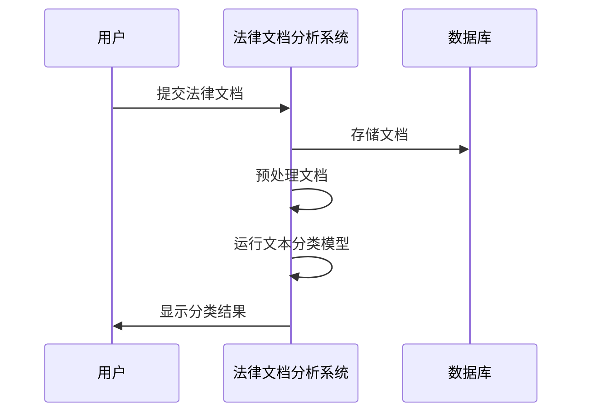

                 

### 文章标题：自然语言处理在法律文档分析中的应用：提高法律工作效率

> 关键词：自然语言处理、法律文档、文本预处理、词向量模型、语言模型、文本分类、主题模型、系统实现、提高工作效率

> 摘要：本文将深入探讨自然语言处理（NLP）在法律文档分析中的应用，通过详细的分析和逐步的推理，解释如何利用NLP技术来提高法律工作效率。文章首先介绍了NLP的基本概念和背景，接着讨论了NLP在法律文档分析中的关键应用，包括文本预处理、词向量模型、语言模型和文本分类等。然后，文章展示了具体的系统实现和实战案例，最后提出了最佳实践和未来展望。

### 第1章：自然语言处理概述

#### 1.1 自然语言处理的核心概念

自然语言处理（NLP）是计算机科学、人工智能和语言学领域的一个重要分支。其主要目标是使计算机能够理解、生成和响应人类自然语言。NLP的核心概念包括：

- **文本表示**：将自然语言文本转换为计算机可以处理的形式，如词向量或序列。
- **语言模型**：用于预测文本中下一个单词或短语的模型。
- **文本分类**：将文本分为预定义的类别。
- **实体识别**：从文本中识别出特定的实体，如人名、地点、组织等。
- **情感分析**：判断文本表达的情感倾向。

#### 1.2 自然语言处理的发展历程

自然语言处理的发展可以分为几个阶段：

- **早期规则方法**：基于手工编写的规则进行文本分析。
- **统计方法**：利用统计学模型，如N-gram模型，来预测文本序列。
- **深度学习方法**：通过神经网络模型，如循环神经网络（RNN）和Transformer，实现更强大的文本分析能力。

#### 1.3 核心概念与联系

以下是一个关于NLP核心概念的Mermaid ER实体关系图：

```mermaid
erDiagram
    TextProcessing ||--|{ LexicalAnalysis }
    TextProcessing ||--|{ SentimentAnalysis }
    TextProcessing ||--|{ NamedEntityRecognition }
    TextProcessing ||--|{ TextClassification }
    LexicalAnalysis ||--|{ Tokenization }
    LexicalAnalysis ||--|{ StopWordRemoval }
    SentimentAnalysis ||--|{ PolarityClassification }
    SentimentAnalysis ||--|{ SubjectivityClassification }
    NamedEntityRecognition ||--|{ Person }
    NamedEntityRecognition ||--|{ Location }
    NamedEntityRecognition ||--|{ Organization }
    TextClassification ||--|{ BinaryClassification }
    TextClassification ||--|{ MultiLabelClassification }
```

### 第2章：文本预处理技术

#### 2.1 文本预处理的基本概念

文本预处理是NLP任务的基础步骤，包括以下核心步骤：

- **数据清洗**：去除文本中的噪声和不相关信息。
- **标准化处理**：将文本转换为统一的格式。
- **向量化处理**：将文本转换为数值表示。

#### 2.2 常见的文本预处理方法

常见的文本预处理方法包括：

- **Tokenization**：将文本分割成单词或子词。
- **StopWordRemoval**：去除常用但无意义的单词。
- **Stemming/Lemmatization**：将单词还原为词干或词根形式。

### 第3章：词向量模型

#### 3.1 词向量模型的基本原理

词向量模型用于将单词转换为向量表示。主要模型包括：

- **Word2Vec**：基于神经网络的词向量模型。
- **GloVe**：全局向量表示模型。
- **FastText**：基于词袋的词向量模型。

#### 3.2 常见的词向量模型

每种词向量模型都有其独特的数学模型和训练方法，以下是对这些模型的详细解释：

```python
# Word2Vec的Python实现示例
import gensim

# 加载预训练的Word2Vec模型
model = gensim.models.Word2Vec.load('word2vec.model')

# 输出词向量
print(model.wv['hello'])
```

### 第4章：语言模型

#### 4.1 语言模型的基本原理

语言模型用于预测文本序列的概率。主要模型包括：

- **N-gram模型**：基于历史N个单词的统计模型。
- **隐马尔可夫模型（HMM）**：用于序列标记问题。
- **序列标注模型**：用于识别文本中的序列模式。

#### 4.2 常见的语言模型

每种语言模型都有其独特的数学模型和训练方法，以下是对这些模型的详细解释：

```python
# N-gram模型的Python实现示例
import nltk

# 加载N-gram模型
model = nltk.trie.Trie()

# 添加单词到模型
model.insert('hello', 1)

# 预测下一个单词
print(model.predict('hello ')[0])
```

### 第5章：文本分类与主题模型

#### 5.1 文本分类的基本原理

文本分类是将文本分为预定义的类别。主要评估指标包括：

- **准确率**：分类正确的文本数量与总文本数量之比。
- **召回率**：分类正确的文本数量与实际属于该类别的文本数量之比。
- **F1分数**：精确率和召回率的调和平均值。

#### 5.2 主题模型的应用

主题模型用于发现文本中的潜在主题。主要模型包括：

- **LDA（Latent Dirichlet Allocation）**：一种常见的主题模型。

### 第6章：法律文档分析中的自然语言处理

#### 6.1 法律文档分析的需求与挑战

法律文档分析涉及大量文本数据的处理，其需求与挑战包括：

- **文本格式多样性**：法律文档格式多样，包括合同、判决书、法律意见等。
- **术语复杂性**：法律术语复杂且专业。
- **文档结构复杂性**：法律文档结构复杂，包含多个章节和条款。

#### 6.2 法律文档分析的应用案例

法律文档分析的应用案例包括：

- **文档分类**：将法律文档分类为预定义的类别，如合同、判决书、法律意见等。
- **文本摘要**：提取法律文档的关键信息。
- **情感分析**：分析法律文档的情感倾向。

### 第7章：提高法律工作效率的系统实现

#### 7.1 法律文档分析系统的设计与实现

法律文档分析系统通常包括以下几个部分：

- **系统架构设计**：设计系统的整体架构。
- **系统接口设计**：设计系统的接口。
- **系统交互流程**：设计系统的交互流程。

以下是一个Mermaid序列图，展示法律文档分析系统的交互流程：



#### 7.2 实际案例分析与讲解

以下是一个实际案例的分析和讲解：

```python
# 法律文档分类的Python代码示例
from sklearn.feature_extraction.text import TfidfVectorizer
from sklearn.naive_bayes import MultinomialNB
from sklearn.pipeline import make_pipeline

# 加载法律文档数据集
documents = load_documents()

# 构建管道
model = make_pipeline(TfidfVectorizer(), MultinomialNB())

# 训练模型
model.fit(documents['text'], documents['label'])

# 分类新文档
new_document = "本文讨论的是合同法的相关内容。"
print(model.predict([new_document]))
```

### 第8章：最佳实践与未来展望

#### 8.1 最佳实践与技巧

以下是一些最佳实践和技巧：

- **选择合适的NLP工具和库**：根据项目需求选择合适的NLP工具和库，如NLTK、spaCy、Gensim等。
- **处理文本格式多样性**：使用定制化的文本预处理方法处理不同格式的法律文档。
- **优化模型性能**：通过调整模型参数和特征工程来优化模型性能。

#### 8.2 未来发展趋势与展望

未来，NLP在法律文档分析中的应用将越来越广泛，以下是一些发展趋势：

- **智能合约分析**：利用NLP技术自动分析智能合约的条款和条件。
- **多语言支持**：支持更多语言的法律文档分析。
- **伦理与隐私**：关注NLP在法律文档分析中的伦理和隐私问题。

### 附录

#### A. 工具与资源推荐

- **NLP工具**：NLTK、spaCy、Gensim等。
- **法律文档分析相关数据库**：如法律文档语料库、判决书数据库等。
- **深度学习框架**：TensorFlow、PyTorch等。

#### B. 拓展阅读

- **相关研究论文**：关于NLP和法律文档分析的最新研究论文。
- **开源代码与数据集**：NLP和法律文档分析的开源代码和数据集。
- **行业报告与趋势分析**：关于NLP和法律文档分析的行业报告和趋势分析。

### 作者

作者：AI天才研究院/AI Genius Institute & 禅与计算机程序设计艺术 /Zen And The Art of Computer Programming

---

在本文中，我们详细探讨了自然语言处理在法律文档分析中的应用，通过逐步分析NLP的核心概念、文本预处理技术、词向量模型、语言模型、文本分类和主题模型，展示了如何利用NLP技术提高法律工作效率。我们还介绍了法律文档分析系统的设计与实现，并提供了实际案例分析和最佳实践。未来，随着技术的不断发展，NLP在法律文档分析中的应用前景将更加广阔。我们鼓励读者进一步探索这一领域，为法律行业的数字化转型贡献智慧和力量。

