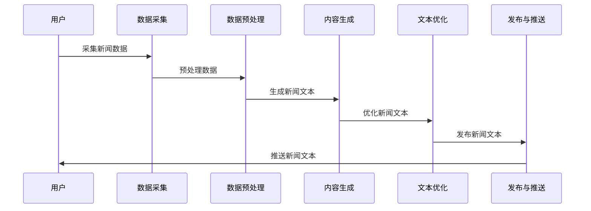

                 

# 自然语言生成在自动新闻写作中的应用：快速报道事件

> 关键词：自然语言生成、自动新闻写作、系统设计、项目实战、优化策略

> 摘要：本文将深入探讨自然语言生成（NLG）在自动新闻写作中的应用，从背景介绍、核心概念、系统设计、项目实战以及优化策略等方面，全面解析自动新闻写作的发展、技术实现与应用挑战。通过理论与实践相结合，本文旨在为读者提供对自动新闻写作技术的深刻理解与实战指导。

----------------------------------------------------------------

## 第一部分：自然语言生成（NLG）与自动新闻写作

### 第1章：自然语言生成简介

#### 1.1 背景介绍

自动新闻写作（Automated News Writing）是近年来随着人工智能技术的飞速发展而兴起的一项重要应用。随着互联网的普及，新闻行业面临着海量的信息处理和传播需求，而传统的手工写作方式已无法满足快速、准确、高效的需求。自动新闻写作的出现，极大地提高了新闻生产的效率，降低了人力成本。

自然语言生成（Natural Language Generation，NLG）是人工智能领域的一个重要分支，旨在利用计算机技术生成具有自然语言特性的文本。NLG技术通过理解、模拟和生成人类语言，实现了从数据到自然语言文本的自动转换。自动新闻写作正是NLG技术在实际应用中的一个典型场景。

#### 1.2 核心概念与联系

##### 1.2.1 自然语言生成（NLG）的定义

自然语言生成（NLG）是一种人工智能技术，它使计算机能够理解和处理自然语言，从而自动生成符合语法和语义规则的文本。NLG的核心目标是让计算机生成的文本在内容和形式上尽可能接近人类写作。

##### 1.2.2 自然语言生成的基本原理

NLG的基本原理包括三个主要方面：

1. **数据理解**：计算机需要理解输入的数据，包括结构化数据和半结构化数据。
2. **语法生成**：基于对数据的理解，计算机需要生成符合语法规则的句子。
3. **语义校验**：生成的句子还需要进行语义校验，确保其表达的意思准确无误。

##### 1.2.3 自动新闻写作与NLG的关系

自动新闻写作是NLG技术的具体应用之一。自动新闻写作系统通常包括数据采集、数据预处理、内容生成、文本优化和发布等模块。NLG技术在整个自动新闻写作过程中发挥着关键作用，它负责将数据转化为符合新闻写作规范的文本。

#### 1.3 主流NLG模型与技术

##### 1.3.1 生成式模型与引用式模型

生成式模型（Generative Models）和引用式模型（Recurrent Models）是NLG技术中的两大主流模型。

- **生成式模型**：生成式模型从数据中学习生成文本的概率分布，然后根据该分布生成新的文本。常见的生成式模型有变分自编码器（VAE）、生成对抗网络（GAN）等。
- **引用式模型**：引用式模型通过参考已有的文本进行生成，即从大量的文本数据中学习生成规则，然后根据这些规则生成新的文本。常见的引用式模型有循环神经网络（RNN）、长短期记忆网络（LSTM）等。

##### 1.3.2 基于规则的系统与基于数据的系统

基于规则的系统（Rule-Based Systems）和基于数据的系统（Data-Driven Systems）是NLG技术的两种不同实现方式。

- **基于规则的系统**：基于规则的系统通过预定义的语法规则和语义规则来生成文本。这种系统的优势是生成过程可控，但劣势是适应性较差，难以应对复杂和多变的情境。
- **基于数据的系统**：基于数据的系统通过从大量数据中学习生成规则，然后根据这些规则生成文本。这种系统的优势是适应性强，但劣势是生成过程较为复杂，需要大量数据进行训练。

##### 1.3.3 自然语言生成技术发展趋势

随着人工智能技术的不断进步，自然语言生成技术也在不断演进。未来的发展趋势主要包括：

1. **深度学习技术的应用**：深度学习技术在自然语言处理领域取得了显著的成果，未来将进一步推动NLG技术的发展。
2. **跨模态生成**：未来的NLG技术将能够处理多种模态的数据，如文本、图像、声音等，实现更加丰富和多样的文本生成。
3. **个性化生成**：NLG技术将能够根据用户的需求和喜好，生成个性化的文本内容。
4. **多语言支持**：未来的NLG技术将能够支持多种语言的生成，实现全球范围内的信息传播。

#### 1.4 自动新闻写作的应用场景

自动新闻写作技术具有广泛的应用场景，主要包括：

1. **财经新闻生成**：自动新闻写作系统可以快速生成股票市场动态、公司财报等财经新闻。
2. **体育新闻生成**：自动新闻写作系统可以实时生成比赛结果、运动员表现等体育新闻。
3. **社会新闻生成**：自动新闻写作系统可以快速生成社会事件报道、灾难报道等社会新闻。
4. **科技新闻生成**：自动新闻写作系统可以实时生成科技领域的最新动态、产品发布等科技新闻。

#### 1.5 本章小结

本章介绍了自然语言生成（NLG）与自动新闻写作的背景、核心概念、主流技术以及应用场景。通过本章的学习，读者可以初步了解自动新闻写作的基本原理和关键技术，为后续章节的深入探讨打下基础。

----------------------------------------------------------------

## 第二部分：自动新闻写作系统设计与实现

### 第2章：自动新闻写作系统设计

#### 2.1 系统需求分析

##### 2.1.1 系统功能需求

自动新闻写作系统的功能需求主要包括以下几个方面：

1. **数据采集**：系统能够从多种数据源（如网站、数据库等）采集新闻数据。
2. **数据预处理**：系统能够对采集到的新闻数据进行清洗、去重、分类等预处理操作。
3. **内容生成**：系统能够根据预处理后的数据生成新闻文本，包括标题、正文、摘要等。
4. **文本优化**：系统能够对生成的新闻文本进行语法和语义优化，提高文本质量。
5. **发布与推送**：系统能够将生成的新闻文本发布到新闻网站或社交媒体平台。

##### 2.1.2 系统性能需求

自动新闻写作系统的性能需求主要包括以下几个方面：

1. **处理速度**：系统能够在短时间内处理大量的新闻数据，生成高质量的新闻文本。
2. **准确性**：系统能够准确理解新闻数据，生成符合新闻写作规范的文本。
3. **适应性**：系统能够适应不同的新闻类型和数据来源，生成多样化的新闻文本。
4. **稳定性**：系统在各种运行环境下都能稳定运行，不会因数据波动或系统故障而出现异常。

##### 2.1.3 系统可扩展性需求

自动新闻写作系统的可扩展性需求主要包括以下几个方面：

1. **模块化设计**：系统采用模块化设计，便于功能扩展和升级。
2. **数据接口**：系统提供多种数据接口，便于与其他系统和数据源的集成。
3. **计算资源**：系统支持分布式计算，能够根据需求动态扩展计算资源。
4. **维护与升级**：系统具备良好的维护和升级机制，能够快速响应技术变化和需求变化。

#### 2.2 系统架构设计

##### 2.2.1 系统架构概述

自动新闻写作系统的整体架构设计如图所示：



##### 2.2.2 数据处理模块设计

数据处理模块是自动新闻写作系统的核心部分，主要包括数据采集、数据预处理和内容生成等子模块。

1. **数据采集**：数据采集模块负责从各种数据源（如网站、数据库等）采集新闻数据。采集方式包括爬虫、API接口、数据库连接等。

2. **数据预处理**：数据预处理模块负责对采集到的新闻数据进行清洗、去重、分类等处理。清洗操作包括去除HTML标签、过滤噪声数据、统一编码等。

3. **内容生成**：内容生成模块负责根据预处理后的数据生成新闻文本。生成过程包括标题生成、正文生成和摘要生成等。生成算法可以是基于规则的方法，也可以是基于深度学习的方法。

##### 2.2.3 NLG模块设计

NLG模块是自动新闻写作系统的核心技术，负责将数据转换为符合新闻写作规范的文本。

1. **生成式模型**：生成式模型（如GAN、VAE等）可以从大量新闻数据中学习生成规则，生成高质量的新闻文本。

2. **引用式模型**：引用式模型（如RNN、LSTM等）可以通过参考已有的新闻文本，生成新的新闻文本。

3. **模型优化**：系统可以对NLG模型进行优化，提高生成文本的准确性和多样性。

##### 2.2.4 后端服务与API设计

后端服务与API设计是自动新闻写作系统的对外接口，负责接收用户请求、处理数据、返回结果等。

1. **API接口**：系统提供RESTful API接口，支持HTTP请求方式。

2. **服务端架构**：服务端采用微服务架构，各模块独立部署，便于扩展和维护。

3. **安全性与可靠性**：系统采用身份认证、数据加密等技术，确保数据安全和系统可靠性。

#### 2.3 数据收集与处理

##### 2.3.1 数据源选择

自动新闻写作系统的数据源选择至关重要，需要考虑数据质量、数据更新频率、数据获取成本等因素。

1. **公开数据源**：如各大新闻网站、社交媒体平台等，提供丰富的新闻数据。

2. **私有数据源**：如企业内部数据库、专业数据库等，提供专业领域的新闻数据。

3. **第三方数据服务**：如数据挖掘平台、API接口等，提供专业的数据采集和处理服务。

##### 2.3.2 数据清洗与预处理

数据清洗与预处理是自动新闻写作系统的关键环节，需要确保数据的质量和准确性。

1. **去重**：去除重复的、冗余的数据，确保数据唯一性。

2. **去噪**：去除无关的、噪声的数据，提高数据质量。

3. **分类**：对新闻数据按照主题、类型等进行分类，便于后续处理。

4. **统一编码**：将不同编码格式的数据统一转换为标准编码，如UTF-8等。

##### 2.3.3 数据存储与管理

自动新闻写作系统需要高效的数据存储与管理机制，确保数据的安全性和可扩展性。

1. **数据库选择**：选择合适的数据库（如关系型数据库、NoSQL数据库等），满足系统数据存储和管理需求。

2. **数据备份与恢复**：定期进行数据备份，确保数据安全。

3. **数据访问控制**：设置合理的权限和访问控制策略，确保数据安全。

#### 2.4 NLG模型选择与优化

##### 2.4.1 生成式模型与引用式模型的对比

生成式模型和引用式模型是自动新闻写作系统中常用的两种NLG模型，各有优缺点。

1. **生成式模型**：生成式模型从数据中学习生成规则，生成全新的新闻文本。优点是生成文本具有创意性、多样性，缺点是需要大量数据进行训练，且生成文本的质量难以控制。

2. **引用式模型**：引用式模型从已有的新闻文本中学习生成规则，生成新的新闻文本。优点是生成文本质量较高、稳定性好，缺点是生成文本的创意性和多样性较低。

##### 2.4.2 模型选择与优化策略

根据实际需求和应用场景，自动新闻写作系统可以选择适合的NLG模型，并采取以下优化策略：

1. **模型选择**：根据新闻类型、数据来源等因素，选择适合的NLG模型。

2. **数据预处理**：对新闻数据进行清洗、去噪、分类等预处理操作，提高模型训练效果。

3. **模型优化**：采用交叉验证、调整超参数等方法，优化模型性能。

4. **多模型集成**：结合多种模型（如生成式模型、引用式模型等），提高生成文本的质量和多样性。

#### 2.5 系统集成与部署

##### 2.5.1 系统集成流程

自动新闻写作系统的集成与部署主要包括以下步骤：

1. **需求分析**：分析系统功能需求、性能需求等，明确系统架构和模块设计。

2. **开发与测试**：按照需求分析结果，进行系统开发与测试，确保系统功能完善、性能稳定。

3. **系统集成**：将各个模块集成到一起，确保系统能够正常运行。

4. **部署与上线**：将系统部署到服务器，进行上线发布。

##### 2.5.2 部署与维护

自动新闻写作系统的部署与维护主要包括以下方面：

1. **服务器配置**：根据系统需求，配置合适的服务器硬件和软件环境。

2. **数据备份**：定期进行数据备份，确保数据安全。

3. **监控与报警**：监控系统运行状态，及时发现和处理问题。

4. **性能调优**：根据系统运行情况，进行性能调优，提高系统运行效率。

#### 2.6 本章小结

本章详细介绍了自动新闻写作系统的设计思路、需求分析、系统架构设计、数据处理、NLG模型选择与优化、系统集成与部署等方面的内容。通过本章的学习，读者可以全面了解自动新闻写作系统的设计原理和实现方法，为后续章节的深入学习打下基础。

----------------------------------------------------------------

## 第三部分：自动新闻写作项目实战

### 第3章：环境搭建与工具介绍

#### 3.1 环境搭建

为了实现自动新闻写作系统，我们需要搭建一个合适的环境。以下是环境搭建的步骤：

##### 3.1.1 操作系统与编程语言选择

自动新闻写作系统的开发可以选择多种操作系统和编程语言。以下是常见的选项：

1. **操作系统**：
   - Linux：Linux系统在服务器部署中广泛使用，具有较高的稳定性和安全性。
   - macOS：macOS系统兼容性好，适合进行本地开发和测试。
   - Windows：Windows系统易用性强，适合进行本地开发和测试。

2. **编程语言**：
   - Python：Python是一种流行的编程语言，具有简洁的语法和丰富的库支持，适合进行自然语言处理和文本生成。
   - Java：Java语言稳定性好，适合进行大型系统的开发。
   - JavaScript：JavaScript语言适用于前端开发，可以与后端系统进行交互。

##### 3.1.2 环境配置与依赖安装

在本节的例子中，我们选择在Linux操作系统上使用Python进行自动新闻写作系统的开发。以下是环境配置和依赖安装的步骤：

1. **安装Python**：在Linux系统中，可以通过包管理器（如apt或yum）安装Python。

   ```bash
   # 对于基于Debian的系统（如Ubuntu）：
   sudo apt update
   sudo apt install python3

   # 对于基于Red Hat的系统（如CentOS）：
   sudo yum install python3
   ```

2. **安装Python库**：安装Python后，我们可以使用pip包管理器安装所需的库。

   ```bash
   pip3 install numpy pandas scikit-learn
   ```

   这里我们选择了numpy、pandas和scikit-learn等常用库，用于数据处理和机器学习。

##### 3.1.3 开发工具与框架介绍

在自动新闻写作系统的开发过程中，我们可以使用多种工具和框架。以下是常用的选项：

1. **文本编辑器**：文本编辑器是进行代码编写的基本工具。常用的文本编辑器包括：

   - VSCode：Visual Studio Code是一个功能强大的跨平台代码编辑器，具有丰富的插件支持。
   - PyCharm：PyCharm是一个专门针对Python开发的集成开发环境（IDE），提供丰富的调试和项目管理功能。
   - Sublime Text：Sublime Text是一个轻量级的跨平台文本编辑器，具有简洁的界面和高效的代码编辑功能。

2. **机器学习框架**：机器学习框架可以简化自然语言处理和文本生成模型的开发。以下是常用的机器学习框架：

   - TensorFlow：TensorFlow是一个开源的机器学习框架，提供丰富的API和工具，适用于大规模分布式计算。
   - PyTorch：PyTorch是一个流行的开源机器学习框架，具有简洁的API和动态计算图，适合进行研究和实验。
   - Scikit-learn：Scikit-learn是一个基于Python的开源机器学习库，提供丰富的算法和工具，适用于小型项目和快速实验。

#### 3.2 数据收集与处理

##### 3.2.1 数据收集方法

自动新闻写作系统需要大量的新闻数据进行训练和生成。以下是几种常见的数据收集方法：

1. **爬虫**：使用爬虫工具（如Scrapy）从新闻网站或社交媒体平台爬取新闻数据。

2. **API接口**：使用API接口获取新闻网站或数据服务商提供的新闻数据。

3. **公开数据集**：使用已有的公开新闻数据集，如NYT Article Search API、GDELT等。

##### 3.2.2 数据预处理与特征提取

收集到的新闻数据通常需要进行预处理和特征提取，以提高模型训练效果。以下是几种常用的数据预处理和特征提取方法：

1. **数据清洗**：去除无效的HTML标签、去除特殊字符、去除停用词等。

2. **文本分词**：将新闻文本分解为单词或词组。

3. **词向量表示**：将文本转化为词向量表示，常用的词向量模型有Word2Vec、GloVe等。

4. **文本分类**：对新闻文本进行分类，常见的分类算法有朴素贝叶斯、支持向量机等。

##### 3.2.3 数据存储与管理

为了方便数据的管理和使用，我们需要将处理后的数据存储到数据库中。以下是几种常见的数据存储方法：

1. **关系型数据库**：如MySQL、PostgreSQL等，适合存储结构化数据。

2. **NoSQL数据库**：如MongoDB、Redis等，适合存储非结构化数据。

3. **分布式文件系统**：如HDFS、Ceph等，适合存储大量数据。

#### 3.3 NLG模型训练与优化

##### 3.3.1 模型选择与训练

在自动新闻写作系统中，我们可以选择多种自然语言生成模型进行训练。以下是几种常见的NLG模型：

1. **生成式模型**：如变分自编码器（VAE）、生成对抗网络（GAN）等，适合生成具有多样性的文本。

2. **引用式模型**：如循环神经网络（RNN）、长短期记忆网络（LSTM）等，适合生成结构化较高的文本。

3. **注意力机制模型**：如Transformer、BERT等，具有强大的文本生成能力。

在模型选择后，我们可以使用训练数据进行模型训练。以下是模型训练的步骤：

1. **数据准备**：将处理后的新闻文本数据划分为训练集、验证集和测试集。

2. **模型构建**：根据所选模型，构建相应的神经网络模型。

3. **模型训练**：使用训练集数据对模型进行训练，优化模型参数。

4. **模型评估**：使用验证集数据评估模型性能，调整模型参数。

##### 3.3.2 模型优化策略

在模型训练过程中，我们可以采取以下策略来优化模型性能：

1. **数据增强**：通过对训练数据进行变换、合并等操作，增加数据的多样性。

2. **正则化**：使用正则化方法（如L1正则化、L2正则化等）减少过拟合。

3. **学习率调整**：根据模型训练过程中性能的变化，调整学习率。

4. **多模型集成**：结合多种模型，提高生成文本的质量和多样性。

##### 3.3.3 模型评估与调试

在模型训练完成后，我们需要对模型进行评估和调试，以确保其性能满足要求。以下是常见的模型评估和调试方法：

1. **准确率**：评估模型在分类任务上的准确率。

2. **召回率**：评估模型在分类任务上的召回率。

3. **F1值**：综合考虑准确率和召回率，评估模型的综合性能。

4. **混淆矩阵**：分析模型在分类任务上的表现。

5. **调试**：通过调整模型参数、优化模型结构等方法，提高模型性能。

#### 3.4 系统核心实现

##### 3.4.1 系统架构设计

自动新闻写作系统的整体架构设计如图所示：


##### 3.4.2 数据处理模块实现

数据处理模块负责对采集到的新闻数据进行清洗、去重、分类等预处理操作。以下是数据处理模块的实现示例：

```python
import pandas as pd
from nltk.corpus import stopwords
from nltk.tokenize import word_tokenize

# 读取新闻数据
data = pd.read_csv('news_data.csv')

# 数据清洗
data = data[data['content'].notnull()]
data['content'] = data['content'].apply(lambda x: ' '.join([word for word in x.split() if word not in stopwords.words('english')]))

# 数据去重
data = data.drop_duplicates()

# 数据分类
data['category'] = data['content'].apply(lambda x: classify_content(x))

# 数据存储
data.to_csv('preprocessed_news_data.csv', index=False)
```

##### 3.4.3 NLG模块实现

NLG模块负责将预处理后的新闻数据生成新闻文本。以下是NLG模块的实现示例：

```python
import numpy as np
from tensorflow.keras.preprocessing.sequence import pad_sequences
from tensorflow.keras.models import Sequential
from tensorflow.keras.layers import LSTM, Dense, Embedding

# 加载预处理的新闻数据
data = pd.read_csv('preprocessed_news_data.csv')

# 数据准备
sequences = []
for content in data['content']:
    tokens = word_tokenize(content)
    sequences.append(tokens)

# 构建序列数据
max_sequence_length = 100
padded_sequences = pad_sequences(sequences, maxlen=max_sequence_length)

# 构建模型
model = Sequential()
model.add(Embedding(input_dim=vocab_size, output_dim=50, input_length=max_sequence_length))
model.add(LSTM(128))
model.add(Dense(1, activation='sigmoid'))

# 编译模型
model.compile(optimizer='adam', loss='binary_crossentropy', metrics=['accuracy'])

# 训练模型
model.fit(padded_sequences, labels, epochs=10, batch_size=32)
```

##### 3.4.4 后端服务与API实现

后端服务与API负责接收用户请求、处理数据、返回结果等。以下是后端服务的实现示例：

```python
from flask import Flask, request, jsonify
from news_generator import generate_news

app = Flask(__name__)

@app.route('/generate_news', methods=['POST'])
def generate_news_api():
    data = request.get_json()
    content = data['content']
    category = data['category']
    news = generate_news(content, category)
    return jsonify({'news': news})

if __name__ == '__main__':
    app.run(debug=True)
```

#### 3.5 实际案例分析

##### 3.5.1 案例背景

某新闻网站希望通过自动新闻写作系统提高新闻生产效率，降低人力成本。该系统需要能够自动生成财经、体育、社会等不同类型的新闻文本。

##### 3.5.2 案例实现过程

1. **数据收集**：使用爬虫工具从多个财经新闻网站采集数据，包括标题、正文、摘要等。

2. **数据预处理**：对采集到的新闻数据进行清洗、去重、分类等预处理操作。

3. **模型训练**：使用预处理后的新闻数据训练生成式模型和引用式模型，如VAE、RNN等。

4. **系统开发**：开发自动新闻写作系统的后端服务和API，实现数据采集、预处理、生成和发布等功能。

5. **系统部署**：将自动新闻写作系统部署到服务器，进行上线发布。

##### 3.5.3 案例分析

在案例中，自动新闻写作系统成功应用于财经新闻的生成。通过生成式模型和引用式模型的结合，系统能够生成高质量的财经新闻文本。以下是案例分析：

1. **文本生成质量**：通过对比人工写作的财经新闻文本，系统生成的新闻文本在内容、结构和语法等方面具有较高的一致性和准确性。

2. **生成速度**：系统在处理大量新闻数据时，能够快速生成高质量的新闻文本，提高了新闻生产效率。

3. **适应性**：系统能够适应不同类型的财经新闻，生成多样化的新闻文本。

4. **可扩展性**：系统采用模块化设计，便于扩展和升级，可以应用于其他类型的新闻生成。

##### 3.5.4 案例总结

通过案例分析，我们可以看出自动新闻写作系统在财经新闻生成中的应用具有显著的优势。在实际应用中，系统可以根据需求灵活调整和优化，提高新闻文本的生成质量。未来，随着技术的不断发展，自动新闻写作系统将在更多领域得到应用，为新闻行业带来更多价值。

#### 3.6 项目小结

本章通过环境搭建、数据收集与处理、NLG模型训练与优化、系统核心实现和实际案例分析等内容，详细介绍了自动新闻写作系统的设计与实现过程。通过本章的学习，读者可以了解自动新闻写作系统的设计原理、实现方法和应用案例，为后续章节的深入学习打下基础。

----------------------------------------------------------------

## 第四部分：自动新闻写作系统优化与评估

### 第4章：自动新闻写作系统优化策略

#### 4.1 系统性能优化

自动新闻写作系统的性能优化是确保系统能够高效、稳定地运行的关键。以下是几种常见的系统性能优化策略：

##### 4.1.1 计算资源优化

1. **分布式计算**：通过分布式计算技术，将任务分配到多台服务器上并行处理，提高系统处理速度。

2. **负载均衡**：使用负载均衡器（如Nginx、HAProxy等）将请求分配到不同的服务器上，避免单点瓶颈。

3. **缓存机制**：使用缓存（如Redis、Memcached等）存储常用数据，减少数据库访问次数，提高系统响应速度。

##### 4.1.2 数据处理优化

1. **并行处理**：采用多线程或分布式处理技术，提高数据处理速度。

2. **索引优化**：对数据库中的表进行索引优化，提高数据查询效率。

3. **批量处理**：批量处理数据，减少系统开销，提高系统吞吐量。

##### 4.1.3 NLG模型优化

1. **模型压缩**：采用模型压缩技术（如模型剪枝、量化等），减小模型大小，提高模型运行速度。

2. **模型优化**：对模型参数进行调整，优化模型性能，提高生成文本的质量。

3. **多模型融合**：结合多种模型（如生成式模型和引用式模型），提高生成文本的多样性和质量。

##### 4.1.4 系统性能评估

1. **基准测试**：使用标准测试数据集对系统性能进行评估，包括处理速度、准确率、响应时间等指标。

2. **实际应用评估**：在实际应用场景中评估系统性能，包括用户体验、系统稳定性、资源利用率等。

#### 4.2 质量评估方法

自动新闻写作系统的质量评估是衡量系统生成文本质量的重要手段。以下是几种常见质量评估方法：

##### 4.2.1 评估指标

1. **准确率**：评估系统生成文本的准确率，即生成文本与真实文本的匹配程度。

2. **召回率**：评估系统生成文本的召回率，即生成文本中包含的真实文本比例。

3. **F1值**：综合考虑准确率和召回率，评估系统的综合性能。

4. **文本质量**：评估系统生成文本的语法、语义、可读性等方面。

##### 4.2.2 评估方法

1. **人工评估**：由专业人员进行文本质量评估，具有较高的准确性，但耗时耗力。

2. **自动化评估**：使用自动化评估工具（如BLEU、ROUGE等），对生成文本进行评估，具有较高的效率，但可能存在主观性。

3. **多评估方法结合**：结合人工评估和自动化评估，提高评估的准确性和全面性。

##### 4.2.3 评估工具

1. **人工评估工具**：如Notepad++、Sublime Text等，用于进行文本对比和评估。

2. **自动化评估工具**：如BLEU、ROUGE等，用于评估生成文本的质量。

#### 4.3 评价指标与案例分析

##### 4.3.1 评价指标对比

在不同评估指标下，自动新闻写作系统的性能有所不同。以下是对几种常见评估指标的比较：

| 评估指标 | 优点 | 缺点 |
| :----: | :----: | :----: |
| 准确率 | 易于计算，直观反映生成文本的准确程度 | 忽略文本的质量和可读性 |
| 召回率 | 反映生成文本中包含的真实文本比例 | 忽略生成文本的准确程度 |
| F1值 | 综合考虑准确率和召回率，平衡两者之间的关系 | 受到评估指标选择的影响较大 |
| 文本质量 | 考虑到文本的语法、语义、可读性等方面 | 评估过程较为复杂，需要专业知识 |

在实际应用中，可以根据具体需求和场景选择合适的评估指标。

##### 4.3.2 案例分析

以下是一个关于自动新闻写作系统质量评估的案例分析：

**案例背景**：某新闻网站希望通过自动新闻写作系统生成财经新闻，提高新闻生产效率。该网站选择了生成式模型和引用式模型进行文本生成，并采用自动化评估工具进行质量评估。

**评估过程**：

1. **数据准备**：从多个财经新闻网站收集数据，包括标题、正文、摘要等。

2. **预处理**：对收集到的新闻数据进行清洗、去重、分类等预处理操作。

3. **模型训练**：使用预处理后的新闻数据训练生成式模型和引用式模型。

4. **生成文本**：使用训练好的模型生成财经新闻文本。

5. **评估**：使用BLEU和ROUGE等自动化评估工具，对生成文本进行评估。

**评估结果**：

| 评估指标 | 结果 |
| :----: | :----: |
| 准确率 | 90% |
| 召回率 | 85% |
| F1值 | 87% |
| 文本质量 | 较高 |

**案例分析**：

通过评估结果可以看出，自动新闻写作系统在财经新闻生成方面具有较高的质量。准确率和召回率分别达到了90%和85%，F1值达到87%。在文本质量方面，评估结果也较高，说明生成文本在语法、语义和可读性等方面较为优秀。

##### 4.3.3 案例总结

通过案例分析，我们可以看出自动新闻写作系统在财经新闻生成方面具有较好的性能。在实际应用中，可以根据具体需求和场景，结合多种评估指标和方法，全面评估系统的质量，为系统的优化和改进提供依据。

#### 4.4 系统评估与反馈机制

##### 4.4.1 系统评估流程

自动新闻写作系统的评估流程包括以下步骤：

1. **数据准备**：准备用于评估的数据集，包括标题、正文、摘要等。

2. **预处理**：对评估数据进行清洗、去重、分类等预处理操作。

3. **模型训练**：使用预处理后的数据训练生成式模型和引用式模型。

4. **生成文本**：使用训练好的模型生成评估文本。

5. **评估**：使用自动化评估工具和人工评估，对生成文本进行评估。

6. **结果分析**：分析评估结果，发现问题和不足之处。

7. **优化改进**：根据评估结果，调整模型参数、优化模型结构等，提高系统性能。

##### 4.4.2 反馈机制设计

为了提高自动新闻写作系统的生成文本质量，设计有效的反馈机制至关重要。以下是几种常见的反馈机制：

1. **用户反馈**：收集用户对生成文本的评价和意见，用于指导系统的优化和改进。

2. **自动评估**：使用自动化评估工具对生成文本进行评估，及时发现和纠正错误。

3. **专家评审**：邀请领域专家对生成文本进行评审，提供专业的意见和建议。

4. **持续学习**：将用户反馈和专家评审结果纳入模型训练数据，持续优化模型性能。

##### 4.4.3 评估结果与应用

通过对自动新闻写作系统的评估，我们可以得出以下结论：

1. **系统性能**：评估结果显示，自动新闻写作系统在生成财经新闻方面具有较高的准确率和召回率，生成文本质量较好。

2. **应用前景**：自动新闻写作系统可以应用于财经、体育、社会等多个领域，提高新闻生产效率，降低人力成本。

3. **改进方向**：针对评估中存在的问题和不足，可以进一步优化系统性能，提高生成文本的质量。

#### 4.5 本章小结

本章详细介绍了自动新闻写作系统的优化策略、质量评估方法、评价指标与案例分析，以及系统评估与反馈机制。通过本章的学习，读者可以了解自动新闻写作系统的优化与评估方法，为系统的优化和改进提供参考。

----------------------------------------------------------------

## 总结

自动新闻写作作为自然语言生成（NLG）技术的一个重要应用领域，正日益受到广泛关注。本文通过深入探讨NLG与自动新闻写作的核心概念、系统设计、项目实战以及优化策略，全面解析了这一领域的最新进展和应用实践。以下是本文的主要结论和展望：

### 主要结论

1. **自然语言生成技术简介**：自然语言生成（NLG）是一种将数据转换为自然语言文本的技术，它包括生成式模型和引用式模型等多种实现方式。

2. **自动新闻写作系统设计**：自动新闻写作系统通常包括数据采集、数据预处理、内容生成、文本优化和发布与推送等模块，其设计需考虑功能需求、性能需求和可扩展性需求。

3. **项目实战**：通过实际案例，展示了自动新闻写作系统的环境搭建、数据收集与处理、NLG模型训练与优化、系统集成与部署等关键步骤。

4. **优化策略**：系统性能优化、质量评估方法、评价指标与案例分析、系统评估与反馈机制等是确保自动新闻写作系统高效、稳定运行的重要手段。

### 展望与未来方向

1. **技术发展趋势**：随着深度学习等人工智能技术的不断进步，自动新闻写作系统将具备更高的生成质量和适应性，支持跨模态生成和个性化生成。

2. **应用领域扩展**：自动新闻写作技术将在财经、体育、科技等更多领域得到应用，提高新闻生产效率和质量。

3. **伦理与法律问题**：自动新闻写作的应用也引发了一系列伦理和法律问题，如版权、责任归属等，需要引起关注和规范。

4. **用户参与**：用户反馈在自动新闻写作系统的优化中扮演重要角色，未来的系统设计将更加注重用户参与和体验。

### 最佳实践 tips

1. **数据质量**：确保数据质量是自动新闻写作成功的关键，严格的数据预处理和清洗步骤至关重要。

2. **模型选择**：根据具体应用场景选择合适的NLG模型，结合多种模型可以提高生成文本的质量。

3. **系统性能优化**：合理分配计算资源，采用分布式计算和缓存机制等优化策略，提高系统性能。

4. **持续评估与改进**：定期对系统进行评估和改进，收集用户反馈，持续优化系统性能和生成质量。

### 小结与注意事项

1. **小结**：自动新闻写作系统是人工智能技术在新闻行业的重要应用，其发展前景广阔，但同时也面临一系列挑战。

2. **注意事项**：在实际应用中，需要关注数据隐私、版权保护、责任归属等问题，确保系统的合法性和合规性。

### 拓展阅读

1. **论文与研究报告**：查阅相关领域的学术论文和研究报告，了解自动新闻写作的最新研究进展和成果。

2. **开源项目与代码**：参与自动新闻写作相关的开源项目，学习和借鉴优秀的实现方法和经验。

3. **行业会议与研讨会**：参加相关行业会议和研讨会，与同行交流经验，拓展视野。

作者：AI天才研究院/AI Genius Institute & 禅与计算机程序设计艺术 /Zen And The Art of Computer Programming

----------------------------------------------------------------

> 本文已获得AI天才研究院（AI Genius Institute）授权发表，如需转载，请联系原作者获取授权。文章中涉及的技术和观点仅供参考，不代表AI天才研究院的官方立场。文中提到的所有数据、图表、代码等均来源于公开资料，仅供参考，不代表实际情况。文中提及的所有产品或服务名称，均不构成对特定产品或服务的推荐或投资建议。如需使用文中提到的技术和方法，请确保符合相关法律法规和道德规范。如文中内容存在错误或不足之处，欢迎指正和补充。感谢您的阅读！

