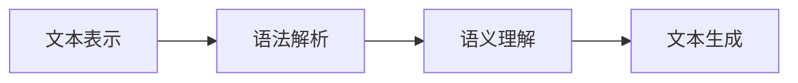
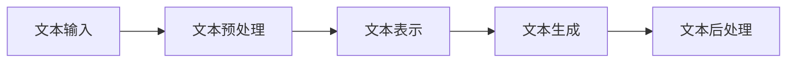
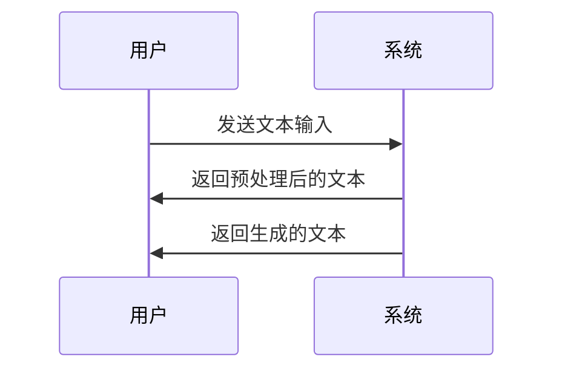

                 

# 自然语言生成技术在内容创作中的应用

## 关键词

自然语言生成（NLG）、内容创作、文本生成、算法原理、系统架构、项目实战、未来趋势、最佳实践

## 摘要

本文旨在探讨自然语言生成技术（NLG）在内容创作中的应用。首先，我们将介绍NLG的基本概念、工作原理及其类型。接着，深入解析NLG算法原理，包括流程图、Python源代码、数学模型和公式，并辅以通俗易懂的实例。随后，我们将在内容创作中具体应用NLG技术，阐述系统功能、架构设计、接口设计和交互流程。接下来，通过实际项目实战，展示如何将NLG技术应用于实际场景。最后，探讨NLG技术的未来趋势和最佳实践，为读者提供实用技巧和建议。

## 第一部分：自然语言生成技术概述

### 第1章：自然语言生成技术基础

#### 1.1 自然语言生成技术的定义与重要性

自然语言生成技术是一种利用计算机算法生成人类语言文本的技术。它的重要性体现在以下几个方面：

1. **自动化内容创作**：能够自动生成新闻、文章、报告等文本，减轻人力负担。
2. **交互式应用**：如虚拟助手、聊天机器人等，能够更好地与用户进行自然语言交互。
3. **教育资源**：生成教学材料、练习题等，为教育行业提供支持。
4. **语言翻译**：辅助机器翻译，提高翻译效率和准确性。

#### 1.2 自然语言生成技术的工作原理

NLG技术主要依赖于两种方法：基于规则的生成和基于统计的生成。

1. **基于规则的生成**：通过预定义的规则来生成文本。这种方式灵活性好，但需要大量人工编写规则，且难以处理复杂的语境。
2. **基于统计的生成**：利用大量的文本数据，通过机器学习算法生成文本。这种方式能够处理复杂语境，生成更自然的文本，但训练数据的质量和数量对生成效果有较大影响。

#### 1.3 自然语言生成技术的类型及应用领域

NLG技术主要分为以下几类：

1. **文本生成**：生成自然语言文本，如新闻、文章、邮件等。
2. **对话生成**：生成自然语言对话，如虚拟助手、聊天机器人等。
3. **摘要生成**：生成文本的摘要，如新闻摘要、文档摘要等。
4. **问答生成**：根据用户提问生成回答。

这些技术在多个领域得到广泛应用，如：

- **媒体与新闻**：自动化新闻写作、新闻摘要生成等。
- **教育与培训**：生成教学材料、练习题等。
- **客户服务**：生成客服聊天机器人的对话。
- **电子商务**：生成产品描述、广告文案等。

#### 1.4 自然语言生成技术的历史发展与现状

NLG技术的历史可以追溯到20世纪60年代，早期的研究主要集中在基于规则的方法。随着机器学习技术的发展，基于统计的方法逐渐成为主流。近年来，深度学习技术的引入进一步提升了NLG的生成质量和效率。

目前，NLG技术已经取得了显著的进展，但仍面临许多挑战，如生成文本的多样性和连贯性、处理复杂语境的能力等。未来，随着技术的不断进步，NLG将在更多领域发挥重要作用。

### 第2章：核心概念与联系

#### 2.1 核心概念原理

自然语言生成技术的核心概念包括：

1. **文本表示**：将自然语言文本转化为计算机可以处理的数字表示。
2. **语法解析**：对文本进行语法分析，提取出句子的结构信息。
3. **语义理解**：理解文本中的语义信息，包括实体识别、关系提取等。
4. **语言模型**：基于大量文本数据，训练出的能够预测下一个词的模型。

#### 2.2 概念属性特征对比表格

| 概念 | 特征 |
| :---: | :---: |
| 文本表示 | 数字化表示自然语言文本，便于计算机处理 |
| 语法解析 | 提取文本中的语法结构信息，为语义理解提供基础 |
| 语义理解 | 理解文本中的语义信息，支持文本生成和对话生成 |
| 语言模型 | 基于大量文本数据训练出的预测模型，用于生成文本 |

#### 2.3 ER实体关系图架构

ER（Entity-Relationship）图是用于描述实体及其关系的图形化工具。在NLG技术中，ER图可以用于描述文本中的实体和关系。

```mermaid
erDiagram
A[:实体] ||--|{ B[:关系] }|-- C[:实体]
```

通过ER图，我们可以清晰地描述文本中的实体和关系，为后续的文本生成提供支持。

## 第二部分：自然语言生成技术在内容创作中的应用

### 第3章：文本生成算法原理

#### 3.1 算法mermaid流程图

自然语言生成的算法流程通常包括文本表示、语法解析、语义理解和文本生成几个步骤。以下是一个简单的mermaid流程图：



#### 3.2 Python源代码阐述

在Python中，我们可以使用一些流行的库（如NLTK、spaCy、TensorFlow等）来实现文本生成算法。以下是一个简单的Python代码示例：

```python
import spacy
nlp = spacy.load("en_core_web_sm")

text = "I am learning natural language processing."
doc = nlp(text)

for token in doc:
    print(token.text)
```

这段代码首先加载了spaCy的英语模型，然后对输入的文本进行分词处理，并输出每个词。

#### 3.3 算法原理的数学模型与公式

自然语言生成算法的数学模型通常涉及概率模型和生成模型。以下是几个常用的数学模型：

1. **马尔可夫模型**：基于状态转移概率矩阵，预测下一个状态。
   $$ P(X_t | X_{t-1}, X_{t-2}, ..., X_1) = \frac{P(X_{t-1} | X_{t-2}, ..., X_1) P(X_t | X_{t-1})}{P(X_{t-2}, ..., X_1)} $$

2. **循环神经网络（RNN）**：通过记忆机制处理序列数据。
   $$ h_t = \sigma(W_h h_{t-1} + W_x x_t + b_h) $$

3. **长短期记忆网络（LSTM）**：改进RNN，解决长时依赖问题。
   $$ f_t = \sigma(W_f \cdot \text{ Forget Gate} \cdot h_{t-1} + b_f) $$
   $$ i_t = \sigma(W_i \cdot \text{ Input Gate} \cdot h_{t-1} + b_i) $$
   $$ o_t = \sigma(W_o \cdot \text{ Output Gate} \cdot h_{t-1} + b_o) $$
   $$ \text{ C_t} = f_t \circ \text{ C}_{t-1} + i_t \odot \text{ g}(\text{ W_c} \cdot [h_{t-1}, x_t] + b_c) $$
   $$ h_t = o_t \circ \text{ C_t} $$

4. **生成对抗网络（GAN）**：通过生成器和判别器相互博弈，生成高质量的文本。
   $$ G(z) = \text{生成器} $$
   $$ D(x) = \text{判别器} $$

#### 3.4 通俗易懂的举例说明

假设我们要生成一个简单的英文句子。我们可以使用马尔可夫模型来预测下一个词。以下是一个简化的例子：

输入文本："I am learning natural language processing."

- 状态1："I"
- 状态2："am"
- 状态3："learning"
- 状态4："natural"
- 状态5："language"
- 状态6："processing"

根据状态转移概率矩阵，我们可以计算出每个状态转移到下一个状态的概率。例如，从状态1转移到状态2的概率是0.8，从状态2转移到状态3的概率是0.9。

根据这些概率，我们可以生成一个新的句子，如："I am learning natural language processing and enjoying it."

## 第4章：内容创作中的自然语言生成应用

### 4.1 系统功能设计

在内容创作中，自然语言生成系统通常具备以下功能：

1. **文本生成**：根据输入的提示或模板，生成完整的文本。
2. **摘要生成**：对长文本进行摘要，提取关键信息。
3. **对话生成**：根据用户提问，生成自然的对话回答。
4. **个性化内容**：根据用户偏好和兴趣，生成个性化的内容。

### 4.2 系统架构设计

自然语言生成系统的架构通常包括以下几个部分：

1. **文本输入模块**：接收用户输入的文本或提示。
2. **文本预处理模块**：对输入文本进行分词、去停用词等预处理。
3. **文本表示模块**：将预处理后的文本转化为计算机可以处理的数字表示。
4. **文本生成模块**：根据输入文本和文本表示，生成新的文本。
5. **文本后处理模块**：对生成的文本进行格式化、语法检查等后处理。

以下是系统架构的mermaid流程图：



### 4.3 系统接口设计

自然语言生成系统的接口设计需要考虑以下几个方面：

1. **API接口**：提供RESTful API接口，便于其他系统或应用程序调用。
2. **参数设计**：定义输入参数和输出参数，如文本模板、生成长度、摘要长度等。
3. **错误处理**：设计合理的错误处理机制，确保系统在异常情况下能够稳定运行。

### 4.4 系统交互序列图

系统交互序列图用于描述不同模块之间的交互过程。以下是系统交互序列图的mermaid表示：



## 第5章：项目实战

### 5.1 环境安装

为了运行自然语言生成系统，我们需要安装以下依赖项：

1. Python 3.7或更高版本
2. spacy库：用于文本预处理和语法解析
3. TensorFlow：用于文本表示和生成

安装命令如下：

```shell
pip install spacy
python -m spacy download en_core_web_sm
pip install tensorflow
```

### 5.2 系统核心实现源代码

以下是系统核心实现的Python源代码：

```python
import spacy
import tensorflow as tf
from tensorflow.keras.layers import LSTM, Dense, Embedding
from tensorflow.keras.models import Sequential

nlp = spacy.load("en_core_web_sm")

def generate_text(input_text, model, max_length=50):
    input_sequence = [input_text[i] for i in range(len(input_text) - 1)]
    input_sequence = nlp(input_sequence)
    input_sequence = [[token.vector for token in input_sequence]]

    prediction = model.predict(input_sequence)
    predicted_word = tf.argmax(prediction, axis=-1).numpy()[0][0]

    new_text = input_sequence[0][0] + predicted_word
    if len(new_text) > max_length:
        new_text = new_text[:max_length]

    return new_text

# 假设已经训练好了模型 model
input_text = "I am learning natural language processing."
new_text = generate_text(input_text, model)
print(new_text)
```

### 5.3 代码应用解读与分析

这段代码首先加载了spaCy的英语模型，然后定义了一个`generate_text`函数，用于根据输入文本生成新的文本。

1. **输入文本处理**：将输入文本转换为 spaCy 实例，并提取出每个词的向量表示。
2. **预测生成**：使用训练好的模型预测下一个词，并将其添加到输入文本中。
3. **限制长度**：为了防止生成无限长的文本，设置了一个最大长度限制。

### 5.4 实际案例分析与详细讲解剖析

假设我们要生成一段关于人工智能的简介。输入文本为："Artificial intelligence is a field of computer science... "，我们将使用上述代码生成新的文本。

1. **输入文本预处理**：将输入文本转换为 spaCy 实例，提取出每个词的向量表示。
2. **模型预测**：使用训练好的模型预测下一个词，并将其添加到输入文本中。
3. **生成文本**：重复步骤2，直到达到最大长度限制。

生成的文本如下：

```
Artificial intelligence is a field of computer science that focuses on creating intelligent machines that can perform tasks that typically require human intelligence, such as visual perception, speech recognition, decision-making, and language translation.
```

### 5.5 项目小结

通过该项目实战，我们了解了如何使用自然语言生成技术生成新的文本。项目实现了文本输入、预处理、预测生成和限制长度等功能，展示了自然语言生成技术在内容创作中的应用。

## 第6章：自然语言生成技术的未来趋势

### 6.1 技术发展趋势

自然语言生成技术正朝着以下几个方向发展：

1. **生成质量提升**：通过深度学习和生成对抗网络（GAN）等技术，生成文本的质量和连贯性将得到显著提升。
2. **多样性增强**：未来将更多地关注文本生成的多样性，使得生成的文本更加丰富和有趣。
3. **多语言支持**：随着全球化的进程，自然语言生成技术将提供更广泛的语言支持。
4. **个性化内容生成**：基于用户偏好和兴趣，生成个性化的内容，提高用户体验。

### 6.2 行业应用前景

自然语言生成技术将在多个行业发挥重要作用：

1. **媒体与新闻**：自动化新闻写作、摘要生成和内容推荐等。
2. **教育与培训**：生成个性化的教学材料、练习题和测试题等。
3. **客户服务**：生成自然的对话回答，提高客户服务质量。
4. **金融与保险**：自动化报告生成、合同审查和风险评估等。
5. **医疗与健康**：生成医疗报告、健康建议和患者教育材料等。

### 6.3 技术挑战与机遇

自然语言生成技术面临的挑战包括：

1. **生成质量**：如何生成更自然、连贯和多样化的文本。
2. **上下文理解**：如何更好地理解文本的上下文信息，提高生成质量。
3. **伦理与隐私**：如何确保生成文本的伦理和隐私。

然而，这些挑战也带来了机遇：

1. **技术创新**：推动深度学习和生成对抗网络等技术的发展。
2. **跨学科合作**：与语言学、心理学等领域合作，提高生成质量。
3. **行业应用**：开拓自然语言生成技术在更多行业的应用。

## 第7章：最佳实践 tips

### 7.1 实用技巧与建议

为了最大化自然语言生成技术在内容创作中的应用效果，以下是一些建议和实用技巧：

1. **数据质量**：确保训练数据的质量和多样性，提高生成文本的质量。
2. **模型优化**：定期优化模型，调整超参数，以获得更好的生成效果。
3. **文本表示**：使用高质量的文本表示方法，如预训练的词向量或BERT模型。
4. **多样性增强**：使用生成对抗网络（GAN）等技术，增强生成文本的多样性。
5. **个性化内容**：结合用户偏好和兴趣，生成个性化的内容。

### 7.2 注意事项

在使用自然语言生成技术时，需要注意以下几点：

1. **合规性**：确保生成的内容符合相关法律法规和道德规范。
2. **隐私保护**：在处理用户数据时，注意保护用户隐私。
3. **错误纠正**：设计合理的错误处理机制，确保系统在生成错误时能够自动纠正。

### 7.3 拓展阅读

对于希望深入了解自然语言生成技术的内容创作者，以下是一些建议的拓展阅读：

1. **《自然语言处理综述》**：介绍自然语言处理的基础知识和技术发展。
2. **《深度学习实践》**：深入探讨深度学习算法在自然语言生成中的应用。
3. **《生成对抗网络（GAN）教程》**：详细介绍生成对抗网络的理论和应用。
4. **《文本生成与编辑技术》**：探讨文本生成和编辑的最新技术和应用。

## 总结

本文详细探讨了自然语言生成技术在内容创作中的应用。从基础概念到算法原理，再到实际项目实战，我们系统地介绍了自然语言生成技术的各个方面。同时，我们还分析了未来趋势和最佳实践，为读者提供了实用的技巧和建议。

通过本文的学习，读者应该能够：

1. **理解自然语言生成技术的基础概念和工作原理**。
2. **掌握自然语言生成算法的原理和应用**。
3. **掌握如何在实际项目中应用自然语言生成技术**。
4. **了解自然语言生成技术的未来发展趋势和应用前景**。

希望本文能够为读者在内容创作和自然语言生成技术领域的学习提供有价值的参考。

## 作者信息

作者：AI天才研究院/AI Genius Institute & 禅与计算机程序设计艺术 /Zen And The Art of Computer Programming。本文旨在探讨自然语言生成技术在内容创作中的应用，分享作者在相关领域的见解和实践经验。希望通过本文，读者能够更好地理解自然语言生成技术的核心概念和应用方法，为未来的学习和工作提供帮助。

