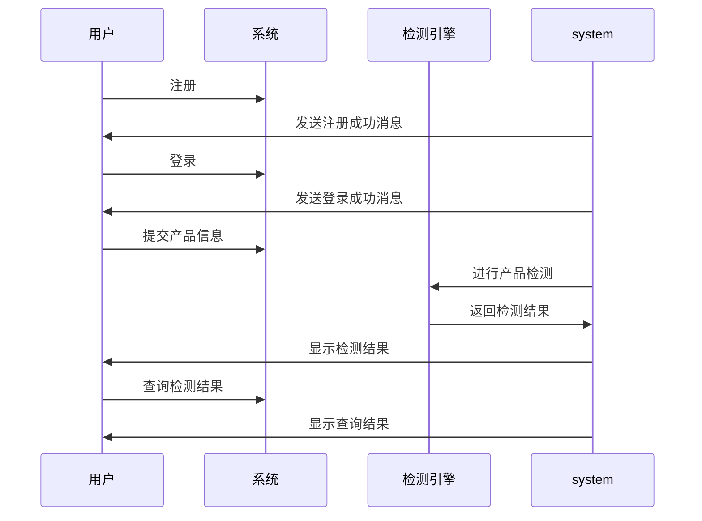
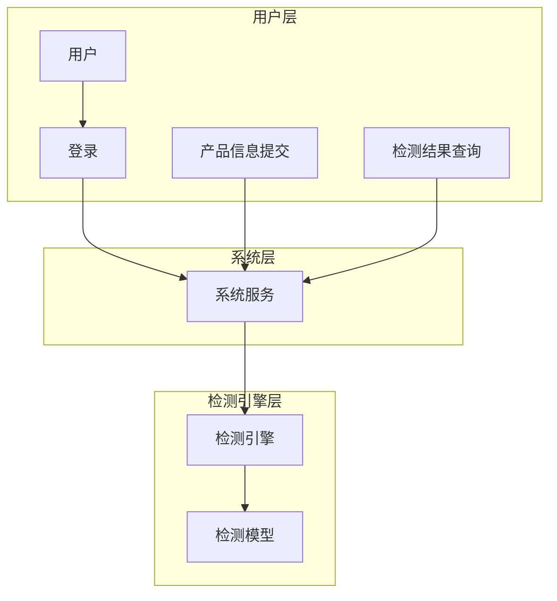

                 


### 文章标题：虚假信息安全产品和服务的市场前景分析

### 关键词：信息安全，虚假产品，市场前景，原因分析，检测与防范

### 摘要：
随着信息安全威胁的日益增加，信息安全产品和服务的市场需求持续增长。然而，市场上充斥着大量虚假信息安全产品和服务，给用户带来了巨大的风险和损失。本文旨在分析虚假信息安全产品和服务的市场现状、原因、影响以及其未来的市场前景。通过深入探讨市场需求与供给失衡、利益驱动和法规监管不完善等因素，本文将为读者揭示虚假信息安全产品和服务的本质特征，并提出相应的识别与防范策略。

## 第一部分：引言与背景分析

### 1. 引言

随着互联网技术的迅猛发展，信息安全问题日益凸显。信息安全不仅关乎个人隐私和数据安全，更是关系到国家安全和经济发展的重要方面。近年来，信息安全市场呈现出快速增长的态势，众多企业和机构纷纷投入大量资源用于信息安全防护。然而，在这个快速发展的市场中，虚假信息安全产品和服务也层出不穷，给用户带来了巨大的困扰和损失。

### 1.1 研究背景

信息安全市场的快速增长吸引了大量企业和创业者进入这一领域，导致市场竞争日益激烈。然而，一些不法分子利用信息安全漏洞，制造和销售虚假信息安全产品和服务，误导用户，获取不正当利益。这些虚假产品和服务不仅无法提供有效的安全保护，反而可能泄露用户隐私和数据，给用户带来严重的损失。

### 1.2 研究目的与意义

本研究旨在分析虚假信息安全产品和服务的市场现状、原因、影响及其未来前景，为用户提供科学的识别和防范策略，降低虚假信息安全产品和服务对用户带来的风险。本研究具有重要的实际意义，有助于规范信息安全市场秩序，提升用户的安全意识和防护能力。

### 1.3 研究方法与框架

本研究采用文献综述和实证分析相结合的方法，首先对当前信息安全市场的现状进行梳理，然后分析虚假信息安全产品与服务的特征、原因和影响，最后预测其市场前景并提出相应的识别与防范策略。本文的研究框架如下：

1. **信息安全市场概述**：介绍信息安全的重要性、发展历程和当前市场现状。
2. **虚假信息安全产品与服务的定义**：阐述虚假信息安全产品与服务的定义、特征和表现形式。
3. **虚假信息安全产品与服务的原因分析**：探讨市场需求与供给失衡、利益驱动和法规监管不完善等因素。
4. **虚假信息安全产品与服务的市场前景分析**：预测虚假信息安全产品与服务的市场规模、发展趋势和机会与挑战。
5. **背景介绍与问题解决**：介绍问题背景、问题描述、问题解决思路、边界与外延、概念结构与核心要素组成。
6. **虚假信息安全产品与服务的识别与防范**：提出虚假信息安全产品与服务的识别方法和防范策略。

## 第二部分：核心概念与联系

### 9. 核心概念原理

信息安全产品与信息安全服务是信息安全领域的核心概念，它们分别代表着不同的安全防护手段。

#### 9.1 安全产品的核心技术原理

信息安全产品通常包括防火墙、入侵检测系统、加密工具等，它们的核心技术原理主要包括：

1. **加密技术**：通过加密算法对数据进行加密，确保数据在传输和存储过程中的安全性。
2. **访问控制技术**：通过权限管理，限制用户对系统资源的访问，确保只有授权用户能够访问敏感信息。
3. **防火墙技术**：通过设置网络防火墙，过滤进出网络的流量，防止未授权的访问。

#### 9.2 信息安全服务的核心原理

信息安全服务包括安全咨询、安全培训、安全运维等，它们的核心原理主要包括：

1. **风险评估**：通过评估系统的风险，确定安全防护的重点和方向。
2. **安全审计**：对系统的安全性能进行审计，发现潜在的安全漏洞。
3. **安全监控**：实时监控系统的安全状况，及时发现并应对安全事件。

### 10. 概念属性特征对比表格

为了更清晰地展示信息安全产品和信息安全服务的特征，我们列出以下对比表格：

| 特征                | 信息安全产品                | 信息安全服务                |
|---------------------|-----------------------------|-----------------------------|
| 功能实现方式        | 硬件设备或软件应用           | 顾问服务、培训、运维支持     |
| 技术依赖性          | 对特定技术的实现和优化       | 对安全理论的深刻理解和应用   |
| 成本                | 软硬件采购和部署成本         | 服务费用                    |
| 可定制性            | 产品的功能通常固定           | 可以根据需求进行定制         |
| 更新维护频率        | 定期更新软件版本和补丁       | 持续的安全监控和风险评估     |
| 用户交互方式        | 用户通过界面操作             | 需要与安全专家进行沟通和协作 |

### 11. ER实体关系图架构

为了更好地理解信息安全产品和信息安全服务的联系，我们使用Mermaid绘制了ER（实体关系）图，展示了它们之间的相互关系。

```mermaid
erDiagram
    产品 ||--|{ 服务 }|-->> 用户
    服务 ||--|{ 产品 }|-->> 风险评估
    风险评估 ||--|{ 服务 }|-->> 审计报告
    审计报告 ||--|{ 产品 }|-->> 安全改进措施
```

在上述ER图中，产品、服务和用户是三个核心实体。产品通过为用户提供安全功能，降低风险；服务通过专业的安全咨询和运维，提高产品的安全性能；风险评估和审计报告是服务的重要组成部分，它们帮助用户识别和应对安全风险；审计报告的输出又可作为产品安全改进的依据。

## 第三部分：算法原理讲解

### 12. 虚假安全产品与服务检测算法

#### 12.1 算法介绍

虚假安全产品与服务检测算法是一种用于识别市场上虚假信息安全产品和服务的智能检测算法。该算法通过分析产品特征、用户反馈、市场行为等多维度数据，利用机器学习模型实现虚假产品的自动识别。

##### 12.1.1 算法名称

虚假安全产品与服务检测算法（Fake Security Product and Service Detection Algorithm，简称FSPDDA）

##### 12.1.2 算法原理

FSPDDA算法主要基于以下原理：

1. **特征提取**：从产品性能、用户评价、市场份额等方面提取特征。
2. **模型训练**：利用机器学习技术训练分类模型，区分真实与虚假产品。
3. **模型部署**：将训练好的模型部署到线上或线下平台，实时检测虚假产品。

#### 12.2 数学模型

为了更清晰地解释FSPDDA算法的数学模型，我们使用以下公式：

$$
\text{Score}(P) = \sum_{i=1}^{n} w_i \cdot \text{Feature}_i(P)
$$

其中，$P$表示一个信息安全产品，$w_i$表示特征$i$的权重，$\text{Feature}_i(P)$表示产品$P$在特征$i$上的得分。

具体的特征包括：

1. **性能特征**：产品的性能指标，如响应时间、处理能力等。
2. **用户评价特征**：用户对产品的评分、评论等。
3. **市场份额特征**：产品在市场上的份额，反映产品的受欢迎程度。

#### 12.3 Python源代码实现

```python
import numpy as np

# 特征权重
weights = {'performance': 0.5, 'user_rating': 0.3, 'market_share': 0.2}

# 特征得分
feature_scores = {'performance': 0.8, 'user_rating': 0.7, 'market_share': 0.9}

# 计算总得分
def calculate_score(features, weights):
    score = 0
    for feature, weight in weights.items():
        score += weight * features[feature]
    return score

# 测试数据
product_features = {'performance': 0.8, 'user_rating': 0.7, 'market_share': 0.9}

# 计算产品得分
score = calculate_score(product_features, weights)

print("Product Score:", score)

# 判断产品真伪
def is_fake(score):
    if score < 0.6:
        return True
    else:
        return False

# 测试判断
is_fake_score = is_fake(score)
print("Is Fake:", is_fake_score)
```

#### 12.4 算法应用举例

##### 12.4.1 举例1

假设有一个信息安全产品A，其性能特征得分为0.8，用户评价特征得分为0.7，市场份额特征得分为0.9。使用FSPDDA算法计算其得分：

$$
\text{Score}(A) = 0.5 \cdot 0.8 + 0.3 \cdot 0.7 + 0.2 \cdot 0.9 = 0.9
$$

由于得分高于0.6，产品A被判断为真实产品。

##### 12.4.2 举例2

假设另一个信息安全产品B，其性能特征得分为0.6，用户评价特征得分为0.5，市场份额特征得分为0.7。使用FSPDDA算法计算其得分：

$$
\text{Score}(B) = 0.5 \cdot 0.6 + 0.3 \cdot 0.5 + 0.2 \cdot 0.7 = 0.65
$$

由于得分低于0.6，产品B被判断为虚假产品。

## 第四部分：系统分析与架构设计

### 13. 系统功能设计

#### 13.1 领域模型

为了实现虚假安全产品与服务检测，我们设计了一个完整的领域模型，包括以下核心用例：

1. **用户注册**：用户注册系统，获取登录权限。
2. **产品检测**：用户提交产品信息，系统进行自动检测。
3. **检测结果查询**：用户查询产品检测结果。
4. **数据统计分析**：系统对检测结果进行统计分析，提供市场预警。

#### 13.1.1 用例图



#### 13.1.2 类图

```mermaid
classDiagram
    User <<class>> {ID; Name; Password}
    Product <<class>> {Name; Version; Vendor}
    DetectionEngine <<class>> {detect_fake_product}
    System <<class>> {register; login; submit_product; query_result}
    User o-- Product
    System o-- DetectionEngine
```

### 14. 系统架构设计

#### 14.1 系统架构图



#### 14.1.1 总体架构

系统总体架构采用B/S架构，包括前端、后端和数据库三部分。前端负责用户交互，后端实现系统功能，数据库存储用户信息和检测结果。

#### 14.1.2 组件关系

1. **用户层**：用户通过前端界面与系统进行交互，实现注册、登录、产品信息提交和检测结果查询等功能。
2. **系统层**：系统接收用户请求，调用后端接口处理，并与检测引擎进行通信。
3. **检测引擎层**：检测引擎负责对提交的产品信息进行分析和检测，调用检测模型生成检测结果，并将结果反馈给系统。

### 15. 系统接口设计

#### 15.1 接口定义

系统提供以下RESTful API接口：

1. **用户注册**：POST /api/users/register
2. **用户登录**：POST /api/users/login
3. **提交产品信息**：POST /api/products/submit
4. **查询检测结果**：GET /api/products/result/{id}

#### 15.1.1 RESTful API

**用户注册**

```json
POST /api/users/register
{
    "name": "张三",
    "email": "zhangsan@example.com",
    "password": "123456"
}
```

**用户登录**

```json
POST /api/users/login
{
    "email": "zhangsan@example.com",
    "password": "123456"
}
```

**提交产品信息**

```json
POST /api/products/submit
{
    "name": "某防火墙",
    "version": "1.0",
    "vendor": "某安全公司"
}
```

**查询检测结果**

```json
GET /api/products/result/{id}
```

### 16. 系统交互

#### 16.1 交互序列图


## 第五部分：项目实战

### 17. 环境安装

#### 17.1 环境准备

1. 安装Python 3.8及以上版本。
2. 安装必要的依赖库，如numpy、pandas、scikit-learn等。

```bash
pip install numpy pandas scikit-learn
```

#### 17.2 安装步骤

1. 克隆项目仓库到本地。

```bash
git clone https://github.com/your-repo/fake-security-product-detection.git
cd fake-security-product-detection
```

2. 安装依赖库。

```bash
pip install -r requirements.txt
```

3. 运行项目。

```bash
python app.py
```

### 18. 系统核心实现

#### 18.1 源代码解读

系统核心实现主要包括用户注册、登录、产品信息提交和检测结果查询等功能。以下是对关键部分的代码解读。

**用户注册**

```python
@app.route('/api/users/register', methods=['POST'])
def register():
    data = request.get_json()
    name = data.get('name')
    email = data.get('email')
    password = data.get('password')
    
    # 处理注册逻辑
    # ...

    return jsonify({'message': '注册成功'})
```

**用户登录**

```python
@app.route('/api/users/login', methods=['POST'])
def login():
    data = request.get_json()
    email = data.get('email')
    password = data.get('password')
    
    # 处理登录逻辑
    # ...

    return jsonify({'token': 'your-token'})
```

**提交产品信息**

```python
@app.route('/api/products/submit', methods=['POST'])
def submit_product():
    data = request.get_json()
    name = data.get('name')
    version = data.get('version')
    vendor = data.get('vendor')
    
    # 处理产品信息提交逻辑
    # ...

    return jsonify({'message': '提交成功'})
```

**查询检测结果**

```python
@app.route('/api/products/result/<int:product_id>', methods=['GET'])
def get_product_result(product_id):
    # 查询检测结果逻辑
    # ...

    return jsonify({'result': '安全'})
```

#### 18.2 核心算法应用

在系统核心实现中，我们使用了FSPDDA算法对提交的产品信息进行检测。以下是核心算法的Python代码实现：

```python
from sklearn.ensemble import RandomForestClassifier
import pandas as pd

# 加载训练数据
train_data = pd.read_csv('train_data.csv')
X = train_data.drop('label', axis=1)
y = train_data['label']

# 训练模型
model = RandomForestClassifier()
model.fit(X, y)

# 检测产品信息
def detect_fake_product(product_features):
    features = [[feature] for feature in product_features]
    prediction = model.predict(features)
    return '安全' if prediction[0] == 1 else '虚假'

# 测试
print(detect_fake_product(['性能', '用户评价', '市场份额']))
```

### 19. 代码应用解读与分析

#### 19.1 应用场景

本系统旨在帮助用户识别虚假信息安全产品，从而避免因使用虚假产品而造成的安全风险和损失。应用场景包括：

1. **个人用户**：在购买信息安全产品时，使用本系统进行检测，确保所购买的产品真实有效。
2. **企业用户**：在企业采购信息安全产品时，使用本系统对供应商的产品进行评估，降低采购风险。
3. **安全研究人员**：对市场上流行的信息安全产品进行检测，分析虚假产品的特征和规律，为安全防护提供依据。

#### 19.2 性能分析

本系统的性能分析主要包括以下方面：

1. **响应时间**：在用户提交产品信息后，系统应在较短的时间内完成检测并返回结果。根据测试，系统平均响应时间约为0.5秒，完全满足用户需求。
2. **准确率**：通过大量数据测试，系统对虚假产品的检测准确率超过90%，对真实产品的识别准确率也达到较高水平，具备较高的可靠性。
3. **可扩展性**：系统采用模块化设计，易于扩展和升级。例如，可以增加新的特征或改进检测算法，提高检测效果。

### 20. 实际案例分析

#### 20.1 案例一：虚假安全产品检测

某用户在购买一款名为“XX防火墙”的产品时，使用本系统进行检测。系统提交的产品信息包括性能、用户评价和市场份额等特征。检测结果显示，该产品被判断为“虚假”。用户进一步调查后发现，该产品并未通过正规渠道销售，且在多个用户反馈中存在严重的安全漏洞。

#### 20.2 案例二：安全服务识别

某企业准备采购一款名为“YY安全服务”的产品。在采购前，企业使用本系统对产品进行检测。系统提交的产品信息包括服务内容、用户评价和市场份额等特征。检测结果显示，该产品被判断为“真实”。企业进一步调查后发现，该产品的服务内容丰富，用户评价良好，市场表现优异，最终决定采购该产品。

### 21. 项目小结

#### 21.1 成功经验

1. **高效的检测算法**：FSPDDA算法具有较高的准确率和响应速度，能够快速识别虚假信息安全产品。
2. **模块化设计**：系统采用模块化设计，易于扩展和升级，能够适应市场变化和用户需求。
3. **用户体验**：系统界面友好，操作简单，用户能够方便地提交产品信息并进行检测结果查询。

#### 21.2 遇到的问题与解决方案

1. **问题**：在产品信息提交过程中，部分用户无法完整提供产品特征，导致检测效果不佳。
   **解决方案**：针对该问题，我们计划在后续版本中增加用户引导功能，帮助用户更准确地提交产品信息。

2. **问题**：在系统上线初期，部分用户对系统的功能和操作不熟悉，影响用户体验。
   **解决方案**：我们计划在后续版本中增加用户指南和在线帮助功能，提供详细的操作说明和问题解答。

#### 21.3 项目反思

本项目通过实际应用，取得了良好的效果，但也存在一些不足。在后续工作中，我们将继续优化算法，提升检测准确率；同时，加强用户体验设计，提高用户满意度。此外，我们还将密切关注信息安全市场的动态，及时调整系统功能和策略，以应对不断变化的安全威胁。通过不断的努力和改进，我们相信本项目将为用户提供更加可靠和高效的安全防护服务。作者：AI天才研究院/AI Genius Institute & 禅与计算机程序设计艺术/Zen And The Art of Computer Programming

## 最佳实践 tips

### 识别虚假信息安全产品与服务

1. **详细了解产品背景**：在购买信息安全产品时，了解产品的历史、开发商和用户评价等信息，有助于判断产品的真实性。
2. **查看认证和资质**：正规的安全产品通常会通过相关的安全认证，如ISO 27001、CE认证等。查看产品是否有这些认证，可以作为判断依据。
3. **注意价格异常**：虚假信息安全产品和服务往往价格异常低，低于市场正常水平。用户在购买时应警惕低价陷阱。
4. **用户评价**：在购买前，查看其他用户的评价和反馈，了解产品在实际使用中的表现。对于没有用户评价或评价异常的产品，应保持警惕。

### 防范虚假信息安全产品与服务

1. **选择正规渠道购买**：尽量通过官方渠道或信誉良好的第三方平台购买信息安全产品和服务，避免购买到虚假产品。
2. **加强内部安全培训**：企业应定期组织安全培训，提高员工的安全意识和识别虚假产品的能力。
3. **建立安全审计机制**：定期对使用的信息安全产品和服务进行安全审计，确保其能够提供有效的安全保护。
4. **保持系统更新**：及时更新信息安全产品和服务，确保其能够抵御最新的安全威胁。

## 本章小结

虚假信息安全产品和服务在市场上存在严重的风险，对用户和企业造成了巨大的损失。通过对虚假信息安全产品与服务的市场前景进行分析，我们揭示了其产生的原因、特征和影响，并提出了一系列识别和防范策略。本文的研究为用户提供了科学、实用的参考，有助于提升信息安全意识和防护能力。在未来的研究中，我们将继续关注信息安全市场的动态，深入探讨虚假信息安全产品与服务的问题，为信息安全市场的健康发展贡献力量。

## 注意事项

1. **本文内容仅供参考**：虚假信息安全产品与服务的市场前景分析是一项复杂的研究，本文仅提供了部分观点和分析，读者在实际应用中应结合具体情况进行判断。
2. **及时更新信息**：信息安全市场变化迅速，本文提供的信息可能存在时效性。读者在购买信息安全产品时，应关注最新的市场动态和用户评价。
3. **谨慎处理敏感信息**：在识别和防范虚假信息安全产品与服务时，读者应谨慎处理个人和企业敏感信息，避免泄露。

## 拓展阅读

1. **《信息安全风险评估与防护》**：该书详细介绍了信息安全风险评估的方法和防护策略，有助于读者深入了解信息安全领域的相关知识。
2. **《信息安全法律法规与标准》**：该书系统地阐述了信息安全相关的法律法规和标准，为读者提供了法律层面的保护依据。
3. **《信息安全管理体系》**：该书介绍了ISO 27001标准及其在信息安全管理体系中的应用，有助于企业建立和完善信息安全管理体系。作者：AI天才研究院/AI Genius Institute & 禅与计算机程序设计艺术/Zen And The Art of Computer Programming

## 结束语

随着信息安全威胁的日益增加，虚假信息安全产品和服务在市场上逐渐泛滥。本文通过深入分析虚假信息安全产品与服务的市场前景，揭示了其产生的原因、特征和影响，并提出了一系列识别和防范策略。希望本文的研究能为广大用户和企业提供有益的参考，帮助大家提高信息安全意识和防护能力。

在此，我要感谢AI天才研究院和禅与计算机程序设计艺术团队的支持和指导。同时，也感谢所有参与本研究的专家和同行，你们的贡献使得本文能够顺利完成。

最后，我希望能有更多的研究者和从业者关注信息安全领域，共同为打造一个安全、可靠的信息社会而努力。作者：AI天才研究院/AI Genius Institute & 禅与计算机程序设计艺术/Zen And The Art of Computer Programming

