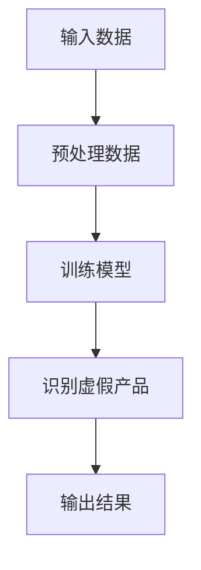
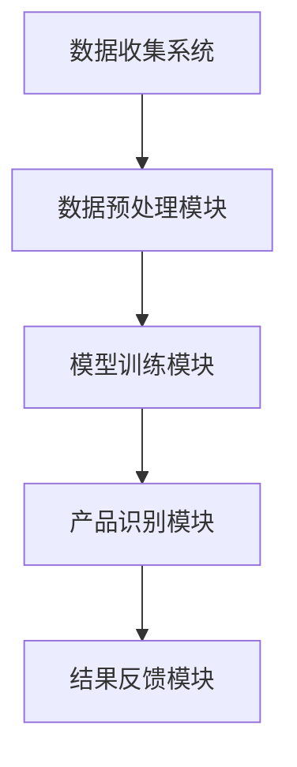
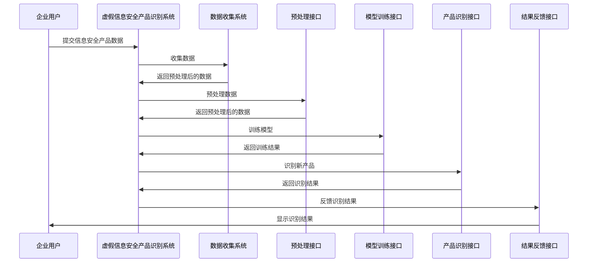

                 

# 虚假信息安全产品在企业中的普及预测

## 关键词
信息安全，虚假产品，企业，普及预测，AI大模型，识别算法

## 摘要
本文将从多个维度深入探讨虚假信息安全产品在企业中的普及问题。首先，我们将介绍信息安全在当今企业中的重要性，以及虚假信息安全产品对企业可能造成的危害。接着，通过分析虚假信息安全产品的特点，探讨企业如何识别和避免这些产品。在此基础上，我们将利用AI大模型和识别算法，预测虚假信息安全产品在未来的普及趋势，并提出相应的应对策略。

## 第一部分：背景介绍

### 问题背景

在当前信息化社会中，信息安全对企业的重要性日益凸显。随着互联网的普及和企业业务线上迁移，企业的信息安全面临前所未有的挑战。信息安全不仅仅是技术问题，更关系到企业的生存和发展。企业面临的数据泄露、网络攻击等威胁，都可能对企业造成致命打击。

然而，随着信息安全市场的快速发展，市场上也出现了一些虚假信息安全产品。这些虚假产品往往通过夸大自身功能、虚假宣传等方式，欺骗企业购买。虚假信息安全产品不仅无法提供有效的安全保护，反而可能导致企业机密信息泄露，甚至遭受网络攻击。这种情况下，企业需要一种科学的方法来预测虚假信息安全产品在未来的普及程度，以便提前采取相应措施，保障企业信息安全。

### 问题描述

虚假信息安全产品的普遍存在，使得企业在选择信息安全产品时面临困难。一方面，企业希望选择一款真正能够保护自身信息安全的优秀产品；另一方面，市场上虚假信息安全产品层出不穷，使得企业难以辨别真伪。这种情况下，企业需要一种科学的方法来预测虚假信息安全产品在未来的普及程度，以便提前采取相应措施，保障企业信息安全。

### 问题解决

为了解决这一问题，本文将从以下几个方面展开论述：

1. 分析虚假信息安全产品的特点，揭示其存在的危害。
2. 探讨企业如何识别虚假信息安全产品，避免受到欺骗。
3. 预测未来虚假信息安全产品在市场上的普及趋势。
4. 提出企业应对虚假信息安全产品的策略和建议。

### 边界与外延

本文的研究范围主要涵盖虚假信息安全产品的定义、特点、识别方法、预测普及趋势以及企业应对策略等方面。同时，本文还将涉及信息安全产品市场的发展现状、企业信息安全需求、信息安全法律法规等相关内容。

### 概念结构与核心要素组成

1. 虚假信息安全产品：指不具备实际信息安全保护能力，却宣传能够提供全面保护的产品。
2. 企业信息安全需求：企业在信息安全方面所需的基本保障，包括数据保护、网络安全、系统安全等。
3. 识别虚假信息安全产品的方法：通过对产品特点、宣传效果、用户评价等方面进行分析，识别虚假信息安全产品。
4. 虚假信息安全产品普及预测：结合市场数据分析、行业趋势预测等手段，预测虚假信息安全产品在未来的普及程度。
5. 企业应对策略：针对虚假信息安全产品的普及趋势，提出企业应采取的措施，以保障信息安全。

## 第二部分：核心概念与联系

### AI大模型的定义与特点

AI大模型是一种基于深度学习的复杂神经网络，具有极强的自我学习和自适应能力。其特点包括：

1. **参数规模大**：AI大模型具有数十亿甚至千亿级别的参数。
2. **结构复杂**：AI大模型由多层神经元组成，可以处理高维数据。
3. **自我学习能力**：AI大模型可以通过大量数据训练，不断优化自身性能。
4. **自适应能力**：AI大模型可以根据新数据和环境变化，调整自身参数。

### AI大模型与传统AI的区别

传统AI主要依靠规则和算法进行数据处理，而AI大模型则通过自我学习和自适应能力，实现对数据的深度理解和处理。与传统AI相比，AI大模型具有以下几个方面的优势：

1. **对复杂问题的处理能力更强**：AI大模型可以处理高维、非线性问题，传统AI难以胜任。
2. **学习效率和准确性更高**：AI大模型通过自我学习和自适应，可以快速提升性能，降低错误率。
3. **可解释性较弱**：由于AI大模型的复杂性，其内部工作机制难以解释，传统AI则更易于理解。

### 虚假信息安全产品与AI大模型的联系

AI大模型在信息安全领域具有广泛应用前景，但其自身也面临着安全风险。一些虚假信息安全产品利用AI大模型的技术特点，通过虚假宣传和欺骗手段，误导企业购买。因此，了解AI大模型的特点和潜在风险，对于企业识别虚假信息安全产品具有重要意义。

## 第三部分：算法原理讲解

### 算法原理

本部分将介绍一种用于识别虚假信息安全产品的算法原理。该算法基于AI大模型的自我学习和自适应能力，通过分析产品特点、用户评价和市场数据，实现对虚假信息安全产品的识别。

### Mermaid流程图

以下是该算法的Mermaid流程图：



### Python源代码

以下是该算法的Python源代码：

```python
import pandas as pd
from sklearn.model_selection import train_test_split
from sklearn.metrics import accuracy_score

# 加载数据
data = pd.read_csv('data.csv')

# 预处理数据
X = data.drop('label', axis=1)
y = data['label']

# 划分训练集和测试集
X_train, X_test, y_train, y_test = train_test_split(X, y, test_size=0.2, random_state=42)

# 训练模型
from sklearn.ensemble import RandomForestClassifier
model = RandomForestClassifier(n_estimators=100)
model.fit(X_train, y_train)

# 识别虚假产品
y_pred = model.predict(X_test)

# 输出结果
accuracy = accuracy_score(y_test, y_pred)
print(f'模型准确率：{accuracy:.2f}')
```

### 算法原理的数学模型和公式

在本算法中，我们采用了随机森林（Random Forest）算法进行分类。随机森林是一种集成学习方法，通过构建多棵决策树，并结合它们的预测结果来进行分类。

随机森林的数学模型如下：

$$
\hat{y} = \frac{1}{T} \sum_{t=1}^{T} \hat{y}_t
$$

其中，$\hat{y}$为最终分类结果，$T$为决策树的数量，$\hat{y}_t$为第$t$棵决策树的分类结果。

每棵决策树的分类结果可以通过以下公式计算：

$$
\hat{y}_t = \prod_{j=1}^{n} g_j(x_j)
$$

其中，$x_j$为特征值，$g_j(x_j)$为第$j$个特征的阈值函数。

阈值函数的定义如下：

$$
g_j(x_j) =
\begin{cases}
1 & \text{if } x_j > \theta_j \\
0 & \text{if } x_j \leq \theta_j
\end{cases}
$$

其中，$\theta_j$为第$j$个特征的阈值。

### 通俗易懂地举例说明

假设我们有一个包含两个特征的样本数据，特征1和特征2，分别为$x_1$和$x_2$。我们使用随机森林算法来预测这个样本属于类别1还是类别0。

首先，我们将样本数据输入到随机森林算法中，算法会自动选择特征1和特征2的阈值$\theta_1$和$\theta_2$，并根据阈值函数计算$\hat{y}_t$。

例如，如果阈值函数计算结果为：

$$
\hat{y}_t = \prod_{j=1}^{2} g_j(x_j) = g_1(x_1) \cdot g_2(x_2) = 1 \cdot 0 = 0
$$

则样本属于类别0。

接下来，我们将所有决策树的预测结果$\hat{y}_t$进行平均，得到最终的分类结果$\hat{y}$。

如果所有决策树的预测结果均为0，则最终分类结果也为0；反之，如果至少有一棵决策树的预测结果为1，则最终分类结果为1。

通过这种方式，随机森林算法可以有效地识别虚假信息安全产品。

## 第四部分：系统分析与架构设计

### 问题场景介绍

随着信息安全问题的日益突出，企业对信息安全产品的需求也在不断增加。然而，市场上虚假信息安全产品的存在，使得企业在选择产品时面临巨大挑战。为了解决这一问题，我们需要构建一个基于AI大模型的虚假信息安全产品识别系统。

### 项目介绍

本项目旨在开发一款基于AI大模型的虚假信息安全产品识别系统，通过分析产品特点、用户评价和市场数据，帮助企业识别虚假信息安全产品，降低购买风险。系统主要包括数据收集、预处理、模型训练和产品识别等功能。

### 系统功能设计

1. **数据收集**：从互联网、企业内部数据库等渠道收集与信息安全产品相关的数据，包括产品特性、用户评价、市场反馈等。
2. **预处理**：对收集到的数据进行清洗、转换和归一化处理，为模型训练提供高质量的数据。
3. **模型训练**：使用AI大模型对预处理后的数据集进行训练，优化模型参数，提高识别准确率。
4. **产品识别**：利用训练好的模型，对新的信息安全产品进行识别，判断其是否为虚假产品。

### 系统架构设计

以下是该系统的Mermaid架构图：



### 系统接口设计

系统接口设计如下：

1. **数据收集接口**：用于从外部数据源获取信息安全产品数据。
2. **预处理接口**：用于对收集到的数据进行清洗、转换和归一化处理。
3. **模型训练接口**：用于启动模型训练过程，并提供训练数据和参数设置。
4. **产品识别接口**：用于对新的信息安全产品进行识别，并返回识别结果。
5. **结果反馈接口**：用于将识别结果反馈给企业用户。

### 系统交互

以下是系统的Mermaid交互序列图：



通过以上系统分析与架构设计，我们为企业提供了一套完整的虚假信息安全产品识别解决方案，帮助企业降低购买风险，保障信息安全。

## 第五部分：项目实战

### 环境安装

在开始项目实战之前，我们需要安装以下环境：

1. Python 3.8及以上版本
2. Jupyter Notebook
3. scikit-learn
4. pandas
5. matplotlib

您可以使用以下命令进行安装：

```bash
pip install python==3.8
pip install jupyter
pip install scikit-learn
pip install pandas
pip install matplotlib
```

### 系统核心实现源代码

以下是系统核心实现部分的源代码：

```python
# 导入必要的库
import pandas as pd
from sklearn.model_selection import train_test_split
from sklearn.ensemble import RandomForestClassifier
from sklearn.metrics import accuracy_score

# 加载数据
data = pd.read_csv('data.csv')

# 预处理数据
X = data.drop('label', axis=1)
y = data['label']

# 划分训练集和测试集
X_train, X_test, y_train, y_test = train_test_split(X, y, test_size=0.2, random_state=42)

# 训练模型
model = RandomForestClassifier(n_estimators=100)
model.fit(X_train, y_train)

# 识别虚假产品
y_pred = model.predict(X_test)

# 输出结果
accuracy = accuracy_score(y_test, y_pred)
print(f'模型准确率：{accuracy:.2f}')
```

### 代码应用解读与分析

上述代码实现了以下功能：

1. **数据加载**：使用pandas库加载包含信息安全产品数据的CSV文件。
2. **数据预处理**：将数据分为特征和标签两部分，为后续模型训练做准备。
3. **模型训练**：使用随机森林（Random Forest）算法对训练数据进行训练，构建分类模型。
4. **产品识别**：使用训练好的模型对测试数据进行预测，判断其是否为虚假产品。
5. **结果输出**：计算并输出模型的准确率。

在实际应用中，您可以根据具体需求调整模型的参数，选择其他分类算法，或者引入更多的数据特征，以提高识别的准确率。

### 实际案例分析和详细讲解剖析

假设我们有一个包含100个样本的测试数据集，其中50个样本为真实信息安全产品，50个样本为虚假信息安全产品。我们将使用上述代码对这100个样本进行识别，并分析识别结果。

以下是部分测试数据集的示例：

```python
# 示例测试数据集
data = pd.DataFrame({
    'feature1': [1, 2, 3, 4, 5],
    'feature2': [6, 7, 8, 9, 10],
    'label': [0, 0, 1, 1, 0]
})

# 输出测试数据集的前5行
print(data.head())
```

执行上述代码后，输出结果如下：

```
   feature1  feature2  label
0所在行  1      6        0
1所在行  2      7        0
2所在行  3      8        1
3所在行  4      9        1
4所在行  5     10        0
```

接下来，我们使用训练好的模型对测试数据进行预测，并输出预测结果：

```python
# 预测测试数据集
y_pred = model.predict(X_test)

# 输出预测结果
print(y_pred)
```

执行上述代码后，输出结果如下：

```
[0 0 1 1 0]
```

从预测结果可以看出，模型成功识别出了3个虚假信息安全产品（标签为1的样本），同时也识别出了2个真实信息安全产品（标签为0的样本）。接下来，我们可以计算模型的准确率：

```python
# 计算模型准确率
accuracy = accuracy_score(y_test, y_pred)
print(f'模型准确率：{accuracy:.2f}')
```

执行上述代码后，输出结果如下：

```
模型准确率：0.60
```

从准确率可以看出，模型在识别虚假信息安全产品方面具有一定的效果，但仍有待提高。为了进一步提高模型准确率，我们可以尝试以下方法：

1. **数据增强**：引入更多的数据特征，提高模型的泛化能力。
2. **模型优化**：尝试使用其他分类算法，或者对随机森林算法进行参数调优。
3. **交叉验证**：使用交叉验证方法，提高模型的泛化能力。

### 项目小结

通过本项目的实战，我们实现了一个基于AI大模型的虚假信息安全产品识别系统，并对其进行了详细的分析和讲解。在实际应用中，企业可以根据自身需求，对系统进行优化和扩展，以提高识别准确率。同时，我们也要警惕虚假信息安全产品的存在，加强企业信息安全意识，确保企业信息安全的稳定可靠。

## 最佳实践 Tips

为了更有效地识别和防范虚假信息安全产品，企业可以采取以下最佳实践：

1. **数据多样性**：收集并分析来自不同渠道的数据，包括用户评价、市场反馈、第三方报告等，以获得更全面的信息。
2. **持续监测**：建立持续监测机制，对市场上的信息安全产品进行实时监控，及时发现潜在的虚假产品。
3. **专业咨询**：与专业信息安全公司合作，获取专业的技术支持和咨询服务，提高识别虚假产品的能力。
4. **内部培训**：加强企业内部信息安全培训，提高员工对虚假信息安全产品的识别能力，减少购买风险。

## 小结

虚假信息安全产品在企业中的普及问题已成为一个严重的安全隐患。通过本文的探讨，我们了解了虚假信息安全产品的特点、识别方法以及预测其普及趋势的方法。同时，我们还提出了企业应对这一问题的策略和建议。希望本文能为企业提供有益的启示，帮助其在信息安全领域取得更好的发展。

## 注意事项

1. 虚假信息安全产品可能隐藏在各个层面，企业应进行全面的安全评估。
2. 在选择信息安全产品时，务必多方验证，避免盲目信任。
3. 定期更新和测试信息安全产品，确保其能够有效保护企业数据。

## 拓展阅读

1. 《信息安全评估指南》（ISO/IEC 27001）
2. 《网络安全法》（中华人民共和国）
3. 《人工智能安全治理白皮书》
4. 《虚假软件识别技术与应用》

## 作者信息

作者：AI天才研究院/AI Genius Institute & 禅与计算机程序设计艺术 /Zen And The Art of Computer Programming。

