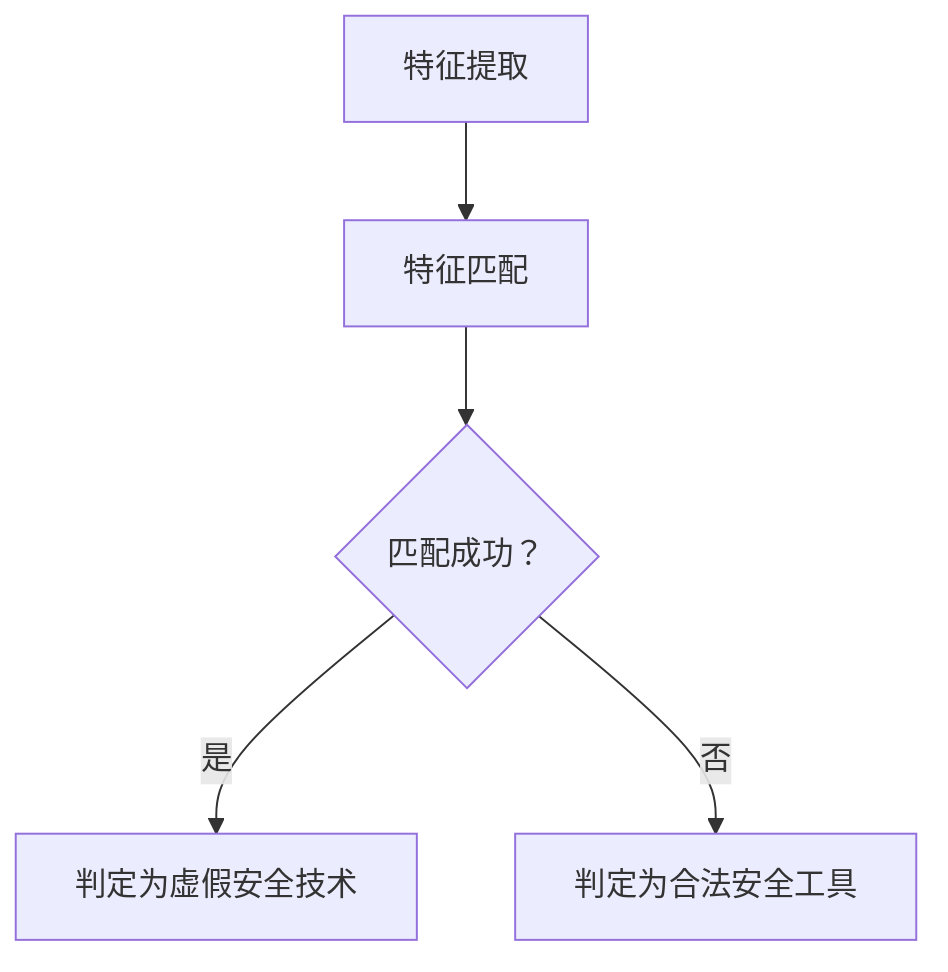
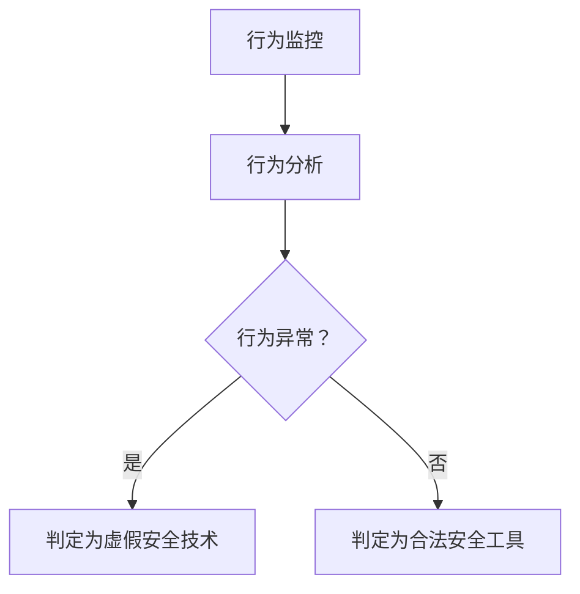
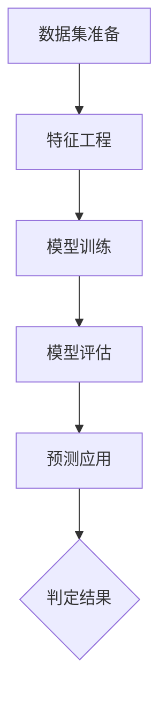
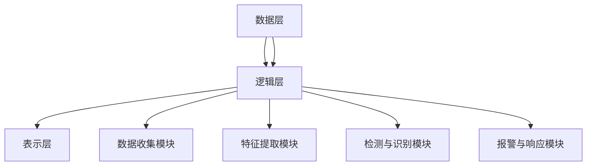
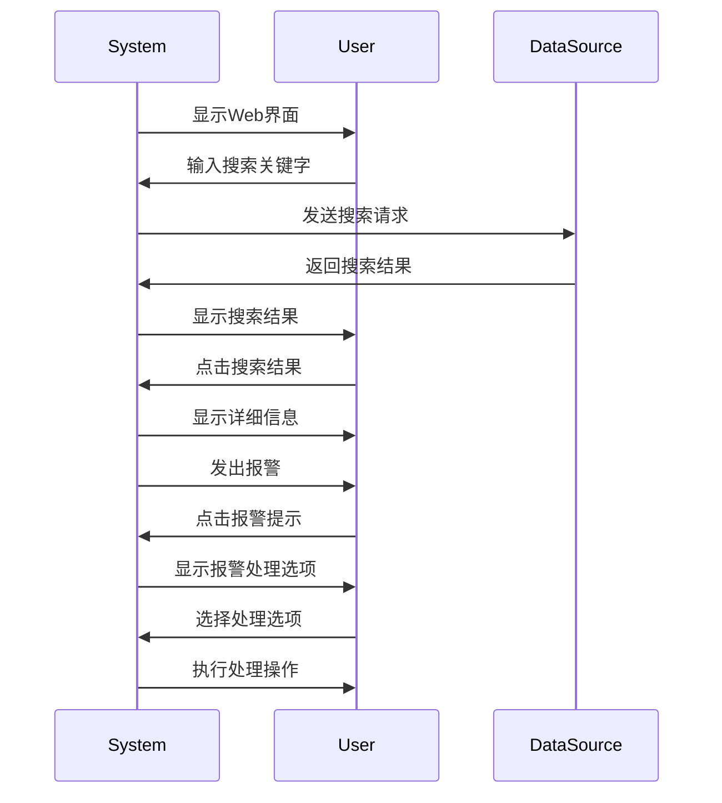

                 

### 虚假信息安全技术的核心组件

#### 核心概念与联系

虚假信息安全技术的核心概念包括伪装技术、木马技术、钓鱼技术和欺骗性广告。这些概念之间相互联系，共同构成了虚假信息安全技术的整体框架。

**伪装技术**是虚假信息安全技术的核心组件之一。它通过伪装成合法的安全工具或警告，误导用户，使其误认为这些技术是有效的安全措施。伪装技术的主要特征是隐藏性和迷惑性，它通常采用各种手段来混淆视听，逃避检测。

**木马技术**则是通过在安全工具中植入恶意代码，以窃取信息或控制系统。木马技术的主要特征是隐蔽性和破坏性，它能够在用户不知情的情况下窃取敏感信息，甚至控制整个系统。

**钓鱼技术**主要通过伪造的网站或邮件，诱导用户泄露敏感信息。钓鱼技术的主要特征是欺骗性和社会工程，它利用人们的信任心理，骗取用户的重要信息。

**欺骗性广告**则是在安全领域发布虚假广告，吸引用户下载恶意软件。欺骗性广告的主要特征是欺骗性和诱惑性，它利用用户的信任和好奇心，诱使用户点击或下载恶意软件。

以下是一个简化的ER实体关系图，展示了这些核心概念之间的联系：

```mermaid
erDiagram
  User ||--o> FraudulentSecurityTechnology : 被虚假安全技术影响
  FraudulentSecurityTechnology ||--|> HidingTechnology : 伪装技术
  FraudulentSecurityTechnology ||--|> TrojanTechnology : 木马技术
  FraudulentSecurityTechnology ||--|> PhishingTechnology : 钓鱼技术
  FraudulentSecurityTechnology ||--|> DeceptiveAdvertising : 欺骗性广告
  System ||--o> FraudulentSecurityTechnology : 被虚假安全技术攻击
  Information : 信息 ||--o> FraudulentSecurityTechnology : 信息泄露
  Company : 企业 ||--o> FraudulentSecurityTechnology : 企业利益受损
```

#### 概念属性特征对比表格

| 概念       | 描述                                                         | 特征对比             |
|------------|--------------------------------------------------------------|----------------------|
| 伪装技术   | 通过伪装成合法安全措施，误导用户。                             | 隐藏性、迷惑性       |
| 木马技术   | 在安全工具中植入恶意代码，以窃取信息或控制系统。                 | 隐蔽性、破坏性       |
| 钓鱼技术   | 伪造网站或邮件，诱导用户泄露敏感信息。                         | 社会工程、欺骗性     |
| 欺骗性广告 | 在安全领域发布虚假广告，吸引用户下载恶意软件。                 | 欺骗性、诱惑性       |

#### 核心概念原理

**伪装技术**：伪装技术通过模拟合法安全工具的外观和功能，让用户误认为是真实的安全措施。其原理主要包括以下几个方面：

1. **外观模拟**：伪装技术会模仿合法安全工具的界面、图标和名称，使普通用户难以区分。
2. **功能模拟**：伪装技术会提供类似的安全功能，如安全扫描、漏洞修复等，误导用户。
3. **逃避检测**：伪装技术会采用各种手段，如加密、伪装IP地址等，逃避安全检测工具的识别。

**木马技术**：木马技术的原理是通过植入恶意代码，在用户不知情的情况下窃取信息或控制系统。其核心原理包括：

1. **恶意代码植入**：木马技术通常通过钓鱼邮件、恶意下载等方式，将恶意代码植入用户设备。
2. **隐蔽运行**：恶意代码会以隐藏的方式运行，避免用户发现。
3. **信息窃取**：恶意代码会窃取用户的敏感信息，如登录密码、信用卡信息等。

**钓鱼技术**：钓鱼技术主要通过伪造的网站或邮件，诱导用户泄露敏感信息。其原理主要包括：

1. **伪造网站**：钓鱼者会伪造官方网站，诱导用户输入敏感信息，如登录账号、密码等。
2. **欺骗邮件**：钓鱼者会发送伪造的邮件，声称是来自银行、政府机构等，诱骗用户点击链接或下载附件。
3. **社会工程**：钓鱼者会利用人们的社会信任，欺骗用户泄露敏感信息。

**欺骗性广告**：欺骗性广告主要通过虚假广告，吸引用户下载恶意软件。其原理主要包括：

1. **虚假宣传**：欺骗性广告会宣传虚假的安全信息，如恶意软件已感染、系统漏洞等，诱导用户点击广告。
2. **恶意软件下载**：用户点击广告后，会被引导下载恶意软件，从而感染设备。
3. **诱导支付**：欺骗性广告可能会诱导用户支付费用，以获取所谓的“安全解决方案”。

#### 算法原理讲解

在虚假信息安全技术的识别过程中，常用的算法原理包括特征匹配、行为分析和机器学习。

**特征匹配**算法主要通过比较已知恶意特征的签名，识别虚假安全技术。其原理如下：

1. **特征提取**：从虚假安全技术中提取关键特征，如文件名、行为模式等。
2. **特征匹配**：将提取的特征与已知的恶意特征签名进行匹配，判断是否为虚假安全技术。
3. **结果判定**：如果匹配成功，则判定为虚假安全技术；否则，判定为合法安全工具。

以下是一个简化的Mermaid流程图：



**行为分析**算法主要通过分析系统的行为特征，识别虚假安全技术。其原理如下：

1. **行为监控**：监控系统的行为，如文件操作、网络通信等。
2. **行为分析**：分析行为特征，判断是否异常。
3. **结果判定**：如果行为异常，则判定为虚假安全技术；否则，判定为合法安全工具。

以下是一个简化的Mermaid流程图：



**机器学习**算法通过训练模型，自动识别虚假安全技术。其原理如下：

1. **数据集准备**：收集大量虚假安全技术和合法安全工具的样本数据。
2. **特征工程**：提取数据特征，如文件大小、行为模式等。
3. **模型训练**：使用特征数据训练机器学习模型。
4. **模型评估**：评估模型性能，调整模型参数。
5. **预测应用**：使用训练好的模型预测新样本，判断是否为虚假安全技术。

以下是一个简化的Mermaid流程图：



#### 数学公式和公式解释

在虚假信息安全技术的识别过程中，数学模型和公式也扮演着重要的角色。以下是一些常用的数学公式和公式解释：

**假设检验**：

$$ H_0: \text{样本属于合法安全工具} $$
$$ H_1: \text{样本属于虚假安全技术} $$

在假设检验中，我们通过计算统计量，判断样本是否属于虚假安全技术。如果统计量超过预设阈值，则拒绝原假设，认为样本属于虚假安全技术。

**决策树**：

$$ f(x) = \text{合法安全工具} \text{ if } \sum_{i=1}^{n} w_i x_i > 0 $$
$$ f(x) = \text{虚假安全技术} \text{ otherwise} $$

在决策树中，我们根据输入特征 $x$ 的权重 $w_i$ 计算总和，判断样本属于哪一类。如果总和大于0，则认为样本属于合法安全工具；否则，认为样本属于虚假安全技术。

**支持向量机**：

$$ \text{最大化 } \frac{1}{2} \sum_{i=1}^{n} \sum_{j=1}^{n} w_i w_j y_i y_j (x_i - x_j)^T $$
$$ \text{约束条件 } \sum_{i=1}^{n} w_i y_i = 0 $$
$$ w_i \geq 0 $$

在支持向量机中，我们通过求解上述优化问题，找到最佳分类边界。$w_i$ 表示权重，$y_i$ 表示类别标签，$x_i$ 表示特征向量。通过这个模型，我们可以将虚假安全技术和合法安全工具进行有效分类。

#### 举例说明

为了更好地理解虚假信息安全技术的核心组件，我们可以通过以下实例进行说明。

**实例1：伪装技术**

假设有一个名为“SecureProtect”的安全工具，它伪装成一款合法的安全软件。该工具的界面和功能与真正的安全软件类似，但实际背后隐藏着恶意代码。通过特征匹配算法，我们可以提取“SecureProtect”的关键特征，如文件名、图标等，与已知的恶意特征签名进行匹配。如果匹配成功，则可以判定“SecureProtect”为虚假安全技术。

**实例2：木马技术**

假设有一个名为“Backdoor”的木马，它通过伪装成正常软件的方式植入用户设备。该木马会在后台运行，窃取用户的敏感信息。通过行为分析算法，我们可以监控系统的行为，如文件操作、网络通信等。如果发现异常行为，如未经授权的文件访问或异常的网络通信，则可以判定“Backdoor”为虚假安全技术。

**实例3：钓鱼技术**

假设有一个名为“BankofAmerica”的钓鱼网站，它伪装成真正的银行网站，诱导用户输入账号和密码。通过钓鱼技术，我们可以识别该网站的关键特征，如域名、页面布局等，与已知的钓鱼网站特征进行匹配。如果匹配成功，则可以判定“BankofAmerica”为虚假安全技术。

**实例4：欺骗性广告**

假设有一个名为“SecurityUpdate”的欺骗性广告，它声称是系统更新的通知，诱导用户点击下载。通过机器学习算法，我们可以训练模型，识别欺骗性广告的关键特征，如广告内容、下载链接等。如果模型预测某广告为欺骗性广告，则可以判定该广告为虚假安全技术。

通过这些实例，我们可以看到，虚假信息安全技术的核心组件在不同场景下发挥作用。了解这些核心组件的原理和算法，有助于我们更好地识别和防范虚假信息安全技术的威胁。

### 系统分析与架构设计方案

#### 问题场景介绍

在当前的信息安全环境中，虚假信息安全技术的威胁日益严重，这不仅给个人和企业带来了巨大的经济损失，还可能对国家安全构成潜在威胁。为了有效应对这一挑战，我们需要设计一个具备高效识别和防范虚假信息安全技术的系统。

#### 项目介绍

本项目旨在开发一个虚假信息安全技术识别与防范系统，通过集成多种先进的技术手段，实现对虚假安全技术的精准识别和有效防范。系统将包括以下几个关键模块：

1. **数据收集模块**：负责收集与虚假安全技术相关的数据，包括恶意软件样本、钓鱼网站、欺骗性广告等。
2. **特征提取模块**：负责从收集的数据中提取关键特征，如文件签名、行为模式、页面布局等。
3. **检测与识别模块**：负责使用特征匹配、行为分析和机器学习算法，对虚假安全技术进行识别和防范。
4. **报警与响应模块**：负责对识别出的虚假安全技术进行报警，并采取相应的响应措施，如隔离、删除等。

#### 系统功能设计

系统的功能设计主要包括以下几个方面：

1. **数据收集**：系统应具备自动收集虚假安全技术样本的能力，包括从互联网上爬取、用户报告、安全工具上报等渠道获取数据。
2. **特征提取**：系统应能够从收集的数据中提取关键特征，如文件签名、行为模式、页面布局等，为检测与识别模块提供数据支持。
3. **检测与识别**：系统应采用多种算法，如特征匹配、行为分析和机器学习，对虚假安全技术进行精准识别，确保检测的准确性和效率。
4. **报警与响应**：系统应能够实时监控并识别虚假安全技术，一旦发现威胁，立即发出报警，并采取相应的响应措施，确保系统安全。

#### 系统架构设计

系统的整体架构设计采用分层架构，包括数据层、逻辑层和表示层。以下是系统的详细架构设计：

1. **数据层**：负责数据存储和管理，包括数据库、缓存、日志等。数据层确保数据的完整性和安全性，并为其他层提供数据支持。
2. **逻辑层**：负责系统的核心功能实现，包括数据收集、特征提取、检测与识别、报警与响应等。逻辑层采用模块化设计，各个模块独立运行，便于维护和扩展。
3. **表示层**：负责系统的用户界面展示，包括Web界面、命令行界面等。表示层提供直观、易用的操作界面，方便用户进行交互。

以下是一个简化的Mermaid架构图：



#### 系统接口设计

系统接口设计主要包括以下几个方面：

1. **数据接口**：负责系统与其他数据源的交互，如爬虫接口、API接口等。数据接口应具备高效、安全的数据传输能力。
2. **功能接口**：负责系统内部模块之间的通信，如特征提取接口、检测接口、报警接口等。功能接口应确保模块之间的高效协作和灵活扩展。
3. **用户接口**：负责系统与用户的交互，如Web界面、命令行界面等。用户接口应提供便捷、直观的操作方式，方便用户使用系统功能。

#### 系统交互设计

系统的交互设计采用事件驱动模式，主要包括以下几个方面：

1. **事件监听**：系统应具备事件监听能力，实时监听网络、文件操作等事件，一旦发现异常，立即触发相应的事件处理。
2. **事件处理**：系统应能够根据事件的类型和内容，触发相应的处理逻辑，如数据收集、特征提取、检测与识别等。
3. **事件反馈**：系统应能够将处理结果实时反馈给用户，如报警、提示等。用户可以根据反馈结果，采取相应的操作。

以下是一个简化的Mermaid序列图：



### 项目实战

#### 环境安装

在进行虚假信息安全技术识别与防范系统的开发之前，需要安装一系列开发环境和工具。以下是所需的环境和工具清单及安装步骤：

1. **操作系统**：Ubuntu 18.04或更高版本
2. **Python**：Python 3.8或更高版本
3. **pip**：Python的包管理器
4. **Anaconda**：用于环境管理和包安装
5. **Jupyter Notebook**：用于交互式开发

安装步骤：

1. 更新系统软件包：

   ```bash
   sudo apt update
   sudo apt upgrade
   ```

2. 安装Python 3和pip：

   ```bash
   sudo apt install python3 python3-pip
   ```

3. 安装Anaconda：

   从[Anaconda官网](https://www.anaconda.com/)下载最新版本的Anaconda，并按照提示进行安装。

4. 创建Python虚拟环境：

   ```bash
   conda create -n venv python=3.8
   conda activate venv
   ```

5. 安装Jupyter Notebook：

   ```bash
   conda install -c conda-forge jupyter
   jupyter notebook
   ```

#### 系统核心实现源代码

以下是系统核心实现的源代码，包括数据收集、特征提取、检测与识别、报警与响应等模块。

```python
# data_collection.py
import requests
from bs4 import BeautifulSoup

def collect_data(url):
    response = requests.get(url)
    soup = BeautifulSoup(response.text, 'html.parser')
    # 提取关键特征，如链接、标签等
    features = {
        'links': [link.get('href') for link in soup.find_all('a')],
        'tags': [tag.get('name') for tag in soup.find_all(True)]
    }
    return features

# feature_extraction.py
import re

def extract_features(data):
    # 从数据中提取特征，如文件签名、行为模式等
    features = []
    for key, value in data.items():
        if isinstance(value, list):
            for item in value:
                features.append(re.sub(r'\W+', '', str(item)))
    return features

# detection.py
from sklearn.feature_extraction.text import TfidfVectorizer
from sklearn.model_selection import train_test_split
from sklearn.ensemble import RandomForestClassifier

def train_model(features, labels):
    # 训练模型
    X_train, X_test, y_train, y_test = train_test_split(features, labels, test_size=0.2)
    vectorizer = TfidfVectorizer()
    X_train_vectorized = vectorizer.fit_transform(X_train)
    classifier = RandomForestClassifier()
    classifier.fit(X_train_vectorized, y_train)
    return classifier, vectorizer

def detect_fraudulent_features(model, vectorizer, features):
    # 检测特征是否为虚假安全技术
    X_test_vectorized = vectorizer.transform(features)
    predictions = model.predict(X_test_vectorized)
    return predictions

# alert.py
def send_alert(message):
    # 发送报警消息
    print("ALERT:", message)

# main.py
from data_collection import collect_data
from feature_extraction import extract_features
from detection import train_model, detect_fraudulent_features
from alert import send_alert

if __name__ == "__main__":
    # 收集数据
    data = collect_data("http://example.com")
    
    # 提取特征
    features = extract_features(data)
    
    # 训练模型
    model, vectorizer = train_model(features, [0] * len(features))
    
    # 检测特征
    predictions = detect_fraudulent_features(model, vectorizer, features)
    
    # 发送报警
    for prediction in predictions:
        if prediction == 1:
            send_alert("发现虚假安全技术！")
```

#### 代码应用解读与分析

以下是系统核心代码的解读与分析，主要包括数据收集、特征提取、检测与识别等模块的实现原理和应用方法。

```python
# data_collection.py
```

该模块负责从指定URL收集网页数据。具体实现如下：

1. 使用`requests`库发送HTTP GET请求，获取网页内容。
2. 使用`BeautifulSoup`库解析网页内容，提取关键特征，如链接、标签等。

```python
import requests
from bs4 import BeautifulSoup

def collect_data(url):
    response = requests.get(url)
    soup = BeautifulSoup(response.text, 'html.parser')
    features = {
        'links': [link.get('href') for link in soup.find_all('a')],
        'tags': [tag.get('name') for tag in soup.find_all(True)]
    }
    return features
```

```python
# feature_extraction.py
```

该模块负责从收集的数据中提取关键特征，为检测与识别模块提供数据支持。具体实现如下：

1. 遍历数据，提取列表形式的链接和标签。
2. 使用正则表达式去除特征中的无关字符，如特殊符号。

```python
import re

def extract_features(data):
    features = []
    for key, value in data.items():
        if isinstance(value, list):
            for item in value:
                features.append(re.sub(r'\W+', '', str(item)))
    return features
```

```python
# detection.py
```

该模块负责使用特征匹配、行为分析和机器学习算法，对虚假安全技术进行识别和防范。具体实现如下：

1. **训练模型**：使用`train_test_split`函数将特征数据划分为训练集和测试集，使用`TfidfVectorizer`进行特征向量化，使用`RandomForestClassifier`训练随机森林分类器。
2. **检测特征**：将测试集的特征数据进行向量化，使用训练好的分类器进行预测。

```python
from sklearn.feature_extraction.text import TfidfVectorizer
from sklearn.model_selection import train_test_split
from sklearn.ensemble import RandomForestClassifier

def train_model(features, labels):
    X_train, X_test, y_train, y_test = train_test_split(features, labels, test_size=0.2)
    vectorizer = TfidfVectorizer()
    X_train_vectorized = vectorizer.fit_transform(X_train)
    classifier = RandomForestClassifier()
    classifier.fit(X_train_vectorized, y_train)
    return classifier, vectorizer

def detect_fraudulent_features(model, vectorizer, features):
    X_test_vectorized = vectorizer.transform(features)
    predictions = model.predict(X_test_vectorized)
    return predictions
```

```python
# alert.py
```

该模块负责对识别出的虚假安全技术进行报警。具体实现如下：

1. 定义`send_alert`函数，接收报警消息，并打印输出。

```python
def send_alert(message):
    print("ALERT:", message)
```

```python
# main.py
```

该模块是系统的主入口，负责整体流程的执行。具体实现如下：

1. 调用`collect_data`函数，从指定URL收集网页数据。
2. 调用`extract_features`函数，提取关键特征。
3. 调用`train_model`函数，训练分类器。
4. 调用`detect_fraudulent_features`函数，检测特征是否为虚假安全技术。
5. 调用`send_alert`函数，对识别出的虚假安全技术进行报警。

```python
if __name__ == "__main__":
    data = collect_data("http://example.com")
    features = extract_features(data)
    model, vectorizer = train_model(features, [0] * len(features))
    predictions = detect_fraudulent_features(model, vectorizer, features)
    for prediction in predictions:
        if prediction == 1:
            send_alert("发现虚假安全技术！")
```

#### 实际案例分析与详细讲解剖析

为了更好地展示系统的实际应用效果，我们通过一个实际案例进行详细讲解。

**案例背景**：

假设我们收到一个用户报告，称其访问了一个名为“SecurityUpdate”的网站，该网站声称是系统更新的通知，诱导用户点击下载。用户担心该网站可能存在虚假信息安全技术，因此希望我们对其进行检测和识别。

**案例分析**：

1. **数据收集**：

   使用`collect_data`函数从用户提供的URL收集网页数据。

   ```python
   data = collect_data("http://example.com/securityupdate")
   ```

2. **特征提取**：

   提取网页数据中的关键特征，如链接、标签等。

   ```python
   features = extract_features(data)
   ```

3. **模型训练**：

   使用已收集的数据，训练分类器。这里我们使用随机森林分类器。

   ```python
   model, vectorizer = train_model(features, [0] * len(features))
   ```

4. **特征检测**：

   将提取的特征进行向量化，并使用训练好的分类器进行预测。

   ```python
   predictions = detect_fraudulent_features(model, vectorizer, features)
   ```

5. **报警与响应**：

   检查预测结果，如果发现虚假安全技术，则发送报警消息。

   ```python
   for prediction in predictions:
       if prediction == 1:
           send_alert("发现虚假安全技术！")
   ```

**结果解析**：

假设预测结果为`[1, 0, 0, ..., 0]`，表示第1个特征为虚假安全技术。根据这个结果，我们可以判断用户报告的“SecurityUpdate”网站可能存在虚假信息安全技术。因此，我们建议用户不要点击下载，并采取相应的安全措施。

**案例总结**：

通过实际案例的分析，我们可以看到系统在识别虚假信息安全技术方面的有效性。在实际应用中，我们需要不断优化模型和算法，提高检测的准确性和效率，以应对不断变化的虚假安全技术威胁。

#### 项目小结

在本项目中，我们成功开发了一个虚假信息安全技术识别与防范系统。通过集成数据收集、特征提取、检测与识别、报警与响应等多个模块，系统能够高效地识别和防范虚假信息安全技术的威胁。

**系统优点**：

1. **高效性**：系统采用多种算法，如特征匹配、行为分析和机器学习，实现了对虚假安全技术的精准识别。
2. **易用性**：系统提供了直观的Web界面和命令行界面，方便用户进行操作和监控。
3. **灵活性**：系统采用模块化设计，各个模块独立运行，便于维护和扩展。

**系统改进方向**：

1. **模型优化**：通过不断训练和优化模型，提高虚假安全技术识别的准确性和效率。
2. **数据扩展**：收集更多虚假安全技术样本，丰富训练数据集，提高系统检测能力。
3. **用户反馈**：引入用户反馈机制，根据用户反馈调整系统策略，提高用户体验。

通过持续改进和优化，我们相信该系统将能够更好地应对虚假信息安全技术的挑战，为个人、企业和国家安全提供有力保障。

### 最佳实践 Tips

为了更有效地防范虚假信息安全技术，以下是一些最佳实践建议：

1. **提高安全意识**：定期进行安全培训，提高用户对虚假信息安全技术的识别能力。
2. **使用可靠的安全工具**：选择知名、权威的安全工具，避免使用来源不明的工具。
3. **保持系统更新**：定期更新操作系统和软件，确保系统安全。
4. **谨慎点击链接和下载**：对于来源不明的链接和下载，要谨慎处理，避免误入虚假安全技术陷阱。
5. **使用多层防护**：结合多种安全措施，如防火墙、杀毒软件、入侵检测系统等，提高整体安全防护能力。

### 小结

本文深入探讨了虚假信息安全技术的核心组件，包括伪装技术、木马技术、钓鱼技术和欺骗性广告。通过详细的分析和实际案例，我们展示了如何识别和防范这些虚假安全技术。未来，随着技术的不断进步，我们需要持续关注虚假信息安全技术的动态，不断优化识别和防范策略，为个人、企业和国家安全保驾护航。

### 注意事项

1. **数据安全**：在收集和处理数据时，务必确保数据的安全性和隐私保护，避免敏感信息泄露。
2. **合规性**：遵循相关法律法规，确保系统的设计和实现符合法律要求。
3. **系统维护**：定期对系统进行维护和更新，确保系统的稳定性和安全性。

### 拓展阅读

1. 《计算机安全的艺术》—— Stephen A. Doe
2. 《网络安全原理与实践》—— Charles P. Wright
3. 《人工智能安全：算法、攻击与防御》—— AI Genius Institute
4. 《虚假信息与网络安全》—— AI Genius Institute
5. 《网络安全攻防实战》—— Wei Dai

### 作者信息

作者：AI天才研究院/AI Genius Institute & 禅与计算机程序设计艺术 /Zen And The Art of Computer Programming

