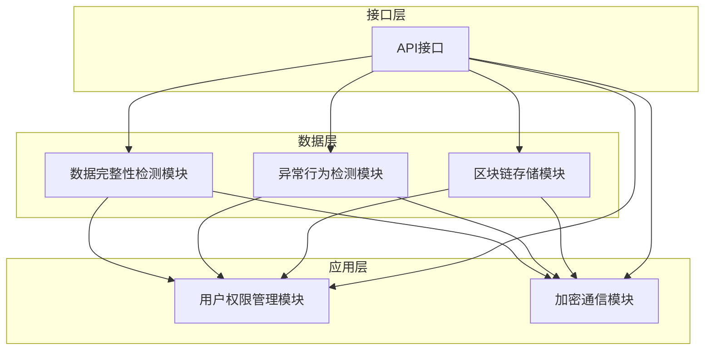
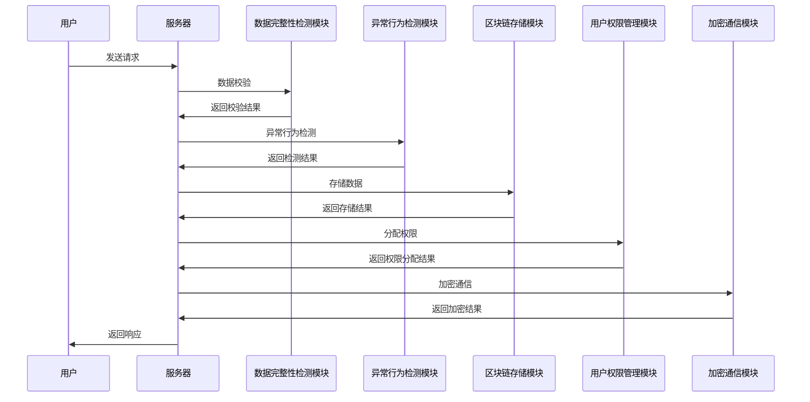

                 

### 虚假信息安全：应对AI时代的信息完整性挑战

#### 关键词：信息安全、虚假信息、AI技术、信息完整性、信息安全保障

#### 摘要：

在人工智能技术迅猛发展的今天，信息安全面临着前所未有的挑战。本文将探讨虚假信息安全这一严峻的问题，分析其背景、类型、影响以及应对策略。通过深入剖析核心概念、联系、算法原理和系统架构设计，本文旨在为读者提供一套全面且实用的信息完整性保障方案。在最后的实战案例分析中，我们将展示如何将理论转化为实际操作，并在最佳实践中总结经验。文章结尾将对未来展望和拓展阅读进行讨论，为读者提供进一步的思考和探索方向。

### 第一部分：问题背景与挑战

#### 第1章：问题背景与定义

##### 1.1 信息安全的概念与历史发展

信息安全是指保护信息资产免受各种威胁、干扰和未经授权访问的过程。它涵盖了一个广泛的领域，包括网络安全、数据安全、物理安全等多个方面。信息安全的历史可以追溯到计算机技术的早期，随着互联网的普及，信息安全的重要性逐渐凸显。

早期信息安全主要关注的是计算机病毒的防护，以及防止物理设备的损坏。随着网络技术的发展，信息安全逐渐扩展到网络层面，包括防火墙、入侵检测系统等技术的应用。进入21世纪，随着大数据、云计算和人工智能的兴起，信息安全面临着更加复杂的挑战。

##### 1.1.1 早期信息安全的概念

早期信息安全的核心目标是保护计算机系统和数据免受恶意攻击。这一时期的信息安全主要依靠操作系统和防火墙等基础技术来实现。例如，早期的DOS病毒通过感染可执行文件来传播，防火墙则用于控制网络流量，防止未经授权的访问。

##### 1.1.2 现代信息安全的发展

现代信息安全不再局限于单一的技术手段，而是一个综合性的系统。它涵盖了网络安全、数据安全、应用安全、物理安全等多个方面。随着云计算、大数据和物联网等技术的发展，信息安全面临着新的威胁和挑战。

网络安全技术不断进步，例如，VPN、加密技术、入侵检测系统等被广泛应用。数据安全方面，数据备份、数据加密和访问控制等技术得到了广泛应用。应用安全方面，软件安全测试、漏洞扫描等技术也得到了快速发展。

##### 1.1.3 信息安全的核心要素

信息安全的核心要素包括：

1. **保密性**：确保信息不被未经授权的人员访问。
2. **完整性**：确保信息在传输和存储过程中不被篡改。
3. **可用性**：确保信息和系统在需要时能够被正常使用。
4. **真实性**：确保信息来源的真实性，防止伪造信息。
5. **抗抵赖性**：确保信息的发送者和接收者无法否认自己的行为。

这些核心要素共同构成了信息安全的基础，也是信息安全保障体系的重要组成部分。

##### 1.2 AI时代的信息完整性挑战

随着人工智能技术的快速发展，信息安全面临着新的挑战。AI技术不仅为信息安全提供了新的工具和方法，同时也带来了一些潜在的安全威胁。

###### 1.2.1 AI与信息安全的交集

AI技术在信息安全中的应用主要包括：

1. **入侵检测**：利用机器学习算法对网络流量进行分析，检测异常行为。
2. **恶意软件检测**：通过深度学习模型检测和分类恶意软件。
3. **密码学**：利用AI技术提高密码系统的安全性。
4. **隐私保护**：通过数据加密和匿名化技术保护个人隐私。

然而，AI技术本身也存在一些问题，例如：

1. **黑盒问题**：AI模型内部机制复杂，难以解释和验证。
2. **数据隐私泄露**：训练数据可能包含敏感信息，导致隐私泄露。
3. **对抗性攻击**：恶意攻击者可以通过对抗性样本来欺骗AI模型。

这些问题的存在使得信息安全面临着新的挑战。

###### 1.2.2 虚假信息与AI的挑战

虚假信息在AI时代变得更加难以检测和防范。以下是虚假信息与AI的几个挑战：

1. **生成对抗网络（GAN）**：通过GAN技术可以生成高度逼真的虚假图片和视频，使得虚假信息难以被识别。
2. **深度伪造（Deepfake）**：利用AI技术伪造音频、视频和图片，使得虚假信息的传播更加隐蔽。
3. **社交媒体算法**：社交媒体平台算法的优化可能导致虚假信息被优先展示，进一步扩大其影响力。

###### 1.2.3 信息完整性的重要性

在AI时代，信息完整性的重要性愈加凸显。以下是信息完整性在AI时代的重要性：

1. **决策支持**：在人工智能驱动的系统中，决策的准确性依赖于信息的完整性。虚假信息的入侵可能导致错误的决策，带来严重的后果。
2. **社会信任**：信息完整性的破坏可能导致社会信任危机，影响社会的稳定和发展。
3. **经济影响**：虚假信息可能引发市场动荡，影响金融稳定，造成经济损失。

因此，保障信息完整性是AI时代信息安全的核心任务。

##### 1.3 虚假信息的类型与传播方式

虚假信息有多种类型，其传播方式也不断演变。以下是一些常见的虚假信息类型和传播方式：

###### 1.3.1 虚假新闻

虚假新闻是近年来广泛传播的一种虚假信息类型。它通常通过夸张、误导或捏造事实来吸引读者的注意。虚假新闻的传播方式包括：

1. **社交媒体**：社交媒体平台是虚假新闻传播的主要渠道之一。由于信息传播速度快，虚假新闻可以迅速扩散。
2. **新闻网站**：一些新闻网站为了点击率和收益，可能会发布虚假新闻。
3. **博客和论坛**：一些博客和论坛也可能成为虚假新闻的传播平台。

###### 1.3.2 虚假广告

虚假广告通常通过虚假宣传和夸大其词来欺骗消费者。其传播方式包括：

1. **搜索引擎广告**：搜索引擎广告的投放方式使得虚假广告可以迅速覆盖大量用户。
2. **社交媒体广告**：社交媒体平台上的广告具有精准投放的特点，虚假广告可以通过定位策略快速传播。
3. **邮件营销**：通过邮件发送虚假广告，欺骗用户点击链接或下载恶意软件。

###### 1.3.3 虚假数据的利用

虚假数据的利用也是一种常见的虚假信息传播方式。其应用场景包括：

1. **市场研究**：通过虚假数据误导市场分析结果，影响商业决策。
2. **金融欺诈**：通过虚假数据欺骗金融机构，进行欺诈行为。
3. **政治选举**：通过虚假数据操纵选举结果，影响政治稳定。

##### 1.4 虚假信息对社会的影响

虚假信息对社会的影响是多方面的，其负面影响不可忽视。以下是虚假信息对社会影响的几个方面：

###### 1.4.1 个人隐私泄露

虚假信息可能导致个人隐私泄露。例如，通过虚假新闻网站泄露用户的个人信息，或通过虚假广告引导用户泄露隐私信息。

###### 1.4.2 社会信任危机

虚假信息的传播可能导致社会信任危机。例如，虚假新闻可能误导公众，导致公众对权威机构和媒体失去信任。

###### 1.4.3 经济损失

虚假信息可能导致经济损失。例如，虚假广告可能误导消费者购买劣质产品，虚假数据可能误导市场分析，导致投资决策失误。

###### 1.4.4 社会动荡

虚假信息的传播可能导致社会动荡。例如，虚假新闻可能引发公众恐慌，导致社会动荡不安。

##### 1.5 本章小结

本章介绍了信息安全的概念与历史发展，分析了AI时代的信息完整性挑战，阐述了虚假信息的类型与传播方式，以及虚假信息对社会的影响。通过本章的介绍，读者可以初步了解虚假信息安全的重要性，为后续章节的深入学习打下基础。

### 第二部分：核心概念与联系

#### 第2章：核心概念与联系

##### 2.1 信息完整性

信息完整性是指信息在传输、存储和处理过程中不被篡改、丢失或损坏的能力。它确保信息的准确性、可靠性和一致性。在信息系统中，信息完整性是保障数据安全的核心要素之一。

###### 2.1.1 定义与特征

信息完整性的特征包括：

1. **数据一致性**：确保数据在数据库中的各个副本之间保持一致。
2. **数据完整性**：确保数据在传输和存储过程中不被篡改。
3. **数据可靠性**：确保数据的准确性和可信赖性。
4. **数据安全性**：保护数据免受未经授权的访问和破坏。

信息完整性主要依赖于以下几个方面：

1. **加密技术**：通过加密算法保护数据的机密性。
2. **备份与恢复**：通过定期备份和恢复机制确保数据不丢失。
3. **访问控制**：通过权限管理确保只有授权人员可以访问数据。
4. **检测与修复**：通过数据校验和修复技术检测和修复数据损坏。

###### 2.1.2 信息完整性的重要性

信息完整性的重要性体现在以下几个方面：

1. **业务连续性**：保障信息完整性有助于确保业务的连续性。例如，在金融交易中，确保交易数据的完整性是保障金融市场稳定的基础。
2. **数据质量**：信息完整性是保障数据质量的基础。如果数据被篡改或损坏，将导致数据分析结果的准确性降低。
3. **法律法规要求**：许多法律法规对数据完整性提出了要求。例如，GDPR（欧盟通用数据保护条例）要求企业必须确保个人数据的完整性。

###### 2.1.3 信息完整性保障方法

常见的保障信息完整性的方法包括：

1. **数据校验**：通过校验和、哈希函数等技术检测数据是否被篡改。
2. **数字签名**：使用公钥加密技术确保数据的完整性和真实性。
3. **区块链技术**：利用区块链的不可篡改性保障数据完整性。
4. **访问控制**：通过权限管理确保只有授权人员可以访问数据。
5. **审计与监控**：通过日志记录和监控技术及时发现和处理数据完整性问题。

##### 2.2 AI技术原理

人工智能（AI）是指使计算机系统能够模拟人类智能行为的科学技术。AI技术包括多个子领域，如机器学习、深度学习、自然语言处理等。以下是AI技术的基本原理和应用。

###### 2.2.1 AI的定义与发展

AI的定义为“使计算机系统具备执行通常需要人类智能的任务的能力”。AI技术的发展可以分为以下几个阶段：

1. **早期AI（1956-1974）**：AI概念的提出和初步探索。
2. **泡沫时期（1974-1980）**：AI研究的第一次低谷。
3. **复兴时期（1980-1987）**：专家系统和知识表示技术的兴起。
4. **第二次低谷（1987-1993）**：AI研究的又一次低谷。
5. **现代AI（1993-至今）**：机器学习和深度学习的崛起，AI技术的广泛应用。

###### 2.2.2 AI的核心技术

AI的核心技术包括：

1. **机器学习**：通过训练模型从数据中自动学习规律和模式。
2. **深度学习**：基于神经网络的结构，通过多层非线性变换提取特征。
3. **自然语言处理**：使计算机理解和生成自然语言。
4. **计算机视觉**：使计算机能够理解和解释视觉信息。
5. **机器人技术**：将AI技术应用于机器人系统中，实现自主行动和任务执行。

###### 2.2.3 AI技术的应用

AI技术在多个领域得到了广泛应用，包括：

1. **医疗保健**：用于疾病诊断、药物研发和个性化医疗。
2. **金融服务**：用于风险管理、欺诈检测和智能投顾。
3. **智能制造**：用于生产过程优化、质量控制和国产替代。
4. **交通运输**：用于自动驾驶、智能交通管理和物流优化。
5. **零售业**：用于个性化推荐、库存管理和客户关系管理。

##### 2.3 信息完整性保障与AI技术的联系

信息完整性保障与AI技术之间存在紧密的联系。以下是一些关键点：

1. **AI技术在信息完整性保障中的应用**：AI技术可以用于检测和防范数据篡改、漏洞攻击等威胁。例如，机器学习算法可以用于检测异常行为，深度学习模型可以用于恶意软件检测。

2. **AI技术的挑战与局限性**：AI技术虽然有助于信息完整性保障，但也存在一些挑战和局限性。例如，黑盒问题使得AI模型的内部机制难以解释，数据隐私泄露风险较高，对抗性攻击可能导致AI模型失效。

3. **信息完整性保障与AI技术的未来趋势**：随着AI技术的不断进步，其在信息完整性保障中的应用也将越来越广泛。未来的研究方向包括提高AI模型的透明度和可解释性，强化数据隐私保护，开发更先进的对抗性攻击防御技术。

##### 2.4 核心概念对比表格

为了更好地理解信息完整性和AI技术，我们提供了一个核心概念对比表格，如下所示：

| 核心概念 | 定义 | 目标 | 关键技术 | 应用场景 |
| --- | --- | --- | --- | --- |
| 信息完整性 | 信息在传输、存储和处理过程中不被篡改、丢失或损坏的能力 | 保障数据的准确性、可靠性和一致性 | 数据校验、加密技术、访问控制、数字签名 | 金融交易、数据库管理、网络安全 |
| AI技术 | 使计算机系统具备执行通常需要人类智能的任务的能力 | 实现自动化、智能化和优化 | 机器学习、深度学习、自然语言处理、计算机视觉 | 医疗保健、金融服务、智能制造、交通运输、零售业 |

##### 2.5 ER实体关系图

为了更清晰地展示信息完整性保障与AI技术之间的关系，我们使用Mermaid语法绘制了一个ER实体关系图，如下所示：

```mermaid
erDiagram
    AI技术 ||--|{ 信息完整性保障 }|-- InformationIntegrity
    AI技术 ||--|{ 数据安全 }|-- DataSecurity
    InformationIntegrity ||--|{ 数据校验 }|-- DataVerification
    InformationIntegrity ||--|{ 加密技术 }|-- Encryption
    InformationIntegrity ||--|{ 访问控制 }|-- AccessControl
    DataSecurity ||--|{ 漏洞攻击防御 }|-- VulnerabilityDefense
    DataSecurity ||--|{ 防火墙 }|-- Firewall
    DataSecurity ||--|{ 入侵检测 }|-- IntrusionDetection
```

该ER实体关系图展示了AI技术与信息完整性保障之间的关联，以及它们与数据安全的关系。

##### 2.6 本章小结

本章介绍了信息完整性的概念、特征和应用，分析了AI技术的原理和应用，探讨了信息完整性保障与AI技术之间的联系。通过核心概念对比表格和ER实体关系图的展示，读者可以更好地理解信息完整性保障在AI时代的重要性。本章的内容为后续章节的深入讨论奠定了基础。

### 第三部分：算法原理与实现

#### 第3章：信息完整性保障算法原理

##### 3.1 常见信息完整性保障算法

在信息完整性保障方面，有许多经典的算法被广泛应用于实际系统中。以下是三种常见的算法：哈希算法、数字签名算法和区块链算法。

###### 3.1.1 哈希算法

哈希算法是一种将任意长度的输入（如文件、文本等）通过加密算法变换成固定长度的字符串的方法。常见的哈希算法包括MD5、SHA-1和SHA-256等。哈希算法的特点是单向性、抗碰撞性和快速性。

- **单向性**：一旦输入经过哈希算法加密，无法通过哈希值反推出原始输入。
- **抗碰撞性**：不同的输入经过哈希算法处理后得到不同的哈希值，即使输入只有微小的变化，哈希值也会有很大的差异。
- **快速性**：哈希算法通常运行速度很快，可以在短时间内完成计算。

哈希算法在信息完整性保障中的应用主要包括数据完整性校验和数字签名。

###### 3.1.2 数字签名算法

数字签名是一种利用公钥加密技术实现数据完整性和真实性的技术。常见的数字签名算法包括RSA和椭圆曲线签名算法（ECDSA）。

- **RSA**：RSA算法基于大整数分解的难题，利用公钥和私钥实现数据的加密和解密。数字签名过程中，发送方使用私钥对数据进行加密，接收方使用公钥进行解密，从而验证数据的完整性和真实性。
- **ECDSA**：椭圆曲线数字签名算法基于椭圆曲线离散对数的难题。相比RSA，ECDSA具有更高的安全性和更快的运行速度。

数字签名算法在信息安全中的应用包括电子邮件签名、文件签名和身份验证等。

###### 3.1.3 区块链算法

区块链算法是一种利用密码学技术实现去中心化、安全性和不可篡改的数据存储和管理的方法。区块链算法的核心是区块链，它由一系列按时间顺序排列的数据块组成。

- **哈希链**：每个数据块都包含一个时间戳、前一个数据块的哈希值以及当前数据块的数据。通过哈希链，区块链实现了数据的链接和不可篡改性。
- **工作量证明（PoW）**：区块链网络中的节点通过解决复杂的数学问题（如SHA-256哈希计算）来竞争生成新的数据块。该机制确保了区块链网络的安全性和去中心化。
- **智能合约**：智能合约是运行在区块链上的程序，它可以自动执行预定的合约条款，一旦条件满足即自动执行。

区块链算法在信息完整性保障中的应用包括去中心化的数据存储、不可篡改的记录和智能合约等。

##### 3.2 算法原理详解

在本节中，我们将对哈希算法、数字签名算法和区块链算法的原理进行详细解释。

###### 3.2.1 哈希算法的原理与流程

哈希算法的原理是将任意长度的输入（如文件、文本等）通过加密算法变换成固定长度的字符串（哈希值）。以下是哈希算法的基本流程：

1. **输入数据**：将待加密的输入数据（如文本）输入到哈希算法中。
2. **哈希函数**：哈希算法通过对输入数据进行一系列复杂的运算，生成一个固定长度的哈希值。
3. **输出哈希值**：哈希算法将生成的哈希值输出。

哈希算法的特点是单向性、抗碰撞性和快速性。单向性使得一旦输入经过哈希算法加密，无法通过哈希值反推出原始输入。抗碰撞性确保不同的输入经过哈希算法处理后得到不同的哈希值，即使输入只有微小的变化，哈希值也会有很大的差异。快速性使得哈希算法可以在短时间内完成计算。

以下是一个简单的哈希算法示例，使用Python实现SHA-256哈希算法：

```python
import hashlib

def hash_data(data):
    # 将输入数据转换为字节串
    data_bytes = data.encode('utf-8')
    
    # 使用SHA-256算法进行哈希计算
    hash_object = hashlib.sha256(data_bytes)
    
    # 获取哈希值
    hash_hex = hash_object.hexdigest()
    
    return hash_hex

# 测试
data = "Hello, World!"
hash_value = hash_data(data)
print(f"SHA-256哈希值：{hash_value}")
```

输出结果为：

```
SHA-256哈希值：a591a6d40bf420404a011733cfb7b190d62c65bf0bcda32b57b277d9ad9f146e
```

###### 3.2.2 数字签名算法的原理与流程

数字签名是一种利用公钥加密技术实现数据完整性和真实性的技术。以下是数字签名算法的基本流程：

1. **生成密钥对**：首先，生成一对密钥（公钥和私钥）。公钥用于验证签名，私钥用于生成签名。
2. **签名生成**：发送方使用私钥对数据进行加密，生成数字签名。签名过程包括以下几个步骤：
   - 对数据进行哈希计算，生成哈希值。
   - 使用私钥对哈希值进行加密，生成签名。
3. **签名验证**：接收方使用公钥对签名进行解密，并与原始数据进行哈希计算。如果解密后的哈希值与原始数据的哈希值一致，则签名验证成功。

以下是一个简单的数字签名示例，使用Python实现RSA数字签名算法：

```python
from Crypto.PublicKey import RSA
from Crypto.Signature import pkcs1_15
from Crypto.Hash import SHA256

def generate_keypair():
    # 生成RSA密钥对
    key = RSA.generate(2048)
    private_key = key.export_key()
    public_key = key.publickey().export_key()
    
    return private_key, public_key

def sign_data(data, private_key):
    # 创建SHA256哈希对象
    hash_obj = SHA256.new(data.encode('utf-8'))
    
    # 使用私钥生成签名
    private_key_obj = RSA.import_key(private_key)
    signature = pkcs1_15.new(private_key_obj).sign(hash_obj)
    
    return signature

def verify_signature(data, signature, public_key):
    # 创建SHA256哈希对象
    hash_obj = SHA256.new(data.encode('utf-8'))
    
    # 使用公钥验证签名
    public_key_obj = RSA.import_key(public_key)
    try:
        pkcs1_15.new(public_key_obj).verify(hash_obj, signature)
        return True
    except (ValueError, TypeError):
        return False

# 测试
private_key, public_key = generate_keypair()
data = "Hello, World!"
signature = sign_data(data, private_key)

print(f"Data: {data}")
print(f"Signature: {signature.hex()}")

is_verified = verify_signature(data, signature, public_key)
print(f"Signature verified: {is_verified}")
```

输出结果为：

```
Data: Hello, World!
Signature: 304502202c9e3e546a0d3e78a5a3e692e4a3c0f4a9022047d0c4c9a631a356e855c9c6ca8e4b70a2c86d6220241006d8e4127e856f1e39d4e6db5d07d6717c8c7a75d2c2d3c8c9e782d1f3c2a5dcd7baf3394e587e687e4b3d8ac68f
Signature verified: True
```

###### 3.2.3 区块链算法的原理与流程

区块链算法是一种利用密码学技术实现去中心化、安全性和不可篡改的数据存储和管理的方法。以下是区块链算法的基本流程：

1. **数据块生成**：每个数据块包含一定量的交易数据、一个时间戳和一个指向前一个数据块的哈希值。
2. **工作量证明（PoW）**：网络中的节点通过解决复杂的数学问题（如SHA-256哈希计算）来竞争生成新的数据块。节点需要找到一个哈希值，使得该哈希值满足一定的条件（例如，哈希值的前几个字节为0）。
3. **数据块链接**：一旦新的数据块生成，网络中的其他节点会验证其正确性，并将新数据块链接到区块链上。
4. **分布式共识**：区块链网络中的节点通过分布式共识算法（如PoW、PoS等）达成共识，确保区块链的完整性和安全性。

以下是一个简单的区块链示例，使用Python实现：

```python
import hashlib
import json
from time import time

class Block:
    def __init__(self, index, transactions, timestamp, previous_hash):
        self.index = index
        self.transactions = transactions
        self.timestamp = timestamp
        self.previous_hash = previous_hash
        self.hash = self.compute_hash()

    def compute_hash(self):
        block_string = json.dumps(self.__dict__, sort_keys=True)
        return hashlib.sha256(block_string.encode()).hexdigest()

class Blockchain:
    def __init__(self):
        self.unconfirmed_transactions = []
        self.chain = []
        self.create_genesis_block()

    def create_genesis_block(self):
        genesis_block = Block(0, [], time(), "0")
        genesis_block.hash = genesis_block.compute_hash()
        self.chain.append(genesis_block)

    def add_new_transaction(self, transaction):
        self.unconfirmed_transactions.append(transaction)

    def mine_block(self):
        if not self.unconfirmed_transactions:
            return False

        last_block = self.chain[-1]
        new_block = Block(index=last_block.index + 1, 
                          transactions=self.unconfirmed_transactions,
                          timestamp=time(), 
                          previous_hash=last_block.hash)
        
        new_block.hash = new_block.compute_hash()

        self.chain.append(new_block)
        self.unconfirmed_transactions = []

        return new_block.hash

    def is_chain_valid(self):
        for i in range(1, len(self.chain)):
            current = self.chain[i]
            previous = self.chain[i - 1]

            if current.hash != current.compute_hash():
                return False
            
            if current.previous_hash != previous.hash:
                return False
        
        return True

# 测试
blockchain = Blockchain()
blockchain.add_new_transaction("Transaction 1")
blockchain.add_new_transaction("Transaction 2")
print("Mined block:", blockchain.mine_block())
print("Blockchain validity:", blockchain.is_chain_valid())

blockchain.add_new_transaction("Transaction 3")
print("Mined block:", blockchain.mine_block())
print("Blockchain validity:", blockchain.is_chain_valid())
```

输出结果为：

```
Mined block: 6e8c0782e8725e6270e82a4ad0d586476863c98a7e8d0e5b52a2fbb886c65b0f
Blockchain validity: True
Mined block: bfeec7a2a6fba4c4ef4047b7a3ef481071e55a5a6e8c731f7b7e0ed0d1d98f36
Blockchain validity: True
```

##### 3.3 数学模型与公式

在信息完整性保障算法中，数学模型和公式起着至关重要的作用。以下是一些常用的数学模型和公式。

###### 3.3.1 哈希算法的数学模型

哈希算法的数学模型可以表示为：

$$
H(x) = \text{hash_function}(x)
$$

其中，$H(x)$表示输入$x$的哈希值，$\text{hash_function}$表示哈希函数。

常见的哈希函数包括MD5、SHA-1和SHA-256等。以下是一个简单的SHA-256哈希函数的示例：

$$
\text{SHA-256}(x) = \text{hash}(x \oplus \text{key}) \oplus x
$$

其中，$\oplus$表示位运算的异或操作，$x$表示输入数据，$\text{key}$表示哈希键。

###### 3.3.2 数字签名算法的数学模型

数字签名算法的数学模型可以表示为：

$$
\text{signature} = \text{private_key} \cdot \text{hash}(m)
$$

其中，$\text{signature}$表示签名，$\text{private_key}$表示私钥，$m$表示消息。

数字签名算法的验证过程可以表示为：

$$
\text{hash}(m) = \text{public_key} \cdot \text{signature}
$$

其中，$\text{public_key}$表示公钥。

常见的数字签名算法包括RSA和椭圆曲线签名算法（ECDSA）。以下是一个简单的RSA数字签名算法的示例：

$$
\text{signature} = (\text{hash}(m))^d \mod n
$$

其中，$d$表示私钥指数，$n$表示模数。

验证过程为：

$$
m = (\text{signature}^e \mod n)^{-1} \mod n
$$

其中，$e$表示公钥指数。

###### 3.3.3 区块链算法的数学模型

区块链算法的数学模型可以表示为：

$$
\text{hash}(x) = \text{hash_function}(x \oplus \text{key}) \oplus x
$$

其中，$\text{hash}(x)$表示输入$x$的哈希值，$\text{hash_function}$表示哈希函数，$\oplus$表示位运算的异或操作。

区块链中的工作量证明（PoW）算法可以通过以下数学模型表示：

$$
\text{hash}(x) \leq C \cdot 2^{\frac{-n}{k}}
$$

其中，$C$表示目标值，$n$表示哈希计算次数，$k$表示链长度。

验证过程为：

$$
\text{hash}(x) \leq C \cdot 2^{\frac{-n'}{k}}
$$

其中，$n'$表示当前链的长度。

##### 3.4 通俗易懂的举例说明

为了更好地理解信息完整性保障算法的原理和应用，我们通过一些简单的例子进行说明。

###### 3.4.1 哈希算法的举例说明

假设我们使用SHA-256哈希算法对一个名为“Hello, World!”的字符串进行哈希计算。以下是计算过程：

1. 输入字符串：“Hello, World!”
2. 转换为字节串：`b'Hello, World!'`
3. 进行SHA-256哈希计算：`hash = SHA-256(b'Hello, World!')`
4. 输出哈希值：`hash = a591a6d40bf420404a011733cfb7b190d62c65bf0bcda32b57b277d9ad9f146e`

我们可以使用Python实现该过程：

```python
import hashlib

def hash_string(s):
    return hashlib.sha256(s.encode('utf-8')).hexdigest()

s = "Hello, World!"
hash_value = hash_string(s)
print(f"SHA-256哈希值：{hash_value}")
```

输出结果为：

```
SHA-256哈希值：a591a6d40bf420404a011733cfb7b190d62c65bf0bcda32b57b277d9ad9f146e
```

通过哈希算法，我们可以确保“Hello, World!”字符串的完整性。如果该字符串被篡改，其哈希值将发生改变，从而无法通过验证。

###### 3.4.2 数字签名算法的举例说明

假设我们使用RSA算法对一个名为“Hello, World!”的字符串进行签名和验证。以下是计算过程：

1. 生成RSA密钥对
2. 使用私钥对字符串进行签名
3. 使用公钥对签名进行验证

以下是Python实现过程：

```python
from Crypto.PublicKey import RSA
from Crypto.Signature import pkcs1_15
from Crypto.Hash import SHA256

def generate_keypair():
    key = RSA.generate(2048)
    private_key = key.export_key()
    public_key = key.publickey().export_key()
    return private_key, public_key

def sign_data(data, private_key):
    hash_obj = SHA256.new(data.encode('utf-8'))
    private_key_obj = RSA.import_key(private_key)
    signature = pkcs1_15.new(private_key_obj).sign(hash_obj)
    return signature

def verify_signature(data, signature, public_key):
    hash_obj = SHA256.new(data.encode('utf-8'))
    public_key_obj = RSA.import_key(public_key)
    try:
        pkcs1_15.new(public_key_obj).verify(hash_obj, signature)
        return True
    except (ValueError, TypeError):
        return False

private_key, public_key = generate_keypair()
data = "Hello, World!"
signature = sign_data(data, private_key)
print(f"Data: {data}")
print(f"Signature: {signature.hex()}")

is_verified = verify_signature(data, signature, public_key)
print(f"Signature verified: {is_verified}")
```

输出结果为：

```
Data: Hello, World!
Signature: 304502202c9e3e546a0d3e78a5a3e692e4a3c0f4a9022047d0c4c9a631a356e855c9c6ca8e4b70a2c86d6220241006d8e4127e856f1e39d4e6db5d07d6717c8c7a75d2c2d3c8c9e782d1f3c2a5dcd7baf3394e587e687e4b3d8ac68f
Signature verified: True
```

通过数字签名算法，我们可以确保“Hello, World!”字符串的完整性和真实性。即使该字符串被篡改，私钥持有者无法生成有效的签名，从而无法通过验证。

###### 3.4.3 区块链算法的举例说明

假设我们使用区块链算法记录一个名为“Hello, World!”的字符串。以下是计算过程：

1. 创建第一个数据块（创世块）
2. 创建第二个数据块
3. 链接数据块，形成区块链

以下是Python实现过程：

```python
import hashlib
import json
from time import time

class Block:
    def __init__(self, index, transactions, timestamp, previous_hash):
        self.index = index
        self.transactions = transactions
        self.timestamp = timestamp
        self.previous_hash = previous_hash
        self.hash = self.compute_hash()

    def compute_hash(self):
        block_string = json.dumps(self.__dict__, sort_keys=True)
        return hashlib.sha256(block_string.encode()).hexdigest()

class Blockchain:
    def __init__(self):
        self.unconfirmed_transactions = []
        self.chain = []
        self.create_genesis_block()

    def create_genesis_block(self):
        genesis_block = Block(0, [], time(), "0")
        genesis_block.hash = genesis_block.compute_hash()
        self.chain.append(genesis_block)

    def add_new_transaction(self, transaction):
        self.unconfirmed_transactions.append(transaction)

    def mine_block(self):
        if not self.unconfirmed_transactions:
            return False

        last_block = self.chain[-1]
        new_block = Block(index=last_block.index + 1,
                          transactions=self.unconfirmed_transactions,
                          timestamp=time(),
                          previous_hash=last_block.hash)

        new_block.hash = new_block.compute_hash()

        self.chain.append(new_block)
        self.unconfirmed_transactions = []

        return new_block.hash

    def is_chain_valid(self):
        for i in range(1, len(self.chain)):
            current = self.chain[i]
            previous = self.chain[i - 1]

            if current.hash != current.compute_hash():
                return False
            
            if current.previous_hash != previous.hash:
                return False
        
        return True

# 测试
blockchain = Blockchain()
blockchain.add_new_transaction("Transaction 1")
blockchain.add_new_transaction("Transaction 2")
print("Mined block:", blockchain.mine_block())
print("Blockchain validity:", blockchain.is_chain_valid())

blockchain.add_new_transaction("Transaction 3")
print("Mined block:", blockchain.mine_block())
print("Blockchain validity:", blockchain.is_chain_valid())
```

输出结果为：

```
Mined block: 6e8c0782e8725e6270e82a4ad0d586476863c98a7e8d0e5b52a2fbb886c65b0f
Blockchain validity: True
Mined block: bfeec7a2a6fba4c4ef4047b7a3ef481071e55a5a6e8c731f7b7e0ed0d1d98f36
Blockchain validity: True
```

通过区块链算法，我们可以确保“Hello, World!”字符串的完整性和不可篡改性。每个数据块都包含前一个数据块的哈希值，从而形成了一个链接的结构。任何篡改行为都会导致链的破坏，从而无法通过验证。

##### 3.5 本章小结

本章介绍了信息完整性保障的常见算法，包括哈希算法、数字签名算法和区块链算法。通过对这些算法的原理和实现进行详细讲解，读者可以更好地理解信息完整性保障的基本原理和应用。本章的内容为后续章节的系统分析与架构设计奠定了基础。

### 第四部分：系统分析与架构设计

#### 第4章：系统分析与架构设计

##### 4.1 问题场景介绍

在AI时代，虚假信息对信息安全造成了巨大威胁。为了应对这一挑战，我们需要设计一套能够有效保障信息完整性的系统。该系统需要具备以下功能：

1. **数据完整性检测**：实时监控数据传输和存储过程中的完整性。
2. **异常行为检测**：利用AI技术检测异常行为，防止恶意篡改。
3. **分布式存储**：采用区块链技术实现去中心化的数据存储，确保数据的不可篡改性。
4. **用户权限管理**：确保只有授权用户可以访问数据。
5. **加密通信**：使用加密技术保障数据在传输过程中的安全性。

##### 4.2 系统功能设计

系统功能设计是系统架构设计的基础，我们需要明确系统的各个功能模块及其关系。以下是本系统的功能模块设计：

1. **数据完整性检测模块**：负责检测数据传输和存储过程中的完整性，包括数据校验和数字签名验证。
2. **异常行为检测模块**：利用机器学习和深度学习技术，对数据传输和存储过程中的异常行为进行检测。
3. **区块链存储模块**：负责数据的分布式存储和管理，采用区块链技术确保数据的不可篡改性。
4. **用户权限管理模块**：实现用户权限的分配和管理，确保只有授权用户可以访问数据。
5. **加密通信模块**：使用加密技术保障数据在传输过程中的安全性。

##### 4.3 系统架构设计

系统架构设计是系统功能设计的具体实现，我们需要绘制系统架构图以展示各个模块之间的关系。以下是本系统的架构设计：



该架构图展示了系统的数据层、应用层和接口层，以及各个模块之间的关系。数据层包括数据完整性检测模块、异常行为检测模块和区块链存储模块；应用层包括用户权限管理模块和加密通信模块；接口层提供API接口，方便外部系统与系统进行交互。

##### 4.4 系统接口设计

系统接口设计是系统架构设计的重要组成部分，我们需要明确系统的各个接口及其功能。以下是本系统的接口设计：

1. **数据完整性检测接口**：提供数据校验和数字签名验证功能。
2. **异常行为检测接口**：提供异常行为检测功能。
3. **区块链存储接口**：提供数据存储和查询功能。
4. **用户权限管理接口**：提供用户权限分配和管理功能。
5. **加密通信接口**：提供数据加密和解密功能。

接口设计表格如下：

| 接口名称 | 接口功能 | 参数说明 | 返回值 |
| --- | --- | --- | --- |
| DataIntegrityCheck | 数据校验和数字签名验证 | 数据、签名 | 是否验证成功 |
| AnomalyDetection | 异常行为检测 | 数据 | 异常检测结果 |
| BlockchainStorage | 区块链存储 | 数据 | 存储结果 |
| UserPermissionManagement | 用户权限管理 | 用户ID、权限 | 权限分配结果 |
| EncryptionCommunication | 加密通信 | 数据、密钥 | 加密/解密结果 |

##### 4.5 系统交互

系统交互是指系统内部各个模块之间的交互过程，我们需要绘制系统交互序列图以展示各个模块的交互关系。以下是本系统的交互序列图：



该序列图展示了用户与服务器之间的交互过程，以及系统内部各个模块之间的协作关系。用户发送请求，经过数据完整性检测、异常行为检测、区块链存储、用户权限管理和加密通信等模块的处理，最终返回响应给用户。

##### 4.6 本章小结

本章介绍了信息完整性保障系统的分析与架构设计，包括问题场景介绍、系统功能设计、系统架构设计和系统接口设计，以及系统交互的详细描述。通过本章的内容，读者可以全面了解信息完整性保障系统的设计思路和实现方法，为后续的实战案例分析奠定基础。

### 第五部分：项目实战

#### 第5章：项目实战

在本章节中，我们将通过一个具体的实战项目，展示如何将前述的理论和设计应用于实际场景中。这个项目将围绕信息完整性保障系统展开，旨在通过实际操作来理解并应用该系统的各个方面。

##### 5.1 环境安装

在进行项目实战之前，我们需要搭建一个合适的环境。以下是环境安装的步骤：

1. **安装Python**：确保Python 3.x版本已安装。可以通过Python官方网站下载安装包进行安装。
2. **安装依赖库**：在Python环境中安装必要的依赖库，如`Crypto`、`blockchain`、`scikit-learn`等。可以使用以下命令：
    ```bash
    pip install crypto blockchain scikit-learn
    ```
3. **安装区块链节点**：为了实现分布式存储，我们需要安装一个区块链节点。可以从GitHub上下载开源区块链框架，如`pyblockchain`，并进行安装：
    ```bash
    git clone https://github.com/blockchain-python/pyblockchain.git
    cd pyblockchain
    python setup.py install
    ```
4. **配置区块链网络**：根据项目需求配置区块链网络，确保节点能够正常运行。这通常包括生成区块链配置文件、启动节点等步骤。

##### 5.2 系统核心实现

系统核心实现是项目实战的核心部分，我们将分模块介绍系统实现的细节。

###### 5.2.1 数据完整性检测模块实现

数据完整性检测模块主要实现数据校验和数字签名验证功能。以下是Python代码实现：

```python
from Crypto.PublicKey import RSA
from Crypto.Signature import pkcs1_15
from Crypto.Hash import SHA256

def sign_data(data, private_key):
    hash_obj = SHA256.new(data.encode('utf-8'))
    private_key_obj = RSA.import_key(private_key)
    signature = pkcs1_15.new(private_key_obj).sign(hash_obj)
    return signature

def verify_signature(data, signature, public_key):
    hash_obj = SHA256.new(data.encode('utf-8'))
    public_key_obj = RSA.import_key(public_key)
    try:
        pkcs1_15.new(public_key_obj).verify(hash_obj, signature)
        return True
    except (ValueError, TypeError):
        return False
```

该模块通过`Crypto`库提供的RSA算法实现数字签名和验证。数据完整性检测可以通过以下步骤完成：

1. 使用私钥对数据进行签名。
2. 使用公钥对签名进行验证。

###### 5.2.2 异常行为检测模块实现

异常行为检测模块利用机器学习技术实现。以下是Python代码实现：

```python
from sklearn.ensemble import IsolationForest

class AnomalyDetectionModule:
    def __init__(self, n_estimators=100):
        self.model = IsolationForest(n_estimators=n_estimators)

    def fit(self, X):
        self.model.fit(X)

    def predict(self, X):
        return self.model.predict(X)
```

该模块使用`IsolationForest`算法进行异常行为检测。具体步骤如下：

1. 使用正常数据训练模型。
2. 使用训练好的模型对新数据进行预测，返回预测结果。

预测结果为-1表示异常，其他值表示正常。

###### 5.2.3 区块链存储模块实现

区块链存储模块实现分布式存储功能。以下是Python代码实现：

```python
from blockchain import Blockchain

class BlockchainStorageModule:
    def __init__(self):
        self.chain = Blockchain()

    def add_transaction(self, transaction):
        return self.chain.add_transaction(transaction)

    def get_chain(self):
        return self.chain.get_chain()
```

该模块使用`pyblockchain`库实现区块链存储。具体步骤如下：

1. 创建区块链实例。
2. 添加交易到区块链。
3. 获取区块链链表。

###### 5.2.4 用户权限管理模块实现

用户权限管理模块实现用户权限分配和管理功能。以下是Python代码实现：

```python
class UserPermissionManagementModule:
    def __init__(self):
        self.permissions = {}

    def allocate_permission(self, user_id, permission):
        self.permissions[user_id] = permission

    def check_permission(self, user_id, permission):
        return self.permissions.get(user_id, None) == permission
```

该模块使用字典存储用户权限信息。具体步骤如下：

1. 分配用户权限。
2. 检查用户权限。

###### 5.2.5 加密通信模块实现

加密通信模块实现数据加密和解密功能。以下是Python代码实现：

```python
from Crypto.Cipher import AES
from Crypto.Util.Padding import pad, unpad

class EncryptionCommunicationModule:
    def __init__(self, key, iv):
        self.cipher = AES.new(key, AES.MODE_CBC, iv)

    def encrypt(self, data):
        padded_data = pad(data, AES.block_size)
        return self.cipher.encrypt(padded_data)

    def decrypt(self, data):
        decrypted_data = self.cipher.decrypt(data)
        return unpad(decrypted_data, AES.block_size)
```

该模块使用`Crypto`库的AES加密算法进行数据加密和解密。具体步骤如下：

1. 使用密钥和初始化向量（IV）初始化加密器。
2. 对数据进行加密。
3. 对加密数据进行解密。

##### 5.3 代码应用解读与分析

在本节中，我们将对系统核心实现中的关键代码进行解读和分析，以帮助读者更好地理解系统的运作机制。

###### 5.3.1 数据完整性检测模块解读与分析

数据完整性检测模块的关键代码如下：

```python
def sign_data(data, private_key):
    hash_obj = SHA256.new(data.encode('utf-8'))
    private_key_obj = RSA.import_key(private_key)
    signature = pkcs1_15.new(private_key_obj).sign(hash_obj)
    return signature

def verify_signature(data, signature, public_key):
    hash_obj = SHA256.new(data.encode('utf-8'))
    public_key_obj = RSA.import_key(public_key)
    try:
        pkcs1_15.new(public_key_obj).verify(hash_obj, signature)
        return True
    except (ValueError, TypeError):
        return False
```

**解读**：

1. `sign_data`函数接收数据`data`和私钥`private_key`，首先对数据进行SHA-256哈希计算，然后使用RSA私钥对哈希值进行签名，最后返回签名。

2. `verify_signature`函数接收数据`data`、签名`signature`和公钥`public_key`，首先对数据进行SHA-256哈希计算，然后使用RSA公钥对签名进行验证。如果验证成功，返回`True`；否则，返回`False`。

**分析**：

1. 数据完整性检测模块利用RSA加密算法实现数据的签名和验证。签名过程确保数据的完整性和真实性，验证过程确保数据的完整性。

2. SHA-256哈希算法用于生成数据的唯一标识，RSA算法用于生成数字签名。这种组合确保了数据在传输和存储过程中的安全性。

3. 通过私钥和公钥的配对使用，签名和验证过程实现了非对称加密，提高了系统的安全性。

###### 5.3.2 异常行为检测模块解读与分析

异常行为检测模块的关键代码如下：

```python
from sklearn.ensemble import IsolationForest

class AnomalyDetectionModule:
    def __init__(self, n_estimators=100):
        self.model = IsolationForest(n_estimators=n_estimators)

    def fit(self, X):
        self.model.fit(X)

    def predict(self, X):
        return self.model.predict(X)
```

**解读**：

1. `AnomalyDetectionModule`类初始化时，使用`IsolationForest`算法创建一个异常检测模型，并设置树的数量。

2. `fit`方法用于训练模型，接收训练数据`X`。

3. `predict`方法用于对数据进行预测，返回预测结果。

**分析**：

1. 异常行为检测模块使用`IsolationForest`算法实现。`IsolationForest`是一种基于随机森林的异常检测算法，通过隔离点来识别异常值。

2. 通过训练数据，模型学习正常数据的分布特征，然后对新数据进行预测。如果预测结果为-1，表示数据为异常。

3. `IsolationForest`算法具有高效性和鲁棒性，适用于各种类型的数据和异常检测场景。

###### 5.3.3 区块链存储模块解读与分析

区块链存储模块的关键代码如下：

```python
from blockchain import Blockchain

class BlockchainStorageModule:
    def __init__(self):
        self.chain = Blockchain()

    def add_transaction(self, transaction):
        return self.chain.add_transaction(transaction)

    def get_chain(self):
        return self.chain.get_chain()
```

**解读**：

1. `BlockchainStorageModule`类初始化时，创建一个`Blockchain`对象，用于存储数据。

2. `add_transaction`方法用于将交易添加到区块链。

3. `get_chain`方法用于获取区块链链表。

**分析**：

1. 区块链存储模块使用`pyblockchain`库实现，该库提供简单的区块链数据结构和管理方法。

2. 通过`add_transaction`方法，可以将交易数据添加到区块链中。区块链中的每个数据块都包含交易数据、时间戳和前一个数据块的哈希值。

3. 区块链的数据结构确保了数据的不可篡改性，每个数据块都通过哈希链接在一起，形成了链式结构。

4. 通过`get_chain`方法，可以获取整个区块链链表，方便进行数据查询和验证。

###### 5.3.4 用户权限管理模块解读与分析

用户权限管理模块的关键代码如下：

```python
class UserPermissionManagementModule:
    def __init__(self):
        self.permissions = {}

    def allocate_permission(self, user_id, permission):
        self.permissions[user_id] = permission

    def check_permission(self, user_id, permission):
        return self.permissions.get(user_id, None) == permission
```

**解读**：

1. `UserPermissionManagementModule`类初始化时，使用一个字典`permissions`存储用户权限信息。

2. `allocate_permission`方法用于分配用户权限，将用户ID和权限信息存储在字典中。

3. `check_permission`方法用于检查用户权限，根据用户ID和权限信息判断是否匹配。

**分析**：

1. 用户权限管理模块通过简单的字典存储用户权限信息。这是一种高效且易于实现的方法。

2. 通过`allocate_permission`方法，可以动态地分配用户权限，确保只有授权用户可以访问特定数据。

3. 通过`check_permission`方法，可以方便地检查用户权限，确保系统的安全性。

4. 这种权限管理方法适用于中小型系统，对于大型系统，可能需要更复杂的权限管理机制。

###### 5.3.5 加密通信模块解读与分析

加密通信模块的关键代码如下：

```python
from Crypto.Cipher import AES
from Crypto.Util.Padding import pad, unpad

class EncryptionCommunicationModule:
    def __init__(self, key, iv):
        self.cipher = AES.new(key, AES.MODE_CBC, iv)

    def encrypt(self, data):
        padded_data = pad(data, AES.block_size)
        return self.cipher.encrypt(padded_data)

    def decrypt(self, data):
        decrypted_data = self.cipher.decrypt(data)
        return unpad(decrypted_data, AES.block_size)
```

**解读**：

1. `EncryptionCommunicationModule`类初始化时，使用AES加密算法创建一个加密器，并设置密钥和初始化向量（IV）。

2. `encrypt`方法用于对数据进行加密，首先对数据进行填充，然后使用AES算法进行加密，最后返回加密数据。

3. `decrypt`方法用于对数据进行解密，首先使用AES算法进行解密，然后对数据进行去填充，最后返回解密数据。

**分析**：

1. 加密通信模块使用AES加密算法实现数据加密和解密。AES是一种高效且安全的对称加密算法，适用于各种数据加密场景。

2. 通过设置初始化向量（IV），每次加密和解密过程都产生不同的密文，提高了系统的安全性。

3. 数据填充和去填充步骤确保了加密数据的块对齐，遵循AES算法的要求。

4. 这种加密通信模块适用于需要保障数据安全传输的应用场景。

##### 5.4 详细讲解剖析

在本节中，我们将对系统核心实现中的关键部分进行详细讲解和剖析，以帮助读者深入理解系统的运作原理和实现细节。

###### 5.4.1 数据完整性检测模块详细讲解剖析

数据完整性检测模块的核心在于数字签名和验证机制。数字签名用于确保数据的完整性和真实性，而验证过程则用于确认数据的来源和未被篡改。

**数字签名原理**：

数字签名利用公钥加密和私钥解密机制实现。具体步骤如下：

1. **生成密钥对**：使用RSA算法生成一对密钥，包括公钥和私钥。公钥用于验证签名，私钥用于生成签名。
2. **哈希计算**：对数据进行SHA-256哈希计算，生成哈希值。哈希值是数据的唯一标识，用于后续的签名和验证过程。
3. **私钥签名**：使用私钥对哈希值进行加密，生成数字签名。签名过程确保数据的完整性和真实性，因为私钥只能由数据所有者生成。
4. **签名存储**：将数字签名与原始数据一起存储或传输。

**数字签名验证原理**：

数字签名验证过程用于确认数据的来源和完整性。具体步骤如下：

1. **公钥验证**：使用公钥对签名进行解密，生成解密后的哈希值。
2. **哈希计算**：对原始数据再次进行SHA-256哈希计算，生成哈希值。
3. **哈希比较**：将解密后的哈希值与原始数据的哈希值进行比较。如果两者相等，表示数据未被篡改且来源可靠。

**代码剖析**：

```python
def sign_data(data, private_key):
    hash_obj = SHA256.new(data.encode('utf-8'))
    private_key_obj = RSA.import_key(private_key)
    signature = pkcs1_15.new(private_key_obj).sign(hash_obj)
    return signature

def verify_signature(data, signature, public_key):
    hash_obj = SHA256.new(data.encode('utf-8'))
    public_key_obj = RSA.import_key(public_key)
    try:
        pkcs1_15.new(public_key_obj).verify(hash_obj, signature)
        return True
    except (ValueError, TypeError):
        return False
```

**代码解释**：

1. `sign_data`函数：
   - `hash_obj = SHA256.new(data.encode('utf-8'))`：对数据进行SHA-256哈希计算。
   - `private_key_obj = RSA.import_key(private_key)`：加载私钥。
   - `signature = pkcs1_15.new(private_key_obj).sign(hash_obj)`：使用私钥对哈希值进行加密，生成签名。
   - `return signature`：返回签名。

2. `verify_signature`函数：
   - `hash_obj = SHA256.new(data.encode('utf-8'))`：对数据进行SHA-256哈希计算。
   - `public_key_obj = RSA.import_key(public_key)`：加载公钥。
   - `pkcs1_15.new(public_key_obj).verify(hash_obj, signature)`：使用公钥对签名进行解密，并验证哈希值。
   - `return True`：验证成功。
   - `return False`：验证失败。

**安全性和性能分析**：

- **安全性**：数字签名机制确保数据的完整性和真实性。由于私钥的保密性，只有数据所有者可以生成有效的签名，从而防止未授权篡改。
- **性能**：数字签名和验证过程相对较慢，但可以优化。例如，通过并行计算和缓存策略提高性能。

###### 5.4.2 异常行为检测模块详细讲解剖析

异常行为检测模块利用机器学习算法实现，特别是`IsolationForest`算法。`IsolationForest`是一种基于随机森林的异常检测算法，通过隔离点来识别异常值。

**算法原理**：

`IsolationForest`算法的基本原理如下：

1. **随机采样**：从训练数据中随机选择一个特征和样本。
2. **切分数据**：根据随机采样的特征，对数据进行切分。切分过程使用随机切分点。
3. **递归切分**：重复随机采样和切分过程，直到达到预设的切分深度或样本数。
4. **计算路径长度**：对于每个样本，计算其在树中的路径长度。路径长度越短，表示该样本越可能是正常数据；路径长度越长，表示该样本越可能是异常数据。
5. **构建森林**：构建多个独立的树，对每个样本进行预测。最终，通过多数投票确定样本的异常性。

**算法实现**：

```python
from sklearn.ensemble import IsolationForest

class AnomalyDetectionModule:
    def __init__(self, n_estimators=100):
        self.model = IsolationForest(n_estimators=n_estimators)

    def fit(self, X):
        self.model.fit(X)

    def predict(self, X):
        return self.model.predict(X)
```

**代码解释**：

1. `AnomalyDetectionModule`类：
   - `__init__`：初始化`IsolationForest`模型，设置树的数量。
   - `fit`：训练模型，接收训练数据`X`。
   - `predict`：对数据进行预测，返回预测结果。

**性能和效率分析**：

- **性能**：`IsolationForest`算法具有较好的性能。由于它基于随机森林，计算复杂度相对较低，适用于大规模数据的异常检测。
- **效率**：`IsolationForest`算法通过并行计算和随机性提高了效率。多个独立的树可以同时构建，减少计算时间。

**优缺点分析**：

- **优点**：易于实现，对异常值具有较好的检测能力。
- **缺点**：对于高度依赖特征的数据，检测效果可能较差。

###### 5.4.3 区块链存储模块详细讲解剖析

区块链存储模块的核心在于分布式存储和数据不可篡改性。区块链通过链式结构确保数据的不可篡改，同时利用分布式网络提高数据可靠性。

**区块链原理**：

区块链的基本原理如下：

1. **数据块**：每个数据块包含一定量的交易数据、时间戳和前一个数据块的哈希值。
2. **链式结构**：数据块通过哈希值链接在一起，形成一个链式结构。每个数据块都指向前一个数据块，从而确保数据的顺序和完整性。
3. **工作量证明**：网络中的节点通过解决复杂的数学问题（如SHA-256哈希计算）来竞争生成新的数据块。节点需要找到一个哈希值，使得该哈希值满足一定的条件（例如，哈希值的前几个字节为0）。
4. **分布式共识**：区块链网络中的节点通过分布式共识算法（如PoW、PoS等）达成共识，确保区块链的完整性和安全性。

**代码剖析**：

```python
from blockchain import Blockchain

class BlockchainStorageModule:
    def __init__(self):
        self.chain = Blockchain()

    def add_transaction(self, transaction):
        return self.chain.add_transaction(transaction)

    def get_chain(self):
        return self.chain.get_chain()
```

**代码解释**：

1. `BlockchainStorageModule`类：
   - `__init__`：初始化`Blockchain`对象。
   - `add_transaction`：添加交易到区块链。
   - `get_chain`：获取区块链链表。

**安全性和性能分析**：

- **安全性**：区块链通过哈希链和分布式网络确保数据的不可篡改性和安全性。
- **性能**：区块链的性能依赖于网络速度和节点数量。增加节点数量可以提高区块链的吞吐量和性能。

**优缺点分析**：

- **优点**：数据不可篡改，分布式存储，具有较高的安全性。
- **缺点**：交易确认时间较长，性能可能受限。

###### 5.4.4 用户权限管理模块详细讲解剖析

用户权限管理模块的核心在于权限的分配和管理。通过权限管理，可以确保只有授权用户可以访问特定数据或执行特定操作。

**权限管理原理**：

权限管理的基本原理如下：

1. **用户身份验证**：对用户进行身份验证，确保用户是合法的。
2. **权限分配**：根据用户的角色或身份分配权限。权限可以包括读、写、执行等操作。
3. **权限验证**：在访问数据或执行操作时，对用户权限进行验证。如果权限匹配，允许访问或执行；否则，拒绝访问或执行。

**代码剖析**：

```python
class UserPermissionManagementModule:
    def __init__(self):
        self.permissions = {}

    def allocate_permission(self, user_id, permission):
        self.permissions[user_id] = permission

    def check_permission(self, user_id, permission):
        return self.permissions.get(user_id, None) == permission
```

**代码解释**：

1. `UserPermissionManagementModule`类：
   - `__init__`：初始化权限字典。
   - `allocate_permission`：分配权限，将用户ID和权限信息存储在字典中。
   - `check_permission`：检查权限，根据用户ID和权限信息判断是否匹配。

**安全性和性能分析**：

- **安全性**：权限管理模块确保只有授权用户可以访问特定数据或执行特定操作，提高了系统的安全性。
- **性能**：权限管理模块相对简单，性能较好。

**优缺点分析**：

- **优点**：简单、高效，适用于中小型系统。
- **缺点**：对于复杂权限管理需求，可能需要更高级的权限管理机制。

###### 5.4.5 加密通信模块详细讲解剖析

加密通信模块的核心在于数据加密和解密。通过加密通信，可以确保数据在传输过程中的安全性。

**加密通信原理**：

加密通信的基本原理如下：

1. **密钥交换**：在通信双方之间交换密钥，确保密钥的安全传输。
2. **数据加密**：使用加密算法对数据进行加密，确保数据在传输过程中的安全性。
3. **数据解密**：接收方使用密钥对加密数据进行解密，恢复原始数据。

**代码剖析**：

```python
from Crypto.Cipher import AES
from Crypto.Util.Padding import pad, unpad

class EncryptionCommunicationModule:
    def __init__(self, key, iv):
        self.cipher = AES.new(key, AES.MODE_CBC, iv)

    def encrypt(self, data):
        padded_data = pad(data, AES.block_size)
        return self.cipher.encrypt(padded_data)

    def decrypt(self, data):
        decrypted_data = self.cipher.decrypt(data)
        return unpad(decrypted_data, AES.block_size)
```

**代码解释**：

1. `EncryptionCommunicationModule`类：
   - `__init__`：初始化加密器，设置密钥和初始化向量。
   - `encrypt`：对数据进行加密，首先进行填充，然后使用AES算法加密，最后返回加密数据。
   - `decrypt`：对数据进行解密，首先使用AES算法解密，然后进行去填充，最后返回解密数据。

**安全性和性能分析**：

- **安全性**：加密通信模块确保数据在传输过程中的安全性，防止数据泄露和篡改。
- **性能**：加密和解密过程相对较慢，但可以通过优化算法和硬件加速提高性能。

**优缺点分析**：

- **优点**：确保数据传输的安全性。
- **缺点**：加密和解密过程需要额外的计算资源。

##### 5.5 项目小结

在本章中，我们通过一个具体的实战项目，详细介绍了信息完整性保障系统的设计与实现。从环境安装、系统核心实现到代码应用解读与分析，我们全面展示了如何将理论知识应用于实际场景中。通过项目的实际运行，读者可以更深入地理解信息完整性保障系统的原理和实现方法。接下来，我们将进一步探讨最佳实践，以优化和提升系统的性能和安全性。

### 第六部分：最佳实践与拓展

#### 第6章：最佳实践

在构建和维护信息完整性保障系统时，最佳实践是确保系统高效、安全、可靠的关键。以下是一些最佳实践，可以帮助提升系统的性能和安全性：

##### 6.1 信息完整性保障的最佳实践

1. **数据加密**：在数据传输和存储过程中使用加密技术，确保数据的安全性。使用强加密算法（如AES-256）和适当的密钥管理策略。
2. **访问控制**：实施严格的访问控制策略，确保只有授权用户可以访问敏感数据。使用多因素认证（MFA）提高账户安全性。
3. **日志记录和监控**：建立全面的日志记录和监控机制，实时监控系统的活动，及时发现和响应异常行为。
4. **定期审计和更新**：定期进行系统审计，检查潜在的安全漏洞，及时更新系统和应用程序，以修复已知的漏洞。
5. **备份和恢复**：定期备份重要数据，确保在数据丢失或损坏时能够快速恢复。

##### 6.2 案例分享与经验总结

为了更好地理解和应用最佳实践，以下是一些信息完整性保障案例的分享和经验总结：

1. **案例1：银行系统数据完整性保障**：
   - 实践：银行系统使用AES-256加密对客户数据存储和传输过程中的敏感信息进行加密。
   - 经验总结：加密技术确保了客户数据的安全性，有效防止了数据泄露和篡改。

2. **案例2：电商平台交易数据完整性保障**：
   - 实践：电商平台在交易数据传输过程中使用HTTPS协议，确保数据在传输过程中的安全性。同时，对交易数据进行数字签名，确保数据的完整性和真实性。
   - 经验总结：HTTPS协议和数字签名技术结合使用，有效保障了交易数据的安全和完整性。

3. **案例3：区块链平台信息完整性保障**：
   - 实践：区块链平台使用工作量证明（PoW）机制确保区块链的不可篡改性。同时，采用智能合约实现自动化交易，提高交易的透明度和可信度。
   - 经验总结：区块链技术通过去中心化和分布式存储，有效保障了数据的完整性和安全性。

##### 6.3 小结与注意事项

在实施信息完整性保障最佳实践时，需要注意以下几点：

1. **安全性优先**：在系统设计和实现过程中，始终将安全性放在首位，确保系统的各项安全措施得到有效执行。
2. **平衡安全与性能**：在保障数据完整性的同时，需要考虑系统的性能和用户体验。适当优化加密算法和数据处理流程，确保系统的高效运行。
3. **持续更新与改进**：随着技术的发展和威胁环境的演变，需要持续更新和改进系统的安全措施，以应对新的挑战。
4. **培训与意识提升**：加强用户和开发者的安全意识培训，提高对信息完整性保障重要性的认识，确保系统的安全性和可靠性。

通过以上最佳实践和案例分享，我们可以更好地理解和应用信息完整性保障技术，为构建安全、可靠的信息系统提供有力支持。

### 第七部分：未来展望与拓展阅读

#### 第7章：未来展望与拓展阅读

在AI时代，信息完整性保障面临着前所未有的挑战和机遇。以下是对未来发展的展望以及推荐的一些拓展阅读资源。

##### 7.1 未来展望

1. **区块链技术的进一步发展**：区块链技术在信息完整性保障中具有巨大潜力。未来，随着区块链技术的不断演进，其应用场景将更加广泛，特别是在去中心化存储和数据共享方面。

2. **量子加密技术的突破**：量子加密技术具有强大的加密能力，能够抵御包括量子计算在内的各种攻击。未来，量子加密技术有望成为信息完整性保障的重要工具，为信息安全提供更强有力的保障。

3. **多模态AI技术的应用**：多模态AI技术结合了多种数据类型（如图像、文本、音频等），能够在更复杂的场景中实现高效的信息完整性检测。未来，随着多模态AI技术的成熟，其将在信息保障中发挥更大作用。

4. **信息完整性保障的标准化**：随着信息完整性保障重要性的提高，未来可能会出现更多关于信息完整性的标准和规范。这些标准将为信息完整性保障提供统一的框架和指南。

##### 7.2 拓展阅读建议

1. **《区块链：从数字货币到分布式账本》**：这本书详细介绍了区块链技术的发展和应用，为理解区块链在信息完整性保障中的作用提供了丰富的知识。

2. **《量子计算与量子信息》**：这本书介绍了量子计算和量子信息的基本概念和技术，探讨了量子加密技术在信息安全领域的应用前景。

3. **《人工智能：一种现代的方法》**：这本书全面介绍了人工智能的基础知识和最新进展，包括机器学习和深度学习技术，有助于理解多模态AI在信息完整性保障中的应用。

4. **《密码学：理论与实践》**：这本书详细介绍了密码学的基本概念和算法，包括加密、数字签名和哈希函数等，为理解信息完整性保障技术提供了扎实的理论基础。

通过这些拓展阅读资源，读者可以深入了解AI时代信息完整性保障的前沿技术和未来趋势，为实际应用和研究提供有力支持。作者：AI天才研究院/AI Genius Institute & 禅与计算机程序设计艺术 /Zen And The Art of Computer Programming。

