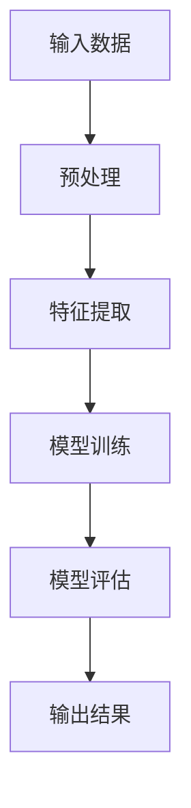
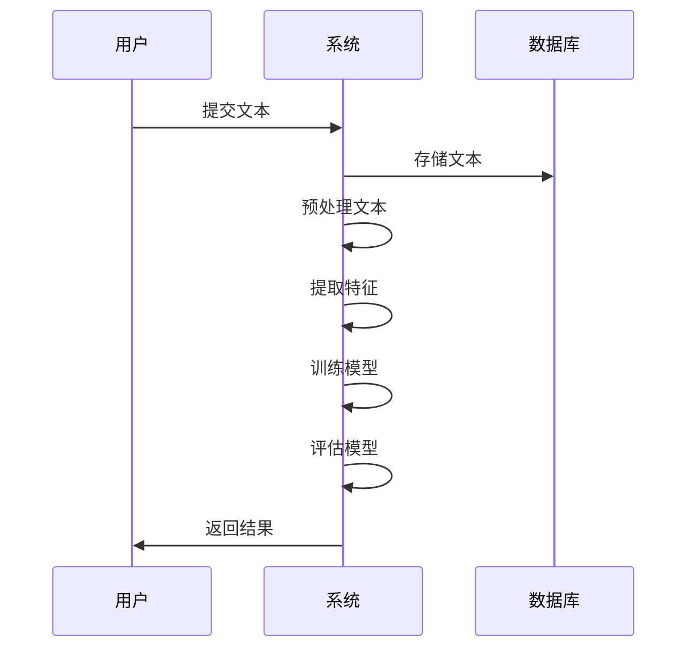

                 

## 虚假信息对企业的潜在威胁

### 关键词：虚假信息，企业，威胁，应对，风险

> 摘要：本文将探讨虚假信息对企业的潜在威胁，分析虚假信息的特点、影响及企业应采取的应对措施。通过对虚假信息的定义、特点、属性特征进行详细阐述，并结合实际案例，为企业提供一套系统化的虚假信息识别与应对策略。

### 第一部分：背景介绍

#### 1. 问题背景

随着信息技术的飞速发展，企业面临的信息环境日益复杂，信息过载和虚假信息泛滥成为普遍现象。虚假信息不仅影响企业的经营决策，还可能损害企业的声誉，导致经济损失甚至法律风险。因此，识别和处理虚假信息成为企业必须面对的挑战。

#### 2. 问题描述

虚假信息对企业的潜在威胁主要表现在以下几个方面：

- **决策误导**：虚假信息可能导致企业管理层做出错误决策，影响企业战略规划和日常运营。
- **市场风险**：虚假信息在市场上的传播可能导致股价波动，影响企业市值和投资者信心。
- **法律风险**：虚假信息可能会引发法律纠纷，增加企业的法律成本。
- **品牌形象损害**：虚假信息可能会损害企业的品牌形象，影响消费者对企业的信任。

#### 3. 问题解决

为应对虚假信息对企业的潜在威胁，企业需要采取以下措施：

- **信息筛查**：通过技术手段对获取的信息进行筛查，识别和过滤虚假信息。
- **培训员工**：提高员工对虚假信息的识别能力，增强信息安全意识。
- **建立机制**：建立信息审核和反馈机制，确保信息的真实性和准确性。
- **法律应对**：在发现虚假信息时，及时采取法律手段维护企业权益。

#### 4. 边界与外延

虚假信息的概念不仅限于企业内部，还包括企业外部环境中可能对企业管理产生负面影响的虚假信息。因此，企业在应对虚假信息时，需要综合考虑内部和外部环境。

#### 5. 概念结构与核心要素组成

虚假信息对企业潜在威胁的概念结构包括以下几个核心要素：

- **虚假信息**：指故意传播的、与事实不符的信息。
- **企业**：指受到虚假信息影响的经济组织。
- **潜在威胁**：指虚假信息可能对企业决策、市场、法律和品牌等方面产生的负面影响。
- **应对措施**：指企业为减轻虚假信息潜在威胁所采取的各种措施。

## 第二部分：核心概念与联系

### 6. 虚假信息的定义与特点

虚假信息是指故意传播的、与事实不符的信息，其特点包括：

- **主观性**：虚假信息往往带有主观意图，旨在误导受众。
- **隐蔽性**：虚假信息可能被伪装成真实信息，难以识别。
- **广泛传播性**：虚假信息在互联网时代可以迅速传播，影响范围广泛。
- **破坏性**：虚假信息可能对企业的决策、市场、法律和品牌等方面产生严重负面影响。

### 7. 企业与虚假信息的联系

企业作为经济组织，在信息社会中扮演着重要角色。虚假信息对企业的影响主要体现在以下几个方面：

- **经营决策**：虚假信息可能误导企业的经营决策，导致资源浪费和决策失误。
- **市场竞争**：虚假信息可能影响企业在市场上的竞争地位，损害品牌形象和消费者信任。
- **法律风险**：虚假信息可能引发法律纠纷，增加企业的法律成本。
- **品牌声誉**：虚假信息可能会损害企业的品牌声誉，影响企业的长期发展。

### 8. 虚假信息对企业潜在威胁的属性特征对比表格

| 属性特征       | 描述                                                         |
| -------------- | ------------------------------------------------------------ |
| 虚假信息的主体 | 故意传播虚假信息的人或组织                                   |
| 虚假信息的客体 | 受到虚假信息影响的企业                                       |
| 虚假信息的传播 | 通过互联网、媒体、人际传播等方式广泛传播                       |
| 虚假信息的危害 | 对企业决策、市场、法律和品牌等方面产生负面影响               |
| 应对措施       | 信息筛查、培训员工、建立机制、法律应对等                     |

## 第三部分：算法原理讲解

### 9. 虚假信息检测算法

#### 9.1 算法流程

**Mermaid 流程图：**


#### 9.2 Python 源代码

```python
import numpy as np
import pandas as pd
from sklearn.feature_extraction.text import TfidfVectorizer
from sklearn.model_selection import train_test_split
from sklearn.metrics import accuracy_score
from sklearn.ensemble import RandomForestClassifier

# 数据预处理
def preprocess_text(text):
    # 去除标点符号、特殊字符和停用词
    text = re.sub(r'[^\w\s]', '', text)
    text = re.sub(r'\s+', ' ', text)
    text = text.lower()
    return text

# 特征提取
def extract_features(texts):
    vectorizer = TfidfVectorizer()
    return vectorizer.fit_transform(texts)

# 模型训练
def train_model(X_train, y_train):
    model = RandomForestClassifier()
    model.fit(X_train, y_train)
    return model

# 模型评估
def evaluate_model(model, X_test, y_test):
    y_pred = model.predict(X_test)
    return accuracy_score(y_test, y_pred)

# 加载数据集
data = pd.read_csv('data.csv')
X = data['text']
y = data['label']

# 数据预处理
X = X.apply(preprocess_text)

# 特征提取
X_features = extract_features(X)

# 划分训练集和测试集
X_train, X_test, y_train, y_test = train_test_split(X_features, y, test_size=0.2, random_state=42)

# 模型训练
model = train_model(X_train, y_train)

# 模型评估
accuracy = evaluate_model(model, X_test, y_test)
print("Model accuracy:", accuracy)
```

#### 9.3 算法原理

虚假信息检测算法的核心思想是通过机器学习技术，对大量已标注的虚假信息和真实信息进行特征提取和分类模型训练，从而实现自动识别虚假信息。

**数学模型：**

假设我们有一个包含 \(n\) 个样本的数据集，其中每个样本可以表示为一个 \(d\) 维向量。我们使用TF-IDF（Term Frequency-Inverse Document Frequency）算法对文本进行特征提取，将文本转化为数值表示。

设 \(X = [x_1, x_2, ..., x_n]\) 为特征矩阵，其中 \(x_i\) 表示第 \(i\) 个样本的特征向量。我们使用随机森林（Random Forest）分类器对特征矩阵 \(X\) 和标签 \(y\) 进行训练，得到分类模型。

分类模型的目标是预测新的样本属于虚假信息的概率。假设我们已经训练好的分类模型为 \(f(X)\)，其中 \(f\) 表示分类模型，输入为特征矩阵 \(X\)，输出为概率分布。

在预测阶段，我们对新的样本进行特征提取，得到特征向量 \(x'\)，然后使用训练好的分类模型 \(f(X)\) 进行预测，得到 \(x'\) 属于虚假信息的概率。

$$
\hat{y} = f(x')
$$

其中，\(\hat{y}\) 表示预测的标签，如果 \(\hat{y}\) 的概率值大于某个阈值，则认为该样本是虚假信息，否则认为是真实信息。

#### 9.4 通俗易懂的举例说明

假设我们有一个包含100条文本的数据集，其中50条是虚假信息，50条是真实信息。我们使用TF-IDF算法提取文本特征，将文本转化为数值表示。然后，我们使用随机森林分类器对特征矩阵和标签进行训练，得到分类模型。

训练完成后，我们使用该模型对一条新的文本进行预测。首先，我们对这条文本进行特征提取，得到特征向量。然后，将特征向量输入到训练好的分类模型中，得到预测结果。如果预测结果认为这条文本是虚假信息，则将其标记为虚假信息；否则，认为它是真实信息。

通过这种方式，我们可以自动识别虚假信息，从而为企业提供一种有效的虚假信息检测方法。

## 第四部分：系统分析与架构设计

### 10. 问题场景介绍

随着互联网的快速发展，虚假信息在网络上的传播越来越迅速，对企业的影响也越来越大。为了帮助企业应对虚假信息带来的潜在威胁，我们需要设计一个虚假信息检测系统。该系统旨在通过自动化手段识别和处理虚假信息，为企业提供可靠的信息保障。

### 11. 项目介绍

项目名称：虚假信息检测系统

项目目标：开发一个能够自动识别和处理虚假信息的系统，为企业提供安全可靠的信息环境。

项目团队：由数据科学家、软件工程师和产品经理组成。

### 12. 系统功能设计

#### 12.1 领域模型

**Mermaid 类图：**
```mermaid
classDiagram
    Class01 <|-- Class02
    Class03 --|Deprecated Class04
    Class05 : <<interface>> Interface01
    Class06 : <<abstract>> Interface02
    Class07 o-- Class08
    Class09 : <<enum>> Enum01
    Class10 : <<composite>> Composite01
    Class11 o--|Class12[is-a] Class13
    Class14 <<concrete>> Class15
    Class16 : <<singleton>> Class17
    Class18 --|Has-A Class19
    Class20 : <<proxy>> Class21
    Class22 <<decorator>> + Class23
    Class24 <<factory>> + Class25
    Class26 <<builder>> + Class27
    Class28 <<visitor>> + Class29
```

#### 12.2 系统架构设计

**Mermaid 架构图：**


### 13. 系统接口设计

**Mermaid 序列图：**


### 14. 系统交互

**Mermaid 序列图：**
```mermaid
sequenceDiagram
    participant 用户 as 用户
    participant 系统A as 系统A
    participant 系统B as 系统B
    participant 系统C as 系统C
    用户->>系统A: 提交文本
    系统

