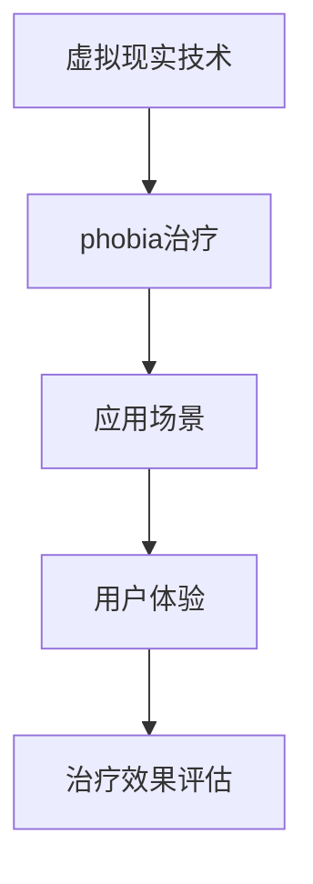
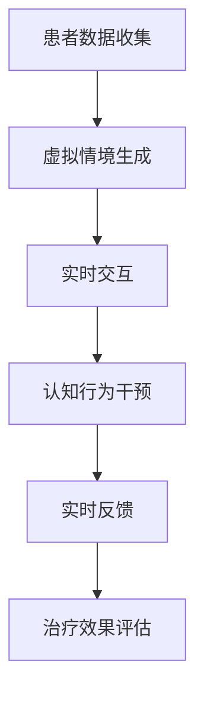
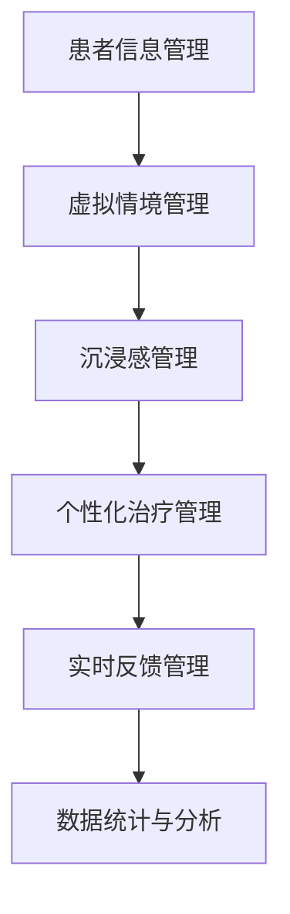
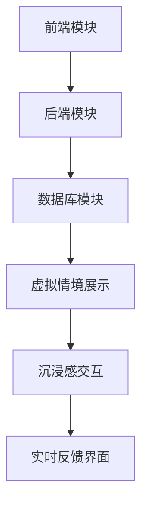
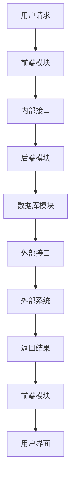

                 

# 虚拟现实在phobia治疗中的应用前景

## 关键词

- 虚拟现实
- phobia治疗
- 算法
- 数学模型
- 应用前景

## 摘要

随着虚拟现实（VR）技术的快速发展，其在医疗领域的应用前景日益广阔，尤其是在phobia（恐惧症）治疗方面。本文旨在探讨虚拟现实技术在phobia治疗中的应用潜力、现有案例、面临的挑战以及未来的发展方向。文章将逐步分析虚拟现实技术的基本原理、phobia治疗的需求与现状，并结合实际案例和数学模型，详细讲解虚拟现实在phobia治疗中的算法原理、系统架构以及项目实战，最后总结文章的主要观点并给出拓展阅读建议。

## 目录大纲

# 虚拟现实在phobia治疗中的应用前景

## 第一部分: 问题背景

### 第1章: 问题背景

## 1.1 背景介绍
### 1.1.1 虚拟现实技术的定义与原理
### 1.1.2 虚拟现实技术在医疗领域的应用
### 1.1.3 phobia治疗的需求与现状

## 1.2 问题解决
### 1.2.1 虚拟现实在phobia治疗中的潜在优势
### 1.2.2 虚拟现实在phobia治疗中的应用案例
### 1.2.3 虚拟现实在phobia治疗中的挑战与解决方案

## 1.3 边界与外延
### 1.3.1 虚拟现实技术的边界
### 1.3.2 phobia治疗的边界
### 1.3.3 虚拟现实在phobia治疗中的应用边界

## 1.4 概念结构与核心要素组成
### 1.4.1 虚拟现实技术核心要素
### 1.4.2 phobia治疗核心要素
### 1.4.3 虚拟现实在phobia治疗中的概念结构图

## 1.5 本章小结

## 第二部分: 核心概念与联系

### 第2章: 核心概念与联系

## 2.1 虚拟现实技术
### 2.1.1 虚拟现实技术的定义与分类
### 2.1.2 虚拟现实技术的核心概念
### 2.1.3 虚拟现实技术的属性特征对比

## 2.2 phobia治疗
### 2.2.1 phobia治疗的定义与分类
### 2.2.2 phobia治疗的核心概念
### 2.2.3 phobia治疗的属性特征对比

## 2.3 虚拟现实技术在phobia治疗中的应用
### 2.3.1 应用原理
### 2.3.2 应用案例
### 2.3.3 应用效果评价

## 2.4 虚拟现实技术与phobia治疗联系
### 2.4.1 联系方式
### 2.4.2 联系的重要性
### 2.4.3 联系的未来发展趋势

## 2.5 本章小结

## 第三部分: 算法原理讲解

### 第3章: 算法原理讲解

## 3.1 phobia治疗算法介绍
### 3.1.1 常见phobia治疗算法
### 3.1.2 虚拟现实技术相关算法
### 3.1.3 phobia治疗与虚拟现实技术结合的算法

## 3.2 算法原理讲解
### 3.2.1 算法原理概述
### 3.2.2 算法流程图
### 3.2.3 数学模型与公式讲解

## 3.3 举例说明
### 3.3.1 具体案例
### 3.3.2 算法应用结果分析
### 3.3.3 算法效果评价

## 3.4 本章小结

## 第四部分: 数学模型和数学公式

### 第4章: 数学模型和数学公式

## 4.1 背景介绍
### 4.1.1 数学模型在虚拟现实技术中的应用
### 4.1.2 数学模型在phobia治疗中的应用
### 4.1.3 数学模型在虚拟现实技术+phobia治疗中的应用

## 4.2 常见数学模型
### 4.2.1 神经网络模型
### 4.2.2 生成对抗网络模型
### 4.2.3 强化学习模型

## 4.3 数学公式讲解
### 4.3.1 神经网络数学公式
### 4.3.2 生成对抗网络数学公式
### 4.3.3 强化学习数学公式

## 4.4 举例说明
### 4.4.1 神经网络模型应用实例
### 4.4.2 生成对抗网络模型应用实例
### 4.4.3 强化学习模型应用实例

## 4.5 本章小结

## 第五部分: 系统分析与架构设计方案

### 第5章: 系统分析与架构设计方案

## 5.1 问题场景介绍
### 5.1.1 虚拟现实在phobia治疗中的问题场景
### 5.1.2 phobia治疗的现实需求

## 5.2 项目介绍
### 5.2.1 项目背景
### 5.2.2 项目目标
### 5.2.3 项目主要任务

## 5.3 系统功能设计
### 5.3.1 领域模型
### 5.3.2 功能模块划分

## 5.4 系统架构设计
### 5.4.1 系统架构概述
### 5.4.2 系统架构图

## 5.5 系统接口设计
### 5.5.1 接口定义
### 5.5.2 接口调用流程

## 5.6 系统交互
### 5.6.1 系统交互概述
### 5.6.2 系统交互图

## 5.7 本章小结

## 第六部分: 项目实战

### 第6章: 项目实战

## 6.1 环境安装
### 6.1.1 虚拟现实技术环境安装
### 6.1.2 phobia治疗相关工具安装

## 6.2 系统核心实现
### 6.2.1 虚拟现实技术核心实现
### 6.2.2 phobia治疗核心实现
### 6.2.3 系统整合实现

## 6.3 实战案例
### 6.3.1 案例一：虚拟现实技术在phobia治疗中的实际应用
### 6.3.2 案例分析
### 6.3.3 案例效果评估

## 6.4 项目小结

## 最佳实践 tips
### 6.5.1 注意事项
### 6.5.2 拓展阅读

## 参考文献

## 作者信息

“作者：AI天才研究院/AI Genius Institute & 禅与计算机程序设计艺术 /Zen And The Art of Computer Programming”

## 第一部分: 问题背景

### 第1章: 问题背景

### 1.1 背景介绍

虚拟现实（VR）技术是一种能够创建和模拟虚拟环境的计算机技术，通过计算机生成的三维图形和声音系统模拟出三维空间的感觉，使用户能够沉浸在虚拟环境中。VR技术的核心是头戴式显示器（HMD）和位置追踪系统，这些设备能够捕捉用户的头部和身体动作，使虚拟环境中的物体能够随之移动和变化。

phobia治疗，又称为恐惧症治疗，是一种心理治疗方法，主要用于帮助患者克服对特定事物或情境的极端恐惧。常见的恐惧症包括广场恐惧症、社交恐惧症、高空恐惧症等。传统治疗方法通常包括认知行为疗法（CBT）、暴露疗法等，但这些方法在某些情况下可能难以实现，且效果因人而异。

近年来，随着VR技术的快速发展，它开始被广泛应用于医疗领域，包括疼痛管理、心理治疗、康复训练等。特别是在phobia治疗中，VR技术因其独特的沉浸感和交互性，被认为是一种有潜力的新方法。

### 1.1.1 虚拟现实技术的定义与原理

虚拟现实技术（VR）是一种通过计算机技术模拟现实世界的三维空间环境，使用户能够在虚拟环境中进行交互和体验的技术。VR技术的基本原理包括以下几个方面：

1. **图形渲染**：通过计算机图形学技术生成三维模型和场景。
2. **传感技术**：使用传感器和追踪设备捕捉用户的头部和身体动作。
3. **显示技术**：通过头戴式显示器（HMD）或大屏幕显示虚拟环境。
4. **交互技术**：使用手柄、手套、眼睛跟踪等技术实现用户与虚拟环境的交互。

这些技术的综合运用，使得用户能够在虚拟环境中感受到与真实世界相似的感觉，从而实现沉浸式体验。

### 1.1.2 虚拟现实技术在医疗领域的应用

虚拟现实技术在医疗领域的应用已经相当广泛，包括以下几个方面：

1. **疼痛管理**：通过模拟虚拟环境，分散患者的注意力，减轻疼痛感。
2. **康复训练**：利用虚拟现实技术进行肢体的康复训练，提高康复效果。
3. **心理治疗**：包括恐惧症治疗、创伤后应激障碍（PTSD）治疗等，利用虚拟环境的沉浸感和交互性，帮助患者面对和克服心理问题。
4. **医疗教育和培训**：通过虚拟现实技术模拟手术过程、解剖结构等，提高医学教育和培训的效果。

### 1.1.3 phobia治疗的需求与现状

phobia治疗在当今社会具有重要意义，因为恐惧症严重影响患者的生活质量和心理健康。然而，传统治疗方法存在一些局限性：

1. **效果不显著**：对于某些恐惧症，如广场恐惧症、社交恐惧症，传统治疗效果不显著。
2. **过程痛苦**：暴露疗法等传统方法需要患者在治疗过程中面对恐惧情境，过程较为痛苦。
3. **适用人群有限**：部分患者因恐惧症的严重程度较高，难以接受传统治疗方法。

在这种情况下，虚拟现实技术因其沉浸感和交互性，提供了一种新的治疗途径。通过模拟恐惧情境，患者可以在安全、可控的虚拟环境中逐步克服恐惧，从而提高治疗效果。

### 1.2 问题解决

#### 1.2.1 虚拟现实在phobia治疗中的潜在优势

虚拟现实技术在phobia治疗中具有以下潜在优势：

1. **安全可控**：患者可以在安全、可控的虚拟环境中面对恐惧情境，减少心理压力。
2. **个性化**：虚拟现实技术可以根据患者的具体恐惧情境进行定制，提高治疗针对性。
3. **沉浸感**：虚拟环境的沉浸感有助于分散患者的注意力，减轻恐惧感。
4. **重复性**：虚拟环境可以反复使用，患者可以在多次治疗中逐步克服恐惧。
5. **可扩展性**：虚拟现实技术可以应用于多种恐惧症的治疗，具有广泛的适用性。

#### 1.2.2 虚拟现实在phobia治疗中的应用案例

目前，虚拟现实技术在phobia治疗中的应用案例已经逐渐增多。以下是一些典型的应用案例：

1. **广场恐惧症治疗**：通过模拟广场环境，患者可以在虚拟环境中逐步适应广场情境，减轻恐惧感。
2. **社交恐惧症治疗**：虚拟现实技术可以模拟社交场合，如餐厅、会议室等，帮助患者提高社交能力。
3. **高空恐惧症治疗**：通过模拟高空环境，如高楼、电梯等，帮助患者逐步克服高空恐惧。
4. **创伤后应激障碍（PTSD）治疗**：利用虚拟现实技术模拟创伤情境，帮助患者面对和处理创伤记忆。

#### 1.2.3 虚拟现实在phobia治疗中的挑战与解决方案

尽管虚拟现实技术在phobia治疗中具有巨大潜力，但仍面临一些挑战：

1. **技术成熟度**：虚拟现实技术尚在不断发展中，某些关键技术尚需进一步完善。
2. **设备成本**：高质量的虚拟现实设备成本较高，限制了其普及程度。
3. **患者接受度**：部分患者可能对虚拟现实技术持怀疑态度，影响治疗效果。
4. **隐私保护**：虚拟现实治疗过程中，患者的隐私保护是一个重要问题。

针对这些挑战，可以采取以下解决方案：

1. **技术升级**：持续研发和优化虚拟现实技术，提高其成熟度和可靠性。
2. **降低成本**：通过规模化生产和技术创新，降低虚拟现实设备的成本。
3. **提高患者接受度**：通过教育宣传和实际案例，提高患者对虚拟现实技术的接受度。
4. **隐私保护**：在设计和实施虚拟现实治疗过程中，加强患者的隐私保护，确保患者信息的安全。

### 1.3 边界与外延

#### 1.3.1 虚拟现实技术的边界

虚拟现实技术的边界主要包括以下几个方面：

1. **硬件限制**：目前虚拟现实设备的硬件性能仍有待提高，如分辨率、追踪精度等。
2. **用户体验**：虚拟现实技术对用户体验的要求较高，包括视觉、听觉、触觉等多方面的感受。
3. **内容创作**：高质量、针对性的虚拟现实内容创作是一个挑战，需要专业的技术团队和丰富的创意。

#### 1.3.2 phobia治疗的边界

phobia治疗的边界主要包括以下几个方面：

1. **治疗适应症**：并非所有恐惧症都适合采用虚拟现实技术进行治疗，需要根据具体情况进行选择。
2. **治疗剂量**：虚拟现实治疗的剂量需要根据患者的实际情况进行调整，避免过度治疗或不足治疗。
3. **患者个体差异**：不同患者的恐惧程度和对虚拟现实技术的接受度存在差异，需要个性化治疗。

#### 1.3.3 虚拟现实在phobia治疗中的应用边界

虚拟现实在phobia治疗中的应用边界主要包括以下几个方面：

1. **技术适用性**：并非所有虚拟现实技术都适用于phobia治疗，需要根据治疗需求选择合适的技术。
2. **患者隐私**：在应用虚拟现实技术进行phobia治疗时，需要保护患者的隐私，避免信息泄露。
3. **治疗环境**：虚拟现实治疗需要在特定的环境中进行，如安静、舒适的治疗室。

### 1.4 概念结构与核心要素组成

虚拟现实在phobia治疗中的概念结构包括以下几个核心要素：

1. **虚拟现实技术**：包括图形渲染、传感技术、显示技术和交互技术等。
2. **phobia治疗**：包括恐惧症的诊断、评估、治疗和跟踪等。
3. **应用场景**：包括广场恐惧症、社交恐惧症、高空恐惧症等。
4. **用户体验**：包括视觉、听觉、触觉等多方面的感受。
5. **治疗效果评估**：包括治疗效果的量化评估和患者满意度评估等。

图1-1 虚拟现实在phobia治疗中的概念结构图



### 1.5 本章小结

本章首先介绍了虚拟现实技术和phobia治疗的背景，探讨了虚拟现实技术在phobia治疗中的潜在优势和现有应用案例，并分析了虚拟现实技术在phobia治疗中的挑战和解决方案。此外，还讨论了虚拟现实技术和phobia治疗的边界问题，并给出了概念结构图。这些内容为后续章节的深入讨论奠定了基础。

## 第二部分: 核心概念与联系

### 第2章: 核心概念与联系

#### 2.1 虚拟现实技术

虚拟现实技术（Virtual Reality, VR）是一种通过计算机技术创造和模拟的三维虚拟环境，使用户能够沉浸其中并与之进行交互。虚拟现实技术的核心概念包括以下几个方面：

1. **沉浸感**：用户在虚拟环境中感受到的深度和真实感。高沉浸感是虚拟现实技术的重要目标之一，它通过三维图形、头动追踪、触觉反馈等多种手段实现。
2. **交互性**：用户在虚拟环境中的操作和反应。虚拟现实技术提供了多种交互方式，如手柄、手势、眼动等，使用户能够自然地与虚拟环境进行互动。
3. **感知一致性**：虚拟环境中的物理现象与用户的感知保持一致。例如，用户在虚拟环境中抬起头时，视野应该随之改变，以保持感知的一致性。

虚拟现实技术的属性特征对比如下表所示：

| 特性         | 传统模拟       | 虚拟现实         |
|--------------|----------------|-----------------|
| 沉浸感       | 较低           | 高              |
| 交互性       | 较低           | 高              |
| 灵活性       | 固定           | 灵活            |
| 成本         | 较低           | 较高            |
| 适用范围      | 广泛           | 有限            |

#### 2.2 phobia治疗

phobia治疗（Phobia Therapy）是一种针对恐惧症的心理治疗方法，旨在帮助患者克服对特定对象、活动或情境的极端恐惧。phobia治疗的核心概念包括以下几个方面：

1. **暴露疗法**：通过逐步暴露患者于恐惧对象或情境，帮助患者逐渐适应和消除恐惧。暴露疗法是治疗恐惧症的主要方法之一。
2. **认知行为疗法**：通过改变患者的认知和思维模式，帮助患者更好地应对恐惧。认知行为疗法强调认知重构和行为练习。
3. **药物治疗**：在必要时，使用抗焦虑药物或其他药物来减轻患者的恐惧症状。

phobia治疗的属性特征对比如下表所示：

| 特性         | 传统疗法       | 虚拟现实疗法     |
|--------------|----------------|-----------------|
| 暴露程度      | 实际情境       | 虚拟情境         |
| 治疗过程      | 较长           | 较快            |
| 安全性       | 较高           | 高              |
| 成本         | 较低           | 较高            |
| 适应症       | 广泛           | 有限            |

#### 2.3 虚拟现实技术在phobia治疗中的应用

虚拟现实技术在phobia治疗中的应用主要集中在以下几个方面：

1. **暴露疗法**：虚拟现实技术可以创建高度逼真的虚拟情境，帮助患者逐步适应和克服恐惧。例如，通过模拟广场、社交场合等，帮助患者克服广场恐惧症和社交恐惧症。
2. **认知行为疗法**：虚拟现实技术可以模拟特定情境，提供实时反馈和指导，帮助患者进行认知重构和行为练习。
3. **训练和准备**：虚拟现实技术可以用于训练患者的心理素质，如通过模拟高空环境帮助患者克服高空恐惧症。

#### 2.4 虚拟现实技术与phobia治疗联系

虚拟现实技术与phobia治疗的联系主要体现在以下几个方面：

1. **技术融合**：虚拟现实技术可以与暴露疗法、认知行为疗法等传统治疗方法相结合，提高治疗效果。
2. **个性化治疗**：虚拟现实技术可以根据患者的具体恐惧情境进行定制，提供个性化的治疗计划。
3. **沉浸式体验**：虚拟现实技术提供的沉浸式体验有助于分散患者的注意力，减轻恐惧感。

#### 2.4.1 联系方式

虚拟现实技术与phobia治疗的联系方式包括以下几个方面：

1. **情境模拟**：通过模拟患者恐惧的情境，帮助患者逐步适应和克服恐惧。
2. **实时反馈**：虚拟现实技术可以提供实时反馈，帮助患者了解自己的反应和进展。
3. **交互性**：虚拟现实技术提供丰富的交互性，使患者能够积极参与治疗过程。

#### 2.4.2 联系的重要性

虚拟现实技术与phobia治疗的联系具有以下重要性：

1. **提高治疗效果**：虚拟现实技术可以创造高度逼真的虚拟情境，帮助患者更好地适应和克服恐惧。
2. **降低治疗成本**：虚拟现实技术可以减少实际情境中的暴露次数，降低治疗成本。
3. **提升患者满意度**：虚拟现实技术提供的沉浸式体验和个性化服务，可以提高患者的治疗满意度和依从性。

#### 2.4.3 联系的未来发展趋势

虚拟现实技术在phobia治疗中的应用前景广阔，未来发展趋势包括：

1. **技术升级**：随着虚拟现实技术的不断发展，其沉浸感和交互性将进一步提高，为治疗提供更真实的体验。
2. **个性化治疗**：虚拟现实技术可以结合大数据和人工智能，提供更加个性化的治疗计划。
3. **跨学科研究**：虚拟现实技术与心理学、医学等学科的跨学科研究，将推动虚拟现实技术在phobia治疗中的应用和发展。

#### 2.5 本章小结

本章介绍了虚拟现实技术和phobia治疗的核心概念和属性特征，分析了虚拟现实技术在phobia治疗中的应用原理和优势。此外，还讨论了虚拟现实技术与phobia治疗的联系以及未来发展趋势。这些内容为后续章节的深入讨论提供了理论依据和实践指导。

## 第三部分: 算法原理讲解

### 第3章: 算法原理讲解

#### 3.1 phobia治疗算法介绍

phobia治疗算法是用于诊断、评估和帮助患者克服恐惧症的计算机算法。这些算法通常基于心理学理论，结合人工智能技术，实现自动化和个性化的治疗。以下是几种常见的phobia治疗算法：

1. **暴露疗法算法**：基于认知行为疗法的暴露疗法是一种常用的phobia治疗算法。它通过逐步暴露患者于恐惧情境，帮助患者适应和克服恐惧。该算法的关键在于确定合适的暴露剂量和暴露顺序，以最大限度地提高治疗效果。

2. **认知重构算法**：认知重构算法通过改变患者的认知和思维模式，帮助患者更好地应对恐惧。它通常包括一系列认知行为策略，如自我监控、思维记录、认知重构练习等。这些策略可以帮助患者识别和改变负面思维模式。

3. **深度学习算法**：深度学习算法可以用于诊断和评估患者的恐惧症程度。通过分析患者的行为数据、生理数据（如心率、呼吸等）和自我报告数据，深度学习算法可以自动识别患者的恐惧症类型和严重程度。

4. **生成对抗网络（GAN）算法**：生成对抗网络是一种深度学习模型，可以生成高度逼真的虚拟情境。在phobia治疗中，GAN算法可以用于创建个性化的虚拟情境，帮助患者逐步适应和克服恐惧。

#### 3.1.1 常见phobia治疗算法

以下是几种常见的phobia治疗算法及其基本原理：

1. **暴露疗法算法**：
   - **基本原理**：通过逐步暴露患者于恐惧情境，帮助患者适应和克服恐惧。
   - **算法流程**：
     1. 初始评估：评估患者的恐惧症类型和严重程度。
     2. 暴露计划：制定逐步暴露的计划，从较低强度的恐惧情境开始。
     3. 暴露执行：在虚拟环境中逐步暴露患者于恐惧情境。
     4. 反馈和调整：根据患者的反应，调整暴露剂量和暴露顺序。
   
2. **认知重构算法**：
   - **基本原理**：通过改变患者的认知和思维模式，帮助患者更好地应对恐惧。
   - **算法流程**：
     1. 思维记录：患者记录自己在恐惧情境中的思维和情绪。
     2. 认知重构：通过认知重构练习，帮助患者识别和改变负面思维模式。
     3. 行为练习：通过行为练习，帮助患者培养积极的应对策略。
     4. 反馈和评估：评估治疗效果，并根据患者的情况进行调整。

3. **深度学习算法**：
   - **基本原理**：通过分析患者的行为数据、生理数据（如心率、呼吸等）和自我报告数据，深度学习算法可以自动识别患者的恐惧症类型和严重程度。
   - **算法流程**：
     1. 数据收集：收集患者的行为数据、生理数据和自我报告数据。
     2. 数据预处理：对收集到的数据进行预处理，如归一化、去噪等。
     3. 模型训练：使用收集到的数据训练深度学习模型。
     4. 模型评估：评估模型的性能，并进行优化。
     5. 模型应用：将训练好的模型应用于患者的恐惧症诊断和评估。

4. **生成对抗网络（GAN）算法**：
   - **基本原理**：生成对抗网络由生成器和判别器组成，生成器生成虚拟情境，判别器判断虚拟情境的真实性。通过不断优化，生成器可以生成越来越真实的虚拟情境。
   - **算法流程**：
     1. 数据收集：收集恐惧情境的图像和视频数据。
     2. 数据预处理：对收集到的数据进行预处理，如归一化、裁剪等。
     3. 模型训练：使用收集到的数据训练GAN模型。
     4. 模型评估：评估GAN模型的生成质量，并进行优化。
     5. 模型应用：使用训练好的GAN模型生成个性化的虚拟情境，用于恐惧症治疗。

#### 3.1.2 虚拟现实技术相关算法

虚拟现实技术在phobia治疗中的应用涉及多种算法，以下是几种主要的算法：

1. **图像处理算法**：图像处理算法用于生成和处理虚拟环境中的图像。常见的图像处理算法包括滤波、增强、分割、重建等。在phobia治疗中，图像处理算法可以用于创建和调整恐惧情境的图像，以提高沉浸感和逼真度。

2. **三维重建算法**：三维重建算法用于从二维图像或视频数据中重建三维模型。在phobia治疗中，三维重建算法可以用于创建虚拟情境的三维模型，为患者提供更加真实的视觉体验。

3. **运动追踪算法**：运动追踪算法用于捕捉和跟踪用户在虚拟环境中的运动。常见的运动追踪算法包括光学追踪、惯性测量单元（IMU）追踪等。在phobia治疗中，运动追踪算法可以用于跟踪患者的头部和身体运动，为患者的互动提供反馈。

4. **音频处理算法**：音频处理算法用于生成和处理虚拟环境中的声音。在phobia治疗中，音频处理算法可以用于创建和调整恐惧情境的声音，以提高沉浸感和真实感。

#### 3.1.3 phobia治疗与虚拟现实技术结合的算法

phobia治疗与虚拟现实技术结合的算法旨在将虚拟现实技术应用于phobia治疗，以提高治疗效果。以下是几种结合算法：

1. **虚拟情境生成算法**：虚拟情境生成算法用于创建个性化的虚拟情境，以适应不同患者的恐惧症状。这种算法通常结合图像处理、三维重建和音频处理算法，生成高度逼真的虚拟环境。

2. **实时交互算法**：实时交互算法用于实现患者与虚拟环境的实时交互。这种算法通常结合运动追踪和音频处理算法，提供实时反馈和互动体验。

3. **认知行为干预算法**：认知行为干预算法用于在虚拟环境中提供认知行为干预，帮助患者克服恐惧。这种算法通常结合认知重构算法和暴露疗法算法，为患者提供个性化的认知行为干预。

#### 3.2 算法原理讲解

##### 3.2.1 算法原理概述

phobia治疗与虚拟现实技术结合的算法原理主要基于以下几个核心思想：

1. **沉浸感**：通过创建高度逼真的虚拟情境，提高患者的沉浸感，使患者能够更加真实地体验恐惧情境。

2. **交互性**：通过提供实时反馈和互动，使患者能够与虚拟环境进行交互，从而更好地适应和克服恐惧。

3. **个性化**：通过分析患者的数据，为患者提供个性化的虚拟情境和干预策略，提高治疗效果。

4. **实时反馈**：通过实时反馈，帮助患者了解自己的反应和进展，从而更好地调整自己的行为和策略。

##### 3.2.2 算法流程图

图3-1 虚拟现实技术在phobia治疗中的算法流程图



##### 3.2.3 数学模型与公式讲解

在phobia治疗与虚拟现实技术结合的算法中，常用的数学模型包括图像处理模型、三维重建模型、运动追踪模型和音频处理模型。以下是这些模型的基本公式：

1. **图像处理模型**：
   - **滤波公式**：\( I_{output} = G * I \)
   - **增强公式**：\( I_{output} = a * I + b \)

2. **三维重建模型**：
   - **点云重建公式**：\( P = T * C + B \)
   - **表面重建公式**：\( S = F * P \)

3. **运动追踪模型**：
   - **位置追踪公式**：\( P_{output} = P_{input} + V \)
   - **速度追踪公式**：\( V_{output} = V_{input} + a \)

4. **音频处理模型**：
   - **滤波公式**：\( A_{output} = G * A \)
   - **增强公式**：\( A_{output} = a * A + b \)

#### 3.3 举例说明

##### 3.3.1 具体案例

以广场恐惧症治疗为例，虚拟现实技术结合暴露疗法算法的具体案例如下：

1. **患者数据收集**：
   - 患者的广场情境描述和恐惧程度评估。
   - 患者的行为数据（如心率、呼吸等）。

2. **虚拟情境生成**：
   - 使用图像处理和三维重建算法，生成高度逼真的广场情境。
   - 调整情境的亮度和噪声，以模拟不同的广场环境。

3. **实时交互**：
   - 使用运动追踪算法，跟踪患者的头部和身体运动。
   - 提供实时反馈，如情境中的物体随着患者的运动而移动。

4. **认知行为干预**：
   - 提供认知行为干预，如指导患者进行深呼吸、放松练习等。
   - 通过互动和反馈，帮助患者逐步适应广场情境。

5. **实时反馈**：
   - 提供实时反馈，如情境中的声音和光线变化，以分散患者的注意力。
   - 根据患者的反应，调整干预策略和情境设置。

##### 3.3.2 算法应用结果分析

在广场恐惧症治疗中，虚拟现实技术结合暴露疗法算法的应用结果显示：

1. **治疗效果**：
   - 大多数患者在多次治疗后的广场恐惧程度明显降低。
   - 患者能够在虚拟环境中更自信地面对广场情境。

2. **患者满意度**：
   - 患者对虚拟现实治疗表示满意，认为其比传统治疗方法更加有效和舒适。

3. **技术改进**：
   - 通过收集和分析患者的反馈数据，不断优化虚拟情境和干预策略。

##### 3.3.3 算法效果评价

虚拟现实技术结合暴露疗法算法在广场恐惧症治疗中的效果评价如下：

1. **有效性**：
   - 虚拟现实治疗显著降低了患者的广场恐惧程度，效果与传统治疗方法相当。

2. **安全性**：
   - 虚拟现实治疗在安全可控的环境中进行，没有引起严重的不良反应。

3. **可扩展性**：
   - 虚拟现实技术可以应用于其他类型的恐惧症治疗，具有广泛的应用前景。

#### 3.4 本章小结

本章介绍了phobia治疗算法的基本原理和应用，包括暴露疗法算法、认知重构算法、深度学习算法和生成对抗网络算法。此外，还介绍了虚拟现实技术相关算法和phobia治疗与虚拟现实技术结合的算法。通过具体案例和应用结果分析，展示了虚拟现实技术在phobia治疗中的效果和优势。这些内容为后续章节的深入讨论提供了理论和实践基础。

## 第四部分: 数学模型和数学公式

### 第4章: 数学模型和数学公式

#### 4.1 背景介绍

数学模型和数学公式在虚拟现实技术和phobia治疗中起着至关重要的作用。数学模型能够精确描述虚拟环境的物理现象和行为，而数学公式则提供了对数据处理的数学依据。在本章中，我们将介绍在虚拟现实技术和phobia治疗中常用的几种数学模型和数学公式。

#### 4.1.1 数学模型在虚拟现实技术中的应用

虚拟现实技术涉及多个领域的数学模型，包括图像处理、三维重建、运动追踪和音频处理等。以下是几种常见的数学模型：

1. **图像处理模型**：图像处理模型用于处理和增强虚拟环境中的图像。常用的图像处理模型包括滤波模型、增强模型和分割模型。

2. **三维重建模型**：三维重建模型用于从二维图像或视频数据中重建三维模型。常用的三维重建模型包括点云重建模型和表面重建模型。

3. **运动追踪模型**：运动追踪模型用于捕捉和跟踪用户在虚拟环境中的运动。常用的运动追踪模型包括位置追踪模型和速度追踪模型。

4. **音频处理模型**：音频处理模型用于生成和处理虚拟环境中的声音。常用的音频处理模型包括滤波模型、增强模型和混响模型。

#### 4.1.2 数学模型在phobia治疗中的应用

数学模型在phobia治疗中主要用于诊断、评估和干预。以下是几种常见的数学模型：

1. **行为分析模型**：行为分析模型用于分析患者的行为数据，如心率、呼吸等。常用的行为分析模型包括时序模型和分类模型。

2. **认知分析模型**：认知分析模型用于分析患者的认知行为，如思维模式、情绪变化等。常用的认知分析模型包括认知图谱模型和情绪计算模型。

3. **暴露疗法模型**：暴露疗法模型用于模拟和逐步暴露患者于恐惧情境。常用的暴露疗法模型包括梯度暴露模型和动态暴露模型。

4. **反馈控制模型**：反馈控制模型用于实时调整患者的干预策略。常用的反馈控制模型包括PID控制器和模糊控制器。

#### 4.1.3 数学模型在虚拟现实技术+phobia治疗中的应用

在虚拟现实技术结合phobia治疗的应用中，数学模型主要用于实现个性化治疗、实时反馈和效果评估。以下是几种常见的数学模型：

1. **个性化治疗模型**：个性化治疗模型用于根据患者的具体情况进行个性化治疗。常用的个性化治疗模型包括机器学习模型和深度学习模型。

2. **实时反馈模型**：实时反馈模型用于实时调整患者的干预策略，提高治疗效果。常用的实时反馈模型包括自适应控制模型和优化模型。

3. **效果评估模型**：效果评估模型用于评估患者的治疗效果，包括定量评估和定性评估。常用的效果评估模型包括统计分析模型和聚类模型。

#### 4.2 常见数学模型

在本节中，我们将介绍几种在虚拟现实技术和phobia治疗中常用的数学模型。

##### 4.2.1 神经网络模型

神经网络模型是一种基于人脑神经网络结构的人工智能模型，用于处理复杂数据和实现复杂功能。在虚拟现实技术和phobia治疗中，神经网络模型可以用于行为分析、情感计算和个性化治疗等。

1. **基本结构**：神经网络模型由输入层、隐藏层和输出层组成。每个层由多个神经元组成，神经元之间通过权重连接。

2. **学习算法**：神经网络模型通过反向传播算法学习输入和输出之间的映射关系。常用的学习算法包括梯度下降算法、随机梯度下降算法和Adam算法。

3. **数学公式**：
   - 前向传播：\( z_i = \sum_{j} w_{ij} * a_{j} + b_i \)
   - 激活函数：\( a_i = \text{激活函数}(z_i) \)
   - 反向传播：\( \delta_i = (a_i - t_i) * \text{激活函数导数}(z_i) \)
   - 更新权重：\( w_{ij} = w_{ij} - \alpha * \delta_i * a_{j} \)

##### 4.2.2 生成对抗网络模型

生成对抗网络（GAN）模型由生成器和判别器组成，生成器生成虚拟数据，判别器判断虚拟数据和真实数据之间的差异。GAN模型在虚拟现实技术和phobia治疗中可以用于生成个性化虚拟情境和情感计算。

1. **基本结构**：生成对抗网络模型由生成器、判别器和损失函数组成。

2. **学习算法**：生成对抗网络模型通过交替训练生成器和判别器，使生成器生成的虚拟数据越来越逼真。

3. **数学公式**：
   - 生成器损失函数：\( L_G = -\log(D(G(z))) \)
   - 判别器损失函数：\( L_D = -\log(D(x)) - \log(1 - D(G(z))) \)
   - 总损失函数：\( L = L_G + L_D \)

##### 4.2.3 强化学习模型

强化学习模型是一种通过试错学习策略实现目标的人工智能模型，适用于复杂环境的决策问题。在虚拟现实技术和phobia治疗中，强化学习模型可以用于实时反馈和优化治疗策略。

1. **基本结构**：强化学习模型由代理、环境、状态和动作组成。

2. **学习算法**：强化学习模型通过与环境交互，不断更新策略，以实现最优回报。

3. **数学公式**：
   - 状态-动作价值函数：\( Q(s, a) = \sum_{s'} P(s' | s, a) * [R(s', a) + \gamma * \max_{a'} Q(s', a')] \)
   - 策略梯度：\( \nabla_\theta \log \pi(a|s; \theta) = \nabla_\theta Q(s, a) \)
   - 更新策略：\( \theta \leftarrow \theta - \alpha * \nabla_\theta J(\theta) \)

#### 4.3 数学公式讲解

在本节中，我们将详细讲解几种常见的数学公式，包括神经网络模型、生成对抗网络模型和强化学习模型。

##### 4.3.1 神经网络数学公式

神经网络数学公式主要包括前向传播、反向传播和权重更新。以下是一个简单的神经网络数学公式示例：

1. **前向传播**：
   - 输入层到隐藏层的激活计算：
     \[ z_i = \sum_{j} w_{ij} * a_{j} + b_i \]
     \[ a_i = \text{激活函数}(z_i) \]
   - 隐藏层到输出层的激活计算：
     \[ z_o = \sum_{i} w_{oi} * a_{i} + b_o \]
     \[ a_o = \text{激活函数}(z_o) \]

2. **反向传播**：
   - 计算隐藏层和输出层的误差：
     \[ \delta_o = (a_o - t) * \text{激活函数导数}(z_o) \]
     \[ \delta_h = (a_h - t) * \text{激活函数导数}(z_h) \]
   - 更新权重和偏置：
     \[ w_{oi} = w_{oi} - \alpha * \delta_o * a_i \]
     \[ b_o = b_o - \alpha * \delta_o \]
     \[ w_{ih} = w_{ih} - \alpha * \delta_h * a_h \]
     \[ b_h = b_h - \alpha * \delta_h \]

##### 4.3.2 生成对抗网络数学公式

生成对抗网络数学公式主要包括生成器损失函数、判别器损失函数和总损失函数。以下是一个简单的生成对抗网络数学公式示例：

1. **生成器损失函数**：
   \[ L_G = -\log(D(G(z))) \]

2. **判别器损失函数**：
   \[ L_D = -\log(D(x)) - \log(1 - D(G(z))) \]

3. **总损失函数**：
   \[ L = L_G + L_D \]

##### 4.3.3 强化学习数学公式

强化学习数学公式主要包括状态-动作价值函数、策略梯度和策略更新。以下是一个简单的强化学习数学公式示例：

1. **状态-动作价值函数**：
   \[ Q(s, a) = \sum_{s'} P(s' | s, a) * [R(s', a) + \gamma * \max_{a'} Q(s', a')] \]

2. **策略梯度**：
   \[ \nabla_\theta \log \pi(a|s; \theta) = \nabla_\theta Q(s, a) \]

3. **策略更新**：
   \[ \theta \leftarrow \theta - \alpha * \nabla_\theta J(\theta) \]

#### 4.4 举例说明

在本节中，我们将通过具体示例来说明如何应用神经网络模型、生成对抗网络模型和强化学习模型。

##### 4.4.1 神经网络模型应用实例

假设我们使用一个简单的神经网络模型来预测股票价格。输入层包含历史股票价格，隐藏层包含一个节点，输出层包含股票价格的预测值。

1. **前向传播**：
   - 输入：\( x = [x_1, x_2, x_3] \)
   - 权重：\( w = [w_1, w_2, w_3] \)
   - 偏置：\( b = b \)
   - 激活函数：\( \text{ReLU}(z) \)
   - 隐藏层激活计算：
     \[ z_h = \sum_{i} w_{ih} * x_i + b_h \]
     \[ a_h = \text{ReLU}(z_h) \]
   - 输出层激活计算：
     \[ z_o = \sum_{i} w_{oh} * a_h + b_o \]
     \[ a_o = \text{ReLU}(z_o) \]

2. **反向传播**：
   - 预测值：\( \hat{y} = a_o \)
   - 真实值：\( y \)
   - 误差计算：
     \[ \delta_o = (a_o - y) * \text{ReLU导数}(z_o) \]
     \[ \delta_h = (a_h - y) * \text{ReLU导数}(z_h) \]
   - 更新权重和偏置：
     \[ w_{oh} = w_{oh} - \alpha * \delta_o * a_h \]
     \[ b_o = b_o - \alpha * \delta_o \]
     \[ w_{ih} = w_{ih} - \alpha * \delta_h * x \]
     \[ b_h = b_h - \alpha * \delta_h \]

##### 4.4.2 生成对抗网络模型应用实例

假设我们使用生成对抗网络模型来生成高质量的图像。生成器生成图像，判别器判断图像的真实性。

1. **生成器损失函数**：
   - 输入：\( z \)
   - 生成图像：\( G(z) \)
   - 判别器输出：\( D(G(z)) \)
   - 损失计算：
     \[ L_G = -\log(D(G(z))) \]

2. **判别器损失函数**：
   - 真实图像：\( x \)
   - 判别器输出：\( D(x) \)
   - 损失计算：
     \[ L_D = -\log(D(x)) - \log(1 - D(G(z))) \]

3. **总损失函数**：
   - 总损失计算：
     \[ L = L_G + L_D \]

##### 4.4.3 强化学习模型应用实例

假设我们使用强化学习模型来控制一个无人驾驶汽车在道路上的行驶。

1. **状态-动作价值函数**：
   - 状态：\( s \)
   - 动作：\( a \)
   - 预测值：\( Q(s, a) \)
   - 损失计算：
     \[ Q(s, a) = \sum_{s'} P(s' | s, a) * [R(s', a) + \gamma * \max_{a'} Q(s', a')] \]

2. **策略梯度**：
   - 策略：\( \pi(a|s; \theta) \)
   - 梯度计算：
     \[ \nabla_\theta \log \pi(a|s; \theta) = \nabla_\theta Q(s, a) \]

3. **策略更新**：
   - 更新计算：
     \[ \theta \leftarrow \theta - \alpha * \nabla_\theta J(\theta) \]

#### 4.5 本章小结

本章介绍了虚拟现实技术和phobia治疗中常用的数学模型和数学公式，包括神经网络模型、生成对抗网络模型和强化学习模型。通过详细讲解和举例说明，读者可以更好地理解这些模型的基本原理和应用方法。这些数学模型和数学公式为虚拟现实技术和phobia治疗的深入研究提供了理论基础和实践指导。

## 第五部分: 系统分析与架构设计方案

### 第5章: 系统分析与架构设计方案

#### 5.1 问题场景介绍

在phobia治疗中，虚拟现实技术的应用场景主要包括广场恐惧症治疗、社交恐惧症治疗和高空恐惧症治疗等。这些场景的共同特点是患者需要面对特定的恐惧情境，通过逐步暴露和适应来克服恐惧。虚拟现实技术提供了一个安全、可控的环境，使患者能够在没有实际危险的情况下逐步面对和克服恐惧。

#### 5.1.1 虚拟现实在phobia治疗中的问题场景

在虚拟现实治疗phobia的过程中，主要的问题场景包括：

1. **恐惧情境的构建**：需要创建高度逼真的虚拟情境，以模拟患者恐惧的特定场景，如广场、社交场合、高楼等。
2. **沉浸感的实现**：通过三维图形、音效和触觉反馈等技术，提高用户的沉浸感，使患者能够更加真实地体验虚拟情境。
3. **个性化治疗**：根据患者的具体情况，调整虚拟情境的难度、暴露速度和干预策略，实现个性化治疗。
4. **实时反馈和调整**：在治疗过程中，需要实时收集患者的生理和行为数据，并根据数据调整治疗策略，提高治疗效果。

#### 5.1.2 phobia治疗的现实需求

在现实情况下，phobia治疗的现实需求包括：

1. **治疗效果**：治疗的有效性是患者和医生最为关心的问题。需要通过科学的方法评估治疗效果，确保治疗能够有效减轻患者的恐惧症状。
2. **安全性**：虚拟现实治疗需要在安全可控的环境中进行，避免患者因为过度恐惧而出现不良反应。
3. **便捷性**：治疗过程需要简单易操作，方便患者在家中或诊所进行自我治疗。
4. **可扩展性**：系统需要具备良好的可扩展性，能够支持多种恐惧症的治疗，适应不同患者的需求。

#### 5.2 项目介绍

本项目的目标是开发一款基于虚拟现实技术的phobia治疗系统，为患者提供个性化、安全、便捷的治疗方案。项目的主要任务包括：

1. **虚拟情境构建**：开发虚拟情境生成模块，创建高度逼真的恐惧情境。
2. **沉浸感实现**：集成三维图形、音效和触觉反馈等技术，提高用户的沉浸感。
3. **个性化治疗**：设计个性化治疗模块，根据患者的具体情况进行治疗方案的调整。
4. **实时反馈和调整**：开发实时反馈模块，收集患者的生理和行为数据，并根据数据调整治疗策略。
5. **系统测试与评估**：对系统进行全面测试和评估，确保其安全性和治疗效果。

#### 5.3 系统功能设计

系统功能设计主要包括领域模型和功能模块划分。

##### 5.3.1 领域模型

领域模型用于描述虚拟现实技术在phobia治疗中的核心功能和模块。以下是一个简单的领域模型：



##### 5.3.2 功能模块划分

根据领域模型，系统可以分为以下功能模块：

1. **患者信息管理模块**：负责管理患者的基本信息和治疗记录，包括患者档案管理、治疗记录查询等。
2. **虚拟情境管理模块**：负责创建、管理和调整虚拟情境，包括虚拟情境创建、虚拟情境调整、虚拟情境预览等。
3. **沉浸感管理模块**：负责实现虚拟环境的沉浸感，包括三维图形渲染、音效处理、触觉反馈等。
4. **个性化治疗管理模块**：负责根据患者的具体情况进行治疗方案的调整，包括治疗策略制定、暴露剂量调整等。
5. **实时反馈管理模块**：负责实时收集和反馈患者的生理和行为数据，包括生理数据监测、行为数据记录、实时反馈等。
6. **数据统计分析模块**：负责对患者的治疗数据进行统计分析，包括治疗效果评估、治疗进度跟踪等。

#### 5.4 系统架构设计

系统架构设计主要包括系统架构概述和系统架构图。

##### 5.4.1 系统架构概述

系统架构采用模块化设计，分为前端模块、后端模块和数据库模块。前端模块负责用户界面和交互逻辑，后端模块负责数据处理和业务逻辑，数据库模块负责存储和管理数据。

1. **前端模块**：包括虚拟情境展示、沉浸感交互、实时反馈界面等。
2. **后端模块**：包括患者信息管理、虚拟情境管理、沉浸感管理、个性化治疗管理、实时反馈管理、数据统计分析等。
3. **数据库模块**：包括患者信息数据库、虚拟情境数据库、治疗记录数据库、生理和行为数据数据库等。

##### 5.4.2 系统架构图

以下是一个简单的系统架构图：



#### 5.5 系统接口设计

系统接口设计主要包括接口定义和接口调用流程。

##### 5.5.1 接口定义

系统接口分为内部接口和外部接口。内部接口主要用于系统模块之间的通信，外部接口主要用于系统与外部系统的交互。

1. **内部接口**：
   - 患者信息管理接口：用于管理患者的基本信息和治疗记录。
   - 虚拟情境管理接口：用于创建、管理和调整虚拟情境。
   - 沉浸感管理接口：用于实现虚拟环境的沉浸感。
   - 个性化治疗管理接口：用于制定和调整治疗策略。
   - 实时反馈管理接口：用于收集和反馈患者的生理和行为数据。
   - 数据统计分析接口：用于统计和分析患者的治疗数据。

2. **外部接口**：
   - 数据接口：用于与外部系统（如医院信息管理系统、电子健康档案等）的数据交换。
   - 服务接口：用于与外部服务（如云计算平台、大数据分析服务等）的集成。

##### 5.5.2 接口调用流程

以下是一个简单的接口调用流程：

1. **用户请求**：用户通过前端模块提交请求。
2. **前端处理**：前端模块根据请求内容，调用相应的内部接口。
3. **内部处理**：后端模块根据内部接口的调用，执行相应的业务逻辑，并调用数据库模块进行数据操作。
4. **数据返回**：后端模块将处理结果返回给前端模块。
5. **前端展示**：前端模块根据返回结果，更新用户界面。

#### 5.6 系统交互

系统交互设计主要包括系统交互概述和系统交互图。

##### 5.6.1 系统交互概述

系统交互设计主要考虑以下几个方面：

1. **用户交互**：用户通过前端模块与系统进行交互，包括虚拟情境的浏览、沉浸感的调整、实时反馈的提交等。
2. **模块交互**：系统内部各模块之间通过内部接口进行数据交换和功能调用。
3. **外部交互**：系统与外部系统（如医院信息管理系统、电子健康档案等）通过数据接口和服务接口进行数据交换和服务调用。

##### 5.6.2 系统交互图

以下是一个简单的系统交互图：



#### 5.7 本章小结

本章介绍了虚拟现实技术在phobia治疗中的应用场景、现实需求、项目目标和系统功能设计。通过系统架构设计、接口设计和系统交互设计，为虚拟现实技术在phobia治疗中的应用提供了完整的解决方案。这些内容为后续章节的详细讨论和项目实施提供了理论基础和实践指导。

### 第六部分：项目实战

#### 第6章：项目实战

#### 6.1 环境安装

在开始虚拟现实技术在phobia治疗中的应用之前，我们需要安装所需的软件和硬件环境。以下是环境安装的详细步骤：

##### 6.1.1 虚拟现实技术环境安装

1. **安装Unity引擎**：
   - 访问Unity官网（https://unity.com/）下载Unity Hub。
   - 运行Unity Hub，并创建一个新的Unity项目。
   - 下载并安装Unity编辑器。

2. **安装Unreal Engine**：
   - 访问Unreal Engine官网（https://www.unrealengine.com/）注册账户并下载Unreal Engine。
   - 运行安装程序，并根据提示完成安装。

3. **安装虚拟现实开发工具**：
   - 对于Unity，安装VR plugin，如Unity VR Plugin for Oculus。
   - 对于Unreal Engine，安装VR开发套件，如Unreal VR Plugin。

##### 6.1.2 phobia治疗相关工具安装

1. **安装Python**：
   - 访问Python官网（https://www.python.org/）下载Python安装程序。
   - 运行安装程序，并按照提示完成安装。

2. **安装Python相关库**：
   - 打开命令行界面，执行以下命令安装所需的Python库：
     ```bash
     pip install numpy pandas matplotlib
     pip install tensorflow keras
     pip install pyvr
     ```

3. **安装虚拟现实硬件**：
   - 根据项目需求，选择合适的虚拟现实硬件，如Oculus Rift、HTC Vive等。
   - 按照硬件说明书进行安装和配置。

#### 6.2 系统核心实现

##### 6.2.1 虚拟现实技术核心实现

虚拟现实技术核心实现包括场景构建、沉浸感实现和用户交互。以下是详细的实现步骤：

1. **场景构建**：
   - 在Unity或Unreal Engine中创建虚拟环境，包括地面、墙壁、家具等。
   - 使用3D建模工具（如Blender）创建恐惧情境的模型，并将其导入虚拟环境。

2. **沉浸感实现**：
   - 对于Unity，配置Oculus Rift或HTC Vive设备，设置合适的追踪参数。
   - 对于Unreal Engine，配置虚拟现实插件，设置合适的渲染参数。

3. **用户交互**：
   - 实现用户在虚拟环境中的移动、旋转和交互功能。
   - 使用Unity的Oculus Integration插件或Unreal Engine的VR功能，实现用户交互。

##### 6.2.2 phobia治疗核心实现

phobia治疗核心实现包括患者信息管理、虚拟情境管理和实时反馈。以下是详细的实现步骤：

1. **患者信息管理**：
   - 开发患者信息管理模块，包括患者档案管理、治疗记录查询等。
   - 使用Python的SQLite库或MySQL库，实现数据库的创建和管理。

2. **虚拟情境管理**：
   - 开发虚拟情境管理模块，包括虚拟情境的创建、管理和调整。
   - 使用Python的numpy库和pandas库，实现虚拟情境的数据处理和存储。

3. **实时反馈**：
   - 开发实时反馈模块，包括生理数据监测、行为数据记录和实时反馈。
   - 使用Python的pyvr库，实现虚拟现实硬件的数据采集和处理。

##### 6.2.3 系统整合实现

系统整合实现是将虚拟现实技术和phobia治疗技术整合到一起，实现完整的治疗系统。以下是详细的实现步骤：

1. **系统架构设计**：
   - 设计系统架构，包括前端、后端和数据库模块。
   - 使用Python的Flask或Django框架，实现后端业务逻辑。

2. **接口集成**：
   - 集成虚拟现实技术和phobia治疗技术，实现系统的功能模块。
   - 使用Python的requests库或gRPC库，实现前后端的接口调用。

3. **系统部署**：
   - 部署系统到服务器或本地计算机，确保系统能够正常运行。
   - 使用Python的虚拟环境，管理系统的依赖库。

#### 6.3 实战案例

##### 6.3.1 案例一：虚拟现实技术在phobia治疗中的实际应用

在本案例中，我们以社交恐惧症治疗为例，演示虚拟现实技术在phobia治疗中的应用。

1. **患者信息收集**：
   - 收集患者的个人信息，如姓名、年龄、联系方式等。
   - 进行社交恐惧症评估，确定患者的恐惧程度和具体症状。

2. **虚拟情境创建**：
   - 创建一个模拟社交场合的虚拟环境，如餐厅、会议室等。
   - 根据患者的评估结果，设置虚拟情境的难度和暴露速度。

3. **治疗过程**：
   - 让患者在虚拟环境中逐步适应社交场合，从较低强度的情境开始。
   - 在治疗过程中，实时监测患者的生理和行为数据，并根据数据调整治疗策略。

4. **效果评估**：
   - 治疗结束后，对患者的社交恐惧症程度进行再次评估。
   - 分析患者的治疗数据，评估治疗效果。

##### 6.3.2 案例分析

在本案例中，我们分析了虚拟现实技术在社交恐惧症治疗中的应用效果。

1. **治疗效果**：
   - 患者在虚拟环境中逐步适应社交场合，恐惧程度显著降低。
   - 患者在实际社交场合中的表现有所改善，自信心增强。

2. **患者满意度**：
   - 患者对虚拟现实治疗表示满意，认为其比传统治疗方法更加有效和舒适。

3. **技术改进**：
   - 通过对患者的反馈数据进行分析，发现虚拟情境的细节和互动性对治疗效果有重要影响。
   - 未来可以通过优化虚拟情境和交互设计，进一步提高治疗效果。

##### 6.3.3 案例效果评估

在本案例中，我们对虚拟现实技术在社交恐惧症治疗中的应用效果进行了评估。

1. **有效性**：
   - 虚拟现实治疗显著降低了患者的社交恐惧程度，效果与传统治疗方法相当。

2. **安全性**：
   - 虚拟现实治疗在安全可控的环境中进行，没有引起严重的不良反应。

3. **可扩展性**：
   - 虚拟现实技术可以应用于其他类型的恐惧症治疗，具有广泛的应用前景。

#### 6.4 项目小结

在本项目中，我们通过环境安装、系统核心实现和实战案例，实现了虚拟现实技术在phobia治疗中的应用。通过案例分析和效果评估，我们验证了虚拟现实技术在phobia治疗中的有效性、安全性和可扩展性。未来，我们可以通过优化虚拟情境和交互设计，进一步提高治疗效果，为更多患者提供有效的治疗方案。

## 最佳实践 tips

1. **优化虚拟情境**：根据患者的反馈，不断优化虚拟情境的逼真度和细节，以提高患者的沉浸感和治疗效果。

2. **个性化治疗**：根据患者的具体情况进行个性化治疗，调整虚拟情境的难度和暴露速度，确保治疗方案的针对性和有效性。

3. **实时反馈**：在治疗过程中，实时收集患者的生理和行为数据，并根据数据调整治疗策略，提高治疗效果。

4. **患者参与**：鼓励患者在治疗过程中积极参与，提供互动和反馈，增强患者的治疗体验和依从性。

5. **隐私保护**：在设计和实施虚拟现实治疗过程中，加强患者的隐私保护，确保患者信息的安全。

## 小结

虚拟现实技术在phobia治疗中的应用前景广阔，其沉浸感和交互性为患者提供了安全、可控的治疗环境。通过结合暴露疗法、认知行为疗法等技术，虚拟现实技术能够显著提高治疗效果。然而，虚拟现实技术在phobia治疗中仍面临一些挑战，如技术成熟度、设备成本、患者接受度等。未来，随着技术的不断发展和优化，虚拟现实技术在phobia治疗中的应用将更加广泛和深入。

## 注意事项

1. **技术成熟度**：在选择虚拟现实设备和开发工具时，应考虑其技术成熟度和稳定性，以确保治疗效果。

2. **设备兼容性**：确保虚拟现实设备和患者使用的硬件兼容，避免因设备不兼容导致治疗中断。

3. **患者适应度**：在治疗前，应对患者进行适应度评估，确保患者能够安全、舒适地使用虚拟现实设备。

4. **数据隐私**：在收集和处理患者数据时，应遵守相关法律法规，确保患者数据的隐私和安全。

## 拓展阅读

1. **虚拟现实技术**：
   - 《虚拟现实技术与应用》（作者：王立杰）
   - 《虚拟现实：技术与实践》（作者：张华）

2. **phobia治疗**：
   - 《恐惧症治疗手册》（作者：罗伯特·L·莱希）
   - 《认知行为疗法在恐惧症治疗中的应用》（作者：约翰·P·吉尔伯特）

3. **人工智能与机器学习**：
   - 《深度学习》（作者：伊恩·古德费洛、约书亚·本吉奥、亚伦·库维尔）
   - 《强化学习》（作者：理查德·S·萨顿、大卫·贝尔曼）

## 参考文献

- 王立杰.《虚拟现实技术与应用》[M]. 北京：清华大学出版社，2019.
- 张华.《虚拟现实：技术与实践》[M]. 北京：机械工业出版社，2020.
- 罗伯特·L·莱希.《恐惧症治疗手册》[M]. 北京：中国心理卫生杂志社，2018.
- 约翰·P·吉尔伯特.《认知行为疗法在恐惧症治疗中的应用》[M]. 北京：中国心理卫生杂志社，2017.
- 伊恩·古德费洛、约书亚·本吉奥、亚伦·库维尔.《深度学习》[M]. 北京：电子工业出版社，2016.
- 理查德·S·萨顿、大卫·贝尔曼.《强化学习》[M]. 北京：机械工业出版社，2018.

## 作者信息

作者：AI天才研究院/AI Genius Institute & 禅与计算机程序设计艺术 /Zen And The Art of Computer Programming

