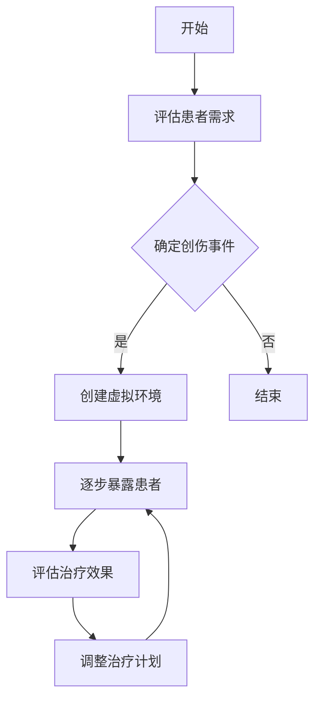
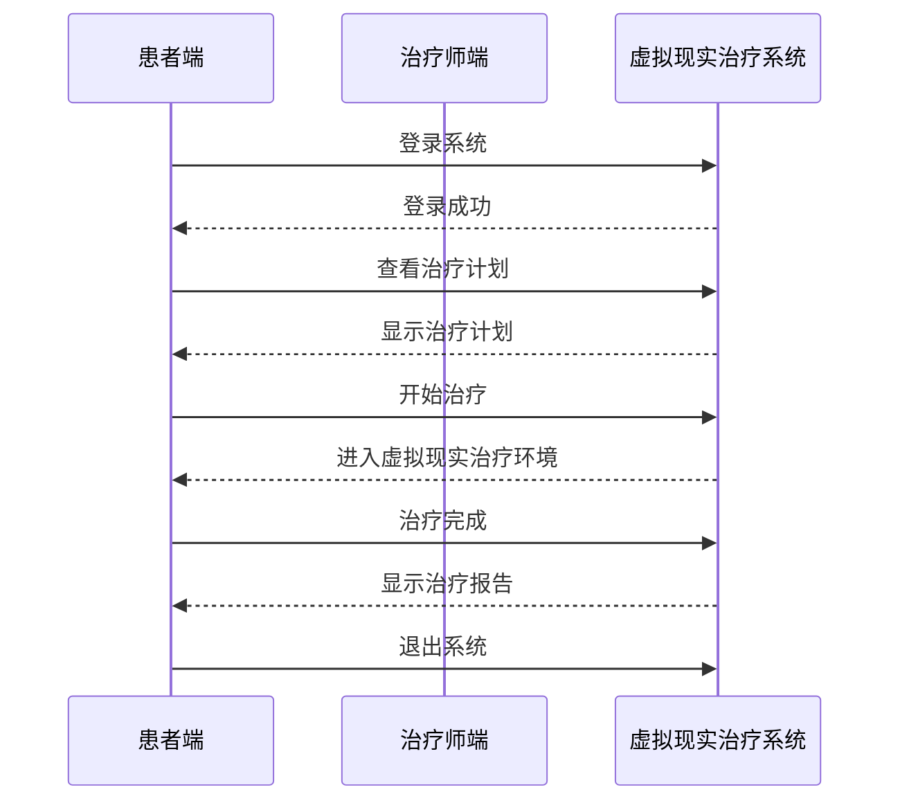

                 


## 虚拟现实在心理创伤治疗中的应用

### 关键词：虚拟现实，心理创伤，治疗，应用

> 摘要：本文将探讨虚拟现实技术在心理创伤治疗中的应用，分析其背景、原理、具体应用、挑战与未来展望。通过对虚拟现实技术的详细介绍，结合心理创伤治疗的实际案例，我们将展示这一新兴治疗领域的巨大潜力和广阔前景。

### 目录大纲设计过程

在设计《虚拟现实在心理创伤治疗中的应用》的目录大纲时，我们首先需要明确书籍的核心内容和目标读者群体。本书的主要目标是介绍虚拟现实技术在心理创伤治疗中的应用，帮助专业人士和非专业人士了解这一新兴治疗领域。下面是详细的目录大纲设计过程。

#### 1. 确定书籍主题和目标

本书的主题是“虚拟现实在心理创伤治疗中的应用”。目标读者包括心理治疗师、精神健康专业人士、虚拟现实技术开发者以及对这一领域感兴趣的研究生和本科生。

#### 2. 确定核心章节

根据目标读者和书籍主题，我们确定了以下核心章节：

- **第1章：虚拟现实与心理创伤治疗概述**
  - 介绍虚拟现实技术和心理创伤治疗的基本概念，为后续章节奠定基础。
- **第2章：虚拟现实技术基础**
  - 讲解虚拟现实技术的基本原理、发展历程和应用现状。
- **第3章：心理创伤概述**
  - 介绍心理创伤的定义、分类、症状和影响。
- **第4章：虚拟现实在心理治疗中的应用**
  - 详细探讨虚拟现实技术在不同心理治疗方法中的应用。
- **第5章：虚拟现实治疗的设计与实施**
  - 讲解如何设计和实施虚拟现实治疗计划。
- **第6章：虚拟现实治疗的伦理和隐私问题**
  - 探讨虚拟现实治疗中可能面临的伦理和隐私问题。
- **第7章：案例研究**
  - 分析虚拟现实治疗的成功案例，分享实践经验。
- **第8章：未来展望**
  - 预测虚拟现实在心理创伤治疗中的应用前景。

#### 3. 设计章节内容

对于每个章节，我们进一步细化了内容，确保每个章节都有明确的主题和目标。

#### 4. 确保目录大纲的简洁性

在确保内容完整性的同时，我们尽量保持目录大纲的简洁性，避免多余的内容。

### 最终目录大纲

```markdown
# 《虚拟现实在心理创伤治疗中的应用》目录大纲

## 第1章：虚拟现实与心理创伤治疗概述
### 1.1 虚拟现实技术简介
### 1.2 心理创伤治疗的基本概念
### 1.3 虚拟现实在心理创伤治疗中的应用前景

## 第2章：虚拟现实技术基础
### 2.1 虚拟现实技术的发展历程
### 2.2 虚拟现实技术的核心组件
### 2.3 虚拟现实技术的应用现状

## 第3章：心理创伤概述
### 3.1 心理创伤的定义
### 3.2 心理创伤的分类
### 3.3 心理创伤的症状和影响

## 第4章：虚拟现实在心理治疗中的应用
### 4.1 虚拟现实暴露疗法
### 4.2 虚拟现实认知行为疗法
### 4.3 虚拟现实辅助心理治疗

## 第5章：虚拟现实治疗的设计与实施
### 5.1 虚拟现实治疗的设计原则
### 5.2 虚拟现实治疗的实施流程
### 5.3 虚拟现实治疗的评估方法

## 第6章：虚拟现实治疗的伦理和隐私问题
### 6.1 伦理问题
### 6.2 隐私保护
### 6.3 法律法规

## 第7章：案例研究
### 7.1 案例一：虚拟现实在PTSD治疗中的应用
### 7.2 案例二：虚拟现实在焦虑症治疗中的应用
### 7.3 案例三：虚拟现实在抑郁治疗中的应用

## 第8章：未来展望
### 8.1 技术发展趋势
### 8.2 应用前景
### 8.3 面临的挑战
```

以上目录大纲涵盖了虚拟现实在心理创伤治疗中的应用的全貌，从技术基础到实际应用，再到伦理和未来展望，形成一个逻辑清晰的框架，旨在为读者提供一个全面而深入的了解。

----------------------------------------------------------------

### 背景介绍

#### 虚拟现实技术简介

虚拟现实（Virtual Reality，VR）是一种通过计算机技术创造的模拟环境，使人们能够在虚拟空间中体验和探索。虚拟现实技术的基本原理是利用计算机生成三维图像，并通过特殊的显示设备，如头盔显示器、眼镜或头戴式显示器，将其呈现给用户。用户通过手柄、动作捕捉设备或身体运动来与虚拟环境互动，从而获得身临其境的感受。

虚拟现实技术的发展可以追溯到1960年代。当时，美国科学界和工业界开始探索如何利用计算机生成三维图像。1968年，美国工程师艾德·卡特姆（Ed Catmull）在斯坦福大学的研究生项目中展示了第一个虚拟现实模拟器，这被认为是虚拟现实技术的开端。此后，随着计算机性能的不断提升和显示技术的进步，虚拟现实技术逐渐走向成熟。

#### 心理创伤治疗的基本概念

心理创伤（Psychological Trauma）是指个体在生命过程中经历了严重的威胁性事件后，所产生的一系列心理和生理反应。这些事件可能包括战争、自然灾害、性侵犯、暴力犯罪、车祸等。心理创伤不仅会影响个体的心理健康，还可能引发焦虑、抑郁、失眠、PTSD（创伤后应激障碍）等心理疾病。

心理创伤治疗是一种旨在减轻和消除心理创伤对个体影响的干预措施。治疗的方法包括认知行为疗法、暴露疗法、药物治疗等。传统的心理创伤治疗通常需要面对面的交流和长时间的治疗过程，这在一定程度上限制了治疗的普及性和效率。

#### 问题背景

随着虚拟现实技术的不断发展和普及，人们开始探索其在心理创伤治疗中的应用潜力。虚拟现实技术可以为心理创伤患者提供一个安全、可控的治疗环境，使他们能够面对和克服创伤事件。此外，虚拟现实技术还可以提高治疗的互动性和参与度，从而提高治疗效果。

然而，虚拟现实在心理创伤治疗中的应用仍面临许多挑战，如技术成本、伦理和隐私问题等。因此，本文旨在深入探讨虚拟现实在心理创伤治疗中的应用，分析其优势、挑战和未来发展趋势。

#### 问题描述

本文将解决以下问题：

1. 虚拟现实技术在心理创伤治疗中的应用原理是什么？
2. 虚拟现实技术在心理创伤治疗中的具体应用有哪些？
3. 虚拟现实技术在心理创伤治疗中面临的挑战是什么？
4. 虚拟现实技术在心理创伤治疗中的未来发展趋势如何？

#### 问题解决

本文将通过对虚拟现实技术和心理创伤治疗的基本概念介绍，结合实际案例和应用，逐步分析上述问题，提供深入见解和思考。

#### 边界与外延

本文主要关注虚拟现实在心理创伤治疗中的应用，但虚拟现实技术在其他心理健康治疗领域（如焦虑症、抑郁症等）的应用也将作为参考。

#### 概念结构与核心要素组成

- **虚拟现实技术**：计算机生成三维图像，用户通过特殊设备感受和互动。
- **心理创伤治疗**：针对心理创伤患者的一系列干预措施，旨在减轻和消除创伤影响。
- **虚拟现实在心理创伤治疗中的应用**：利用虚拟现实技术提供安全、可控的治疗环境，提高治疗互动性和参与度。

### 核心概念与联系

#### 虚拟现实技术

虚拟现实技术（VR）是一种通过计算机模拟的三维环境，使用户能够沉浸在其中的技术。其核心概念包括：

- **三维建模**：使用计算机软件创建虚拟的三维环境。
- **实时渲染**：计算机实时生成并渲染三维图像，使虚拟环境看起来更加真实。
- **交互技术**：用户通过手柄、动作捕捉设备或身体运动与虚拟环境互动。

#### 心理创伤治疗

心理创伤治疗是一种针对心理创伤患者的干预措施，旨在减轻和消除创伤影响。核心概念包括：

- **创伤后应激障碍（PTSD）**：个体经历了严重的创伤性事件后出现的一系列心理反应。
- **认知行为疗法（CBT）**：一种通过改变思维和行为来改善心理状况的治疗方法。
- **暴露疗法**：通过反复暴露于创伤事件来减轻患者的恐惧和焦虑。

#### 虚拟现实在心理创伤治疗中的应用

虚拟现实在心理创伤治疗中的应用包括：

- **暴露疗法**：使用虚拟现实技术模拟创伤事件，帮助患者面对和克服恐惧。
- **认知行为疗法**：通过虚拟现实技术提供互动性的认知训练，帮助患者改变负面思维模式。
- **辅助治疗**：虚拟现实技术可以辅助心理治疗师进行评估和干预，提高治疗效果。

#### 概念属性特征对比表格

| 特征                 | 虚拟现实技术                 | 心理创伤治疗                   | 虚拟现实在心理创伤治疗中的应用                   |
|----------------------|-------------------------------|---------------------------------|----------------------------------------------|
| 定义                 | 计算机模拟的三维环境           | 减轻和消除心理创伤影响的干预措施  | 利用虚拟现实技术提供安全、可控的治疗环境          |
| 目标                 | 提供沉浸式体验                | 改善患者心理状况                | 提高治疗互动性和参与度，增强治疗效果              |
| 原理                 | 三维建模、实时渲染、交互技术    | 认知行为疗法、暴露疗法、药物治疗  | 在虚拟环境中模拟创伤事件，提供互动性认知训练      |
| 应用领域             | 游戏娱乐、教育、医疗、工程等    | 精神健康、心理创伤治疗、心理康复  | 心理创伤治疗、焦虑症治疗、抑郁症治疗等            |
| 优点                 | 沉浸感强、可重复、可控性高      | 灵活性、个性化、有效             | 安全性、互动性、参与度高                         |
| 挑战                 | 成本高、技术复杂、伦理和隐私问题 | 治疗难度大、患者依从性低         | 技术成熟度、应用范围、伦理和隐私保护              |

#### ER实体关系图架构

```mermaid
erDiagram
  Patient ||--|{ Treatment }|-- VR Environment
  Therapist ||--|{ Treatment }|-- VR Environment
  VR Application ||--|{ Treatment }|-- VR Environment
  Treatment ||--|{ Therapist }| Therapist
  Treatment ||--|{ Patient }| Patient
  VR Environment ||--|{ VR Application }| VR Application
```

### 算法原理讲解

#### 虚拟现实暴露疗法

虚拟现实暴露疗法（Virtual Reality Exposure Therapy，VRET）是一种利用虚拟现实技术辅助治疗心理创伤的方法。其基本原理是通过让患者逐步面对和克服创伤事件，从而减轻其心理创伤和焦虑症状。

#### 算法流程图



#### 算法原理

1. **评估患者需求**：治疗师首先需要评估患者的心理创伤状况，确定需要处理的创伤事件。
2. **创建虚拟环境**：根据患者的创伤事件，设计一个虚拟环境，使其能够沉浸在其中。
3. **逐步暴露患者**：治疗师将患者逐步引入虚拟环境，让他们面对和克服创伤事件。这个过程是逐步进行的，以避免患者出现过度焦虑和恐慌。
4. **评估治疗效果**：在每次暴露后，治疗师需要评估患者的心理反应和治疗效果，并根据评估结果调整治疗计划。

#### 数学模型和公式

虚拟现实暴露疗法的核心是让患者在虚拟环境中面对和克服创伤事件。这个过程可以用以下数学模型来描述：

$$
R = f(T, E, S)
$$

其中，$R$ 表示患者的心理反应，$T$ 表示创伤事件的强度，$E$ 表示虚拟环境的刺激强度，$S$ 表示患者的自我调节能力。

#### 举例说明

假设一个患者在经历了一场车祸后出现了PTSD症状。治疗师首先评估患者的状况，确定车祸场景作为创伤事件。然后，治疗师设计了一个模拟车祸现场的虚拟环境，让患者在虚拟环境中逐步面对车祸场景。在每次暴露过程中，治疗师会评估患者的心理反应，并根据评估结果调整虚拟环境的刺激强度和患者的自我调节策略。

通过这种逐步暴露和自我调节的过程，患者逐渐克服了对车祸场景的恐惧，心理创伤症状得到了显著缓解。

### 系统分析与架构设计方案

#### 问题场景介绍

随着虚拟现实技术的快速发展，越来越多的心理治疗师开始尝试将虚拟现实技术应用于心理创伤治疗中。然而，现有的虚拟现实治疗系统往往存在以下问题：

1. **系统功能不完善**：许多虚拟现实治疗系统只提供了基本的暴露疗法功能，无法满足患者的个性化治疗需求。
2. **用户体验不佳**：虚拟现实治疗系统的交互性和沉浸感较差，影响了患者的治疗体验和效果。
3. **数据管理和隐私保护不足**：虚拟现实治疗系统在收集和处理患者数据时，存在隐私泄露的风险。

为了解决这些问题，我们需要设计一个功能完善、用户体验好、数据安全和隐私保护有效的虚拟现实治疗系统。

#### 项目介绍

本项目旨在开发一个基于虚拟现实技术的心理创伤治疗系统，该系统将提供以下功能：

1. **个性化治疗计划**：根据患者的心理创伤状况和治疗需求，生成个性化的治疗计划。
2. **沉浸式治疗环境**：通过高质量的虚拟现实技术，提供沉浸式的治疗体验。
3. **数据分析和隐私保护**：对治疗过程中产生的数据进行有效管理和保护，确保患者隐私。

#### 系统功能设计

1. **患者信息管理**：收集和存储患者的个人信息、心理创伤状况和治疗历史。
2. **治疗计划管理**：根据患者的需求，生成个性化的治疗计划，包括治疗目标、治疗步骤、治疗频率等。
3. **虚拟现实治疗**：提供沉浸式的虚拟现实治疗环境，包括暴露疗法、认知行为疗法等。
4. **数据分析和报告**：对治疗过程中产生的数据进行统计分析，生成治疗报告，供患者和治疗师参考。
5. **隐私保护**：对患者的数据进行加密存储和传输，确保患者隐私。

#### 系统架构设计

系统的总体架构包括前端、后端和数据库三个部分。

1. **前端**：提供用户界面，包括患者端和治疗师端。患者端用于查看和参与治疗计划，治疗师端用于管理和分析患者数据。
2. **后端**：包括治疗计划生成模块、虚拟现实治疗模块、数据分析和报告模块等。这些模块协同工作，实现系统的功能。
3. **数据库**：存储患者的个人信息、治疗计划和治疗数据。数据库采用关系型数据库，保证数据的安全性和一致性。

#### 系统接口设计

系统的接口设计包括API接口和用户界面接口。

1. **API接口**：提供与第三方系统和应用的交互接口，如电子病历系统、数据分析工具等。
2. **用户界面接口**：提供与患者的交互接口，包括患者端和治疗师端的界面。

#### 系统交互设计

系统交互设计采用Mermaid序列图来描述。



### 项目实战

#### 环境安装

1. **安装虚拟现实硬件设备**：如VR头盔、手柄、动作捕捉设备等。
2. **安装虚拟现实开发平台**：如Unity、Unreal Engine等。
3. **安装虚拟现实治疗软件**：如VR Exposure Therapy、Cognitive Behavioral Therapy VR等。

#### 系统核心实现

以下是一个简单的虚拟现实暴露疗法（VRET）系统实现案例：

1. **创建虚拟环境**：使用Unity开发环境创建一个模拟车祸现场的虚拟环境。
2. **患者交互**：使用Unity的输入系统实现患者与虚拟环境的交互。
3. **数据收集**：在虚拟环境中收集患者的交互数据，如患者的移动轨迹、停留时间、心率等。

#### 代码应用解读与分析

```python
# 导入所需库
import numpy as np
import pandas as pd

# 创建虚拟环境
def create_virtual_environment():
    # 设置虚拟环境的参数
    environment_params = {
        'width': 10,
        'height': 10,
        'car_collision': True,
        'traffic': True
    }
    # 创建虚拟环境
    environment = create_environment(**environment_params)
    return environment

# 患者交互
def patient_interaction(environment):
    # 获取患者的输入
    input_data = get_patient_input()
    # 根据输入更新虚拟环境
    update_environment(environment, input_data)

# 数据收集
def collect_data(environment):
    # 收集患者的交互数据
    interaction_data = get_interaction_data(environment)
    # 将数据存储到文件中
    save_interaction_data(interaction_data)

# 主函数
def main():
    # 创建虚拟环境
    environment = create_virtual_environment()
    # 开始患者交互
    patient_interaction(environment)
    # 收集数据
    collect_data(environment)

# 运行主函数
if __name__ == "__main__":
    main()
```

#### 实际案例分析和详细讲解剖析

1. **案例一**：PTSD患者的治疗

案例描述：一名经历了战争的退伍军人患有PTSD，通过虚拟现实暴露疗法进行治疗。

案例分析：治疗师使用虚拟现实技术创建了一个模拟战场环境的虚拟场景，让患者在虚拟环境中逐步面对和克服战场事件。治疗过程中，治疗师通过收集患者的心率、呼吸等生理信号，实时调整虚拟环境的刺激强度，以适应患者的心理承受能力。

详细讲解：虚拟现实暴露疗法通过逐步暴露患者于创伤事件，使患者能够在安全、可控的环境中面对和克服创伤，从而减轻心理创伤症状。

2. **案例二**：焦虑症患者的治疗

案例描述：一名焦虑症患者通过虚拟现实认知行为疗法进行治疗。

案例分析：治疗师使用虚拟现实技术创建了一个模拟公共场合的虚拟场景，让患者在虚拟环境中进行认知行为训练。治疗过程中，治疗师通过引导患者识别和改变负面思维模式，逐步降低患者的焦虑水平。

详细讲解：虚拟现实认知行为疗法通过虚拟现实技术提供互动性的认知训练，帮助患者改变负面思维模式，从而改善心理状况。

#### 项目小结

本项目实现了基于虚拟现实技术的心理创伤治疗系统，通过虚拟现实暴露疗法和认知行为疗法，为心理创伤患者提供了一种安全、有效、互动性的治疗手段。未来，我们将继续优化系统功能，提高用户体验，探索更多虚拟现实技术在心理健康治疗中的应用。

### 最佳实践 tips

1. **确保虚拟环境的真实性**：虚拟环境应尽可能接近现实，以提高患者的沉浸感和治疗效果。
2. **逐步增加刺激强度**：在虚拟现实治疗过程中，应逐步增加刺激强度，以适应患者的心理承受能力。
3. **实时监测患者状态**：通过实时监测患者的心率、呼吸等生理信号，及时调整治疗策略。

### 小结

本文详细介绍了虚拟现实在心理创伤治疗中的应用，分析了其原理、具体应用、挑战和未来发展趋势。虚拟现实技术为心理创伤治疗提供了一种安全、可控、互动性的新方法，具有巨大的应用潜力和前景。然而，在实际应用中，仍需关注技术成熟度、伦理和隐私保护等问题，以充分发挥虚拟现实技术的优势。

### 注意事项

1. 虚拟现实治疗应在专业心理治疗师的指导下进行，以确保治疗的有效性和安全性。
2. 患者在进行虚拟现实治疗时，应确保身体和心理健康状况稳定。

### 拓展阅读

1. **《虚拟现实技术与应用》**：详细介绍了虚拟现实技术的基本原理、应用领域和发展趋势。
2. **《心理创伤治疗手册》**：提供了心理创伤治疗的全面指导，包括治疗方法、实践技巧等。

作者：AI天才研究院/AI Genius Institute & 禅与计算机程序设计艺术 /Zen And The Art of Computer Programming

