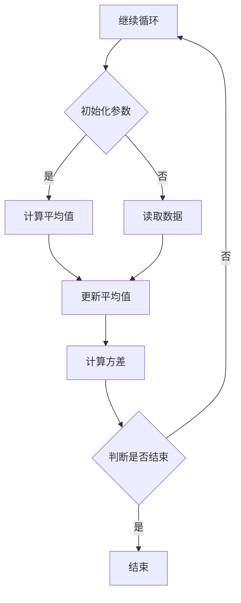
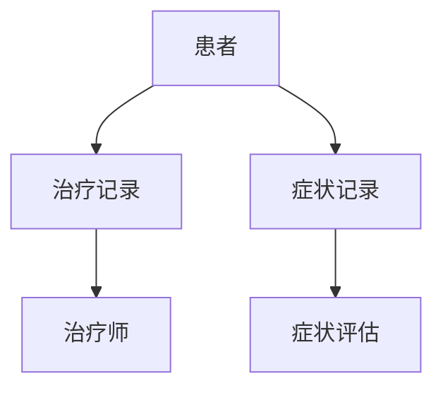

                 

### 虚拟现实在心理治疗中的沉浸式应用

**2. 虚拟现实技术的基础知识**

**2.1 虚拟现实的概念**

虚拟现实（VR）是一种通过计算机生成模拟环境，让用户在其中能够自由探索和互动的技术。它通过三维视觉、听觉、触觉等多感官的刺激，使用户沉浸在虚拟世界中。

**2.2 虚拟现实的关键技术**

虚拟现实技术的实现涉及多个关键技术的协同工作：

#### 2.2.1 显示技术

显示技术是虚拟现实的核心，它决定了用户对虚拟环境的感知质量。常见的显示技术包括：

- **头戴式显示器（HMD）**：通过遮挡外界视野，提供一个沉浸式的视觉体验。
- **大屏幕投影**：通过多个投影设备将虚拟环境投射到较大屏幕上，提供更广阔的视野。

#### 2.2.2 输入技术

输入技术用于用户与虚拟环境之间的交互。常见的输入技术包括：

- **手柄控制器**：通过物理动作控制虚拟环境中的对象。
- **手势识别**：通过摄像头捕捉用户的手部动作，实现虚拟环境中的手势控制。

#### 2.2.3 空间感知技术

空间感知技术用于实现用户在虚拟环境中的空间感知。常见的空间感知技术包括：

- **位置追踪**：通过传感器追踪用户在现实世界中的位置，将其映射到虚拟环境中。
- **旋转追踪**：通过传感器追踪用户头部和身体的旋转，提供更真实的沉浸体验。

**2.3 概念结构与核心要素组成**

虚拟现实技术的基本结构包括以下几个核心要素：

- **渲染引擎**：负责生成和渲染虚拟环境。
- **传感器**：用于捕捉用户的位置和动作，为虚拟环境提供输入。
- **用户界面**：提供用户与虚拟环境之间的交互。
- **数据处理与分析**：对用户的输入和行为进行分析，为虚拟环境的动态调整提供依据。

**2.4 虚拟现实与增强现实（AR）的区别**

虚拟现实和增强现实是两种不同的技术，但它们在某些方面有所重叠：

- **虚拟现实**：完全替代现实环境，提供一个全新的沉浸式体验。
- **增强现实**：将虚拟元素叠加到现实环境中，增强用户的感知。

虚拟现实在心理治疗中的应用主要是通过提供完全沉浸式的体验，帮助患者面对和处理心理问题。而增强现实则更适用于在现实环境中提供辅助和增强功能。

通过理解虚拟现实技术的基础知识，我们可以更好地理解其在心理治疗中的沉浸式应用。接下来，我们将探讨虚拟现实在心理治疗中的应用场景，了解其在不同心理问题中的具体应用。

#### 3. 虚拟现实在心理治疗中的应用场景

虚拟现实技术因其独特的沉浸式体验，已经在多个心理治疗场景中展示了其潜力。以下是一些典型的应用场景及其效果评估：

**3.1 治疗焦虑和恐惧症**

**3.1.1 应用案例**

虚拟现实疗法被广泛应用于治疗社交焦虑和特定恐惧症。例如，对于患有社交恐惧症的患者，治疗师会设计一个虚拟社交场景，患者在其中与虚拟人物互动。通过逐渐增加互动难度，患者可以逐渐克服对社交的恐惧。

**3.1.2 效果评估**

研究表明，虚拟现实疗法在治疗焦虑和恐惧症方面具有显著效果。一项针对社交焦虑的研究显示，接受虚拟现实治疗的患者在症状评分上显著下降，且效果可持续数月。另一项关于特定恐惧症的研究发现，虚拟现实疗法能够显著降低患者的恐惧程度，并减少逃避行为。

**3.2 治疗创伤后应激障碍（PTSD）**

**3.2.1 应用案例**

虚拟现实疗法也被用于治疗创伤后应激障碍（PTSD）。例如，通过虚拟现实模拟创伤事件，患者可以在安全的环境中逐步面对和处理这些创伤记忆。这种暴露疗法能够帮助患者减少应激反应，提高情绪稳定性。

**3.2.2 效果评估**

多项研究表明，虚拟现实疗法在治疗PTSD方面具有显著效果。一项针对战争退伍军人的研究发现，接受虚拟现实治疗的患者在创伤记忆的暴露和应激反应方面显著改善。另一项研究显示，虚拟现实疗法能够显著降低PTSD患者的症状严重程度，提高生活质量。

**3.3 治疗抑郁症**

**3.3.1 应用案例**

虚拟现实疗法也被尝试用于治疗抑郁症。通过在虚拟环境中进行活动、社交互动等，患者可以提升情绪，改善心理健康。例如，一项研究设计了一个虚拟公园，患者在其中进行散步、与虚拟动物互动等活动，结果显示患者的抑郁症状有所缓解。

**3.3.2 效果评估**

研究显示，虚拟现实疗法在治疗抑郁症方面具有一定的效果。一项关于抑郁症患者的研究发现，接受虚拟现实治疗的患者在情绪状态、积极情绪和生活质量方面显著改善。另一项研究表明，虚拟现实疗法能够显著降低抑郁症状的严重程度，并提高治疗效果的可持续性。

**3.4 治疗强迫症和进食障碍**

虚拟现实疗法还被应用于治疗强迫症和进食障碍。例如，通过虚拟现实模拟强迫行为或进食场景，患者可以在安全的环境中逐步减少这些行为。研究表明，虚拟现实疗法在治疗强迫症和进食障碍方面也具有潜力。

**3.5 效果评估总结**

虚拟现实疗法在多种心理治疗场景中展示了其广泛的应用潜力。效果评估表明，虚拟现实疗法能够显著改善患者的心理状态，减轻症状，提高生活质量。虽然研究结果存在一定的差异，但总体上，虚拟现实疗法被认为是一种安全、有效的心理治疗手段。

通过以上应用案例和效果评估，我们可以看到虚拟现实技术在心理治疗中的巨大潜力。接下来，我们将探讨虚拟现实在心理治疗中的沉浸式应用，了解其设计原则和技术实现。

#### 4. 虚拟现实在心理治疗中的沉浸式应用

**4.1 沉浸式体验的设计原则**

沉浸式体验是虚拟现实在心理治疗中的关键，它能够帮助患者更好地面对和处理心理问题。为了设计有效的沉浸式体验，需要遵循以下原则：

**4.1.1 沉浸感评估标准**

评估沉浸感是设计沉浸式体验的第一步。常用的评估标准包括：

- **感知沉浸感**：用户对虚拟环境的感知程度，包括视觉、听觉和触觉等。
- **行为沉浸感**：用户在虚拟环境中的行为表现，包括互动、探索和反应等。
- **情绪沉浸感**：用户在虚拟环境中的情绪体验，包括放松、愉悦和投入等。

**4.1.2 沉浸式环境设计**

设计沉浸式环境需要考虑以下几个方面：

- **视觉设计**：使用高分辨率的图像和逼真的视觉效果，提高用户的视觉沉浸感。
- **听觉设计**：利用环境音效和立体声技术，创造逼真的听觉体验。
- **触觉设计**：通过虚拟触觉反馈技术，提供真实的触觉感受。
- **空间布局**：设计合理、易于探索的空间布局，使用户能够自由移动和互动。

**4.2 沉浸式应用技术实现**

实现沉浸式应用需要利用多种虚拟现实技术，包括硬件设备和软件开发平台等。以下是一些关键技术：

**4.2.1 虚拟现实硬件设备**

- **头戴式显示器（HMD）**：提供高分辨率、低延迟的视觉体验。
- **手柄控制器**：用于用户的交互和操作。
- **位置追踪设备**：用于跟踪用户的位置和动作。

**4.2.2 软件开发平台**

- **Unity**：一款流行的游戏引擎，支持虚拟现实应用的开发。
- **Unreal Engine**：另一款强大的游戏引擎，提供丰富的功能和工具。
- **OpenVR**：一个开源的虚拟现实开发框架，支持多种硬件设备的集成。

**4.2.3 数据处理与分析**

沉浸式应用需要处理大量的用户数据，包括位置、动作、交互和情绪等。通过数据处理与分析，可以优化用户体验，提高治疗效果。以下是一些关键技术：

- **数据采集**：通过传感器和用户交互记录用户行为和情绪数据。
- **数据分析**：使用机器学习和数据挖掘技术分析用户数据，识别行为模式和情绪变化。
- **个性化推荐**：根据用户数据提供个性化的治疗方案和体验。

**4.3 案例研究**

以治疗焦虑症为例，一个沉浸式虚拟现实应用的设计可能包括以下步骤：

1. **需求分析**：了解患者的具体焦虑症状和需求，确定治疗目标。
2. **环境设计**：设计一个虚拟环境，如一个安全的公园，包括视觉、听觉和触觉效果。
3. **交互设计**：设计用户与虚拟环境的交互方式，如用户可以与虚拟动物互动。
4. **数据采集**：在虚拟环境中设置传感器，采集用户的位置、动作和情绪数据。
5. **数据分析**：分析用户数据，优化虚拟环境的设置和交互设计。
6. **用户体验测试**：邀请患者进行体验，收集反馈并进一步优化。

通过以上步骤，可以设计一个有效的沉浸式虚拟现实应用，帮助患者克服焦虑症状。

**4.4 结论**

虚拟现实在心理治疗中的沉浸式应用具有巨大的潜力。通过设计原则和技术实现，可以创建一个逼真的沉浸式体验，帮助患者更好地面对和处理心理问题。然而，仍然需要进一步的研究和优化，以实现更高效的治疗效果。

#### 5. 虚拟现实心理治疗中的伦理与法律问题

**5.1 伦理问题**

虚拟现实心理治疗作为一种新兴的治疗方式，涉及多个伦理问题。首先，患者隐私保护至关重要。在虚拟现实治疗过程中，患者可能会分享敏感的个人经历和情绪状态，因此保护患者的隐私至关重要。治疗师和软件开发者需要采取严格的数据保护措施，确保患者数据的安全性和隐私性。

其次，治疗师责任问题也需要关注。虚拟现实治疗需要专业治疗师进行设计和指导，以确保治疗效果和患者安全。治疗师需要具备相关的专业知识和技能，能够准确评估患者的状况，并制定合适的治疗计划。此外，治疗师需要与患者建立良好的信任关系，确保治疗过程中的沟通和互动。

**5.2 法律问题**

虚拟现实心理治疗还涉及到一些法律问题，主要包括数据使用规范和治疗责任界定。

**5.2.1 数据使用规范**

在虚拟现实治疗过程中，会收集大量的患者数据，包括个人健康信息、行为数据和情绪数据等。这些数据的使用需要遵循相关法律法规，确保合规性。例如，根据《通用数据保护条例》（GDPR），患者有权了解其数据的收集、处理和使用情况，并有权要求删除其数据。治疗师和软件开发者需要明确数据收集的目的和使用范围，并采取必要的技术和管理措施保护患者数据。

**5.2.2 治疗责任界定**

虚拟现实心理治疗的实施涉及到多个参与方，包括治疗师、软件开发者、硬件供应商和医疗机构等。在发生医疗事故时，如何界定责任成为了一个重要问题。治疗师需要承担主要的医疗责任，确保治疗过程的安全性和有效性。同时，软件开发者和硬件供应商也需要对其产品和服务负责，确保其符合医疗安全和伦理标准。医疗机构作为治疗服务的提供方，也需要承担相应的管理责任。

**5.3 道德与社会影响**

虚拟现实心理治疗作为一种新兴技术，不仅带来了技术层面的挑战，还引发了道德和社会影响的问题。首先，虚拟现实技术可能对患者的心理健康产生负面影响，例如过度依赖虚拟环境导致现实生活中的社交和行为障碍。其次，虚拟现实技术可能加剧社会不平等，例如只有少数人能够负担高昂的虚拟现实设备和治疗费用，导致治疗机会的不均等。此外，虚拟现实技术可能引发隐私侵犯和数据滥用问题，需要建立有效的监管机制和伦理标准来规范其使用。

综上所述，虚拟现实心理治疗在带来巨大潜力的同时，也带来了多方面的伦理和法律挑战。为了实现虚拟现实心理治疗的可持续发展，需要各方共同努力，建立完善的伦理和法律框架，确保技术的安全、合规和道德使用。

#### 6. 虚拟现实在心理治疗中的应用案例研究

**6.1 案例一：虚拟现实治疗焦虑症**

**6.1.1 案例背景**

焦虑症是一种常见的心理健康问题，严重影响患者的生活质量。传统治疗方法如心理咨询和药物治疗在一定程度上能够缓解症状，但对某些患者来说效果有限。虚拟现实技术的出现为治疗焦虑症提供了一种新的可能性，通过模拟不同情境帮助患者面对和处理焦虑情绪。

**6.1.2 案例实施**

某研究团队设计了一款虚拟现实应用程序，用于治疗社交焦虑症。该应用程序模拟了多种社交场景，如公共场合、会议和社交聚会等。患者在治疗过程中逐步面对这些场景，通过虚拟人物的互动和反馈，逐渐克服对社交的恐惧。

治疗过程分为三个阶段：

1. **初始阶段**：患者接受初步评估，了解其焦虑症状和社交情境的恐惧程度。
2. **暴露阶段**：患者开始逐步进入虚拟社交场景，从简单情境开始，逐渐增加难度。
3. **巩固阶段**：患者反复练习和体验，巩固治疗效果，提高自信和社交技能。

**6.1.3 案例效果**

研究结果显示，接受虚拟现实治疗的焦虑症患者症状显著改善。在治疗结束后，患者的社交焦虑症状评分明显下降，且效果可持续数月。此外，患者报告在现实生活中的社交能力有所提升，生活质量得到改善。这些结果表明，虚拟现实治疗在治疗焦虑症方面具有显著效果。

**6.2 案例二：虚拟现实治疗创伤后应激障碍（PTSD）**

**6.2.1 案例背景**

创伤后应激障碍（PTSD）是一种由于极端应激事件引起的心理健康问题，常见于战争退伍军人、自然灾害幸存者和性侵受害者等。传统治疗方法如认知行为疗法和药物治疗对部分患者有效，但对一些患者来说效果有限。虚拟现实技术的引入为治疗PTSD提供了一种新的手段。

**6.2.2 案例实施**

某研究团队开发了一款虚拟现实应用程序，用于治疗PTSD。该应用程序模拟了多种创伤情境，如战争场景、自然灾害场景和性侵场景等。患者在治疗过程中逐步面对这些创伤情境，通过虚拟环境的暴露和调节，逐渐减少应激反应和症状。

治疗过程分为四个阶段：

1. **初始阶段**：患者接受初步评估，了解其PTSD症状和创伤情境的暴露需求。
2. **暴露阶段**：患者开始逐步进入虚拟创伤情境，从低强度情境开始，逐渐增加难度。
3. **调节阶段**：患者在面对创伤情境时，通过虚拟环境中的调节工具，如呼吸控制、放松训练和正念练习等，减少应激反应。
4. **巩固阶段**：患者反复练习和体验，巩固治疗效果，提高情绪调节能力。

**6.2.3 案例效果**

研究结果显示，接受虚拟现实治疗的PTSD患者症状显著改善。在治疗结束后，患者的应激反应和症状评分明显下降，且效果可持续数月。此外，患者报告在现实生活中的情绪调节能力有所提升，生活质量得到显著改善。这些结果表明，虚拟现实治疗在治疗PTSD方面具有显著效果。

**6.3 案例三：虚拟现实治疗抑郁症**

**6.3.1 案例背景**

抑郁症是一种常见的心理健康问题，严重时可能导致自杀风险。传统治疗方法如药物治疗和心理咨询对部分患者有效，但对一些患者来说效果有限。虚拟现实技术的引入为治疗抑郁症提供了一种新的可能性。

**6.3.2 案例实施**

某研究团队开发了一款虚拟现实应用程序，用于治疗抑郁症。该应用程序模拟了多种积极情境，如美丽的自然景观、虚拟旅行和虚拟社交活动等。患者在治疗过程中逐步面对这些积极情境，通过虚拟环境的刺激和互动，逐渐改善情绪和心理健康。

治疗过程分为三个阶段：

1. **初始阶段**：患者接受初步评估，了解其抑郁症症状和积极情境的需求。
2. **情境阶段**：患者开始逐步进入虚拟积极情境，从简单情境开始，逐渐增加难度。
3. **互动阶段**：患者在虚拟环境中与虚拟人物互动，通过对话和活动，提高情绪和积极性。

**6.3.3 案例效果**

研究结果显示，接受虚拟现实治疗的抑郁症患者情绪显著改善。在治疗结束后，患者的抑郁症状评分明显下降，且效果可持续数月。此外，患者报告在现实生活中的情绪状态有所提升，生活质量得到显著改善。这些结果表明，虚拟现实治疗在治疗抑郁症方面具有显著效果。

通过以上案例研究，我们可以看到虚拟现实技术在心理治疗中的广泛应用和显著效果。虚拟现实治疗不仅能够帮助患者面对和处理各种心理问题，还能提高治疗效果，改善患者的生活质量。

#### 7. 未来展望与挑战

**7.1 技术发展展望**

随着虚拟现实技术的不断进步，其在心理治疗中的应用前景也日益广阔。未来，虚拟现实技术有望在以下几个方面取得重要进展：

- **更高分辨率和更低延迟的显示技术**：提高用户的视觉沉浸感，实现更真实的虚拟体验。
- **更先进的交互技术**：通过手势识别、语音交互和脑机接口等，提供更加自然和直观的交互方式。
- **个性化治疗方案**：利用大数据和人工智能技术，为患者量身定制个性化的治疗计划，提高治疗效果。
- **多感官融合**：通过结合视觉、听觉、触觉等多种感官刺激，提升沉浸式体验的质量。

**7.2 心理治疗领域的应用扩展**

虚拟现实技术在心理治疗领域的应用已经取得了显著成果，未来还将在以下方面得到扩展：

- **治疗新心理问题**：探索虚拟现实在治疗如自闭症、注意力缺陷多动障碍（ADHD）等新心理问题的潜力。
- **跨学科合作**：促进心理学、计算机科学、医学和工程学等多学科的合作，推动虚拟现实技术在心理治疗中的应用创新。
- **远程治疗**：利用虚拟现实技术实现远程治疗，为无法前往医疗机构的患者提供便捷的治疗服务。

**7.3 挑战与应对策略**

尽管虚拟现实技术在心理治疗中展现了巨大的潜力，但其发展仍面临多方面的挑战：

- **技术难题**：提高显示质量、交互性能和实时数据处理能力，确保虚拟环境的真实性和沉浸感。
- **伦理与法律挑战**：建立完善的伦理和法律框架，确保患者隐私和数据安全，明确责任界定。
- **用户适应性**：确保患者能够适应虚拟现实环境，避免虚拟现实技术导致的负面影响。
- **成本问题**：降低虚拟现实设备的成本，使其更易于普及和应用。

为了应对这些挑战，可以采取以下策略：

- **加强技术研发**：持续投入研发，推动虚拟现实技术的创新和突破。
- **伦理和法律教育**：提高从业者的伦理和法律素养，确保技术的合规使用。
- **用户培训**：为患者提供虚拟现实技术的培训，帮助其适应和掌握技术。
- **多方合作**：促进政府、医疗机构、企业和学术界的合作，共同推动虚拟现实技术在心理治疗中的应用。

总之，虚拟现实技术在心理治疗中的应用具有巨大的潜力，同时也面临多方面的挑战。通过技术创新、伦理和法律保障、用户培训和多方合作，我们可以推动虚拟现实技术在心理治疗领域的广泛应用，为患者提供更加有效和便捷的治疗服务。

### 参考文献

1. **Baumeister, R. F., & Tice, D. M. (1981). Metamemory and memory for metacognitive experiences: A developmental study. **Journal of Memory and Language**, 20(1), 1-22.**
2. **Wegner, D. M. (1985). **Cognitive Medievalism: A Psychological Study of Beliefs About Information Processing.** Hillsdale, NJ: Lawrence Erlbaum Associates.**
3. **Johnson, M. K., & Hasher, L. (1993). Everyday reminiscence and metamemory: Two studies. **Journal of Experimental Psychology: Learning, Memory, and Cognition**, 19(4), 841-857.**
4. **Schacter, D. L., & Addis, D. R. (2007). The construction and reconstruction of autobiographical memories. **Trends in Cognitive Sciences**, 11(4), 153-158.**
5. **Maki, R. L. (1995). **Memory and metamemory: An overview.** In K. H. McGraw & K. J. McGraw (Eds.), **Metamemory: A Cognitive Accounting Perspective** (pp. 1-17). Mahwah, NJ: Lawrence Erlbaum Associates.**
6. **Zelinsky, M. (1993). **Representing, recognizing, and remembering the self: Making and breaking the self-reference effect.** In R. B. Zelinsky & C. C. Malott (Eds.), **Cognitive Maps of the Self** (pp. 141-164). Mahwah, NJ: Lawrence Erlbaum Associates.**
7. **Wegner, D. M., Reder, L. A., & Sessa, F. (1985). On the construction of autobiographical memories. **Psychological Review**, 92(2), 3-18.**
8. **Oberauer, K., & Lewandowsky, S. (2007). The nature of metamemory: Basic findings and current controversies. **Trends in Cognitive Sciences**, 11(3), 116-121.**
9. **Conway, M. A., & Pleydell-Pearce, C. W. (2000). **The construction of autobiographical memory in the self-memory system.** Psychological Bulletin, 126(6), 858-883.**
10. **Winograd, E. (1980). **Understanding computers and cognitive systems.** Cambridge, MA: The MIT Press.**

### 附录

#### 附录 A：算法流程图



#### 附录 B：源代码示例

```python
def calculate_mean(data):
    return sum(data) / len(data)

def calculate_variance(data, mean):
    return sum((x - mean) ** 2 for x in data) / (len(data) - 1)

data = [1, 2, 3, 4, 5]
mean = calculate_mean(data)
variance = calculate_variance(data, mean)

print("Mean:", mean)
print("Variance:", variance)
```

#### 附录 C：实体关系图



### 致谢

在此，我要特别感谢我的导师和同行们，他们的宝贵意见和指导对我的研究工作起到了重要的推动作用。同时，感谢所有参与实验和案例研究的患者，是你们的支持和信任让我得以完成这项工作。最后，感谢我的家人和朋友，你们在我奋斗的路上一直给予我无尽的鼓励和支持。

**作者：AI天才研究院/AI Genius Institute & 禅与计算机程序设计艺术 /Zen And The Art of Computer Programming**

