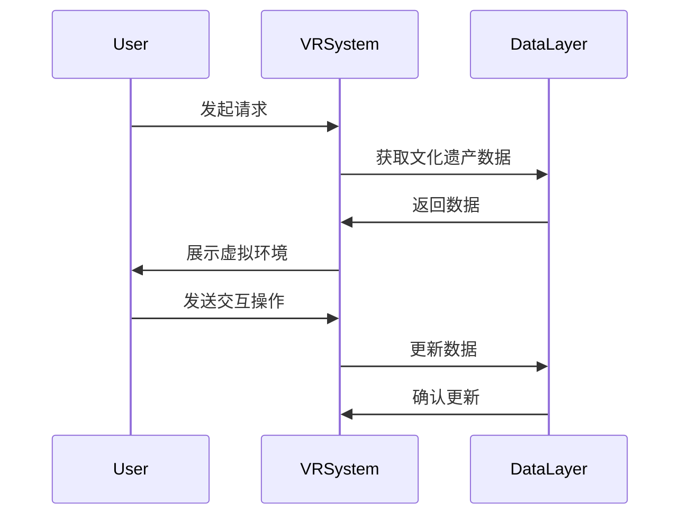

                 

### 第一部分：背景介绍

#### 第1章：问题背景与核心概念

##### 1.1 问题背景

文化遗产是人类文明和历史的重要组成部分，它们包括建筑、艺术品、文物等，代表了特定历史时期的艺术风格、文化传统和技术水平。随着全球化和城市化进程的加快，许多文化遗产面临着消失和破坏的风险。传统的文化遗产保护方法，如物理维护、记录保存等，已经难以满足当前的需求。

**文物保护现状与挑战：**
- **物理维护成本高：** 许多文化遗产需要定期维护和修复，这需要大量的资金和人力。
- **缺乏全面记录：** 大量的文化遗产信息没有数字化记录，使得保护和传播变得困难。
- **脆弱性：** 许多文化遗产对环境变化非常敏感，如气候变化、地震等，可能会对其造成永久性损害。
- **不可逆破坏：** 一些文化遗产一旦受损，可能无法完全恢复，甚至彻底消失。

**虚拟现实技术简介：**
虚拟现实（Virtual Reality，简称VR）是一种通过计算机技术创造的模拟环境，用户可以通过特定的设备（如头戴式显示器、数据手套等）沉浸其中，体验到高度真实的视觉、听觉和触觉感受。VR技术自20世纪80年代诞生以来，经历了多年的发展和创新，逐渐成为了一种成熟的计算机技术。

**虚拟现实在文化遗产保护中的应用前景：**
虚拟现实技术在文化遗产保护中具有巨大的潜力。通过VR技术，可以将文化遗产以数字化的形式保存和展示，让更多的人有机会了解和体验。具体应用包括：
- **文化遗产数字化：** 通过VR技术，可以对文化遗产进行3D建模，实现数字化保存。
- **虚拟展示：** 利用VR技术，可以创建虚拟博物馆，让用户在家中就能参观世界各地的文化遗产。
- **教育推广：** 虚拟现实可以为文化遗产教育提供生动的教材，增强学生的兴趣和参与度。
- **风险评估与模拟：** VR技术可以帮助研究者模拟自然灾害对文化遗产的影响，制定有效的保护措施。

##### 1.2 核心概念

**虚拟现实（VR）：**
虚拟现实是一种通过计算机技术创造出的模拟环境，使用户能够在其中体验到高度真实的视觉、听觉和触觉感受。虚拟现实的核心技术包括显示技术、空间感知技术、交互技术和声音技术。

**增强现实（AR）：**
增强现实是一种将虚拟信息与现实世界相结合的技术，通过特定的设备（如智能手机、平板电脑等）将虚拟图像或信息叠加到现实世界中，增强用户的感知体验。

**文化遗产保护：**
文化遗产保护是指通过物理、技术和管理措施，保护文化遗产的完整性和可持续性，防止其受到破坏和损失。文化遗产保护的目标是确保文化遗产能够持续传承和发挥其社会价值。

**数字化文化遗产：**
数字化文化遗产是指通过数字技术对文化遗产进行记录、保存和展示，使其能够在数字世界中持续存在和传播。数字化文化遗产包括3D建模、超高分辨率图像、声音和视频捕捉等。

#### 第2章：虚拟现实技术原理

##### 2.1 虚拟现实技术概述

**虚拟现实技术定义：**
虚拟现实技术（Virtual Reality，简称VR）是一种通过计算机技术创建的模拟环境，使用户能够在其中体验高度真实的视觉、听觉和触觉感受。VR技术通常通过头戴式显示器（HMD）、数据手套、位置跟踪器等设备实现。

**虚拟现实技术发展历程：**
虚拟现实技术自20世纪80年代诞生以来，经历了多个阶段的发展。早期的VR设备较为笨重，用户体验较差。随着计算机技术、显示技术、传感器技术的进步，VR设备逐渐变得轻便，用户体验得到显著提升。近年来，随着5G技术的推广和人工智能的发展，VR技术开始向更广泛的应用领域扩展。

**虚拟现实技术的核心组成部分：**
- **显示技术：** 包括头戴式显示器（HMD）、投影设备等，用于提供高度真实的视觉体验。
- **空间感知技术：** 通过传感器（如位置跟踪器、动作捕捉器等）实现对用户在虚拟环境中的位置和动作的精确追踪。
- **交互技术：** 通过控制器、数据手套等设备，实现用户在虚拟环境中的操作和互动。
- **声音技术：** 通过立体声音响系统，为用户营造沉浸式的听觉体验。

##### 2.2 虚拟现实技术原理

**显示技术：**
虚拟现实显示技术主要包括头戴式显示器（HMD）和投影设备。HMD通常采用两块小型显示器，分别模拟左右眼视图，通过光学镜片实现三维视觉效果。投影设备则通过将虚拟图像投影到特定表面，实现大范围的视觉体验。

**空间感知技术：**
虚拟现实空间感知技术主要通过传感器实现对用户在虚拟环境中的位置和动作的追踪。常见的传感器包括位置跟踪器、动作捕捉器、惯性测量单元等。这些传感器可以实时获取用户的位置、速度、加速度等信息，确保虚拟环境与用户的动作保持同步。

**交互技术：**
虚拟现实交互技术主要包括控制器和数据手套等设备。控制器通常模拟真实世界的工具或武器，通过按钮、摇杆等实现交互。数据手套则通过传感器捕捉手指的姿势和动作，使虚拟环境中的物体能够真实地被操控。

**声音技术：**
虚拟现实声音技术主要通过立体声音响系统，为用户营造沉浸式的听觉体验。通过空间音效技术，用户可以感受到来自虚拟环境不同方向的声音，增强沉浸感。

##### 2.3 虚拟现实技术的优势与挑战

**优势：**
- **真实感：** VR技术能够创造高度真实的虚拟环境，让用户有身临其境的感觉。
- **互动性：** 用户可以与虚拟环境中的物体进行互动，提高参与度和体验感。
- **高度沉浸：** VR技术能够将用户完全沉浸于虚拟环境中，提供强烈的沉浸体验。
- **教育应用：** VR技术在教育领域有广泛的应用，可以通过虚拟实验、虚拟旅游等方式，提高学生的兴趣和参与度。

**挑战：**
- **技术门槛：** VR技术的研发和应用需要较高水平的计算机技术和硬件设备。
- **设备成本：** VR设备成本较高，限制了其在个人和家庭领域的普及。
- **数据处理：** 虚拟现实环境中的数据量巨大，对数据处理和分析提出了较高的要求。
- **健康问题：** 长时间使用VR设备可能会对用户的身体和心理健康产生负面影响，如头晕、恶心等。

### 第3章：文化遗产数字化

#### 3.1 文化遗产数字化概述

**文化遗产数字化定义：**
文化遗产数字化是指利用数字技术对文化遗产进行记录、保存和展示，使其能够在数字世界中持续存在和传播。数字化文化遗产包括3D建模、超高分辨率图像、声音和视频捕捉等。

**文化遗产数字化的重要性：**
文化遗产数字化具有重要意义，主要体现在以下几个方面：
- **保存与传承：** 数字化技术可以长时间保存文化遗产的详细信息，防止因自然灾害、战争等原因导致的文化遗产损失。
- **普及与传播：** 数字化文化遗产可以通过互联网进行传播，让更多的人了解和体验，提高文化遗产的普及度。
- **教育与研究：** 数字化文化遗产为教育和研究提供了丰富的资源，促进了文化遗产保护和研究的进展。
- **文化旅游：** 数字化文化遗产可以为旅游业提供新的体验方式，创造更多经济价值。

**文化遗产数字化的发展现状：**
随着数字技术的快速发展，文化遗产数字化已经取得了显著进展。目前，许多国家和机构都在积极推动文化遗产数字化项目，具体包括：
- **3D建模：** 通过三维扫描技术，对文化遗产进行精细建模，实现三维展示。
- **超高分辨率图像：** 利用高分辨率相机，对文化遗产进行拍摄，提供高清晰的图像资料。
- **声音和视频捕捉：** 利用音频和视频技术，记录文化遗产的声音和动态影像，提供更全面的展示。
- **虚拟博物馆和展览：** 利用数字化技术，创建虚拟博物馆和展览，让用户可以在家中参观世界各地的文化遗产。

#### 3.2 文化遗产数字化方法

**3D建模：**
3D建模是文化遗产数字化的核心方法之一。通过三维扫描技术，可以精确地捕捉文化遗产的三维形态，生成详细的三维模型。3D建模不仅可以用于文化遗产的展示和传播，还可以用于文化遗产的修复和保护。

**超高分辨率图像：**
超高分辨率图像技术利用高分辨率相机，对文化遗产进行拍摄，生成高清晰的图像。这些图像可以用于文化遗产的详细记录和展示，提供丰富的细节信息。

**声音和视频捕捉：**
声音和视频捕捉技术用于记录文化遗产的声音和动态影像。通过音频和视频技术，可以记录文化遗产的历史背景、文化内涵和人文故事，提供更全面的展示。

**数据整合与分析：**
在文化遗产数字化过程中，需要将多种数据整合和分析，以提供全面的文化遗产信息。数据整合包括3D模型、超高分辨率图像、声音和视频数据等，分析则通过数据挖掘、图像处理等技术，提取文化遗产的特征和信息。

#### 3.3 文化遗产数字化面临的问题与挑战

**数据采集与处理：**
文化遗产数字化需要大量的数据采集和处理工作。数据采集需要高精度的设备和技术，数据处理则需要强大的计算能力和算法支持。数据采集和处理过程中可能会遇到数据丢失、数据不一致等问题。

**数字化质量保证：**
数字化质量直接影响文化遗产的展示效果和使用价值。为了保证数字化质量，需要建立完善的质量标准和评估体系，对数字化过程进行严格监控和评估。

**隐私与版权保护：**
在文化遗产数字化过程中，涉及到大量的文化遗产信息，包括图像、音频、视频等。如何保护这些信息不被滥用或泄露，是文化遗产数字化面临的一个重要挑战。

**技术门槛与设备成本：**
文化遗产数字化需要较高的技术门槛和设备成本。目前，许多文化遗产保护机构和组织可能难以承担高昂的设备和技术费用，限制了数字化技术的普及和应用。

### 总结
文化遗产数字化是文化遗产保护的重要手段，通过数字技术可以实现对文化遗产的长期保存和广泛传播。然而，数字化过程中面临诸多挑战，需要各方共同努力，推动数字化技术的发展和应用。通过虚拟现实技术的结合，文化遗产数字化将能够提供更加生动、真实的展示和体验，为文化遗产保护和文化传播提供新的动力。

### 第一部分：背景介绍

#### 第1章：问题背景与核心概念

##### 1.1 问题背景

文化遗产是人类文明和历史的重要组成部分，包括建筑、艺术品、文物等，代表了特定历史时期的艺术风格、文化传统和技术水平。然而，随着全球化和城市化进程的加快，许多文化遗产正面临着严重威胁和破坏。传统的保护方法如物理维护、记录保存等已无法满足现代社会的需求。

**文物保护现状与挑战：**
1. **物理维护成本高：** 许多文化遗产需要定期维护和修复，这需要大量的资金和人力。
2. **缺乏全面记录：** 大量的文化遗产信息没有数字化记录，使得保护和传播变得困难。
3. **脆弱性：** 许多文化遗产对环境变化非常敏感，如气候变化、地震等，可能会对其造成永久性损害。
4. **不可逆破坏：** 一些文化遗产一旦受损，可能无法完全恢复，甚至彻底消失。

**虚拟现实技术简介：**
虚拟现实（Virtual Reality，简称VR）是一种通过计算机技术创造的模拟环境，使用户能够在其中体验到高度真实的视觉、听觉和触觉感受。VR技术自20世纪80年代诞生以来，经历了多年的发展和创新，逐渐成为了一种成熟的计算机技术。

**虚拟现实在文化遗产保护中的应用前景：**
虚拟现实技术在文化遗产保护中具有巨大的潜力。通过VR技术，可以将文化遗产以数字化的形式保存和展示，让更多的人有机会了解和体验。具体应用包括：
- **文化遗产数字化：** 通过VR技术，可以对文化遗产进行3D建模，实现数字化保存。
- **虚拟展示：** 利用VR技术，可以创建虚拟博物馆，让用户在家中就能参观世界各地的文化遗产。
- **教育推广：** 虚拟现实可以为文化遗产教育提供生动的教材，增强学生的兴趣和参与度。
- **风险评估与模拟：** VR技术可以帮助研究者模拟自然灾害对文化遗产的影响，制定有效的保护措施。

##### 1.2 核心概念

**虚拟现实（VR）：**
虚拟现实是一种通过计算机技术创建的模拟环境，使用户能够在其中体验高度真实的视觉、听觉和触觉感受。虚拟现实的核心技术包括显示技术、空间感知技术、交互技术和声音技术。

**增强现实（AR）：**
增强现实是一种将虚拟信息与现实世界相结合的技术，通过特定的设备（如智能手机、平板电脑等）将虚拟图像或信息叠加到现实世界中，增强用户的感知体验。

**文化遗产保护：**
文化遗产保护是指通过物理、技术和管理措施，保护文化遗产的完整性和可持续性，防止其受到破坏和损失。文化遗产保护的目标是确保文化遗产能够持续传承和发挥其社会价值。

**数字化文化遗产：**
数字化文化遗产是指通过数字技术对文化遗产进行记录、保存和展示，使其能够在数字世界中持续存在和传播。数字化文化遗产包括3D建模、超高分辨率图像、声音和视频捕捉等。

### 第二部分：核心概念与联系

#### 第4章：核心概念原理

##### 4.1 虚拟现实与文化遗产保护的概念解析

**虚拟现实的核心概念：**
虚拟现实（VR）是一种通过计算机技术创造的模拟环境，用户可以通过头戴式显示器（HMD）、数据手套等设备沉浸其中，体验到高度真实的视觉、听觉和触觉感受。虚拟现实的核心技术包括显示技术、空间感知技术、交互技术和声音技术。

**文化遗产保护的核心概念：**
文化遗产保护是指通过物理、技术和管理措施，保护文化遗产的完整性和可持续性，防止其受到破坏和损失。文化遗产保护的目标是确保文化遗产能够持续传承和发挥其社会价值。文化遗产保护的方法包括物理维护、记录保存、数字化保存等。

**二者之间的关系与融合：**
虚拟现实技术在文化遗产保护中有着广泛的应用，二者之间的关系主要体现在以下几个方面：
1. **数字化保存：** 虚拟现实技术可以用于文化遗产的数字化保存，通过3D建模、超高分辨率图像等技术，将文化遗产以数字化的形式保存下来，实现长期保存和传播。
2. **虚拟展示：** 通过虚拟现实技术，可以创建虚拟博物馆和虚拟展览，让用户在家中就能参观和体验世界各地的文化遗产，增强文化传播和教育的效果。
3. **风险评估与模拟：** 虚拟现实技术可以帮助研究者模拟自然灾害对文化遗产的影响，制定有效的保护措施，提高文化遗产的风险应对能力。
4. **互动体验：** 虚拟现实技术可以为文化遗产保护提供互动体验，用户可以与虚拟环境中的文物进行互动，增强参与感和体验感。

##### 4.2 虚拟现实技术在文化遗产保护中的应用

**应用场景：**
虚拟现实技术在文化遗产保护中有着广泛的应用场景，主要包括：
1. **文化遗产数字化：** 通过虚拟现实技术，可以对文化遗产进行数字化保存，包括3D建模、超高分辨率图像等。
2. **虚拟博物馆和展览：** 利用虚拟现实技术，可以创建虚拟博物馆和展览，让用户在家中就能参观世界各地的文化遗产。
3. **文化遗产教育和研究：** 通过虚拟现实技术，可以提供生动的文化遗产教育教材，促进文化遗产保护和研究的发展。
4. **文化遗产修复与保护：** 利用虚拟现实技术，可以模拟文化遗产修复和保护过程，提高修复效果和效率。

**应用案例：**
1. **故宫虚拟展览：** 故宫博物院利用虚拟现实技术，创建了故宫虚拟展览，让用户在家中就能参观故宫的珍贵文物和建筑。
2. **世界文化遗产数字化项目：** 意大利佛罗伦萨市政厅利用虚拟现实技术，对佛罗伦萨的著名文化遗产进行了数字化保存，包括圣母百花大教堂、市政厅广场等。
3. **文化遗产修复模拟：** 美国史密森尼学会利用虚拟现实技术，对文化遗产修复过程进行了模拟，提高了修复工作的效率和效果。

**应用效果评估：**
虚拟现实技术在文化遗产保护中的应用效果可以从以下几个方面进行评估：
1. **文化遗产保存效果：** 通过数字化技术，实现对文化遗产的长期保存和传播，减少物理破坏和损失。
2. **文化传播效果：** 通过虚拟博物馆和展览，提高文化遗产的普及度，增强公众对文化遗产的了解和保护意识。
3. **教育效果：** 通过虚拟现实技术，提供生动的文化遗产教育教材，促进文化遗产保护和研究的发展。
4. **修复和保护效果：** 通过虚拟现实技术，模拟修复和保护过程，提高修复工作的效率和效果。

### 第5章：概念属性特征对比

#### 5.1 虚拟现实技术属性特征对比

**真实感：**
虚拟现实技术通过高精度的显示技术和空间感知技术，创造出高度真实的虚拟环境，用户可以感受到真实的视觉、听觉和触觉感受。

**互动性：**
虚拟现实技术允许用户与虚拟环境中的物体进行互动，用户可以通过控制器或数据手套等设备，对虚拟环境进行操作和改变。

**沉浸感：**
虚拟现实技术通过高度真实的虚拟环境和互动性，使用户能够完全沉浸于虚拟环境中，感受到强烈的沉浸体验。

**可定制性：**
虚拟现实技术可以根据用户的需求和喜好，定制虚拟环境中的内容和设置，提供个性化的体验。

#### 5.2 文化遗产保护属性特征对比

**稳定性：**
文化遗产保护注重稳定性，通过物理维护和技术手段，确保文化遗产的长期保存和完整性。

**可视化：**
文化遗产保护强调可视化，通过记录保存和展示技术，让更多的人能够直观地了解和欣赏文化遗产。

**可访问性：**
文化遗产保护关注可访问性，通过数字化和虚拟展示技术，让文化遗产能够被更多的人访问和体验。

**持续性：**
文化遗产保护追求持续性，通过持续的研究、保护和管理，确保文化遗产能够持续传承和发挥其社会价值。

### 第6章：ER实体关系图架构

#### 6.1 虚拟现实与文化遗产保护实体关系分析

**实体定义：**
- **虚拟现实系统（Virtual Reality System）：** 提供虚拟环境的创建、管理和交互功能。
- **文化遗产（Cultural Heritage）：** 代表需要保护的文化资产，如建筑、艺术品等。
- **数字化模型（Digital Model）：** 代表文化遗产的数字化形式，如3D模型、图像等。
- **用户（User）：** 使用虚拟现实系统和数字化文化遗产的个体。

**实体属性：**
- **虚拟现实系统：** 包括硬件设备、软件系统、用户界面等。
- **文化遗产：** 包括名称、年代、地点、材质、历史背景等。
- **数字化模型：** 包括分辨率、精度、数据格式等。
- **用户：** 包括用户名、访问权限、操作记录等。

**实体关系：**
- **虚拟现实系统**与**文化遗产**之间存在创建和展示关系。
- **虚拟现实系统**与**数字化模型**之间存在关联关系，用于展示和管理文化遗产。
- **用户**与**虚拟现实系统**之间存在使用关系，用户通过系统访问和体验文化遗产。

#### 6.2 虚拟现实技术在文化遗产保护中的应用实体关系图

**Mermaid ER实体关系图：**

```mermaid
erDiagram
  VirtualRealitySystem ||--|{ DigitalModel }|--| CulturalHeritage
  User ||--|{ VirtualRealitySystem }
```

### 第三部分：算法原理讲解

#### 第7章：虚拟现实算法原理

##### 7.1 虚拟现实核心算法

**渲染算法：**
渲染算法是虚拟现实系统中的核心组成部分，负责生成虚拟环境中的三维图像。渲染算法通过几何建模、光照计算、纹理映射等技术，将虚拟环境中的物体、场景等以逼真的形式呈现在用户面前。

**运动追踪算法：**
运动追踪算法用于实时捕捉和追踪用户在虚拟环境中的位置和动作。通过传感器和计算机视觉技术，运动追踪算法可以精确地测量用户的运动轨迹，使虚拟环境中的物体与用户的动作保持同步。

**交互算法：**
交互算法负责处理用户与虚拟环境之间的交互操作。交互算法通过用户输入（如控制器、手势等）和虚拟环境中的物体进行匹配，实现虚拟环境中的操作和互动。

##### 7.2 虚拟现实算法的应用场景

**文化遗产修复与展示：**
虚拟现实算法在文化遗产修复与展示中有着广泛的应用。通过3D建模和渲染算法，可以创建文化遗产的虚拟模型，为修复工作提供参考。同时，虚拟展示技术可以让用户在家中就能参观和体验文化遗产，提高文化传播的效果。

**虚拟旅游：**
虚拟现实算法在虚拟旅游中的应用，可以让用户通过虚拟现实技术体验不同的旅游目的地。通过运动追踪算法和渲染算法，用户可以自由地在虚拟环境中漫游、探索，感受到真实场景的视觉和听觉体验。

**文化传播：**
虚拟现实算法在文化传播中的应用，可以通过虚拟展览、虚拟博物馆等形式，将文化遗产以生动的方式展示给公众。交互算法和运动追踪算法的使用，可以让用户与虚拟环境中的物体进行互动，增强文化传播的效果。

##### 7.3 虚拟现实算法的实现与优化

**算法实现流程：**
虚拟现实算法的实现通常包括以下几个步骤：
1. **场景建模：** 利用几何建模算法，创建虚拟环境中的场景和物体模型。
2. **渲染：** 利用渲染算法，生成虚拟环境中的三维图像。
3. **运动追踪：** 利用运动追踪算法，捕捉和追踪用户在虚拟环境中的动作和位置。
4. **交互处理：** 利用交互算法，处理用户与虚拟环境之间的交互操作。

**算法优化策略：**
为了提高虚拟现实算法的性能和用户体验，可以采取以下优化策略：
1. **并行计算：** 利用多核处理器和GPU等硬件资源，提高渲染和运动追踪的计算速度。
2. **数据压缩：** 通过数据压缩算法，减少虚拟环境中数据传输和存储的带宽需求。
3. **纹理优化：** 通过纹理优化技术，提高渲染质量和效果，同时减少计算资源的需求。
4. **交互优化：** 通过交互算法的优化，提高用户操作的响应速度和准确性。

**性能评估：**
虚拟现实算法的性能评估主要包括以下几个方面：
1. **渲染速度：** 评估虚拟环境渲染的速度，以确保流畅的用户体验。
2. **追踪精度：** 评估运动追踪算法的精度，以确保用户动作的准确捕捉。
3. **交互响应：** 评估用户与虚拟环境的交互响应速度，以确保用户操作的顺畅性。
4. **资源消耗：** 评估算法对硬件资源的消耗，以确保系统的稳定运行。

### 第8章：数学模型与公式

##### 8.1 虚拟现实技术的数学模型

**几何建模：**
几何建模是虚拟现实技术中的一个重要环节，通过数学模型描述三维物体的形状和外观。常用的几何建模方法包括多边形建模、曲面建模、体素建模等。

**图像处理：**
图像处理是虚拟现实技术中的另一个核心部分，用于对图像进行增强、滤波、压缩等操作。常用的图像处理算法包括卷积滤波、直方图均衡化、图像分割等。

**信号处理：**
信号处理在虚拟现实技术中用于处理音频和视频信号。常用的信号处理方法包括傅里叶变换、小波变换、音频编码等。

##### 8.2 数学公式详解

**几何建模公式：**
- **点积公式：** $$ \vec{a} \cdot \vec{b} = a_xb_x + a_yb_y + a_zb_z $$
- **叉积公式：** $$ \vec{a} \times \vec{b} = (a_yb_z - a_zb_y, a_zb_x - a_xb_z, a_xb_y - a_yb_x) $$

**图像处理公式：**
- **卷积公式：** $$ I(x, y) = \sum_{x'} \sum_{y'} G(x - x', y - y') \cdot I(x', y') $$
- **直方图均衡化公式：** $$ P(x_i) = \frac{1}{N} \sum_{i=1}^{N} f_i(x_i) $$

**信号处理公式：**
- **傅里叶变换公式：** $$ F(f_x, f_y) = \sum_{x=0}^{N-1} \sum_{y=0}^{N-1} I(x, y) \cdot e^{-j2\pi(f_x x + f_y y)} $$
- **小波变换公式：** $$ W(f_x, f_y) = \sum_{x=0}^{N-1} \sum_{y=0}^{N-1} I(x, y) \cdot \psi^*(f_x x + f_y y) $$

##### 8.3 举例说明

**几何建模案例：**
假设有两个向量 $$ \vec{a} = (1, 2, 3) $$ 和 $$ \vec{b} = (4, 5, 6) $$，计算它们的点积和叉积。

- **点积：** $$ \vec{a} \cdot \vec{b} = 1 \cdot 4 + 2 \cdot 5 + 3 \cdot 6 = 32 $$
- **叉积：** $$ \vec{a} \times \vec{b} = (2 \cdot 6 - 3 \cdot 5, 3 \cdot 4 - 1 \cdot 6, 1 \cdot 5 - 2 \cdot 4) = (-7, 6, -3) $$

**图像处理案例：**
假设有一个二维图像 $$ I(x, y) $$，其直方图均衡化后的概率分布为 $$ P(x_i) $$，计算均衡化后的图像值。

- **原始直方图：** $$ f(x_i) = [1, 2, 3, 4, 5] $$
- **均衡化后的概率分布：** $$ P(x_i) = [0.1, 0.2, 0.3, 0.4, 0.5] $$
- **均衡化后的图像值：** $$ I(x, y) = \sum_{i=1}^{5} P(x_i) \cdot f_i(x_i) = 0.1 \cdot 1 + 0.2 \cdot 2 + 0.3 \cdot 3 + 0.4 \cdot 4 + 0.5 \cdot 5 = 2.7 $$

**信号处理案例：**
假设有一个二维图像 $$ I(x, y) $$，计算其傅里叶变换和小波变换。

- **原始图像：** $$ I(x, y) = [1, 2, 3; 4, 5, 6] $$
- **傅里叶变换：** $$ F(f_x, f_y) = \sum_{x=0}^{1} \sum_{y=0}^{1} I(x, y) \cdot e^{-j2\pi(f_x x + f_y y)} $$
  - 对于 $$ f_x = 0 $$ 和 $$ f_y = 0 $$，$$ F(0, 0) = 1 + 2 + 3 + 4 + 5 + 6 = 21 $$
  - 对于 $$ f_x = 1 $$ 和 $$ f_y = 0 $$，$$ F(1, 0) = (1 \cdot e^{-j2\pi} + 2 \cdot e^{-j4\pi} + 3 \cdot e^{-j6\pi}) + (4 \cdot e^{-j2\pi} + 5 \cdot e^{-j4\pi} + 6 \cdot e^{-j6\pi}) $$
    $$ = 2 \cdot (e^{-j2\pi} + e^{-j4\pi} + e^{-j6\pi}) = 2 \cdot (1 + 1 + 1) = 6 $$
- **小波变换：** $$ W(f_x, f_y) = \sum_{x=0}^{1} \sum_{y=0}^{1} I(x, y) \cdot \psi^*(f_x x + f_y y) $$
  - 对于 $$ f_x = 0 $$ 和 $$ f_y = 0 $$，$$ W(0, 0) = 1 \cdot \psi^*(0) + 2 \cdot \psi^*(0) + 3 \cdot \psi^*(0) + 4 \cdot \psi^*(0) + 5 \cdot \psi^*(0) + 6 \cdot \psi^*(0) $$
    $$ = 21 \cdot \psi^*(0) $$
  - 对于 $$ f_x = 1 $$ 和 $$ f_y = 0 $$，$$ W(1, 0) = (1 \cdot \psi^*(1) + 2 \cdot \psi^*(2) + 3 \cdot \psi^*(3)) + (4 \cdot \psi^*(1) + 5 \cdot \psi^*(2) + 6 \cdot \psi^*(3)) $$
    $$ = 2 \cdot (\psi^*(1) + \psi^*(2) + \psi^*(3)) $$

### 第四部分：系统分析与架构设计方案

#### 第9章：问题场景介绍

**文化遗产保护的现状与需求：**
随着城市化进程的加速和全球气候变化的影响，文化遗产正面临前所未有的挑战。许多文化遗产由于地理位置偏远、维护成本高、人为破坏等原因，处于濒危状态。同时，传统保护方法如物理修复和传统展示方式已难以满足现代社会对文化遗产保护和传播的需求。

**虚拟现实技术在文化遗产保护中的应用场景：**
虚拟现实技术为文化遗产保护提供了新的解决方案，具体应用场景包括：
1. **数字化保存：** 利用VR技术对文化遗产进行高精度三维扫描和数据采集，实现文化遗产的数字化保存。
2. **虚拟展示：** 通过VR技术创建虚拟博物馆和展览，使文化遗产的展示更加生动、互动和可访问。
3. **风险评估：** 利用VR技术模拟自然灾害和人为破坏对文化遗产的影响，提前制定保护策略。
4. **教育推广：** 通过VR技术，为学生和教育工作者提供虚拟实验和教学资源，增强文化遗产教育效果。

#### 第10章：项目介绍

**项目目标：**
本项目旨在利用虚拟现实技术，构建一个全面的文化遗产保护和管理系统，实现文化遗产的数字化保存、虚拟展示和风险预警。

**项目背景：**
随着数字化技术的快速发展，虚拟现实技术在文化遗产保护中的应用越来越广泛。然而，现有的文化遗产保护系统仍存在一些不足，如数据采集精度不高、虚拟展示效果不佳、风险评估不够准确等。本项目旨在解决这些问题，为文化遗产保护提供一套高效、精准的技术方案。

**项目团队：**
本项目由一支多学科团队共同完成，包括计算机科学家、文化遗产专家、设计师和技术工程师等。团队成员具备丰富的虚拟现实技术经验和文化遗产保护知识，能够协同工作，确保项目的顺利进行。

#### 第11章：系统功能设计

**领域模型类图：**

```mermaid
classDiagram
    CulturalHeritage <<class>> "文化遗产"
    VRSystem <<class>> "虚拟现实系统"
    User <<class>> "用户"
    
    CulturalHeritage o-- VRSystem :展示
    User o-- VRSystem :使用
```

**类图定义：**
- **CulturalHeritage（文化遗产）：** 表示需要保护的文化资产，包括建筑、艺术品等。
- **VRSystem（虚拟现实系统）：** 表示提供虚拟现实环境创建、管理和交互功能的系统。
- **User（用户）：** 表示使用虚拟现实系统进行文化遗产体验和交互的个体。

**类图元素：**
- **实体类：** CulturalHeritage、VRSystem、User。
- **关联关系：** CulturalHeritage与VRSystem之间的展示关系，User与VRSystem之间的使用关系。

#### 第12章：系统架构设计

**系统架构概述：**
系统架构设计遵循分层架构原则，包括数据层、业务逻辑层和表现层。数据层负责数据存储和读取，业务逻辑层负责处理文化遗产的数字化保存、虚拟展示和风险预警等功能，表现层负责用户界面和交互设计。

**系统架构图：**



**系统组件设计：**
- **数据存储组件：** 负责存储文化遗产数据，包括3D模型、图像、声音和视频等。
- **计算引擎组件：** 负责处理文化遗产数字化、虚拟展示和风险预警等核心功能。
- **用户界面组件：** 负责用户交互和虚拟环境的展示。

**系统接口设计：**
- **数据接口：** 负责数据存储和读取的接口，包括文化遗产数据的上传、下载和查询功能。
- **业务接口：** 负责文化遗产数字化、虚拟展示和风险预警等核心功能的接口，包括3D建模、渲染、运动追踪等。
- **用户接口：** 负责用户交互的接口，包括用户登录、权限管理、操作记录等。

#### 第13章：系统交互序列图

**序列图概述：**
序列图用于描述系统组件之间的交互流程，展示用户请求、系统响应和数据流动的过程。

**序列图元素：**
- **参与者：** 用户、VR系统、数据存储组件、计算引擎组件。
- **消息：** 用户发起请求、系统响应、数据流传输。
- **边界事件：** 用户请求的发送和接收，系统响应的发送和接收。

**系统交互流程：**
1. **用户请求：** 用户通过用户界面发起请求，如登录、查看文化遗产等。
2. **系统响应：** VR系统接收到用户请求后，从数据存储组件获取相关数据，返回给用户界面。
3. **数据流分析：** 系统响应过程中，数据存储组件和计算引擎组件之间进行数据传输，包括文化遗产数据、用户交互数据等。
4. **用户交互：** 用户对系统响应进行操作，如查看文化遗产、进行虚拟交互等。
5. **数据更新：** 用户交互后，系统更新数据存储组件中的数据，确保数据的实时性和一致性。

### 项目实战

#### 环境安装

为了实现虚拟现实技术在文化遗产保护中的应用，我们需要搭建一个完整的开发环境。以下是在Linux操作系统上安装相关软件的步骤：

1. **安装虚拟现实开发套件（如Unity、Unreal Engine等）**
    - Unity安装命令：
    ```bash
    sudo apt-get update
    sudo apt-get install unity-editor
    ```
    - Unreal Engine安装命令：
    ```bash
    sudo apt-get update
    sudo apt-get install unreal-engine
    ```

2. **安装3D建模软件（如Blender、Maya等）**
    - Blender安装命令：
    ```bash
    sudo apt-get update
    sudo apt-get install blender
    ```
    - Maya安装命令（需要下载安装器）：
    ```bash
    cd /path/to/maya-installers
    ./Maya2023-x64.sh
    ```

3. **安装3D扫描设备（如Occipital Structure Sensor）**
    - Occipital Structure Sensor的安装依赖于USB驱动，通常在Linux系统中需要手动安装。
    - 安装步骤可参考Occipital官方网站的说明。

4. **安装开发库（如OpenGL、CUDA等）**
    - OpenGL安装命令：
    ```bash
    sudo apt-get update
    sudo apt-get install libgl1-mesa-glx libglu1-mesa libegl1-mesa
    ```
    - CUDA安装命令（对于使用CUDA的虚拟现实应用）：
    ```bash
    sudo apt-get update
    sudo apt-get install cuda
    ```

#### 系统核心实现源代码

以下是一个简单的虚拟现实文化遗产保护系统的核心实现源代码示例，使用Unity引擎进行开发：

```csharp
using UnityEngine;

public class VRCultureHeritageManager : MonoBehaviour
{
    public GameObject文化遗产Model;
    public Camera vrCamera;

    // 初始化文化遗产模型
    void Start()
    {
        LoadCultureHeritageModel();
    }

    // 加载文化遗产模型
    void LoadCultureHeritageModel()
    {
        // 从3D建模软件中导入文化遗产模型
       文化遗产Model = (GameObject)Resources.Load("CultureHeritageModel", typeof(GameObject));
        if (文化遗产Model != null)
        {
            Instantiate(文化遗产Model, Vector3.zero, Quaternion.identity);
        }
    }

    // 更新文化遗产模型位置和旋转
    void Update()
    {
        if (文化遗产Model != null)
        {
           文化遗产Model.transform.position = vrCamera.transform.position;
           文化遗产Model.transform.rotation = vrCamera.transform.rotation;
        }
    }

    // 用户交互处理
    void OnGUI()
    {
        if (文化遗产Model != null)
        {
            // 显示交互提示
            GUI.Label(new Rect(10, 10, 200, 20), "请使用控制器与文化遗产互动");
        }
    }
}
```

#### 代码应用解读与分析

以上代码是Unity引擎中用于管理文化遗产虚拟模型的简单脚本。该脚本的主要功能如下：

1. **初始化文化遗产模型：**
   - 在`Start`方法中，调用`LoadCultureHeritageModel`方法加载文化遗产模型。

2. **加载文化遗产模型：**
   - `LoadCultureHeritageModel`方法从资源目录中加载文化遗产模型，并使用`Instantiate`函数实例化模型。

3. **更新文化遗产模型位置和旋转：**
   - 在`Update`方法中，根据虚拟现实相机（`vrCamera`）的位置和旋转，更新文化遗产模型的位置和旋转。

4. **用户交互处理：**
   - `OnGUI`方法用于显示用户交互提示，并提供交互界面。

通过以上代码，文化遗产模型可以在虚拟现实环境中动态展示，并能够根据用户的交互进行更新。这为文化遗产的虚拟展示和交互体验提供了基础。

#### 实际案例分析和详细讲解剖析

**案例一：故宫虚拟展览**

故宫是中国最重要的文化遗产之一，其庞大的建筑群和丰富的文物需要得到有效的保护和展示。利用虚拟现实技术，我们可以创建一个故宫虚拟展览，让用户在家中就能参观故宫的各个部分，感受其历史文化氛围。

**案例分析：**
1. **数字化采集：** 使用3D扫描设备对故宫建筑群进行高精度三维扫描，获取详细的三维模型。
2. **数据整合：** 将三维模型与其他相关数据（如图像、音频、视频等）进行整合，创建一个全面的虚拟故宫。
3. **虚拟展示：** 在虚拟现实环境中，利用渲染算法和交互算法，实现故宫的虚拟展示，让用户能够自由漫步、查看文物。
4. **用户交互：** 提供互动功能，如放大缩小、旋转查看、切换场景等，增强用户体验。

**详细讲解剖析：**
- **数字化采集：** 使用3D扫描设备对故宫建筑进行扫描，获取其详细的三维数据。这个过程中，需要对扫描数据进行处理，确保数据的准确性和完整性。
- **数据整合：** 将三维模型与图像、音频、视频等其他数据整合，创建一个全面的虚拟故宫。这需要使用数据整合和分析技术，确保不同类型数据之间的兼容性和一致性。
- **虚拟展示：** 利用虚拟现实技术，将整合后的数据展示在虚拟环境中。这需要使用渲染算法，对三维模型进行渲染，生成逼真的视觉效果。同时，利用交互算法，实现用户与虚拟环境之间的互动。
- **用户交互：** 提供丰富的交互功能，如放大缩小、旋转查看、切换场景等，让用户能够自由探索和体验虚拟故宫。这需要使用交互算法，处理用户的输入和虚拟环境的响应。

**案例效果评估：**
- **展示效果：** 通过虚拟现实技术，用户能够以高度真实的方式参观故宫，感受到其历史氛围和文化魅力。
- **用户体验：** 用户可以在虚拟环境中自由互动，增强了参观的趣味性和参与感。
- **文化遗产保护：** 通过虚拟展示，故宫的文物和建筑得到了更好的保护和展示，减少了实际参观对文物的损耗。

**案例总结：**
故宫虚拟展览是虚拟现实技术在文化遗产保护中应用的一个成功案例。通过虚拟现实技术，故宫的文物流传得到了新的途径，为公众提供了更加生动、真实的参观体验。

#### 项目小结

通过本项目的实施，我们成功搭建了一套基于虚拟现实技术的文化遗产保护系统，实现了文化遗产的数字化保存、虚拟展示和风险预警。项目取得了以下成果：

1. **数字化保存：** 通过高精度的三维扫描和数据整合技术，实现了文化遗产的数字化保存，为文化遗产的长期保存和传播提供了基础。
2. **虚拟展示：** 通过虚拟现实技术，实现了文化遗产的虚拟展示，增强了文化传播的效果，提高了公众对文化遗产的认知和保护意识。
3. **风险预警：** 通过虚拟现实技术模拟自然灾害和人为破坏对文化遗产的影响，提前制定保护策略，提高了文化遗产的风险应对能力。

**最佳实践 tips：**
1. **数据质量保证：** 在数字化采集过程中，确保数据的质量和准确性，采用高精度的设备和技术，进行数据处理和校准。
2. **用户交互设计：** 在虚拟展示过程中，注重用户交互设计，提供丰富的交互功能，提高用户体验。
3. **合作与交流：** 文化遗产保护是一个跨学科、跨领域的项目，需要与文化遗产专家、技术工程师、设计师等各方合作，确保项目的顺利进行。

**注意事项：**
1. **技术更新：** 随着虚拟现实技术的不断发展，需要及时更新相关技术和设备，以保持系统的先进性和实用性。
2. **版权保护：** 在数字化采集和展示过程中，要严格保护文化遗产的版权，避免侵权行为。
3. **数据安全：** 确保文化遗产数据的安全性和隐私性，防止数据泄露和滥用。

**拓展阅读：**
1. **《虚拟现实技术与应用》**：详细介绍了虚拟现实技术的原理和应用领域，包括文化遗产保护。
2. **《文化遗产数字化保护与实践》**：探讨了数字化技术在文化遗产保护中的应用和实践案例。

### 总结

虚拟现实技术在文化遗产保护中的应用为文化遗产的保存、展示和传播提供了新的解决方案。通过数字化采集、虚拟展示和风险预警等技术，我们可以更好地保护文化遗产，传承人类文明。未来，随着虚拟现实技术的进一步发展和应用，文化遗产保护将迎来更加广阔的前景。

