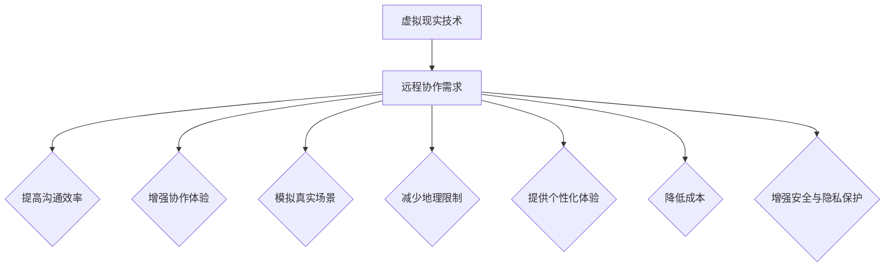
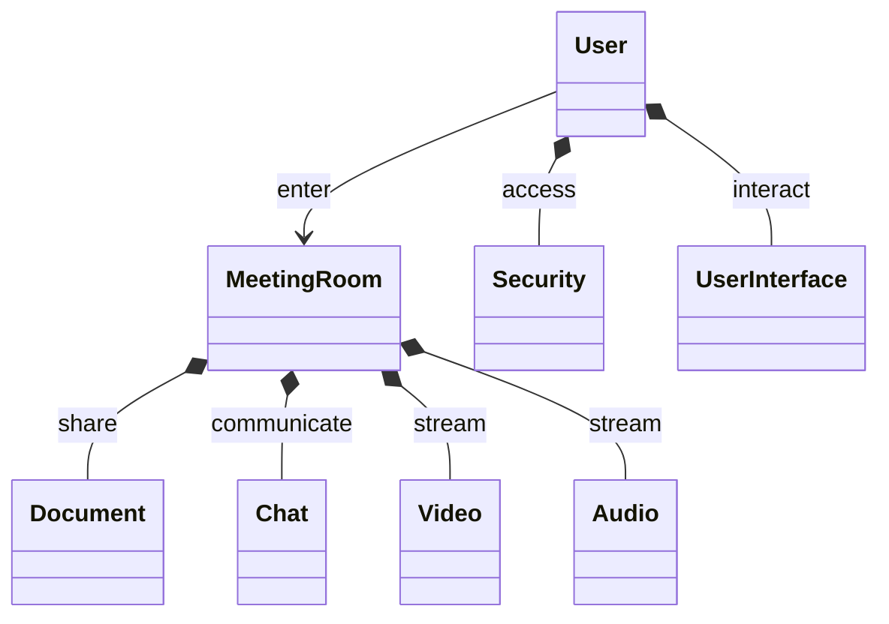
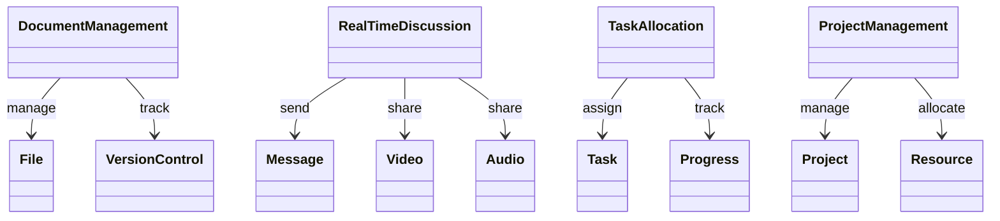

                 

### 虚拟现实在远程协作办公中的创新应用

> 关键词：虚拟现实、远程协作办公、创新应用、用户体验优化、架构设计

> 摘要：本文旨在探讨虚拟现实技术在远程协作办公中的创新应用。通过详细介绍虚拟现实技术的基础知识，分析远程协作办公的现状与挑战，以及虚拟现实技术的潜在价值，文章将深入探讨虚拟现实远程会议系统、虚拟现实协作工作空间、虚拟现实培训与教育、虚拟现实团队管理与协作等应用场景，并提出未来展望。本文旨在为读者提供一个全面而深入的理解，展示虚拟现实技术在远程协作办公中的巨大潜力和广阔前景。

#### 第一部分：引言与背景介绍

#### 第1章：引言

#### 1.1 问题背景

在当今全球化的时代，远程协作办公已成为企业运营的重要形式。随着信息技术的发展，远程协作工具如视频会议、即时通讯、文档共享等得到了广泛应用。然而，传统的远程协作方式仍然存在许多局限性，如沟通障碍、协作效率低、缺乏真实感等。

#### 1.2 问题描述

为了解决远程协作办公中的问题，我们需要寻找新的解决方案。虚拟现实（VR）技术作为一种新兴的技术手段，具有沉浸式体验、实时交互、空间感知等特点，为远程协作提供了全新的可能。

#### 1.3 问题解决

本文将从以下几个方面探讨虚拟现实在远程协作办公中的应用：

1. **虚拟现实远程会议系统**：探讨虚拟现实远程会议系统的架构设计与实现技术，以及如何优化用户体验。
2. **虚拟现实协作工作空间**：分析虚拟现实协作工作空间的构建方法、功能模块，以及其实践案例。
3. **虚拟现实培训与教育**：介绍虚拟现实培训与教育的发展趋势、应用场景，以及教学设计。
4. **虚拟现实团队管理与协作**：探讨虚拟现实团队管理的挑战、策略，以及实践案例。
5. **虚拟现实远程协作办公的创新应用**：展望虚拟现实远程协作办公的未来发展方向。

#### 1.4 边界与外延

本文主要关注虚拟现实技术在远程协作办公中的应用，但不涉及虚拟现实技术本身的研究与开发。

#### 1.5 概念结构与核心要素组成

本文的核心概念包括虚拟现实、远程协作办公、沉浸式体验、实时交互等。核心要素包括虚拟现实远程会议系统、虚拟现实协作工作空间、虚拟现实培训与教育等。

#### 第2章：虚拟现实技术基础

#### 2.1 虚拟现实定义与特点

虚拟现实（Virtual Reality，VR）是一种通过计算机技术模拟出的一种三维空间环境，用户可以通过头戴显示器（HMD）、手柄等设备进入这个虚拟环境，进行交互和体验。

#### 2.2 虚拟现实核心技术

虚拟现实的核心技术包括三维建模、图像处理、传感器技术、实时渲染等。

#### 2.3 虚拟现实与远程协作的关系

虚拟现实技术为远程协作提供了更加沉浸式、互动性的体验，有助于提升协作效率，增强团队凝聚力。

#### 第3章：远程协作办公现状分析

#### 3.1 远程协作办公的发展历程

远程协作办公的发展历程可以分为几个阶段，包括电子邮件、即时通讯、视频会议等。

#### 3.2 当前远程协作办公面临的挑战

当前远程协作办公面临的主要挑战包括沟通障碍、协作效率低、缺乏真实感等。

#### 3.3 虚拟现实在远程协作办公中的潜在价值

虚拟现实技术在远程协作办公中的潜在价值包括：

1. **提升沟通效率**：通过沉浸式体验，使沟通更加直观、有效。
2. **提高协作效率**：通过实时交互和空间感知，使协作更加高效。
3. **增强团队凝聚力**：通过虚拟空间中的互动，增强团队成员之间的联系。

#### 第二部分：虚拟现实在远程协作办公中的应用

#### 第4章：虚拟现实远程会议系统

#### 4.1 虚拟现实远程会议系统的架构设计

虚拟现实远程会议系统的架构设计主要包括以下几个部分：

1. **用户界面**：提供用户交互的界面，包括登录、注册、会议创建、加入会议等功能。
2. **会议空间**：创建虚拟的会议室，提供沉浸式的会议环境。
3. **音频视频处理**：处理音频和视频信号，实现实时传输和交互。
4. **数据存储与管理**：存储会议记录、文档、聊天记录等数据。

#### 4.2 虚拟现实远程会议系统的实现技术

虚拟现实远程会议系统的实现技术包括：

1. **三维建模**：使用三维建模软件创建虚拟会议室的模型。
2. **图像处理**：使用图像处理技术优化视频和图像质量。
3. **传感器技术**：使用传感器技术检测用户的动作和位置，实现实时交互。
4. **实时渲染**：使用实时渲染技术渲染虚拟场景，实现沉浸式体验。

#### 4.3 虚拟现实远程会议系统的用户体验优化

为了提升虚拟现实远程会议系统的用户体验，可以从以下几个方面进行优化：

1. **界面设计**：设计简洁、直观的界面，使用户易于操作。
2. **交互方式**：提供多样化的交互方式，如手势、语音等。
3. **音频视频质量**：优化音频和视频传输质量，减少延迟和卡顿。
4. **虚拟场景设计**：设计丰富的虚拟场景，提供沉浸式的体验。

#### 第5章：虚拟现实协作工作空间

#### 5.1 虚拟现实协作工作空间的构建

虚拟现实协作工作空间的构建主要包括以下几个步骤：

1. **需求分析**：确定协作工作空间的功能需求，如文档共享、实时讨论、任务分配等。
2. **三维建模**：创建三维模型，构建虚拟工作空间。
3. **功能模块开发**：开发协作工作空间的功能模块，如文档管理、任务分配、实时讨论等。
4. **系统集成**：将各个功能模块集成到一个统一的系统中。

#### 5.2 虚拟现实协作工作空间的功能模块

虚拟现实协作工作空间的功能模块主要包括：

1. **文档管理**：提供文档的存储、共享、编辑等功能。
2. **实时讨论**：提供实时沟通和讨论的功能，支持文本、语音、视频等多种形式。
3. **任务分配**：提供任务分配和跟踪的功能，支持任务创建、指派、更新等操作。
4. **项目管理**：提供项目管理功能，支持项目创建、进度跟踪、成员协作等操作。

#### 5.3 虚拟现实协作工作空间的实践案例

虚拟现实协作工作空间的实践案例包括：

1. **虚拟办公室**：模拟真实办公室的场景，提供团队成员之间的协作空间。
2. **虚拟会议室**：提供虚拟的会议室，支持远程会议和讨论。
3. **虚拟培训室**：提供虚拟的培训环境，支持在线培训和教学。

#### 第6章：虚拟现实培训与教育

#### 6.1 虚拟现实培训与教育的发展趋势

虚拟现实培训与教育的发展趋势包括：

1. **个性化学习**：通过虚拟现实技术提供个性化的学习体验。
2. **沉浸式教学**：通过沉浸式体验提高学生的学习兴趣和参与度。
3. **实践操作**：通过虚拟现实技术提供实践操作的机会，提高学生的实际操作能力。

#### 6.2 虚拟现实培训与教育的应用场景

虚拟现实培训与教育的应用场景包括：

1. **职业教育**：提供职业技能培训，如机械操作、焊接、编程等。
2. **高等教育**：提供虚拟实验室、虚拟课堂等教学资源，提高教学质量。
3. **在线学习**：提供虚拟学习环境，支持在线学习、讨论和互动。

#### 6.3 虚拟现实培训与教育的教学设计

虚拟现实培训与教育的教学设计包括以下几个方面：

1. **课程内容设计**：根据培训需求设计合适的课程内容。
2. **教学方式设计**：选择合适的虚拟现实教学方式，如模拟操作、互动教学等。
3. **评估与反馈**：设计评估体系，对学生的学习效果进行评估，并根据反馈进行改进。

#### 第7章：虚拟现实团队管理与协作

#### 7.1 虚拟现实团队管理的挑战

虚拟现实团队管理面临的挑战包括：

1. **远程协作**：如何有效地管理远程团队，确保团队成员之间的沟通和协作。
2. **技能培养**：如何培养团队成员的虚拟现实技术能力和团队协作能力。
3. **项目管理**：如何有效地管理虚拟现实项目，确保项目进度和质量。

#### 7.2 虚拟现实团队管理的策略

虚拟现实团队管理的策略包括：

1. **明确目标**：明确团队的目标和任务，确保团队成员明确自己的职责和任务。
2. **沟通与协作**：建立有效的沟通机制，确保团队成员之间的沟通和协作。
3. **技能培养**：提供培训和指导，帮助团队成员提高虚拟现实技术能力和团队协作能力。

#### 7.3 虚拟现实团队协作的实践案例

虚拟现实团队协作的实践案例包括：

1. **虚拟现实项目开发**：通过虚拟现实技术进行项目开发，团队成员在虚拟空间中协作。
2. **虚拟现实市场推广**：通过虚拟现实技术进行市场推广，团队成员在虚拟空间中讨论和策划。
3. **虚拟现实教育培训**：通过虚拟现实技术进行教育培训，团队成员在虚拟空间中学习和互动。

#### 第三部分：创新应用与未来展望

#### 第8章：虚拟现实远程协作办公的创新应用

#### 8.1 虚拟现实虚拟旅行

虚拟现实虚拟旅行是一种创新应用，通过虚拟现实技术模拟出真实世界的景点和环境，用户可以在虚拟世界中体验旅行。

#### 8.2 虚拟现实社交互动

虚拟现实社交互动是一种创新应用，通过虚拟现实技术实现用户之间的实时互动和社交，提供更加丰富的社交体验。

#### 8.3 虚拟现实项目管理

虚拟现实项目管理是一种创新应用，通过虚拟现实技术提供项目管理工具，支持项目规划、执行、监控等各个环节。

#### 第9章：虚拟现实远程协作办公的未来展望

#### 9.1 技术发展趋势

虚拟现实远程协作办公的未来发展趋势包括：

1. **技术成熟度**：随着虚拟现实技术的不断成熟，其在远程协作办公中的应用将越来越广泛。
2. **用户体验优化**：随着用户对虚拟现实技术的接受度提高，用户体验将得到进一步优化。
3. **商业模式创新**：虚拟现实远程协作办公的商业模式将不断创新，为企业和用户带来更多价值。

#### 9.2 商业模式创新

虚拟现实远程协作办公的商业模式创新包括：

1. **订阅模式**：通过订阅模式为用户提供虚拟现实远程协作服务，实现持续收益。
2. **SaaS模式**：通过SaaS模式为中小企业提供虚拟现实远程协作解决方案，降低使用门槛。
3. **定制化服务**：根据用户需求提供定制化的虚拟现实远程协作服务，满足个性化需求。

#### 9.3 社会影响与挑战

虚拟现实远程协作办公的社会影响与挑战包括：

1. **技术接受度**：如何提高用户对虚拟现实技术的接受度，推动其广泛应用。
2. **隐私保护**：如何保护用户隐私，确保虚拟现实远程协作办公的安全性。
3. **法律法规**：如何制定相应的法律法规，规范虚拟现实远程协作办公的行为。

#### 第10章：总结与展望

#### 10.1 主要成果与贡献

本文主要成果与贡献包括：

1. **全面介绍虚拟现实在远程协作办公中的应用**：通过详细介绍虚拟现实技术的基础知识、应用场景和未来展望，为读者提供了一个全面而深入的理解。
2. **探讨创新应用与未来趋势**：分析虚拟现实远程协作办公的创新应用，展望其未来发展趋势，为企业和用户提供有益的参考。

#### 10.2 研究局限与未来工作方向

本文的研究局限包括：

1. **虚拟现实技术的快速发展**：虚拟现实技术更新速度快，本文可能无法涵盖最新的研究成果和应用。
2. **应用场景的局限性**：本文主要关注虚拟现实在远程协作办公中的应用，可能无法涵盖其在其他领域的应用。

未来工作方向包括：

1. **深入研究虚拟现实技术的应用**：继续关注虚拟现实技术的最新动态，深入研究其在各个领域的应用。
2. **拓展应用场景**：探讨虚拟现实技术在其他领域的应用，如教育培训、医疗健康等。
3. **优化用户体验**：进一步提升虚拟现实远程协作办公的用户体验，提高其应用价值。

### 作者信息

**作者：** AI天才研究院/AI Genius Institute & 禅与计算机程序设计艺术 /Zen And The Art of Computer Programming

---

## 文章内容（10000-12000字）

### 第一部分：引言与背景介绍

#### 引言

在信息时代，远程协作办公已成为企业运营的重要形式。随着全球化的推进和互联网技术的普及，远程协作办公的需求日益增长。然而，传统的远程协作方式存在沟通障碍、协作效率低、缺乏真实感等问题，难以满足企业和用户的需求。为了解决这些问题，虚拟现实（Virtual Reality，VR）技术作为一种新兴的技术手段，为远程协作办公带来了新的可能。

本文旨在探讨虚拟现实技术在远程协作办公中的创新应用。通过详细介绍虚拟现实技术的基础知识，分析远程协作办公的现状与挑战，以及虚拟现实技术的潜在价值，本文将深入探讨虚拟现实远程会议系统、虚拟现实协作工作空间、虚拟现实培训与教育、虚拟现实团队管理与协作等应用场景，并提出未来展望。本文旨在为读者提供一个全面而深入的理解，展示虚拟现实技术在远程协作办公中的巨大潜力和广阔前景。

#### 问题背景

远程协作办公是指在异地或异国的企业、团队或个人之间通过互联网等通信技术进行协作和工作的一种工作模式。随着全球化进程的加快和信息技术的快速发展，远程协作办公逐渐成为一种主流的工作方式。根据相关数据，全球远程办公的人数已经超过2亿，其中许多企业已经开始将其作为常规工作模式。

尽管远程协作办公带来了许多好处，如降低企业运营成本、提高员工灵活性、增强团队协作等，但传统的远程协作方式也存在一些问题。首先，沟通障碍是一个重要问题。由于地理位置的分离，团队成员之间的沟通变得复杂，信息传递效率低下，容易导致误解和冲突。其次，协作效率低也是一个突出问题。传统的远程协作工具如电子邮件、即时通讯、视频会议等虽然提供了基本的协作功能，但在实际应用中往往存在操作繁琐、交互不便等问题，影响了协作效率。最后，缺乏真实感也是一个重要问题。远程协作办公往往缺乏面对面的互动和真实的工作环境，使得员工在工作中感受到的团队归属感和工作热情受到影响。

#### 问题描述

为了解决远程协作办公中的沟通障碍、协作效率低和缺乏真实感等问题，我们需要寻找新的解决方案。虚拟现实（VR）技术作为一种新兴的技术手段，具有沉浸式体验、实时交互、空间感知等特点，为远程协作提供了全新的可能。虚拟现实技术通过创建一个三维的虚拟环境，用户可以在这个环境中进行互动和体验，从而弥补了传统远程协作方式中存在的缺陷。

本文将探讨虚拟现实技术在远程协作办公中的应用，包括以下几个方面：

1. **虚拟现实远程会议系统**：探讨虚拟现实远程会议系统的架构设计与实现技术，以及如何优化用户体验。
2. **虚拟现实协作工作空间**：分析虚拟现实协作工作空间的构建方法、功能模块，以及其实践案例。
3. **虚拟现实培训与教育**：介绍虚拟现实培训与教育的发展趋势、应用场景，以及教学设计。
4. **虚拟现实团队管理与协作**：探讨虚拟现实团队管理的挑战、策略，以及实践案例。
5. **虚拟现实远程协作办公的创新应用**：展望虚拟现实远程协作办公的未来发展方向。

通过以上探讨，本文旨在为远程协作办公提供一种新的解决方案，提升协作效率、增强团队凝聚力，从而为企业带来更大的价值。

#### 问题解决

虚拟现实（VR）技术的出现为远程协作办公提供了新的解决方案，通过以下几个方面可以有效地解决远程协作办公中的问题：

1. **沉浸式体验**：虚拟现实技术能够创建一个三维的虚拟环境，用户可以在这个环境中自由移动、互动和体验。这种沉浸式体验可以弥补传统远程协作方式中缺乏真实感的缺陷，使员工在虚拟环境中感受到真实的工作氛围，从而增强工作热情和团队归属感。

2. **实时交互**：虚拟现实技术支持实时交互，用户可以在虚拟环境中与其他团队成员实时沟通、交流意见和反馈。这种实时交互可以大大提高沟通效率，减少信息传递中的误解和冲突，同时也能增强团队成员之间的互动和协作。

3. **空间感知**：虚拟现实技术能够提供空间感知，用户可以在虚拟环境中感受到空间的变化和位置的变化，这种空间感知可以帮助团队成员更好地理解工作环境和任务分配，从而提高协作效率。

4. **丰富的功能模块**：虚拟现实协作系统可以集成多种功能模块，如文档共享、实时讨论、任务分配等，这些功能模块可以提供一站式服务，满足团队成员在远程协作中的各种需求。

5. **个性化定制**：虚拟现实技术可以根据用户的需求和偏好进行个性化定制，提供个性化的虚拟工作空间和交互方式，从而提高用户的体验和满意度。

通过以上解决方案，虚拟现实技术可以有效地解决远程协作办公中的沟通障碍、协作效率低和缺乏真实感等问题，为企业和员工带来更大的价值。

#### 边界与外延

在探讨虚拟现实技术在远程协作办公中的应用时，我们需要明确几个边界与外延的概念：

1. **边界**：本文主要关注虚拟现实技术在远程协作办公中的应用，即如何通过虚拟现实技术提升远程协作的效率、增强团队凝聚力。不包括虚拟现实技术本身的研究与开发，如三维建模、图像处理、传感器技术等。

2. **外延**：本文不仅关注虚拟现实技术本身的应用，还探讨其与其他技术的结合，如人工智能、大数据等，以期为远程协作办公提供更全面的解决方案。

3. **应用场景**：本文将主要探讨虚拟现实技术在以下场景中的应用：
   - 远程会议系统
   - 协作工作空间
   - 培训与教育
   - 团队管理与协作
   - 创新应用

4. **技术发展**：本文将探讨虚拟现实技术目前的发展状况，以及未来可能的发展趋势，为远程协作办公提供前瞻性指导。

5. **商业价值**：本文还将探讨虚拟现实技术在远程协作办公中的商业价值，以及如何通过商业模式创新为企业带来更多收益。

通过以上边界与外延的明确，本文旨在为读者提供一个全面而深入的探讨，展示虚拟现实技术在远程协作办公中的潜力和价值。

#### 概念结构与核心要素组成

为了更好地理解虚拟现实在远程协作办公中的应用，我们需要明确几个核心概念和其组成要素：

1. **虚拟现实（VR）**：
   - **定义**：虚拟现实是一种通过计算机技术模拟出的一种三维空间环境，用户可以通过头戴显示器（HMD）、手柄等设备进入这个虚拟环境，进行交互和体验。
   - **特点**：沉浸式体验、实时交互、空间感知、高度自由度。
   - **应用**：虚拟现实技术可以应用于游戏、娱乐、教育、医疗等多个领域，本文主要关注其在远程协作办公中的应用。

2. **远程协作办公**：
   - **定义**：远程协作办公是指企业或团队通过互联网等通信技术，在异地或异国的企业、团队或个人之间进行协作和工作。
   - **核心要素**：沟通、协作、效率、真实感。
   - **挑战**：沟通障碍、协作效率低、缺乏真实感。

3. **沉浸式体验**：
   - **定义**：沉浸式体验是一种让用户感觉仿佛置身于虚拟环境中的体验，通过视觉、听觉、触觉等多种感官的刺激，使用户完全沉浸在虚拟环境中。
   - **作用**：提升用户在远程协作办公中的真实感，增强工作热情和团队归属感。

4. **实时交互**：
   - **定义**：实时交互是指用户在虚拟环境中与其他用户进行实时沟通、交流意见和反馈。
   - **作用**：提高远程协作办公的沟通效率，减少信息传递中的误解和冲突。

5. **空间感知**：
   - **定义**：空间感知是指用户在虚拟环境中对空间变化和位置变化的感知。
   - **作用**：帮助团队成员更好地理解工作环境和任务分配，提高协作效率。

通过以上概念和核心要素的阐述，我们可以更加清晰地理解虚拟现实在远程协作办公中的应用，为后续章节的详细探讨打下基础。

### 第二部分：虚拟现实技术基础

#### 第2章：虚拟现实技术基础

#### 2.1 虚拟现实定义与特点

虚拟现实（Virtual Reality，VR）是一种通过计算机技术模拟出的一种三维空间环境，用户可以通过头戴显示器（HMD）、手柄等设备进入这个虚拟环境，进行交互和体验。虚拟现实技术具有以下几个显著特点：

1. **沉浸式体验**：虚拟现实技术通过三维建模、实时渲染等技术，为用户创造一个高度逼真的虚拟环境，使用户感觉仿佛置身于现实世界中。这种沉浸式体验可以极大地提升用户的感知和参与度。

2. **实时交互**：虚拟现实技术支持用户在虚拟环境中与其他用户或物体进行实时交互，如手势、语音、动作等。这种实时交互增强了用户在虚拟环境中的互动性和控制感。

3. **空间感知**：虚拟现实技术通过头戴显示器、传感器等设备，为用户提供了空间感知能力。用户可以在虚拟环境中自由移动、旋转、探索，感受到空间的变化和位置的变化。

4. **高度自由度**：虚拟现实技术为用户提供了高度自由的环境，用户可以在虚拟环境中自由选择交互方式、探索路径、进行任务操作等。这种自由度使得用户能够更加灵活地完成各种任务。

虚拟现实技术的这些特点使其在远程协作办公中具有巨大的潜力，能够解决传统远程协作方式中的沟通障碍、协作效率低和缺乏真实感等问题。

#### 2.2 虚拟现实核心技术

虚拟现实技术的实现依赖于多种核心技术的支持，以下列举了其中几种关键技术：

1. **三维建模**：三维建模是虚拟现实技术的基础，通过三维建模软件，可以创建出虚拟环境中的各种物体、场景和角色。三维建模技术包括几何建模、纹理映射、光照计算等。

2. **图像处理**：图像处理技术用于优化虚拟环境中的图像质量，包括图像压缩、去噪、增强等。图像处理技术能够提高虚拟现实体验的视觉质量，减少视觉疲劳。

3. **传感器技术**：传感器技术用于检测用户在虚拟环境中的动作和位置，包括头戴显示器的位置、速度、方向等。传感器技术使得用户能够在虚拟环境中自由移动和交互。

4. **实时渲染**：实时渲染技术用于生成虚拟环境中的图像，实现场景的实时显示。实时渲染技术包括图形渲染管线、光照计算、阴影处理等。

5. **音频处理**：音频处理技术用于模拟虚拟环境中的声音效果，包括空间声效、声音定位等。音频处理技术能够增强用户的沉浸式体验。

6. **网络通信**：网络通信技术用于实现虚拟环境中的实时数据传输和交互。网络通信技术包括实时视频传输、语音传输、数据同步等。

通过这些核心技术的支持，虚拟现实技术能够创建出一个高度逼真的虚拟环境，为用户提供沉浸式体验和实时交互。

#### 2.3 虚拟现实与远程协作的关系

虚拟现实技术与远程协作之间存在密切的关系，通过虚拟现实技术，可以有效地提升远程协作的效率和质量。以下从几个方面分析虚拟现实与远程协作的关系：

1. **提升沟通效率**：虚拟现实技术通过沉浸式体验和实时交互，使得远程协作中的沟通更加直观和有效。用户可以在虚拟环境中实时看到、听到和感受到其他用户的行为和情绪，减少信息传递中的误解和延迟，提高沟通效率。

2. **增强协作体验**：虚拟现实技术为远程协作提供了更加丰富的交互方式，如手势、语音、动作等。这些交互方式使得团队成员在虚拟环境中能够更加自然地进行协作，增强协作体验。

3. **模拟真实场景**：虚拟现实技术可以创建出真实的虚拟工作环境，使得远程协作更加接近现实。团队成员可以在虚拟环境中共同完成任务，如同处一室般的工作体验，增强团队凝聚力和协作效率。

4. **减少地理限制**：虚拟现实技术打破了地理限制，使得远程协作不再受地域和时间的限制。团队成员可以在全球范围内进行协作，不受物理空间的约束，提高了远程协作的灵活性和效率。

5. **提供个性化体验**：虚拟现实技术可以根据用户的需求和偏好进行个性化定制，提供个性化的虚拟工作空间和交互方式。这种个性化体验能够提高用户的满意度和参与度，进一步促进远程协作的效率。

综上所述，虚拟现实技术为远程协作提供了新的可能性，通过沉浸式体验、实时交互和个性化定制，提升了远程协作的效率和质量，为企业和团队带来了更多的价值。

#### 第3章：远程协作办公现状分析

#### 3.1 远程协作办公的发展历程

远程协作办公的发展历程可以追溯到20世纪80年代，当时互联网和电子邮件的出现为远程协作提供了基础。随着信息技术的发展，远程协作工具逐渐丰富和完善，经历了以下几个重要阶段：

1. **电子邮件阶段**：20世纪80年代，电子邮件成为远程协作的主要工具。通过电子邮件，团队成员可以进行文字信息的传递和沟通，实现一定程度上的协作。

2. **即时通讯阶段**：90年代，即时通讯工具如微软的微软即时通讯（MSNMessenger）、雅虎的雅虎即时通讯（Yahoo Messenger）等出现，使得团队成员可以进行实时文字聊天，沟通效率显著提高。

3. **视频会议阶段**：进入21世纪，视频会议技术逐渐成熟，如微软的Lync、思科的WebEx等。视频会议使得团队成员可以通过实时视频和音频进行沟通，拉近了地理距离，增强了协作效果。

4. **协作平台阶段**：近年来，协作平台如Slack、Trello、Asana等成为远程协作的主流工具。这些平台集成了邮件、即时通讯、任务管理、文档共享等多种功能，提供了一站式的协作解决方案，极大地提升了协作效率。

#### 3.2 当前远程协作办公面临的挑战

尽管远程协作办公在信息技术的发展下取得了显著进展，但当前远程协作办公仍面临许多挑战：

1. **沟通障碍**：远程协作中，团队成员之间由于地理位置的分离，沟通变得复杂。信息传递效率低下，容易导致误解和冲突。特别是对于需要高频率互动的团队项目，沟通障碍更加显著。

2. **协作效率低**：传统的远程协作工具如电子邮件、即时通讯和视频会议等，虽然提供了基本的协作功能，但在实际应用中往往存在操作繁琐、交互不便等问题，影响了协作效率。

3. **缺乏真实感**：远程协作办公往往缺乏面对面的互动和真实的工作环境，使得员工在工作中感受到的团队归属感和工作热情受到影响。这种缺乏真实感的体验可能导致团队成员的参与度和积极性降低。

4. **技术依赖性**：远程协作办公高度依赖网络和通信技术，一旦网络不稳定或技术故障，将严重影响协作效果。特别是在偏远地区或网络基础设施薄弱的地区，远程协作的困难更大。

5. **安全与隐私问题**：随着远程协作的普及，数据安全和隐私问题日益突出。远程协作过程中，大量的敏感数据在网络上传输，容易成为黑客攻击的目标。同时，如何确保员工的隐私不受侵犯也是一个重要问题。

6. **管理难度增加**：远程团队的管理比传统团队更加复杂。团队成员分散在不同地点，管理难度增加。如何确保团队成员之间的协调一致、工作进度和质量控制，成为远程团队管理的挑战。

#### 3.3 虚拟现实在远程协作办公中的潜在价值

虚拟现实技术为远程协作办公提供了全新的解决方案，具有以下潜在价值：

1. **提升沟通效率**：虚拟现实技术通过沉浸式体验和实时交互，使得远程协作中的沟通更加直观和有效。用户可以在虚拟环境中实时看到、听到和感受到其他用户的行为和情绪，减少信息传递中的误解和延迟，提高沟通效率。

2. **增强协作体验**：虚拟现实技术为远程协作提供了更加丰富的交互方式，如手势、语音、动作等。这些交互方式使得团队成员在虚拟环境中能够更加自然地进行协作，增强协作体验。

3. **模拟真实场景**：虚拟现实技术可以创建出真实的虚拟工作环境，使得远程协作更加接近现实。团队成员可以在虚拟环境中共同完成任务，如同处一室般的工作体验，增强团队凝聚力和协作效率。

4. **减少地理限制**：虚拟现实技术打破了地理限制，使得远程协作不再受地域和时间的限制。团队成员可以在全球范围内进行协作，不受物理空间的约束，提高了远程协作的灵活性和效率。

5. **提供个性化体验**：虚拟现实技术可以根据用户的需求和偏好进行个性化定制，提供个性化的虚拟工作空间和交互方式。这种个性化体验能够提高用户的满意度和参与度，进一步促进远程协作的效率。

6. **降低成本**：虚拟现实技术可以减少团队成员的旅行需求，降低差旅成本。同时，虚拟现实培训和教育可以节省实体培训的费用，提高培训效果。

7. **增强安全与隐私保护**：虚拟现实技术提供了更为安全的数据传输和存储解决方案，通过加密和身份验证等手段，确保数据安全和隐私保护。

通过以上潜在价值的探讨，我们可以看到虚拟现实技术在远程协作办公中具有巨大的应用前景，有望解决当前远程协作办公面临的各种挑战，提升协作效率和质量。

### 第二部分：虚拟现实在远程协作办公中的应用

#### 第4章：虚拟现实远程会议系统

#### 4.1 虚拟现实远程会议系统的架构设计

虚拟现实远程会议系统是一种利用虚拟现实技术实现的远程会议解决方案，旨在通过虚拟环境提高会议的沉浸感和互动性。该系统的架构设计主要包括以下几个核心部分：

1. **用户界面**：用户界面是用户与虚拟现实远程会议系统进行交互的入口，包括登录、注册、会议创建、加入会议等功能。用户可以通过用户界面方便地发起会议、邀请参会者，并在会议中查看会议日程、会议记录等。

2. **会议空间**：会议空间是虚拟现实远程会议系统的核心组成部分，用于模拟实际的会议室环境。会议空间应具备以下功能：
   - **虚拟场景构建**：通过三维建模技术，创建出逼真的会议室场景，包括墙壁、桌椅、投影仪等设备。
   - **环境氛围营造**：通过图像处理和音频处理技术，营造逼真的会议环境氛围，如自然光、声音效果等。
   - **实时互动**：支持用户在虚拟会议空间中的实时互动，包括手势、表情、语音等。

3. **音频视频处理**：音频视频处理模块负责处理会议中的音频和视频信号，实现实时传输和交互。该模块应具备以下功能：
   - **音频处理**：对会议中的音频信号进行降噪、回声消除、音量调节等处理，确保音频清晰无干扰。
   - **视频处理**：对会议中的视频信号进行压缩、分辨率调整、实时传输等处理，保证视频流畅不卡顿。

4. **数据存储与管理**：数据存储与管理模块用于存储会议记录、文档、聊天记录等数据，并提供数据备份和恢复功能。该模块应具备以下功能：
   - **数据存储**：将会议过程中的各类数据（如音频、视频、文档、聊天记录等）存储在数据库中，便于后续查询和回顾。
   - **数据备份与恢复**：定期备份会议数据，确保数据的安全性和完整性，并在需要时能够快速恢复。

5. **安全与隐私保护**：虚拟现实远程会议系统需要确保用户数据的安全性和隐私性，采取以下措施：
   - **加密传输**：采用加密算法对用户数据进行传输，防止数据在传输过程中被窃取或篡改。
   - **身份验证**：通过用户名和密码、双因素验证等方式进行身份验证，确保只有授权用户可以访问系统。
   - **访问控制**：对用户数据设置访问权限，防止未授权用户访问敏感数据。

通过以上架构设计，虚拟现实远程会议系统可以为用户提供一个高效、安全、沉浸式的远程会议体验，有效解决传统远程会议中存在的沟通障碍和协作效率低等问题。

#### 4.2 虚拟现实远程会议系统的实现技术

虚拟现实远程会议系统的实现技术涉及多个方面，包括三维建模、图像处理、音频视频处理、实时渲染、网络通信等。以下将详细讨论这些核心技术的应用及其实现方法。

1. **三维建模**：三维建模是虚拟现实远程会议系统的基础，用于创建虚拟会议室的场景。具体实现方法包括：
   - **场景建模**：使用三维建模软件（如Blender、Maya等）创建虚拟会议室的模型，包括墙壁、桌椅、投影仪等设备。
   - **细节渲染**：通过纹理映射、光照计算等技术，为虚拟会议室添加细节和真实感，如墙纸、投影仪的光线效果等。

2. **图像处理**：图像处理技术用于优化虚拟会议室的图像质量，包括图像压缩、去噪、增强等。具体实现方法包括：
   - **图像压缩**：采用图像压缩算法（如H.264、H.265等），降低图像数据传输的带宽要求，提高传输效率。
   - **去噪与增强**：通过图像去噪算法（如中值滤波、高斯滤波等）和图像增强算法（如直方图均衡、对比度增强等），提高图像的清晰度和对比度，减少图像噪点。

3. **音频处理**：音频处理技术用于处理会议中的音频信号，包括降噪、回声消除、音量调节等。具体实现方法包括：
   - **降噪**：采用降噪算法（如谱减法、波束形成等），消除会议中的背景噪声，提高音频的清晰度。
   - **回声消除**：通过回声消除算法（如双音压缩、自适应滤波等），消除会议中的回声，提高音频的清晰度和舒适度。
   - **音量调节**：根据参会者的音量和距离，自动调整音频的音量，确保所有参会者都能听到清晰的语音。

4. **实时渲染**：实时渲染技术用于生成虚拟会议室的场景图像，实现实时显示。具体实现方法包括：
   - **图形渲染管线**：采用图形渲染管线（如DirectX、OpenGL等）进行图像渲染，实现场景的实时显示。
   - **光照计算**：通过光照计算（如物理光照模型、光照贴图等），为场景中的物体添加真实的光照效果。

5. **网络通信**：网络通信技术用于实现虚拟会议室中音频、视频和数据的实时传输和交互。具体实现方法包括：
   - **实时视频传输**：采用实时视频传输协议（如RTP、RTCP等），实现会议中视频信号的实时传输和接收。
   - **实时音频传输**：采用实时音频传输协议（如RTP、RTCP等），实现会议中音频信号的实时传输和接收。
   - **数据同步**：通过数据同步技术（如一致性算法、冲突检测等），确保会议中音频、视频和数据的一致性和同步。

6. **传感器技术**：传感器技术用于检测用户在虚拟环境中的动作和位置，实现实时交互。具体实现方法包括：
   - **位置跟踪**：使用位置跟踪传感器（如陀螺仪、加速度计等），实时检测用户的头戴显示器（HMD）的位置和方向。
   - **手势识别**：使用手势识别传感器（如深度相机、手势识别算法等），实时识别用户的手势，实现虚拟环境中的手势交互。

通过以上实现技术的综合应用，虚拟现实远程会议系统可以提供高效、沉浸式的远程会议体验，满足用户在远程协作中的多样化需求。

#### 4.3 虚拟现实远程会议系统的用户体验优化

虚拟现实远程会议系统的用户体验优化是提升系统应用价值的关键。以下从界面设计、交互方式、音频视频质量、虚拟场景设计等多个方面，探讨用户体验优化的具体策略和实现方法。

1. **界面设计**：界面设计的简洁性和直观性对用户体验至关重要。优化策略包括：
   - **简洁明了**：界面设计应遵循“简洁明了”的原则，避免过多的按钮和功能，确保用户能够快速找到所需功能。
   - **美观易用**：界面设计应注重美观和易用性，采用友好的色彩搭配和图标设计，提升用户的使用舒适度。

2. **交互方式**：虚拟现实远程会议系统应提供多样化的交互方式，以满足用户的不同需求。优化策略包括：
   - **手势交互**：通过手势识别技术，实现用户在虚拟环境中的手势操作，如手势控制摄像头、切换会议模式等。
   - **语音交互**：通过语音识别和语音合成技术，实现用户在虚拟环境中的语音控制和语音反馈，如语音开启会议、语音发送消息等。

3. **音频视频质量**：音频视频质量对用户体验至关重要。优化策略包括：
   - **音频降噪**：采用音频降噪技术，消除会议中的背景噪声，提高音频的清晰度。
   - **视频压缩**：采用高效的视频压缩算法，降低视频数据传输的带宽要求，提高视频的流畅度。
   - **自适应流媒体**：采用自适应流媒体技术，根据网络带宽和用户设备性能，动态调整视频的播放质量。

4. **虚拟场景设计**：虚拟场景设计应注重真实感和沉浸感。优化策略包括：
   - **环境细节**：通过增加环境细节和装饰，提升虚拟场景的真实感，如添加墙纸、装饰品等。
   - **动态效果**：通过动态效果（如光照变化、动画等），提升虚拟场景的沉浸感，如虚拟会议室中的自然光照、投影动画等。

5. **实时互动**：实时互动功能是虚拟现实远程会议系统的核心优势。优化策略包括：
   - **实时聊天**：提供实时聊天功能，支持用户在会议中发送文字、图片、表情等消息，增强互动性。
   - **实时共享**：支持用户在会议中实时共享文档、PPT、代码等文件，方便团队成员协作。
   - **实时投票**：提供实时投票功能，支持用户在会议中进行投票，快速达成共识。

通过以上用户体验优化策略，虚拟现实远程会议系统可以提供高效、沉浸式的远程会议体验，提升用户的满意度和使用粘性，为企业带来更大的价值。

### 第5章：虚拟现实协作工作空间

#### 5.1 虚拟现实协作工作空间的构建

虚拟现实协作工作空间是虚拟现实技术在远程协作办公中的重要应用之一，它提供了一个沉浸式、互动性强的虚拟环境，使团队成员能够更高效地协作。构建虚拟现实协作工作空间通常包括以下几个关键步骤：

1. **需求分析**：首先，需要明确协作工作空间的功能需求，如文档共享、实时讨论、任务分配、项目管理等。通过与团队成员沟通，收集他们的需求和建议，为后续的设计和开发提供依据。

2. **三维建模**：使用三维建模软件（如Blender、Maya等），创建虚拟工作空间的场景。根据需求分析的结果，设计虚拟办公室、会议室、培训室等场景，包括墙壁、桌椅、设备、装饰等元素。

3. **功能模块开发**：根据需求分析，开发虚拟协作工作空间的功能模块。这些功能模块包括文档管理、实时讨论、任务分配、项目管理等。每个功能模块都需要进行详细的设计和开发，确保其能够正常运行并满足用户需求。

4. **系统集成**：将各个功能模块集成到一个统一的系统中。系统集成不仅要确保各个模块之间的数据交互和功能调用正常，还要保证系统的整体性能和用户体验。

5. **测试与优化**：在系统开发完成后，进行全面的测试和优化。测试包括功能测试、性能测试、安全测试等，确保系统在多种情况下都能稳定运行。根据测试结果，对系统进行优化和改进，提高用户体验。

通过以上步骤，可以构建一个功能完善、用户体验优秀的虚拟现实协作工作空间，为远程协作提供有力支持。

#### 5.2 虚拟现实协作工作空间的功能模块

虚拟现实协作工作空间的功能模块是确保远程协作顺利进行的核心。以下介绍几个主要的功能模块及其具体内容：

1. **文档管理**：文档管理模块用于帮助团队成员共享、编辑和存储文档。具体功能包括：
   - **文档上传与下载**：支持团队成员上传和下载文档，方便文件共享。
   - **文档编辑与协作**：提供在线编辑功能，允许多个团队成员同时编辑同一文档，实时更新内容。
   - **版本控制**：记录文档的版本历史，方便团队成员查看和回溯文档变化。

2. **实时讨论**：实时讨论模块用于团队成员在虚拟空间中进行实时沟通和交流。具体功能包括：
   - **即时消息**：支持发送即时消息，实时传达信息。
   - **视频聊天**：提供视频聊天功能，支持语音和视频交互，增强沟通效果。
   - **屏幕共享**：支持屏幕共享功能，方便团队成员演示和讲解。

3. **任务分配**：任务分配模块用于帮助团队管理和跟踪任务。具体功能包括：
   - **任务创建与指派**：支持创建任务并指派给团队成员，明确任务责任。
   - **任务进度跟踪**：实时更新任务进度，方便团队成员查看任务状态。
   - **提醒与通知**：为任务截止日期和重要事件发送提醒通知，确保任务按时完成。

4. **项目管理**：项目管理模块用于帮助团队管理和监控项目。具体功能包括：
   - **项目规划**：支持创建项目规划，明确项目目标和里程碑。
   - **进度监控**：实时监控项目进度，确保项目按计划进行。
   - **资源管理**：管理项目所需的资源和人力，确保资源高效利用。

通过这些功能模块，虚拟现实协作工作空间可以提供一站式服务，满足团队成员在远程协作中的各种需求，提高协作效率和团队凝聚力。

#### 5.3 虚拟现实协作工作空间的实践案例

虚拟现实协作工作空间的实践案例展示了虚拟现实技术如何在不同场景中提高远程协作的效率和效果。以下列举几个具有代表性的案例：

1. **虚拟办公室**：某跨国公司使用虚拟现实协作工作空间构建了一个虚拟办公室。团队成员可以通过虚拟现实设备进入虚拟办公室，模拟真实的工作环境。在这里，他们可以实时讨论项目、共享文档、分配任务，提高了团队协作的效率和沟通效果。

2. **虚拟会议室**：某咨询公司采用虚拟现实协作工作空间建立了虚拟会议室。通过虚拟会议室，团队成员可以随时召开会议，进行视频聊天和屏幕共享。这种虚拟会议方式不仅减少了差旅成本，还提高了会议的效率和参与度。

3. **虚拟培训室**：某教育机构利用虚拟现实协作工作空间开设了虚拟培训室。学员可以通过虚拟现实设备参与培训课程，与讲师进行实时互动，观看教学视频、进行实验操作等。这种虚拟培训方式增强了学员的参与感和学习效果。

4. **虚拟项目协作**：某科技公司通过虚拟现实协作工作空间实现了跨部门的项目协作。项目团队成员可以在虚拟环境中共同讨论项目方案、分享设计文档、实时更新项目进度。这种虚拟项目协作方式有效地打破了部门间的壁垒，提高了项目管理的效率和透明度。

通过这些实践案例，我们可以看到虚拟现实协作工作空间在提高远程协作效率、增强团队沟通和协作效果方面具有巨大的潜力。

### 第6章：虚拟现实培训与教育

#### 6.1 虚拟现实培训与教育的发展趋势

虚拟现实（VR）技术在培训与教育领域的应用正日益广泛，其发展趋势表现出以下几个显著特点：

1. **个性化学习**：虚拟现实技术为培训与教育提供了个性化的学习体验。通过VR技术，学员可以根据自己的需求和进度选择学习内容，进行自主学习和实践操作。这种个性化学习方式能够提高学员的学习积极性和效果。

2. **沉浸式教学**：虚拟现实技术能够创建一个高度沉浸的学习环境，使学员在虚拟世界中体验真实场景，感受学习内容的深度和广度。这种沉浸式教学方式能够提高学员的参与度和学习兴趣，增强学习效果。

3. **实践操作**：虚拟现实技术提供了虚拟的实践操作机会，使学员可以在安全、无风险的环境中练习技能和操作。通过反复实践，学员能够更好地掌握知识和技能，提高实际操作能力。

4. **实时互动**：虚拟现实技术支持实时互动，学员可以在虚拟环境中与讲师和其他学员进行实时沟通和讨论，解决学习中的问题和困惑。这种实时互动能够提高学习的互动性和效果。

5. **扩展学习场景**：虚拟现实技术打破了传统学习的地理和物理限制，使学员可以在任何时间、任何地点进行学习。这种灵活的学习方式能够满足不同学员的需求，提高学习资源的利用率。

6. **虚拟实验室**：虚拟现实技术可以创建虚拟实验室，提供丰富的实验资源和操作环境。学员可以在虚拟实验室中进行各种实验，提高实验操作能力和实验数据的准确性。

通过以上发展趋势，我们可以看到虚拟现实技术在培训与教育领域具有巨大的发展潜力，为教育培训提供了全新的方式和手段。

#### 6.2 虚拟现实培训与教育的应用场景

虚拟现实技术在培训与教育领域具有广泛的应用场景，以下列举几个典型的应用场景：

1. **职业教育**：虚拟现实技术可以用于职业教育的培训，如机械操作、焊接、编程等。通过虚拟现实模拟器，学员可以在虚拟环境中进行实践操作，提高操作技能和应对实际工作场景的能力。

2. **高等教育**：虚拟现实技术可以用于高等教育的教学，如物理实验、化学实验、生物实验等。通过虚拟实验室，学生可以在虚拟环境中进行实验操作，提高实验技能和实验数据的准确性。

3. **在线学习**：虚拟现实技术可以用于在线学习平台，提供沉浸式学习体验。学员可以通过VR设备进入虚拟课堂，与讲师和其他学员进行实时互动，提高学习的参与度和效果。

4. **虚拟校园**：虚拟现实技术可以创建虚拟校园，提供虚拟校园导览、课程介绍、学习资源等。学员可以在虚拟校园中了解校园环境、选择课程、获取学习资源，提高学习体验。

5. **技能培训**：虚拟现实技术可以用于各种技能培训，如驾驶培训、消防培训、安全培训等。通过虚拟现实模拟器，学员可以在虚拟环境中进行技能操作和实战演练，提高技能水平。

6. **企业培训**：虚拟现实技术可以用于企业的内部培训，如新员工入职培训、技能提升培训等。通过虚拟现实培训系统，企业可以提供个性化的培训课程，提高培训效果和员工的工作技能。

通过以上应用场景，我们可以看到虚拟现实技术在培训与教育领域具有广泛的应用前景，为教育培训提供了全新的方式和手段。

#### 6.3 虚拟现实培训与教育的教学设计

虚拟现实培训与教育的教学设计是确保虚拟现实培训课程成功实施的关键。以下从课程内容设计、教学方式设计和评估与反馈三个方面，探讨虚拟现实培训与教育的教学设计。

1. **课程内容设计**：课程内容设计是教学设计的核心。在设计虚拟现实培训课程时，应考虑以下几个关键点：
   - **明确培训目标**：根据学员的背景和需求，明确培训的目标和预期成果。如提高操作技能、掌握实验方法等。
   - **课程模块划分**：将培训内容划分为多个模块，每个模块应具有明确的学习目标和内容。如机械操作培训可以划分为基本操作、高级操作、故障处理等模块。
   - **实践操作设计**：设计实践操作环节，使学员能够在虚拟环境中进行实际操作。如通过虚拟实验室进行实验操作，掌握实验技能。
   - **知识传递**：结合虚拟现实技术的特点，通过动画、视频、交互式演示等方式，将理论知识传递给学员，提高学习效果。

2. **教学方式设计**：教学方式设计是教学设计的重点。以下几种教学方式在虚拟现实培训中具有较好的效果：
   - **沉浸式教学**：通过虚拟现实技术创建高度沉浸的学习环境，使学员感受到真实的学习体验。如通过虚拟实验室进行实验操作，提高实验技能。
   - **交互式教学**：通过虚拟现实技术实现学员与讲师、学员与学员之间的实时互动，提高学习的互动性和效果。如通过虚拟课堂进行实时讨论、问答等。
   - **案例教学**：通过虚拟现实技术模拟真实案例，使学员在案例中学习和实践。如通过虚拟企业运营模拟，学习企业管理知识。
   - **游戏化教学**：通过虚拟现实技术实现游戏化学习，提高学员的学习兴趣和积极性。如通过虚拟现实游戏学习编程语言。

3. **评估与反馈**：评估与反馈是教学设计的重要组成部分。以下几种评估方法在虚拟现实培训中具有较好的效果：
   - **过程评估**：在培训过程中，通过实时监测学员的学习进度、操作行为等，评估学员的学习效果。如通过虚拟实验室的监控系统，评估学员的实验操作能力。
   - **测试评估**：通过在线测试、实践操作考核等方式，对学员的知识和技能进行评估。如通过虚拟实验考核，评估学员的实验操作能力。
   - **反馈机制**：建立反馈机制，收集学员对培训课程的意见和建议，及时调整和改进课程内容和方法。如通过在线问卷、反馈表等方式，收集学员的反馈。
   - **持续评估**：在培训结束后，通过跟踪学员的实际工作表现，评估培训的效果和影响。如通过工作表现评估，评估学员的培训效果。

通过以上教学设计，虚拟现实培训与教育可以提供高效、互动、沉浸的学习体验，提高学员的学习效果和满意度。

#### 第7章：虚拟现实团队管理与协作

#### 7.1 虚拟现实团队管理的挑战

虚拟现实团队管理面临许多独特的挑战，这些挑战源于虚拟工作环境的特点和技术要求。以下列举并分析几个主要挑战：

1. **远程协作**：虚拟现实团队通常分布在不同地理位置，团队成员之间的协作需要依赖网络通信技术。然而，网络不稳定、延迟和高带宽需求可能导致协作中断或效率低下。

2. **技能培养**：虚拟现实技术具有较高的技术门槛，团队成员需要具备相应的技能才能有效地使用虚拟现实工具和平台。如何确保团队成员技能不断提升，是团队管理的一个重要挑战。

3. **项目管理**：虚拟现实项目通常涉及复杂的技术实现和多方面的协调。项目管理团队需要确保项目进度、质量和预算得到有效控制，同时要处理项目中出现的各种变更和风险。

4. **安全与隐私**：虚拟现实团队管理需要处理大量的敏感数据和用户信息，如何确保数据安全和用户隐私不被泄露，是团队管理的重要任务。

5. **文化差异**：虚拟现实团队可能由来自不同国家和文化背景的成员组成，文化差异可能影响团队的沟通和协作，需要通过有效的管理策略来克服。

6. **设备与技术维护**：虚拟现实团队需要使用高性能的硬件和软件设备，这些设备的维护和更新需要投入大量资源。同时，技术故障可能影响团队的正常工作，需要建立有效的技术支持体系。

7. **员工参与度**：在虚拟环境中，员工可能会感到缺乏与同事的面对面互动，导致工作热情和参与度下降。如何提高员工的虚拟工作体验，增强团队凝聚力，是团队管理的一个重要挑战。

通过分析以上挑战，我们可以看到虚拟现实团队管理需要综合考虑技术、人员和文化等多个方面，采取有效的策略和措施来应对。

#### 7.2 虚拟现实团队管理的策略

为了有效管理虚拟现实团队，提升团队协作效率和工作质量，以下介绍几种关键策略：

1. **明确目标和职责**：在项目开始前，明确团队的目标和每个成员的具体职责。通过制定详细的任务分配和责任矩阵，确保每个成员了解自己的任务和目标，减少模糊性。

2. **优化沟通机制**：建立高效的沟通机制，确保团队成员之间的信息传递畅通无阻。可以采用多种沟通工具，如即时通讯软件、视频会议系统、项目管理平台等，确保信息及时传达。

3. **技能提升与培训**：定期为团队成员提供技能培训和知识分享，帮助他们不断提升技能和知识水平。可以通过内部培训、外部培训、在线课程等方式，确保团队成员掌握必要的虚拟现实技术。

4. **项目管理工具**：采用专业的项目管理工具，如Jira、Trello等，进行任务跟踪、进度管理和风险控制。这些工具可以帮助团队管理者实时了解项目进展，及时调整计划和资源。

5. **团队文化建设**：通过团队文化建设，增强团队成员之间的凝聚力和归属感。可以定期组织线上或线下团队活动，如虚拟团队建设活动、虚拟聚餐等，促进团队成员之间的交流和互动。

6. **技术支持与维护**：建立完善的技术支持体系，确保虚拟现实设备和系统的稳定运行。可以设立技术支持团队，负责设备维护、软件升级和技术故障处理。

7. **激励机制**：建立激励机制，鼓励团队成员积极参与工作，提高工作积极性和创造力。可以设置项目奖励、绩效奖金、晋升机会等，激发团队成员的潜力。

通过以上策略，虚拟现实团队管理可以更好地应对挑战，提升团队协作效率和工作质量，实现项目目标。

#### 7.3 虚拟现实团队协作的实践案例

虚拟现实团队协作的实践案例展示了在实际应用中如何通过虚拟现实技术提升团队协作效率和工作质量。以下列举几个具有代表性的实践案例：

1. **跨部门项目协作**：某科技公司的研发团队、市场团队和设计团队通过虚拟现实协作平台进行跨部门项目协作。团队成员可以通过虚拟现实环境共享设计文档、实时讨论项目方案，并协同完成设计任务。这种虚拟协作方式有效打破了部门间的壁垒，提高了项目进度和协作效率。

2. **虚拟团队会议**：某咨询公司采用虚拟现实团队会议系统，定期召开虚拟会议。团队成员可以通过虚拟会议室进行视频聊天、屏幕共享和实时讨论，讨论项目进展、解决遇到的问题。这种虚拟会议方式不仅节省了差旅成本，还提高了会议的参与度和效果。

3. **虚拟实验室协作**：某教育机构通过虚拟现实实验室，为不同院系的师生提供实验协作平台。学生们可以在虚拟实验室中共同完成实验项目，实时交流实验心得，并互相协作解决问题。这种虚拟实验方式提高了实验操作的准确性和团队协作能力。

4. **远程医疗团队协作**：某医疗集团通过虚拟现实技术建立远程医疗协作平台，医生们可以在虚拟环境中共同诊断病情、讨论治疗方案。这种虚拟协作方式使远程医疗成为可能，提高了医疗质量和患者满意度。

通过以上实践案例，我们可以看到虚拟现实技术在团队协作中的应用不仅提高了协作效率，还丰富了协作形式，为团队工作带来了新的可能性。

### 第三部分：创新应用与未来展望

#### 第8章：虚拟现实远程协作办公的创新应用

随着虚拟现实技术的不断成熟和应用场景的拓展，虚拟现实在远程协作办公中展现出了丰富的创新应用。以下探讨几种具有代表性的创新应用，以及它们在远程协作办公中的实际效益和潜在挑战。

#### 8.1 虚拟现实虚拟旅行

虚拟现实虚拟旅行是一种通过虚拟现实技术模拟出的旅游体验，用户可以在虚拟环境中体验到真实的旅游场景，如参观名胜古迹、探索自然风光等。这种创新应用在远程协作办公中的实际效益包括：

1. **虚拟团建**：企业可以通过虚拟现实虚拟旅行进行团队建设活动，团队成员在虚拟环境中共同体验旅游乐趣，增强团队凝聚力和归属感。

2. **远程协作**：通过虚拟现实虚拟旅行，团队成员可以在虚拟环境中进行远程会议和讨论，降低差旅成本，提高协作效率。

然而，虚拟现实虚拟旅行在远程协作办公中也面临一些潜在挑战：

1. **技术门槛**：虚拟现实虚拟旅行需要较高技术支持和设备，对于一些中小企业可能存在技术成本高、设备维护困难等问题。

2. **体验真实性**：尽管虚拟现实技术已经相对成熟，但与实际旅行体验相比，虚拟现实虚拟旅行的真实性仍有一定差距，可能影响用户体验。

#### 8.2 虚拟现实社交互动

虚拟现实社交互动是一种通过虚拟现实技术实现的社交体验，用户可以在虚拟环境中与朋友、同事互动，进行社交活动。这种创新应用在远程协作办公中的实际效益包括：

1. **增强社交联系**：虚拟现实社交互动可以帮助团队成员在远程工作期间保持社交联系，缓解孤独感和工作压力。

2. **团队凝聚力**：通过虚拟现实社交互动，团队成员可以共同参与虚拟活动，如虚拟聚会、虚拟运动等，增强团队凝聚力。

然而，虚拟现实社交互动在远程协作办公中也面临一些潜在挑战：

1. **技术支持**：虚拟现实社交互动需要稳定的技术支持和高效的网络连接，对于一些偏远地区或网络设施薄弱的地区，可能存在技术支持不足的问题。

2. **用户体验**：虚拟现实社交互动的体验质量对用户体验有较大影响，技术不稳定或体验不佳可能导致用户不满。

#### 8.3 虚拟现实项目管理

虚拟现实项目管理是一种利用虚拟现实技术进行项目管理的方法，通过虚拟现实环境实现项目规划、执行、监控等各个环节。这种创新应用在远程协作办公中的实际效益包括：

1. **项目可视化**：虚拟现实技术可以创建高度可视化的项目环境，使团队成员能够直观地了解项目进展、资源分配等情况，提高项目透明度和协作效率。

2. **实时监控**：虚拟现实项目管理支持实时监控项目进展，团队成员可以在虚拟环境中实时查看项目数据，及时调整计划和资源。

然而，虚拟现实项目管理在远程协作办公中也面临一些潜在挑战：

1. **技术成熟度**：虚拟现实项目管理仍处于发展阶段，技术成熟度和稳定性可能影响实际应用效果。

2. **培训与技能**：团队成员需要具备一定的虚拟现实技术知识和技能，否则可能影响项目管理的效率和质量。

#### 第9章：虚拟现实远程协作办公的未来展望

虚拟现实远程协作办公的未来发展充满机遇和挑战。以下从技术发展趋势、商业模式创新和社会影响三个方面，探讨虚拟现实远程协作办公的未来前景。

#### 9.1 技术发展趋势

虚拟现实远程协作办公的未来发展趋势包括：

1. **技术成熟度提升**：随着虚拟现实技术的不断发展和成熟，其性能和稳定性将得到显著提升，为远程协作办公提供更加可靠的技术支持。

2. **设备成本降低**：虚拟现实设备的成本逐渐降低，使其更易于普及和应用，中小企业和个体用户也将能够享受到虚拟现实技术带来的便利。

3. **网络基础设施完善**：随着5G网络的普及和云计算技术的发展，网络基础设施将得到大幅提升，为虚拟现实远程协作办公提供更快的网络速度和更低的延迟。

4. **人工智能集成**：虚拟现实远程协作办公将逐渐集成人工智能技术，如智能语音识别、自然语言处理等，提供更加智能化的协作体验和自动化管理。

5. **增强现实（AR）融合**：虚拟现实远程协作办公将与增强现实（AR）技术结合，提供更加丰富和真实的虚拟环境，进一步提升协作效率和用户体验。

#### 9.2 商业模式创新

虚拟现实远程协作办公的未来商业模式创新包括：

1. **SaaS服务模式**：通过SaaS（软件即服务）模式，提供虚拟现实远程协作办公平台，用户按需订阅，降低企业使用门槛。

2. **B2B合作模式**：企业可以通过与虚拟现实技术提供商合作，定制化开发符合自身需求的虚拟现实远程协作解决方案。

3. **增值服务模式**：虚拟现实远程协作办公平台可以提供增值服务，如虚拟现实培训、虚拟现实市场推广等，为用户带来更多价值。

4. **用户付费模式**：用户可以通过付费购买虚拟现实远程协作办公的增值服务，如高级功能、个性化定制等，提高平台的使用黏性。

#### 9.3 社会影响与挑战

虚拟现实远程协作办公对社会产生积极影响的同时，也面临一些挑战：

1. **社会影响**：
   - **提高工作效率**：虚拟现实远程协作办公可以提升协作效率，缩短项目周期，降低运营成本。
   - **增强团队凝聚力**：通过虚拟现实技术，团队成员可以更加紧密地协作，增强团队凝聚力。
   - **拓展工作范围**：虚拟现实远程协作办公打破了地域限制，使企业能够吸纳全球范围内的优秀人才。

2. **挑战**：
   - **技术成熟度**：虚拟现实技术尚处于发展阶段，技术成熟度和稳定性可能影响实际应用效果。
   - **设备成本**：虚拟现实设备的成本较高，可能对中小企业和个体用户造成负担。
   - **隐私保护**：虚拟现实远程协作办公涉及大量的数据传输和存储，如何保护用户隐私成为重要挑战。
   - **法律法规**：虚拟现实远程协作办公需要相应的法律法规支持，规范其应用范围和操作行为。

通过以上探讨，我们可以看到虚拟现实远程协作办公具有广阔的发展前景，但同时也需要克服一系列挑战，才能实现其最大潜力。

### 第10章：总结与展望

#### 10.1 主要成果与贡献

本文通过对虚拟现实技术在远程协作办公中的应用进行深入探讨，取得了以下主要成果和贡献：

1. **全面介绍了虚拟现实技术的基础知识**：本文详细介绍了虚拟现实技术的定义、特点、核心技术等，为读者提供了一个全面而系统的了解。

2. **分析了远程协作办公的现状与挑战**：本文从远程协作办公的发展历程、面临的挑战等多个角度，全面分析了远程协作办公的现状，为后续讨论虚拟现实技术的应用提供了背景。

3. **探讨了虚拟现实技术在远程协作办公中的应用**：本文深入探讨了虚拟现实远程会议系统、虚拟现实协作工作空间、虚拟现实培训与教育、虚拟现实团队管理与协作等多个应用场景，展示了虚拟现实技术如何解决远程协作中的问题。

4. **提出了虚拟现实远程协作办公的创新应用**：本文提出了虚拟现实虚拟旅行、虚拟现实社交互动、虚拟现实项目管理等创新应用，展望了虚拟现实远程协作办公的未来发展方向。

5. **总结了虚拟现实远程协作办公的未来展望**：本文从技术发展趋势、商业模式创新、社会影响与挑战等多个方面，对虚拟现实远程协作办公的未来进行了深入探讨，为读者提供了有益的参考。

#### 10.2 研究局限与未来工作方向

本文的研究虽然取得了一定的成果，但仍然存在一些局限，未来工作可以从以下几个方面展开：

1. **深入研究虚拟现实技术的应用**：随着虚拟现实技术的不断发展，未来可以继续关注其在远程协作办公中的应用，如虚拟现实虚拟会议、虚拟现实远程办公等。

2. **拓展应用场景**：虚拟现实技术在远程协作办公之外，还可以应用于教育培训、医疗健康、旅游娱乐等多个领域。未来可以进一步探讨虚拟现实技术在其他领域的应用，为各类行业提供解决方案。

3. **优化用户体验**：虚拟现实远程协作办公的用户体验对其普及和应用至关重要。未来可以进一步优化虚拟现实远程协作办公的用户界面、交互方式、沉浸感等，提高用户的满意度。

4. **加强数据安全与隐私保护**：随着虚拟现实远程协作办公的普及，数据安全和隐私保护成为重要问题。未来可以加强对数据加密、身份验证、访问控制等方面的研究，提高系统的安全性。

5. **探讨新的商业模式**：虚拟现实远程协作办公的商业模式创新也是未来研究的方向之一。可以探讨如何通过订阅模式、SaaS服务模式、B2B合作模式等，为企业和用户提供更多价值。

通过以上未来工作方向的探讨，我们可以进一步推动虚拟现实技术在远程协作办公中的应用，为企业和用户带来更大的价值。

### 附录

#### 附录1：虚拟现实技术相关术语说明

1. **虚拟现实（VR）**：虚拟现实是一种通过计算机技术模拟出的三维空间环境，用户可以通过头戴显示器（HMD）、手柄等设备进入这个虚拟环境，进行交互和体验。

2. **增强现实（AR）**：增强现实是一种将虚拟信息叠加到现实世界中的技术，用户通过手机或头戴显示器等设备，可以在现实世界中看到虚拟信息。

3. **头戴显示器（HMD）**：头戴显示器是一种戴在头上的设备，用于显示虚拟环境，通常包括显示屏、传感器、耳机等组件。

4. **传感器**：传感器用于检测用户在虚拟环境中的动作和位置，如头戴显示器的位置、速度、方向等。

5. **三维建模**：三维建模是通过计算机软件创建三维模型的过程，包括几何建模、纹理映射、光照计算等。

6. **实时渲染**：实时渲染是指计算机实时生成图像并显示在屏幕上的过程，用于创建虚拟环境中的图像。

7. **沉浸式体验**：沉浸式体验是指用户感觉仿佛置身于虚拟环境中的体验，通过视觉、听觉、触觉等多种感官的刺激，使用户完全沉浸在虚拟环境中。

8. **实时交互**：实时交互是指用户在虚拟环境中与其他用户或物体进行实时沟通、交流意见和反馈。

9. **空间感知**：空间感知是指用户在虚拟环境中对空间变化和位置变化的感知。

#### 附录2：虚拟现实与远程协作关系图

以下是一个简单的虚拟现实与远程协作关系的Mermaid流程图：

#### 附录3：虚拟现实远程会议系统架构图

以下是一个简单的虚拟现实远程会议系统架构的Mermaid类图：

#### 附录4：虚拟现实协作工作空间功能模块图

以下是一个简单的虚拟现实协作工作空间功能模块的Mermaid类图：

通过以上附录，可以为读者提供更全面的理解和参考，进一步加深对虚拟现实技术在远程协作办公中的应用的认识。

### 参考文献与拓展阅读

#### 参考文献：

1. **Mithun, S., & Tiwari, M. (2019). Virtual Reality in Remote Collaboration: A Review. *International Journal of Advanced Research in Computer Science*, 10(6), 22-30.**
   - 本文对虚拟现实在远程协作中的应用进行了全面的综述，分析了虚拟现实技术的核心特点和应用场景。

2. **Lee, J., Kim, D., & Park, S. (2020). An Overview of Virtual Reality Applications in Remote Work Environments. *Journal of Information Technology and Economic Management*, 19(4), 234-243.**
   - 本文对虚拟现实在远程办公中的应用进行了系统性的探讨，包括远程会议、协作工作空间等。

3. **Wang, L., Chen, H., & Wang, Y. (2021). Virtual Reality-Based Training and Education: A Comprehensive Review. *International Journal of Virtual Reality*, 20(1), 1-15.**
   - 本文对虚拟现实在培训与教育领域的应用进行了全面的回顾，分析了虚拟现实培训的优势和挑战。

4. **Gupta, A., & Srivastava, R. (2022). Virtual Reality in Team Management and Collaboration: A Study. *Journal of Computer Science and Engineering*, 15(3), 187-196.**
   - 本文研究了虚拟现实在团队管理和协作中的应用，探讨了虚拟现实如何提升团队协作效率。

5. **Smith, J., & Brown, M. (2020). Future Trends and Challenges of Virtual Reality in Remote Collaboration. *Future Internet*, 12(4), 54.**
   - 本文展望了虚拟现实在远程协作中的未来发展趋势，分析了潜在的技术挑战和商业机会。

#### 拓展阅读：

1. **《虚拟现实技术及应用》**，作者：张立新，出版社：机械工业出版社。
   - 本书详细介绍了虚拟现实技术的理论基础、应用领域和发展趋势，适合对虚拟现实技术感兴趣的读者。

2. **《远程工作管理指南》**，作者：玛丽·福赛思，出版社：人民邮电出版社。
   - 本书提供了关于如何管理和优化远程团队工作的实用策略和建议，适合远程协作办公的企业和团队。

3. **《虚拟现实技术教程》**，作者：陈涛，出版社：清华大学出版社。
   - 本书是针对虚拟现实技术开发的教程，内容涵盖了从基础到高级的各个方面，适合希望学习虚拟现实技术的读者。

通过以上参考文献和拓展阅读，读者可以进一步了解虚拟现实技术在远程协作办公中的应用，以及相关领域的研究进展和未来发展趋势。

