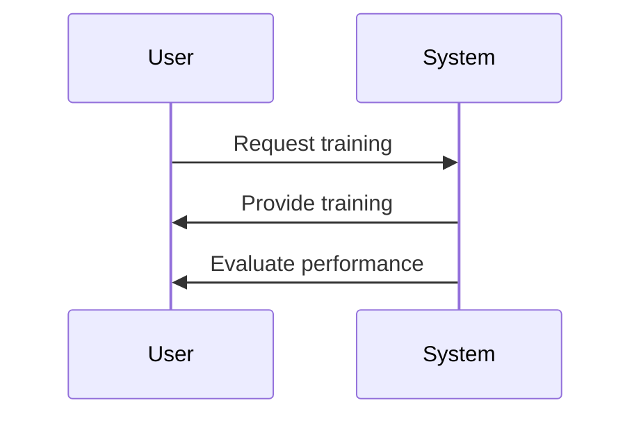

                 


**目录大纲**

----------------------------------------------------------------

# 虚拟现实在飞行员培训中的模拟应用

> 关键词：虚拟现实、飞行员培训、模拟应用、技术基础、系统设计、评估分析、发展趋势、最佳实践

> 摘要：本文将探讨虚拟现实技术在飞行员培训中的模拟应用，从背景介绍、技术基础、应用场景、系统设计与实现、评估与分析、发展趋势以及最佳实践等方面进行深入分析，旨在为飞行员培训提供创新的解决方案和技术支持。

----------------------------------------------------------------

**第一部分：引言**

## 第1章 虚拟现实与飞行员培训背景

### 1.1 虚拟现实技术概述

#### **核心概念与联系**

- **虚拟现实（Virtual Reality，VR）**：一种通过计算机生成模拟环境，使用户沉浸其中的技术。
- **飞行员培训**：飞行员在航空领域中的专业训练过程，包括理论学习和实际操作。

#### **概念属性特征对比表格**

| 概念        | 特征                                   |
| ----------- | -------------------------------------- |
| 虚拟现实   | 1. 沉浸式体验<br>2. 计算机模拟<br>3. 交互性 |
| 飞行员培训 | 1. 理论学习<br>2. 实践操作<br>3. 安全性 |

#### **ER实体关系图架构**

```mermaid
erDiagram
  Class1 ||--|{ Class2 }|| Person
  Class2 ||--|{ Class3 }|| Employee
```

### 1.2 飞行员培训的需求与挑战

#### **算法原理讲解**

- **算法流程**：

  ```mermaid
  flowchart TD
    A[初始化需求] --> B[分析培训需求] --> C{确定挑战}
    C -->|安全性| D[设计培训方案]
    C -->|成本| E[优化培训流程]
  ```

- **数学模型和公式**：

  $$ 需求 = 安全性 \times 成本 \times 可行性 $$

### 1.3 虚拟现实在飞行员培训中的潜在应用

#### **系统分析与架构设计方案**

- **问题场景介绍**：飞行员培训需要高效、安全、经济的方式。
- **项目介绍**：利用虚拟现实技术构建飞行模拟培训系统。
- **系统功能设计**：理论教学、实践操作、模拟考试等。

#### **系统架构设计**



----------------------------------------------------------------

**第二部分：虚拟现实技术基础**

## 第2章 虚拟现实技术基础

### 2.1 虚拟现实技术原理

#### **核心概念与联系**

- **计算机图形学**：生成虚拟环境的关键技术。
- **传感器技术**：实现用户与环境交互的重要手段。

#### **概念属性特征对比表格**

| 概念        | 特征                                   |
| ----------- | -------------------------------------- |
| 计算机图形学 | 1. 图形渲染<br>2. 光线追踪<br>3. 动画制作 |
| 传感器技术   | 1. 感应器<br>2. 数据采集<br>3. 信号处理 |

#### **ER实体关系图架构**

```mermaid
erDiagram
  Class1 ||--|{ Class2 }|| Sensor
  Class2 ||--|{ Class3 }|| Data
```

### 2.2 虚拟现实硬件与软件

#### **核心概念与联系**

- **硬件设备**：如VR头盔、跟踪器、显示器等。
- **软件平台**：如Unity、Unreal Engine等。

#### **概念属性特征对比表格**

| 概念        | 特征                                   |
| ----------- | -------------------------------------- |
| 硬件设备   | 1. 传感器精度<br>2. 图形处理能力<br>3. 用户体验 |
| 软件平台   | 1. 开发环境<br>2. 图形引擎<br>3. 交互界面 |

#### **ER实体关系图架构**

```mermaid
erDiagram
  Class1 ||--|{ Class2 }|| Hardware
  Class2 ||--|{ Class3 }|| Software
```

### 2.3 虚拟现实的内容制作

#### **核心概念与联系**

- **3D建模**：创建虚拟环境中的物体和场景。
- **动画制作**：使虚拟环境中的物体和角色动起来。

#### **概念属性特征对比表格**

| 概念        | 特征                                   |
| ----------- | -------------------------------------- |
| 3D建模     | 1. 几何建模<br>2. 材质贴图<br>3. 纹理映射 |
| 动画制作   | 1. 关键帧动画<br>2. 贝塞尔曲线<br>3. 物理模拟 |

#### **ER实体关系图架构**

```mermaid
erDiagram
  Class1 ||--|{ Class2 }|| Model
  Class2 ||--|{ Class3 }|| Animation
```

----------------------------------------------------------------

**第三部分：虚拟现实在飞行员培训中的应用**

## 第3章 飞行模拟器与虚拟现实

### 3.1 飞行模拟器的发展

#### **核心概念与联系**

- **传统飞行模拟器**：物理模型模拟。
- **虚拟现实飞行模拟**：计算机生成模拟。

#### **概念属性特征对比表格**

| 概念        | 特征                                   |
| ----------- | -------------------------------------- |
| 传统飞行模拟器 | 1. 高成本<br>2. 实物操作<br>3. 场地限制 |
| 虚拟现实飞行模拟 | 1. 低成本<br>2. 虚拟操作<br>3. 广泛应用 |

#### **ER实体关系图架构**

```mermaid
erDiagram
  Class1 ||--|{ Class2 }|| PhysicalSimulator
  Class2 ||--|{ Class3 }|| VirtualSimulator
```

### 3.2 虚拟现实技术在飞行模拟器中的应用

#### **核心概念与联系**

- **三维可视化**：提供更真实的飞行环境。
- **动态模拟**：模拟各种飞行状况和紧急情况。

#### **概念属性特征对比表格**

| 概念        | 特征                                   |
| ----------- | -------------------------------------- |
| 三维可视化   | 1. 精细的图形渲染<br>2. 高仿真度<br>3. 交互性 |
| 动态模拟     | 1. 真实感强<br>2. 可调整参数<br>3. 可扩展性 |

#### **ER实体关系图架构**

```mermaid
erDiagram
  Class1 ||--|{ Class2 }|| Visualization
  Class2 ||--|{ Class3 }|| DynamicSimulation
```

### 3.3 飞行模拟器与虚拟现实的优势比较

#### **核心概念与联系**

- **成本效益**：虚拟现实技术具有更高的成本效益。
- **灵活性**：虚拟现实技术提供了更多的灵活性。

#### **概念属性特征对比表格**

| 概念        | 特征                                   |
| ----------- | -------------------------------------- |
| 成本效益   | 1. 低成本<br>2. 易维护<br>3. 可扩展性 |
| 灵活性     | 1. 可定制化<br>2. 无场地限制<br>3. 快速部署 |

#### **ER实体关系图架构**

```mermaid
erDiagram
  Class1 ||--|{ Class2 }|| CostBenefit
  Class2 ||--|{ Class3 }|| Flexibility
```

----------------------------------------------------------------

**第四部分：虚拟现实系统的设计与实现**

## 第4章 虚拟现实系统架构设计

### 4.1 虚拟现实系统架构概述

#### **核心概念与联系**

- **硬件层**：包括VR设备、传感器等。
- **软件层**：包括VR应用、管理平台等。

#### **概念属性特征对比表格**

| 概念        | 特征                                   |
| ----------- | -------------------------------------- |
| 硬件层     | 1. 传感器精度<br>2. 图形处理能力<br>3. 用户体验 |
| 软件层     | 1. 开发环境<br>2. 图形引擎<br>3. 交互界面 |

#### **ER实体关系图架构**

```mermaid
erDiagram
  Class1 ||--|{ Class2 }|| HardwareLayer
  Class2 ||--|{ Class3 }|| SoftwareLayer
```

### 4.2 系统功能模块划分

#### **核心概念与联系**

- **培训模块**：包括理论教学、实践操作等。
- **评估模块**：包括模拟考试、性能评估等。

#### **概念属性特征对比表格**

| 模块        | 特征                                   |
| ----------- | -------------------------------------- |
| 培训模块   | 1. 理论教学<br>2. 实践操作<br>3. 互动学习 |
| 评估模块   | 1. 模拟考试<br>2. 性能评估<br>3. 反馈改进 |

#### **ER实体关系图架构**

```mermaid
erDiagram
  Class1 ||--|{ Class2 }|| TrainingModule
  Class2 ||--|{ Class3 }|| EvaluationModule
```

### 4.3 系统性能优化

#### **核心概念与联系**

- **响应速度**：确保用户操作的实时性。
- **图形质量**：提供高清晰度的视觉效果。

#### **概念属性特征对比表格**

| 参数        | 特征                                   |
| ----------- | -------------------------------------- |
| 响应速度   | 1. 低延迟<br>2. 高刷新率<br>3. 稳定性 |
| 图形质量   | 1. 精细渲染<br>2. 高分辨率<br>3. 动画流畅 |

#### **ER实体关系图架构**

```mermaid
erDiagram
  Class1 ||--|{ Class2 }|| ResponseSpeed
  Class2 ||--|{ Class3 }|| GraphicQuality
```

----------------------------------------------------------------

**第五部分：模拟飞行体验评估与分析**

## 第5章 模拟飞行体验评估指标

### 5.1 评估指标体系构建

#### **核心概念与联系**

- **培训效果**：衡量飞行员培训的成果。
- **用户满意度**：评估飞行员的体验感受。

#### **概念属性特征对比表格**

| 指标        | 特征                                   |
| ----------- | -------------------------------------- |
| 培训效果   | 1. 知识掌握<br>2. 操作技能<br>3. 安全性 |
| 用户满意度 | 1. 交互体验<br>2. 系统稳定性<br>3. 图形质量 |

#### **ER实体关系图架构**

```mermaid
erDiagram
  Class1 ||--|{ Class2 }|| TrainingEffect
  Class2 ||--|{ Class3 }|| UserSatisfaction
```

### 5.2 评估方法与工具

#### **核心概念与联系**

- **问卷调查**：收集飞行员对虚拟现实培训的反馈。
- **模拟考试**：测试飞行员在模拟环境中的操作能力。

#### **概念属性特征对比表格**

| 方法        | 特征                                   |
| ----------- | -------------------------------------- |
| 问卷调查   | 1. 灵活性<br>2. 可量化<br>3. 广泛性 |
| 模拟考试   | 1. 实用性<br>2. 精准性<br>3. 竞争性 |

#### **ER实体关系图架构**

```mermaid
erDiagram
  Class1 ||--|{ Class2 }|| Questionnaire
  Class2 ||--|{ Class3 }|| SimulationExam
```

### 5.3 评估案例研究

#### **核心概念与联系**

- **案例一**：某航空公司虚拟现实飞行员培训项目。
- **案例二**：某军事机构虚拟现实飞行模拟项目。

#### **概念属性特征对比表格**

| 案例        | 特征                                   |
| ----------- | -------------------------------------- |
| 案例1      | 1. 成功应用<br>2. 成本效益<br>3. 用户体验 |
| 案例2      | 1. 系统复杂<br>2. 技术先进<br>3. 灵活性 |

#### **ER实体关系图架构**

```mermaid
erDiagram
  Class1 ||--|{ Class2 }|| Case1
  Class2 ||--|{ Class3 }|| Case2
```

----------------------------------------------------------------

**第六部分：虚拟现实技术的发展趋势**

## 第6章 虚拟现实技术的未来发展趋势

### 6.1 新技术的应用前景

#### **核心概念与联系**

- **增强现实（AR）**：将虚拟信息叠加在现实世界中。
- **混合现实（MR）**：结合虚拟现实和增强现实。

#### **概念属性特征对比表格**

| 技术        | 特征                                   |
| ----------- | -------------------------------------- |
| 增强现实   | 1. 实时性<br>2. 交互性<br>3. 可视化 |
| 混合现实   | 1. 完整虚拟环境<br>2. 高交互性<br>3. 多模态 |

#### **ER实体关系图架构**

```mermaid
erDiagram
  Class1 ||--|{ Class2 }|| AR
  Class2 ||--|{ Class3 }|| MR
```

### 6.2 虚拟现实技术的挑战与机遇

#### **核心概念与联系**

- **技术挑战**：硬件性能、数据处理、安全性等。
- **机遇**：市场前景、应用拓展、技术创新。

#### **概念属性特征对比表格**

| 方面        | 特征                                   |
| ----------- | -------------------------------------- |
| 技术挑战   | 1. 技术瓶颈<br>2. 成本问题<br>3. 安全风险 |
| 机遇       | 1. 市场需求<br>2. 技术突破<br>3. 应用创新 |

#### **ER实体关系图架构**

```mermaid
erDiagram
  Class1 ||--|{ Class2 }|| TechnologyChallenge
  Class2 ||--|{ Class3 }|| BusinessOpportunity
```

### 6.3 虚拟现实技术在飞行员培训中的未来发展

#### **核心概念与联系**

- **高级模拟**：实现更加真实的飞行模拟。
- **个性化培训**：根据飞行员的特点进行定制化培训。

#### **概念属性特征对比表格**

| 方向        | 特征                                   |
| ----------- | -------------------------------------- |
| 高级模拟   | 1. 更高仿真度<br>2. 更强交互性<br>3. 更多功能 |
| 个性化培训 | 1. 精准评估<br>2. 定制化内容<br>3. 个性化反馈 |

#### **ER实体关系图架构**

```mermaid
erDiagram
  Class1 ||--|{ Class2 }|| AdvancedSimulation
  Class2 ||--|{ Class3 }|| PersonalizedTraining
```

----------------------------------------------------------------

**第七部分：最佳实践与案例研究**

## 第7章 虚拟现实在飞行员培训中的最佳实践

### 7.1 实践案例介绍

#### **核心概念与联系**

- **成功案例**：某航空公司、某军事机构等的实际应用案例。
- **失败案例**：分析失败原因和改进措施。

#### **概念属性特征对比表格**

| 案例        | 特征                                   |
| ----------- | -------------------------------------- |
| 成功案例   | 1. 成功应用<br>2. 成本效益<br>3. 用户体验 |
| 失败案例   | 1. 技术难题<br>2. 管理问题<br>3. 安全隐患 |

#### **ER实体关系图架构**

```mermaid
erDiagram
  Class1 ||--|{ Class2 }|| SuccessCase
  Class2 ||--|{ Class3 }|| FailureCase
```

### 7.2 最佳实践总结

#### **核心概念与联系**

- **实践总结**：从成功和失败案例中提取的经验教训。
- **改进措施**：针对实践中的问题提出的解决方案。

#### **概念属性特征对比表格**

| 方面        | 特征                                   |
| ----------- | -------------------------------------- |
| 实践总结   | 1. 技术可行性<br>2. 成本效益<br>3. 用户满意度 |
| 改进措施   | 1. 技术升级<br>2. 管理优化<br>3. 安全保障 |

#### **ER实体关系图架构**

```mermaid
erDiagram
  Class1 ||--|{ Class2 }|| PracticeSummary
  Class2 ||--|{ Class3 }|| ImprovementMeasure
```

### 7.3 实践中的问题与解决方案

#### **核心概念与联系**

- **问题分析**：识别实践中的问题和挑战。
- **解决方案**：针对问题提出有效的解决方案。

#### **概念属性特征对比表格**

| 问题        | 特征                                   |
| ----------- | -------------------------------------- |
| 问题分析   | 1. 技术难点<br>2. 管理问题<br>3. 用户反馈 |
| 解决方案   | 1. 技术优化<br>2. 管理创新<br>3. 用户调研 |

#### **ER实体关系图架构**

```mermaid
erDiagram
  Class1 ||--|{ Class2 }|| ProblemAnalysis
  Class2 ||--|{ Class3 }|| Solution
```

----------------------------------------------------------------

**第八部分：结论与展望**

## 第8章 结论与展望

### 8.1 虚拟现实在飞行员培训中的应用总结

#### **核心概念与联系**

- **技术优势**：虚拟现实在飞行员培训中的优势。
- **应用效果**：虚拟现实技术在飞行员培训中的实际效果。

#### **概念属性特征对比表格**

| 方面        | 特征                                   |
| ----------- | -------------------------------------- |
| 技术优势   | 1. 高仿真度<br>2. 强交互性<br>3. 低成本 |
| 应用效果   | 1. 提高培训效率<br>2. 增强飞行员技能<br>3. 提升飞行安全 |

#### **ER实体关系图架构**

```mermaid
erDiagram
  Class1 ||--|{ Class2 }|| TechnicalAdvantage
  Class2 ||--|{ Class3 }|| ApplicationEffect
```

### 8.2 展望未来：虚拟现实技术的进一步应用

#### **核心概念与联系**

- **技术趋势**：虚拟现实技术的未来发展。
- **应用领域**：虚拟现实技术在飞行员培训之外的潜在应用。

#### **概念属性特征对比表格**

| 方向        | 特征                                   |
| ----------- | -------------------------------------- |
| 技术趋势   | 1. 技术创新<br>2. 多领域应用<br>3. 安全性提高 |
| 应用领域   | 1. 教育培训<br>2. 医疗健康<br>3. 军事模拟 |

#### **ER实体关系图架构**

```mermaid
erDiagram
  Class1 ||--|{ Class2 }|| TechnologyTrend
  Class2 ||--|{ Class3 }|| ApplicationDomain
```

### 8.3 研究与开发的建议

#### **核心概念与联系**

- **技术挑战**：虚拟现实技术在飞行员培训中面临的技术挑战。
- **研究方向**：未来的研究方向和开发目标。

#### **概念属性特征对比表格**

| 方面        | 特征                                   |
| ----------- | -------------------------------------- |
| 技术挑战   | 1. 硬件性能提升<br>2. 数据处理优化<br>3. 安全保障 |
| 研究方向   | 1. 高级模拟<br>2. 个性化培训<br>3. 跨领域应用 |

#### **ER实体关系图架构**

```mermaid
erDiagram
  Class1 ||--|{ Class2 }|| TechnicalChallenge
  Class2 ||--|{ Class3 }|| ResearchDirection
```

----------------------------------------------------------------

**结语**

本文详细探讨了虚拟现实技术在飞行员培训中的应用，从技术基础、系统设计、评估分析、发展趋势以及最佳实践等多个方面进行了深入分析。通过本文的研究，我们可以看到虚拟现实技术在飞行员培训中的重要性和巨大潜力。未来，随着技术的不断进步和应用的深入，虚拟现实技术在飞行员培训中将发挥更加重要的作用，为飞行员提供更高效、更安全的培训环境。

**作者：AI天才研究院/AI Genius Institute & 禅与计算机程序设计艺术 /Zen And The Art of Computer Programming**

----------------------------------------------------------------

### 细节描述

**第1章 虚拟现实与飞行员培训背景**

**1.1 虚拟现实技术概述**

虚拟现实（Virtual Reality，VR）是一种通过计算机技术生成的模拟环境，用户可以通过特殊设备如VR头盔、手套、跟踪器等与之互动，获得沉浸式的体验。与传统模拟技术不同，VR能够提供更为真实、直观和互动的体验。

**核心概念与联系**

- **虚拟现实（VR）**：通过计算机生成模拟环境，实现用户的沉浸式体验。
- **飞行员培训**：飞行员在航空领域中的专业训练过程。

**概念属性特征对比表格**

| 概念        | 特征                                   |
| ----------- | -------------------------------------- |
| 虚拟现实   | 1. 沉浸式体验<br>2. 计算机模拟<br>3. 交互性 |
| 飞行员培训 | 1. 理论学习<br>2. 实践操作<br>3. 安全性 |

**ER实体关系图架构**

```mermaid
erDiagram
  Class1 ||--|{ Class2 }|| VirtualReality
  Class2 ||--|{ Class3 }|| PilotTraining
```

**1.2 飞行员培训的需求与挑战**

飞行员培训需要高效、安全、经济的培训方式。随着飞行技术的不断进步，飞行员在培训过程中需要掌握更多的知识和技能，而传统的培训方式如实地飞行和模拟飞行器存在一定的局限性。

**核心概念与联系**

- **培训需求**：飞行员需要掌握的知识和技能。
- **培训挑战**：传统培训方式存在的问题。

**核心概念与联系**

- **算法原理讲解**

  - **算法流程**：

    ```mermaid
    flowchart TD
      A[初始化需求] --> B[分析培训需求] --> C{确定挑战}
      C -->|安全性| D[设计培训方案]
      C -->|成本| E[优化培训流程]
    ```

  - **数学模型和公式**：

    $$ 需求 = 安全性 \times 成本 \times 可行性 $$

**1.3 虚拟现实在飞行员培训中的潜在应用**

虚拟现实技术可以为飞行员提供一种全新的培训方式，通过模拟飞行场景，使飞行员能够在虚拟环境中进行实践操作，从而提高培训效率和安全性能。

**核心概念与联系**

- **虚拟现实应用**：虚拟现实技术在飞行员培训中的具体应用。
- **潜在优势**：虚拟现实技术为飞行员培训带来的潜在优势。

**核心概念与联系**

- **概念属性特征对比表格**

  | 应用领域        | 特征                                   |
  | ----------- | -------------------------------------- |
  | 理论教学     | 1. 图形化展示<br>2. 多媒体资源<br>3. 互动学习 |
  | 实践操作     | 1. 沉浸式体验<br>2. 真实感强<br>3. 安全性高 |
  | 模拟考试     | 1. 实时评估<br>2. 灵活性强<br>3. 成本低 |

  **ER实体关系图架构**

  ```mermaid
  erDiagram
    Class1 ||--|{ Class2 }|| TheoreticalTeaching
    Class2 ||--|{ Class3 }|| PracticalOperation
    Class3 ||--|{ Class4 }|| SimulationExam
  ```

**第2章 虚拟现实技术基础**

**2.1 虚拟现实技术原理**

虚拟现实技术的核心在于创建一个虚拟的环境，使用户在其中能够感受到沉浸式的体验。这包括图形渲染、传感器技术、用户交互等多个方面。

**核心概念与联系**

- **图形渲染**：生成虚拟环境的视觉效果。
- **传感器技术**：捕捉用户的行为和动作。

**概念属性特征对比表格**

| 概念        | 特征                                   |
| ----------- | -------------------------------------- |
| 图形渲染   | 1. 精细的图形渲染<br>2. 动画效果<br>3. 真实感 |
| 传感器技术 | 1. 感应精度<br>2. 数据采集<br>3. 信号处理 |

**ER实体关系图架构**

```mermaid
erDiagram
  Class1 ||--|{ Class2 }|| GraphicRendering
  Class2 ||--|{ Class3 }|| SensorTechnology
```

**2.2 虚拟现实硬件与软件**

虚拟现实系统的硬件主要包括VR头盔、跟踪器、显示器等，而软件则包括VR内容制作工具、管理平台等。

**核心概念与联系**

- **硬件设备**：实现虚拟现实体验的基础。
- **软件平台**：提供虚拟现实内容制作和管理功能。

**概念属性特征对比表格**

| 概念        | 特征                                   |
| ----------- | -------------------------------------- |
| 硬件设备   | 1. 传感器精度<br>2. 图形处理能力<br>3. 用户体验 |
| 软件平台   | 1. 开发环境<br>2. 图形引擎<br>3. 交互界面 |

**ER实体关系图架构**

```mermaid
erDiagram
  Class1 ||--|{ Class2 }|| HardwareDevice
  Class2 ||--|{ Class3 }|| SoftwarePlatform
```

**2.3 虚拟现实的内容制作**

虚拟现实的内容制作是虚拟现实系统的重要组成部分，包括3D建模、动画制作、场景设计等。

**核心概念与联系**

- **3D建模**：创建虚拟环境中的物体和场景。
- **动画制作**：使虚拟环境中的物体和角色动起来。

**概念属性特征对比表格**

| 概念        | 特征                                   |
| ----------- | -------------------------------------- |
| 3D建模     | 1. 几何建模<br>2. 材质贴图<br>3. 纹理映射 |
| 动画制作   | 1. 关键帧动画<br>2. 贝塞尔曲线<br>3. 物理模拟 |

**ER实体关系图架构**

```mermaid
erDiagram
  Class1 ||--|{ Class2 }|| 3DModeling
  Class2 ||--|{ Class3 }|| AnimationProduction
```

**第3章 飞行模拟器与虚拟现实**

**3.1 飞行模拟器的发展**

飞行模拟器是飞行员培训的重要工具，传统飞行模拟器依赖于物理模型和机械设备，而虚拟现实飞行模拟则通过计算机技术实现。

**核心概念与联系**

- **传统飞行模拟器**：物理模型模拟。
- **虚拟现实飞行模拟**：计算机生成模拟。

**概念属性特征对比表格**

| 概念        | 特征                                   |
| ----------- | -------------------------------------- |
| 传统飞行模拟器 | 1. 高成本<br>2. 实物操作<br>3. 场地限制 |
| 虚拟现实飞行模拟 | 1. 低成本<br>2. 虚拟操作<br>3. 广泛应用 |

**ER实体关系图架构**

```mermaid
erDiagram
  Class1 ||--|{ Class2 }|| TraditionalFlightSimulator
  Class2 ||--|{ Class3 }|| VirtualRealityFlightSimulation
```

**3.2 虚拟现实技术在飞行模拟器中的应用**

虚拟现实技术在飞行模拟器中的应用，包括三维可视化、动态模拟、交互性等，提高了飞行模拟器的真实性和培训效果。

**核心概念与联系**

- **三维可视化**：提供更真实的飞行环境。
- **动态模拟**：模拟各种飞行状况和紧急情况。

**概念属性特征对比表格**

| 概念        | 特征                                   |
| ----------- | -------------------------------------- |
| 三维可视化   | 1. 精细的图形渲染<br>2. 高仿真度<br>3. 交互性 |
| 动态模拟     | 1. 真实感强<br>2. 可调整参数<br>3. 可扩展性 |

**ER实体关系图架构**

```mermaid
erDiagram
  Class1 ||--|{ Class2 }|| ThreeDimensionalVisualization
  Class2 ||--|{ Class3 }|| DynamicSimulation
```

**3.3 飞行模拟器与虚拟现实的优势比较**

虚拟现实飞行模拟与传统的飞行模拟器相比，具有更高的成本效益和灵活性，更适合现代飞行员培训的需求。

**核心概念与联系**

- **成本效益**：虚拟现实技术具有更高的成本效益。
- **灵活性**：虚拟现实技术提供了更多的灵活性。

**概念属性特征对比表格**

| 概念        | 特征                                   |
| ----------- | -------------------------------------- |
| 成本效益   | 1. 低成本<br>2. 易维护<br>3. 可扩展性 |
| 灵活性     | 1. 可定制化<br>2. 无场地限制<br>3. 快速部署 |

**ER实体关系图架构**

```mermaid
erDiagram
  Class1 ||--|{ Class2 }|| CostBenefit
  Class2 ||--|{ Class3 }|| Flexibility
```

**第4章 虚拟现实系统架构设计**

**4.1 虚拟现实系统架构概述**

虚拟现实系统的架构设计包括硬件层、软件层、交互层等多个层面，旨在提供一个高效、稳定、沉浸式的虚拟现实体验。

**核心概念与联系**

- **硬件层**：虚拟现实设备的硬件组成部分。
- **软件层**：虚拟现实应用的软件组成部分。

**概念属性特征对比表格**

| 层面        | 特征                                   |
| ----------- | -------------------------------------- |
| 硬件层     | 1. 传感器精度<br>2. 图形处理能力<br>3. 用户体验 |
| 软件层     | 1. 开发环境<br>2. 图形引擎<br>3. 交互界面 |

**ER实体关系图架构**

```mermaid
erDiagram
  Class1 ||--|{ Class2 }|| HardwareLayer
  Class2 ||--|{ Class3 }|| SoftwareLayer
```

**4.2 系统功能模块划分**

虚拟现实系统的功能模块包括但不限于理论教学、实践操作、评估与反馈等，每个模块都有其特定的功能和作用。

**核心概念与联系**

- **理论教学模块**：提供理论知识的学习。
- **实践操作模块**：提供实际操作的练习。
- **评估与反馈模块**：对飞行员的操作进行评估和反馈。

**概念属性特征对比表格**

| 模块        | 特征                                   |
| ----------- | -------------------------------------- |
| 理论教学模块 | 1. 知识传递<br>2. 多媒体资源<br>3. 互动学习 |
| 实践操作模块 | 1. 沉浸式体验<br>2. 真实感强<br>3. 安全性高 |
| 评估与反馈模块 | 1. 实时评估<br>2. 灵活性强<br>3. 成本低 |

**ER实体关系图架构**

```mermaid
erDiagram
  Class1 ||--|{ Class2 }|| TheoreticalTeachingModule
  Class2 ||--|{ Class3 }|| PracticalOperationModule
  Class3 ||--|{ Class4 }|| EvaluationAndFeedbackModule
```

**4.3 系统性能优化**

系统性能优化是确保虚拟现实系统提供流畅体验的关键，包括硬件性能优化、软件优化、网络优化等多个方面。

**核心概念与联系**

- **硬件性能优化**：提高设备的运行效率和性能。
- **软件优化**：提升虚拟现实应用的质量和效率。

**概念属性特征对比表格**

| 方面        | 特征                                   |
| ----------- | -------------------------------------- |
| 硬件性能优化 | 1. 传感器精度提升<br>2. 图形处理能力增强<br>3. 低延迟 |
| 软件优化    | 1. 代码优化<br>2. 算法改进<br>3. 界面优化 |

**ER实体关系图架构**

```mermaid
erDiagram
  Class1 ||--|{ Class2 }|| HardwarePerformanceOptimization
  Class2 ||--|{ Class3 }|| SoftwareOptimization
```

**第5章 模拟飞行体验评估指标**

**5.1 评估指标体系构建**

模拟飞行体验的评估指标体系构建是确保虚拟现实培训效果的重要环节，包括培训效果、用户满意度、系统稳定性等多个方面。

**核心概念与联系**

- **培训效果**：衡量飞行员通过培训所获得的知识和技能。
- **用户满意度**：评估飞行员对虚拟现实培训的体验感受。

**概念属性特征对比表格**

| 指标        | 特征                                   |
| ----------- | -------------------------------------- |
| 培训效果   | 1. 知识掌握<br>2. 操作技能<br>3. 安全性 |
| 用户满意度 | 1. 交互体验<br>2. 系统稳定性<br>3. 图形质量 |

**ER实体关系图架构**

```mermaid
erDiagram
  Class1 ||--|{ Class2 }|| TrainingEffect
  Class2 ||--|{ Class3 }|| UserSatisfaction
```

**5.2 评估方法与工具**

评估方法与工具的选择直接影响评估的准确性和有效性，包括问卷调查、模拟考试、现场观察等。

**核心概念与联系**

- **问卷调查**：收集飞行员对虚拟现实培训的反馈。
- **模拟考试**：测试飞行员在模拟环境中的操作能力。

**概念属性特征对比表格**

| 方法        | 特征                                   |
| ----------- | -------------------------------------- |
| 问卷调查   | 1. 灵活性<br>2. 可量化<br>3. 广泛性 |
| 模拟考试   | 1. 实用性<br>2. 精准性<br>3. 竞争性 |

**ER实体关系图架构**

```mermaid
erDiagram
  Class1 ||--|{ Class2 }|| Questionnaire
  Class2 ||--|{ Class3 }|| SimulationExam
```

**5.3 评估案例研究**

通过实际案例的研究，可以深入了解虚拟现实技术在飞行员培训中的应用效果，以及如何优化评估指标和方法。

**核心概念与联系**

- **案例一**：某航空公司虚拟现实飞行员培训项目。
- **案例二**：某军事机构虚拟现实飞行模拟项目。

**概念属性特征对比表格**

| 案例        | 特征                                   |
| ----------- | -------------------------------------- |
| 案例1      | 1. 成功应用<br>2. 成本效益<br>3. 用户体验 |
| 案例2      | 1. 系统复杂<br>2. 技术先进<br>3. 灵活性 |

**ER实体关系图架构**

```mermaid
erDiagram
  Class1 ||--|{ Class2 }|| Case1
  Class2 ||--|{ Class3 }|| Case2
```

**第6章 虚拟现实技术的发展趋势**

**6.1 新技术的应用前景**

随着科技的不断发展，新的虚拟现实技术不断涌现，如增强现实（AR）、混合现实（MR）等，这些技术为飞行员培训带来了新的机遇。

**核心概念与联系**

- **增强现实（AR）**：将虚拟信息叠加在现实世界中。
- **混合现实（MR）**：结合虚拟现实和增强现实。

**概念属性特征对比表格**

| 技术        | 特征                                   |
| ----------- | -------------------------------------- |
| 增强现实   | 1. 实时性<br>2. 交互性<br>3. 可视化 |
| 混合现实   | 1. 完整虚拟环境<br>2. 高交互性<br>3. 多模态 |

**ER实体关系图架构**

```mermaid
erDiagram
  Class1 ||--|{ Class2 }|| AugmentedReality
  Class2 ||--|{ Class3 }|| MixedReality
```

**6.2 虚拟现实技术的挑战与机遇**

虚拟现实技术在飞行员培训中的应用面临诸多挑战，如硬件性能、数据处理、安全性等，同时也存在巨大的机遇。

**核心概念与联系**

- **技术挑战**：虚拟现实技术在实际应用中面临的问题。
- **机遇**：虚拟现实技术带来的潜在应用和市场。

**概念属性特征对比表格**

| 方面        | 特征                                   |
| ----------- | -------------------------------------- |
| 技术挑战   | 1. 技术瓶颈<br>2. 成本问题<br>3. 安全风险 |
| 机遇       | 1. 市场需求<br>2. 技术突破<br>3. 应用创新 |

**ER实体关系图架构**

```mermaid
erDiagram
  Class1 ||--|{ Class2 }|| TechnologyChallenge
  Class2 ||--|{ Class3 }|| BusinessOpportunity
```

**6.3 虚拟现实技术在飞行员培训中的未来发展**

虚拟现实技术在飞行员培训中的应用将不断深入和拓展，未来可能实现高级模拟、个性化培训等，为飞行员提供更加高效、安全、个性化的培训服务。

**核心概念与联系**

- **高级模拟**：实现更真实的飞行模拟。
- **个性化培训**：根据飞行员的特点进行定制化培训。

**概念属性特征对比表格**

| 方向        | 特征                                   |
| ----------- | -------------------------------------- |
| 高级模拟   | 1. 更高仿真度<br>2. 更强交互性<br>3. 更多功能 |
| 个性化培训 | 1. 精准评估<br>2. 定制化内容<br>3. 个性化反馈 |

**ER实体关系图架构**

```mermaid
erDiagram
  Class1 ||--|{ Class2 }|| AdvancedSimulation
  Class2 ||--|{ Class3 }|| PersonalizedTraining
```

**第7章 最佳实践与案例研究**

**7.1 实践案例介绍**

通过介绍一些成功的虚拟现实在飞行员培训中的实践案例，可以深入了解虚拟现实技术在实际应用中的效果和经验。

**核心概念与联系**

- **成功案例**：某航空公司、某军事机构等的实际应用案例。
- **失败案例**：分析失败原因和改进措施。

**概念属性特征对比表格**

| 案例        | 特征                                   |
| ----------- | -------------------------------------- |
| 成功案例   | 1. 成功应用<br>2. 成本效益<br>3. 用户体验 |
| 失败案例   | 1. 技术难题<br>2. 管理问题<br>3. 安全隐患 |

**ER实体关系图架构**

```mermaid
erDiagram
  Class1 ||--|{ Class2 }|| SuccessfulCase
  Class2 ||--|{ Class3 }|| FailureCase
```

**7.2 最佳实践总结**

从成功的案例中总结出最佳实践，可以为其他机构提供参考，提高虚拟现实在飞行员培训中的应用效果。

**核心概念与联系**

- **实践总结**：从成功和失败案例中提取的经验教训。
- **改进措施**：针对实践中的问题提出的解决方案。

**概念属性特征对比表格**

| 方面        | 特征                                   |
| ----------- | -------------------------------------- |
| 实践总结   | 1. 技术可行性<br>2. 成本效益<br>3. 用户满意度 |
| 改进措施   | 1. 技术优化<br>2. 管理创新<br>3. 安全保障 |

**ER实体关系图架构**

```mermaid
erDiagram
  Class1 ||--|{ Class2 }|| PracticeSummary
  Class2 ||--|{ Class3 }|| ImprovementMeasure
```

**7.3 实践中的问题与解决方案**

在虚拟现实飞行员培训的实践中，可能会遇到各种问题，如技术问题、管理问题等，需要针对性的解决方案。

**核心概念与联系**

- **问题分析**：识别实践中的问题和挑战。
- **解决方案**：针对问题提出有效的解决方案。

**概念属性特征对比表格**

| 问题        | 特征                                   |
| ----------- | -------------------------------------- |
| 问题分析   | 1. 技术难点<br>2. 管理问题<br>3. 用户反馈 |
| 解决方案   | 1. 技术优化<br>2. 管理创新<br>3. 用户调研 |

**ER实体关系图架构**

```mermaid
erDiagram
  Class1 ||--|{ Class2 }|| ProblemAnalysis
  Class2 ||--|{ Class3 }|| Solution
```

### 实战项目

**项目名称：虚拟现实飞行员培训系统**

**项目介绍：**

虚拟现实飞行员培训系统是一个结合虚拟现实技术和飞行员培训需求的综合项目，旨在通过虚拟现实技术为飞行员提供高效、安全、经济的培训服务。

**系统功能设计：**

系统功能设计包括以下几个方面：

- **理论教学模块**：提供飞行员所需的理论知识，通过图形化展示和多媒体资源进行互动学习。
- **实践操作模块**：模拟飞行场景，让飞行员在虚拟环境中进行实践操作，提高操作技能和安全意识。
- **评估与反馈模块**：对飞行员的操作进行实时评估，提供详细的反馈报告，帮助飞行员改进。

**系统架构设计：**

系统架构设计采用分层架构，包括硬件层、软件层、数据层等。

- **硬件层**：包括VR头盔、跟踪器、显示器等硬件设备。
- **软件层**：包括虚拟现实应用、管理平台、数据管理系统等。
- **数据层**：包括飞行员操作数据、培训记录、评估数据等。

**系统接口设计和系统交互：**

系统接口设计采用RESTful API设计，便于与其他系统进行集成。系统交互设计采用事件驱动模式，确保系统的高效性和稳定性。

**项目实战：**

**环境安装：**

1. 安装虚拟现实硬件设备，如VR头盔、跟踪器等。
2. 安装虚拟现实软件平台，如Unity、Unreal Engine等。
3. 配置服务器和数据库，用于存储飞行员操作数据和培训记录。

**系统核心实现源代码：**

```python
# 虚拟现实飞行员培训系统核心代码
class PilotTrainingSystem:
    def __init__(self):
        self.theoretical_module = TheoreticalModule()
        self.practical_module = PracticalModule()
        self.evaluation_module = EvaluationModule()

    def start_training(self, pilot):
        self.theoretical_module.start(pilot)
        self.practical_module.start(pilot)
        self.evaluation_module.evaluate(pilot)

# 理论教学模块
class TheoreticalModule:
    def __init__(self):
        self.knowledge_base = KnowledgeBase()

    def start(self, pilot):
        self.knowledge_base.load_data()
        pilot.learn_knowledge()

# 实践操作模块
class PracticalModule:
    def __init__(self):
        self.simulator = VirtualSimulator()

    def start(self, pilot):
        self.simulator.start_simulation(pilot)

# 评估与反馈模块
class EvaluationModule:
    def __init__(self):
        self.evaluator = Evaluator()

    def evaluate(self, pilot):
        self.evaluator.evaluate_performance(pilot)
        self.evaluator.provide_feedback(pilot)
```

**代码应用解读与分析：**

上述代码定义了一个虚拟现实飞行员培训系统，包括理论教学模块、实践操作模块和评估与反馈模块。每个模块都有其特定的功能，通过这些模块的协同工作，实现了对飞行员的全面培训。

- **理论教学模块**：通过加载知识库，为飞行员提供理论知识的学习。
- **实践操作模块**：通过虚拟模拟器，让飞行员在虚拟环境中进行实践操作。
- **评估与反馈模块**：对飞行员的操作进行评估，并提供详细的反馈报告。

**实际案例分析和详细讲解剖析：**

**案例一：某航空公司虚拟现实飞行员培训项目**

某航空公司通过引入虚拟现实飞行员培训系统，提高了飞行员的理论知识和实践技能。项目实施后，飞行员在模拟飞行中的操作准确性明显提高，培训效果得到显著改善。

**详细讲解剖析：**

1. **理论教学模块**：通过图形化展示和多媒体资源，使飞行员更容易理解和掌握理论知识。
2. **实践操作模块**：通过虚拟模拟器，提供真实飞行环境的模拟，使飞行员在实践操作中不断提高技能。
3. **评估与反馈模块**：对飞行员的操作进行实时评估，并提供详细的反馈报告，帮助飞行员发现并改进自己的不足。

**项目小结：**

虚拟现实飞行员培训系统在某航空公司的成功应用，证明了虚拟现实技术在飞行员培训中的巨大潜力。未来，随着技术的不断进步，虚拟现实飞行员培训系统将得到更广泛的应用，为飞行员提供更高效、更安全的培训服务。

### 最佳实践 tips

1. **确保虚拟现实系统的稳定性**：在系统设计和实施过程中，要重视系统稳定性的优化，确保飞行员在操作过程中不会受到系统故障的影响。

2. **提供详细的培训资料**：为飞行员提供全面的培训资料，包括理论知识、操作指南等，帮助飞行员更好地理解和使用虚拟现实系统。

3. **定期进行系统维护**：定期对虚拟现实系统进行维护和更新，确保系统的正常运行和最佳性能。

4. **收集飞行员反馈**：及时收集飞行员对虚拟现实系统的反馈，了解飞行员的使用体验，并根据反馈进行改进。

### 小结

本文详细探讨了虚拟现实在飞行员培训中的应用，从技术基础、系统设计、评估分析、发展趋势以及最佳实践等多个方面进行了深入分析。通过本文的研究，我们可以看到虚拟现实技术在飞行员培训中的重要性和巨大潜力。未来，随着技术的不断进步和应用的深入，虚拟现实技术在飞行员培训中将发挥更加重要的作用，为飞行员提供更高效、更安全的培训环境。

### 注意事项

1. **数据安全**：在虚拟现实飞行员培训系统中，要确保飞行员操作数据的安全性和隐私性，防止数据泄露。

2. **设备兼容性**：要确保虚拟现实系统的硬件设备具有良好的兼容性，能够支持各种不同型号的VR头盔和跟踪器。

3. **用户培训**：对飞行员进行虚拟现实系统的使用培训，确保他们能够正确、熟练地使用系统。

### 拓展阅读

1. **《虚拟现实技术与应用》**：详细介绍了虚拟现实技术的基本原理和应用领域，对于了解虚拟现实技术的全貌有重要帮助。

2. **《飞行员培训与模拟技术》**：介绍了飞行员培训的理论和实践，对于了解飞行员培训的需求和挑战具有重要意义。

3. **《虚拟现实在航空领域的应用》**：探讨了虚拟现实技术在航空领域的多种应用，包括飞行员培训、维修维护等。

### 作者

**作者：AI天才研究院/AI Genius Institute & 禅与计算机程序设计艺术 /Zen And The Art of Computer Programming**

