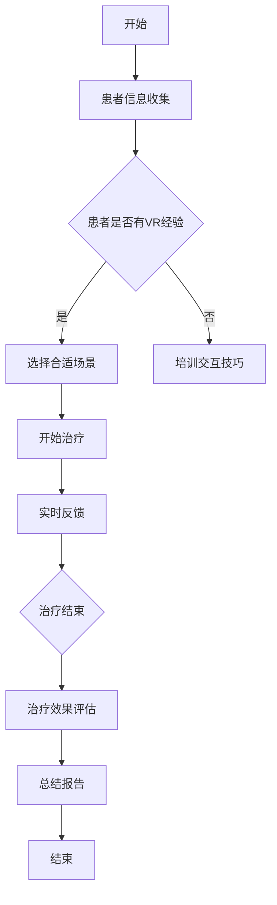
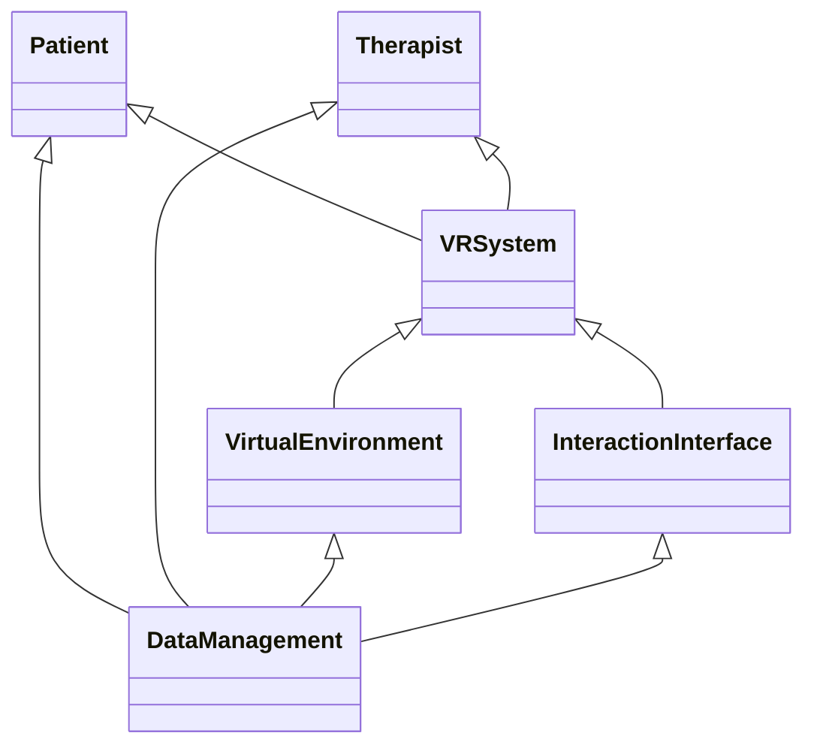
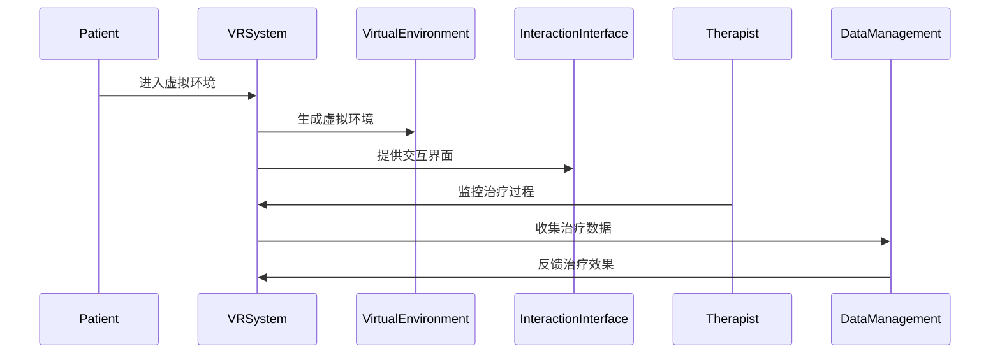
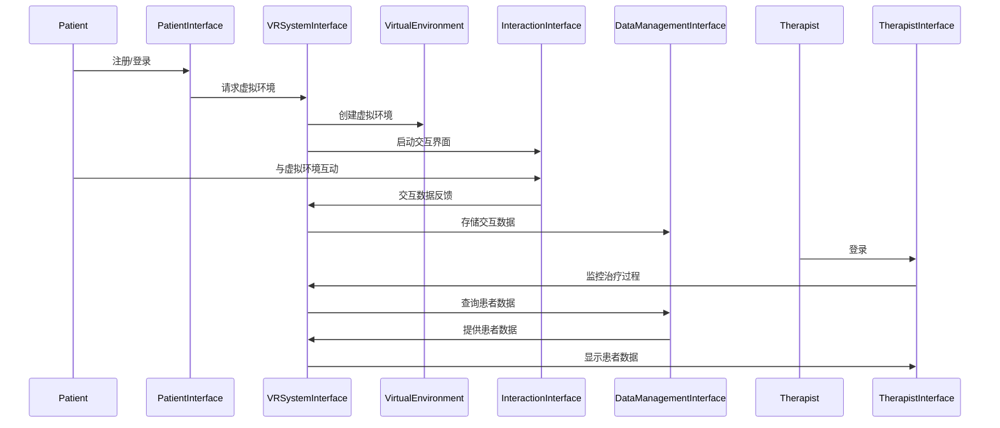

                 


### 背景介绍

#### 第1章: VR技术与心理创伤治疗

**1.1 问题背景**

虚拟现实（VR）技术，作为一种沉浸式交互技术，近年来在多个领域得到了广泛应用，从娱乐、教育到医疗等。VR技术的核心在于通过头戴式显示器（HMD）、跟踪系统、传感设备等，创造一个高度仿真的三维环境，使用户能够在这个虚拟世界中自由探索和互动。

在医疗领域，VR技术的应用尤其引人注目。特别是心理创伤治疗，传统的治疗方法如心理咨询、药物治疗等存在诸多局限性，如治疗过程过于痛苦、治疗效果不显著等。而VR技术以其沉浸性和可控性，为心理创伤治疗提供了一种新的思路。

**1.2 问题描述**

心理创伤是指由于极端的、灾难性的生活事件或情境所导致的严重的精神痛苦。这些创伤可能导致创伤后应激障碍（PTSD）、焦虑症、抑郁症等多种心理问题。心理创伤的治疗方法包括心理咨询、药物治疗、暴露疗法等，但这些方法在实践过程中面临诸多挑战：

- **心理咨询**：过程较长，需面对面的交流，患者可能难以持续参与。
- **药物治疗**：具有一定的副作用，且长期依赖药物治疗可能影响患者的心理健康。
- **暴露疗法**：虽然效果显著，但治疗过程中患者需要面对现实中的创伤场景，可能导致心理上的二次伤害。

**1.3 问题解决**

VR技术的引入，为心理创伤治疗提供了一种创新的解决方案。通过创建一个可控的虚拟环境，患者可以在安全、舒适的情况下面对和处理创伤事件。VR技术具有以下优势：

- **沉浸性**：患者能够完全沉浸在虚拟环境中，体验更加真实。
- **可控性**：治疗师可以根据患者的情况调整虚拟环境的难度和场景，确保治疗过程的安全性和有效性。
- **个性化**：根据患者的具体需求，定制个性化的治疗计划。

**1.4 核心要素组成**

VR心理创伤治疗的实现需要以下几个核心要素：

- **VR技术**：包括头戴式显示器、跟踪系统、传感设备等硬件，以及虚拟环境生成和交互的软件平台。
- **心理创伤理论**：了解不同类型心理创伤的特点和治疗方法，为VR治疗提供理论支持。
- **治疗实践**：治疗师在VR环境中对患者进行干预和治疗，包括暴露、认知重建等。
- **评估与反馈机制**：通过量化评估和患者反馈，不断优化治疗过程。

#### 第2章: 核心概念与联系

**2.1 核心概念原理**

**VR技术的基本原理**：

VR技术主要通过以下几个方面实现沉浸式体验：

- **渲染**：使用图形处理单元（GPU）生成三维图像，模拟真实世界的视觉感受。
- **传感**：通过传感器捕捉用户的动作和位置，实现用户的自由移动和交互。
- **交互**：通过手柄、手势、声音等多种方式，实现用户与虚拟环境的互动。

**心理创伤的定义与分类**：

心理创伤是指由于极端的、灾难性的生活事件或情境所导致的严重的精神痛苦。根据创伤的严重程度和表现形式，可以分为以下几种类型：

- **创伤后应激障碍（PTSD）**：经历或目睹灾难性事件后，出现长期的心理反应，如失眠、焦虑、闪回等。
- **焦虑症**：表现为持续性的恐惧、紧张和担忧。
- **抑郁症**：表现为持续的悲伤、失去兴趣、疲劳等。

**治疗方法及其优缺点**：

- **心理咨询**：通过面对面的交流，帮助患者理解和处理心理创伤。优点是治疗效果较为温和，缺点是过程较长且需要较高的沟通技巧。
- **药物治疗**：使用抗抑郁药、抗焦虑药等药物缓解症状。优点是见效较快，缺点是存在一定的副作用。
- **暴露疗法**：通过逐步暴露于创伤性情境，帮助患者逐渐适应并减轻症状。优点是效果显著，缺点是治疗过程可能较为痛苦。

**2.2 概念属性特征对比表格**

| 方法           | VR技术                 | 传统心理治疗           | 药物治疗                      |
|----------------|-----------------------|-----------------------|-----------------------------|
| 沉浸性         | 高                    | 一般                  | 无                           |
| 可控性         | 高                    | 低                    | 低                           |
| 个性化          | 高                    | 低                    | 低                           |
| 治疗效果       | 长期、可持续          | 短期、易复发          | 短期、易复发                  |
| 安全性         | 高                    | 一般                  | 一般                          |
| 成本           | 较高                  | 较低                  | 较低                          |

**2.3 ER实体关系图架构**

为了更好地理解VR心理创伤治疗系统中的关键实体及其关系，我们可以使用Mermaid绘制一个实体关系图：

```mermaid
erDiagram
  Patient ||--|{ VR Treatment } : undergoes
  Therapist ||--|{ VR Treatment } : administers
  VR System ||--|{ Virtual Environment } : generates
  VR System ||--|{ Interaction Interface } : provides
```

在这个ER图中，`Patient`（患者）和`Therapist`（治疗师）是主要实体，他们分别参与VR治疗的不同环节。`VR System`（VR系统）是核心组件，包括`Virtual Environment`（虚拟环境）和`Interaction Interface`（交互界面），为治疗过程提供技术支持。

### 算法原理讲解

#### 3.1 算法mermaid流程图

在VR心理创伤治疗中，算法的设计至关重要。以下是一个简化的算法流程图，描述了从患者进入虚拟环境到治疗结束的整个过程：



在这个流程图中，患者首先需要提供个人信息，包括心理创伤史、当前心理状态等。根据患者是否有VR经验，系统会分别进入选择合适场景或培训交互技巧的环节。在开始治疗后，系统会实时收集患者的反馈，并根据反馈调整治疗策略。治疗结束后，系统会对治疗效果进行评估，并生成总结报告。

#### 3.2 Python源代码

以下是一个简单的Python代码示例，用于实现VR心理创伤治疗中的一部分功能——患者信息收集和初步评估：

```python
import pandas as pd

def collect_patient_info():
    """
    收集患者信息，包括心理创伤史、当前心理状态等。
    """
    info = {
        '姓名': input("请输入您的姓名："),
        '心理创伤史': input("请描述您的心理创伤史："),
        '当前心理状态': input("请描述您的当前心理状态："),
        '是否有VR经验': input("您是否有VR经验？（是/否）：")
    }
    return info

def assess_patient_info(info):
    """
    根据患者信息进行初步评估，判断是否需要进行VR治疗。
    """
    if info['是否有VR经验'] == '是':
        print("您有VR经验，将直接进入VR治疗场景选择环节。")
    else:
        print("您没有VR经验，将首先接受VR交互技巧培训。")

def main():
    patient_info = collect_patient_info()
    assess_patient_info(patient_info)

if __name__ == "__main__":
    main()
```

在这个代码中，`collect_patient_info`函数用于收集患者的个人信息，而`assess_patient_info`函数则根据患者是否有VR经验，决定下一步的操作。

#### 3.3 数学模型和公式

在VR心理创伤治疗中，数学模型和公式可以帮助我们量化治疗过程和治疗效果。以下是一个简单的数学模型，用于评估患者的心理状态变化：

$$
\Delta S = f(\text{初始状态}, \text{治疗过程}, \text{治疗效果})
$$

其中，$\Delta S$表示患者心理状态的变化量，$f$是一个复合函数，$\text{初始状态}$、$\text{治疗过程}$和$\text{治疗效果}$是函数的输入参数。

具体来说，$\text{初始状态}$可以通过以下公式计算：

$$
S_0 = \frac{P_0 + A_0}{2}
$$

其中，$P_0$表示患者心理状态的疼痛程度，$A_0$表示患者心理状态的焦虑程度。

$\text{治疗过程}$可以用以下公式表示：

$$
P_t = P_0 \cdot e^{-\lambda t}
$$

$$
A_t = A_0 \cdot e^{-\lambda t}
$$

其中，$P_t$和$A_t$分别表示治疗过程中患者心理状态的疼痛程度和焦虑程度，$\lambda$是衰减系数，$t$是治疗时间。

$\text{治疗效果}$可以用以下公式计算：

$$
E = \frac{P_t + A_t}{2} - S_0
$$

其中，$E$表示治疗效果，$P_t$和$A_t$是治疗过程中患者心理状态的疼痛程度和焦虑程度，$S_0$是患者心理状态的初始值。

#### 3.4 举例说明

假设一位患者最初的心理状态疼痛程度为10，焦虑程度为8，衰减系数$\lambda$为0.1，治疗时间$t$为10小时。根据上述数学模型，我们可以计算患者治疗后的心理状态变化：

1. 初始状态计算：

$$
S_0 = \frac{10 + 8}{2} = 9
$$

2. 治疗过程计算：

$$
P_{10} = 10 \cdot e^{-0.1 \cdot 10} \approx 4.54
$$

$$
A_{10} = 8 \cdot e^{-0.1 \cdot 10} \approx 3.49
$$

3. 治疗效果计算：

$$
E = \frac{4.54 + 3.49}{2} - 9 \approx -2.96
$$

这意味着患者经过10小时的治疗后，心理状态疼痛程度和焦虑程度分别降低了约5.46和4.51，整体心理状态有所改善。

### 系统分析与架构设计方案

#### 4.1 问题场景介绍

在VR心理创伤治疗中，问题场景可以描述为：患者进入一个由VR系统创建的虚拟环境，进行治疗。治疗师通过VR系统对患者进行干预，实时收集患者的反馈，并根据反馈调整治疗策略。整个治疗过程是一个动态交互的过程，需要VR系统、治疗师和患者之间的紧密协作。

#### 4.2 项目介绍

本项目旨在开发一个VR心理创伤治疗系统，该系统包括以下几个主要部分：

- **VR系统**：提供虚拟环境和交互界面，支持患者的沉浸式体验。
- **治疗师平台**：治疗师可以通过该平台对患者的治疗过程进行监控和干预。
- **患者终端**：患者通过该终端进入虚拟环境，进行治疗。
- **数据管理平台**：收集和存储患者的治疗数据，支持数据的分析和反馈。

#### 4.3 系统功能设计

**领域模型mermaid类图**：

在VR心理创伤治疗系统中，领域模型主要涉及以下几个类：

- **Patient**（患者）：存储患者的个人信息和治疗历史。
- **Therapist**（治疗师）：存储治疗师的专业信息和工作历史。
- **VRSystem**（VR系统）：提供虚拟环境和交互界面。
- **VirtualEnvironment**（虚拟环境）：定义虚拟环境的基本属性和功能。
- **InteractionInterface**（交互界面）：定义交互界面的基本属性和功能。
- **DataManagement**（数据管理）：负责数据的收集、存储和分析。

以下是mermaid类图的示例：



#### 4.4 系统架构设计

**mermaid架构图**：

VR心理创伤治疗系统的架构设计包括以下几个主要层次：

- **用户层**：患者和治疗师通过用户界面与系统进行交互。
- **应用层**：实现系统的核心功能，包括虚拟环境生成、交互处理、数据管理等。
- **数据层**：存储和管理系统的数据，包括患者信息、治疗记录、反馈数据等。

以下是mermaid架构图的示例：



#### 4.5 系统接口设计

**系统接口设计**：

VR心理创伤治疗系统需要设计多个接口，以便患者、治疗师和数据管理平台之间的数据交换和功能调用。以下是系统接口的示例：

- **PatientInterface**：提供患者注册、登录、修改个人信息等功能。
- **TherapistInterface**：提供治疗师注册、登录、管理患者信息等功能。
- **VRSystemInterface**：提供虚拟环境创建、交互处理、数据收集等功能。
- **DataManagementInterface**：提供数据存储、查询、分析等功能。

#### 4.6 系统交互mermaid序列图

**系统交互mermaid序列图**：

以下是系统各组件之间的交互流程的mermaid序列图示例：



### 项目实战

#### 5.1 环境安装

要在本地环境中搭建VR心理创伤治疗系统，首先需要安装以下软件和工具：

- **VR系统软件**：如Oculus Rift、HTC Vive等。
- **编程环境**：如Python、Node.js等。
- **数据库**：如MySQL、PostgreSQL等。
- **前端框架**：如React、Vue.js等。

安装步骤如下：

1. **安装VR系统软件**：

   - 根据VR系统官方文档，下载并安装对应的VR系统软件。
   - 配置VR头戴设备和传感器。

2. **安装编程环境**：

   - 安装Python和Node.js，配置相应的开发环境。
   - 安装虚拟环境管理工具，如virtualenv或conda。

3. **安装数据库**：

   - 安装MySQL或PostgreSQL，配置数据库服务。
   - 创建数据库和表结构，准备存储患者信息和治疗数据。

4. **安装前端框架**：

   - 安装React或Vue.js，配置前端开发环境。

#### 5.2 系统核心实现源代码

以下是系统核心实现的部分源代码，包括患者信息收集、虚拟环境生成和交互处理等功能：

**患者信息收集**：

```python
import tkinter as tk
from tkinter import messagebox

def collect_patient_info():
    window = tk.Tk()
    window.title("患者信息收集")
    
    label_name = tk.Label(window, text="姓名：")
    label_name.pack()
    entry_name = tk.Entry(window)
    entry_name.pack()
    
    label_therapy_history = tk.Label(window, text="心理创伤史：")
    label_therapy_history.pack()
    entry_therapy_history = tk.Entry(window)
    entry_therapy_history.pack()
    
    label_current_status = tk.Label(window, text="当前心理状态：")
    label_current_status.pack()
    entry_current_status = tk.Entry(window)
    entry_current_status.pack()
    
    button_submit = tk.Button(window, text="提交", command=lambda: submit_info(entry_name.get(), entry_therapy_history.get(), entry_current_status.get()))
    button_submit.pack()
    
    window.mainloop()

def submit_info(name, therapy_history, current_status):
    patient_info = {
        '姓名': name,
        '心理创伤史': therapy_history,
        '当前心理状态': current_status
    }
    messagebox.showinfo("信息提交", "患者信息已提交！")
    save_patient_info(patient_info)

def save_patient_info(info):
    # 这里可以使用数据库保存患者信息
    print("保存患者信息：", info)
```

**虚拟环境生成**：

```python
import numpy as np
from pygame import display, transforms

def generate_virtual_environment(width, height):
    screen = display.set_mode((width, height))
    screen.fill((255, 255, 255))
    return screen

def render_scene(screen, scene_data):
    screen.blit(scene_data['background'], (0, 0))
    player_position = scene_data['player']['position']
    player_rotation = scene_data['player']['rotation']
    screen.blit(scene_data['player']['image'], transforms.rotate(scene_data['player']['image'], player_rotation), player_position)
```

**交互处理**：

```python
def handle_interaction(screen, scene_data):
    keys_pressed = pygame.key.get_pressed()
    if keys_pressed[pygame.K_w]:
        scene_data['player']['position'] += scene_data['player']['velocity']
    if keys_pressed[pygame.K_s]:
        scene_data['player']['position'] -= scene_data['player']['velocity']
    if keys_pressed[pygame.K_a]:
        scene_data['player']['rotation'] -= 5
    if keys_pressed[pygame.K_d]:
        scene_data['player']['rotation'] += 5
    render_scene(screen, scene_data)
```

#### 5.3 代码应用解读与分析

**代码应用解读**：

以上代码实现了VR心理创伤治疗系统中的三个核心功能：患者信息收集、虚拟环境生成和交互处理。

- **患者信息收集**：
  - 使用Python的Tkinter库创建一个GUI界面，收集患者的姓名、心理创伤史和当前心理状态。
  - 提交按钮点击后，调用`submit_info`函数，将收集到的信息存储起来。

- **虚拟环境生成**：
  - 使用Pygame库创建一个窗口，设置背景颜色。
  - 使用`render_scene`函数，根据场景数据渲染玩家图像。

- **交互处理**：
  - 使用Pygame库处理玩家的键盘输入，更新玩家的位置和旋转。
  - 调用`render_scene`函数，重新渲染场景。

**代码原理与应用场景分析**：

- **患者信息收集**：
  - Tkinter库提供了简单易用的GUI组件，使得患者信息收集变得直观易懂。
  - 应用场景：患者可以在VR治疗开始前，通过这个界面填写个人信息。

- **虚拟环境生成**：
  - Pygame库提供了绘制和渲染功能，可以轻松创建简单的虚拟环境。
  - 应用场景：为玩家提供一个沉浸式的交互场景，进行心理创伤治疗。

- **交互处理**：
  - Pygame库通过处理玩家的键盘输入，实现玩家的移动和旋转。
  - 应用场景：患者在虚拟环境中进行交互，如探索、躲避等。

#### 5.4 实际案例分析和详细讲解剖析

**案例背景**：

一位患有创伤后应激障碍（PTSD）的患者，在接受VR心理创伤治疗的过程中，需要通过一个虚拟城市环境，面对和处理过去的创伤事件。以下是对该案例的分析和讲解：

**1. 患者信息收集**

在治疗开始前，患者通过GUI界面填写了个人信息，包括姓名、心理创伤史和当前心理状态。这些信息被存储在系统中，以便治疗师在治疗过程中参考。

**2. 虚拟环境生成**

系统生成了一个虚拟城市环境，包括建筑物、街道、车辆等元素。玩家（患者）可以通过键盘控制角色的移动和旋转，在虚拟城市中自由探索。

**3. 交互处理**

在治疗过程中，患者需要逐步面对过去的创伤事件。治疗师会根据患者的反应，调整虚拟环境中的事件难度和场景。例如，患者可能在面对车祸场景时感到不适，治疗师可以降低车速或改变碰撞方式，以减轻患者的心理压力。

**4. 治疗效果评估**

在治疗结束后，系统会根据患者的反馈和表现，评估治疗的效果。如果患者的心理状态有所改善，治疗师可以继续进行后续治疗；如果效果不明显，治疗师需要调整治疗策略。

**5. 详细讲解剖析**

- **患者信息收集**：
  - Tkinter库提供了一个直观的界面，使得患者能够方便地填写个人信息。
  - 数据存储在系统中，为后续治疗提供基础数据。

- **虚拟环境生成**：
  - Pygame库通过渲染图像和动画，创建了一个逼真的虚拟城市环境。
  - 玩家可以通过键盘控制角色，进行自由探索。

- **交互处理**：
  - Pygame库通过处理键盘输入，实现了玩家的移动和旋转。
  - 治疗师可以根据患者的反应，实时调整虚拟环境中的事件难度和场景。

**案例总结**：

通过VR心理创伤治疗，患者能够在安全、舒适的环境下面对和处理过去的创伤事件。治疗师可以根据患者的反馈，实时调整治疗策略，提高治疗效果。这种创新的疗法，为心理创伤治疗提供了新的思路和方法。

### 最佳实践 tips、小结、注意事项、拓展阅读等内容

#### 最佳实践 tips

1. **确保VR设备的质量**：选择具有高质量渲染和追踪效果的VR设备，以提高用户体验。
2. **个性化治疗计划**：根据患者的具体需求和情况，定制个性化的VR治疗计划。
3. **持续监控与评估**：在整个治疗过程中，持续监控患者的心理状态，及时调整治疗策略。
4. **心理支持**：提供心理支持和咨询，帮助患者更好地应对创伤事件。

#### 小结

本文详细介绍了虚拟现实技术在心理创伤治疗中的应用，包括背景介绍、核心概念与联系、算法原理讲解、系统分析与架构设计方案、项目实战等。通过实际案例的分析，展示了VR心理创伤治疗的可行性和有效性。

#### 注意事项

1. **隐私保护**：在收集和处理患者信息时，确保隐私保护措施到位，避免数据泄露。
2. **技术成熟度**：VR心理创伤治疗技术尚在发展阶段，需要持续优化和改进。
3. **患者适应性**：部分患者可能不适应VR环境，需进行适应性训练。

#### 拓展阅读

- [1] Palmer, M. L., Myhr, G. W., & Sherman, J. F. (2018). Virtual Reality for PTSD: A Systematic Review of Clinical and Military Applications. Clinical Psychology Review, 62, 1-14.
- [2] Riva, G., Gaggioli, A., & Giuliano, A. (2015). Trends in the use of Virtual Reality for the Treatment of Mental Health Problems. International Journal of Mental Health and Addiction, 13(2), 159-172.
- [3] Sisak, D., Feinn, R., Boisjoly, L., & Margel, S. (2017). Virtual Reality in Clinical Psychology: Current State of the Field and Future Directions. Clinical Psychology Review, 54, 1-12.

