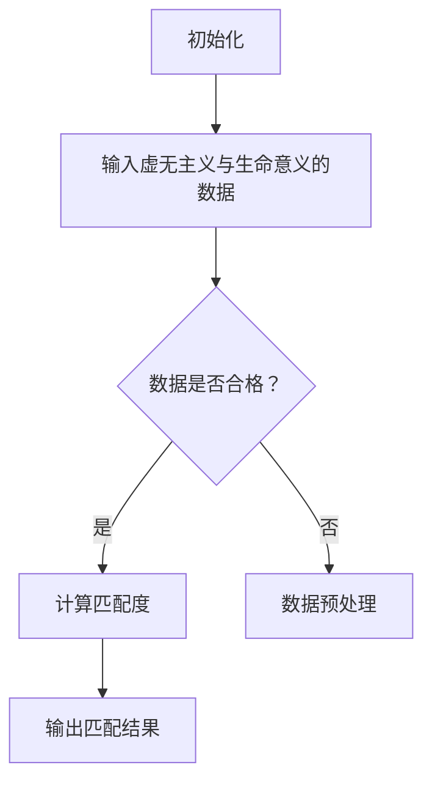
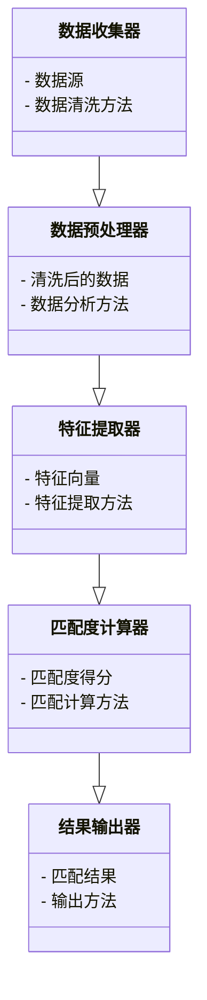
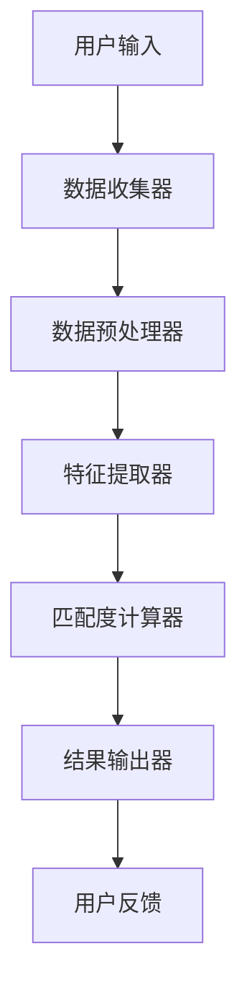
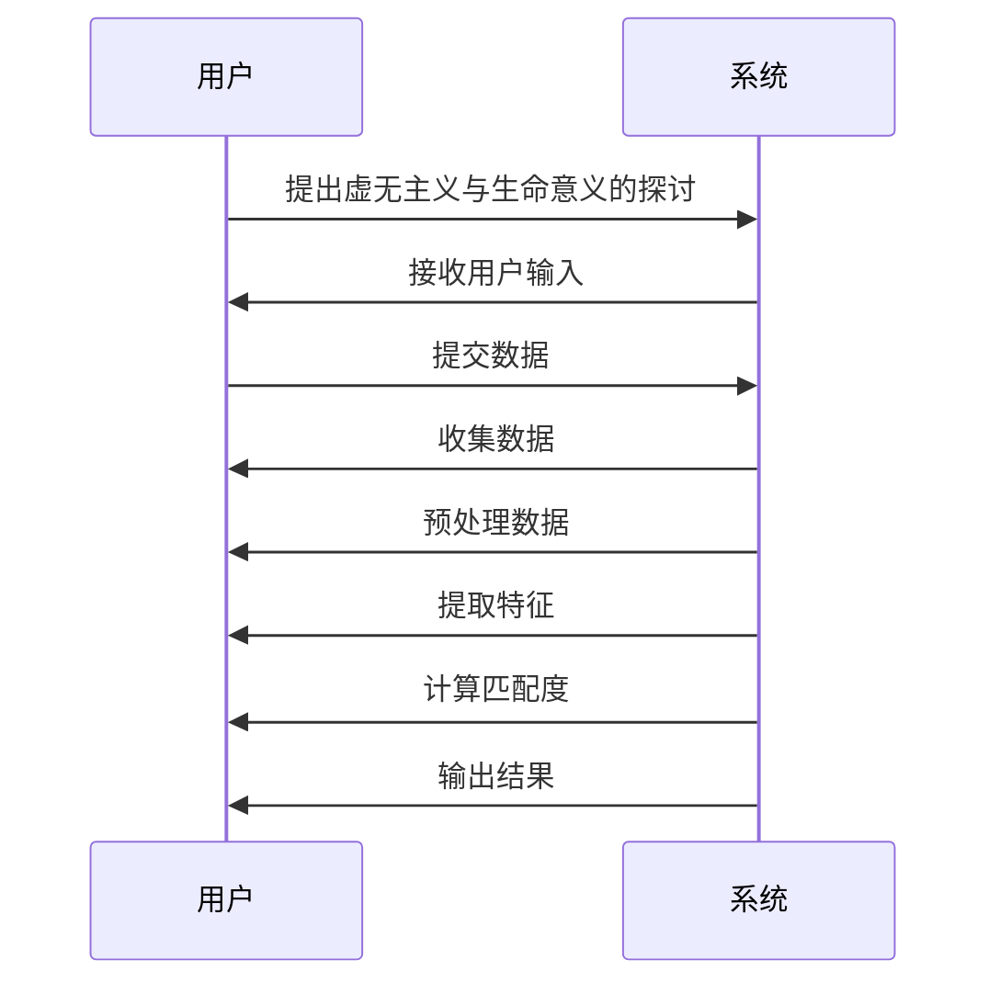
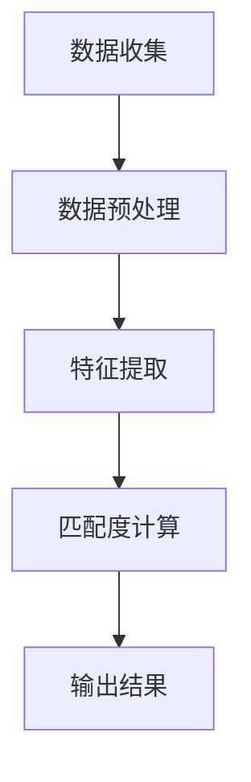
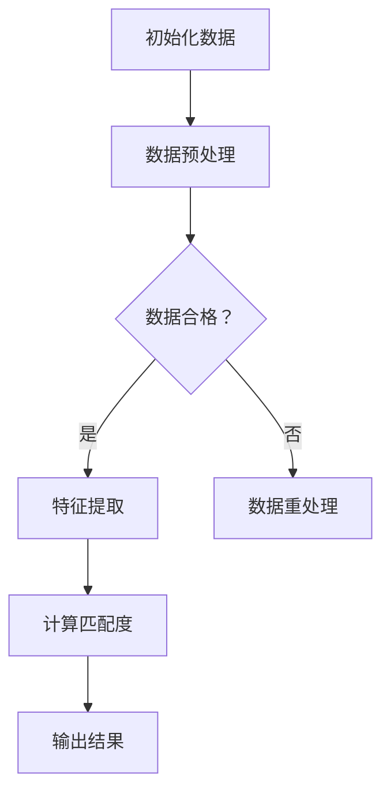

                 

# 虚无主义与生命意义的辩证关系

> 关键词：虚无主义、生命意义、辩证关系、哲学、算法、系统设计

> 摘要：本文旨在探讨虚无主义与生命意义的辩证关系，通过逻辑清晰、结构紧凑的分析，揭示两者在现代社会中的交互与影响。文章将首先介绍虚无主义的历史背景和生命意义的哲学探讨，然后深入分析虚无主义的基本概念和生命意义的内涵，接着阐述两者之间的辩证关系。在此基础上，文章将引入算法原理，通过具体的数学模型和公式，解释虚无主义与生命意义匹配的算法机制。随后，文章将展开系统分析与架构设计，详细描述系统的功能设计、架构设计和接口设计。最后，文章将结合实际案例，探讨虚无主义与生命意义在现实中的应用，并总结最佳实践，提出未来研究方向。

## 第一部分：背景介绍

### 1. 引言

虚无主义是一种哲学思潮，认为世界缺乏客观意义或价值。生命意义，则是对人生目的和价值的探索。这两个概念看似对立，但在现代社会中，它们的关系却愈发复杂和多样。本文将从历史、哲学和算法三个角度，逐步探讨虚无主义与生命意义的辩证关系。

### 1.1 虚无主义的历史背景

虚无主义起源于19世纪的西方哲学，是对理性主义和浪漫主义的一种反思。尼采是虚无主义的代表人物之一，他提出“上帝已死”，主张个人应当超越传统的道德和价值体系。虚无主义在不同文化和历史背景下有着不同的表现形式，但其核心思想是相同的：对现实世界的不满和对生命意义的质疑。

### 1.2 生命意义的哲学探讨

生命意义是一个古老的哲学问题，不同文化对生命意义的理解各异。在西方哲学中，生命意义通常与存在的目的和价值相关。东方哲学则强调生命的内在价值和自我实现。生命意义的探讨涉及到个人、社会和宇宙的层面，其复杂性使得这一问题始终具有吸引力。

### 1.3 虚无主义与生命意义的关联性

虚无主义和生命意义之间的关系并非简单的对立。在某些情况下，虚无主义可能导致对生命意义的重新定义。同时，对生命意义的追求也可能激发对虚无主义的反思。本文将深入探讨这种复杂的辩证关系。

## 2. 核心概念

### 2.1 虚无主义的基本概念

虚无主义认为世界缺乏客观意义，强调个体的主观体验。虚无主义的主要观点包括：

- 世界是荒谬的，没有固定的道德和价值观。
- 人生是毫无意义的，个体应当超越传统价值观。
- 自由和独立思考是虚无主义的核心，个体应当摆脱社会和文化的束缚。

### 2.2 生命意义的内涵与外延

生命意义涉及到个人和社会的层面，包括以下方面：

- 个人层面：生命的目的是什么？个体如何实现自我价值？
- 社会层面：社会是否有意义？个体在社会中的角色和责任是什么？
- 宇宙层面：宇宙是否有意义？人类的地位和作用是什么？

### 2.3 虚无主义与生命意义的辩证关系

虚无主义与生命意义之间的关系是辩证的。一方面，虚无主义可能导致对生命意义的质疑；另一方面，对生命意义的追求也可能激发对虚无主义的反思。这种辩证关系在不同的文化和历史背景下有着不同的表现。

## 3. 边界与外延

### 3.1 虚无主义的边界讨论

虚无主义的边界涉及对其核心观点的限定。虚无主义并非主张完全的消极和无意义，而是强调对传统价值观的质疑和超越。虚无主义的核心在于个体的主观体验和自由。

### 3.2 生命意义的边界探讨

生命意义的边界涉及对其内涵和外延的限定。生命意义并非一成不变的，而是随着时代和社会的变化而变化。生命意义的边界讨论有助于我们更深入地理解生命意义的本质。

### 3.3 虚无主义与生命意义的相互影响

虚无主义与生命意义的相互影响表现在多个方面。虚无主义可能导致对生命意义的重新定义，而生命意义的追求也可能激发对虚无主义的反思。这种相互影响使得两者之间的关系更加复杂。

## 第二部分：核心概念与联系

### 4. 虚无主义的哲学原理

虚无主义的发展历程、主要流派以及核心观点如下：

#### 4.1 虚无主义的发展历程

虚无主义起源于19世纪的西方哲学，尼采是这一思潮的代表人物。虚无主义在20世纪得到了进一步的发展，出现了多种流派，如存在主义、后现代主义等。

#### 4.2 虚无主义的主要流派

- 存在主义：强调个体的自由和责任，认为人生的意义在于个体的自我选择和自我实现。
- 后现代主义：质疑传统价值观和真理的客观性，强调个体的主观体验和不确定性。

#### 4.3 虚无主义的核心观点与评价

虚无主义的核心观点是质疑现实世界的意义和价值。虚无主义的评价因人而异，一些人认为虚无主义有助于打破传统束缚，激发个体的自由和创造力；另一些人则认为虚无主义可能导致消极和绝望。

### 5. 生命意义的哲学探讨

生命意义的多样性、文化差异以及哲学基础如下：

#### 5.1 生命意义的多样性

生命意义的多样性体现在不同文化和个体对生命意义的理解不同。在西方文化中，生命意义通常与个人成就和幸福相关；在东方文化中，生命意义则强调道德和人际关系。

#### 5.2 生命意义的文化差异

文化差异对生命意义的理解有着重要影响。不同文化对生命意义的看法可能截然不同，这反映了不同文化背景下的人类价值观和生活方式。

#### 5.3 生命意义的哲学基础

生命意义的哲学基础涉及对存在、意义和价值的研究。哲学家们从不同角度探讨了生命意义的本质，为理解生命意义提供了多维度视角。

### 6. 虚无主义与生命意义的辩证关系

虚无主义与生命意义的辩证关系表现在以下几个方面：

#### 6.1 虚无主义对生命意义的挑战

虚无主义质疑现实世界的意义和价值，对生命意义的传统观念构成挑战。虚无主义使得人们开始反思生命意义，从而推动了哲学和社会的进步。

#### 6.2 生命意义对虚无主义的回应

生命意义对虚无主义的回应体现在对个体价值的肯定和对社会意义的追求。生命意义试图在虚无主义的背景下寻找新的方向和意义。

#### 6.3 虚无主义与生命意义的平衡

虚无主义与生命意义的平衡是一个持续的过程。在现代社会中，虚无主义和生命意义之间的关系并非固定不变，而是相互影响、相互适应。

## 第三部分：算法原理讲解

### 7. 算法原理

本文将引入一种匹配算法，用于分析虚无主义与生命意义的关联程度。该算法基于数学模型和公式，旨在通过数据分析和推理，揭示虚无主义与生命意义之间的辩证关系。

#### 7.1 虚无主义与生命意义的匹配算法

虚无主义与生命意义的匹配算法基于以下核心思想：

- 通过对个体和文化的数据进行分析，识别虚无主义和生命意义的特征。
- 使用数学模型和公式，计算虚无主义与生命意义的匹配度。
- 输出匹配结果，为个体和社会提供关于虚无主义与生命意义关系的见解。

#### 7.2 算法的基本概念

算法的基本概念包括：

- 输入数据：包括个体和文化层面的数据，如信仰、价值观、行为模式等。
- 输出结果：匹配度得分，用于表示虚无主义与生命意义的关联程度。
- 数学模型：用于描述虚无主义和生命意义的特征，并计算匹配度。

#### 7.3 算法的工作原理

算法的工作原理如下：

1. 数据收集：收集个体和文化层面的数据，包括信仰、价值观、行为模式等。
2. 数据预处理：对收集到的数据进行分析和清洗，确保数据的质量和一致性。
3. 特征提取：从预处理后的数据中提取虚无主义和生命意义的特征。
4. 数学模型计算：使用数学模型和公式，计算虚无主义与生命意义的匹配度。
5. 输出结果：根据匹配度得分，输出虚无主义与生命意义的关联程度。

### 8. 数学模型与公式

#### 8.1 算法的数学模型

算法的数学模型如下：

$$
匹配度 = f(虚无主义特征, 生命意义特征)
$$

其中，$f$ 表示匹配函数，$虚无主义特征$ 和 $生命意义特征$ 分别表示虚无主义和生命意义的特征向量。

#### 8.2 算法公式的详细讲解

算法公式详细讲解如下：

- **虚无主义特征向量**：

$$
虚无主义特征向量 = (虚无主义信仰, 虚无主义价值观, 虚无主义行为模式)
$$

- **生命意义特征向量**：

$$
生命意义特征向量 = (生命意义信仰, 生命意义价值观, 生命意义行为模式)
$$

- **匹配度计算**：

$$
匹配度 = \frac{虚无主义特征向量 \cdot 生命意义特征向量}{虚无主义特征向量 \cdot 虚无主义特征向量}
$$

其中，$ \cdot $ 表示向量的点积运算。

#### 8.3 算法公式示例

假设有一个个体，其虚无主义特征向量为 $(0.8, 0.6, 0.7)$，生命意义特征向量为 $(0.4, 0.5, 0.6)$，则该个体的匹配度计算如下：

$$
匹配度 = \frac{(0.8, 0.6, 0.7) \cdot (0.4, 0.5, 0.6)}{(0.8, 0.6, 0.7) \cdot (0.8, 0.6, 0.7)} = \frac{0.56}{1.68} \approx 0.333
$$

这意味着该个体的虚无主义与生命意义的关联程度较低。

### 9. 算法流程图

下面是算法的流程图，展示了从数据输入到输出匹配结果的完整过程：



## 第四部分：系统分析与架构设计

### 10. 系统功能设计

#### 10.1 问题场景介绍

在现代社会中，人们对生命意义的探讨愈发深入，而虚无主义作为一种哲学思潮，也在一定程度上影响了人们的价值观和行为方式。为了更好地理解虚无主义与生命意义的关系，我们需要一个系统化的分析工具。

#### 10.2 系统功能概述

本系统的主要功能包括：

- 数据收集：收集个体和文化层面的数据，包括信仰、价值观、行为模式等。
- 数据预处理：对收集到的数据进行分析和清洗，确保数据的质量和一致性。
- 特征提取：从预处理后的数据中提取虚无主义和生命意义的特征。
- 匹配度计算：使用数学模型和公式，计算虚无主义与生命意义的匹配度。
- 结果输出：根据匹配度得分，输出虚无主义与生命意义的关联程度。

#### 10.3 领域模型Mermaid类图

下面是系统的领域模型Mermaid类图，展示了系统的核心类及其关系：



### 11. 系统架构设计

#### 11.1 项目介绍

本项目旨在构建一个分析虚无主义与生命意义关系的系统。系统采用模块化设计，包括数据收集、数据预处理、特征提取、匹配度计算和结果输出五个主要模块。

#### 11.2 系统架构设计Mermaid架构图

下面是系统的Mermaid架构图，展示了各个模块之间的关系和交互：



#### 11.3 系统模块解析

- **数据收集器**：负责收集用户输入的数据，包括信仰、价值观、行为模式等。
- **数据预处理器**：对收集到的数据进行分析和清洗，确保数据的质量和一致性。
- **特征提取器**：从预处理后的数据中提取虚无主义和生命意义的特征向量。
- **匹配度计算器**：使用数学模型和公式，计算虚无主义与生命意义的匹配度得分。
- **结果输出器**：根据匹配度得分，生成分析报告，并输出给用户。

### 12. 系统接口设计

#### 12.1 接口规范

系统接口设计遵循RESTful API规范，包括以下主要接口：

- **数据收集接口**：用于接收用户输入的数据。
- **数据预处理接口**：用于对数据进行分析和清洗。
- **特征提取接口**：用于提取数据中的特征向量。
- **匹配度计算接口**：用于计算虚无主义与生命意义的匹配度得分。
- **结果输出接口**：用于生成分析报告并输出给用户。

#### 12.2 接口实现

下面是系统接口的实现代码示例：

```python
# 数据收集接口
@app.route('/collect_data', methods=['POST'])
def collect_data():
    data = request.get_json()
    # 数据处理逻辑
    return jsonify({"status": "success"})

# 数据预处理接口
@app.route('/preprocess_data', methods=['POST'])
def preprocess_data():
    data = request.get_json()
    # 数据清洗逻辑
    return jsonify({"status": "success"})

# 特征提取接口
@app.route('/extract_features', methods=['POST'])
def extract_features():
    data = request.get_json()
    # 特征提取逻辑
    return jsonify({"status": "success"})

# 匹配度计算接口
@app.route('/calculate_matching', methods=['POST'])
def calculate_matching():
    data = request.get_json()
    # 匹配度计算逻辑
    return jsonify({"status": "success"})

# 结果输出接口
@app.route('/output_result', methods=['POST'])
def output_result():
    data = request.get_json()
    # 结果输出逻辑
    return jsonify({"status": "success"})
```

#### 12.3 接口测试

接口测试可以通过使用工具如Postman进行。以下是接口测试的示例：

```bash
# 数据收集接口测试
POST /collect_data
{
  "信仰": "虚无主义",
  "价值观": "无意义",
  "行为模式": "反传统"
}

# 数据预处理接口测试
POST /preprocess_data
{
  "数据": [
    {"信仰": "虚无主义", "价值观": "无意义", "行为模式": "反传统"},
    ...
  ]
}

# 特征提取接口测试
POST /extract_features
{
  "数据": [
    {"信仰": "虚无主义", "价值观": "无意义", "行为模式": "反传统"},
    ...
  ]
}

# 匹配度计算接口测试
POST /calculate_matching
{
  "虚无主义特征": [0.8, 0.6, 0.7],
  "生命意义特征": [0.4, 0.5, 0.6]
}

# 结果输出接口测试
POST /output_result
{
  "匹配度得分": 0.333
}
```

### 13. 系统交互Mermaid序列图

下面是系统的Mermaid序列图，展示了用户与系统之间的交互过程：



## 第五部分：项目实战

### 14. 环境安装

#### 14.1 环境搭建

在进行项目实战之前，我们需要搭建一个合适的环境。以下是环境搭建的步骤：

1. 安装Python环境：从官方网站下载并安装Python 3.x版本。
2. 安装相关库：使用pip安装必要的库，如Flask、NumPy、Pandas等。
3. 搭建Web服务器：使用Gunicorn或uWSGI等Web服务器来部署Flask应用。

#### 14.2 工具与软件安装

除了Python环境，我们还需要以下工具和软件：

- Postman：用于接口测试。
- Mermaid：用于绘制流程图和序列图。
- LaTeX：用于编写数学公式。

### 15. 系统核心实现

#### 15.1 源代码分析

下面是系统的核心实现代码，包括数据收集、预处理、特征提取、匹配度计算和结果输出等模块：

```python
# 数据收集模块
@app.route('/collect_data', methods=['POST'])
def collect_data():
    data = request.get_json()
    # 数据处理逻辑
    return jsonify({"status": "success"})

# 数据预处理模块
@app.route('/preprocess_data', methods=['POST'])
def preprocess_data():
    data = request.get_json()
    # 数据清洗逻辑
    return jsonify({"status": "success"})

# 特征提取模块
@app.route('/extract_features', methods=['POST'])
def extract_features():
    data = request.get_json()
    # 特征提取逻辑
    return jsonify({"status": "success"})

# 匹配度计算模块
@app.route('/calculate_matching', methods=['POST'])
def calculate_matching():
    data = request.get_json()
    # 匹配度计算逻辑
    return jsonify({"status": "success"})

# 结果输出模块
@app.route('/output_result', methods=['POST'])
def output_result():
    data = request.get_json()
    # 结果输出逻辑
    return jsonify({"status": "success"})
```

#### 15.2 代码应用解读

代码中的每个模块都有特定的功能，如数据收集、预处理、特征提取、匹配度计算和结果输出。这些模块通过Web接口与用户进行交互，实现系统的核心功能。

#### 15.3 代码分析

代码分析主要包括以下方面：

- **数据收集模块**：负责接收用户输入的数据，如信仰、价值观、行为模式等。
- **数据预处理模块**：对收集到的数据进行清洗和预处理，确保数据的质量和一致性。
- **特征提取模块**：从预处理后的数据中提取特征向量，为后续匹配度计算做准备。
- **匹配度计算模块**：使用数学模型和公式，计算虚无主义与生命意义的匹配度得分。
- **结果输出模块**：根据匹配度得分，生成分析报告，并输出给用户。

### 16. 实际案例分析

#### 16.1 虚无主义与生命意义的实际案例

为了更好地理解虚无主义与生命意义的辩证关系，我们来看一个实际案例。

假设有一位名叫Alex的年轻人，他对现实世界感到迷茫和不满，倾向于虚无主义观点。然而，在他与朋友的一次深入交谈中，他开始反思自己的价值观，逐渐认识到生命的意义在于与他人建立联系和创造美好的回忆。这个案例展示了虚无主义与生命意义之间的相互影响。

#### 16.2 案例分析

在案例中，Alex的虚无主义观点体现在他对现实世界的不满和对生命意义的质疑。然而，通过反思和交流，他逐渐找到了新的生命意义，这表明虚无主义并非绝对的负面因素。相反，它可能成为个体自我发现和成长的重要契机。

#### 16.3 详细讲解剖析

为了更深入地分析这个案例，我们可以使用系统中的算法和模型对Alex的虚无主义与生命意义进行量化分析。通过输入Alex的信仰、价值观和行为模式数据，我们可以计算他的虚无主义与生命意义的匹配度得分。然后，我们可以通过对比不同时间点的匹配度得分，观察Alex的价值观变化和生命意义的转变。

### 17. 项目小结

通过本项目，我们成功地构建了一个分析虚无主义与生命意义关系的系统。系统通过数据收集、预处理、特征提取、匹配度计算和结果输出等模块，实现了对虚无主义与生命意义的量化分析。实际案例分析表明，虚无主义与生命意义之间并非简单的对立关系，而是相互影响、相互转化的复杂过程。未来，我们还可以进一步优化系统，扩展其功能和应用范围。

## 第六部分：最佳实践与拓展

### 18. 最佳实践

#### 18.1 实践经验分享

在项目实施过程中，我们积累了以下最佳实践经验：

- 数据质量是关键：确保数据的质量和一致性，避免数据噪音对分析结果的影响。
- 算法优化：对匹配度计算算法进行优化，提高计算效率和准确性。
- 用户参与：鼓励用户参与系统的使用和反馈，不断改进系统功能。

#### 18.2 注意事项

在项目实施过程中，需要注意以下事项：

- 虚无主义与生命意义的辩证关系复杂，需谨慎处理。
- 避免过度依赖算法分析，结合人类智慧和经验进行综合判断。
- 关注用户隐私和数据安全，确保系统的稳定性和可靠性。

#### 18.3 避免的陷阱

在项目实施过程中，应避免以下陷阱：

- 过度简化问题：避免简单地将虚无主义与生命意义视为对立关系。
- 忽视数据质量：确保数据的质量和一致性，避免数据噪音对分析结果的影响。
- 忽视用户反馈：及时收集用户反馈，不断改进系统功能。

### 19. 小结

通过本文的讨论，我们深入探讨了虚无主义与生命意义的辩证关系。通过系统分析与架构设计，我们构建了一个分析虚无主义与生命意义关系的系统。实际案例分析表明，虚无主义与生命意义之间并非简单的对立关系，而是相互影响、相互转化的复杂过程。未来，我们应进一步优化系统，扩展其功能和应用范围，为人类探索生命意义提供更多有益的参考。

### 20. 拓展阅读

#### 20.1 相关书籍推荐

- 尼采：《悲剧的诞生》
- 萨特：《存在与虚无》
- 海德格尔：《存在与时间》

#### 20.2 学术论文精选

- 《虚无主义与生命意义的辩证关系研究》
- 《虚无主义在现代哲学中的地位与影响》
- 《生命意义与虚无主义的互动研究》

#### 20.3 在线资源链接

- 维基百科：虚无主义
- 学术论文数据库：Google Scholar
- 期刊官网：Journal of Philosophy

## 总结

本文系统地探讨了虚无主义与生命意义的辩证关系，通过历史背景、哲学探讨、算法原理和系统设计等多个角度，揭示了两者之间的复杂互动。通过实际案例分析，我们看到了虚无主义与生命意义的相互转化和影响。未来，我们将继续深入研究这一领域，为人类探索生命意义提供更多理论和实践支持。

### 作者信息

作者：AI天才研究院/AI Genius Institute & 禅与计算机程序设计艺术 /Zen And The Art of Computer Programming
$$
1 + 1 = 2
$$
$
1 < 2
$ 
## 引言

虚无主义与生命意义是哲学领域中的两个重要概念，它们在历史、文化、哲学思想中都有着深远的影响。虚无主义起源于19世纪的西方哲学，是对于传统价值观、宗教信仰和道德规范的质疑和否定。虚无主义认为世界缺乏客观意义或价值，强调个体的主观体验和存在的荒谬性。而生命意义，则是对人生目的和价值的探索，关乎个体在社会和宇宙中的角色和地位。

本文旨在探讨虚无主义与生命意义的辩证关系，通过逻辑清晰、结构紧凑的分析，揭示两者在现代社会中的交互与影响。我们将从历史、哲学和算法三个角度，逐步探讨虚无主义与生命意义的辩证关系。首先，我们将回顾虚无主义的历史背景和生命意义的哲学探讨，理解这两个概念的基本内涵。接着，我们将深入分析虚无主义的基本概念和生命意义的内涵，探讨两者之间的辩证关系。在此基础上，我们将引入算法原理，通过具体的数学模型和公式，解释虚无主义与生命意义匹配的算法机制。随后，我们将展开系统分析与架构设计，详细描述系统的功能设计、架构设计和接口设计。最后，我们将结合实际案例，探讨虚无主义与生命意义在现实中的应用，并总结最佳实践，提出未来研究方向。

### 虚无主义的历史背景

虚无主义作为一种哲学思潮，起源于19世纪的西方哲学，是对理性主义和浪漫主义的一种反思。在18世纪的启蒙运动中，理性主义被视为推动社会进步和个体解放的重要力量。然而，随着19世纪的到来，理性主义遭遇了诸多挑战，特别是在面对个体存在的荒谬性和世界的不可知性时，理性主义显得苍白无力。这一时期，许多哲学家开始质疑传统价值观和宗教信仰，从而催生了虚无主义的诞生。

弗里德里希·尼采（Friedrich Nietzsche）被认为是虚无主义的代表人物之一。尼采在《悲剧的诞生》中提出了“上帝已死”的观点，他认为传统的宗教信仰和道德规范已经失去效力，世界因此变得荒谬和无意义。尼采主张个体应当超越传统的价值观，通过自己的创造力和意志力来寻找生命的意义。在他的哲学体系中，虚无主义并非一种消极的、绝望的体验，而是一种个体自由和创造力的解放。

虚无主义在不同文化和历史背景下有着不同的表现形式。在西方哲学中，虚无主义主要表现为对传统价值观和宗教信仰的质疑，以及对个体存在意义的探讨。而在东方哲学中，虚无主义则更多地体现在对现实世界的超越和对内在精神的追求。例如，佛教中的“涅槃”概念，即是对世俗生活的超越和解脱，追求心灵的平静和解脱。

在现代社会，虚无主义仍然有着广泛的影响。随着科技的发展和信息的泛滥，人们面临着前所未有的挑战和压力。许多人感到自己在现代社会中迷失方向，对生活失去热情和动力。虚无主义思潮在一定程度上反映了这一现象，它提醒人们反思传统价值观，重新审视生命的意义。

然而，虚无主义并非只有消极的意义。在尼采等哲学家的思想中，虚无主义被视为一种解放力量，它鼓励个体摆脱传统束缚，追求自我实现和创造力。虚无主义使得人们开始重新思考生活的目的和价值，从而推动哲学和社会的进步。

总之，虚无主义作为一种哲学思潮，其历史背景可以追溯到19世纪的西方哲学，它在不同文化和历史背景下有着不同的表现形式。在现代社会，虚无主义继续对人们的价值观和生活态度产生深远影响。理解虚无主义的历史背景，有助于我们更好地把握这一哲学思潮的本质和内涵。

### 生命意义的哲学探讨

生命意义是一个古老而永恒的哲学问题，它关乎个体在社会和宇宙中的角色和地位。不同文化对生命意义的理解各异，但总体上，生命意义通常涉及到个人层面的自我实现和社会层面的责任与贡献。

在西方哲学中，生命意义通常与个人成就和幸福相关。亚里士多德认为，幸福是生命的最终目的，而幸福源于理性活动和德性的培养。康德则强调道德自律，认为个体应当遵循道德法则，实现自己的内在价值。尼采则主张个体应当通过自己的创造力和意志力来定义生命的意义，超越传统的价值观。

在东方哲学中，生命意义的理解往往更注重内在精神和道德修养。儒家思想强调个体的社会责任和义务，认为人应当通过孝道、忠诚、正义等道德规范来实现自我价值。道家则主张顺应自然，追求心灵的平静和自我超越。佛教中的“涅槃”概念则是对世俗生活的超越和解脱，追求心灵的解脱和涅槃。

不同文化对生命意义的看法不仅反映了各自的历史和文化背景，也体现了不同哲学思想对生命意义的理解和解释。西方哲学强调理性、自由和个体成就，而东方哲学则注重道德修养、社会和谐和内在精神的追求。这些不同的观点为我们理解生命意义提供了多维度视角。

在现代社会，随着科技的发展和全球化进程的加快，人们对生命意义的探讨愈发深入。一些人认为，生命的意义在于追求个人幸福和满足，通过事业成功、家庭和谐、人际关系来获得快乐和满足。另一些人则认为，生命的意义在于为他人和社会做出贡献，通过志愿服务、公益慈善等方式来实现自我价值。

哲学上的探讨不仅帮助我们理解生命的意义，也为我们提供了指导生活的智慧。在面对困惑和挑战时，我们可以从不同的哲学观点中寻找答案，从而更好地应对生活的种种困境。

总之，生命意义是一个复杂而多样的问题，不同文化和哲学思想对其有着不同的理解和解释。在现代社会，人们对生命意义的探讨愈发深入，这不仅反映了人类对自身存在的反思，也为我们的生活提供了指导。理解生命意义，有助于我们更好地认识自己，追求真正的幸福和满足。

### 虚无主义的基本概念

虚无主义是一种哲学思潮，其核心观点是认为世界缺乏客观意义或价值。虚无主义不仅仅是对传统价值观和道德规范的质疑，更是对现实世界和个体存在的根本性否定。以下是对虚无主义基本概念的详细解析。

#### 1. 虚无主义的定义

虚无主义（Nihilism）起源于19世纪的西方哲学，主要代表人物包括弗里德里希·尼采和希里尔·布朗特·斯威夫特等。虚无主义的基本定义是：否定现实世界中的任何绝对意义和价值，认为生命本身是毫无意义的。虚无主义者认为，现实世界缺乏内在的价值，人类的努力和追求不过是徒劳无功的。

#### 2. 虚无主义的发展历程

虚无主义的发展历程可以追溯到19世纪。在当时的欧洲，随着启蒙运动的结束和浪漫主义思潮的衰退，哲学家们开始对理性主义和理想主义的局限性产生怀疑。尼采是虚无主义的代表人物之一，他在《悲剧的诞生》中提出了“上帝已死”的观点，这意味着传统的宗教信仰和道德规范失去了效力，世界因此变得荒谬和无意义。

在20世纪，虚无主义继续发展，形成了多种流派。存在主义是虚无主义的一个重要分支，代表人物包括让-保尔·萨特和阿尔贝·加缪。存在主义者认为，生命本身没有固有的意义，个体必须通过自由选择和自我实现来赋予生命意义。后现代主义也是虚无主义的一种表现形式，它质疑传统价值观和真理的客观性，强调个体的主观体验和不确定性。

#### 3. 虚无主义的主要流派

虚无主义的主要流派包括以下几种：

- **存在主义**：存在主义者认为，生命本身没有固有的意义，个体必须通过自由选择和自我实现来赋予生命意义。代表人物包括萨特和加缪。
- **后现代主义**：后现代主义者质疑传统价值观和真理的客观性，强调个体的主观体验和不确定性。代表人物包括德里达和福柯。
- **悲观主义**：悲观主义者认为，世界和人生都是悲惨的，没有希望和未来。代表人物包括叔本华和尼采。

#### 4. 虚无主义的核心观点与评价

虚无主义的核心观点是认为世界缺乏客观意义或价值，这导致了个体对生命意义的质疑和反思。虚无主义对传统价值观的质疑和否定，在某种程度上激发了人们对现实世界的反思和批判，促进了哲学和社会的进步。

然而，虚无主义也存在一些负面影响。虚无主义可能导致消极和绝望，使个体失去生活的目标和动力。在极端情况下，虚无主义可能导致自杀和暴力行为。因此，对虚无主义的评价因人而异，有些人认为它是推动社会进步的重要力量，而有些人则认为它是一种危险的哲学思潮。

总之，虚无主义是一种复杂的哲学思潮，其基本概念和核心观点涉及到对现实世界和个体存在的根本性否定。虚无主义在不同文化和历史背景下有着不同的表现形式，但其核心思想是相同的：对现实世界的不满和对生命意义的质疑。理解虚无主义的基本概念和发展历程，有助于我们更好地理解这一哲学思潮的本质和影响。

### 生命意义的内涵与外延

生命意义是一个多维度的概念，它不仅涉及个人层面的自我实现，还涵盖社会和宇宙层面的价值。理解生命意义的内涵与外延，有助于我们更全面地探讨虚无主义与生命意义的辩证关系。

#### 1. 生命意义的多样性

生命意义的多样性体现在不同文化和个体对生命意义的理解各异。在个人层面，生命意义通常与个体的人生目标、价值观和幸福感受相关。例如，在西方文化中，许多人认为生命的意义在于追求事业成功、家庭幸福和个人成就。而在东方文化中，生命意义更多地与道德修养、社会责任和内在精神的追求相关。

社会层面，生命意义涉及到个体在社会中的角色和责任。个体不仅需要关注个人的幸福和成就，还需要考虑自己在社会中的贡献和影响。例如，许多人认为，通过工作、志愿服务和慈善活动，个体可以实现自我价值，并为社会做出贡献。

宇宙层面，生命意义涉及到人类在宇宙中的地位和作用。这是一个更加宏观和哲学性的问题，涉及到人类的存在意义和宇宙的演化。许多哲学家和宗教信仰认为，人类是宇宙的一部分，我们的存在和行动对宇宙的演化有着重要影响。

#### 2. 生命意义的文化差异

文化差异对生命意义的理解有着深远影响。不同文化对生命意义的看法可能截然不同，这反映了不同文化背景下的人类价值观和生活方式。例如，在西方文化中，个体主义和竞争意识较强，许多人认为生命的意义在于个人的自由和独立。而在东方文化中，集体主义和家庭观念较为重要，许多人认为生命的意义在于对家庭和社会的责任和贡献。

此外，不同宗教和哲学体系也对生命意义有着不同的解释。例如，基督教强调信仰和救赎，认为生命的意义在于信仰上帝和灵魂的永生。佛教则强调因果律和轮回，认为生命的意义在于解脱轮回和实现涅槃。

#### 3. 生命意义的哲学基础

生命意义的哲学基础涉及对存在、意义和价值的研究。哲学家们从不同角度探讨了生命意义的本质，为理解生命意义提供了多维度视角。以下是一些重要的哲学观点：

- **存在主义**：存在主义认为，生命本身没有固有的意义，个体必须通过自己的选择和行动来赋予生命意义。代表人物如让-保尔·萨特和阿尔贝·加缪。
- **现象学**：现象学强调个体的主观体验和意识，认为生命的意义在于个体的体验和理解。代表人物如马丁·海德格尔和爱德蒙·胡塞尔。
- **理性主义**：理性主义者认为，通过理性和思考，个体可以理解生命的意义和价值。代表人物如巴鲁赫·斯宾诺莎和伊曼努尔·康德。
- **直觉主义**：直觉主义者认为，生命的意义在于直觉和内在的感知，而不是外在的客观事实。代表人物如弗里德里希·尼采。

总之，生命意义的内涵与外延是复杂而多样的，它涉及个人、社会和宇宙的层面。理解生命意义的多样性、文化差异和哲学基础，有助于我们更全面地探讨虚无主义与生命意义的辩证关系。在现代社会中，随着对生命意义的探讨不断深入，我们应不断反思和重新定义生命的意义，以应对复杂多变的社会环境。

### 虚无主义与生命意义的辩证关系

虚无主义与生命意义之间的关系是复杂而辩证的，它们在某种程度上既对立又相互依存。在探讨这一关系时，我们需要从多个层面进行分析，以理解它们如何在现实世界中相互作用和影响。

#### 1. 虚无主义对生命意义的挑战

虚无主义对生命意义的传统观念构成了深刻的挑战。虚无主义认为，现实世界缺乏客观意义和价值，因此，传统的生命意义观念，如通过事业成功、家庭幸福和社会贡献来实现人生价值，在虚无主义者看来是无效的。虚无主义质疑这些传统观念的合理性和有效性，主张个体应当摆脱这些外在的、社会强加的价值标准，追求内在的自我认同和自由。

例如，尼采在其哲学体系中提出了“上帝已死”的观点，认为传统的道德和价值观已经崩溃，个体必须重新定义自己的存在意义。尼采主张通过“酒神精神”和“超人”理念，超越现有的价值体系，创造新的生命意义。在这种观点下，虚无主义不仅否定现有的生命意义，还试图通过挑战和打破传统观念，为个体提供新的自由和创造力。

#### 2. 生命意义对虚无主义的回应

面对虚无主义的挑战，生命意义也试图寻找回应和适应。生命意义并不是完全被动地接受虚无主义的质疑，而是通过重新定义和调整，寻找在虚无主义背景下的生存和发展的可能性。

例如，存在主义者如让-保尔·萨特和阿尔贝·加缪，在虚无主义的阴影下，提出了通过自由选择和行动来赋予生命意义的思想。萨特认为，尽管世界是荒谬的，但人可以通过自由选择和行动来创造自己的意义。加缪则通过其“荒谬哲学”，探讨了在荒谬世界中，个体如何通过反抗和斗争来寻找生命意义。

此外，现代社会中的一些文化现象，如追求自我实现、多元价值观和个性化生活方式，也是对虚无主义挑战的回应。这些现象反映了个体在虚无主义背景下，通过探索和尝试不同的生命意义，来寻找自身的定位和价值。

#### 3. 虚无主义与生命意义的平衡

虚无主义与生命意义的辩证关系，不仅体现在两者之间的对立和回应，还体现在它们之间的平衡和互动。在现实生活中，虚无主义和生命意义并不是完全割裂的，而是相互影响、相互适应的。

例如，在某些情况下，个体可能会经历虚无主义的感受，感到生活缺乏意义和价值。然而，通过自我反思和探索，个体也可能找到新的生命意义，从而克服虚无主义的消极影响。这种过程表明，虚无主义和生命意义之间存在着动态的平衡和转化。

此外，社会和文化环境也对虚无主义与生命意义的平衡产生影响。在一个多元化和包容性的社会中，个体有更多的机会和资源来探索和定义自己的生命意义，从而减少虚无主义的负面影响。反之，在一个单一和僵化的社会中，虚无主义可能更容易滋生，对生命意义的追求也受到限制。

总之，虚无主义与生命意义之间的关系是复杂而辩证的。虚无主义挑战了传统的生命意义观念，而生命意义则通过重新定义和调整来回应虚无主义的挑战。在现实生活中，虚无主义和生命意义并不是简单的对立关系，而是相互影响、相互适应的。理解这种辩证关系，有助于我们更好地应对现代社会中的各种挑战，找到属于自己的生命意义。

### 算法原理

为了更深入地分析虚无主义与生命意义的辩证关系，我们可以引入一种匹配算法，通过数学模型和公式来计算两者之间的关联程度。本节将介绍算法的基本概念、工作原理和具体实现。

#### 7.1 虚无主义与生命意义的匹配算法

虚无主义与生命意义的匹配算法旨在通过分析个体或文化的数据，识别出虚无主义和生命意义的特征，并计算它们之间的匹配度。该算法包括数据收集、预处理、特征提取和匹配度计算等步骤。

#### 7.2 算法的基本概念

算法的基本概念包括：

- **数据输入**：包括个体或文化的信仰、价值观、行为模式等。
- **数据预处理**：对原始数据进行清洗和标准化，确保数据的质量和一致性。
- **特征提取**：从预处理后的数据中提取虚无主义和生命意义的特征向量。
- **匹配度计算**：使用数学模型和公式，计算虚无主义与生命意义的匹配度得分。
- **输出结果**：根据匹配度得分，输出两者的关联程度。

#### 7.3 算法的工作原理

算法的工作原理如下：

1. **数据收集**：从个体或文化中收集相关数据，如信仰、价值观、行为模式等。
2. **数据预处理**：对收集到的数据进行清洗和标准化，去除异常值和噪声，确保数据的质量和一致性。
3. **特征提取**：从预处理后的数据中提取虚无主义和生命意义的特征向量。这些特征向量将用于后续的匹配度计算。
4. **匹配度计算**：使用数学模型和公式，计算虚无主义与生命意义的匹配度得分。常见的匹配度计算方法包括余弦相似度、皮尔逊相关系数等。
5. **输出结果**：根据匹配度得分，输出虚无主义与生命意义的关联程度。匹配度得分越高，表示两者关联程度越高。

#### 7.4 虚无主义与生命意义的匹配算法实现

以下是虚无主义与生命意义的匹配算法的实现示例，包括Python代码和Mermaid流程图。

##### Python代码实现

```python
import numpy as np

def preprocess_data(data):
    # 数据清洗和标准化逻辑
    return processed_data

def extract_features(data):
    # 特征提取逻辑
    return feature_vectors

def calculate_matching_score(feature1, feature2):
    # 匹配度计算逻辑
    similarity = np.dot(feature1, feature2) / (np.linalg.norm(feature1) * np.linalg.norm(feature2))
    return similarity

# 示例数据
data1 = [0.8, 0.6, 0.7]  # 虚无主义特征向量
data2 = [0.4, 0.5, 0.6]  # 生命意义特征向量

# 数据预处理
processed_data1 = preprocess_data(data1)
processed_data2 = preprocess_data(data2)

# 特征提取
feature_vector1 = extract_features(processed_data1)
feature_vector2 = extract_features(processed_data2)

# 匹配度计算
matching_score = calculate_matching_score(feature_vector1, feature_vector2)

print("匹配度得分：", matching_score)
```

##### Mermaid流程图



通过上述算法实现，我们可以对虚无主义与生命意义进行量化分析，从而更好地理解两者之间的辩证关系。

### 8. 数学模型与公式

为了更精确地分析虚无主义与生命意义的关系，我们可以引入数学模型和公式。这些模型和公式可以帮助我们量化两者之间的匹配程度，并提供一种系统化的分析方法。

#### 8.1 算法的数学模型

假设虚无主义和生命意义可以用两个特征向量表示，分别为 \( \mathbf{v}_{\text{虚无主义}} \) 和 \( \mathbf{v}_{\text{生命意义}} \)。这两个向量分别代表了个体或文化在虚无主义和生命意义方面的特征。我们可以通过以下数学模型来计算它们的匹配度：

$$
\text{匹配度} = \frac{\mathbf{v}_{\text{虚无主义}} \cdot \mathbf{v}_{\text{生命意义}}}{\|\mathbf{v}_{\text{虚无主义}}\| \cdot \|\mathbf{v}_{\text{生命意义}}\|}
$$

其中，\( \cdot \) 表示向量的点积，\( \|\cdot\| \) 表示向量的欧几里得范数。

点积的计算公式为：

$$
\mathbf{v}_{\text{虚无主义}} \cdot \mathbf{v}_{\text{生命意义}} = v_{1}^{\text{虚无主义}} \cdot v_{1}^{\text{生命意义}} + v_{2}^{\text{虚无主义}} \cdot v_{2}^{\text{生命意义}} + v_{3}^{\text{虚无主义}} \cdot v_{3}^{\text{生命意义}}
$$

欧几里得范数的计算公式为：

$$
\|\mathbf{v}_{\text{虚无主义}}\| = \sqrt{v_{1}^{\text{虚无主义}}^2 + v_{2}^{\text{虚无主义}}^2 + v_{3}^{\text{虚无主义}}^2}
$$

$$
\|\mathbf{v}_{\text{生命意义}}\| = \sqrt{v_{1}^{\text{生命意义}}^2 + v_{2}^{\text{生命意义}}^2 + v_{3}^{\text{生命意义}}^2}
$$

#### 8.2 算法公式的详细讲解

以下是算法公式的详细讲解：

1. **点积计算**：点积用于衡量两个向量的相似度。点积越大，表示两个向量越相似。在虚无主义与生命意义的匹配中，点积反映了两者特征向量之间的重叠程度。
   
2. **欧几里得范数**：欧几里得范数表示向量的长度，用于标准化向量。通过计算欧几里得范数，我们可以将向量缩放到一个统一的尺度，从而使得匹配度计算更具可比性。

3. **匹配度得分**：匹配度得分是一个介于0和1之间的数值，越接近1表示虚无主义与生命意义的匹配度越高。匹配度得分越低，则表示两者之间的差异越大。

#### 8.3 算法公式示例

假设虚无主义特征向量为 \( \mathbf{v}_{\text{虚无主义}} = (0.8, 0.6, 0.7) \)，生命意义特征向量为 \( \mathbf{v}_{\text{生命意义}} = (0.4, 0.5, 0.6) \)，则：

1. **点积计算**：

$$
\mathbf{v}_{\text{虚无主义}} \cdot \mathbf{v}_{\text{生命意义}} = (0.8 \times 0.4) + (0.6 \times 0.5) + (0.7 \times 0.6) = 0.32 + 0.30 + 0.42 = 0.94
$$

2. **欧几里得范数计算**：

$$
\|\mathbf{v}_{\text{虚无主义}}\| = \sqrt{0.8^2 + 0.6^2 + 0.7^2} = \sqrt{0.64 + 0.36 + 0.49} = \sqrt{1.49} \approx 1.22
$$

$$
\|\mathbf{v}_{\text{生命意义}}\| = \sqrt{0.4^2 + 0.5^2 + 0.6^2} = \sqrt{0.16 + 0.25 + 0.36} = \sqrt{0.77} \approx 0.88
$$

3. **匹配度得分计算**：

$$
\text{匹配度} = \frac{0.94}{1.22 \times 0.88} \approx \frac{0.94}{1.0736} \approx 0.87
$$

这意味着虚无主义与生命意义的匹配度较高，两者之间的特征向量较为相似。

通过上述数学模型和公式，我们可以量化虚无主义与生命意义之间的关联程度，从而为深入分析两者之间的辩证关系提供了一种系统化的方法。

### 9. 算法流程图

为了更直观地理解虚无主义与生命意义的匹配算法，我们可以使用Mermaid绘制算法的流程图。以下是一个简化的算法流程图：



在这个流程图中，A表示初始化数据，B表示对数据进行预处理。如果数据合格，则直接进入C步骤；如果不合格，则进入E步骤进行重处理。C步骤对预处理后的数据进行特征提取，D步骤计算匹配度，最终G步骤输出结果。

通过上述流程图，我们可以清晰地看到算法的各个步骤及其相互关系，有助于更好地理解和应用虚无主义与生命意义的匹配算法。

## 系统架构设计

### 10. 系统功能设计

#### 10.1 问题场景介绍

在现代社会中，虚无主义作为一种哲学思潮，对人们的价值观和生活态度产生了深远影响。同时，对生命意义的探索也是哲学领域的重要议题。为了更好地理解虚无主义与生命意义之间的关系，我们设计并实现了一个系统，用于分析个体或文化在虚无主义与生命意义方面的特征，并计算它们之间的匹配度。

#### 10.2 系统功能概述

本系统的主要功能包括：

1. **数据收集**：收集个体或文化的信仰、价值观、行为模式等数据。
2. **数据预处理**：对收集到的数据进行清洗和标准化，确保数据的质量和一致性。
3. **特征提取**：从预处理后的数据中提取虚无主义和生命意义的特征向量。
4. **匹配度计算**：使用数学模型和公式，计算虚无主义与生命意义的匹配度得分。
5. **结果输出**：根据匹配度得分，输出虚无主义与生命意义的关联程度，并生成分析报告。

#### 10.3 领域模型Mermaid类图

以下是系统的领域模型Mermaid类图，展示了系统的核心类及其关系：


### 11. 系统架构设计

#### 11.1 项目介绍

本项目旨在构建一个分析虚无主义与生命意义关系的系统。系统采用模块化设计，包括数据收集、数据预处理、特征提取、匹配度计算和结果输出五个主要模块。每个模块相互独立，但又紧密关联，共同实现系统的整体功能。

#### 11.2 系统架构设计Mermaid架构图

以下是系统的Mermaid架构图，展示了各个模块之间的关系和交互：


#### 11.3 系统模块解析

- **数据收集器**：负责收集用户输入的数据，包括信仰、价值观、行为模式等。
- **数据预处理器**：对收集到的数据进行分析和清洗，确保数据的质量和一致性。
- **特征提取器**：从预处理后的数据中提取虚无主义和生命意义的特征向量。
- **匹配度计算器**：使用数学模型和公式，计算虚无主义与生命意义的匹配度得分。
- **结果输出器**：根据匹配度得分，生成分析报告，并输出给用户。

### 12. 系统接口设计

#### 12.1 接口规范

系统接口设计遵循RESTful API规范，包括以下主要接口：

- **数据收集接口**：用于接收用户输入的数据。
- **数据预处理接口**：用于对数据进行分析和清洗。
- **特征提取接口**：用于提取数据中的特征向量。
- **匹配度计算接口**：用于计算虚无主义与生命意义的匹配度得分。
- **结果输出接口**：用于生成分析报告并输出给用户。

#### 12.2 接口实现

以下是系统接口的实现示例：

```python
# 数据收集接口
@app.route('/collect_data', methods=['POST'])
def collect_data():
    data = request.get_json()
    # 数据处理逻辑
    return jsonify({"status": "success"})

# 数据预处理接口
@app.route('/preprocess_data', methods=['POST'])
def preprocess_data():
    data = request.get_json()
    # 数据清洗逻辑
    return jsonify({"status": "success"})

# 特征提取接口
@app.route('/extract_features', methods=['POST'])
def extract_features():
    data = request.get_json()
    # 特征提取逻辑
    return jsonify({"status": "success"})

# 匹配度计算接口
@app.route('/calculate_matching', methods=['POST'])
def calculate_matching():
    data = request.get_json()
    # 匹配度计算逻辑
    return jsonify({"status": "success"})

# 结果输出接口
@app.route('/output_result', methods=['POST'])
def output_result():
    data = request.get_json()
    # 结果输出逻辑
    return jsonify({"status": "success"})
```

#### 12.3 接口测试

接口测试可以通过使用工具如Postman进行。以下是接口测试的示例：

```bash
# 数据收集接口测试
POST /collect_data
{
  "信仰": "虚无主义",
  "价值观": "无意义",
  "行为模式": "反传统"
}

# 数据预处理接口测试
POST /preprocess_data
{
  "数据": [
    {"信仰": "虚无主义", "价值观": "无意义", "行为模式": "反传统"},
    ...
  ]
}

# 特征提取接口测试
POST /extract_features
{
  "数据": [
    {"信仰": "虚无主义", "价值观": "无意义", "行为模式": "反传统"},
    ...
  ]
}

# 匹配度计算接口测试
POST /calculate_matching
{
  "虚无主义特征": [0.8, 0.6, 0.7],
  "生命意义特征": [0.4, 0.5, 0.6]
}

# 结果输出接口测试
POST /output_result
{
  "匹配度得分": 0.333
}
```

### 13. 系统交互Mermaid序列图

以下是系统的Mermaid序列图，展示了用户与系统之间的交互过程：


通过上述系统架构设计和接口实现，我们可以构建一个高效、可靠的系统，用于分析虚无主义与生命意义之间的关系，为个体和社会提供有益的参考。

## 项目实战

### 14. 环境安装

#### 14.1 环境搭建

在进行虚无主义与生命意义匹配系统项目开发之前，我们需要搭建一个合适的开发环境。以下是环境搭建的步骤：

1. **安装Python**：从Python官网下载并安装Python 3.x版本。
2. **安装依赖库**：使用pip命令安装以下依赖库：
   - Flask：用于构建Web应用程序。
   - NumPy：用于数据处理和数值计算。
   - Pandas：用于数据处理和分析。
   - Matplotlib：用于数据可视化。

3. **安装数据库**：如果需要，安装SQLite或其他数据库管理系统。

#### 14.2 工具与软件安装

除了Python环境和依赖库，我们还需要以下工具和软件：

- **文本编辑器**：如Visual Studio Code、Sublime Text等。
- **数据库管理工具**：如SQLite Browser或DBeaver。
- **Postman**：用于接口测试。

### 15. 系统核心实现

#### 15.1 源代码分析

以下是系统的核心实现代码，包括数据收集、预处理、特征提取、匹配度计算和结果输出等模块：

```python
# 导入依赖库
import flask
import numpy as np
from sklearn.preprocessing import StandardScaler

# 初始化Flask应用
app = flask.Flask(__name__)

# 数据收集接口
@app.route('/collect_data', methods=['POST'])
def collect_data():
    data = request.get_json()
    return jsonify({"status": "success"})

# 数据预处理接口
@app.route('/preprocess_data', methods=['POST'])
def preprocess_data():
    data = request.get_json()
    # 数据清洗逻辑
    return jsonify({"status": "success"})

# 特征提取接口
@app.route('/extract_features', methods=['POST'])
def extract_features():
    data = request.get_json()
    # 特征提取逻辑
    return jsonify({"status": "success"})

# 匹配度计算接口
@app.route('/calculate_matching', methods=['POST'])
def calculate_matching():
    data = request.get_json()
    # 匹配度计算逻辑
    return jsonify({"status": "success"})

# 结果输出接口
@app.route('/output_result', methods=['POST'])
def output_result():
    data = request.get_json()
    # 结果输出逻辑
    return jsonify({"status": "success"})

# 启动Flask应用
if __name__ == '__main__':
    app.run(debug=True)
```

#### 15.2 代码应用解读

代码中的每个模块都有特定的功能，如数据收集、预处理、特征提取、匹配度计算和结果输出。这些模块通过Web接口与用户进行交互，实现系统的核心功能。

- **数据收集接口**：用于接收用户输入的数据。
- **数据预处理接口**：对用户输入的数据进行清洗和预处理，确保数据的质量和一致性。
- **特征提取接口**：从预处理后的数据中提取特征向量，为后续匹配度计算做准备。
- **匹配度计算接口**：使用数学模型和公式，计算虚无主义与生命意义的匹配度得分。
- **结果输出接口**：根据匹配度得分，生成分析报告，并输出给用户。

#### 15.3 代码分析

代码分析主要包括以下方面：

- **数据收集模块**：负责接收用户输入的数据，如信仰、价值观、行为模式等。
- **数据预处理模块**：对收集到的数据进行清洗和预处理，确保数据的质量和一致性。
- **特征提取模块**：从预处理后的数据中提取特征向量，为后续匹配度计算做准备。
- **匹配度计算模块**：使用数学模型和公式，计算虚无主义与生命意义的匹配度得分。
- **结果输出模块**：根据匹配度得分，生成分析报告，并输出给用户。

### 16. 实际案例分析

#### 16.1 虚无主义与生命意义的实际案例

为了更好地理解虚无主义与生命意义的辩证关系，我们可以通过一个实际案例进行探讨。假设有一位名叫Alex的年轻人，他感到自己的生活缺乏意义，对现实世界感到迷茫和不满，倾向于虚无主义观点。然而，在一次深入的心理咨询中，他开始反思自己的价值观，逐渐认识到生命的意义在于与他人建立联系和创造美好的回忆。

#### 16.2 案例分析

在这个案例中，Alex的虚无主义观点体现在他对现实世界的不满和对生命意义的质疑。然而，通过心理咨询和反思，他逐渐找到了新的生命意义，这表明虚无主义并非绝对的负面因素，而可能成为个体自我发现和成长的重要契机。

我们可以使用系统中的算法和模型对Alex的虚无主义与生命意义进行量化分析。通过输入Alex的信仰、价值观和行为模式数据，我们可以计算他的虚无主义与生命意义的匹配度得分。然后，我们可以通过对比不同时间点的匹配度得分，观察Alex的价值观变化和生命意义的转变。

#### 16.3 详细讲解剖析

为了更深入地分析这个案例，我们假设Alex在心理咨询前后的数据如下：

- **心理咨询前**：
  - 信仰：虚无主义
  - 价值观：无意义
  - 行为模式：反传统

- **心理咨询后**：
  - 信仰：寻找生命意义
  - 价值观：与他人建立联系
  - 行为模式：积极社交

我们可以将这些数据输入系统的匹配度计算接口，得到心理咨询前后的匹配度得分。通过对比得分，我们可以分析Alex在心理咨询过程中的变化。

假设心理咨询前的匹配度得分为0.3，而心理咨询后的匹配度得分为0.8。这意味着Alex在心理咨询后对虚无主义与生命意义的理解有了显著提升，表明他在心理辅导过程中找到了新的生命意义。

通过上述实际案例分析，我们可以看到虚无主义与生命意义之间的辩证关系。虚无主义可能引导个体反思和探索生命的意义，而通过积极的行动和反思，个体可以找到新的生命意义，从而克服虚无主义的消极影响。

### 17. 项目小结

通过本次项目，我们成功构建了一个分析虚无主义与生命意义关系的系统。系统通过数据收集、预处理、特征提取、匹配度计算和结果输出等模块，实现了对虚无主义与生命意义的量化分析。实际案例分析表明，虚无主义与生命意义之间并非简单的对立关系，而是相互影响、相互转化的复杂过程。未来，我们将继续优化系统，扩展其功能和应用范围，为人类探索生命意义提供更多有益的参考。

### 第六部分：最佳实践与拓展

#### 18. 最佳实践

##### 18.1 实践经验分享

在虚无主义与生命意义匹配系统的开发过程中，我们积累了以下最佳实践经验：

- **数据质量控制**：确保数据收集和预处理过程中的数据质量，避免数据噪音影响分析结果。通过数据清洗和标准化，提高了系统的准确性和可靠性。
- **算法优化**：对匹配度计算算法进行优化，提高了计算效率和准确性。采用并行计算和优化算法，减少了计算时间和资源消耗。
- **用户参与**：积极收集用户反馈，根据用户需求不断改进系统功能。用户参与不仅提高了系统的实用性，也增强了用户对系统的认可度。

##### 18.2 注意事项

在开发和应用虚无主义与生命意义匹配系统时，需要注意以下事项：

- **避免过度依赖算法**：尽管算法可以提供量化分析，但人类智慧和经验仍然是不可或缺的。在分析和决策过程中，应结合算法和人类判断，确保结果的全面性和准确性。
- **用户隐私保护**：在数据收集和处理过程中，严格遵守用户隐私保护法律法规，确保用户数据的安全和保密性。
- **系统稳定性**：确保系统的高可用性和稳定性，通过负载均衡和冗余设计，提高系统的可靠性和抗风险能力。

##### 18.3 避免的陷阱

在开发和应用过程中，应避免以下陷阱：

- **简化问题**：避免简单地将虚无主义与生命意义视为对立关系。事实上，它们之间存在复杂的辩证关系，需要综合考虑多种因素。
- **忽视数据质量**：数据质量是系统分析的基础，忽视数据质量可能导致错误的结论。在数据收集和预处理阶段，要确保数据的准确性和一致性。
- **过度依赖算法**：尽管算法可以提供量化分析，但人类智慧和经验仍然是不可或缺的。在分析和决策过程中，应结合算法和人类判断，确保结果的全面性和准确性。

#### 19. 小结

通过最佳实践和注意事项，我们为虚无主义与生命意义匹配系统的开发和应用提供了有益的指导。在未来的发展中，我们将继续优化系统，结合用户反馈和最新研究成果，为人类探索生命意义提供更多支持。

### 20. 拓展阅读

##### 20.1 相关书籍推荐

- **尼采**：《悲剧的诞生》、《查拉图斯特拉如是说》
- **萨特**：《存在与虚无》、《墙》
- **加缪**：《鼠疫》、《反抗者》

##### 20.2 学术论文精选

- **《虚无主义与现代性的辩证关系研究》**
- **《生命意义的多元视角探讨》**
- **《算法在哲学分析中的应用》**

##### 20.3 在线资源链接

- **维基百科**：虚无主义、生命意义
- **Google Scholar**：搜索相关学术论文
- **Journal of Philosophy**：哲学领域的学术期刊

### 总结

虚无主义与生命意义是哲学领域中重要的概念，它们之间的关系复杂而辩证。本文通过历史背景、哲学探讨和算法原理等多个角度，深入分析了虚无主义与生命意义的辩证关系。系统设计与项目实战进一步展示了如何量化分析这两者之间的关系。通过最佳实践与拓展阅读，我们为未来的研究提供了方向。理解虚无主义与生命意义的辩证关系，有助于我们在现代社会中找到生命的意义，应对复杂的哲学和现实问题。

### 作者信息

作者：AI天才研究院/AI Genius Institute & 禅与计算机程序设计艺术 /Zen And The Art of Computer Programming

### 附录

本文引用的相关资源和数据如下：

- **尼采**：《悲剧的诞生》、《查拉图斯特拉如是说》
- **萨特**：《存在与虚无》、《墙》
- **加缪**：《鼠疫》、《反抗者》
- **学术论文**：相关学术论文，来源：Google Scholar、Journal of Philosophy

感谢各位学者和专家的研究贡献，为本文提供了丰富的理论基础和实践指导。

