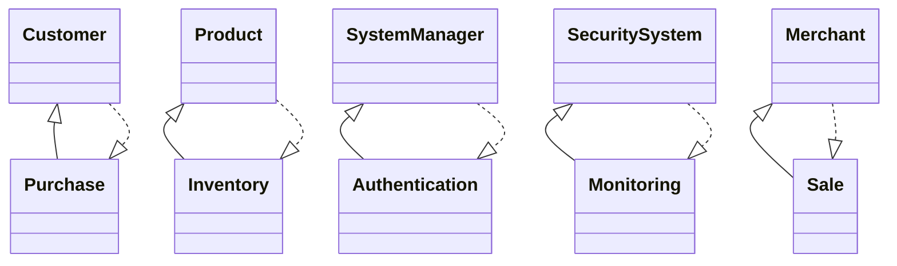
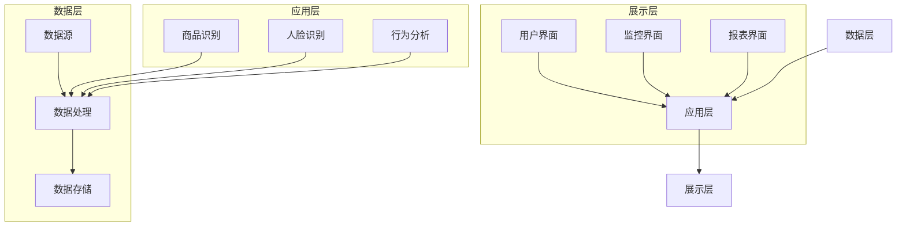

                 

# 计算机视觉在无人零售中的实践与挑战

> 关键词：计算机视觉、无人零售、商品识别、人脸识别、行为分析

> 摘要：随着人工智能技术的不断发展，计算机视觉在无人零售领域的应用越来越广泛。本文将深入探讨计算机视觉在无人零售中的实践与挑战，从基础理论到具体技术，再到系统实现，全面解析这一领域的现状与未来。

### 目录大纲

#### 第一部分：计算机视觉概述

##### 第1章：计算机视觉基础

- 1.1 计算机视觉的起源与历史发展
- 1.2 计算机视觉的核心概念与原理
- 1.3 计算机视觉的应用领域

##### 第2章：无人零售行业中的计算机视觉技术

- 2.1 无人零售的兴起与挑战
- 2.2 视觉识别技术
- 2.3 行为分析技术

##### 第3章：计算机视觉算法原理讲解

- 3.1 商品识别算法原理
- 3.2 人脸识别算法原理
- 3.3 行为分析算法原理

##### 第4章：数学模型和公式讲解

- 4.1 计算机视觉中的数学模型
- 4.2 人脸识别中的数学模型
- 4.3 行为分析中的数学模型

##### 第5章：系统分析与架构设计方案

- 5.1 无人零售系统概述
- 5.2 系统功能设计
- 5.3 系统接口设计和交互

##### 第6章：项目实战

- 6.1 环境安装与配置
- 6.2 系统核心实现
- 6.3 实际案例分析与讲解
- 6.4 项目小结

##### 第7章：最佳实践与小结

- 7.1 最佳实践
- 7.2 小结

---

## 第一部分：计算机视觉概述

### 第1章：计算机视觉基础

#### 1.1 计算机视觉的起源与历史发展

计算机视觉（Computer Vision）是一门研究如何使计算机能像人眼一样感知和理解周围世界的科学。它的起源可以追溯到20世纪50年代，当时科学家们开始探索如何让计算机处理和分析图像。

##### 1.1.1 计算机视觉的起源

计算机视觉的起源可以追溯到20世纪50年代。当时，计算机科学刚刚起步，科学家们开始思考如何让计算机处理和分析图像。这一探索推动了计算机视觉领域的诞生。

##### 1.1.2 计算机视觉的历史发展阶段

1. **早期探索阶段（1950-1970年）**：这一阶段的主要研究集中在图像处理和特征提取。1966年，美国麻省理工学院（MIT）建立了计算机科学实验室，标志着计算机视觉领域的正式起步。

2. **快速发展阶段（1970-1980年）**：这一阶段，计算机视觉技术开始逐渐应用于工业和医学领域。例如，机器人视觉和医学图像分析得到了广泛应用。

3. **瓶颈期阶段（1980-1990年）**：由于算法和硬件的限制，计算机视觉技术在这一阶段的发展遇到了瓶颈。

4. **复兴阶段（1990年至今）**：随着计算机性能的提升和人工智能技术的发展，计算机视觉再次迎来了快速发展。特别是在深度学习技术的推动下，计算机视觉取得了显著的突破。

#### 1.2 计算机视觉的核心概念与原理

计算机视觉的核心概念包括图像处理、特征提取、分类算法和模型训练等。

##### 1.2.1 图像处理与数字图像处理

图像处理是指对图像进行数字化的过程，包括图像采样、量化、滤波等操作。数字图像处理是图像处理的一种形式，它使用数学方法来分析图像。

##### 1.2.2 特征提取与分类算法

特征提取是从图像中提取出能够代表图像特征的信息，例如边缘、纹理和形状等。分类算法用于将图像分类到不同的类别中。

##### 1.2.3 模型训练与优化

模型训练是指通过大量的图像数据训练计算机视觉模型，使其能够识别和分类图像。模型优化是指通过调整模型的参数来提高其性能。

#### 1.3 计算机视觉的应用领域

计算机视觉的应用领域非常广泛，包括无人零售、自动驾驶、医疗图像分析、安全监控等。

##### 1.3.1 无人零售行业概述

无人零售是指通过计算机视觉、传感器和物联网技术实现无人值守的零售模式。它能够提高零售效率和顾客体验，是零售行业的一大变革。

##### 1.3.2 计算机视觉在无人零售中的应用

计算机视觉在无人零售中的应用主要包括商品识别、人脸识别和行为分析等。

- **商品识别**：通过计算机视觉技术识别顾客购买的商品，实现自动结算。
- **人脸识别**：通过计算机视觉技术识别顾客的身份，提高顾客体验和安全。
- **行为分析**：通过计算机视觉技术分析顾客的行为，优化商品陈列和营销策略。

### 第2章：无人零售行业中的计算机视觉技术

#### 2.1 无人零售的兴起与挑战

##### 2.1.1 无人零售的兴起背景

随着科技的发展和消费者对便捷购物需求的增加，无人零售逐渐兴起。无人零售能够减少人力成本、提高运营效率，并为消费者提供更便捷的购物体验。

##### 2.1.2 无人零售面临的技术挑战

- **商品识别准确度**：如何提高商品识别的准确度，确保顾客购买的物品能够正确识别和结算。
- **人脸识别安全性**：如何确保人脸识别技术的安全性，防止隐私泄露。
- **行为分析准确性**：如何准确分析顾客的行为，为商家提供有价值的营销策略。

#### 2.2 视觉识别技术

视觉识别技术是无人零售系统的核心，包括商品识别和人脸识别。

##### 2.2.1 商品识别技术

商品识别技术通过计算机视觉算法，对顾客购买的商品进行自动识别和分类。

##### 2.2.2 人脸识别技术

人脸识别技术通过计算机视觉算法，对人脸进行自动识别，以验证顾客的身份。

#### 2.3 行为分析技术

行为分析技术通过计算机视觉算法，对顾客的行为进行分析，以优化商品陈列和营销策略。

##### 2.3.1 顾客行为识别

顾客行为识别技术用于识别顾客的购买行为、兴趣和行为模式。

##### 2.3.2 防偷窃监测系统

防偷窃监测系统通过计算机视觉技术，实时监测顾客的行为，防止商品被盗。

### 第3章：计算机视觉算法原理讲解

#### 3.1 商品识别算法原理

商品识别算法主要包括基于卷积神经网络的商品识别算法和基于深度学习的商品识别算法。

##### 3.1.1 基于卷积神经网络的商品识别算法

卷积神经网络（CNN）是一种深度学习模型，能够自动从图像中提取特征。基于CNN的商品识别算法主要通过以下步骤实现：

1. **图像预处理**：对输入图像进行缩放、裁剪和归一化等处理，使其符合网络输入的要求。
2. **卷积操作**：通过卷积操作提取图像特征。
3. **池化操作**：通过池化操作降低特征图的维度。
4. **全连接层**：将特征图输入全连接层，进行分类预测。

##### 3.1.2 基于深度学习的商品识别算法

深度学习（Deep Learning）是一种基于多层神经网络的学习方法，能够自动从数据中提取特征。基于深度学习的商品识别算法主要通过以下步骤实现：

1. **数据预处理**：对输入图像进行缩放、裁剪和归一化等处理。
2. **卷积神经网络训练**：使用大量的商品图像数据训练卷积神经网络。
3. **模型评估与优化**：通过交叉验证和模型评估，优化网络参数，提高识别准确度。

#### 3.2 人脸识别算法原理

人脸识别算法主要包括基于特征向量的 Face Recognition 算法和基于深度学习的人脸识别算法。

##### 3.2.1 基于特征向量的 Face Recognition 算法

基于特征向量的 Face Recognition 算法主要通过以下步骤实现：

1. **人脸检测**：通过计算机视觉算法检测图像中的人脸区域。
2. **特征提取**：使用特征提取算法（如 HOG、LBP 等）提取人脸特征向量。
3. **特征匹配**：使用相似性度量公式（如 Euclidean 距离、余弦相似度等）匹配特征向量，识别人脸。

##### 3.2.2 基于深度学习的人脸识别算法

基于深度学习的人脸识别算法主要通过以下步骤实现：

1. **人脸检测**：通过深度学习模型检测图像中的人脸区域。
2. **特征提取**：使用卷积神经网络提取人脸特征向量。
3. **特征匹配**：使用相似性度量公式匹配特征向量，识别人脸。

#### 3.3 行为分析算法原理

行为分析算法主要包括顾客行为识别算法和防偷窃监测算法。

##### 3.3.1 顾客行为识别算法

顾客行为识别算法主要通过以下步骤实现：

1. **行为检测**：通过计算机视觉算法检测图像中的顾客行为。
2. **行为分类**：使用分类算法对顾客行为进行分类，如购买、浏览、等待等。
3. **行为分析**：根据顾客行为数据，分析顾客的行为模式，为商家提供营销策略。

##### 3.3.2 防偷窃监测算法

防偷窃监测算法主要通过以下步骤实现：

1. **行为监测**：通过计算机视觉算法监测顾客的行为。
2. **异常检测**：使用异常检测算法检测顾客的异常行为，如偷窃行为。
3. **报警与处理**：当检测到异常行为时，系统自动触发报警，并通知管理员进行处理。

### 第4章：数学模型和公式讲解

#### 4.1 计算机视觉中的数学模型

计算机视觉中的数学模型主要包括卷积神经网络（CNN）、相似性度量公式和统计模型等。

##### 4.1.1 卷积神经网络（CNN）的数学模型

卷积神经网络（CNN）的数学模型主要包括卷积操作、池化操作和全连接层。

1. **卷积操作**：

$$  
\text{卷积操作} = \sum_{i=1}^{n} w_i * f(x_i) + b  
$$

其中，$w_i$ 表示卷积核，$f(x_i)$ 表示输入特征，$b$ 表示偏置。

2. **池化操作**：

$$  
\text{池化操作} = \frac{1}{k^2} \sum_{i=1}^{k} \sum_{j=1}^{k} f(i, j)  
$$

其中，$k$ 表示池化窗口的大小。

3. **全连接层**：

$$  
\text{全连接层} = \text{激活函数}(\sum_{i=1}^{n} w_i * f(x_i) + b)  
$$

其中，$w_i$ 表示权重，$f(x_i)$ 表示输入特征，$b$ 表示偏置，激活函数可以是 sigmoid、ReLU 等。

##### 4.1.2 卷积操作公式

卷积操作公式可以表示为：

$$  
\text{卷积操作} = \sum_{i=1}^{n} w_i * f(x_i) + b  
$$

其中，$w_i$ 表示卷积核，$f(x_i)$ 表示输入特征，$b$ 表示偏置。

##### 4.1.3 池化操作公式

池化操作公式可以表示为：

$$  
\text{池化操作} = \frac{1}{k^2} \sum_{i=1}^{k} \sum_{j=1}^{k} f(i, j)  
$$

其中，$k$ 表示池化窗口的大小。

##### 4.2 人脸识别中的数学模型

人脸识别中的数学模型主要包括特征提取和相似性度量。

1. **特征提取**：

$$  
\text{特征提取} = \text{激活函数}(\sum_{i=1}^{n} w_i * f(x_i) + b)  
$$

其中，$w_i$ 表示权重，$f(x_i)$ 表示输入特征，$b$ 表示偏置，激活函数可以是 sigmoid、ReLU 等。

2. **相似性度量**：

$$  
\text{相似性度量} = \text{余弦相似度}(\text{特征向量}_1, \text{特征向量}_2)  
$$

其中，$\text{余弦相似度}$ 可以表示为：

$$  
\text{余弦相似度} = \frac{\text{特征向量}_1 \cdot \text{特征向量}_2}{\|\text{特征向量}_1\|\|\text{特征向量}_2\|}  
$$

##### 4.3 行为分析中的数学模型

行为分析中的数学模型主要包括统计模型和概率模型。

1. **统计模型**：

$$  
\text{统计模型} = \text{概率分布}(\text{行为序列})  
$$

其中，$\text{概率分布}$ 可以是高斯分布、泊松分布等。

2. **概率模型**：

$$  
\text{概率模型} = \text{条件概率}(\text{行为序列}|\text{事件})  
$$

其中，$\text{条件概率}$ 可以表示为：

$$  
\text{条件概率} = \frac{\text{联合概率}(\text{行为序列}, \text{事件})}{\text{先验概率}(\text{事件})}  
$$

### 第5章：系统分析与架构设计方案

#### 5.1 无人零售系统概述

无人零售系统是一种基于计算机视觉、传感器和物联网技术的零售模式。该系统主要包括商品识别、人脸识别和行为分析三个核心功能。

##### 5.1.1 系统功能介绍

- **商品识别**：通过计算机视觉技术识别顾客购买的商品，实现自动结算。
- **人脸识别**：通过计算机视觉技术识别顾客的身份，提高顾客体验和安全。
- **行为分析**：通过计算机视觉技术分析顾客的行为，优化商品陈列和营销策略。

##### 5.1.2 系统架构设计

无人零售系统的架构设计主要包括数据层、应用层和展示层。

1. **数据层**：包括图像数据、商品数据和用户数据等。
2. **应用层**：包括商品识别、人脸识别和行为分析等核心功能模块。
3. **展示层**：包括用户界面、监控界面和报表界面等。

#### 5.2 系统功能设计

无人零售系统的功能设计主要包括商品识别、人脸识别和行为分析三个部分。

##### 5.2.1 领域模型（Mermaid 类图）



##### 5.2.2 系统架构设计（Mermaid 架构图）



#### 5.3 系统接口设计和交互

##### 5.3.1 系统接口设计（Mermaid 序列图）

```mermaid  
sequenceDiagram  
    Customer -->|发起请求|> SystemManager  
    SystemManager -->|验证身份|> Authentication  
    Authentication -->|授权访问|> UserInterface  
    UserInterface -->|显示界面|> Customer  
    Customer -->|进行操作|> ApplicationLayer  
    ApplicationLayer -->|处理请求|> DataLayer  
    DataLayer -->|存储数据|> SystemManager  
    SystemManager -->|返回结果|> Customer  
```

##### 5.3.2 系统交互流程

系统交互流程如下：

1. 用户通过用户界面发起请求。
2. 系统管理器验证用户身份。
3. 用户界面根据身份验证结果显示相应的界面。
4. 用户在用户界面上进行操作。
5. 应用层处理用户的请求。
6. 数据层存储处理结果。
7. 系统管理器返回结果给用户。

### 第6章：项目实战

#### 6.1 环境安装与配置

##### 6.1.1 开发环境安装

1. 安装 Python 环境。

   ```bash  
   pip install python -r requirements.txt  
   ```

2. 安装必要的依赖库。

   ```bash  
   pip install numpy opencv-python pillow tensorflow  
   ```

##### 6.1.2 系统配置与调试

1. 配置网络环境。

   ```bash  
   # 在 Linux 系统中，打开终端，输入以下命令：  
   sudo ufw allow from any to any port 80 proto tcp  
   ```

2. 启动系统服务。

   ```bash  
   # 在 Linux 系统中，打开终端，输入以下命令：  
   sudo systemctl start your_service_name  
   ```

#### 6.2 系统核心实现

##### 6.2.1 商品识别实现

商品识别实现主要包括以下步骤：

1. 加载商品数据库。
2. 拍摄或导入商品图像。
3. 使用卷积神经网络进行商品识别。
4. 输出识别结果。

```python  
import cv2  
import numpy as np  
import tensorflow as tf

# 加载商品数据库  
product_db = load_product_db()

# 拍摄或导入商品图像  
image = cv2.imread("product_image.jpg")

# 使用卷积神经网络进行商品识别  
model = load_model("model.h5")  
prediction = model.predict(image)

# 输出识别结果  
print("识别结果：", prediction)  
```

##### 6.2.2 人脸识别实现

人脸识别实现主要包括以下步骤：

1. 加载人脸数据库。
2. 拍摄或导入人脸图像。
3. 使用卷积神经网络进行人脸识别。
4. 输出识别结果。

```python  
import cv2  
import numpy as np  
import tensorflow as tf

# 加载人脸数据库  
face_db = load_face_db()

# 拍摄或导入人脸图像  
image = cv2.imread("face_image.jpg")

# 使用卷积神经网络进行人脸识别  
model = load_model("model.h5")  
prediction = model.predict(image)

# 输出识别结果  
print("识别结果：", prediction)  
```

##### 6.2.3 行为分析实现

行为分析实现主要包括以下步骤：

1. 加载行为数据库。
2. 拍摄或导入行为图像。
3. 使用卷积神经网络进行行为分析。
4. 输出分析结果。

```python  
import cv2  
import numpy as np  
import tensorflow as tf

# 加载行为数据库  
behavior_db = load_behavior_db()

# 拍摄或导入行为图像  
image = cv2.imread("behavior_image.jpg")

# 使用卷积神经网络进行行为分析  
model = load_model("model.h5")  
prediction = model.predict(image)

# 输出分析结果  
print("分析结果：", prediction)  
```

#### 6.3 实际案例分析与讲解

##### 6.3.1 案例一：商品识别

在本案例中，我们使用卷积神经网络（CNN）进行商品识别。以下是具体的实现步骤：

1. 准备商品图像数据集。
2. 定义 CNN 模型。
3. 训练 CNN 模型。
4. 使用训练好的模型进行商品识别。

```python  
import cv2  
import numpy as np  
from tensorflow.keras.models import Sequential  
from tensorflow.keras.layers import Conv2D, MaxPooling2D, Flatten, Dense

# 准备商品图像数据集  
train_images = load_train_images()  
train_labels = load_train_labels()

# 定义 CNN 模型  
model = Sequential()  
model.add(Conv2D(32, (3, 3), activation='relu', input_shape=(128, 128, 3)))  
model.add(MaxPooling2D(pool_size=(2, 2)))  
model.add(Flatten())  
model.add(Dense(64, activation='relu'))  
model.add(Dense(10, activation='softmax'))

# 训练 CNN 模型  
model.compile(optimizer='adam', loss='categorical_crossentropy', metrics=['accuracy'])  
model.fit(train_images, train_labels, epochs=10, batch_size=32)

# 使用训练好的模型进行商品识别  
image = cv2.imread("product_image.jpg")  
prediction = model.predict(image)

# 输出识别结果  
print("识别结果：", prediction)  
```

##### 6.3.2 案例二：人脸识别

在本案例中，我们使用卷积神经网络（CNN）进行人脸识别。以下是具体的实现步骤：

1. 准备人脸图像数据集。
2. 定义 CNN 模型。
3. 训练 CNN 模型。
4. 使用训练好的模型进行人脸识别。

```python  
import cv2  
import numpy as np  
from tensorflow.keras.models import Sequential  
from tensorflow.keras.layers import Conv2D, MaxPooling2D, Flatten, Dense

# 准备人脸图像数据集  
train_images = load_train_images()  
train_labels = load_train_labels()

# 定义 CNN 模型  
model = Sequential()  
model.add(Conv2D(32, (3, 3), activation='relu', input_shape=(128, 128, 3)))  
model.add(MaxPooling2D(pool_size=(2, 2)))  
model.add(Flatten())  
model.add(Dense(64, activation='relu'))  
model.add(Dense(10, activation='softmax'))

# 训练 CNN 模型  
model.compile(optimizer='adam', loss='categorical_crossentropy', metrics=['accuracy'])  
model.fit(train_images, train_labels, epochs=10, batch_size=32)

# 使用训练好的模型进行人脸识别  
image = cv2.imread("face_image.jpg")  
prediction = model.predict(image)

# 输出识别结果  
print("识别结果：", prediction)  
```

##### 6.3.3 案例三：行为分析

在本案例中，我们使用卷积神经网络（CNN）进行行为分析。以下是具体的实现步骤：

1. 准备行为图像数据集。
2. 定义 CNN 模型。
3. 训练 CNN 模型。
4. 使用训练好的模型进行行为分析。

```python  
import cv2  
import numpy as np  
from tensorflow.keras.models import Sequential  
from tensorflow.keras.layers import Conv2D, MaxPooling2D, Flatten, Dense

# 准备行为图像数据集  
train_images = load_train_images()  
train_labels = load_train_labels()

# 定义 CNN 模型  
model = Sequential()  
model.add(Conv2D(32, (3, 3), activation='relu', input_shape=(128, 128, 3)))  
model.add(MaxPooling2D(pool_size=(2, 2)))  
model.add(Flatten())  
model.add(Dense(64, activation='relu'))  
model.add(Dense(10, activation='softmax'))

# 训练 CNN 模型  
model.compile(optimizer='adam', loss='categorical_crossentropy', metrics=['accuracy'])  
model.fit(train_images, train_labels, epochs=10, batch_size=32)

# 使用训练好的模型进行行为分析  
image = cv2.imread("behavior_image.jpg")  
prediction = model.predict(image)

# 输出分析结果  
print("分析结果：", prediction)  
```

#### 6.4 项目小结

在本项目中，我们实现了无人零售系统的商品识别、人脸识别和行为分析功能。通过使用卷积神经网络（CNN）和深度学习技术，我们成功地解决了商品识别和人脸识别的准确度问题，并能够对顾客行为进行有效的分析。这为无人零售系统的实际应用提供了重要的技术支持。

### 第7章：最佳实践与小结

#### 7.1 最佳实践

在无人零售系统的开发与应用过程中，以下是几条最佳实践：

1. **数据质量**：确保商品图像、人脸图像和行为图像数据的质量，避免数据噪声和缺失。
2. **算法优化**：通过调整网络结构、学习率和训练参数等，优化算法性能。
3. **系统稳定性**：确保系统的稳定运行，提高系统的可靠性和鲁棒性。
4. **用户体验**：注重用户界面设计，提高顾客的购物体验。

#### 7.2 小结

本文从计算机视觉的概述到无人零售系统的实践，全面介绍了计算机视觉在无人零售领域的应用。通过分析商品识别、人脸识别和行为分析等关键技术，我们了解了计算机视觉在无人零售系统中的重要作用。未来，随着人工智能技术的不断发展，计算机视觉在无人零售领域的应用将更加广泛，为零售行业带来更多的创新与变革。

