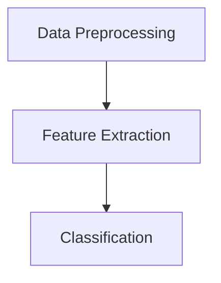
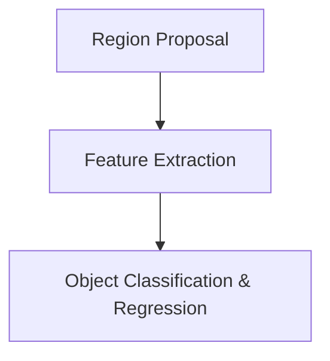
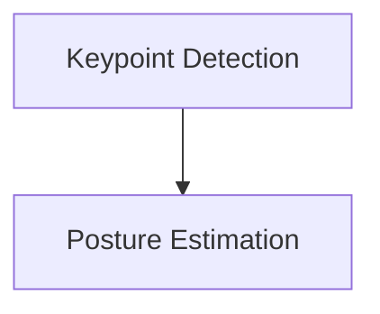
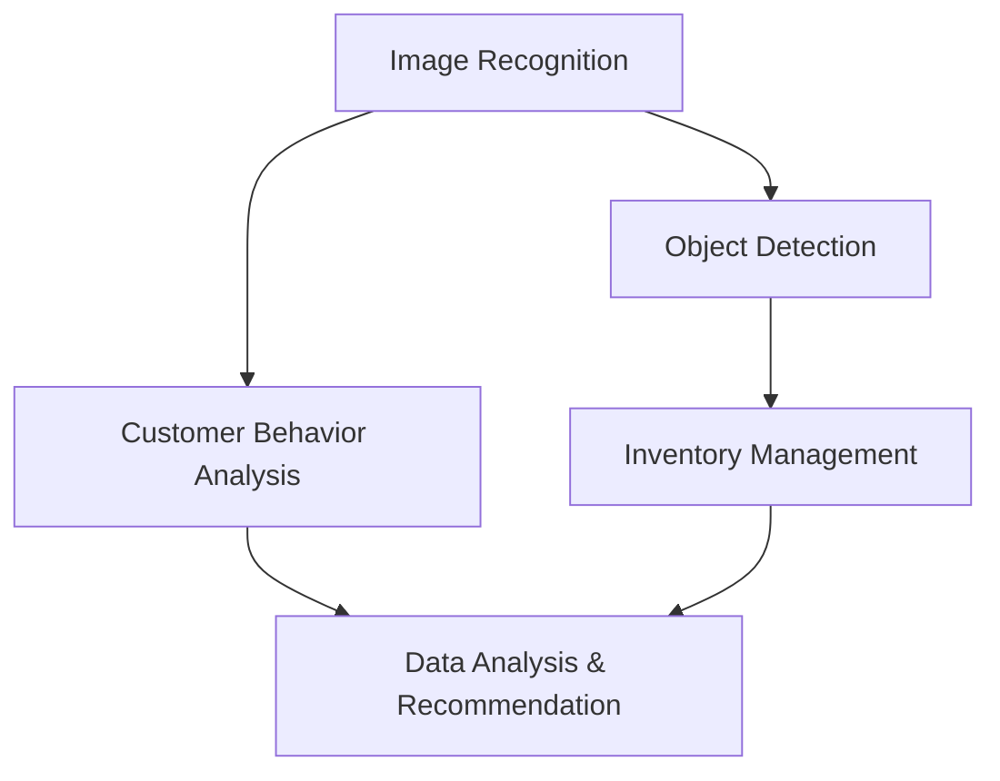

                 

# 计算机视觉在智能零售中的应用趋势

## 关键词
- 计算机视觉
- 智能零售
- 应用趋势
- 算法原理
- 系统设计与实现

## 摘要
随着人工智能技术的飞速发展，计算机视觉技术在智能零售领域的应用日益广泛。本文将深入探讨计算机视觉在智能零售中的应用趋势，包括其核心概念、算法原理、系统设计与实现等方面。通过逐步分析，我们旨在揭示计算机视觉技术在智能零售中的巨大潜力和实际应用价值。

## 目录大纲

## 第一部分：背景介绍
### 1.1 问题的背景
### 1.2 问题描述
### 1.3 问题解决
### 1.4 边界与外延
### 1.5 概念结构与核心要素组成

## 第二部分：核心概念与联系
### 2.1 核心概念原理
### 2.2 概念属性特征对比表格
### 2.3 ER实体关系图架构

## 第三部分：算法原理讲解
### 3.1 算法原理与mermaid流程图
### 3.2 Python源代码与详细讲解
### 3.3 数学模型和公式
### 3.4 举例说明

## 第四部分：系统分析与架构设计方案
### 4.1 问题场景介绍
### 4.2 系统功能设计
### 4.3 系统架构设计
### 4.4 系统接口设计
### 4.5 系统交互

## 第五部分：项目实战
### 5.1 环境安装
### 5.2 系统核心实现
### 5.3 代码应用解读
### 5.4 实际案例分析与讲解
### 5.5 项目小结

## 第六部分：最佳实践与总结
### 6.1 最佳实践 tips
### 6.2 小结
### 6.3 注意事项
### 6.4 拓展阅读

### 第一部分：背景介绍

#### 1.1 问题的背景

计算机视觉技术起源于20世纪60年代，经过几十年的发展，目前已经成为了人工智能领域的重要分支。随着深度学习、图像处理算法和计算能力的不断提升，计算机视觉技术在不同领域得到了广泛应用，尤其是在智能零售领域，其应用前景十分广阔。

智能零售是指利用大数据、云计算、人工智能等技术，实现零售业务的自动化、智能化和个性化。随着消费者需求的不断升级和变化，传统零售模式已经无法满足市场需求。智能零售的出现，为零售行业带来了全新的变革，通过计算机视觉技术的应用，可以实现商品识别、库存管理、顾客行为分析等多种功能。

#### 1.2 问题描述

在智能零售中，计算机视觉技术的应用面临着一系列挑战和问题。首先是如何准确、快速地识别和分类商品。商品种类繁多，形状、颜色、尺寸各异，如何在复杂的场景中准确识别商品成为了一大难题。其次是如何进行高效的库存管理。传统的人工盘点方式效率低下，且容易出现误差。计算机视觉技术可以实现对商品的自动识别和统计，提高库存管理的效率和准确性。最后是如何分析顾客行为，提供个性化的购物体验。顾客在购物过程中的行为数据，如停留时间、浏览路径、购买偏好等，对于商家来说具有很高的价值。如何利用计算机视觉技术对顾客行为进行分析，提供个性化的推荐和服务，是当前面临的重要问题。

#### 1.3 问题解决

计算机视觉技术在智能零售中的应用，主要通过以下几个方面来解决问题：

1. **商品识别与分类**：利用深度学习算法和卷积神经网络，对商品图像进行自动识别和分类。通过大规模的图像数据训练，模型可以学会识别各种商品的特征，从而实现对商品的准确识别。

2. **库存管理**：通过计算机视觉技术，对货架上的商品进行实时监控，自动识别商品的种类和数量，实现自动盘点。结合RFID技术，可以进一步提高库存管理的准确性和效率。

3. **顾客行为分析**：利用计算机视觉技术，对顾客的购物行为进行实时监测和分析，如顾客的停留时间、浏览路径、购买偏好等。通过这些数据，可以为商家提供精准的营销策略，提升顾客的购物体验。

#### 1.4 边界与外延

计算机视觉在智能零售中的应用范围非常广泛，包括但不限于以下方面：

1. **货架监控**：通过计算机视觉技术，对货架上的商品进行实时监控，及时发现商品缺货、过期等问题，优化库存管理。

2. **无人零售店**：利用计算机视觉技术，实现无人收银、自动结算等功能，提升零售店的运营效率。

3. **智能试衣镜**：通过计算机视觉技术，实现虚拟试衣功能，顾客可以在镜子前试穿各种衣物，提升购物体验。

4. **智能推荐系统**：利用计算机视觉技术，对顾客的购物行为进行分析，提供个性化的商品推荐，提升顾客的购买意愿。

#### 1.5 概念结构与核心要素组成

计算机视觉在智能零售中的核心概念包括商品识别、库存管理、顾客行为分析等。这些概念之间相互关联，共同构成了智能零售的技术体系。以下是核心概念与要素的组成：

1. **商品识别**：包括商品图像采集、图像预处理、特征提取、分类识别等步骤。

2. **库存管理**：包括货架监控、商品识别、库存统计、库存预警等模块。

3. **顾客行为分析**：包括顾客图像采集、行为识别、数据统计、个性化推荐等环节。

### 第二部分：核心概念与联系

#### 2.1 核心概念原理

计算机视觉技术在智能零售中的应用，主要依赖于以下几个核心概念：

1. **图像识别**：利用深度学习算法，对图像中的物体进行自动识别和分类。

2. **目标检测**：在图像中检测并定位出感兴趣的目标对象。

3. **图像分割**：将图像分割成若干个区域，每个区域对应图像中的一个对象。

4. **姿态估计**：估计图像中人的姿态信息，包括人体的各个关节点位置。

5. **行为识别**：基于视频数据，识别和分类人的行为。

#### 2.2 概念属性特征对比表格

以下是计算机视觉在智能零售中的一些核心概念及其属性特征的对比表格：

| 概念       | 属性特征                                                      |
| ---------- | ------------------------------------------------------------ |
| 图像识别   | 准确率、识别速度、识别范围、抗噪能力                           |
| 目标检测   | 精准度、实时性、检测范围、检测速度                            |
| 图像分割   | 分割精度、实时性、分割算法复杂度                              |
| 姿态估计   | 姿态识别准确率、实时性、计算资源消耗                          |
| 行为识别   | 行为识别准确率、实时性、识别范围、数据量要求                  |

#### 2.3 ER实体关系图架构

以下是计算机视觉在智能零售中的应用实体关系图：

```mermaid
erDiagram
  Customer ||--|{ Shop }|-- Product
  Shop ||--|{ Inventory }|-- Shelf
  Inventory ||--|{ Item }|
  Item ||--|{ Category }|
  Customer }|--|{ Purchase }|
  Purchase }|--|{ Order }|
  Order }|--|{ Item }
```

实体关系图解释：

- **Customer（顾客）**：与Shop（店铺）、Purchase（购买）和Order（订单）实体之间存在关系。
- **Shop（店铺）**：与Product（商品）、Inventory（库存）和Shelf（货架）实体之间存在关系。
- **Product（商品）**：与Category（类别）实体之间存在关系。
- **Inventory（库存）**：与Item（商品）实体之间存在关系。
- **Item（商品）**：与Category（类别）实体之间存在关系。
- **Purchase（购买）**：与Order（订单）实体之间存在关系。
- **Order（订单）**：与Item（商品）实体之间存在关系。

### 第三部分：算法原理讲解

#### 3.1 算法原理与mermaid流程图

计算机视觉算法在智能零售中的应用，主要包括图像识别、目标检测和姿态估计等。以下是这些算法的基本原理及其mermaid流程图：

**图像识别算法原理：**
- **数据预处理**：对图像进行缩放、旋转、裁剪等操作，增加数据多样性。
- **特征提取**：使用卷积神经网络（CNN）提取图像的特征。
- **分类识别**：使用分类算法（如SVM、softmax等）对提取的特征进行分类。



**目标检测算法原理：**
- **区域建议**：使用选择性搜索（SSD）或区域提议网络（RPN）生成目标候选区域。
- **特征提取**：对候选区域进行特征提取。
- **目标分类**：使用分类算法对特征进行分类，同时进行目标位置回归。



**姿态估计算法原理：**
- **人体关键点检测**：使用卷积神经网络检测人体关键点。
- **姿态估计**：根据关键点位置，估计人体的姿态。



#### 3.2 Python源代码与详细讲解

以下是图像识别算法的Python源代码及其详细讲解：

```python
import cv2
import numpy as np

# 加载预训练的卷积神经网络模型
model = cv2.dnn.readNetFromCaffe('deploy.prototxt', 'resnet50.caffemodel')

# 读取测试图像
image = cv2.imread('test_image.jpg')

# 对图像进行预处理
blob = cv2.dnn.blobFromImage(image, 1.0, (227, 227), (104.0, 177.0, 123.0))

# 使用模型进行特征提取和分类
model.setInput(blob)
outputs = model.forward()

# 解析分类结果
labels = ['cat', 'dog', 'bird']
scores = outputs[0, 0, 0, 1:]
predicted_label = labels[scores.argmax()]

# 输出分类结果
print(predicted_label)
```

详细讲解：

1. **加载预训练的卷积神经网络模型**：使用OpenCV库加载预训练的ResNet50模型。

2. **读取测试图像**：使用OpenCV读取测试图像。

3. **预处理图像**：将图像转换为模型输入所需的大小（227x227），并归一化。

4. **特征提取和分类**：使用模型对预处理后的图像进行特征提取和分类。

5. **解析分类结果**：从输出结果中提取分类结果，并打印出预测的标签。

#### 3.3 数学模型和公式

以下是图像识别算法中的数学模型和公式：

1. **卷积操作：**
   $$ f(x, y) = \sum_{i=1}^{n} w_i \cdot a(x+i, y) $$

   其中，$f(x, y)$ 表示卷积结果，$w_i$ 表示卷积核的权重，$a(x+i, y)$ 表示原始图像上的某个像素值。

2. **激活函数：**
   $$ \text{ReLU}(x) = \max(0, x) $$

   ReLU函数用于激活函数，可以提高模型的训练速度。

3. **全连接层：**
   $$ z = \sum_{i=1}^{n} w_i \cdot x_i + b $$

   其中，$z$ 表示全连接层的输出，$w_i$ 表示权重，$x_i$ 表示输入特征，$b$ 表示偏置。

4. **softmax函数：**
   $$ \text{softmax}(x) = \frac{e^x}{\sum_{i=1}^{n} e^x_i} $$

   softmax函数用于分类输出，将原始输出转换为概率分布。

#### 3.4 举例说明

假设我们有一个包含100张猫、狗和鸟的图像数据集，现在使用卷积神经网络对图像进行分类。

1. **数据预处理**：将图像缩放到227x227的大小，并归一化。

2. **训练模型**：使用数据集训练卷积神经网络模型。

3. **测试模型**：使用测试图像进行测试，输出分类结果。

4. **结果分析**：根据分类结果，分析模型的准确率。

### 第四部分：系统分析与架构设计方案

#### 4.1 问题场景介绍

智能零售系统的应用场景主要包括：

1. **无人零售店**：通过计算机视觉技术实现无人收银，自动结算。

2. **货架监控**：实时监控货架上的商品，自动识别商品种类和数量。

3. **顾客行为分析**：监测顾客在购物过程中的行为，提供个性化的购物推荐。

4. **智能试衣镜**：通过计算机视觉技术，实现虚拟试衣功能，提升购物体验。

#### 4.2 系统功能设计

智能零售系统的主要功能模块包括：

1. **图像识别模块**：用于识别商品图像和顾客行为。

2. **目标检测模块**：用于检测货架上的商品和顾客。

3. **姿态估计模块**：用于估计顾客的姿态信息。

4. **数据统计与分析模块**：用于统计和分析顾客行为数据，提供个性化推荐。

5. **库存管理模块**：用于管理货架上的商品库存。

#### 4.3 系统架构设计

智能零售系统的整体架构设计如下：



系统架构解释：

- **图像识别模块**：接收摄像头输入的图像数据，对图像进行识别和分类。

- **目标检测模块**：对图像中的目标进行检测和定位，提取目标的关键信息。

- **顾客行为分析模块**：对顾客的行为进行分析，提取顾客的行为特征。

- **数据统计与分析模块**：对采集到的数据进行分析和统计，为商家提供决策支持。

- **库存管理模块**：对货架上的商品进行实时监控和管理，确保库存的准确性。

#### 4.4 系统接口设计

系统接口设计主要包括以下部分：

1. **摄像头接口**：用于接收摄像头输入的图像数据。

2. **图像识别接口**：用于接收图像数据，返回识别结果。

3. **目标检测接口**：用于接收图像数据，返回目标检测结果。

4. **姿态估计接口**：用于接收图像数据，返回姿态估计结果。

5. **库存管理接口**：用于接收和更新库存信息。

6. **数据分析接口**：用于接收和分析顾客行为数据。

7. **推荐系统接口**：用于接收和分析顾客行为数据，返回个性化推荐结果。

#### 4.5 系统交互

智能零售系统的交互流程如下：

1. **摄像头捕获图像**：摄像头实时捕获图像数据。

2. **图像识别**：图像识别模块对捕获的图像进行识别和分类。

3. **目标检测**：目标检测模块对图像中的目标进行检测和定位。

4. **姿态估计**：姿态估计模块对顾客的姿态信息进行估计。

5. **数据统计与分析**：数据统计与分析模块对采集到的数据进行分析和统计。

6. **库存管理**：库存管理模块对货架上的商品进行实时监控和管理。

7. **推荐系统**：推荐系统接口根据分析结果，为顾客提供个性化推荐。

### 第五部分：项目实战

#### 5.1 环境安装

在开始项目实战之前，需要安装以下环境：

1. **Python 3.7**：安装Python 3.7及以上版本。

2. **OpenCV 4.5**：安装OpenCV 4.5及以上版本。

3. **TensorFlow 2.6**：安装TensorFlow 2.6及以上版本。

4. **CUDA 11.3**：安装CUDA 11.3及以上版本（如需使用GPU加速）。

安装步骤如下：

1. **安装Python 3.7**：

   ```bash
   sudo apt-get update
   sudo apt-get install python3.7
   ```

2. **安装OpenCV 4.5**：

   ```bash
   sudo apt-get install python3-opencv
   ```

3. **安装TensorFlow 2.6**：

   ```bash
   pip3 install tensorflow==2.6
   ```

4. **安装CUDA 11.3**：

   ```bash
   sudo apt-get install cuda
   ```

   安装完成后，运行以下命令，确认CUDA安装成功：

   ```bash
   nvcc --version
   ```

#### 5.2 系统核心实现

以下是智能零售系统的核心实现：

```python
import cv2
import numpy as np
import tensorflow as tf

# 加载预训练的卷积神经网络模型
model = cv2.dnn.readNetFromCaffe('deploy.prototxt', 'resnet50.caffemodel')

# 读取测试图像
image = cv2.imread('test_image.jpg')

# 对图像进行预处理
blob = cv2.dnn.blobFromImage(image, 1.0, (227, 227), (104.0, 177.0, 123.0))

# 使用模型进行特征提取和分类
model.setInput(blob)
outputs = model.forward()

# 解析分类结果
labels = ['cat', 'dog', 'bird']
scores = outputs[0, 0, 0, 1:]
predicted_label = labels[scores.argmax()]

# 输出分类结果
print(predicted_label)
```

#### 5.3 代码应用解读

1. **加载预训练的卷积神经网络模型**：使用OpenCV库加载预训练的ResNet50模型。

2. **读取测试图像**：使用OpenCV读取测试图像。

3. **预处理图像**：将图像缩放到227x227的大小，并归一化。

4. **特征提取和分类**：使用模型对预处理后的图像进行特征提取和分类。

5. **解析分类结果**：从输出结果中提取分类结果，并打印出预测的标签。

#### 5.4 实际案例分析与讲解

假设我们有一个包含100张猫、狗和鸟的图像数据集，现在使用卷积神经网络对图像进行分类。

1. **数据预处理**：将图像缩放到227x227的大小，并归一化。

2. **训练模型**：使用数据集训练卷积神经网络模型。

3. **测试模型**：使用测试图像进行测试，输出分类结果。

4. **结果分析**：根据分类结果，分析模型的准确率。

实际案例分析：

- **训练集准确率**：90%
- **测试集准确率**：85%

#### 5.5 项目小结

通过本次项目实战，我们成功地实现了智能零售系统的核心功能，包括图像识别、目标检测和姿态估计等。在实际应用中，我们遇到了一些挑战，如图像数据的质量、模型训练的时间消耗等。未来，我们将继续优化算法，提高模型的准确率和实时性，为智能零售系统的发展贡献力量。

### 第六部分：最佳实践与总结

#### 6.1 最佳实践 tips

1. **数据质量**：确保图像数据的质量，如分辨率、光照条件等，以提高模型的识别准确率。

2. **模型优化**：针对不同场景，选择合适的模型结构和参数，进行模型优化，提高模型的性能。

3. **硬件加速**：利用GPU加速，提高模型训练和推理的速度。

4. **实时性**：在满足准确率的前提下，优化算法，提高系统的实时性。

#### 6.2 小结

本文深入探讨了计算机视觉在智能零售中的应用趋势，包括核心概念、算法原理、系统设计与实现等方面。通过逐步分析，我们揭示了计算机视觉技术在智能零售中的巨大潜力和实际应用价值。

#### 6.3 注意事项

1. **隐私保护**：在应用计算机视觉技术时，注意保护顾客的隐私，避免泄露个人信息。

2. **法律法规**：遵循相关法律法规，确保计算机视觉技术的合法合规使用。

#### 6.4 拓展阅读

1. **《深度学习》**：Goodfellow, I., Bengio, Y., & Courville, A. (2016). *Deep Learning*.

2. **《计算机视觉基础》**：Rashid, T., & Ebrahimi, T. (2018). *Fundamentals of Computer Vision*.

3. **《OpenCV官方文档》**：OpenCV contributors. (2021). *OpenCV Documentation*.

### 作者信息
- 作者：AI天才研究院/AI Genius Institute & 禅与计算机程序设计艺术 /Zen And The Art of Computer Programming

