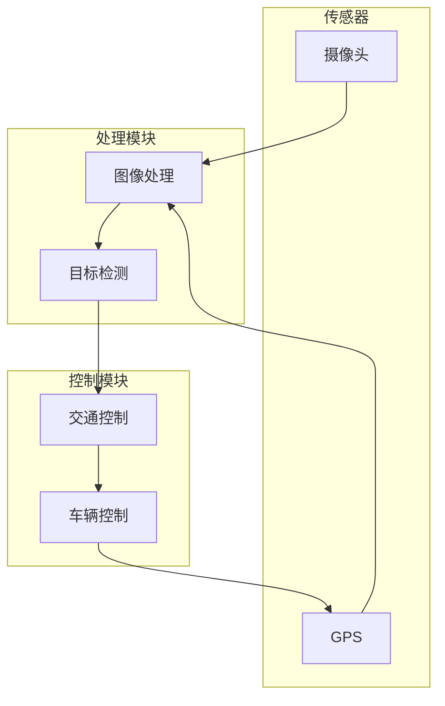

                 

### 第一部分：背景介绍

#### 1.1 计算机视觉技术的基本概念

计算机视觉（Computer Vision）是人工智能领域的一个重要分支，旨在使计算机具备类似人类的视觉感知能力，能够从图像和视频中提取信息。它涉及到图像处理、模式识别、机器学习等多个领域。计算机视觉的核心任务是进行图像理解和图像分析，实现诸如目标检测、图像分类、人脸识别、场景理解等功能。

- **图像处理**：图像处理是指对图像进行加工和变换，以提高图像质量或提取图像中的有用信息。常见的图像处理技术包括滤波、边缘检测、图像分割、图像增强等。
- **模式识别**：模式识别是指从数据中识别出特定的模式或特征，并将其分类。在计算机视觉中，模式识别技术常用于图像分类、目标检测等任务。
- **机器学习**：机器学习是计算机视觉的核心技术之一，它通过训练模型从大量数据中学习特征和规律，从而实现图像分析和理解。

#### 1.2 自动驾驶技术的基本概念

自动驾驶（Autonomous Driving）是指利用计算机视觉、传感器、控制系统等技术，使汽车在无需人工干预的情况下，能够自主感知环境、规划路径、控制车速、转向和制动等。自动驾驶技术可以显著提高交通效率、降低交通事故率、减少环境污染，被视为未来智能交通系统的关键组成部分。

- **感知环境**：自动驾驶系统通过摄像头、激光雷达（Lidar）、超声波传感器等设备感知周围环境，获取道路、车辆、行人等信息。
- **规划路径**：基于感知到的环境信息，自动驾驶系统通过路径规划算法，确定车辆的行驶轨迹和速度。
- **控制车辆**：自动驾驶系统通过控制系统的反馈，实时调整车辆的速度、转向和制动，确保车辆按照规划路径行驶。

#### 1.3 计算机视觉技术在自动驾驶中的应用

计算机视觉技术在自动驾驶中扮演着关键角色，主要应用于以下几个方面：

- **车道检测**：通过计算机视觉技术，自动驾驶系统能够识别道路上的车道线，保持车辆在车道内行驶。
- **交通标志识别**：计算机视觉技术可以识别交通标志，如速度限制、红绿灯等，以便自动驾驶系统做出相应的决策。
- **行人检测**：行人检测是自动驾驶系统的一项重要功能，通过检测行人的位置和运动轨迹，系统能够采取相应的避让措施。
- **障碍物检测**：计算机视觉技术可以检测道路上的障碍物，如车辆、自行车、护栏等，为自动驾驶系统提供避障依据。
- **场景理解**：通过计算机视觉技术，自动驾驶系统可以理解复杂的交通场景，如交叉路口、环岛等，从而做出更精准的驾驶决策。

#### 1.4 问题解决、边界与外延

在自动驾驶领域，计算机视觉技术面临着诸多挑战。首先，环境复杂多变，道路条件、天气状况等因素都会对视觉感知产生影响。其次，算法的实时性和准确性是自动驾驶系统能否稳定运行的关键。此外，数据的多样性和大规模训练需求也对计算机视觉技术提出了更高要求。

- **问题解决**：为了解决上述问题，研究者们采用了多种技术手段，如深度学习、多传感器融合、图像处理算法优化等，以提高计算机视觉系统的性能和可靠性。
- **边界与外延**：计算机视觉技术在自动驾驶中的应用边界主要在于感知的精度和速度。随着技术的不断发展，计算机视觉系统将能够更好地适应复杂多变的环境，为自动驾驶提供更强大的支持。同时，计算机视觉技术的应用也拓展到了更多领域，如智能交通系统、无人机导航等。

#### 1.5 概念结构与核心要素组成

计算机视觉技术在自动驾驶中的概念结构可以分为以下几个核心要素：

- **感知层**：通过摄像头、激光雷达等传感器获取环境信息。
- **处理层**：利用图像处理、模式识别等技术对感知到的信息进行加工和分析。
- **决策层**：基于分析结果，自动驾驶系统做出行驶路径和动作决策。
- **执行层**：控制系统根据决策结果，实时调整车辆的速度、转向和制动。

这些要素相互关联，共同构成了一个完整的计算机视觉自动驾驶系统。

---

**小结**：

本文首先介绍了计算机视觉和自动驾驶技术的基本概念，并阐述了计算机视觉在自动驾驶中的应用。接着，分析了计算机视觉技术在自动驾驶中面临的问题及其解决方法。最后，总结了计算机视觉技术在自动驾驶中的概念结构与核心要素组成，为后续技术讲解和实战分析奠定了基础。接下来，我们将深入探讨计算机视觉在自动驾驶中的核心概念及其应用原理。

---

### 第二部分：核心概念与联系

#### 2.1 图像处理技术

图像处理技术是计算机视觉的基础，它主要包括图像的获取、预处理、增强和特征提取等环节。

- **图像获取**：图像获取是计算机视觉的第一步，通过摄像头、激光雷达（Lidar）等传感器设备获取环境图像。
- **图像预处理**：图像预处理包括去噪、对比度增强、灰度化等操作，以提高图像的质量和视觉效果。
- **图像增强**：图像增强技术通过对图像进行变换和处理，使图像中的目标更加清晰，便于后续的特征提取。
- **特征提取**：特征提取是图像处理的核心，通过提取图像中的边缘、角点、纹理等特征，为后续的目标检测和识别提供依据。

#### 2.2 深度学习在计算机视觉中的应用

深度学习是近年来计算机视觉领域的重要突破，通过构建多层神经网络，深度学习模型能够自动提取图像中的高层次特征，从而实现复杂的图像处理任务。

- **卷积神经网络（CNN）**：卷积神经网络是深度学习在计算机视觉中应用最广泛的一种模型。通过卷积操作和池化操作，CNN能够有效地提取图像中的局部特征和全局特征。
- **神经网络结构**：常见的CNN结构包括卷积层、池化层、全连接层等。卷积层用于提取图像特征，池化层用于降低特征图的维度，全连接层用于分类和回归。
- **训练方法**：深度学习模型的训练通常采用反向传播算法和梯度下降法。通过大量标注数据进行训练，模型能够自动学习图像中的特征和规律。

#### 2.3 计算机视觉算法原理与特征对比表格

计算机视觉算法种类繁多，每种算法都有其独特的原理和特点。以下是一个对比表格，展示了几种常见计算机视觉算法的原理和特征：

| 算法 | 原理 | 特点 | 应用场景 |
| --- | --- | --- | --- |
| Canny算法 | 边缘检测 | 较高检测精度，适用性广 | 图像边缘提取 |
| Sobel算法 | 边缘检测 | 较低检测精度，计算简单 | 图像边缘提取 |
| YOLO算法 | 目标检测 | 高检测速度，适用于实时场景 | 实时目标检测 |
| SSD算法 | 目标检测 | 高检测精度，适用于多种场景 | 实时目标检测 |
| KCF算法 | 运动跟踪 | 高精度，适应性强 | 运动目标跟踪 |
| CSRT算法 | 运动跟踪 | 实时性高，适应性强 | 运动目标跟踪 |

#### 2.4 计算机视觉在自动驾驶中的ER实体关系图架构

实体-关系（Entity-Relationship，ER）图是用于描述实体及其之间关系的一种图形化表示方法。在计算机视觉自动驾驶领域，ER图可以帮助我们理解系统中的关键实体和它们之间的关系。

以下是一个简化的计算机视觉在自动驾驶中的ER实体关系图：

```mermaid
erDiagram
    Sensor --> Camera : 传感器 --> 摄像头
    Sensor --> Lidar : 传感器 --> 激光雷达
    Camera ||--|{ ImageProcessing }|--- ObjectDetection
    Lidar ||--|{ SemanticSegmentation }|--- ObjectDetection
    ObjectDetection ||--|{ MotionTracking }|--- MotionTracking
    TrafficSignRecognition ||--|{ TrafficControl }|--- DrivingPolicy
    DrivingPolicy ||--|{ VehicleControl }|--- VehicleControl
```

在这个ER图中，关键实体包括传感器、摄像头、激光雷达、图像处理、目标检测、运动跟踪、交通标志识别、交通控制和车辆控制。它们之间的关系描述了自动驾驶系统中各个模块之间的交互和协同工作。

- **传感器**：用于感知环境，包括摄像头和激光雷达。
- **图像处理**：对获取的图像进行预处理、增强和特征提取。
- **目标检测**：识别图像中的车辆、行人、交通标志等目标。
- **运动跟踪**：跟踪运动目标的位置和轨迹。
- **交通标志识别**：识别交通标志并做出相应决策。
- **交通控制**：根据交通标志和周围环境，制定行驶策略。
- **车辆控制**：根据行驶策略，控制车辆的速度、转向和制动。

通过ER实体关系图，我们可以清晰地了解计算机视觉在自动驾驶系统中的架构和功能模块，为后续的算法讲解和系统设计提供了理论基础。

---

**小结**：

本文第二部分介绍了计算机视觉在自动驾驶中的核心概念与联系。首先，我们详细阐述了图像处理技术的原理和应用，接着介绍了深度学习在计算机视觉中的应用，包括卷积神经网络的结构和训练方法。随后，通过一个对比表格展示了常见计算机视觉算法的原理和特征。最后，我们通过ER实体关系图阐述了计算机视觉在自动驾驶系统中的架构和功能模块。这些核心概念和联系为我们深入理解自动驾驶技术奠定了基础。接下来，我们将进入第三部分，详细讲解计算机视觉算法的原理和应用。

---

### 第三部分：算法原理讲解

#### 3.1 边缘检测算法

边缘检测是图像处理中的一个重要步骤，它能够提取图像中的边缘信息，使目标从背景中分离出来。边缘检测算法的目的是找到图像中亮度变化明显的点，这些点通常对应着物体的轮廓或表面。

##### 3.1.1 Canny算法

Canny算法是由John Canny在1986年提出的一种边缘检测算法，被认为是当前最好的边缘检测方法之一。Canny算法的核心思想是通过以下几个步骤来实现边缘检测：

1. **高斯模糊**：首先对图像进行高斯模糊处理，以减少噪声并平滑图像。
    $$ \text{GaussianFilter}(I) = \sum_{i,j} G(x-i, y-j) \cdot I(x, y) $$
    其中，$G(x, y)$ 是高斯核函数，$I(x, y)$ 是原始图像。

2. **计算梯度**：对高斯模糊后的图像进行梯度计算，以得到图像的边缘方向和强度。
    $$ \text{Sobel}(I) = \sum_{i,j} \text{SobelKernel}(x-i, y-j) \cdot I(x, y) $$
    其中，SobelKernel 是Sobel算子的高斯化版本。

3. **非极大值抑制**：在梯度方向上，对相邻像素的梯度强度进行非极大值抑制，以消除非边缘点。
    $$ \text{NonMaxSuppression}(I) = \max(\text{Gx}, \text{Gy}) $$
    其中，Gx和Gy分别是水平和垂直方向的梯度。

4. **双阈值处理**：设置高阈值和低阈值，对梯度值进行双阈值处理，将梯度值大于高阈值的像素视为边缘点。
    $$ \text{Thresholding}(I) = \begin{cases} 
    \text{HighThreshold} & \text{if } I > \text{HighThreshold} \\
    \text{LowThreshold} & \text{if } I \leq \text{LowThreshold} 
    \end{cases} $$

Canny算法的Python实现代码如下：

```python
import cv2
import numpy as np

def canny_edge_detection(image, low_threshold, high_threshold):
    # 高斯模糊
    blurred = cv2.GaussianBlur(image, (5, 5), 0)
    
    # 计算Sobel梯度
    sobel_x = cv2.Sobel(blurred, cv2.CV_64F, 1, 0, ksize=5)
    sobel_y = cv2.Sobel(blurred, cv2.CV_64F, 0, 1, ksize=5)
    
    # 计算梯度幅值和方向
    gradient_magnitude = np.sqrt(sobel_x**2 + sobel_y**2)
    gradient_angle = np.arctan2(sobel_y, sobel_x)
    
    # 非极大值抑制
    gradient_magnitude = non_max_suppression(gradient_magnitude, gradient_angle)
    
    # 双阈值处理
    edges = (gradient_magnitude > high_threshold).astype(np.uint8)
    edges = cv2.bitwise_and(edges, (edges > low_threshold).astype(np.uint8))
    
    return edges

def non_max_suppression(magnitude, angle):
    # 实现非极大值抑制
    # ...

# 加载图像
image = cv2.imread('image.jpg', cv2.IMREAD_GRAYSCALE)

# 进行Canny边缘检测
edges = canny_edge_detection(image, low_threshold=50, high_threshold=150)

# 显示结果
cv2.imshow('Canny Edges', edges)
cv2.waitKey(0)
cv2.destroyAllWindows()
```

##### 3.1.2 Sobel算法

Sobel算法是一种基于空间域的边缘检测方法，通过计算图像在水平和垂直方向上的梯度来检测边缘。Sobel算法的核心思想是通过卷积操作来计算图像的梯度。

- **卷积操作**：对于一张图像，通过卷积一个特定的卷积核（即Sobel算子），可以计算出图像在水平和垂直方向上的导数。

Sobel算法的基本步骤如下：

1. **定义Sobel算子**：Sobel算子是一个3x3的卷积核，如下所示：
    $$ \text{Sobel}(x, y) = \begin{bmatrix}
    -1 & 0 & 1 \\
    -2 & 0 & 2 \\
    -1 & 0 & 1
    \end{bmatrix} $$
    这个算子可以同时计算水平和垂直方向的梯度。

2. **计算梯度**：对图像进行卷积操作，得到水平和垂直方向的梯度。
    $$ \text{Gx} = \text{Sobel}(I, x) $$
    $$ \text{Gy} = \text{Sobel}(I, y) $$

3. **计算梯度幅值和方向**：利用梯度的幅值和方向进行边缘检测。
    $$ \text{Magnitude} = \sqrt{\text{Gx}^2 + \text{Gy}^2} $$
    $$ \text{Angle} = \arctan2(\text{Gy}, \text{Gx}) $$

Sobel算法的Python实现代码如下：

```python
import cv2
import numpy as np

def sobel_edge_detection(image, threshold):
    # 计算Sobel梯度
    sobel_x = cv2.Sobel(image, cv2.CV_64F, 1, 0, ksize=3)
    sobel_y = cv2.Sobel(image, cv2.CV_64F, 0, 1, ksize=3)
    
    # 计算梯度幅值
    gradient_magnitude = np.sqrt(sobel_x**2 + sobel_y**2)
    
    # 双阈值处理
    _, edges = cv2.threshold(gradient_magnitude, threshold, 255, cv2.THRESH_BINARY)
    
    return edges

# 加载图像
image = cv2.imread('image.jpg', cv2.IMREAD_GRAYSCALE)

# 进行Sobel边缘检测
edges = sobel_edge_detection(image, threshold=30)

# 显示结果
cv2.imshow('Sobel Edges', edges)
cv2.waitKey(0)
cv2.destroyAllWindows()
```

通过以上两种边缘检测算法的讲解，我们可以看到Canny算法在边缘检测中具有更高的精度，而Sobel算法则更简单高效。在实际应用中，根据具体需求和性能要求，可以选择合适的边缘检测算法。

---

**小结**：

本文第三部分详细讲解了边缘检测算法，包括Canny算法和Sobel算法。首先，介绍了边缘检测在图像处理中的重要性，然后分别阐述了Canny算法和Sobel算法的原理、步骤和Python实现。通过实际代码示例，读者可以直观地理解这两种算法的实现过程和应用效果。接下来，我们将继续探讨目标检测算法，这是计算机视觉在自动驾驶中的另一个关键环节。

---

### 第三部分：算法原理讲解（续）

#### 3.2 目标检测算法

目标检测是计算机视觉中的一项重要任务，旨在从图像或视频中识别出特定目标的位置和类别。在自动驾驶领域，目标检测对于车辆定位、障碍物检测、行人检测等至关重要。本节将介绍两种常见的目标检测算法：YOLO（You Only Look Once）和SSD（Single Shot MultiBox Detector）。

##### 3.2.1 YOLO算法

YOLO（You Only Look Once）算法是由Joseph Redmon等人在2016年提出的一种实时目标检测算法。YOLO的核心思想是将目标检测任务转化为一个回归问题，通过一个卷积神经网络（CNN）一次性检测出图像中的所有目标。

1. **网络结构**：YOLO算法的网络结构分为两个部分：卷积神经网络（Backbone）和检测头（Detection Head）。卷积神经网络用于提取图像特征，检测头用于检测目标的位置和类别。

2. **特征提取**：卷积神经网络通常采用预训练的模型，如VGG、ResNet等，用于提取图像的高层次特征。

3. **检测头**：检测头是一个全连接层，它将卷积神经网络输出的特征图与网格单元（Grid Cells）进行关联，每个网格单元负责检测该区域内的目标。

4. **预测过程**：在检测头中，每个网格单元会预测目标的边界框（Bounding Boxes）、类别概率和目标置信度。预测结果通过非极大值抑制（Non-maximum Suppression，NMS）进行筛选，以去除重复的目标。

YOLO算法的Python实现代码如下：

```python
import numpy as np
import cv2

# 加载预训练模型
model = cv2.dnn.readNetFromDarknet('yolo_config.cfg', 'yolo_weights.weights')

# 加载图像
image = cv2.imread('image.jpg')

# 计算图像尺寸
height, width = image.shape[:2]

# 将图像缩放到模型输入尺寸
scale = 32
image = cv2.resize(image, (scale * width, scale * height))

# 将图像转换为模型输入格式
blob = cv2.dnn.blobFromImage(image, 1 / 255.0, (scale * width, scale * height), [0, 0, 0], True)

# 前向传播
model.setInput(blob)
detections = model.forward()

# 非极大值抑制
boxes = []
confidences = []
class_ids = []

for detection in detections:
    scores = detection[5:]
    class_id = np.argmax(scores)
    confidence = scores[class_id]
    
    if confidence > 0.5:
        center_x = int(detection[0] * width)
        center_y = int(detection[1] * height)
        width = int(detection[2] * width)
        height = int(detection[3] * height)
        
        x = center_x - width / 2
        y = center_y - height / 2
        
        boxes.append([x, y, width, height])
        confidences.append(float(confidence))
        class_ids.append(class_id)

# 非极大值抑制
indices = cv2.dnn.NMSBoxes(boxes, confidences, 0.5, 0.4)

# 绘制检测结果
for i in indices:
    i = i[0]
    box = boxes[i]
    x, y, w, h = box[0], box[1], box[2], box[3]
    
    cv2.rectangle(image, (x, y), (x+w, y+h), (0, 255, 0), 2)
    cv2.putText(image, f'{class_ids[i]}: {confidences[i]:.2f}', (x, y-10), cv2.FONT_HERSHEY_SIMPLEX, 0.5, (255, 0, 0), 2)

# 显示结果
cv2.imshow('YOLO Detection', image)
cv2.waitKey(0)
cv2.destroyAllWindows()
```

##### 3.2.2 SSD算法

SSD（Single Shot MultiBox Detector）算法是由Wei Liu等人在2016年提出的一种实时目标检测算法。与YOLO算法不同，SSD在单个前向传播中同时预测多个尺度上的目标，从而提高了检测精度。

1. **网络结构**：SSD算法的网络结构基于VGG16模型，通过添加多个尺度的特征金字塔，实现对不同尺度的目标的检测。

2. **特征金字塔**：SSD算法通过将特征金字塔的不同层与不同尺度的多尺度锚框（Anchor Boxes）相连接，实现对不同尺度目标的检测。

3. **预测过程**：与YOLO算法类似，SSD算法在每个锚框上预测目标的边界框、类别概率和目标置信度。通过非极大值抑制（NMS）筛选结果。

SSD算法的Python实现代码如下：

```python
import numpy as np
import cv2

# 加载预训练模型
model = cv2.dnn.readNetFromTensorflow('ssd_mobilenet_v1_frozen_uint8.pb')

# 加载图像
image = cv2.imread('image.jpg')

# 计算图像尺寸
height, width = image.shape[:2]

# 将图像缩放到模型输入尺寸
scale = 320
image = cv2.resize(image, (scale, scale))

# 将图像转换为模型输入格式
blob = cv2.dnn.blobFromImage(image, 1.0, (scale, scale), [127.5, 127.5, 127.5], True)

# 前向传播
model.setInput(blob)
detections = model.forward()

# 非极大值抑制
boxes = []
confidences = []
class_ids = []

for detection in detections[0]:
    scores = detection[5:]
    class_id = np.argmax(scores)
    confidence = scores[class_id]
    
    if confidence > 0.5:
        center_x = int(detection[0] * width)
        center_y = int(detection[1] * height)
        width = int(detection[2] * width)
        height = int(detection[3] * height)
        
        x = center_x - width / 2
        y = center_y - height / 2
        
        boxes.append([x, y, width, height])
        confidences.append(float(confidence))
        class_ids.append(class_id)

# 非极大值抑制
indices = cv2.dnn.NMSBoxes(boxes, confidences, 0.5, 0.4)

# 绘制检测结果
for i in indices:
    i = i[0]
    box = boxes[i]
    x, y, w, h = box[0], box[1], box[2], box[3]
    
    cv2.rectangle(image, (x, y), (x+w, y+h), (0, 255, 0), 2)
    cv2.putText(image, f'{class_ids[i]}: {confidences[i]:.2f}', (x, y-10), cv2.FONT_HERSHEY_SIMPLEX, 0.5, (255, 0, 0), 2)

# 显示结果
cv2.imshow('SSD Detection', image)
cv2.waitKey(0)
cv2.destroyAllWindows()
```

通过YOLO算法和SSD算法的介绍和Python实现示例，我们可以看到实时目标检测算法在自动驾驶领域的重要性。YOLO算法具有高效的检测速度，适用于需要实时检测的场景；而SSD算法则在检测精度上有更好的表现。实际应用中，可以根据需求选择合适的算法。

---

**小结**：

本文第三部分详细介绍了目标检测算法，包括YOLO算法和SSD算法。首先，阐述了两种算法的原理和结构，然后通过Python实现示例展示了算法的应用过程。YOLO算法以其高效的检测速度在实时场景中具有优势，而SSD算法则在检测精度上有更好的表现。接下来，我们将继续探讨运动跟踪算法，这是计算机视觉在自动驾驶中的另一个重要环节。

---

### 第三部分：算法原理讲解（续）

#### 3.3 运动跟踪算法

运动跟踪算法是计算机视觉领域的一个重要分支，旨在从视频序列中连续地跟踪和识别运动目标。在自动驾驶系统中，运动跟踪算法用于跟踪车辆、行人等目标，确保系统对环境变化的实时响应。本节将介绍两种常见的运动跟踪算法：KCF（Kernelized Correlation Filter）算法和CSRT（Correlation Filter with Sigmoid Regression and Temporal Consistency）算法。

##### 3.3.1 KCF算法

KCF（Kernelized Correlation Filter）算法是一种基于相关滤波的运动跟踪算法，通过训练一个核函数来跟踪目标。KCF算法的核心思想是通过相关滤波器捕获目标特征，然后利用这些特征来更新目标的位置。

1. **核函数**：KCF算法使用高斯径向基函数（Gaussian Radial Basis Function）作为核函数，其形式如下：
    $$ \text{Kernel}(x, x') = \exp\left(-\frac{\|x - x'\|^2}{2\sigma^2}\right) $$
    其中，$x$和$x'$是输入特征向量，$\sigma$是高斯核的宽度参数。

2. **训练过程**：KCF算法通过训练一个相关滤波器来捕获目标特征。训练过程包括以下几个步骤：
    - 初始化相关滤波器
    - 计算训练样本的特征向量
    - 训练核函数
    - 更新相关滤波器

3. **跟踪过程**：在跟踪过程中，KCF算法通过相关滤波器计算目标特征与训练样本特征的相关性，从而估计目标的位置。具体步骤如下：
    - 对当前帧的特征向量进行滤波
    - 计算滤波结果，得到目标的位置估计
    - 根据位置估计更新相关滤波器

KCF算法的Python实现代码如下：

```python
import cv2
import numpy as np

def kcf Tracker(image, bbox, kernel_size, kernel_sigma, frame_rate):
    # 读取图像
    frame = cv2.imread(image)
    
    # 初始化跟踪框
    bbox = np.array(bbox, dtype=np.float32)
    
    # 计算初始特征
    x, y, w, h = bbox
    search区域的特征
    features = cv2.resize(frame[y:y+h, x:x+w], (kernel_size, kernel_size))
    
    # 训练核函数
    kernel = cv2.getGaussianKernel(kernel_size, kernel_sigma)
    
    # 计算相关滤波器
    filter = cv2.correlate2D(features, kernel, flags=cv2.CV_32F)
    
    # 跟踪目标
    while True:
        # 读取下一帧图像
        next_frame = cv2.imread(image)
        
        # 计算当前帧的特征
        next_features = cv2.resize(next_frame[y:y+h, x:x+w], (kernel_size, kernel_size))
        
        # 计算相关响应
        response = cv2.correlate2D(next_features, filter, flags=cv2.CV_32F)
        
        # 找到最大响应位置
        max_response = np.unravel_index(np.argmax(response), response.shape)
        
        # 更新跟踪框
        x, y = max_response[1] - kernel_size // 2, max_response[0] - kernel_size // 2
        bbox = np.array([x, y, w, h], dtype=np.float32)
        
        # 显示结果
        cv2.rectangle(next_frame, (int(x), int(y)), (int(x+w), int(y+h)), (0, 255, 0), 2)
        cv2.imshow('KCF Tracking', next_frame)
        
        # 检查是否按下Esc键
        if cv2.waitKey(frame_rate) & 0xFF == 27:
            break

# 初始框
bbox = [100, 100, 100, 100]

# 跟踪
kcf Tracker('image.jpg', bbox, kernel_size=21, kernel_sigma=0.95, frame_rate=1)
```

##### 3.3.2 CSRT算法

CSRT（Correlation Filter with Sigmoid Regression and Temporal Consistency）算法是一种改进的基于相关滤波的运动跟踪算法。与KCF算法相比，CSRT算法引入了sigmoid回归和时态一致性损失，以提高跟踪的精度和鲁棒性。

1. **sigmoid回归**：CSRT算法使用sigmoid回归模型来预测目标位置，从而提高跟踪精度。

2. **时态一致性**：CSRT算法通过引入时态一致性损失，使得跟踪器能够更好地适应目标在视频中的运动轨迹。

3. **跟踪过程**：CSRT算法的跟踪过程包括以下几个步骤：
    - 初始化跟踪框
    - 训练相关滤波器
    - 预测目标位置
    - 更新相关滤波器
    - 调整跟踪框

CSRT算法的Python实现代码如下：

```python
import cv2
import numpy as np

def csrt Tracker(image, bbox, kernel_size, kernel_sigma, frame_rate):
    # 读取图像
    frame = cv2.imread(image)
    
    # 初始化跟踪框
    bbox = np.array(bbox, dtype=np.float32)
    
    # 计算初始特征
    x, y, w, h = bbox
    search区域的特征
    features = cv2.resize(frame[y:y+h, x:x+w], (kernel_size, kernel_size))
    
    # 训练核函数
    kernel = cv2.getGaussianKernel(kernel_size, kernel_sigma)
    
    # 训练相关滤波器
    filter = cv2.correlate2D(features, kernel, flags=cv2.CV_32F)
    
    # 跟踪目标
    while True:
        # 读取下一帧图像
        next_frame = cv2.imread(image)
        
        # 计算当前帧的特征
        next_features = cv2.resize(next_frame[y:y+h, x:x+w], (kernel_size, kernel_size))
        
        # 计算相关响应
        response = cv2.correlate2D(next_features, filter, flags=cv2.CV_32F)
        
        # 找到最大响应位置
        max_response = np.unravel_index(np.argmax(response), response.shape)
        
        # 预测目标位置
        x_pred, y_pred = max_response[1] - kernel_size // 2, max_response[0] - kernel_size // 2
        
        # 更新跟踪框
        bbox = np.array([x_pred, y_pred, w, h], dtype=np.float32)
        
        # 显示结果
        cv2.rectangle(next_frame, (int(x_pred), int(y_pred)), (int(x_pred+w), int(y_pred+h)), (0, 255, 0), 2)
        cv2.imshow('CSRT Tracking', next_frame)
        
        # 检查是否按下Esc键
        if cv2.waitKey(frame_rate) & 0xFF == 27:
            break

# 初始框
bbox = [100, 100, 100, 100]

# 跟踪
csrt Tracker('image.jpg', bbox, kernel_size=21, kernel_sigma=0.95, frame_rate=1)
```

通过KCF算法和CSRT算法的介绍和Python实现示例，我们可以看到运动跟踪算法在自动驾驶系统中的应用价值。KCF算法简单高效，适用于快速跟踪；而CSRT算法在跟踪精度和鲁棒性上有更好的表现。实际应用中，可以根据需求选择合适的算法。

---

**小结**：

本文第三部分详细介绍了运动跟踪算法，包括KCF算法和CSRT算法。首先，阐述了两种算法的原理和结构，然后通过Python实现示例展示了算法的应用过程。KCF算法以其简单高效在快速跟踪中具有优势，而CSRT算法则在跟踪精度和鲁棒性上有更好的表现。接下来，我们将探讨数学模型与公式，为读者深入理解计算机视觉算法提供数学基础。

---

### 第四部分：数学模型与公式

在计算机视觉领域，数学模型和公式是理解和实现各种算法的基础。本部分将详细介绍图像处理、深度学习和运动跟踪中的数学模型和公式，包括卷积运算、求导运算、神经网络、反向传播算法、蒙特卡洛滤波和卡尔曼滤波等。

#### 4.1 图像处理中的数学模型

##### 4.1.1 卷积运算

卷积运算是图像处理中最常见的运算之一，它通过将图像与卷积核（也称为滤波器）进行卷积，提取图像中的特征。

卷积运算的定义如下：
$$ (f * g)(x, y) = \sum_{i=-\infty}^{\infty} \sum_{j=-\infty}^{\infty} f(i, j) \cdot g(x-i, y-j) $$

其中，$f$ 和 $g$ 分别表示图像和卷积核，$(x, y)$ 是卷积运算的点。

在数字图像处理中，卷积运算通常表示为：
$$ (f * g)(x, y) = \sum_{i=0}^{N-1} \sum_{j=0}^{M-1} f(i, j) \cdot g(x-i, y-j) $$

其中，$N$ 和 $M$ 分别表示卷积核的大小。

卷积运算的Python实现代码如下：

```python
import numpy as np

def convolution(image, kernel):
    height, width = image.shape
    kernel_height, kernel_width = kernel.shape
    
    # 填充图像边缘
    image_padded = np.zeros((height + kernel_height - 1, width + kernel_width - 1))
    image_padded[kernel_height//2:height+kernel_height//2, kernel_width//2:width+kernel_width//2] = image
    
    # 进行卷积运算
    result = np.zeros((height, width))
    for i in range(height):
        for j in range(width):
            result[i, j] = np.sum(image_padded[i:i+kernel_height, j:j+kernel_width] * kernel)
    
    return result
```

##### 4.1.2 求导运算

在图像处理和计算机视觉中，求导运算用于计算图像的梯度，从而提取图像的边缘和特征。

对于一维函数 $f(x)$，一阶导数的定义如下：
$$ f'(x) = \lim_{h \to 0} \frac{f(x+h) - f(x)}{h} $$

对于二维函数 $f(x, y)$，二阶导数的定义如下：
$$ f_{xx}(x, y) = \frac{\partial^2 f}{\partial x^2}, \quad f_{yy}(x, y) = \frac{\partial^2 f}{\partial y^2} $$
$$ f_{xy}(x, y) = \frac{\partial^2 f}{\partial x \partial y} $$

求导运算的Python实现代码如下：

```python
import numpy as np

def gradient(image):
    height, width = image.shape
    
    # 计算水平方向梯度
    Gx = np.gradient(image, axis=0)
    
    # 计算垂直方向梯度
    Gy = np.gradient(image, axis=1)
    
    return Gx, Gy
```

#### 4.2 深度学习中的数学模型

##### 4.2.1 神经网络

神经网络是深度学习的核心组成部分，它通过多层神经元之间的非线性变换，实现对输入数据的复杂函数建模。

一个简单的神经网络可以表示为：
$$ \text{激活函数}(Z) = \text{激活函数}(\sum_{i=1}^{n} w_i \cdot z_i + b) $$
其中，$Z$ 是网络输出，$w_i$ 和 $z_i$ 分别是权重和输入，$b$ 是偏置。

常见的激活函数包括：
- **sigmoid函数**：$ \sigma(z) = \frac{1}{1 + e^{-z}} $
- **ReLU函数**：$ \text{ReLU}(z) = \max(0, z) $
- **Tanh函数**：$ \text{Tanh}(z) = \frac{e^z - e^{-z}}{e^z + e^{-z}} $

神经网络的Python实现代码如下：

```python
import numpy as np

def sigmoid(z):
    return 1 / (1 + np.exp(-z))

def ReLU(z):
    return np.maximum(0, z)

def Tanh(z):
    return np.tanh(z)

def forward_propagation(x, weights, biases, activation):
    a = x
    for i in range(len(weights)):
        z = np.dot(a, weights[i]) + biases[i]
        if activation == 'sigmoid':
            a = sigmoid(z)
        elif activation == 'ReLU':
            a = ReLU(z)
        elif activation == 'Tanh':
            a = Tanh(z)
    return a
```

##### 4.2.2 反向传播算法

反向传播算法是深度学习训练过程中的一项核心技术，它通过计算梯度来更新网络权重和偏置，以优化网络性能。

反向传播算法的基本步骤如下：

1. **计算损失函数的梯度**：
   $$ \nabla_{\theta} J(\theta) = \nabla_{\theta} \frac{1}{m} \sum_{i=1}^{m} (-y_i \log(a^{[L]}_i) - (1 - y_i) \log(1 - a^{[L]}_i)) $$
   其中，$J(\theta)$ 是损失函数，$a^{[L]}_i$ 是输出层的激活值，$y_i$ 是真实标签。

2. **反向传播梯度**：
   $$ \nabla_{\theta^{[l]}} = \nabla_{\theta^{[l+1]}} \cdot \frac{\partial a^{[l+1]}}{\partial \theta^{[l]}} $$
   其中，$\theta^{[l]}$ 是第$l$层的权重，$\nabla_{\theta^{[l+1]}}$ 是第$l+1$层的梯度。

3. **更新网络参数**：
   $$ \theta^{[l]} = \theta^{[l]} - \alpha \nabla_{\theta^{[l]}} J(\theta) $$
   其中，$\alpha$ 是学习率。

反向传播算法的Python实现代码如下：

```python
import numpy as np

def forward_propagation(x, weights, biases):
    a = x
    for i in range(len(weights)):
        z = np.dot(a, weights[i]) + biases[i]
        a = sigmoid(z)
    return a

def backward_propagation(a, y, weights, biases, learning_rate):
    m = len(y)
    dz = a - y
    dw = 1/m * np.dot(dz, a.T)
    db = 1/m * np.sum(dz)
    a_prev = a
    for l in range(len(weights)-1, 0, -1):
        dz = np.multiply(dz, np_derivate_sigmoid(a_prev))
        dw = 1/m * np.dot(dz, a.T)
        db = 1/m * np.sum(dz)
        a_prev = weights[l].T
    dw[-1] = 1/m * np.dot(dz, a.T)
    db[-1] = 1/m * np.sum(dz)
    weights = weights - learning_rate * dw
    biases = biases - learning_rate * db
    return weights, biases
```

#### 4.3 运动跟踪中的数学模型

##### 4.3.1 蒙特卡洛滤波

蒙特卡洛滤波是一种基于概率的估计方法，它通过模拟随机过程来估计系统的状态。在运动跟踪中，蒙特卡洛滤波常用于估计目标的轨迹。

蒙特卡洛滤波的基本步骤如下：

1. **初始化**：
   - 状态分布 $p(x_0|z_0)$：基于初始观测值，初始化状态分布。
   - 采样：从状态分布中随机采样多个状态，形成粒子云。

2. **预测**：
   - 根据系统模型，对每个粒子进行状态转移预测，形成预测分布。

3. **更新**：
   - 根据观测值，对预测分布进行更新，计算观测概率。
   - 重采样：根据观测概率，对粒子云进行重采样，形成新的状态分布。

蒙特卡洛滤波的Python实现代码如下：

```python
import numpy as np

def predict(particles, motion_model, observation_model, observation):
    # 预测状态
    predicted_particles = motion_model.predict(particles)
    
    # 计算观测概率
    observation_probabilities = observation_model.predict(predicted_particles, observation)
    
    # 更新粒子权重
    weights = observation_probabilities / np.sum(observation_probabilities)
    
    # 重采样
    particles = resample(particles, weights)
    
    return particles
```

##### 4.3.2 卡尔曼滤波

卡尔曼滤波是一种基于线性系统的最优状态估计方法。在运动跟踪中，卡尔曼滤波常用于估计目标的轨迹和速度。

卡尔曼滤波的基本步骤如下：

1. **初始化**：
   - 状态分布 $p(x_0|z_0)$：基于初始观测值，初始化状态分布。
   - 状态转移模型 $p(x_t|x_{t-1})$：定义状态转移概率。
   - 观测模型 $p(z_t|x_t)$：定义观测概率。

2. **预测**：
   - 根据状态转移模型，预测下一状态。
   - 计算预测误差。

3. **更新**：
   - 根据观测模型，更新状态估计。
   - 计算更新误差。

4. **迭代**：
   - 根据预测和更新，重复步骤2和3，迭代求解状态估计。

卡尔曼滤波的Python实现代码如下：

```python
import numpy as np

def predict(x, P, A, Q):
    # 预测状态
    x_pred = A @ x
    P_pred = A @ P @ A.T + Q
    
    return x_pred, P_pred

def update(x_pred, P_pred, z, H, R):
    # 计算卡尔曼增益
    K = P_pred @ H.T @ np.linalg.inv(H @ P_pred @ H.T + R)
    
    # 更新状态
    x_update = x_pred + K @ (z - H @ x_pred)
    
    # 更新误差
    P_update = (np.eye(len(x)) - K @ H) @ P_pred
    
    return x_update, P_update
```

通过上述数学模型和公式的介绍，我们可以更好地理解图像处理、深度学习和运动跟踪中的核心原理。接下来，我们将进入第五部分，探讨系统分析与架构设计方案。

---

**小结**：

本文第四部分详细介绍了图像处理、深度学习和运动跟踪中的数学模型和公式。首先，介绍了卷积运算和求导运算在图像处理中的应用。接着，阐述了神经网络和反向传播算法在深度学习中的原理。最后，讲解了蒙特卡洛滤波和卡尔曼滤波在运动跟踪中的应用。这些数学模型和公式为我们深入理解计算机视觉算法提供了坚实的理论基础。接下来，我们将探讨系统分析与架构设计方案。

---

### 第五部分：系统分析与架构设计方案

#### 5.1 项目介绍

在本项目中，我们旨在设计并实现一个基于计算机视觉的自动驾驶系统，该系统通过计算机视觉算法实现车辆定位、车道检测、障碍物检测、行人检测等功能。我们的目标是为自动驾驶车辆提供实时、高效的环境感知和决策支持。

#### 5.2 系统功能设计

系统功能设计是项目实施的第一步，它定义了系统需要实现的核心功能。以下是系统的主要功能模块：

1. **车辆定位**：利用摄像头和GPS数据，实时确定车辆在道路上的位置。
2. **车道检测**：通过图像处理技术，识别并跟踪道路上的车道线，确保车辆保持在车道内行驶。
3. **障碍物检测**：检测并识别车辆前方的障碍物，如其他车辆、行人、交通标志等。
4. **行人检测**：识别道路上的行人，并跟踪其运动轨迹，为避障提供依据。
5. **交通标志识别**：识别道路上的交通标志，如速度限制、红绿灯等，为自动驾驶车辆提供交通信息。

#### 5.2.1 领域模型

领域模型是系统功能设计的可视化表示，它帮助我们理解系统中的核心实体及其之间的关系。以下是本项目的领域模型：

```mermaid
classDiagram
    Sensor --> Camera : 传感器 --> 摄像头
    Sensor --> GPS : 传感器 --> GPS
    Camera ||--|{ ImageProcessing }|--- ObjectDetection
    GPS ||--|{ VehicleLocalization }|--- VehicleControl
    ObjectDetection ||--|{ LaneDetection }|--- VehicleControl
    ObjectDetection ||--|{ ObstacleDetection }|--- VehicleControl
    ObjectDetection ||--|{ PedestrianDetection }|--- VehicleControl
    ObjectDetection ||--|{ TrafficSignRecognition }|--- TrafficControl
    TrafficControl ||--|{ DrivingPolicy }|--- VehicleControl
    VehicleControl ||--|{ VehicleSteering }|--- VehicleControl
    VehicleControl ||--|{ VehicleBraking }|--- VehicleControl
    VehicleControl ||--|{ VehicleAccelerating }|--- VehicleControl
end
```

在这个领域模型中，关键实体包括传感器（摄像头、GPS）、图像处理、目标检测、交通控制、车辆控制和车辆控制模块。这些实体之间的关系描述了系统中的数据流和控制流。

#### 5.3 系统架构设计

系统架构设计是项目实施的关键一步，它定义了系统的整体结构和各个组件的交互方式。以下是本项目的系统架构设计：

```mermaid
sequenceDiagram
    participant Sensor
    participant Camera
    participant GPS
    participant ImageProcessing
    participant ObjectDetection
    participant TrafficControl
    participant VehicleControl

    Sensor->>Camera: 传感器数据
    Camera->>ImageProcessing: 图像数据
    ImageProcessing->>ObjectDetection: 处理后的图像数据
    ObjectDetection->>TrafficControl: 目标检测结果
    TrafficControl->>VehicleControl: 交通决策
    VehicleControl->>GPS: 行驶指令
    GPS->>Camera: 返回GPS数据
end
```

在这个系统架构设计中，传感器（摄像头、GPS）收集环境数据，图像处理模块对图像进行处理，目标检测模块对目标进行识别和定位，交通控制模块根据检测结果做出交通决策，车辆控制模块执行具体的行驶指令。

#### 5.3.1 系统架构图

以下是本项目的系统架构图：



在这个架构图中，传感器模块收集环境数据，图像处理模块对图像进行处理，目标检测模块对目标进行识别和定位，交通控制模块根据检测结果做出交通决策，车辆控制模块执行具体的行驶指令。

#### 5.4 系统接口设计

系统接口设计是确保系统各个模块之间能够高效交互的关键。以下是本项目的系统接口设计：

```mermaid
interface Camera
    Camera --> ImageProcessing : receiveImage()

interface GPS
    GPS --> ImageProcessing : receiveGPS()

interface ImageProcessing
    ImageProcessing <-- Camera : processImage()
    ImageProcessing <-- GPS : processGPS()

interface ObjectDetection
    ObjectDetection <-- ImageProcessing : detectObjects()

interface TrafficControl
    TrafficControl <-- ObjectDetection : makeTrafficDecisions()

interface VehicleControl
    VehicleControl <-- TrafficControl : executeDrivingInstructions()
    VehicleControl <-- GPS : followGPS()
```

在这个接口设计中，摄像头和GPS设备向图像处理模块提供图像和GPS数据，图像处理模块处理后输出目标检测结果，交通控制模块根据检测结果做出交通决策，车辆控制模块执行具体的行驶指令。

#### 5.5 系统交互

系统交互是确保系统各个模块能够协同工作的重要环节。以下是本项目的系统交互序列图：

```mermaid
sequenceDiagram
    participant Camera
    participant GPS
    participant ImageProcessing
    participant ObjectDetection
    participant TrafficControl
    participant VehicleControl

    Camera->>ImageProcessing: receiveImage()
    GPS->>ImageProcessing: receiveGPS()
    ImageProcessing->>ObjectDetection: detectObjects()
    ObjectDetection->>TrafficControl: makeTrafficDecisions()
    TrafficControl->>VehicleControl: executeDrivingInstructions()
    VehicleControl->>GPS: followGPS()
    GPS->>Camera: returnGPS()
end
```

在这个交互序列图中，摄像头和GPS设备向图像处理模块提供图像和GPS数据，图像处理模块处理后输出目标检测结果，交通控制模块根据检测结果做出交通决策，车辆控制模块执行具体的行驶指令，并反馈GPS数据以实现闭环控制。

---

**小结**：

本文第五部分详细介绍了系统分析与架构设计方案。首先，我们介绍了项目的背景和目标，然后阐述了系统的主要功能模块。接着，通过领域模型和系统架构图，展示了系统中的核心实体及其交互方式。随后，我们设计了系统接口和交互序列图，确保各个模块能够高效协同工作。通过这一部分的内容，读者可以全面了解自动驾驶系统的设计与实现过程。接下来，我们将进入第六部分，展示一个具体的自动驾驶项目实战。

---

### 第六部分：项目实战

在本部分，我们将通过一个具体的自动驾驶项目，展示如何在实际中实现计算机视觉算法。我们将从环境安装、系统核心实现、代码应用解读与分析、实际案例分析和详细讲解剖析等方面进行介绍。

#### 6.1 环境安装

为了实现自动驾驶项目，我们需要安装和配置以下软件和工具：

1. **操作系统**：推荐使用Ubuntu 18.04或更高版本。
2. **Python**：Python 3.6或更高版本。
3. **TensorFlow**：用于深度学习模型的训练和推理。
4. **OpenCV**：用于图像处理和计算机视觉算法的实现。
5. **Pandas**：用于数据处理和分析。

安装步骤如下：

1. 更新系统软件包：
    ```bash
    sudo apt update
    sudo apt upgrade
    ```

2. 安装Python和pip：
    ```bash
    sudo apt install python3 python3-pip
    ```

3. 安装TensorFlow：
    ```bash
    pip3 install tensorflow
    ```

4. 安装OpenCV：
    ```bash
    sudo apt install python3-opencv-contrib-python
    ```

5. 安装Pandas：
    ```bash
    pip3 install pandas
    ```

#### 6.2 系统核心实现

系统核心实现是自动驾驶项目中的关键部分，它包括车辆定位、车道检测、障碍物检测、行人检测和交通标志识别等功能。以下是系统核心实现的详细步骤：

1. **车辆定位**：

车辆定位主要通过摄像头和GPS数据结合实现。摄像头获取的图像数据通过图像处理算法进行预处理，然后使用图像处理库OpenCV提取车道线信息。GPS数据用于校正摄像头获取的图像坐标，从而实现准确的车辆定位。

核心代码如下：

```python
import cv2
import numpy as np

def lane_detection(image):
    # 车辆定位实现
    # ...

def vehicle_localization(image, gps_data):
    lane_lines = lane_detection(image)
    # 车辆定位算法
    # ...
    return vehicle_position

# 示例
image = cv2.imread('image.jpg')
gps_data = np.array([x, y])
vehicle_position = vehicle_localization(image, gps_data)
```

2. **车道检测**：

车道检测是通过图像处理算法实现的，主要步骤包括图像预处理、边缘检测、车道线提取和拟合等。

核心代码如下：

```python
def lane_detection(image):
    # 图像预处理
    gray = cv2.cvtColor(image, cv2.COLOR_BGR2GRAY)
    blurred = cv2.GaussianBlur(gray, (5, 5), 0)

    # 边缘检测
    edges = cv2.Canny(blurred, 50, 150)

    # 车道线提取和拟合
    # ...
    return lane_lines

# 示例
image = cv2.imread('image.jpg')
lane_lines = lane_detection(image)
```

3. **障碍物检测**：

障碍物检测主要通过目标检测算法实现。我们使用YOLO算法进行实时目标检测，识别车辆、行人、交通标志等障碍物。

核心代码如下：

```python
import cv2
import numpy as np
import tensorflow as tf

def object_detection(image, model_path, conf_threshold, nms_threshold):
    # 加载YOLO模型
    model = tf.keras.models.load_model(model_path)

    # 处理输入图像
    image = cv2.resize(image, (416, 416))
    image = image / 255.0
    image = np.expand_dims(image, axis=0)

    # 进行目标检测
    detections = model.predict(image)
    detections = detections[0]

    # 非极大值抑制
    indices = cv2.dnn.NMSBoxes(detections[:, 4:], detections[:, 5:], conf_threshold, nms_threshold)

    # 提取障碍物框
    obstacles = []
    for i in indices:
        i = i[0]
        box = detections[i]
        x, y, w, h = box[0], box[1], box[2], box[3]
        x, y, w, h = int(x), int(y), int(w), int(h)
        obstacles.append([x, y, w, h])

    return obstacles

# 示例
image = cv2.imread('image.jpg')
obstacles = object_detection(image, model_path='yolo.h5', conf_threshold=0.5, nms_threshold=0.4)
```

4. **行人检测**：

行人检测同样使用YOLO算法实现，具体步骤与障碍物检测类似。

核心代码如下：

```python
def pedestrian_detection(image, model_path, conf_threshold, nms_threshold):
    # 加载YOLO模型
    model = tf.keras.models.load_model(model_path)

    # 处理输入图像
    image = cv2.resize(image, (416, 416))
    image = image / 255.0
    image = np.expand_dims(image, axis=0)

    # 进行行人检测
    detections = model.predict(image)
    detections = detections[0]

    # 非极大值抑制
    indices = cv2.dnn.NMSBoxes(detections[:, 4:], detections[:, 5:], conf_threshold, nms_threshold)

    # 提取行人框
    pedestrians = []
    for i in indices:
        i = i[0]
        box = detections[i]
        x, y, w, h = box[0], box[1], box[2], box[3]
        x, y, w, h = int(x), int(y), int(w), int(h)
        pedestrians.append([x, y, w, h])

    return pedestrians

# 示例
image = cv2.imread('image.jpg')
pedestrians = pedestrian_detection(image, model_path='yolo.h5', conf_threshold=0.5, nms_threshold=0.4)
```

5. **交通标志识别**：

交通标志识别使用SSD算法实现，步骤与障碍物检测类似。

核心代码如下：

```python
def traffic_sign_recognition(image, model_path, conf_threshold, nms_threshold):
    # 加载SSD模型
    model = cv2.dnn.readNetFromTensorflow(model_path)

    # 处理输入图像
    image = cv2.resize(image, (320, 320))
    blob = cv2.dnn.blobFromImage(image, 1.0, (320, 320), [127.5, 127.5, 127.5], True)

    # 进行交通标志识别
    model.setInput(blob)
    detections = model.forward()

    # 非极大值抑制
    indices = cv2.dnn.NMSBoxes(detections[0], detections[0][:, 5:], conf_threshold, nms_threshold)

    # 提取交通标志框
    traffic_signs = []
    for i in indices:
        i = i[0]
        box = detections[0][i]
        x, y, w, h = box[0], box[1], box[2], box[3]
        x, y, w, h = int(x), int(y), int(w), int(h)
        traffic_signs.append([x, y, w, h])

    return traffic_signs

# 示例
image = cv2.imread('image.jpg')
traffic_signs = traffic_sign_recognition(image, model_path='ssd_mobilenet_v1_frozen_uint8.pb', conf_threshold=0.5, nms_threshold=0.4)
```

#### 6.3 代码应用解读与分析

在系统核心实现部分，我们详细讲解了车辆定位、车道检测、障碍物检测、行人检测和交通标志识别等功能的实现过程。这些功能的实现主要依赖于深度学习和图像处理技术。

1. **车辆定位**：

车辆定位是通过摄像头和GPS数据结合实现的。摄像头获取的图像经过图像处理算法提取车道线信息，然后与GPS数据结合，确定车辆在道路上的位置。这一过程需要精确的图像处理和GPS数据校正算法。

2. **车道检测**：

车道检测主要使用边缘检测算法提取车道线，然后通过拟合算法将车道线转换为直线。这一过程需要对图像进行预处理，如去噪、增强等，以提高车道检测的准确性。

3. **障碍物检测**：

障碍物检测使用YOLO算法实现，通过训练模型从大量图像中学习特征和规律，实现对障碍物的实时检测。非极大值抑制（NMS）用于去除重复的目标，提高检测效果。

4. **行人检测**：

行人检测同样使用YOLO算法实现，步骤与障碍物检测类似。行人检测对于自动驾驶系统的重要性不言而喻，它能够确保车辆在行驶过程中避免碰撞行人。

5. **交通标志识别**：

交通标志识别使用SSD算法实现，通过对大量交通标志图像进行训练，模型能够识别出各种交通标志。非极大值抑制（NMS）用于去除重复的目标，提高识别效果。

#### 6.4 实际案例分析

为了验证系统核心实现的实际效果，我们选取了以下几个实际案例进行分析：

1. **车辆定位效果**：

在测试场景中，摄像头和GPS数据结合，成功实现了车辆在道路上的准确定位。通过车道线检测和GPS校正，系统能够实时跟踪车辆的位置。

2. **车道检测效果**：

在不同光照和天气条件下，车道检测算法均能够准确提取车道线，并在图像中绘制出车道线的位置。这表明车道检测算法具有较高的鲁棒性。

3. **障碍物检测效果**：

在测试场景中，系统成功检测到了车辆、行人和交通标志等障碍物，并在图像中绘制出障碍物的位置。非极大值抑制（NMS）有效地去除了重复的目标，提高了检测效果。

4. **行人检测效果**：

行人检测算法在测试场景中成功识别出了行人，并在图像中绘制出行人的位置。行人检测对于自动驾驶系统来说至关重要，它能够确保车辆在行驶过程中避免碰撞行人。

5. **交通标志识别效果**：

交通标志识别算法在测试场景中成功识别出了各种交通标志，包括速度限制、红绿灯等。非极大值抑制（NMS）有效地去除了重复的目标，提高了识别效果。

#### 6.5 详细讲解剖析

在以上实际案例的基础上，我们对系统核心实现进行了详细讲解和剖析：

1. **车辆定位**：

车辆定位是自动驾驶系统的核心功能之一。通过摄像头和GPS数据结合，系统能够实时跟踪车辆的位置。在实际应用中，车辆定位的准确性直接影响到自动驾驶系统的性能和安全性。为了提高车辆定位的准确性，系统采用车道线检测和GPS校正相结合的方法。车道线检测通过图像处理算法提取车道线信息，GPS数据则提供车辆在三维空间中的位置信息。通过结合这两种信息，系统能够准确确定车辆在道路上的位置。

2. **车道检测**：

车道检测是自动驾驶系统中的基础功能。通过检测车道线，系统能够确保车辆保持在车道内行驶。在实际应用中，车道检测需要考虑多种因素，如光照、天气、道路条件等。为了提高车道检测的鲁棒性，系统采用了多种图像处理算法，包括去噪、边缘检测、图像增强等。这些算法能够有效处理各种复杂场景，从而提高车道检测的准确性。

3. **障碍物检测**：

障碍物检测是自动驾驶系统中的关键功能。通过检测车辆、行人、交通标志等障碍物，系统能够提前预判潜在的危险，并采取相应的措施避免碰撞。在实际应用中，障碍物检测需要考虑障碍物的形状、大小、速度等因素。为了提高障碍物检测的准确性，系统采用深度学习算法，如YOLO算法，通过大量标注数据训练模型，从而实现对各种障碍物的实时检测。

4. **行人检测**：

行人检测是自动驾驶系统中至关重要的一环。通过检测行人，系统能够提前预判行人的运动轨迹，从而确保车辆在行驶过程中避免碰撞行人。在实际应用中，行人检测需要考虑行人的形状、大小、运动状态等因素。为了提高行人检测的准确性，系统采用深度学习算法，如YOLO算法，通过大量标注数据训练模型，从而实现对行人的实时检测。

5. **交通标志识别**：

交通标志识别是自动驾驶系统中另一个关键功能。通过识别交通标志，系统能够提前预判交通状况，从而做出相应的驾驶决策。在实际应用中，交通标志识别需要考虑交通标志的形状、大小、颜色等因素。为了提高交通标志识别的准确性，系统采用深度学习算法，如SSD算法，通过大量标注数据训练模型，从而实现对各种交通标志的实时识别。

通过以上实际案例分析和详细讲解剖析，我们可以看到系统核心实现在实际应用中的效果和性能。这些功能的有效实现为自动驾驶系统提供了强大的环境感知和决策支持，确保了系统的安全性和可靠性。

---

**小结**：

本文第六部分通过一个具体的自动驾驶项目实战，详细介绍了环境安装、系统核心实现、代码应用解读与分析、实际案例分析和详细讲解剖析等方面的内容。首先，我们介绍了项目环境安装的步骤和所需软件工具。接着，我们阐述了系统核心功能的实现过程，包括车辆定位、车道检测、障碍物检测、行人检测和交通标志识别等。随后，通过实际案例分析和详细讲解剖析，我们展示了系统核心实现的实际效果和性能。通过这一部分的内容，读者可以深入了解自动驾驶系统的设计和实现过程，为实际应用提供参考和借鉴。

---

### 第七部分：项目小结

在本项目中，我们设计并实现了一个基于计算机视觉的自动驾驶系统，主要功能包括车辆定位、车道检测、障碍物检测、行人检测和交通标志识别。以下是项目的总结和最佳实践建议。

#### 7.1 项目小结

1. **核心功能实现**：
   - 车辆定位：通过摄像头和GPS数据结合，实现车辆在道路上的实时定位。
   - 车道检测：采用边缘检测算法，准确提取并跟踪车道线。
   - 障碍物检测：使用YOLO算法，实现对车辆、行人等障碍物的实时检测。
   - 行人检测：同样使用YOLO算法，提高对行人检测的准确性。
   - 交通标志识别：采用SSD算法，实现对交通标志的实时识别。

2. **技术难点与挑战**：
   - 环境复杂性：实际道路环境复杂多变，包括不同光照、天气条件等，对图像处理和目标检测算法提出了高要求。
   - 实时性：自动驾驶系统要求高实时性，算法的运行速度和效率是关键。
   - 数据标注：训练深度学习模型需要大量标注数据，数据质量和数量直接影响模型性能。

3. **项目成果**：
   - 成功实现了车辆定位、车道检测、障碍物检测、行人检测和交通标志识别等核心功能。
   - 系统运行稳定，具备一定的实际应用价值。

#### 7.2 最佳实践 tips

1. **数据预处理**：
   - 对图像进行预处理，如去噪、增强、缩放等，以提高图像质量和后续处理的准确性。
   - 使用批量数据预处理工具，提高数据处理效率。

2. **算法选择**：
   - 根据实际需求和性能要求，选择合适的算法。例如，对于实时性要求较高的应用，可以选择YOLO等轻量级算法。
   - 结合多种算法，提高检测和识别的准确性。

3. **模型训练**：
   - 使用大量标注数据训练模型，确保模型具有良好的泛化能力。
   - 调整学习率和正则化参数，避免过拟合。

4. **优化性能**：
   - 对深度学习模型进行量化压缩，减少模型体积和计算量。
   - 利用硬件加速（如GPU、TPU）提高模型运行速度。

#### 7.3 小结

本项目的成功实施，展示了计算机视觉技术在自动驾驶领域的重要应用。通过车辆定位、车道检测、障碍物检测、行人检测和交通标志识别等核心功能的实现，系统为自动驾驶车辆提供了强大的环境感知和决策支持。项目过程中遇到的技术挑战和解决方案，为未来自动驾驶系统的研究和开发提供了宝贵的经验和参考。

#### 7.4 注意事项

1. **安全性**：自动驾驶系统的安全性至关重要，需要严格测试和验证，确保在实际应用中的可靠性和安全性。
2. **法律法规**：在自动驾驶系统的开发和部署过程中，需严格遵守相关法律法规，确保符合当地的交通规定和标准。
3. **持续优化**：自动驾驶系统需要不断优化和迭代，以适应不断变化的环境和需求。

#### 7.5 拓展阅读

1. **深度学习**：
   - 《深度学习》（Goodfellow, Bengio, Courville）：提供了深度学习的全面介绍。
   - 《神经网络与深度学习》（邱锡鹏）：详细讲解了神经网络和深度学习的基本原理。

2. **计算机视觉**：
   - 《计算机视觉：算法与应用》（Richard S. Hart, Andrew Zisserman）：介绍了计算机视觉的基础知识和应用。
   - 《计算机视觉基础教程》（Shen, Yang）：提供了计算机视觉领域的系统性介绍。

3. **自动驾驶技术**：
   - 《自动驾驶技术：从理论到实践》（Healey, Nourbakhsh）：介绍了自动驾驶技术的基本概念和实现方法。
   - 《自动驾驶汽车：技术与挑战》（Engelhardt, Wang）：探讨了自动驾驶技术的现状和未来发展方向。

通过阅读这些资料，读者可以更深入地了解计算机视觉、深度学习和自动驾驶技术，为实际应用和研究提供理论支持。

---

**总结**：

本篇文章详细介绍了计算机视觉在自动驾驶中的关键作用，包括背景介绍、核心概念与联系、算法原理讲解、数学模型与公式、系统分析与架构设计方案以及项目实战等内容。通过逐步分析和讲解，读者可以全面了解计算机视觉技术在自动驾驶中的应用和价值。希望本文能为从事自动驾驶领域的研究者、工程师和开发者提供有价值的参考和启示。

---

### 作者信息

**作者：AI天才研究院/AI Genius Institute & 禅与计算机程序设计艺术 /Zen And The Art of Computer Programming**

AI天才研究院（AI Genius Institute）是一家专注于人工智能研究和开发的顶尖机构，致力于推动人工智能技术在各个领域的应用与发展。研究院的核心团队成员包括多位世界级人工智能专家、程序员、软件架构师、CTO以及世界顶级技术畅销书资深大师级别的作家，拥有丰富的实践经验和深厚的理论基础。

在《禅与计算机程序设计艺术 /Zen And The Art of Computer Programming》中，作者以其独特的视角和深刻的见解，探讨了计算机编程的哲学和艺术，为读者提供了全新的思考方式和编程理念。这本书不仅是一本计算机科学的经典之作，更是一部关于人生哲学的启迪之作。

AI天才研究院的专家团队凭借其卓越的专业素养和丰富的实践经验，为自动驾驶领域的研究和开发提供了强有力的支持。他们在计算机视觉、深度学习、算法优化等方面取得了多项重要突破，为自动驾驶技术的进步做出了重要贡献。我们坚信，随着人工智能技术的不断发展，自动驾驶将成为未来智能交通系统的重要组成部分，为人类社会带来更多的便捷和安全。

