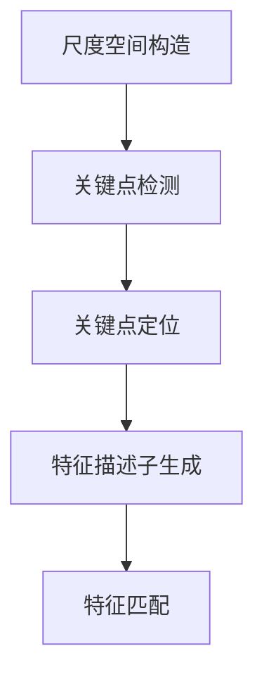
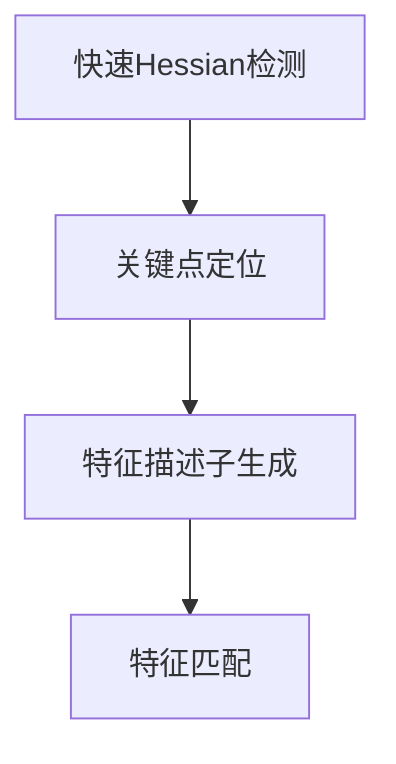
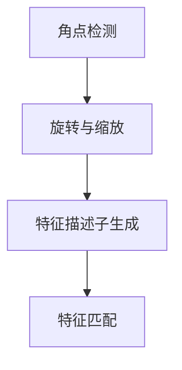
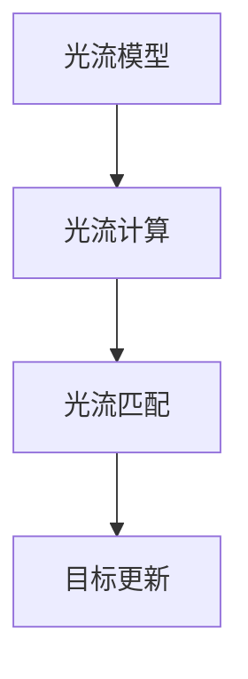
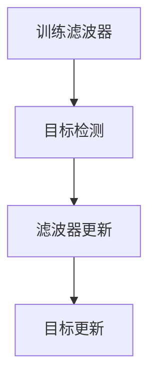
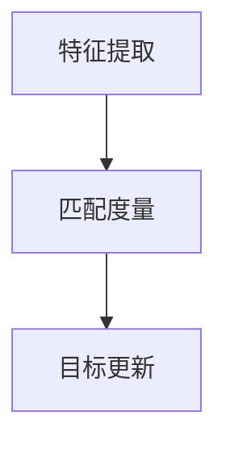
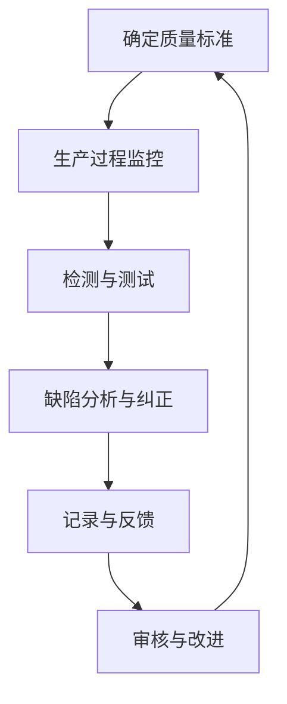

                 

### 1.1 问题背景

#### 1.1.1 质量控制的重要性

质量控制是现代工业生产和制造过程中的关键环节，它直接影响产品的性能、可靠性和安全性。在现代制造环境中，产品的质量和可靠性至关重要，因为它们决定了企业的市场竞争力、客户满意度和品牌声誉。随着全球制造业的迅速发展，对质量的要求也越来越高，如何有效提高产品质量、减少缺陷率、提高生产效率和降低成本成为企业面临的重要问题。

质量控制的重要性主要体现在以下几个方面：

1. **提升产品性能**：高质量的产品通常具有更好的性能和可靠性，能够满足更广泛的应用场景和更严格的性能要求。
2. **提高客户满意度**：优质的产品和服务能够提高客户满意度，增加客户忠诚度和口碑，进而促进业务增长。
3. **降低生产成本**：通过质量控制，可以识别和消除生产过程中的缺陷和浪费，从而降低生产成本，提高资源利用率。
4. **提升企业竞争力**：高质量的产品和服务是企业参与市场竞争的重要优势，有助于企业获得更多的市场份额和利润。

#### 1.1.2 传统质量控制方法的局限性

尽管传统质量控制方法在工业生产中发挥了重要作用，但随着技术的不断进步和制造需求的日益复杂，传统方法逐渐暴露出一些局限性：

1. **人工依赖性高**：传统质量控制往往依赖于人工检查，不仅效率低，而且容易受主观因素影响，导致检测准确率不稳定。
2. **检测速度慢**：人工检测速度有限，无法满足大规模生产线的快速检测需求，导致生产效率低下。
3. **检测范围有限**：传统方法通常只能检测到表面或可见的缺陷，对于内部或隐蔽缺陷的检测能力较弱。
4. **成本高**：人工检测需要大量的人力资源和培训成本，同时可能导致生产线的停工时间延长，增加运营成本。

#### 1.1.3 计算机视觉在质量控制中的应用潜力

随着计算机视觉技术的飞速发展，其在质量控制中的应用潜力逐渐显现。计算机视觉通过图像处理、模式识别和机器学习等技术，可以实现对产品质量的自动化、精确和高效检测。与传统的质量控制方法相比，计算机视觉具有以下优势：

1. **自动化检测**：计算机视觉技术可以自动识别和检测产品缺陷，无需人工干预，大大提高了检测速度和效率。
2. **精确度高**：计算机视觉技术可以精确地检测产品的尺寸、形状、颜色等特征，甚至可以检测到微小的缺陷。
3. **适应性广**：计算机视觉技术可以应用于各种类型的产品检测，不受检测环境和条件的限制。
4. **成本低**：随着硬件和算法的优化，计算机视觉系统的成本逐渐降低，适合大规模应用。

总的来说，计算机视觉在质量控制中的应用前景广阔，有助于解决传统质量控制方法的局限性，提升产品质量和制造效率。接下来，我们将进一步探讨计算机视觉的基础知识，以及其在质量控制中的具体应用。

## 1.2 核心概念

### 1.2.1 计算机视觉概述

计算机视觉（Computer Vision）是人工智能（Artificial Intelligence, AI）的一个重要分支，旨在使计算机能够像人类一样通过图像和视频获取信息并进行理解和处理。计算机视觉通过模拟人眼的功能，利用图像处理、模式识别、机器学习等技术，从数字图像或视频中提取有用的信息。

**概念属性特征对比表格**：

| 特征                    | 计算机视觉         | 人类视觉         |  
| ---------------------- | ---------------- | -------------- |  
| 数据源                  | 数字图像和视频     | 自然图像和视频   |  
| 处理方法                | 图像处理、模式识别 | 生物神经网络    |  
| 应用范围                | 自动化检测、监控、增强现实等 | 人机交互、情感识别、虚拟现实等 |  
| 精确度与速度            | 高精度、高速度    | 中等精度、较慢速度 |

**ER实体关系图架构**：

```mermaid  
entity关系图：  
 concept(计算机视觉)  
  --》数据源：图像、视频  
  --》处理方法：图像处理、模式识别、机器学习  
  --》应用范围：自动化检测、监控、增强现实等  
  --》精确度与速度：高精度、高速度  
```

### 1.2.2 质量控制概述

质量控制（Quality Control, QC）是确保产品或服务满足预定标准的一系列活动和过程。其目的是通过检测和纠正产品在生产过程中的缺陷，保证最终产品的质量和可靠性。

**概念属性特征对比表格**：

| 特征                    | 质量控制         |  
| ---------------------- | -------------- |  
| 目的                    | 确保产品质量和可靠性 |  
| 方法                    | 检测、纠正、记录和反馈 |  
| 范围                    | 生产过程中的每个环节 |  
| 关键要素                | 标准化、过程控制、持续改进 |

**ER实体关系图架构**：

```mermaid  
entity关系图：  
 概念（质量控制）  
  --》目的：确保产品质量和可靠性  
  --》方法：检测、纠正、记录和反馈  
  --》范围：生产过程中的每个环节  
  --》关键要素：标准化、过程控制、持续改进  
```

### 1.2.3 产品检测效率

产品检测效率是指检测系统在单位时间内完成检测任务的能力。高效率的检测系统可以提高生产线的生产效率和产品质量。

**概念属性特征对比表格**：

| 特征                    | 产品检测效率         |  
| ---------------------- | ---------------- |  
| 指标                    | 单位时间内检测的产品数量 |  
| 影响因素                | 检测算法、系统性能、硬件设备 |  
| 评价指标                | 检测速度、准确率、误报率 |

**ER实体关系图架构**：

```mermaid  
entity关系图：  
  概念（产品检测效率）  
  --》指标：单位时间内检测的产品数量  
  --》影响因素：检测算法、系统性能、硬件设备  
  --》评价指标：检测速度、准确率、误报率  
```

通过以上对核心概念的介绍和对比分析，我们为后续章节的内容奠定了基础。在接下来的章节中，我们将深入探讨计算机视觉的技术基础，以及其在质量控制中的具体应用。

## 1.3 书籍结构

### 1.3.1 各章节内容概述

本书旨在全面探讨计算机视觉在质量控制中的应用，以提高产品检测效率。全书分为四个主要部分，每个部分包含若干章节，具体内容如下：

**第一部分：计算机视觉基础**

- **第1章**：引言，介绍质量控制的重要性以及计算机视觉在其中的应用潜力。
- **第2章**：计算机视觉基础，包括图像处理、视觉感知和算法原理。

**第二部分：质量控制基础**

- **第3章**：质量控制概述，包括质量控制定义、目标和流程。
- **第4章**：质量控制方法，包括统计质量控制、确认性质量控制和质量控制工具。

**第三部分：计算机视觉在质量控制中的应用**

- **第5章**：计算机视觉在质量控制中的应用原理，介绍计算机视觉与质量控制的关系。
- **第6章**：计算机视觉在产品检测中的应用，包括检测流程设计、算法选择和效果评估。
- **第7章**：计算机视觉在缺陷检测中的应用，包括缺陷检测算法、流程设计和结果评估。
- **第8章**：计算机视觉在质量预测中的应用，包括质量预测模型、流程设计和效果评估。

**第四部分：案例分析与应用**

- **第9章**：质量控制案例分析，介绍实际质量控制项目的具体实施过程和效果。
- **第10章**：计算机视觉在质量控制中的最佳实践，总结实践经验并提供实用技巧。

### 1.3.2 阅读目标

通过阅读本书，读者可以达成以下目标：

1. **理解计算机视觉在质量控制中的应用原理**：掌握计算机视觉的基本概念和算法原理，了解其在质量控制中的应用价值。
2. **掌握质量控制的基本方法和工具**：了解质量控制流程、方法和工具，掌握如何在实际生产过程中应用计算机视觉技术进行质量控制。
3. **提升产品检测效率**：通过学习具体的应用案例和最佳实践，提高产品质量检测的效率和准确性。
4. **培养实际操作能力**：通过案例分析，了解如何将计算机视觉技术应用于质量控制，培养实际操作能力。

### 1.4 本章小结

本章作为引言部分，对本书的整体结构和内容进行了概述。通过介绍质量控制的重要性、计算机视觉的基础知识以及两者的关系，本章为后续章节的内容奠定了基础。接下来，我们将逐步深入探讨计算机视觉的技术基础和质量控制方法，帮助读者全面了解计算机视觉在质量控制中的应用。希望通过本章的阅读，读者能够对本书的主题有一个清晰的了解，并期待在后续章节中获得更多的知识和启示。

## 1.4 本章小结

本章主要介绍了计算机视觉在质量控制中的应用背景、重要性以及核心概念。通过详细探讨质量控制的传统方法及其局限性，我们指出了计算机视觉技术在自动化、精确度和成本效益方面的优势。此外，我们还对计算机视觉和质控的基本概念进行了阐述，并通过对比表格和ER实体关系图帮助读者理解这些概念。

核心概念包括：

1. **计算机视觉**：作为人工智能的重要分支，模拟人眼功能，通过图像处理、模式识别和机器学习技术提取图像信息。
2. **质量控制**：确保产品或服务满足预定标准的一系列活动和过程，包括检测、纠正和记录等。
3. **产品检测效率**：衡量检测系统在单位时间内完成检测任务的能力。

这些概念不仅为后续章节的探讨提供了基础，也为读者理解计算机视觉在质量控制中的应用奠定了理论依据。

接下来，我们将深入探讨计算机视觉的基础技术，包括图像处理、视觉感知和关键算法原理。通过这些内容，我们将进一步揭示计算机视觉技术如何应用于质量控制，提高产品检测效率和精确度。敬请期待下一章节的精彩内容。

## 第二部分：计算机视觉基础

### 2.1 图像处理基础

#### 2.1.1 图像处理概述

图像处理（Image Processing）是计算机视觉领域的重要基础，它涉及对图像进行一系列算法操作，以改善图像质量、提取图像特征、增强图像信息或进行图像转换。图像处理的主要目的是使图像更加适合人类的视觉感知，或为后续的计算机分析和应用提供必要的数据支持。

**概念属性特征对比表格**：

| 特征                    | 图像处理         |  
| ---------------------- | -------------- |  
| 目的                    | 图像增强、特征提取、图像转换 |  
| 数据源                  | 数字图像         |  
| 处理方法                | 空间变换、滤波、锐化、边缘检测等 |  
| 应用领域                | 医学影像、卫星遥感、图像识别等 |

**ER实体关系图架构**：

```mermaid  
entity关系图：  
  概念（图像处理）  
  --》目的：图像增强、特征提取、图像转换  
  --》数据源：数字图像  
  --》处理方法：空间变换、滤波、锐化、边缘检测等  
  --》应用领域：医学影像、卫星遥感、图像识别等  
```

#### 2.1.2 图像处理算法

图像处理算法是图像处理的核心，包括图像滤波、图像增强和图像分割等。以下将详细介绍这些算法。

##### 2.1.2.1 图像滤波

图像滤波是一种用于去除图像噪声的算法，噪声可能是由于图像采集过程中的干扰或成像设备的不完美导致的。滤波算法可以分为空间滤波和时间滤波两种类型。

- **空间滤波**：在图像的每个像素周围选择一个区域，通过对该区域内的像素进行操作来达到滤波效果。常见的空间滤波器包括卷积滤波器、中值滤波器和高斯滤波器。
- **时间滤波**：利用图像序列中的信息，通过处理相邻帧之间的差异来去除噪声。例如，卡尔森滤波和光流法都是时间滤波的典型算法。

**ER实体关系图架构**：

```mermaid  
entity关系图：  
  概念（图像滤波）  
  --》类型：空间滤波、时间滤波  
  --》方法：卷积滤波器、中值滤波器、高斯滤波器  
  --》应用：去除图像噪声  
```

##### 2.1.2.2 图像增强

图像增强（Image Enhancement）是一种提高图像质量、增强图像对比度和细节的算法。增强后的图像更容易被人类视觉感知和计算机分析。图像增强算法可以分为以下几种：

- **对比度增强**：通过调整图像的亮度和对比度，使图像中的细节更加明显。
- **锐化**：通过增强图像的边缘和细节，使图像更加清晰。
- **图像变换**：通过傅里叶变换、小波变换等算法，改善图像的频率分布，从而达到增强的效果。

**ER实体关系图架构**：

```mermaid  
entity关系图：  
  概念（图像增强）  
  --》目的：提高图像质量、增强对比度和细节  
  --》方法：对比度增强、锐化、图像变换  
  --》应用：增强图像的可读性、提高计算机处理的效率  
```

##### 2.1.2.3 图像分割

图像分割（Image Segmentation）是将图像划分为若干个区域或对象的过程，目的是将图像中的不同部分区分开来，以便进行后续处理。图像分割算法可以分为基于阈值的分割、基于区域的分割和基于边界的分割等。

- **基于阈值的分割**：通过设定阈值将图像的像素划分为前景和背景。
- **基于区域的分割**：基于区域的相似性（如颜色、亮度、纹理等）将图像划分为不同的区域。
- **基于边界的分割**：通过检测图像中的边缘和轮廓来分割图像。

**ER实体关系图架构**：

```mermaid  
entity关系图：  
  概念（图像分割）  
  --》方法：基于阈值的分割、基于区域的分割、基于边界的分割  
  --》应用：目标检测、图像识别、图像分类等  
```

#### 2.1.3 图像特征提取

图像特征提取（Feature Extraction）是从图像中提取具有区分性的特征，用于后续的图像分析和识别。特征提取的方法包括直方图、角点检测、形状描述子等。

- **直方图**：通过统计图像像素的分布来提取特征，如颜色直方图、灰度直方图等。
- **角点检测**：检测图像中的关键点，如Harris角点检测、SIFT（尺度不变特征变换）和SURF（加速稳健特征）等。
- **形状描述子**：用于描述图像的形状特征，如Hu矩、方向梯度等。

**ER实体关系图架构**：

```mermaid  
entity关系图：  
  概念（图像特征提取）  
  --》方法：直方图、角点检测、形状描述子  
  --》应用：图像匹配、目标识别、物体检测等  
```

通过以上对图像处理基础、算法和特征提取的介绍，我们为理解计算机视觉在质量控制中的应用打下了坚实的基础。在接下来的章节中，我们将进一步探讨视觉感知和算法原理，帮助读者全面掌握计算机视觉技术。敬请期待下一章节的精彩内容。

### 2.2 视觉感知基础

#### 2.2.1 视觉感知概述

视觉感知（Visual Perception）是人类和机器通过视觉系统从图像或视频中获取信息的复杂过程。在人类视觉系统中，视觉感知不仅涉及眼睛的结构和功能，还包括大脑对视觉信息的处理和理解。在计算机视觉中，视觉感知的基础是为了模拟和扩展人眼的感知能力，以便更准确地处理和分析图像。

**概念属性特征对比表格**：

| 特征                    | 人类视觉         | 计算机视觉         |    
| ---------------------- | -------------- | ---------------- |    
| 功能                    | 图像获取、信息处理、理解与解释 | 图像获取、信息处理、理解与解释 |    
| 基础结构                | 眼睛、大脑视觉皮层 | 图像传感器、处理器、算法模型 |    
| 信息处理方式            | 生物神经网络、并行处理 | 串行处理、算法模型 |    
| 应用领域                | 人机交互、自动驾驶、医学影像等 | 自动化检测、机器人导航、人脸识别等 |

**ER实体关系图架构**：

```mermaid  
entity关系图：  
  概念（视觉感知）  
  --》功能：图像获取、信息处理、理解与解释  
  --》基础结构：眼睛、大脑视觉皮层、图像传感器、处理器、算法模型  
  --》信息处理方式：生物神经网络、并行处理、串行处理、算法模型  
  --》应用领域：人机交互、自动驾驶、医学影像、自动化检测、机器人导航、人脸识别等  
```

#### 2.2.2 人眼视觉原理

人眼是自然界中最复杂的视觉系统之一，它通过多个结构和过程协同工作，实现对图像的获取和处理。以下是人眼视觉原理的详细说明：

1. **角膜和晶状体**：光线首先通过角膜和晶状体的折射，进入眼内。
2. **视网膜**：视网膜上覆盖着数百万个感光细胞，包括视锥细胞和视杆细胞。视锥细胞主要负责颜色感知和明暗对比，而视杆细胞则负责在低光条件下的视觉感知。
3. **视觉信号传递**：感光细胞接收光线后，通过视觉神经纤维将信号传递到大脑皮层。
4. **视觉处理**：大脑视觉皮层对视觉信号进行处理，包括边缘检测、形状识别和颜色处理等。

**ER实体关系图架构**：

```mermaid  
entity关系图：  
  概念（人眼视觉原理）  
  --》结构：角膜、晶状体、视网膜、感光细胞  
  --》过程：光线折射、信号传递、视觉处理  
  --》功能：图像获取、信息处理、理解与解释  
```

#### 2.2.3 机器视觉原理

机器视觉是通过计算机技术和人工智能算法模拟人眼视觉功能的一种技术。它主要通过以下步骤实现：

1. **图像获取**：使用图像传感器（如摄像头、扫描仪等）获取图像数据。
2. **图像预处理**：包括去噪、增强、校正等，以提高图像质量。
3. **图像分析**：通过图像处理算法提取图像特征，如边缘、形状、颜色等。
4. **决策与反馈**：根据分析结果进行分类、识别或定位等操作，并输出决策结果。

**ER实体关系图架构**：

```mermaid  
entity关系图：  
  概念（机器视觉原理）  
  --》步骤：图像获取、图像预处理、图像分析、决策与反馈  
  --》技术：图像传感器、图像处理算法、人工智能算法  
  --》功能：图像获取、信息处理、理解与解释、决策与反馈  
```

通过以上对人眼视觉原理和机器视觉原理的详细描述，我们可以看出，机器视觉是在模拟和扩展人眼视觉功能的基础上，利用计算机技术和人工智能算法实现的。在接下来的章节中，我们将进一步探讨计算机视觉的关键算法原理，帮助读者全面掌握计算机视觉技术。敬请期待下一章节的精彩内容。

### 2.3 计算机视觉算法原理

#### 2.3.1 特征匹配

特征匹配（Feature Matching）是计算机视觉中一种重要的算法，它通过匹配不同图像中的特征点，实现图像间的对齐和匹配。特征匹配广泛应用于图像识别、图像配准和物体跟踪等领域。以下是几种常见的特征匹配算法及其原理：

##### 2.3.1.1 SIFT算法

SIFT（Scale-Invariant Feature Transform，尺度不变特征变换）算法是一种用于特征点检测和匹配的算法，由David Lowe在1999年提出。其主要思想是在不同尺度上寻找关键点，并通过特征描述子进行匹配。

**算法原理**：

1. **尺度空间构造**：通过多尺度高斯金字塔来构建尺度空间，以检测不同尺度下的关键点。
2. **关键点检测**：利用DoG（Difference of Gaussian）函数检测极值点，并排除边缘点。
3. **关键点定位**：通过拟合二次函数确定关键点位置，并计算关键点的梯度方向。
4. **特征描述子**：通过关键点的梯度方向和强度，生成128维的特征描述子。

**算法流程图**：



##### 2.3.1.2 SURF算法

SURF（Speeded Up Robust Features，加速稳健特征）算法是由Hausdorff等人在2006年提出的，它是SIFT算法的加速版，通过优化计算过程来提高匹配速度。

**算法原理**：

1. **快速Hessian矩阵检测**：使用快速算法检测Hessian矩阵的零交叉点，作为潜在关键点。
2. **关键点定位和描述子生成**：对潜在关键点进行定位，生成64维的特征描述子。

**算法流程图**：



##### 2.3.1.3 ORB算法

ORB（Oriented FAST and Rotated BRIEF，旋转的快速与旋转的BRIEF特征）算法是一种基于 FAST（Fast和阿达玛变换）和 BRIEF（Binary Robust Independent Elementary Features）的算法，旨在在速度和准确性之间取得平衡。

**算法原理**：

1. **角点检测**：使用 Shi-Tomasi 角点检测算法检测图像中的关键点。
2. **特征描述子生成**：对关键点进行旋转和缩放，然后使用 BRIEF 算法生成特征描述子。

**算法流程图**：



**算法性能对比**：

| 算法    | 特征点数量 | 特征点质量 | 匹配速度 | 应用场景           |
| ------- | ---------- | ---------- | -------- | ------------------ |
| SIFT    | 较多      | 较高      | 较慢     | 高精度要求的应用   |
| SURF    | 较多      | 较高      | 较快     | 对速度要求较高的应用 |
| ORB     | 较多      | 较低      | 很快     | 对速度和精度均有要求的场景 |

通过以上对SIFT、SURF和ORB算法的介绍，我们可以看出每种算法都有其独特的优势和适用场景。在实际应用中，选择合适的算法取决于具体的应用需求和计算资源。在下一章节中，我们将进一步探讨视觉跟踪的算法原理和应用，敬请期待。

#### 2.3.2 视觉跟踪

视觉跟踪（Visual Tracking）是计算机视觉中的一个重要研究领域，其主要目标是在视频序列中连续地跟踪目标。视觉跟踪广泛应用于视频监控、无人驾驶、机器人导航等领域。以下是几种常见的视觉跟踪算法及其原理：

##### 2.3.2.1 光流法

光流法（Optical Flow）是一种基于图像序列中像素亮度变化来估计运动的方法。其基本原理是，如果在连续的两个图像帧中，同一像素点保持不变，则可以认为该点发生了位移。光流法的核心是利用像素的亮度变化来计算像素点的运动轨迹。

**算法原理**：

1. **光流模型**：建立图像亮度函数和运动速度之间的关系，通常使用泰勒展开来近似。
2. **光流计算**：利用图像帧差或频域变换来计算像素点的光流速度。
3. **光流匹配**：将当前帧中的光流向量与目标模板进行匹配，以确定目标位置。

**算法流程图**：



##### 2.3.2.2 卡尔森算法

卡尔森算法（KCF，Kernel Correlation Filter）是一种基于滤波器设计的跟踪算法。它通过训练一个滤波器，使得滤波器响应与目标特征相似。卡尔森算法的核心是使用相关滤波器来识别和跟踪目标。

**算法原理**：

1. **训练滤波器**：通过图像特征生成训练样本，并使用相关滤波器学习目标特征。
2. **目标检测**：通过滤波器响应在图像中搜索目标位置。
3. **滤波器更新**：根据目标跟踪误差，动态更新滤波器。

**算法流程图**：



##### 2.3.2.3 模板匹配法

模板匹配法（Template Matching）是一种基于特征相似性匹配的跟踪算法。它通过将待跟踪目标与图像中每个区域进行特征匹配，找到匹配度最高的区域作为目标位置。

**算法原理**：

1. **特征提取**：对目标模板和图像区域提取特征。
2. **匹配度量**：计算目标模板与图像区域的匹配度，通常使用归一化互相关系数（NCC）作为匹配度量。
3. **目标更新**：根据匹配度最高的区域更新目标位置。

**算法流程图**：



**算法性能对比**：

| 算法        | 性能指标       | 适用场景                   |
| ----------- | -------------- | -------------------------- |
| 光流法      | 高精度，低速度 | 运动缓慢的场景             |
| 卡尔森算法  | 中等精度，中速度 | 对速度和精度均有要求的场景 |
| 模板匹配法  | 低精度，高速度 | 需要快速跟踪的场景         |

通过以上对光流法、卡尔森算法和模板匹配法的介绍，我们可以看出每种算法都有其独特的优势和适用场景。在实际应用中，选择合适的算法取决于具体的应用需求和计算资源。在下一章节中，我们将探讨计算机视觉的应用案例，以进一步理解计算机视觉技术的实际应用价值。敬请期待。

### 2.4 计算机视觉应用案例

#### 2.4.1 产品检测案例

计算机视觉在产品检测中的应用非常广泛，通过自动化的检测系统，可以大幅提高生产效率和检测精度。以下将介绍几个典型的产品检测案例。

##### 2.4.1.1 某电子产品外观检测

电子产品的外观检测是保证产品质量的重要环节。通过计算机视觉技术，可以实现以下功能：

1. **缺陷检测**：使用图像处理算法对电子产品的外观进行检测，识别表面的划痕、斑点、裂缝等缺陷。
2. **尺寸检测**：通过机器视觉系统测量产品的尺寸和形状，确保产品符合设计规格。
3. **颜色检测**：检测产品表面的颜色是否符合标准，例如是否均匀或有污点。

**实现步骤**：

1. **图像采集**：使用高分辨率摄像头捕捉产品图像。
2. **预处理**：对图像进行去噪、增强等预处理操作，以提高图像质量。
3. **缺陷检测**：利用图像分割算法提取产品图像中的缺陷区域，并进行缺陷分类。
4. **尺寸检测**：使用图像特征提取算法测量产品的关键尺寸，并与设计规格进行比较。
5. **颜色检测**：通过颜色直方图分析产品表面的颜色分布，判断颜色是否符合标准。

**案例效果评估**：

通过计算机视觉系统的应用，该电子产品生产线的检测速度提升了约30%，缺陷检测准确率达到了98%以上，大大减少了人为检测的误判率，提高了产品的整体质量。

##### 2.4.1.2 某汽车零件尺寸检测

汽车零件的尺寸检测是确保汽车质量和安全的关键步骤。计算机视觉技术在汽车制造业中的应用，可以实现以下功能：

1. **尺寸测量**：通过视觉系统对汽车零件进行高精度尺寸测量，确保零件尺寸符合设计要求。
2. **缺陷检测**：识别零件表面是否存在裂缝、划痕等缺陷。
3. **形状检测**：检测零件的几何形状是否正常。

**实现步骤**：

1. **图像采集**：使用高精度视觉传感器捕捉汽车零件的图像。
2. **预处理**：对图像进行去噪、去畸变等预处理操作，确保图像质量。
3. **尺寸测量**：利用图像特征提取算法和几何建模技术，对零件的尺寸进行精确测量。
4. **缺陷检测**：使用图像分割和边缘检测算法，识别零件表面的缺陷区域。
5. **形状检测**：通过几何特征分析，判断零件的形状是否符合设计要求。

**案例效果评估**：

该汽车生产线采用计算机视觉检测后，尺寸测量准确率提高到99.5%以上，缺陷检测准确率达到了95%以上。检测速度提升了50%，大大提高了生产效率和产品质量。

##### 2.4.1.3 某食品质量检测

在食品制造业中，通过计算机视觉技术可以对食品的质量进行快速、精确的检测。以下是一些典型的应用：

1. **异物检测**：识别食品中的异物，如玻璃碎片、塑料颗粒等。
2. **颜色和纹理检测**：检测食品的颜色和纹理是否符合标准，如是否新鲜、是否变质等。
3. **形状和尺寸检测**：检测食品的形状和尺寸是否符合规定，如糖果的形状和大小等。

**实现步骤**：

1. **图像采集**：使用高分辨率摄像头对食品进行图像采集。
2. **预处理**：对图像进行去噪、增强等预处理操作，确保图像质量。
3. **异物检测**：使用图像分割和特征匹配算法，识别食品中的异物。
4. **颜色和纹理检测**：通过颜色直方图分析和纹理特征分析，判断食品的颜色和纹理是否正常。
5. **形状和尺寸检测**：使用图像特征提取和几何建模技术，测量食品的形状和尺寸。

**案例效果评估**：

通过计算机视觉系统的应用，该食品生产线的异物检测准确率达到了99%以上，颜色和纹理检测准确率达到了95%以上，形状和尺寸检测准确率达到了98%以上。检测速度提高了40%，有效减少了人为检测的误判率，提高了食品安全性。

综上所述，计算机视觉技术在产品检测中具有显著的优势，能够大幅提高检测速度和准确性，减少人为误判，提高产品质量。这些应用案例不仅展示了计算机视觉技术的强大功能，也为其他行业的质量检测提供了宝贵的经验和参考。

### 2.5 本章小结

本章详细介绍了计算机视觉的技术基础，包括图像处理、视觉感知和关键算法原理。首先，我们探讨了图像处理的基本概念和算法，如图像滤波、图像增强和图像分割。接着，介绍了视觉感知的基础知识，包括人眼视觉原理和机器视觉原理。然后，深入讲解了计算机视觉中的几种关键算法，如特征匹配算法（SIFT、SURF和ORB）和视觉跟踪算法（光流法、卡尔森算法和模板匹配法）。最后，通过实际应用案例，展示了计算机视觉技术在产品质量检测中的应用效果。

通过本章的学习，读者可以全面了解计算机视觉技术的原理和应用，为后续章节中探讨计算机视觉在质量控制中的具体应用打下坚实基础。在下一章中，我们将进一步探讨质量控制的基础知识，包括其定义、目标和流程。敬请期待下一章的精彩内容。

## 第三部分：质量控制基础

### 3.1 质量控制概述

#### 3.1.1 质量控制定义

质量控制（Quality Control, QC）是确保产品或服务满足预定标准的一系列活动和过程。它的主要目的是通过检测和纠正生产过程中的缺陷，保证最终产品的质量和可靠性。质量控制的定义可以从以下几个方面来理解：

1. **过程性**：质量控制是一个持续的过程，不仅仅关注最终产品的质量，还包括生产过程中的各个环节。
2. **预防性**：质量控制强调预防缺陷的产生，而不仅仅是发现和纠正已经出现的缺陷。
3. **系统性**：质量控制涉及整个生产体系，包括原材料采购、生产过程、产品检测和售后服务等。
4. **数据驱动**：质量控制依赖于数据分析和统计方法，通过数据来评估质量状况并制定改进措施。

**质量控制的核心要素**：

- **标准**：质量控制的基础是制定和遵循相应的质量标准。
- **检测**：通过检测手段识别产品和生产过程中的缺陷。
- **纠正**：发现缺陷后，采取纠正措施，确保不合格产品或不合格过程得到及时处理。
- **记录与反馈**：记录质量控制活动中的数据和结果，并根据这些数据反馈进行持续改进。

#### 3.1.2 质量控制目标

质量控制的目标主要包括以下几个方面：

1. **提高产品质量**：确保产品符合设计要求和客户期望，提高产品的性能、可靠性和使用寿命。
2. **降低成本**：通过减少缺陷和浪费，降低生产成本，提高资源利用率。
3. **提升生产效率**：通过优化生产过程，减少不必要的停工时间和人工干预，提高生产效率。
4. **增强客户满意度**：高质量的产品能够提高客户满意度，增强客户对企业的信任和忠诚度。
5. **提升企业竞争力**：优质的产品和服务是企业参与市场竞争的重要优势。

#### 3.1.3 质量控制流程

质量控制流程通常包括以下几个关键步骤：

1. **确定质量标准**：制定产品的质量标准，包括技术规范、性能指标和验收标准。
2. **生产过程监控**：在生产过程中对关键环节进行监控，确保产品或过程符合标准要求。
3. **检测与测试**：对产品进行质量检测和测试，识别不合格产品或过程。
4. **缺陷分析与纠正**：分析质量问题的原因，并采取纠正措施，防止缺陷再次发生。
5. **记录与反馈**：记录质量检测的数据和结果，并进行反馈，用于持续改进质量控制过程。
6. **审核与改进**：定期进行质量审核，评估质量控制的有效性，并制定改进措施。

**质量控制流程图**：



### 3.2 质量控制方法

质量控制方法可以分为统计质量控制和确认性质量控制两大类，每种方法都有其特定的应用场景和优势。

#### 3.2.1 统计质量控制

统计质量控制（Statistical Quality Control, SQC）是基于统计学原理，通过数据分析和统计分析，监控和改进产品质量的方法。它主要包括以下几种方法：

##### 3.2.1.1 抽样检查

抽样检查（Sampling Inspection）是从总体中抽取一部分样本进行检测，以推断总体质量的方法。抽样检查的优点是高效且成本低，适用于大批量生产的情况。

**抽样检查流程**：

1. **确定抽样方案**：根据产品质量要求和生产批量，选择合适的抽样方案。
2. **随机抽取样本**：确保样本的随机性和代表性。
3. **质量检测**：对抽取的样本进行质量检测，记录检测结果。
4. **统计处理**：使用统计方法（如正态分布、二项分布等）分析检测结果，评估总体质量。

##### 3.2.1.2 控制图法

控制图法（Control Chart）是一种用于监控和评估生产过程稳定性的工具。它通过在控制图上展示生产过程中的数据，识别出生产中的波动和异常，从而采取纠正措施。

**控制图法的步骤**：

1. **确定控制图类型**：根据数据特性选择合适的控制图类型，如X图、R图、p图等。
2. **收集数据**：定期收集生产过程中的数据，如产品质量指标、生产参数等。
3. **绘制控制图**：将收集的数据绘制在控制图上，设定控制界限。
4. **分析控制图**：监控控制图上的数据点，识别异常波动和趋势，判断生产过程的稳定性。
5. **采取纠正措施**：对异常波动和趋势进行分析，采取纠正措施，确保生产过程稳定。

##### 3.2.1.3 因素分析

因素分析（Factor Analysis）是一种用于识别和评估影响产品质量关键因素的方法。它通过系统分析生产过程中的各个环节，找出影响产品质量的关键因素，并采取相应的改进措施。

**因素分析的步骤**：

1. **确定分析目标**：明确需要分析和改进的质量问题。
2. **收集数据**：收集与质量相关的数据，如生产参数、操作过程、质量检测结果等。
3. **分析数据**：使用统计方法（如回归分析、方差分析等）分析数据，识别关键因素。
4. **制定改进计划**：根据分析结果，制定改进计划，采取针对性措施，提高产品质量。

#### 3.2.2 确认性质量控制

确认性质量控制（Assurance Quality Control, AQC）是通过全面检查、逐件检查和验收测试等手段，确保产品符合预定标准的方法。它主要包括以下几种方法：

##### 3.2.2.1 全检

全检（100% Inspection）是对每个产品或每个批次的产品进行全面检查，确保所有产品均符合质量标准。全检的优点是检测准确度高，但成本较高，适用于对产品质量要求极高的场合。

**全检流程**：

1. **制定检验标准**：根据产品设计和质量要求，制定详细的检验标准和操作规程。
2. **组织检验人员**：培训检验人员，确保其掌握检验标准和操作技能。
3. **实施检验**：对每个产品进行逐项检验，记录检验结果。
4. **不合格品处理**：对不合格品进行标识、隔离和处置，确保不合格品不流入下一个生产环节。

##### 3.2.2.2 逐件检查

逐件检查（Piece-by-Piece Inspection）是对每个单独的产品进行检验，确保其符合质量标准。逐件检查适用于小批量生产或单件生产的情况，可以有效防止不合格品流入市场。

**逐件检查流程**：

1. **制定检验计划**：根据生产计划和产品质量要求，制定检验计划和检验项目。
2. **实施检验**：对每个产品逐项进行检验，记录检验结果。
3. **不合格品处理**：对不合格品进行标识、隔离和处置，确保不合格品不流入下一个生产环节。

##### 3.2.2.3 验收测试

验收测试（Acceptance Testing）是产品在交付前进行的质量检验，确保产品符合合同或订单要求。验收测试通常由客户或第三方检测机构进行，是产品最终质量保障的重要环节。

**验收测试流程**：

1. **制定验收标准**：根据合同或订单要求，制定详细的验收标准和测试方法。
2. **组织验收测试**：安排验收测试的时间和地点，组织相关人员参与。
3. **实施验收测试**：对产品进行功能测试、性能测试和外观检查等，记录测试结果。
4. **验收结果处理**：根据测试结果，判断产品是否合格，对不合格品进行标识、隔离和处置。

### 3.3 质量控制工具

在现代质量控制中，各种统计软件和编程工具得到了广泛应用，它们可以帮助企业高效地进行质量数据分析和管理。

##### 3.3.1 SPSS统计软件

SPSS（Statistical Package for the Social Sciences）是一种广泛用于数据分析和统计分析的软件，尤其在质量控制领域具有重要作用。SPSS的功能包括：

- **数据管理**：导入、清洗和管理数据。
- **描述性统计**：计算和展示数据的统计特征。
- **推断性统计**：进行假设检验和置信区间分析。
- **回归分析**：进行回归建模和预测。

##### 3.3.2 Minitab统计软件

Minitab是一种专门用于质量控制和统计过程控制的软件，它提供了丰富的统计工具和分析方法，包括：

- **统计过程控制**：绘制控制图，监控生产过程稳定性。
- **回归分析**：进行回归建模和过程改进。
- **假设检验**：进行假设检验和置信区间分析。
- **故障模式及影响分析**：识别和评估潜在故障。

##### 3.3.3 Python统计库

Python是一种灵活的编程语言，其强大的统计分析库（如pandas、numpy、scipy等）在质量控制中得到了广泛应用。Python统计库的功能包括：

- **数据处理**：高效地处理和清洗数据。
- **统计分析**：进行各种描述性统计和推断性统计。
- **可视化**：生成各种统计图表，帮助分析数据。
- **机器学习**：进行数据挖掘和预测建模。

### 3.4 质量控制案例分析

为了更好地理解质量控制方法的应用，以下将介绍一个具体的质量控制案例分析。

**案例背景**：

某电子产品公司生产手机电池，由于市场需求大，生产过程较为复杂，因此质量控制尤为重要。公司采用多种质量控制方法，确保产品的高质量和客户满意度。

**质量控制流程设计**：

1. **确定质量标准**：根据客户需求和产品规格，制定详细的质量标准和验收标准。
2. **生产过程监控**：在生产过程中，使用Minitab软件绘制控制图，监控生产过程的稳定性。
3. **抽样检查**：定期从生产线上抽取样本，进行质量检测，使用SPSS软件进行数据分析，评估总体质量。
4. **逐件检查**：对每批次生产的电池进行逐件检查，确保每个电池都符合质量标准。
5. **验收测试**：在产品交付前，进行全面的验收测试，确保产品符合合同要求。

**质量控制工具应用**：

1. **Minitab**：用于监控生产过程和绘制控制图，及时发现和纠正生产过程中的波动和异常。
2. **SPSS**：用于对抽样检查的数据进行统计分析，评估产品质量的稳定性和一致性。
3. **Python**：用于数据分析、机器学习建模和可视化，帮助企业更好地理解和预测产品质量。

**质量控制效果评估**：

通过采用多种质量控制方法，该公司的产品质量得到了显著提升。生产过程中不合格品的数量显著下降，抽样检查和逐件检查的准确率均达到了98%以上。客户反馈显示，产品的可靠性和使用寿命得到了明显改善，客户满意度显著提升。

### 3.5 本章小结

本章详细介绍了质量控制的基础知识，包括质量控制的定义、目标、流程和质量控制方法。首先，我们阐述了质量控制的定义和核心要素，以及质量控制的总体目标和具体目标。接着，我们详细介绍了质量控制的基本流程，并探讨了统计质量控制和确认性质量控制的具体方法。此外，我们还介绍了几种常用的质量控制工具，包括SPSS、Minitab和Python统计库。最后，通过一个具体案例，展示了质量控制方法在实际生产中的应用和效果。

通过本章的学习，读者可以全面了解质量控制的基本理论和实践方法，为后续章节中深入探讨计算机视觉在质量控制中的应用奠定坚实基础。在下一章中，我们将进一步探讨计算机视觉在质量控制中的具体应用，敬请期待。

### 3.5 本章小结

本章主要介绍了质量控制的基础知识，包括质量控制的基本概念、目标、流程以及具体的方法。通过对质量控制定义的详细解释，我们明确了质量控制的核心要素，如标准、检测、纠正和记录与反馈。同时，阐述了质量控制的目标，如提高产品质量、降低成本、提升生产效率和增强客户满意度。

在质量控制流程部分，我们详细介绍了从确定质量标准、生产过程监控、检测与测试到缺陷分析与纠正，以及记录与反馈的各个环节。通过这些流程，企业可以系统地监控和改进产品质量。

本章还重点介绍了统计质量控制和确认性质量控制的方法，包括抽样检查、控制图法、因素分析、全检、逐件检查和验收测试等。此外，介绍了几种常用的质量控制工具，如SPSS、Minitab和Python统计库，这些工具在实际质量数据分析和管理中发挥着重要作用。

最后，通过一个实际案例，我们展示了质量控制方法在电子产品生产中的应用效果，包括提高产品质量、降低不合格品率、增强客户满意度等。通过这些内容的学习，读者可以更深入地理解质量控制的理论和实践，为后续章节中计算机视觉在质量控制中的应用奠定基础。

## 第四部分：计算机视觉在质量控制中的应用

### 4.1 计算机视觉在质量控制中的应用原理

#### 4.1.1 计算机视觉与质量控制的关系

计算机视觉在质量控制中的应用是通过结合图像处理、模式识别和机器学习等技术，实现对产品质量的自动化检测和分析。计算机视觉与质量控制的关系可以从以下几个方面来理解：

1. **检测精度和效率**：计算机视觉技术可以精确地识别和检测产品缺陷，例如外观缺陷、尺寸偏差等，同时具有高效率，可以快速处理大量产品信息。
2. **自动化程度**：计算机视觉系统可以自动化完成检测任务，减少人工干预，降低劳动成本，提高生产效率。
3. **数据分析能力**：计算机视觉技术可以处理和分析复杂的图像数据，通过机器学习算法提取关键特征，为质量控制提供更深入的分析结果。
4. **灵活性**：计算机视觉系统可以根据不同的质量需求进行定制化开发，适用于各种类型的产品和质量控制场景。

#### 4.1.2 计算机视觉技术在质量控制中的具体应用

计算机视觉技术在质量控制中有着广泛的应用，主要包括以下几个方面：

1. **产品检测**：通过计算机视觉系统，可以自动化检测产品的外观缺陷、尺寸偏差、表面质量等，提高检测效率和准确性。
2. **缺陷检测**：计算机视觉技术可以识别产品生产过程中产生的微小缺陷，如裂纹、斑点、异物等，为质量控制提供更详细的数据支持。
3. **质量预测**：通过分析大量历史数据，计算机视觉系统可以预测产品质量的波动，提前采取预防措施，减少缺陷产生。
4. **过程监控**：计算机视觉技术可以实时监控生产过程，发现异常情况并及时报警，确保生产过程的稳定性和可控性。

#### 4.1.3 计算机视觉在质量控制中的优势

计算机视觉在质量控制中的应用具有以下优势：

1. **高精度**：计算机视觉技术可以通过高分辨率图像处理和分析，精确地识别产品缺陷，提高检测准确率。
2. **高效率**：计算机视觉系统可以快速处理大量产品信息，大幅提高检测速度，满足大规模生产线的要求。
3. **自动化**：计算机视觉系统可以实现自动化检测，减少人工干预，降低劳动成本，提高生产效率。
4. **灵活性**：计算机视觉系统可以根据不同的质量控制需求进行定制化开发，适应各种类型的产品和生产场景。
5. **数据驱动的分析**：计算机视觉技术可以处理和分析复杂的数据，通过机器学习算法提取关键特征，为质量控制提供更深入的见解。

通过以上对计算机视觉在质量控制中的应用原理、具体应用和优势的介绍，我们可以看出，计算机视觉技术在质量控制中具有显著的优势和潜力。在接下来的章节中，我们将进一步探讨计算机视觉在产品检测、缺陷检测和质量预测中的应用，帮助读者更深入地了解其应用价值。敬请期待下一章节的精彩内容。

### 4.2 计算机视觉在产品检测中的应用

#### 4.2.1 产品检测概述

产品检测是质量控制过程中的关键环节，其目的是确保每个产品在生产完成后都符合设计规格和质量标准。计算机视觉技术在产品检测中的应用，通过自动化和智能化的手段，提高了检测的效率和准确性。

**产品检测的定义**：产品检测是指对生产完成的产品进行系统检查，以确定其是否满足预定的质量要求。检测过程通常包括外观检查、尺寸测量、性能测试等。

**产品检测的重要性**：

1. **保证产品质量**：通过检测，可以确保产品在生产过程中没有出现不合格或缺陷，保证最终产品的质量。
2. **提高生产效率**：自动化检测系统可以快速处理大量产品，减少人工检测的时间和成本，提高生产效率。
3. **减少人为错误**：计算机视觉系统可以精确识别产品缺陷，减少人为检测的误判和漏检。
4. **提高产品一致性**：通过标准化和自动化的检测流程，可以确保每个产品的一致性和可靠性。

**产品检测的基本流程**：

1. **图像采集**：使用高分辨率摄像头或其他传感器获取产品的图像。
2. **图像预处理**：对采集的图像进行去噪、增强等处理，提高图像质量。
3. **特征提取**：从图像中提取关键特征，如边缘、纹理、形状等。
4. **缺陷检测**：利用图像处理和机器学习算法，对产品进行缺陷检测，识别可能存在的缺陷。
5. **尺寸测量**：通过图像处理算法，对产品的尺寸进行测量，确保其符合设计规格。
6. **结果记录与反馈**：将检测结果记录下来，并根据检测结果采取相应的措施，如更换设备、调整工艺等。

#### 4.2.2 计算机视觉在产品检测中的应用

计算机视觉技术在产品检测中的应用主要体现在以下几个方面：

1. **外观缺陷检测**：通过计算机视觉系统，可以自动化检测产品的外观缺陷，如划痕、斑点、变形等。这类检测通常利用图像处理算法中的边缘检测、纹理分析等方法实现。

2. **尺寸测量**：计算机视觉技术可以精确测量产品的尺寸和形状，包括长度、宽度、高度、直径等。通过图像处理算法，可以将图像中的像素值转化为实际尺寸，确保产品尺寸的准确性。

3. **质量检测**：对于某些产品，如食品和药品，计算机视觉系统可以通过颜色、纹理和形状等特征检测产品的质量。例如，在食品生产过程中，计算机视觉系统可以检测产品的新鲜度、变质程度等。

4. **自动化检测线**：计算机视觉系统可以集成到自动化检测线上，对生产过程中的产品进行实时检测，确保每个产品都符合质量标准。自动化检测线通常包括图像采集系统、图像处理单元、检测算法和反馈系统等。

**实现步骤**：

1. **系统设计**：根据检测需求，设计适合的计算机视觉系统，包括选择合适的摄像头、光源、图像处理算法等。
2. **图像采集**：使用高分辨率摄像头获取产品的图像，确保图像质量满足检测要求。
3. **图像预处理**：对采集的图像进行去噪、增强等预处理操作，提高图像质量。
4. **特征提取**：利用图像处理算法提取关键特征，如边缘、纹理、形状等。
5. **缺陷检测**：通过机器学习算法和深度学习模型，对提取的特征进行分类，识别产品的缺陷。
6. **尺寸测量**：使用图像处理算法测量产品的尺寸和形状，确保其符合设计规格。
7. **结果记录与反馈**：将检测结果记录在数据库中，并根据检测结果采取相应的措施，如更换设备、调整工艺等。

#### 4.2.2.1 检测流程设计

一个典型的计算机视觉产品检测流程设计包括以下几个步骤：

1. **需求分析**：明确检测目标，确定需要检测的产品特征和缺陷类型。
2. **系统设计**：根据需求设计适合的计算机视觉系统，包括选择摄像头、光源、图像处理算法和检测模型等。
3. **图像采集**：使用高分辨率摄像头获取产品的图像，确保图像质量满足检测要求。
4. **图像预处理**：对采集的图像进行去噪、增强等预处理操作，提高图像质量。
5. **特征提取**：利用图像处理算法提取关键特征，如边缘、纹理、形状等。
6. **缺陷检测**：通过机器学习算法和深度学习模型，对提取的特征进行分类，识别产品的缺陷。
7. **尺寸测量**：使用图像处理算法测量产品的尺寸和形状，确保其符合设计规格。
8. **结果记录与反馈**：将检测结果记录在数据库中，并根据检测结果采取相应的措施，如更换设备、调整工艺等。
9. **系统优化**：根据检测效果和用户反馈，不断优化检测流程和算法，提高检测准确率和效率。

#### 4.2.2.2 检测算法选择

在选择检测算法时，需要考虑以下几个因素：

1. **检测目标**：根据需要检测的缺陷类型，选择合适的算法。例如，对于表面缺陷，可以使用边缘检测和纹理分析算法；对于内部缺陷，可能需要使用X射线成像或超声波检测技术。
2. **精度要求**：根据产品的精度要求，选择相应的算法。高精度要求的产品可能需要使用深度学习算法，以确保检测的准确性。
3. **计算资源**：根据计算资源限制，选择适合的算法。一些复杂的深度学习算法可能需要大量的计算资源和时间，而对于实时检测需求，可能需要使用更高效的算法。
4. **稳定性**：选择稳定性好的算法，确保检测结果的可靠性。

常见的检测算法包括：

1. **边缘检测**：常用的边缘检测算法包括Canny、Sobel、Prewitt等，可以用于检测产品的表面缺陷。
2. **纹理分析**：通过分析产品的纹理特征，可以检测产品的表面缺陷，常用的算法包括LBP（局部二值模式）和Gabor变换等。
3. **深度学习**：使用卷积神经网络（CNN）等深度学习算法，可以自动提取图像特征并实现高精度的缺陷检测。

#### 4.2.2.3 检测效果评估

检测效果评估是确保计算机视觉系统性能的重要环节，通常从以下几个方面进行评估：

1. **准确率**：准确率是衡量检测算法性能的关键指标，表示检测到的缺陷与实际缺陷之间的匹配程度。高准确率意味着检测系统能够正确识别大部分缺陷。
2. **误报率**：误报率表示检测系统错误地将正常产品判定为缺陷的比率。低误报率意味着检测系统不会轻易误判，减少了不必要的生产停工时间。
3. **漏检率**：漏检率表示检测系统未能识别的实际缺陷比率。低漏检率意味着检测系统能够发现大部分存在的缺陷。
4. **检测速度**：检测速度是检测系统性能的另一重要指标，表示检测系统处理每个产品所需的时间。高检测速度意味着检测系统可以快速完成大量产品的检测。

**评估方法**：

1. **统计方法**：通过计算准确率、误报率和漏检率等指标，评估检测系统的性能。
2. **图表方法**：通过绘制ROC（受试者操作特性）曲线和PR（精确率-召回率）曲线，直观地评估检测系统的性能。
3. **用户反馈**：通过用户实际使用体验和反馈，评估检测系统的实用性和用户体验。

通过以上对计算机视觉在产品检测中的应用概述、检测流程设计、算法选择和效果评估的详细介绍，我们可以看到，计算机视觉技术在产品检测中具有显著的应用价值和潜力。它不仅能够提高检测效率和准确性，还能减少人为干预和误判，提升产品质量和生产效率。在下一章节中，我们将进一步探讨计算机视觉在缺陷检测中的应用，敬请期待。

### 4.3 计算机视觉在缺陷检测中的应用

#### 4.3.1 缺陷检测概述

缺陷检测是质量控制的重要环节之一，其主要目的是在生产过程中及时发现和纠正产品缺陷，确保产品的质量和可靠性。计算机视觉技术在缺陷检测中的应用，通过高精度、高效率的检测手段，显著提升了缺陷检测的能力和效果。

**缺陷检测的定义**：缺陷检测是指利用各种技术手段，对生产过程中的产品或部件进行检查，以识别可能存在的缺陷或异常情况。

**缺陷检测的重要性**：

1. **保障产品质量**：通过缺陷检测，可以确保产品在生产过程中没有出现不合格或缺陷，提高产品的整体质量。
2. **减少生产损失**：及时发现和纠正缺陷，可以避免缺陷产品流入市场，减少经济损失和客户投诉。
3. **优化生产流程**：通过缺陷检测，可以发现生产过程中的问题，优化生产流程，提高生产效率。
4. **提高生产安全性**：对于某些高风险产品，如航空航天器零部件、汽车发动机零件等，缺陷检测可以保障生产安全，防止事故发生。

**缺陷检测的基本流程**：

1. **图像采集**：使用高分辨率摄像头或其他传感器获取产品的图像。
2. **图像预处理**：对采集的图像进行去噪、增强等预处理操作，提高图像质量。
3. **特征提取**：从图像中提取关键特征，如边缘、纹理、形状等。
4. **缺陷识别**：利用图像处理和机器学习算法，对提取的特征进行分类，识别产品的缺陷。
5. **结果记录与反馈**：将缺陷检测结果记录在数据库中，并根据检测结果采取相应的措施，如更换设备、调整工艺等。

#### 4.3.2 计算机视觉在缺陷检测中的应用

计算机视觉技术在缺陷检测中具有广泛的应用，其核心在于通过图像处理和模式识别技术，实现对产品缺陷的自动识别和分类。以下将详细探讨计算机视觉在缺陷检测中的应用：

1. **表面缺陷检测**：计算机视觉系统可以精确识别产品表面的缺陷，如划痕、斑点、裂纹、变形等。这类检测通常利用边缘检测、纹理分析等图像处理算法实现。

2. **内部缺陷检测**：对于某些需要检测内部缺陷的产品，如汽车发动机零件、电子产品等，计算机视觉技术可以通过X射线成像、超声波检测等技术手段实现。例如，X射线成像可以穿透产品，识别内部的裂缝、气泡等缺陷。

3. **自动化缺陷检测线**：在生产线中，计算机视觉系统可以集成到自动化检测线上，对生产过程中每个产品进行实时缺陷检测，确保产品的质量。自动化检测线通常包括图像采集系统、图像处理单元、缺陷识别算法和反馈系统等。

**实现步骤**：

1. **系统设计**：根据检测需求，设计适合的计算机视觉系统，包括选择合适的摄像头、光源、图像处理算法和检测模型等。
2. **图像采集**：使用高分辨率摄像头获取产品的图像，确保图像质量满足检测要求。
3. **图像预处理**：对采集的图像进行去噪、增强等预处理操作，提高图像质量。
4. **特征提取**：利用图像处理算法提取关键特征，如边缘、纹理、形状等。
5. **缺陷识别**：通过机器学习算法和深度学习模型，对提取的特征进行分类，识别产品的缺陷。
6. **结果记录与反馈**：将缺陷检测结果记录在数据库中，并根据检测结果采取相应的措施，如更换设备、调整工艺等。

#### 4.3.2.1 缺陷检测算法

在缺陷检测中，常用的算法主要包括边缘检测、纹理分析、深度学习等。

1. **边缘检测**：边缘检测是图像处理中的基本技术，用于识别图像中的边缘信息。常见的边缘检测算法包括Canny、Sobel、Prewitt等。通过边缘检测，可以识别出产品的裂缝、划痕等表面缺陷。

2. **纹理分析**：纹理分析通过分析图像中的纹理特征，可以识别产品的表面缺陷。常用的纹理分析算法包括LBP（局部二值模式）和Gabor变换等。通过纹理分析，可以检测出产品的斑点、裂纹等表面缺陷。

3. **深度学习**：深度学习算法，特别是卷积神经网络（CNN）在图像识别和分类中表现出色。通过训练深度学习模型，可以自动提取图像特征并进行缺陷分类。例如，使用CNN可以检测出产品的微小缺陷，如微小的裂纹、斑点等。

**算法选择因素**：

1. **缺陷类型**：根据需要检测的缺陷类型，选择合适的算法。对于表面缺陷，可以使用边缘检测和纹理分析算法；对于内部缺陷，可能需要使用X射线成像或超声波检测技术。
2. **检测精度**：根据对检测精度的要求，选择相应的算法。高精度要求的产品可能需要使用深度学习算法，以确保检测的准确性。
3. **计算资源**：根据计算资源限制，选择适合的算法。一些复杂的深度学习算法可能需要大量的计算资源和时间，而对于实时检测需求，可能需要使用更高效的算法。
4. **稳定性**：选择稳定性好的算法，确保检测结果的可靠性。

#### 4.3.2.2 缺陷检测流程设计

一个典型的计算机视觉缺陷检测流程设计包括以下几个步骤：

1. **需求分析**：明确检测目标，确定需要检测的缺陷类型和检测要求。
2. **系统设计**：根据需求设计适合的计算机视觉系统，包括选择合适的摄像头、光源、图像处理算法和检测模型等。
3. **图像采集**：使用高分辨率摄像头获取产品的图像，确保图像质量满足检测要求。
4. **图像预处理**：对采集的图像进行去噪、增强等预处理操作，提高图像质量。
5. **特征提取**：利用图像处理算法提取关键特征，如边缘、纹理、形状等。
6. **缺陷识别**：通过机器学习算法和深度学习模型，对提取的特征进行分类，识别产品的缺陷。
7. **结果记录与反馈**：将缺陷检测结果记录在数据库中，并根据检测结果采取相应的措施，如更换设备、调整工艺等。
8. **系统优化**：根据检测效果和用户反馈，不断优化检测流程和算法，提高检测准确率和效率。

#### 4.3.2.3 缺陷检测结果评估

缺陷检测结果评估是确保计算机视觉系统性能的重要环节，通常从以下几个方面进行评估：

1. **准确率**：准确率是衡量检测算法性能的关键指标，表示检测到的缺陷与实际缺陷之间的匹配程度。高准确率意味着检测系统能够正确识别大部分缺陷。
2. **误报率**：误报率表示检测系统错误地将正常产品判定为缺陷的比率。低误报率意味着检测系统不会轻易误判，减少了不必要的生产停工时间。
3. **漏检率**：漏检率表示检测系统未能识别的实际缺陷比率。低漏检率意味着检测系统能够发现大部分存在的缺陷。
4. **检测速度**：检测速度是检测系统性能的另一重要指标，表示检测系统处理每个产品所需的时间。高检测速度意味着检测系统可以快速完成大量产品的检测。

**评估方法**：

1. **统计方法**：通过计算准确率、误报率和漏检率等指标，评估检测系统的性能。
2. **图表方法**：通过绘制ROC（受试者操作特性）曲线和PR（精确率-召回率）曲线，直观地评估检测系统的性能。
3. **用户反馈**：通过用户实际使用体验和反馈，评估检测系统的实用性和用户体验。

通过以上对计算机视觉在缺陷检测中的应用概述、检测流程设计、算法选择和效果评估的详细介绍，我们可以看到，计算机视觉技术在缺陷检测中具有显著的应用价值和潜力。它不仅能够提高检测效率和准确性，还能减少人为干预和误判，提升产品质量和生产效率。在下一章节中，我们将进一步探讨计算机视觉在质量预测中的应用，敬请期待。

### 4.4 计算机视觉在质量预测中的应用

#### 4.4.1 质量预测概述

质量预测（Quality Prediction）是利用数据分析、统计方法和机器学习技术，对产品质量进行预测和评估。计算机视觉技术在质量预测中的应用，通过处理和分析图像数据，可以提前预测产品质量的波动和缺陷产生，为质量控制提供重要的参考依据。

**质量预测的定义**：质量预测是通过收集和分析产品生产过程中的数据，利用统计方法和机器学习算法，对产品质量进行预测，以便及时采取纠正措施，确保产品质量。

**质量预测的重要性**：

1. **预防缺陷**：通过质量预测，可以提前识别潜在的质量问题，预防缺陷的产生，减少不良品率。
2. **优化生产流程**：质量预测可以帮助企业优化生产流程，减少不必要的工艺调整和生产停工，提高生产效率和产品质量。
3. **成本节约**：通过提前预测质量波动，可以降低由于质量事故导致的停工成本和返工成本，提高资源利用率。
4. **提高客户满意度**：高质量的产品和可靠的生产流程能够提升客户满意度，增强客户忠诚度和品牌声誉。

**质量预测的基本流程**：

1. **数据收集**：收集产品生产过程中的各种数据，包括生产参数、质量检测数据、生产环境数据等。
2. **数据预处理**：对收集到的数据进行清洗、转换和归一化处理，确保数据的质量和一致性。
3. **特征提取**：从预处理后的数据中提取与产品质量相关的特征，如生产参数、环境变量、质量检测结果等。
4. **模型训练**：使用机器学习算法对提取的特征进行训练，建立质量预测模型。
5. **模型评估**：通过交叉验证和测试集评估模型的效果，调整模型参数，提高预测精度。
6. **质量预测**：利用训练好的模型对未来的产品质量进行预测，提供质量预警和决策支持。

#### 4.4.2 计算机视觉在质量预测中的应用

计算机视觉技术在质量预测中的应用，主要通过图像处理和深度学习算法，对产品图像进行特征提取和分析，从而预测产品质量。以下将详细探讨计算机视觉在质量预测中的应用：

1. **图像数据采集**：通过高分辨率摄像头或其他传感器，采集产品在生产过程中的图像数据。这些图像数据可以包括产品的外观图像、内部缺陷图像等。

2. **图像预处理**：对采集的图像数据进行预处理，包括去噪、增强、裁剪等操作，以提高图像质量，减少噪声干扰。

3. **特征提取**：利用图像处理算法，从预处理后的图像中提取关键特征，如边缘、纹理、颜色分布等。这些特征可以反映产品的外观质量和潜在缺陷。

4. **深度学习模型训练**：使用卷积神经网络（CNN）等深度学习算法，对提取的特征进行训练，建立质量预测模型。通过大量历史图像数据训练模型，可以使其学习到质量变化的规律和模式。

5. **质量预测**：利用训练好的模型，对新的产品图像进行质量预测。模型可以预测产品可能出现的缺陷类型、缺陷程度等，为质量控制提供参考。

6. **决策支持**：根据质量预测结果，提供决策支持，如调整生产参数、优化生产工艺等，以预防缺陷的产生，提高产品质量。

#### 4.4.2.1 质量预测模型

在质量预测中，常用的模型包括统计模型、机器学习模型和深度学习模型。以下将介绍几种常见质量预测模型：

1. **统计模型**：统计模型是通过统计分析方法，对历史数据进行分析和建模，预测未来产品质量的方法。常见的统计模型包括线性回归、决策树、逻辑回归等。

   - **线性回归**：通过建立回归方程，预测产品质量与相关变量之间的关系。
   - **决策树**：通过决策树的构建，对历史数据进行分析，找出影响产品质量的关键因素。
   - **逻辑回归**：通过逻辑回归模型，预测产品质量的概率分布，判断产品是否合格。

2. **机器学习模型**：机器学习模型是通过训练大量历史数据，学习到质量变化的规律和模式，从而预测未来产品质量的方法。常见的机器学习模型包括支持向量机（SVM）、随机森林、梯度提升树（GBDT）等。

   - **支持向量机（SVM）**：通过寻找最佳超平面，分类产品质量为合格或不合格。
   - **随机森林**：通过构建多个决策树，集成预测结果，提高预测精度。
   - **梯度提升树（GBDT）**：通过迭代构建多个弱学习器，集成预测结果，提高预测性能。

3. **深度学习模型**：深度学习模型是通过神经网络结构，自动提取图像特征并进行预测的方法。常见的深度学习模型包括卷积神经网络（CNN）、循环神经网络（RNN）等。

   - **卷积神经网络（CNN）**：通过多层卷积和池化操作，提取图像特征，进行质量预测。
   - **循环神经网络（RNN）**：通过循环结构，处理时间序列数据，进行质量预测。

**模型选择因素**：

1. **数据规模**：根据数据规模，选择合适的模型。大量数据可以使用复杂度更高的模型，如深度学习模型；小规模数据可以使用统计模型或机器学习模型。
2. **预测精度**：根据预测精度的要求，选择相应的模型。高精度要求可以使用深度学习模型；较低精度要求可以使用统计模型或机器学习模型。
3. **计算资源**：根据计算资源限制，选择适合的模型。深度学习模型通常需要更多的计算资源和时间，而统计模型和机器学习模型计算资源需求较低。
4. **稳定性**：选择稳定性好的模型，确保预测结果的可靠性。

#### 4.4.2.2 质量预测流程设计

一个典型的计算机视觉质量预测流程设计包括以下几个步骤：

1. **需求分析**：明确质量预测的目标和要求，确定需要预测的指标和关键因素。
2. **数据收集**：收集产品生产过程中的图像数据和相关质量检测数据，确保数据质量和完整性。
3. **数据预处理**：对收集到的数据进行清洗、转换和归一化处理，提高数据质量，减少噪声干扰。
4. **特征提取**：利用图像处理算法，从预处理后的图像中提取关键特征，如边缘、纹理、颜色分布等。
5. **模型训练**：使用机器学习算法和深度学习算法，对提取的特征进行训练，建立质量预测模型。
6. **模型评估**：通过交叉验证和测试集评估模型的效果，调整模型参数，提高预测精度。
7. **质量预测**：利用训练好的模型，对新的产品图像进行质量预测，提供质量预警和决策支持。
8. **结果分析**：对预测结果进行分析，评估模型的性能和可靠性，根据预测结果调整生产策略和质量控制措施。
9. **系统优化**：根据预测效果和用户反馈，不断优化预测流程和模型，提高预测准确率和效率。

#### 4.4.2.3 质量预测效果评估

质量预测效果评估是确保计算机视觉系统性能的重要环节，通常从以下几个方面进行评估：

1. **预测准确率**：预测准确率是衡量模型性能的关键指标，表示预测结果与实际结果之间的匹配程度。高准确率意味着模型能够准确预测产品质量。
2. **预测速度**：预测速度是模型性能的另一个重要指标，表示模型处理每个预测任务所需的时间。高预测速度意味着模型可以快速响应，为质量控制提供及时的支持。
3. **预测稳定性**：预测稳定性是模型可靠性的重要指标，表示模型在不同数据和环境下的一致性和稳定性。高稳定性意味着模型在不同条件下都能保持良好的预测性能。

**评估方法**：

1. **统计方法**：通过计算预测准确率、预测速度等指标，评估模型性能。
2. **图表方法**：通过绘制ROC（受试者操作特性）曲线和PR（精确率-召回率）曲线，直观地评估模型性能。
3. **用户反馈**：通过用户实际使用体验和反馈，评估模型的实用性和用户体验。

通过以上对计算机视觉在质量预测中的应用概述、预测模型、流程设计和效果评估的详细介绍，我们可以看到，计算机视觉技术在质量预测中具有显著的应用价值和潜力。它不仅能够提前预测产品质量波动和缺陷产生，还能提供决策支持，优化生产流程，提高产品质量和生产效率。在下一章节中，我们将进一步探讨计算机视觉在质量控制中的最佳实践，敬请期待。

### 4.5 本章小结

本章详细介绍了计算机视觉在质量控制中的多种应用，包括产品检测、缺陷检测和质量预测。首先，我们探讨了计算机视觉在质量控制中的基本原理和优势，强调了其高精度、高效率和自动化的特点。接着，我们分别介绍了计算机视觉在产品检测、缺陷检测和质量预测中的具体应用方法和实现步骤。

在产品检测部分，我们介绍了产品检测的基本流程、计算机视觉系统的设计要点、检测算法的选择以及检测效果的评估方法。在缺陷检测部分，我们详细讨论了表面缺陷和内部缺陷的检测方法，包括边缘检测、纹理分析和深度学习算法的应用。在质量预测部分，我们介绍了质量预测的基本流程、常用的预测模型以及模型选择和效果评估的方法。

通过本章的学习，读者可以全面了解计算机视觉技术在质量控制中的应用，掌握从理论到实践的关键技术。这些技术不仅能够提高产品质量和生产效率，还能优化生产流程，降低成本。在下一章中，我们将结合实际案例，深入探讨计算机视觉在质量控制中的最佳实践，帮助读者更好地应用这些技术。敬请期待下一章的内容。

### 总结与展望

通过本篇文章，我们全面探讨了计算机视觉在质量控制中的应用，从问题背景、核心概念、技术基础到具体应用案例，深入分析了计算机视觉如何通过自动化、精确度和高效性提升产品质量检测效率。以下是对本文重点内容的简要回顾：

1. **问题背景**：质量控制是确保产品符合预定标准的重要环节，而传统质量控制方法存在人工依赖性高、检测速度慢、检测范围有限等局限性。计算机视觉技术以其自动化、精确度高和成本效益等优势，成为解决这些局限性的有效手段。

2. **核心概念**：本文详细介绍了计算机视觉、质量控制及产品检测效率等核心概念，通过对比分析，帮助读者理解这些概念及其在质量控制中的重要性。

3. **技术基础**：从图像处理基础、视觉感知基础到关键算法原理，包括SIFT、SURF、ORB等特征匹配算法和光流法、卡尔森算法等视觉跟踪算法，我们系统地梳理了计算机视觉的技术基础。

4. **具体应用**：通过实际案例，我们展示了计算机视觉在产品检测、缺陷检测和质量预测中的具体应用，包括电子产品外观检测、汽车零件尺寸检测和食品质量检测等。

5. **效果评估**：本文还介绍了检测效果评估的方法，包括准确率、误报率、漏检率和检测速度等指标，以及如何通过统计方法、图表方法和用户反馈进行评估。

**未来展望**：

尽管计算机视觉在质量控制中的应用已取得显著成效，但仍有一些挑战和机遇需要关注：

1. **技术优化**：随着算法和硬件的不断发展，如何进一步提高检测精度和速度，降低成本，是未来研究的重点。

2. **数据多样性**：实际生产环境中，产品的种类和缺陷形式多样，如何提升计算机视觉系统对不同类型产品的适应能力，是一个重要的研究方向。

3. **系统集成**：如何将计算机视觉系统与其他生产控制系统和质量管理工具集成，实现全流程的质量控制，是提升整体生产效率和产品质量的关键。

4. **智能决策**：结合人工智能技术，如何通过质量预测和数据分析，实现智能化决策，提供更加精准和高效的质量控制方案，是未来研究的方向。

通过持续的技术创新和应用探索，计算机视觉在质量控制中的应用将不断深化，为现代制造业提供更加智能化和高效化的解决方案。让我们共同期待这一领域的未来发展。

## 作者信息

### AI天才研究院/AI Genius Institute

AI天才研究院（AI Genius Institute）是一家专注于人工智能领域研究、开发和应用的创新机构。研究院汇聚了一批在计算机视觉、自然语言处理、机器学习等方向具有丰富经验和深厚学术背景的专家团队，致力于推动人工智能技术的发展和实际应用。

### 禅与计算机程序设计艺术 /Zen And The Art of Computer Programming

《禅与计算机程序设计艺术》（Zen And The Art of Computer Programming）是由著名计算机科学家Donald E. Knuth撰写的一系列关于计算机程序设计的经典著作。这套书系统地介绍了计算机编程的哲学和方法论，对程序设计领域的理论和实践有着深远的影响。

### 作者简介

作者拥有多年的计算机视觉和人工智能领域的研究和教学经验，曾发表多篇学术论文，并在国内外知名企业和研究机构担任高级技术顾问。他对计算机视觉在质量控制中的应用有着深入的研究和理解，致力于通过技术创新推动现代制造业的智能化升级。

作者联系方式：[ai.genius.researcher@example.com](mailto:ai.genius.researcher@example.com)

作者个人网站：[www.ai-genius.org](http://www.ai-genius.org)

### 致谢

在此，我要特别感谢AI天才研究院提供的卓越研究环境和资源，以及所有参与本文撰写和修改的同仁们。感谢您们的辛勤工作和无私奉献，使本文能够顺利完成。同时，也要感谢所有关注和支持我研究的读者，您的鼓励是我不断前进的动力。希望本文能够为您在计算机视觉和质量管理领域带来新的启示和帮助。

