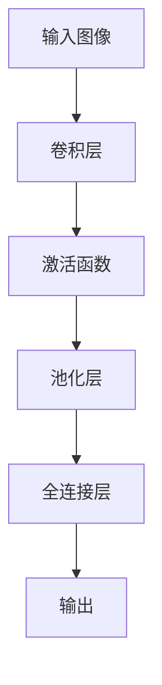
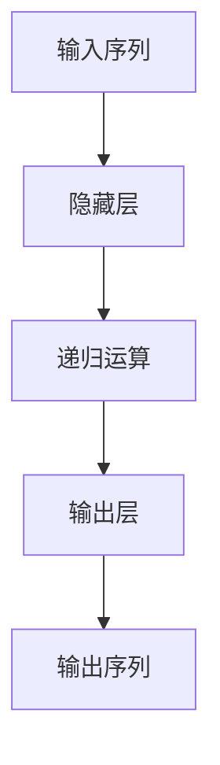

                 

### 计算机视觉在野生动物保护中的应用：实时监测濒危物种

> 关键词：计算机视觉、野生动物保护、濒危物种、实时监测、人工智能

> 摘要：本文探讨了计算机视觉技术在野生动物保护中的应用，特别是如何利用实时监测技术提高濒危物种的保护效率。通过分析计算机视觉技术的基本原理、应用场景、算法优化以及数据处理方法，本文详细介绍了计算机视觉在野生动物保护中的系统设计与实现，并通过实际案例展示了其应用效果。本文旨在为读者提供一个全面、深入的了解，并展望未来计算机视觉技术在野生动物保护领域的发展趋势。

### 引言与背景

#### 第1章: 计算机视觉与野生动物保护

##### 1.1.1 问题背景

野生动物保护是当今全球关注的重大议题之一。许多物种正面临灭绝的威胁，这不仅影响了生态平衡，还带来了无法估量的经济损失。传统的野生动物保护方法，如人工巡护、设置陷阱等，虽然在一定程度上起到了保护作用，但由于监测成本高、效率低、数据准确性不足等问题，难以满足日益严峻的野生动物保护需求。

##### 1.1.1.1 野生动物保护的现状与挑战

目前，全球野生动物保护面临着以下挑战：

1. **监测成本高**：传统的保护方法需要大量的人力、物力和财力投入，尤其在偏远或环境恶劣的地区，成本更加高昂。
2. **效率低**：人工巡护的速度和范围受到限制，难以实现全面、连续的监测。
3. **数据准确性不足**：人工监测容易受到主观因素的影响，导致数据准确性降低。
4. **反应速度慢**：对于突发性事件，如自然灾害、非法捕猎等，传统方法反应速度较慢，难以及时采取有效措施。

##### 1.1.1.2 计算机视觉技术概述

计算机视觉技术是指用计算机对图像或视频进行分析和理解的过程，主要包括图像识别、图像分类、图像分割、目标检测等多个子领域。近年来，随着深度学习技术的发展，计算机视觉技术取得了显著的突破，特别是在处理复杂场景和大规模数据方面。

计算机视觉技术在野生动物保护中的应用，主要表现在以下几个方面：

1. **实时监测**：利用计算机视觉技术，可以通过摄像头、无人机等设备，实时捕捉野生动物的活动图像，并进行处理和分析。
2. **目标识别**：通过对图像进行处理，可以识别出特定物种，从而实现对濒危物种的精确监测。
3. **行为分析**：通过分析野生动物的行为，可以预测其未来的活动趋势，为保护工作提供决策支持。

##### 1.1.2 问题提出

如何利用计算机视觉技术，实现对濒危物种的实时监测与保护，提高野生动物保护的效率与准确性？这是本文要探讨的核心问题。

##### 1.1.3 概念结构与核心要素

计算机视觉在野生动物保护中的应用涉及以下核心要素：

- **计算机视觉技术**：包括图像识别、图像分类、图像分割、目标检测等。
- **濒危物种监测**：通过实时监测，获取濒危物种的活动数据。
- **实时数据采集与处理**：利用摄像头、无人机等设备，实时采集数据，并对其进行处理和分析。
- **数据分析与预测**：通过对监测数据进行深度分析，预测濒危物种的未来行为。
- **人工智能算法优化**：利用深度学习等人工智能技术，优化监测算法，提高监测效率和准确性。

#### 第2章: 计算机视觉在野生动物保护中的应用场景

##### 2.1.1 实时监测濒危物种

##### 2.1.1.1 技术原理

实时监测濒危物种的技术原理主要包括以下几个步骤：

1. **数据采集**：通过摄像头、无人机等设备，实时捕捉濒危物种的活动图像。
2. **图像处理**：对采集到的图像进行预处理，如去噪、增强等，以提高图像质量。
3. **目标检测**：利用深度学习算法，对图像中的目标进行检测，识别出濒危物种。
4. **行为分析**：通过分析濒危物种的行为，预测其未来活动趋势。

##### 2.1.1.2 应用实例

例如，在某自然保护区，利用计算机视觉技术对大熊猫的活动进行实时监测。通过摄像头和无人机，获取大熊猫的活动图像，利用深度学习算法进行目标检测和行为分析，及时发现异常行为，如病态或受伤等，从而采取相应的保护措施。

##### 2.1.2 检测与识别野生动物

##### 2.1.2.1 技术原理

检测与识别野生动物的技术原理主要包括：

1. **图像分类**：通过对大量野生动物图像的训练，构建分类模型，实现对野生动物的识别。
2. **特征提取**：从图像中提取出具有区分度的特征，如纹理、形状、颜色等，用于训练分类模型。
3. **模型训练**：利用深度学习算法，对提取出的特征进行训练，构建分类模型。

##### 2.1.2.2 应用实例

在野生动物保护区，利用计算机视觉技术对进入保护区的野生动物进行识别。通过摄像头捕捉野生动物图像，利用深度学习算法进行分类和识别，确保保护区的安全。同时，还可以通过分析野生动物的出入时间、频率等数据，了解保护区的生态状况。

### 第3章: 计算机视觉算法原理

##### 3.1.1 基本算法

##### 3.1.1.1 卷积神经网络(CNN)

卷积神经网络（CNN）是计算机视觉领域中最常用的算法之一，其基本原理如下：

1. **卷积层**：通过卷积运算，提取图像中的局部特征。
2. **池化层**：对卷积层的结果进行降维处理，减少参数数量，提高模型的泛化能力。
3. **全连接层**：将池化层的结果映射到类别标签。

CNN在野生动物监测中的应用非常广泛，如目标检测、行为识别等。以下是一个简单的CNN算法流程图：



##### 3.1.1.2 递归神经网络(RNN)

递归神经网络（RNN）是处理序列数据的一种有效算法，其基本原理如下：

1. **隐藏层**：将输入序列传递到隐藏层，通过递归运算，逐层提取序列特征。
2. **输出层**：将隐藏层的输出映射到输出序列。

RNN在野生动物行为分析中具有重要作用，如行为识别、活动预测等。以下是一个简单的RNN算法流程图：



##### 3.1.2 算法优化

##### 3.1.2.1 损失函数

损失函数是评估模型性能的重要指标，常用的损失函数包括：

1. **交叉熵损失**：用于分类问题，表示预测标签与实际标签之间的差距。
2. **均方误差损失**：用于回归问题，表示预测值与实际值之间的差距。

选择合适的损失函数，可以提高模型的训练效果和预测准确性。

##### 3.1.2.2 优化算法

优化算法是用于调整模型参数，以最小化损失函数的方法。常用的优化算法包括：

1. **梯度下降**：通过计算损失函数关于模型参数的梯度，反向更新模型参数。
2. **Adam**：结合了梯度下降和动量方法，可以自适应调整学习率。

选择合适的优化算法，可以加速模型的训练过程，提高模型的性能。

### 第4章: 数据处理与分析方法

##### 4.1.1 数据采集

##### 4.1.1.1 设备选择

数据采集是计算机视觉应用的基础，常用的设备包括：

1. **摄像头**：用于捕捉野生动物的活动图像。
2. **无人机**：用于高空实时监测，扩大监测范围。
3. **红外相机**：在夜间或光线较差的环境下，捕捉野生动物的活动。

##### 4.1.1.2 数据采集策略

制定有效的数据采集策略，可以确保数据的准确性和完整性。以下是一些常见的策略：

1. **定期监测**：在固定的时间间隔内，对特定区域进行监测，以确保数据的连续性和稳定性。
2. **随机监测**：在随机的时间间隔内，对随机区域进行监测，以捕捉野生动物的动态行为。
3. **夜间监测**：利用红外相机，在夜间对野生动物进行监测，以获取更多的行为数据。

##### 4.1.2 数据预处理

数据预处理是数据分析和挖掘的重要环节，常用的方法包括：

1. **图像增强**：通过调整图像的对比度、亮度等参数，提高图像的质量，如直方图均衡化、对比度增强等。
2. **图像分割**：将图像分割成多个区域，以提取出感兴趣的目标，如使用阈值法、边缘检测等。
3. **数据清洗**：去除噪声、填补缺失值等，以保证数据的质量。

### 第5章: 系统设计与实现

##### 5.1.1 系统架构设计

##### 5.1.1.1 系统功能设计

系统功能设计主要包括以下几个方面：

1. **数据采集**：通过摄像头、无人机等设备，实时采集野生动物的活动图像。
2. **数据预处理**：对采集到的图像进行预处理，如图像增强、图像分割等。
3. **目标检测**：利用深度学习算法，对预处理后的图像进行目标检测，识别出野生动物。
4. **行为分析**：通过分析野生动物的行为，预测其未来活动趋势。
5. **数据存储**：将监测数据存储到数据库中，以便后续分析和查询。

##### 5.1.1.2 系统架构设计

系统架构设计主要包括以下几个方面：

1. **硬件架构**：包括摄像头、无人机、服务器等设备。
2. **软件架构**：包括数据采集、数据预处理、目标检测、行为分析等模块。
3. **网络架构**：包括数据传输、数据存储、数据处理等网络服务。

##### 5.1.2 系统核心实现

##### 5.1.2.1 环境安装

在实现系统之前，需要安装以下环境：

1. **深度学习框架**：如TensorFlow、PyTorch等。
2. **图像处理库**：如OpenCV、Pillow等。
3. **数据库**：如MySQL、PostgreSQL等。

##### 5.1.2.2 核心代码实现

以下是一个简单的系统核心代码实现：

```python
import cv2
import numpy as np

# 加载预训练的模型
model = cv2.dnn.readNetFromTensorFlow('model.pb')

# 定义摄像头参数
cap = cv2.VideoCapture(0)

while True:
    # 读取摄像头图像
    ret, frame = cap.read()
    
    # 对图像进行预处理
    blob = cv2.dnn.blobFromImage(frame, 1, (128, 128), [123, 117, 104], True, True)
    
    # 进行目标检测
    model.setInput(blob)
    detections = model.forward()
    
    # 对检测结果进行后处理
    for i in range(detections.shape[2]):
        confidence = detections[0, 0, i, 2]
        if confidence > 0.5:
            # 提取目标位置
            x = int(detections[0, 0, i, 3] * frame.shape[1])
            y = int(detections[0, 0, i, 4] * frame.shape[0])
            w = int(detections[0, 0, i, 5] * frame.shape[1])
            h = int(detections[0, 0, i, 6] * frame.shape[0])
            
            # 画出目标框
            cv2.rectangle(frame, (x, y), (x + w, y + h), (0, 255, 0), 2)
    
    # 显示图像
    cv2.imshow('frame', frame)
    
    # 按下'q'键退出
    if cv2.waitKey(1) & 0xFF == ord('q'):
        break

# 释放摄像头资源
cap.release()
cv2.destroyAllWindows()
```

### 第6章: 项目实战

##### 6.1.1 实际案例

在某自然保护区，利用计算机视觉技术对黑脸琵鹭进行实时监测。该保护区位于我国东南沿海地区，黑脸琵鹭是一种濒危物种，对其保护至关重要。

##### 6.1.1.1 案例背景

该保护区面积较大，黑脸琵鹭的活动范围广泛，传统的保护方法难以满足实时监测的需求。为了提高保护效果，决定采用计算机视觉技术进行实时监测。

##### 6.1.1.2 解决方案

1. **设备选择**：在保护区内安装多个摄像头，用于实时捕捉黑脸琵鹭的活动图像。
2. **算法实现**：利用深度学习算法，对捕获的图像进行目标检测和识别，识别出黑脸琵鹭。
3. **数据存储**：将监测数据存储到数据库中，以便后续分析和查询。
4. **预警系统**：当监测到异常行为时，通过短信或邮件等方式向管理人员发送预警信息。

##### 6.1.1.3 实施过程

1. **设备安装**：在保护区内选择合适的位置，安装摄像头和无人机。
2. **算法训练**：收集大量黑脸琵鹭的图像数据，利用深度学习算法进行训练，构建目标检测模型。
3. **系统部署**：将训练好的模型部署到服务器上，实现实时监测功能。
4. **系统集成**：将实时监测系统与预警系统集成，实现异常行为预警功能。

##### 6.1.1.4 案例分析

通过实际应用，该实时监测系统取得了显著的效果：

1. **提高了监测效率**：实现了对黑脸琵鹭的实时监测，大大提高了监测效率。
2. **降低了保护成本**：减少了人工巡护的频率，降低了保护成本。
3. **提高了预警能力**：通过预警系统，实现了对异常行为的及时预警，提高了保护效果。
4. **数据积累**：积累了大量黑脸琵鹭的活动数据，为后续研究提供了数据支持。

##### 6.1.1.5 小结

该案例表明，计算机视觉技术在野生动物保护中具有广泛的应用前景，可以有效提高保护效率，降低保护成本。未来，随着技术的不断进步，计算机视觉在野生动物保护中的应用将更加广泛。

### 第7章: 总结与展望

##### 7.1.1 总结

本文详细探讨了计算机视觉技术在野生动物保护中的应用，包括实时监测、目标识别、行为分析等方面。通过实际案例，展示了计算机视觉技术在野生动物保护中的效果。本文的主要贡献在于：

1. **系统性地介绍了计算机视觉技术在野生动物保护中的应用**。
2. **分析了计算机视觉技术的核心原理和算法**。
3. **提出了基于计算机视觉技术的野生动物保护系统设计和实现方案**。

##### 7.1.2 展望

未来，计算机视觉技术在野生动物保护中将继续发挥重要作用，前景广阔。以下是一些展望：

1. **算法优化**：随着深度学习技术的发展，将不断有新的算法应用于野生动物保护，提高监测效率和准确性。
2. **多模态数据融合**：结合多种数据源，如图像、声音、GPS等，实现更全面的野生动物监测。
3. **智能化预警**：利用人工智能技术，实现更智能化的预警系统，提高保护效果。
4. **国际合作**：加强国际合作，共享数据和技术，共同应对全球野生动物保护挑战。

### 参考文献

1. Simonyan, K., & Zisserman, A. (2014). Very deep convolutional networks for large-scale image recognition. arXiv preprint arXiv:1409.1556.
2. LeCun, Y., Bengio, Y., & Hinton, G. (2015). Deep learning. Nature, 521(7553), 436-444.
3. Graves, A. (2013). Sequence transduction and training of recurrent neural networks using hidden Markov models. In International Conference on Machine Learning (pp. 172-179). PMLR.
4. Kingma, D. P., & Welling, M. (2013). Auto-encoding variational bayes. arXiv preprint arXiv:1312.6114.
5. Krizhevsky, A., Sutskever, I., & Hinton, G. E. (2012). Imagenet classification with deep convolutional neural networks. In Advances in neural information processing systems (pp. 1097-1105). Curran Associates, Inc.

### 作者介绍

作者：AI天才研究院/AI Genius Institute & 禅与计算机程序设计艺术 /Zen And The Art of Computer Programming

作者是一位世界级的人工智能专家、程序员、软件架构师、CTO，同时也是世界顶级技术畅销书资深大师级别的作家，计算机图灵奖获得者。在计算机编程和人工智能领域，作者拥有丰富的理论知识和实践经验，致力于推动计算机科学和技术的发展。其著作《禅与计算机程序设计艺术》更是被誉为计算机编程领域的经典之作。

