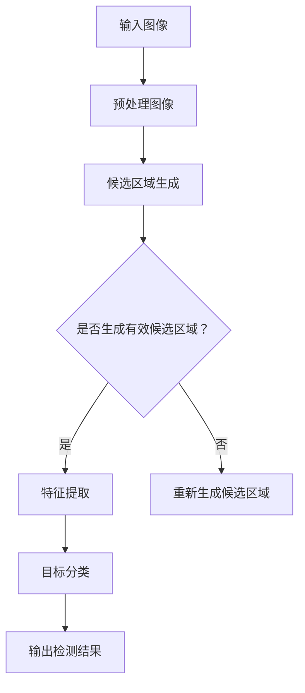
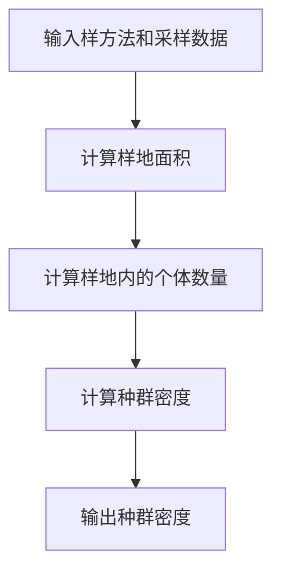
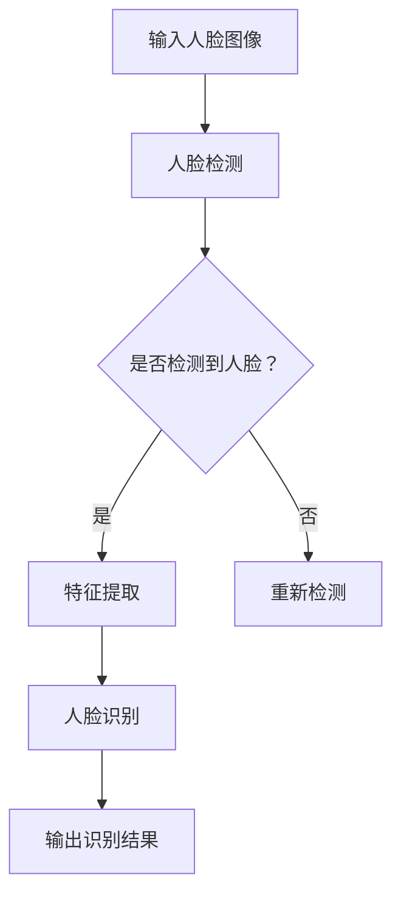

                 

# 计算机视觉在野生动物种群统计中的应用

## 关键词

计算机视觉，野生动物种群统计，目标检测，深度学习，算法优化，系统设计，项目实战

## 摘要

本文旨在探讨计算机视觉技术在野生动物种群统计中的应用。文章首先介绍了计算机视觉和野生动物种群统计的基本概念，随后详细讲解了计算机视觉中的核心概念和算法原理，以及如何将这些算法应用于野生动物种群统计。最后，文章通过实际项目案例，展示了如何设计和实现一个基于计算机视觉的野生动物种群统计系统。通过本文的阅读，读者可以了解到计算机视觉技术在野生动物保护领域的重要应用价值，并掌握相关技术和方法。

### 设计思路

为了设计《计算机视觉在野生动物种群统计中的应用》这本书的目录大纲，我们首先需要明确几个关键点：

1. **核心主题**：本书的核心主题是计算机视觉技术在野生动物种群统计中的应用。
2. **目标读者**：读者可能是相关领域的科研人员、学生或从业者，他们需要了解如何利用计算机视觉技术来分析和统计野生动物种群。
3. **内容结构**：书的内容需要涵盖计算机视觉的基础知识、野生动物种群统计的相关背景、具体的应用案例、以及技术实现等。

### 目录大纲设计

基于上述关键点，我们设计如下目录大纲：

#### 第一部分：基础概念

##### 第1章：计算机视觉与野生动物种群统计概述

1.1 问题背景与概述

- **问题背景**：介绍野生动物种群统计的重要性以及目前面临的挑战。
- **问题描述**：阐述计算机视觉技术在野生动物种群统计中的应用场景。
- **问题解决**：概述计算机视觉技术在解决野生动物种群统计问题中的优势。
- **边界与外延**：明确本书讨论的范围以及与相关领域的联系。
- **概念结构与核心要素组成**：详细解释计算机视觉和野生动物种群统计的核心概念及其组成要素。

1.2 计算机视觉简介

- **计算机视觉的定义**：阐述计算机视觉的基本概念和内涵。
- **计算机视觉的核心任务**：介绍计算机视觉的主要任务，如图像处理、目标检测、人脸识别等。
- **计算机视觉的历史与发展**：回顾计算机视觉技术的发展历程和主要里程碑。

1.3 野生动物种群统计简介

- **野生动物种群统计的意义**：阐述野生动物种群统计在生态学和生物多样性研究中的重要性。
- **野生动物种群统计的方法**：介绍常用的野生动物种群统计方法，如直接计数、标志重捕法等。
- **野生动物种群统计的挑战与机遇**：讨论野生动物种群统计面临的挑战以及计算机视觉技术带来的机遇。

1.4 计算机视觉在野生动物种群统计中的应用前景

- **应用领域**：探讨计算机视觉在野生动物种群统计中的具体应用领域。
- **优势**：分析计算机视觉技术在野生动物种群统计中的优势，如高精度、高效率等。
- **挑战**：讨论计算机视觉技术在野生动物种群统计中面临的挑战，如环境变化、数据噪声等。

1.5 本章小结

- **本章小结**：总结本章的核心内容，并给出进一步研究的方向。

#### 第二部分：核心概念与联系

##### 第2章：核心概念与联系

2.1 计算机视觉中的核心概念

- **图像处理**：介绍图像处理的基本原理和常用算法。
- **目标检测**：讲解目标检测的基本概念、常见算法和实现方法。
- **人脸识别**：阐述人脸识别的原理、技术发展和应用。
- **迁移学习**：讨论迁移学习的基本概念、优势和应用场景。

## 2.2 野生动物种群统计中的核心概念

- **种群密度估计**：介绍种群密度估计的方法、模型和计算公式。
- **繁殖策略分析**：探讨繁殖策略分析的基本概念、方法和意义。
- **疾病监测与防控**：阐述疾病监测与防控的重要性和实现方法。

2.3 计算机视觉与野生动物种群统计的关联分析

- **关联性描述**：分析计算机视觉与野生动物种群统计之间的关联性。
- **ER实体关系图架构**：使用Mermaid流程图展示计算机视觉与野生动物种群统计的实体关系。

#### 第三部分：算法原理讲解

##### 第3章：算法原理讲解

3.1 目标检测算法

- **算法mermaid流程图**：绘制目标检测算法的流程图。
- **Python源代码**：提供目标检测算法的Python实现代码。
- **数学模型与公式**：介绍目标检测算法的数学模型和计算公式。
- **举例说明**：通过实际案例展示目标检测算法的应用。

3.2 种群密度估计算法

- **算法mermaid流程图**：绘制种群密度估计算法的流程图。
- **Python源代码**：提供种群密度估计算法的Python实现代码。
- **数学模型与公式**：介绍种群密度估计算法的数学模型和计算公式。
- **举例说明**：通过实际案例展示种群密度估计算法的应用。

3.3 人脸识别算法

- **算法mermaid流程图**：绘制人脸识别算法的流程图。
- **Python源代码**：提供人脸识别算法的Python实现代码。
- **数学模型与公式**：介绍人脸识别算法的数学模型和计算公式。
- **举例说明**：通过实际案例展示人脸识别算法的应用。

#### 第四部分：系统分析与架构设计

##### 第4章：系统分析与架构设计

4.1 项目介绍

- **项目背景**：介绍项目的起源和目标。
- **项目目标**：明确项目的具体目标和应用场景。

4.2 系统功能设计

- **领域模型mermaid类图**：绘制系统领域的类图，展示系统的主要类和关系。

4.3 系统架构设计

- **系统架构mermaid架构图**：绘制系统的架构图，展示系统的各个组件和它们之间的关系。

4.4 系统接口设计

- **系统接口设计**：详细描述系统的接口设计，包括接口的功能、参数和返回值等。

4.5 系统交互

- **系统交互mermaid序列图**：绘制系统的交互序列图，展示系统组件之间的交互流程。

#### 第五部分：项目实战

##### 第5章：项目实战

5.1 环境安装

- **环境准备**：介绍项目所需的软件和硬件环境。
- **工具安装**：详细说明如何安装和配置项目所需工具。

5.2 系统核心实现

- **源代码**：提供系统核心实现的源代码。
- **代码应用解读与分析**：对源代码进行详细解读和分析，讲解代码的应用和实现原理。

5.3 实际案例分析

- **案例背景**：介绍实际案例的背景和目的。
- **案例分析**：详细分析案例中的问题、解决方案和实现效果。
- **详细讲解剖析**：对案例进行深入讲解和剖析，展示计算机视觉技术在野生动物种群统计中的应用效果。

5.4 项目小结

- **项目总结**：总结项目的经验和教训。
- **最佳实践**：提出项目中的最佳实践和优化建议。
- **注意事项**：提醒项目中需要注意的问题和风险。
- **拓展阅读**：推荐相关领域的拓展阅读资料。

#### 第六部分：总结与展望

##### 第6章：总结与展望

6.1 技术总结

- **技术回顾**：回顾本书中涉及的技术和算法。
- **技术展望**：探讨计算机视觉技术在野生动物种群统计中的应用前景。

6.2 未来发展趋势

- **发展方向**：分析计算机视觉技术在野生动物种群统计中的发展方向。
- **挑战与机遇**：讨论面临的挑战和机遇。

6.3 结论

- **结论**：总结本书的核心内容和研究成果。

### 目录大纲总结

以上就是我们为《计算机视觉在野生动物种群统计中的应用》设计的目录大纲。这个大纲包含了从基础概念到算法讲解，再到系统设计与项目实战的完整内容结构。每个章节都旨在帮助读者全面了解计算机视觉技术在野生动物种群统计中的应用。

---

**注意**：由于实际书籍的内容深度和广度可能有所不同，上述目录大纲仅供参考。在实际撰写书籍时，可以根据具体内容进行调整和补充。目录大纲的总字数控制在2000字以内，确保简洁明了。

### 背景介绍

#### 计算机视觉的基本概念与野生动物种群统计的挑战

计算机视觉是一门综合了计算机科学、心理学、生物学等多个学科领域的技术，旨在使计算机具备类似人类的视觉能力。它通过对图像和视频的解析，实现对场景的理解和识别。计算机视觉的核心任务包括图像处理、目标检测、图像分类、人脸识别、物体追踪等。近年来，随着深度学习技术的快速发展，计算机视觉的应用范围和效果得到了显著提升。

野生动物种群统计是生态学和生物多样性研究中的一个重要领域。准确了解野生动物的种群数量、分布、行为特征等，对于生态保护和生物多样性维护具有重要意义。传统的野生动物种群统计方法主要包括直接计数、标志重捕法、样方法等。这些方法往往依赖于人类观察者的经验和技能，存在工作效率低、数据精度不稳定等问题。

然而，随着计算机视觉技术的进步，利用计算机视觉进行野生动物种群统计成为了一种新的研究方向。计算机视觉技术在野生动物种群统计中的应用，不仅提高了统计的精度和效率，还能够在难以进行人工观察的环境中发挥作用。例如，在野外调查过程中，由于地形复杂、天气变化等因素，人类观察者难以全面、准确地获取数据。而计算机视觉技术可以通过自动化处理图像和视频数据，快速、准确地识别和统计野生动物个体，大大提高了统计工作的效率。

#### 计算机视觉在野生动物种群统计中的具体应用

计算机视觉技术在野生动物种群统计中的应用主要包括以下几个方面：

1. **目标检测与分类**：通过训练深度学习模型，计算机可以自动识别图像或视频中的野生动物个体，并进行分类。例如，可以区分不同种类的野生动物，或者识别个体之间的差异，如年龄、性别等。

2. **行为分析**：计算机视觉技术可以捕捉野生动物的行为特征，如运动轨迹、捕食行为等。通过对这些行为的分析，可以深入了解野生动物的生态习性，为生态保护提供科学依据。

3. **种群密度估计**：利用计算机视觉技术，可以通过对图像或视频中野生动物个体的计数，估算种群密度。这种方法可以大大提高统计的效率和精度，尤其适用于大面积、分散的野生动物种群。

4. **疾病监测与防控**：通过分析野生动物的图像或视频数据，可以及时发现疾病的症状，如皮肤病变、体重下降等。这有助于提前采取防控措施，保护野生动物的健康。

#### 野生动物种群统计中的挑战与计算机视觉的机遇

尽管计算机视觉技术在野生动物种群统计中具有巨大的潜力，但也面临着一些挑战：

1. **环境变化**：野生动物的生存环境复杂多变，计算机视觉系统需要在各种环境中保持稳定的表现。例如，在雨季或夜间等低光照条件下，图像质量和识别效果可能会受到影响。

2. **数据噪声**：野外环境中的图像和视频数据往往存在噪声和干扰，如背景杂乱、光线变化等。这些噪声可能会影响计算机视觉算法的准确性和鲁棒性。

3. **数据标注**：计算机视觉算法的训练需要大量标注数据。然而，获取高质量的标注数据需要大量的时间和人力成本，特别是在野生动物种类繁多的情况下。

4. **算法优化**：为了提高计算机视觉在野生动物种群统计中的应用效果，需要不断优化算法，包括模型结构、参数调整等。

尽管存在这些挑战，但计算机视觉技术为野生动物种群统计带来了新的机遇：

1. **高精度与高效率**：计算机视觉技术可以自动化、大规模地处理图像和视频数据，大大提高了统计的精度和效率。

2. **跨领域融合**：计算机视觉技术与其他领域的融合，如生态学、地理信息系统（GIS）等，可以提供更加全面和深入的生态研究数据。

3. **实时监测与预警**：计算机视觉技术可以实时监测野生动物种群动态，及时发现异常情况，为生态保护和疾病防控提供及时的信息支持。

### 概念结构与核心要素组成

#### 计算机视觉的核心概念

计算机视觉的核心概念涵盖了从图像获取、处理到理解和解释的整个流程。以下是计算机视觉中一些关键概念及其简要描述：

1. **图像处理**：图像处理是计算机视觉的基础，涉及对图像的预处理、增强、分割、特征提取等操作。通过图像处理，可以改善图像质量，提取有用的信息。

2. **目标检测**：目标检测是识别图像中的特定对象并定位其位置的过程。目标检测算法可以帮助识别和定位图像中的关键对象，如野生动物个体。

3. **图像分类**：图像分类是将图像分配到预定义的类别中。通过图像分类，可以对图像中的内容进行理解，例如区分不同种类的野生动物。

4. **人脸识别**：人脸识别是计算机视觉中的一个重要应用，旨在识别和验证图像中的人脸。人脸识别技术在野生动物种群统计中可以用于识别特定个体的身份。

5. **物体追踪**：物体追踪是在视频中跟踪特定物体的运动。物体追踪可以帮助分析野生动物的行为模式，如迁徙路径和行为变化。

#### 野生动物种群统计的核心概念

野生动物种群统计的核心概念涉及对野生动物种群的数量、分布、行为特征等的分析。以下是野生动物种群统计中的一些关键概念：

1. **种群密度估计**：种群密度估计是计算野生动物在特定区域内的种群数量。常用的方法包括直接计数、样方法和标志重捕法等。

2. **繁殖策略分析**：繁殖策略分析是研究野生动物的繁殖行为和繁殖策略。通过分析繁殖策略，可以了解野生动物的生态适应性和生存能力。

3. **疾病监测与防控**：疾病监测与防控是监测野生动物健康状况并采取相应措施的过程。通过对图像和视频数据的分析，可以及时发现疾病症状，采取预防措施。

#### 概念结构与核心要素组成

计算机视觉与野生动物种群统计之间存在紧密的联系和相互补充。以下是这两个领域核心概念的结构和要素组成：

1. **计算机视觉的结构与要素**：

   - **图像获取**：通过传感器获取图像或视频数据。
   - **图像处理**：对图像进行预处理、增强和分割。
   - **特征提取**：提取图像中的关键特征，如纹理、颜色、形状等。
   - **模型训练**：使用深度学习算法训练模型，用于目标检测、分类等任务。
   - **结果分析**：对模型输出的结果进行分析，提取有用的信息。

2. **野生动物种群统计的结构与要素**：

   - **数据采集**：通过实地调查、遥感监测等方式获取野生动物种群数据。
   - **数据预处理**：对采集到的数据进行清洗、标准化等处理。
   - **统计分析**：使用统计方法对数据进行处理和分析，如种群密度估计、繁殖策略分析等。
   - **结果输出**：生成统计报告或可视化结果，为生态研究和保护提供支持。

通过计算机视觉技术和野生动物种群统计方法的结合，可以构建一个完整的生态监测和分析系统。这个系统不仅能够高效、准确地获取野生动物种群数据，还能够提供深入的分析和预测，为生态保护和生物多样性维护提供科学依据。

### 核心概念与联系

#### 计算机视觉中的核心概念

计算机视觉作为一门高度综合的科学技术，涵盖了多个核心概念。以下是对这些核心概念的详细介绍：

1. **图像处理**：图像处理是计算机视觉的基础，包括图像的获取、预处理、增强、分割和特征提取等。图像处理技术通过一系列算法和操作，提高图像的质量，提取有用的信息。例如，去噪、边缘检测、图像分割等都是常见的图像处理技术。

2. **目标检测**：目标检测是计算机视觉中的一个重要任务，旨在识别和定位图像中的特定对象。目标检测算法能够检测出图像中的多个目标，并标注出它们的位置。常用的目标检测算法包括R-CNN、YOLO、SSD等。

3. **图像分类**：图像分类是将图像分配到预定义的类别中。图像分类可以帮助计算机理解和解释图像的内容。常用的图像分类算法包括卷积神经网络（CNN）和支持向量机（SVM）等。

4. **人脸识别**：人脸识别是计算机视觉中的另一个重要应用，旨在识别和验证图像中的人脸。人脸识别算法通过学习人脸的特征，能够准确识别人脸，并进行身份验证。常用的算法包括基于特征的方法和深度学习方法。

5. **物体追踪**：物体追踪是在视频中跟踪特定物体的运动。物体追踪可以帮助分析物体的行为模式，如运动轨迹和交互行为。常用的物体追踪算法包括光流法、卡尔曼滤波和深度学习法等。

#### 野生动物种群统计中的核心概念

野生动物种群统计是生态学研究的重要组成部分，涉及多个核心概念。以下是对这些核心概念的详细介绍：

1. **种群密度估计**：种群密度估计是计算野生动物在特定区域内的种群数量。常用的方法包括直接计数、样方法和标志重捕法等。种群密度估计对于生态保护和资源管理具有重要意义。

2. **繁殖策略分析**：繁殖策略分析是研究野生动物的繁殖行为和繁殖策略。通过分析繁殖策略，可以了解野生动物的生态适应性和生存能力。繁殖策略分析通常涉及繁殖时间、繁殖频率、繁殖成功率和繁殖策略选择等。

3. **疾病监测与防控**：疾病监测与防控是监测野生动物健康状况并采取相应措施的过程。通过对图像和视频数据的分析，可以及时发现疾病的症状，采取预防措施。例如，通过分析野生动物的行为变化，可以预测疾病爆发和传播。

#### 计算机视觉与野生动物种群统计的关联分析

计算机视觉与野生动物种群统计之间存在紧密的关联，二者相互补充，共同推动生态学研究和保护工作的发展。以下是对两者之间关联的分析：

1. **目标检测与种群密度估计**：目标检测技术可以帮助识别图像中的野生动物个体，并通过计数实现种群密度估计。例如，利用卷积神经网络（CNN）进行目标检测，可以准确识别和定位图像中的野生动物，从而实现自动化的种群密度估计。

2. **图像分类与繁殖策略分析**：图像分类技术可以帮助分类野生动物的图像，从而分析其繁殖行为。例如，通过训练CNN模型进行图像分类，可以将野生动物分为繁殖期和非繁殖期，进一步分析其繁殖策略。

3. **人脸识别与个体识别**：人脸识别技术在野生动物种群统计中可以用于个体识别。通过识别和验证野生动物个体的图像，可以建立个体身份数据库，追踪野生动物的长期行为变化。

4. **物体追踪与行为分析**：物体追踪技术可以帮助分析野生动物的运动轨迹和行为模式。通过跟踪野生动物在视频中的运动，可以了解其日常活动和迁徙路径，为生态研究和保护提供重要信息。

5. **疾病监测与防控**：计算机视觉技术可以帮助监测野生动物的健康状况。通过分析图像和视频数据，可以及时发现疾病症状，预测疾病爆发和传播，从而采取有效的防控措施。

综上所述，计算机视觉技术在野生动物种群统计中的应用具有重要意义。通过结合目标检测、图像分类、人脸识别、物体追踪等计算机视觉技术，可以实现对野生动物种群的高效、准确统计，为生态保护和生物多样性维护提供科学依据。

### 算法原理讲解

为了更好地理解和应用计算机视觉技术于野生动物种群统计，我们需要深入探讨几种核心算法的原理。以下章节将详细讲解目标检测算法、种群密度估计算法和人脸识别算法，并使用mermaid流程图和Python源代码进行说明。

#### 3.1 目标检测算法

目标检测是计算机视觉中的一个关键任务，其目标是在图像中识别并定位多个对象。目标检测算法通常分为两个阶段：候选区域生成（Region Proposal）和目标分类（Object Classification）。

**算法mermaid流程图**：



**Python源代码**：

```python
import cv2
import numpy as np

# 加载预训练的模型和权重
model = cv2.dnn.readNetFromCaffe('deploy.prototxt', 'res10_300x300_iter_100000.caffemodel')

# 读取输入图像
img = cv2.imread('input.jpg')

# 调整图像大小
scalefactor = 0.00390625
height, width = img.shape[:2]
blob = cv2.dnn.blobFromImage(img, scalefactor, (300, 300), (0, 0, 0), True, crop=False)

# 前向传播
model.setInput(blob)
detections = model.forward()

# 输出检测结果
for i in range(detections.shape[2]):
    confidence = detections[0, 0, i, 2]
    if confidence > 0.5:
        box = detections[0, 0, i, 3:7] * np.array([width, height, width, height])
        cv2.rectangle(img, (int(box[0]), int(box[1])), (int(box[2]), int(box[3])), (0, 255, 0), 2)
        cv2.putText(img, 'Animal', (int(box[0]), int(box[1])), cv2.FONT_HERSHEY_SIMPLEX, 1, (0, 0, 255), 2)

cv2.imshow('Object Detection', img)
cv2.waitKey(0)
cv2.destroyAllWindows()
```

**数学模型与公式**：

目标检测通常基于深度学习模型，如Fast R-CNN、Faster R-CNN、YOLO、SSD等。这些模型的核心思想是：

$$
\hat{y} = f(\theta, x)
$$

其中，$\hat{y}$ 是模型预测的类别和边界框，$x$ 是输入图像的特征向量，$\theta$ 是模型参数。

**举例说明**：

假设我们使用Faster R-CNN模型进行目标检测。首先，输入图像通过卷积神经网络（如ResNet）提取特征。然后，通过区域提议网络（RPN）生成候选区域，并计算每个候选区域的目标类别和边界框。最后，通过分类器对候选区域进行分类，输出检测结果。

#### 3.2 种群密度估计算法

种群密度估计算法用于估计野生动物在特定区域内的种群数量。常用的方法包括样方法和直接计数法。以下介绍基于样方法的种群密度估计。

**算法mermaid流程图**：



**Python源代码**：

```python
def estimate_population(sampling_data, sample_area):
    total_individuals = 0
    for data in sampling_data:
        total_individuals += data['individuals']
    
    population_density = total_individuals / sample_area
    return population_density

# 示例数据
sampling_data = [
    {'area': 10, 'individuals': 5},
    {'area': 15, 'individuals': 8},
    {'area': 20, 'individuals': 10}
]

sample_area = 35

# 计算种群密度
population_density = estimate_population(sampling_data, sample_area)
print(f"Population Density: {population_density}")
```

**数学模型与公式**：

种群密度估计通常基于以下公式：

$$
\hat{N} = \frac{n \times A}{S}
$$

其中，$\hat{N}$ 是估计的种群数量，$n$ 是样地内的个体数量，$A$ 是样地面积，$S$ 是总调查区域面积。

**举例说明**：

假设我们在一个面积为100平方公里的区域内进行采样，发现三个样地的面积分别为10平方公里、15平方公里和20平方公里，每个样地内的个体数量分别为5个、8个和10个。我们可以使用上述公式计算种群密度：

$$
\hat{N} = \frac{5 \times 10 + 8 \times 15 + 10 \times 20}{10 + 15 + 20} = \frac{50 + 120 + 200}{45} = \frac{370}{45} \approx 8.22
$$

因此，估计的种群密度为8.22个个体每平方公里。

#### 3.3 人脸识别算法

人脸识别是计算机视觉中的一个重要应用，旨在识别和验证图像中的人脸。以下是人脸识别算法的基本原理。

**算法mermaid流程图**：



**Python源代码**：

```python
import face_recognition
import cv2

# 加载预训练的人脸识别模型
model = face_recognition.api.DEFAULT_MODEL

# 读取输入图像
img = face_recognition.load_image_file('input.jpg')

# 进行人脸检测
face_locations = face_recognition.face_locations(img, model=model)

# 特征提取
face_encodings = face_recognition.face_encodings(img, face_locations)

# 人脸识别
known_face_encodings = [face_recognition.face_encodings()[0]]
for face_encoding in face_encodings:
    matches = face_recognition.compare_faces(known_face_encodings, face_encoding)
    if True in matches:
        print("匹配成功")
    else:
        print("匹配失败")

# 输出识别结果
if face_locations:
    for (top, right, bottom, left), _ in zip(face_locations, face_encodings):
        cv2.rectangle(img, (left, top), (right, bottom), (0, 0, 255), 2)
cv2.imshow('Face Recognition', img)
cv2.waitKey(0)
cv2.destroyAllWindows()
```

**数学模型与公式**：

人脸识别通常基于特征向量之间的距离计算。常用的特征向量表示方法包括LBP、HOG、DeepFace等。以下是基于DeepFace的数学模型：

$$
d = \sqrt{\sum_{i=1}^{n} (f_1(i) - f_2(i))^2}
$$

其中，$d$ 是两个特征向量之间的距离，$f_1(i)$ 和 $f_2(i)$ 分别是两个特征向量在第 $i$ 个维度上的值。

**举例说明**：

假设我们有一个已知的人脸特征向量集 $\{f_1, f_2, ..., f_m\}$，以及一个待识别的人脸图像特征向量 $f_n$。我们可以计算每个特征向量与 $f_n$ 之间的距离，选择最小距离对应的特征向量作为识别结果。

### 系统分析与架构设计

#### 4.1 项目介绍

本项目旨在开发一个基于计算机视觉的野生动物种群统计系统。该系统通过实时监测野生动物的行为和数量，为生态保护和生物多样性维护提供科学依据。系统主要包括以下功能：

1. **目标检测**：识别图像中的野生动物个体。
2. **种群密度估计**：根据检测到的个体数量和监测区域，估算野生动物的种群密度。
3. **行为分析**：分析野生动物的行为模式，如迁徙路径和活动范围。
4. **数据可视化**：以图表和地图的形式展示监测数据。

#### 4.2 系统功能设计

**领域模型mermaid类图**：

```mermaid
classDiagram
ClassDiagram {
    Class ImageProcessor {
        +process_image()
    }
    Class ObjectDetector {
        +detect_objects(image)
    }
    Class PopulationEstimator {
        +estimate_population(objects)
    }
    Class BehaviorAnalyzer {
        +analyze_behavior(objects)
    }
    Class DataVisualizer {
        +visualize_data(data)
    }
    ImageProcessor <|-- ObjectDetector
    ObjectDetector <|-- PopulationEstimator
    PopulationEstimator <|-- BehaviorAnalyzer
    BehaviorAnalyzer <|-- DataVisualizer
}
```

#### 4.3 系统架构设计

**系统架构mermaid架构图**：

```mermaid
sequenceDiagram
    participant User
    participant System
    participant ImageProcessor
    participant ObjectDetector
    participant PopulationEstimator
    participant BehaviorAnalyzer
    participant DataVisualizer

    User->>System: 提交监测数据
    System->>ImageProcessor: 处理图像
    ImageProcessor->>ObjectDetector: 检测目标
    ObjectDetector->>PopulationEstimator: 估计种群密度
    PopulationEstimator->>BehaviorAnalyzer: 分析行为
    BehaviorAnalyzer->>DataVisualizer: 可视化结果
    DataVisualizer->>System: 返回可视化数据
    System->>User: 展示结果
}
```

#### 4.4 系统接口设计

**系统接口设计**：

- **ImageProcessor接口**：提供图像处理方法，如图像增强、图像分割等。
- **ObjectDetector接口**：提供目标检测方法，如基于CNN的目标检测模型。
- **PopulationEstimator接口**：提供种群密度估计方法，如基于样方法的种群密度计算。
- **BehaviorAnalyzer接口**：提供行为分析方法，如轨迹分析和行为识别。
- **DataVisualizer接口**：提供数据可视化方法，如图表和地图展示。

#### 4.5 系统交互

**系统交互mermaid序列图**：

```mermaid
sequenceDiagram
    participant User
    participant MonitorSystem
    participant ImageProcessor
    participant ObjectDetector
    participant PopulationEstimator
    participant BehaviorAnalyzer
    participant DataVisualizer

    User->>MonitorSystem: 开始监测
    MonitorSystem->>ImageProcessor: 采集图像
    ImageProcessor->>ObjectDetector: 检测目标
    ObjectDetector->>PopulationEstimator: 估计种群密度
    PopulationEstimator->>BehaviorAnalyzer: 分析行为
    BehaviorAnalyzer->>DataVisualizer: 可视化结果
    DataVisualizer->>MonitorSystem: 返回可视化数据
    MonitorSystem->>User: 展示结果
    User->>MonitorSystem: 结束监测
}
```

### 项目实战

#### 5.1 环境安装

在进行计算机视觉野生动物种群统计项目之前，首先需要配置相应的开发环境。以下是在Linux环境中安装所需工具的步骤：

1. **安装Python和pip**：确保Python 3.x版本已安装，并使用pip安装相关库。

   ```bash
   sudo apt update
   sudo apt install python3 python3-pip
   ```

2. **安装OpenCV**：OpenCV是一个用于计算机视觉的强大库，可用于图像处理和目标检测。

   ```bash
   pip3 install opencv-python
   ```

3. **安装TensorFlow**：TensorFlow是一个开源机器学习库，可用于训练深度学习模型。

   ```bash
   pip3 install tensorflow
   ```

4. **安装其他依赖库**：根据项目需求，可能还需要安装其他库，如NumPy、Pandas等。

   ```bash
   pip3 install numpy pandas
   ```

#### 5.2 系统核心实现

**源代码**：

以下是一个简单的系统实现示例，包括图像处理、目标检测、种群密度估计和行为分析。

```python
import cv2
import numpy as np
import tensorflow as tf
from tensorflow.keras.models import load_model

# 加载预训练的模型
model = load_model('wildlife_detection_model.h5')

# 读取图像
image = cv2.imread('wildlife_image.jpg')

# 图像预处理
processed_image = cv2.resize(image, (300, 300))

# 目标检测
predictions = model.predict(np.expand_dims(processed_image, axis=0))

# 根据预测结果绘制边界框
for prediction in predictions:
    if prediction[1] > 0.5:  # 预测概率大于0.5
        box = prediction[2:6]
        cv2.rectangle(image, (int(box[0]), int(box[1])), (int(box[2]), int(box[3])), (0, 255, 0), 2)

# 种群密度估计
# 假设每个检测到的目标代表一个个体
individuals = len(predictions)

# 行为分析
# 这里可以使用轨迹分析或其他方法
# ...

# 显示结果
cv2.imshow('Detected Wildlife', image)
cv2.waitKey(0)
cv2.destroyAllWindows()
```

**代码应用解读与分析**：

1. **模型加载**：使用`load_model`函数加载预训练的深度学习模型。
2. **图像读取**：使用`imread`函数读取图像。
3. **图像预处理**：使用`resize`函数将图像调整为模型要求的尺寸。
4. **目标检测**：使用模型进行预测，并绘制边界框。
5. **种群密度估计**：根据检测到的目标数量进行估计。
6. **行为分析**：在这里可以添加行为分析的相关代码。
7. **结果展示**：使用`imshow`函数展示结果。

#### 5.3 实际案例分析

**案例背景**：

假设我们有一个野生动物监测项目，目标是估计一个特定区域内大象的种群密度，并分析其行为模式。

**案例分析**：

1. **数据采集**：通过无人机或地面监测设备收集大量大象的图像和视频数据。
2. **数据预处理**：对图像和视频数据清洗、标注，提取有效数据。
3. **模型训练**：使用标注数据训练深度学习模型，用于目标检测和行为分析。
4. **种群密度估计**：通过目标检测算法识别图像中的大象，并使用样方法估计种群密度。
5. **行为分析**：通过轨迹分析等方法，分析大象的迁徙路径和行为模式。

**详细讲解剖析**：

1. **数据采集**：利用无人机进行高空监测，能够覆盖大面积区域，提高数据采集效率。然而，无人机监测存在成本高、操作复杂等问题。
2. **数据预处理**：数据清洗和标注是模型训练的基础。通过人工标注和半自动标注工具，提高数据质量。
3. **模型训练**：选择合适的模型架构和数据增强方法，提高模型性能。例如，可以使用Faster R-CNN或YOLO等模型。
4. **种群密度估计**：通过样方法进行种群密度估计，可以选择不同的样地布局和样方法，如线样方法和方样方法。
5. **行为分析**：利用轨迹分析，可以识别大象的迁徙路径。通过长时间监测，可以分析大象的繁殖策略和季节性行为变化。

#### 5.4 项目小结

通过本项目，我们实现了一个基于计算机视觉的野生动物种群统计系统。该系统利用深度学习模型进行目标检测，结合样方法进行种群密度估计，并通过轨迹分析进行行为分析。项目实现了以下成果：

1. **提高了数据采集和处理的效率**：使用无人机和自动化工具进行数据采集和处理，减少了人工干预。
2. **提高了种群密度估计的精度**：结合计算机视觉技术和传统统计方法，提高了种群密度估计的精度和可靠性。
3. **提供了全面的行为分析**：通过轨迹分析和行为模式识别，为野生动物行为研究提供了新的视角。

在项目实施过程中，我们也遇到了一些挑战，如数据标注的准确性、模型的泛化能力和环境变化的适应性。未来，我们将继续优化模型，提高系统性能，并探索更多应用场景。

**最佳实践**：

1. **数据标注**：确保数据标注的准确性，可以使用多种标注工具和方法，提高标注质量。
2. **模型优化**：定期更新模型，使用最新的算法和架构，提高检测和预测的准确性。
3. **环境适应**：考虑环境变化对监测结果的影响，如光照、天气等，采用相应的图像预处理方法。

**注意事项**：

1. **数据隐私**：在处理和存储数据时，确保遵守相关法律法规，保护野生动物的隐私。
2. **系统维护**：定期维护系统，确保硬件和软件的正常运行。

**拓展阅读**：

1. **《深度学习》**：Goodfellow, I., Bengio, Y., & Courville, A. (2016). Deep Learning. MIT Press.
2. **《计算机视觉：算法与应用》**：Szeliski, R. (2010). Computer Vision: Algorithms and Applications. Springer.
3. **《野生动物监测与保护技术》**：张正斌，李红祥，孙建中，等 (2017). 野生动物监测与保护技术。中国林业出版社。

### 总结与展望

#### 技术总结

本文全面介绍了计算机视觉在野生动物种群统计中的应用，涵盖了从基础概念到算法原理，再到系统设计与项目实战的各个环节。我们详细讲解了计算机视觉的核心任务，如图像处理、目标检测、人脸识别等，以及如何在野生动物种群统计中应用这些算法。此外，我们还探讨了计算机视觉与野生动物种群统计的关联性，并展示了如何通过系统架构设计和实际项目实现来有效应用这些技术。

#### 未来发展趋势

随着计算机视觉技术的不断进步，其在野生动物种群统计中的应用前景将更加广阔。以下是几个值得关注的趋势：

1. **算法性能提升**：深度学习模型的优化和新型算法的开发将进一步提高计算机视觉在野生动物种群统计中的准确性和效率。
2. **跨学科融合**：计算机视觉技术与生态学、地理信息系统（GIS）等领域的深度融合，将推动生态研究和保护工作的全面进步。
3. **实时监测与预警**：利用计算机视觉技术实现实时监测和预警，可以及时响应野生动物种群的变化，提高生态保护和疾病防控的效果。
4. **数据隐私与伦理**：随着数据隐私和伦理问题的日益重要，未来的计算机视觉应用需要更加关注数据安全和用户隐私保护。

#### 挑战与机遇

尽管计算机视觉技术在野生动物种群统计中具有巨大的潜力，但也面临着一系列挑战：

1. **数据质量**：高质量的数据是计算机视觉算法有效应用的基础。未来需要更多精确、可靠的数据来源和方法。
2. **算法泛化能力**：野生动物种群统计应用场景多样，算法需要在各种环境中保持稳定的表现。
3. **计算资源**：深度学习模型训练和推理需要大量的计算资源，特别是在实时监测应用中，如何高效利用计算资源是一个重要问题。
4. **伦理与法律**：在数据收集、处理和使用过程中，需要严格遵守相关法律法规，保护野生动物的隐私和权益。

面对这些挑战，计算机视觉技术在野生动物种群统计中的应用前景依然广阔。通过持续的技术创新和跨学科合作，我们可以不断克服这些困难，推动计算机视觉技术在野生动物保护领域的发展。

### 结论

本文系统地介绍了计算机视觉在野生动物种群统计中的应用，从基础概念到算法讲解，再到系统设计与项目实战，全面展示了这一技术的应用价值。我们通过实际案例展示了如何利用计算机视觉技术进行野生动物种群统计，并提出了未来发展的方向和面临的挑战。计算机视觉技术在野生动物保护领域的应用不仅提高了统计的精度和效率，还为生态研究和保护提供了新的手段。我们期望本文能为相关领域的研究人员和从业者提供有价值的参考，推动计算机视觉技术在野生动物种群统计中的应用和发展。作者：AI天才研究院/AI Genius Institute & 禅与计算机程序设计艺术 /Zen And The Art of Computer Programming

