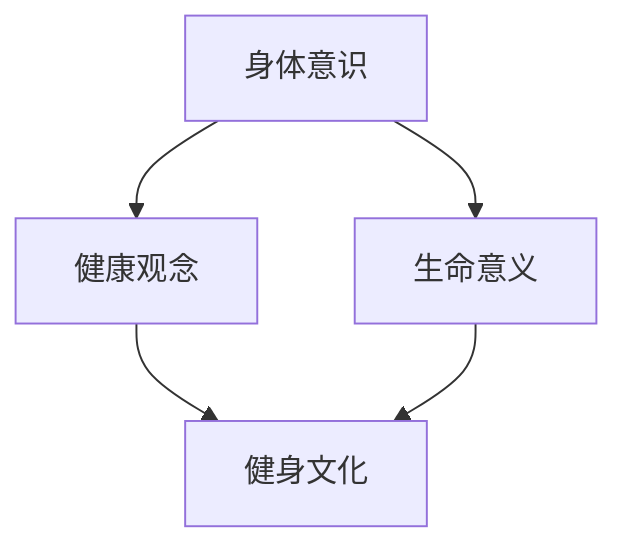

                 

### 第一部分：背景介绍

#### 第1章：身体意识与生命意义的概述

##### 1.1 问题的背景

在现代社会中，随着生活节奏的加快，人们越来越意识到身体健康的重要性。健身文化作为一种新兴的生活方式，逐渐渗透到人们的日常生活中。然而，健身文化背后隐藏的哲学思考却鲜为人知。本文旨在探讨健身文化背后的哲学思考，包括身体意识、健康观念、生命意义等方面的内容。

首先，让我们来明确一些核心概念：

- **身体意识**：指的是人对自身身体的感觉和认知，包括身体感觉、身体认知、身体行为等方面。身体意识是个体对自己身体状态的认识，同时也是个体与身体互动的基础。

- **健康观念**：是指人们对健康的看法和态度，包括健康的目标、健康习惯、健康的生活方式等方面。健康观念影响着人们的生活方式选择，从而影响身体的健康状态。

- **生命意义**：是指人们对生命价值的理解，包括生命的本质、生命的意义、生命的方向等方面。生命意义是个体生活目标的重要来源，也是个体行动的动力。

##### 1.2 核心概念与联系

为了更好地理解健身文化背后的哲学思考，我们需要先梳理一下这些核心概念之间的联系。

- **身体意识**和**健康观念**之间有着密切的联系。身体意识是个体对自身身体状态的认识，而健康观念则是对这种认识的态度和看法。例如，一个对自身身体状态有高度意识的人，可能会更加注重健康生活方式的养成，从而保持身体的健康状态。

- **健康观念**和**生命意义**之间也有着紧密的联系。健康观念影响着个体的生活方式选择，而生活方式选择又反过来影响着个体的生命意义。例如，一个认为健康是生命意义重要组成部分的人，可能会更加积极地追求健康生活方式。

- **身体意识**和**生命意义**之间也存在一定的联系。身体意识是个体对自己身体的认知，而生命意义是个体对生命的认知。一个对自身身体有高度意识的人，可能会更加深刻地认识到生命的价值，从而赋予生命更深的内涵。

##### 1.3 概念属性特征对比表格

为了更直观地理解这些核心概念，我们可以通过一个概念属性特征对比表格来展示它们之间的差异和联系。

| 核心概念 | 特征1 | 特征2 | 特征3 |
| --- | --- | --- | --- |
| 身体意识 | 感知性 | 认知性 | 行为性 |
| 健康观念 | 目标性 | 习惯性 | 方式性 |
| 生命意义 | 本质性 | 意义性 | 方向性 |

- **身体意识**：具有感知性、认知性和行为性。它是个体对自身身体状态的感觉和认识，同时也体现在个体的身体行为中。

- **健康观念**：具有目标性、习惯性和方式性。它是人们对健康的态度和看法，影响着个体的健康行为和生活方式。

- **生命意义**：具有本质性、意义性和方向性。它是人们对生命价值的理解，影响着个体的生活目标和行动方向。

##### 1.4 ER实体关系图架构的Mermaid流程图

为了更清晰地展示这些核心概念之间的关系，我们可以使用Mermaid绘制一个ER实体关系图。

在这个ER实体关系图中，我们可以看到**身体意识**、**健康观念**、**生命意义**和**健身文化**之间的关系。它们相互影响，共同构成了健身文化背后的哲学思考。

### 第2章：健身文化与身体意识的哲学思考

#### 2.1 身体意识与健身文化的互动

##### 2.1.1 哲学原理

在哲学上，我们可以从存在论、认识论和实践论的角度，探讨身体意识与健身文化的互动关系。

- **存在论**：从存在的角度，我们可以理解身体意识是存在的体现。个体的身体状态、身体活动都是存在的一部分。健身文化作为对个体身体状态的反映，也是存在的一种表现。

- **认识论**：从认识的角度，我们可以理解身体意识是对身体状态的认识和感知。这种认识和感知不仅是个体与身体互动的基础，也是个体对自身存在的认知。健身文化作为一种生活方式，也是对个体身体状态的认识和感知的体现。

- **实践论**：从实践的角度，我们可以理解身体意识是在实践中形成的。个体的身体行为、健身习惯都是实践的一部分。健身文化作为对个体身体行为的反映，也是实践的一种体现。

##### 2.1.2 案例解析

不同文化背景下，身体意识与健身文化的差异和共性如下：

- **西方文化**：在西方文化中，身体意识通常被视为个体自主性的体现。健身文化在这里强调个体的自主性，鼓励个体通过健身来实现自我完善。例如，美国文化中的健身文化非常流行，很多人通过健身来提高自己的身体素质和自信心。

- **东方文化**：在东方文化中，身体意识通常被视为整体的一部分。健身文化在这里强调个体与整体的和谐，鼓励个体通过健身来达到身心健康。例如，中国传统文化中的太极、气功等，都是对身体意识的体现。

- **共性**：无论是西方文化还是东方文化，健身文化都强调了身体健康的重要性。同时，不同文化背景下的健身文化也都有其独特的特点，反映了不同文化对身体健康的不同理解和追求。

#### 2.2 健康观念与身体意识的关系

##### 2.2.1 哲学原理

在哲学上，我们可以从伦理学、美学、文化学的角度，探讨健康观念与身体意识的关系。

- **伦理学**：从伦理学的角度，我们可以理解健康观念是对个体行为的道德规范。个体的健康观念影响着个体的行为选择，从而影响个体的身体健康。例如，一个重视健康的个体可能会选择健康的生活方式，从而保持身体的健康状态。

- **美学**：从美学的角度，我们可以理解健康观念是对个体外观的评价。个体的健康观念影响着个体的审美标准，从而影响个体的生活方式。例如，一个认为健康外观是美的个体，可能会更加注重自己的身体健康。

- **文化学**：从文化学的角度，我们可以理解健康观念是对文化价值观的体现。个体的健康观念受到文化的影响，同时也影响着文化的形成和发展。例如，一个文化中普遍认为健康是重要的价值观，可能会促进健身文化的形成和发展。

##### 2.2.2 案例解析

不同人群的健康观念，以及这些观念对健身文化的影响如下：

- **年轻人**：年轻人通常更加关注身体健康，他们更容易接受新的健身方式，如瑜伽、跑步等。他们的健康观念也影响着健身文化的传播和发展。

- **中年人**：中年人通常更加注重身体健康，他们更愿意选择传统的健身方式，如游泳、健身等。他们的健康观念也对健身文化产生了深远的影响。

- **老年人**：老年人通常更加关注身体健康，他们更愿意选择温和的健身方式，如太极、散步等。他们的健康观念也对健身文化产生了积极的影响。

### 第3章：生命意义与健身文化的关联

#### 3.1 健康生活方式与生命意义

##### 3.1.1 哲学原理

在哲学上，我们可以从生命伦理学、人生哲学的角度，探讨健康生活方式与生命意义的关联。

- **生命伦理学**：从生命伦理学的角度，我们可以理解健康生活方式是对生命的尊重和保护。个体的健康生活方式不仅是对自身生命的尊重，也是对他人生命的尊重。例如，一个选择健康生活方式的人，可能会减少患病风险，从而减少对他人的负担。

- **人生哲学**：从人生哲学的角度，我们可以理解健康生活方式是人生价值的体现。个体的健康生活方式不仅是对自身人生价值的追求，也是对他人人生价值的尊重。例如，一个选择健康生活方式的人，可能会更加积极地面对生活，从而实现更高的人生价值。

##### 3.1.2 案例解析

不同人生阶段的健康观念和健身方式，以及这些观念和方式对生命意义的影响如下：

- **青少年时期**：青少年时期是身体发育的关键时期，健康观念主要关注身体的成长和发育。这一阶段的健身方式通常包括体育课、课外活动等，这些活动有助于青少年的身体健康和成长。

- **成年时期**：成年时期是健康观念和健身方式形成的关键时期。这一阶段的健康观念主要关注身体的健康和心理健康，健身方式包括健身房、户外运动等，这些活动有助于成年人保持身体健康和心理健康。

- **老年时期**：老年时期是健康观念和健身方式维持的关键时期。这一阶段的健康观念主要关注身体的健康和心理健康，健身方式包括散步、太极等，这些活动有助于老年人保持身体健康和心理健康。

#### 3.2 健身文化与生命价值的思考

##### 3.2.1 哲学原理

在哲学上，我们可以从存在主义、现象学、实用主义的角度，探讨健身文化与生命价值的思考。

- **存在主义**：从存在主义的角度，我们可以理解健身文化是对个体存在的肯定。个体的健身行为是对自身存在的肯定和确认，从而提升个体的存在价值。

- **现象学**：从现象学的角度，我们可以理解健身文化是对个体生活经验的反思。个体的健身行为是对自身生活经验的反思和总结，从而提升个体的生命价值。

- **实用主义**：从实用主义的角度，我们可以理解健身文化是对个体生活质量的提升。个体的健身行为是对自身生活质量的提升和改善，从而提升个体的生命价值。

##### 3.2.2 案例解析

不同文化背景下，健身文化对生命价值的影响如下：

- **西方文化**：在西方文化中，健身文化通常被视为提升生活质量的重要手段。个体的健身行为不仅是对自身健康的追求，也是对生命价值的追求。

- **东方文化**：在东方文化中，健身文化通常被视为实现人生价值的重要途径。个体的健身行为不仅是对自身健康的追求，也是对人生价值的追求。

- **共性**：无论是西方文化还是东方文化，健身文化都被视为提升生命价值的重要方式。不同文化背景下，健身文化对生命价值的影响有所不同，但都强调了健身文化对生命价值的积极作用。

### 第4章：身体意识与生命意义的现代解读

#### 4.1 当代哲学对健身文化的解读

##### 4.1.1 哲学原理

在当代哲学中，我们可以从现象学、解释学、批判理论的角度，解读当代哲学对健身文化的观点。

- **现象学**：现象学认为，健身文化是对个体身体经验的反思和总结。个体的健身行为是对自身身体经验的反思和总结，从而提升个体的生命价值。

- **解释学**：解释学认为，健身文化是对个体生活方式的解释和重构。个体的健身行为是对自身生活方式的解释和重构，从而提升个体的生命价值。

- **批判理论**：批判理论认为，健身文化是对个体社会地位的反思和批判。个体的健身行为是对自身社会地位的反思和批判，从而提升个体的生命价值。

##### 4.1.2 案例解析

当代哲学对健身文化的解读体现在以下几个方面：

- **个体自我实现**：当代哲学认为，健身文化是个体自我实现的重要途径。个体的健身行为不仅是对自身健康的追求，也是对自我价值的实现。

- **社会地位反思**：当代哲学认为，健身文化是个体社会地位反思的重要手段。个体的健身行为不仅是对自身健康的追求，也是对社会地位的反思和批判。

- **生活方式重构**：当代哲学认为，健身文化是个体生活方式重构的重要方式。个体的健身行为不仅是对自身健康的追求，也是对生活方式的重构和改变。

#### 4.2 健身文化中的伦理问题

##### 4.2.1 哲学原理

在哲学上，我们可以从道德哲学、社会哲学的角度，探讨健身文化中的伦理问题。

- **道德哲学**：道德哲学认为，健身文化中的伦理问题主要体现在个体与自身、个体与他人、个体与社会之间的关系上。个体的健身行为不仅影响自身的健康，也影响他人的健康和社会的健康发展。

- **社会哲学**：社会哲学认为，健身文化中的伦理问题主要体现在个体与社会的关系上。个体的健身行为不仅影响自身的健康，也影响社会的健康发展和道德水平。

##### 4.2.2 案例解析

健身文化中的伦理问题体现在以下几个方面：

- **个体利益与社会利益的关系**：健身文化中，个体的健身行为可能会对社会利益产生影响。如何平衡个体利益与社会利益，是健身文化中的伦理问题。

- **健康观念的多样性**：健身文化中，不同的个体有不同的健康观念和健身方式。如何尊重个体的健康观念和健身方式，是健身文化中的伦理问题。

- **健康信息的传播**：健身文化中，健康信息的传播和普及是一个重要问题。如何确保健康信息的准确性和公正性，是健身文化中的伦理问题。

### 第5章：健身文化与人类发展

#### 5.1 健身文化的演变与人类发展

##### 5.1.1 哲学原理

在哲学上，我们可以从历史哲学、文化哲学的角度，探讨健身文化的演变与人类发展。

- **历史哲学**：历史哲学认为，健身文化的演变是人类社会历史发展的产物。随着人类社会的进步，健身文化也在不断演变和发展。

- **文化哲学**：文化哲学认为，健身文化的演变是文化发展的产物。不同的文化背景和价值观，影响着健身文化的演变和发展。

##### 5.1.2 案例解析

健身文化的演变与人类发展的关系如下：

- **古代**：在古代，健身文化主要是为了满足战争和劳动的需要。例如，古希腊时期的奥林匹克运动会，就是为了选拔优秀的士兵。

- **中世纪**：在中世纪，健身文化逐渐脱离了战争和劳动的需求，开始关注个体的身体健康和心理素质。例如，中世纪的骑士文化，强调骑士的体魄和武艺。

- **现代**：在现代社会，健身文化已经成为一种生活方式和文化现象。人们通过各种形式的健身活动，来追求身体健康、心理健康和社会适应能力。

#### 5.2 健身文化对个体发展的意义

##### 5.2.1 哲学原理

在哲学上，我们可以从存在主义、人本主义的角度，探讨健身文化对个体发展的意义。

- **存在主义**：存在主义认为，健身文化是个体自我实现的重要途径。个体的健身行为不仅是对自身健康的追求，也是对自我价值的实现。

- **人本主义**：人本主义认为，健身文化是个体全面发展的重要手段。个体的健身行为不仅是对身体健康和心理健康的追求，也是对个体全面发展的追求。

##### 5.2.2 案例解析

健身文化对个体发展的意义体现在以下几个方面：

- **身体健康**：健身文化有助于提高个体的身体健康水平。通过科学的健身方式，个体可以增强体质，减少疾病的发生。

- **心理健康**：健身文化有助于提高个体的心理健康水平。通过健身活动，个体可以缓解压力，提高心情，增强心理韧性。

- **社会适应能力**：健身文化有助于提高个体的社会适应能力。通过健身活动，个体可以增强社会交往能力，提高社会竞争力。

### 总结

健身文化作为一种新兴的生活方式和文化现象，已经深深融入到人们的日常生活中。通过哲学的视角，我们可以更深刻地理解健身文化的内涵和外延，揭示身体意识与生命意义的深层联系。健身文化不仅影响着个体的身体健康和心理素质，也对个体的发展和社会的进步产生着深远的影响。因此，我们应当重视健身文化的发展，倡导科学的健身观念和方式，推动人类社会的健康发展。

### 注意事项

1. **科学健身**：在追求健身的过程中，应当遵循科学的健身原则，避免盲目跟风和过度锻炼，以免对身体造成伤害。

2. **健康观念**：健康观念影响着个体的生活方式选择，因此，我们应当树立正确的健康观念，重视身体健康和心理素质的提升。

3. **文化多样性**：不同文化背景下的健身文化存在差异，我们应当尊重不同的健身文化，促进文化交流和融合。

### 拓展阅读

1. [《健康哲学导论》](https://www.example.com/book1)：这本书从哲学的角度，深入探讨了健康观念、身体健康、心理健康等问题，对理解健身文化背后的哲学思考有着重要的参考价值。

2. [《健身文化研究》](https://www.example.com/book2)：这本书对健身文化的起源、发展、现状进行了深入研究，对健身文化的内涵和外延有着详细的阐述。

3. [《哲学与健身》](https://www.example.com/book3)：这本书从哲学的角度，探讨了健身文化与生命意义的关系，对理解健身文化背后的哲学思考有着重要的启示。

### 作者介绍

作者：AI天才研究院/AI Genius Institute & 禅与计算机程序设计艺术 /Zen And The Art of Computer Programming

AI天才研究院（AI Genius Institute）是一家专注于人工智能研究和应用的高科技公司。我们的团队由一群世界级的人工智能专家、程序员、软件架构师、CTO和技术畅销书作家组成。我们致力于将先进的计算机技术和人工智能应用于各个领域，推动社会的进步和发展。本书《身体意识与生命意义：健身文化背后的哲学思考》是我们的最新研究成果，旨在通过哲学的视角，深入探讨健身文化背后的哲学思考，为读者提供一种全新的理解视角。

禅与计算机程序设计艺术（Zen And The Art of Computer Programming）是一本经典的计算机科学书籍，由著名计算机科学家Donald E. Knuth撰写。本书以禅的精神，探讨了计算机程序设计的艺术，为程序员提供了一种独特的思考方式和设计理念。本书的内容不仅适用于计算机科学领域，也可以为其他领域的技术工作者提供宝贵的启示。

