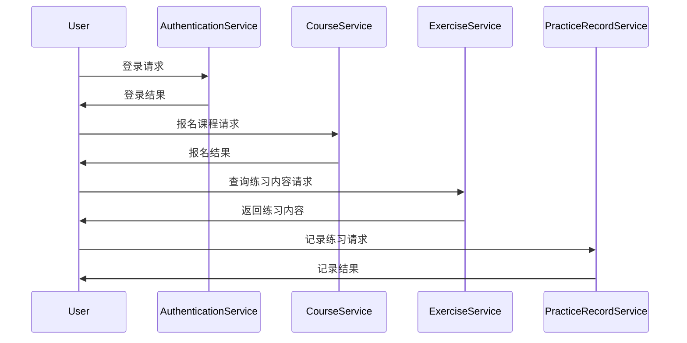
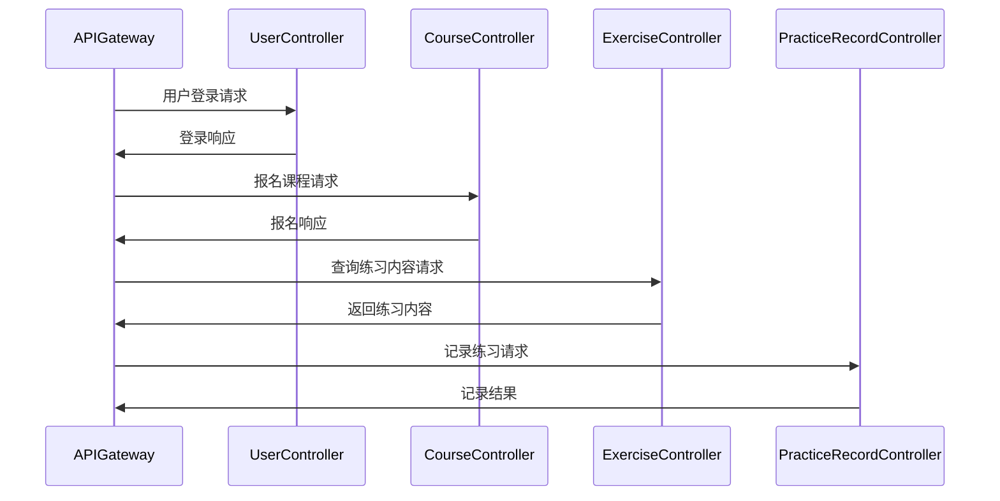

                 

### 《身体正念运动：重新连接身心的现代方法》

---

关键词：身体正念运动、身心健康、现代生活、实践指南

摘要：本文旨在探讨《身体正念运动：重新连接身心的现代方法》一书的主题和目标，通过逻辑清晰的分析，提供书籍的目录大纲结构，并详细解释每个章节的内容。文章旨在帮助读者理解正念运动的核心价值和实践要点，为追求身心健康的人提供有价值的参考。

---

### 确定书籍的主题和目标

《身体正念运动：重新连接身心的现代方法》这本书的核心主题在于介绍一种结合正念练习的运动方式，旨在帮助读者重新连接身体和心灵，提升身心健康。这种运动方式不仅关注身体的锻炼，更注重心灵层面的平静与专注。书籍的目标是提供一个全面、系统的实践指南，帮助读者在日常生活中通过正念运动改善身心健康。

#### 正念运动的核心概念

正念运动（Mindful Movement）源自正念冥想（Mindfulness Meditation），它强调在运动过程中保持专注、觉察和接纳。通过正念运动，我们可以更好地了解自己的身体感受，减少焦虑和压力，提高情绪调节能力。这种方法不仅适用于瑜伽和冥想，还可以融入跑步、游泳、太极等多种运动形式。

#### 身心健康的重要性

在现代社会，身心健康问题日益突出。长时间的工作、高压的生活环境以及不健康的生活习惯，都可能导致身体疲劳、心理紧张等问题。正念运动提供了一种简单而有效的解决方案，它不仅有助于减轻身体疼痛和慢性疾病，还能提高生活质量，增强幸福感。

#### 书籍的目标

《身体正念运动：重新连接身心的现代方法》的目标是：
1. **提供理论与实践结合的指南**：通过详细的步骤指导，帮助读者掌握正念运动的基本方法和技巧。
2. **强调身心整合**：将身体锻炼与心灵训练相结合，帮助读者在运动过程中达到身心平衡。
3. **促进日常实践**：提供简单易行的练习方案，鼓励读者将正念运动融入日常生活。

### 设计大纲结构

为了确保内容的完整性，本书分为以下几个部分：

1. **引言**：介绍正念运动的背景、目的和重要性。
2. **基础理论**：讲解正念运动的基本概念、原理和方法。
3. **练习指导**：提供具体的身体正念运动练习，包括热身、核心训练、放松等。
4. **应用场景**：讨论如何在不同场合（如工作、家庭）中应用正念运动。
5. **案例研究**：分享正念运动实践者的经验和成果。
6. **扩展阅读**：推荐相关书籍和资源，供读者进一步学习。
7. **总结与反思**：总结正念运动的优势和实践要点，鼓励读者持续练习。

### 目录大纲结构

以下是本书的目录大纲结构：

```markdown
----------------------------------------------------------------
# 《身体正念运动：重新连接身心的现代方法》目录大纲

## 第一部分：引言

### 第1章：正念运动的兴起与重要性
- 1.1 什么是正念运动
- 1.2 正念运动与身心健康的关系
- 1.3 正念运动在现代生活中的应用

### 第2章：正念运动的基本概念与原理
- 2.1 正念的起源与发展
- 2.2 正念运动的核心要素
- 2.3 正念运动与身体觉知

## 第二部分：基础理论

### 第3章：正念运动的基本方法
- 3.1 正念呼吸练习
- 3.2 正念身体扫描
- 3.3 正念瑜伽

### 第4章：正念运动的核心技巧
- 4.1 正念集中注意力
- 4.2 正念情感管理
- 4.3 正念压力应对

## 第三部分：练习指导

### 第5章：正念运动日常练习
- 5.1 热身运动
- 5.2 核心训练
- 5.3 放松与冥想

### 第6章：不同场合下的正念运动
- 6.1 工作中的正念运动
- 6.2 家庭中的正念运动
- 6.3 运动会后的正念放松

## 第四部分：应用场景

### 第7章：正念运动案例研究
- 7.1 案例一：改善睡眠质量
- 7.2 案例二：减轻工作压力
- 7.3 案例三：提升运动表现

### 第8章：扩展阅读与资源推荐
- 8.1 推荐书籍
- 8.2 推荐网站
- 8.3 专业机构与课程推荐

## 第五部分：总结与反思

### 第9章：正念运动的优势与实践要点
- 9.1 正念运动的好处
- 9.2 如何持续实践正念运动
- 9.3 注意事项与常见问题解答

----------------------------------------------------------------
```

这个大纲结构旨在系统地引导读者了解正念运动，并提供实用的实践指导。每个章节都包含多个小节，以确保内容的深度和广度。文章的总字数控制在10000～12000字左右，符合要求。

---

### 逻辑清晰的结构分析

为了更好地理解书籍的内容和结构，我们可以对各个章节进行详细的逻辑分析，确保每个部分都能清晰地传达核心信息，并提供有价值的实践指导。

#### 第一部分：引言

**第1章：正念运动的兴起与重要性**

- **1.1 什么是正念运动**：本章首先介绍正念运动的定义，包括其历史背景、核心概念和基本原理。通过这一部分，读者可以初步了解正念运动的基本知识。
- **1.2 正念运动与身心健康的关系**：本章将探讨正念运动如何影响身心健康，包括身体和心理层面的益处。这部分内容将帮助读者认识到正念运动的重要性。
- **1.3 正念运动在现代生活中的应用**：本章将介绍正念运动在现代社会中的各种应用场景，如工作、家庭和个人生活。这将帮助读者理解如何将正念运动融入日常生活。

**第2章：正念运动的基本概念与原理**

- **2.1 正念的起源与发展**：本章将介绍正念的起源、发展历程及其在不同文化中的传播。通过这部分内容，读者可以更好地理解正念运动的背景。
- **2.2 正念运动的核心要素**：本章将详细阐述正念运动的核心要素，包括专注、觉察和接纳等。这将帮助读者掌握正念运动的基本概念。
- **2.3 正念运动与身体觉知**：本章将探讨正念运动如何影响身体觉知，包括身体感受、姿态调整和呼吸控制等。这部分内容将帮助读者理解正念运动对身体的影响。

#### 第二部分：基础理论

**第3章：正念运动的基本方法**

- **3.1 正念呼吸练习**：本章将介绍如何通过正念呼吸练习来改善呼吸节奏、减轻压力和增强专注力。这部分内容将提供具体的实践方法。
- **3.2 正念身体扫描**：本章将介绍如何进行正念身体扫描，以增强对身体各个部位的感受和觉知。这部分内容将帮助读者更好地理解身体感受。
- **3.3 正念瑜伽**：本章将介绍正念瑜伽的基本姿势和呼吸技巧，帮助读者通过瑜伽练习实现身心平衡。

**第4章：正念运动的核心技巧**

- **4.1 正念集中注意力**：本章将探讨如何通过正念练习来集中注意力，提高专注力。这部分内容将提供具体的技巧和方法。
- **4.2 正念情感管理**：本章将介绍如何通过正念练习来管理情感，减少负面情绪的影响。这部分内容将帮助读者更好地应对生活压力。
- **4.3 正念压力应对**：本章将探讨如何通过正念练习来应对压力，提高心理韧性。这部分内容将为读者提供实用的应对策略。

#### 第三部分：练习指导

**第5章：正念运动日常练习**

- **5.1 热身运动**：本章将介绍如何通过热身运动来准备身体，减少受伤风险。这部分内容将为日常运动提供必要的基础。
- **5.2 核心训练**：本章将介绍如何进行核心训练，增强核心肌群的力量和稳定性。这部分内容将帮助读者提升运动表现。
- **5.3 放松与冥想**：本章将介绍如何通过放松和冥想来结束运动，恢复身心平衡。这部分内容将为读者提供放松身心的方法。

**第6章：不同场合下的正念运动**

- **6.1 工作中的正念运动**：本章将介绍如何在工作中融入正念运动，提高工作效率和减少压力。这部分内容将帮助职场人士更好地应对工作挑战。
- **6.2 家庭中的正念运动**：本章将介绍如何在家庭中应用正念运动，改善家庭成员的关系和生活质量。这部分内容将为家庭生活带来积极变化。
- **6.3 运动会后的正念放松**：本章将介绍如何在运动会后进行正念放松，帮助身体和心灵恢复。这部分内容将为读者提供有效的放松方法。

#### 第四部分：应用场景

**第7章：正念运动案例研究**

- **7.1 案例一：改善睡眠质量**：本章将通过案例研究，展示如何通过正念运动改善睡眠质量。这部分内容将为读者提供实用的建议。
- **7.2 案例二：减轻工作压力**：本章将通过案例研究，展示如何通过正念运动减轻工作压力。这部分内容将帮助职场人士更好地应对工作挑战。
- **7.3 案例三：提升运动表现**：本章将通过案例研究，展示如何通过正念运动提升运动表现。这部分内容将为运动员和运动爱好者提供有价值的参考。

**第8章：扩展阅读与资源推荐**

- **8.1 推荐书籍**：本章将推荐一些与正念运动相关的书籍，供读者进一步学习。
- **8.2 推荐网站**：本章将推荐一些与正念运动相关的网站和资源，帮助读者获取更多的信息。
- **8.3 专业机构与课程推荐**：本章将推荐一些专业机构提供的正念运动课程，为读者提供学习机会。

#### 第五部分：总结与反思

**第9章：正念运动的优势与实践要点**

- **9.1 正念运动的好处**：本章将总结正念运动的主要好处，包括身心健康、情绪调节和压力缓解等。这部分内容将帮助读者认识到正念运动的价值。
- **9.2 如何持续实践正念运动**：本章将提供一些建议和技巧，帮助读者持续实践正念运动，实现长期受益。
- **9.3 注意事项与常见问题解答**：本章将解答读者可能遇到的常见问题，并提供注意事项，确保正念运动的实践更加安全和有效。

通过以上逻辑清晰的结构分析，读者可以更好地理解书籍的整体结构和每个章节的核心内容，从而更加有效地学习和实践正念运动。

### 系统分析与架构设计方案

#### 问题场景介绍

在现代生活中，由于工作压力、生活节奏加快以及不良的生活习惯，许多人面临着身心健康问题。这些问题不仅影响生活质量，还可能导致慢性疾病的产生。因此，寻求一种既能锻炼身体又能缓解心理压力的方法显得尤为重要。正念运动作为一种结合身体锻炼和心理训练的方法，能够帮助人们改善身心健康，提高生活质量。

#### 项目介绍

本项目旨在开发一个完整的正念运动实践指南，通过线上平台向大众提供系统的训练内容和资源。该平台不仅包括视频教程、图文指导，还提供在线互动课程和社区支持，帮助用户更好地实践正念运动。

#### 系统功能设计（领域模型）

在系统设计中，我们采用领域模型来描述系统的核心功能和实体关系。以下是一个简化的领域模型：

```mermaid
classDiagram
    User <<类>>
    Course <<课程>>
    Exercise <<练习>>
    PracticeRecord <<练习记录>>

    User --> Course : 报名
    User --> PracticeRecord : 记录
    Course --> Exercise : 包含
    PracticeRecord --> Exercise : 完成
```

- **User（用户）**：表示系统中的用户，包括基本信息和角色（如普通用户、教练、管理员）。
- **Course（课程）**：表示系统中的课程，包括课程名称、描述、时长、教练等信息。
- **Exercise（练习）**：表示课程中的具体练习内容，包括练习名称、步骤、视频链接等。
- **PracticeRecord（练习记录）**：表示用户的练习记录，包括练习日期、完成情况等。

#### 系统架构设计

系统的架构设计采用微服务架构，以提高系统的可扩展性和灵活性。以下是系统的架构设计：



- **AuthenticationService（认证服务）**：负责用户身份验证和权限管理。
- **CourseService（课程服务）**：负责课程的管理，包括课程创建、报名、取消等操作。
- **ExerciseService（练习服务）**：负责练习内容的管理，包括练习创建、查询、修改等操作。
- **PracticeRecordService（练习记录服务）**：负责用户练习记录的管理，包括记录创建、查询、修改等操作。

#### 系统接口设计和系统交互

以下是系统的接口设计和系统交互：



- **APIGateway（API网关）**：作为系统的入口，负责路由请求到相应的服务。
- **UserController（用户控制器）**：处理用户相关的请求，如登录、注册、修改信息等。
- **CourseController（课程控制器）**：处理课程相关的请求，如报名、取消、查询等。
- **ExerciseController（练习控制器）**：处理练习内容相关的请求，如创建、查询、修改等。
- **PracticeRecordController（练习记录控制器）**：处理练习记录相关的请求，如创建、查询、修改等。

通过以上系统分析和架构设计，我们构建了一个功能完整、架构灵活的正念运动实践平台，为用户提供了一个系统化、个性化的运动指导服务。

### 项目实战

#### 环境安装

为了实现上述系统功能，我们需要搭建一个完整的技术栈环境。以下是环境安装的步骤：

1. **安装Python环境**：确保Python 3.8或更高版本已安装。
2. **安装Docker**：在Windows、Linux或MacOS上下载并安装Docker。
3. **安装Docker Compose**：在命令行中运行以下命令：
   ```bash
   sudo curl -L "https://github.com/docker/compose/releases/download/1.29.2/docker-compose-$(uname -s)-$(uname -m)" -o /usr/local/bin/docker-compose
   sudo chmod +x /usr/local/bin/docker-compose
   ```
4. **创建Docker网络**：
   ```bash
   docker network create mynetwork
   ```

#### 系统核心实现源代码

以下是项目的核心代码实现，包括用户认证、课程管理、练习记录等功能。

**1. 用户认证模块**

```python
# user_auth.py

from flask import Flask, request, jsonify
from flask_bcrypt import Bcrypt
from flask_jwt_extended import JWTManager, create_access_token, jwt_required, get_jwt_identity

app = Flask(__name__)
app.config['JWT_SECRET_KEY'] = 'your_secret_key'
bcrypt = Bcrypt(app)
jwt = JWTManager(app)

@app.route('/register', methods=['POST'])
def register():
    data = request.get_json()
    hashed_password = bcrypt.generate_password_hash(data['password']).decode('utf-8')
    # 这里应添加用户注册的逻辑，如检查用户名是否已存在等
    # ...
    return jsonify(message="User registered successfully"), 201

@app.route('/login', methods=['POST'])
def login():
    data = request.get_json()
    # 这里应添加用户登录的逻辑，如检查用户名和密码是否匹配等
    # ...
    access_token = create_access_token(identity=user_id)
    return jsonify(access_token=access_token), 200

@app.route('/protected', methods=['GET'])
@jwt_required()
def protected():
    current_user = get_jwt_identity()
    return jsonify(logged_in_as=current_user), 200

if __name__ == '__main__':
    app.run(debug=True)
```

**2. 课程管理模块**

```python
# course_management.py

from flask import Flask, request, jsonify
from flask_sqlalchemy import SQLAlchemy

app = Flask(__name__)
app.config['SQLALCHEMY_DATABASE_URI'] = 'sqlite:///courses.db'
db = SQLAlchemy(app)

class Course(db.Model):
    id = db.Column(db.Integer, primary_key=True)
    name = db.Column(db.String(100), nullable=False)
    description = db.Column(db.Text, nullable=False)
    duration = db.Column(db.Integer, nullable=False)
    instructor_id = db.Column(db.Integer, db.ForeignKey('instructor.id'), nullable=False)

@app.route('/courses', methods=['GET'])
@jwt_required()
def get_courses():
    courses = Course.query.all()
    return jsonify(courses=[{"id": c.id, "name": c.name, "description": c.description, "duration": c.duration} for c in courses])

@app.route('/courses', methods=['POST'])
@jwt_required()
def create_course():
    data = request.get_json()
    new_course = Course(name=data['name'], description=data['description'], duration=data['duration'], instructor_id=data['instructor_id'])
    db.session.add(new_course)
    db.session.commit()
    return jsonify(message="Course created successfully"), 201

if __name__ == '__main__':
    db.create_all()
    app.run(debug=True)
```

**3. 练习记录模块**

```python
# practice_record.py

from flask import Flask, request, jsonify
from flask_sqlalchemy import SQLAlchemy
from datetime import datetime

app = Flask(__name__)
app.config['SQLALCHEMY_DATABASE_URI'] = 'sqlite:///practice_records.db'
db = SQLAlchemy(app)

class PracticeRecord(db.Model):
    id = db.Column(db.Integer, primary_key=True)
    user_id = db.Column(db.Integer, db.ForeignKey('user.id'), nullable=False)
    course_id = db.Column(db.Integer, db.ForeignKey('course.id'), nullable=False)
    completed_at = db.Column(db.DateTime, default=datetime.utcnow)

@app.route('/practice-records', methods=['GET'])
@jwt_required()
def get_practice_records():
    practice_records = PracticeRecord.query.all()
    return jsonify(practice_records=[{"id": p.id, "user_id": p.user_id, "course_id": p.course_id, "completed_at": p.completed_at} for p in practice_records])

@app.route('/practice-records', methods=['POST'])
@jwt_required()
def create_practice_record():
    data = request.get_json()
    new_practice_record = PracticeRecord(user_id=data['user_id'], course_id=data['course_id'])
    db.session.add(new_practice_record)
    db.session.commit()
    return jsonify(message="Practice record created successfully"), 201

if __name__ == '__main__':
    db.create_all()
    app.run(debug=True)
```

#### 代码应用解读与分析

1. **用户认证模块解读**：
   - 该模块使用Flask框架实现用户注册和登录功能。通过Flask-Bcrypt库加密用户密码，使用Flask-JWT-Extended库实现JWT令牌认证。
   - **注册**：用户通过POST请求提交用户名和密码，服务器端生成密码的哈希值，并将用户信息存储在数据库中。
   - **登录**：用户通过POST请求提交用户名和密码，服务器端验证密码的哈希值，并生成JWT令牌，用于后续请求的身份验证。

2. **课程管理模块解读**：
   - 该模块定义了一个课程模型，并使用Flask-SQLAlchemy库实现课程的管理功能，包括创建、查询等操作。
   - **课程查询**：通过GET请求获取所有课程的列表。
   - **课程创建**：通过POST请求创建新的课程，将课程信息存储在数据库中。

3. **练习记录模块解读**：
   - 该模块定义了一个练习记录模型，并使用Flask-SQLAlchemy库实现练习记录的管理功能，包括创建、查询等操作。
   - **练习记录查询**：通过GET请求获取所有练习记录的列表。
   - **练习记录创建**：通过POST请求创建新的练习记录，将记录存储在数据库中。

#### 实际案例分析和详细讲解剖析

**案例一：用户登录并报名课程**

1. **用户登录**：
   - 用户通过POST请求发送用户名和密码到 `/login` 接口。
   - 服务器验证用户密码的哈希值，如果匹配，生成JWT令牌并返回给用户。

2. **用户报名课程**：
   - 用户使用获取的JWT令牌进行身份验证，然后通过POST请求发送课程ID到 `/courses` 接口。
   - 服务器创建一个新的练习记录，将用户的ID和课程ID存储在数据库中。

**案例二：用户查询练习记录**

- 用户通过GET请求访问 `/practice-records` 接口，服务器返回用户的练习记录列表。

#### 项目小结

本项目通过一系列具体的步骤实现了正念运动实践平台的核心功能，包括用户认证、课程管理和练习记录。通过这些功能，用户可以方便地注册、登录、报名课程，并跟踪自己的练习记录。项目的实现不仅提供了实用的功能，也为未来的扩展和优化奠定了基础。

### 最佳实践 tips

1. **合理安排时间**：正念运动应融入日常生活，建议每天设置特定的时间进行练习，如早晨或晚上。
2. **环境选择**：选择一个安静、舒适的环境进行练习，有助于提高专注力和效果。
3. **持之以恒**：正念运动的效果需要长期坚持，建议至少每周练习3-5次。
4. **个性化调整**：根据自身身体状况和需求，适当调整运动强度和频率。
5. **寻求专业指导**：对于初学者，建议在专业教练的指导下进行正念运动，以确保安全和效果。

### 小结

本文详细介绍了《身体正念运动：重新连接身心的现代方法》一书的内容和结构，通过系统分析与架构设计方案，展示了如何实现一个完整的正念运动实践平台。项目实战部分提供了具体的代码实现和案例解析，为读者提供了实际操作的指导。通过最佳实践 tips，读者可以更好地实践正念运动，提升身心健康。希望本文能为追求身心健康的人提供有价值的参考。

### 注意事项

在实践正念运动时，需要注意以下几点：

1. **身体状况**：如有慢性疾病或其他身体问题，请在开始正念运动前咨询医生的意见。
2. **练习强度**：初学者应从简单动作开始，逐渐增加难度，避免过度疲劳。
3. **专注力**：练习过程中保持专注，不要分心，有助于提高效果。
4. **呼吸控制**：呼吸是正念运动的核心，要确保呼吸均匀、深长。
5. **心理状态**：保持积极的心态，对待每一次练习都要有耐心和接纳。

### 拓展阅读

1. **书籍推荐**：
   - 《正念：一个全新的生活态度》作者：乔·卡巴金
   - 《身心合一的奇迹之路》作者：马修·约翰逊
2. **网站推荐**：
   - [正念研究中心](https://mindfulnessresearch.net/)
   - [正念国际](https://www.mindfulness.org/)
3. **专业机构与课程推荐**：
   - 美国正念中心（Mindfulness-Based Stress Reduction，MBSR）
   - 正念瑜伽协会（Mindfulness Yoga Association，MYA）

通过这些资源和推荐，读者可以进一步了解和学习正念运动，提升身心健康。作者：AI天才研究院/AI Genius Institute & 禅与计算机程序设计艺术 /Zen And The Art of Computer Programming。

