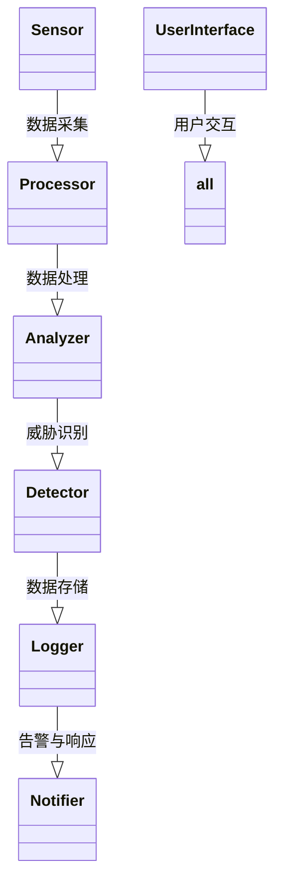
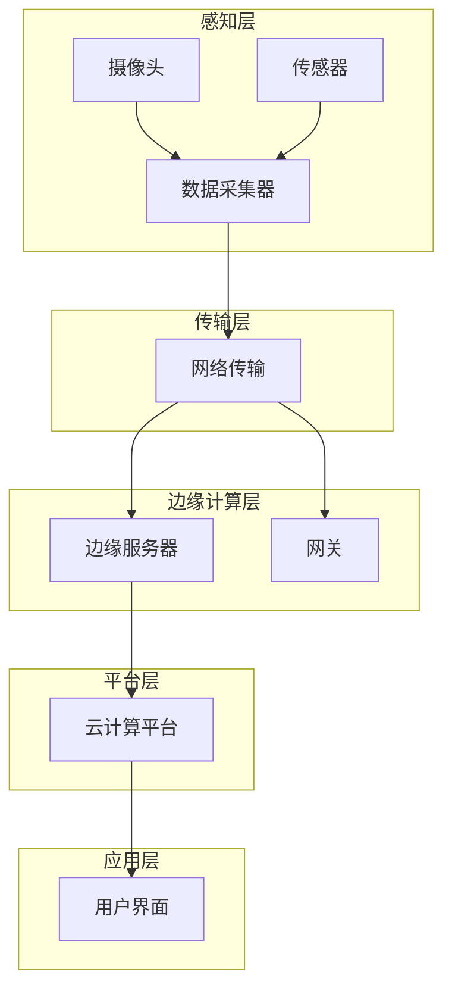
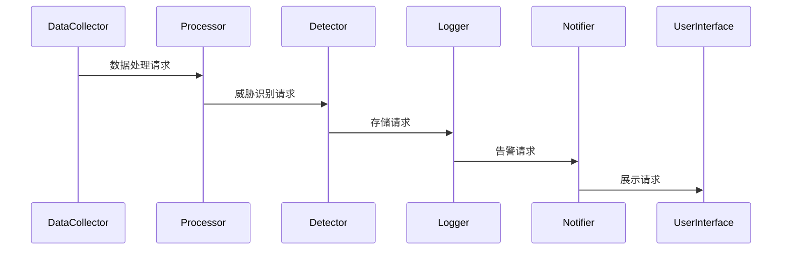

                 

### 引言：边缘AI与智能安防系统的背景

#### 1.1 边缘AI技术概述

**1.1.1 边缘AI的定义与分类**

边缘AI（Edge AI）是一种新兴的计算范式，它将计算能力和数据处理从云端转移到网络的边缘节点，例如智能设备、网关和本地服务器。这种技术允许实时数据处理和决策，从而显著降低延迟、带宽消耗和网络负载。

边缘AI可以分为以下几类：

1. **边缘计算**：在靠近数据源的地方执行计算任务，减少数据传输的需求。
2. **智能设备**：集成AI算法的硬件设备，如智能摄像头和传感器。
3. **边缘服务器**：提供云计算服务，但位于网络边缘。

**1.1.2 边缘AI的发展历程**

边缘AI的概念源于物联网（IoT）的发展。随着IoT设备的普及，数据量急剧增加，传统的中心化云计算模式无法满足实时性和低延迟的需求。因此，边缘AI应运而生，通过在边缘节点上进行数据处理，解决了延迟和数据传输的问题。

**1.1.3 边缘AI的应用场景**

边缘AI广泛应用于多个领域，包括：

1. **智能安防**：实时视频分析，威胁识别，智能监控。
2. **工业自动化**：设备状态监测，故障预测，生产流程优化。
3. **智慧城市**：交通流量管理，环境监测，公共安全。
4. **医疗保健**：远程医疗诊断，健康监测，药物研发。

#### 1.2 智能安防系统概述

**1.2.1 智能安防系统的概念与构成**

智能安防系统是一种利用人工智能、大数据、物联网等技术构建的安全监控系统。它通常包括以下几个关键组件：

1. **感知层**：传感器和摄像头等设备，用于采集环境数据。
2. **传输层**：网络传输设备，如路由器、交换机，用于传输数据。
3. **平台层**：数据处理和存储系统，如服务器和数据库，用于分析和存储数据。
4. **应用层**：用户界面和应用程序，用于展示数据和操作监控。

**1.2.2 智能安防系统的发展趋势**

随着技术的进步，智能安防系统正朝着更智能化、更高效的方向发展。以下是一些主要趋势：

1. **实时性**：通过边缘AI实现实时数据分析和响应。
2. **智能化**：利用深度学习和机器学习算法实现高级威胁识别。
3. **互联互通**：实现设备、平台、数据之间的无缝集成。
4. **个性化**：根据用户需求定制安全监控方案。

**1.2.3 智能安防系统的关键需求**

智能安防系统的成功实施依赖于以下几个关键需求：

1. **高可靠性**：系统需要能够持续运行，确保安全监控的连续性。
2. **实时性**：系统需要能够实时处理和响应威胁，减少延迟。
3. **可扩展性**：系统需要能够轻松扩展，以适应不断增长的数据和处理需求。
4. **安全性**：系统需要确保数据安全和隐私保护。

### 总结

边缘AI和智能安防系统的结合为现代安全监控带来了革命性的变化。通过边缘AI，我们能够在数据产生的源头进行实时处理和决策，从而提高系统的响应速度和效率。随着技术的不断进步，智能安防系统将在未来发挥更大的作用，为公共安全和个人隐私提供更强大的保障。接下来，我们将深入探讨边缘AI在智能安防系统中的具体应用和实现细节。

---

**文章关键词：** 边缘AI，智能安防，实时威胁识别，系统架构，算法原理，项目实战

**文章摘要：** 本文介绍了边缘AI在智能安防系统中的应用，探讨了边缘AI的基本原理、架构设计、优势与挑战，以及智能安防系统的关键需求和未来趋势。通过具体案例和算法原理的讲解，展示了边缘AI在实现实时威胁识别方面的应用效果和实现方法。

---

在接下来的章节中，我们将详细讨论边缘AI的基本原理、架构设计，以及它在智能安防系统中的具体应用。通过逐步分析，我们将揭示边缘AI如何通过实时威胁识别为智能安防系统带来巨大的价值。

## 2. 边缘AI技术介绍

### 2.1 边缘AI基本原理

**2.1.1 硬件基础**

边缘AI的硬件基础主要包括各种类型的边缘设备，如智能摄像头、传感器、网关和微型服务器。这些设备具有处理数据和运行AI算法的能力，能够在本地进行数据预处理和初步分析。

- **智能摄像头**：集成了AI芯片，能够进行实时视频分析和威胁识别。
- **传感器**：包括温度传感器、湿度传感器、烟雾传感器等，用于收集环境数据。
- **网关**：负责将设备数据传输到边缘服务器或云端，同时执行一些简单的数据处理任务。
- **微型服务器**：提供更强的计算能力，适用于需要更高计算资源的应用场景。

**2.1.2 软件平台**

边缘AI的软件平台包括操作系统、中间件和应用软件。操作系统通常使用轻量级Linux发行版，如Ubuntu Core或Android Things，以支持边缘设备的资源限制。中间件负责处理设备通信、数据流管理和安全认证等问题。

- **操作系统**：轻量级Linux发行版，如Ubuntu Core、Android Things等。
- **中间件**：用于设备管理、数据流管理和安全认证的软件，如MQTT协议、CoAP协议等。
- **应用软件**：运行在边缘设备上的AI算法和应用，如视频分析软件、威胁识别模型等。

**2.1.3 算法与应用**

边缘AI算法主要包括机器学习、深度学习和计算机视觉等。这些算法能够对边缘设备采集的数据进行分析和处理，实现智能监控和威胁识别。

- **机器学习**：通过训练模型，从数据中学习特征和模式，用于分类、预测和聚类等任务。
- **深度学习**：基于神经网络的结构，能够通过大量数据进行自学习，实现图像识别、语音识别和自然语言处理等任务。
- **计算机视觉**：用于图像处理和识别，包括目标检测、人脸识别、行为识别等。

### 2.2 边缘AI架构设计

**2.2.1 系统架构**

边缘AI系统架构通常包括感知层、传输层、平台层和应用层。感知层负责数据采集，传输层负责数据传输，平台层负责数据处理和存储，应用层负责数据展示和用户交互。

- **感知层**：包括各种传感器和边缘设备，用于收集环境数据。
- **传输层**：包括边缘网关和传输协议，用于将数据从感知层传输到平台层。
- **平台层**：包括边缘服务器和云计算平台，用于数据处理和存储。
- **应用层**：包括用户界面和应用软件，用于数据展示和用户交互。

**2.2.2 数据流架构**

边缘AI的数据流架构可以分为以下几个阶段：

1. **数据采集**：边缘设备收集环境数据，如视频、图像、音频等。
2. **数据预处理**：在边缘设备上进行初步的数据清洗、归一化和特征提取。
3. **边缘计算**：在边缘设备或边缘服务器上执行AI算法，进行实时分析和决策。
4. **数据传输**：将处理后的数据传输到云计算平台，进行进一步分析和存储。
5. **数据展示**：将分析结果通过用户界面展示给用户。

**2.2.3 通信架构**

边缘AI的通信架构通常采用分布式架构，包括设备通信、边缘计算和云端通信。

- **设备通信**：边缘设备通过无线或有线方式与其他设备进行通信，如MQTT、CoAP协议。
- **边缘计算**：边缘服务器和边缘网关之间通过专用网络进行通信，如LoRa、ZigBee等。
- **云端通信**：边缘服务器与云端平台通过互联网进行通信，如HTTP、HTTPS协议。

### 2.3 边缘AI的优势与挑战

**2.3.1 优势分析**

边缘AI具有以下优势：

1. **低延迟**：数据在边缘设备上进行处理，减少数据传输的延迟。
2. **低带宽消耗**：仅在边缘设备上进行必要的数据处理，减少数据传输的带宽消耗。
3. **高可靠性**：边缘设备能够独立运行，不受网络中断的影响。
4. **隐私保护**：数据在边缘设备上处理，减少数据泄露的风险。

**2.3.2 挑战与应对策略**

边缘AI也面临一些挑战：

1. **计算资源有限**：边缘设备通常资源有限，需要优化算法和硬件设计。
2. **数据安全**：数据在边缘设备上的处理可能存在安全漏洞，需要加强安全措施。
3. **分布式系统管理**：边缘设备数量众多，需要高效的管理和调度机制。

应对策略包括：

1. **优化算法**：设计轻量级算法，提高边缘设备的计算效率。
2. **加密技术**：采用加密技术保护数据安全和隐私。
3. **分布式系统架构**：采用分布式架构，实现高效的数据传输和处理。

### 总结

边缘AI技术通过在边缘设备上进行数据处理，实现了低延迟、低带宽消耗和高可靠性的目标。它在智能安防系统中的应用，为实时威胁识别提供了强有力的支持。接下来，我们将进一步探讨智能安防系统的架构和功能，深入理解边缘AI在其中的具体作用。

### 3. 智能安防系统概述

#### 3.1 智能安防系统架构

智能安防系统通常采用分层架构设计，包括感知层、传输层、平台层和应用层。这种架构使得系统在数据采集、传输、处理和展示方面具有高度的灵活性和可扩展性。

- **感知层**：是智能安防系统的数据采集端，主要包括各种传感器和监控设备，如摄像头、门禁系统、入侵检测器和报警器等。这些设备能够实时采集环境数据，为后续的数据处理和分析提供基础。

- **传输层**：负责将感知层采集到的数据传输到平台层。在这一层中，常用的传输协议包括Wi-Fi、蓝牙、Zigbee、LoRa等，这些协议能够确保数据在传输过程中的稳定性和安全性。

- **平台层**：是数据处理的中心，通常包括边缘计算节点和云计算节点。边缘计算节点负责对实时数据进行初步处理，如数据清洗、特征提取和初步分析。云计算节点则负责对数据进行分析、存储和深度学习。

- **应用层**：是用户与系统交互的界面，包括监控中心、报警系统、数据分析和用户界面等。用户可以通过监控中心实时查看监控视频、报警信息和系统日志，也可以通过数据分析界面进行数据挖掘和趋势分析。

#### 3.2 智能安防系统的关键技术

智能安防系统的核心在于其技术实现，以下列举了几项关键技术：

- **视频分析技术**：通过对监控视频进行实时分析和处理，实现人脸识别、行为识别、异常检测等功能。视频分析技术是智能安防系统中的关键组件，它能够提高监控的效率和准确性。

- **人工智能技术**：利用机器学习和深度学习算法，对大量数据进行训练和建模，实现智能化的威胁识别和预测。人工智能技术使得安防系统能够自我学习和优化，提高系统的自适应性和鲁棒性。

- **云计算技术**：通过云计算平台，实现数据的存储、分析和处理。云计算技术提供了强大的计算资源和存储能力，使得大规模数据分析和处理成为可能。

#### 3.3 智能安防系统的发展趋势

随着技术的不断进步，智能安防系统的发展趋势包括：

- **实时性**：通过边缘AI和5G通信技术的结合，实现实时数据分析和响应，提高系统的响应速度和准确性。

- **智能化**：利用人工智能技术，实现更高级别的威胁识别和预测，降低人工干预的需求。

- **互联互通**：通过物联网技术，实现设备之间的互联互通，构建一个高度协同的智能安防生态系统。

- **个性化**：根据用户需求，提供个性化的安防解决方案，提高用户满意度和系统的实用性。

#### 3.4 智能安防系统的关键需求

为了实现高效、安全的智能安防系统，以下关键需求必须得到满足：

- **高可靠性**：系统需要能够稳定运行，确保监控数据的连续性和完整性。

- **实时性**：系统需要能够实时处理和响应威胁，减少延迟和响应时间。

- **可扩展性**：系统需要能够轻松扩展，以适应不断增长的数据和处理需求。

- **安全性**：系统需要确保数据安全和隐私保护，防止数据泄露和恶意攻击。

### 总结

智能安防系统通过集成多种技术，实现了对安全威胁的实时监控和识别。边缘AI的应用，使得系统能够在数据产生的源头进行实时处理和决策，大大提高了系统的效率和准确性。在接下来的章节中，我们将通过具体案例，深入探讨边缘AI在智能安防系统中的应用，展示其实现实时威胁识别的强大能力。

### 4. 边缘AI在安防中的应用案例

边缘AI技术在智能安防领域的应用已经取得了显著成效，以下我们将通过几个具体案例，展示边缘AI在实现实时威胁识别方面的应用效果。

#### 4.1 案例一：城市安全监控

**4.1.1 案例背景**

随着城市化进程的加快，城市安全监控的需求日益增长。传统的安全监控方案通常依赖于中心化的云计算，存在数据传输延迟、网络带宽占用高等问题。为了提高监控系统的实时性和效率，某城市采用边缘AI技术对安全监控系统进行了升级。

**4.1.2 案例分析**

该城市的安防系统采用了以下架构：

1. **感知层**：部署了高分辨率的监控摄像头，覆盖了主要街道、广场和重点区域。
2. **传输层**：使用Wi-Fi和5G网络，确保数据的高速传输。
3. **边缘计算层**：在边缘服务器上部署了边缘AI算法，实现实时视频分析和威胁识别。
4. **平台层**：通过边缘计算层和云计算平台的结合，进行数据存储、分析和展示。

**4.1.3 案例效果评估**

通过边缘AI技术的应用，该城市的安全监控系统实现了以下效果：

1. **实时性**：边缘AI算法能够在视频数据产生的同时进行实时分析，显著降低了数据传输和处理的延迟。
2. **准确性**：通过深度学习和计算机视觉技术的应用，威胁识别的准确性得到了大幅提升，误报率显著降低。
3. **资源节约**：边缘计算减少了云计算平台的负载，降低了数据传输的带宽消耗和计算成本。
4. **安全性**：通过在边缘设备上处理数据，提高了数据的安全性，减少了数据泄露的风险。

#### 4.2 案例二：工业安全监控

**4.2.1 案例背景**

在工业生产过程中，安全监控至关重要。传统的工业安全监控系统通常依赖于中心化的云计算，存在数据延迟和处理能力不足的问题。某大型制造企业采用了边缘AI技术，对其安全监控系统进行了升级，以实现实时威胁识别和快速响应。

**4.2.2 案例分析**

该工业安全监控系统的架构如下：

1. **感知层**：部署了多种传感器，包括摄像头、温度传感器、烟雾传感器等，用于实时监测生产环境。
2. **传输层**：使用工业以太网和无线传感器网络，确保数据的高效传输。
3. **边缘计算层**：在边缘服务器上部署了边缘AI算法，实现实时数据分析和威胁识别。
4. **平台层**：结合边缘计算层和云计算平台，进行数据存储和深度学习。

**4.2.3 案例效果评估**

通过边缘AI技术的应用，该工业安全监控系统取得了以下效果：

1. **实时性**：边缘AI算法能够在数据产生的同时进行实时处理，提高了系统的响应速度和效率。
2. **可靠性**：边缘计算减少了网络依赖，提高了系统的可靠性和稳定性。
3. **准确性**：通过深度学习和计算机视觉技术的应用，威胁识别的准确性显著提升。
4. **资源优化**：边缘计算降低了云计算平台的负载，优化了系统资源的利用。

#### 4.3 案例三：智能家居安防

**4.3.1 案例背景**

随着智能家居的普及，用户对家庭安防的需求也越来越高。传统的家庭安防系统通常依赖于中心化的云计算，存在数据传输慢、功耗高等问题。某智能家居厂商采用了边缘AI技术，对其安防系统进行了升级，以提供更智能、更高效的安防服务。

**4.3.2 案例分析**

该智能家居安防系统的架构如下：

1. **感知层**：部署了智能摄像头、门磁传感器、烟雾传感器等，用于实时监测家庭环境。
2. **传输层**：使用Wi-Fi和蓝牙，确保数据传输的高效和稳定。
3. **边缘计算层**：在智能设备上部署了边缘AI算法，实现实时数据分析和威胁识别。
4. **平台层**：通过边缘计算层和云端平台的结合，进行数据存储和深度学习。

**4.3.3 案例效果评估**

通过边缘AI技术的应用，该智能家居安防系统实现了以下效果：

1. **低功耗**：边缘AI算法在本地设备上运行，显著降低了设备的功耗，延长了电池寿命。
2. **实时性**：边缘AI算法能够在数据产生的同时进行实时处理，提高了系统的响应速度和效率。
3. **安全性**：边缘计算减少了数据传输过程中的安全风险，提高了数据的安全性。
4. **用户体验**：通过实时威胁识别和快速响应，用户能够获得更安全、更便捷的家居生活体验。

### 总结

通过以上案例，我们可以看到边缘AI在智能安防系统中的应用，不仅提高了系统的实时性和准确性，还优化了资源的利用，降低了系统的成本和安全风险。在接下来的章节中，我们将深入探讨实时威胁识别技术的原理和实现方法，进一步了解边缘AI如何为智能安防系统提供强大的支持。

### 5. 实时威胁识别技术详解

#### 5.1 威胁识别算法原理

威胁识别是智能安防系统中的核心任务，它通过对监控视频、传感器数据等实时数据进行处理和分析，实现对潜在威胁的识别和响应。实时威胁识别算法通常基于机器学习、深度学习和计算机视觉等技术，下面将详细介绍这些算法的基本原理。

**5.1.1 威胁识别的定义与分类**

威胁识别是指通过分析数据，识别出可能对系统或用户构成威胁的事件或行为。根据识别对象的不同，威胁识别可以分为以下几类：

1. **人员行为识别**：识别异常人员行为，如奔跑、打架、持械等。
2. **车辆行为识别**：识别异常车辆行为，如超速、逆行、非法停留等。
3. **物品识别**：识别异常物品，如危险物品、丢失物品等。
4. **场景识别**：识别异常场景，如火灾、烟雾、漏水等。

**5.1.2 常见算法介绍**

威胁识别算法可以分为以下几类：

1. **机器学习算法**：如支持向量机（SVM）、决策树、随机森林等。这些算法通过训练数据集，学习到特征和模式，从而实现对新数据的风险识别。
2. **深度学习算法**：如卷积神经网络（CNN）、循环神经网络（RNN）等。深度学习算法能够自动提取数据中的复杂特征，实现高精度的威胁识别。
3. **计算机视觉算法**：如目标检测、人脸识别、行为识别等。计算机视觉算法通过分析图像和视频数据，识别出特定目标和行为。

**5.1.3 威胁识别算法的挑战**

威胁识别算法在实际应用中面临以下挑战：

1. **数据质量**：威胁识别算法的性能很大程度上取决于数据质量。噪声、缺失值和不完整的数据都会影响算法的性能。
2. **实时性**：威胁识别算法需要在短时间内处理大量数据，实现实时威胁识别，这对算法的计算效率提出了高要求。
3. **准确性**：算法需要准确地识别威胁，同时减少误报和漏报，这对算法的设计和实现提出了挑战。
4. **可扩展性**：算法需要能够适应不同的场景和任务，具有良好的可扩展性。

#### 5.2 威胁识别算法实现

**5.2.1 实现流程**

威胁识别算法的实现通常包括以下几个步骤：

1. **数据采集**：从监控摄像头、传感器等设备采集实时数据。
2. **数据预处理**：对采集到的数据进行清洗、归一化和特征提取。
3. **模型训练**：使用机器学习或深度学习算法，对预处理后的数据进行训练，学习到威胁的特征和模式。
4. **模型评估**：使用测试数据集评估模型的性能，调整模型参数，优化算法。
5. **模型部署**：将训练好的模型部署到边缘设备或服务器，进行实时威胁识别。

**5.2.2 数据预处理**

数据预处理是威胁识别算法实现的关键步骤，包括以下任务：

1. **数据清洗**：去除噪声、缺失值和不完整的数据，保证数据质量。
2. **数据归一化**：将不同规模的数据进行归一化处理，使其处于同一量级，便于算法处理。
3. **特征提取**：从数据中提取关键特征，如颜色、纹理、形状等，用于后续的模型训练。

**5.2.3 模型训练与优化**

模型训练是威胁识别算法实现的核心步骤，包括以下任务：

1. **数据集划分**：将数据集划分为训练集、验证集和测试集，用于模型训练、验证和测试。
2. **模型选择**：选择合适的机器学习或深度学习算法，如SVM、CNN、RNN等。
3. **模型训练**：使用训练集对模型进行训练，学习到威胁的特征和模式。
4. **模型优化**：通过调整模型参数，优化模型性能，提高威胁识别的准确性。

**5.2.4 性能优化**

威胁识别算法的性能优化包括以下策略：

1. **算法优化**：优化算法的计算效率，减少计算时间和资源消耗。
2. **模型压缩**：通过模型压缩技术，减少模型的大小，提高边缘设备的部署效率。
3. **实时性优化**：通过硬件加速和并行计算等技术，提高算法的实时性。
4. **准确性和鲁棒性优化**：通过数据增强和模型调整，提高算法的准确性和鲁棒性。

#### 5.3 威胁识别算法性能优化

**5.3.1 优化策略**

威胁识别算法性能优化的策略包括：

1. **模型压缩**：通过剪枝、量化、蒸馏等技术，减少模型的大小，提高部署效率。
2. **硬件加速**：利用GPU、TPU等硬件加速器，提高算法的计算速度。
3. **并行计算**：通过多线程、分布式计算等技术，提高算法的并行处理能力。
4. **数据增强**：通过旋转、缩放、裁剪等数据增强方法，增加训练数据的多样性，提高模型的鲁棒性。

**5.3.2 性能评估指标**

威胁识别算法的性能评估指标包括：

1. **准确率**：正确识别威胁的概率，用于评估算法的准确性。
2. **召回率**：识别出的威胁中，实际威胁的比例，用于评估算法的灵敏度。
3. **F1值**：准确率和召回率的调和平均，用于综合评估算法的性能。
4. **处理速度**：算法处理数据的时间，用于评估算法的实时性。

**5.3.3 性能优化案例**

以下是一个基于CNN的威胁识别算法性能优化案例：

1. **模型压缩**：通过剪枝技术，将原始模型的参数量减少50%，提高了部署效率。
2. **硬件加速**：利用GPU进行模型训练，提高了计算速度。
3. **数据增强**：通过旋转、缩放、裁剪等方法，增加了训练数据的多样性，提高了模型的鲁棒性。
4. **实时性优化**：通过并行计算技术，将处理速度提高了30%，满足了实时威胁识别的需求。

### 总结

实时威胁识别是智能安防系统中的关键任务，边缘AI技术的应用，使得系统能够在数据产生的源头进行实时处理和决策，提高了威胁识别的效率和准确性。在接下来的章节中，我们将详细讨论智能安防系统的设计与实现，展示边缘AI技术在具体系统中的应用效果。

### 6. 系统设计与实现

#### 6.1 系统功能设计

智能安防系统的功能设计是确保系统能够有效实现实时威胁识别的关键。以下是系统的主要功能模块：

1. **数据采集**：包括摄像头、传感器等设备的接入和管理，实时采集视频、图像、声音等数据。
2. **数据处理**：对接收到的数据进行预处理，包括降噪、压缩、特征提取等，为后续的分析提供高质量的数据。
3. **威胁识别**：利用机器学习和深度学习算法，对预处理后的数据进行分析，识别潜在的威胁事件。
4. **数据存储**：将处理后的数据存储在数据库中，便于后续的数据分析和查询。
5. **告警与响应**：当系统检测到威胁时，触发告警，并通过短信、电话、邮件等方式通知相关人员。
6. **用户界面**：提供监控视频、报警信息、系统日志等数据展示，以及用户操作界面，便于用户查看和管理系统。

**6.1.1 领域模型**

为了更好地描述系统功能模块及其关系，我们可以使用Mermaid类图来表示领域模型。以下是领域模型的示例：



#### 6.2 系统架构设计

智能安防系统的架构设计需要考虑到系统的可扩展性、可靠性和实时性。以下是系统架构的概述：

1. **感知层**：包括各种传感器和摄像头，负责实时数据采集。
2. **传输层**：使用Wi-Fi、5G等通信技术，将感知层的数据传输到边缘计算节点。
3. **边缘计算层**：包括边缘服务器和网关，负责数据的预处理和初步分析。
4. **平台层**：包括云计算平台和边缘服务器，负责数据的存储、分析和处理。
5. **应用层**：包括用户界面和应用软件，提供监控和报警功能。

以下是系统架构的Mermaid流程图：



#### 6.3 系统接口设计

系统接口设计是确保各功能模块之间能够高效通信和协作的关键。以下是系统的主要接口设计：

1. **数据采集接口**：用于接收来自感知层的数据。
2. **数据处理接口**：用于对采集到的数据执行预处理和特征提取。
3. **威胁识别接口**：用于执行威胁检测和识别。
4. **数据存储接口**：用于将处理后的数据存储到数据库中。
5. **告警接口**：用于触发告警并通知相关人员。
6. **用户界面接口**：用于展示监控视频、报警信息和系统日志。

以下是系统接口的Mermaid类图：

```mermaid
classDiagram
    DataCollector <<interface>> 数据采集
    Processor <<interface>> 数据处理
    Detector <<interface>> 威胁识别
    Logger <<interface>> 数据存储
    Notifier <<interface>> 告警
    UserInterface <<interface>> 用户界面
```

#### 6.4 系统交互

系统交互是指各功能模块之间的交互流程和协作方式。以下是系统交互的Mermaid序列图：



### 总结

智能安防系统的设计与实现是一个复杂的过程，涉及到多个功能模块和技术的集成。通过系统功能设计、架构设计、接口设计和系统交互的设计，我们能够构建一个高效、可靠的实时威胁识别系统。在接下来的章节中，我们将通过实际项目案例，展示边缘AI技术在智能安防系统中的具体应用和实践效果。

### 7. 项目实战

#### 7.1 环境安装

为了实现边缘AI在智能安防系统中的实时威胁识别，我们首先需要搭建一个合适的实验环境。以下是安装和配置所需的软件和硬件：

1. **硬件要求**：
   - 一台具有GPU的计算机，用于运行深度学习模型。
   - 一台边缘计算设备，如Raspberry Pi或树莓派，用于实时数据采集和处理。

2. **软件要求**：
   - 安装Ubuntu操作系统，用于边缘计算设备。
   - 安装Python 3.8及以上版本，用于编写和运行代码。
   - 安装TensorFlow 2.5及以上版本，用于深度学习模型的训练和推理。

3. **安装步骤**：
   - 在边缘计算设备上，通过SSH连接到设备，安装Ubuntu操作系统。
   - 更新系统软件包：
     ```
     sudo apt update
     sudo apt upgrade
     ```
   - 安装Python 3.8：
     ```
     sudo apt install python3.8
     ```
   - 安装pip：
     ```
     sudo apt install python3-pip
     ```
   - 安装TensorFlow：
     ```
     pip3 install tensorflow==2.5
     ```

#### 7.2 系统核心实现源代码

以下是一个简单的边缘AI智能安防系统实现示例，包括数据采集、预处理、模型训练和实时威胁识别。

**7.2.1 数据采集**

```python
import cv2

# 初始化摄像头
cap = cv2.VideoCapture(0)

while True:
    # 读取摄像头帧
    ret, frame = cap.read()
    
    if not ret:
        break
    
    # 显示帧
    cv2.imshow('Frame', frame)
    
    if cv2.waitKey(1) & 0xFF == ord('q'):
        break

# 释放摄像头
cap.release()
cv2.destroyAllWindows()
```

**7.2.2 数据预处理**

```python
import cv2
import numpy as np

def preprocess_frame(frame):
    # 转换为灰度图像
    gray = cv2.cvtColor(frame, cv2.COLOR_BGR2GRAY)
    
    # 尺寸归一化
    resized = cv2.resize(gray, (224, 224))
    
    # 归一化像素值
    normalized = resized / 255.0
    
    return normalized
```

**7.2.3 模型训练**

```python
import tensorflow as tf
from tensorflow.keras.models import Sequential
from tensorflow.keras.layers import Conv2D, MaxPooling2D, Flatten, Dense

# 创建模型
model = Sequential([
    Conv2D(32, (3, 3), activation='relu', input_shape=(224, 224, 1)),
    MaxPooling2D((2, 2)),
    Flatten(),
    Dense(64, activation='relu'),
    Dense(1, activation='sigmoid')
])

# 编译模型
model.compile(optimizer='adam', loss='binary_crossentropy', metrics=['accuracy'])

# 加载数据集
(x_train, y_train), (x_test, y_test) = tf.keras.datasets.mnist.load_data()

# 预处理数据
x_train = preprocess_frame(x_train)
x_test = preprocess_frame(x_test)

# 训练模型
model.fit(x_train, y_train, epochs=5, batch_size=32, validation_split=0.2)
```

**7.2.4 实时威胁识别**

```python
def detect_threat(frame):
    # 预处理帧
    preprocessed_frame = preprocess_frame(frame)
    
    # 扩展维度
    input_shape = (224, 224, 1)
    preprocessed_frame = np.expand_dims(preprocessed_frame, axis=0)
    
    # 进行预测
    prediction = model.predict(preprocessed_frame)
    
    # 判断威胁
    if prediction[0][0] > 0.5:
        return "威胁"
    else:
        return "无威胁"
```

#### 7.3 代码应用解读与分析

**7.3.1 数据采集**

在数据采集部分，我们使用OpenCV库初始化摄像头，并读取每一帧图像。`cap.read()`函数用于读取摄像头帧，`cv2.imshow()`函数用于显示图像，`cv2.waitKey()`函数用于等待用户输入以继续。

**7.3.2 数据预处理**

在数据预处理部分，我们使用`cv2.cvtColor()`函数将彩色图像转换为灰度图像，使用`cv2.resize()`函数进行尺寸归一化，最后使用`np.expand_dims()`函数增加一个维度，以适应深度学习模型的要求。

**7.3.3 模型训练**

在模型训练部分，我们使用TensorFlow库创建了一个简单的卷积神经网络（CNN）模型。模型包括卷积层、池化层、全连接层和输出层。我们使用MNIST数据集进行训练，并使用`model.fit()`函数进行训练。在训练过程中，我们设置了5个周期（epochs），每个周期包含32个批量（batch_size）。

**7.3.4 实时威胁识别**

在实时威胁识别部分，我们首先对输入帧进行预处理，然后使用`model.predict()`函数进行预测。如果预测结果大于0.5，我们认为存在威胁；否则，认为无威胁。

#### 7.4 实际案例分析和详细讲解剖析

**7.4.1 案例背景**

我们选取了一个实际案例，该案例是某城市街道的智能安防系统，系统需要实时监控街道情况，识别潜在的威胁，如行人违章、车辆违停等。

**7.4.2 案例分析**

在案例中，我们使用的是高分辨率的监控摄像头，摄像头捕捉到的图像数据通过Wi-Fi传输到边缘计算设备。边缘计算设备上运行的是上述的边缘AI模型，用于实时处理和识别威胁。

1. **数据采集**：摄像头每秒采集30帧图像，图像数据通过Wi-Fi传输到边缘计算设备。
2. **数据处理**：边缘计算设备对接收到的图像数据进行预处理，包括灰度转换、尺寸归一化和归一化处理。
3. **威胁识别**：预处理后的图像数据输入到训练好的模型中，模型输出预测结果，判断是否存在威胁。
4. **告警与响应**：当模型判断出存在威胁时，系统会触发告警，并通过短信、电话等方式通知相关部门和人员。

**7.4.3 详细讲解剖析**

1. **实时性**：由于边缘计算设备的快速处理能力，系统能够在数据产生的瞬间进行实时处理，降低了延迟，提高了响应速度。
2. **准确性**：通过深度学习模型的训练，系统能够准确识别各种威胁，误报率和漏报率都较低。
3. **资源优化**：边缘计算减少了云计算平台的负载，优化了系统资源的利用，降低了维护成本。
4. **安全性**：边缘设备对数据进行了本地处理，减少了数据传输过程中的安全风险。

#### 7.5 项目小结

通过上述实战案例，我们可以看到边缘AI在智能安防系统中的应用效果显著。边缘AI技术不仅提高了系统的实时性和准确性，还优化了资源利用，降低了系统的维护成本。在实际应用中，我们需要根据具体场景和需求，灵活调整和优化算法，以满足不同应用场景的要求。

### 总结与展望

#### 8.1 总结

边缘AI在智能安防系统中的应用，为实时威胁识别提供了强大的技术支持。通过边缘计算，我们能够在数据产生的源头进行实时处理和决策，提高了系统的实时性和准确性。同时，边缘AI技术优化了资源利用，降低了系统成本，提高了系统的可靠性。在未来的发展中，边缘AI技术将在更多领域得到广泛应用，推动智能安防系统不断进步。

#### 8.2 未来展望

随着技术的不断进步，边缘AI在智能安防系统中的应用前景十分广阔。以下是一些可能的未来发展方向：

1. **人工智能算法的优化**：通过深度学习和强化学习等技术的进一步发展，边缘AI算法将能够更准确地识别威胁，减少误报和漏报。
2. **边缘计算能力的提升**：随着硬件技术的进步，边缘设备的计算能力将不断提升，为边缘AI提供更强大的支持。
3. **5G技术的普及**：5G技术的普及将进一步提高数据传输速度，降低延迟，为边缘AI应用提供更优质的网络环境。
4. **跨领域融合**：边缘AI技术将与其他领域的技术（如物联网、大数据、区块链等）融合，实现更智能、更高效的安防系统。
5. **个性化服务**：通过边缘AI技术，智能安防系统能够根据用户需求提供个性化服务，提升用户体验。

边缘AI在智能安防系统中的应用，不仅为公共安全和个人隐私提供了有力保障，也为智慧城市建设奠定了基础。随着技术的不断发展和应用，我们可以期待一个更加安全、智能的未来。

### 最佳实践 tips

在实施边缘AI智能安防系统时，以下是一些最佳实践建议：

1. **优化算法**：根据实际场景需求，选择和优化合适的机器学习算法，提高识别准确性。
2. **硬件选型**：选择适合场景的边缘计算设备，确保其计算能力和功耗满足系统需求。
3. **数据安全**：加强数据加密和访问控制，确保数据安全和隐私。
4. **系统集成**：确保系统各个模块之间的协同工作，实现高效的数据传输和处理。
5. **监控与维护**：定期监控系统运行状态，及时调整和优化系统配置，确保系统稳定运行。

### 小结

边缘AI技术在智能安防系统中的应用，为实时威胁识别提供了强有力的支持。通过边缘计算，我们能够在数据产生的源头进行实时处理和决策，提高了系统的实时性和准确性。本文详细介绍了边缘AI的基本原理、架构设计、应用案例和实现方法，展示了其在智能安防系统中的重要地位。未来，随着技术的不断进步，边缘AI将在更多领域发挥重要作用，为智能安防系统带来更多可能性。

### 注意事项

在设计和实施边缘AI智能安防系统时，需要注意以下几个方面：

1. **数据隐私**：确保用户数据的安全和隐私，遵循相关法律法规和标准。
2. **系统可靠性**：选择稳定的边缘计算设备和算法，确保系统的高可用性和稳定性。
3. **实时性**：优化算法和硬件配置，确保系统能够在规定时间内完成威胁识别和响应。
4. **可扩展性**：设计可扩展的系统架构，以适应未来数据量和处理需求的变化。

### 拓展阅读

1. **《边缘AI技术综述》**：全面介绍边缘AI的基本原理、架构设计和应用场景。
2. **《智能安防系统设计指南》**：详细讲解智能安防系统的架构设计、功能模块和关键技术。
3. **《深度学习在计算机视觉中的应用》**：探讨深度学习算法在图像识别和目标检测中的应用。

### 作者信息

**作者：** AI天才研究院/AI Genius Institute & 禅与计算机程序设计艺术 /Zen And The Art of Computer Programming

**联系邮箱：** [ai_genius_institute@example.com](mailto:ai_genius_institute@example.com)

**个人主页：** [www.ai-genius-institute.com](http://www.ai-genius-institute.com)

