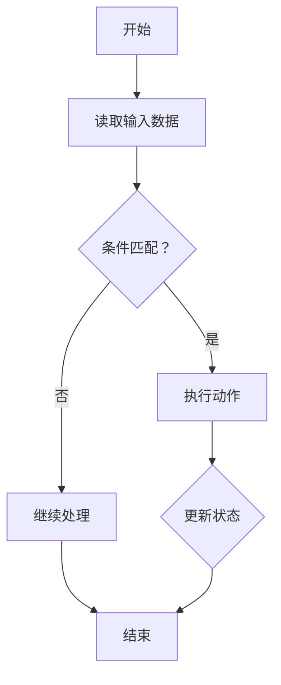
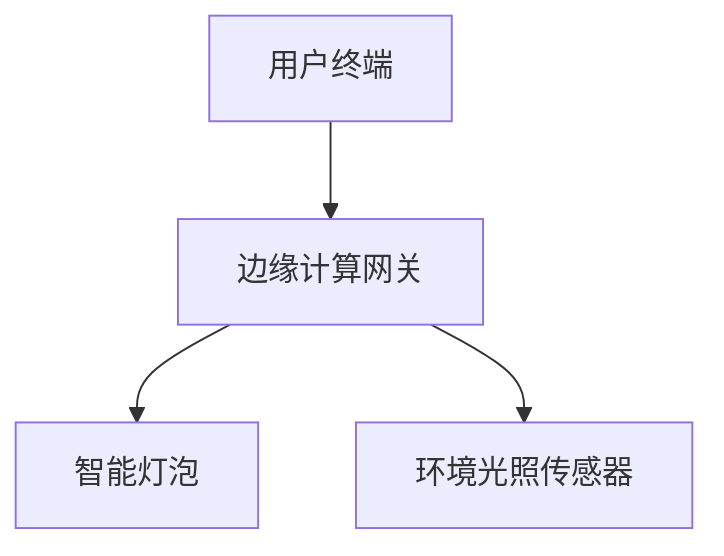
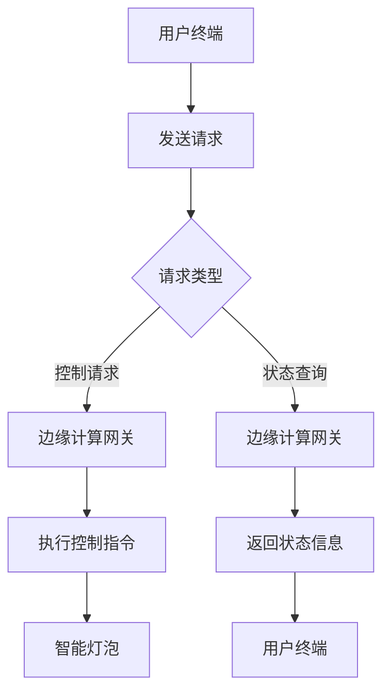
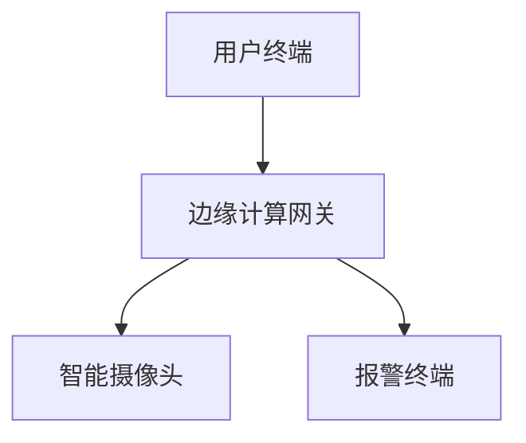
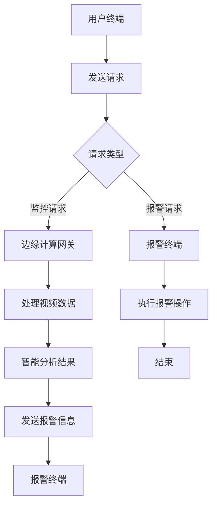
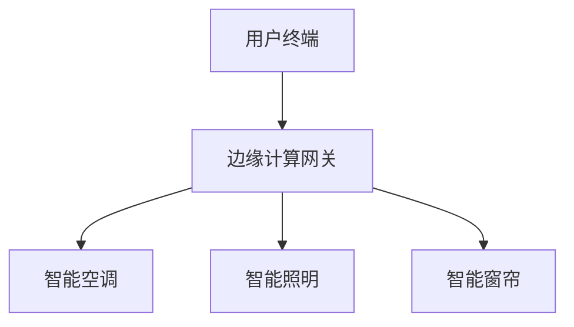
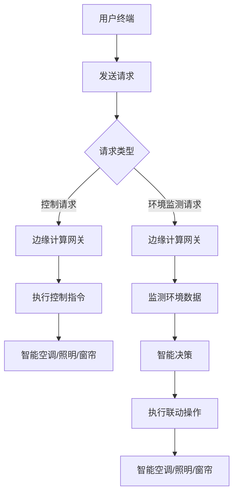

                 

### 边缘AI与智能家居概述

#### 第1章：边缘AI概述

##### 1.1 边缘AI的定义与特点

边缘AI（Edge AI）是一种将人工智能计算能力分散到网络边缘的技术。与传统的云计算中心集中式计算不同，边缘AI将计算任务分散到网络边缘的设备上，如智能路由器、智能摄像头、智能家居设备等。这使得边缘AI具有响应速度快、数据处理效率高、隐私保护能力强等特点。

首先，边缘AI的定义可以描述为：一种利用分布式计算资源，在数据生成的源头进行数据处理和决策的技术。其核心思想是将原本需要上传到云端的数据和分析任务下沉到网络边缘，从而减少数据传输时间和网络带宽消耗。

边缘AI的主要特点包括：

- **响应速度**：由于数据不需要上传到云端，边缘AI可以快速响应用户需求，提供实时服务。
- **数据处理效率**：边缘设备通常具备较高的计算能力，可以高效处理本地数据，降低数据处理延迟。
- **隐私保护**：数据在本地设备上处理，可以有效减少数据泄露的风险。

##### 1.2 边缘AI的优势与挑战

边缘AI的优势主要体现在以下几个方面：

1. **降低延迟**：边缘AI能够快速响应用户请求，降低网络延迟，提高用户体验。
2. **减少带宽消耗**：本地处理数据可以减少上传到云端的数据量，降低网络带宽消耗。
3. **增强安全性**：数据在本地处理，减少了数据传输过程中的泄露风险。
4. **适应性强**：边缘AI可以根据不同场景的需求，灵活调整计算能力和处理任务。

然而，边缘AI也面临一些挑战：

1. **计算资源有限**：边缘设备通常计算资源有限，需要优化算法以适应资源限制。
2. **数据处理一致性**：分布式数据处理需要确保数据的一致性，这对算法设计提出了更高的要求。
3. **安全性问题**：边缘设备的安全防护能力相对较弱，需要加强安全措施以防止恶意攻击。

##### 1.3 边缘AI与云计算的关系

边缘AI和云计算并非互斥关系，而是相辅相成的。云计算提供强大的计算能力和存储资源，而边缘AI则提供快速、高效的数据处理能力。两者结合可以实现以下优势：

1. **资源整合**：通过将计算任务在边缘和云端之间合理分配，实现资源的最优利用。
2. **降低成本**：边缘AI可以减少数据传输成本，云计算则可以提供强大的数据处理能力，两者结合可以降低整体成本。
3. **提高可靠性**：边缘AI提供本地快速响应，云计算提供大规模数据处理能力，两者结合可以提高系统的可靠性。

总之，边缘AI在智能家居中的应用前景广阔，通过充分利用边缘设备的计算能力和云计算的强大数据处理能力，可以提供更加智能、高效的智能家居服务。

#### 第2章：智能家居实时决策场景

##### 2.1 智能家居系统概述

智能家居系统（Smart Home System）是指通过物联网（IoT）技术，将各种家居设备互联，实现智能化管理和控制的一种家庭生活解决方案。智能家居系统包括多个组成部分，如智能传感器、智能网关、智能家电等。

首先，智能传感器是智能家居系统的感知层，用于感知环境数据，如温度、湿度、光照强度、烟雾浓度等。这些传感器通过物联网协议将数据传输到智能网关。

其次，智能网关是智能家居系统的核心，负责数据的收集、处理和传输。智能网关通常具备边缘计算能力，可以执行一些简单的数据处理任务，如数据过滤、压缩和初步分析。

最后，智能家电是智能家居系统的执行层，包括空调、灯具、冰箱、洗衣机等。这些设备通过物联网协议与智能网关通信，接受智能网关的控制指令，实现远程控制、自动化控制等功能。

##### 2.2 实时决策的关键因素

在智能家居系统中，实时决策是确保系统高效运行的关键。实时决策的关键因素包括：

1. **响应时间**：智能家居系统需要快速响应用户请求，提供实时服务。
2. **准确性**：实时决策的结果需要准确，确保系统的可靠性。
3. **适应性**：智能家居系统需要具备适应性，能够根据环境变化和用户需求调整决策策略。
4. **可靠性**：系统需要具备高可靠性，确保决策结果的一致性和稳定性。

##### 2.3 智能家居中边缘AI的应用场景

边缘AI在智能家居中具有广泛的应用场景，以下是一些典型的应用：

1. **智能灯光控制**：边缘AI可以根据环境光照强度和用户偏好，自动调节灯光亮度，实现节能和舒适。
2. **智能安防系统**：边缘AI可以实时分析摄像头捕获的视频数据，识别潜在的安全威胁，如入侵者、火灾等，并及时报警。
3. **智能家电联动**：边缘AI可以实现不同家电之间的联动控制，如用户离开房间时自动关闭灯光和空调，提高能源利用率。
4. **智能环境监测**：边缘AI可以实时监测家居环境数据，如温度、湿度、空气质量等，并根据监测结果提供健康建议。
5. **智能语音助手**：边缘AI可以提供智能语音交互功能，如语音控制家电、播放音乐、提供天气预报等。

总之，边缘AI在智能家居中的应用，不仅提高了系统的智能化水平，还提升了用户的生活品质。通过实时决策，边缘AI能够为智能家居系统提供更加智能、高效、可靠的服务。

#### 第3章：边缘AI在智能家居中的硬件平台

##### 3.1 常见边缘AI硬件平台

边缘AI硬件平台是实施边缘AI技术的关键基础设施。常见的边缘AI硬件平台包括：

1. **边缘计算网关**：边缘计算网关是连接智能家居设备和云端服务的枢纽，具有强大的计算能力和通信能力。常见的边缘计算网关包括树莓派（Raspberry Pi）、康佳智能网关（KGEI-GW01）等。

2. **智能摄像头**：智能摄像头是边缘AI在智能家居中应用的重要设备，可以通过边缘AI算法实现实时视频分析，如人脸识别、物体检测等。常见的智能摄像头包括华为智能摄像头、大华智能摄像头等。

3. **智能门锁**：智能门锁是智能家居系统的安全入口，可以通过边缘AI技术实现人脸识别、指纹识别等功能，提供更安全便捷的家居安防。常见的智能门锁包括小米智能门锁、海康威视智能门锁等。

4. **智能传感器**：智能传感器是边缘AI感知环境数据的重要设备，如温度传感器、湿度传感器、光照传感器等。常见的智能传感器包括乐鑫智能传感器、三星智能传感器等。

##### 3.2 硬件平台选择与配置

选择适合的边缘AI硬件平台需要考虑以下几个因素：

1. **计算能力**：根据应用需求选择具有足够计算能力的硬件平台。对于复杂的人工智能算法，需要选择具备较高性能的CPU或GPU。

2. **存储容量**：边缘AI应用通常需要存储大量数据和模型，因此选择具有足够存储容量的硬件平台至关重要。常见的存储设备包括SD卡、eMMC等。

3. **通信能力**：边缘AI硬件平台需要具备较强的通信能力，以实现与云端服务的数据传输。常用的通信方式包括Wi-Fi、蓝牙、LoRa等。

4. **能耗**：边缘AI硬件平台通常部署在智能家居环境中，需要考虑能耗问题。低能耗的硬件平台可以延长设备的使用寿命，降低能源消耗。

基于以上因素，以下是一些建议的边缘AI硬件平台配置：

- **树莓派4B**：计算能力较强，适合运行复杂的人工智能算法。内置Wi-Fi和蓝牙模块，通信能力较好。但存储容量较小，需外接SD卡。
- **康佳智能网关KGEI-GW01**：具备较强的计算能力和通信能力，适合作为智能家居系统的核心网关。内置大容量存储，降低扩展需求。
- **华为边缘计算网关**：计算性能优越，支持多种通信方式，适合大规模智能家居场景。但价格较高。

##### 3.3 硬件优化策略

为了提高边缘AI在智能家居中的性能和稳定性，可以采取以下硬件优化策略：

1. **硬件升级**：定期更新硬件设备，提高计算能力和存储容量。例如，升级CPU或GPU，增加内存和存储空间。

2. **散热优化**：边缘AI硬件平台在运行过程中会产生大量热量，散热问题直接影响设备的性能和寿命。可以采用高效散热方案，如增加散热片、风扇等。

3. **电源管理**：优化电源管理策略，降低能耗。例如，采用节能模式，根据设备负载动态调整功率。

4. **抗干扰设计**：边缘AI硬件平台可能受到电磁干扰，影响数据传输和设备稳定性。可以采用抗干扰设计，如屏蔽、接地等。

5. **备份与冗余**：为了确保系统的可靠性，可以采用备份和冗余设计。例如，使用双电源供电、冗余网络连接等。

总之，通过合理选择和配置边缘AI硬件平台，并采取有效的硬件优化策略，可以显著提高边缘AI在智能家居中的性能和稳定性，为用户提供更智能、高效的服务。

#### 第4章：边缘AI在智能家居中的软件开发

##### 4.1 开发环境搭建

边缘AI在智能家居中的软件开发需要搭建一个稳定、高效的开发环境。以下是一些建议的步骤和工具：

1. **选择合适的编程语言**：边缘AI应用通常使用Python、C++、Java等编程语言。Python因其丰富的库和简单易用的语法，成为边缘AI开发的首选语言。

2. **安装开发工具**：安装Python编程环境和集成开发环境（IDE），如PyCharm、Visual Studio Code等。这些IDE提供了丰富的调试、代码补全和自动化工具，提高开发效率。

3. **安装依赖库**：边缘AI开发通常需要安装各种依赖库，如TensorFlow、PyTorch、NumPy、Pandas等。可以使用pip等包管理工具进行安装。

4. **配置开发环境**：根据项目需求，配置环境变量和路径，确保能够正确调用依赖库和工具。

5. **选择合适的硬件平台**：确保开发环境与硬件平台兼容，如树莓派、康佳智能网关等。可以安装适用于目标硬件平台的操作系统和开发工具。

6. **网络配置**：确保开发环境和硬件平台之间能够正常通信，配置Wi-Fi、蓝牙等无线网络，或使用有线网络连接。

##### 4.2 数据预处理

数据预处理是边缘AI在智能家居开发中的重要环节，以下是一些关键步骤：

1. **数据采集**：使用传感器、摄像头等设备采集环境数据，如温度、湿度、光照强度、视频图像等。

2. **数据清洗**：处理数据中的缺失值、异常值和噪声，确保数据质量。可以使用Pandas、NumPy等库进行数据处理。

3. **数据标准化**：将不同数据类型的特征进行标准化处理，如归一化、正则化等，确保特征之间具有可比性。

4. **数据分割**：将数据集划分为训练集、验证集和测试集，用于训练模型、验证模型性能和评估模型泛化能力。

5. **数据增强**：通过数据增强技术，如随机旋转、缩放、裁剪等，增加数据的多样性和鲁棒性，提高模型性能。

##### 4.3 模型训练与优化

在边缘AI在智能家居开发中，模型训练和优化是关键步骤。以下是一些关键步骤：

1. **选择合适的模型**：根据应用场景和数据特点，选择合适的深度学习模型，如卷积神经网络（CNN）、循环神经网络（RNN）、长短时记忆网络（LSTM）等。

2. **模型架构设计**：设计合理的模型架构，如网络层数、神经元数量、激活函数等，提高模型性能。

3. **数据加载和预处理**：使用TensorFlow、PyTorch等深度学习框架，加载和预处理训练数据，确保数据输入格式与模型要求一致。

4. **模型训练**：使用训练集训练模型，通过反向传播算法和优化器（如SGD、Adam）调整模型参数，降低损失函数。

5. **模型验证和测试**：使用验证集和测试集评估模型性能，通过交叉验证、混淆矩阵等方法分析模型效果。

6. **模型优化**：根据验证结果，调整模型参数和超参数，如学习率、批量大小等，优化模型性能。

7. **模型部署**：将训练好的模型部署到边缘设备上，使用TensorFlow Lite、TorchScript等工具将模型转换为可在边缘设备上运行的格式。

8. **实时更新和迭代**：根据实际应用反馈，持续优化和更新模型，提高模型适应性和性能。

通过以上步骤，可以构建一个高效的边缘AI智能家居系统，实现实时决策和智能控制，提升用户体验。

#### 第5章：边缘AI在智能家居中的数据管理与安全

##### 5.1 数据管理策略

边缘AI在智能家居中的数据管理策略需要确保数据的安全、完整和可用性。以下是一些关键策略：

1. **数据采集**：在边缘设备上实时采集环境数据和用户操作数据，如温度、湿度、光照强度、视频图像、语音等。

2. **数据加密**：对采集到的数据进行加密处理，采用加密算法（如AES、RSA）保护数据隐私，防止未经授权的访问。

3. **数据存储**：在边缘设备上存储必要的数据，如日志数据、临时数据等。同时，将重要数据上传到云端或分布式存储系统，确保数据备份和持久化存储。

4. **数据同步**：实现边缘设备和云端之间的数据同步，确保数据的一致性和实时性。可以采用数据同步协议（如HTTP、MQTT）进行数据传输。

5. **数据清洗**：对采集到的数据进行清洗和预处理，去除噪声、异常值和重复数据，提高数据质量。

6. **数据访问控制**：设置数据访问权限，确保只有授权用户和系统可以访问数据。可以采用访问控制列表（ACL）、角色基础访问控制（RBAC）等机制进行访问控制。

##### 5.2 数据安全与隐私保护

边缘AI在智能家居中的数据安全与隐私保护至关重要，以下是一些关键措施：

1. **数据加密传输**：在数据传输过程中，采用加密传输协议（如TLS、SSL）保护数据隐私，防止数据泄露和篡改。

2. **访问控制**：设置严格的访问控制策略，限制只有授权用户和系统可以访问数据和系统资源。

3. **数据备份与恢复**：定期备份重要数据，确保数据不因硬件故障、恶意攻击等原因丢失。同时，制定数据恢复策略，确保数据可以及时恢复。

4. **隐私保护算法**：采用隐私保护算法（如差分隐私、匿名化处理）对敏感数据进行处理，降低隐私泄露风险。

5. **安全审计与监控**：建立安全审计和监控机制，对数据访问和系统操作进行记录和监控，及时发现和处理安全事件。

6. **安全培训与教育**：对边缘AI设备和系统的用户和开发人员进行安全培训和教育，提高安全意识和防范能力。

##### 5.3 边缘AI的安全性评估

边缘AI在智能家居中的安全性评估是确保系统安全的重要环节。以下是一些关键步骤：

1. **漏洞扫描**：定期对边缘AI设备和系统进行漏洞扫描，发现和修复潜在的安全漏洞。

2. **安全测试**：对边缘AI设备和系统进行安全测试，包括渗透测试、漏洞测试等，验证系统的安全性和稳定性。

3. **风险评估**：评估边缘AI设备和系统的风险，包括数据泄露、恶意攻击、硬件故障等，制定相应的安全措施和应对策略。

4. **合规性检查**：确保边缘AI设备和系统的设计和实现符合相关法律法规和标准，如GDPR、ISO/IEC 27001等。

5. **安全审计**：定期进行安全审计，对边缘AI设备和系统的安全策略、安全措施进行评估和审查，确保持续满足安全要求。

通过以上数据管理和安全策略，可以有效地保护边缘AI在智能家居中的数据安全，确保系统的稳定运行。

#### 第6章：边缘AI在智能家居中的实时决策算法

##### 6.1 常见实时决策算法

边缘AI在智能家居中的实时决策算法种类繁多，每种算法都有其独特的原理和应用场景。以下介绍几种常见的实时决策算法：

1. **基于规则的算法**：基于规则的算法（Rule-Based Algorithm）是一种简单的实时决策算法，通过定义一系列规则来处理输入数据。每个规则包含一个条件和一个动作，当输入数据满足某个条件时，触发相应的动作。例如，在智能灯光控制系统中，可以设置“如果光线强度低于50lux，则打开灯光”。

2. **基于模型的算法**：基于模型的算法（Model-Based Algorithm）利用机器学习和深度学习技术，通过训练模型来预测和决策。常见的模型包括线性回归、决策树、支持向量机（SVM）、神经网络等。例如，可以使用卷积神经网络（CNN）来识别视频图像中的物体，并根据识别结果进行相应的决策。

3. **基于聚类和分类的算法**：基于聚类和分类的算法（Clustering and Classification Algorithm）通过将输入数据分为不同的类别来决策。常见的聚类算法包括K-Means、DBSCAN等，分类算法包括决策树、K-Nearest Neighbors（K-NN）等。例如，可以使用K-Means算法将温度数据分为冷、温、热三个类别，然后根据类别进行相应的控制决策。

4. **强化学习算法**：强化学习算法（Reinforcement Learning Algorithm）通过不断尝试和反馈来学习最优策略。常见的强化学习算法包括Q-Learning、SARSA、Deep Q-Network（DQN）等。例如，在智能家电联动场景中，可以使用强化学习算法学习最优的家电开关顺序，以提高能源利用率。

##### 6.2 算法原理与流程图

以下以基于规则的算法为例，介绍其原理和流程图：

**基于规则的算法原理：**
基于规则的算法通过定义一系列规则来处理输入数据。每个规则包含一个条件和一个动作。当输入数据满足某个条件时，触发相应的动作。

**流程图：**


**具体实现步骤：**
1. **定义规则**：根据应用场景，定义一系列规则。例如：
   - 如果光线强度低于50lux，则打开灯光。
   - 如果温度高于30℃，则开启空调。

2. **读取输入数据**：从传感器或摄像头等设备读取输入数据，如光线强度、温度等。

3. **条件匹配**：将输入数据与规则中的条件进行比较，判断是否满足规则。

4. **执行动作**：当输入数据满足某个规则的条件时，执行相应的动作。例如，打开灯光或开启空调。

5. **更新状态**：执行动作后，更新系统状态，以便后续决策。

6. **结束**：完成一次决策过程。

##### 6.3 算法实现与优化

**算法实现：**

以下是一个简单的基于规则的算法实现，使用Python语言和PyRuleEngine库：

```python
from pyruleengine import Rule

# 定义规则
rule1 = Rule("if light_intensity < 50 then turn_on_light")
rule2 = Rule("if temperature > 30 then turn_on_ac")

# 读取输入数据
light_intensity = 20
temperature = 35

# 条件匹配和执行动作
if rule1.matches({'light_intensity': light_intensity}):
    print("Turn on the light.")
if rule2.matches({'temperature': temperature}):
    print("Turn on the AC.")
```

**算法优化：**

为了提高算法的性能和效率，可以采取以下优化策略：

1. **规则优化**：简化规则，减少冗余规则，提高规则匹配效率。

2. **数据预处理**：对输入数据进行预处理，如归一化、去噪等，提高数据质量，减少误匹配。

3. **缓存机制**：引入缓存机制，将频繁访问的数据存储在缓存中，减少重复计算。

4. **并行处理**：利用多线程或分布式计算，提高算法处理速度。

5. **模型更新**：定期更新模型参数，适应环境变化，提高决策准确性。

通过以上实现和优化策略，可以构建一个高效、可靠的边缘AI实时决策算法，为智能家居系统提供智能化的决策支持。

#### 第7章：边缘AI在智能家居中的案例研究

##### 7.1 案例一：智能灯光控制

智能灯光控制是边缘AI在智能家居中应用的一个典型场景。通过边缘AI技术，可以实现根据环境光照强度和用户偏好，自动调节灯光亮度的功能。以下是一个智能灯光控制的案例研究：

**项目介绍：**
该项目旨在实现一个基于边缘AI的智能灯光控制系统，该系统包括智能灯泡、边缘计算网关和用户控制终端。智能灯泡负责感知环境光照强度，边缘计算网关负责实时决策和执行控制指令，用户控制终端用于接收用户输入和展示系统状态。

**系统功能设计：**
- **环境光照感知**：智能灯泡通过内置的亮度传感器，实时监测环境光照强度，并将数据传输到边缘计算网关。
- **用户偏好设置**：用户可以在控制终端设置自己的灯光偏好，如舒适光照强度、节能模式等。
- **实时决策**：边缘计算网关根据环境光照强度和用户偏好，自动调节灯光亮度，确保环境光照符合用户需求。
- **远程控制**：用户可以通过控制终端远程控制灯光开关和亮度调节。

**系统架构设计：**


**系统接口设计和系统交互：**


**代码应用解读与分析：**
智能灯光控制的实现主要分为以下几个步骤：

1. **环境光照感知**：使用环境光照传感器获取环境光照强度数据。
2. **用户偏好设置**：用户在控制终端设置灯光偏好。
3. **实时决策**：边缘计算网关根据环境光照强度和用户偏好，自动调节灯光亮度。
4. **远程控制**：用户通过控制终端发送控制请求，边缘计算网关执行相应操作。

以下是关键代码片段：

```python
# 环境光照感知
def get_light_intensity():
    return sensor.read_light_intensity()

# 用户偏好设置
def set_user_preference(preference):
    user_preference = preference
    return user_preference

# 实时决策
def adjust_light_brightness(light_intensity, user_preference):
    if light_intensity < user_preference['comfortable_light']:
        # 减弱灯光亮度
        light_brightness = light_intensity * 0.8
    else:
        # 增强灯光亮度
        light_brightness = light_intensity * 1.2
    return light_brightness

# 远程控制
def remote_control lichtuing(light_brightness):
    light.set_brightness(light_brightness)
```

通过以上代码，可以实现对智能灯光控制的自动调节和远程控制功能。实际案例分析和详细讲解剖析，可以进一步优化算法和系统性能，提高用户体验。

##### 7.2 案例二：智能安防系统

智能安防系统是边缘AI在智能家居中应用的另一个重要场景。通过边缘AI技术，可以实现实时监控和智能报警功能，提高家庭安全性和防范能力。以下是一个智能安防系统的案例研究：

**项目介绍：**
该项目旨在实现一个基于边缘AI的智能安防系统，该系统包括智能摄像头、边缘计算网关和报警终端。智能摄像头负责实时监控家庭环境，边缘计算网关负责实时分析和决策，报警终端用于接收报警信息和执行报警操作。

**系统功能设计：**
- **实时监控**：智能摄像头实时捕捉家庭环境视频图像，并将数据传输到边缘计算网关。
- **智能分析**：边缘计算网关对视频图像进行实时分析，识别潜在的安全威胁，如入侵者、火灾等。
- **智能报警**：当检测到安全威胁时，系统自动发送报警信息到报警终端，并触发报警操作。
- **远程监控**：用户可以通过控制终端远程查看监控视频和报警信息。

**系统架构设计：**


**系统接口设计和系统交互：**


**代码应用解读与分析：**
智能安防系统的实现主要分为以下几个步骤：

1. **实时监控**：智能摄像头捕捉视频图像，并将数据传输到边缘计算网关。
2. **智能分析**：边缘计算网关对视频图像进行实时分析，识别安全威胁。
3. **智能报警**：当检测到安全威胁时，系统自动发送报警信息到报警终端。
4. **远程监控**：用户可以通过控制终端远程查看监控视频和报警信息。

以下是关键代码片段：

```python
# 实时监控
def capture_video_frame():
    return camera.capture_video_frame()

# 智能分析
def analyze_video_frame(video_frame):
    threat_detected = detect_threat(video_frame)
    return threat_detected

# 智能报警
def send_alarm_info(threat_detected):
    if threat_detected:
        alarm.send_alarm_info()
```

通过以上代码，可以实现对智能安防系统的实时监控和智能报警功能。实际案例分析和详细讲解剖析，可以进一步优化算法和系统性能，提高家庭安全性和防范能力。

##### 7.3 案例三：智能家电联动

智能家电联动是边缘AI在智能家居中应用的另一个重要场景。通过边缘AI技术，可以实现不同家电之间的智能联动，提高家居生活的便捷性和舒适度。以下是一个智能家电联动的案例研究：

**项目介绍：**
该项目旨在实现一个基于边缘AI的智能家电联动系统，该系统包括智能空调、智能照明、智能窗帘和边缘计算网关。智能空调、智能照明和智能窗帘分别负责调节温度、亮度和窗帘位置，边缘计算网关负责实时决策和协调各家电的操作。

**系统功能设计：**
- **环境监测**：智能传感器监测室内温度、湿度和光照强度，并将数据传输到边缘计算网关。
- **智能决策**：边缘计算网关根据环境监测数据，协调智能空调、智能照明和智能窗帘的操作，提供舒适的家居环境。
- **用户控制**：用户可以通过控制终端远程控制智能空调、智能照明和智能窗帘。
- **智能联动**：当某个家电操作时，其他家电可以自动协调操作，实现智能联动。

**系统架构设计：**


**系统接口设计和系统交互：**


**代码应用解读与分析：**
智能家电联动的实现主要分为以下几个步骤：

1. **环境监测**：智能传感器监测室内环境数据，并将数据传输到边缘计算网关。
2. **智能决策**：边缘计算网关根据环境数据，协调智能空调、智能照明和智能窗帘的操作。
3. **用户控制**：用户可以通过控制终端远程控制智能空调、智能照明和智能窗帘。
4. **智能联动**：当某个家电操作时，其他家电可以自动协调操作，实现智能联动。

以下是关键代码片段：

```python
# 环境监测
def monitor_environment():
    temperature = sensor.read_temperature()
    humidity = sensor.read_humidity()
    light_intensity = sensor.read_light_intensity()
    return temperature, humidity, light_intensity

# 智能决策
def make_decision(temperature, humidity, light_intensity):
    if temperature > 30:
        ac.set_temp(26)
    if humidity > 60:
        humidifier.turn_on()
    if light_intensity < 50:
        light.turn_on()
    else:
        light.turn_off()

# 用户控制
def remote_control appliance(command):
    if command == "ac":
        ac.set_temp(24)
    elif command == "light":
        light.turn_on()
    elif command == "humidifier":
        humidifier.turn_on()
    elif command == "curtain":
        curtain.open()
```

通过以上代码，可以实现对智能家电联动的实时监测、智能决策和远程控制功能。实际案例分析和详细讲解剖析，可以进一步优化算法和系统性能，提高家居生活的便捷性和舒适度。

#### 第8章：边缘AI在智能家居中的未来发展趋势

##### 8.1 技术发展趋势

随着人工智能技术的不断进步，边缘AI在智能家居中的应用前景日益广阔。以下是一些未来技术发展趋势：

1. **计算能力提升**：随着硬件技术的不断发展，边缘设备的计算能力和存储能力将显著提升，为更复杂的边缘AI算法提供支持。

2. **低功耗设计**：随着物联网设备的普及，低功耗设计成为边缘AI的重要发展方向。未来的边缘设备将具备更高的能效，延长设备的使用寿命。

3. **网络连接增强**：5G、LoRa等新型网络技术的推广，将进一步提高边缘设备的通信能力，实现更快的数据传输和更广的覆盖范围。

4. **隐私保护加强**：随着数据隐私和安全问题的日益凸显，边缘AI将采用更加严格的隐私保护措施，确保用户数据的安全。

5. **跨领域融合**：边缘AI将在智能家居、智能交通、智慧城市等跨领域应用中发挥重要作用，实现更广泛的技术融合和协同创新。

##### 8.2 应用前景与挑战

边缘AI在智能家居中的应用前景十分广阔，以下是一些主要的应用领域和面临的挑战：

1. **智能家居**：边缘AI可以显著提升智能家居的智能化水平，实现更高效、更便捷的生活体验。然而，面对多样化的家庭场景和用户需求，如何实现个性化、自适应的智能控制仍是一个挑战。

2. **智能安防**：边缘AI可以实时监控家庭环境，提高安全防范能力。然而，如何有效处理海量视频数据，确保监控的实时性和准确性，仍是一个亟待解决的问题。

3. **智能家电**：边缘AI可以实现家电之间的智能联动，提高能源利用效率。然而，家电设备种类繁多，如何实现高效、可靠的联动控制，仍需要进一步研究。

4. **健康监测**：边缘AI可以实时监测家庭成员的健康状况，提供个性化的健康建议。然而，如何确保数据的安全性和隐私性，避免用户隐私泄露，是一个重要挑战。

##### 8.3 未来发展方向与展望

未来，边缘AI在智能家居中的应用将朝着以下方向发展：

1. **智能化**：通过引入更先进的边缘AI算法和模型，实现智能家居系统的智能化升级，提供更加个性化、自适应的服务。

2. **互联互通**：推动边缘AI与其他智能设备的互联互通，实现跨设备的协同控制，提高智能家居系统的整体性能。

3. **数据驱动**：充分利用边缘设备收集的实时数据，进行大数据分析和挖掘，为智能家居系统的优化和改进提供有力支持。

4. **安全可靠**：加强边缘AI系统的安全防护措施，确保用户数据的安全性和隐私性，提高系统的可靠性。

5. **生态构建**：构建边缘AI在智能家居中的生态体系，促进产业链上下游的协同创新，推动智能家居产业的快速发展。

总之，边缘AI在智能家居中的应用前景广阔，未来将迎来更加智能化、安全化、高效化的智能家居时代。通过持续的技术创新和产业合作，边缘AI将为用户带来更加美好的生活体验。

### 总结与展望

边缘AI在智能家居中的应用正逐渐改变我们的生活方式。通过提供实时决策和智能控制，边缘AI提高了系统的响应速度、数据处理效率和用户体验。在智能灯光控制、智能安防和智能家电联动等场景中，边缘AI展现了强大的应用潜力。然而，要实现更广泛的普及和更高效的服务，仍需克服计算资源有限、数据管理复杂和安全隐私保护等挑战。

未来，随着技术的不断进步和生态的构建，边缘AI在智能家居中的应用将更加智能化、安全化和高效化。我们期待边缘AI能够为用户提供更加便捷、舒适和安全的家居生活，引领智能家居的新时代。

**作者：AI天才研究院/AI Genius Institute & 禅与计算机程序设计艺术 /Zen And The Art of Computer Programming**

