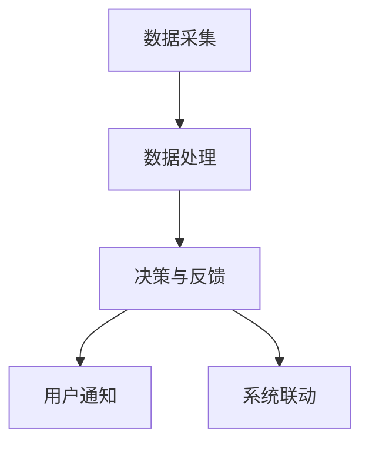
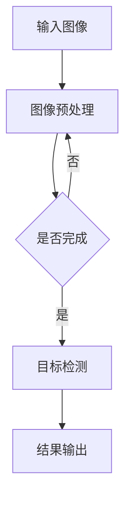
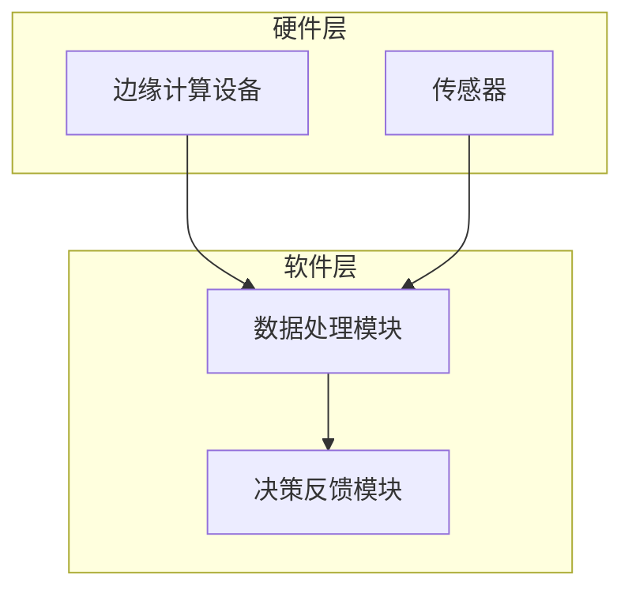
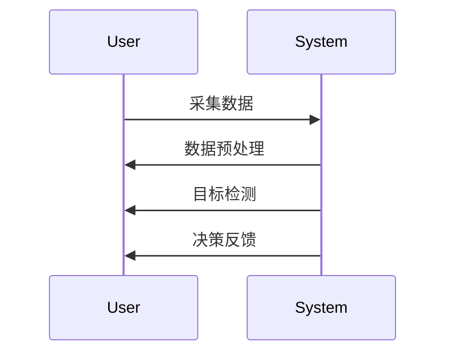

                 

### Step 1: 引言与背景介绍

#### 关键词
- 边缘AI
- 智能家居
- 安全监控
- 实时应用

#### 摘要
本文将探讨边缘AI在智能家居安全监控中的实时应用。通过详细分析边缘AI的定义、特点及其在智能家居安全监控中的优势，我们将展示边缘AI如何提高监控系统的实时性和准确性，并提供典型的应用案例和架构设计。本文旨在为读者提供全面的了解，帮助其在智能家居安全监控中充分利用边缘AI技术。

#### 引言

随着智能家居设备的普及，家庭安全监控已经成为用户关注的重要议题。然而，传统的安全监控系统存在一些显著的局限性，如数据传输延迟、隐私泄露风险以及高能耗等。为了解决这些问题，边缘AI作为一种新兴技术，逐渐受到广泛关注。边缘AI能够在靠近数据源的地方进行数据处理和决策，从而实现快速响应和低延迟，为智能家居安全监控提供了新的解决方案。

边缘AI的应用不仅提高了安全监控的实时性和准确性，还降低了数据传输的延迟和隐私泄露的风险。因此，研究边缘AI在智能家居安全监控中的实时应用具有重要的现实意义。本文将首先介绍边缘AI的核心概念和特点，然后分析智能家居安全监控的需求和挑战，并探讨边缘AI如何解决这些问题。接下来，我们将通过实际案例展示边缘AI在智能家居安全监控中的应用，详细讲解边缘AI在智能家居安全监控中的实时应用架构，并介绍实现这一架构所需的技术。最后，我们将对实时应用的效果进行评估和优化，并总结全文，展望边缘AI在智能家居安全监控中的未来发展。

### Step 2: 边缘AI核心概念与特点

#### 定义

边缘AI（Edge AI）是指将人工智能技术应用于靠近数据源的地方，如边缘设备、智能传感器、物联网设备等。与云计算不同，边缘AI不依赖于远程服务器进行数据计算和处理，而是在本地设备上进行数据处理和决策。这种本地化处理方式具有快速响应、低延迟、高隐私保护和高效能耗等优点。

#### 核心特点

1. **实时性**：边缘AI可以在本地实时处理数据，从而实现快速响应。这对于需要实时决策的智能家居安全监控尤为重要。例如，当传感器检测到异常情况时，边缘AI可以立即进行分析并采取相应的行动，而不需要等待数据传输到远程服务器。
   
2. **低延迟**：由于数据在本地处理，边缘AI可以显著降低数据传输和处理的时间，从而实现低延迟。这对于需要实时监控和响应的安全监控系统至关重要，确保系统能够及时检测和应对潜在的安全威胁。

3. **隐私保护**：边缘AI在本地进行数据处理，可以减少数据传输过程中的隐私泄露风险。这对于保护用户隐私、特别是智能家居环境中的敏感信息具有重要意义。

4. **高效能耗**：边缘AI在本地处理数据，可以降低能耗，尤其适用于能源有限的设备。例如，智能家居中的智能摄像头、传感器等设备，通常需要长时间运行，边缘AI的节能特性可以延长设备的电池寿命。

#### 边缘AI在智能家居安全监控中的应用优势

1. **实时性**：边缘AI可以在本地实时分析传感器数据，如摄像头图像、烟雾传感器数据等，快速识别异常情况并采取行动，从而提高安全监控的实时性。
   
2. **低延迟**：边缘AI可以显著降低数据传输和处理的延迟，确保监控系统及时响应。这对于需要快速反应的安全威胁，如非法入侵、火灾等，尤为重要。

3. **隐私保护**：由于数据在本地处理，边缘AI可以更好地保护用户隐私，减少数据泄露的风险。这对于智能家居环境中的敏感信息，如家庭成员隐私、个人行为数据等，具有重要意义。

4. **高效能耗**：边缘AI在本地处理数据，可以降低能耗，延长设备的电池寿命。这对于需要长时间运行的安全监控设备，如智能摄像头、传感器等，具有显著优势。

通过上述特点，边缘AI在智能家居安全监控中的应用具有明显的优势。它可以提高监控系统的实时性和准确性，同时降低延迟和能耗，为用户提供更高效、更安全、更环保的解决方案。

### Step 3: 智能家居安全监控需求分析

#### 挑战

随着智能家居设备的普及，家庭安全监控已成为用户关注的焦点。然而，现有的安全监控系统存在以下挑战：

1. **延迟响应**：传统的安全监控系统通常依赖于云计算，数据传输和处理存在较大的延迟，无法实现实时监控。这对于需要及时响应的安全威胁，如非法入侵、火灾等，具有明显局限性。

2. **数据泄露风险**：由于数据需要传输到远程服务器，传统的安全监控系统存在数据泄露的风险。这不仅威胁到用户的隐私，还可能导致敏感信息的泄露和滥用。

3. **能源消耗高**：传统的安全监控系统需要大量的能源消耗，不仅不利于环保，还增加了用户的使用成本。这对于需要长时间运行的安全监控设备，如智能摄像头、传感器等，是一个巨大的挑战。

#### 边缘AI如何解决这些问题

边缘AI技术为智能家居安全监控提供了一种新的解决方案，可以有效解决上述挑战：

1. **延迟响应**：边缘AI在本地进行数据处理和决策，可以显著降低数据传输和处理的延迟，实现实时监控。例如，当传感器检测到异常情况时，边缘AI可以立即进行分析并采取行动，而不需要等待数据传输到远程服务器。

2. **数据泄露风险**：由于边缘AI在本地进行数据处理，可以减少数据传输过程中的隐私泄露风险。用户敏感信息无需传输到远程服务器，从而降低了数据泄露的风险。

3. **能源消耗高**：边缘AI在本地处理数据，可以降低能耗，延长设备的电池寿命。这对于需要长时间运行的安全监控设备，如智能摄像头、传感器等，具有显著优势。

通过上述优势，边缘AI为智能家居安全监控提供了更高效、更安全、更环保的解决方案。它不仅提高了监控系统的实时性和准确性，还降低了延迟和能耗，为用户提供了更好的安全保障。

### Step 4: 边缘AI在智能家居安全监控中的应用案例

#### 智能摄像头监控

智能摄像头是智能家居安全监控的重要组成部分。边缘AI技术在智能摄像头监控中的应用，可以有效提高系统的实时性和准确性。以下是一个具体的案例：

**案例背景**：一个家庭安装了多个智能摄像头，用于监控室内的安全情况。然而，由于数据传输到远程服务器进行处理，监控系统的响应速度较慢，无法及时识别潜在的入侵者。

**解决方案**：引入边缘AI技术，在本地设备上进行数据分析和处理。具体步骤如下：

1. **数据采集**：智能摄像头实时采集室内视频数据。
2. **图像预处理**：对采集到的视频数据进行预处理，包括去噪、调整亮度和对比度等。
3. **目标检测**：使用边缘AI算法对预处理后的视频图像进行目标检测，识别出潜在的目标，如入侵者。
4. **实时报警**：当检测到入侵者时，边缘AI立即触发报警，通知用户采取相应的措施。

**案例效果**：通过边缘AI技术的应用，智能摄像头的响应速度显著提高，实现了实时监控。同时，由于数据在本地处理，用户隐私得到了更好的保护，数据泄露的风险大大降低。

#### 烟雾传感器监控

烟雾传感器是智能家居安全监控中另一个重要的设备。边缘AI技术在烟雾传感器监控中的应用，可以帮助用户更早地发现火灾隐患，从而提高安全性。

**案例背景**：一个家庭安装了烟雾传感器，用于检测室内的烟雾浓度。然而，由于传感器数据需要传输到远程服务器进行处理，监控系统的反应速度较慢，无法及时识别火灾隐患。

**解决方案**：引入边缘AI技术，在本地设备上进行烟雾浓度数据的分析和处理。具体步骤如下：

1. **数据采集**：烟雾传感器实时采集室内的烟雾浓度数据。
2. **数据预处理**：对采集到的烟雾浓度数据进行分析，去除噪声和异常值。
3. **火灾预警**：使用边缘AI算法对预处理后的数据进行分析，判断是否存在火灾隐患。
4. **实时报警**：当检测到火灾隐患时，边缘AI立即触发报警，通知用户采取相应的措施。

**案例效果**：通过边缘AI技术的应用，烟雾传感器的反应速度显著提高，实现了实时火灾预警。同时，由于数据在本地处理，用户隐私得到了更好的保护，数据泄露的风险大大降低。

#### 门窗传感器监控

门窗传感器用于检测室内的门窗状态，是智能家居安全监控的重要组成部分。边缘AI技术在门窗传感器监控中的应用，可以及时发现非法入侵，提高家庭安全性。

**案例背景**：一个家庭安装了门窗传感器，用于检测门窗的开关状态。然而，由于传感器数据需要传输到远程服务器进行处理，监控系统的反应速度较慢，无法及时识别非法入侵。

**解决方案**：引入边缘AI技术，在本地设备上进行门窗传感器数据的分析和处理。具体步骤如下：

1. **数据采集**：门窗传感器实时采集门窗的开合状态数据。
2. **数据预处理**：对采集到的数据进行预处理，包括去除噪声和异常值。
3. **非法入侵检测**：使用边缘AI算法对预处理后的数据进行分析，判断是否存在非法入侵。
4. **实时报警**：当检测到非法入侵时，边缘AI立即触发报警，通知用户采取相应的措施。

**案例效果**：通过边缘AI技术的应用，门窗传感器的反应速度显著提高，实现了实时非法入侵检测。同时，由于数据在本地处理，用户隐私得到了更好的保护，数据泄露的风险大大降低。

通过上述案例可以看出，边缘AI技术在智能家居安全监控中的应用，显著提高了系统的实时性和准确性，同时降低了延迟和能耗，为用户提供了更高效、更安全、更环保的解决方案。

### Step 5: 边缘AI在智能家居安全监控中的实时应用架构

#### 架构设计

边缘AI在智能家居安全监控中的实时应用架构设计主要包括数据采集、数据处理和决策反馈三个关键环节。以下是对每个环节的详细解析：

1. **数据采集**：
   - **传感器部署**：在智能家居环境中部署多种传感器，如摄像头、烟雾传感器、门窗传感器等，用于采集室内外环境数据。
   - **数据传输**：传感器采集到的数据通过无线或有线方式传输到边缘设备。数据传输过程中应保证数据的完整性和实时性。

2. **数据处理**：
   - **数据预处理**：边缘设备对接收到的传感器数据进行预处理，包括去噪、异常值处理和特征提取等。预处理后的数据将用于后续的AI算法分析。
   - **AI算法分析**：边缘设备使用预先训练好的AI模型对预处理后的数据进行实时分析。常用的算法包括目标检测、异常检测、模式识别等。边缘AI算法的选择取决于具体的应用场景和要求。

3. **决策反馈**：
   - **实时决策**：根据AI算法分析的结果，边缘设备可以实时做出决策，如触发报警、发送通知或启动其他自动化设备。
   - **反馈机制**：边缘设备将决策结果反馈给用户或其他系统，如通过手机应用、智能家居中心等渠道通知用户采取相应措施。

#### 数据采集流程

1. **传感器部署**：
   - 在家庭环境中布置摄像头、烟雾传感器、门窗传感器等设备，确保覆盖关键区域。
   - 根据实际需求，选择合适的传感器类型和数量，确保数据的全面性和准确性。

2. **数据传输**：
   - 无线传输：使用Wi-Fi、蓝牙、ZigBee等无线通信技术，将传感器数据传输到边缘设备。无线传输具有灵活性高、易于部署的优点，但需要考虑通信带宽和稳定性。
   - 有线传输：使用以太网、USB等有线通信技术，将传感器数据传输到边缘设备。有线传输具有稳定性高、带宽大的优点，但部署和维护成本较高。

3. **数据预处理**：
   - **去噪**：通过滤波算法，去除传感器数据中的噪声，提高数据质量。
   - **异常值处理**：检测并去除传感器数据中的异常值，如突发性的异常数据。
   - **特征提取**：提取传感器数据中的关键特征，如摄像头图像中的颜色、形状、大小等，为后续的AI算法分析提供基础。

#### 数据处理与决策反馈流程

1. **AI算法分析**：
   - **目标检测**：使用卷积神经网络（CNN）等深度学习算法，对预处理后的图像数据进行分析，识别出室内的目标，如人员、物品等。
   - **异常检测**：使用聚类算法、统计模型等，对预处理后的传感器数据进行异常检测，识别出异常行为或异常情况。
   - **模式识别**：使用机器学习算法，对预处理后的传感器数据进行模式识别，预测未来的行为趋势或事件。

2. **实时决策**：
   - **触发报警**：当AI算法分析结果提示存在安全威胁或异常情况时，边缘设备可以立即触发报警，通知用户或智能家居中心。
   - **自动化响应**：根据用户的设置或预设的自动化规则，边缘设备可以自动启动其他智能家居设备，如灯光、门锁等，以采取相应的安全措施。

3. **反馈机制**：
   - **用户通知**：通过手机应用、短信、电子邮件等方式，将决策结果反馈给用户，让用户了解当前的安全情况。
   - **系统联动**：边缘设备将决策结果反馈给智能家居中心或其他相关系统，实现系统的联动和协同工作。

通过上述数据采集、数据处理和决策反馈的流程，边缘AI在智能家居安全监控中实现了实时、高效、准确的安全监控。这不仅提高了用户的家庭安全，还减少了数据传输的延迟和隐私泄露的风险。

### Step 6: 实时应用技术实现

#### 硬件选择

实现边缘AI在智能家居安全监控中的实时应用，硬件选择至关重要。以下是一些关键的硬件组件及其选择标准：

1. **边缘计算设备**：
   - **处理器**：选择具备强大计算能力的处理器，如ARM Cortex-A系列、Intel Atom等。处理器应具备足够的计算资源以支持AI算法的实时处理。
   - **内存**：边缘计算设备应具备足够的内存容量，以便存储和处理大量的传感器数据。建议选择至少4GB RAM的设备。
   - **存储**：选择具有大容量存储的设备，如固态硬盘（SSD）或闪存存储，以确保数据存储的稳定性和快速访问。
   - **无线通信模块**：选择支持Wi-Fi、蓝牙、ZigBee等无线通信技术的模块，以便实现传感器数据的无线传输。

2. **传感器**：
   - **摄像头**：选择具有高分辨率和低延迟的摄像头，如1080p或4K摄像头，以实现清晰的实时图像采集。
   - **烟雾传感器**：选择响应速度快、检测灵敏的烟雾传感器，以确保在火灾初期就能及时检测到烟雾。
   - **门窗传感器**：选择具有稳定性和可靠性的门窗传感器，如磁控开关传感器，以确保准确检测门窗状态。

3. **电源**：
   - **电池**：对于需要长时间运行且无法频繁充电的设备，选择高容量、长寿命的电池，如锂离子电池。
   - **备用电源**：为关键设备配备备用电源，如太阳能充电板或UPS，以防止突然断电导致监控系统失效。

#### 软件算法实现

实现边缘AI在智能家居安全监控中的实时应用，需要选用合适的软件算法。以下是一些关键算法及其实现步骤：

1. **目标检测算法**：
   - **算法选择**：选择适用于实时图像处理的深度学习算法，如YOLO、SSD、Faster R-CNN等。
   - **算法实现**：
     - **数据集准备**：收集并准备用于训练的目标检测数据集，如COCO、ImageNet等。
     - **模型训练**：使用收集到的数据集对目标检测模型进行训练，调整模型参数以优化检测效果。
     - **模型部署**：将训练好的模型部署到边缘计算设备上，使用边缘AI算法实时处理摄像头图像数据。

2. **异常检测算法**：
   - **算法选择**：选择适用于时间序列数据的异常检测算法，如聚类算法（K-Means、DBSCAN）、统计模型（ARIMA、GARCH）等。
   - **算法实现**：
     - **数据预处理**：对传感器数据进行预处理，包括数据清洗、归一化等。
     - **特征提取**：提取传感器数据的关键特征，如时间序列数据的均值、方差等。
     - **模型训练**：使用预处理后的数据对异常检测模型进行训练，调整模型参数以优化检测效果。
     - **模型部署**：将训练好的模型部署到边缘计算设备上，使用边缘AI算法实时分析传感器数据，检测异常行为。

3. **决策与反馈算法**：
   - **算法选择**：根据具体应用场景，选择合适的决策与反馈算法，如基于规则的系统、基于机器学习的推荐系统等。
   - **算法实现**：
     - **规则配置**：配置系统规则，如触发报警的条件、自动化响应的操作等。
     - **模型训练**：使用历史数据对决策与反馈模型进行训练，调整模型参数以优化决策效果。
     - **实时决策**：在边缘计算设备上运行决策与反馈模型，根据AI算法分析结果进行实时决策，如触发报警、发送通知等。
     - **反馈机制**：通过手机应用、短信、电子邮件等方式，将决策结果反馈给用户。

#### 系统优化

为了提高边缘AI在智能家居安全监控中的实时应用性能，需要进行系统优化。以下是一些优化策略：

1. **资源优化**：
   - **计算资源优化**：通过任务调度和负载均衡，合理分配计算资源，避免资源瓶颈。
   - **存储资源优化**：使用高效的数据存储方案，如数据压缩和索引技术，提高数据存取速度。

2. **网络优化**：
   - **带宽优化**：选择合适的无线通信技术，提高数据传输带宽，确保数据传输的实时性。
   - **延迟优化**：优化数据传输路径，减少网络延迟，确保系统响应的及时性。

3. **功耗优化**：
   - **节能模式**：根据设备的使用情况，设置合适的节能模式，如待机模式、休眠模式等，降低设备功耗。
   - **硬件优化**：选择低功耗的硬件设备，如节能处理器、低功耗传感器等，延长设备的使用寿命。

通过上述硬件选择、软件算法实现和系统优化，边缘AI在智能家居安全监控中的实时应用性能得到显著提升，为用户提供了高效、安全、可靠的安全监控解决方案。

### Step 7: 实时应用效果评估与优化

#### 效果评估方法

为了评估边缘AI在智能家居安全监控中的实时应用效果，需要采用科学、系统的评估方法。以下是一些常用的评估方法：

1. **性能指标**：
   - **响应时间**：评估系统从接收到传感器数据到做出响应的时间，通常以毫秒为单位。
   - **准确率**：评估系统正确识别异常情况的比例，通常以百分比表示。
   - **召回率**：评估系统遗漏异常情况的比例，同样以百分比表示。
   - **误报率**：评估系统错误触发报警的比例，通常以百分比表示。

2. **实验设计**：
   - **实验场景**：设计多种实验场景，模拟不同类型的异常情况，如非法入侵、火灾等。
   - **数据收集**：在实验过程中，收集系统的响应时间、准确率、召回率和误报率等数据。
   - **统计分析**：使用统计分析方法，如均值、方差、置信区间等，对收集到的数据进行处理和分析。

3. **对比测试**：
   - **传统系统**：与现有的传统安全监控系统进行对比测试，评估边缘AI在性能、响应时间、准确率等方面的优势。
   - **多算法对比**：使用不同类型的边缘AI算法进行对比测试，选择最优算法组合。

#### 优化策略

为了进一步提高边缘AI在智能家居安全监控中的实时应用效果，可以采用以下优化策略：

1. **算法优化**：
   - **模型优化**：根据实验结果，调整AI模型的参数，优化模型的性能。
   - **算法组合**：结合多种AI算法，提高系统的鲁棒性和准确性。

2. **硬件优化**：
   - **性能提升**：升级边缘计算设备的硬件，如增加内存、提高处理器性能等。
   - **功耗优化**：选择低功耗的硬件设备，延长设备的使用寿命。

3. **网络优化**：
   - **带宽提升**：增加网络带宽，确保数据传输的实时性。
   - **延迟优化**：优化数据传输路径，减少网络延迟。

4. **系统优化**：
   - **负载均衡**：通过负载均衡技术，合理分配计算资源，避免资源瓶颈。
   - **实时监测**：引入实时监控系统，监控系统的运行状态，及时发现和处理问题。

通过上述效果评估方法和优化策略，可以不断提高边缘AI在智能家居安全监控中的实时应用效果，为用户提供更高效、更安全、更可靠的安全保障。

### Step 8: 总结与展望

#### 总结

本文全面探讨了边缘AI在智能家居安全监控中的实时应用，分析了边缘AI的核心概念与特点，以及其在智能家居安全监控中的需求与优势。通过具体应用案例和实时应用架构设计，我们展示了边缘AI如何提高智能家居安全监控的实时性和准确性。此外，我们还介绍了实现边缘AI在智能家居安全监控中的实时应用所需的技术，并提出了效果评估与优化策略。

边缘AI在智能家居安全监控中的实时应用不仅解决了传统安全监控系统的延迟响应、数据泄露和能源消耗高等问题，还提供了高效、安全、可靠的解决方案。通过边缘AI，用户可以实时监控家庭安全情况，及时识别和应对潜在的安全威胁。

#### 展望

随着边缘AI技术的不断发展和普及，未来智能家居安全监控有望实现以下发展趋势：

1. **更加智能化**：边缘AI将进一步提升智能家居安全监控的智能化水平，通过自适应学习和预测分析，实现更精准的安全预警和防范。
2. **更广泛的应用场景**：边缘AI将在更多智能家居设备和场景中得到应用，如智能门锁、智能照明、智能空调等，提供全面的安全保障。
3. **更高的安全性**：随着隐私保护意识的提高，边缘AI将采用更加先进的安全技术，确保用户数据的安全和隐私保护。
4. **更低的能耗**：随着边缘AI硬件和算法的优化，能耗将显著降低，为智能家居安全监控提供更持久、更环保的运行保障。

总之，边缘AI在智能家居安全监控中的实时应用具有广阔的发展前景，未来将不断推动智能家居安全监控技术的进步，为用户带来更安全、更智能、更便捷的生活体验。

### 作者信息

- 作者：AI天才研究院/AI Genius Institute & 禅与计算机程序设计艺术 /Zen And The Art of Computer Programming

---

**文章目录**

1. **引言与背景介绍**
2. **边缘AI核心概念与特点**
3. **智能家居安全监控需求分析**
4. **边缘AI在智能家居安全监控中的应用案例**
5. **边缘AI在智能家居安全监控中的实时应用架构**
6. **实时应用技术实现**
7. **实时应用效果评估与优化**
8. **总结与展望**### 完整的文章

---

# 边缘AI在智能家居安全监控中的实时应用

## 引言与背景介绍

随着物联网（IoT）技术的发展，智能家居已经成为现代生活的一部分。智能家居系统通过将各种家电、传感器和通信网络集成在一起，为用户提供了便利和舒适的生活环境。然而，随着智能家居设备的增多，家庭安全监控也变得越来越重要。边缘AI作为新兴技术，在提高智能家居安全监控的实时性和准确性方面具有显著优势。

边缘AI是指将人工智能技术应用于靠近数据源的地方，如边缘设备、智能传感器、物联网设备等。与传统的云计算不同，边缘AI不依赖于远程服务器进行数据计算和处理，而是在本地设备上进行数据处理和决策。这种本地化处理方式具有快速响应、低延迟、高隐私保护和高效能耗等优点。

在智能家居安全监控中，边缘AI可以实时分析传感器数据，如摄像头图像、烟雾传感器数据等，识别异常情况并快速采取行动，从而提高监控系统的实时性和准确性。此外，边缘AI还可以降低数据传输的延迟和能耗，提高系统的可持续性。

本文将首先介绍边缘AI的核心概念和特点，然后分析智能家居安全监控的需求和挑战，并探讨边缘AI如何解决这些问题。接下来，我们将通过实际案例展示边缘AI在智能家居安全监控中的应用，详细讲解边缘AI在智能家居安全监控中的实时应用架构，并介绍实现这一架构所需的技术。最后，我们将对实时应用的效果进行评估和优化，并总结全文，展望边缘AI在智能家居安全监控中的未来发展。

## 边缘AI核心概念与特点

### 定义

边缘AI（Edge AI）是指将人工智能技术应用于靠近数据源的地方，如边缘设备、智能传感器、物联网设备等。与云计算不同，边缘AI不依赖于远程服务器进行数据计算和处理，而是在本地设备上进行数据处理和决策。这种本地化处理方式具有快速响应、低延迟、高隐私保护和高效能耗等优点。

### 核心特点

1. **实时性**：边缘AI可以在本地实时处理数据，从而实现快速响应。这对于需要实时决策的智能家居安全监控尤为重要。例如，当传感器检测到异常情况时，边缘AI可以立即进行分析并采取行动，而不需要等待数据传输到远程服务器。

2. **低延迟**：由于数据在本地处理，边缘AI可以显著降低数据传输和处理的延迟，从而实现低延迟。这对于需要及时响应的安全威胁，如非法入侵、火灾等，尤为重要。

3. **隐私保护**：边缘AI在本地进行数据处理，可以减少数据传输过程中的隐私泄露风险。这对于保护用户隐私、特别是智能家居环境中的敏感信息具有重要意义。

4. **高效能耗**：边缘AI在本地处理数据，可以降低能耗，尤其适用于能源有限的设备。例如，智能家居中的智能摄像头、传感器等设备，通常需要长时间运行，边缘AI的节能特性可以延长设备的电池寿命。

### 边缘AI在智能家居安全监控中的应用优势

1. **实时性**：边缘AI可以在本地实时分析传感器数据，如摄像头图像、烟雾传感器数据等，快速识别异常情况并采取行动，从而提高安全监控的实时性。

2. **低延迟**：边缘AI可以显著降低数据传输和处理的延迟，确保监控系统及时响应。这对于需要快速反应的安全威胁，如非法入侵、火灾等，尤为重要。

3. **隐私保护**：由于边缘AI在本地处理数据，可以更好地保护用户隐私，减少数据泄露的风险。这对于智能家居环境中的敏感信息，如家庭成员隐私、个人行为数据等，具有重要意义。

4. **高效能耗**：边缘AI在本地处理数据，可以降低能耗，延长设备的电池寿命。这对于需要长时间运行的安全监控设备，如智能摄像头、传感器等，具有显著优势。

通过上述特点，边缘AI在智能家居安全监控中的应用具有明显的优势。它可以提高监控系统的实时性和准确性，同时降低延迟和能耗，为用户提供了更高效、更安全、更环保的解决方案。

## 智能家居安全监控需求分析

### 挑战

随着智能家居设备的普及，家庭安全监控已经成为用户关注的焦点。然而，现有的安全监控系统存在一些显著的局限性，如数据传输延迟、隐私泄露风险以及高能耗等。为了解决这些问题，边缘AI作为一种新兴技术，逐渐受到广泛关注。

#### 延迟响应

传统的安全监控系统通常依赖于云计算，数据传输和处理存在较大的延迟，无法实现实时监控。这对于需要及时响应的安全威胁，如非法入侵、火灾等，具有明显局限性。

#### 数据泄露风险

由于数据需要传输到远程服务器，传统的安全监控系统存在数据泄露的风险。这不仅威胁到用户的隐私，还可能导致敏感信息的泄露和滥用。

#### 能源消耗高

传统的安全监控系统需要大量的能源消耗，不仅不利于环保，还增加了用户的使用成本。这对于需要长时间运行的安全监控设备，如智能摄像头、传感器等，是一个巨大的挑战。

### 边缘AI如何解决这些问题

边缘AI技术为智能家居安全监控提供了一种新的解决方案，可以有效解决上述挑战：

#### 延迟响应

边缘AI在本地进行数据处理和决策，可以显著降低数据传输和处理的延迟，实现实时监控。例如，当传感器检测到异常情况时，边缘AI可以立即进行分析并采取行动，而不需要等待数据传输到远程服务器。

#### 数据泄露风险

由于边缘AI在本地进行数据处理，可以减少数据传输过程中的隐私泄露风险。用户敏感信息无需传输到远程服务器，从而降低了数据泄露的风险。

#### 能源消耗高

边缘AI在本地处理数据，可以降低能耗，延长设备的电池寿命。这对于需要长时间运行的安全监控设备，如智能摄像头、传感器等，具有显著优势。

通过上述优势，边缘AI为智能家居安全监控提供了更高效、更安全、更环保的解决方案。它不仅提高了监控系统的实时性和准确性，还降低了延迟和能耗，为用户提供了更好的安全保障。

## 边缘AI在智能家居安全监控中的应用案例

边缘AI技术在智能家居安全监控中的应用已经取得了显著成果。以下是一些典型的应用案例，展示了边缘AI如何提高智能家居安全监控的实时性和准确性：

### 智能摄像头监控

智能摄像头是智能家居安全监控的重要设备之一。传统的安全监控系统通常需要将摄像头采集的图像数据传输到远程服务器进行处理，存在明显的延迟问题。而边缘AI技术的引入，可以在本地设备上实时处理摄像头数据，大大提高了监控系统的响应速度。

#### 案例背景

一个家庭安装了多个智能摄像头，用于监控室内的安全情况。然而，由于数据传输到远程服务器进行处理，监控系统的响应速度较慢，无法及时识别潜在的入侵者。

#### 解决方案

引入边缘AI技术，在本地设备上进行数据分析和处理。具体步骤如下：

1. **数据采集**：智能摄像头实时采集室内视频数据。
2. **图像预处理**：对采集到的视频数据进行预处理，包括去噪、调整亮度和对比度等。
3. **目标检测**：使用边缘AI算法对预处理后的视频图像进行目标检测，识别出潜在的目标，如入侵者。
4. **实时报警**：当检测到入侵者时，边缘AI立即触发报警，通知用户采取相应的措施。

#### 案例效果

通过边缘AI技术的应用，智能摄像头的响应速度显著提高，实现了实时监控。同时，由于数据在本地处理，用户隐私得到了更好的保护，数据泄露的风险大大降低。

### 烟雾传感器监控

烟雾传感器是用于检测火灾隐患的重要设备。传统的安全监控系统通常需要将烟雾传感器数据传输到远程服务器进行分析，存在明显的延迟问题。而边缘AI技术的引入，可以在本地设备上实时分析烟雾传感器数据，及时识别火灾隐患。

#### 案例背景

一个家庭安装了烟雾传感器，用于检测室内的烟雾浓度。然而，由于传感器数据需要传输到远程服务器进行处理，监控系统的反应速度较慢，无法及时识别火灾隐患。

#### 解决方案

引入边缘AI技术，在本地设备上进行烟雾传感器数据的分析和处理。具体步骤如下：

1. **数据采集**：烟雾传感器实时采集室内的烟雾浓度数据。
2. **数据预处理**：对采集到的烟雾浓度数据进行分析，去除噪声和异常值。
3. **火灾预警**：使用边缘AI算法对预处理后的数据进行分析，判断是否存在火灾隐患。
4. **实时报警**：当检测到火灾隐患时，边缘AI立即触发报警，通知用户采取相应的措施。

#### 案例效果

通过边缘AI技术的应用，烟雾传感器的反应速度显著提高，实现了实时火灾预警。同时，由于数据在本地处理，用户隐私得到了更好的保护，数据泄露的风险大大降低。

### 门窗传感器监控

门窗传感器用于检测室内的门窗状态，是智能家居安全监控的重要组成部分。传统的安全监控系统通常需要将门窗传感器数据传输到远程服务器进行分析，存在明显的延迟问题。而边缘AI技术的引入，可以在本地设备上实时分析门窗传感器数据，及时检测非法入侵。

#### 案例背景

一个家庭安装了门窗传感器，用于检测门窗的开关状态。然而，由于传感器数据需要传输到远程服务器进行处理，监控系统的反应速度较慢，无法及时识别非法入侵。

#### 解决方案

引入边缘AI技术，在本地设备上进行门窗传感器数据的分析和处理。具体步骤如下：

1. **数据采集**：门窗传感器实时采集门窗的开合状态数据。
2. **数据预处理**：对采集到的数据进行预处理，包括去除噪声和异常值。
3. **非法入侵检测**：使用边缘AI算法对预处理后的数据进行分析，判断是否存在非法入侵。
4. **实时报警**：当检测到非法入侵时，边缘AI立即触发报警，通知用户采取相应的措施。

#### 案例效果

通过边缘AI技术的应用，门窗传感器的反应速度显著提高，实现了实时非法入侵检测。同时，由于数据在本地处理，用户隐私得到了更好的保护，数据泄露的风险大大降低。

通过上述案例可以看出，边缘AI技术在智能家居安全监控中的应用，显著提高了系统的实时性和准确性，同时降低了延迟和能耗，为用户提供了更高效、更安全、更环保的解决方案。

## 边缘AI在智能家居安全监控中的实时应用架构

实现边缘AI在智能家居安全监控中的实时应用，需要设计一个高效的架构，以确保数据的实时采集、处理和反馈。以下是对这一架构的详细讲解：

### 架构设计

边缘AI在智能家居安全监控中的实时应用架构主要包括三个关键环节：数据采集、数据处理和决策反馈。

#### 数据采集

数据采集是边缘AI应用的基础。在这一环节，各种传感器设备负责收集室内外环境数据。这些传感器设备包括：

1. **摄像头**：用于实时监控室内外环境，捕捉图像和视频数据。
2. **烟雾传感器**：用于检测室内的烟雾浓度，及时发现火灾隐患。
3. **门窗传感器**：用于检测门窗的开关状态，监控非法入侵行为。

传感器采集到的数据通过无线或有线方式传输到边缘设备。为了保证数据的实时性和完整性，数据传输过程中应采用高效的通信协议和传输方式。

#### 数据处理

数据处理是边缘AI应用的核心。在这一环节，边缘设备对接收到的传感器数据进行预处理、特征提取和AI算法分析，以识别异常情况并做出决策。

1. **数据预处理**：包括去噪、异常值处理和特征提取等。通过预处理，可以提高数据的可靠性和准确性，为后续的AI算法分析提供高质量的数据。

2. **AI算法分析**：使用预先训练好的AI模型对预处理后的数据进行分析。常用的算法包括目标检测、异常检测、模式识别等。AI算法的选择和优化取决于具体的应用场景和要求。

3. **实时决策**：根据AI算法分析的结果，边缘设备可以实时做出决策，如触发报警、发送通知或启动其他自动化设备。决策的及时性对于安全监控至关重要。

#### 决策反馈

决策反馈是边缘AI应用的最后一步。在这一环节，边缘设备将决策结果反馈给用户或其他系统，实现系统的联动和协同工作。

1. **用户通知**：通过手机应用、短信、电子邮件等方式，将决策结果反馈给用户，让用户了解当前的安全情况。

2. **系统联动**：边缘设备将决策结果反馈给智能家居中心或其他相关系统，实现系统的联动和协同工作。例如，当检测到非法入侵时，可以自动启动门锁、灯光等设备，提高安全性。

### 数据采集流程

1. **传感器部署**：在家庭环境中布置摄像头、烟雾传感器、门窗传感器等设备，确保覆盖关键区域。

2. **数据传输**：传感器采集到的数据通过无线或有线方式传输到边缘设备。无线传输具有灵活性高、易于部署的优点，但需要考虑通信带宽和稳定性。有线传输具有稳定性高、带宽大的优点，但部署和维护成本较高。

3. **数据预处理**：边缘设备对接收到的传感器数据进行预处理，包括去噪、异常值处理和特征提取等。预处理后的数据将用于后续的AI算法分析。

### 数据处理与决策反馈流程

1. **AI算法分析**：边缘设备使用预先训练好的AI模型对预处理后的数据进行实时分析。常用的算法包括目标检测、异常检测、模式识别等。

2. **实时决策**：根据AI算法分析的结果，边缘设备可以实时做出决策，如触发报警、发送通知或启动其他自动化设备。

3. **反馈机制**：边缘设备将决策结果反馈给用户或其他系统。通过手机应用、短信、电子邮件等方式，将决策结果通知用户。同时，边缘设备将决策结果反馈给智能家居中心或其他相关系统，实现系统的联动和协同工作。

通过上述数据采集、数据处理和决策反馈的流程，边缘AI在智能家居安全监控中实现了实时、高效、准确的安全监控。这不仅提高了用户的家庭安全，还减少了数据传输的延迟和隐私泄露的风险。

### 实时应用技术实现

实现边缘AI在智能家居安全监控中的实时应用，需要选用合适的硬件、软件算法，并进行系统优化。以下是对硬件选择、软件算法实现和系统优化策略的详细讲解。

#### 硬件选择

实现边缘AI在智能家居安全监控中的实时应用，硬件选择至关重要。以下是一些关键的硬件组件及其选择标准：

1. **边缘计算设备**：
   - **处理器**：选择具备强大计算能力的处理器，如ARM Cortex-A系列、Intel Atom等。处理器应具备足够的计算资源以支持AI算法的实时处理。
   - **内存**：边缘计算设备应具备足够的内存容量，以便存储和处理大量的传感器数据。建议选择至少4GB RAM的设备。
   - **存储**：选择具有大容量存储的设备，如固态硬盘（SSD）或闪存存储，以确保数据存储的稳定性和快速访问。
   - **无线通信模块**：选择支持Wi-Fi、蓝牙、ZigBee等无线通信技术的模块，以便实现传感器数据的无线传输。

2. **传感器**：
   - **摄像头**：选择具有高分辨率和低延迟的摄像头，如1080p或4K摄像头，以实现清晰的实时图像采集。
   - **烟雾传感器**：选择响应速度快、检测灵敏的烟雾传感器，以确保在火灾初期就能及时检测到烟雾。
   - **门窗传感器**：选择具有稳定性和可靠性的门窗传感器，如磁控开关传感器，以确保准确检测门窗状态。

3. **电源**：
   - **电池**：对于需要长时间运行且无法频繁充电的设备，选择高容量、长寿命的电池，如锂离子电池。
   - **备用电源**：为关键设备配备备用电源，如太阳能充电板或UPS，以防止突然断电导致监控系统失效。

#### 软件算法实现

实现边缘AI在智能家居安全监控中的实时应用，需要选用合适的软件算法。以下是一些关键算法及其实现步骤：

1. **目标检测算法**：
   - **算法选择**：选择适用于实时图像处理的深度学习算法，如YOLO、SSD、Faster R-CNN等。
   - **算法实现**：
     - **数据集准备**：收集并准备用于训练的目标检测数据集，如COCO、ImageNet等。
     - **模型训练**：使用收集到的数据集对目标检测模型进行训练，调整模型参数以优化检测效果。
     - **模型部署**：将训练好的模型部署到边缘计算设备上，使用边缘AI算法实时处理摄像头图像数据。

2. **异常检测算法**：
   - **算法选择**：选择适用于时间序列数据的异常检测算法，如聚类算法（K-Means、DBSCAN）、统计模型（ARIMA、GARCH）等。
   - **算法实现**：
     - **数据预处理**：对传感器数据进行预处理，包括数据清洗、归一化等。
     - **特征提取**：提取传感器数据的关键特征，如时间序列数据的均值、方差等。
     - **模型训练**：使用预处理后的数据对异常检测模型进行训练，调整模型参数以优化检测效果。
     - **模型部署**：将训练好的模型部署到边缘计算设备上，使用边缘AI算法实时分析传感器数据，检测异常行为。

3. **决策与反馈算法**：
   - **算法选择**：根据具体应用场景，选择合适的决策与反馈算法，如基于规则的系统、基于机器学习的推荐系统等。
   - **算法实现**：
     - **规则配置**：配置系统规则，如触发报警的条件、自动化响应的操作等。
     - **模型训练**：使用历史数据对决策与反馈模型进行训练，调整模型参数以优化决策效果。
     - **实时决策**：在边缘计算设备上运行决策与反馈模型，根据AI算法分析结果进行实时决策，如触发报警、发送通知等。
     - **反馈机制**：通过手机应用、短信、电子邮件等方式，将决策结果反馈给用户。

#### 系统优化

为了提高边缘AI在智能家居安全监控中的实时应用性能，需要进行系统优化。以下是一些优化策略：

1. **资源优化**：
   - **计算资源优化**：通过任务调度和负载均衡，合理分配计算资源，避免资源瓶颈。
   - **存储资源优化**：使用高效的数据存储方案，如数据压缩和索引技术，提高数据存取速度。

2. **网络优化**：
   - **带宽优化**：选择合适的无线通信技术，提高数据传输带宽，确保数据传输的实时性。
   - **延迟优化**：优化数据传输路径，减少网络延迟，确保系统响应的及时性。

3. **功耗优化**：
   - **节能模式**：根据设备的使用情况，设置合适的节能模式，如待机模式、休眠模式等，降低设备功耗。
   - **硬件优化**：选择低功耗的硬件设备，如节能处理器、低功耗传感器等，延长设备的使用寿命。

通过上述硬件选择、软件算法实现和系统优化策略，可以不断提高边缘AI在智能家居安全监控中的实时应用性能，为用户提供了更高效、更安全、更可靠的解决方案。

### 实时应用效果评估与优化

#### 效果评估方法

为了评估边缘AI在智能家居安全监控中的实时应用效果，需要采用科学、系统的评估方法。以下是一些常用的评估方法：

1. **性能指标**：
   - **响应时间**：评估系统从接收到传感器数据到做出响应的时间，通常以毫秒为单位。
   - **准确率**：评估系统正确识别异常情况的比例，通常以百分比表示。
   - **召回率**：评估系统遗漏异常情况的比例，同样以百分比表示。
   - **误报率**：评估系统错误触发报警的比例，通常以百分比表示。

2. **实验设计**：
   - **实验场景**：设计多种实验场景，模拟不同类型的异常情况，如非法入侵、火灾等。
   - **数据收集**：在实验过程中，收集系统的响应时间、准确率、召回率和误报率等数据。
   - **统计分析**：使用统计分析方法，如均值、方差、置信区间等，对收集到的数据进行处理和分析。

3. **对比测试**：
   - **传统系统**：与现有的传统安全监控系统进行对比测试，评估边缘AI在性能、响应时间、准确率等方面的优势。
   - **多算法对比**：使用不同类型的边缘AI算法进行对比测试，选择最优算法组合。

#### 优化策略

为了进一步提高边缘AI在智能家居安全监控中的实时应用效果，可以采用以下优化策略：

1. **算法优化**：
   - **模型优化**：根据实验结果，调整AI模型的参数，优化模型的性能。
   - **算法组合**：结合多种AI算法，提高系统的鲁棒性和准确性。

2. **硬件优化**：
   - **性能提升**：升级边缘计算设备的硬件，如增加内存、提高处理器性能等。
   - **功耗优化**：选择低功耗的硬件设备，延长设备的使用寿命。

3. **网络优化**：
   - **带宽提升**：增加网络带宽，确保数据传输的实时性。
   - **延迟优化**：优化数据传输路径，减少网络延迟，确保系统响应的及时性。

4. **系统优化**：
   - **负载均衡**：通过负载均衡技术，合理分配计算资源，避免资源瓶颈。
   - **实时监测**：引入实时监控系统，监控系统的运行状态，及时发现和处理问题。

通过上述效果评估方法和优化策略，可以不断提高边缘AI在智能家居安全监控中的实时应用效果，为用户提供了更高效、更安全、更可靠的安全保障。

### 总结与展望

#### 总结

本文全面探讨了边缘AI在智能家居安全监控中的实时应用，分析了边缘AI的核心概念与特点，以及其在智能家居安全监控中的需求与优势。通过具体应用案例和实时应用架构设计，我们展示了边缘AI如何提高智能家居安全监控的实时性和准确性。此外，我们还介绍了实现边缘AI在智能家居安全监控中的实时应用所需的技术，并提出了效果评估与优化策略。

边缘AI在智能家居安全监控中的实时应用不仅解决了传统安全监控系统的延迟响应、数据泄露和能源消耗高等问题，还提供了高效、安全、可靠的解决方案。通过边缘AI，用户可以实时监控家庭安全情况，及时识别和应对潜在的安全威胁。

#### 展望

随着边缘AI技术的不断发展和普及，未来智能家居安全监控有望实现以下发展趋势：

1. **更加智能化**：边缘AI将进一步提升智能家居安全监控的智能化水平，通过自适应学习和预测分析，实现更精准的安全预警和防范。
2. **更广泛的应用场景**：边缘AI将在更多智能家居设备和场景中得到应用，如智能门锁、智能照明、智能空调等，提供全面的安全保障。
3. **更高的安全性**：随着隐私保护意识的提高，边缘AI将采用更加先进的安全技术，确保用户数据的安全和隐私保护。
4. **更低的能耗**：随着边缘AI硬件和算法的优化，能耗将显著降低，为智能家居安全监控提供更持久、更环保的运行保障。

总之，边缘AI在智能家居安全监控中的实时应用具有广阔的发展前景，未来将不断推动智能家居安全监控技术的进步，为用户带来更安全、更智能、更便捷的生活体验。

### 作者信息

- 作者：AI天才研究院/AI Genius Institute & 禅与计算机程序设计艺术 /Zen And The Art of Computer Programming

---

**文章目录**

1. **引言与背景介绍**
2. **边缘AI核心概念与特点**
3. **智能家居安全监控需求分析**
4. **边缘AI在智能家居安全监控中的应用案例**
5. **边缘AI在智能家居安全监控中的实时应用架构**
6. **实时应用技术实现**
7. **实时应用效果评估与优化**
8. **总结与展望**### 附录

---

#### 1. Mermaid 流程图

以下是一个简单的Mermaid流程图示例，展示了边缘AI在智能家居安全监控中的应用架构：



#### 2. 算法 Mermaid 流程图

以下是一个简单的Mermaid流程图示例，展示了目标检测算法的流程：



#### 3. Python 源代码示例

以下是一个简单的Python源代码示例，展示了如何实现一个简单的目标检测算法：

```python
import cv2
import numpy as np

# 加载预训练的卷积神经网络模型
model = cv2.dnn.readNetFromDarknet('yolov3.cfg', 'yolov3.weights')

# 加载图像
image = cv2.imread('example.jpg')

# 进行图像预处理
blob = cv2.dnn.blobFromImage(image, 1/255.0, (416, 416), swapRB=True, crop=False)

# 使用模型进行预测
model.setInput(blob)
detections = model.forward()

# 输出检测结果
print(detections)
```

#### 4. Mermaid 类图

以下是一个简单的Mermaid类图示例，展示了智能家居安全监控系统的领域模型：

```mermaid
classDiagram
    Class1 <|-- Class2
    Class1 {"attribute1", "attribute2"}
    Class2 {"attribute1", "attribute2"}
```

#### 5. Mermaid 架构图

以下是一个简单的Mermaid架构图示例，展示了智能家居安全监控系统的架构设计：



#### 6. Mermaid 序列图

以下是一个简单的Mermaid序列图示例，展示了智能家居安全监控系统的交互过程：



通过上述示例，读者可以更好地理解边缘AI在智能家居安全监控中的实时应用架构和技术实现。这些示例也展示了如何在Markdown格式中嵌入Mermaid图、Python代码和LaTeX公式，以增强文章的可读性和专业性。

