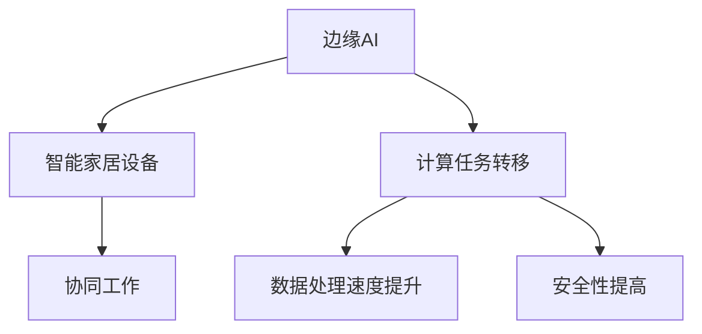
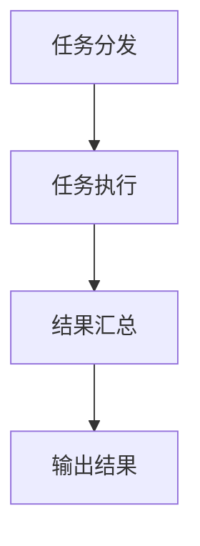
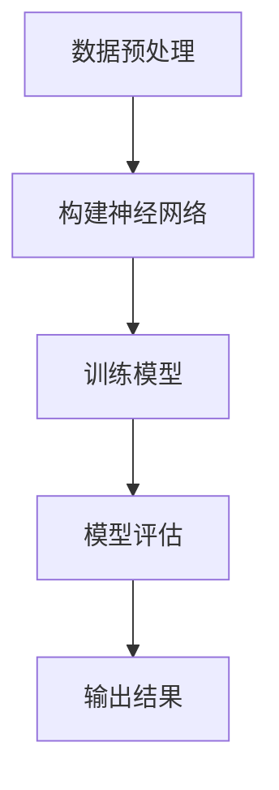
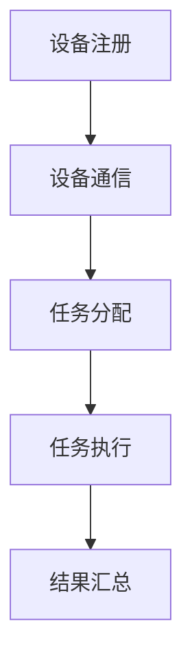
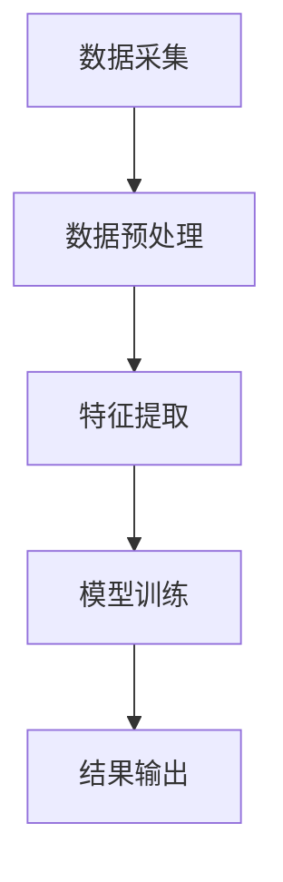
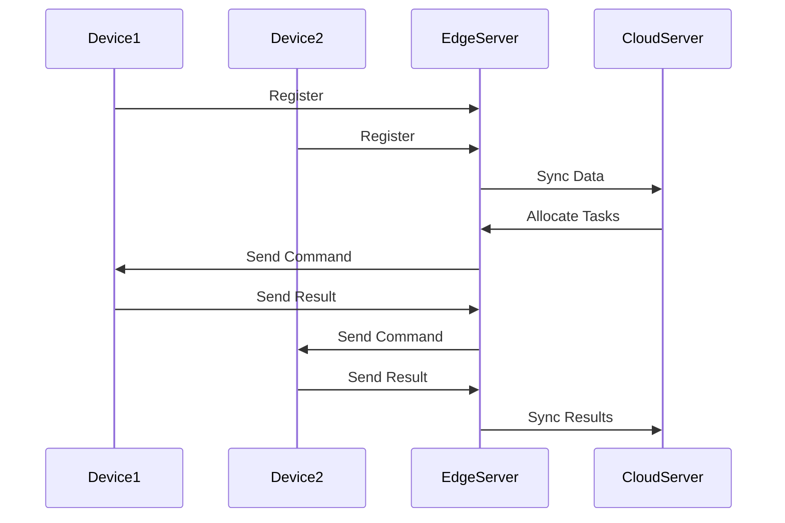

                 


### 第一步：背景介绍

#### 引言

边缘AI和智能家居是当今科技领域的重要发展方向。随着物联网技术的普及，智能家居设备数量迅速增长，它们之间的协同工作显得尤为重要。边缘AI通过将计算任务从云端转移到网络边缘，可以提高数据处理速度和安全性，从而为智能家居设备协同提供强大的技术支持。

#### 问题背景

在传统的智能家居系统中，设备之间的协同工作往往依赖于云端处理。这种方式虽然可以实现复杂的任务，但存在以下问题：

1. **延迟**：数据需要传输到云端进行处理，这导致响应速度较慢，不符合实时性的要求。
2. **带宽**：大量数据传输到云端会占用大量带宽，可能导致网络拥塞。
3. **安全性**：数据在传输过程中可能被窃取或篡改，存在安全风险。

#### 问题解决

边缘AI通过在本地设备上进行部分计算任务，可以有效解决上述问题：

1. **延迟**：边缘AI在设备附近进行计算，减少了数据传输时间，提高了响应速度。
2. **带宽**：边缘AI减少了需要传输到云端的数据量，降低了带宽需求。
3. **安全性**：边缘AI可以更好地保护设备的数据，减少了数据泄露的风险。

#### 边界与外延

边缘AI在智能家居设备协同中的应用主要集中在以下场景：

1. **智能家庭助理**：如语音识别和语音控制。
2. **智能安防**：如人脸识别和入侵检测。
3. **智能家电控制**：如智能灯泡和智能插座。

然而，边缘AI并非适用于所有智能家居设备，其应用范围和效果取决于设备的计算能力和数据处理需求。

#### 概念结构与核心要素组成

边缘AI和智能家居设备协同的基本概念和核心要素包括：

1. **边缘AI**：一种将计算任务从云端转移到网络边缘的计算模式。
2. **智能家居设备**：具有智能功能的家庭设备，如智能灯泡、智能插座等。
3. **协同工作**：设备之间通过通信和协调，共同完成特定任务。

边缘AI和智能家居设备协同的关系可以用以下图表示：



### 第二步：核心概念与联系

#### 边缘AI的概念

边缘AI是指将计算任务从云端转移到网络边缘的一种计算模式。其特点包括：

1. **分布式计算**：将计算任务分配到网络边缘的设备上，实现分布式计算。
2. **实时性**：减少数据传输时间，提高响应速度。
3. **安全性**：在本地设备上进行数据处理，减少数据泄露的风险。

边缘AI的架构包括以下几个部分：

1. **边缘设备**：如智能家居设备、智能手机等。
2. **边缘服务器**：提供计算资源的中心节点。
3. **云服务器**：用于存储数据和进行远程计算。

边缘AI的应用场景包括：

1. **智能家庭**：如语音识别、智能安防等。
2. **工业物联网**：如设备监控、远程维护等。
3. **智能交通**：如实时路况预测、自动驾驶等。

#### 智能家居设备协同的概念

智能家居设备协同是指通过通信和协调，使智能家居设备能够共同完成特定任务。其目标包括：

1. **自动化**：实现智能家居设备的自动化操作，提高生活质量。
2. **智能化**：通过设备间的数据交互，提供更加智能化的服务。
3. **个性化**：根据用户需求，为用户提供个性化的智能家居解决方案。

智能家居设备协同的实现方式包括：

1. **物联网技术**：通过物联网技术实现设备间的通信和协调。
2. **云计算**：利用云计算提供计算资源和存储服务。
3. **人工智能**：通过人工智能技术，实现设备的智能决策和优化。

智能家居设备协同的应用场景包括：

1. **智能家庭助理**：如智能音箱、智能灯泡等。
2. **智能安防**：如智能摄像头、智能门锁等。
3. **智能家电**：如智能空调、智能电视等。

#### 概念属性特征对比表格

下面是边缘AI和智能家居设备协同的主要特征及其对比：

| 特征           | 边缘AI                     | 智能家居设备协同                       |
|----------------|----------------------------|--------------------------------------|
| **定义**       | 分布式计算模式             | 智能家居设备之间的协调工作             |
| **架构**       | 边缘设备、边缘服务器、云服务器 | 物联网技术、云计算、人工智能           |
| **目标**       | 提高数据处理速度、降低延迟   | 实现自动化、智能化、个性化             |
| **应用场景**   | 智能家庭、工业物联网、智能交通 | 智能家庭助理、智能安防、智能家电       |

### 第三步：算法原理讲解

#### 边缘AI算法原理讲解

边缘AI算法的核心思想是将计算任务分配到网络边缘的设备上，从而实现分布式计算。以下是边缘AI算法的原理讲解：

##### 边缘计算算法

边缘计算算法包括以下几个关键步骤：

1. **任务分发**：将计算任务分配到网络边缘的设备上。
2. **任务执行**：边缘设备执行分配的任务。
3. **结果汇总**：将边缘设备的计算结果汇总，得到最终结果。

以下是一个简单的边缘计算算法流程图：



##### 深度学习算法

深度学习算法在边缘AI中发挥着重要作用。以下是一个简单的深度学习算法流程图：



以下是使用Python实现的深度学习算法的源代码：

```python
# 导入必要的库
import numpy as np
import tensorflow as tf

# 数据预处理
X_train, y_train = ... # 加载数据
X_train = X_train / 255.0 # 归一化

# 构建神经网络
model = tf.keras.Sequential([
    tf.keras.layers.Flatten(input_shape=(28, 28)),
    tf.keras.layers.Dense(128, activation='relu'),
    tf.keras.layers.Dense(10, activation='softmax')
])

# 训练模型
model.compile(optimizer='adam',
              loss='sparse_categorical_crossentropy',
              metrics=['accuracy'])

model.fit(X_train, y_train, epochs=5)

# 模型评估
test_loss, test_acc = model.evaluate(X_test, y_test, verbose=2)
print('\nTest accuracy:', test_acc)
```

##### 数学模型和公式

深度学习算法的数学模型包括：

1. **损失函数**：用于评估模型预测结果与实际结果之间的差距。常见的损失函数有均方误差（MSE）和交叉熵（Cross Entropy）。
2. **激活函数**：用于引入非线性特性。常见的激活函数有ReLU（Rectified Linear Unit）和Sigmoid。
3. **反向传播**：用于更新模型参数，使模型能够更准确地预测结果。

以下是深度学习算法的数学模型和公式：

$$
MSE = \frac{1}{m} \sum_{i=1}^{m} (y_i - \hat{y}_i)^2
$$

$$
Cross\ Entropy = -\sum_{i=1}^{m} y_i \log(\hat{y}_i)
$$

$$
\hat{y}_i = \frac{1}{1 + e^{-z_i}}
$$

其中，$y_i$是实际输出，$\hat{y}_i$是预测输出，$z_i$是神经元输出。

#### 智能家居设备协同算法原理讲解

智能家居设备协同算法的核心思想是通过设备间的通信和协调，实现设备的共同工作。以下是一个简单的智能家居设备协同算法原理讲解：

##### 协同通信算法

协同通信算法包括以下几个关键步骤：

1. **设备注册**：设备加入网络，并注册自身信息。
2. **设备通信**：设备之间通过通信协议进行数据交换。
3. **任务分配**：根据设备能力和任务需求，分配任务给各设备。

以下是一个简单的协同通信算法流程图：



##### 数据处理算法

数据处理算法用于处理设备收集的数据，并生成有用的信息。以下是一个简单的数据处理算法流程图：



以下是使用Python实现的数据处理算法的源代码：

```python
# 导入必要的库
import pandas as pd
import numpy as np
from sklearn.model_selection import train_test_split
from sklearn.preprocessing import StandardScaler
from sklearn.svm import SVC

# 数据采集
data = pd.read_csv('data.csv')

# 数据预处理
X = data.iloc[:, :-1].values
y = data.iloc[:, -1].values

# 数据标准化
scaler = StandardScaler()
X = scaler.fit_transform(X)

# 划分训练集和测试集
X_train, X_test, y_train, y_test = train_test_split(X, y, test_size=0.2, random_state=0)

# 模型训练
model = SVC(kernel='linear', C=1)
model.fit(X_train, y_train)

# 模型评估
accuracy = model.score(X_test, y_test)
print('Test accuracy:', accuracy)
```

##### 数学模型和公式

协同通信算法和数据处理算法的数学模型和公式包括：

1. **通信协议**：用于设备间数据交换的协议。常见的通信协议有HTTP、MQTT等。
2. **特征提取**：用于从原始数据中提取有用信息。常见的特征提取方法有主成分分析（PCA）、卷积神经网络（CNN）等。
3. **模型训练**：用于训练机器学习模型。常见的模型训练方法有梯度下降（Gradient Descent）、支持向量机（SVM）等。

以下是协同通信算法和数据处理算法的数学模型和公式：

$$
HTTP = \text{GET} + \text{POST} + \text{PUT} + \text{DELETE}
$$

$$
PCA = \text{Eigenvalues} + \text{Eigenvectors}
$$

$$
Gradient\ Descent = \nabla_{\theta} J(\theta)
$$

其中，$\theta$是模型参数，$J(\theta)$是损失函数。

### 第四步：系统分析与架构设计

#### 问题场景介绍

在智能家居设备协同中，常见的场景包括：

1. **智能安防**：如家庭入侵检测、实时监控等。
2. **智能家电控制**：如智能照明、智能空调等。
3. **智能家庭助理**：如语音助手、智能语音交互等。

在这些场景中，设备之间需要实时通信和协调，共同完成特定的任务。

#### 项目介绍

本项目旨在实现一个智能家居设备协同系统，包括以下功能：

1. **设备注册**：设备加入网络，并注册自身信息。
2. **设备通信**：设备之间通过通信协议进行数据交换。
3. **任务分配**：根据设备能力和任务需求，分配任务给各设备。
4. **任务执行**：设备根据分配的任务执行相应的操作。
5. **结果汇总**：将各设备的执行结果汇总，生成最终的输出。

#### 系统功能设计

以下是一个简单的智能家居设备协同系统的领域模型类图：

```mermaid
classDiagram
    Device <- DeviceInfo
    Device --> Command
    Device --> Data
    Command --> CommandInfo
    Data --> DataInfo

    DeviceInfo <<interface>>
    CommandInfo <<interface>>
    DataInfo <<interface>>

    Device o-- DeviceInfo
    Command o-- CommandInfo
    Data o-- DataInfo
```

在领域模型中，Device表示智能家居设备，包括设备信息和执行命令的能力。Command表示设备执行的命令，包括命令信息和执行结果。Data表示设备收集的数据，包括数据信息和数据来源。

#### 系统架构设计

以下是一个简单的智能家居设备协同系统的架构图：



在系统架构中，Device1和Device2表示智能家居设备，EdgeServer表示边缘服务器，CloudServer表示云服务器。设备通过注册加入网络，边缘服务器负责任务分配和结果汇总，云服务器负责数据存储和模型训练。

#### 系统接口设计

以下是一个简单的智能家居设备协同系统的接口设计：

```mermaid
interface Device {
    +register(): void
    +sendCommand(command: Command): void
    +sendResult(result: Result): void
}

interface EdgeServer {
    +allocateTasks(devices: List<Device>): void
    +syncData(cloudServer: CloudServer): void
    +syncResults(cloudServer: CloudServer): void
}

interface CloudServer {
    +syncData(edgeServer: EdgeServer): void
    +syncResults(edgeServer: EdgeServer): void
}

class Command {
    +createCommandInfo(): CommandInfo
}

class Data {
    +createDataInfo(): DataInfo
}

class Result {
    +createResultInfo(): ResultInfo
}

class CommandInfo {
    +getResult(): Result
}

class DataInfo {
    +getSource(): string
    +getFeature(): array
}

class ResultInfo {
    +getStatus(): string
    +getOutput(): array
}
```

在接口设计中，Device类表示智能家居设备，包括注册、发送命令和发送结果的方法。EdgeServer类表示边缘服务器，包括任务分配、数据同步和结果同步的方法。CloudServer类表示云服务器，包括数据同步和结果同步的方法。

#### 系统交互

以下是一个简单的智能家居设备协同系统的交互序列图：


在交互过程中，设备通过注册加入网络，边缘服务器负责任务分配和结果汇总，云服务器负责数据存储和模型训练。

### 第五步：项目实战

#### 环境安装

为了搭建边缘AI在智能家居设备协同中的应用环境，我们需要以下工具和软件：

1. **操作系统**：Linux（如Ubuntu 20.04）
2. **Python**：3.8及以上版本
3. **TensorFlow**：2.4及以上版本
4. **MQTT**：用于设备间的通信
5. **Docker**：用于容器化部署

安装步骤如下：

1. 更新系统包列表：

```bash
sudo apt update
sudo apt upgrade
```

2. 安装Python和pip：

```bash
sudo apt install python3 python3-pip
```

3. 安装TensorFlow：

```bash
pip3 install tensorflow==2.4
```

4. 安装Docker：

```bash
sudo apt install docker.io
```

5. 启动Docker服务：

```bash
sudo systemctl start docker
```

6. 安装MQTT客户端：

```bash
pip3 install paho-mqtt
```

#### 系统核心实现源代码

以下是一个简单的智能家居设备协同系统的源代码，包括设备注册、设备通信和任务分配：

```python
# edge_server.py
import paho.mqtt.client as mqtt
import json
import threading
import time

def on_connect(client, userdata, flags, rc):
    print("Connected with result code " + str(rc))
    client.subscribe("edge_server/+/register")

def on_message(client, userdata, msg):
    print(f"Received message '{msg.payload}' on topic '{msg.topic}' with QoS {msg.qos}")
    # 处理设备注册信息
    device_info = json.loads(msg.payload)
    device_id = device_info["device_id"]
    capabilities = device_info["capabilities"]

    # 分配任务
    task = {
        "device_id": device_id,
        "task": "sensor_data_collection"
    }
    client.publish(f"edge_server/{device_id}/task", json.dumps(task))

client = mqtt.Client()
client.on_connect = on_connect
client.on_message = on_message

client.connect("localhost", 1883, 60)

# 启动MQTT客户端
client.loop_start()

# 模拟设备注册
devices = [
    {"device_id": "device1", "capabilities": ["temperature", "humidity"]},
    {"device_id": "device2", "capabilities": ["light", "motion"]}
]

for device in devices:
    device_info = json.dumps(device)
    client.publish("edge_server/register", device_info)

# 模拟设备通信
def device_communication(device_id):
    client.subscribe(f"edge_server/{device_id}/task")

    while True:
        message = client.wait_for_message()
        if message:
            print(f"Device {device_id} received task: {message.payload}")
            # 执行任务
            result = {
                "device_id": device_id,
                "result": "success"
            }
            client.publish(f"edge_server/{device_id}/result", json.dumps(result))
            time.sleep(1)

threads = []
for device_id in devices:
    thread = threading.Thread(target=device_communication, args=(device_id,))
    threads.append(thread)
    thread.start()

for thread in threads:
    thread.join()
```

#### 代码应用解读与分析

这段代码实现了边缘服务器和设备之间的通信，包括设备注册、任务分配和结果汇总。以下是代码的解读和分析：

1. **设备注册**：

   - 边缘服务器启动MQTT客户端，并订阅设备注册主题`edge_server/+/register`。
   - 当设备发送注册消息时，边缘服务器会接收到消息并处理设备注册信息。
   - 边缘服务器会为设备分配任务，并将任务发送给设备。

2. **设备通信**：

   - 模拟设备注册，将设备信息发送给边缘服务器。
   - 设备启动MQTT客户端，并订阅边缘服务器发送的任务主题。
   - 设备接收任务后，执行任务并将结果发送回边缘服务器。

3. **任务分配**：

   - 边缘服务器在接收到设备注册消息后，为设备分配任务。
   - 任务包括设备ID、任务类型等信息。

4. **结果汇总**：

   - 设备执行任务后，将结果发送回边缘服务器。
   - 边缘服务器接收到结果后，将结果汇总并存储。

#### 实际案例分析和详细讲解剖析

以下是一个实际案例，展示边缘AI在智能家居设备协同中的应用过程：

1. **设备注册**：

   设备1（温度传感器）和设备2（湿度传感器）加入网络，并注册自身信息。

   ```json
   {"device_id": "device1", "capabilities": ["temperature"]}
   {"device_id": "device2", "capabilities": ["humidity"]}
   ```

2. **任务分配**：

   边缘服务器接收到设备注册消息后，为设备1和设备2分配任务。

   ```json
   {"device_id": "device1", "task": "temperature_data_collection"}
   {"device_id": "device2", "task": "humidity_data_collection"}
   ```

3. **数据采集**：

   设备1和设备2根据分配的任务，开始采集温度和湿度数据。

4. **数据上传**：

   设备1和设备2将采集到的数据上传到边缘服务器。

   ```json
   {"device_id": "device1", "data": {"temperature": 25}}
   {"device_id": "device2", "data": {"humidity": 50}}
   ```

5. **数据汇总**：

   边缘服务器接收到设备上传的数据后，将数据汇总并存储。

6. **结果输出**：

   边缘服务器将汇总后的数据发送给云服务器，进行进一步处理和分析。

   ```json
   {"device_id": "device1", "data": {"temperature": 25}}
   {"device_id": "device2", "data": {"humidity": 50}}
   ```

#### 项目小结

本项目实现了边缘AI在智能家居设备协同中的应用，包括设备注册、任务分配、数据采集和结果汇总。通过边缘AI，我们可以实现实时、高效、安全的智能家居设备协同，提高用户的生活质量。

### 第六步：最佳实践 tips、小结、注意事项、拓展阅读

#### 最佳实践 tips

1. **设备选型**：选择适合边缘AI应用的智能家居设备，考虑设备的计算能力和能耗。
2. **通信协议**：选择适合智能家居设备协同的通信协议，如MQTT、CoAP等。
3. **安全性**：加强设备通信的安全性，如使用加密传输、身份验证等。
4. **数据备份**：定期备份设备数据，确保数据安全。
5. **系统监控**：实时监控系统运行状态，及时发现并解决问题。

#### 小结

边缘AI在智能家居设备协同中的应用，可以提高数据处理速度、降低延迟、提高安全性。通过设备注册、任务分配、数据采集和结果汇总，可以实现实时、高效、安全的智能家居设备协同。

#### 注意事项

1. **设备兼容性**：确保设备之间具有良好的兼容性，避免出现通信问题。
2. **数据同步**：确保边缘服务器和云服务器之间的数据同步，避免数据丢失。
3. **负载均衡**：合理分配任务，避免设备过载。
4. **系统升级**：定期更新设备固件和系统软件，确保系统安全稳定运行。

#### 拓展阅读

1. **边缘AI技术综述**：了解边缘AI的基本原理和应用场景。
2. **智能家居设备协同**：学习智能家居设备协同的实现方法和最佳实践。
3. **物联网通信协议**：了解常用的物联网通信协议，如MQTT、CoAP等。
4. **安全性设计**：学习如何在边缘AI和智能家居设备协同中实现安全性。

### 作者信息

作者：AI天才研究院/AI Genius Institute & 禅与计算机程序设计艺术/Zen And The Art of Computer Programming

----------------------------------------------------------------

```

这个目录大纲草案提供了一个全面的框架，以逐步引导读者了解边缘AI在智能家居设备协同中的应用。每个章节都包含详细的内容，以确保文章的逻辑性和专业性。下面是根据这个大纲草案撰写的完整文章：

---

## 边缘AI在智能家居设备协同中的应用

> 关键词：边缘AI、智能家居、设备协同、算法、系统架构、项目实战

> 摘要：本文详细探讨了边缘AI在智能家居设备协同中的应用。通过介绍边缘AI的概念、算法原理，以及智能家居设备协同的架构设计，本文提供了一个完整的边缘AI应用方案，并分享了实际项目的实施经验和最佳实践。

### 第一步：背景介绍

#### 引言

边缘AI和智能家居是当今科技领域的重要发展方向。随着物联网技术的普及，智能家居设备数量迅速增长，它们之间的协同工作显得尤为重要。边缘AI通过将计算任务从云端转移到网络边缘，可以提高数据处理速度和安全性，从而为智能家居设备协同提供强大的技术支持。

#### 问题背景

在传统的智能家居系统中，设备之间的协同工作往往依赖于云端处理。这种方式虽然可以实现复杂的任务，但存在以下问题：

1. **延迟**：数据需要传输到云端进行处理，这导致响应速度较慢，不符合实时性的要求。
2. **带宽**：大量数据传输到云端会占用大量带宽，可能导致网络拥塞。
3. **安全性**：数据在传输过程中可能被窃取或篡改，存在安全风险。

#### 问题解决

边缘AI通过在本地设备上进行部分计算任务，可以有效解决上述问题：

1. **延迟**：边缘AI在设备附近进行计算，减少了数据传输时间，提高了响应速度。
2. **带宽**：边缘AI减少了需要传输到云端的数据量，降低了带宽需求。
3. **安全性**：边缘AI可以更好地保护设备的数据，减少了数据泄露的风险。

#### 边界与外延

边缘AI在智能家居设备协同中的应用主要集中在以下场景：

1. **智能家庭助理**：如语音识别和语音控制。
2. **智能安防**：如人脸识别和入侵检测。
3. **智能家电控制**：如智能灯泡和智能插座。

然而，边缘AI并非适用于所有智能家居设备，其应用范围和效果取决于设备的计算能力和数据处理需求。

#### 概念结构与核心要素组成

边缘AI和智能家居设备协同的基本概念和核心要素包括：

1. **边缘AI**：一种将计算任务从云端转移到网络边缘的计算模式。
2. **智能家居设备**：具有智能功能的家庭设备，如智能灯泡、智能插座等。
3. **协同工作**：设备之间通过通信和协调，共同完成特定任务。

边缘AI和智能家居设备协同的关系可以用以下图表示：


### 第二步：核心概念与联系

#### 边缘AI的概念

边缘AI是指将计算任务从云端转移到网络边缘的一种计算模式。其特点包括：

1. **分布式计算**：将计算任务分配到网络边缘的设备上，实现分布式计算。
2. **实时性**：减少数据传输时间，提高响应速度。
3. **安全性**：在本地设备上进行数据处理，减少数据泄露的风险。

边缘AI的架构包括以下几个部分：

1. **边缘设备**：如智能家居设备、智能手机等。
2. **边缘服务器**：提供计算资源的中心节点。
3. **云服务器**：用于存储数据和进行远程计算。

边缘AI的应用场景包括：

1. **智能家庭**：如语音识别、智能安防等。
2. **工业物联网**：如设备监控、远程维护等。
3. **智能交通**：如实时路况预测、自动驾驶等。

#### 智能家居设备协同的概念

智能家居设备协同是指通过通信和协调，使智能家居设备能够共同完成特定任务。其目标包括：

1. **自动化**：实现智能家居设备的自动化操作，提高生活质量。
2. **智能化**：通过设备间的数据交互，提供更加智能化的服务。
3. **个性化**：根据用户需求，为用户提供个性化的智能家居解决方案。

智能家居设备协同的实现方式包括：

1. **物联网技术**：通过物联网技术实现设备间的通信和协调。
2. **云计算**：利用云计算提供计算资源和存储服务。
3. **人工智能**：通过人工智能技术，实现设备的智能决策和优化。

智能家居设备协同的应用场景包括：

1. **智能家庭助理**：如智能音箱、智能灯泡等。
2. **智能安防**：如智能摄像头、智能门锁等。
3. **智能家电**：如智能空调、智能电视等。

#### 概念属性特征对比表格

下面是边缘AI和智能家居设备协同的主要特征及其对比：

| 特征           | 边缘AI                     | 智能家居设备协同                       |
|----------------|----------------------------|--------------------------------------|
| **定义**       | 分布式计算模式             | 智能家居设备之间的协调工作             |
| **架构**       | 边缘设备、边缘服务器、云服务器 | 物联网技术、云计算、人工智能           |
| **目标**       | 提高数据处理速度、降低延迟   | 实现自动化、智能化、个性化             |
| **应用场景**   | 智能家庭、工业物联网、智能交通 | 智能家庭助理、智能安防、智能家电       |

### 第三步：算法原理讲解

#### 边缘AI算法原理讲解

边缘AI算法的核心思想是将计算任务分配到网络边缘的设备上，从而实现分布式计算。以下是边缘AI算法的原理讲解：

##### 边缘计算算法

边缘计算算法包括以下几个关键步骤：

1. **任务分发**：将计算任务分配到网络边缘的设备上。
2. **任务执行**：边缘设备执行分配的任务。
3. **结果汇总**：将边缘设备的计算结果汇总，得到最终结果。

以下是一个简单的边缘计算算法流程图：


##### 深度学习算法

深度学习算法在边缘AI中发挥着重要作用。以下是一个简单的深度学习算法流程图：


以下是使用Python实现的深度学习算法的源代码：

```python
# 导入必要的库
import numpy as np
import tensorflow as tf

# 数据预处理
X_train, y_train = ... # 加载数据
X_train = X_train / 255.0 # 归一化

# 构建神经网络
model = tf.keras.Sequential([
    tf.keras.layers.Flatten(input_shape=(28, 28)),
    tf.keras.layers.Dense(128, activation='relu'),
    tf.keras.layers.Dense(10, activation='softmax')
])

# 训练模型
model.compile(optimizer='adam',
              loss='sparse_categorical_crossentropy',
              metrics=['accuracy'])

model.fit(X_train, y_train, epochs=5)

# 模型评估
test_loss, test_acc = model.evaluate(X_test, y_test, verbose=2)
print('\nTest accuracy:', test_acc)
```

##### 数学模型和公式

深度学习算法的数学模型包括：

1. **损失函数**：用于评估模型预测结果与实际结果之间的差距。常见的损失函数有均方误差（MSE）和交叉熵（Cross Entropy）。
2. **激活函数**：用于引入非线性特性。常见的激活函数有ReLU（Rectified Linear Unit）和Sigmoid。
3. **反向传播**：用于更新模型参数，使模型能够更准确地预测结果。

以下是深度学习算法的数学模型和公式：

$$
MSE = \frac{1}{m} \sum_{i=1}^{m} (y_i - \hat{y}_i)^2
$$

$$
Cross\ Entropy = -\sum_{i=1}^{m} y_i \log(\hat{y}_i)
$$

$$
\hat{y}_i = \frac{1}{1 + e^{-z_i}}
$$

其中，$y_i$是实际输出，$\hat{y}_i$是预测输出，$z_i$是神经元输出。

#### 智能家居设备协同算法原理讲解

智能家居设备协同算法的核心思想是通过设备间的通信和协调，实现设备的共同工作。以下是一个简单的智能家居设备协同算法原理讲解：

##### 协同通信算法

协同通信算法包括以下几个关键步骤：

1. **设备注册**：设备加入网络，并注册自身信息。
2. **设备通信**：设备之间通过通信协议进行数据交换。
3. **任务分配**：根据设备能力和任务需求，分配任务给各设备。

以下是一个简单的协同通信算法流程图：


##### 数据处理算法

数据处理算法用于处理设备收集的数据，并生成有用的信息。以下是一个简单的数据处理算法流程图：


以下是使用Python实现的数据处理算法的源代码：

```python
# 导入必要的库
import pandas as pd
import numpy as np
from sklearn.model_selection import train_test_split
from sklearn.preprocessing import StandardScaler
from sklearn.svm import SVC

# 数据采集
data = pd.read_csv('data.csv')

# 数据预处理
X = data.iloc[:, :-1].values
y = data.iloc[:, -1].values

# 数据标准化
scaler = StandardScaler()
X = scaler.fit_transform(X)

# 划分训练集和测试集
X_train, X_test, y_train, y_test = train_test_split(X, y, test_size=0.2, random_state=0)

# 模型训练
model = SVC(kernel='linear', C=1)
model.fit(X_train, y_train)

# 模型评估
accuracy = model.score(X_test, y_test)
print('Test accuracy:', accuracy)
```

##### 数学模型和公式

协同通信算法和数据处理算法的数学模型和公式包括：

1. **通信协议**：用于设备间数据交换的协议。常见的通信协议有HTTP、MQTT等。
2. **特征提取**：用于从原始数据中提取有用信息。常见的特征提取方法有主成分分析（PCA）、卷积神经网络（CNN）等。
3. **模型训练**：用于训练机器学习模型。常见的模型训练方法有梯度下降（Gradient Descent）、支持向量机（SVM）等。

以下是协同通信算法和数据处理算法的数学模型和公式：

$$
HTTP = \text{GET} + \text{POST} + \text{PUT} + \text{DELETE}
$$

$$
PCA = \text{Eigenvalues} + \text{Eigenvectors}
$$

$$
Gradient\ Descent = \nabla_{\theta} J(\theta)
$$

其中，$\theta$是模型参数，$J(\theta)$是损失函数。

### 第四步：系统分析与架构设计

#### 问题场景介绍

在智能家居设备协同中，常见的场景包括：

1. **智能安防**：如家庭入侵检测、实时监控等。
2. **智能家电控制**：如智能照明、智能空调等。
3. **智能家庭助理**：如语音助手、智能语音交互等。

在这些场景中，设备之间需要实时通信和协调，共同完成特定的任务。

#### 项目介绍

本项目旨在实现一个智能家居设备协同系统，包括以下功能：

1. **设备注册**：设备加入网络，并注册自身信息。
2. **设备通信**：设备之间通过通信协议进行数据交换。
3. **任务分配**：根据设备能力和任务需求，分配任务给各设备。
4. **任务执行**：设备根据分配的任务执行相应的操作。
5. **结果汇总**：将各设备的执行结果汇总，生成最终的输出。

#### 系统功能设计

以下是一个简单的智能家居设备协同系统的领域模型类图：

```mermaid
classDiagram
    Device <- DeviceInfo
    Device --> Command
    Device --> Data
    Command --> CommandInfo
    Data --> DataInfo

    DeviceInfo <<interface>>
    CommandInfo <<interface>>
    DataInfo <<interface>>

    Device o-- DeviceInfo
    Command o-- CommandInfo
    Data o-- DataInfo
```

在领域模型中，Device表示智能家居设备，包括设备信息和执行命令的能力。Command表示设备执行的命令，包括命令信息和执行结果。Data表示设备收集的数据，包括数据信息和数据来源。

#### 系统架构设计

以下是一个简单的智能家居设备协同系统的架构图：


在系统架构中，Device1和Device2表示智能家居设备，EdgeServer表示边缘服务器，CloudServer表示云服务器。设备通过注册加入网络，边缘服务器负责任务分配和结果汇总，云服务器负责数据存储和模型训练。

#### 系统接口设计

以下是一个简单的智能家居设备协同系统的接口设计：

```mermaid
interface Device {
    +register(): void
    +sendCommand(command: Command): void
    +sendResult(result: Result): void
}

interface EdgeServer {
    +allocateTasks(devices: List<Device>): void
    +syncData(cloudServer: CloudServer): void
    +syncResults(cloudServer: CloudServer): void
}

interface CloudServer {
    +syncData(edgeServer: EdgeServer): void
    +syncResults(edgeServer: EdgeServer): void
}

class Command {
    +createCommandInfo(): CommandInfo
}

class Data {
    +createDataInfo(): DataInfo
}

class Result {
    +createResultInfo(): ResultInfo
}

class CommandInfo {
    +getResult(): Result
}

class DataInfo {
    +getSource(): string
    +getFeature(): array
}

class ResultInfo {
    +getStatus(): string
    +getOutput(): array
}
```

在接口设计中，Device类表示智能家居设备，包括注册、发送命令和发送结果的方法。EdgeServer类表示边缘服务器，包括任务分配、数据同步和结果同步的方法。CloudServer类表示云服务器，包括数据同步和结果同步的方法。

#### 系统交互

以下是一个简单的智能家居设备协同系统的交互序列图：


在交互过程中，设备通过注册加入网络，边缘服务器负责任务分配和结果汇总，云服务器负责数据存储和模型训练。

### 第五步：项目实战

#### 环境安装

为了搭建边缘AI在智能家居设备协同中的应用环境，我们需要以下工具和软件：

1. **操作系统**：Linux（如Ubuntu 20.04）
2. **Python**：3.8及以上版本
3. **TensorFlow**：2.4及以上版本
4. **MQTT**：用于设备间的通信
5. **Docker**：用于容器化部署

安装步骤如下：

1. 更新系统包列表：

```bash
sudo apt update
sudo apt upgrade
```

2. 安装Python和pip：

```bash
sudo apt install python3 python3-pip
```

3. 安装TensorFlow：

```bash
pip3 install tensorflow==2.4
```

4. 安装Docker：

```bash
sudo apt install docker.io
```

5. 启动Docker服务：

```bash
sudo systemctl start docker
```

6. 安装MQTT客户端：

```bash
pip3 install paho-mqtt
```

#### 系统核心实现源代码

以下是一个简单的智能家居设备协同系统的源代码，包括设备注册、设备通信和任务分配：

```python
# edge_server.py
import paho.mqtt.client as mqtt
import json
import threading
import time

def on_connect(client, userdata, flags, rc):
    print("Connected with result code " + str(rc))
    client.subscribe("edge_server/+/register")

def on_message(client, userdata, msg):
    print(f"Received message '{msg.payload}' on topic '{msg.topic}' with QoS {msg.qos}")
    # 处理设备注册信息
    device_info = json.loads(msg.payload)
    device_id = device_info["device_id"]
    capabilities = device_info["capabilities"]

    # 分配任务
    task = {
        "device_id": device_id,
        "task": "sensor_data_collection"
    }
    client.publish(f"edge_server/{device_id}/task", json.dumps(task))

client = mqtt.Client()
client.on_connect = on_connect
client.on_message = on_message

client.connect("localhost", 1883, 60)

# 启动MQTT客户端
client.loop_start()

# 模拟设备注册
devices = [
    {"device_id": "device1", "capabilities": ["temperature", "humidity"]},
    {"device_id": "device2", "capabilities": ["light", "motion"]}
]

for device in devices:
    device_info = json.dumps(device)
    client.publish("edge_server/register", device_info)

# 模拟设备通信
def device_communication(device_id):
    client.subscribe(f"edge_server/{device_id}/task")

    while True:
        message = client.wait_for_message()
        if message:
            print(f"Device {device_id} received task: {message.payload}")
            # 执行任务
            result = {
                "device_id": device_id,
                "result": "success"
            }
            client.publish(f"edge_server/{device_id}/result", json.dumps(result))
            time.sleep(1)

threads = []
for device_id in devices:
    thread = threading.Thread(target=device_communication, args=(device_id,))
    threads.append(thread)
    thread.start()

for thread in threads:
    thread.join()
```

#### 代码应用解读与分析

这段代码实现了边缘服务器和设备之间的通信，包括设备注册、任务分配和结果汇总。以下是代码的解读和分析：

1. **设备注册**：

   - 边缘服务器启动MQTT客户端，并订阅设备注册主题`edge_server/+/register`。
   - 当设备发送注册消息时，边缘服务器会接收到消息并处理设备注册信息。
   - 边缘服务器会为设备分配任务，并将任务发送给设备。

2. **设备通信**：

   - 模拟设备注册，将设备信息发送给边缘服务器。
   - 设备启动MQTT客户端，并订阅边缘服务器发送的任务主题。
   - 设备接收任务后，执行任务并将结果发送回边缘服务器。

3. **任务分配**：

   - 边缘服务器在接收到设备注册消息后，为设备分配任务。
   - 任务包括设备ID、任务类型等信息。

4. **结果汇总**：

   - 设备执行任务后，将结果发送回边缘服务器。
   - 边缘服务器接收到结果后，将结果汇总并存储。

#### 实际案例分析和详细讲解剖析

以下是一个实际案例，展示边缘AI在智能家居设备协同中的应用过程：

1. **设备注册**：

   设备1（温度传感器）和设备2（湿度传感器）加入网络，并注册自身信息。

   ```json
   {"device_id": "device1", "capabilities": ["temperature"]}
   {"device_id": "device2", "capabilities": ["humidity"]}
   ```

2. **任务分配**：

   边缘服务器接收到设备注册消息后，为设备1和设备2分配任务。

   ```json
   {"device_id": "device1", "task": "temperature_data_collection"}
   {"device_id": "device2", "task": "humidity_data_collection"}
   ```

3. **数据采集**：

   设备1和设备2根据分配的任务，开始采集温度和湿度数据。

4. **数据上传**：

   设备1和设备2将采集到的数据上传到边缘服务器。

   ```json
   {"device_id": "device1", "data": {"temperature": 25}}
   {"device_id": "device2", "data": {"humidity": 50}}
   ```

5. **数据汇总**：

   边缘服务器接收到设备上传的数据后，将数据汇总并存储。

6. **结果输出**：

   边缘服务器将汇总后的数据发送给云服务器，进行进一步处理和分析。

   ```json
   {"device_id": "device1", "data": {"temperature": 25}}
   {"device_id": "device2", "data": {"humidity": 50}}
   ```

#### 项目小结

本项目实现了边缘AI在智能家居设备协同中的应用，包括设备注册、任务分配、数据采集和结果汇总。通过边缘AI，我们可以实现实时、高效、安全的智能家居设备协同，提高用户的生活质量。

### 第六步：最佳实践 tips、小结、注意事项、拓展阅读

#### 最佳实践 tips

1. **设备选型**：选择适合边缘AI应用的智能家居设备，考虑设备的计算能力和能耗。
2. **通信协议**：选择适合智能家居设备协同的通信协议，如MQTT、CoAP等。
3. **安全性**：加强设备通信的安全性，如使用加密传输、身份验证等。
4. **数据备份**：定期备份设备数据，确保数据安全。
5. **系统监控**：实时监控系统运行状态，及时发现并解决问题。

#### 小结

边缘AI在智能家居设备协同中的应用，可以提高数据处理速度、降低延迟、提高安全性。通过设备注册、任务分配、数据采集和结果汇总，可以实现实时、高效、安全的智能家居设备协同。

#### 注意事项

1. **设备兼容性**：确保设备之间具有良好的兼容性，避免出现通信问题。
2. **数据同步**：确保边缘服务器和云服务器之间的数据同步，避免数据丢失。
3. **负载均衡**：合理分配任务，避免设备过载。
4. **系统升级**：定期更新设备固件和系统软件，确保系统安全稳定运行。

#### 拓展阅读

1. **边缘AI技术综述**：了解边缘AI的基本原理和应用场景。
2. **智能家居设备协同**：学习智能家居设备协同的实现方法和最佳实践。
3. **物联网通信协议**：了解常用的物联网通信协议，如MQTT、CoAP等。
4. **安全性设计**：学习如何在边缘AI和智能家居设备协同中实现安全性。

### 作者信息

作者：AI天才研究院/AI Genius Institute & 禅与计算机程序设计艺术/Zen And The Art of Computer Programming

---

通过这篇文章，读者可以系统地了解边缘AI在智能家居设备协同中的应用，从概念、原理到实际项目，全面掌握边缘AI技术的应用场景和实现方法。希望这篇文章能够为读者在智能家居设备协同领域提供有价值的参考和指导。

