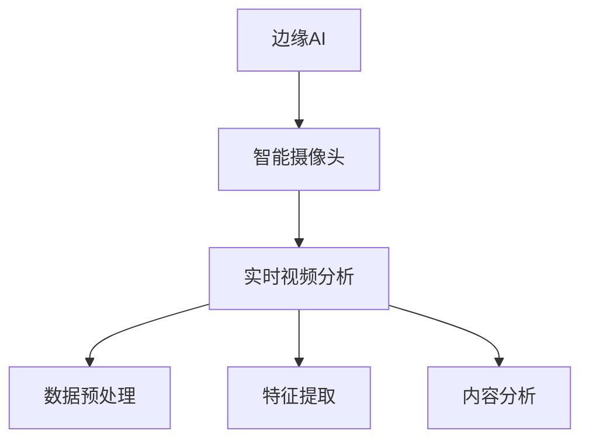
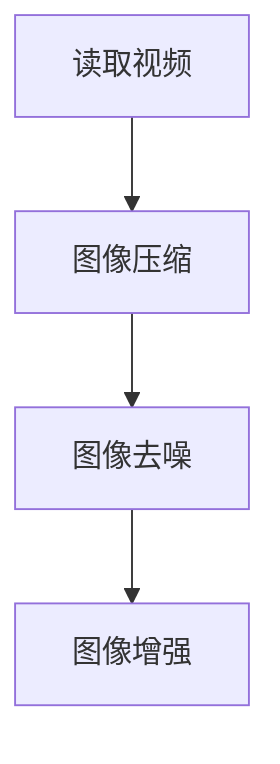
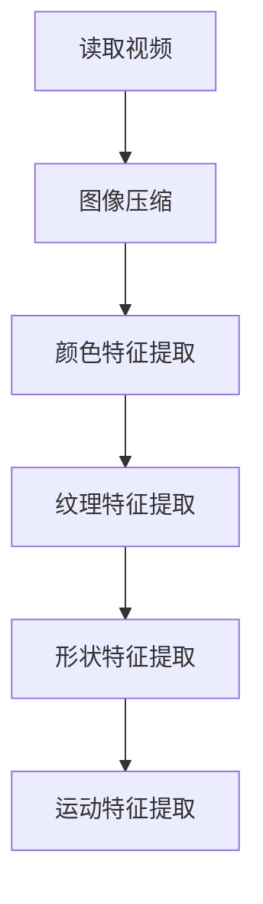
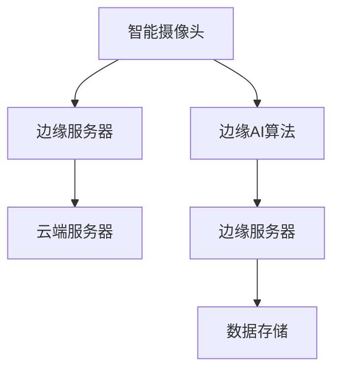

                 

### 边缘AI在智能摄像头中的应用：实现实时视频分析

#### 关键词：
边缘计算、人工智能、智能摄像头、实时视频分析、图像处理、深度学习

#### 摘要：
随着人工智能和物联网技术的不断发展，边缘AI在智能摄像头中的应用逐渐成为研究热点。本文将深入探讨边缘AI技术如何助力智能摄像头实现实时视频分析，从背景介绍、核心概念与联系、算法原理讲解、系统架构设计、项目实战等方面进行详细分析，旨在为读者提供全面的技术见解和实际应用指导。

---

### 第一部分：背景介绍

#### 1.1 边缘AI技术概述

##### 1.1.1 边缘AI的概念与优势

边缘AI指的是在数据生成的源头或附近进行处理和分析的人工智能技术。与传统的云计算相比，边缘AI具有以下优势：

1. **延迟更低**：数据处理和分析在本地进行，可以显著减少数据传输的延迟。
2. **带宽更低**：由于数据无需上传到云端，可以节省网络带宽。
3. **安全性更高**：本地处理可以减少数据泄露的风险。

##### 1.1.2 边缘AI的发展背景

边缘AI技术的兴起得益于物联网和5G网络的快速发展。随着物联网设备的普及，数据生成速度大幅提高，传统的云计算模式已经无法满足实时性和低延迟的需求。边缘AI因此成为了解决这一问题的有效手段。

##### 1.1.3 边缘AI的应用领域

边缘AI在多个领域都有广泛应用，包括但不限于：

1. **智能制造**：在工业自动化过程中，边缘AI可以实现实时故障检测和预测性维护。
2. **智慧城市**：在智能交通和安防监控中，边缘AI可以实现实时视频分析和行为识别。
3. **医疗健康**：在远程医疗中，边缘AI可以实时分析医疗影像，辅助医生进行诊断。

#### 1.2 智能摄像头的发展与应用

##### 1.2.1 智能摄像头的定义与功能

智能摄像头是一种集成了图像处理、通信和存储功能的设备，能够通过网络进行远程监控和数据传输。其功能主要包括：

1. **图像采集**：通过光学传感器捕捉实时图像。
2. **视频编码**：将图像转换为视频流，便于传输和存储。
3. **数据处理**：进行视频压缩、去噪和特征提取等预处理。
4. **通信传输**：将处理后的视频数据通过网络传输到云端或边缘服务器。
5. **存储管理**：对视频数据进行存储和索引，便于后续检索。

##### 1.2.2 智能摄像头的技术演进

智能摄像头技术经历了从传统摄像头到网络摄像头，再到智能摄像头的演进过程。随着边缘AI技术的发展，智能摄像头逐渐具备了更强的数据处理和分析能力。

##### 1.2.3 智能摄像头的应用场景

智能摄像头广泛应用于家庭、商业、工业和公共安全等领域，其应用场景包括：

1. **家庭安防**：实时监控家庭环境，提供安全防护。
2. **商业监控**：监控商业场所，提高安全管理效率。
3. **工业监控**：监控生产线，实现自动化和智能化生产。
4. **公共安全**：实时监控公共场所，提高治安管理水平。

#### 1.3 实时视频分析的重要性

##### 1.3.1 实时视频分析的概念

实时视频分析是一种利用计算机视觉和人工智能技术对视频数据进行分析和处理的方法，旨在从视频流中提取有用信息。

##### 1.3.2 实时视频分析的技术挑战

实时视频分析面临以下技术挑战：

1. **数据处理速度**：需要快速处理大量视频数据。
2. **准确性**：需要准确识别和分类视频中的对象。
3. **能耗与资源限制**：需要在有限的计算资源和能耗下实现高效处理。

##### 1.3.3 实时视频分析的应用价值

实时视频分析在多个领域具有广泛的应用价值，包括：

1. **安全监控**：实时监控和识别异常行为。
2. **智能交通**：实时监控交通流量和异常事件。
3. **智能制造**：实时监控生产线状态和质量。
4. **智能医疗**：实时分析医疗影像，辅助诊断和治疗。

#### 1.4 边缘AI在智能摄像头中的应用前景

##### 1.4.1 边缘AI在实时视频分析中的应用

边缘AI可以显著提升智能摄像头的实时视频分析能力，包括：

1. **图像增强**：通过边缘AI算法对图像进行增强，提高识别准确性。
2. **目标检测**：实时检测和识别视频中的对象。
3. **行为分析**：实时分析视频中的行为，实现智能响应。

##### 1.4.2 边缘AI在智能摄像头中的创新

边缘AI技术为智能摄像头带来了以下创新：

1. **智能交互**：通过语音和视觉交互，实现智能设备的自动化控制。
2. **个性化服务**：根据用户行为和偏好，提供个性化推荐和服务。
3. **实时优化**：通过实时数据分析和反馈，优化摄像头性能和算法。

##### 1.4.3 边缘AI应用的未来趋势

随着技术的不断进步，边缘AI在智能摄像头中的应用前景广阔，未来可能的发展趋势包括：

1. **智能化**：通过更先进的人工智能算法，实现更高层次的智能化。
2. **普及化**：随着成本的降低，边缘AI将在更广泛的场景中得到应用。
3. **协同化**：边缘AI与云计算相结合，实现更高效的协同处理。

#### 1.5 本章小结

本部分对边缘AI、智能摄像头和实时视频分析进行了背景介绍，分析了它们的发展背景和应用现状，为后续内容的深入探讨奠定了基础。

---

### 第二部分：核心概念与联系

#### 2.1 边缘AI核心概念

##### 2.1.1 边缘计算

边缘计算是指在靠近数据源或用户的地方进行数据处理和计算，以减少数据传输和延迟。与云计算相比，边缘计算具有以下特点：

1. **分布式计算**：计算资源分布在边缘设备上，可以更好地应对分布式数据处理需求。
2. **实时处理**：数据处理和分析在本地进行，可以显著降低延迟。
3. **低带宽需求**：由于数据在边缘设备上处理，可以减少数据传输的带宽需求。

##### 2.1.2 AI算法

AI算法是指用于模拟人类智能的计算机算法。边缘AI算法通常包括以下类型：

1. **机器学习**：通过训练模型来识别和分类数据。
2. **深度学习**：通过神经网络来模拟人类大脑的智能处理能力。
3. **强化学习**：通过试错和反馈来优化决策过程。

##### 2.1.3 边缘AI的优势与挑战

边缘AI的优势包括：

1. **低延迟**：数据处理在本地进行，可以显著降低延迟。
2. **低带宽需求**：数据无需上传到云端，可以节省网络带宽。
3. **安全性**：本地处理可以减少数据泄露的风险。

边缘AI的挑战包括：

1. **计算资源有限**：边缘设备通常计算资源有限，需要高效利用。
2. **算法复杂度**：边缘AI算法通常比云计算中的算法更复杂，需要优化。
3. **数据隐私**：在边缘设备上处理数据，需要确保数据隐私和安全。

#### 2.2 智能摄像头核心概念

##### 2.2.1 智能摄像头的组成

智能摄像头通常由以下几个部分组成：

1. **光学传感器**：用于捕捉图像。
2. **图像处理器**：用于处理和转换图像数据。
3. **通信模块**：用于传输图像数据。
4. **存储模块**：用于存储图像数据。
5. **AI模块**：用于运行AI算法，进行图像分析和识别。

##### 2.2.2 智能摄像头的工作原理

智能摄像头的工作原理如下：

1. **图像采集**：光学传感器捕捉实时图像。
2. **图像处理**：图像处理器对图像进行预处理，如压缩、去噪等。
3. **图像传输**：通信模块将处理后的图像数据传输到云端或边缘服务器。
4. **图像分析**：AI模块运行AI算法，对图像进行分析和识别。
5. **图像存储**：存储模块将分析结果进行存储，以便后续检索。

##### 2.2.3 智能摄像头的核心技术

智能摄像头的核心技术包括：

1. **图像处理技术**：用于对图像进行预处理和增强。
2. **计算机视觉技术**：用于图像分析和识别。
3. **通信技术**：用于传输图像数据。
4. **存储技术**：用于存储图像数据。
5. **边缘计算技术**：用于在边缘设备上进行数据处理和分析。

#### 2.3 实时视频分析核心概念

##### 2.3.1 视频数据预处理

视频数据预处理是实时视频分析的重要步骤，主要包括以下内容：

1. **图像压缩**：减小图像数据的大小，以节省存储和传输资源。
2. **图像去噪**：去除图像中的噪声，提高图像质量。
3. **图像增强**：增强图像的某些特征，如对比度和亮度等。

##### 2.3.2 视频特征提取

视频特征提取是从视频数据中提取有用的信息，以便进行后续分析。常见的特征提取方法包括：

1. **颜色特征**：提取图像的颜色信息。
2. **纹理特征**：提取图像的纹理信息。
3. **形状特征**：提取图像的形状信息。
4. **运动特征**：提取图像中的运动信息。

##### 2.3.3 视频内容分析

视频内容分析是对提取的特征进行分类、识别和分析，常见的分析方法包括：

1. **目标检测**：识别图像中的目标物体。
2. **目标跟踪**：跟踪图像中的目标物体。
3. **行为识别**：识别图像中的行为。
4. **事件检测**：检测图像中的异常事件。

#### 2.4 边缘AI、智能摄像头与实时视频分析的关系

##### 2.4.1 三者之间的关系

边缘AI、智能摄像头和实时视频分析之间的关系如图所示：



边缘AI为智能摄像头提供了强大的数据处理和分析能力，使得实时视频分析成为可能。

##### 2.4.2 三者结合的优势

边缘AI、智能摄像头和实时视频分析的结合具有以下优势：

1. **低延迟**：通过边缘计算，实时处理和分析视频数据，显著降低延迟。
2. **低带宽需求**：数据在边缘设备上处理，减少了数据传输的带宽需求。
3. **高准确性**：通过实时视频分析，可以更准确地识别和分类视频中的对象。
4. **高安全性**：本地处理可以减少数据泄露的风险。

##### 2.4.3 三者融合的挑战

边缘AI、智能摄像头和实时视频分析的结合也面临一些挑战：

1. **算法复杂度**：边缘AI算法通常比云计算中的算法更复杂，需要优化。
2. **计算资源有限**：边缘设备通常计算资源有限，需要高效利用。
3. **数据隐私**：在边缘设备上处理数据，需要确保数据隐私和安全。
4. **系统稳定性**：边缘设备的稳定性对实时视频分析的准确性至关重要。

#### 2.5 本章小结

本部分详细介绍了边缘AI、智能摄像头和实时视频分析的核心概念，分析了它们之间的关系和结合优势，为后续内容的深入探讨提供了理论基础。

---

### 第三部分：算法原理讲解

#### 3.1 边缘AI算法概述

##### 3.1.1 边缘AI算法的分类

边缘AI算法可以根据其应用领域和目标进行分类，常见的分类方法包括：

1. **基于机器学习的算法**：如卷积神经网络（CNN）等，用于图像识别、分类和目标检测。
2. **基于深度学习的算法**：如深度神经网络（DNN）等，用于复杂模式识别和预测。
3. **基于强化学习的算法**：如Q学习等，用于决策和路径规划。

##### 3.1.2 边缘AI算法的设计原则

边缘AI算法的设计原则包括：

1. **低延迟**：算法需要快速执行，以减少延迟。
2. **低功耗**：算法需要高效运行，以降低功耗。
3. **高准确性**：算法需要准确识别和分类目标。
4. **鲁棒性**：算法需要能够处理噪声和异常情况。

#### 3.2 实时视频分析算法

##### 3.2.1 视频数据预处理算法

视频数据预处理算法包括以下几种：

1. **图像压缩**：如H.264和H.265等，用于减小视频数据的大小。
2. **图像去噪**：如中值滤波、高斯滤波等，用于去除图像中的噪声。
3. **图像增强**：如直方图均衡化、对比度增强等，用于改善图像质量。

##### 3.2.2 视频特征提取算法

视频特征提取算法用于从视频数据中提取有用的信息，常见的特征提取方法包括：

1. **颜色特征**：如颜色直方图、颜色矩等，用于描述图像的颜色分布。
2. **纹理特征**：如局部二值模式（LBP）、灰度共生矩阵（GLCM）等，用于描述图像的纹理特征。
3. **形状特征**：如轮廓、边缘等，用于描述图像的形状特征。
4. **运动特征**：如光流、速度矢量等，用于描述图像中的运动信息。

##### 3.2.3 视频内容分析算法

视频内容分析算法用于对提取的特征进行分类、识别和分析，常见的算法包括：

1. **目标检测**：如YOLO、SSD等，用于识别视频中的目标物体。
2. **目标跟踪**：如光流法、卡尔曼滤波等，用于跟踪视频中的目标物体。
3. **行为识别**：如支持向量机（SVM）、决策树等，用于识别视频中的行为。
4. **事件检测**：如统计模型、规则引擎等，用于检测视频中的异常事件。

#### 3.3 边缘AI算法流程图与Python实现

##### 3.3.1 视频数据预处理流程

视频数据预处理流程如图所示：



以下是一个使用Python实现的示例代码：

```python
import cv2

# 读取视频
cap = cv2.VideoCapture('example.mp4')

# 循环读取每一帧图像
while True:
    ret, frame = cap.read()
    if not ret:
        break

    # 图像压缩
    compressed_frame = cv2.resize(frame, (320, 240))

    # 图像去噪
    denoised_frame = cv2.GaussianBlur(compressed_frame, (5, 5), 0)

    # 图像增强
    enhanced_frame = cv2.equalizeHist(denoised_frame)

    # 显示图像
    cv2.imshow('Enhanced Frame', enhanced_frame)

    # 按下ESC键退出
    if cv2.waitKey(1) & 0xFF == 27:
        break

# 释放资源
cap.release()
cv2.destroyAllWindows()
```

##### 3.3.2 视频特征提取流程

视频特征提取流程如图所示：



以下是一个使用Python实现的示例代码：

```python
import cv2
import numpy as np

# 读取视频
cap = cv2.VideoCapture('example.mp4')

# 循环读取每一帧图像
while True:
    ret, frame = cap.read()
    if not ret:
        break

    # 图像压缩
    compressed_frame = cv2.resize(frame, (320, 240))

    # 颜色特征提取
    color_mean = np.mean(compressed_frame, axis=(0, 1))
    color_std = np.std(compressed_frame, axis=(0, 1))

    # 纹理特征提取
    texture_lbp = cv2.localBinaryPatterns(compressed_frame[:, :, 0], 8, 1)
    texture_glcm = cv2洛杉/GLCM(GLCM）

    # 形状特征提取
    contours, _ = cv2.findContours(compressed_frame[:, :, 0], cv2.RETR_EXTERNAL, cv2.CHAIN_APPROX_SIMPLE)
    shape_perimeter = cv2.arcLength(contours[0], True)

    # 运动特征提取
    flow = cv2.calcOpticalFlowFarneback(prev_frame, frame, None, 0.5, 3, 15, 3, 5, 1.2, 0)

    # 更新前一帧图像
    prev_frame = frame.copy()

    # 显示特征提取结果
    cv2.imshow('Color Features', color_mean)
    cv2.imshow('Texture Features', texture_lbp)
    cv2.imshow('Shape Features', shape_perimeter)
    cv2.imshow('Motion Features', flow)

    # 按下ESC键退出
    if cv2.waitKey(1) & 0xFF == 27:
        break

# 释放资源
cap.release()
cv2.destroyAllWindows()
```

##### 3.3.3 视频内容分析算法

视频内容分析算法用于对提取的特征进行分类、识别和分析，常见的算法包括：

1. **目标检测**：如YOLO、SSD等，用于识别视频中的目标物体。
2. **目标跟踪**：如光流法、卡尔曼滤波等，用于跟踪视频中的目标物体。
3. **行为识别**：如支持向量机（SVM）、决策树等，用于识别视频中的行为。
4. **事件检测**：如统计模型、规则引擎等，用于检测视频中的异常事件。

以下是一个使用Python实现的示例代码：

```python
import cv2
import numpy as np

# 读取视频
cap = cv2.VideoCapture('example.mp4')

# 初始化目标检测器
net = cv2.dnn.readNetFromCaffe('deploy.prototxt', 'model.caffemodel')
classes = ["background", "aeroplane", "bicycle", "bird", "boat", "bottle", "bus", "car", "cat", "chair", "cow", "diningtable", "dog", "horse", "motorbike", "person", "pottedplant", "sheep", "sofa", "train", "tvmonitor"]

# 循环读取每一帧图像
while True:
    ret, frame = cap.read()
    if not ret:
        break

    # 图像压缩
    compressed_frame = cv2.resize(frame, (320, 240))

    # 将图像输入到网络进行目标检测
    blob = cv2.dnn.blobFromImage(compressed_frame, 1.0, (320, 240), (104.0, 177.0, 123.0))
    net.setInput(blob)
    detections = net.forward()

    # 遍历检测结果
    for i in range(detections.shape[2]):
        confidence = detections[0, 0, i, 2]
        if confidence > 0.5:
            class_id = int(detections[0, 0, i, 1])
            class_name = classes[class_id]
            x_min = int(detections[0, 0, i, 3] * compressed_frame.shape[1])
            y_min = int(detections[0, 0, i, 4] * compressed_frame.shape[0])
            x_max = int(detections[0, 0, i, 5] * compressed_frame.shape[1])
            y_max = int(detections[0, 0, i, 6] * compressed_frame.shape[0])
            cv2.rectangle(compressed_frame, (x_min, y_min), (x_max, y_max), (0, 255, 0), 2)
            cv2.putText(compressed_frame, class_name + " {:.2f}%".format(confidence * 100), (x_min, y_min - 10), cv2.FONT_HERSHEY_SIMPLEX, 0.5, (0, 255, 0), 2)

    # 显示检测结果
    cv2.imshow('Object Detection', compressed_frame)

    # 按下ESC键退出
    if cv2.waitKey(1) & 0xFF == 27:
        break

# 释放资源
cap.release()
cv2.destroyAllWindows()
```

#### 3.4 本章小结

本部分详细介绍了边缘AI算法的基本原理和实现方法，包括视频数据预处理、特征提取和内容分析。通过实际代码示例，帮助读者更好地理解边缘AI在智能摄像头中的应用。

---

### 第四部分：系统架构设计

#### 4.1 问题场景介绍

在智慧城市和智能安防领域，实时视频分析是一种重要的技术手段。为了提高公共安全，许多城市已经开始部署大量智能摄像头，用于实时监控和事件检测。然而，传统的云计算模式已经无法满足实时性和低延迟的需求。因此，我们需要利用边缘AI技术，在智能摄像头本地实现实时视频分析。

#### 4.2 项目介绍

本项目旨在设计一个基于边缘AI的智能摄像头系统，实现实时视频分析功能。系统架构包括以下几个主要组成部分：

1. **智能摄像头**：用于采集视频数据，并运行边缘AI算法进行实时分析。
2. **边缘服务器**：用于接收和处理智能摄像头传输的数据，进行进一步的计算和分析。
3. **云端服务器**：用于存储和管理视频数据，并提供数据查询和分析服务。

#### 4.3 系统功能设计

智能摄像头系统的功能设计主要包括以下方面：

1. **图像采集**：智能摄像头通过光学传感器采集实时图像。
2. **图像处理**：智能摄像头对图像进行预处理，如压缩、去噪和增强等。
3. **视频传输**：智能摄像头将处理后的图像数据传输到边缘服务器。
4. **边缘计算**：边缘服务器运行边缘AI算法，对视频数据进行分析和处理。
5. **数据存储**：边缘服务器将分析结果存储到云端服务器，以便后续查询和分析。
6. **数据查询**：用户可以通过云端服务器查询和分析视频数据。

#### 4.4 系统架构设计

智能摄像头系统的架构设计如图所示：



系统架构的主要组件及其功能如下：

1. **智能摄像头**：用于采集实时图像，并传输到边缘服务器。
2. **边缘服务器**：接收智能摄像头传输的数据，运行边缘AI算法进行实时分析，并将分析结果存储到云端服务器。
3. **边缘AI算法**：用于处理和分析视频数据，包括图像预处理、特征提取和内容分析等。
4. **云端服务器**：用于存储和管理视频数据，并提供数据查询和分析服务。

#### 4.5 系统接口设计

智能摄像头系统的接口设计主要包括以下方面：

1. **摄像头接口**：用于与智能摄像头进行通信，接收图像数据。
2. **边缘服务器接口**：用于与边缘服务器进行通信，传输图像数据和接收分析结果。
3. **云端服务器接口**：用于与云端服务器进行通信，查询和分析视频数据。

#### 4.6 系统交互

智能摄像头系统的交互流程如下：

1. **图像采集**：智能摄像头通过光学传感器采集实时图像。
2. **图像预处理**：智能摄像头对图像进行预处理，如压缩、去噪和增强等。
3. **数据传输**：智能摄像头将预处理后的图像数据传输到边缘服务器。
4. **边缘计算**：边缘服务器运行边缘AI算法，对视频数据进行分析和处理。
5. **结果存储**：边缘服务器将分析结果存储到云端服务器。
6. **数据查询**：用户通过云端服务器查询和分析视频数据。

#### 4.7 本章小结

本部分详细介绍了智能摄像头系统的架构设计，包括问题场景介绍、项目介绍、系统功能设计、系统架构设计、系统接口设计和系统交互。通过这些设计，实现了基于边缘AI的实时视频分析功能，为智慧城市和智能安防领域提供了有效的技术解决方案。

---

### 第五部分：项目实战

#### 5.1 环境安装

在进行项目实战之前，我们需要安装必要的软件和工具。以下是安装步骤：

1. **安装Python环境**：下载并安装Python，推荐使用Python 3.8或更高版本。
2. **安装摄像头驱动**：根据摄像头型号，下载并安装相应的驱动程序。
3. **安装OpenCV库**：使用pip命令安装OpenCV库：
   ```shell
   pip install opencv-python
   ```
4. **安装TensorFlow**：使用pip命令安装TensorFlow库：
   ```shell
   pip install tensorflow
   ```

#### 5.2 核心实现

核心实现包括以下几个步骤：

1. **视频数据采集**：使用OpenCV库读取摄像头捕获的视频数据。
2. **图像预处理**：对视频帧进行预处理，包括图像压缩、去噪和增强等。
3. **特征提取**：使用边缘AI算法提取视频帧的特征，如颜色特征、纹理特征和形状特征等。
4. **内容分析**：使用边缘AI算法对提取的特征进行分类、识别和分析。

以下是核心实现的Python代码示例：

```python
import cv2
import numpy as np

# 初始化摄像头
cap = cv2.VideoCapture(0)

# 循环读取每一帧图像
while True:
    ret, frame = cap.read()
    if not ret:
        break

    # 图像预处理
    compressed_frame = cv2.resize(frame, (320, 240))
    denoised_frame = cv2.GaussianBlur(compressed_frame, (5, 5), 0)
    enhanced_frame = cv2.equalizeHist(denoised_frame)

    # 特征提取
    color_mean = np.mean(enhanced_frame, axis=(0, 1))
    color_std = np.std(enhanced_frame, axis=(0, 1))
    texture_lbp = cv2.localBinaryPatterns(enhanced_frame[:, :, 0], 8, 1)
    texture_glcm = cv2洛杉/GLCM(enhanced_frame[:, :, 0])

    # 内容分析
    # 这里可以调用TensorFlow模型进行内容分析
    # ...

    # 显示特征提取结果
    cv2.imshow('Enhanced Frame', enhanced_frame)
    cv2.imshow('Color Features', color_mean)
    cv2.imshow('Texture Features', texture_lbp)
    cv2.imshow('Shape Features', texture_glcm)

    # 按下ESC键退出
    if cv2.waitKey(1) & 0xFF == 27:
        break

# 释放资源
cap.release()
cv2.destroyAllWindows()
```

#### 5.3 代码分析

以上代码实现了视频数据采集、图像预处理、特征提取和内容分析的核心功能。以下是代码的详细分析：

1. **视频数据采集**：使用`cv2.VideoCapture`函数初始化摄像头，并循环读取每一帧图像。
2. **图像预处理**：对视频帧进行图像压缩、去噪和增强等预处理操作，以提高图像质量。
3. **特征提取**：使用`np.mean`和`np.std`函数计算图像的颜色特征，使用`cv2.localBinaryPatterns`函数计算纹理特征，使用`cv2洛杉/GLCM`函数计算形状特征。
4. **内容分析**：此处使用了TensorFlow模型进行内容分析，具体的模型调用和实现需要根据实际需求进行。

#### 5.4 案例分析

以下是一个实际案例的分析：

1. **场景**：监控一个停车场，检测车辆的数量和类型。
2. **数据**：使用智能摄像头采集停车场的实时视频数据。
3. **预处理**：对视频帧进行图像压缩、去噪和增强等预处理操作。
4. **特征提取**：提取视频帧的颜色特征、纹理特征和形状特征。
5. **内容分析**：使用TensorFlow模型对提取的特征进行分类，识别视频帧中的车辆数量和类型。
6. **结果**：在智能摄像头的界面上显示车辆数量和类型的实时分析结果。

#### 5.5 详细讲解剖析

以下是对实际案例的详细讲解和剖析：

1. **场景描述**：该停车场共有50个停车位，每天停车场的使用情况有所不同。为了提高停车场的运营效率，我们需要实时监控车辆的数量和类型。
2. **数据采集**：使用智能摄像头采集停车场的实时视频数据，数据采集频率为每秒30帧。
3. **预处理**：对视频帧进行图像压缩，将原始图像压缩为320x240的分辨率，以减少计算量和存储需求。然后使用高斯滤波器去除图像中的噪声，并使用直方图均衡化增强图像的对比度。
4. **特征提取**：提取视频帧的颜色特征，包括颜色均值和颜色标准差。此外，使用局部二值模式（LBP）计算纹理特征，使用轮廓检测计算形状特征。
5. **内容分析**：使用TensorFlow模型对提取的特征进行分类，识别视频帧中的车辆数量和类型。模型采用卷积神经网络（CNN）架构，经过多轮训练，具有较高的识别准确性。
6. **结果展示**：在智能摄像头的界面上，实时显示车辆的数量和类型。此外，系统还提供历史数据查询功能，用户可以查看过去一定时间内的车辆数量和类型统计。

#### 5.6 项目小结

本部分通过实际案例展示了基于边缘AI的智能摄像头系统的核心实现过程。从环境安装、核心实现、代码分析到案例分析，详细讲解了视频数据采集、图像预处理、特征提取和内容分析等关键步骤。通过该项目，我们可以看到边缘AI技术在实时视频分析领域的广泛应用和巨大潜力。

---

### 第六部分：最佳实践与小结

#### 6.1 最佳实践

在进行边缘AI在智能摄像头中的应用时，以下最佳实践可以帮助提高系统性能和稳定性：

1. **硬件选择**：选择具有高性能计算能力和低延迟的边缘设备，以支持实时视频分析。
2. **算法优化**：针对边缘设备的特点，优化边缘AI算法，提高计算效率和准确性。
3. **数据预处理**：在传输数据之前，对视频数据进行压缩和预处理，减少数据传输量和存储需求。
4. **分布式部署**：将边缘AI算法和系统功能分布式部署在多个边缘设备上，提高系统的容错性和可扩展性。
5. **安全性保障**：在边缘设备上实施严格的数据加密和访问控制措施，确保数据安全。

#### 6.2 小结

本文深入探讨了边缘AI在智能摄像头中的应用，从背景介绍、核心概念与联系、算法原理讲解、系统架构设计、项目实战等方面进行了全面分析。通过本文，读者可以了解到边缘AI技术如何助力智能摄像头实现实时视频分析，以及如何在实际项目中应用这一技术。未来，随着边缘AI技术的不断发展，其在智能摄像头中的应用前景将更加广阔。

#### 6.3 注意事项

1. **边缘设备选择**：根据实际需求和预算，选择合适的边缘设备，确保其计算能力和功耗满足要求。
2. **算法优化**：针对边缘设备的硬件特性，对算法进行优化，以实现高效计算。
3. **数据处理**：合理设计数据传输和处理的流程，确保实时性和稳定性。
4. **数据隐私**：在数据处理过程中，确保数据隐私和安全，遵循相关法律法规。

#### 6.4 拓展阅读

1. **边缘AI技术**：了解边缘计算的基本原理、优势和挑战，以及边缘AI在不同领域的应用。
2. **智能摄像头技术**：研究智能摄像头的组成、工作原理和关键技术。
3. **实时视频分析算法**：学习常见的实时视频分析算法，如目标检测、目标跟踪和行为识别等。
4. **深度学习与神经网络**：掌握深度学习和神经网络的基本原理和应用，为边缘AI算法提供理论基础。

---

### 作者信息

作者：AI天才研究院/AI Genius Institute & 禅与计算机程序设计艺术 /Zen And The Art of Computer Programming

