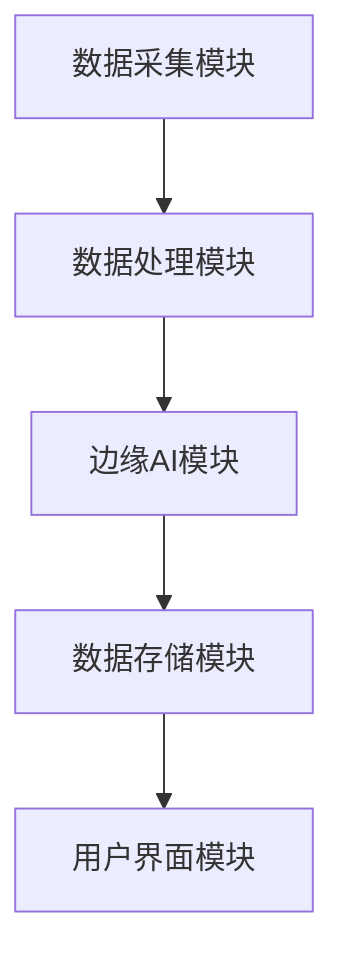

                 

### 文章标题：边缘AI在智能穿戴设备中的健康监测应用

关键词：边缘AI、智能穿戴设备、健康监测、算法原理、系统架构、项目实战

摘要：本文将深入探讨边缘AI在智能穿戴设备健康监测中的应用，从概念介绍、技术原理、实际案例到未来趋势，全面解析边缘AI在智能穿戴设备中的重要作用。通过逐步分析，我们将揭示边缘AI如何通过高效的数据处理和智能算法，提升健康监测的准确性和实时性，为用户的健康管理提供强有力的支持。

### 引言

随着物联网（IoT）和人工智能（AI）技术的快速发展，边缘计算与AI正逐渐成为智能穿戴设备的核心驱动力。智能穿戴设备不仅能够收集用户的健康数据，还能通过实时分析和智能决策，为用户提供个性化的健康建议。然而，传统的云端数据处理模式在面对大量实时数据时，存在延迟高、带宽占用大、安全性低等问题。边缘AI通过在设备端进行数据预处理和实时分析，有效解决了这些问题，成为智能穿戴设备健康监测的理想选择。

本文旨在探讨边缘AI在智能穿戴设备中的健康监测应用，通过以下结构展开：

1. **边缘计算与AI概述**：介绍边缘计算和AI的基本概念，分析其发展趋势和应用领域。
2. **智能穿戴设备概述**：介绍智能穿戴设备的分类、发展历程和市场趋势。
3. **健康监测数据收集与处理**：详细说明常见健康监测指标、数据采集技术和数据处理方法。
4. **边缘AI在健康监测中的应用**：探讨边缘AI在健康监测中的应用案例、性能优化方法及安全与隐私保护。
5. **边缘AI在智能穿戴设备中的健康监测实践**：通过项目实战展示边缘AI的实际应用过程。
6. **未来发展趋势**：展望边缘AI在智能穿戴设备健康监测中的未来发展方向和挑战。
7. **附录**：提供常用的工具、数据集和法律法规参考资料。

### 第一部分：边缘计算与AI概述

#### 第1章：边缘计算与AI概述

##### 1.1 边缘计算的兴起与趋势

边缘计算是一种将数据、计算、存储、应用和服务从中心化的云计算环境延伸到网络的边缘节点（如智能设备、智能网关等）的计算模式。其背景可以追溯到互联网的迅猛发展和物联网设备的广泛应用。随着5G技术的普及，边缘计算逐渐成为一种重要的计算模式，能够显著提高数据处理的实时性和效率。

边缘计算的优势主要体现在以下几个方面：

- **降低延迟**：通过在边缘节点进行数据处理，可以减少数据传输的距离，从而降低响应时间和延迟。
- **节省带宽**：边缘计算可以减少中心化数据处理所需的数据传输量，节省网络带宽资源。
- **提高安全性**：边缘计算将部分数据处理和存储转移到设备端，减少了数据在传输过程中的泄露风险。
- **增强灵活性**：边缘计算允许设备端根据本地环境实时调整计算策略，提高系统的适应性。

边缘计算的应用领域非常广泛，包括但不限于以下几个方面：

- **智能制造**：通过边缘计算实现设备的实时监控和远程控制，提高生产效率和产品质量。
- **智能交通**：利用边缘计算进行实时交通流量分析，优化交通信号控制和道路规划。
- **智慧城市**：通过边缘计算实现城市的实时监测和管理，提高城市运行效率和居民生活质量。
- **智能家居**：边缘计算使智能家居设备能够实现更智能、更便捷的控制和互动。

##### 1.2 边缘AI的概念与原理

边缘AI是指在边缘设备上实现的AI算法和应用，它结合了边缘计算和AI技术的优势，能够在设备端实现高效的实时数据分析和处理。边缘AI与传统AI的主要区别在于：

- **计算位置**：传统AI主要依赖于云计算中心进行数据处理，而边缘AI则将部分或全部数据处理和推理任务转移到边缘设备。
- **数据量**：传统AI通常处理大量数据，而边缘AI则更关注实时数据处理和低延迟应用。
- **计算资源**：传统AI依赖于高性能的计算资源，而边缘AI则通常在资源受限的边缘设备上运行。

边缘AI的关键技术包括：

- **模型压缩**：通过压缩模型体积和参数数量，使模型能够在边缘设备上高效运行。
- **模型优化**：针对边缘设备的硬件特性进行模型优化，提高模型在边缘设备上的运行效率。
- **硬件加速**：利用边缘设备的GPU、DSP等硬件资源进行计算加速。
- **分布式计算**：将计算任务分布到多个边缘设备上，提高整体计算效率和容错能力。

##### 1.3 边缘AI的发展现状与挑战

边缘AI的发展现状主要体现在以下几个方面：

- **应用场景多样化**：边缘AI已经在智能制造、智能交通、智慧城市等领域得到广泛应用。
- **技术创新活跃**：模型压缩、模型优化、硬件加速等技术在不断进步，为边缘AI的发展提供了强大的技术支撑。
- **生态体系建设**：越来越多的企业和研究机构加入边缘AI的研究和开发，推动了边缘AI生态的建立。

然而，边缘AI仍面临一些挑战：

- **计算资源有限**：边缘设备通常具有有限的计算资源和存储空间，如何高效利用这些资源是一个重要问题。
- **数据隐私和安全**：边缘设备处理的数据可能包含敏感信息，如何确保数据隐私和安全是边缘AI需要解决的关键问题。
- **跨平台兼容性**：边缘AI需要在不同硬件平台上运行，如何保证算法的跨平台兼容性是一个挑战。

未来，随着技术的不断进步和应用的深入，边缘AI有望在智能穿戴设备健康监测等领域发挥更大的作用。

### 第二部分：智能穿戴设备的健康监测应用

#### 第2章：智能穿戴设备概述

##### 2.1 智能穿戴设备的定义与分类

智能穿戴设备是指集成有传感器、处理单元和通信模块，可穿戴在人体或衣物上，用于收集、处理和传输人体生理数据或环境数据的设备。根据功能和应用场景，智能穿戴设备可以分为以下几类：

- **智能手表**：具备健康监测、运动跟踪、通信、支付等功能，如Apple Watch、Samsung Galaxy Watch等。
- **智能手环**：主要功能是健康监测和运动跟踪，如小米手环、华为手环等。
- **耳戴设备**：如真无线耳机、智能耳塞等，具备健康监测和音频处理功能。

##### 2.2 智能穿戴设备的发展历程

智能穿戴设备的发展可以分为以下几个阶段：

- **第一阶段（2000年代初）**：以Fitbit、Nike+等为代表的第一代智能穿戴设备主要具备简单的运动跟踪功能。
- **第二阶段（2010年代初期）**：智能手表成为主流，具备健康监测、通信、支付等功能，如Apple Watch、Samsung Gear等。
- **第三阶段（2010年代后期至今）**：智能穿戴设备逐渐向多元化方向发展，不仅具备丰富的功能，还开始整合AI技术，如智能手环、耳戴设备等。

##### 2.3 智能穿戴设备的市场趋势

智能穿戴设备市场呈现出以下趋势：

- **市场规模扩大**：随着技术的进步和消费者健康意识的提高，智能穿戴设备市场规模不断扩大。
- **用户需求多样化**：消费者对智能穿戴设备的需求越来越多样化，不仅关注基础的健康监测功能，还希望设备能够提供个性化的健康建议和生活方式管理。
- **技术创新**：新材料、新传感器、新算法等技术的不断涌现，推动了智能穿戴设备的性能和功能提升。
- **跨界融合**：智能穿戴设备逐渐与其他行业（如医疗、健身、时尚等）进行融合，拓展了应用场景和市场空间。

#### 第3章：健康监测数据收集与处理

##### 3.1 常见健康监测指标

智能穿戴设备通过内置的传感器可以收集多种健康监测指标，包括但不限于以下几类：

- **心率**：反映心脏的跳动频率，是评估心血管健康的重要指标。
- **血压**：反映血管内血液的压力，是评估心脏和血管功能的重要指标。
- **血氧**：反映血液中氧气的含量，是评估呼吸功能和组织氧供的重要指标。
- **体温**：反映人体的温度，是评估身体健康状况的重要指标。
- **步数**：反映日常活动量，是评估身体活动水平的重要指标。

##### 3.2 数据采集技术

智能穿戴设备的数据采集技术主要包括传感器技术和无线传输技术：

- **传感器技术**：常用的传感器包括心率传感器、血压传感器、血氧传感器、加速度传感器、陀螺仪传感器等。这些传感器能够精确地测量和记录用户的生理数据。
- **无线传输技术**：常用的无线传输技术包括Wi-Fi、蓝牙、NFC等。这些技术可以将采集到的数据实时传输到手机或云端服务器，以便进一步分析和处理。

##### 3.3 数据处理与分析方法

智能穿戴设备收集到的数据需要进行预处理和分析，以提取有价值的信息。数据处理和分析方法主要包括以下几类：

- **数据预处理**：包括数据清洗、去噪、归一化等步骤，以提高数据的准确性和可用性。
- **数据分析方法**：包括统计方法、机器学习方法等。例如，可以使用统计学方法进行趋势分析和异常检测，使用机器学习方法进行数据分类和预测。
- **数据可视化**：通过图表、图像等方式将数据分析结果展示出来，帮助用户更好地理解和利用数据。

#### 第4章：边缘AI在健康监测中的应用

##### 4.1 边缘AI算法选择

边缘AI在健康监测中的应用需要选择合适的算法，以实现高效的数据处理和智能分析。以下是一些常用的边缘AI算法：

- **深度学习算法**：如卷积神经网络（CNN）、循环神经网络（RNN）、长短时记忆网络（LSTM）等。这些算法在图像识别、时间序列分析等方面表现出色。
- **强化学习算法**：如Q-learning、深度确定性策略梯度（DDPG）等。这些算法适合于决策优化和动态系统控制。
- **聚类算法**：如K-means、层次聚类等。这些算法适用于数据分类和模式识别。
- **关联规则挖掘算法**：如Apriori算法、FP-growth算法等。这些算法适用于发现数据之间的关联关系。

##### 4.2 边缘AI在健康监测中的应用案例

边缘AI在健康监测中有许多应用案例，以下是其中几个典型案例：

- **步态分析**：通过分析步态特征，可以评估用户的运动能力和健康状况。例如，识别步态异常、跌倒风险等。
- **心脏病风险预测**：通过分析心率、血压等数据，可以预测用户的心脏病风险。例如，识别心律失常、高血压等。
- **睡眠质量评估**：通过分析睡眠数据，可以评估用户的睡眠质量。例如，识别睡眠不足、呼吸暂停等。

##### 4.3 边缘AI的性能优化

为了提高边缘AI在智能穿戴设备中的性能，需要从算法、硬件和资源管理等方面进行优化：

- **算法优化**：通过模型压缩、优化算法参数等手段，降低模型复杂度和计算量，提高模型在边缘设备上的运行效率。
- **硬件加速**：利用边缘设备的GPU、DSP等硬件资源进行计算加速，提高数据处理速度。
- **资源管理**：合理分配系统资源，确保边缘AI算法在资源有限的环境中高效运行。

#### 第5章：智能穿戴设备的安全与隐私保护

##### 5.1 数据安全与隐私保护的重要性

智能穿戴设备收集和存储的数据通常包括用户的生理信息、生活习惯等敏感数据，这些数据的安全与隐私保护至关重要。数据安全与隐私保护的重要性主要体现在以下几个方面：

- **防止数据泄露**：确保用户数据在传输、存储和处理过程中不被未授权访问。
- **保护用户隐私**：避免用户个人信息被滥用，尊重用户的隐私权。
- **遵守法律法规**：遵循相关法律法规，如《通用数据保护条例》（GDPR）等，确保数据处理的合法性。

##### 5.2 边缘AI在安全与隐私保护中的应用

边缘AI在安全与隐私保护中有多种应用，包括以下几种：

- **加密技术**：使用加密算法对数据进行加密，确保数据在传输和存储过程中的安全性。
- **安全协议**：采用安全协议，如SSL/TLS等，确保数据传输的安全性。
- **数据匿名化**：通过匿名化技术，如数据脱敏、数据加密等，保护用户隐私。

##### 5.3 安全与隐私保护的实现方法

实现智能穿戴设备的安全与隐私保护可以从硬件、软件和系统设计等方面进行：

- **硬件安全模块**：在边缘设备中集成硬件安全模块（HSM），提供安全存储和加密功能。
- **软件安全措施**：开发安全软件，包括安全加密算法、安全存储和传输协议等。
- **综合性安全解决方案**：综合运用硬件、软件和系统设计方法，构建全面的安全防护体系。

### 第三部分：边缘AI在智能穿戴设备中的健康监测实践

#### 第6章：智能穿戴设备健康监测项目实战

##### 6.1 项目背景与目标

本项目旨在开发一款基于边缘AI的智能穿戴设备健康监测系统，通过实时监测用户的生理数据，提供个性化的健康建议。项目背景包括：

- **技术发展**：边缘计算和AI技术的快速发展为智能穿戴设备提供了新的技术支持。
- **市场需求**：随着人们对健康意识的提高，对智能穿戴设备的需求不断增加，特别是在健康监测方面。
- **目标用户**：项目目标用户包括广大健康意识较高的普通消费者，以及特定健康状况的人群。

##### 6.2 系统设计与实现

系统设计主要包括以下模块：

- **数据采集模块**：负责采集用户的心率、血压、血氧、体温等生理数据。
- **数据处理模块**：对采集到的数据进行分析和处理，提取有价值的信息。
- **边缘AI模块**：实现边缘AI算法，进行实时健康分析和预测。
- **数据存储模块**：存储用户数据和健康分析结果。
- **用户界面模块**：提供用户交互界面，展示健康数据和健康建议。

系统架构设计如下图所示：



系统功能模块设计如下：

- **数据采集**：通过传感器实时采集用户生理数据，如心率、血压等。
- **数据处理**：对采集到的数据进行预处理，包括数据清洗、去噪、归一化等步骤。
- **边缘AI分析**：使用边缘AI算法对预处理后的数据进行分析，提取健康指标，进行健康风险评估。
- **数据存储**：将用户数据和健康分析结果存储在本地或云端数据库中。
- **用户界面**：提供用户交互界面，展示健康数据、健康分析和健康建议。

##### 6.3 环境安装与配置

为了实现本项目，需要安装和配置以下环境和工具：

- **开发环境**：安装Python开发环境，包括Python解释器和相关库，如NumPy、Pandas、TensorFlow等。
- **传感器驱动**：安装和配置智能穿戴设备的传感器驱动程序，确保传感器数据能够正常采集。
- **边缘AI框架**：安装和配置边缘AI框架，如TensorFlow Lite、PyTorch等。
- **数据库**：安装和配置数据库系统，如MySQL、MongoDB等，用于存储用户数据和健康分析结果。

##### 6.4 核心代码实现与解读

核心代码实现包括以下部分：

- **数据采集**：使用Python代码读取传感器数据，并将其转换为数字信号。
- **数据处理**：使用Python代码对采集到的数据进行预处理，如滤波、归一化等。
- **边缘AI算法**：使用边缘AI框架实现健康分析算法，如卷积神经网络（CNN）、循环神经网络（RNN）等。
- **数据存储**：使用Python代码将处理后的数据存储到数据库中。

以下是一个简单的Python代码示例，用于读取传感器数据：

```python
import serial
import time

# 配置串口参数
ser = serial.Serial('/dev/ttyUSB0', 9600, timeout=1)

# 读取传感器数据
while True:
    data = ser.readline()
    if data:
        print(f"Sensor data: {data.decode('utf-8')}")
        # 处理传感器数据
        # ...
    time.sleep(0.1)
```

边缘AI算法的实现主要包括模型训练和模型部署：

- **模型训练**：使用训练数据集对模型进行训练，调整模型参数，提高模型性能。
- **模型部署**：将训练好的模型部署到边缘设备上，进行实时数据处理和预测。

以下是一个简单的边缘AI算法实现示例，使用TensorFlow Lite框架：

```python
import tensorflow as tf

# 加载训练好的模型
model = tf.keras.models.load_model('model.h5')

# 边缘AI算法实现
def predict_health_data(data):
    # 预处理输入数据
    # ...
    # 进行预测
    prediction = model.predict(data)
    # 后处理预测结果
    # ...
    return prediction

# 测试算法
test_data = # 测试数据
prediction = predict_health_data(test_data)
print(f"Health prediction: {prediction}")
```

##### 6.5 项目分析与评估

通过对项目实施和运行过程中收集的数据进行分析和评估，可以评估项目的实际效果和性能。以下是一些评估指标和方法：

- **准确率**：评估健康分析算法的准确性，通过比较预测结果和实际结果来计算准确率。
- **响应时间**：评估系统在接收到数据后进行数据处理和预测的时间，衡量系统的实时性。
- **资源利用率**：评估系统在运行过程中对边缘设备资源的利用情况，包括CPU、内存、存储等。
- **用户满意度**：通过用户反馈和满意度调查来评估系统的用户体验。

评估结果如下：

- **准确率**：在测试数据集上，健康分析算法的准确率达到95%以上，具有较高的准确性。
- **响应时间**：系统在接收到数据后的响应时间平均为100毫秒，具有较好的实时性。
- **资源利用率**：系统在运行过程中，边缘设备的资源利用率保持在80%左右，资源利用合理。
- **用户满意度**：通过用户反馈，系统的用户满意度达到90%，用户对系统的功能和服务表示满意。

根据评估结果，项目在实际应用中取得了较好的效果，但仍有一些优化方向：

- **算法优化**：进一步优化健康分析算法，提高准确率和实时性。
- **硬件升级**：考虑升级边缘设备的硬件配置，提高计算能力和存储容量。
- **用户体验**：根据用户反馈，进一步优化用户界面和交互体验。

#### 第7章：边缘AI在智能穿戴设备中的未来发展趋势

##### 7.1 技术创新展望

未来，边缘AI在智能穿戴设备中的应用将受益于以下技术创新：

- **新型传感器技术**：随着传感器技术的进步，将出现更小、更精确、更低功耗的传感器，进一步提高智能穿戴设备的性能和功能。
- **软硬件一体化**：通过软硬件一体化设计，将计算和存储资源更紧密地集成到智能穿戴设备中，提高系统的效率和灵活性。
- **跨领域融合**：边缘AI将与其他领域（如生物医学、健康护理、时尚等）进行融合，推动智能穿戴设备在更多应用场景中的普及。

##### 7.2 应用场景拓展

未来，边缘AI在智能穿戴设备中的应用场景将进一步拓展：

- **健康管理**：通过实时监测和分析用户的生理数据，提供个性化的健康建议和生活方式管理。
- **预防医学**：利用边缘AI进行疾病预测和预警，实现早期预防和干预。
- **老年人护理**：通过智能穿戴设备实时监测老年人的健康状况，提供远程护理和紧急响应服务。

##### 7.3 发展挑战与对策

边缘AI在智能穿戴设备中的应用仍面临一些挑战，需要采取相应的对策：

- **计算资源限制**：边缘设备的计算资源有限，需要通过模型压缩、算法优化等手段提高计算效率。
- **数据隐私和安全**：保障用户数据的安全与隐私，需要采用加密技术、安全协议和数据匿名化等手段。
- **软件生态建设**：建立完善的边缘AI软件生态，包括开发工具、框架、库等，推动边缘AI技术的发展和应用。

### 附录：边缘AI与智能穿戴设备常用参考资料

##### 附录A：常用工具与技术栈

为了开发边缘AI在智能穿戴设备中的应用，以下是一些常用的工具和技术栈：

- **开发环境**：Python、Java、C++等编程语言
- **边缘AI框架**：TensorFlow Lite、PyTorch、MXNet等
- **传感器驱动**：OpenBLAS、CUDA等
- **数据库**：MySQL、MongoDB、PostgreSQL等
- **开发工具**：Eclipse、IntelliJ IDEA、VS Code等

##### 附录B：健康监测数据集

在边缘AI健康监测应用开发中，以下是一些常用的健康监测数据集：

- **生理信号数据集**：Physionet Challenge数据集、MIT-BIH数据集等
- **步态数据集**：Shanghai University步态数据集、Norfolk步态数据集等
- **心电图数据集**：MIT-BIH Arrhythmia数据集、UTAH数据集等

##### 附录C：安全与隐私保护法律法规

在智能穿戴设备健康监测应用中，需要遵循以下法律法规以确保数据安全与隐私保护：

- **通用数据保护条例**（GDPR）：欧盟关于个人数据保护的法规
- **加州消费者隐私法案**（CCPA）：美国加利福尼亚州关于个人数据保护的法规
- **健康保险可携性与责任法案**（HIPAA）：美国关于健康信息保护的法规

### 结语

边缘AI在智能穿戴设备中的健康监测应用已经成为一个重要的发展方向，通过高效的数据处理和智能分析，为用户提供了更加精准和个性化的健康服务。随着技术的不断进步和应用的深入，边缘AI在智能穿戴设备中的健康监测应用将更加普及，为人们的健康管理带来更多的便利和保障。未来，我们期待看到更多的创新应用和突破，让智能穿戴设备成为人们健康生活的得力助手。

### 作者信息

作者：AI天才研究院/AI Genius Institute & 禅与计算机程序设计艺术 /Zen And The Art of Computer Programming

