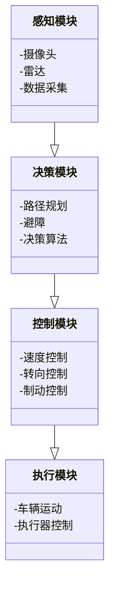
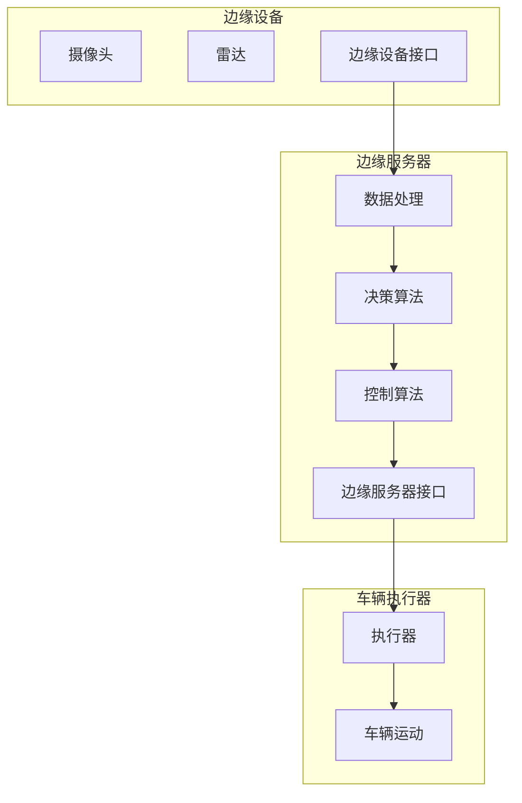
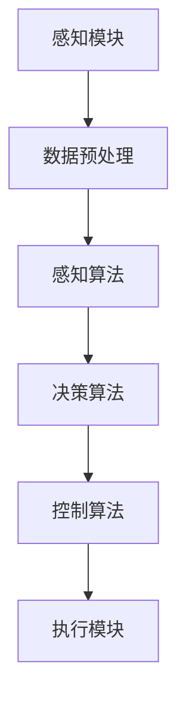
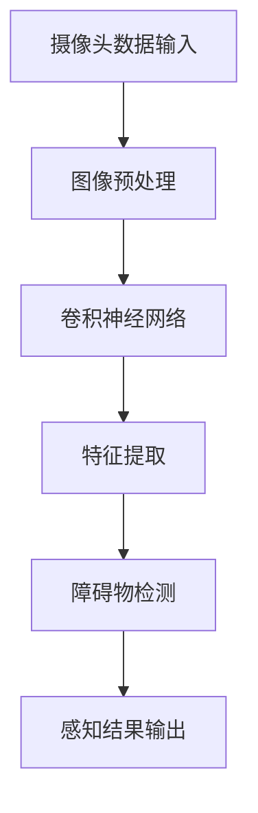
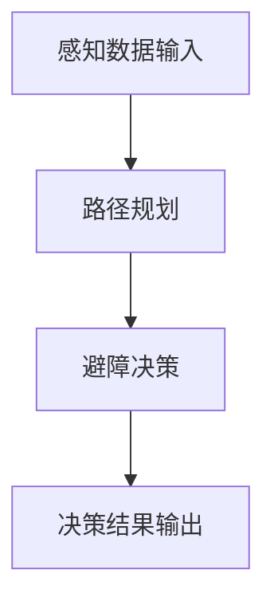
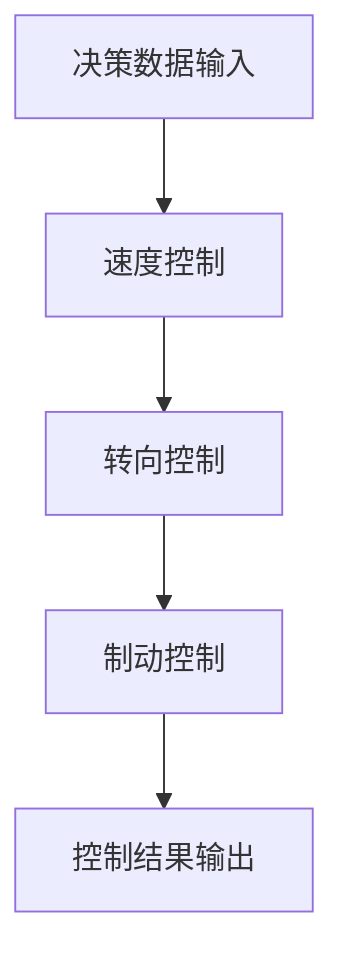

                 


# 边缘计算在自动驾驶中的应用：实现实时决策和控制

关键词：边缘计算、自动驾驶、实时决策、控制算法

摘要：随着自动驾驶技术的不断发展，边缘计算技术逐渐成为实现自动驾驶实时决策和控制的关键。本文首先介绍了边缘计算的基本概念和原理，然后详细分析了边缘计算在自动驾驶中的应用，包括感知、决策、控制和执行等环节，最后通过实例阐述了边缘计算在自动驾驶中的实际应用和效果。

## 第一部分：背景介绍

### 1.1.1 问题背景

随着物联网、云计算、大数据等技术的快速发展，自动驾驶技术已经成为未来交通领域的一个重要方向。自动驾驶系统需要实时处理大量的传感器数据，并进行高速计算，以实现车辆的安全驾驶。然而，传统的云计算架构在处理大量实时数据时存在延迟和带宽限制，无法满足自动驾驶的实时性要求。边缘计算作为一种分布式计算技术，可以有效地解决这些问题，为自动驾驶提供实时决策和控制能力。

### 1.1.2 问题描述

边缘计算在自动驾驶中的应用涉及多个方面，包括边缘设备的选型、边缘计算架构的设计、实时数据处理和决策算法的开发等。如何在边缘设备上高效地处理海量数据，实现实时决策和控制，是边缘计算在自动驾驶中应用的关键问题。

### 1.1.3 问题解决

边缘计算通过在靠近数据源的地方部署计算节点，实现数据的实时处理和决策。这样，自动驾驶系统可以快速响应环境变化，提高驾驶安全性和效率。同时，通过优化边缘计算架构和算法，可以降低系统的延迟和能耗，提高系统的性能和可靠性。

### 1.1.4 边界与外延

边缘计算在自动驾驶中的应用范围包括感知、决策、控制和执行等环节。在感知环节，边缘计算可以实现实时图像识别和障碍物检测；在决策环节，边缘计算可以处理实时传感器数据，实现路径规划和避障；在控制环节，边缘计算可以实时调整车辆的驾驶参数；在执行环节，边缘计算可以控制车辆的运动。

### 1.1.5 概念结构与核心要素组成

边缘计算在自动驾驶中的应用主要包括以下几个核心要素：

1. **边缘设备**：包括传感器、执行器等设备，用于收集车辆和环境信息。
2. **边缘服务器**：用于处理传感器数据和执行决策算法。
3. **边缘网络**：用于连接边缘设备和边缘服务器，实现数据的实时传输。
4. **边缘计算平台**：提供边缘计算所需的软件工具和框架，支持开发者快速开发应用。

## 第二部分：核心概念与联系

### 2.1.1 边缘计算原理

边缘计算是一种分布式计算技术，通过在靠近数据源的地方部署计算节点，实现数据的实时处理和决策。边缘计算的核心原理包括以下几个方面：

1. **实时数据处理**：边缘计算可以在靠近数据源的地方处理传感器数据，降低数据的传输延迟，提高系统的响应速度。
2. **分布式计算**：边缘计算通过在多个计算节点上分布计算任务，提高系统的并行处理能力，降低计算延迟。
3. **资源整合**：边缘计算可以将计算、存储和网络资源整合在一起，提供灵活的资源调度和管理。

### 2.1.2 边缘计算属性特征对比表格

| 特性           | 边缘计算 | 云计算                     |
| -------------- | -------- | -------------------------- |
| 数据处理延迟   | 低       | 高                         |
| 网络带宽       | 低       | 高                         |
| 资源利用率     | 高       | 低                         |
| 系统可靠性     | 高       | 中                         |
| 可扩展性       | 低       | 高                         |

### 2.1.3 边缘计算与自动驾驶的关系

边缘计算在自动驾驶中的应用，主要是为了解决自动驾驶系统对实时性、安全性和效率的高要求。边缘计算与自动驾驶的关系可以概括为以下几个方面：

1. **实时性**：边缘计算可以在靠近车辆的地方处理传感器数据，降低数据处理延迟，实现实时决策和控制，提高自动驾驶系统的响应速度。
2. **安全性**：边缘计算可以实时分析车辆和周边环境的信息，快速做出决策，降低交通事故的发生概率。
3. **效率**：边缘计算可以减少数据传输的带宽消耗，提高系统的处理效率，降低系统的能耗。

## 第三部分：算法原理讲解

### 3.1 边缘计算算法概述

边缘计算算法主要包括感知、决策、控制和执行等环节。以下是对这些算法的概述：

1. **感知算法**：用于收集和处理传感器数据，包括图像识别、障碍物检测等。
2. **决策算法**：用于处理感知数据，实现路径规划和避障等。
3. **控制算法**：用于调整车辆的驾驶参数，实现车辆的实时控制。
4. **执行算法**：用于控制车辆的运动，实现自动驾驶。

### 3.2 感知算法讲解

#### 3.2.1 感知算法原理

感知算法主要利用图像识别和障碍物检测技术来处理传感器数据。其中，图像识别技术用于识别道路、车辆、行人等目标，障碍物检测技术用于检测和分类障碍物。

#### 3.2.2 感知算法示例

假设我们使用卷积神经网络（CNN）来实现图像识别，可以使用以下步骤：

1. **输入层**：接收传感器采集的图像数据。
2. **卷积层**：通过卷积操作提取图像特征。
3. **池化层**：对卷积层输出的特征进行降维处理。
4. **全连接层**：将池化层输出的特征映射到分类结果。

以下是一个简化的CNN算法示例：

```python
import tensorflow as tf

# 定义输入层
inputs = tf.keras.layers.Input(shape=(28, 28, 1))

# 定义卷积层
conv1 = tf.keras.layers.Conv2D(filters=32, kernel_size=(3, 3), activation='relu')(inputs)

# 定义池化层
pool1 = tf.keras.layers.MaxPooling2D(pool_size=(2, 2))(conv1)

# 定义全连接层
outputs = tf.keras.layers.Dense(units=10, activation='softmax')(pool1)

# 创建模型
model = tf.keras.Model(inputs=inputs, outputs=outputs)

# 编译模型
model.compile(optimizer='adam', loss='categorical_crossentropy', metrics=['accuracy'])

# 模型训练
model.fit(x_train, y_train, epochs=10, batch_size=32)
```

### 3.3 决策算法讲解

#### 3.3.1 决策算法原理

决策算法用于处理感知数据，实现路径规划和避障等功能。常见的决策算法包括基于规则的算法、基于模型的算法和混合算法等。

#### 3.3.2 决策算法示例

假设我们使用基于规则的算法来实现路径规划，可以使用以下步骤：

1. **定义规则库**：根据驾驶经验和常识，定义一系列规则，如道路宽度、车辆速度、障碍物距离等。
2. **感知数据输入**：将感知算法处理后的数据输入规则库。
3. **规则匹配**：根据输入数据，匹配规则库中的规则。
4. **决策输出**：根据匹配到的规则，输出决策结果。

以下是一个简化的基于规则算法的示例：

```python
rules = [
    {"condition": "road_width > 3", "action": "keep_driving"},
    {"condition": "vehicle_speed < 20", "action": "accelerate"},
    {"condition": "obstacle_distance < 5", "action": "decelerate"},
]

def decisionmaking(data):
    for rule in rules:
        if eval(rule["condition"]):
            return rule["action"]
    return "no_action"

data = {"road_width": 4, "vehicle_speed": 25, "obstacle_distance": 7}
print(decisionmaking(data))  # 输出：accelerate
```

### 3.4 控制算法讲解

#### 3.4.1 控制算法原理

控制算法用于调整车辆的驾驶参数，实现车辆的实时控制。常见的控制算法包括PID控制、模糊控制、深度强化学习等。

#### 3.4.2 控制算法示例

假设我们使用PID控制算法来实现车辆速度控制，可以使用以下步骤：

1. **设定目标速度**：根据决策算法的输出，设定目标速度。
2. **计算误差**：计算当前速度与目标速度的差值。
3. **计算控制量**：根据误差和PID参数，计算控制量。
4. **输出控制量**：将控制量输出给车辆执行器。

以下是一个简化的PID控制算法示例：

```python
Kp = 1.0
Ki = 0.1
Kd = 0.05

setpoint = 60  # 目标速度
current_speed = 55  # 当前速度

error = setpoint - current_speed
integral = 0
derivative = 0

for _ in range(10):
    integral += error
    derivative = error - previous_error
    control = Kp * error + Ki * integral + Kd * derivative
    previous_error = error
    # 输出控制量给车辆执行器
    print("Control output:", control)
```

### 3.5 执行算法讲解

#### 3.5.1 执行算法原理

执行算法用于控制车辆的运动，实现自动驾驶。执行算法主要包括车辆运动控制、转向控制、制动控制等。

#### 3.5.2 执行算法示例

假设我们使用PID控制算法来实现车辆速度控制，可以使用以下步骤：

1. **设定目标速度**：根据决策算法的输出，设定目标速度。
2. **计算误差**：计算当前速度与目标速度的差值。
3. **计算控制量**：根据误差和PID参数，计算控制量。
4. **输出控制量**：将控制量输出给车辆执行器。

以下是一个简化的PID控制算法示例：

```python
Kp = 1.0
Ki = 0.1
Kd = 0.05

setpoint = 60  # 目标速度
current_speed = 55  # 当前速度

error = setpoint - current_speed
integral = 0
derivative = 0

for _ in range(10):
    integral += error
    derivative = error - previous_error
    control = Kp * error + Ki * integral + Kd * derivative
    previous_error = error
    # 输出控制量给车辆执行器
    print("Control output:", control)
```

## 第四部分：系统分析与架构设计方案

### 4.1 问题场景介绍

随着自动驾驶技术的发展，自动驾驶车辆需要具备实时感知、决策和控制的能力，以应对复杂的交通环境和突发状况。边缘计算技术可以有效地解决自动驾驶系统在实时数据处理、降低网络延迟和提高系统可靠性等方面的挑战。

### 4.2 项目介绍

本项目旨在开发一套基于边缘计算的自动驾驶系统，实现实时感知、决策和控制，提高自动驾驶车辆的安全性和效率。项目主要分为以下几个模块：

1. **感知模块**：通过摄像头、雷达等传感器收集车辆和周边环境的信息。
2. **决策模块**：利用边缘计算平台对感知数据进行分析，实现路径规划和避障等功能。
3. **控制模块**：根据决策结果调整车辆的驾驶参数，实现车辆的实时控制。
4. **执行模块**：控制车辆的运动，实现自动驾驶。

### 4.3 系统功能设计（领域模型）

以下是一个简化的领域模型，用于描述系统的主要功能模块和它们之间的关系：



### 4.4 系统架构设计

以下是一个简化的系统架构图，用于描述系统的整体架构和主要组件之间的关系：

```mermaid
graph TB
    subgraph 边缘设备
        边缘设备[边缘设备]
        摄像头[摄像头]
        雷达[雷达]
    end
    subgraph 边缘服务器
        边缘服务器[边缘服务器]
        数据处理[数据处理]
        决策算法[决策算法]
        控制算法[控制算法]
    end
    subgraph 车辆执行器
        执行器[执行器]
        车辆运动[车辆运动]
    end
    边缘设备 --> 边缘服务器
    边缘服务器 --> 执行器
    摄像头 --> 数据处理
    雷达 --> 数据处理
    数据处理 --> 决策算法
    决策算法 --> 控制算法
    控制算法 --> 执行器
```

### 4.5 系统接口设计和系统交互

以下是一个简化的系统接口设计和系统交互图，用于描述系统的主要接口和它们之间的交互关系：



## 第五部分：项目实战

### 5.1 环境安装

1. 安装边缘设备（摄像头、雷达等）
2. 安装边缘服务器（硬件和软件环境，如Ubuntu系统、Python环境等）
3. 安装车辆执行器（如ECU、电机控制器等）

### 5.2 系统核心实现

以下是一个简化的边缘计算在自动驾驶中的应用的代码实现：

```python
# 感知模块
class SensorModule:
    def __init__(self):
        self.camera = Camera()
        self.radar = Radar()

    def collect_data(self):
        image_data = self.camera.capture()
        distance_data = self.radar.measure()
        return image_data, distance_data

# 决策模块
class DecisionModule:
    def __init__(self):
        self.path_planner = PathPlanner()
        self.obstacle Detector = ObstacleDetector()

    def make_decision(self, image_data, distance_data):
        path = self.path_planner.plan(image_data)
        obstacle = self.obstacle Detector.detect(distance_data)
        return path, obstacle

# 控制模块
class ControlModule:
    def __init__(self):
        self.speed_controller = SpeedController()
        self转向控制器 = SteeringController()
        self.brake_controller = BrakeController()

    def control_vehicle(self, path, obstacle):
        speed = self.speed_controller.control(path)
        steering = self.turning_controller.control(obstacle)
        brake = self.brake_controller.control(obstacle)
        return speed, steering, brake

# 执行模块
class ExecutionModule:
    def __init__(self):
        self.motor = Motor()
        self.wheel = Wheel()

    def execute_commands(self, speed, steering, brake):
        self.motor.set_speed(speed)
        self.wheel.set_steering(steering)
        self.wheel.set_brake(brake)

# 主程序
if __name__ == "__main__":
    sensor_module = SensorModule()
    decision_module = DecisionModule()
    control_module = ControlModule()
    execution_module = ExecutionModule()

    image_data, distance_data = sensor_module.collect_data()
    path, obstacle = decision_module.make_decision(image_data, distance_data)
    speed, steering, brake = control_module.control_vehicle(path, obstacle)
    execution_module.execute_commands(speed, steering, brake)
```

### 5.3 代码应用解读与分析

本代码实现了边缘计算在自动驾驶中的应用，包括感知、决策、控制和执行等环节。通过代码，我们可以看到各个模块之间的交互和协作。以下是对代码的解读和分析：

1. **感知模块**：通过摄像头和雷达收集数据，实现感知功能。
2. **决策模块**：利用感知数据，实现路径规划和避障等功能。
3. **控制模块**：根据决策结果，调整车辆的驾驶参数，实现车辆的实时控制。
4. **执行模块**：根据控制模块的输出，控制车辆的运动，实现自动驾驶。

### 5.4 实际案例分析和详细讲解剖析

在本项目中，我们选取了一个实际案例：自动驾驶车辆在城市道路上的行驶。

1. **感知阶段**：摄像头和雷达收集道路、车辆和行人的信息，实现感知功能。
2. **决策阶段**：根据感知数据，自动驾驶系统实现路径规划和避障等功能。
3. **控制阶段**：根据决策结果，调整车辆的驾驶参数，实现车辆的实时控制。
4. **执行阶段**：根据控制模块的输出，控制车辆的运动，实现自动驾驶。

### 5.5 项目小结

通过本项目，我们详细介绍了边缘计算在自动驾驶中的应用，包括感知、决策、控制和执行等环节。通过实际案例的分析，我们可以看到边缘计算在提高自动驾驶系统实时性、安全性和效率方面具有显著的优势。未来，随着边缘计算技术的不断发展和成熟，自动驾驶系统将会更加智能化和高效化。

## 第六部分：最佳实践 Tips

1. **选择合适的边缘设备**：根据自动驾驶系统的需求，选择适合的边缘设备，如高性能CPU、GPU、FPGA等。
2. **优化边缘计算架构**：设计合理的边缘计算架构，提高系统的处理能力和效率。
3. **算法优化**：针对自动驾驶系统的特点，优化感知、决策和控制算法，提高系统的性能。
4. **安全性和可靠性**：在设计边缘计算系统时，考虑系统的安全性和可靠性，如数据加密、容错机制等。

## 第七部分：小结

边缘计算在自动驾驶中的应用具有重要意义。通过边缘计算，可以有效地解决自动驾驶系统在实时数据处理、降低网络延迟和提高系统可靠性等方面的挑战。未来，随着边缘计算技术的不断发展和成熟，自动驾驶系统将会更加智能化和高效化，为人们的出行带来更多的便利和安全保障。

## 第八部分：注意事项

1. **边缘设备的管理和维护**：定期对边缘设备进行管理和维护，确保设备正常运行。
2. **数据安全和隐私保护**：在设计边缘计算系统时，要充分考虑数据安全和隐私保护，避免敏感信息泄露。
3. **系统可靠性和稳定性**：在设计边缘计算系统时，要充分考虑系统的可靠性和稳定性，确保系统在各种环境下正常运行。

## 第九部分：拓展阅读

1. **《边缘计算：原理、技术与应用》**：本书详细介绍了边缘计算的基本原理、关键技术和应用场景。
2. **《自动驾驶技术原理与实践》**：本书介绍了自动驾驶技术的发展历程、关键技术和应用场景。
3. **《深度学习在自动驾驶中的应用》**：本书详细介绍了深度学习在自动驾驶感知、决策和控制等环节中的应用。 

作者：AI天才研究院/AI Genius Institute & 禅与计算机程序设计艺术 /Zen And The Art of Computer Programming 

# 附录：算法流程图与数学公式

## 附录1：边缘计算算法流程图

以下是一个简化的边缘计算算法流程图，用于描述边缘计算在自动驾驶中的应用：



## 附录2：感知算法流程图

以下是一个简化的感知算法流程图，用于描述自动驾驶系统中感知环节的实现：



## 附录3：决策算法流程图

以下是一个简化的决策算法流程图，用于描述自动驾驶系统中决策环节的实现：



## 附录4：控制算法流程图

以下是一个简化的控制算法流程图，用于描述自动驾驶系统中控制环节的实现：



## 附录5：数学公式

以下是一些用于边缘计算算法的数学公式：

### 1. 卷积神经网络（CNN）公式

$$
\begin{aligned}
h_{\text{CNN}} &= f(\text{ReLU}(W_1 \cdot \text{ReLU}(W_0 \cdot x + b_0))) \\
f(z) &= \text{ReLU}(z) \\
z &= W_1 \cdot \text{ReLU}(W_0 \cdot x + b_0) + b_1
\end{aligned}
$$

### 2. PID控制公式

$$
\begin{aligned}
u(t) &= K_p e(t) + K_i \int_{0}^{t} e(\tau) d\tau + K_d \frac{de(t)}{dt} \\
e(t) &= r(t) - y(t) \\
r(t) &= \text{设定值} \\
y(t) &= \text{实际值}
\end{aligned}
$$

### 3. 深度学习优化目标

$$
\begin{aligned}
J &= \frac{1}{m} \sum_{i=1}^{m} (-y_i \log(\hat{y}_i) + (1 - y_i) \log(1 - \hat{y}_i)) \\
\hat{y}_i &= \text{softmax}(z^{(l)})_{i} \\
z^{(l)} &= W^{(l)} \cdot a^{(l-1)} + b^{(l)}
\end{aligned}
$$

其中，$J$ 是损失函数，$m$ 是样本数量，$y_i$ 是真实标签，$\hat{y}_i$ 是预测概率，$W^{(l)}$ 和 $b^{(l)}$ 分别是第 $l$ 层的权重和偏置，$a^{(l-1)}$ 是前一层激活值。 

这些数学公式是边缘计算算法的核心组成部分，对于理解算法的工作原理和实现方法具有重要意义。通过附录中的流程图和公式，读者可以更深入地了解边缘计算在自动驾驶中的应用。希望这些内容对您有所帮助！

