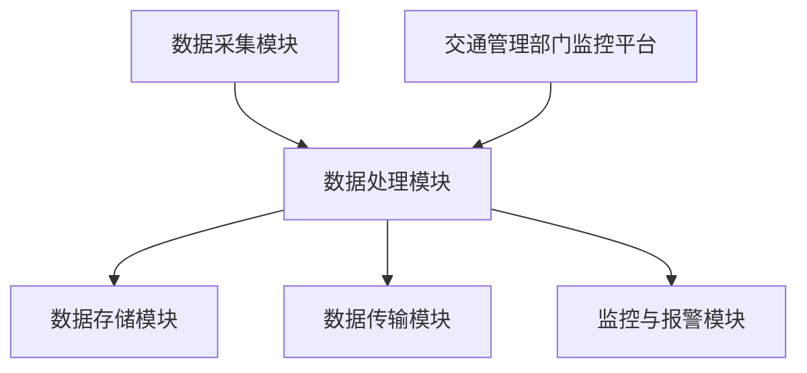
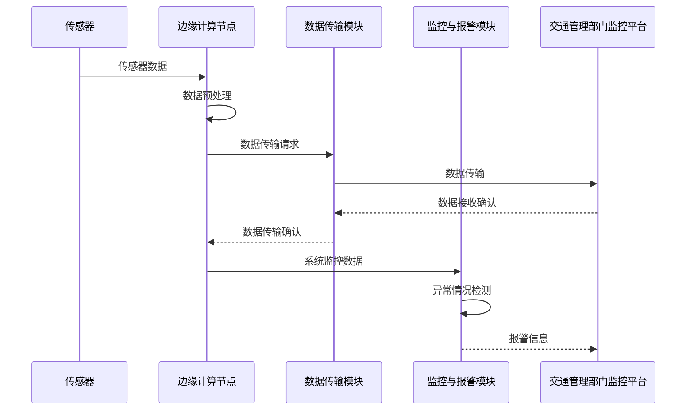

                 

## 边缘计算在车联网中的实时处理应用

### 引言

随着车联网技术的快速发展，边缘计算作为一种新兴的计算架构，正逐渐成为车联网实时数据处理的重要解决方案。边缘计算通过在车辆附近或车上部署计算资源，实现了数据的就近处理，大大降低了传输延迟，提高了处理效率。本文将深入探讨边缘计算在车联网中的实时处理应用，分析其核心技术、架构设计以及面临的挑战。

**关键词**：边缘计算、车联网、实时处理、计算架构

**摘要**：本文首先介绍了边缘计算和车联网的基本概念，随后分析了边缘计算在车联网中的优势和挑战。接着，详细探讨了边缘计算在车联网中的实时数据处理技术，包括数据采集、处理和传输等方面的内容。最后，通过具体实例展示了边缘计算在车联网中的应用，并对其未来发展进行了展望。

### 第一部分: 引言

#### 1.1 背景介绍

随着车联网技术的快速发展，实时数据处理需求日益增加。车联网系统需要处理大量来自车辆传感器、通信模块等的数据，这些数据通常需要在短时间内进行高效处理，以便支持自动驾驶、智能交通管理等功能。然而，传统的中心化数据处理模式存在数据传输延迟高、网络带宽消耗大等问题，无法满足车联网实时数据处理的需求。

边缘计算作为一种新兴的计算架构，通过在车辆附近或车上部署计算资源，实现了数据的就近处理，大大降低了传输延迟，提高了处理效率。边缘计算不仅能够处理本地数据，还能够与云端进行协同处理，实现更高效的数据处理和资源共享。

本文将围绕边缘计算在车联网中的实时处理应用展开讨论，分析其核心技术和架构设计，探讨边缘计算在车联网中的应用前景和挑战。

#### 1.2 核心概念

**边缘计算**：

边缘计算是指将计算、存储、网络功能部署在网络的边缘，即在接近数据源的地方进行处理。与传统的中心化计算相比，边缘计算具有低延迟、高带宽、高效资源利用等优势。

**车联网**：

车联网是指通过互联网将车辆、道路设施、移动设备等进行互联互通，实现车辆与外部环境之间的信息交互和智能服务。车联网的关键技术包括车辆通信技术、传感器技术、数据处理技术等。

**实时数据处理**：

实时数据处理是指对数据进行及时、连续的处理，以支持实时决策和响应。在车联网中，实时数据处理对于实现自动驾驶、智能交通等功能至关重要。

#### 1.3 概念联系

**边缘计算与车联网的关系**：

边缘计算在车联网中的应用主要体现在实时数据处理方面。车联网需要处理大量的实时数据，如车辆位置、速度、加速度等，这些数据需要在短时间内进行处理，以便支持自动驾驶、智能交通等功能。边缘计算通过在车辆附近或车上部署计算资源，实现了数据的就近处理，降低了传输延迟，提高了处理效率。

**对比表格**：

| 对比项         | 边缘计算           | 中心计算           |
|----------------|-------------------|-------------------|
| 计算位置       | 车辆附近或车上     | 数据中心           |
| 数据处理延迟   | 低                | 高                |
| 网络带宽       | 高                | 低                |
| 资源利用       | 高效利用           | 资源利用率较低     |

**ER图**：

#### 1.4 目标与结构

**书籍目标**：

本文的目标是探讨边缘计算在车联网中的实时处理应用，分析其核心技术、架构设计以及面临的挑战。具体包括：

1. 深入理解边缘计算和车联网的基本概念。
2. 分析边缘计算在车联网中的应用优势和挑战。
3. 探讨边缘计算在车联网中的实时数据处理技术。
4. 通过实例展示边缘计算在车联网中的应用。
5. 展望边缘计算在车联网中的未来发展。

**目录结构**：

1. 第1章：引言
2. 第2章：边缘计算基础
3. 第3章：车联网架构
4. 第4章：边缘计算与车联网结合
5. 第5章：实时数据处理技术
6. 第6章：边缘计算实例分析
7. 第7章：最佳实践与展望

### 第二部分: 边缘计算基础

#### 2.1 边缘计算概述

**边缘计算的概念**：

边缘计算是指在网络的边缘（如车辆、传感器、设备等）进行数据处理和计算的一种计算架构。它通过将计算、存储、网络功能部署在接近数据源的位置，实现了数据的就近处理，降低了传输延迟，提高了处理效率。

**边缘计算的特点**：

1. **低延迟**：边缘计算将数据处理和计算任务分散到网络的边缘，减少了数据传输的距离和时间，降低了延迟。
2. **高带宽**：边缘计算在网络的边缘提供计算和存储资源，可以充分利用本地带宽，提高数据处理能力。
3. **高效资源利用**：边缘计算通过在接近数据源的位置处理数据，可以更有效地利用计算资源，降低能耗和成本。

**边缘计算的应用场景**：

1. **物联网**：边缘计算在物联网中可以用于实时数据采集和处理，提高系统的响应速度和效率。
2. **智能制造**：边缘计算可以用于工业自动化生产过程中的实时数据监测和控制。
3. **智能交通**：边缘计算可以用于车联网中的实时数据处理，支持自动驾驶和智能交通管理。

#### 2.2 边缘计算的优势

**性能提升**：

边缘计算通过在网络的边缘提供计算和存储资源，可以大大提高数据处理和响应速度。具体体现在：

1. **低延迟**：边缘计算将数据处理和计算任务分散到网络的边缘，减少了数据传输的距离和时间，降低了延迟。
2. **高带宽**：边缘计算在网络的边缘提供计算和存储资源，可以充分利用本地带宽，提高数据处理能力。
3. **高效资源利用**：边缘计算通过在接近数据源的位置处理数据，可以更有效地利用计算资源，降低能耗和成本。

**安全性增强**：

边缘计算在安全性方面具有以下优势：

1. **数据隐私保护**：通过在边缘进行数据处理，可以减少敏感数据在传输过程中的泄露风险。
2. **网络安全性**：边缘计算可以实现对网络的实时监控和分析，提高网络的安全性。

#### 2.3 边缘计算的技术原理

**边缘计算架构**：

边缘计算架构主要包括以下几层：

1. **边缘设备层**：包括传感器、设备、车辆等，负责数据采集和初步处理。
2. **边缘网关层**：负责数据的传输、路由和处理，通常部署在网络的边缘。
3. **边缘服务器层**：提供计算和存储资源，用于处理复杂的数据处理任务。
4. **云计算层**：用于存储和管理大规模数据，提供远程计算和存储服务。

**边缘计算协议**：

边缘计算通常采用以下几种协议：

1. **MQTT**：一种轻量级的消息队列协议，适用于物联网和边缘计算场景。
2. **CoAP**：一种面向资源的协议，适用于资源受限的边缘设备。
3. **HTTP/2**：一种高效的HTTP协议，适用于边缘计算中的数据传输。

#### 2.4 边缘计算的发展趋势

**技术演进**：

1. **5G技术的融合**：随着5G技术的推广，边缘计算将更好地与5G网络相结合，实现更高的带宽和更低延迟。
2. **AI与边缘计算的融合**：AI技术的发展为边缘计算带来了新的机遇，通过在边缘设备上部署AI算法，可以实现更高效的数据处理和智能决策。
3. **边缘计算在自动驾驶中的应用**：边缘计算在自动驾驶中可以提供实时数据处理和决策支持，是实现自动驾驶的关键技术之一。

#### 2.5 本章小结

边缘计算作为一种新兴的计算架构，在车联网中具有广泛的应用前景。通过在网络的边缘提供计算和存储资源，边缘计算可以实现数据的就近处理，降低延迟，提高效率。同时，边缘计算在安全性、资源利用等方面也具有显著优势。随着技术的不断演进，边缘计算将在车联网中发挥越来越重要的作用。

### 第三部分: 车联网架构

#### 3.1 车联网概述

**车联网的概念**：

车联网（Internet of Vehicles，IoV）是指通过互联网将车辆、道路设施、移动设备等进行互联互通，实现车辆与外部环境之间的信息交互和智能服务。车联网的目标是提高交通效率、减少事故、降低污染，并提升驾驶员的驾驶体验。

**车联网的关键技术**：

1. **车辆通信技术**：包括车辆与车辆（V2V）、车辆与基础设施（V2I）、车辆与网络（V2N）之间的通信技术。
2. **传感器技术**：用于采集车辆状态、环境信息等数据。
3. **数据处理技术**：用于对采集到的数据进行实时处理和分析。
4. **云计算技术**：用于存储和管理大规模数据，提供计算和存储服务。

#### 3.2 车联网的架构

**V2X架构**：

V2X（Vehicle-to-Everything）架构是车联网的核心架构，包括以下几层：

1. **感知层**：包括传感器、摄像头等设备，用于采集车辆和环境信息。
2. **传输层**：包括通信网络，如5G网络、DSRC等，用于传输数据。
3. **平台层**：包括数据处理、存储和管理平台，用于对数据进行处理和分析。
4. **应用层**：包括各种应用和服务，如自动驾驶、智能交通管理等。

**车联网通信协议**：

车联网通信协议包括：

1. **DSRC（Dedicated Short-Range Communications）**：一种专用的短距离通信协议，适用于车辆与基础设施之间的通信。
2. **5G NR（5G New Radio）**：5G网络中的新无线电协议，适用于车辆与网络之间的通信。
3. **Wi-Fi**：一种无线通信协议，适用于车辆内部和外部通信。

#### 3.3 车联网的应用场景

**智能交通**：

智能交通系统（Intelligent Transportation System，ITS）通过车联网技术实现交通信息的实时采集、传输和处理，提高交通效率和安全性。应用场景包括：

1. **交通监控**：通过摄像头、传感器等设备实时监控道路状况，提供交通流量信息。
2. **交通信号控制**：根据实时交通信息自动调整交通信号，提高道路通行效率。
3. **交通事故预防**：通过车辆之间的通信实现事故预防，减少交通事故的发生。

**车辆监控**：

车辆监控系统通过车联网技术实现对车辆的实时监控和管理，应用场景包括：

1. **车辆状态监控**：实时监控车辆的运行状态，如速度、温度、油量等。
2. **车辆定位**：通过GPS等定位技术实时获取车辆的地理位置。
3. **车辆安全管理**：通过车辆监控和数据分析实现车辆的安全管理，如防盗报警、行驶轨迹记录等。

**自动驾驶**：

自动驾驶系统通过车联网技术实现车辆的自动导航和控制，应用场景包括：

1. **自动驾驶汽车**：实现车辆的自动行驶，减少驾驶员的干预。
2. **自动驾驶出租车**：提供自动驾驶的出租车服务，提高交通效率和乘客体验。
3. **自动驾驶物流**：实现自动驾驶的物流运输，提高物流效率和安全性。

#### 3.4 车联网的发展趋势

**自动驾驶**：

自动驾驶技术是车联网发展的重要方向，随着传感器技术、人工智能技术等的发展，自动驾驶技术将不断提高，逐步实现全自动驾驶。自动驾驶技术的发展将推动车联网技术的进步，提高交通效率和安全性。

**智能交通**：

智能交通系统通过车联网技术实现交通的智能化管理，提高交通效率和安全性。随着车联网技术的普及，智能交通系统将得到广泛应用，如智能信号控制、智能交通监控等。

**物联网**：

车联网与物联网（IoT）的融合将实现更广泛的应用场景，如智能家居、智能医疗等。通过车联网和物联网的融合，可以实现跨领域的信息共享和协同工作，提高生活质量和生产效率。

#### 3.5 本章小结

车联网作为一种新兴的互联网应用，通过车辆与外部环境的互联互通，实现了交通的智能化管理。车联网的架构包括感知层、传输层、平台层和应用层，涵盖了车辆通信、传感器技术、数据处理技术和云计算技术等关键技术。车联网的应用场景广泛，包括智能交通、车辆监控和自动驾驶等。随着技术的不断发展，车联网将推动交通领域的变革，提高交通效率和安全性。

### 第四部分: 边缘计算与车联网结合

#### 4.1 边缘计算在车联网中的挑战

边缘计算在车联网中的应用面临以下挑战：

**实时性要求**：

车联网系统需要实时处理大量数据，如车辆位置、速度、加速度等。边缘计算需要满足这些数据的实时性要求，以保证系统的响应速度和稳定性。

**安全性需求**：

车联网系统涉及大量的隐私数据和安全信息，如车辆位置、驾驶行为等。边缘计算需要提供强大的安全性保障，防止数据泄露和恶意攻击。

**网络可靠性**：

边缘计算依赖于网络的稳定性，车联网系统需要在各种网络环境下保持稳定的连接。边缘计算需要具备一定的容错能力和适应性，以应对网络中断和干扰等问题。

#### 4.2 边缘计算在车联网中的解决方案

**车载边缘计算**：

车载边缘计算是指在车辆内部部署计算资源，实现数据的本地处理。车载边缘计算具有以下优点：

1. **低延迟**：通过在车辆内部处理数据，减少了数据传输的距离和时间，降低了延迟。
2. **高带宽**：车辆内部网络带宽较高，可以充分利用本地带宽，提高数据处理能力。
3. **资源可控**：车辆内部计算资源可控，可以更好地保障数据安全和隐私。

**边缘云协同计算**：

边缘云协同计算是指将边缘计算与云计算相结合，通过边缘设备和云端的协同处理，实现更高效的数据处理和资源共享。边缘云协同计算具有以下优点：

1. **弹性扩展**：通过云端资源的扩展，可以满足不同规模数据处理的需求。
2. **高效计算**：通过云端强大的计算资源，可以处理复杂的计算任务。
3. **数据共享**：边缘设备和云端可以共享数据，实现更广泛的应用。

**边缘计算平台**：

边缘计算平台是指为边缘计算提供全面支持的技术框架，包括硬件设备、软件平台和通信协议等。边缘计算平台具有以下优点：

1. **统一管理**：通过边缘计算平台，可以实现对边缘设备的统一管理和监控。
2. **快速部署**：通过边缘计算平台，可以快速部署和配置边缘计算资源。
3. **互联互通**：边缘计算平台支持多种通信协议，可以实现不同设备和平台之间的互联互通。

#### 4.3 边缘计算在车联网中的应用案例

**自动驾驶**：

自动驾驶系统通过边缘计算实现车辆的实时感知和决策。边缘计算在自动驾驶中的应用包括：

1. **环境感知**：通过车载传感器实时感知周围环境，如路况、行人、车辆等。
2. **决策支持**：通过边缘计算平台对感知数据进行分析和决策，实现车辆的自动导航和控制。
3. **数据传输**：将决策结果通过边缘设备传输给车辆控制系统，实现车辆的实时响应。

**智能交通**：

智能交通系统通过边缘计算实现交通信息的实时采集和处理。边缘计算在智能交通中的应用包括：

1. **交通监控**：通过边缘计算平台实时监控道路状况，提供交通流量信息。
2. **信号控制**：通过边缘计算平台自动调整交通信号，提高道路通行效率。
3. **事故预警**：通过边缘计算平台实时分析交通数据，实现事故预警和预防。

#### 4.4 边缘计算在车联网中的最佳实践

**实时数据处理**：

边缘计算在车联网中的实时数据处理包括以下步骤：

1. **数据采集**：通过传感器、摄像头等设备实时采集车辆和环境数据。
2. **数据预处理**：对采集到的数据进行清洗、过滤和转换，以供后续处理。
3. **实时处理**：通过边缘计算平台对预处理后的数据进行实时分析、分类和决策。
4. **数据传输**：将处理结果传输给车辆控制系统或云端平台，实现实时响应。

**安全防护**：

边缘计算在车联网中的安全防护包括以下措施：

1. **数据加密**：对传输的数据进行加密处理，确保数据在传输过程中的安全性。
2. **访问控制**：通过访问控制机制，限制只有授权设备可以访问敏感数据和系统。
3. **安全监测**：通过安全监测系统，实时监控网络流量和设备状态，及时发现和应对安全威胁。

#### 4.5 本章小结

边缘计算在车联网中的应用具有重要的现实意义和广阔的发展前景。通过在车辆附近或车上部署计算资源，边缘计算可以实现数据的就近处理，降低延迟，提高效率。同时，边缘计算在安全性、资源利用等方面也具有显著优势。在自动驾驶、智能交通等应用场景中，边缘计算已经成为不可或缺的技术。然而，边缘计算在车联网中的应用仍然面临实时性、安全性和网络可靠性等方面的挑战。通过不断探索和实践，边缘计算在车联网中的应用将得到进一步发展和完善。

### 第五部分: 实时数据处理技术

#### 5.1 实时数据处理的定义

**实时数据处理**：

实时数据处理（Real-time Data Processing）是指在极短的时间内（通常是毫秒级）对数据进行采集、存储、处理和分析，以便快速作出决策和响应。实时数据处理的核心目标是满足系统的低延迟和高吞吐量的要求，确保数据能够在第一时间被处理并产生实际价值。

**实时数据处理的特点**：

1. **低延迟**：数据从采集到处理、分析、响应的过程需要尽可能短的时间，通常在毫秒级别。
2. **高吞吐量**：实时数据处理系统能够处理大量数据，支持大规模并发处理。
3. **实时性要求**：处理结果需要在事件发生后立即产生，以便及时作出决策。
4. **可扩展性**：系统能够随着数据量和处理需求的增长进行水平扩展。

#### 5.2 实时数据处理的挑战

**数据量大**：

车联网系统中产生的数据量非常庞大，包括车辆传感器数据、环境数据、通信数据等。实时数据处理系统需要处理这些高吞吐量的数据，同时保持低延迟。

**低延迟**：

车联网系统对实时性的要求非常高，数据需要在极短的时间内进行处理和响应，以确保系统的安全性和效率。低延迟是实时数据处理的核心挑战之一。

**稳定性和可靠性**：

实时数据处理系统需要能够在各种网络环境中保持稳定运行，处理过程中不能出现数据丢失、错误或延迟等问题。

**数据处理复杂度**：

车联网系统中的数据处理任务通常比较复杂，需要结合多种数据源、多种算法进行综合处理和分析。

**系统安全性**：

实时数据处理系统需要保证数据的安全性和隐私性，防止数据泄露和恶意攻击。

#### 5.3 实时数据处理的技术

**流处理技术**：

流处理（Stream Processing）技术是实时数据处理的核心技术之一，它通过持续不断地处理数据流，实现实时数据分析和处理。流处理技术的主要特点包括：

1. **低延迟**：流处理系统能够实时处理数据流，处理结果可以立即产生。
2. **高吞吐量**：流处理系统能够处理大规模的数据流，支持高并发处理。
3. **容错性**：流处理系统能够自动检测和处理数据流中的错误或丢失，确保数据处理的可靠性。

常见的流处理技术包括Apache Kafka、Apache Flink、Apache Storm等。

**批处理技术**：

批处理（Batch Processing）技术是将一段时间内的数据汇总成一批进行统一处理。批处理技术的主要特点包括：

1. **高吞吐量**：批处理系统能够处理大量数据，适合处理大数据集。
2. **灵活性**：批处理系统可以根据业务需求灵活设置处理时间和处理策略。
3. **低成本**：批处理系统的开发和维护成本相对较低。

常见的批处理技术包括Apache Hadoop、Apache Spark等。

**增量处理技术**：

增量处理（Incremental Processing）技术是针对实时数据处理的一种优化技术，它仅处理新增加的数据，而不是重新处理整个数据集。增量处理技术的主要特点包括：

1. **低延迟**：通过仅处理新增数据，增量处理技术可以降低数据处理的延迟。
2. **高效性**：增量处理技术可以节省计算资源，提高数据处理效率。

常见的增量处理技术包括增量数据库、增量计算框架等。

#### 5.4 实时数据处理的优势

**低延迟**：

实时数据处理能够快速响应事件，降低系统的延迟，提高系统的响应速度和效率。

**高吞吐量**：

实时数据处理系统能够处理大规模的数据流，支持高并发处理，满足大规模数据处理的需求。

**实时监控**：

实时数据处理技术可以实现对系统运行状态的实时监控，及时发现和处理问题，提高系统的稳定性。

**数据价值最大化**：

实时数据处理能够及时产生处理结果，提高数据的利用效率，最大化数据的价值。

#### 5.5 本章小结

实时数据处理技术是车联网系统中的关键组成部分，它通过低延迟、高吞吐量、实时监控等技术特点，满足车联网系统对实时数据处理的需求。实时数据处理技术包括流处理技术、批处理技术和增量处理技术等多种技术手段，每种技术都有其独特的优势和适用场景。通过合理选择和组合这些技术，可以实现高效、稳定的实时数据处理，为车联网系统提供强有力的支持。

### 第六部分：边缘计算实例分析

#### 6.1 实例介绍

在本节中，我们将通过一个具体的边缘计算在车联网中的应用实例来详细分析其实现过程、技术架构和关键步骤。

**案例背景**：

假设我们开发一个智能交通监控系统，该系统需要在城市交通繁忙区域实时监控车辆流量、速度、占用时间等信息，以便交通管理部门进行实时调度和交通控制。边缘计算在这一场景中起到了关键作用，通过在路边部署边缘计算节点，实现数据的实时处理和分析。

**实现目标**：

1. 实时收集和分析车辆流量数据。
2. 对异常情况（如交通事故、拥堵等）进行实时预警。
3. 向交通管理部门提供实时交通状态报告。

#### 6.2 技术架构

**边缘计算节点架构**：

边缘计算节点包括硬件设备和软件平台两部分：

1. **硬件设备**：
   - 高性能边缘计算服务器
   - 网络接口设备（如无线接入点、路由器）
   - 存储设备（如SSD硬盘）
   - 传感器设备（如摄像头、雷达、GPS模块）

2. **软件平台**：
   - 边缘计算操作系统（如Ubuntu Server、Windows Server）
   - 边缘计算框架（如Kubernetes、Docker）
   - 实时数据处理软件（如Apache Flink、Apache Storm）

**系统架构**：

在该架构中，传感器设备实时采集车辆数据，通过网络接口传输到边缘计算节点。边缘计算节点负责数据的预处理、实时分析和存储。分析结果通过边缘网络传输到交通管理部门的监控平台。

#### 6.3 系统功能设计

**功能模块**：

1. **数据采集模块**：
   - 负责从传感器设备中收集车辆流量、速度、占用时间等信息。
   - 对采集到的数据进行初步处理，如去噪、滤波等。

2. **数据处理模块**：
   - 使用流处理技术（如Apache Flink）对实时数据进行处理，提取车辆流量、速度等关键指标。
   - 对异常情况进行实时检测和预警，如车辆拥堵、交通事故等。

3. **数据存储模块**：
   - 将处理后的数据存储到边缘计算节点的本地数据库中，供后续分析和查询。
   - 实现数据的持久化存储，确保数据的安全性和可靠性。

4. **数据传输模块**：
   - 将分析结果通过边缘网络传输到交通管理部门的监控平台。
   - 实现数据的高效传输，保证系统的低延迟和高吞吐量。

5. **监控与报警模块**：
   - 对系统的运行状态进行实时监控，包括边缘计算节点的资源利用率、网络连接状态等。
   - 当系统发生异常时，及时发送报警信息，通知相关人员处理。

#### 6.4 系统架构设计

**架构图**：

在该架构图中，数据采集模块通过传感器实时收集数据，数据处理模块对数据进行实时处理，数据存储模块将数据存储到本地数据库，数据传输模块将分析结果传输到交通管理部门的监控平台，监控与报警模块对系统运行状态进行实时监控和报警。

#### 6.5 系统接口设计

**接口设计**：

1. **传感器数据接口**：
   - 接收来自传感器设备的车辆流量、速度、占用时间等信息。
   - 接口协议：HTTP/RESTful API

2. **数据处理接口**：
   - 提供数据处理和实时分析服务的接口。
   - 接口协议：gRPC、HTTP/RESTful API

3. **数据存储接口**：
   - 提供数据存储和查询服务的接口。
   - 接口协议：SQL、NoSQL

4. **数据传输接口**：
   - 提供数据传输服务的接口。
   - 接口协议：MQTT、CoAP

5. **监控与报警接口**：
   - 提供系统监控和报警服务的接口。
   - 接口协议：HTTP/RESTful API、Websocket

#### 6.6 系统交互序列图

**序列图**：

在该序列图中，传感器将采集到的数据发送给边缘计算节点，边缘计算节点对数据预处理后发送给数据传输模块，数据传输模块将数据传输到交通管理部门监控平台。同时，边缘计算节点将系统监控数据发送给监控与报警模块，监控与报警模块检测异常情况并生成报警信息发送给交通管理部门监控平台。

#### 6.7 实际案例分析和详细讲解

**案例背景**：

在某城市的交通管理项目中，边缘计算被用来实时监控城市主要道路的车辆流量和速度。通过部署边缘计算节点，实现了以下功能：

1. **实时数据采集**：边缘计算节点通过摄像头、雷达等传感器设备，实时采集道路上的车辆信息，包括车辆数量、速度、占用时间等。
2. **数据预处理**：采集到的数据在边缘计算节点上进行预处理，包括数据去噪、滤波、异常值检测等，以提高数据质量。
3. **实时数据处理**：使用流处理技术（如Apache Flink）对预处理后的数据进行实时分析，提取关键指标，如车辆流量、平均速度等。
4. **数据存储**：将实时处理后的数据存储到边缘计算节点的本地数据库中，用于后续的查询和分析。
5. **数据传输**：将分析结果通过边缘网络传输到交通管理部门的监控平台，供交通管理人员实时查看和管理。
6. **监控与报警**：监控与报警模块实时监控边缘计算节点的运行状态，当检测到异常情况（如交通事故、拥堵等）时，立即生成报警信息并通知交通管理部门。

**详细讲解**：

1. **数据采集**：
   - 摄像头：用于实时监控道路上的车辆数量和位置。
   - 雷达：用于检测车辆的速度和距离。
   - GPS：用于获取车辆的地理位置信息。

2. **数据预处理**：
   - 数据去噪：通过滤波算法去除传感器采集到的噪声数据。
   - 数据滤波：通过移动平均、卡尔曼滤波等算法平滑传感器数据，提高数据质量。
   - 异常值检测：检测传感器采集到的异常数据，如车辆速度突变为零等，排除干扰数据。

3. **实时数据处理**：
   - 车辆计数：通过图像识别算法识别摄像头中的车辆，并计数。
   - 车辆速度估计：通过雷达数据计算车辆的速度。
   - 交通流量分析：使用统计方法分析车辆的流量、速度分布等。

4. **数据存储**：
   - 数据库选择：根据数据量和查询需求选择合适的数据库系统，如MySQL、MongoDB等。
   - 数据存储策略：设计合理的存储策略，如数据分区、索引等，以提高查询效率。

5. **数据传输**：
   - MQTT：用于边缘计算节点与交通管理部门监控平台之间的数据传输。
   - CoAP：适用于资源受限的边缘设备，用于数据传输。

6. **监控与报警**：
   - 监控指标：监控边缘计算节点的资源利用率、网络连接状态、传感器状态等。
   - 报警机制：当检测到异常情况时，生成报警信息并通过短信、邮件等方式通知相关人员。

**案例总结**：

通过边缘计算技术，该交通管理系统能够实时监控城市主要道路的车辆流量和速度，及时发现并处理异常情况，如交通事故、拥堵等。边缘计算节点在本地处理数据，大大降低了传输延迟，提高了系统的响应速度和效率。同时，系统具有高度的可靠性和安全性，能够保障交通管理部门实时获取准确的交通信息。

### 第七部分：最佳实践与展望

#### 7.1 最佳实践 Tips

**数据采集与预处理**：

- 选择高精度传感器，确保数据质量。
- 实现高效的数据预处理算法，去除噪声和异常值。

**实时数据处理**：

- 使用流处理框架（如Apache Flink、Apache Storm）进行实时数据处理。
- 设计合理的实时数据处理流程，确保数据在短时间内得到处理。

**数据存储与传输**：

- 根据数据量和查询需求选择合适的存储系统。
- 使用高效的传输协议（如MQTT、CoAP）保证数据传输的可靠性和实时性。

**安全性保障**：

- 实现数据加密和访问控制，确保数据安全。
- 定期更新系统和软件，防范安全漏洞。

**系统监控与维护**：

- 实现系统监控，及时发现和处理异常情况。
- 定期进行系统维护和升级，确保系统稳定运行。

#### 7.2 小结

边缘计算在车联网中的实时处理应用具有重要的现实意义和广阔的发展前景。通过在车辆附近或车上部署计算资源，边缘计算能够实现数据的就近处理，降低延迟，提高效率。本文详细分析了边缘计算在车联网中的应用场景、核心技术、架构设计和最佳实践，展示了边缘计算在车联网中的巨大潜力。

#### 7.3 注意事项

- **实时性**：确保边缘计算系统能够满足实时处理需求，处理延迟应尽可能低。
- **安全性**：边缘计算系统需要具备强大的安全性保障，防止数据泄露和恶意攻击。
- **稳定性**：边缘计算系统需要能够在各种网络环境中保持稳定运行，避免系统崩溃或数据丢失。
- **可扩展性**：边缘计算系统应具备良好的可扩展性，以应对不同规模的应用需求。

#### 7.4 拓展阅读

- **边缘计算技术综述**：了解边缘计算的基本原理和最新发展。
- **车联网架构设计**：深入研究车联网的架构和关键技术。
- **实时数据处理技术**：掌握实时数据处理的各种技术手段和最佳实践。
- **边缘计算与5G技术融合**：探讨边缘计算与5G技术的结合应用。

### 作者信息

作者：AI天才研究院/AI Genius Institute & 禅与计算机程序设计艺术 /Zen And The Art of Computer Programming

本文由AI天才研究院和《禅与计算机程序设计艺术》共同撰写，旨在深入探讨边缘计算在车联网中的实时处理应用，为读者提供全面的技术分析和实用建议。希望本文能对读者在边缘计算和车联网领域的探索和实践提供有益的指导。

