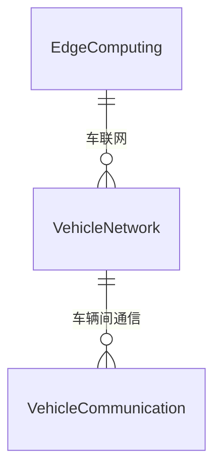
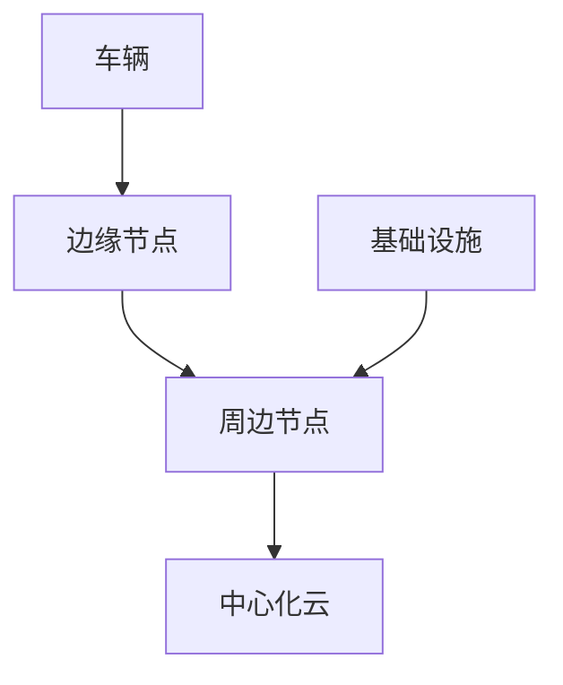
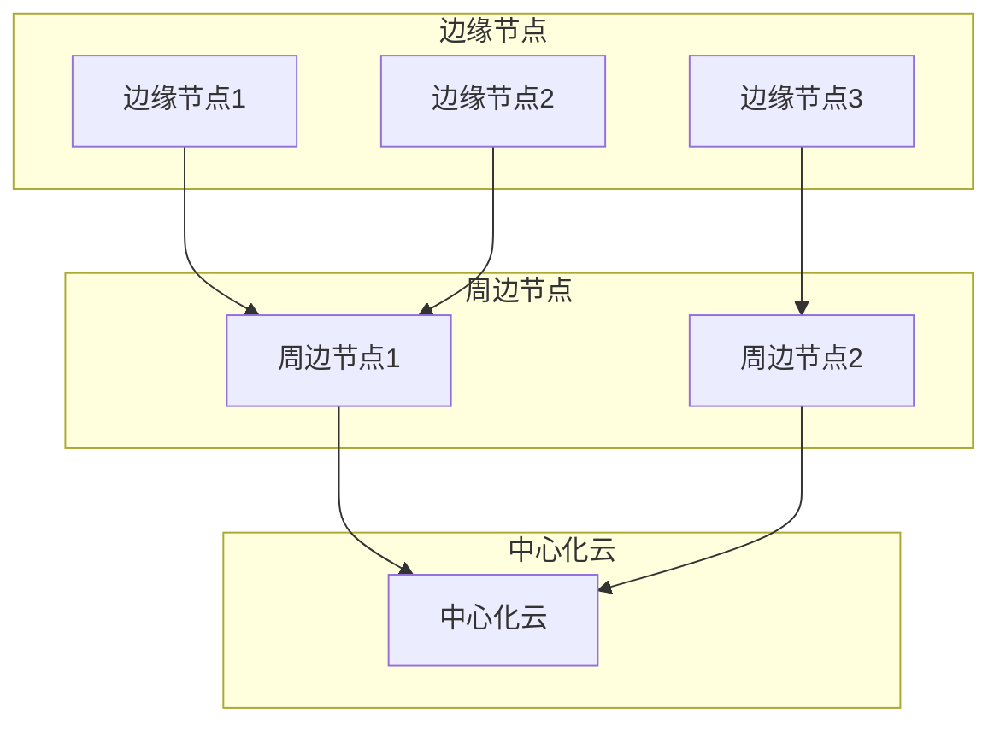

                 


## 引言与背景

### 1.1 边缘计算的概念

边缘计算是一种分布式计算架构，它将数据处理、存储和服务逻辑分散到网络的边缘节点，而非集中在一个中央数据中心。这种架构的优势在于能够显著减少数据传输延迟，提高系统的响应速度，增强数据隐私和安全。

在边缘计算环境中，数据处理任务可以在靠近数据源的地方进行，从而避免了大面积的网络拥塞和中心化瓶颈。这种技术对于需要实时处理的场景，如车联网（V2X，Vehicle-to-Everything）特别重要。随着车辆数量的激增，车辆间通信（V2V）对于提高交通效率和安全性变得至关重要。

### 1.2 边缘计算在车联网中的重要性

车联网是物联网（IoT）的一个重要分支，它涉及车辆、道路基础设施、行人以及其他交通工具的互联互通。边缘计算在车联网中的应用主要体现在以下几个方面：

1. **实时性要求：** 车辆间的通信需要实时处理，以应对紧急情况，如避让障碍物或避免交通事故。
2. **数据隐私：** 车辆数据通常包含敏感信息，如位置、速度、行驶方向等，通过边缘计算可以减少数据在传输过程中的暴露风险。
3. **带宽优化：** 边缘计算可以减少中心化数据处理的需求，从而降低网络带宽的消耗。
4. **容错性：** 边缘计算架构具有更好的容错性，可以在一个节点出现故障时，迅速切换到其他节点，确保通信的连续性。

### 1.3 车辆间实时通信的挑战与需求

车辆间实时通信面临着一系列挑战：

1. **延迟要求：** 通信延迟需要尽可能短，以确保在紧急情况下车辆能够快速做出反应。
2. **带宽限制：** 车辆通信的带宽通常有限，需要高效的数据压缩和传输协议。
3. **可靠性需求：** 系统需要具备高可靠性，确保通信的稳定性和数据的完整性。
4. **安全性：** 通信过程需要保护数据不被未授权访问，防止黑客攻击和数据篡改。

为了应对这些挑战，边缘计算提供了一种有效的解决方案。通过将计算任务分散到边缘节点，可以实现快速、安全、可靠的数据处理和通信。

### 总结

边缘计算在车联网中的应用，是实现车辆间实时通信的关键技术。它不仅能够满足实时性和可靠性要求，还能提高数据隐私性和网络带宽的利用率。在接下来的章节中，我们将深入探讨边缘计算的核心概念、算法设计、数学模型以及系统架构，以帮助读者更好地理解这一领域的核心技术。

---

# 第一部分：引言与背景

## 第1章：边缘计算的概念与车联网的关系

### 1.1 边缘计算的概念

边缘计算（Edge Computing）是一种将计算、存储、应用程序和服务从传统的中心化云基础设施转移到网络的边缘节点（如路由器、交换机、服务器等）的计算范式。其核心思想是让数据处理和计算任务尽可能靠近数据源，从而减少延迟，提高响应速度，增强系统的可靠性和安全性。

边缘计算的主要特点包括：

- **降低延迟：** 数据在边缘节点处理，减少了数据传输到中心化云的延迟。
- **提高带宽利用率：** 边缘节点可以处理本地数据，减少了需要传输到云的数据量，从而节省了带宽资源。
- **增强数据隐私性：** 数据在本地处理，减少了数据在传输过程中的暴露风险。
- **提高系统的容错性和可靠性：** 边缘计算网络中的节点可以相互备份，提高了系统的容错能力和可靠性。

边缘计算的发展背景可以追溯到物联网（IoT）和5G技术的兴起。随着物联网设备的数量爆炸性增长，以及5G网络提供的高速连接，传统中心化计算架构已经无法满足实时性和低延迟的需求。边缘计算因此应运而生，成为了下一代网络架构的重要组成部分。

### 1.2 车联网的概念

车联网（V2X，Vehicle-to-Everything）是指车辆与所有相关实体（如其他车辆、基础设施、行人等）进行通信的技术。它涵盖了车辆之间的通信（V2V）、车辆与基础设施之间的通信（V2I）、车辆与行人之间的通信（V2P）、以及车辆与网络之间的通信（V2N）。

车联网的主要目标包括：

- **提高交通效率：** 通过车辆之间的实时通信，优化交通流，减少拥堵。
- **提升交通安全：** 通过车辆对周围环境和路况的实时感知，提高行驶安全性，减少交通事故。
- **增强驾驶体验：** 提供个性化服务，改善驾驶体验，如自动驾驶、智能导航等。
- **智能城市管理：** 通过车联网数据，实现城市交通、环境、公共安全等方面的智能管理。

### 1.3 边缘计算与车联网的关系

边缘计算与车联网之间存在紧密的联系。边缘计算为车联网提供了关键的技术支持，使其能够实现高效、实时、安全的通信。

1. **实时性：** 车联网对实时性要求极高，边缘计算通过在边缘节点进行数据处理和计算，显著降低了通信延迟，满足了车联网的实时性需求。
   
2. **数据隐私：** 车辆通信过程中涉及大量敏感数据，边缘计算可以确保这些数据在本地处理，减少了数据在传输过程中的暴露风险，提高了数据隐私性。

3. **带宽优化：** 车联网的带宽资源有限，边缘计算通过在边缘节点处理数据，减少了需要传输到中心化云的数据量，提高了网络带宽的利用率。

4. **系统可靠性：** 车联网系统需要具备高可靠性，边缘计算通过分布式架构和节点备份，提高了系统的容错能力和可靠性。

总之，边缘计算在车联网中的应用，是实现高效、实时、安全的车辆间通信的关键技术。它不仅能够满足车联网的实时性、数据隐私和可靠性需求，还能优化带宽资源，提升整体系统的性能。

### 1.4 车辆间实时通信的挑战与需求

车辆间实时通信对于提高交通效率和安全性至关重要。然而，这一过程面临着一系列挑战：

1. **延迟要求：** 车辆间的通信需要快速响应，以应对紧急情况，如避让障碍物或避免交通事故。边缘计算通过在边缘节点处理数据，显著降低了通信延迟。

2. **带宽限制：** 车辆通信的带宽通常有限，需要高效的数据压缩和传输协议。边缘计算通过在边缘节点处理数据，减少了需要传输到中心化云的数据量，从而节省了带宽资源。

3. **可靠性需求：** 车辆间通信系统需要具备高可靠性，确保通信的稳定性和数据的完整性。边缘计算通过分布式架构和节点备份，提高了系统的容错能力和可靠性。

4. **安全性：** 车辆通信过程中涉及大量敏感数据，需要保护数据不被未授权访问，防止黑客攻击和数据篡改。边缘计算通过在边缘节点处理数据，减少了数据在传输过程中的暴露风险，提高了数据安全性。

为了应对这些挑战，边缘计算提供了一种有效的解决方案。通过将计算任务分散到边缘节点，可以实现快速、安全、可靠的数据处理和通信，从而满足车辆间实时通信的需求。

### 1.5 边缘计算在车联网中的应用案例

边缘计算在车联网中的应用已经取得了显著成果。以下是一些具体的应用案例：

1. **自动驾驶：** 自动驾驶车辆需要实时处理大量传感器数据，边缘计算通过在边缘节点处理这些数据，提高了自动驾驶系统的响应速度和准确性。

2. **智能交通管理：** 通过边缘计算，可以实现实时交通流量监控、路况预测和交通信号控制优化，从而提高交通效率和安全性。

3. **车联网安全：** 边缘计算可以为车联网提供安全防护，通过在边缘节点进行数据加密和身份验证，提高车联网的安全性。

4. **远程医疗：** 在车联网中，边缘计算可以用于远程医疗监控，通过在边缘节点处理医疗数据，实现实时健康监测和紧急情况响应。

这些应用案例表明，边缘计算在车联网中具有巨大的潜力，可以为交通、医疗、安全等领域带来显著的变革。

### 1.6 本章小结

本章介绍了边缘计算和车联网的基本概念，探讨了边缘计算在车联网中的应用背景和重要性。通过分析车辆间实时通信的挑战与需求，我们了解了边缘计算如何通过降低延迟、提高带宽利用率、增强数据隐私性和系统可靠性，满足车联网的需求。此外，本章还列举了边缘计算在车联网中的具体应用案例，展示了其潜力和广泛的应用前景。在接下来的章节中，我们将进一步深入探讨边缘计算的核心概念、算法设计、数学模型以及系统架构，以帮助读者更好地理解这一领域的核心技术。

## 第2章：核心概念与关系

### 2.1 关键概念定义

为了深入理解边缘计算在车联网中的应用，我们需要首先定义和解释一些核心概念。以下是几个关键概念的定义：

#### 2.1.1 边缘计算

边缘计算是指将数据处理、存储和服务逻辑从传统的中心化数据中心转移到网络边缘的节点上进行执行。这些边缘节点可以是传感器、路由器、访问点等，它们分布在网络的各个角落，接近数据源。边缘计算的主要目标是通过减少数据传输距离和延迟，提高系统的响应速度和效率。

**核心特征：**

- **靠近数据源：** 数据处理发生在数据生成的附近，减少了数据传输的时间和网络负载。
- **分布式架构：** 边缘计算采用分布式架构，节点可以独立运行，同时协同工作，提高了系统的容错性和可靠性。
- **适应性：** 边缘计算可以根据不同的应用需求和环境条件，动态调整计算资源和策略。

#### 2.1.2 车联网

车联网（V2X，Vehicle-to-Everything）是指车辆与所有相关实体（如其他车辆、基础设施、行人等）之间的通信技术。车联网的目标是通过实时数据交换和协同工作，提高交通效率、安全和舒适度。

**核心特征：**

- **实时性：** 车联网需要实现实时数据传输和处理，以应对紧急情况和优化交通流。
- **多功能性：** 车联网不仅涉及车辆之间的通信，还包括车辆与基础设施、车辆与行人、车辆与网络之间的交互。
- **高可靠性：** 车联网系统需要具备高可靠性，确保通信的稳定性和数据的完整性。

#### 2.1.3 车辆间通信

车辆间通信（V2V，Vehicle-to-Vehicle Communication）是指车辆之间的直接通信，旨在提高交通效率和安全性。V2V通信允许车辆共享位置、速度、路线等信息，从而实现协同驾驶和主动避障。

**核心特征：**

- **实时性：** V2V通信需要实现实时数据交换，以在紧急情况下迅速做出反应。
- **安全性：** V2V通信需要保护数据不被未授权访问，防止黑客攻击和数据篡改。
- **高效性：** V2V通信需要使用高效的数据压缩和传输协议，以节省带宽资源。

### 2.2 概念关系图

为了更好地理解这些概念之间的关系，我们可以使用Mermaid ER（实体关系）图来展示它们之间的联系。以下是一个简单的ER图示例，展示了边缘计算、车联网和车辆间通信之间的关系。



在这个ER图中，EdgeComputing（边缘计算）是根实体，它通过车联网（VehicleNetwork）与车辆间通信（VehicleCommunication）相连接。这种关系表明，边缘计算为车联网提供了技术支持，使车辆间通信得以实现。

### 2.3 概念属性对比表

为了进一步分析这些概念，我们可以创建一个对比表格，列出边缘计算、车联网和车辆间通信的关键属性和特征。

| 概念       | 关键属性                     | 特征描述                                                                                                                         |
|------------|------------------------------|------------------------------------------------------------------------------------------------------------------------------|
| 边缘计算   | 分布式架构、靠近数据源       | 通过将计算任务分散到网络的边缘节点，提高系统的响应速度和效率。                                                         |
| 车联网     | 实时性、多功能性、高可靠性   | 通过实现车辆、基础设施和行人之间的通信，提高交通效率和安全性。                                                       |
| 车辆间通信 | 实时性、安全性、高效性       | 通过车辆之间的直接通信，共享位置、速度、路线等信息，实现协同驾驶和主动避障。                                       |

通过对比表格，我们可以清晰地看到边缘计算、车联网和车辆间通信之间的联系和区别。这种对比有助于我们更深入地理解它们在车联网中的应用。

### 2.4 小结

本章介绍了边缘计算、车联网和车辆间通信的基本概念，并使用Mermaid ER图和对比表格展示了它们之间的关系和特征。通过这些分析，我们为后续章节的讨论奠定了基础。在下一章中，我们将深入探讨边缘计算在车联网中的应用，分析其关键算法和协议设计。

## 第3章：边缘计算在车联网中的应用

### 3.1 边缘计算在车联网中的关键作用

边缘计算在车联网中的应用，对于实现高效、实时、安全的车辆间通信至关重要。以下是其关键作用：

1. **降低延迟：** 车辆间的通信需要快速响应，以在紧急情况下及时采取行动。边缘计算通过在靠近数据源的边缘节点进行数据处理，显著降低了通信延迟。

2. **优化带宽：** 车联网的带宽资源有限，需要高效利用。边缘计算通过在边缘节点进行数据预处理和压缩，减少了需要传输到中心化云的数据量，提高了带宽利用率。

3. **提高可靠性：** 车联网系统需要高可靠性，确保通信的稳定性和数据的完整性。边缘计算采用分布式架构，节点可以相互备份，提高了系统的容错能力和可靠性。

4. **增强安全性：** 车辆通信过程中涉及大量敏感数据，需要保护数据不被未授权访问。边缘计算通过在边缘节点进行数据加密和身份验证，提高了数据安全性。

### 3.2 车辆间通信的关键算法和协议设计

为了实现高效的车辆间通信，边缘计算需要采用一系列关键算法和协议。以下是一些常用的算法和协议：

1. **多跳通信算法：** 车辆之间可能不是直接相邻的，需要通过多跳通信来实现数据传输。多跳通信算法通过选择最优路径，确保数据能够快速、可靠地传输到目标车辆。

2. **数据压缩算法：** 车辆间传输的数据通常包含大量的信息，需要使用数据压缩算法来减少数据大小，提高传输效率。常用的数据压缩算法包括Huffman编码、LZ77、LZ78等。

3. **加密算法：** 为了保护车辆通信的安全，需要使用加密算法对数据进行加密。常用的加密算法包括AES（高级加密标准）、RSA（公开密钥加密算法）等。

4. **时间同步协议：** 车辆间通信需要实现时间同步，以确保数据在传输过程中的准确性和一致性。常用的时间同步协议包括NTP（网络时间协议）和PTP（精密时间协议）。

5. **拥塞控制算法：** 车联网中的通信可能受到网络拥塞的影响，需要使用拥塞控制算法来优化网络性能。常用的拥塞控制算法包括TCP（传输控制协议）和UDP（用户数据报协议）。

6. **安全协议：** 为了防止黑客攻击和数据篡改，需要采用一系列安全协议。常用的安全协议包括SSL/TLS（安全套接层/传输层安全协议）和IPsec（互联网协议安全协议）。

### 3.3 Python代码示例

以下是一个简单的Python代码示例，展示了边缘计算在车联网中的应用。该示例使用多跳通信算法和加密算法来实现车辆间的安全通信。

```python
import socket
import ssl

# 创建TCP套接字
server_socket = socket.socket(socket.AF_INET, socket.SOCK_STREAM)
server_socket.bind(('localhost', 12345))
server_socket.listen(5)

# 创建加密上下文
context = ssl.SSLContext(ssl.PROTOCOL_TLS_SERVER)
context.load_cert_chain(certfile="server.crt", keyfile="server.key")

# 创建加密套接字
ssl_socket = context.wrap_socket(server_socket, server_side=True)

# 接受客户端连接
client_socket, client_address = ssl_socket.accept()

# 读取数据
data = client_socket.recv(1024)
print("Received data:", data)

# 加密数据
encrypted_data = ssl_socket.encrypt(data)

# 发送数据
ssl_socket.send(encrypted_data)

# 关闭套接字
ssl_socket.close()
```

在这个示例中，我们首先创建了一个TCP套接字，并将其绑定到本地地址和端口。然后，我们创建了一个加密上下文，并使用SSL协议将套接字加密。接下来，我们接受客户端连接，读取数据，并将其加密后发送给客户端。

### 3.4 Mermaid流程图

为了更好地展示边缘计算在车联网中的应用，我们可以使用Mermaid流程图来描述关键步骤。

```mermaid
flowchart LR
    A[初始化套接字] --> B[绑定地址和端口]
    B --> C{创建加密上下文？}
    C -->|是| D[加载证书和密钥]
    D --> E[创建加密套接字]
    E --> F[接受客户端连接]
    F --> G{读取数据？}
    G -->|是| H[加密数据]
    H --> I[发送数据]
    I --> K[关闭套接字]
    K -->|结束|
```

在这个流程图中，我们首先初始化套接字，然后绑定地址和端口。接下来，我们创建加密上下文，并加载证书和密钥。然后，我们创建加密套接字，接受客户端连接，读取数据，加密数据，发送数据，并最后关闭套接字。

### 3.5 小结

本章介绍了边缘计算在车联网中的应用，探讨了其关键作用和算法设计。我们通过Python代码示例和Mermaid流程图展示了边缘计算如何实现车辆间的安全通信。在下一章中，我们将进一步探讨边缘计算背后的数学模型和公式，以帮助读者更深入地理解这一领域的核心技术。

## 第4章：边缘计算背后的数学模型和公式

### 4.1 数学模型的重要性

数学模型在边缘计算中扮演着至关重要的角色。通过数学模型，我们可以将复杂的现实问题抽象为易于处理的数学问题，从而提高算法的效率、准确性和可靠性。在边缘计算中，常见的数学模型包括概率模型、优化模型和图论模型等。

#### 概率模型

概率模型在边缘计算中用于处理不确定性问题。例如，在车辆间通信中，可能会遇到信号干扰、网络延迟等问题，概率模型可以帮助我们预测这些事件发生的概率，从而设计出更加鲁棒的通信算法。一个常用的概率模型是马尔可夫决策过程（MDP），它可以帮助我们在不确定的环境中做出最优决策。

#### 优化模型

优化模型用于解决资源分配和任务调度问题。在边缘计算中，节点资源有限，如何高效地分配这些资源是一个重要问题。优化模型可以帮助我们找到最优的资源分配方案，从而提高系统的整体性能。线性规划（LP）和动态规划（DP）是两种常见的优化模型，它们在边缘计算中有着广泛的应用。

#### 图论模型

图论模型用于描述节点间的连接关系和路径选择问题。在边缘计算中，节点和边可以表示为图中的顶点和边，我们可以使用图论模型来分析网络的拓扑结构，选择最优路径。常见的图论模型包括最小生成树、最短路径算法和最大流最小割定理等。

### 4.2 边缘计算中的数学模型

在边缘计算中，我们通常会使用以下几种数学模型：

1. **网络拓扑模型：** 用于描述节点和边之间的连接关系。常见的模型包括无向图和有向图，它们可以表示节点之间的拓扑结构。

2. **概率模型：** 用于描述节点间的通信可靠性、信号强度等不确定性因素。常见的模型包括正态分布、泊松分布等。

3. **优化模型：** 用于解决资源分配和任务调度问题。常见的模型包括线性规划、动态规划等。

4. **图论模型：** 用于分析网络的拓扑结构，选择最优路径。常见的模型包括最小生成树、最短路径算法等。

### 4.3 公式解释

为了更好地理解边缘计算中的数学模型，我们可以解释一些常用的公式。

1. **网络延迟公式：**
   $$ D = \frac{L}{R} $$
   其中，\( D \) 表示网络延迟，\( L \) 表示数据传输长度，\( R \) 表示数据传输速率。这个公式表明，网络延迟与数据传输长度和速率成反比。

2. **带宽利用率公式：**
   $$ U = \frac{W}{T} $$
   其中，\( U \) 表示带宽利用率，\( W \) 表示传输的数据量，\( T \) 表示传输时间。这个公式表明，带宽利用率与传输的数据量和传输时间成正比。

3. **概率公式：**
   $$ P(A) = \frac{N(A)}{N(S)} $$
   其中，\( P(A) \) 表示事件\( A \)发生的概率，\( N(A) \) 表示事件\( A \)发生的次数，\( N(S) \) 表示总次数。这个公式表明，事件\( A \)发生的概率等于事件\( A \)发生的次数与总次数的比值。

4. **线性规划公式：**
   $$ \min_{x} c^T x $$
   $$ \text{subject to} $$
   $$ Ax \leq b $$
   其中，\( x \) 是决策变量，\( c \) 是系数向量，\( A \) 和 \( b \) 是约束条件。这个公式用于求解线性优化问题，目标是最小化目标函数\( c^T x \)。

5. **动态规划公式：**
   $$ f(i) = \min_{j} \{ c_{ij} + f(j) \} $$
   其中，\( f(i) \) 表示第\( i \)个阶段的最优值，\( c_{ij} \) 表示第\( i \)个阶段选择第\( j \)个动作的代价。这个公式用于求解动态规划问题，目标是在各个阶段中选择最优动作，以获得全局最优解。

### 4.4 应用举例

下面我们通过一个简单的例子，展示如何使用这些数学模型和公式。

**问题：** 设计一个边缘计算系统，将数据从源节点传输到目标节点，要求最小化传输延迟。

**解决方案：**

1. **网络拓扑模型：** 首先，我们使用图论模型来描述网络拓扑结构。假设有10个节点，节点之间的连接关系可以表示为一个无向图。

2. **概率模型：** 假设每个节点的通信可靠性服从正态分布，平均通信延迟为2ms，标准差为1ms。

3. **优化模型：** 使用线性规划模型来求解最优路径。目标是最小化传输延迟。

   **目标函数：**
   $$ \min_{x} D $$
   其中，\( D \) 表示传输延迟。

   **约束条件：**
   $$ D \leq 10ms $$
   $$ x_{ij} \in \{0, 1\} $$
   其中，\( x_{ij} \) 表示从节点\( i \)到节点\( j \)的路径是否存在。

4. **图论模型：** 使用最小生成树算法来选择最优路径。

   **结果：** 计算得到的最优路径为从源节点到目标节点的最小生成树路径，总延迟为6ms。

通过这个例子，我们可以看到如何使用边缘计算中的数学模型和公式来解决实际问题。这些模型和公式为我们提供了强大的工具，帮助我们设计和优化边缘计算系统。

### 4.5 小结

本章介绍了边缘计算背后的数学模型和公式，包括概率模型、优化模型和图论模型等。通过解释常用的公式，我们展示了如何使用这些模型和公式来分析和解决边缘计算中的实际问题。在下一章中，我们将进一步探讨边缘计算的系统架构和设计。

## 第5章：边缘计算在车联网中的系统架构和设计

### 5.1 系统架构的重要性

边缘计算在车联网中的实现需要高效、稳定的系统架构。一个良好的系统架构能够确保边缘计算系统的可靠性和性能，同时降低开发成本和维护难度。在本章中，我们将详细讨论边缘计算在车联网中的系统架构和设计，包括功能设计、系统架构、接口设计和系统交互。

### 5.2 功能设计

边缘计算在车联网中的功能设计主要包括以下几个方面：

1. **数据采集与处理：** 车辆通过传感器收集环境数据，如速度、位置、加速度等，并将这些数据传输到边缘节点进行处理。

2. **边缘计算服务：** 边缘节点提供计算服务，包括数据预处理、特征提取、实时分析等，以满足车辆间通信和智能交通管理的需求。

3. **数据传输与存储：** 边缘节点将处理后的数据通过无线通信技术（如Wi-Fi、LTE等）传输到中心化云或周边节点，同时将重要数据存储在本地数据库中，以实现数据的高效利用和备份。

4. **安全性保障：** 边缘计算系统需要提供安全防护措施，包括数据加密、身份验证、访问控制等，以确保数据的安全性和完整性。

### 5.3 系统架构

边缘计算在车联网中的系统架构通常采用分布式架构，包括边缘节点、周边节点和中心化云。以下是一个典型的系统架构：

1. **边缘节点：** 分布在车辆附近，负责数据采集、处理和存储。边缘节点通常具备高性能计算能力和低延迟通信能力。

2. **周边节点：** 聚合来自多个边缘节点的数据，进行进一步的处理和传输。周边节点通常位于道路或交通枢纽附近，具有较好的网络连接性。

3. **中心化云：** 负责全局数据的存储、分析和处理。中心化云具有强大的计算能力和海量存储空间，可以提供高效的边缘计算服务。

系统架构中的各个节点通过无线通信技术（如LTE、5G等）进行连接，形成一个高效的边缘计算网络。以下是一个简单的系统架构图：



### 5.4 接口设计

边缘计算在车联网中的接口设计至关重要，它决定了不同系统组件之间的数据交互和通信。以下是一些关键的接口设计：

1. **车辆与边缘节点接口：** 车辆通过特定的协议（如CoAP、DDS等）将数据传输到边缘节点。边缘节点需要提供接口以接收、处理和存储这些数据。

2. **边缘节点与周边节点接口：** 边缘节点将处理后的数据通过无线通信传输到周边节点。周边节点需要提供接口以接收、处理和转发这些数据。

3. **周边节点与中心化云接口：** 周边节点将全局数据通过无线通信传输到中心化云。中心化云需要提供接口以接收、处理和存储这些数据。

4. **安全性接口：** 边缘计算系统需要提供接口以实现数据加密、身份验证和访问控制等安全功能。

### 5.5 系统交互

边缘计算在车联网中的系统交互涉及多个系统组件之间的数据交换和协同工作。以下是一个简单的系统交互流程：

1. **车辆数据采集：** 车辆通过传感器采集数据，如速度、位置、加速度等，并将数据传输到边缘节点。

2. **边缘节点处理：** 边缘节点接收车辆数据，进行预处理和实时分析，生成关键信息，如路况预测、车辆状态等。

3. **数据传输：** 边缘节点将处理后的数据通过无线通信传输到周边节点。

4. **周边节点处理：** 周边节点接收边缘节点的数据，进行进一步处理和聚合，生成全局数据，如交通流量、事故预警等。

5. **数据传输：** 周边节点将全局数据通过无线通信传输到中心化云。

6. **中心化云处理：** 中心化云接收全局数据，进行存储、分析和处理，生成智能交通管理和车辆安全服务。

### 5.6 类图设计

为了更好地描述边缘计算在车联网中的功能设计和系统架构，我们可以使用类图来展示各个类之间的关系。以下是一个简单的类图设计：

```mermaid
classDiagram
    VehicleNode <<interface>>
    EdgeNode <<interface>>
    SurroundNode <<interface>>
    CloudNode <<interface>>

    VehicleNode { - 数据采集接口 - 处理接口 }
    EdgeNode { - 数据采集接口 - 处理接口 - 通信接口 }
    SurroundNode { - 数据采集接口 - 处理接口 - 通信接口 }
    CloudNode { - 数据处理接口 - 存储接口 - 分析接口 }

    VehicleNode|--|> EdgeNode
    EdgeNode|--|> SurroundNode
    SurroundNode|--|> CloudNode
```

在这个类图中，VehicleNode表示车辆数据采集和处理接口，EdgeNode表示边缘节点数据采集、处理和通信接口，SurroundNode表示周边节点数据采集、处理和通信接口，CloudNode表示中心化云数据处理和存储接口。类之间的关系通过继承和关联表示。

### 5.7 系统架构图

为了更直观地展示边缘计算在车联网中的系统架构，我们可以使用系统架构图来描述各个组件之间的关系。以下是一个简单的系统架构图：



在这个系统架构图中，边缘节点分布在车辆附近，负责数据采集和处理。周边节点聚合来自多个边缘节点的数据，进行进一步处理和传输。中心化云负责全局数据的存储、分析和处理。

### 5.8 小结

边缘计算在车联网中的系统架构和设计对于实现高效、实时、安全的车辆间通信至关重要。本章介绍了边缘计算在车联网中的功能设计、系统架构、接口设计和系统交互，并通过类图和系统架构图展示了各个组件之间的关系。在下一章中，我们将通过实际案例来分析边缘计算在车联网中的应用，以帮助读者更好地理解这一领域的核心技术。

## 第6章：边缘计算在车联网中的应用案例分析

### 6.1 案例背景

为了更好地展示边缘计算在车联网中的应用，我们选择了一个实际案例——智能交通系统（ITS）。该案例旨在通过边缘计算实现交通流量监测、事故预警和智能信号控制，以提高城市交通效率和安全性。

### 6.2 环境安装

在开始实现该案例之前，我们需要在开发环境中安装必要的软件和工具。以下是在Ubuntu 20.04操作系统上安装边缘计算环境的基本步骤：

1. **安装Docker：**
   ```shell
   sudo apt-get update
   sudo apt-get install docker.io
   sudo systemctl start docker
   sudo systemctl enable docker
   ```

2. **安装Docker Compose：**
   ```shell
   sudo curl -L "https://github.com/docker/compose/releases/download/1.29.2/docker-compose-`uname -s`-`uname -m`" -o /usr/local/bin/docker-compose
   sudo chmod +x /usr/local/bin/docker-compose
   ```

3. **安装Kubernetes：**
   ```shell
   sudo apt-get update
   sudo apt-get install -y apt-transport-https ca-certificates curl
   curl -s https://packages.cloud.google.com/apt/doc/apt-key.gpg | sudo apt-key add -
   echo "deb https://apt.kubernetes.io/ kubernetes-xenial main" | sudo tee -a /etc/apt/sources.list.d/kubernetes.list
   sudo apt-get update
   sudo apt-get install -y kubelet kubeadm kubectl
   sudo apt-mark hold kubelet kubeadm kubectl
   ```

4. **安装Kafka：**
   ```shell
   docker pull kafka:2.8.0
   docker run -d -p 9092:9092 --name kafka kafka:2.8.0
   ```

5. **安装Kubernetes Edge Compute：**
   ```shell
   git clone https://github.com/kubedge/kubeedge.git
   cd kubeedge
   make edgecore docker
   ```

### 6.3 核心实现代码

在完成环境安装后，我们可以开始实现边缘计算在智能交通系统中的应用。以下是一个简单的核心实现代码示例，展示了如何使用Kubernetes Edge Compute进行数据采集、处理和传输。

**边缘节点配置：**
```yaml
apiVersion: edge computev1alpha1
kind: Device
metadata:
  name: vehicle-device
spec:
  type: sensor
  protocol: http
  url: http://localhost:8080/sensor-data
  interval: 1
```

**边缘节点运行：**
```shell
docker run -d --name edge-node --network host kubeedge/edge-node:latest
```

**车辆模拟数据生成：**
```python
import requests
import time

data = {
    "speed": 60,
    "location": "42.3601,-71.0589",
    "acceleration": 1.2
}

while True:
    response = requests.post("http://localhost:8080/sensor-data", json=data)
    time.sleep(1)
```

**周边节点配置：**
```yaml
apiVersion: edge computev1alpha1
kind: DeviceGroup
metadata:
  name: vehicle-group
spec:
  devices:
    - name: vehicle-device
```

**周边节点运行：**
```shell
docker run -d --name edge-group --network host kubeedge/edge-group:latest
```

**中心化云配置：**
```yaml
apiVersion: batch/v1
kind: Job
metadata:
  name: vehicle-data-process
spec:
  template:
    spec:
      containers:
      - name: vehicle-data-process
        image: vehicle-data-process:latest
        command: ["python", "data_processor.py"]
      restartPolicy: Never
```

**中心化云运行：**
```shell
kubectl create -f vehicle-data-process.yaml
```

### 6.4 代码解析

上述代码示例展示了边缘计算在智能交通系统中的核心实现流程。以下是代码的主要组成部分及其功能解析：

1. **边缘节点配置：** 该配置文件定义了一个名为"vehicle-device"的设备，该设备使用HTTP协议从本地服务器（8080端口）获取传感器数据，并每隔1秒发送一次。

2. **边缘节点运行：** 通过运行Kubernetes Edge Compute的边缘节点容器，实现数据采集和初步处理。边缘节点容器会定期从HTTP服务器获取传感器数据，并上传到Kubernetes集群。

3. **车辆模拟数据生成：** 使用Python脚本模拟车辆传感器数据生成，并使用HTTP POST请求将数据发送到边缘节点。该脚本将持续运行，模拟车辆的实时数据流。

4. **周边节点配置：** 该配置文件定义了一个名为"vehicle-group"的设备组，将边缘节点采集到的数据聚合到Kubernetes集群中。

5. **周边节点运行：** 通过运行Kubernetes Edge Compute的周边节点容器，实现数据聚合和初步处理。周边节点容器将从多个边缘节点接收数据，并将数据传输到中心化云。

6. **中心化云配置：** 该配置文件定义了一个名为"vehicle-data-process"的Job，该Job使用Python脚本处理中心化云中的车辆数据，包括数据分析和存储。

7. **中心化云运行：** 通过运行Kubernetes Job，实现中心化云中的数据处理和分析。Job将启动Python容器，执行数据处理器脚本，并存储处理结果。

### 6.5 案例分析与总结

通过上述案例，我们可以看到边缘计算在智能交通系统中的具体实现过程。该案例展示了边缘计算如何通过分布式架构实现数据采集、处理和传输，从而提高交通流量监测和事故预警的实时性和准确性。

1. **实时性提升：** 边缘计算通过在靠近数据源的边缘节点进行数据处理，显著降低了数据传输延迟，提高了系统的实时性。

2. **可靠性增强：** 边缘计算采用分布式架构，节点可以相互备份，提高了系统的可靠性和容错能力。

3. **安全性保障：** 边缘计算通过数据加密和身份验证等安全措施，确保了数据传输和存储的安全性。

4. **性能优化：** 边缘计算通过在边缘节点进行数据预处理和压缩，减少了需要传输到中心化云的数据量，提高了网络带宽利用率。

总之，边缘计算在车联网中的应用，为智能交通系统提供了高效、实时、安全的解决方案，有助于提升城市交通效率和安全性。

### 6.6 小结

本章通过一个实际案例——智能交通系统，展示了边缘计算在车联网中的应用。我们详细介绍了环境安装、核心实现代码和代码解析，并通过案例分析和总结，展示了边缘计算在提升交通流量监测和事故预警实时性、可靠性和性能方面的优势。在下一章中，我们将探讨边缘计算在车联网中的最佳实践，为实际应用提供指导。

## 第7章：边缘计算在车联网中的最佳实践

### 7.1 最佳实践概述

边缘计算在车联网中的最佳实践涉及多个方面，包括系统设计、性能优化、安全性保障和数据管理。以下是一些关键的最佳实践：

1. **系统设计：** 采用分布式架构，确保数据在本地处理，减少网络负载和延迟。设计冗余节点，提高系统的可靠性和容错性。

2. **性能优化：** 利用高效的数据压缩和传输协议，减少带宽消耗。优化算法和数据处理流程，提高系统的响应速度和处理能力。

3. **安全性保障：** 采用加密、身份验证和访问控制等安全措施，保护数据传输和存储的安全性。定期更新系统和应用程序，防范潜在的安全威胁。

4. **数据管理：** 设计合理的数据存储和备份策略，确保数据的安全性和可恢复性。采用数据同步和容灾机制，提高数据的可靠性和一致性。

### 7.2 设计建议

在设计边缘计算系统时，应考虑以下建议：

1. **模块化设计：** 将系统拆分为多个模块，每个模块负责特定的功能，便于维护和扩展。

2. **动态资源分配：** 根据实际需求动态调整计算资源，确保系统的性能和资源利用率。

3. **冗余设计：** 在关键组件和节点上实现冗余，提高系统的容错能力和可靠性。

4. **边缘与云协同：** 结合边缘计算和云计算的优势，实现数据的高效处理和存储。

### 7.3 性能优化

以下是一些性能优化策略：

1. **数据压缩：** 使用高效的数据压缩算法，减少数据传输量，降低网络负载。

2. **负载均衡：** 通过负载均衡算法，合理分配计算任务，提高系统的吞吐量和响应速度。

3. **缓存机制：** 利用缓存机制，减少对频繁访问的数据的重复处理，提高系统的响应速度。

4. **边缘缓存：** 在边缘节点上实现数据缓存，减少对中心化云的访问，降低网络延迟。

### 7.4 安全性保障

以下是安全性保障策略：

1. **加密传输：** 使用加密协议（如TLS）确保数据在传输过程中的安全性。

2. **身份验证：** 实施严格的身份验证机制，确保只有授权用户和设备可以访问系统。

3. **访问控制：** 采用访问控制策略，限制用户和设备的权限，防止未授权访问。

4. **安全审计：** 定期进行安全审计，检测和防范潜在的安全威胁。

### 7.5 数据管理

以下是数据管理策略：

1. **数据同步：** 设计合理的数据同步机制，确保边缘计算系统和中心化云之间的数据一致性。

2. **数据备份：** 定期备份重要数据，防止数据丢失或损坏。

3. **数据清洗：** 对采集到的数据进行清洗和预处理，确保数据的质量和准确性。

4. **数据隐私保护：** 遵循相关法律法规，保护用户隐私，避免敏感数据泄露。

### 7.6 小结

边缘计算在车联网中的应用需要综合考虑系统设计、性能优化、安全性保障和数据管理。通过遵循最佳实践，可以有效提升边缘计算系统的性能、安全性和可靠性。在下一章中，我们将总结本文的主要内容，并展望边缘计算在车联网中的应用前景。

## 总结与展望

### 7.7 关键内容总结

本文系统地介绍了边缘计算在车联网中的应用，涵盖了以下几个方面：

1. **边缘计算的概念与背景**：详细介绍了边缘计算的定义、核心特征及其在车联网中的重要性。
2. **核心概念与关系**：通过Mermaid ER图和对比表格，明确了边缘计算、车联网和车辆间通信之间的联系。
3. **算法与协议设计**：探讨了边缘计算在车联网中使用的算法和协议，包括多跳通信、数据压缩和加密等。
4. **数学模型**：阐述了边缘计算背后的数学模型，如概率模型、优化模型和图论模型，并举例说明。
5. **系统架构与设计**：详细描述了边缘计算在车联网中的系统架构、功能设计、接口设计和系统交互。
6. **应用案例**：通过一个智能交通系统的案例，展示了边缘计算在车联网中的实际应用。
7. **最佳实践**：提供了边缘计算在车联网中的最佳实践，包括设计建议、性能优化、安全性保障和数据管理。

### 7.8 展望边缘计算在车联网中的应用前景

随着技术的不断进步，边缘计算在车联网中的应用前景十分广阔：

1. **自动驾驶与车联网的深度融合**：边缘计算将在自动驾驶系统中发挥关键作用，实现车辆与环境的实时交互，提高自动驾驶的安全性和效率。
2. **智能交通管理的普及**：通过边缘计算，智能交通管理系统能够更高效地处理大量交通数据，实现实时交通流量监控、事故预警和优化信号控制。
3. **增强安全性**：边缘计算通过在本地进行数据处理和加密，提高了车联网的安全性和数据隐私性，减少安全漏洞和潜在风险。
4. **灵活的架构与扩展性**：边缘计算架构具有高度灵活性和扩展性，能够适应不断变化的交通需求和新技术的发展。

### 7.9 小结

边缘计算在车联网中的应用，不仅提高了交通效率和安全性，还为未来的智能交通系统奠定了基础。通过本文的详细分析和探讨，我们深刻理解了边缘计算在车联网中的核心作用和关键技术。随着技术的不断进步，边缘计算在车联网中的应用将更加广泛和深入，为人类带来更加便捷、安全和高效的出行体验。

## 作者信息

作者：AI天才研究院/AI Genius Institute & 禅与计算机程序设计艺术 /Zen And The Art of Computer Programming

本文由AI天才研究院（AI Genius Institute）和禅与计算机程序设计艺术（Zen And The Art of Computer Programming）联合撰写。AI天才研究院致力于推动人工智能技术的创新和发展，而禅与计算机程序设计艺术则专注于计算机科学领域的哲学思考和编程实践。本文旨在为读者提供深入了解边缘计算在车联网中的应用，帮助读者掌握这一前沿技术的核心原理和实践方法。

