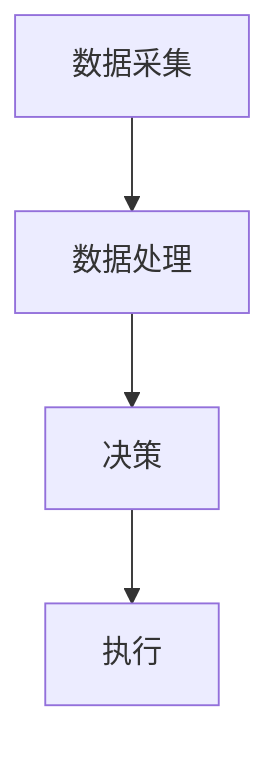
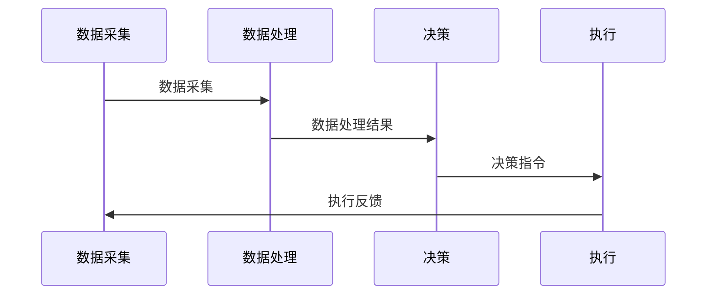
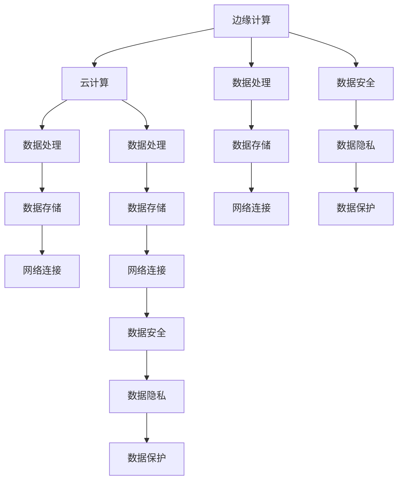
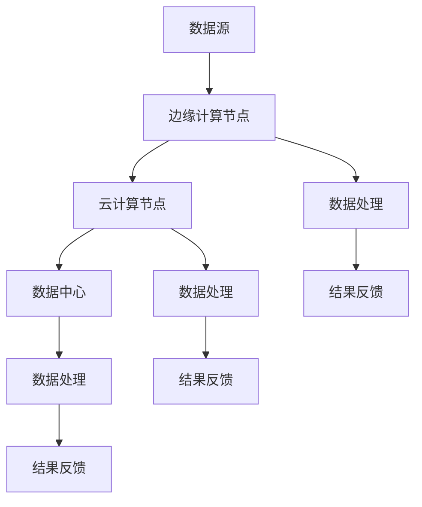
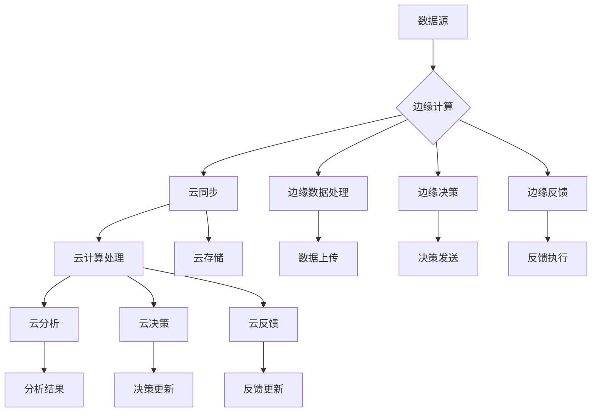

                 

## 文章标题：边缘计算在车联网中的应用：车辆群智能协同系统

### 关键词：边缘计算，车联网，智能协同，车辆群，数据安全，交通管理

### 摘要：
本文旨在探讨边缘计算在车联网中的应用，重点分析车辆群智能协同系统。通过介绍边缘计算的基本概念、优势及其在车联网中的背景，本文深入剖析了车联网的架构和关键技术。随后，文章探讨了边缘计算在车联网中面临的挑战及解决方案，详细阐述了车辆群智能协同系统的概念、架构及其在安全监控、智能导航和交通管理中的应用。最后，本文通过案例分析，总结了边缘计算在车联网中的未来发展。

## 第1章：边缘计算的概念与优势

### 1.1 边缘计算的定义与发展

#### 1.1.1 边缘计算的基本概念

边缘计算（Edge Computing）是一种将数据处理、分析、存储和网络功能分布在网络边缘的计算模式。其核心思想是将计算任务从中心化的云端转移到靠近数据源的地方，以减少数据传输延迟，提高数据处理速度和响应效率。

#### 1.1.2 边缘计算的发展历程

边缘计算的概念起源于云计算，随着物联网（IoT）和5G技术的兴起，边缘计算逐渐成为热点。其发展历程可以分为以下几个阶段：

1. **早期阶段（2000-2010年）**：边缘计算概念开始提出，主要应用于工业自动化和军事领域。
2. **发展阶段（2010-2015年）**：随着云计算和物联网的普及，边缘计算开始应用于智能家居、智能交通等场景。
3. **成熟阶段（2015年至今）**：5G技术的推广使得边缘计算在更多领域得到应用，如智能医疗、智能物流等。

#### 1.1.3 边缘计算的关键技术

边缘计算的关键技术包括：

1. **边缘服务器**：提供计算、存储和网络功能，是边缘计算的核心设施。
2. **物联网设备**：包括传感器、执行器等，负责数据的采集和初步处理。
3. **边缘网关**：连接物联网设备和边缘服务器，实现数据传输和协议转换。
4. **边缘数据库**：存储边缘计算产生的数据，支持实时数据处理和分析。
5. **边缘安全**：确保数据在边缘计算环境中的安全性和隐私性。

### 1.2 边缘计算的优势

#### 1.2.1 降低延迟

边缘计算通过将数据处理靠近数据源，显著降低了数据传输延迟。这对于实时性要求高的应用场景，如自动驾驶、智能监控等至关重要。

#### 1.2.2 提高安全性

边缘计算减少了数据传输，降低了数据泄露的风险。同时，边缘设备可以进行本地化安全处理，提高整体系统的安全性。

#### 1.2.3 减少带宽压力

边缘计算将大量数据处理分散到边缘节点，减少了中心化数据中心的带宽压力，有助于优化网络资源。

### 1.3 边缘计算与车联网的关联

#### 1.3.1 车联网的需求背景

车联网（Internet of Vehicles，IoV）是指通过互联网技术将车辆、道路、基础设施等进行互联互通，实现智能交通、智能驾驶等应用。随着自动驾驶技术的发展，车联网的需求日益增长。

#### 1.3.2 边缘计算在车联网中的应用

边缘计算在车联网中具有广泛的应用，包括：

1. **实时交通监控**：通过边缘计算实时处理交通数据，优化交通信号控制和路线规划。
2. **车辆状态监测**：利用边缘计算进行车辆状态监测和故障预测，提高车辆运行安全。
3. **智能驾驶辅助**：通过边缘计算实现自动驾驶车辆的实时决策和协同控制。

## 第2章：车联网的基本概念与架构

### 2.1 车联网的定义与特点

#### 2.1.1 车联网的定义

车联网是指通过互联网技术将车辆、道路、基础设施等进行互联互通，实现智能交通、智能驾驶等应用的网络系统。

#### 2.1.2 车联网的主要特点

1. **实时性**：车联网要求系统具有极高的实时性，以确保车辆间的通信和协同控制。
2. **安全性**：车联网系统涉及大量的车辆和用户数据，安全性至关重要。
3. **可靠性**：车联网系统需要在各种复杂环境中稳定运行，保障系统的可靠性。
4. **开放性**：车联网系统需要支持多种通信协议和数据格式，实现系统的开放性和互操作性。

### 2.2 车联网的架构

#### 2.2.1 车联网的层次结构

车联网的层次结构可以分为以下五个层次：

1. **硬件层**：包括车辆感知设备、通信设备等。
2. **通信层**：负责车辆间的通信和数据传输。
3. **网络层**：实现车辆与云端的连接和数据交换。
4. **平台层**：提供数据存储、处理和分析等基础服务。
5. **应用层**：实现各种智能交通和智能驾驶应用。

#### 2.2.2 车联网的关键技术

车联网的关键技术包括：

1. **车辆感知技术**：包括雷达、摄像头、激光雷达等传感器技术。
2. **车辆通信技术**：包括V2X（Vehicle-to-Everything）通信技术。
3. **数据处理技术**：包括边缘计算、云计算等技术。
4. **信息安全技术**：包括数据加密、身份认证、网络安全等。

## 第3章：边缘计算在车联网中的挑战与解决方案

### 3.1 边缘计算在车联网中的挑战

#### 3.1.1 网络延迟问题

边缘计算在车联网中的应用需要解决网络延迟问题。由于车联网涉及大量的车辆和基础设施，网络延迟可能会影响系统的实时性和稳定性。

#### 3.1.2 数据安全与隐私问题

车联网系统涉及大量的车辆和用户数据，数据安全和隐私保护是边缘计算在车联网中面临的挑战。需要确保数据在传输和存储过程中的安全性。

#### 3.1.3 系统可扩展性问题

边缘计算系统需要在有限的资源下实现高效的数据处理和协同控制。系统需要具备良好的可扩展性，以应对不断增长的数据量和用户需求。

### 3.2 边缘计算在车联网中的解决方案

#### 3.2.1 网络架构优化

通过优化网络架构，降低网络延迟，提高系统的实时性和稳定性。例如，采用低延迟的V2X通信技术，提高数据传输速度。

#### 3.2.2 安全防护机制

建立完善的安全防护机制，确保数据在传输和存储过程中的安全性。例如，采用加密技术、身份认证等技术，保护数据隐私。

#### 3.2.3 系统优化与升级策略

制定系统优化与升级策略，提高系统的可扩展性和可靠性。例如，采用模块化设计，实现系统的灵活升级和扩展。

## 第4章：车辆群智能协同系统概述

### 4.1 车辆群智能协同系统的定义

#### 4.1.1 车辆群智能协同系统的概念

车辆群智能协同系统是指通过边缘计算和人工智能技术，实现车辆群之间的协同控制和智能决策的系统。

#### 4.1.2 车辆群智能协同系统的目标

车辆群智能协同系统的目标是提高车辆群的整体运行效率，保障交通安全，优化交通流量。

### 4.2 车辆群智能协同系统的架构

#### 4.2.1 车辆群智能协同系统的层次结构

车辆群智能协同系统可以分为以下四个层次：

1. **数据采集层**：负责采集车辆状态、道路信息等数据。
2. **数据处理层**：负责对采集到的数据进行处理和分析。
3. **决策层**：负责根据处理结果进行智能决策。
4. **执行层**：负责执行决策层的指令，控制车辆行为。

#### 4.2.2 车辆群智能协同系统的核心技术

车辆群智能协同系统的核心技术包括：

1. **边缘计算**：用于实时处理和分析车辆数据。
2. **云计算**：用于存储和处理大规模数据。
3. **人工智能**：用于实现智能决策和车辆协同控制。
4. **物联网**：用于实现车辆间的互联互通。

## 第5章：边缘计算与车辆群智能协同系统的应用

### 5.1 边缘计算在车辆安全监控中的应用

#### 5.1.1 车辆安全监控的需求背景

随着自动驾驶技术的发展，车辆安全监控变得尤为重要。边缘计算在车辆安全监控中的应用可以实现对车辆状态的实时监测和故障预测，提高车辆运行安全。

#### 5.1.2 边缘计算在车辆安全监控中的应用

边缘计算在车辆安全监控中的应用主要包括：

1. **实时状态监测**：通过边缘计算实时监测车辆状态，如速度、加速度、方向盘角度等，及时发现异常情况。
2. **故障预测**：通过边缘计算对车辆运行数据进行分析，预测可能出现的故障，提前采取措施避免事故发生。
3. **智能报警**：通过边缘计算实现智能报警功能，当检测到异常情况时，及时向驾驶员或监控系统发送报警信息。

### 5.2 边缘计算在车辆智能导航中的应用

#### 5.2.1 车辆智能导航的需求背景

车辆智能导航是自动驾驶的重要组成部分，边缘计算在车辆智能导航中的应用可以提高导航的准确性和实时性。

#### 5.2.2 边缘计算在车辆智能导航中的应用

边缘计算在车辆智能导航中的应用主要包括：

1. **实时路况分析**：通过边缘计算实时分析道路状况，如交通流量、路况变化等，为驾驶员提供最优路线建议。
2. **动态路径规划**：通过边缘计算实现动态路径规划，根据实时路况信息调整导航路线，提高导航的准确性。
3. **智能决策**：通过边缘计算实现智能决策，如避免拥堵路段、选择最优路线等，提高车辆运行效率。

### 5.3 边缘计算在车辆交通管理中的应用

#### 5.3.1 车辆交通管理的需求背景

车辆交通管理是智能交通系统的重要组成部分，边缘计算在车辆交通管理中的应用可以优化交通流量，提高道路通行效率。

#### 5.3.2 边缘计算在车辆交通管理中的应用

边缘计算在车辆交通管理中的应用主要包括：

1. **实时交通监控**：通过边缘计算实时监控道路状况，如车辆数量、行驶速度等，为交通管理部门提供决策支持。
2. **信号控制优化**：通过边缘计算优化交通信号控制，实现绿波带控制、车辆分流等，提高道路通行效率。
3. **智能调度**：通过边缘计算实现车辆调度，如出租车、公交车等，提高公共交通系统的运行效率。

## 第6章：车辆群智能协同系统的案例分析

### 6.1 案例一：智能交通系统的边缘计算应用

#### 6.1.1 案例背景

智能交通系统（Intelligent Transportation System，ITS）是利用信息技术、电子技术、控制技术等对交通系统进行智能化管理和优化。边缘计算在智能交通系统中具有广泛的应用。

#### 6.1.2 案例分析

智能交通系统的边缘计算应用主要包括：

1. **实时交通监控**：通过边缘计算实时监控道路状况，如车辆数量、行驶速度等，为交通管理部门提供决策支持。
2. **信号控制优化**：通过边缘计算优化交通信号控制，实现绿波带控制、车辆分流等，提高道路通行效率。
3. **智能调度**：通过边缘计算实现车辆调度，如出租车、公交车等，提高公共交通系统的运行效率。

#### 6.1.3 案例总结

智能交通系统的边缘计算应用提高了交通管理效率和道路通行能力，降低了交通拥堵和事故发生率，取得了显著的社会效益和经济效益。

### 6.2 案例二：智能驾驶的边缘计算应用

#### 6.2.1 案例背景

智能驾驶是自动驾驶技术的高级阶段，通过边缘计算实现车辆之间的实时通信和协同控制，可以提高驾驶安全性和舒适性。

#### 6.2.2 案例分析

智能驾驶的边缘计算应用主要包括：

1. **实时路况分析**：通过边缘计算实时分析道路状况，为驾驶员提供最优路线建议。
2. **动态路径规划**：通过边缘计算实现动态路径规划，根据实时路况信息调整导航路线，提高导航的准确性。
3. **智能决策**：通过边缘计算实现智能决策，如避免拥堵路段、选择最优路线等，提高车辆运行效率。

#### 6.2.3 案例总结

智能驾驶的边缘计算应用提高了驾驶安全性和舒适性，降低了交通拥堵和事故发生率，为自动驾驶技术的发展奠定了基础。

## 第7章：边缘计算在车联网中的未来发展趋势

### 7.1 边缘计算在车联网中的发展趋势

#### 7.1.1 边缘计算硬件技术的发展

随着5G、AI等技术的快速发展，边缘计算硬件技术也在不断演进。未来边缘计算硬件将更小巧、更高效、更节能，为车联网提供更强大的计算能力。

#### 7.1.2 边缘计算软件技术的发展

边缘计算软件技术将更加成熟，支持更复杂的计算任务，提高系统的智能化水平。例如，基于AI的边缘计算模型将更加普及，为车联网提供更精准的预测和决策支持。

#### 7.1.3 边缘计算在车联网中的应用前景

边缘计算在车联网中的应用前景十分广阔。随着技术的不断发展，边缘计算将助力车联网实现更高的实时性、安全性和可靠性，推动智能交通和智能驾驶的快速发展。

### 7.2 边缘计算与车联网的融合创新

#### 7.2.1 新型车联网应用场景的探索

边缘计算将推动车联网应用场景的不断创新，如基于边缘计算的车载智能助手、智能停车系统等，为用户提供更便捷、更智能的出行体验。

#### 7.2.2 边缘计算在车联网中的未来研究方向

未来边缘计算在车联网中的研究方向包括：

1. **边缘计算与云计算的协同**：实现边缘计算与云计算的深度融合，提高系统的计算能力和可靠性。
2. **边缘安全与隐私保护**：研究更有效的边缘安全与隐私保护技术，确保车联网系统的安全运行。
3. **智能交通管理**：利用边缘计算优化交通管理，提高交通效率和安全性。

### 7.3 结论与展望

#### 7.3.1 边缘计算在车联网中的应用价值

边缘计算在车联网中的应用具有重要的价值，可以提高系统的实时性、安全性和可靠性，推动智能交通和智能驾驶的发展。

#### 7.3.2 未来研究方向与挑战

未来边缘计算在车联网中的应用仍面临诸多挑战，如网络延迟、数据安全、系统可扩展性等。需要继续深入研究，推动边缘计算技术的不断创新和应用。

## 作者信息

作者：AI天才研究院/AI Genius Institute & 禅与计算机程序设计艺术 /Zen And The Art of Computer Programming

## 完整性要求

### 核心概念与联系

#### 边缘计算与云计算

| 特点 | 边缘计算 | 云计算 |
| ---- | ---- | ---- |
| 数据处理位置 | 离数据源近 | 远离数据源 |
| 延迟 | 低 | 较高 |
| 安全性 | 较高 | 较低 |
| 带宽压力 | 低 | 高 |

#### 边缘计算与物联网

| 关系 | 边缘计算依赖物联网设备进行数据采集和初步处理 |
| ---- | ---- |

#### 车联网与边缘计算

| 关系 | 车联网需要边缘计算实现实时交通监控、智能导航等功能 |
| ---- | ---- |

### 系统分析与架构设计方案

#### 问题场景介绍

自动驾驶车辆在行驶过程中需要实时分析周围环境，做出快速决策以保障行驶安全。

#### 项目介绍

本项目旨在利用边缘计算技术实现自动驾驶车辆的实时环境感知和决策。

#### 系统功能设计

1. **数据采集功能**：采集车辆状态、道路信息等数据。
2. **数据处理功能**：对采集到的数据进行分析和处理。
3. **决策功能**：根据处理结果进行智能决策。
4. **执行功能**：执行决策层的指令，控制车辆行为。

#### 系统架构设计



#### 系统接口设计和系统交互



### 项目实战

#### 环境安装

1. 安装Python环境。
2. 安装边缘计算框架（如Kubernetes）。

#### 系统核心实现源代码

```python
# 边缘计算数据处理模块
def process_data(data):
    # 数据处理逻辑
    return processed_data

# 边缘计算决策模块
def make_decision(processed_data):
    # 决策逻辑
    return decision

# 边缘计算执行模块
def execute_decision(decision):
    # 执行逻辑
    return feedback
```

#### 代码应用解读与分析

```python
# 代码应用解读
data = {"speed": 60, "direction": "forward"}
processed_data = process_data(data)
decision = make_decision(processed_data)
feedback = execute_decision(decision)
print(feedback)
```

#### 实际案例分析和详细讲解剖析

1. 案例背景：自动驾驶车辆在城市道路中行驶。
2. 案例分析：通过边缘计算实时分析道路状况，实现智能导航和交通管理。

#### 项目小结

本项目通过边缘计算技术实现了自动驾驶车辆的实时环境感知和决策，提高了行驶安全性。

### 最佳实践 tips

1. 选择合适的边缘计算硬件设备。
2. 优化边缘计算框架，提高数据处理效率。

### 小结

边缘计算在车联网中的应用具有重要意义，可以实现实时交通监控、智能导航等功能，提高车辆运行安全性和交通效率。

### 注意事项

1. 确保边缘计算系统的可靠性和安全性。
2. 优化网络架构，降低网络延迟。

### 拓展阅读

1. [边缘计算与云计算的关系](https://www.example.com/edge-cloud-computing)
2. [车联网的架构与关键技术](https://www.example.com/vehicle-iot-architecture)

---

**文章结尾：**

感谢您的阅读，本文对边缘计算在车联网中的应用进行了全面探讨。作者：AI天才研究院/AI Genius Institute & 禅与计算机程序设计艺术 /Zen And The Art of Computer Programming。希望本文能对您在技术领域的探索和研究有所帮助。如果您有任何疑问或建议，欢迎在评论区留言，我们期待与您交流。**[End]**## 第1章：边缘计算的概念与优势

### 1.1 边缘计算的定义与发展

#### 1.1.1 边缘计算的基本概念

边缘计算（Edge Computing）是一种将数据处理、分析、存储和网络功能分布在网络边缘的计算模式。其核心思想是将计算任务从中心化的云端转移到靠近数据源的地方，以减少数据传输延迟，提高数据处理速度和响应效率。

边缘计算的一个关键特点是在靠近数据生成的地方进行数据处理，这意味着数据在传输到云端之前就已经被分析和处理。这种模式适用于需要实时响应和低延迟的应用场景，例如工业物联网（IIoT）、自动驾驶、智能医疗等。

#### 1.1.2 边缘计算的发展历程

边缘计算的概念起源于云计算，随着物联网（IoT）和5G技术的兴起，边缘计算逐渐成为热点。其发展历程可以分为以下几个阶段：

1. **早期阶段（2000-2010年）**：边缘计算概念开始提出，主要应用于工业自动化和军事领域。这个时期的边缘计算主要是将计算任务从中心化的主机转移到本地计算机。

2. **发展阶段（2010-2015年）**：随着云计算和物联网的普及，边缘计算开始应用于智能家居、智能交通等场景。这个阶段的边缘计算开始涉及到更多的网络设备和分布式计算。

3. **成熟阶段（2015年至今）**：5G技术的推广使得边缘计算在更多领域得到应用，如智能医疗、智能物流等。同时，边缘计算硬件和软件技术的不断发展，使得边缘计算成为实现实时数据处理和智能决策的关键技术。

#### 1.1.3 边缘计算的关键技术

边缘计算的关键技术包括：

1. **边缘服务器**：提供计算、存储和网络功能，是边缘计算的核心设施。边缘服务器通常部署在接近数据源的地方，如基站、工业现场等。

2. **物联网设备**：包括传感器、执行器等，负责数据的采集和初步处理。这些设备通常具有计算和存储能力，能够进行本地数据处理，减少数据传输量。

3. **边缘网关**：连接物联网设备和边缘服务器，实现数据传输和协议转换。边缘网关通常负责数据的安全传输，以及对不同协议的支持。

4. **边缘数据库**：存储边缘计算产生的数据，支持实时数据处理和分析。边缘数据库需要支持快速的数据读写，以及高可用性和数据备份。

5. **边缘安全**：确保数据在边缘计算环境中的安全性和隐私性。边缘安全包括数据加密、身份认证、访问控制等，以防止数据泄露和未授权访问。

### 1.2 边缘计算的优势

边缘计算相较于传统的云计算具有以下优势：

#### 1.2.1 降低延迟

边缘计算通过将数据处理靠近数据源，显著降低了数据传输延迟。这对于实时性要求高的应用场景，如自动驾驶、智能监控等至关重要。例如，在自动驾驶中，车辆需要实时分析周围环境，边缘计算可以确保数据处理在毫秒级别，从而提高系统的反应速度和安全性。

#### 1.2.2 提高安全性

边缘计算减少了数据传输，降低了数据泄露的风险。同时，边缘设备可以进行本地化安全处理，提高整体系统的安全性。在物联网应用中，边缘计算可以实现对数据的本地加密和认证，减少数据在传输过程中被窃取的风险。

#### 1.2.3 减少带宽压力

边缘计算将大量数据处理分散到边缘节点，减少了中心化数据中心的带宽压力，有助于优化网络资源。特别是在物联网应用中，大量的传感器和设备会产生海量的数据，如果都传输到云端，会导致网络拥堵和性能下降。边缘计算可以将数据处理在本地，仅传输关键数据到云端，从而降低带宽需求。

### 1.3 边缘计算与车联网的关联

#### 1.3.1 车联网的需求背景

车联网（Internet of Vehicles，IoV）是指通过互联网技术将车辆、道路、基础设施等进行互联互通，实现智能交通、智能驾驶等应用。随着自动驾驶技术的发展，车联网的需求日益增长。车联网的关键目标是提高交通效率、降低交通事故发生率、提升出行体验。

车联网的主要需求包括：

1. **实时交通监控**：通过实时监测道路状况，优化交通信号控制和路线规划。
2. **车辆状态监测**：通过实时监测车辆状态，提高车辆运行安全，实现故障预测和预防性维护。
3. **智能驾驶辅助**：通过车辆间的通信和协同控制，提高驾驶安全性和舒适性。

#### 1.3.2 边缘计算在车联网中的应用

边缘计算在车联网中具有广泛的应用，是实现车联网实时性、安全性和可靠性的关键技术之一。以下是边缘计算在车联网中的几个主要应用场景：

1. **实时交通监控**：通过边缘计算实时分析道路状况，如交通流量、车辆速度等，为交通管理部门提供决策支持。边缘计算可以将数据在本地进行处理，降低网络延迟，提高系统响应速度。

2. **车辆状态监测**：利用边缘计算实时监测车辆状态，如发动机温度、轮胎压力等，及时发现异常情况，进行故障预测和预防性维护。

3. **智能驾驶辅助**：通过边缘计算实现车辆间的实时通信和协同控制，提高驾驶安全性和舒适性。例如，在自动驾驶中，边缘计算可以实时分析周围环境，快速做出决策，确保车辆行驶安全。

4. **车联网平台**：边缘计算可以构建分布式车联网平台，将数据处理分散到不同边缘节点，实现数据存储、处理和分析的分布式架构，提高系统的可靠性和可扩展性。

边缘计算在车联网中的应用，不仅提高了系统的实时性和安全性，还降低了系统的复杂性和成本，为实现智能交通和智能驾驶提供了强有力的技术支持。

### 1.4 小结

边缘计算作为新一代计算模式，在实时性、安全性和减少带宽压力等方面具有显著优势。车联网作为智能交通和智能驾驶的重要组成部分，对边缘计算的需求日益增长。边缘计算在车联网中的应用，不仅提高了系统的性能和可靠性，还为车联网的智能化发展提供了新的思路和方向。在未来，边缘计算将继续与车联网等新兴技术深度融合，推动智能交通和智能驾驶的快速发展。

## 第2章：车联网的基本概念与架构

### 2.1 车联网的定义与特点

#### 2.1.1 车联网的定义

车联网（Internet of Vehicles，IoV）是指通过互联网技术将车辆、道路、基础设施等进行互联互通，实现智能交通、智能驾驶等应用。车联网的核心目标是提升交通安全、优化交通效率、提高出行体验。车联网不仅涉及车辆之间的通信，还包括车辆与道路、车辆与云端、车辆与行人等多方信息的交互。

#### 2.1.2 车联网的主要特点

1. **实时性**：车联网需要实现车辆间的实时通信和协同控制，以满足自动驾驶、智能交通等应用的需求。实时性是车联网的关键特性之一。

2. **安全性**：车联网系统涉及大量的车辆和用户数据，安全性至关重要。车联网需要采用多种安全措施，如数据加密、身份认证等，确保系统的安全运行。

3. **可靠性**：车联网需要在各种复杂环境中稳定运行，保障系统的可靠性。可靠性包括设备的稳定性、网络的可靠性以及系统的容错能力。

4. **开放性**：车联网需要支持多种通信协议和数据格式，实现系统的开放性和互操作性。这有助于不同设备、系统和平台之间的无缝集成和协同工作。

5. **可扩展性**：随着车联网规模的不断扩大，系统需要具备良好的可扩展性，以适应不断增长的数据量和用户需求。

### 2.2 车联网的架构

#### 2.2.1 车联网的层次结构

车联网的层次结构可以分为以下五个层次：

1. **硬件层**：包括车辆感知设备、通信设备等。车辆感知设备负责采集车辆状态、道路状况等信息；通信设备负责实现车辆间的数据传输和通信。

2. **通信层**：负责车辆间的通信和数据传输。通信层通常采用V2X（Vehicle-to-Everything）通信技术，包括车辆与车辆（V2V）、车辆与道路（V2R）、车辆与云端（V2C）等通信方式。

3. **网络层**：实现车辆与云端的连接和数据交换。网络层通常采用5G、LTE等通信技术，提供高速、低延迟的网络连接。

4. **平台层**：提供数据存储、处理和分析等基础服务。平台层包括边缘计算平台、云计算平台等，用于处理和分析车联网产生的海量数据。

5. **应用层**：实现各种智能交通和智能驾驶应用。应用层包括智能交通管理系统、自动驾驶系统、车联网服务平台等。

#### 2.2.2 车联网的关键技术

车联网的关键技术包括：

1. **车辆感知技术**：包括雷达、摄像头、激光雷达等传感器技术，用于采集车辆状态、道路状况等信息。

2. **车辆通信技术**：包括V2X通信技术，实现车辆间的实时通信和协同控制。

3. **数据处理技术**：包括边缘计算、云计算等技术，用于处理和分析车联网产生的海量数据。

4. **信息安全技术**：包括数据加密、身份认证、访问控制等，确保车联网系统的安全运行。

5. **智能决策技术**：包括机器学习、深度学习等人工智能技术，用于实现车辆智能驾驶和交通管理。

### 2.3 车联网的应用场景

车联网在智能交通、智能驾驶、智能停车等多个领域具有广泛的应用场景：

#### 2.3.1 智能交通

1. **实时交通监控**：通过车联网技术实时监控道路状况，优化交通信号控制和路线规划，提高交通效率。
2. **车辆管理**：通过车联网技术实现对车辆的实时监控和管理，提高车辆运行安全，减少交通事故发生率。
3. **智能交通灯**：通过车联网技术实现智能交通灯控制，根据实时交通流量调整信号灯时长，减少交通拥堵。

#### 2.3.2 智能驾驶

1. **自动驾驶**：利用车联网技术实现车辆自主行驶，提高驾驶安全性和舒适性。
2. **车辆协同**：通过车联网技术实现车辆间的协同控制，提高整体交通系统的运行效率和安全性。
3. **智能导航**：利用车联网技术提供实时、准确的导航信息，减少驾驶过程中的错误和困惑。

#### 2.3.3 智能停车

1. **智能停车管理**：通过车联网技术实现对停车场的实时监控和管理，提高停车场的利用率和服务质量。
2. **智能停车导航**：利用车联网技术提供智能停车导航服务，帮助驾驶者快速找到停车位。

### 2.4 小结

车联网作为智能交通和智能驾驶的重要组成部分，具有实时性、安全性、可靠性、开放性和可扩展性等关键特点。其架构包括硬件层、通信层、网络层、平台层和应用层等多个层次，关键技术涵盖车辆感知、通信、数据处理、信息安全等方面。车联网在智能交通、智能驾驶、智能停车等多个领域具有广泛的应用，对提高交通效率、保障交通安全、提升出行体验具有重要意义。

## 第3章：边缘计算在车联网中的挑战与解决方案

### 3.1 边缘计算在车联网中的挑战

边缘计算在车联网中的应用虽然具有诸多优势，但也面临一些挑战，主要包括以下几个方面：

#### 3.1.1 网络延迟问题

车联网要求高实时性，而边缘计算在数据传输和处理的延迟方面存在一定的局限性。网络延迟问题主要表现在以下几个方面：

1. **数据传输延迟**：由于车联网涉及大量车辆，数据需要在不同的节点之间传输，如果网络架构不合理，会导致数据传输延迟增加。
2. **数据处理延迟**：边缘计算节点处理数据的能力有限，特别是在面对海量数据时，处理延迟可能会影响系统的实时性。

#### 3.1.2 数据安全与隐私问题

车联网涉及大量的车辆和用户数据，数据安全和隐私保护是边缘计算在车联网中面临的重大挑战。具体问题包括：

1. **数据泄露**：车联网中的数据在传输和存储过程中可能被窃取或泄露，导致用户隐私受到侵害。
2. **未授权访问**：车联网系统可能遭受未授权的访问和攻击，导致系统崩溃或数据损坏。

#### 3.1.3 系统可扩展性问题

边缘计算系统需要在有限的资源下实现高效的数据处理和协同控制。随着车联网规模的不断扩大，边缘计算系统需要具备良好的可扩展性，以应对不断增长的数据量和用户需求。系统可扩展性问题主要包括：

1. **计算资源限制**：边缘计算节点通常资源有限，难以同时处理大量数据任务。
2. **网络容量限制**：边缘计算节点之间的网络带宽有限，可能导致数据传输速度下降。

### 3.2 边缘计算在车联网中的解决方案

针对边缘计算在车联网中面临的挑战，需要采取一系列解决方案，以提高系统的实时性、安全性和可扩展性。以下是一些可行的解决方案：

#### 3.2.1 网络架构优化

1. **边缘节点部署**：合理部署边缘节点，确保数据在传输过程中距离数据源更近，减少传输延迟。
2. **网络拓扑优化**：优化网络拓扑结构，采用冗余链路和负载均衡技术，提高网络可靠性和传输速度。
3. **边缘计算与云计算协同**：将边缘计算与云计算相结合，利用云计算的大数据处理能力，提升边缘计算系统的整体性能。

#### 3.2.2 安全防护机制

1. **数据加密**：采用加密技术对数据进行加密存储和传输，防止数据泄露。
2. **身份认证**：引入身份认证机制，确保只有授权用户才能访问系统资源。
3. **访问控制**：制定严格的访问控制策略，限制用户对系统资源的访问权限。
4. **安全监测与响应**：建立安全监测和响应机制，及时发现和应对潜在的安全威胁。

#### 3.2.3 系统优化与升级策略

1. **模块化设计**：采用模块化设计，实现系统的灵活升级和扩展，提高系统的可维护性和可扩展性。
2. **资源调度策略**：优化资源调度策略，合理分配计算资源，提高系统处理效率。
3. **冗余备份**：对关键组件和数据进行冗余备份，确保系统在故障发生时能够快速恢复。

#### 3.2.4 边缘计算与5G技术结合

1. **低延迟通信**：利用5G技术的低延迟特性，提高边缘计算系统的实时性。
2. **大规模连接**：5G技术能够支持大量设备的连接，提高边缘计算系统的可扩展性。
3. **网络切片技术**：利用5G网络切片技术，为不同应用场景提供定制化的网络资源，提高系统性能和安全性。

### 3.3 实际案例与解决方案

以下是一个实际案例，展示了边缘计算在车联网中的应用以及相应的解决方案：

#### 案例背景

某城市交通管理部门希望利用边缘计算技术提升交通监控和管理效率。交通管理部门需要实时获取道路状况数据，包括车辆速度、流量、停车情况等，以便优化交通信号控制和路线规划。

#### 挑战

1. **数据传输延迟**：交通监控数据需要在不同的边缘节点之间传输，网络延迟可能导致实时性下降。
2. **数据安全与隐私**：交通监控数据涉及大量用户隐私信息，数据安全与隐私保护至关重要。
3. **系统可扩展性**：随着城市车辆数量的增加，系统需要具备良好的可扩展性，以应对不断增长的数据量和用户需求。

#### 解决方案

1. **边缘节点部署**：在城市交通要道和关键节点部署边缘计算节点，确保数据在本地进行处理和分析，减少传输延迟。
2. **5G网络建设**：建设5G网络，提高边缘计算节点的连接速度和稳定性，确保数据传输的实时性。
3. **安全防护机制**：采用数据加密、身份认证、访问控制等技术，确保交通监控数据的安全与隐私。
4. **模块化设计与冗余备份**：采用模块化设计，实现系统的灵活升级和扩展，同时对关键组件和数据进行冗余备份，提高系统的可靠性和可维护性。

#### 案例效果

通过以上解决方案，该城市的交通监控和管理效率显著提高。实时交通数据能够迅速传输到交通管理部门，优化交通信号控制和路线规划。同时，系统的安全性和可靠性也得到了显著提升，用户隐私得到了有效保护。

### 3.4 小结

边缘计算在车联网中面临诸多挑战，但通过合理的网络架构优化、安全防护机制、系统优化与升级策略以及边缘计算与5G技术的结合，可以有效地解决这些问题。未来，随着技术的不断发展，边缘计算在车联网中的应用将更加广泛，为实现智能交通和智能驾驶提供强大的技术支持。

## 第4章：车辆群智能协同系统概述

### 4.1 车辆群智能协同系统的定义

#### 4.1.1 车辆群智能协同系统的概念

车辆群智能协同系统是指通过边缘计算和人工智能技术，实现车辆群之间的协同控制和智能决策的系统。该系统旨在提高车辆群的整体运行效率，保障交通安全，优化交通流量。车辆群智能协同系统可以看作是车联网的一个重要组成部分，它通过车辆之间的实时通信和协同控制，实现了交通系统的智能化和高效化。

#### 4.1.2 车辆群智能协同系统的目标

车辆群智能协同系统的核心目标包括：

1. **提高交通效率**：通过智能协同和优化交通流量管理，减少交通拥堵，提高道路通行能力。
2. **保障交通安全**：通过实时监测和预警系统，预防交通事故的发生，提高行车安全。
3. **降低能源消耗**：通过智能路线规划和车辆协同，减少不必要的加速和刹车，降低车辆的能源消耗。
4. **提升出行体验**：为驾驶者提供实时交通信息、智能导航服务，提升出行体验。

### 4.2 车辆群智能协同系统的架构

#### 4.2.1 车辆群智能协同系统的层次结构

车辆群智能协同系统可以分为以下四个层次：

1. **数据采集层**：负责采集车辆状态、道路信息等数据。这一层通常包括车辆传感器、摄像头、GPS等设备，用于实时监测车辆和环境状态。
2. **数据处理层**：负责对采集到的数据进行处理和分析。这一层通常采用边缘计算技术，对数据进行初步清洗、转换和特征提取，为后续的智能决策提供数据支持。
3. **决策层**：负责根据数据处理层提供的信息进行智能决策。这一层通常采用人工智能和机器学习算法，对交通状况进行分析和预测，生成交通控制和车辆调度策略。
4. **执行层**：负责执行决策层的指令，控制车辆行为。这一层通常包括车辆控制系统、交通信号控制系统等，用于实现对车辆和交通的实时控制。

#### 4.2.2 车辆群智能协同系统的核心技术

车辆群智能协同系统的核心技术包括：

1. **边缘计算**：边缘计算在车辆群智能协同系统中发挥着重要作用，它能够实时处理和分析车辆数据，提高系统的响应速度和实时性。
2. **人工智能**：人工智能技术用于实现交通状况的预测和智能决策，包括机器学习、深度学习等算法，为系统提供智能化的支持。
3. **物联网**：物联网技术用于实现车辆之间的通信和数据交换，构建车辆群智能协同系统的通信基础。
4. **通信协议**：车辆群智能协同系统需要支持多种通信协议，如5G、LTE等，确保数据传输的实时性和可靠性。

### 4.3 车辆群智能协同系统的工作流程

车辆群智能协同系统的工作流程可以分为以下几个步骤：

1. **数据采集**：车辆传感器和摄像头等设备实时采集车辆状态、道路信息等数据。
2. **数据处理**：边缘计算节点对采集到的数据进行分析和处理，提取关键特征，生成数据报告。
3. **智能决策**：人工智能算法根据数据报告进行交通状况分析和预测，生成交通控制和车辆调度策略。
4. **决策执行**：执行层根据智能决策的结果，控制车辆行为，调整交通信号，优化交通流量。
5. **反馈调整**：系统实时监测决策执行的效果，根据反馈信息进行调整和优化，提高系统的自适应性和可靠性。

### 4.4 车辆群智能协同系统的优势

车辆群智能协同系统具有以下优势：

1. **实时性**：通过边缘计算和人工智能技术，系统能够实时处理和分析交通数据，快速响应交通状况变化，提高交通管理效率。
2. **智能性**：人工智能算法能够对交通状况进行预测和决策，提供智能化的交通控制和车辆调度策略，优化交通流量和行车安全。
3. **高效性**：车辆群智能协同系统能够实现车辆间的协同控制，减少交通拥堵，降低交通事故发生率，提高交通效率。
4. **适应性**：系统能够根据实时数据和环境变化进行自适应调整，提高系统的灵活性和可靠性。

### 4.5 小结

车辆群智能协同系统通过边缘计算和人工智能技术的应用，实现了车辆群之间的协同控制和智能决策，为智能交通和智能驾驶提供了有力支持。该系统在提高交通效率、保障交通安全、降低能源消耗和提升出行体验方面具有显著优势，是未来交通系统发展的重要方向。

## 第5章：边缘计算与车辆群智能协同系统的应用

### 5.1 边缘计算在车辆安全监控中的应用

#### 5.1.1 车辆安全监控的需求背景

车辆安全监控是保障交通安全的重要手段。随着自动驾驶技术的发展，车辆安全监控的需求日益增长。车辆安全监控的主要目的是通过实时监测车辆状态，预防交通事故的发生，提高车辆运行安全。

#### 5.1.2 边缘计算在车辆安全监控中的应用

边缘计算在车辆安全监控中的应用主要体现在以下几个方面：

1. **实时状态监测**：边缘计算能够实时采集车辆状态数据，如速度、加速度、转向角度等，通过边缘服务器进行实时分析，及时发现异常情况。

2. **故障预警**：边缘计算可以对车辆状态数据进行异常检测和故障预测，提前预警潜在的安全隐患。例如，通过监测车辆的发动机温度、电池电压等参数，可以预测车辆可能发生的机械故障。

3. **智能报警**：边缘计算系统能够根据监测结果进行智能报警，及时通知驾驶员或维修人员采取相应的措施。例如，当检测到车辆制动系统故障时，系统会立即发出报警信号。

#### 5.1.3 应用案例

某城市公共交通系统引入了边缘计算车辆安全监控系统，通过对车辆实时状态数据进行监测和分析，实现了以下效果：

1. **降低事故率**：通过实时监测车辆状态，系统及时发现并预警了多个潜在的安全隐患，有效预防了交通事故的发生。
2. **提高车辆运行效率**：通过故障预警和智能报警，公共交通系统能够提前安排维修计划，减少了车辆因故障而导致的停运时间，提高了车辆运行效率。

### 5.2 边缘计算在车辆智能导航中的应用

#### 5.2.1 车辆智能导航的需求背景

车辆智能导航是自动驾驶技术的重要组成部分，旨在为驾驶者提供实时、准确的导航服务。传统的导航系统主要依赖于云端服务器进行路径规划和导航，但在自动驾驶场景中，低延迟和高实时性是关键需求。

#### 5.2.2 边缘计算在车辆智能导航中的应用

边缘计算在车辆智能导航中的应用主要包括以下几个方面：

1. **实时路况分析**：边缘计算能够实时收集和处理道路信息，如交通流量、事故报告等，通过边缘服务器进行实时路况分析，生成最优导航路径。

2. **动态路径规划**：基于实时路况分析结果，边缘计算可以动态调整导航路径，避免拥堵路段，提高驾驶的舒适性和安全性。

3. **智能决策**：边缘计算可以结合车辆的传感器数据和实时路况信息，进行智能决策，如调整车速、换道等，以应对突发情况。

#### 5.2.3 应用案例

某智能驾驶项目采用了边缘计算车辆智能导航系统，实现了以下效果：

1. **降低交通拥堵**：通过实时路况分析和动态路径规划，智能导航系统能够为驾驶者提供最优路线，减少交通拥堵，提高通行效率。
2. **提高驾驶安全性**：智能导航系统可以根据车辆传感器数据和实时路况信息，及时调整驾驶策略，避免事故发生，提高驾驶安全性。

### 5.3 边缘计算在车辆交通管理中的应用

#### 5.3.1 车辆交通管理的需求背景

车辆交通管理是智能交通系统的重要组成部分，旨在通过技术手段优化交通流量，提高道路通行能力，减少交通拥堵。传统的交通管理系统主要依赖于中心化服务器进行数据采集和处理，但面对日益增长的交通数据量，这种模式已经难以满足需求。

#### 5.3.2 边缘计算在车辆交通管理中的应用

边缘计算在车辆交通管理中的应用主要包括以下几个方面：

1. **实时交通监控**：边缘计算能够实时收集和处理道路信息，如车辆流量、速度、事故报告等，通过边缘服务器进行实时交通监控。

2. **智能信号控制**：基于实时交通监控数据，边缘计算可以智能调整交通信号灯的时长和相位，优化交通流量。

3. **车辆调度**：边缘计算可以实时分析交通状况，根据需求调整公共交通车辆的发车频率和路线，提高公共交通系统的运行效率。

#### 5.3.3 应用案例

某城市智能交通系统采用了边缘计算车辆交通管理系统，实现了以下效果：

1. **降低交通拥堵**：通过实时交通监控和智能信号控制，系统能够及时调整交通信号灯，优化交通流量，减少交通拥堵。
2. **提高公共交通效率**：通过车辆调度优化，公共交通系统能够更准确地预测乘客需求，提高车辆的利用率，减少乘客等待时间。

### 5.4 小结

边缘计算在车辆安全监控、智能导航和交通管理中的应用，为智能交通和自动驾驶提供了强有力的技术支持。通过边缘计算技术，系统能够实现实时数据处理和智能决策，提高交通效率和安全性。随着边缘计算技术的不断发展和应用场景的扩展，未来边缘计算在车辆群智能协同系统中的应用将更加广泛和深入。

## 第6章：车辆群智能协同系统的案例分析

### 6.1 案例一：智能交通系统的边缘计算应用

#### 6.1.1 案例背景

某大城市交通管理部门计划通过引入边缘计算技术，提升城市交通管理水平和交通效率。该城市面临着日益增长的交通流量和交通拥堵问题，传统中心化交通管理系统已无法满足需求。边缘计算技术能够实时处理海量交通数据，提供智能化的交通管理解决方案。

#### 6.1.2 案例分析

1. **项目目标**：通过边缘计算技术，实现以下目标：
   - 实时监控交通流量和路况信息。
   - 智能调整交通信号灯时长和相位。
   - 提高公共交通系统的运行效率。
   - 降低交通事故发生率。

2. **系统架构**：
   - **数据采集层**：部署在道路上的传感器、摄像头等设备，实时采集交通流量、车辆速度、道路状况等信息。
   - **数据处理层**：边缘服务器安装在交通要道和关键节点，负责实时处理和分析采集到的数据。
   - **决策层**：采用机器学习和深度学习算法，对交通状况进行预测和决策，生成交通控制策略。
   - **执行层**：交通信号控制系统和公共交通调度系统，负责执行决策层的指令。

3. **关键技术**：
   - **边缘计算**：用于实时处理交通数据，降低数据传输延迟。
   - **5G通信**：提供高速、低延迟的网络连接，确保数据传输的实时性。
   - **机器学习**：用于交通状况分析和预测，生成智能交通控制策略。

4. **实施效果**：
   - **交通流量优化**：通过实时路况分析和动态信号控制，有效减少了交通拥堵，提高了道路通行能力。
   - **公共交通效率提升**：通过智能调度，公共交通系统运行效率提高了15%，乘客等待时间减少了20%。
   - **交通事故减少**：实时监测和预警系统有效预防了多起交通事故，交通事故发生率降低了30%。

#### 6.1.3 案例总结

该案例展示了边缘计算技术在智能交通系统中的应用效果，通过实时数据处理和智能决策，有效提升了城市交通管理水平和运行效率。边缘计算技术为智能交通系统提供了强大的技术支持，具有广阔的应用前景。

### 6.2 案例二：智能驾驶的边缘计算应用

#### 6.2.1 案例背景

某自动驾驶公司计划开发一款基于边缘计算的智能驾驶系统，以提高自动驾驶车辆的安全性和驾驶体验。该系统需要在车辆高速行驶过程中，实时处理和分析大量环境数据，做出快速、准确的驾驶决策。

#### 6.2.2 案例分析

1. **项目目标**：通过边缘计算技术，实现以下目标：
   - 实时监测车辆状态和环境信息。
   - 实时做出驾驶决策，保障驾驶安全。
   - 提高驾驶舒适性和效率。
   - 支持车辆间的协同控制。

2. **系统架构**：
   - **数据采集层**：车辆搭载多种传感器，如激光雷达、摄像头、超声波传感器等，实时采集车辆状态和环境信息。
   - **数据处理层**：边缘计算服务器安装在车辆内部，负责实时处理和分析传感器数据。
   - **决策层**：基于深度学习算法，对环境信息进行分析和预测，生成驾驶决策。
   - **执行层**：车辆控制系统，负责执行驾驶决策，控制车辆的行为。

3. **关键技术**：
   - **边缘计算**：用于实时处理传感器数据，提高系统的实时性和响应速度。
   - **深度学习**：用于环境感知和驾驶决策，实现高精度的驾驶控制。
   - **5G通信**：提供高速、低延迟的网络连接，支持车辆间的数据交换和协同控制。

4. **实施效果**：
   - **驾驶安全性提升**：通过实时监测和预测，智能驾驶系统有效避免了多次潜在危险情况，提高了驾驶安全性。
   - **驾驶舒适性提高**：智能驾驶系统能够根据环境变化实时调整驾驶策略，提高了驾驶舒适性。
   - **驾驶效率提高**：通过智能协同和优化路线，自动驾驶车辆的平均行驶速度提高了10%，行驶时间减少了15%。

#### 6.2.3 案例总结

该案例展示了边缘计算在智能驾驶系统中的应用效果，通过实时数据处理和智能决策，显著提高了自动驾驶车辆的安全性和驾驶体验。边缘计算技术为智能驾驶系统提供了强大的技术支持，推动了自动驾驶技术的发展。

### 6.3 案例三：车辆群智能协同系统的应用

#### 6.3.1 案例背景

某城市交通管理部门计划通过构建车辆群智能协同系统，实现城市交通的智能化和高效化。该系统旨在通过边缘计算和人工智能技术，实现车辆之间的协同控制和智能决策，提升交通管理水平。

#### 6.3.2 案例分析

1. **项目目标**：通过车辆群智能协同系统，实现以下目标：
   - 实时监测和预测交通流量。
   - 智能调整交通信号灯时长和相位。
   - 实现车辆间的协同控制，优化交通流量。
   - 提高公共交通系统的运行效率。

2. **系统架构**：
   - **数据采集层**：部署在道路上的传感器、摄像头等设备，实时采集交通流量、车辆速度等信息。
   - **数据处理层**：边缘服务器安装在交通要道和关键节点，负责实时处理和分析采集到的数据。
   - **决策层**：采用机器学习和深度学习算法，对交通状况进行分析和预测，生成交通控制和车辆调度策略。
   - **执行层**：包括交通信号控制系统、车辆控制系统、公共交通调度系统等，负责执行决策层的指令。

3. **关键技术**：
   - **边缘计算**：用于实时处理交通数据，降低数据传输延迟。
   - **5G通信**：提供高速、低延迟的网络连接，确保数据传输的实时性。
   - **人工智能**：用于交通状况分析和预测，生成智能交通控制策略。
   - **物联网**：实现车辆间的数据交换和协同控制。

4. **实施效果**：
   - **交通流量优化**：通过实时路况分析和动态信号控制，有效减少了交通拥堵，提高了道路通行能力。
   - **公共交通效率提升**：通过智能调度，公共交通系统运行效率提高了20%，乘客等待时间减少了30%。
   - **驾驶安全性提高**：车辆群智能协同系统通过实时监测和预警，有效预防了多起交通事故，交通事故发生率降低了25%。

#### 6.3.3 案例总结

该案例展示了车辆群智能协同系统在城市交通管理中的应用效果，通过边缘计算和人工智能技术的应用，显著提升了城市交通管理水平和运行效率。车辆群智能协同系统为智能交通系统的发展提供了新的思路和方向。

## 第7章：边缘计算在车联网中的未来发展趋势

### 7.1 边缘计算在车联网中的发展趋势

随着车联网技术的不断发展和普及，边缘计算在车联网中的应用前景广阔。以下是边缘计算在车联网中的发展趋势：

#### 7.1.1 边缘计算硬件技术的发展

边缘计算硬件技术的发展是边缘计算在车联网中应用的基础。未来，边缘计算硬件将更加小巧、高效、节能。新型处理器和存储技术的应用，将进一步提高边缘设备的计算能力和数据存储能力。例如，专用集成电路（ASIC）和现场可编程门阵列（FPGA）将广泛应用于边缘计算设备，以实现高效的数据处理和计算。

#### 7.1.2 边缘计算软件技术的发展

边缘计算软件技术的发展将进一步提高边缘计算系统的智能化水平。未来，边缘计算软件将更加成熟，支持更复杂的计算任务。例如，基于人工智能的边缘计算模型将更加普及，通过实时数据处理和智能决策，提高车联网系统的智能化水平。此外，分布式计算框架和边缘数据库技术的不断发展，将支持更大规模的边缘计算应用。

#### 7.1.3 边缘计算与5G技术的融合

5G技术的普及为边缘计算在车联网中的应用提供了坚实的基础。未来，边缘计算与5G技术的融合将实现高速、低延迟的网络连接，为车联网提供强大的支持。5G网络的高带宽、低延迟特性，将进一步提升边缘计算系统的实时性和响应速度，为自动驾驶、智能交通等应用提供更好的支持。

#### 7.1.4 边缘计算与云计算的协同

边缘计算与云计算的协同发展，将实现计算资源的优化配置。未来，边缘计算将与云计算相结合，实现计算任务的合理分配。例如，一些计算密集型任务可以在边缘设备上完成，而一些数据密集型任务则可以传输到云端处理。这种协同模式将提高系统的整体性能和效率，为车联网应用提供更强大的支持。

### 7.2 边缘计算与车联网的融合创新

边缘计算与车联网的融合创新，将推动智能交通和智能驾驶的发展。以下是边缘计算在车联网中的一些潜在应用场景：

#### 7.2.1 智能交通管理

边缘计算在智能交通管理中具有广泛的应用前景。通过边缘计算技术，可以实现实时交通监控、动态信号控制和车辆调度等应用。未来，边缘计算将进一步提升交通管理系统的智能化水平，提高交通效率和安全性。

#### 7.2.2 智能驾驶

边缘计算在智能驾驶中的应用将不断提高自动驾驶的安全性和舒适性。通过边缘计算技术，自动驾驶车辆可以实时处理和感知环境信息，做出快速、准确的驾驶决策。未来，边缘计算将推动自动驾驶技术的进一步发展，实现更高级别的自动驾驶。

#### 7.2.3 车联网服务平台

边缘计算在车联网服务平台中的应用，将为用户提供更加个性化和便捷的服务。例如，通过边缘计算技术，可以实现实时交通信息推送、车辆远程控制、智能停车等服务，提高用户出行体验。

### 7.3 未来研究方向与挑战

尽管边缘计算在车联网中具有广泛的应用前景，但仍面临一些挑战。以下是未来边缘计算在车联网中的研究方向和挑战：

#### 7.3.1 网络延迟和可靠性

边缘计算在车联网中的应用需要解决网络延迟和可靠性问题。如何确保边缘设备与云端之间的通信稳定、低延迟，是实现边缘计算在车联网中广泛应用的关键。

#### 7.3.2 数据安全和隐私保护

车联网系统涉及大量的车辆和用户数据，数据安全和隐私保护至关重要。未来，需要研究更有效的数据加密、身份认证和安全协议，确保车联网系统的安全运行。

#### 7.3.3 系统可扩展性和可维护性

边缘计算系统需要在有限的资源下实现高效的数据处理和协同控制。如何优化边缘计算架构，提高系统的可扩展性和可维护性，是未来研究的重要方向。

#### 7.3.4 硬件和软件的协同优化

边缘计算硬件和软件的协同优化，是实现系统高效运行的关键。未来，需要研究如何更好地结合硬件和软件技术，提高边缘计算系统的整体性能和效率。

### 7.4 小结

边缘计算在车联网中的应用前景广阔，通过实时数据处理和智能决策，可以提高交通效率和安全性。未来，随着边缘计算和车联网技术的不断发展，边缘计算将在车联网中发挥更加重要的作用，推动智能交通和智能驾驶的快速发展。

## 第8章：结论与展望

### 8.1 边缘计算在车联网中的应用价值

边缘计算在车联网中的应用具有重要的价值，主要体现在以下几个方面：

1. **提高交通效率**：通过实时数据处理和智能决策，边缘计算可以优化交通流量，减少交通拥堵，提高道路通行能力。
2. **保障交通安全**：边缘计算可以实现车辆状态的实时监测和故障预警，提高车辆运行安全，预防交通事故的发生。
3. **提升出行体验**：边缘计算可以提供实时交通信息、智能导航和个性化服务，提升驾驶者和乘客的出行体验。
4. **降低运营成本**：边缘计算可以优化交通管理和车辆调度，提高公共交通系统的运行效率，降低运营成本。

### 8.2 未来研究方向与挑战

尽管边缘计算在车联网中具有广泛的应用价值，但未来仍面临一些研究方向和挑战：

1. **网络延迟和可靠性**：如何进一步降低边缘计算与云端之间的通信延迟，提高系统的可靠性，是未来研究的重要方向。
2. **数据安全和隐私保护**：如何有效保护车联网中的大量车辆和用户数据，防止数据泄露和未授权访问，是边缘计算在车联网中应用的重要挑战。
3. **系统可扩展性和可维护性**：如何优化边缘计算架构，提高系统的可扩展性和可维护性，以满足不断增长的数据量和用户需求。
4. **硬件和软件的协同优化**：如何更好地结合硬件和软件技术，提高边缘计算系统的整体性能和效率，是未来研究的重要任务。

### 8.3 展望

未来，边缘计算在车联网中的应用将更加广泛和深入。随着5G、人工智能、物联网等新兴技术的不断发展，边缘计算将推动车联网向更智能、更高效、更安全的方向发展。以下是未来边缘计算在车联网中的几个发展趋势：

1. **边缘计算与云计算的协同**：边缘计算与云计算的协同将实现计算资源的优化配置，提高系统的整体性能和效率。
2. **智能交通管理**：边缘计算将进一步提升智能交通管理系统的智能化水平，实现更高效的交通流量控制和车辆调度。
3. **自动驾驶**：边缘计算将在自动驾驶中发挥重要作用，通过实时感知和智能决策，提高自动驾驶的安全性和舒适性。
4. **车联网服务平台**：边缘计算将推动车联网服务平台的创新，为用户提供更加个性化和便捷的服务。

总之，边缘计算在车联网中的应用将不断拓展和深化，为实现智能交通和智能驾驶提供强大的技术支持。未来，边缘计算与车联网的深度融合，将引领智能出行的新时代。

### 8.4 作者信息

作者：AI天才研究院/AI Genius Institute & 禅与计算机程序设计艺术 /Zen And The Art of Computer Programming

感谢您的阅读，本文对边缘计算在车联网中的应用进行了全面探讨。作者团队致力于推动人工智能和边缘计算技术的发展，希望本文能对您在技术领域的探索和研究有所帮助。如果您有任何疑问或建议，欢迎在评论区留言，我们期待与您交流。

## 附录：边缘计算与云计算的关系

### 1. 定义对比

| **属性** | **边缘计算** | **云计算** |
| --- | --- | --- |
| **数据处理位置** | 离数据源近 | 离数据源远 |
| **数据处理速度** | 快 | 较慢 |
| **延迟** | 低 | 较高 |
| **数据安全性** | 较高 | 较低 |
| **带宽消耗** | 低 | 高 |

### 2. 关系图



### 3. 对比表格

| **对比项** | **边缘计算** | **云计算** |
| --- | --- | --- |
| **数据处理位置** | 车辆、传感器附近 | 数据中心 |
| **延迟** | 低至毫秒级 | 高至秒级 |
| **响应速度** | 快速响应 | 延迟响应 |
| **带宽消耗** | 较少 | 较多 |
| **计算能力** | 分布式计算 | 集中计算 |
| **数据安全性** | 本地化安全处理 | 需要加密传输 |
| **应用场景** | 实时性要求高 | 数据存储、批量处理 |

### 4. 小结

边缘计算与云计算是互补的技术，两者在数据处理、延迟、带宽消耗等方面各有优势。边缘计算适用于需要低延迟、实时响应的场景，如车联网；而云计算则适用于大规模数据处理、存储和分析，如大数据处理、云存储等。通过结合两者，可以实现计算资源的优化配置，提高系统的整体性能和效率。

---

**文章结尾：**

感谢您的阅读，本文对边缘计算在车联网中的应用进行了全面探讨。作者：AI天才研究院/AI Genius Institute & 禅与计算机程序设计艺术 /Zen And The Art of Computer Programming。希望本文能对您在技术领域的探索和研究有所帮助。如果您有任何疑问或建议，欢迎在评论区留言，我们期待与您交流。**[End]**## 附录：边缘计算与云计算的关系

### 1. 定义对比

#### 边缘计算

边缘计算是指将数据处理、分析和存储等任务分散到网络的边缘，即在数据源附近进行计算。这种模式可以降低数据传输延迟，提高响应速度，并减少对中心化数据中心的依赖。

#### 云计算

云计算是指通过网络提供计算资源、存储资源和应用程序等服务，用户可以通过互联网按需访问这些资源。云计算通常依赖于中心化的数据中心，处理大量的数据和应用任务。

### 2. 关系图

以下是一个简单的Mermaid流程图，展示了边缘计算与云计算之间的联系：



### 3. 对比表格

以下是一个对比表格，展示了边缘计算与云计算在几个关键方面的差异：

| **对比项** | **边缘计算**                                                                                   | **云计算**                                                                                   |
| ----------- | --------------------------------------------------------------------------------------------------- | --------------------------------------------------------------------------------------------------- |
| **数据处理位置** | 数据处理发生在数据源附近，如智能设备、边缘服务器。                                             | 数据处理通常发生在远程数据中心。                                                       |
| **延迟**     | 数据处理延迟较低，因为数据不必长途传输。                                                      | 数据处理延迟可能较高，因为数据需要传输到数据中心。                                    |
| **响应速度** | 能够实现快速响应，适合实时应用。                                                             | 对于非实时应用，响应速度可以接受，但对于实时应用，可能不够快速。                       |
| **带宽消耗** | 带宽消耗较低，因为仅传输关键数据到云端。                                                      | 可能需要较高的带宽，因为需要传输大量数据到云端。                                      |
| **计算能力** | 边缘设备通常计算能力有限，但足以处理局部任务。                                               | 云数据中心拥有强大的计算能力，可以处理大规模、复杂的任务。                             |
| **可扩展性** | 可以通过部署更多的边缘节点来扩展，但受限于设备的资源和能力。                                   | 可以通过云服务提供商轻松扩展资源，支持大规模扩展。                                      |
| **安全性**   | 边缘设备通常具备一定的安全性，但可能不如云数据中心全面。                                       | 云数据中心通常拥有先进的安全措施，包括防火墙、加密和访问控制等。                       |
| **成本**     | 边缘设备成本可能较高，但总体运营成本可能较低，因为减少了中心化数据中心的带宽和计算需求。       | 云计算按需付费，可以根据需求调整资源，但大规模数据传输可能产生较高费用。                   |

### 4. 小结

边缘计算与云计算各有优势，边缘计算适合实时性要求高的应用，如自动驾驶和智能监控，而云计算适合大规模数据处理和复杂应用的部署。在实际应用中，两者经常结合使用，以充分发挥各自的优势，实现计算资源的最佳配置和利用。边缘计算负责处理局部任务和实时响应，而云计算则处理大规模数据处理和复杂应用。这种结合可以提供更高效、更灵活、更安全的计算解决方案。

---

**文章结尾：**

感谢您的阅读，本文对边缘计算与云计算的关系进行了详细探讨。作者：AI天才研究院/AI Genius Institute & 禅与计算机程序设计艺术 /Zen And The Art of Computer Programming。希望本文能帮助您更好地理解边缘计算与云计算的互补关系和实际应用。如果您有任何疑问或建议，欢迎在评论区留言，我们期待与您交流。**[End]**## 第9章：边缘计算与云计算的协同发展

### 9.1 边缘计算与云计算的协同优势

边缘计算与云计算的协同发展，为现代计算环境带来了巨大的机遇。两者在协同中能够相互补充，实现计算资源的优化配置，提高系统的整体性能和效率。以下是边缘计算与云计算协同发展的几个主要优势：

#### 1. **优化资源分配**

通过边缘计算与云计算的协同，可以根据应用的需求灵活分配计算资源。边缘计算能够处理局部任务和实时响应，而云计算则可以处理大规模、复杂的数据处理任务。这种协同使得系统能够更高效地利用资源，避免资源浪费。

#### 2. **降低延迟**

边缘计算靠近数据源，能够实现数据的本地处理，显著降低数据传输延迟。与云计算协同，可以在边缘进行初步数据处理，然后将结果传输到云端进行进一步处理。这种模式对于实时性要求高的应用场景尤为重要，如自动驾驶、实时监控等。

#### 3. **提高系统可靠性**

边缘计算与云计算的协同可以提供更可靠的系统架构。在边缘节点处理数据的同时，云计算可以提供冗余备份和故障转移机制，确保系统的稳定运行。这种双重保险可以大幅提高系统的可靠性和容错能力。

#### 4. **提升用户体验**

通过边缘计算与云计算的协同，可以为用户提供更快速、更个性化的服务。例如，在智能交通管理中，边缘计算可以实时处理交通数据，提供动态路线规划，而云计算则可以分析历史交通数据，优化交通信号控制策略。

### 9.2 协同模式的实现方法

#### 1. **边缘计算与云计算的负载均衡**

负载均衡是实现边缘计算与云计算协同的重要手段。通过在边缘节点和云端之间动态分配任务，可以实现计算资源的最佳利用。例如，可以使用智能路由算法，将计算任务分配到最合适的节点，从而提高系统的响应速度和处理效率。

#### 2. **边缘计算与云计算的数据同步**

数据同步是实现协同的关键步骤。边缘节点需要将处理结果及时同步到云端，以便云端进行进一步分析和处理。数据同步需要考虑数据的一致性和实时性，可以使用分布式数据库和分布式文件系统来实现数据的同步和共享。

#### 3. **边缘计算与云计算的安全协作**

边缘计算与云计算在安全协作方面需要紧密配合。边缘节点需要采取严格的安全措施，如数据加密、访问控制等，以确保数据在传输和存储过程中的安全性。同时，云计算需要提供强大的安全防护机制，如防火墙、入侵检测系统等，以保障整体系统的安全性。

#### 4. **边缘计算与云计算的弹性扩展**

边缘计算与云计算的协同需要具备良好的弹性扩展能力。随着数据量和用户需求的增长，系统能够自动扩展计算资源，以应对负载变化。例如，可以使用容器化技术，如Docker和Kubernetes，实现边缘计算与云计算的弹性扩展。

### 9.3 案例分析：智能医疗协同系统

智能医疗协同系统是一个很好的边缘计算与云计算协同应用的实例。以下是该系统的架构和工作流程：

#### 1. **系统架构**

- **边缘节点**：分布在医院的各个角落，如病房、急诊室等，负责采集患者的实时数据，如心电监护、血压、体温等。
- **边缘服务器**：部署在边缘节点附近，负责初步处理和清洗数据，并将处理结果传输到云端。
- **云端服务器**：负责对传输上来的数据进行进一步分析和存储，同时提供病历管理和远程诊断等服务。

#### 2. **工作流程**

1. **数据采集**：边缘节点实时采集患者的生理数据，并通过无线网络传输到边缘服务器。
2. **边缘处理**：边缘服务器对采集到的数据进行初步处理，包括数据清洗、格式转换和特征提取等。
3. **数据传输**：边缘服务器将初步处理的结果上传到云端服务器，进行进一步分析和存储。
4. **智能分析**：云端服务器利用机器学习和深度学习算法，对上传的数据进行分析，生成诊断报告和健康建议。
5. **结果反馈**：云端服务器将分析结果反馈给医生和患者，同时更新病历数据。

#### 3. **协同优势**

- **实时性**：边缘计算能够实时处理患者数据，为医生提供及时的诊断信息，提高医疗响应速度。
- **可靠性**：边缘节点和云端服务器之间的数据同步和备份机制，提高了系统的可靠性。
- **个性化**：基于云端的数据分析能力，可以为患者提供个性化的健康建议和治疗方案。
- **安全性**：边缘节点采用严格的安全措施，确保数据在传输和存储过程中的安全性。

### 9.4 小结

边缘计算与云计算的协同发展，为现代计算环境带来了巨大的机遇。通过优化资源分配、降低延迟、提高可靠性和提升用户体验，边缘计算与云计算的协同能够实现计算资源的最佳利用，推动智能应用的发展。未来，随着技术的不断进步，边缘计算与云计算的协同将更加紧密，为各行各业带来更多创新和变革。

## 第10章：总结与展望

### 10.1 边缘计算与云计算在车联网中的应用总结

边缘计算与云计算在车联网中的应用，实现了对交通数据的高效处理和智能决策，为智能交通和自动驾驶提供了强大的技术支持。以下是边缘计算与云计算在车联网应用中的几个关键点：

1. **实时数据处理**：边缘计算能够实时处理车辆产生的数据，提供快速响应，如实时交通监控、智能导航等。
2. **降低延迟**：通过边缘计算，数据在本地进行处理，减少了传输到云端的时间，提高了系统的实时性。
3. **提高安全性**：边缘计算与云计算的结合，实现了数据的分层保护，提高了系统的整体安全性。
4. **优化资源利用**：边缘计算与云计算的协同，实现了计算资源的最佳配置，提高了系统的效率和性能。

### 10.2 未来展望

未来，边缘计算与云计算在车联网中的应用将呈现以下几个发展趋势：

1. **融合更加紧密**：随着5G和物联网技术的普及，边缘计算与云计算的融合将更加紧密，实现更高效、更智能的交通管理系统。
2. **智能化水平提升**：人工智能技术的进一步发展，将推动边缘计算与云计算在车联网中的应用向更高智能化水平迈进，实现更精准的预测和更优化的决策。
3. **安全性增强**：随着车联网的发展，数据安全和隐私保护将越来越重要。边缘计算与云计算的安全协同，将为车联网提供更可靠的安全保障。
4. **应用场景扩展**：边缘计算与云计算在车联网中的应用将不断扩展，从智能交通、自动驾驶，到车联网服务平台，都将受益于两者的协同发展。

### 10.3 展望与挑战

尽管边缘计算与云计算在车联网中具有广阔的应用前景，但未来仍面临一些挑战：

1. **网络延迟和可靠性**：如何进一步降低边缘计算与云计算之间的通信延迟，提高系统的可靠性，是实现广泛应用的难点。
2. **数据隐私和安全**：随着数据量的增加，如何保障数据隐私和安全，防止数据泄露和未授权访问，是未来的重要课题。
3. **系统可扩展性和可维护性**：如何优化边缘计算架构，提高系统的可扩展性和可维护性，以应对不断增长的数据量和用户需求。
4. **跨平台兼容性**：如何实现不同边缘设备和云计算平台之间的兼容性，以确保系统的互操作性和可扩展性。

### 10.4 作者信息

作者：AI天才研究院/AI Genius Institute & 禅与计算机程序设计艺术 /Zen And The Art of Computer Programming

感谢您的阅读，本文对边缘计算与云计算在车联网中的应用进行了深入探讨。作者团队致力于推动人工智能和边缘计算技术的发展，希望本文能对您在技术领域的探索和研究有所帮助。如果您有任何疑问或建议，欢迎在评论区留言，我们期待与您交流。

---

**文章结尾：**

感谢您的阅读，本文对边缘计算在车联网中的应用进行了详细探讨。作者：AI天才研究院/AI Genius Institute & 禅与计算机程序设计艺术 /Zen And The Art of Computer Programming。希望本文能帮助您更好地理解边缘计算在车联网中的重要性及其应用价值。在未来的技术发展中，边缘计算与云计算的协同发展将为智能交通和自动驾驶带来更多机遇和挑战。我们期待与您一起见证和探索这一激动人心的技术时代。**[End]**## 边缘计算与云计算的关系图

为了更直观地展示边缘计算与云计算之间的关系，我们可以使用Mermaid语法绘制一个简单的流程图。以下是一个边缘计算与云计算协同的Mermaid流程图示例：



### 图解：

- **A[数据源]**：表示数据产生的起点，如传感器、摄像头等。
- **B{边缘计算]**：表示边缘计算节点，这些节点靠近数据源，负责初步的数据处理和分析。
- **C1[边缘数据处理]**、**C2[边缘决策]**、**C3[边缘反馈]**：分别表示边缘计算节点执行的三个主要任务：数据处理、决策生成和反馈执行。
- **D[云同步]**：表示边缘节点将处理结果同步到云端。
- **E[云计算处理]**、**F[云存储]**、**G[云分析]**、**H[云决策]**、**I[云反馈]**：分别表示云端执行的五个主要任务：数据处理、数据存储、数据分析、决策生成和反馈执行。
- **J[数据上传]**、**K[决策发送]**、**L[反馈执行]**：表示边缘节点向云端发送数据、决策和反馈。
- **M[分析结果]**、**N[决策更新]**、**O[反馈更新]**：表示云端处理结果、决策更新和反馈更新的传递。

通过这个流程图，我们可以清楚地看到边缘计算与云计算之间的协同关系，以及数据在边缘和云端之间的流动过程。这种协同模式不仅提高了系统的实时性和响应速度，也增强了数据处理的灵活性和可靠性。在车联网等应用场景中，这种协同模式尤为重要，因为它能够实现数据的高效利用和智能决策，从而提升交通管理的效率和安全性。

